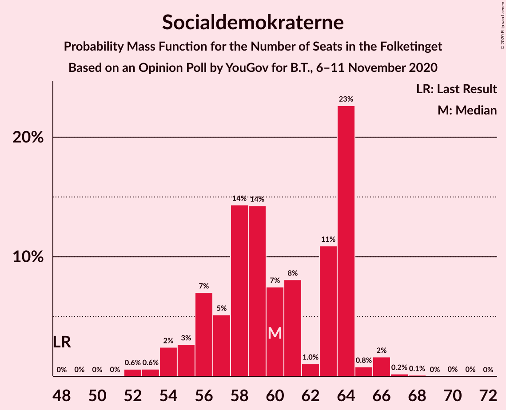
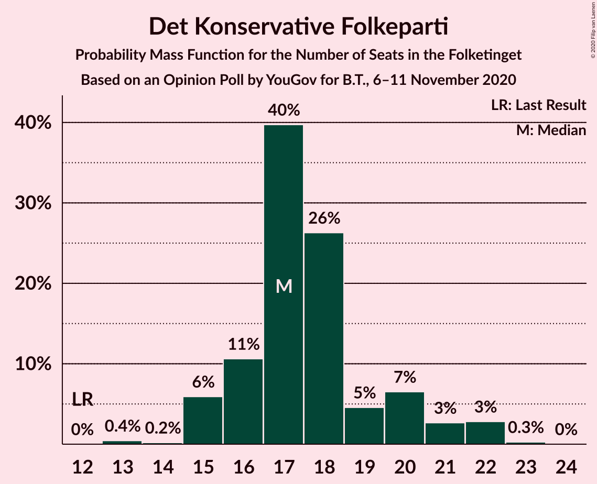
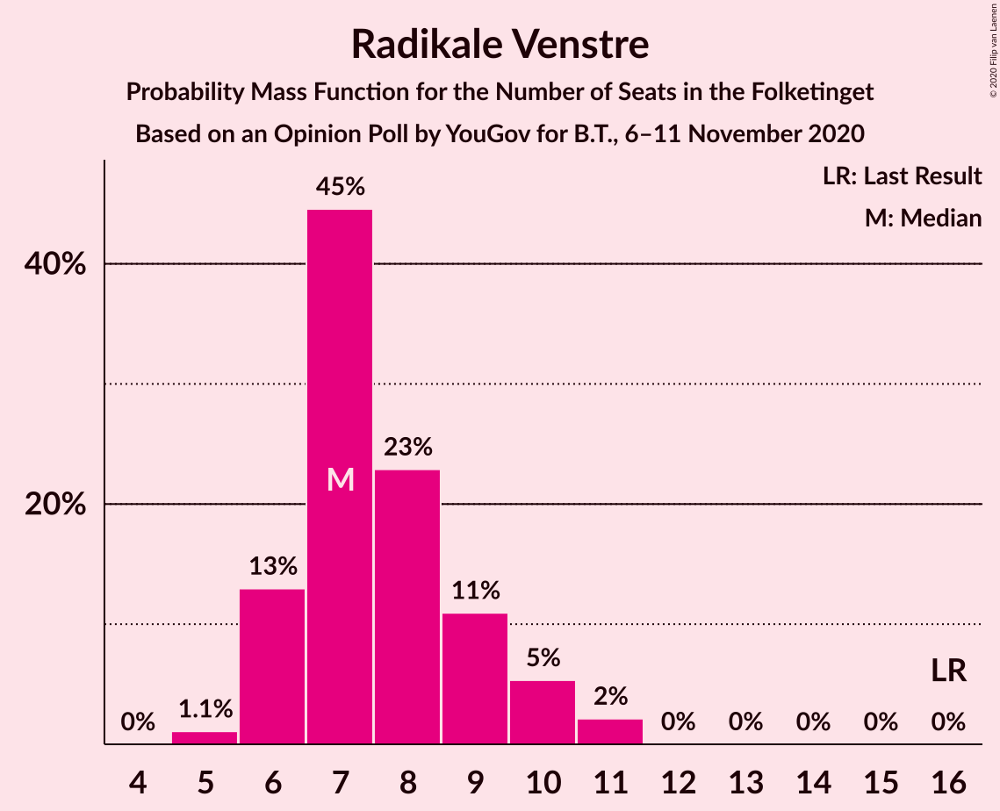
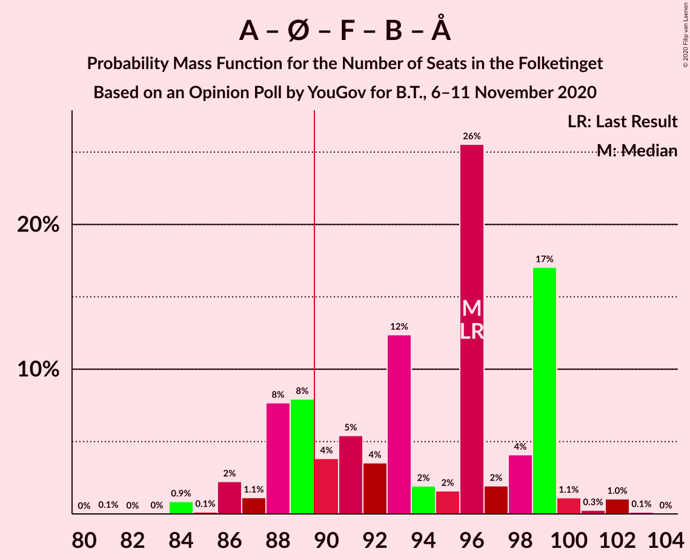
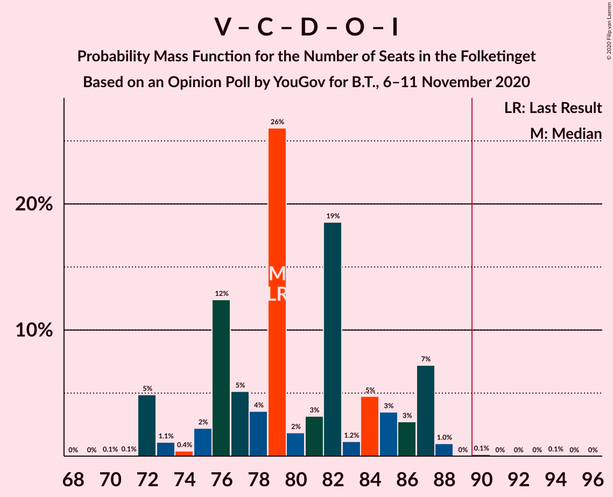

# Opinion Poll by YouGov for B.T., 6–11 November 2020

<a href="#voting-intentions">Voting Intentions</a> | <a href="#seats">Seats</a> | <a href="#coalitions">Coalitions</a> | <a href="#technical-information">Technical Information</a>

## Voting Intentions

### Confidence Intervals

| Party | Last Result | Poll Result | 80% Confidence Interval | 90% Confidence Interval | 95% Confidence Interval | 99% Confidence Interval |
|:-----:|:-----------:|:-----------:|:-----------------------:|:-----------------------:|:-----------------------:|:-----------------------:|
| Socialdemokraterne | 25.9% | 33.5% | 31.8–35.3% |31.4–35.8% |31.0–36.2% |30.1–37.0% |
| Venstre | 23.4% | 15.7% | 14.4–17.1% |14.1–17.5% |13.8–17.8% |13.2–18.5% |
| Det Konservative Folkeparti | 6.6% | 10.0% | 9.0–11.2% |8.7–11.5% |8.5–11.8% |8.0–12.4% |
| Nye Borgerlige | 2.4% | 9.6% | 8.6–10.8% |8.3–11.1% |8.1–11.4% |7.6–11.9% |
| Enhedslisten–De Rød-Grønne | 6.9% | 7.8% | 6.9–8.8% |6.6–9.1% |6.4–9.4% |6.0–9.9% |
| Dansk Folkeparti | 8.7% | 6.3% | 5.5–7.3% |5.3–7.6% |5.1–7.8% |4.7–8.3% |
| Socialistisk Folkeparti | 7.7% | 6.3% | 5.5–7.3% |5.3–7.6% |5.1–7.8% |4.7–8.3% |
| Radikale Venstre | 8.6% | 4.3% | 3.7–5.2% |3.5–5.4% |3.3–5.6% |3.0–6.0% |
| Liberal Alliance | 2.3% | 2.9% | 2.3–3.6% |2.2–3.8% |2.1–4.0% |1.9–4.3% |
| Kristendemokraterne | 1.7% | 1.7% | 1.3–2.3% |1.2–2.4% |1.1–2.6% |0.9–2.9% |
| Veganerpartiet | 0.0% | 0.8% | 0.5–1.2% |0.5–1.4% |0.4–1.5% |0.3–1.7% |
| Alternativet | 3.0% | 0.6% | 0.4–0.9% |0.3–1.1% |0.3–1.2% |0.2–1.4% |
| Stram Kurs | 1.8% | 0.6% | 0.4–0.9% |0.3–1.1% |0.3–1.2% |0.2–1.4% |

*Note:* The poll result column reflects the actual value used in the calculations. Published results may vary slightly, and in addition be rounded to fewer digits.

## Seats

### Confidence Intervals

| Party | Last Result | Median | 80% Confidence Interval | 90% Confidence Interval | 95% Confidence Interval | 99% Confidence Interval |
|:-----:|:-----------:|:------:|:-----------------------:|:-----------------------:|:-----------------------:|:-----------------------:|
| <a href="#socialdemokraterne">Socialdemokraterne</a> | 48 | 60 | 56–64 |55–64 |54–65 |52–66 |
| <a href="#venstre">Venstre</a> | 43 | 29 | 26–34 |24–34 |24–34 |23–34 |
| <a href="#det-konservative-folkeparti">Det Konservative Folkeparti</a> | 12 | 17 | 16–20 |15–21 |15–22 |14–22 |
| <a href="#nye-borgerlige">Nye Borgerlige</a> | 4 | 16 | 14–20 |13–21 |13–21 |13–21 |
| <a href="#enhedslisten–de-rød-grønne">Enhedslisten–De Rød-Grønne</a> | 13 | 15 | 13–18 |12–19 |11–19 |10–20 |
| <a href="#dansk-folkeparti">Dansk Folkeparti</a> | 16 | 10 | 9–14 |9–14 |9–14 |8–15 |
| <a href="#socialistisk-folkeparti">Socialistisk Folkeparti</a> | 14 | 11 | 10–14 |10–14 |10–15 |10–16 |
| <a href="#radikale-venstre">Radikale Venstre</a> | 16 | 7 | 6–9 |6–10 |6–10 |5–11 |
| <a href="#liberal-alliance">Liberal Alliance</a> | 4 | 5 | 4–7 |4–7 |4–8 |0–8 |
| <a href="#kristendemokraterne">Kristendemokraterne</a> | 0 | 0 | 0–4 |0–4 |0–5 |0–5 |
| <a href="#veganerpartiet">Veganerpartiet</a> | 0 | 0 | 0 |0 |0 |0 |
| <a href="#alternativet">Alternativet</a> | 5 | 0 | 0 |0 |0 |0 |
| <a href="#stram-kurs">Stram Kurs</a> | 0 | 0 | 0 |0 |0 |0 |

### Socialdemokraterne

*For a full overview of the results for this party, see the [Socialdemokraterne](party-socialdemokraterne.html) page.*

| Number of Seats | Probability | Accumulated | Special Marks |
|:---------------:|:-----------:|:-----------:|:-------------:|
| 48 | 0% | 100% | Last Result |
| 49 | 0% | 100% |  |
| 50 | 0% | 100% |  |
| 51 | 0% | 100% |  |
| 52 | 0.6% | 100% |  |
| 53 | 0.6% | 99.4% |  |
| 54 | 2% | 98.8% |  |
| 55 | 3% | 96% |  |
| 56 | 7% | 94% |  |
| 57 | 5% | 87% |  |
| 58 | 14% | 82% |  |
| 59 | 14% | 67% |  |
| 60 | 7% | 53% | Median |
| 61 | 8% | 45% |  |
| 62 | 1.0% | 37% |  |
| 63 | 11% | 36% |  |
| 64 | 23% | 25% |  |
| 65 | 0.8% | 3% |  |
| 66 | 2% | 2% |  |
| 67 | 0.2% | 0.4% |  |
| 68 | 0.1% | 0.2% |  |
| 69 | 0% | 0.1% |  |
| 70 | 0% | 0.1% |  |
| 71 | 0% | 0% |  |

### Venstre

*For a full overview of the results for this party, see the [Venstre](party-venstre.html) page.*

| Number of Seats | Probability | Accumulated | Special Marks |
|:---------------:|:-----------:|:-----------:|:-------------:|
| 23 | 1.3% | 100% |  |
| 24 | 4% | 98.7% |  |
| 25 | 3% | 94% |  |
| 26 | 5% | 91% |  |
| 27 | 6% | 86% |  |
| 28 | 23% | 81% |  |
| 29 | 10% | 58% | Median |
| 30 | 2% | 47% |  |
| 31 | 9% | 45% |  |
| 32 | 1.4% | 36% |  |
| 33 | 23% | 35% |  |
| 34 | 11% | 11% |  |
| 35 | 0% | 0% |  |
| 36 | 0% | 0% |  |
| 37 | 0% | 0% |  |
| 38 | 0% | 0% |  |
| 39 | 0% | 0% |  |
| 40 | 0% | 0% |  |
| 41 | 0% | 0% |  |
| 42 | 0% | 0% |  |
| 43 | 0% | 0% | Last Result |

### Det Konservative Folkeparti

*For a full overview of the results for this party, see the [Det Konservative Folkeparti](party-detkonservativefolkeparti.html) page.*

| Number of Seats | Probability | Accumulated | Special Marks |
|:---------------:|:-----------:|:-----------:|:-------------:|
| 12 | 0% | 100% | Last Result |
| 13 | 0.4% | 100% |  |
| 14 | 0.2% | 99.6% |  |
| 15 | 6% | 99.4% |  |
| 16 | 11% | 93% |  |
| 17 | 40% | 83% | Median |
| 18 | 26% | 43% |  |
| 19 | 5% | 17% |  |
| 20 | 7% | 12% |  |
| 21 | 3% | 6% |  |
| 22 | 3% | 3% |  |
| 23 | 0.3% | 0.3% |  |
| 24 | 0% | 0% |  |

### Nye Borgerlige

*For a full overview of the results for this party, see the [Nye Borgerlige](party-nyeborgerlige.html) page.*

| Number of Seats | Probability | Accumulated | Special Marks |
|:---------------:|:-----------:|:-----------:|:-------------:|
| 4 | 0% | 100% | Last Result |
| 5 | 0% | 100% |  |
| 6 | 0% | 100% |  |
| 7 | 0% | 100% |  |
| 8 | 0% | 100% |  |
| 9 | 0% | 100% |  |
| 10 | 0% | 100% |  |
| 11 | 0% | 100% |  |
| 12 | 0% | 100% |  |
| 13 | 6% | 100% |  |
| 14 | 15% | 93% |  |
| 15 | 3% | 79% |  |
| 16 | 36% | 76% | Median |
| 17 | 5% | 40% |  |
| 18 | 5% | 35% |  |
| 19 | 9% | 30% |  |
| 20 | 13% | 21% |  |
| 21 | 8% | 8% |  |
| 22 | 0.2% | 0.5% |  |
| 23 | 0.2% | 0.3% |  |
| 24 | 0.1% | 0.1% |  |
| 25 | 0% | 0% |  |

### Enhedslisten–De Rød-Grønne

*For a full overview of the results for this party, see the [Enhedslisten–De Rød-Grønne](party-enhedslisten–derød-grønne.html) page.*

| Number of Seats | Probability | Accumulated | Special Marks |
|:---------------:|:-----------:|:-----------:|:-------------:|
| 10 | 0.8% | 100% |  |
| 11 | 3% | 99.2% |  |
| 12 | 6% | 96% |  |
| 13 | 10% | 90% | Last Result |
| 14 | 10% | 80% |  |
| 15 | 45% | 70% | Median |
| 16 | 9% | 25% |  |
| 17 | 3% | 16% |  |
| 18 | 7% | 13% |  |
| 19 | 4% | 6% |  |
| 20 | 1.2% | 1.2% |  |
| 21 | 0% | 0% |  |

### Dansk Folkeparti

*For a full overview of the results for this party, see the [Dansk Folkeparti](party-danskfolkeparti.html) page.*

| Number of Seats | Probability | Accumulated | Special Marks |
|:---------------:|:-----------:|:-----------:|:-------------:|
| 7 | 0.1% | 100% |  |
| 8 | 1.5% | 99.9% |  |
| 9 | 33% | 98% |  |
| 10 | 29% | 65% | Median |
| 11 | 7% | 36% |  |
| 12 | 8% | 30% |  |
| 13 | 8% | 22% |  |
| 14 | 11% | 13% |  |
| 15 | 2% | 2% |  |
| 16 | 0.1% | 0.1% | Last Result |
| 17 | 0% | 0% |  |

### Socialistisk Folkeparti

*For a full overview of the results for this party, see the [Socialistisk Folkeparti](party-socialistiskfolkeparti.html) page.*

| Number of Seats | Probability | Accumulated | Special Marks |
|:---------------:|:-----------:|:-----------:|:-------------:|
| 8 | 0.2% | 100% |  |
| 9 | 0.2% | 99.7% |  |
| 10 | 35% | 99.6% |  |
| 11 | 32% | 64% | Median |
| 12 | 17% | 33% |  |
| 13 | 5% | 15% |  |
| 14 | 7% | 10% | Last Result |
| 15 | 1.1% | 3% |  |
| 16 | 2% | 2% |  |
| 17 | 0.3% | 0.3% |  |
| 18 | 0% | 0% |  |

### Radikale Venstre

*For a full overview of the results for this party, see the [Radikale Venstre](party-radikalevenstre.html) page.*

| Number of Seats | Probability | Accumulated | Special Marks |
|:---------------:|:-----------:|:-----------:|:-------------:|
| 5 | 1.1% | 100% |  |
| 6 | 13% | 98.9% |  |
| 7 | 45% | 86% | Median |
| 8 | 23% | 41% |  |
| 9 | 11% | 18% |  |
| 10 | 5% | 8% |  |
| 11 | 2% | 2% |  |
| 12 | 0% | 0% |  |
| 13 | 0% | 0% |  |
| 14 | 0% | 0% |  |
| 15 | 0% | 0% |  |
| 16 | 0% | 0% | Last Result |

### Liberal Alliance

*For a full overview of the results for this party, see the [Liberal Alliance](party-liberalalliance.html) page.*

| Number of Seats | Probability | Accumulated | Special Marks |
|:---------------:|:-----------:|:-----------:|:-------------:|
| 0 | 2% | 100% |  |
| 1 | 0% | 98% |  |
| 2 | 0% | 98% |  |
| 3 | 0% | 98% |  |
| 4 | 42% | 98% | Last Result |
| 5 | 22% | 56% | Median |
| 6 | 9% | 34% |  |
| 7 | 21% | 24% |  |
| 8 | 3% | 4% |  |
| 9 | 0.2% | 0.2% |  |
| 10 | 0% | 0% |  |

### Kristendemokraterne

*For a full overview of the results for this party, see the [Kristendemokraterne](party-kristendemokraterne.html) page.*

| Number of Seats | Probability | Accumulated | Special Marks |
|:---------------:|:-----------:|:-----------:|:-------------:|
| 0 | 77% | 100% | Last Result, Median |
| 1 | 0% | 23% |  |
| 2 | 0% | 23% |  |
| 3 | 0% | 23% |  |
| 4 | 18% | 23% |  |
| 5 | 5% | 5% |  |
| 6 | 0.1% | 0.1% |  |
| 7 | 0% | 0% |  |

### Veganerpartiet

*For a full overview of the results for this party, see the [Veganerpartiet](party-veganerpartiet.html) page.*

| Number of Seats | Probability | Accumulated | Special Marks |
|:---------------:|:-----------:|:-----------:|:-------------:|
| 0 | 99.8% | 100% | Last Result, Median |
| 1 | 0% | 0.2% |  |
| 2 | 0% | 0.2% |  |
| 3 | 0% | 0.2% |  |
| 4 | 0.2% | 0.2% |  |
| 5 | 0% | 0% |  |

### Alternativet

*For a full overview of the results for this party, see the [Alternativet](party-alternativet.html) page.*

| Number of Seats | Probability | Accumulated | Special Marks |
|:---------------:|:-----------:|:-----------:|:-------------:|
| 0 | 100% | 100% | Median |
| 1 | 0% | 0% |  |
| 2 | 0% | 0% |  |
| 3 | 0% | 0% |  |
| 4 | 0% | 0% |  |
| 5 | 0% | 0% | Last Result |

### Stram Kurs

*For a full overview of the results for this party, see the [Stram Kurs](party-stramkurs.html) page.*

| Number of Seats | Probability | Accumulated | Special Marks |
|:---------------:|:-----------:|:-----------:|:-------------:|
| 0 | 100% | 100% | Last Result, Median |

## Coalitions

### Confidence Intervals

| Coalition | Last Result | Median | Majority? | 80% Confidence Interval | 90% Confidence Interval | 95% Confidence Interval | 99% Confidence Interval |
|:---------:|:-----------:|:------:|:---------:|:-----------------------:|:-----------------------:|:-----------------------:|:-----------------------:|
| Socialdemokraterne – Enhedslisten–De Rød-Grønne – Socialistisk Folkeparti – Radikale Venstre – Alternativet | 96 | 96 | 80% | 88–99 | 88–99 | 86–100 | 84–102 |
| Socialdemokraterne – Enhedslisten–De Rød-Grønne – Socialistisk Folkeparti – Radikale Venstre | 91 | 96 | 80% | 88–99 | 88–99 | 86–100 | 84–102 |
| Socialdemokraterne – Enhedslisten–De Rød-Grønne – Socialistisk Folkeparti – Alternativet | 80 | 88 | 15% | 82–90 | 80–92 | 80–92 | 76–94 |
| Socialdemokraterne – Enhedslisten–De Rød-Grønne – Socialistisk Folkeparti | 75 | 88 | 15% | 82–90 | 80–92 | 80–92 | 76–94 |
| Venstre – Det Konservative Folkeparti – Nye Borgerlige – Dansk Folkeparti – Liberal Alliance – Kristendemokraterne | 79 | 79 | 1.1% | 76–87 | 76–87 | 75–89 | 73–91 |
| Venstre – Det Konservative Folkeparti – Nye Borgerlige – Dansk Folkeparti – Liberal Alliance | 79 | 79 | 0.2% | 76–86 | 72–87 | 72–87 | 72–88 |
| Socialdemokraterne – Socialistisk Folkeparti – Radikale Venstre | 78 | 79 | 0% | 75–83 | 74–84 | 73–86 | 72–87 |
| Socialdemokraterne – Radikale Venstre | 64 | 68 | 0% | 63–71 | 63–71 | 61–72 | 60–74 |
| Venstre – Det Konservative Folkeparti – Dansk Folkeparti – Liberal Alliance – Kristendemokraterne | 75 | 63 | 0% | 62–67 | 58–69 | 57–70 | 54–72 |
| Venstre – Det Konservative Folkeparti – Dansk Folkeparti – Liberal Alliance | 75 | 63 | 0% | 59–66 | 57–66 | 57–67 | 54–69 |
| Venstre – Det Konservative Folkeparti – Liberal Alliance | 59 | 53 | 0% | 49–56 | 48–56 | 47–56 | 45–58 |
| Venstre – Det Konservative Folkeparti | 55 | 47 | 0% | 43–52 | 43–52 | 41–52 | 40–52 |
| Venstre | 43 | 29 | 0% | 26–34 | 24–34 | 24–34 | 23–34 |

### Socialdemokraterne – Enhedslisten–De Rød-Grønne – Socialistisk Folkeparti – Radikale Venstre – Alternativet

| Number of Seats | Probability | Accumulated | Special Marks |
|:---------------:|:-----------:|:-----------:|:-------------:|
| 81 | 0.1% | 100% |  |
| 82 | 0% | 99.9% |  |
| 83 | 0% | 99.9% |  |
| 84 | 0.9% | 99.9% |  |
| 85 | 0.1% | 99.0% |  |
| 86 | 2% | 98.9% |  |
| 87 | 1.1% | 97% |  |
| 88 | 8% | 96% |  |
| 89 | 8% | 88% |  |
| 90 | 4% | 80% | Majority |
| 91 | 5% | 76% |  |
| 92 | 4% | 71% |  |
| 93 | 12% | 67% | Median |
| 94 | 2% | 55% |  |
| 95 | 2% | 53% |  |
| 96 | 26% | 51% | Last Result |
| 97 | 2% | 26% |  |
| 98 | 4% | 24% |  |
| 99 | 17% | 20% |  |
| 100 | 1.1% | 3% |  |
| 101 | 0.3% | 1.5% |  |
| 102 | 1.0% | 1.2% |  |
| 103 | 0.1% | 0.2% |  |
| 104 | 0% | 0% |  |

### Socialdemokraterne – Enhedslisten–De Rød-Grønne – Socialistisk Folkeparti – Radikale Venstre

| Number of Seats | Probability | Accumulated | Special Marks |
|:---------------:|:-----------:|:-----------:|:-------------:|
| 81 | 0.1% | 100% |  |
| 82 | 0% | 99.9% |  |
| 83 | 0% | 99.9% |  |
| 84 | 0.9% | 99.9% |  |
| 85 | 0.1% | 99.0% |  |
| 86 | 2% | 98.9% |  |
| 87 | 1.1% | 97% |  |
| 88 | 8% | 96% |  |
| 89 | 8% | 88% |  |
| 90 | 4% | 80% | Majority |
| 91 | 5% | 76% | Last Result |
| 92 | 4% | 71% |  |
| 93 | 12% | 67% | Median |
| 94 | 2% | 55% |  |
| 95 | 2% | 53% |  |
| 96 | 26% | 51% |  |
| 97 | 2% | 26% |  |
| 98 | 4% | 24% |  |
| 99 | 17% | 20% |  |
| 100 | 1.1% | 3% |  |
| 101 | 0.3% | 1.5% |  |
| 102 | 1.0% | 1.2% |  |
| 103 | 0.1% | 0.2% |  |
| 104 | 0% | 0% |  |

### Socialdemokraterne – Enhedslisten–De Rød-Grønne – Socialistisk Folkeparti – Alternativet

| Number of Seats | Probability | Accumulated | Special Marks |
|:---------------:|:-----------:|:-----------:|:-------------:|
| 75 | 0.1% | 100% |  |
| 76 | 0.6% | 99.9% |  |
| 77 | 0.3% | 99.3% |  |
| 78 | 0.5% | 99.0% |  |
| 79 | 0.9% | 98.5% |  |
| 80 | 5% | 98% | Last Result |
| 81 | 2% | 93% |  |
| 82 | 14% | 91% |  |
| 83 | 2% | 77% |  |
| 84 | 5% | 75% |  |
| 85 | 13% | 70% |  |
| 86 | 2% | 57% | Median |
| 87 | 3% | 55% |  |
| 88 | 5% | 53% |  |
| 89 | 32% | 47% |  |
| 90 | 5% | 15% | Majority |
| 91 | 0.3% | 10% |  |
| 92 | 8% | 10% |  |
| 93 | 0.1% | 1.4% |  |
| 94 | 1.1% | 1.3% |  |
| 95 | 0% | 0.2% |  |
| 96 | 0.1% | 0.2% |  |
| 97 | 0% | 0% |  |

### Socialdemokraterne – Enhedslisten–De Rød-Grønne – Socialistisk Folkeparti

| Number of Seats | Probability | Accumulated | Special Marks |
|:---------------:|:-----------:|:-----------:|:-------------:|
| 75 | 0.1% | 100% | Last Result |
| 76 | 0.6% | 99.9% |  |
| 77 | 0.3% | 99.3% |  |
| 78 | 0.5% | 99.0% |  |
| 79 | 0.9% | 98.5% |  |
| 80 | 5% | 98% |  |
| 81 | 2% | 93% |  |
| 82 | 14% | 91% |  |
| 83 | 2% | 77% |  |
| 84 | 5% | 75% |  |
| 85 | 13% | 70% |  |
| 86 | 2% | 57% | Median |
| 87 | 3% | 55% |  |
| 88 | 5% | 53% |  |
| 89 | 32% | 47% |  |
| 90 | 5% | 15% | Majority |
| 91 | 0.3% | 10% |  |
| 92 | 8% | 10% |  |
| 93 | 0.1% | 1.4% |  |
| 94 | 1.1% | 1.3% |  |
| 95 | 0% | 0.2% |  |
| 96 | 0.1% | 0.2% |  |
| 97 | 0% | 0% |  |

### Venstre – Det Konservative Folkeparti – Nye Borgerlige – Dansk Folkeparti – Liberal Alliance – Kristendemokraterne

| Number of Seats | Probability | Accumulated | Special Marks |
|:---------------:|:-----------:|:-----------:|:-------------:|
| 72 | 0.1% | 100% |  |
| 73 | 1.0% | 99.8% |  |
| 74 | 0.3% | 98.8% |  |
| 75 | 1.3% | 98.5% |  |
| 76 | 17% | 97% |  |
| 77 | 4% | 80% | Median |
| 78 | 2% | 76% |  |
| 79 | 25% | 74% | Last Result |
| 80 | 2% | 49% |  |
| 81 | 2% | 47% |  |
| 82 | 12% | 45% |  |
| 83 | 4% | 33% |  |
| 84 | 5% | 29% |  |
| 85 | 4% | 24% |  |
| 86 | 8% | 20% |  |
| 87 | 8% | 12% |  |
| 88 | 1.1% | 4% |  |
| 89 | 2% | 3% |  |
| 90 | 0.1% | 1.1% | Majority |
| 91 | 0.9% | 1.0% |  |
| 92 | 0% | 0.1% |  |
| 93 | 0% | 0.1% |  |
| 94 | 0.1% | 0.1% |  |
| 95 | 0% | 0% |  |

### Venstre – Det Konservative Folkeparti – Nye Borgerlige – Dansk Folkeparti – Liberal Alliance

| Number of Seats | Probability | Accumulated | Special Marks |
|:---------------:|:-----------:|:-----------:|:-------------:|
| 70 | 0.1% | 100% |  |
| 71 | 0.1% | 99.9% |  |
| 72 | 5% | 99.9% |  |
| 73 | 1.1% | 95% |  |
| 74 | 0.4% | 94% |  |
| 75 | 2% | 93% |  |
| 76 | 12% | 91% |  |
| 77 | 5% | 79% | Median |
| 78 | 4% | 74% |  |
| 79 | 26% | 70% | Last Result |
| 80 | 2% | 44% |  |
| 81 | 3% | 42% |  |
| 82 | 19% | 39% |  |
| 83 | 1.2% | 21% |  |
| 84 | 5% | 19% |  |
| 85 | 3% | 15% |  |
| 86 | 3% | 11% |  |
| 87 | 7% | 8% |  |
| 88 | 1.0% | 1.2% |  |
| 89 | 0% | 0.2% |  |
| 90 | 0.1% | 0.2% | Majority |
| 91 | 0% | 0.1% |  |
| 92 | 0% | 0.1% |  |
| 93 | 0% | 0.1% |  |
| 94 | 0.1% | 0.1% |  |
| 95 | 0% | 0% |  |

### Socialdemokraterne – Socialistisk Folkeparti – Radikale Venstre

| Number of Seats | Probability | Accumulated | Special Marks |
|:---------------:|:-----------:|:-----------:|:-------------:|
| 69 | 0.1% | 100% |  |
| 70 | 0% | 99.9% |  |
| 71 | 0.3% | 99.9% |  |
| 72 | 0.7% | 99.6% |  |
| 73 | 2% | 98.9% |  |
| 74 | 4% | 97% |  |
| 75 | 15% | 92% |  |
| 76 | 1.2% | 77% |  |
| 77 | 6% | 76% |  |
| 78 | 15% | 70% | Last Result, Median |
| 79 | 6% | 55% |  |
| 80 | 3% | 49% |  |
| 81 | 29% | 46% |  |
| 82 | 1.2% | 16% |  |
| 83 | 6% | 15% |  |
| 84 | 5% | 9% |  |
| 85 | 1.5% | 4% |  |
| 86 | 2% | 3% |  |
| 87 | 0.9% | 1.2% |  |
| 88 | 0.1% | 0.3% |  |
| 89 | 0.2% | 0.2% |  |
| 90 | 0% | 0% | Majority |

### Socialdemokraterne – Radikale Venstre

| Number of Seats | Probability | Accumulated | Special Marks |
|:---------------:|:-----------:|:-----------:|:-------------:|
| 59 | 0.2% | 100% |  |
| 60 | 0.9% | 99.8% |  |
| 61 | 1.5% | 98.9% |  |
| 62 | 1.5% | 97% |  |
| 63 | 9% | 96% |  |
| 64 | 10% | 87% | Last Result |
| 65 | 5% | 77% |  |
| 66 | 1.1% | 73% |  |
| 67 | 21% | 71% | Median |
| 68 | 2% | 50% |  |
| 69 | 7% | 49% |  |
| 70 | 10% | 42% |  |
| 71 | 28% | 32% |  |
| 72 | 1.5% | 4% |  |
| 73 | 0.4% | 2% |  |
| 74 | 2% | 2% |  |
| 75 | 0% | 0.1% |  |
| 76 | 0% | 0.1% |  |
| 77 | 0% | 0.1% |  |
| 78 | 0% | 0% |  |

### Venstre – Det Konservative Folkeparti – Dansk Folkeparti – Liberal Alliance – Kristendemokraterne

| Number of Seats | Probability | Accumulated | Special Marks |
|:---------------:|:-----------:|:-----------:|:-------------:|
| 54 | 1.0% | 100% |  |
| 55 | 0% | 99.0% |  |
| 56 | 0% | 98.9% |  |
| 57 | 3% | 98.9% |  |
| 58 | 1.5% | 95% |  |
| 59 | 0.5% | 94% |  |
| 60 | 0.4% | 93% |  |
| 61 | 3% | 93% | Median |
| 62 | 11% | 90% |  |
| 63 | 31% | 80% |  |
| 64 | 5% | 48% |  |
| 65 | 3% | 43% |  |
| 66 | 29% | 40% |  |
| 67 | 2% | 11% |  |
| 68 | 3% | 10% |  |
| 69 | 2% | 7% |  |
| 70 | 2% | 5% |  |
| 71 | 0.5% | 2% |  |
| 72 | 2% | 2% |  |
| 73 | 0% | 0.1% |  |
| 74 | 0.1% | 0.1% |  |
| 75 | 0% | 0% | Last Result |

### Venstre – Det Konservative Folkeparti – Dansk Folkeparti – Liberal Alliance

| Number of Seats | Probability | Accumulated | Special Marks |
|:---------------:|:-----------:|:-----------:|:-------------:|
| 54 | 1.0% | 100% |  |
| 55 | 0% | 98.9% |  |
| 56 | 0.1% | 98.9% |  |
| 57 | 4% | 98.8% |  |
| 58 | 2% | 95% |  |
| 59 | 6% | 93% |  |
| 60 | 1.0% | 87% |  |
| 61 | 4% | 86% | Median |
| 62 | 15% | 82% |  |
| 63 | 27% | 66% |  |
| 64 | 7% | 39% |  |
| 65 | 2% | 32% |  |
| 66 | 26% | 30% |  |
| 67 | 3% | 5% |  |
| 68 | 1.2% | 2% |  |
| 69 | 0.2% | 0.7% |  |
| 70 | 0.2% | 0.4% |  |
| 71 | 0.1% | 0.2% |  |
| 72 | 0% | 0.1% |  |
| 73 | 0% | 0.1% |  |
| 74 | 0.1% | 0.1% |  |
| 75 | 0% | 0% | Last Result |

### Venstre – Det Konservative Folkeparti – Liberal Alliance

| Number of Seats | Probability | Accumulated | Special Marks |
|:---------------:|:-----------:|:-----------:|:-------------:|
| 44 | 0.3% | 100% |  |
| 45 | 0.3% | 99.7% |  |
| 46 | 1.4% | 99.4% |  |
| 47 | 2% | 98% |  |
| 48 | 6% | 96% |  |
| 49 | 4% | 90% |  |
| 50 | 12% | 86% |  |
| 51 | 7% | 75% | Median |
| 52 | 16% | 68% |  |
| 53 | 8% | 51% |  |
| 54 | 23% | 44% |  |
| 55 | 4% | 21% |  |
| 56 | 15% | 17% |  |
| 57 | 1.5% | 2% |  |
| 58 | 0.2% | 0.5% |  |
| 59 | 0.1% | 0.3% | Last Result |
| 60 | 0.2% | 0.2% |  |
| 61 | 0% | 0% |  |

### Venstre – Det Konservative Folkeparti

| Number of Seats | Probability | Accumulated | Special Marks |
|:---------------:|:-----------:|:-----------:|:-------------:|
| 38 | 0.2% | 100% |  |
| 39 | 0.1% | 99.8% |  |
| 40 | 0.5% | 99.7% |  |
| 41 | 3% | 99.2% |  |
| 42 | 0.7% | 96% |  |
| 43 | 8% | 95% |  |
| 44 | 8% | 88% |  |
| 45 | 14% | 79% |  |
| 46 | 5% | 65% | Median |
| 47 | 15% | 61% |  |
| 48 | 4% | 46% |  |
| 49 | 1.4% | 42% |  |
| 50 | 26% | 40% |  |
| 51 | 1.5% | 15% |  |
| 52 | 13% | 13% |  |
| 53 | 0% | 0.3% |  |
| 54 | 0.1% | 0.2% |  |
| 55 | 0.1% | 0.1% | Last Result |
| 56 | 0% | 0% |  |

### Venstre

| Number of Seats | Probability | Accumulated | Special Marks |
|:---------------:|:-----------:|:-----------:|:-------------:|
| 23 | 1.3% | 100% |  |
| 24 | 4% | 98.7% |  |
| 25 | 3% | 94% |  |
| 26 | 5% | 91% |  |
| 27 | 6% | 86% |  |
| 28 | 23% | 81% |  |
| 29 | 10% | 58% | Median |
| 30 | 2% | 47% |  |
| 31 | 9% | 45% |  |
| 32 | 1.4% | 36% |  |
| 33 | 23% | 35% |  |
| 34 | 11% | 11% |  |
| 35 | 0% | 0% |  |
| 36 | 0% | 0% |  |
| 37 | 0% | 0% |  |
| 38 | 0% | 0% |  |
| 39 | 0% | 0% |  |
| 40 | 0% | 0% |  |
| 41 | 0% | 0% |  |
| 42 | 0% | 0% |  |
| 43 | 0% | 0% | Last Result |

## Technical Information

### Opinion Poll

+ **Polling firm:** YouGov
+ **Commissioner(s):** B.T.
+ **Fieldwork period:** 6–11 November 2020

### Calculations

+ **Sample size:** 1250
+ **Simulations done:** 1,048,576
+ **Error estimate:** 3.54%

