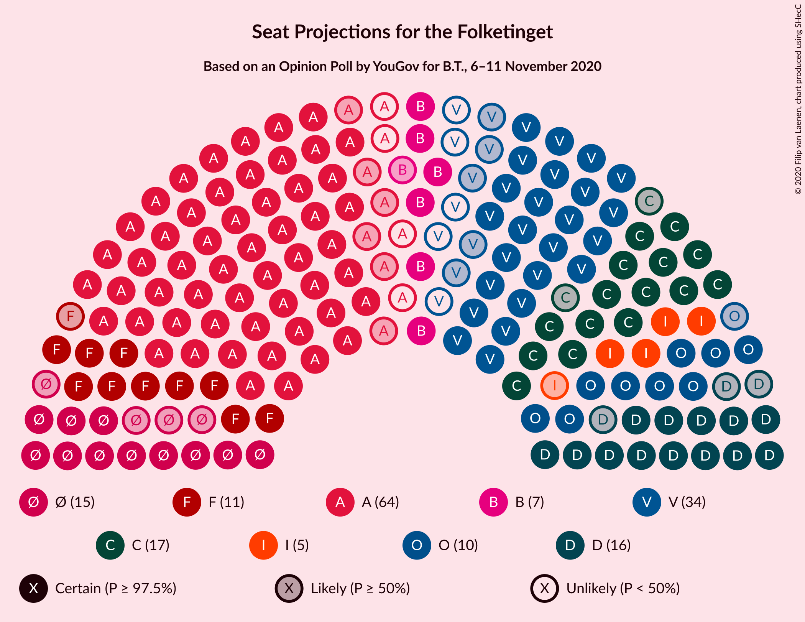
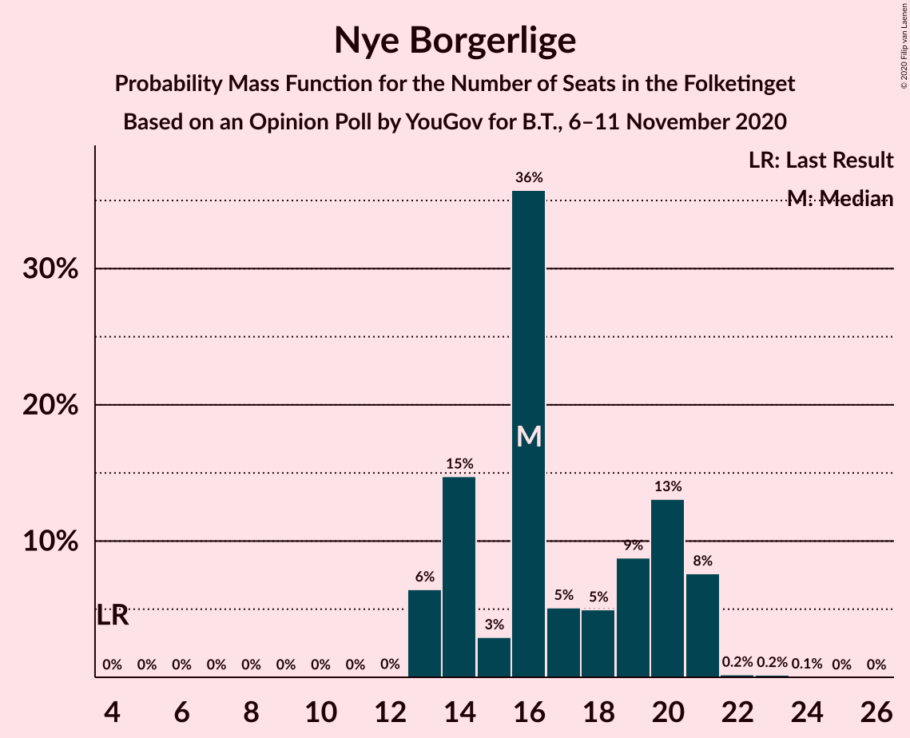
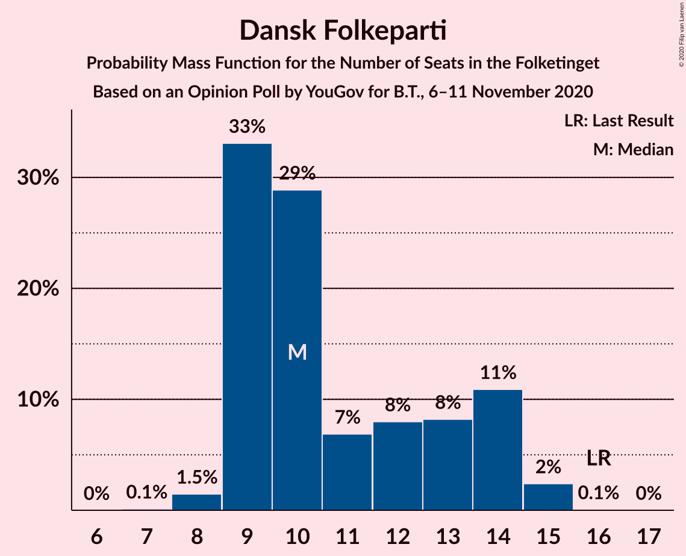
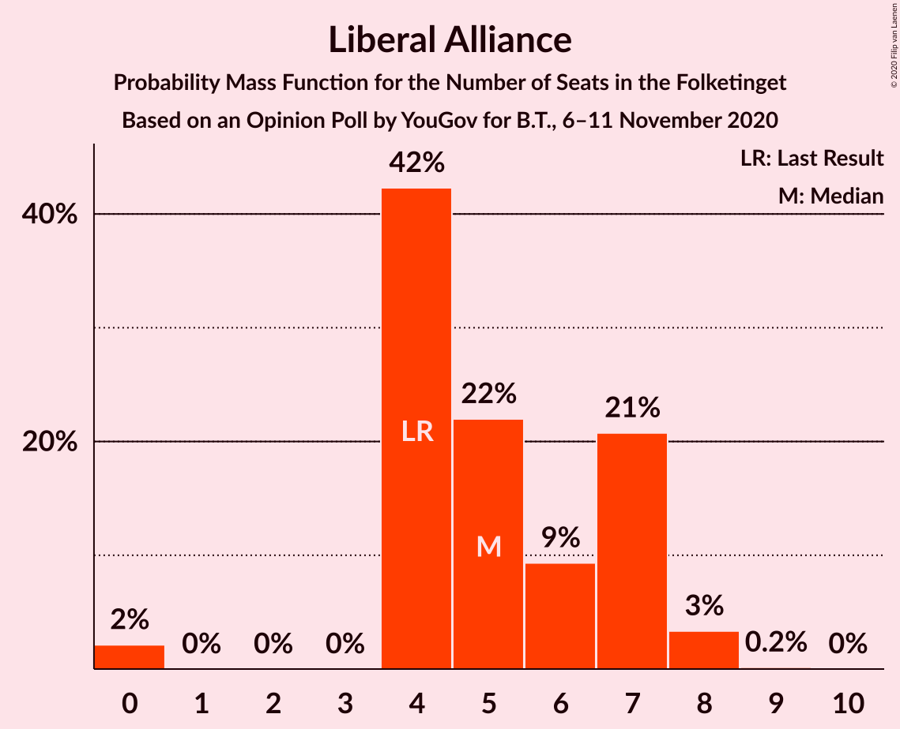
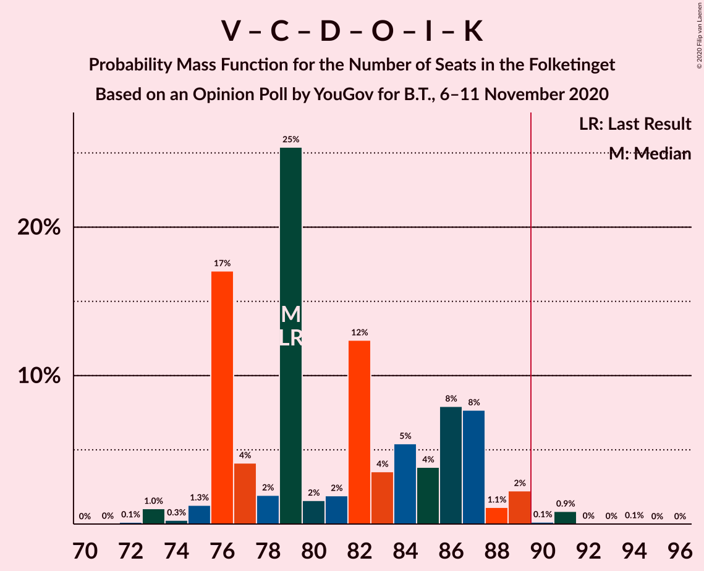
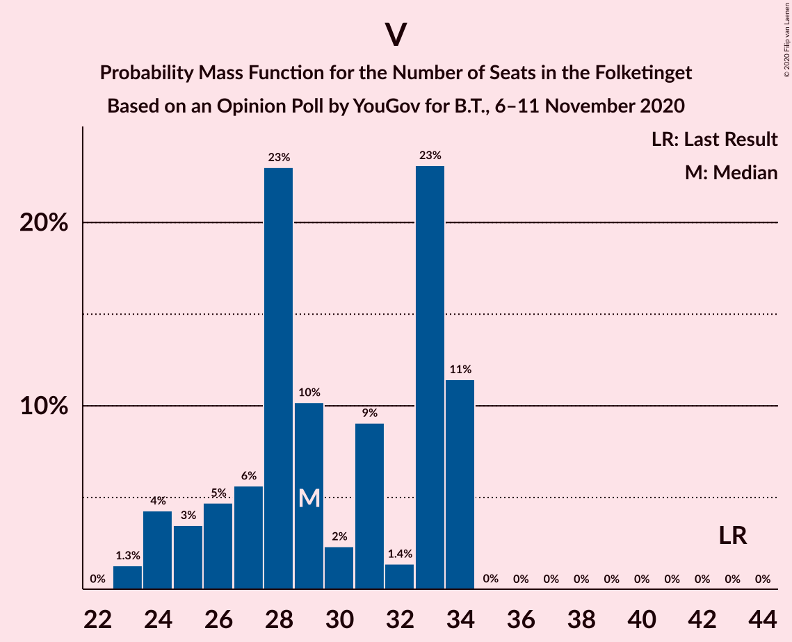

# Opinion Poll by YouGov for B.T., 6–11 November 2020

<a href="#voting-intentions">Voting Intentions</a> | <a href="#seats">Seats</a> | <a href="#coalitions">Coalitions</a> | <a href="#technical-information">Technical Information</a>

## Voting Intentions

### Confidence Intervals

| Party | Last Result | Poll Result | 80% Confidence Interval | 90% Confidence Interval | 95% Confidence Interval | 99% Confidence Interval |
|:-----:|:-----------:|:-----------:|:-----------------------:|:-----------------------:|:-----------------------:|:-----------------------:|
| Socialdemokraterne | 25.9% | 33.5% | 31.8–35.3% |31.4–35.8% |31.0–36.2% |30.1–37.0% |
| Venstre | 23.4% | 15.7% | 14.4–17.1% |14.1–17.5% |13.8–17.8% |13.2–18.5% |
| Det Konservative Folkeparti | 6.6% | 10.0% | 9.0–11.2% |8.7–11.5% |8.5–11.8% |8.0–12.4% |
| Nye Borgerlige | 2.4% | 9.6% | 8.6–10.8% |8.3–11.1% |8.1–11.4% |7.6–11.9% |
| Enhedslisten–De Rød-Grønne | 6.9% | 7.8% | 6.9–8.8% |6.6–9.1% |6.4–9.4% |6.0–9.9% |
| Dansk Folkeparti | 8.7% | 6.3% | 5.5–7.3% |5.3–7.6% |5.1–7.8% |4.7–8.3% |
| Socialistisk Folkeparti | 7.7% | 6.3% | 5.5–7.3% |5.3–7.6% |5.1–7.8% |4.7–8.3% |
| Radikale Venstre | 8.6% | 4.3% | 3.7–5.2% |3.5–5.4% |3.3–5.6% |3.0–6.0% |
| Liberal Alliance | 2.3% | 2.9% | 2.3–3.6% |2.2–3.8% |2.1–4.0% |1.9–4.3% |
| Kristendemokraterne | 1.7% | 1.7% | 1.3–2.3% |1.2–2.4% |1.1–2.6% |0.9–2.9% |
| Veganerpartiet | 0.0% | 0.8% | 0.5–1.2% |0.5–1.4% |0.4–1.5% |0.3–1.7% |
| Alternativet | 3.0% | 0.6% | 0.4–0.9% |0.3–1.1% |0.3–1.2% |0.2–1.4% |
| Stram Kurs | 1.8% | 0.6% | 0.4–0.9% |0.3–1.1% |0.3–1.2% |0.2–1.4% |

*Note:* The poll result column reflects the actual value used in the calculations. Published results may vary slightly, and in addition be rounded to fewer digits.

## Seats

### Confidence Intervals

| Party | Last Result | Median | 80% Confidence Interval | 90% Confidence Interval | 95% Confidence Interval | 99% Confidence Interval |
|:-----:|:-----------:|:------:|:-----------------------:|:-----------------------:|:-----------------------:|:-----------------------:|
| <a href="#socialdemokraterne">Socialdemokraterne</a> | 48 | 61 | 58–63 |58–64 |58–64 |58–65 |
| <a href="#venstre">Venstre</a> | 43 | 28 | 24–29 |23–29 |23–29 |23–30 |
| <a href="#det-konservative-folkeparti">Det Konservative Folkeparti</a> | 12 | 17 | 17–20 |17–20 |17–20 |15–20 |
| <a href="#nye-borgerlige">Nye Borgerlige</a> | 4 | 14 | 13–19 |13–19 |13–19 |13–20 |
| <a href="#enhedslisten–de-rød-grønne">Enhedslisten–De Rød-Grønne</a> | 13 | 16 | 15–19 |15–19 |15–19 |12–19 |
| <a href="#dansk-folkeparti">Dansk Folkeparti</a> | 16 | 10 | 9–10 |8–10 |8–10 |8–14 |
| <a href="#socialistisk-folkeparti">Socialistisk Folkeparti</a> | 14 | 12 | 11–14 |11–14 |11–14 |11–14 |
| <a href="#radikale-venstre">Radikale Venstre</a> | 16 | 9 | 7–10 |7–11 |7–11 |7–11 |
| <a href="#liberal-alliance">Liberal Alliance</a> | 4 | 5 | 4–7 |4–7 |4–7 |4–7 |
| <a href="#kristendemokraterne">Kristendemokraterne</a> | 0 | 0 | 0–4 |0–4 |0–4 |0–4 |
| <a href="#veganerpartiet">Veganerpartiet</a> | 0 | 0 | 0 |0 |0 |0 |
| <a href="#alternativet">Alternativet</a> | 5 | 0 | 0 |0 |0 |0 |
| <a href="#stram-kurs">Stram Kurs</a> | 0 | 0 | 0 |0 |0 |0 |

### Socialdemokraterne

*For a full overview of the results for this party, see the [Socialdemokraterne](party-socialdemokraterne.html) page.*

| Number of Seats | Probability | Accumulated | Special Marks |
|:---------------:|:-----------:|:-----------:|:-------------:|
| 48 | 0% | 100% | Last Result |
| 49 | 0% | 100% |  |
| 50 | 0% | 100% |  |
| 51 | 0% | 100% |  |
| 52 | 0% | 100% |  |
| 53 | 0% | 100% |  |
| 54 | 0% | 100% |  |
| 55 | 0.1% | 100% |  |
| 56 | 0% | 99.8% |  |
| 57 | 0% | 99.8% |  |
| 58 | 26% | 99.8% |  |
| 59 | 0.2% | 74% |  |
| 60 | 15% | 73% |  |
| 61 | 21% | 59% | Median |
| 62 | 0.4% | 37% |  |
| 63 | 31% | 37% |  |
| 64 | 5% | 6% |  |
| 65 | 0.9% | 1.1% |  |
| 66 | 0.1% | 0.2% |  |
| 67 | 0% | 0.1% |  |
| 68 | 0% | 0.1% |  |
| 69 | 0% | 0% |  |

### Venstre

*For a full overview of the results for this party, see the [Venstre](party-venstre.html) page.*

| Number of Seats | Probability | Accumulated | Special Marks |
|:---------------:|:-----------:|:-----------:|:-------------:|
| 22 | 0.1% | 100% |  |
| 23 | 5% | 99.9% |  |
| 24 | 14% | 94% |  |
| 25 | 0.1% | 80% |  |
| 26 | 0.1% | 80% |  |
| 27 | 0.3% | 80% |  |
| 28 | 53% | 80% | Median |
| 29 | 26% | 27% |  |
| 30 | 0.5% | 0.9% |  |
| 31 | 0.1% | 0.3% |  |
| 32 | 0.1% | 0.2% |  |
| 33 | 0.1% | 0.1% |  |
| 34 | 0% | 0% |  |
| 35 | 0% | 0% |  |
| 36 | 0% | 0% |  |
| 37 | 0% | 0% |  |
| 38 | 0% | 0% |  |
| 39 | 0% | 0% |  |
| 40 | 0% | 0% |  |
| 41 | 0% | 0% |  |
| 42 | 0% | 0% |  |
| 43 | 0% | 0% | Last Result |

### Det Konservative Folkeparti

*For a full overview of the results for this party, see the [Det Konservative Folkeparti](party-detkonservativefolkeparti.html) page.*

| Number of Seats | Probability | Accumulated | Special Marks |
|:---------------:|:-----------:|:-----------:|:-------------:|
| 12 | 0% | 100% | Last Result |
| 13 | 0.3% | 100% |  |
| 14 | 0.1% | 99.7% |  |
| 15 | 0.8% | 99.6% |  |
| 16 | 0.7% | 98.8% |  |
| 17 | 52% | 98% | Median |
| 18 | 31% | 46% |  |
| 19 | 0.4% | 15% |  |
| 20 | 14% | 15% |  |
| 21 | 0.1% | 0.1% |  |
| 22 | 0% | 0% |  |

### Nye Borgerlige

*For a full overview of the results for this party, see the [Nye Borgerlige](party-nyeborgerlige.html) page.*

| Number of Seats | Probability | Accumulated | Special Marks |
|:---------------:|:-----------:|:-----------:|:-------------:|
| 4 | 0% | 100% | Last Result |
| 5 | 0% | 100% |  |
| 6 | 0% | 100% |  |
| 7 | 0% | 100% |  |
| 8 | 0% | 100% |  |
| 9 | 0% | 100% |  |
| 10 | 0% | 100% |  |
| 11 | 0% | 100% |  |
| 12 | 0% | 100% |  |
| 13 | 22% | 100% |  |
| 14 | 57% | 78% | Median |
| 15 | 0.4% | 21% |  |
| 16 | 0.2% | 21% |  |
| 17 | 0.1% | 21% |  |
| 18 | 0.3% | 20% |  |
| 19 | 19% | 20% |  |
| 20 | 0.7% | 1.1% |  |
| 21 | 0.3% | 0.4% |  |
| 22 | 0% | 0.1% |  |
| 23 | 0.1% | 0.1% |  |
| 24 | 0% | 0% |  |

### Enhedslisten–De Rød-Grønne

*For a full overview of the results for this party, see the [Enhedslisten–De Rød-Grønne](party-enhedslisten–derød-grønne.html) page.*

| Number of Seats | Probability | Accumulated | Special Marks |
|:---------------:|:-----------:|:-----------:|:-------------:|
| 11 | 0.2% | 100% |  |
| 12 | 1.0% | 99.7% |  |
| 13 | 0.3% | 98.7% | Last Result |
| 14 | 0.3% | 98% |  |
| 15 | 21% | 98% |  |
| 16 | 28% | 77% | Median |
| 17 | 0.4% | 49% |  |
| 18 | 31% | 48% |  |
| 19 | 17% | 17% |  |
| 20 | 0% | 0% |  |

### Dansk Folkeparti

*For a full overview of the results for this party, see the [Dansk Folkeparti](party-danskfolkeparti.html) page.*

| Number of Seats | Probability | Accumulated | Special Marks |
|:---------------:|:-----------:|:-----------:|:-------------:|
| 7 | 0.1% | 100% |  |
| 8 | 5% | 99.9% |  |
| 9 | 36% | 95% |  |
| 10 | 58% | 59% | Median |
| 11 | 0.3% | 2% |  |
| 12 | 0.4% | 2% |  |
| 13 | 0.2% | 1.2% |  |
| 14 | 0.7% | 1.0% |  |
| 15 | 0.2% | 0.3% |  |
| 16 | 0% | 0% | Last Result |

### Socialistisk Folkeparti

*For a full overview of the results for this party, see the [Socialistisk Folkeparti](party-socialistiskfolkeparti.html) page.*

| Number of Seats | Probability | Accumulated | Special Marks |
|:---------------:|:-----------:|:-----------:|:-------------:|
| 9 | 0.1% | 100% |  |
| 10 | 0.2% | 99.9% |  |
| 11 | 31% | 99.6% |  |
| 12 | 18% | 68% | Median |
| 13 | 22% | 50% |  |
| 14 | 28% | 28% | Last Result |
| 15 | 0.1% | 0.1% |  |
| 16 | 0% | 0% |  |

### Radikale Venstre

*For a full overview of the results for this party, see the [Radikale Venstre](party-radikalevenstre.html) page.*

| Number of Seats | Probability | Accumulated | Special Marks |
|:---------------:|:-----------:|:-----------:|:-------------:|
| 5 | 0.1% | 100% |  |
| 6 | 0.1% | 99.9% |  |
| 7 | 31% | 99.8% |  |
| 8 | 6% | 69% |  |
| 9 | 32% | 63% | Median |
| 10 | 22% | 31% |  |
| 11 | 9% | 9% |  |
| 12 | 0% | 0% |  |
| 13 | 0% | 0% |  |
| 14 | 0% | 0% |  |
| 15 | 0% | 0% |  |
| 16 | 0% | 0% | Last Result |

### Liberal Alliance

*For a full overview of the results for this party, see the [Liberal Alliance](party-liberalalliance.html) page.*

| Number of Seats | Probability | Accumulated | Special Marks |
|:---------------:|:-----------:|:-----------:|:-------------:|
| 0 | 0.2% | 100% |  |
| 1 | 0% | 99.8% |  |
| 2 | 0% | 99.8% |  |
| 3 | 0% | 99.8% |  |
| 4 | 15% | 99.8% | Last Result |
| 5 | 35% | 85% | Median |
| 6 | 18% | 49% |  |
| 7 | 31% | 31% |  |
| 8 | 0% | 0% |  |

### Kristendemokraterne

*For a full overview of the results for this party, see the [Kristendemokraterne](party-kristendemokraterne.html) page.*

| Number of Seats | Probability | Accumulated | Special Marks |
|:---------------:|:-----------:|:-----------:|:-------------:|
| 0 | 78% | 100% | Last Result, Median |
| 1 | 0% | 22% |  |
| 2 | 0% | 22% |  |
| 3 | 0% | 22% |  |
| 4 | 22% | 22% |  |
| 5 | 0% | 0% |  |

### Veganerpartiet

*For a full overview of the results for this party, see the [Veganerpartiet](party-veganerpartiet.html) page.*

| Number of Seats | Probability | Accumulated | Special Marks |
|:---------------:|:-----------:|:-----------:|:-------------:|
| 0 | 100% | 100% | Last Result, Median |

### Alternativet

*For a full overview of the results for this party, see the [Alternativet](party-alternativet.html) page.*

| Number of Seats | Probability | Accumulated | Special Marks |
|:---------------:|:-----------:|:-----------:|:-------------:|
| 0 | 100% | 100% | Median |
| 1 | 0% | 0% |  |
| 2 | 0% | 0% |  |
| 3 | 0% | 0% |  |
| 4 | 0% | 0% |  |
| 5 | 0% | 0% | Last Result |

### Stram Kurs

*For a full overview of the results for this party, see the [Stram Kurs](party-stramkurs.html) page.*

| Number of Seats | Probability | Accumulated | Special Marks |
|:---------------:|:-----------:|:-----------:|:-------------:|
| 0 | 100% | 100% | Last Result, Median |

## Coalitions

### Confidence Intervals

| Coalition | Last Result | Median | Majority? | 80% Confidence Interval | 90% Confidence Interval | 95% Confidence Interval | 99% Confidence Interval |
|:---------:|:-----------:|:------:|:---------:|:-----------------------:|:-----------------------:|:-----------------------:|:-----------------------:|
| Socialdemokraterne – Enhedslisten–De Rød-Grønne – Socialistisk Folkeparti – Radikale Venstre – Alternativet | 96 | 99 | 99.9% | 98–99 | 98–101 | 98–102 | 95–102 |
| Socialdemokraterne – Enhedslisten–De Rød-Grønne – Socialistisk Folkeparti – Radikale Venstre | 91 | 99 | 99.9% | 98–99 | 98–101 | 98–102 | 95–102 |
| Socialdemokraterne – Enhedslisten–De Rød-Grønne – Socialistisk Folkeparti – Alternativet | 80 | 90 | 51% | 88–92 | 88–92 | 88–94 | 85–94 |
| Socialdemokraterne – Enhedslisten–De Rød-Grønne – Socialistisk Folkeparti | 75 | 90 | 51% | 88–92 | 88–92 | 88–94 | 85–94 |
| Socialdemokraterne – Socialistisk Folkeparti – Radikale Venstre | 78 | 83 | 0% | 79–84 | 79–85 | 79–86 | 79–86 |
| Venstre – Det Konservative Folkeparti – Nye Borgerlige – Dansk Folkeparti – Liberal Alliance – Kristendemokraterne | 79 | 76 | 0% | 76–77 | 74–77 | 73–77 | 73–80 |
| Venstre – Det Konservative Folkeparti – Nye Borgerlige – Dansk Folkeparti – Liberal Alliance | 79 | 76 | 0% | 72–77 | 72–77 | 72–77 | 72–80 |
| Socialdemokraterne – Radikale Venstre | 64 | 70 | 0% | 67–71 | 67–72 | 67–72 | 67–73 |
| Venstre – Det Konservative Folkeparti – Dansk Folkeparti – Liberal Alliance – Kristendemokraterne | 75 | 62 | 0% | 57–63 | 57–63 | 54–63 | 54–63 |
| Venstre – Det Konservative Folkeparti – Dansk Folkeparti – Liberal Alliance | 75 | 62 | 0% | 57–63 | 57–63 | 54–63 | 54–63 |
| Venstre – Det Konservative Folkeparti – Liberal Alliance | 59 | 52 | 0% | 48–53 | 46–53 | 46–53 | 44–53 |
| Venstre – Det Konservative Folkeparti | 55 | 45 | 0% | 44–47 | 41–47 | 41–47 | 38–47 |
| Venstre | 43 | 28 | 0% | 24–29 | 23–29 | 23–29 | 23–30 |

### Socialdemokraterne – Enhedslisten–De Rød-Grønne – Socialistisk Folkeparti – Radikale Venstre – Alternativet

| Number of Seats | Probability | Accumulated | Special Marks |
|:---------------:|:-----------:|:-----------:|:-------------:|
| 87 | 0% | 100% |  |
| 88 | 0% | 99.9% |  |
| 89 | 0% | 99.9% |  |
| 90 | 0% | 99.9% | Majority |
| 91 | 0% | 99.9% |  |
| 92 | 0% | 99.9% |  |
| 93 | 0.2% | 99.9% |  |
| 94 | 0% | 99.6% |  |
| 95 | 0.4% | 99.6% |  |
| 96 | 0.3% | 99.2% | Last Result |
| 97 | 0.9% | 98.9% |  |
| 98 | 17% | 98% | Median |
| 99 | 76% | 81% |  |
| 100 | 0.1% | 5% |  |
| 101 | 0.5% | 5% |  |
| 102 | 5% | 5% |  |
| 103 | 0.1% | 0.1% |  |
| 104 | 0% | 0% |  |

### Socialdemokraterne – Enhedslisten–De Rød-Grønne – Socialistisk Folkeparti – Radikale Venstre

| Number of Seats | Probability | Accumulated | Special Marks |
|:---------------:|:-----------:|:-----------:|:-------------:|
| 87 | 0% | 100% |  |
| 88 | 0% | 99.9% |  |
| 89 | 0% | 99.9% |  |
| 90 | 0% | 99.9% | Majority |
| 91 | 0% | 99.9% | Last Result |
| 92 | 0% | 99.9% |  |
| 93 | 0.2% | 99.9% |  |
| 94 | 0% | 99.6% |  |
| 95 | 0.4% | 99.6% |  |
| 96 | 0.3% | 99.2% |  |
| 97 | 0.9% | 98.9% |  |
| 98 | 17% | 98% | Median |
| 99 | 76% | 81% |  |
| 100 | 0.1% | 5% |  |
| 101 | 0.5% | 5% |  |
| 102 | 5% | 5% |  |
| 103 | 0.1% | 0.1% |  |
| 104 | 0% | 0% |  |

### Socialdemokraterne – Enhedslisten–De Rød-Grønne – Socialistisk Folkeparti – Alternativet

| Number of Seats | Probability | Accumulated | Special Marks |
|:---------------:|:-----------:|:-----------:|:-------------:|
| 79 | 0% | 100% |  |
| 80 | 0% | 99.9% | Last Result |
| 81 | 0% | 99.9% |  |
| 82 | 0% | 99.9% |  |
| 83 | 0.2% | 99.9% |  |
| 84 | 0% | 99.7% |  |
| 85 | 0.3% | 99.7% |  |
| 86 | 0.3% | 99.4% |  |
| 87 | 0.1% | 99.1% |  |
| 88 | 9% | 98.9% |  |
| 89 | 39% | 90% | Median |
| 90 | 14% | 51% | Majority |
| 91 | 0.6% | 36% |  |
| 92 | 31% | 36% |  |
| 93 | 0.2% | 5% |  |
| 94 | 5% | 5% |  |
| 95 | 0% | 0% |  |

### Socialdemokraterne – Enhedslisten–De Rød-Grønne – Socialistisk Folkeparti

| Number of Seats | Probability | Accumulated | Special Marks |
|:---------------:|:-----------:|:-----------:|:-------------:|
| 75 | 0% | 100% | Last Result |
| 76 | 0% | 100% |  |
| 77 | 0% | 100% |  |
| 78 | 0% | 100% |  |
| 79 | 0% | 100% |  |
| 80 | 0% | 99.9% |  |
| 81 | 0% | 99.9% |  |
| 82 | 0% | 99.9% |  |
| 83 | 0.2% | 99.9% |  |
| 84 | 0% | 99.7% |  |
| 85 | 0.3% | 99.7% |  |
| 86 | 0.3% | 99.4% |  |
| 87 | 0.1% | 99.1% |  |
| 88 | 9% | 98.9% |  |
| 89 | 39% | 90% | Median |
| 90 | 14% | 51% | Majority |
| 91 | 0.6% | 36% |  |
| 92 | 31% | 36% |  |
| 93 | 0.2% | 5% |  |
| 94 | 5% | 5% |  |
| 95 | 0% | 0% |  |

### Socialdemokraterne – Socialistisk Folkeparti – Radikale Venstre

| Number of Seats | Probability | Accumulated | Special Marks |
|:---------------:|:-----------:|:-----------:|:-------------:|
| 74 | 0% | 100% |  |
| 75 | 0.1% | 99.9% |  |
| 76 | 0% | 99.9% |  |
| 77 | 0% | 99.9% |  |
| 78 | 0.1% | 99.8% | Last Result |
| 79 | 17% | 99.8% |  |
| 80 | 0.2% | 83% |  |
| 81 | 31% | 82% |  |
| 82 | 0.3% | 51% | Median |
| 83 | 24% | 51% |  |
| 84 | 22% | 27% |  |
| 85 | 0.9% | 6% |  |
| 86 | 5% | 5% |  |
| 87 | 0% | 0.1% |  |
| 88 | 0% | 0% |  |

### Venstre – Det Konservative Folkeparti – Nye Borgerlige – Dansk Folkeparti – Liberal Alliance – Kristendemokraterne

| Number of Seats | Probability | Accumulated | Special Marks |
|:---------------:|:-----------:|:-----------:|:-------------:|
| 72 | 0.1% | 100% |  |
| 73 | 5% | 99.9% |  |
| 74 | 0.5% | 95% | Median |
| 75 | 0.1% | 95% |  |
| 76 | 76% | 95% |  |
| 77 | 17% | 19% |  |
| 78 | 0.9% | 2% |  |
| 79 | 0.3% | 1.1% | Last Result |
| 80 | 0.4% | 0.8% |  |
| 81 | 0% | 0.4% |  |
| 82 | 0.2% | 0.4% |  |
| 83 | 0% | 0.1% |  |
| 84 | 0% | 0.1% |  |
| 85 | 0% | 0.1% |  |
| 86 | 0% | 0.1% |  |
| 87 | 0% | 0.1% |  |
| 88 | 0% | 0.1% |  |
| 89 | 0% | 0% |  |

### Venstre – Det Konservative Folkeparti – Nye Borgerlige – Dansk Folkeparti – Liberal Alliance

| Number of Seats | Probability | Accumulated | Special Marks |
|:---------------:|:-----------:|:-----------:|:-------------:|
| 70 | 0.1% | 100% |  |
| 71 | 0% | 99.9% |  |
| 72 | 21% | 99.9% |  |
| 73 | 5% | 79% |  |
| 74 | 0.4% | 74% | Median |
| 75 | 0.2% | 74% |  |
| 76 | 55% | 74% |  |
| 77 | 17% | 19% |  |
| 78 | 1.1% | 2% |  |
| 79 | 0.3% | 0.8% | Last Result |
| 80 | 0.4% | 0.6% |  |
| 81 | 0% | 0.2% |  |
| 82 | 0.1% | 0.2% |  |
| 83 | 0% | 0.1% |  |
| 84 | 0% | 0.1% |  |
| 85 | 0% | 0% |  |

### Socialdemokraterne – Radikale Venstre

| Number of Seats | Probability | Accumulated | Special Marks |
|:---------------:|:-----------:|:-----------:|:-------------:|
| 63 | 0% | 100% |  |
| 64 | 0% | 99.9% | Last Result |
| 65 | 0.1% | 99.9% |  |
| 66 | 0% | 99.8% |  |
| 67 | 17% | 99.7% |  |
| 68 | 0% | 83% |  |
| 69 | 23% | 83% |  |
| 70 | 32% | 59% | Median |
| 71 | 21% | 27% |  |
| 72 | 5% | 6% |  |
| 73 | 1.1% | 1.3% |  |
| 74 | 0.1% | 0.2% |  |
| 75 | 0% | 0.1% |  |
| 76 | 0% | 0% |  |

### Venstre – Det Konservative Folkeparti – Dansk Folkeparti – Liberal Alliance – Kristendemokraterne

| Number of Seats | Probability | Accumulated | Special Marks |
|:---------------:|:-----------:|:-----------:|:-------------:|
| 54 | 5% | 100% |  |
| 55 | 0% | 95% |  |
| 56 | 0% | 95% |  |
| 57 | 14% | 95% |  |
| 58 | 0.8% | 81% |  |
| 59 | 0.7% | 80% |  |
| 60 | 0.2% | 80% | Median |
| 61 | 0.3% | 79% |  |
| 62 | 40% | 79% |  |
| 63 | 38% | 39% |  |
| 64 | 0.2% | 0.5% |  |
| 65 | 0% | 0.3% |  |
| 66 | 0.1% | 0.3% |  |
| 67 | 0% | 0.1% |  |
| 68 | 0% | 0.1% |  |
| 69 | 0% | 0.1% |  |
| 70 | 0% | 0.1% |  |
| 71 | 0% | 0% |  |
| 72 | 0% | 0% |  |
| 73 | 0% | 0% |  |
| 74 | 0% | 0% |  |
| 75 | 0% | 0% | Last Result |

### Venstre – Det Konservative Folkeparti – Dansk Folkeparti – Liberal Alliance

| Number of Seats | Probability | Accumulated | Special Marks |
|:---------------:|:-----------:|:-----------:|:-------------:|
| 54 | 5% | 100% |  |
| 55 | 0% | 95% |  |
| 56 | 0% | 95% |  |
| 57 | 15% | 95% |  |
| 58 | 0.8% | 81% |  |
| 59 | 22% | 80% |  |
| 60 | 0.3% | 58% | Median |
| 61 | 0.1% | 58% |  |
| 62 | 40% | 58% |  |
| 63 | 17% | 17% |  |
| 64 | 0% | 0.3% |  |
| 65 | 0% | 0.3% |  |
| 66 | 0.2% | 0.2% |  |
| 67 | 0% | 0.1% |  |
| 68 | 0% | 0% |  |
| 69 | 0% | 0% |  |
| 70 | 0% | 0% |  |
| 71 | 0% | 0% |  |
| 72 | 0% | 0% |  |
| 73 | 0% | 0% |  |
| 74 | 0% | 0% |  |
| 75 | 0% | 0% | Last Result |

### Venstre – Det Konservative Folkeparti – Liberal Alliance

| Number of Seats | Probability | Accumulated | Special Marks |
|:---------------:|:-----------:|:-----------:|:-------------:|
| 44 | 0.9% | 100% |  |
| 45 | 0.1% | 99.0% |  |
| 46 | 5% | 99.0% |  |
| 47 | 0.4% | 94% |  |
| 48 | 14% | 94% |  |
| 49 | 0.4% | 80% |  |
| 50 | 21% | 79% | Median |
| 51 | 0.1% | 58% |  |
| 52 | 40% | 58% |  |
| 53 | 17% | 18% |  |
| 54 | 0.1% | 0.3% |  |
| 55 | 0.1% | 0.2% |  |
| 56 | 0% | 0.1% |  |
| 57 | 0% | 0.1% |  |
| 58 | 0% | 0% |  |
| 59 | 0% | 0% | Last Result |

### Venstre – Det Konservative Folkeparti

| Number of Seats | Probability | Accumulated | Special Marks |
|:---------------:|:-----------:|:-----------:|:-------------:|
| 38 | 0.7% | 100% |  |
| 39 | 0.2% | 99.3% |  |
| 40 | 0% | 99.1% |  |
| 41 | 5% | 99.0% |  |
| 42 | 0.1% | 94% |  |
| 43 | 0.6% | 94% |  |
| 44 | 14% | 94% |  |
| 45 | 52% | 79% | Median |
| 46 | 0.2% | 27% |  |
| 47 | 26% | 27% |  |
| 48 | 0.1% | 0.5% |  |
| 49 | 0% | 0.4% |  |
| 50 | 0.1% | 0.3% |  |
| 51 | 0.2% | 0.2% |  |
| 52 | 0% | 0.1% |  |
| 53 | 0% | 0% |  |
| 54 | 0% | 0% |  |
| 55 | 0% | 0% | Last Result |

### Venstre

| Number of Seats | Probability | Accumulated | Special Marks |
|:---------------:|:-----------:|:-----------:|:-------------:|
| 22 | 0.1% | 100% |  |
| 23 | 5% | 99.9% |  |
| 24 | 14% | 94% |  |
| 25 | 0.1% | 80% |  |
| 26 | 0.1% | 80% |  |
| 27 | 0.3% | 80% |  |
| 28 | 53% | 80% | Median |
| 29 | 26% | 27% |  |
| 30 | 0.5% | 0.9% |  |
| 31 | 0.1% | 0.3% |  |
| 32 | 0.1% | 0.2% |  |
| 33 | 0.1% | 0.1% |  |
| 34 | 0% | 0% |  |
| 35 | 0% | 0% |  |
| 36 | 0% | 0% |  |
| 37 | 0% | 0% |  |
| 38 | 0% | 0% |  |
| 39 | 0% | 0% |  |
| 40 | 0% | 0% |  |
| 41 | 0% | 0% |  |
| 42 | 0% | 0% |  |
| 43 | 0% | 0% | Last Result |

## Technical Information

### Opinion Poll

+ **Polling firm:** YouGov
+ **Commissioner(s):** B.T.
+ **Fieldwork period:** 6–11 November 2020

### Calculations

+ **Sample size:** 1250
+ **Simulations done:** 131,072
+ **Error estimate:** 1.36%

