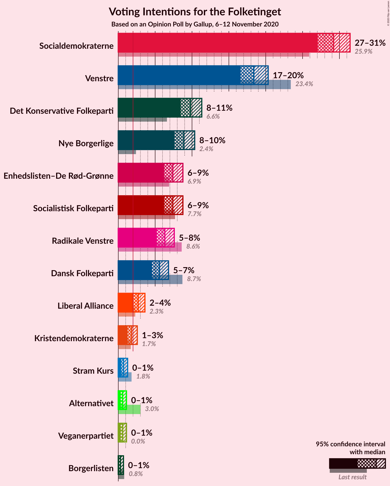
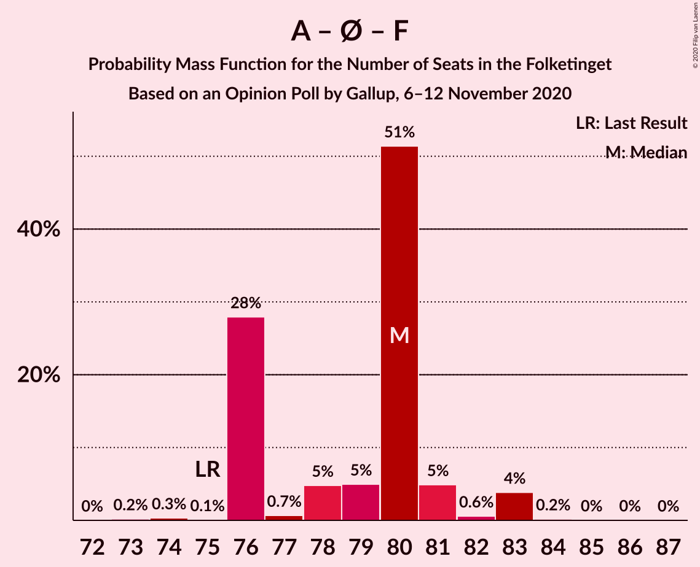

# Opinion Poll by Gallup, 6–12 November 2020

<a href="#voting-intentions">Voting Intentions</a> | <a href="#seats">Seats</a> | <a href="#coalitions">Coalitions</a> | <a href="#technical-information">Technical Information</a>

## Voting Intentions

### Confidence Intervals

| Party | Last Result | Poll Result | 80% Confidence Interval | 90% Confidence Interval | 95% Confidence Interval | 99% Confidence Interval |
|:-----:|:-----------:|:-----------:|:-----------------------:|:-----------------------:|:-----------------------:|:-----------------------:|
| Socialdemokraterne | 25.9% | 29.2% | 27.8–30.7% |27.4–31.1% |27.1–31.4% |26.4–32.2% |
| Venstre | 23.4% | 18.4% | 17.2–19.7% |16.9–20.0% |16.6–20.3% |16.0–21.0% |
| Det Konservative Folkeparti | 6.6% | 9.8% | 8.9–10.8% |8.7–11.1% |8.5–11.3% |8.0–11.8% |
| Nye Borgerlige | 2.4% | 8.9% | 8.0–9.9% |7.8–10.1% |7.6–10.4% |7.2–10.8% |
| Enhedslisten–De Rød-Grønne | 6.9% | 7.4% | 6.6–8.3% |6.4–8.5% |6.2–8.8% |5.9–9.2% |
| Socialistisk Folkeparti | 7.7% | 7.4% | 6.6–8.3% |6.4–8.5% |6.2–8.8% |5.9–9.2% |
| Radikale Venstre | 8.6% | 6.3% | 5.6–7.1% |5.4–7.4% |5.2–7.6% |4.9–8.0% |
| Dansk Folkeparti | 8.7% | 5.6% | 4.9–6.4% |4.7–6.6% |4.6–6.8% |4.3–7.2% |
| Liberal Alliance | 2.3% | 2.7% | 2.3–3.3% |2.1–3.5% |2.0–3.6% |1.8–3.9% |
| Kristendemokraterne | 1.7% | 1.8% | 1.4–2.3% |1.3–2.4% |1.3–2.6% |1.1–2.8% |
| Stram Kurs | 1.8% | 0.7% | 0.5–1.1% |0.5–1.2% |0.4–1.3% |0.3–1.4% |
| Alternativet | 3.0% | 0.6% | 0.4–0.9% |0.4–1.0% |0.3–1.1% |0.3–1.3% |
| Veganerpartiet | 0.0% | 0.6% | 0.4–0.9% |0.4–1.0% |0.3–1.1% |0.3–1.3% |
| Borgerlisten | 0.8% | 0.3% | 0.2–0.6% |0.2–0.6% |0.1–0.7% |0.1–0.9% |

*Note:* The poll result column reflects the actual value used in the calculations. Published results may vary slightly, and in addition be rounded to fewer digits.

## Seats

### Confidence Intervals

| Party | Last Result | Median | 80% Confidence Interval | 90% Confidence Interval | 95% Confidence Interval | 99% Confidence Interval |
|:-----:|:-----------:|:------:|:-----------------------:|:-----------------------:|:-----------------------:|:-----------------------:|
| <a href="#socialdemokraterne">Socialdemokraterne</a> | 48 | 53 | 51–53 |51–55 |49–55 |48–56 |
| <a href="#venstre">Venstre</a> | 43 | 37 | 33–37 |32–37 |30–37 |30–38 |
| <a href="#det-konservative-folkeparti">Det Konservative Folkeparti</a> | 12 | 17 | 17–21 |16–21 |16–21 |16–22 |
| <a href="#nye-borgerlige">Nye Borgerlige</a> | 4 | 16 | 15–16 |14–17 |14–17 |13–18 |
| <a href="#enhedslisten–de-rød-grønne">Enhedslisten–De Rød-Grønne</a> | 13 | 13 | 12–14 |12–15 |12–16 |11–16 |
| <a href="#socialistisk-folkeparti">Socialistisk Folkeparti</a> | 14 | 14 | 13–14 |12–15 |12–15 |10–16 |
| <a href="#radikale-venstre">Radikale Venstre</a> | 16 | 11 | 11–13 |11–14 |10–14 |9–14 |
| <a href="#dansk-folkeparti">Dansk Folkeparti</a> | 16 | 9 | 9–11 |9–12 |9–12 |8–13 |
| <a href="#liberal-alliance">Liberal Alliance</a> | 4 | 5 | 5 |5–6 |4–6 |4–7 |
| <a href="#kristendemokraterne">Kristendemokraterne</a> | 0 | 0 | 0–4 |0–4 |0–4 |0–5 |
| <a href="#stram-kurs">Stram Kurs</a> | 0 | 0 | 0 |0 |0 |0 |
| <a href="#alternativet">Alternativet</a> | 5 | 0 | 0 |0 |0 |0 |
| <a href="#veganerpartiet">Veganerpartiet</a> | 0 | 0 | 0 |0 |0 |0 |
| <a href="#borgerlisten">Borgerlisten</a> | 0 | 0 | 0 |0 |0 |0 |

### Socialdemokraterne

*For a full overview of the results for this party, see the [Socialdemokraterne](party-socialdemokraterne.html) page.*

| Number of Seats | Probability | Accumulated | Special Marks |
|:---------------:|:-----------:|:-----------:|:-------------:|
| 45 | 0.1% | 100% |  |
| 46 | 0% | 99.9% |  |
| 47 | 0% | 99.9% |  |
| 48 | 0.5% | 99.8% | Last Result |
| 49 | 4% | 99.4% |  |
| 50 | 0.7% | 96% |  |
| 51 | 30% | 95% |  |
| 52 | 2% | 65% |  |
| 53 | 55% | 62% | Median |
| 54 | 1.0% | 7% |  |
| 55 | 5% | 6% |  |
| 56 | 1.3% | 2% |  |
| 57 | 0.4% | 0.4% |  |
| 58 | 0% | 0% |  |

### Venstre

*For a full overview of the results for this party, see the [Venstre](party-venstre.html) page.*

| Number of Seats | Probability | Accumulated | Special Marks |
|:---------------:|:-----------:|:-----------:|:-------------:|
| 28 | 0.1% | 100% |  |
| 29 | 0% | 99.9% |  |
| 30 | 4% | 99.9% |  |
| 31 | 0.5% | 96% |  |
| 32 | 2% | 96% |  |
| 33 | 31% | 94% |  |
| 34 | 9% | 63% |  |
| 35 | 1.0% | 54% |  |
| 36 | 0.7% | 53% |  |
| 37 | 51% | 52% | Median |
| 38 | 0.6% | 1.0% |  |
| 39 | 0.4% | 0.4% |  |
| 40 | 0% | 0% |  |
| 41 | 0% | 0% |  |
| 42 | 0% | 0% |  |
| 43 | 0% | 0% | Last Result |

### Det Konservative Folkeparti

*For a full overview of the results for this party, see the [Det Konservative Folkeparti](party-detkonservativefolkeparti.html) page.*

| Number of Seats | Probability | Accumulated | Special Marks |
|:---------------:|:-----------:|:-----------:|:-------------:|
| 12 | 0% | 100% | Last Result |
| 13 | 0% | 100% |  |
| 14 | 0.1% | 100% |  |
| 15 | 0.1% | 99.9% |  |
| 16 | 6% | 99.7% |  |
| 17 | 54% | 94% | Median |
| 18 | 6% | 40% |  |
| 19 | 3% | 34% |  |
| 20 | 4% | 31% |  |
| 21 | 26% | 27% |  |
| 22 | 0.6% | 0.8% |  |
| 23 | 0.2% | 0.2% |  |
| 24 | 0% | 0% |  |

### Nye Borgerlige

*For a full overview of the results for this party, see the [Nye Borgerlige](party-nyeborgerlige.html) page.*

| Number of Seats | Probability | Accumulated | Special Marks |
|:---------------:|:-----------:|:-----------:|:-------------:|
| 4 | 0% | 100% | Last Result |
| 5 | 0% | 100% |  |
| 6 | 0% | 100% |  |
| 7 | 0% | 100% |  |
| 8 | 0% | 100% |  |
| 9 | 0% | 100% |  |
| 10 | 0% | 100% |  |
| 11 | 0% | 100% |  |
| 12 | 0.1% | 100% |  |
| 13 | 0.5% | 99.9% |  |
| 14 | 7% | 99.3% |  |
| 15 | 6% | 92% |  |
| 16 | 79% | 86% | Median |
| 17 | 5% | 6% |  |
| 18 | 1.2% | 2% |  |
| 19 | 0.2% | 0.4% |  |
| 20 | 0.1% | 0.1% |  |
| 21 | 0% | 0% |  |

### Enhedslisten–De Rød-Grønne

*For a full overview of the results for this party, see the [Enhedslisten–De Rød-Grønne](party-enhedslisten–derød-grønne.html) page.*

| Number of Seats | Probability | Accumulated | Special Marks |
|:---------------:|:-----------:|:-----------:|:-------------:|
| 11 | 0.6% | 100% |  |
| 12 | 32% | 99.4% |  |
| 13 | 53% | 68% | Last Result, Median |
| 14 | 7% | 14% |  |
| 15 | 3% | 7% |  |
| 16 | 4% | 4% |  |
| 17 | 0.1% | 0.1% |  |
| 18 | 0% | 0% |  |

### Socialistisk Folkeparti

*For a full overview of the results for this party, see the [Socialistisk Folkeparti](party-socialistiskfolkeparti.html) page.*

| Number of Seats | Probability | Accumulated | Special Marks |
|:---------------:|:-----------:|:-----------:|:-------------:|
| 10 | 0.6% | 100% |  |
| 11 | 2% | 99.4% |  |
| 12 | 6% | 98% |  |
| 13 | 30% | 92% |  |
| 14 | 55% | 62% | Last Result, Median |
| 15 | 5% | 7% |  |
| 16 | 2% | 2% |  |
| 17 | 0.1% | 0.1% |  |
| 18 | 0% | 0% |  |

### Radikale Venstre

*For a full overview of the results for this party, see the [Radikale Venstre](party-radikalevenstre.html) page.*

| Number of Seats | Probability | Accumulated | Special Marks |
|:---------------:|:-----------:|:-----------:|:-------------:|
| 8 | 0.3% | 100% |  |
| 9 | 1.0% | 99.7% |  |
| 10 | 3% | 98.8% |  |
| 11 | 82% | 96% | Median |
| 12 | 2% | 13% |  |
| 13 | 5% | 12% |  |
| 14 | 6% | 7% |  |
| 15 | 0.1% | 0.2% |  |
| 16 | 0% | 0% | Last Result |

### Dansk Folkeparti

*For a full overview of the results for this party, see the [Dansk Folkeparti](party-danskfolkeparti.html) page.*

| Number of Seats | Probability | Accumulated | Special Marks |
|:---------------:|:-----------:|:-----------:|:-------------:|
| 7 | 0.1% | 100% |  |
| 8 | 0.6% | 99.9% |  |
| 9 | 83% | 99.3% | Median |
| 10 | 2% | 16% |  |
| 11 | 6% | 14% |  |
| 12 | 6% | 8% |  |
| 13 | 2% | 2% |  |
| 14 | 0.1% | 0.1% |  |
| 15 | 0% | 0% |  |
| 16 | 0% | 0% | Last Result |

### Liberal Alliance

*For a full overview of the results for this party, see the [Liberal Alliance](party-liberalalliance.html) page.*

| Number of Seats | Probability | Accumulated | Special Marks |
|:---------------:|:-----------:|:-----------:|:-------------:|
| 0 | 0.4% | 100% |  |
| 1 | 0% | 99.6% |  |
| 2 | 0% | 99.6% |  |
| 3 | 0% | 99.6% |  |
| 4 | 3% | 99.6% | Last Result |
| 5 | 88% | 97% | Median |
| 6 | 7% | 9% |  |
| 7 | 2% | 2% |  |
| 8 | 0% | 0% |  |

### Kristendemokraterne

*For a full overview of the results for this party, see the [Kristendemokraterne](party-kristendemokraterne.html) page.*

| Number of Seats | Probability | Accumulated | Special Marks |
|:---------------:|:-----------:|:-----------:|:-------------:|
| 0 | 70% | 100% | Last Result, Median |
| 1 | 0% | 30% |  |
| 2 | 0% | 30% |  |
| 3 | 0% | 30% |  |
| 4 | 29% | 30% |  |
| 5 | 0.9% | 0.9% |  |
| 6 | 0.1% | 0.1% |  |
| 7 | 0% | 0% |  |

### Stram Kurs

*For a full overview of the results for this party, see the [Stram Kurs](party-stramkurs.html) page.*

| Number of Seats | Probability | Accumulated | Special Marks |
|:---------------:|:-----------:|:-----------:|:-------------:|
| 0 | 100% | 100% | Last Result, Median |

### Alternativet

*For a full overview of the results for this party, see the [Alternativet](party-alternativet.html) page.*

| Number of Seats | Probability | Accumulated | Special Marks |
|:---------------:|:-----------:|:-----------:|:-------------:|
| 0 | 100% | 100% | Median |
| 1 | 0% | 0% |  |
| 2 | 0% | 0% |  |
| 3 | 0% | 0% |  |
| 4 | 0% | 0% |  |
| 5 | 0% | 0% | Last Result |

### Veganerpartiet

*For a full overview of the results for this party, see the [Veganerpartiet](party-veganerpartiet.html) page.*

| Number of Seats | Probability | Accumulated | Special Marks |
|:---------------:|:-----------:|:-----------:|:-------------:|
| 0 | 100% | 100% | Last Result, Median |

### Borgerlisten

*For a full overview of the results for this party, see the [Borgerlisten](party-borgerlisten.html) page.*

| Number of Seats | Probability | Accumulated | Special Marks |
|:---------------:|:-----------:|:-----------:|:-------------:|
| 0 | 100% | 100% | Last Result, Median |

## Coalitions

### Confidence Intervals

| Coalition | Last Result | Median | Majority? | 80% Confidence Interval | 90% Confidence Interval | 95% Confidence Interval | 99% Confidence Interval |
|:---------:|:-----------:|:------:|:---------:|:-----------------------:|:-----------------------:|:-----------------------:|:-----------------------:|
| Socialdemokraterne – Enhedslisten–De Rød-Grønne – Socialistisk Folkeparti – Radikale Venstre – Alternativet | 96 | 91 | 68% | 87–92 | 87–94 | 87–97 | 86–97 |
| Socialdemokraterne – Enhedslisten–De Rød-Grønne – Socialistisk Folkeparti – Radikale Venstre | 91 | 91 | 68% | 87–92 | 87–94 | 87–97 | 86–97 |
| Venstre – Det Konservative Folkeparti – Nye Borgerlige – Dansk Folkeparti – Liberal Alliance – Kristendemokraterne | 79 | 84 | 0.2% | 83–88 | 81–88 | 78–88 | 78–89 |
| Venstre – Det Konservative Folkeparti – Nye Borgerlige – Dansk Folkeparti – Liberal Alliance | 79 | 84 | 0.1% | 82–84 | 80–85 | 78–86 | 78–87 |
| Socialdemokraterne – Enhedslisten–De Rød-Grønne – Socialistisk Folkeparti – Alternativet | 80 | 80 | 0% | 76–80 | 76–81 | 76–83 | 74–83 |
| Socialdemokraterne – Enhedslisten–De Rød-Grønne – Socialistisk Folkeparti | 75 | 80 | 0% | 76–80 | 76–81 | 76–83 | 74–83 |
| Socialdemokraterne – Socialistisk Folkeparti – Radikale Venstre | 78 | 78 | 0% | 75–78 | 75–79 | 75–83 | 72–83 |
| Venstre – Det Konservative Folkeparti – Dansk Folkeparti – Liberal Alliance – Kristendemokraterne | 75 | 68 | 0% | 67–72 | 66–72 | 64–72 | 64–75 |
| Venstre – Det Konservative Folkeparti – Dansk Folkeparti – Liberal Alliance | 75 | 68 | 0% | 67–68 | 64–69 | 64–70 | 63–70 |
| Socialdemokraterne – Radikale Venstre | 64 | 64 | 0% | 62–65 | 62–67 | 62–69 | 59–69 |
| Venstre – Det Konservative Folkeparti – Liberal Alliance | 59 | 59 | 0% | 55–59 | 55–59 | 55–59 | 53–62 |
| Venstre – Det Konservative Folkeparti | 55 | 54 | 0% | 50–54 | 50–54 | 49–54 | 48–56 |
| Venstre | 43 | 37 | 0% | 33–37 | 32–37 | 30–37 | 30–38 |

### Socialdemokraterne – Enhedslisten–De Rød-Grønne – Socialistisk Folkeparti – Radikale Venstre – Alternativet

| Number of Seats | Probability | Accumulated | Special Marks |
|:---------------:|:-----------:|:-----------:|:-------------:|
| 84 | 0.1% | 100% |  |
| 85 | 0.2% | 99.9% |  |
| 86 | 0.4% | 99.8% |  |
| 87 | 27% | 99.3% |  |
| 88 | 2% | 72% |  |
| 89 | 2% | 71% |  |
| 90 | 5% | 68% | Majority |
| 91 | 52% | 64% | Median |
| 92 | 3% | 11% |  |
| 93 | 0.3% | 8% |  |
| 94 | 4% | 8% |  |
| 95 | 0.2% | 4% |  |
| 96 | 0.2% | 4% | Last Result |
| 97 | 4% | 4% |  |
| 98 | 0% | 0.1% |  |
| 99 | 0% | 0% |  |

### Socialdemokraterne – Enhedslisten–De Rød-Grønne – Socialistisk Folkeparti – Radikale Venstre

| Number of Seats | Probability | Accumulated | Special Marks |
|:---------------:|:-----------:|:-----------:|:-------------:|
| 84 | 0.1% | 100% |  |
| 85 | 0.2% | 99.9% |  |
| 86 | 0.4% | 99.8% |  |
| 87 | 27% | 99.3% |  |
| 88 | 2% | 72% |  |
| 89 | 2% | 71% |  |
| 90 | 5% | 68% | Majority |
| 91 | 52% | 64% | Last Result, Median |
| 92 | 3% | 11% |  |
| 93 | 0.3% | 8% |  |
| 94 | 4% | 8% |  |
| 95 | 0.2% | 4% |  |
| 96 | 0.2% | 4% |  |
| 97 | 4% | 4% |  |
| 98 | 0% | 0.1% |  |
| 99 | 0% | 0% |  |

### Venstre – Det Konservative Folkeparti – Nye Borgerlige – Dansk Folkeparti – Liberal Alliance – Kristendemokraterne

| Number of Seats | Probability | Accumulated | Special Marks |
|:---------------:|:-----------:|:-----------:|:-------------:|
| 77 | 0% | 100% |  |
| 78 | 4% | 99.9% |  |
| 79 | 0.2% | 96% | Last Result |
| 80 | 0.2% | 96% |  |
| 81 | 4% | 96% |  |
| 82 | 0.3% | 92% |  |
| 83 | 3% | 92% |  |
| 84 | 52% | 89% | Median |
| 85 | 5% | 36% |  |
| 86 | 2% | 32% |  |
| 87 | 2% | 29% |  |
| 88 | 27% | 28% |  |
| 89 | 0.4% | 0.7% |  |
| 90 | 0.2% | 0.2% | Majority |
| 91 | 0.1% | 0.1% |  |
| 92 | 0% | 0% |  |

### Venstre – Det Konservative Folkeparti – Nye Borgerlige – Dansk Folkeparti – Liberal Alliance

| Number of Seats | Probability | Accumulated | Special Marks |
|:---------------:|:-----------:|:-----------:|:-------------:|
| 75 | 0% | 100% |  |
| 76 | 0% | 99.9% |  |
| 77 | 0% | 99.9% |  |
| 78 | 4% | 99.9% |  |
| 79 | 0.5% | 96% | Last Result |
| 80 | 0.9% | 96% |  |
| 81 | 4% | 95% |  |
| 82 | 1.1% | 91% |  |
| 83 | 4% | 90% |  |
| 84 | 78% | 86% | Median |
| 85 | 5% | 8% |  |
| 86 | 2% | 3% |  |
| 87 | 0.9% | 1.3% |  |
| 88 | 0% | 0.4% |  |
| 89 | 0.2% | 0.3% |  |
| 90 | 0% | 0.1% | Majority |
| 91 | 0% | 0% |  |

### Socialdemokraterne – Enhedslisten–De Rød-Grønne – Socialistisk Folkeparti – Alternativet

| Number of Seats | Probability | Accumulated | Special Marks |
|:---------------:|:-----------:|:-----------:|:-------------:|
| 73 | 0.2% | 100% |  |
| 74 | 0.3% | 99.8% |  |
| 75 | 0.1% | 99.5% |  |
| 76 | 28% | 99.4% |  |
| 77 | 0.7% | 71% |  |
| 78 | 5% | 71% |  |
| 79 | 5% | 66% |  |
| 80 | 51% | 61% | Last Result, Median |
| 81 | 5% | 10% |  |
| 82 | 0.6% | 5% |  |
| 83 | 4% | 4% |  |
| 84 | 0.2% | 0.3% |  |
| 85 | 0% | 0.1% |  |
| 86 | 0% | 0.1% |  |
| 87 | 0% | 0% |  |

### Socialdemokraterne – Enhedslisten–De Rød-Grønne – Socialistisk Folkeparti

| Number of Seats | Probability | Accumulated | Special Marks |
|:---------------:|:-----------:|:-----------:|:-------------:|
| 73 | 0.2% | 100% |  |
| 74 | 0.3% | 99.8% |  |
| 75 | 0.1% | 99.5% | Last Result |
| 76 | 28% | 99.4% |  |
| 77 | 0.7% | 71% |  |
| 78 | 5% | 71% |  |
| 79 | 5% | 66% |  |
| 80 | 51% | 61% | Median |
| 81 | 5% | 10% |  |
| 82 | 0.6% | 5% |  |
| 83 | 4% | 4% |  |
| 84 | 0.2% | 0.3% |  |
| 85 | 0% | 0.1% |  |
| 86 | 0% | 0.1% |  |
| 87 | 0% | 0% |  |

### Socialdemokraterne – Socialistisk Folkeparti – Radikale Venstre

| Number of Seats | Probability | Accumulated | Special Marks |
|:---------------:|:-----------:|:-----------:|:-------------:|
| 71 | 0% | 100% |  |
| 72 | 0.6% | 99.9% |  |
| 73 | 0.4% | 99.3% |  |
| 74 | 1.1% | 99.0% |  |
| 75 | 29% | 98% |  |
| 76 | 0.5% | 68% |  |
| 77 | 3% | 68% |  |
| 78 | 59% | 65% | Last Result, Median |
| 79 | 1.3% | 6% |  |
| 80 | 0.3% | 5% |  |
| 81 | 0.3% | 4% |  |
| 82 | 0.2% | 4% |  |
| 83 | 4% | 4% |  |
| 84 | 0.2% | 0.2% |  |
| 85 | 0% | 0% |  |

### Venstre – Det Konservative Folkeparti – Dansk Folkeparti – Liberal Alliance – Kristendemokraterne

| Number of Seats | Probability | Accumulated | Special Marks |
|:---------------:|:-----------:|:-----------:|:-------------:|
| 62 | 0.1% | 100% |  |
| 63 | 0.2% | 99.9% |  |
| 64 | 4% | 99.7% |  |
| 65 | 0.1% | 96% |  |
| 66 | 4% | 96% |  |
| 67 | 2% | 92% |  |
| 68 | 53% | 90% | Median |
| 69 | 4% | 36% |  |
| 70 | 4% | 33% |  |
| 71 | 0.6% | 29% |  |
| 72 | 27% | 28% |  |
| 73 | 0.7% | 2% |  |
| 74 | 0.3% | 0.9% |  |
| 75 | 0.5% | 0.5% | Last Result |
| 76 | 0% | 0% |  |

### Venstre – Det Konservative Folkeparti – Dansk Folkeparti – Liberal Alliance

| Number of Seats | Probability | Accumulated | Special Marks |
|:---------------:|:-----------:|:-----------:|:-------------:|
| 60 | 0% | 100% |  |
| 61 | 0.1% | 99.9% |  |
| 62 | 0.2% | 99.9% |  |
| 63 | 0.9% | 99.7% |  |
| 64 | 4% | 98.8% |  |
| 65 | 0.4% | 95% |  |
| 66 | 4% | 94% |  |
| 67 | 2% | 90% |  |
| 68 | 80% | 88% | Median |
| 69 | 4% | 8% |  |
| 70 | 4% | 5% |  |
| 71 | 0.1% | 0.5% |  |
| 72 | 0% | 0.4% |  |
| 73 | 0% | 0.3% |  |
| 74 | 0.3% | 0.3% |  |
| 75 | 0% | 0% | Last Result |

### Socialdemokraterne – Radikale Venstre

| Number of Seats | Probability | Accumulated | Special Marks |
|:---------------:|:-----------:|:-----------:|:-------------:|
| 57 | 0.1% | 100% |  |
| 58 | 0.1% | 99.9% |  |
| 59 | 0.7% | 99.8% |  |
| 60 | 0.7% | 99.0% |  |
| 61 | 0.5% | 98% |  |
| 62 | 32% | 98% |  |
| 63 | 3% | 66% |  |
| 64 | 52% | 63% | Last Result, Median |
| 65 | 1.2% | 11% |  |
| 66 | 4% | 10% |  |
| 67 | 0.8% | 6% |  |
| 68 | 0.8% | 5% |  |
| 69 | 4% | 4% |  |
| 70 | 0.1% | 0.2% |  |
| 71 | 0% | 0% |  |

### Venstre – Det Konservative Folkeparti – Liberal Alliance

| Number of Seats | Probability | Accumulated | Special Marks |
|:---------------:|:-----------:|:-----------:|:-------------:|
| 50 | 0% | 100% |  |
| 51 | 0% | 99.9% |  |
| 52 | 0.3% | 99.9% |  |
| 53 | 0.4% | 99.6% |  |
| 54 | 0.8% | 99.2% |  |
| 55 | 9% | 98% |  |
| 56 | 2% | 90% |  |
| 57 | 5% | 87% |  |
| 58 | 2% | 83% |  |
| 59 | 79% | 80% | Last Result, Median |
| 60 | 0.1% | 1.4% |  |
| 61 | 0.5% | 1.3% |  |
| 62 | 0.4% | 0.7% |  |
| 63 | 0.2% | 0.3% |  |
| 64 | 0.1% | 0.1% |  |
| 65 | 0% | 0% |  |

### Venstre – Det Konservative Folkeparti

| Number of Seats | Probability | Accumulated | Special Marks |
|:---------------:|:-----------:|:-----------:|:-------------:|
| 46 | 0.2% | 100% |  |
| 47 | 0.1% | 99.8% |  |
| 48 | 0.4% | 99.7% |  |
| 49 | 4% | 99.3% |  |
| 50 | 5% | 95% |  |
| 51 | 3% | 90% |  |
| 52 | 4% | 87% |  |
| 53 | 2% | 82% |  |
| 54 | 79% | 80% | Median |
| 55 | 0.2% | 1.1% | Last Result |
| 56 | 0.7% | 0.9% |  |
| 57 | 0% | 0.2% |  |
| 58 | 0.1% | 0.1% |  |
| 59 | 0% | 0% |  |

### Venstre

| Number of Seats | Probability | Accumulated | Special Marks |
|:---------------:|:-----------:|:-----------:|:-------------:|
| 28 | 0.1% | 100% |  |
| 29 | 0% | 99.9% |  |
| 30 | 4% | 99.9% |  |
| 31 | 0.5% | 96% |  |
| 32 | 2% | 96% |  |
| 33 | 31% | 94% |  |
| 34 | 9% | 63% |  |
| 35 | 1.0% | 54% |  |
| 36 | 0.7% | 53% |  |
| 37 | 51% | 52% | Median |
| 38 | 0.6% | 1.0% |  |
| 39 | 0.4% | 0.4% |  |
| 40 | 0% | 0% |  |
| 41 | 0% | 0% |  |
| 42 | 0% | 0% |  |
| 43 | 0% | 0% | Last Result |

## Technical Information

### Opinion Poll

+ **Polling firm:** Gallup
+ **Commissioner(s):** —
+ **Fieldwork period:** 6–12 November 2020

### Calculations

+ **Sample size:** 1664
+ **Simulations done:** 1,048,576
+ **Error estimate:** 3.76%

