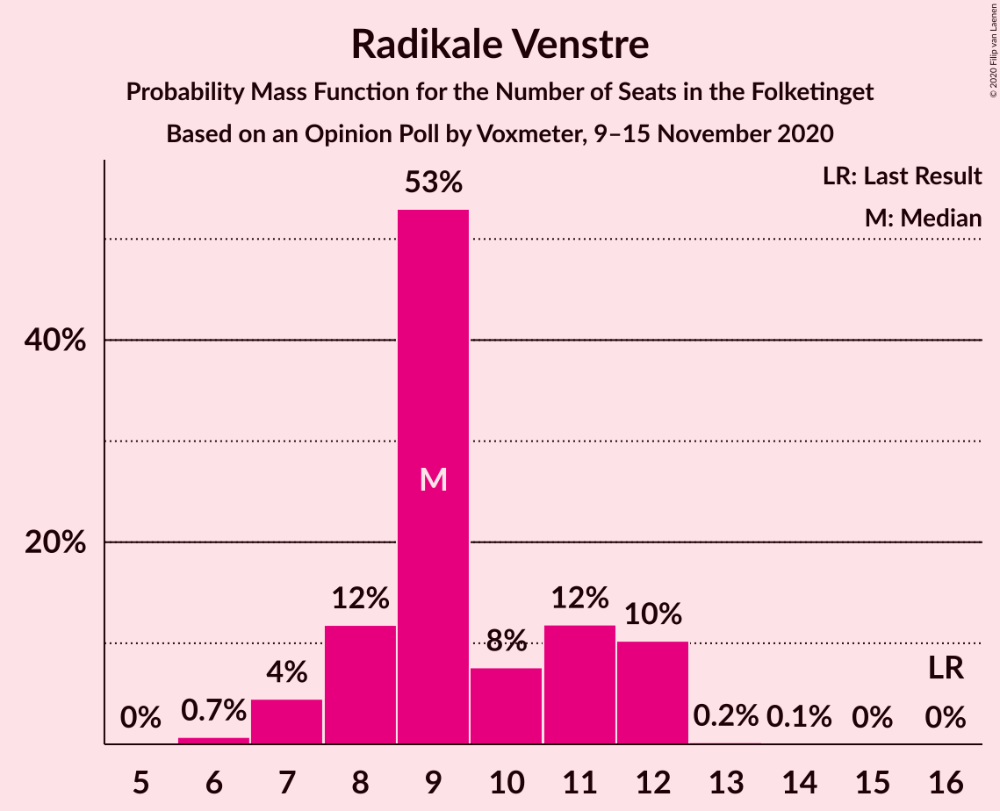
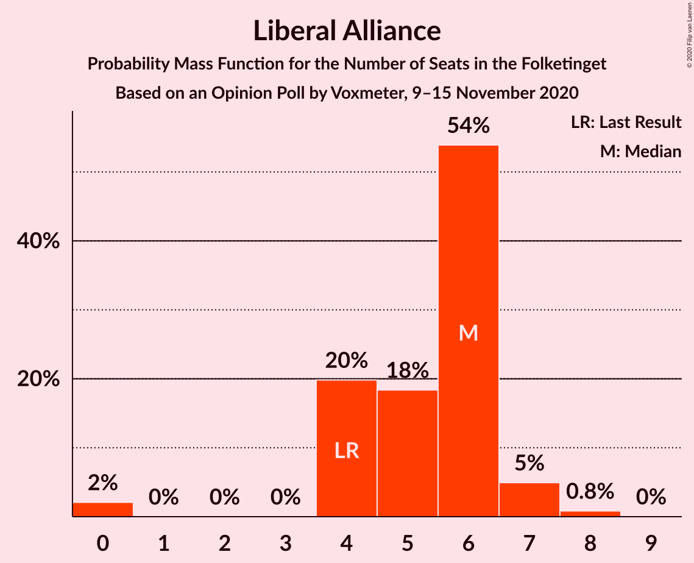
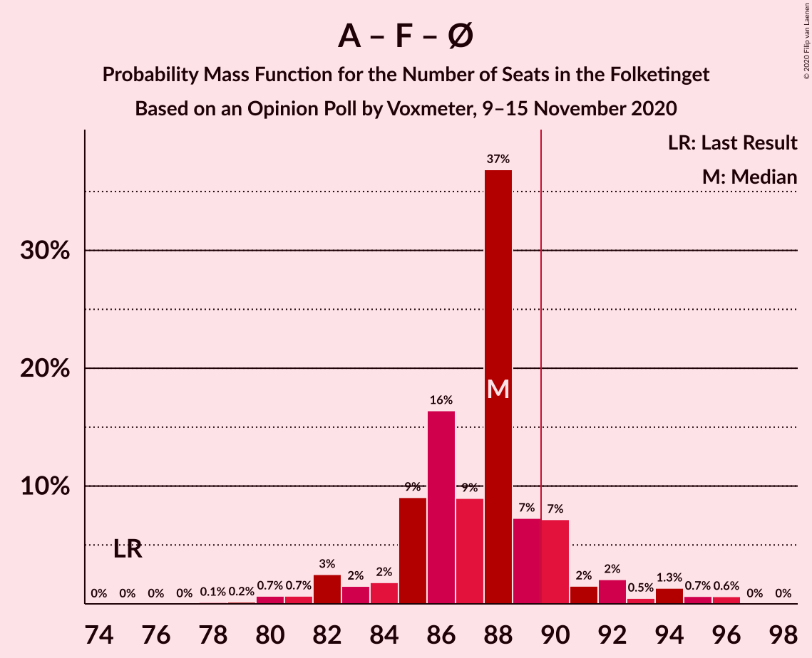
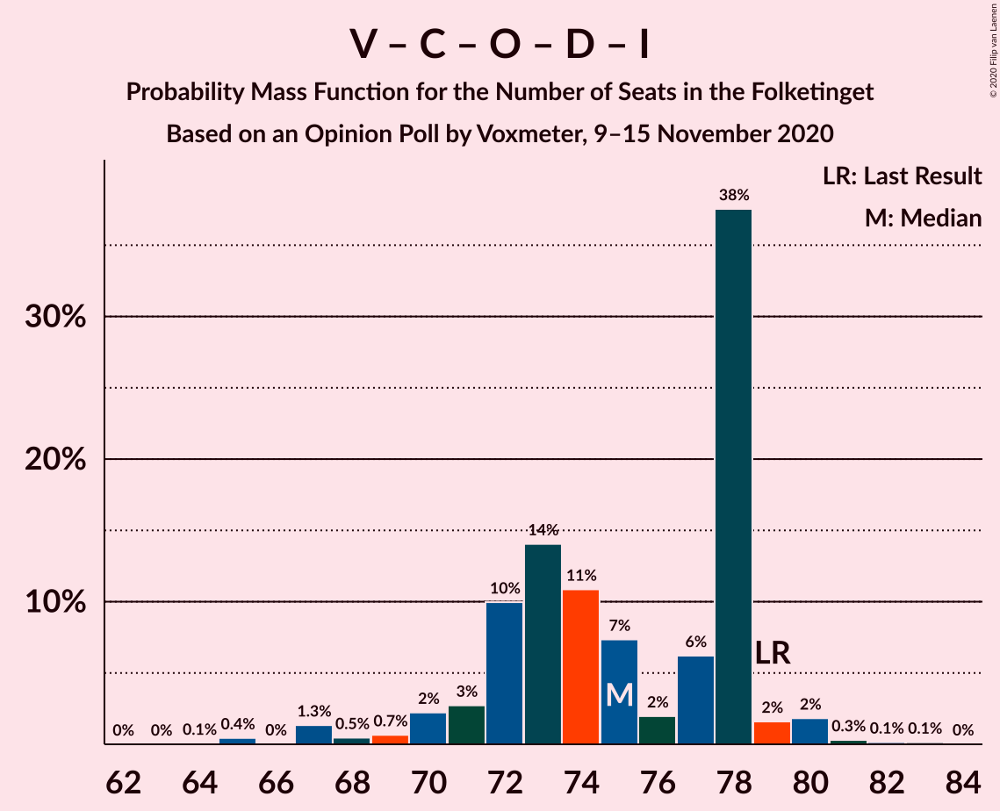
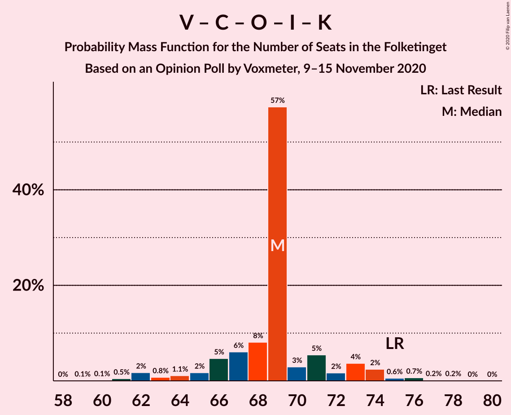

# Opinion Poll by Voxmeter, 9–15 November 2020

<a href="#voting-intentions">Voting Intentions</a> | <a href="#seats">Seats</a> | <a href="#coalitions">Coalitions</a> | <a href="#technical-information">Technical Information</a>

## Voting Intentions

### Confidence Intervals

| Party | Last Result | Poll Result | 80% Confidence Interval | 90% Confidence Interval | 95% Confidence Interval | 99% Confidence Interval |
|:-----:|:-----------:|:-----------:|:-----------------------:|:-----------------------:|:-----------------------:|:-----------------------:|
| Socialdemokraterne | 25.9% | 31.3% | 29.5–33.2% |29.0–33.8% |28.6–34.2% |27.7–35.1% |
| Venstre | 23.4% | 18.6% | 17.1–20.2% |16.7–20.7% |16.3–21.1% |15.6–21.9% |
| Det Konservative Folkeparti | 6.6% | 9.5% | 8.4–10.7% |8.1–11.1% |7.8–11.4% |7.3–12.1% |
| Socialistisk Folkeparti | 7.7% | 9.0% | 7.9–10.2% |7.7–10.6% |7.4–10.9% |6.9–11.5% |
| Enhedslisten–De Rød-Grønne | 6.9% | 8.7% | 7.7–9.9% |7.4–10.3% |7.1–10.6% |6.7–11.2% |
| Dansk Folkeparti | 8.7% | 5.4% | 4.6–6.4% |4.4–6.7% |4.2–7.0% |3.8–7.5% |
| Nye Borgerlige | 2.4% | 5.3% | 4.5–6.3% |4.3–6.6% |4.1–6.9% |3.7–7.4% |
| Radikale Venstre | 8.6% | 5.1% | 4.3–6.1% |4.1–6.4% |3.9–6.6% |3.6–7.2% |
| Liberal Alliance | 2.3% | 2.7% | 2.2–3.5% |2.0–3.7% |1.9–3.9% |1.6–4.3% |
| Kristendemokraterne | 1.7% | 2.5% | 2.0–3.3% |1.8–3.5% |1.7–3.7% |1.5–4.1% |
| Veganerpartiet | 0.0% | 0.5% | 0.3–0.9% |0.2–1.0% |0.2–1.1% |0.1–1.4% |
| Alternativet | 3.0% | 0.4% | 0.2–0.8% |0.2–0.9% |0.2–1.0% |0.1–1.2% |

*Note:* The poll result column reflects the actual value used in the calculations. Published results may vary slightly, and in addition be rounded to fewer digits.

## Seats

### Confidence Intervals

| Party | Last Result | Median | 80% Confidence Interval | 90% Confidence Interval | 95% Confidence Interval | 99% Confidence Interval |
|:-----:|:-----------:|:------:|:-----------------------:|:-----------------------:|:-----------------------:|:-----------------------:|
| <a href="#socialdemokraterne">Socialdemokraterne</a> | 48 | 54 | 53–56 |53–61 |53–61 |52–63 |
| <a href="#venstre">Venstre</a> | 43 | 32 | 31–37 |28–38 |28–38 |28–38 |
| <a href="#det-konservative-folkeparti">Det Konservative Folkeparti</a> | 12 | 19 | 15–20 |14–21 |14–21 |14–21 |
| <a href="#socialistisk-folkeparti">Socialistisk Folkeparti</a> | 14 | 16 | 15–18 |13–18 |13–18 |13–19 |
| <a href="#enhedslisten–de-rød-grønne">Enhedslisten–De Rød-Grønne</a> | 13 | 16 | 15–17 |14–17 |14–17 |13–21 |
| <a href="#dansk-folkeparti">Dansk Folkeparti</a> | 16 | 11 | 8–11 |8–13 |6–13 |6–13 |
| <a href="#nye-borgerlige">Nye Borgerlige</a> | 4 | 9 | 7–11 |7–11 |7–11 |7–13 |
| <a href="#radikale-venstre">Radikale Venstre</a> | 16 | 9 | 9–11 |8–11 |7–11 |6–12 |
| <a href="#liberal-alliance">Liberal Alliance</a> | 4 | 5 | 4–6 |4–6 |4–7 |0–7 |
| <a href="#kristendemokraterne">Kristendemokraterne</a> | 0 | 4 | 0–7 |0–7 |0–7 |0–7 |
| <a href="#veganerpartiet">Veganerpartiet</a> | 0 | 0 | 0 |0 |0 |0 |
| <a href="#alternativet">Alternativet</a> | 5 | 0 | 0 |0 |0 |0 |

### Socialdemokraterne

*For a full overview of the results for this party, see the [Socialdemokraterne](party-socialdemokraterne.html) page.*

| Number of Seats | Probability | Accumulated | Special Marks |
|:---------------:|:-----------:|:-----------:|:-------------:|
| 47 | 0.1% | 100% |  |
| 48 | 0.1% | 99.9% | Last Result |
| 49 | 0.1% | 99.9% |  |
| 50 | 0% | 99.8% |  |
| 51 | 0.1% | 99.7% |  |
| 52 | 1.0% | 99.6% |  |
| 53 | 22% | 98.6% |  |
| 54 | 33% | 77% | Median |
| 55 | 6% | 44% |  |
| 56 | 29% | 38% |  |
| 57 | 0.2% | 9% |  |
| 58 | 0.3% | 9% |  |
| 59 | 2% | 8% |  |
| 60 | 0.2% | 7% |  |
| 61 | 5% | 6% |  |
| 62 | 0% | 1.0% |  |
| 63 | 1.0% | 1.0% |  |
| 64 | 0% | 0% |  |

### Venstre

*For a full overview of the results for this party, see the [Venstre](party-venstre.html) page.*

| Number of Seats | Probability | Accumulated | Special Marks |
|:---------------:|:-----------:|:-----------:|:-------------:|
| 27 | 0.1% | 100% |  |
| 28 | 6% | 99.9% |  |
| 29 | 0.7% | 94% |  |
| 30 | 0.5% | 93% |  |
| 31 | 7% | 93% |  |
| 32 | 50% | 85% | Median |
| 33 | 0.5% | 35% |  |
| 34 | 5% | 35% |  |
| 35 | 0.6% | 30% |  |
| 36 | 0.8% | 29% |  |
| 37 | 24% | 29% |  |
| 38 | 5% | 5% |  |
| 39 | 0% | 0.1% |  |
| 40 | 0% | 0.1% |  |
| 41 | 0% | 0% |  |
| 42 | 0% | 0% |  |
| 43 | 0% | 0% | Last Result |

### Det Konservative Folkeparti

*For a full overview of the results for this party, see the [Det Konservative Folkeparti](party-detkonservativefolkeparti.html) page.*

| Number of Seats | Probability | Accumulated | Special Marks |
|:---------------:|:-----------:|:-----------:|:-------------:|
| 12 | 0.1% | 100% | Last Result |
| 13 | 0.1% | 99.9% |  |
| 14 | 6% | 99.8% |  |
| 15 | 23% | 94% |  |
| 16 | 11% | 70% |  |
| 17 | 2% | 59% |  |
| 18 | 0.8% | 58% |  |
| 19 | 44% | 57% | Median |
| 20 | 7% | 13% |  |
| 21 | 6% | 6% |  |
| 22 | 0.3% | 0.5% |  |
| 23 | 0.2% | 0.2% |  |
| 24 | 0% | 0% |  |

### Socialistisk Folkeparti

*For a full overview of the results for this party, see the [Socialistisk Folkeparti](party-socialistiskfolkeparti.html) page.*

| Number of Seats | Probability | Accumulated | Special Marks |
|:---------------:|:-----------:|:-----------:|:-------------:|
| 11 | 0.1% | 100% |  |
| 12 | 0.3% | 99.9% |  |
| 13 | 8% | 99.6% |  |
| 14 | 0.5% | 91% | Last Result |
| 15 | 12% | 91% |  |
| 16 | 38% | 79% | Median |
| 17 | 7% | 41% |  |
| 18 | 32% | 33% |  |
| 19 | 0.5% | 0.9% |  |
| 20 | 0.2% | 0.4% |  |
| 21 | 0.1% | 0.2% |  |
| 22 | 0.1% | 0.2% |  |
| 23 | 0% | 0% |  |

### Enhedslisten–De Rød-Grønne

*For a full overview of the results for this party, see the [Enhedslisten–De Rød-Grønne](party-enhedslisten–derød-grønne.html) page.*

| Number of Seats | Probability | Accumulated | Special Marks |
|:---------------:|:-----------:|:-----------:|:-------------:|
| 11 | 0.1% | 100% |  |
| 12 | 0.3% | 99.9% |  |
| 13 | 1.1% | 99.6% | Last Result |
| 14 | 7% | 98.5% |  |
| 15 | 41% | 92% |  |
| 16 | 5% | 51% | Median |
| 17 | 45% | 46% |  |
| 18 | 0.1% | 1.2% |  |
| 19 | 0.6% | 1.1% |  |
| 20 | 0% | 0.5% |  |
| 21 | 0.5% | 0.5% |  |
| 22 | 0% | 0% |  |

### Dansk Folkeparti

*For a full overview of the results for this party, see the [Dansk Folkeparti](party-danskfolkeparti.html) page.*

| Number of Seats | Probability | Accumulated | Special Marks |
|:---------------:|:-----------:|:-----------:|:-------------:|
| 6 | 3% | 100% |  |
| 7 | 0.8% | 97% |  |
| 8 | 10% | 96% |  |
| 9 | 1.2% | 86% |  |
| 10 | 23% | 84% |  |
| 11 | 55% | 62% | Median |
| 12 | 1.2% | 7% |  |
| 13 | 5% | 5% |  |
| 14 | 0% | 0% |  |
| 15 | 0% | 0% |  |
| 16 | 0% | 0% | Last Result |

### Nye Borgerlige

*For a full overview of the results for this party, see the [Nye Borgerlige](party-nyeborgerlige.html) page.*

| Number of Seats | Probability | Accumulated | Special Marks |
|:---------------:|:-----------:|:-----------:|:-------------:|
| 4 | 0% | 100% | Last Result |
| 5 | 0% | 100% |  |
| 6 | 0.2% | 100% |  |
| 7 | 11% | 99.8% |  |
| 8 | 24% | 89% |  |
| 9 | 24% | 66% | Median |
| 10 | 31% | 41% |  |
| 11 | 9% | 11% |  |
| 12 | 0.2% | 2% |  |
| 13 | 1.1% | 1.5% |  |
| 14 | 0.4% | 0.4% |  |
| 15 | 0% | 0% |  |

### Radikale Venstre

*For a full overview of the results for this party, see the [Radikale Venstre](party-radikalevenstre.html) page.*

| Number of Seats | Probability | Accumulated | Special Marks |
|:---------------:|:-----------:|:-----------:|:-------------:|
| 6 | 1.0% | 100% |  |
| 7 | 2% | 99.0% |  |
| 8 | 5% | 97% |  |
| 9 | 79% | 92% | Median |
| 10 | 1.1% | 13% |  |
| 11 | 11% | 12% |  |
| 12 | 1.1% | 1.2% |  |
| 13 | 0% | 0.1% |  |
| 14 | 0.1% | 0.1% |  |
| 15 | 0% | 0% |  |
| 16 | 0% | 0% | Last Result |

### Liberal Alliance

*For a full overview of the results for this party, see the [Liberal Alliance](party-liberalalliance.html) page.*

| Number of Seats | Probability | Accumulated | Special Marks |
|:---------------:|:-----------:|:-----------:|:-------------:|
| 0 | 2% | 100% |  |
| 1 | 0% | 98% |  |
| 2 | 0% | 98% |  |
| 3 | 0% | 98% |  |
| 4 | 17% | 98% | Last Result |
| 5 | 70% | 82% | Median |
| 6 | 7% | 11% |  |
| 7 | 4% | 4% |  |
| 8 | 0.1% | 0.1% |  |
| 9 | 0% | 0% |  |

### Kristendemokraterne

*For a full overview of the results for this party, see the [Kristendemokraterne](party-kristendemokraterne.html) page.*

| Number of Seats | Probability | Accumulated | Special Marks |
|:---------------:|:-----------:|:-----------:|:-------------:|
| 0 | 35% | 100% | Last Result |
| 1 | 0% | 65% |  |
| 2 | 0% | 65% |  |
| 3 | 0% | 65% |  |
| 4 | 24% | 65% | Median |
| 5 | 23% | 41% |  |
| 6 | 3% | 19% |  |
| 7 | 16% | 16% |  |
| 8 | 0.1% | 0.1% |  |
| 9 | 0% | 0% |  |

### Veganerpartiet

*For a full overview of the results for this party, see the [Veganerpartiet](party-veganerpartiet.html) page.*

| Number of Seats | Probability | Accumulated | Special Marks |
|:---------------:|:-----------:|:-----------:|:-------------:|
| 0 | 100% | 100% | Last Result, Median |

### Alternativet

*For a full overview of the results for this party, see the [Alternativet](party-alternativet.html) page.*

| Number of Seats | Probability | Accumulated | Special Marks |
|:---------------:|:-----------:|:-----------:|:-------------:|
| 0 | 100% | 100% | Median |
| 1 | 0% | 0% |  |
| 2 | 0% | 0% |  |
| 3 | 0% | 0% |  |
| 4 | 0% | 0% |  |
| 5 | 0% | 0% | Last Result |

## Coalitions

### Confidence Intervals

| Coalition | Last Result | Median | Majority? | 80% Confidence Interval | 90% Confidence Interval | 95% Confidence Interval | 99% Confidence Interval |
|:---------:|:-----------:|:------:|:---------:|:-----------------------:|:-----------------------:|:-----------------------:|:-----------------------:|
| Socialdemokraterne – Socialistisk Folkeparti – Enhedslisten–De Rød-Grønne – Radikale Venstre – Alternativet | 96 | 96 | 99.9% | 93–98 | 91–103 | 91–103 | 91–103 |
| Socialdemokraterne – Socialistisk Folkeparti – Enhedslisten–De Rød-Grønne – Radikale Venstre | 91 | 96 | 99.9% | 93–98 | 91–103 | 91–103 | 91–103 |
| Socialdemokraterne – Socialistisk Folkeparti – Enhedslisten–De Rød-Grønne – Alternativet | 80 | 87 | 8% | 84–89 | 80–95 | 80–95 | 80–95 |
| Socialdemokraterne – Socialistisk Folkeparti – Enhedslisten–De Rød-Grønne | 75 | 87 | 8% | 84–89 | 80–95 | 80–95 | 80–95 |
| Socialdemokraterne – Socialistisk Folkeparti – Radikale Venstre | 78 | 81 | 0% | 78–83 | 77–86 | 76–86 | 75–87 |
| Venstre – Det Konservative Folkeparti – Dansk Folkeparti – Nye Borgerlige – Liberal Alliance – Kristendemokraterne | 79 | 79 | 0% | 77–82 | 72–84 | 72–84 | 72–84 |
| Venstre – Det Konservative Folkeparti – Dansk Folkeparti – Nye Borgerlige – Liberal Alliance | 79 | 75 | 0% | 72–79 | 67–79 | 67–79 | 67–79 |
| Venstre – Det Konservative Folkeparti – Dansk Folkeparti – Liberal Alliance – Kristendemokraterne | 75 | 71 | 0% | 67–73 | 65–73 | 64–73 | 62–74 |
| Venstre – Det Konservative Folkeparti – Dansk Folkeparti – Liberal Alliance | 75 | 67 | 0% | 63–68 | 60–70 | 60–70 | 57–70 |
| Socialdemokraterne – Radikale Venstre | 64 | 64 | 0% | 62–65 | 62–69 | 62–69 | 59–72 |
| Venstre – Det Konservative Folkeparti – Liberal Alliance | 59 | 56 | 0% | 54–57 | 49–58 | 49–58 | 49–62 |
| Venstre – Det Konservative Folkeparti | 55 | 51 | 0% | 49–52 | 44–52 | 44–53 | 44–56 |
| Venstre | 43 | 32 | 0% | 31–37 | 28–38 | 28–38 | 28–38 |

### Socialdemokraterne – Socialistisk Folkeparti – Enhedslisten–De Rød-Grønne – Radikale Venstre – Alternativet

| Number of Seats | Probability | Accumulated | Special Marks |
|:---------------:|:-----------:|:-----------:|:-------------:|
| 89 | 0.1% | 100% |  |
| 90 | 0.2% | 99.9% | Majority |
| 91 | 6% | 99.7% |  |
| 92 | 3% | 94% |  |
| 93 | 15% | 91% |  |
| 94 | 0.5% | 76% |  |
| 95 | 0.7% | 76% | Median |
| 96 | 28% | 75% | Last Result |
| 97 | 6% | 47% |  |
| 98 | 32% | 42% |  |
| 99 | 1.2% | 10% |  |
| 100 | 0.7% | 8% |  |
| 101 | 2% | 8% |  |
| 102 | 0.7% | 6% |  |
| 103 | 5% | 5% |  |
| 104 | 0.4% | 0.5% |  |
| 105 | 0% | 0% |  |

### Socialdemokraterne – Socialistisk Folkeparti – Enhedslisten–De Rød-Grønne – Radikale Venstre

| Number of Seats | Probability | Accumulated | Special Marks |
|:---------------:|:-----------:|:-----------:|:-------------:|
| 89 | 0.1% | 100% |  |
| 90 | 0.2% | 99.9% | Majority |
| 91 | 6% | 99.7% | Last Result |
| 92 | 3% | 94% |  |
| 93 | 15% | 91% |  |
| 94 | 0.5% | 76% |  |
| 95 | 0.7% | 76% | Median |
| 96 | 28% | 75% |  |
| 97 | 6% | 47% |  |
| 98 | 32% | 42% |  |
| 99 | 1.2% | 10% |  |
| 100 | 0.7% | 8% |  |
| 101 | 2% | 8% |  |
| 102 | 0.7% | 6% |  |
| 103 | 5% | 5% |  |
| 104 | 0.4% | 0.5% |  |
| 105 | 0% | 0% |  |

### Socialdemokraterne – Socialistisk Folkeparti – Enhedslisten–De Rød-Grønne – Alternativet

| Number of Seats | Probability | Accumulated | Special Marks |
|:---------------:|:-----------:|:-----------:|:-------------:|
| 79 | 0.2% | 100% |  |
| 80 | 6% | 99.8% | Last Result |
| 81 | 0.1% | 94% |  |
| 82 | 0.5% | 94% |  |
| 83 | 0.2% | 93% |  |
| 84 | 15% | 93% |  |
| 85 | 2% | 78% |  |
| 86 | 2% | 76% | Median |
| 87 | 30% | 74% |  |
| 88 | 7% | 44% |  |
| 89 | 29% | 37% |  |
| 90 | 0.6% | 8% | Majority |
| 91 | 0.4% | 8% |  |
| 92 | 1.3% | 8% |  |
| 93 | 0.7% | 6% |  |
| 94 | 0.1% | 5% |  |
| 95 | 5% | 5% |  |
| 96 | 0% | 0% |  |

### Socialdemokraterne – Socialistisk Folkeparti – Enhedslisten–De Rød-Grønne

| Number of Seats | Probability | Accumulated | Special Marks |
|:---------------:|:-----------:|:-----------:|:-------------:|
| 75 | 0% | 100% | Last Result |
| 76 | 0% | 100% |  |
| 77 | 0% | 100% |  |
| 78 | 0% | 100% |  |
| 79 | 0.2% | 100% |  |
| 80 | 6% | 99.8% |  |
| 81 | 0.1% | 94% |  |
| 82 | 0.5% | 94% |  |
| 83 | 0.2% | 93% |  |
| 84 | 15% | 93% |  |
| 85 | 2% | 78% |  |
| 86 | 2% | 76% | Median |
| 87 | 30% | 74% |  |
| 88 | 7% | 44% |  |
| 89 | 29% | 37% |  |
| 90 | 0.6% | 8% | Majority |
| 91 | 0.4% | 8% |  |
| 92 | 1.3% | 8% |  |
| 93 | 0.7% | 6% |  |
| 94 | 0.1% | 5% |  |
| 95 | 5% | 5% |  |
| 96 | 0% | 0% |  |

### Socialdemokraterne – Socialistisk Folkeparti – Radikale Venstre

| Number of Seats | Probability | Accumulated | Special Marks |
|:---------------:|:-----------:|:-----------:|:-------------:|
| 74 | 0.1% | 100% |  |
| 75 | 1.0% | 99.9% |  |
| 76 | 2% | 98.9% |  |
| 77 | 6% | 97% |  |
| 78 | 15% | 91% | Last Result |
| 79 | 5% | 76% | Median |
| 80 | 6% | 71% |  |
| 81 | 52% | 65% |  |
| 82 | 0.1% | 13% |  |
| 83 | 5% | 13% |  |
| 84 | 0.1% | 8% |  |
| 85 | 1.5% | 8% |  |
| 86 | 6% | 6% |  |
| 87 | 0.6% | 0.6% |  |
| 88 | 0% | 0% |  |

### Venstre – Det Konservative Folkeparti – Dansk Folkeparti – Nye Borgerlige – Liberal Alliance – Kristendemokraterne

| Number of Seats | Probability | Accumulated | Special Marks |
|:---------------:|:-----------:|:-----------:|:-------------:|
| 71 | 0.4% | 100% |  |
| 72 | 5% | 99.5% |  |
| 73 | 0.7% | 94% |  |
| 74 | 2% | 94% |  |
| 75 | 0.7% | 92% |  |
| 76 | 0.8% | 91% |  |
| 77 | 32% | 90% |  |
| 78 | 6% | 58% |  |
| 79 | 28% | 53% | Last Result |
| 80 | 0.8% | 25% | Median |
| 81 | 0.5% | 24% |  |
| 82 | 15% | 24% |  |
| 83 | 3% | 9% |  |
| 84 | 6% | 6% |  |
| 85 | 0.2% | 0.2% |  |
| 86 | 0.1% | 0.1% |  |
| 87 | 0% | 0% |  |

### Venstre – Det Konservative Folkeparti – Dansk Folkeparti – Nye Borgerlige – Liberal Alliance

| Number of Seats | Probability | Accumulated | Special Marks |
|:---------------:|:-----------:|:-----------:|:-------------:|
| 66 | 0% | 100% |  |
| 67 | 7% | 99.9% |  |
| 68 | 0.7% | 93% |  |
| 69 | 0.2% | 93% |  |
| 70 | 0.8% | 92% |  |
| 71 | 0.4% | 92% |  |
| 72 | 4% | 91% |  |
| 73 | 5% | 87% |  |
| 74 | 0.6% | 82% |  |
| 75 | 38% | 81% |  |
| 76 | 0.5% | 44% | Median |
| 77 | 30% | 43% |  |
| 78 | 1.3% | 13% |  |
| 79 | 11% | 12% | Last Result |
| 80 | 0.3% | 0.3% |  |
| 81 | 0% | 0.1% |  |
| 82 | 0% | 0% |  |

### Venstre – Det Konservative Folkeparti – Dansk Folkeparti – Liberal Alliance – Kristendemokraterne

| Number of Seats | Probability | Accumulated | Special Marks |
|:---------------:|:-----------:|:-----------:|:-------------:|
| 60 | 0.4% | 100% |  |
| 61 | 0% | 99.6% |  |
| 62 | 0.1% | 99.6% |  |
| 63 | 0.1% | 99.4% |  |
| 64 | 2% | 99.3% |  |
| 65 | 6% | 97% |  |
| 66 | 0.5% | 92% |  |
| 67 | 30% | 91% |  |
| 68 | 4% | 61% |  |
| 69 | 0.4% | 58% |  |
| 70 | 7% | 57% |  |
| 71 | 28% | 51% | Median |
| 72 | 2% | 23% |  |
| 73 | 21% | 21% |  |
| 74 | 0.3% | 0.5% |  |
| 75 | 0.1% | 0.2% | Last Result |
| 76 | 0.1% | 0.1% |  |
| 77 | 0% | 0% |  |

### Venstre – Det Konservative Folkeparti – Dansk Folkeparti – Liberal Alliance

| Number of Seats | Probability | Accumulated | Special Marks |
|:---------------:|:-----------:|:-----------:|:-------------:|
| 56 | 0.4% | 100% |  |
| 57 | 1.1% | 99.6% |  |
| 58 | 0.1% | 98% |  |
| 59 | 0.8% | 98% |  |
| 60 | 5% | 98% |  |
| 61 | 0.7% | 92% |  |
| 62 | 0.5% | 91% |  |
| 63 | 4% | 91% |  |
| 64 | 0.8% | 87% |  |
| 65 | 2% | 86% |  |
| 66 | 22% | 85% |  |
| 67 | 51% | 63% | Median |
| 68 | 6% | 12% |  |
| 69 | 0.4% | 6% |  |
| 70 | 6% | 6% |  |
| 71 | 0% | 0.1% |  |
| 72 | 0% | 0% |  |
| 73 | 0% | 0% |  |
| 74 | 0% | 0% |  |
| 75 | 0% | 0% | Last Result |

### Socialdemokraterne – Radikale Venstre

| Number of Seats | Probability | Accumulated | Special Marks |
|:---------------:|:-----------:|:-----------:|:-------------:|
| 57 | 0.1% | 100% |  |
| 58 | 0% | 99.9% |  |
| 59 | 1.1% | 99.9% |  |
| 60 | 0.2% | 98.9% |  |
| 61 | 0.5% | 98.6% |  |
| 62 | 15% | 98% |  |
| 63 | 31% | 83% | Median |
| 64 | 12% | 52% | Last Result |
| 65 | 31% | 41% |  |
| 66 | 1.1% | 10% |  |
| 67 | 0.4% | 9% |  |
| 68 | 2% | 8% |  |
| 69 | 5% | 7% |  |
| 70 | 0.2% | 1.5% |  |
| 71 | 0% | 1.3% |  |
| 72 | 0.8% | 1.3% |  |
| 73 | 0.4% | 0.4% |  |
| 74 | 0% | 0% |  |

### Venstre – Det Konservative Folkeparti – Liberal Alliance

| Number of Seats | Probability | Accumulated | Special Marks |
|:---------------:|:-----------:|:-----------:|:-------------:|
| 46 | 0.1% | 100% |  |
| 47 | 0.1% | 99.9% |  |
| 48 | 0.1% | 99.8% |  |
| 49 | 7% | 99.7% |  |
| 50 | 0.4% | 93% |  |
| 51 | 0.8% | 93% |  |
| 52 | 2% | 92% |  |
| 53 | 0.1% | 90% |  |
| 54 | 0.2% | 90% |  |
| 55 | 16% | 90% |  |
| 56 | 29% | 74% | Median |
| 57 | 37% | 45% |  |
| 58 | 7% | 8% |  |
| 59 | 0.4% | 1.1% | Last Result |
| 60 | 0.1% | 0.7% |  |
| 61 | 0% | 0.6% |  |
| 62 | 0.5% | 0.5% |  |
| 63 | 0% | 0% |  |

### Venstre – Det Konservative Folkeparti

| Number of Seats | Probability | Accumulated | Special Marks |
|:---------------:|:-----------:|:-----------:|:-------------:|
| 42 | 0.1% | 100% |  |
| 43 | 0.1% | 99.9% |  |
| 44 | 5% | 99.8% |  |
| 45 | 1.4% | 95% |  |
| 46 | 0.8% | 93% |  |
| 47 | 0.9% | 92% |  |
| 48 | 0.8% | 91% |  |
| 49 | 0.9% | 91% |  |
| 50 | 4% | 90% |  |
| 51 | 43% | 86% | Median |
| 52 | 39% | 42% |  |
| 53 | 2% | 3% |  |
| 54 | 0% | 1.2% |  |
| 55 | 0.3% | 1.1% | Last Result |
| 56 | 0.5% | 0.8% |  |
| 57 | 0.2% | 0.2% |  |
| 58 | 0% | 0.1% |  |
| 59 | 0.1% | 0.1% |  |
| 60 | 0% | 0% |  |

### Venstre

| Number of Seats | Probability | Accumulated | Special Marks |
|:---------------:|:-----------:|:-----------:|:-------------:|
| 27 | 0.1% | 100% |  |
| 28 | 6% | 99.9% |  |
| 29 | 0.7% | 94% |  |
| 30 | 0.5% | 93% |  |
| 31 | 7% | 93% |  |
| 32 | 50% | 85% | Median |
| 33 | 0.5% | 35% |  |
| 34 | 5% | 35% |  |
| 35 | 0.6% | 30% |  |
| 36 | 0.8% | 29% |  |
| 37 | 24% | 29% |  |
| 38 | 5% | 5% |  |
| 39 | 0% | 0.1% |  |
| 40 | 0% | 0.1% |  |
| 41 | 0% | 0% |  |
| 42 | 0% | 0% |  |
| 43 | 0% | 0% | Last Result |

## Technical Information

### Opinion Poll

+ **Polling firm:** Voxmeter
+ **Commissioner(s):** —
+ **Fieldwork period:** 9–15 November 2020

### Calculations

+ **Sample size:** 1034
+ **Simulations done:** 131,072
+ **Error estimate:** 2.79%

