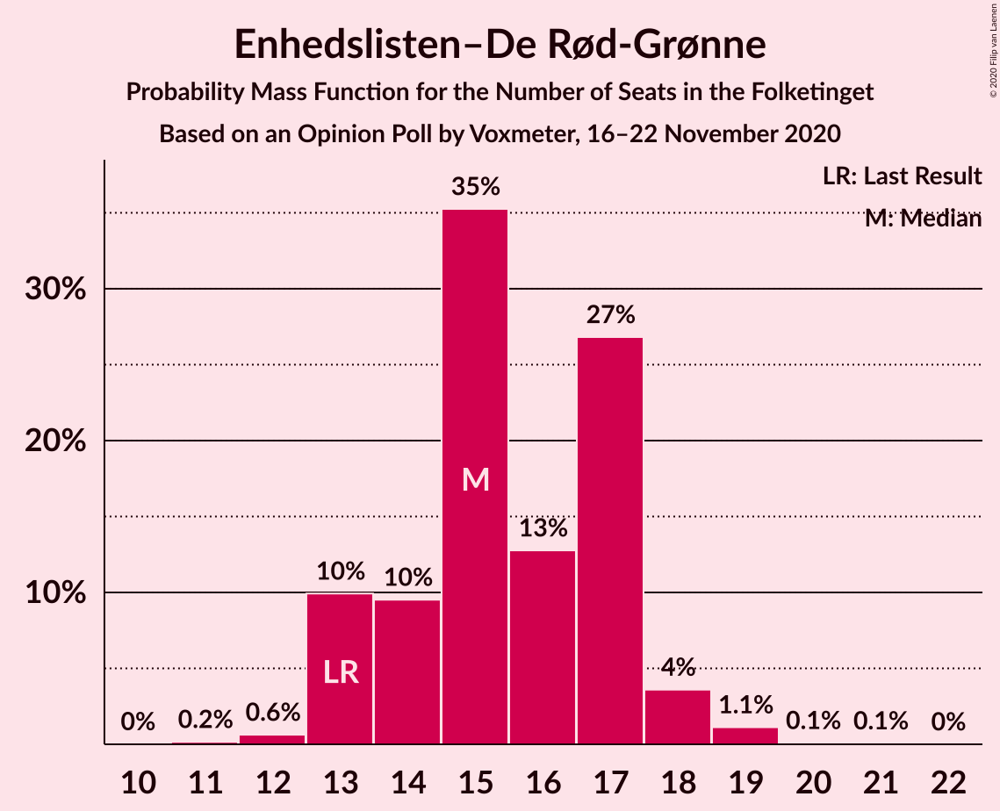
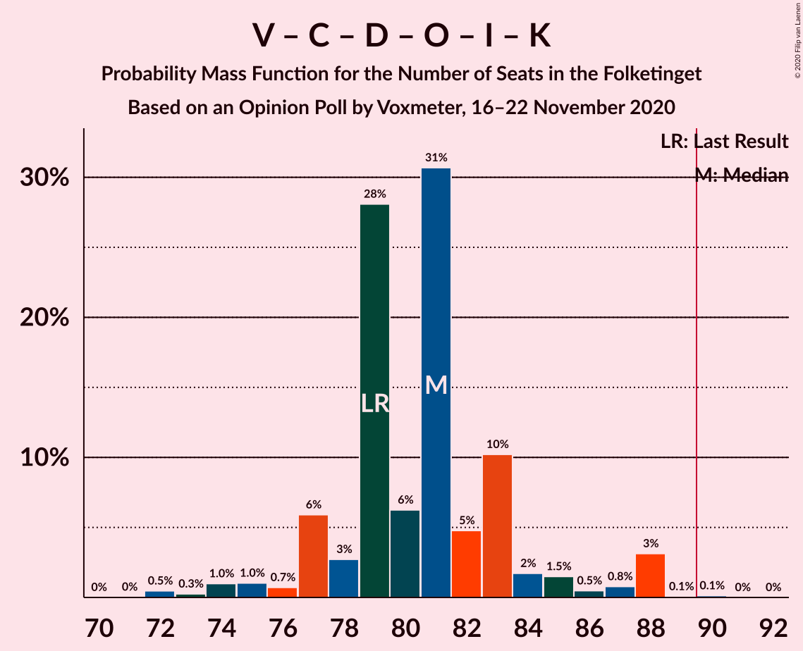

# Opinion Poll by Voxmeter, 16–22 November 2020

<a href="#voting-intentions">Voting Intentions</a> | <a href="#seats">Seats</a> | <a href="#coalitions">Coalitions</a> | <a href="#technical-information">Technical Information</a>

## Voting Intentions

### Confidence Intervals

| Party | Last Result | Poll Result | 80% Confidence Interval | 90% Confidence Interval | 95% Confidence Interval | 99% Confidence Interval |
|:-----:|:-----------:|:-----------:|:-----------------------:|:-----------------------:|:-----------------------:|:-----------------------:|
| Socialdemokraterne | 25.9% | 29.2% | 27.4–31.1% |26.9–31.6% |26.5–32.1% |25.6–33.0% |
| Venstre | 23.4% | 20.3% | 18.7–22.0% |18.3–22.4% |17.9–22.9% |17.2–23.7% |
| Det Konservative Folkeparti | 6.6% | 9.1% | 8.0–10.4% |7.7–10.7% |7.5–11.0% |7.0–11.7% |
| Socialistisk Folkeparti | 7.7% | 8.6% | 7.6–9.8% |7.3–10.2% |7.0–10.5% |6.6–11.1% |
| Enhedslisten–De Rød-Grønne | 6.9% | 8.4% | 7.4–9.6% |7.1–10.0% |6.9–10.3% |6.4–10.9% |
| Radikale Venstre | 8.6% | 6.3% | 5.4–7.4% |5.1–7.7% |4.9–7.9% |4.5–8.5% |
| Nye Borgerlige | 2.4% | 5.2% | 4.4–6.2% |4.2–6.5% |4.0–6.7% |3.6–7.3% |
| Dansk Folkeparti | 8.7% | 5.1% | 4.3–6.1% |4.1–6.4% |3.9–6.6% |3.6–7.1% |
| Liberal Alliance | 2.3% | 3.2% | 2.6–4.1% |2.5–4.3% |2.3–4.5% |2.0–4.9% |
| Kristendemokraterne | 1.7% | 2.3% | 1.8–3.0% |1.6–3.2% |1.5–3.4% |1.3–3.7% |
| Alternativet | 3.0% | 0.6% | 0.4–1.0% |0.3–1.2% |0.3–1.3% |0.2–1.5% |
| Veganerpartiet | 0.0% | 0.5% | 0.3–0.9% |0.2–1.0% |0.2–1.1% |0.1–1.4% |

*Note:* The poll result column reflects the actual value used in the calculations. Published results may vary slightly, and in addition be rounded to fewer digits.

## Seats

### Confidence Intervals

| Party | Last Result | Median | 80% Confidence Interval | 90% Confidence Interval | 95% Confidence Interval | 99% Confidence Interval |
|:-----:|:-----------:|:------:|:-----------------------:|:-----------------------:|:-----------------------:|:-----------------------:|
| <a href="#socialdemokraterne">Socialdemokraterne</a> | 48 | 52 | 49–53 |49–55 |48–56 |46–60 |
| <a href="#venstre">Venstre</a> | 43 | 37 | 33–38 |33–38 |32–40 |30–41 |
| <a href="#det-konservative-folkeparti">Det Konservative Folkeparti</a> | 12 | 15 | 14–18 |14–18 |14–19 |13–21 |
| <a href="#socialistisk-folkeparti">Socialistisk Folkeparti</a> | 14 | 15 | 13–17 |13–19 |12–19 |12–19 |
| <a href="#enhedslisten–de-rød-grønne">Enhedslisten–De Rød-Grønne</a> | 13 | 15 | 13–17 |13–17 |13–18 |12–19 |
| <a href="#radikale-venstre">Radikale Venstre</a> | 16 | 12 | 10–13 |10–14 |9–14 |8–15 |
| <a href="#nye-borgerlige">Nye Borgerlige</a> | 4 | 10 | 9–10 |8–11 |8–12 |7–13 |
| <a href="#dansk-folkeparti">Dansk Folkeparti</a> | 16 | 9 | 7–12 |7–12 |7–12 |6–13 |
| <a href="#liberal-alliance">Liberal Alliance</a> | 4 | 6 | 5–7 |5–7 |4–7 |4–8 |
| <a href="#kristendemokraterne">Kristendemokraterne</a> | 0 | 4 | 0–5 |0–5 |0–5 |0–6 |
| <a href="#alternativet">Alternativet</a> | 5 | 0 | 0 |0 |0 |0 |
| <a href="#veganerpartiet">Veganerpartiet</a> | 0 | 0 | 0 |0 |0 |0 |

### Socialdemokraterne

*For a full overview of the results for this party, see the [Socialdemokraterne](party-socialdemokraterne.html) page.*

| Number of Seats | Probability | Accumulated | Special Marks |
|:---------------:|:-----------:|:-----------:|:-------------:|
| 43 | 0.1% | 100% |  |
| 44 | 0% | 99.9% |  |
| 45 | 0.1% | 99.9% |  |
| 46 | 0.5% | 99.8% |  |
| 47 | 0.6% | 99.3% |  |
| 48 | 1.3% | 98.7% | Last Result |
| 49 | 23% | 97% |  |
| 50 | 7% | 75% |  |
| 51 | 10% | 67% |  |
| 52 | 14% | 57% | Median |
| 53 | 34% | 43% |  |
| 54 | 3% | 9% |  |
| 55 | 3% | 6% |  |
| 56 | 1.1% | 3% |  |
| 57 | 0.6% | 2% |  |
| 58 | 0.5% | 1.3% |  |
| 59 | 0.1% | 0.9% |  |
| 60 | 0.3% | 0.8% |  |
| 61 | 0.4% | 0.4% |  |
| 62 | 0% | 0% |  |

### Venstre

*For a full overview of the results for this party, see the [Venstre](party-venstre.html) page.*

| Number of Seats | Probability | Accumulated | Special Marks |
|:---------------:|:-----------:|:-----------:|:-------------:|
| 29 | 0.1% | 100% |  |
| 30 | 0.5% | 99.9% |  |
| 31 | 0.8% | 99.4% |  |
| 32 | 2% | 98.7% |  |
| 33 | 8% | 97% |  |
| 34 | 12% | 89% |  |
| 35 | 11% | 77% |  |
| 36 | 6% | 65% |  |
| 37 | 49% | 60% | Median |
| 38 | 7% | 11% |  |
| 39 | 1.4% | 4% |  |
| 40 | 2% | 3% |  |
| 41 | 0.3% | 0.7% |  |
| 42 | 0.3% | 0.4% |  |
| 43 | 0.1% | 0.1% | Last Result |
| 44 | 0% | 0% |  |

### Det Konservative Folkeparti

*For a full overview of the results for this party, see the [Det Konservative Folkeparti](party-detkonservativefolkeparti.html) page.*

| Number of Seats | Probability | Accumulated | Special Marks |
|:---------------:|:-----------:|:-----------:|:-------------:|
| 11 | 0.1% | 100% |  |
| 12 | 0.2% | 99.9% | Last Result |
| 13 | 1.3% | 99.7% |  |
| 14 | 26% | 98% |  |
| 15 | 26% | 73% | Median |
| 16 | 13% | 47% |  |
| 17 | 12% | 34% |  |
| 18 | 20% | 22% |  |
| 19 | 1.1% | 3% |  |
| 20 | 0.6% | 2% |  |
| 21 | 0.9% | 0.9% |  |
| 22 | 0% | 0% |  |

### Socialistisk Folkeparti

*For a full overview of the results for this party, see the [Socialistisk Folkeparti](party-socialistiskfolkeparti.html) page.*

| Number of Seats | Probability | Accumulated | Special Marks |
|:---------------:|:-----------:|:-----------:|:-------------:|
| 11 | 0.2% | 100% |  |
| 12 | 4% | 99.8% |  |
| 13 | 9% | 95% |  |
| 14 | 9% | 87% | Last Result |
| 15 | 32% | 78% | Median |
| 16 | 35% | 46% |  |
| 17 | 4% | 11% |  |
| 18 | 2% | 8% |  |
| 19 | 6% | 6% |  |
| 20 | 0.2% | 0.2% |  |
| 21 | 0% | 0% |  |

### Enhedslisten–De Rød-Grønne

*For a full overview of the results for this party, see the [Enhedslisten–De Rød-Grønne](party-enhedslisten–derød-grønne.html) page.*

| Number of Seats | Probability | Accumulated | Special Marks |
|:---------------:|:-----------:|:-----------:|:-------------:|
| 11 | 0.2% | 100% |  |
| 12 | 0.6% | 99.8% |  |
| 13 | 10% | 99.2% | Last Result |
| 14 | 10% | 89% |  |
| 15 | 35% | 80% | Median |
| 16 | 13% | 44% |  |
| 17 | 27% | 32% |  |
| 18 | 4% | 5% |  |
| 19 | 1.1% | 1.3% |  |
| 20 | 0.1% | 0.2% |  |
| 21 | 0.1% | 0.1% |  |
| 22 | 0% | 0% |  |

### Radikale Venstre

*For a full overview of the results for this party, see the [Radikale Venstre](party-radikalevenstre.html) page.*

| Number of Seats | Probability | Accumulated | Special Marks |
|:---------------:|:-----------:|:-----------:|:-------------:|
| 8 | 0.8% | 100% |  |
| 9 | 2% | 99.2% |  |
| 10 | 14% | 97% |  |
| 11 | 13% | 83% |  |
| 12 | 34% | 70% | Median |
| 13 | 29% | 36% |  |
| 14 | 6% | 8% |  |
| 15 | 2% | 2% |  |
| 16 | 0.3% | 0.3% | Last Result |
| 17 | 0% | 0% |  |

### Nye Borgerlige

*For a full overview of the results for this party, see the [Nye Borgerlige](party-nyeborgerlige.html) page.*

| Number of Seats | Probability | Accumulated | Special Marks |
|:---------------:|:-----------:|:-----------:|:-------------:|
| 4 | 0% | 100% | Last Result |
| 5 | 0% | 100% |  |
| 6 | 0.3% | 100% |  |
| 7 | 2% | 99.7% |  |
| 8 | 4% | 98% |  |
| 9 | 44% | 94% |  |
| 10 | 42% | 50% | Median |
| 11 | 4% | 8% |  |
| 12 | 4% | 4% |  |
| 13 | 0.7% | 0.9% |  |
| 14 | 0.2% | 0.3% |  |
| 15 | 0% | 0% |  |

### Dansk Folkeparti

*For a full overview of the results for this party, see the [Dansk Folkeparti](party-danskfolkeparti.html) page.*

| Number of Seats | Probability | Accumulated | Special Marks |
|:---------------:|:-----------:|:-----------:|:-------------:|
| 6 | 1.0% | 100% |  |
| 7 | 29% | 99.0% |  |
| 8 | 11% | 70% |  |
| 9 | 26% | 60% | Median |
| 10 | 16% | 34% |  |
| 11 | 3% | 18% |  |
| 12 | 13% | 14% |  |
| 13 | 0.6% | 0.7% |  |
| 14 | 0% | 0% |  |
| 15 | 0% | 0% |  |
| 16 | 0% | 0% | Last Result |

### Liberal Alliance

*For a full overview of the results for this party, see the [Liberal Alliance](party-liberalalliance.html) page.*

| Number of Seats | Probability | Accumulated | Special Marks |
|:---------------:|:-----------:|:-----------:|:-------------:|
| 0 | 0.1% | 100% |  |
| 1 | 0% | 99.9% |  |
| 2 | 0% | 99.9% |  |
| 3 | 0% | 99.9% |  |
| 4 | 4% | 99.9% | Last Result |
| 5 | 20% | 96% |  |
| 6 | 39% | 77% | Median |
| 7 | 36% | 38% |  |
| 8 | 2% | 2% |  |
| 9 | 0.3% | 0.3% |  |
| 10 | 0% | 0% |  |

### Kristendemokraterne

*For a full overview of the results for this party, see the [Kristendemokraterne](party-kristendemokraterne.html) page.*

| Number of Seats | Probability | Accumulated | Special Marks |
|:---------------:|:-----------:|:-----------:|:-------------:|
| 0 | 10% | 100% | Last Result |
| 1 | 0% | 90% |  |
| 2 | 0% | 90% |  |
| 3 | 0% | 90% |  |
| 4 | 49% | 90% | Median |
| 5 | 38% | 40% |  |
| 6 | 2% | 2% |  |
| 7 | 0.3% | 0.3% |  |
| 8 | 0% | 0% |  |

### Alternativet

*For a full overview of the results for this party, see the [Alternativet](party-alternativet.html) page.*

| Number of Seats | Probability | Accumulated | Special Marks |
|:---------------:|:-----------:|:-----------:|:-------------:|
| 0 | 100% | 100% | Median |
| 1 | 0% | 0% |  |
| 2 | 0% | 0% |  |
| 3 | 0% | 0% |  |
| 4 | 0% | 0% |  |
| 5 | 0% | 0% | Last Result |

### Veganerpartiet

*For a full overview of the results for this party, see the [Veganerpartiet](party-veganerpartiet.html) page.*

| Number of Seats | Probability | Accumulated | Special Marks |
|:---------------:|:-----------:|:-----------:|:-------------:|
| 0 | 100% | 100% | Last Result, Median |

## Coalitions

### Confidence Intervals

| Coalition | Last Result | Median | Majority? | 80% Confidence Interval | 90% Confidence Interval | 95% Confidence Interval | 99% Confidence Interval |
|:---------:|:-----------:|:------:|:---------:|:-----------------------:|:-----------------------:|:-----------------------:|:-----------------------:|
| Socialdemokraterne – Socialistisk Folkeparti – Enhedslisten–De Rød-Grønne – Radikale Venstre – Alternativet | 96 | 94 | 95% | 92–97 | 90–98 | 87–100 | 87–103 |
| Socialdemokraterne – Socialistisk Folkeparti – Enhedslisten–De Rød-Grønne – Radikale Venstre | 91 | 94 | 95% | 92–97 | 90–98 | 87–100 | 87–103 |
| Socialdemokraterne – Socialistisk Folkeparti – Enhedslisten–De Rød-Grønne – Alternativet | 80 | 83 | 0.7% | 79–84 | 78–86 | 77–88 | 76–91 |
| Socialdemokraterne – Socialistisk Folkeparti – Enhedslisten–De Rød-Grønne | 75 | 83 | 0.7% | 79–84 | 78–86 | 77–88 | 76–91 |
| Venstre – Det Konservative Folkeparti – Nye Borgerlige – Dansk Folkeparti – Liberal Alliance – Kristendemokraterne | 79 | 81 | 0.1% | 78–83 | 77–85 | 75–88 | 72–88 |
| Socialdemokraterne – Socialistisk Folkeparti – Radikale Venstre | 78 | 79 | 0% | 75–82 | 74–82 | 74–84 | 73–87 |
| Venstre – Det Konservative Folkeparti – Nye Borgerlige – Dansk Folkeparti – Liberal Alliance | 79 | 76 | 0% | 75–79 | 74–81 | 73–84 | 70–84 |
| Venstre – Det Konservative Folkeparti – Dansk Folkeparti – Liberal Alliance – Kristendemokraterne | 75 | 71 | 0% | 68–73 | 67–75 | 66–79 | 63–79 |
| Venstre – Det Konservative Folkeparti – Dansk Folkeparti – Liberal Alliance | 75 | 66 | 0% | 66–69 | 64–72 | 62–75 | 60–75 |
| Socialdemokraterne – Radikale Venstre | 64 | 63 | 0% | 62–65 | 60–66 | 60–67 | 57–72 |
| Venstre – Det Konservative Folkeparti – Liberal Alliance | 59 | 58 | 0% | 56–60 | 55–62 | 53–63 | 53–64 |
| Venstre – Det Konservative Folkeparti | 55 | 52 | 0% | 50–55 | 49–56 | 48–56 | 47–58 |
| Venstre | 43 | 37 | 0% | 33–38 | 33–38 | 32–40 | 30–41 |

### Socialdemokraterne – Socialistisk Folkeparti – Enhedslisten–De Rød-Grønne – Radikale Venstre – Alternativet

| Number of Seats | Probability | Accumulated | Special Marks |
|:---------------:|:-----------:|:-----------:|:-------------:|
| 85 | 0.2% | 100% |  |
| 86 | 0.1% | 99.8% |  |
| 87 | 3% | 99.7% |  |
| 88 | 0.8% | 97% |  |
| 89 | 0.5% | 96% |  |
| 90 | 2% | 95% | Majority |
| 91 | 2% | 94% |  |
| 92 | 11% | 92% |  |
| 93 | 5% | 80% |  |
| 94 | 31% | 75% | Median |
| 95 | 6% | 44% |  |
| 96 | 28% | 38% | Last Result |
| 97 | 2% | 11% |  |
| 98 | 6% | 9% |  |
| 99 | 0.7% | 3% |  |
| 100 | 1.0% | 3% |  |
| 101 | 0.9% | 2% |  |
| 102 | 0.2% | 0.8% |  |
| 103 | 0.5% | 0.5% |  |
| 104 | 0% | 0% |  |

### Socialdemokraterne – Socialistisk Folkeparti – Enhedslisten–De Rød-Grønne – Radikale Venstre

| Number of Seats | Probability | Accumulated | Special Marks |
|:---------------:|:-----------:|:-----------:|:-------------:|
| 85 | 0.2% | 100% |  |
| 86 | 0.1% | 99.8% |  |
| 87 | 3% | 99.7% |  |
| 88 | 0.8% | 97% |  |
| 89 | 0.5% | 96% |  |
| 90 | 2% | 95% | Majority |
| 91 | 2% | 94% | Last Result |
| 92 | 11% | 92% |  |
| 93 | 5% | 80% |  |
| 94 | 31% | 75% | Median |
| 95 | 6% | 44% |  |
| 96 | 28% | 38% |  |
| 97 | 2% | 11% |  |
| 98 | 6% | 9% |  |
| 99 | 0.7% | 3% |  |
| 100 | 1.0% | 3% |  |
| 101 | 0.9% | 2% |  |
| 102 | 0.2% | 0.8% |  |
| 103 | 0.5% | 0.5% |  |
| 104 | 0% | 0% |  |

### Socialdemokraterne – Socialistisk Folkeparti – Enhedslisten–De Rød-Grønne – Alternativet

| Number of Seats | Probability | Accumulated | Special Marks |
|:---------------:|:-----------:|:-----------:|:-------------:|
| 73 | 0.2% | 100% |  |
| 74 | 0% | 99.8% |  |
| 75 | 0.1% | 99.8% |  |
| 76 | 0.5% | 99.7% |  |
| 77 | 4% | 99.2% |  |
| 78 | 2% | 96% |  |
| 79 | 6% | 94% |  |
| 80 | 4% | 88% | Last Result |
| 81 | 23% | 84% |  |
| 82 | 10% | 61% | Median |
| 83 | 3% | 51% |  |
| 84 | 41% | 49% |  |
| 85 | 1.2% | 8% |  |
| 86 | 2% | 6% |  |
| 87 | 2% | 4% |  |
| 88 | 1.4% | 3% |  |
| 89 | 0.4% | 1.1% |  |
| 90 | 0.2% | 0.7% | Majority |
| 91 | 0.4% | 0.6% |  |
| 92 | 0.1% | 0.2% |  |
| 93 | 0% | 0.1% |  |
| 94 | 0% | 0% |  |

### Socialdemokraterne – Socialistisk Folkeparti – Enhedslisten–De Rød-Grønne

| Number of Seats | Probability | Accumulated | Special Marks |
|:---------------:|:-----------:|:-----------:|:-------------:|
| 73 | 0.2% | 100% |  |
| 74 | 0% | 99.8% |  |
| 75 | 0.1% | 99.8% | Last Result |
| 76 | 0.5% | 99.7% |  |
| 77 | 4% | 99.2% |  |
| 78 | 2% | 96% |  |
| 79 | 6% | 94% |  |
| 80 | 4% | 88% |  |
| 81 | 23% | 84% |  |
| 82 | 10% | 61% | Median |
| 83 | 3% | 51% |  |
| 84 | 41% | 49% |  |
| 85 | 1.2% | 8% |  |
| 86 | 2% | 6% |  |
| 87 | 2% | 4% |  |
| 88 | 1.4% | 3% |  |
| 89 | 0.4% | 1.1% |  |
| 90 | 0.2% | 0.7% | Majority |
| 91 | 0.4% | 0.6% |  |
| 92 | 0.1% | 0.2% |  |
| 93 | 0% | 0.1% |  |
| 94 | 0% | 0% |  |

### Venstre – Det Konservative Folkeparti – Nye Borgerlige – Dansk Folkeparti – Liberal Alliance – Kristendemokraterne

| Number of Seats | Probability | Accumulated | Special Marks |
|:---------------:|:-----------:|:-----------:|:-------------:|
| 71 | 0% | 100% |  |
| 72 | 0.5% | 99.9% |  |
| 73 | 0.3% | 99.5% |  |
| 74 | 1.0% | 99.2% |  |
| 75 | 1.0% | 98% |  |
| 76 | 0.7% | 97% |  |
| 77 | 6% | 96% |  |
| 78 | 3% | 91% |  |
| 79 | 28% | 88% | Last Result |
| 80 | 6% | 60% |  |
| 81 | 31% | 54% | Median |
| 82 | 5% | 23% |  |
| 83 | 10% | 18% |  |
| 84 | 2% | 8% |  |
| 85 | 1.5% | 6% |  |
| 86 | 0.5% | 5% |  |
| 87 | 0.8% | 4% |  |
| 88 | 3% | 3% |  |
| 89 | 0.1% | 0.2% |  |
| 90 | 0.1% | 0.1% | Majority |
| 91 | 0% | 0% |  |

### Socialdemokraterne – Socialistisk Folkeparti – Radikale Venstre

| Number of Seats | Probability | Accumulated | Special Marks |
|:---------------:|:-----------:|:-----------:|:-------------:|
| 70 | 0.1% | 100% |  |
| 71 | 0.1% | 99.9% |  |
| 72 | 0.2% | 99.8% |  |
| 73 | 0.8% | 99.6% |  |
| 74 | 6% | 98.8% |  |
| 75 | 4% | 92% |  |
| 76 | 1.0% | 88% |  |
| 77 | 29% | 87% |  |
| 78 | 2% | 58% | Last Result |
| 79 | 12% | 56% | Median |
| 80 | 5% | 44% |  |
| 81 | 24% | 39% |  |
| 82 | 11% | 15% |  |
| 83 | 0.4% | 3% |  |
| 84 | 1.3% | 3% |  |
| 85 | 0.7% | 2% |  |
| 86 | 0.2% | 1.0% |  |
| 87 | 0.7% | 0.8% |  |
| 88 | 0% | 0.1% |  |
| 89 | 0.1% | 0.1% |  |
| 90 | 0% | 0% | Majority |

### Venstre – Det Konservative Folkeparti – Nye Borgerlige – Dansk Folkeparti – Liberal Alliance

| Number of Seats | Probability | Accumulated | Special Marks |
|:---------------:|:-----------:|:-----------:|:-------------:|
| 68 | 0.1% | 100% |  |
| 69 | 0.1% | 99.9% |  |
| 70 | 1.1% | 99.8% |  |
| 71 | 0.3% | 98.7% |  |
| 72 | 0.7% | 98% |  |
| 73 | 1.2% | 98% |  |
| 74 | 3% | 97% |  |
| 75 | 29% | 93% |  |
| 76 | 28% | 65% |  |
| 77 | 12% | 37% | Median |
| 78 | 14% | 25% |  |
| 79 | 2% | 11% | Last Result |
| 80 | 3% | 8% |  |
| 81 | 0.8% | 5% |  |
| 82 | 0.6% | 5% |  |
| 83 | 0.3% | 4% |  |
| 84 | 3% | 4% |  |
| 85 | 0.4% | 0.4% |  |
| 86 | 0% | 0.1% |  |
| 87 | 0% | 0% |  |

### Venstre – Det Konservative Folkeparti – Dansk Folkeparti – Liberal Alliance – Kristendemokraterne

| Number of Seats | Probability | Accumulated | Special Marks |
|:---------------:|:-----------:|:-----------:|:-------------:|
| 62 | 0.5% | 100% |  |
| 63 | 0.2% | 99.5% |  |
| 64 | 0.9% | 99.3% |  |
| 65 | 0.7% | 98% |  |
| 66 | 2% | 98% |  |
| 67 | 4% | 95% |  |
| 68 | 2% | 91% |  |
| 69 | 3% | 89% |  |
| 70 | 29% | 86% |  |
| 71 | 27% | 58% | Median |
| 72 | 11% | 31% |  |
| 73 | 13% | 20% |  |
| 74 | 0.9% | 7% |  |
| 75 | 1.2% | 6% | Last Result |
| 76 | 0.6% | 5% |  |
| 77 | 0.4% | 4% |  |
| 78 | 0.7% | 4% |  |
| 79 | 3% | 3% |  |
| 80 | 0% | 0.1% |  |
| 81 | 0% | 0% |  |

### Venstre – Det Konservative Folkeparti – Dansk Folkeparti – Liberal Alliance

| Number of Seats | Probability | Accumulated | Special Marks |
|:---------------:|:-----------:|:-----------:|:-------------:|
| 58 | 0.1% | 100% |  |
| 59 | 0% | 99.9% |  |
| 60 | 0.9% | 99.9% |  |
| 61 | 0.7% | 99.0% |  |
| 62 | 1.0% | 98% |  |
| 63 | 0.8% | 97% |  |
| 64 | 2% | 97% |  |
| 65 | 2% | 95% |  |
| 66 | 52% | 93% |  |
| 67 | 11% | 41% | Median |
| 68 | 19% | 30% |  |
| 69 | 4% | 11% |  |
| 70 | 1.4% | 7% |  |
| 71 | 0.4% | 6% |  |
| 72 | 0.8% | 6% |  |
| 73 | 1.3% | 5% |  |
| 74 | 0.5% | 4% |  |
| 75 | 3% | 3% | Last Result |
| 76 | 0.1% | 0.1% |  |
| 77 | 0% | 0% |  |

### Socialdemokraterne – Radikale Venstre

| Number of Seats | Probability | Accumulated | Special Marks |
|:---------------:|:-----------:|:-----------:|:-------------:|
| 54 | 0.1% | 100% |  |
| 55 | 0.1% | 99.9% |  |
| 56 | 0.1% | 99.9% |  |
| 57 | 0.3% | 99.7% |  |
| 58 | 0.7% | 99.4% |  |
| 59 | 0.3% | 98.8% |  |
| 60 | 3% | 98% |  |
| 61 | 4% | 95% |  |
| 62 | 24% | 91% |  |
| 63 | 18% | 67% |  |
| 64 | 10% | 49% | Last Result, Median |
| 65 | 28% | 38% |  |
| 66 | 6% | 10% |  |
| 67 | 2% | 4% |  |
| 68 | 0.2% | 2% |  |
| 69 | 0.8% | 2% |  |
| 70 | 0.2% | 1.3% |  |
| 71 | 0.3% | 1.1% |  |
| 72 | 0.3% | 0.7% |  |
| 73 | 0.4% | 0.4% |  |
| 74 | 0% | 0% |  |

### Venstre – Det Konservative Folkeparti – Liberal Alliance

| Number of Seats | Probability | Accumulated | Special Marks |
|:---------------:|:-----------:|:-----------:|:-------------:|
| 51 | 0.2% | 100% |  |
| 52 | 0.2% | 99.8% |  |
| 53 | 2% | 99.6% |  |
| 54 | 0.9% | 97% |  |
| 55 | 2% | 96% |  |
| 56 | 16% | 94% |  |
| 57 | 22% | 78% |  |
| 58 | 13% | 56% | Median |
| 59 | 30% | 43% | Last Result |
| 60 | 5% | 13% |  |
| 61 | 2% | 8% |  |
| 62 | 1.4% | 6% |  |
| 63 | 4% | 4% |  |
| 64 | 0.6% | 0.8% |  |
| 65 | 0.1% | 0.2% |  |
| 66 | 0.1% | 0.1% |  |
| 67 | 0% | 0% |  |

### Venstre – Det Konservative Folkeparti

| Number of Seats | Probability | Accumulated | Special Marks |
|:---------------:|:-----------:|:-----------:|:-------------:|
| 45 | 0.1% | 100% |  |
| 46 | 0.3% | 99.8% |  |
| 47 | 1.1% | 99.5% |  |
| 48 | 2% | 98% |  |
| 49 | 1.3% | 96% |  |
| 50 | 8% | 95% |  |
| 51 | 33% | 87% |  |
| 52 | 33% | 54% | Median |
| 53 | 7% | 21% |  |
| 54 | 4% | 14% |  |
| 55 | 4% | 10% | Last Result |
| 56 | 4% | 6% |  |
| 57 | 0.6% | 1.5% |  |
| 58 | 0.4% | 0.9% |  |
| 59 | 0.4% | 0.5% |  |
| 60 | 0% | 0.1% |  |
| 61 | 0% | 0% |  |

### Venstre

| Number of Seats | Probability | Accumulated | Special Marks |
|:---------------:|:-----------:|:-----------:|:-------------:|
| 29 | 0.1% | 100% |  |
| 30 | 0.5% | 99.9% |  |
| 31 | 0.8% | 99.4% |  |
| 32 | 2% | 98.7% |  |
| 33 | 8% | 97% |  |
| 34 | 12% | 89% |  |
| 35 | 11% | 77% |  |
| 36 | 6% | 65% |  |
| 37 | 49% | 60% | Median |
| 38 | 7% | 11% |  |
| 39 | 1.4% | 4% |  |
| 40 | 2% | 3% |  |
| 41 | 0.3% | 0.7% |  |
| 42 | 0.3% | 0.4% |  |
| 43 | 0.1% | 0.1% | Last Result |
| 44 | 0% | 0% |  |

## Technical Information

### Opinion Poll

+ **Polling firm:** Voxmeter
+ **Commissioner(s):** —
+ **Fieldwork period:** 16–22 November 2020

### Calculations

+ **Sample size:** 1021
+ **Simulations done:** 1,048,576
+ **Error estimate:** 1.92%

