# Opinion Poll by Voxmeter, 23–29 November 2020

<a href="#voting-intentions">Voting Intentions</a> | <a href="#seats">Seats</a> | <a href="#coalitions">Coalitions</a> | <a href="#technical-information">Technical Information</a>

## Voting Intentions

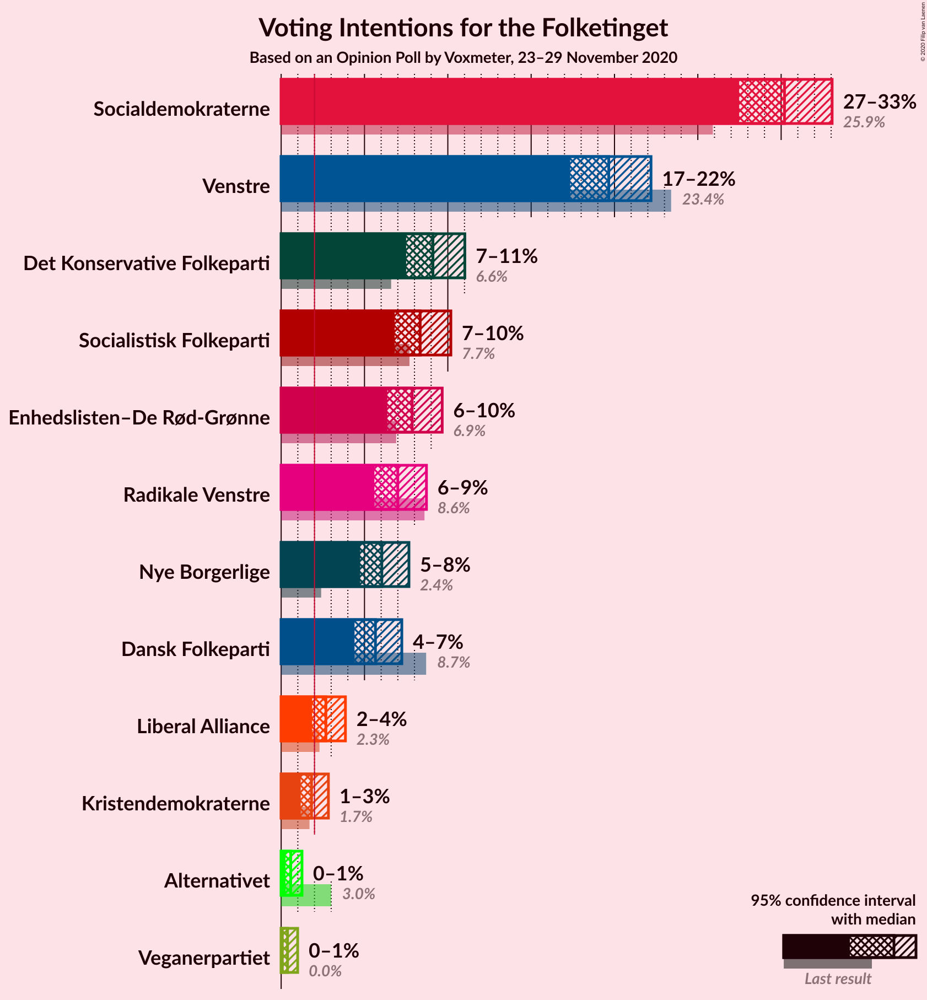

### Confidence Intervals

| Party | Last Result | Poll Result | 80% Confidence Interval | 90% Confidence Interval | 95% Confidence Interval | 99% Confidence Interval |
|:-----:|:-----------:|:-----------:|:-----------------------:|:-----------------------:|:-----------------------:|:-----------------------:|
| Socialdemokraterne | 25.9% | 30.2% | 28.4–32.1% |27.9–32.6% |27.5–33.1% |26.6–34.0% |
| Venstre | 23.4% | 19.7% | 18.1–21.3% |17.7–21.8% |17.3–22.2% |16.6–23.0% |
| Det Konservative Folkeparti | 6.6% | 9.1% | 8.0–10.3% |7.8–10.7% |7.5–11.0% |7.0–11.6% |
| Socialistisk Folkeparti | 7.7% | 8.3% | 7.3–9.5% |7.0–9.9% |6.8–10.2% |6.4–10.8% |
| Enhedslisten–De Rød-Grønne | 6.9% | 7.9% | 6.9–9.0% |6.6–9.4% |6.4–9.7% |5.9–10.3% |
| Radikale Venstre | 8.6% | 7.0% | 6.1–8.1% |5.8–8.4% |5.6–8.7% |5.2–9.3% |
| Nye Borgerlige | 2.4% | 6.0% | 5.2–7.1% |5.0–7.4% |4.7–7.7% |4.4–8.2% |
| Dansk Folkeparti | 8.7% | 5.7% | 4.8–6.7% |4.6–7.0% |4.4–7.2% |4.0–7.8% |
| Liberal Alliance | 2.3% | 2.7% | 2.1–3.4% |2.0–3.7% |1.9–3.9% |1.6–4.3% |
| Kristendemokraterne | 1.7% | 1.8% | 1.4–2.5% |1.3–2.7% |1.2–2.8% |1.0–3.2% |
| Alternativet | 3.0% | 0.6% | 0.4–1.0% |0.3–1.1% |0.3–1.2% |0.2–1.5% |
| Veganerpartiet | 0.0% | 0.4% | 0.2–0.8% |0.2–0.9% |0.2–1.0% |0.1–1.2% |

*Note:* The poll result column reflects the actual value used in the calculations. Published results may vary slightly, and in addition be rounded to fewer digits.

## Seats

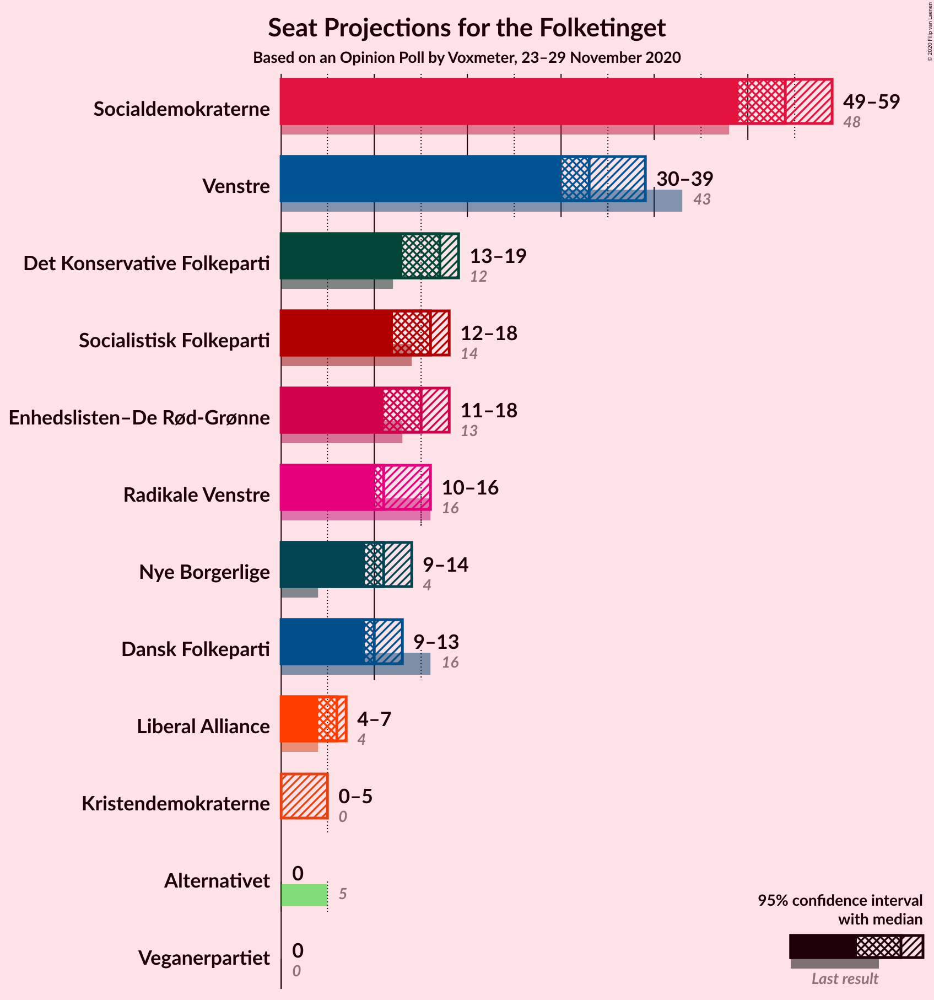

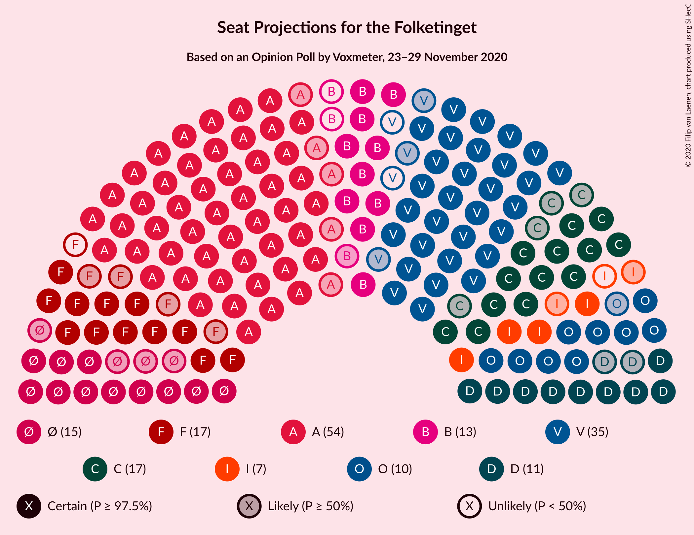

### Confidence Intervals

| Party | Last Result | Median | 80% Confidence Interval | 90% Confidence Interval | 95% Confidence Interval | 99% Confidence Interval |
|:-----:|:-----------:|:------:|:-----------------------:|:-----------------------:|:-----------------------:|:-----------------------:|
| <a href="#socialdemokraterne">Socialdemokraterne</a> | 48 | 54 | 51–57 |49–57 |49–59 |48–60 |
| <a href="#venstre">Venstre</a> | 43 | 33 | 32–36 |30–38 |30–39 |30–41 |
| <a href="#det-konservative-folkeparti">Det Konservative Folkeparti</a> | 12 | 17 | 14–18 |13–19 |13–19 |13–21 |
| <a href="#socialistisk-folkeparti">Socialistisk Folkeparti</a> | 14 | 16 | 13–17 |12–18 |12–18 |11–19 |
| <a href="#enhedslisten–de-rød-grønne">Enhedslisten–De Rød-Grønne</a> | 13 | 15 | 13–16 |12–17 |11–18 |11–18 |
| <a href="#radikale-venstre">Radikale Venstre</a> | 16 | 11 | 11–14 |10–16 |10–16 |9–16 |
| <a href="#nye-borgerlige">Nye Borgerlige</a> | 4 | 11 | 10–13 |9–13 |9–14 |8–15 |
| <a href="#dansk-folkeparti">Dansk Folkeparti</a> | 16 | 10 | 10–12 |9–13 |9–13 |8–14 |
| <a href="#liberal-alliance">Liberal Alliance</a> | 4 | 6 | 4–7 |4–7 |4–7 |0–7 |
| <a href="#kristendemokraterne">Kristendemokraterne</a> | 0 | 0 | 0–4 |0–5 |0–5 |0–5 |
| <a href="#alternativet">Alternativet</a> | 5 | 0 | 0 |0 |0 |0 |
| <a href="#veganerpartiet">Veganerpartiet</a> | 0 | 0 | 0 |0 |0 |0 |

### Socialdemokraterne

*For a full overview of the results for this party, see the [Socialdemokraterne](party-socialdemokraterne.html) page.*

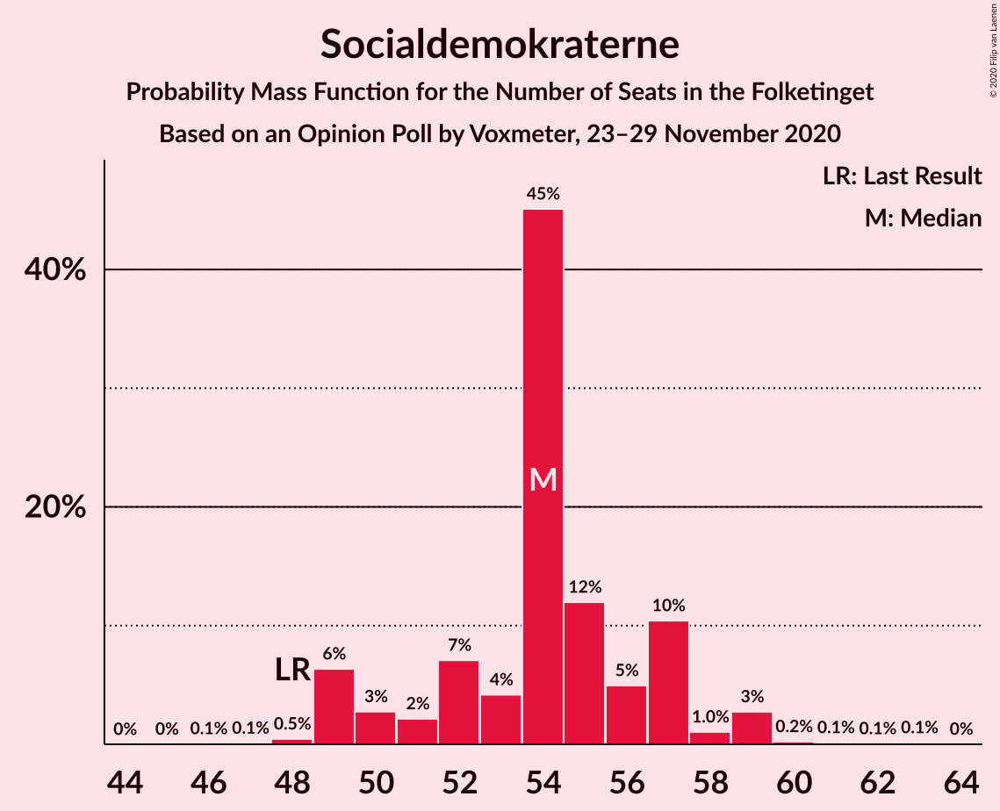

| Number of Seats | Probability | Accumulated | Special Marks |
|:---------------:|:-----------:|:-----------:|:-------------:|
| 46 | 0.1% | 100% |  |
| 47 | 0.1% | 99.9% |  |
| 48 | 0.5% | 99.8% | Last Result |
| 49 | 6% | 99.4% |  |
| 50 | 3% | 93% |  |
| 51 | 2% | 90% |  |
| 52 | 7% | 88% |  |
| 53 | 4% | 81% |  |
| 54 | 45% | 77% | Median |
| 55 | 12% | 32% |  |
| 56 | 5% | 20% |  |
| 57 | 10% | 15% |  |
| 58 | 1.0% | 4% |  |
| 59 | 3% | 3% |  |
| 60 | 0.2% | 0.6% |  |
| 61 | 0.1% | 0.4% |  |
| 62 | 0.1% | 0.2% |  |
| 63 | 0.1% | 0.2% |  |
| 64 | 0% | 0% |  |

### Venstre

*For a full overview of the results for this party, see the [Venstre](party-venstre.html) page.*

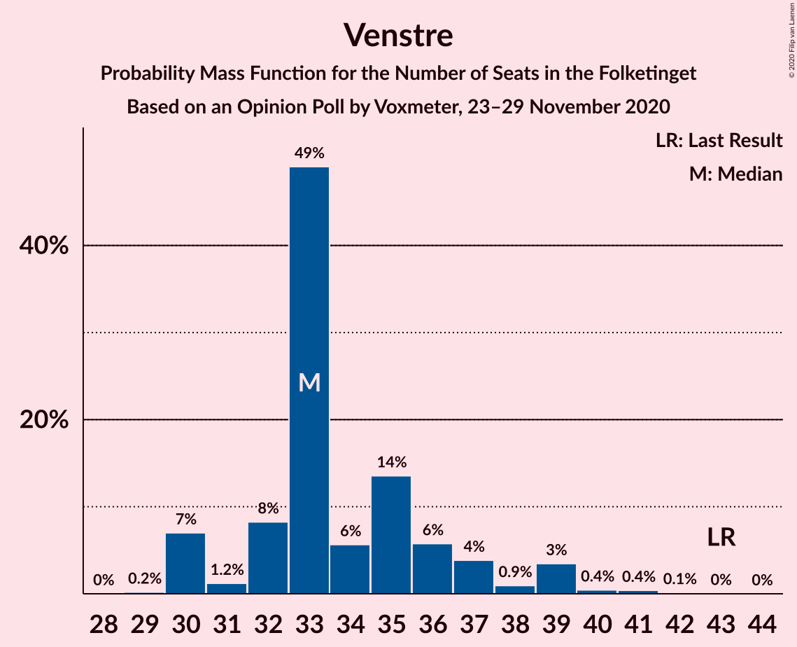

| Number of Seats | Probability | Accumulated | Special Marks |
|:---------------:|:-----------:|:-----------:|:-------------:|
| 29 | 0.2% | 100% |  |
| 30 | 7% | 99.8% |  |
| 31 | 1.2% | 93% |  |
| 32 | 8% | 92% |  |
| 33 | 49% | 83% | Median |
| 34 | 6% | 34% |  |
| 35 | 14% | 29% |  |
| 36 | 6% | 15% |  |
| 37 | 4% | 9% |  |
| 38 | 0.9% | 5% |  |
| 39 | 3% | 5% |  |
| 40 | 0.4% | 1.0% |  |
| 41 | 0.4% | 0.6% |  |
| 42 | 0.1% | 0.2% |  |
| 43 | 0% | 0.1% | Last Result |
| 44 | 0% | 0% |  |

### Det Konservative Folkeparti

*For a full overview of the results for this party, see the [Det Konservative Folkeparti](party-detkonservativefolkeparti.html) page.*

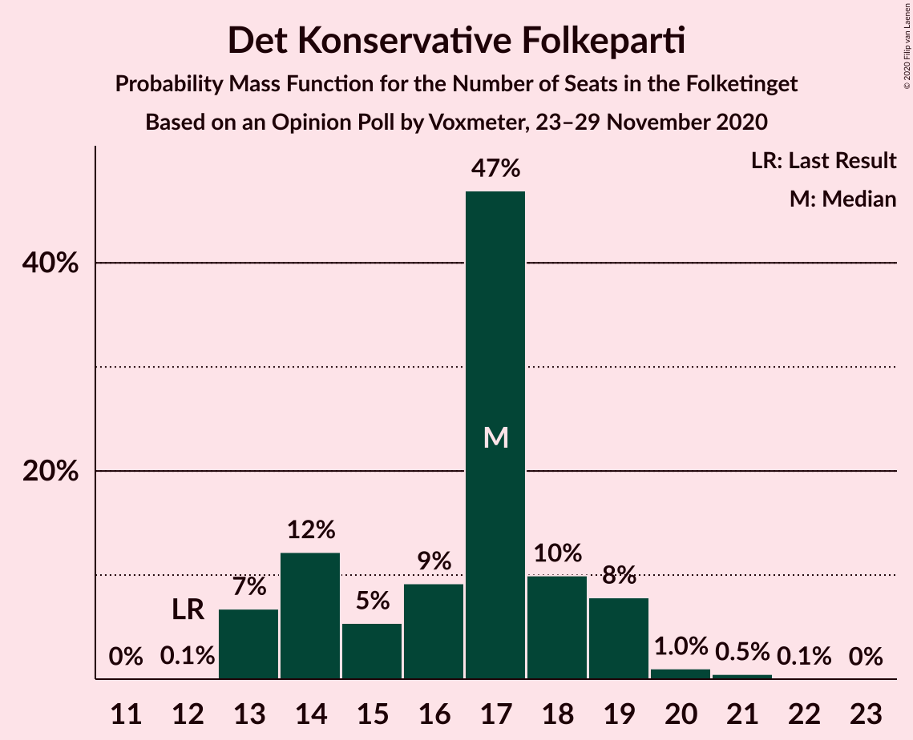

| Number of Seats | Probability | Accumulated | Special Marks |
|:---------------:|:-----------:|:-----------:|:-------------:|
| 12 | 0.1% | 100% | Last Result |
| 13 | 7% | 99.9% |  |
| 14 | 12% | 93% |  |
| 15 | 5% | 81% |  |
| 16 | 9% | 76% |  |
| 17 | 47% | 66% | Median |
| 18 | 10% | 19% |  |
| 19 | 8% | 9% |  |
| 20 | 1.0% | 2% |  |
| 21 | 0.5% | 0.6% |  |
| 22 | 0.1% | 0.1% |  |
| 23 | 0% | 0% |  |

### Socialistisk Folkeparti

*For a full overview of the results for this party, see the [Socialistisk Folkeparti](party-socialistiskfolkeparti.html) page.*

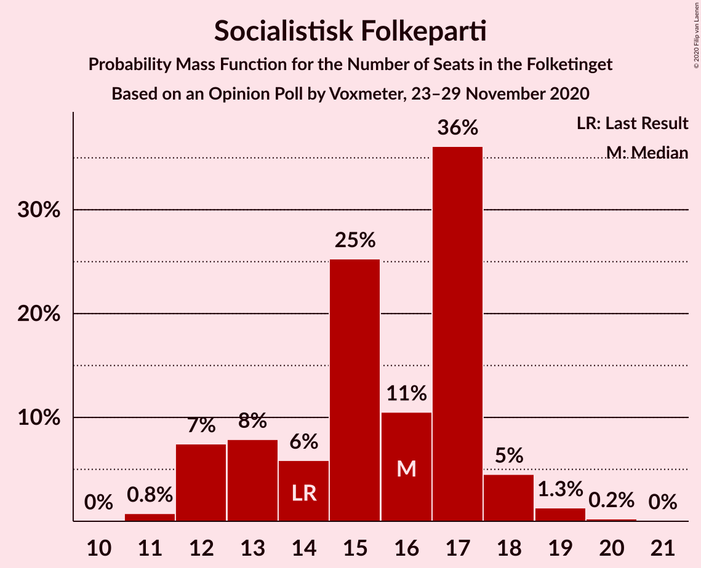

| Number of Seats | Probability | Accumulated | Special Marks |
|:---------------:|:-----------:|:-----------:|:-------------:|
| 11 | 0.8% | 100% |  |
| 12 | 7% | 99.2% |  |
| 13 | 8% | 92% |  |
| 14 | 6% | 84% | Last Result |
| 15 | 25% | 78% |  |
| 16 | 11% | 53% | Median |
| 17 | 36% | 42% |  |
| 18 | 5% | 6% |  |
| 19 | 1.3% | 2% |  |
| 20 | 0.2% | 0.3% |  |
| 21 | 0% | 0% |  |

### Enhedslisten–De Rød-Grønne

*For a full overview of the results for this party, see the [Enhedslisten–De Rød-Grønne](party-enhedslisten–derød-grønne.html) page.*

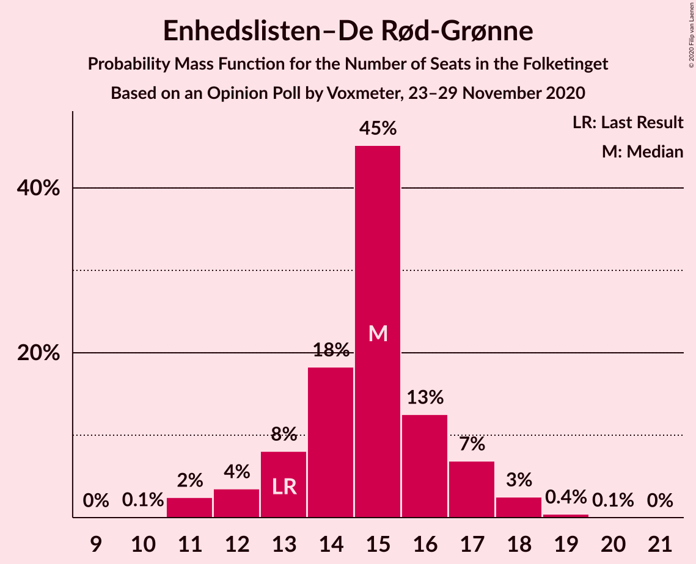

| Number of Seats | Probability | Accumulated | Special Marks |
|:---------------:|:-----------:|:-----------:|:-------------:|
| 10 | 0.1% | 100% |  |
| 11 | 2% | 99.9% |  |
| 12 | 4% | 97% |  |
| 13 | 8% | 94% | Last Result |
| 14 | 18% | 86% |  |
| 15 | 45% | 68% | Median |
| 16 | 13% | 22% |  |
| 17 | 7% | 10% |  |
| 18 | 3% | 3% |  |
| 19 | 0.4% | 0.5% |  |
| 20 | 0.1% | 0.1% |  |
| 21 | 0% | 0% |  |

### Radikale Venstre

*For a full overview of the results for this party, see the [Radikale Venstre](party-radikalevenstre.html) page.*

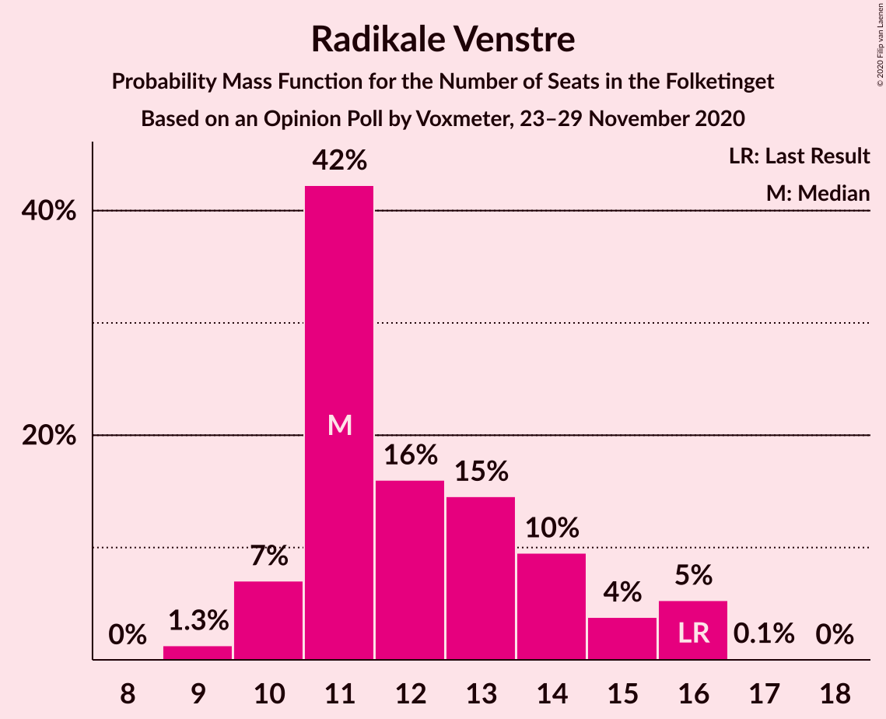

| Number of Seats | Probability | Accumulated | Special Marks |
|:---------------:|:-----------:|:-----------:|:-------------:|
| 9 | 1.3% | 100% |  |
| 10 | 7% | 98.7% |  |
| 11 | 42% | 92% | Median |
| 12 | 16% | 49% |  |
| 13 | 15% | 33% |  |
| 14 | 10% | 19% |  |
| 15 | 4% | 9% |  |
| 16 | 5% | 5% | Last Result |
| 17 | 0.1% | 0.2% |  |
| 18 | 0% | 0% |  |

### Nye Borgerlige

*For a full overview of the results for this party, see the [Nye Borgerlige](party-nyeborgerlige.html) page.*

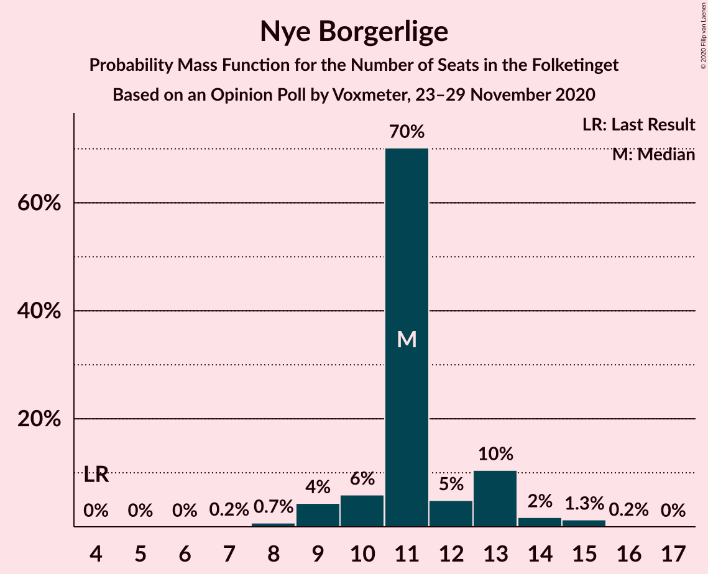

| Number of Seats | Probability | Accumulated | Special Marks |
|:---------------:|:-----------:|:-----------:|:-------------:|
| 4 | 0% | 100% | Last Result |
| 5 | 0% | 100% |  |
| 6 | 0% | 100% |  |
| 7 | 0.2% | 100% |  |
| 8 | 0.7% | 99.8% |  |
| 9 | 4% | 99.1% |  |
| 10 | 6% | 95% |  |
| 11 | 70% | 89% | Median |
| 12 | 5% | 19% |  |
| 13 | 10% | 14% |  |
| 14 | 2% | 3% |  |
| 15 | 1.3% | 1.5% |  |
| 16 | 0.2% | 0.2% |  |
| 17 | 0% | 0% |  |

### Dansk Folkeparti

*For a full overview of the results for this party, see the [Dansk Folkeparti](party-danskfolkeparti.html) page.*

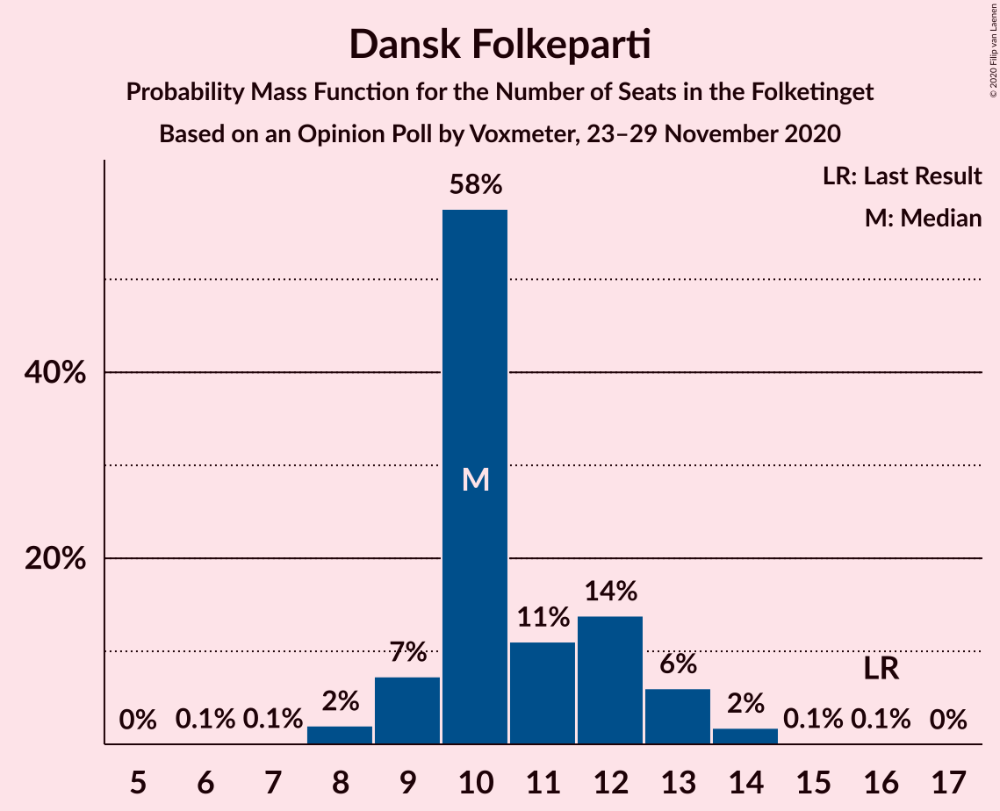

| Number of Seats | Probability | Accumulated | Special Marks |
|:---------------:|:-----------:|:-----------:|:-------------:|
| 6 | 0.1% | 100% |  |
| 7 | 0.1% | 99.9% |  |
| 8 | 2% | 99.8% |  |
| 9 | 7% | 98% |  |
| 10 | 58% | 90% | Median |
| 11 | 11% | 33% |  |
| 12 | 14% | 22% |  |
| 13 | 6% | 8% |  |
| 14 | 2% | 2% |  |
| 15 | 0.1% | 0.2% |  |
| 16 | 0.1% | 0.1% | Last Result |
| 17 | 0% | 0% |  |

### Liberal Alliance

*For a full overview of the results for this party, see the [Liberal Alliance](party-liberalalliance.html) page.*

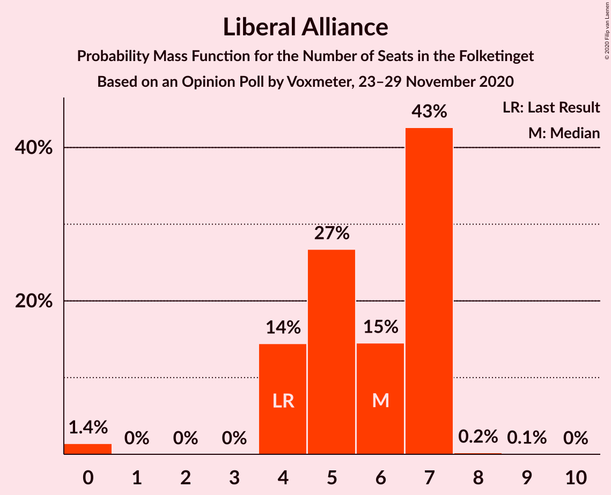

| Number of Seats | Probability | Accumulated | Special Marks |
|:---------------:|:-----------:|:-----------:|:-------------:|
| 0 | 1.4% | 100% |  |
| 1 | 0% | 98.6% |  |
| 2 | 0% | 98.6% |  |
| 3 | 0% | 98.6% |  |
| 4 | 14% | 98.6% | Last Result |
| 5 | 27% | 84% |  |
| 6 | 15% | 57% | Median |
| 7 | 43% | 43% |  |
| 8 | 0.2% | 0.3% |  |
| 9 | 0.1% | 0.1% |  |
| 10 | 0% | 0% |  |

### Kristendemokraterne

*For a full overview of the results for this party, see the [Kristendemokraterne](party-kristendemokraterne.html) page.*

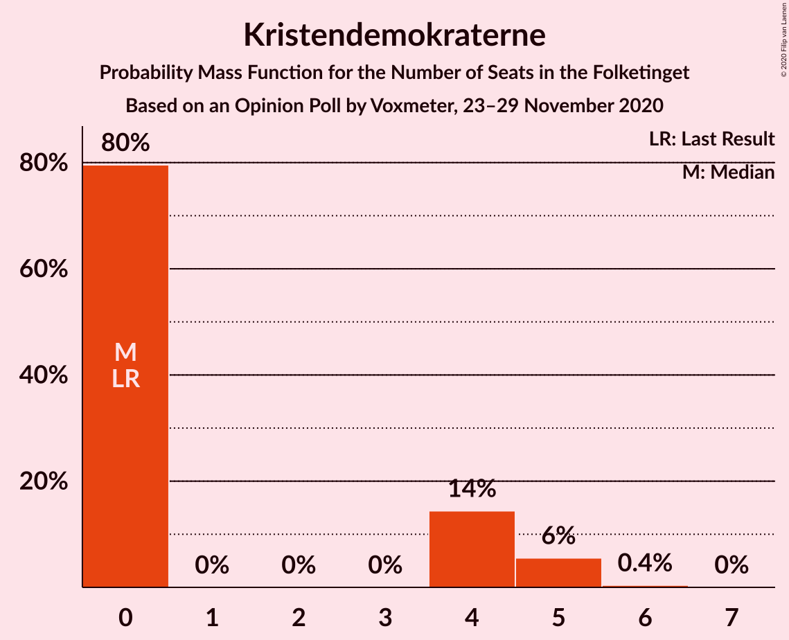

| Number of Seats | Probability | Accumulated | Special Marks |
|:---------------:|:-----------:|:-----------:|:-------------:|
| 0 | 80% | 100% | Last Result, Median |
| 1 | 0% | 20% |  |
| 2 | 0% | 20% |  |
| 3 | 0% | 20% |  |
| 4 | 14% | 20% |  |
| 5 | 6% | 6% |  |
| 6 | 0.4% | 0.4% |  |
| 7 | 0% | 0% |  |

### Alternativet

*For a full overview of the results for this party, see the [Alternativet](party-alternativet.html) page.*

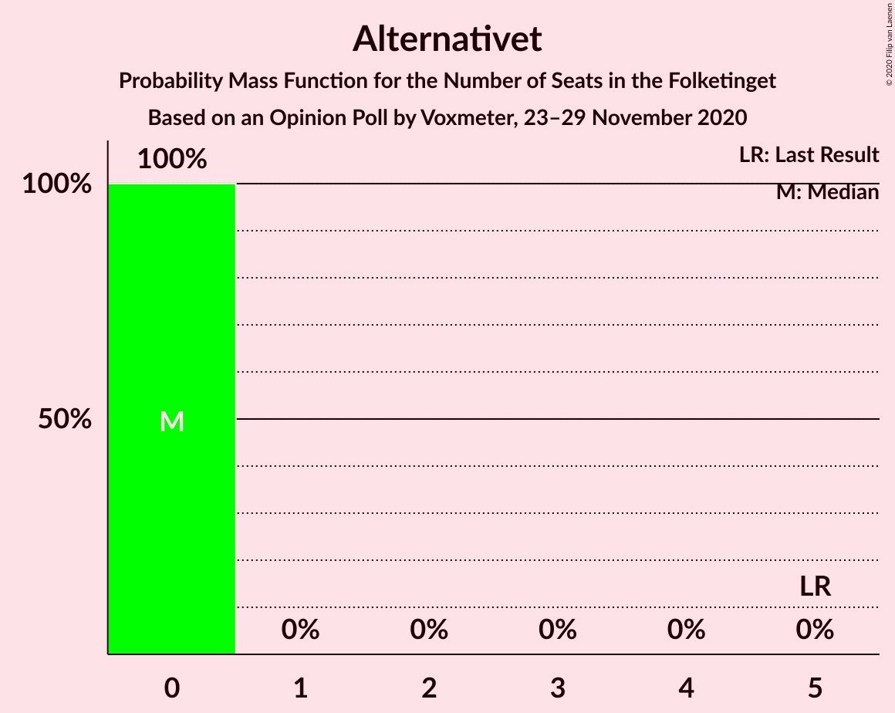

| Number of Seats | Probability | Accumulated | Special Marks |
|:---------------:|:-----------:|:-----------:|:-------------:|
| 0 | 100% | 100% | Median |
| 1 | 0% | 0% |  |
| 2 | 0% | 0% |  |
| 3 | 0% | 0% |  |
| 4 | 0% | 0% |  |
| 5 | 0% | 0% | Last Result |

### Veganerpartiet

*For a full overview of the results for this party, see the [Veganerpartiet](party-veganerpartiet.html) page.*

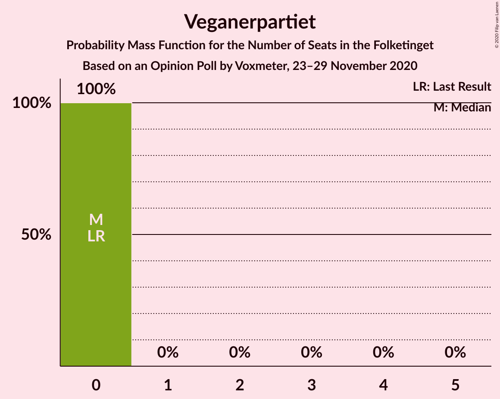

| Number of Seats | Probability | Accumulated | Special Marks |
|:---------------:|:-----------:|:-----------:|:-------------:|
| 0 | 100% | 100% | Last Result, Median |

## Coalitions

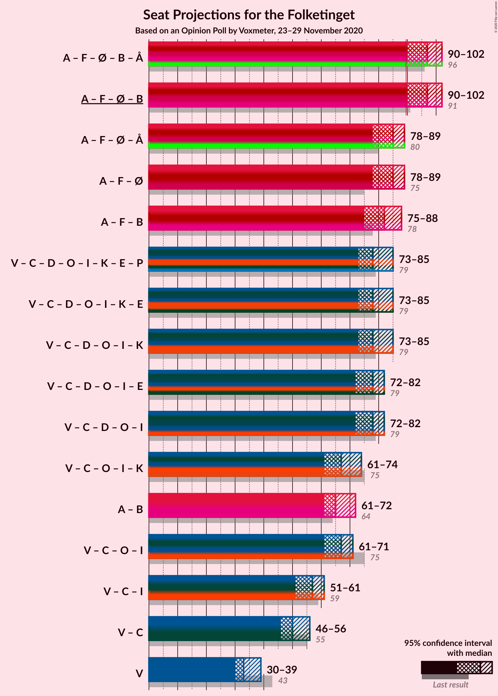

### Confidence Intervals

| Coalition | Last Result | Median | Majority? | 80% Confidence Interval | 90% Confidence Interval | 95% Confidence Interval | 99% Confidence Interval |
|:---------:|:-----------:|:------:|:---------:|:-----------------------:|:-----------------------:|:-----------------------:|:-----------------------:|
| Socialdemokraterne – Socialistisk Folkeparti – Enhedslisten–De Rød-Grønne – Radikale Venstre – Alternativet | 96 | 97 | 98% | 94–100 | 92–102 | 90–102 | 89–103 |
| Socialdemokraterne – Socialistisk Folkeparti – Enhedslisten–De Rød-Grønne – Radikale Venstre | 91 | 97 | 98% | 94–100 | 92–102 | 90–102 | 89–103 |
| Socialdemokraterne – Socialistisk Folkeparti – Enhedslisten–De Rød-Grønne – Alternativet | 80 | 85 | 1.1% | 81–86 | 80–89 | 78–89 | 76–92 |
| Socialdemokraterne – Socialistisk Folkeparti – Enhedslisten–De Rød-Grønne | 75 | 85 | 1.1% | 81–86 | 80–89 | 78–89 | 76–92 |
| Socialdemokraterne – Socialistisk Folkeparti – Radikale Venstre | 78 | 82 | 0.2% | 79–85 | 77–87 | 75–88 | 74–88 |
| Venstre – Det Konservative Folkeparti – Nye Borgerlige – Dansk Folkeparti – Liberal Alliance – Kristendemokraterne | 79 | 78 | 0% | 75–81 | 73–83 | 73–85 | 72–86 |
| Venstre – Det Konservative Folkeparti – Nye Borgerlige – Dansk Folkeparti – Liberal Alliance | 79 | 78 | 0% | 74–80 | 73–82 | 72–82 | 72–85 |
| Venstre – Det Konservative Folkeparti – Dansk Folkeparti – Liberal Alliance – Kristendemokraterne | 75 | 67 | 0% | 63–70 | 62–72 | 61–74 | 61–75 |
| Socialdemokraterne – Radikale Venstre | 64 | 65 | 0% | 64–69 | 61–72 | 61–72 | 60–73 |
| Venstre – Det Konservative Folkeparti – Dansk Folkeparti – Liberal Alliance | 75 | 67 | 0% | 63–69 | 62–70 | 61–71 | 60–73 |
| Venstre – Det Konservative Folkeparti – Liberal Alliance | 59 | 57 | 0% | 52–58 | 52–60 | 51–61 | 49–62 |
| Venstre – Det Konservative Folkeparti | 55 | 50 | 0% | 47–53 | 47–55 | 46–56 | 45–57 |
| Venstre | 43 | 33 | 0% | 32–36 | 30–38 | 30–39 | 30–41 |

### Socialdemokraterne – Socialistisk Folkeparti – Enhedslisten–De Rød-Grønne – Radikale Venstre – Alternativet

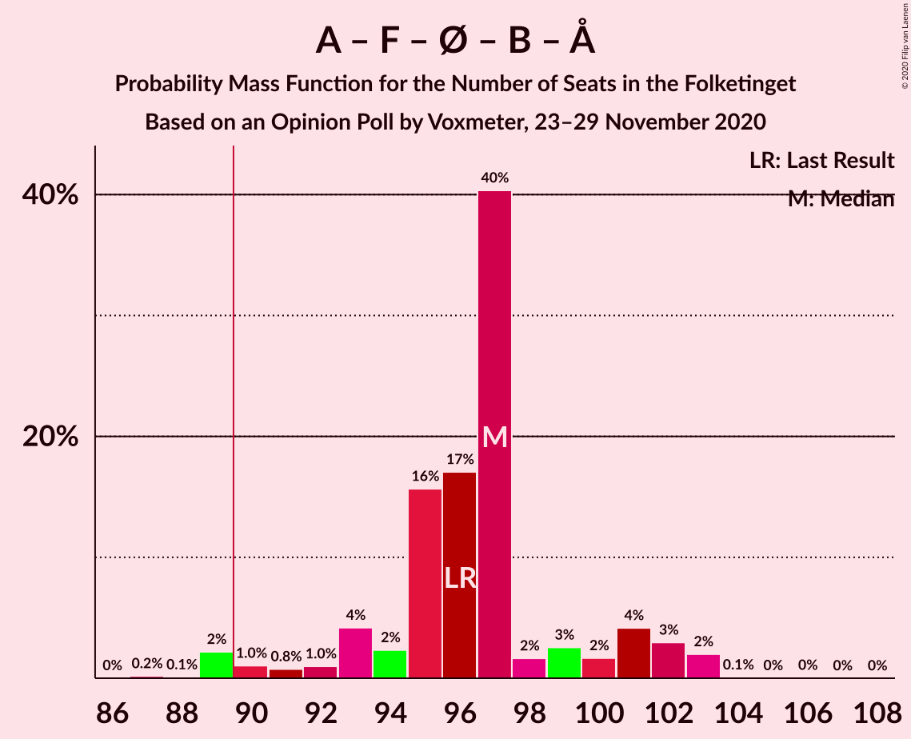

| Number of Seats | Probability | Accumulated | Special Marks |
|:---------------:|:-----------:|:-----------:|:-------------:|
| 87 | 0.2% | 100% |  |
| 88 | 0.1% | 99.8% |  |
| 89 | 2% | 99.7% |  |
| 90 | 1.0% | 98% | Majority |
| 91 | 0.8% | 96% |  |
| 92 | 1.0% | 96% |  |
| 93 | 4% | 95% |  |
| 94 | 2% | 91% |  |
| 95 | 16% | 88% |  |
| 96 | 17% | 73% | Last Result, Median |
| 97 | 40% | 55% |  |
| 98 | 2% | 15% |  |
| 99 | 3% | 13% |  |
| 100 | 2% | 11% |  |
| 101 | 4% | 9% |  |
| 102 | 3% | 5% |  |
| 103 | 2% | 2% |  |
| 104 | 0.1% | 0.2% |  |
| 105 | 0% | 0.1% |  |
| 106 | 0% | 0.1% |  |
| 107 | 0% | 0% |  |

### Socialdemokraterne – Socialistisk Folkeparti – Enhedslisten–De Rød-Grønne – Radikale Venstre

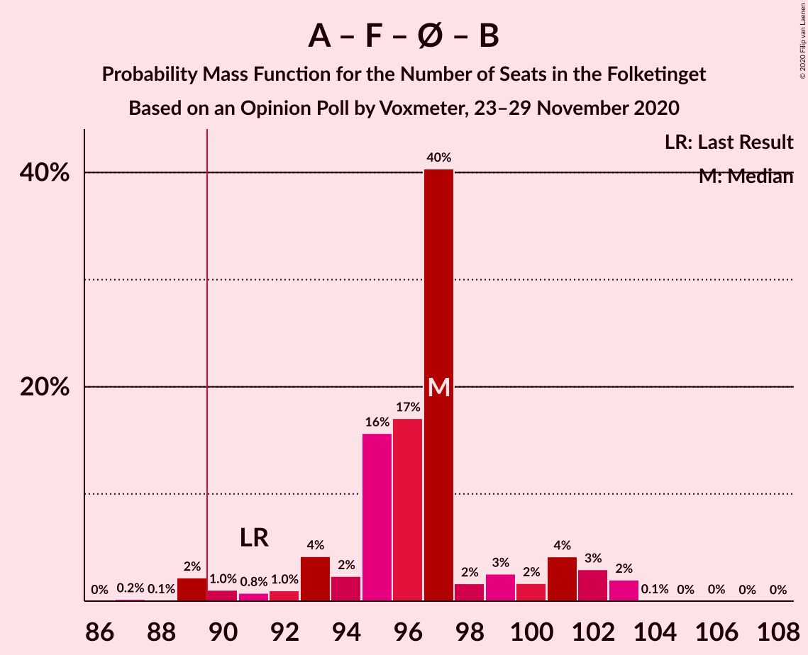

| Number of Seats | Probability | Accumulated | Special Marks |
|:---------------:|:-----------:|:-----------:|:-------------:|
| 87 | 0.2% | 100% |  |
| 88 | 0.1% | 99.8% |  |
| 89 | 2% | 99.7% |  |
| 90 | 1.0% | 98% | Majority |
| 91 | 0.8% | 96% | Last Result |
| 92 | 1.0% | 96% |  |
| 93 | 4% | 95% |  |
| 94 | 2% | 91% |  |
| 95 | 16% | 88% |  |
| 96 | 17% | 73% | Median |
| 97 | 40% | 55% |  |
| 98 | 2% | 15% |  |
| 99 | 3% | 13% |  |
| 100 | 2% | 11% |  |
| 101 | 4% | 9% |  |
| 102 | 3% | 5% |  |
| 103 | 2% | 2% |  |
| 104 | 0.1% | 0.2% |  |
| 105 | 0% | 0.1% |  |
| 106 | 0% | 0.1% |  |
| 107 | 0% | 0% |  |

### Socialdemokraterne – Socialistisk Folkeparti – Enhedslisten–De Rød-Grønne – Alternativet

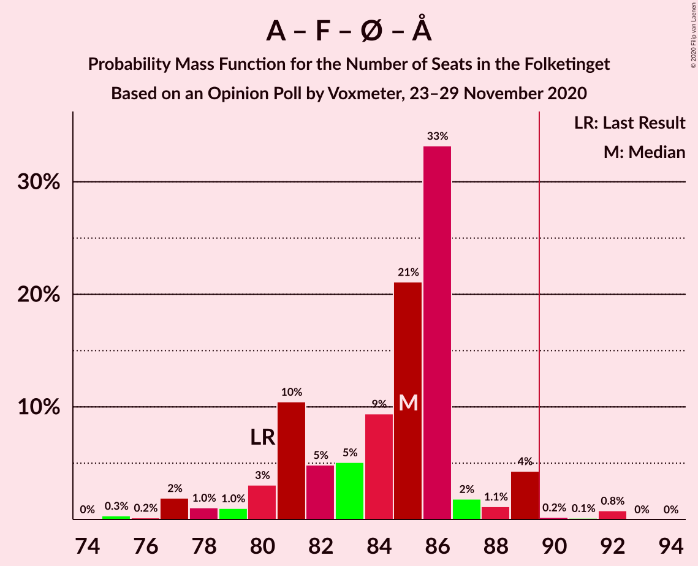

| Number of Seats | Probability | Accumulated | Special Marks |
|:---------------:|:-----------:|:-----------:|:-------------:|
| 75 | 0.3% | 100% |  |
| 76 | 0.2% | 99.6% |  |
| 77 | 2% | 99.5% |  |
| 78 | 1.0% | 98% |  |
| 79 | 1.0% | 97% |  |
| 80 | 3% | 96% | Last Result |
| 81 | 10% | 92% |  |
| 82 | 5% | 82% |  |
| 83 | 5% | 77% |  |
| 84 | 9% | 72% |  |
| 85 | 21% | 63% | Median |
| 86 | 33% | 42% |  |
| 87 | 2% | 8% |  |
| 88 | 1.1% | 7% |  |
| 89 | 4% | 5% |  |
| 90 | 0.2% | 1.1% | Majority |
| 91 | 0.1% | 0.9% |  |
| 92 | 0.8% | 0.8% |  |
| 93 | 0% | 0% |  |

### Socialdemokraterne – Socialistisk Folkeparti – Enhedslisten–De Rød-Grønne

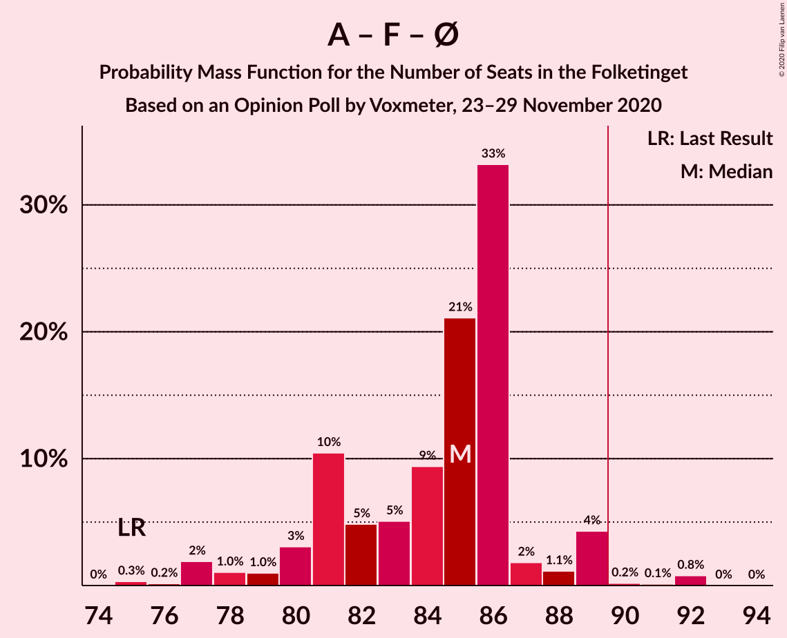

| Number of Seats | Probability | Accumulated | Special Marks |
|:---------------:|:-----------:|:-----------:|:-------------:|
| 75 | 0.3% | 100% | Last Result |
| 76 | 0.2% | 99.6% |  |
| 77 | 2% | 99.5% |  |
| 78 | 1.0% | 98% |  |
| 79 | 1.0% | 97% |  |
| 80 | 3% | 96% |  |
| 81 | 10% | 92% |  |
| 82 | 5% | 82% |  |
| 83 | 5% | 77% |  |
| 84 | 9% | 72% |  |
| 85 | 21% | 63% | Median |
| 86 | 33% | 42% |  |
| 87 | 2% | 8% |  |
| 88 | 1.1% | 7% |  |
| 89 | 4% | 5% |  |
| 90 | 0.2% | 1.1% | Majority |
| 91 | 0.1% | 0.9% |  |
| 92 | 0.8% | 0.8% |  |
| 93 | 0% | 0% |  |

### Socialdemokraterne – Socialistisk Folkeparti – Radikale Venstre

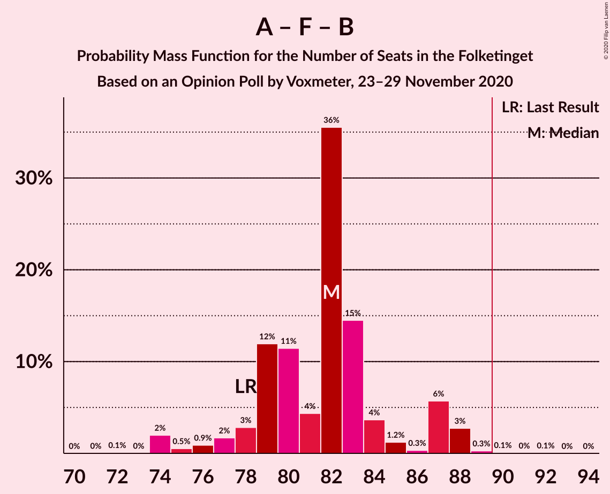

| Number of Seats | Probability | Accumulated | Special Marks |
|:---------------:|:-----------:|:-----------:|:-------------:|
| 72 | 0.1% | 100% |  |
| 73 | 0% | 99.9% |  |
| 74 | 2% | 99.9% |  |
| 75 | 0.5% | 98% |  |
| 76 | 0.9% | 97% |  |
| 77 | 2% | 96% |  |
| 78 | 3% | 95% | Last Result |
| 79 | 12% | 92% |  |
| 80 | 11% | 80% |  |
| 81 | 4% | 69% | Median |
| 82 | 36% | 64% |  |
| 83 | 15% | 29% |  |
| 84 | 4% | 14% |  |
| 85 | 1.2% | 10% |  |
| 86 | 0.3% | 9% |  |
| 87 | 6% | 9% |  |
| 88 | 3% | 3% |  |
| 89 | 0.3% | 0.5% |  |
| 90 | 0.1% | 0.2% | Majority |
| 91 | 0% | 0.1% |  |
| 92 | 0.1% | 0.1% |  |
| 93 | 0% | 0% |  |

### Venstre – Det Konservative Folkeparti – Nye Borgerlige – Dansk Folkeparti – Liberal Alliance – Kristendemokraterne

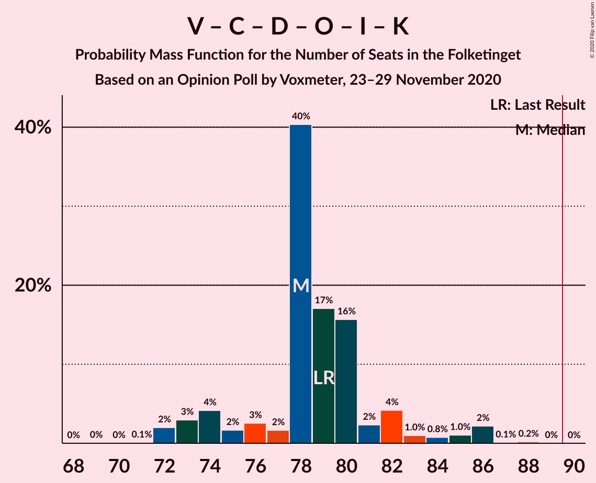

| Number of Seats | Probability | Accumulated | Special Marks |
|:---------------:|:-----------:|:-----------:|:-------------:|
| 69 | 0% | 100% |  |
| 70 | 0% | 99.9% |  |
| 71 | 0.1% | 99.9% |  |
| 72 | 2% | 99.8% |  |
| 73 | 3% | 98% |  |
| 74 | 4% | 95% |  |
| 75 | 2% | 91% |  |
| 76 | 3% | 89% |  |
| 77 | 2% | 87% | Median |
| 78 | 40% | 85% |  |
| 79 | 17% | 45% | Last Result |
| 80 | 16% | 27% |  |
| 81 | 2% | 12% |  |
| 82 | 4% | 9% |  |
| 83 | 1.0% | 5% |  |
| 84 | 0.8% | 4% |  |
| 85 | 1.0% | 4% |  |
| 86 | 2% | 2% |  |
| 87 | 0.1% | 0.3% |  |
| 88 | 0.2% | 0.2% |  |
| 89 | 0% | 0% |  |

### Venstre – Det Konservative Folkeparti – Nye Borgerlige – Dansk Folkeparti – Liberal Alliance

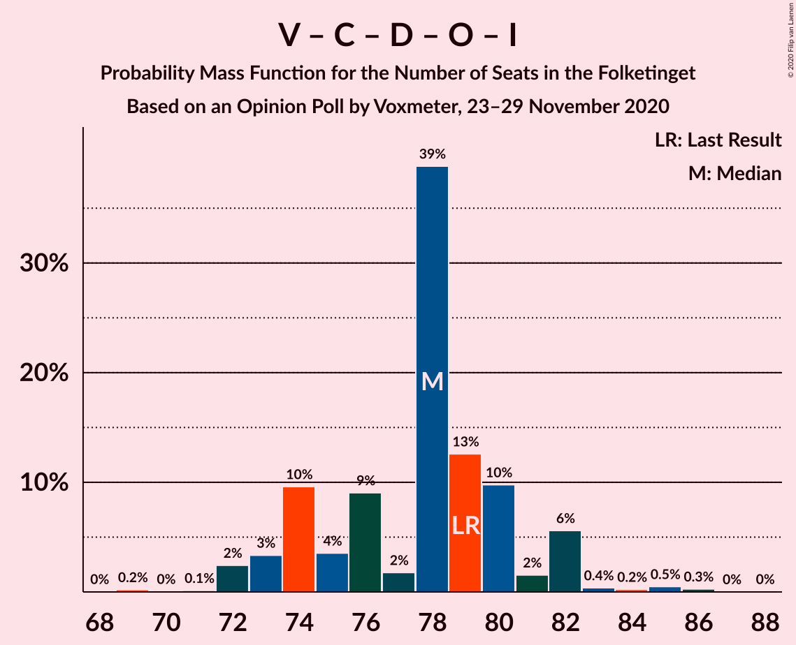

| Number of Seats | Probability | Accumulated | Special Marks |
|:---------------:|:-----------:|:-----------:|:-------------:|
| 69 | 0.2% | 100% |  |
| 70 | 0% | 99.7% |  |
| 71 | 0.1% | 99.7% |  |
| 72 | 2% | 99.6% |  |
| 73 | 3% | 97% |  |
| 74 | 10% | 94% |  |
| 75 | 4% | 84% |  |
| 76 | 9% | 81% |  |
| 77 | 2% | 72% | Median |
| 78 | 39% | 70% |  |
| 79 | 13% | 31% | Last Result |
| 80 | 10% | 18% |  |
| 81 | 2% | 9% |  |
| 82 | 6% | 7% |  |
| 83 | 0.4% | 1.5% |  |
| 84 | 0.2% | 1.1% |  |
| 85 | 0.5% | 0.8% |  |
| 86 | 0.3% | 0.3% |  |
| 87 | 0% | 0.1% |  |
| 88 | 0% | 0% |  |

### Venstre – Det Konservative Folkeparti – Dansk Folkeparti – Liberal Alliance – Kristendemokraterne

| Number of Seats | Probability | Accumulated | Special Marks |
|:---------------:|:-----------:|:-----------:|:-------------:|
| 57 | 0.1% | 100% |  |
| 58 | 0% | 99.9% |  |
| 59 | 0% | 99.9% |  |
| 60 | 0.1% | 99.9% |  |
| 61 | 3% | 99.8% |  |
| 62 | 3% | 97% |  |
| 63 | 5% | 94% |  |
| 64 | 1.3% | 90% |  |
| 65 | 2% | 88% |  |
| 66 | 3% | 86% | Median |
| 67 | 44% | 83% |  |
| 68 | 18% | 39% |  |
| 69 | 10% | 22% |  |
| 70 | 5% | 11% |  |
| 71 | 0.8% | 7% |  |
| 72 | 1.2% | 6% |  |
| 73 | 2% | 5% |  |
| 74 | 0.5% | 3% |  |
| 75 | 2% | 2% | Last Result |
| 76 | 0.2% | 0.3% |  |
| 77 | 0% | 0.1% |  |
| 78 | 0.1% | 0.1% |  |
| 79 | 0% | 0% |  |

### Socialdemokraterne – Radikale Venstre

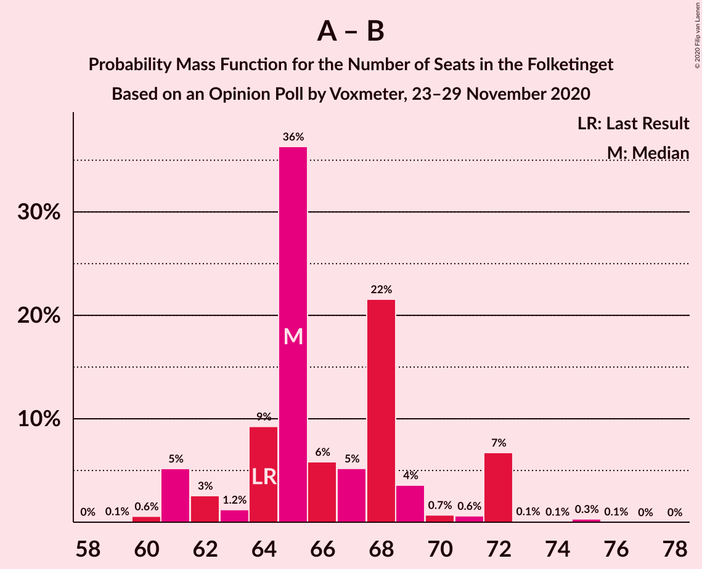

| Number of Seats | Probability | Accumulated | Special Marks |
|:---------------:|:-----------:|:-----------:|:-------------:|
| 58 | 0% | 100% |  |
| 59 | 0.1% | 99.9% |  |
| 60 | 0.6% | 99.8% |  |
| 61 | 5% | 99.3% |  |
| 62 | 3% | 94% |  |
| 63 | 1.2% | 92% |  |
| 64 | 9% | 90% | Last Result |
| 65 | 36% | 81% | Median |
| 66 | 6% | 45% |  |
| 67 | 5% | 39% |  |
| 68 | 22% | 34% |  |
| 69 | 4% | 12% |  |
| 70 | 0.7% | 9% |  |
| 71 | 0.6% | 8% |  |
| 72 | 7% | 7% |  |
| 73 | 0.1% | 0.5% |  |
| 74 | 0.1% | 0.4% |  |
| 75 | 0.3% | 0.4% |  |
| 76 | 0.1% | 0.1% |  |
| 77 | 0% | 0% |  |

### Venstre – Det Konservative Folkeparti – Dansk Folkeparti – Liberal Alliance

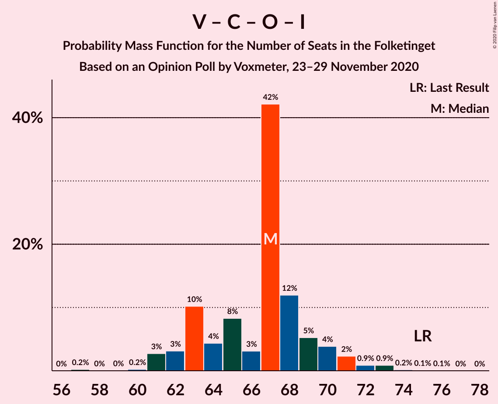

| Number of Seats | Probability | Accumulated | Special Marks |
|:---------------:|:-----------:|:-----------:|:-------------:|
| 57 | 0.2% | 100% |  |
| 58 | 0% | 99.8% |  |
| 59 | 0% | 99.7% |  |
| 60 | 0.2% | 99.7% |  |
| 61 | 3% | 99.5% |  |
| 62 | 3% | 97% |  |
| 63 | 10% | 94% |  |
| 64 | 4% | 83% |  |
| 65 | 8% | 79% |  |
| 66 | 3% | 71% | Median |
| 67 | 42% | 68% |  |
| 68 | 12% | 25% |  |
| 69 | 5% | 14% |  |
| 70 | 4% | 8% |  |
| 71 | 2% | 4% |  |
| 72 | 0.9% | 2% |  |
| 73 | 0.9% | 1.2% |  |
| 74 | 0.2% | 0.3% |  |
| 75 | 0.1% | 0.2% | Last Result |
| 76 | 0.1% | 0.1% |  |
| 77 | 0% | 0% |  |

### Venstre – Det Konservative Folkeparti – Liberal Alliance

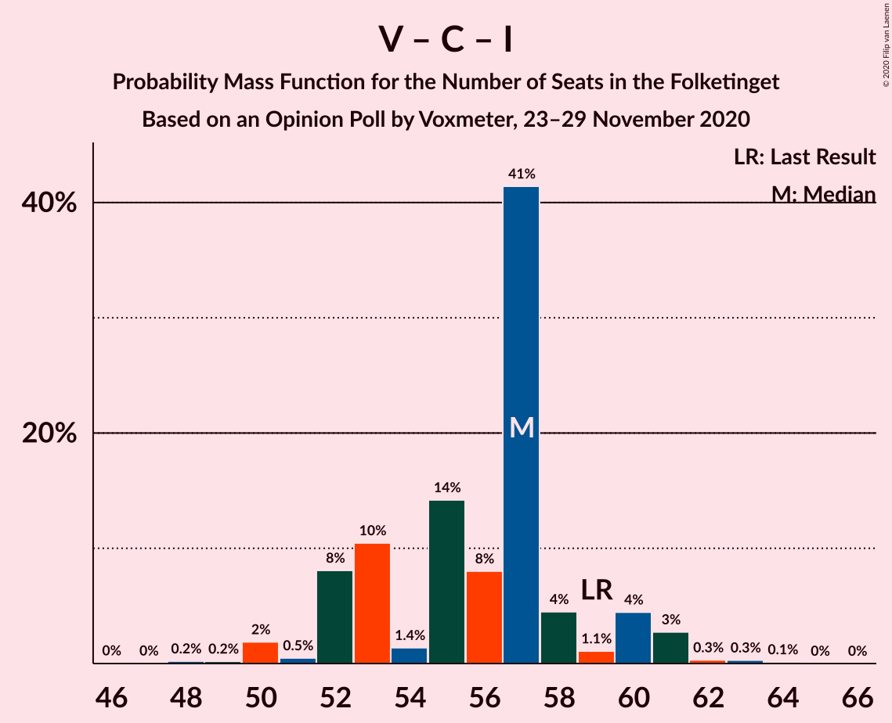

| Number of Seats | Probability | Accumulated | Special Marks |
|:---------------:|:-----------:|:-----------:|:-------------:|
| 46 | 0% | 100% |  |
| 47 | 0% | 99.9% |  |
| 48 | 0.2% | 99.9% |  |
| 49 | 0.2% | 99.7% |  |
| 50 | 2% | 99.5% |  |
| 51 | 0.5% | 98% |  |
| 52 | 8% | 97% |  |
| 53 | 10% | 89% |  |
| 54 | 1.4% | 79% |  |
| 55 | 14% | 77% |  |
| 56 | 8% | 63% | Median |
| 57 | 41% | 55% |  |
| 58 | 4% | 14% |  |
| 59 | 1.1% | 9% | Last Result |
| 60 | 4% | 8% |  |
| 61 | 3% | 4% |  |
| 62 | 0.3% | 0.8% |  |
| 63 | 0.3% | 0.5% |  |
| 64 | 0.1% | 0.2% |  |
| 65 | 0% | 0% |  |

### Venstre – Det Konservative Folkeparti

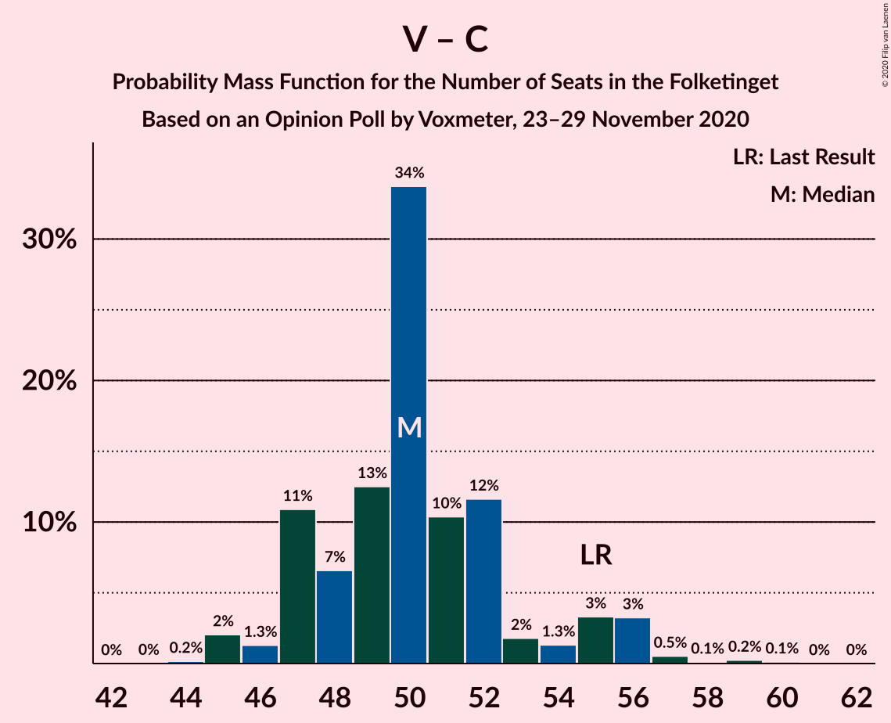

| Number of Seats | Probability | Accumulated | Special Marks |
|:---------------:|:-----------:|:-----------:|:-------------:|
| 43 | 0% | 100% |  |
| 44 | 0.2% | 99.9% |  |
| 45 | 2% | 99.8% |  |
| 46 | 1.3% | 98% |  |
| 47 | 11% | 96% |  |
| 48 | 7% | 86% |  |
| 49 | 13% | 79% |  |
| 50 | 34% | 66% | Median |
| 51 | 10% | 33% |  |
| 52 | 12% | 22% |  |
| 53 | 2% | 11% |  |
| 54 | 1.3% | 9% |  |
| 55 | 3% | 8% | Last Result |
| 56 | 3% | 4% |  |
| 57 | 0.5% | 1.0% |  |
| 58 | 0.1% | 0.5% |  |
| 59 | 0.2% | 0.4% |  |
| 60 | 0.1% | 0.1% |  |
| 61 | 0% | 0% |  |

### Venstre

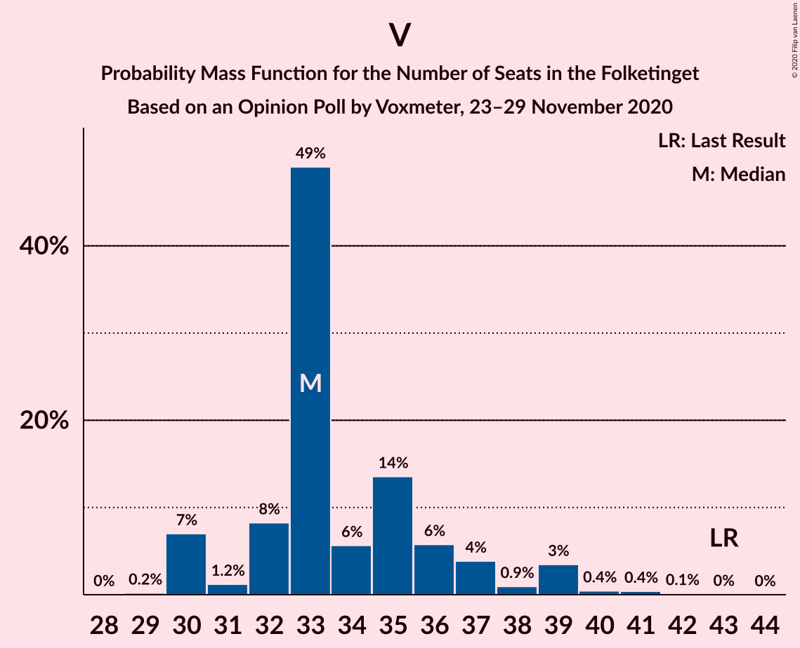

| Number of Seats | Probability | Accumulated | Special Marks |
|:---------------:|:-----------:|:-----------:|:-------------:|
| 29 | 0.2% | 100% |  |
| 30 | 7% | 99.8% |  |
| 31 | 1.2% | 93% |  |
| 32 | 8% | 92% |  |
| 33 | 49% | 83% | Median |
| 34 | 6% | 34% |  |
| 35 | 14% | 29% |  |
| 36 | 6% | 15% |  |
| 37 | 4% | 9% |  |
| 38 | 0.9% | 5% |  |
| 39 | 3% | 5% |  |
| 40 | 0.4% | 1.0% |  |
| 41 | 0.4% | 0.6% |  |
| 42 | 0.1% | 0.2% |  |
| 43 | 0% | 0.1% | Last Result |
| 44 | 0% | 0% |  |

## Technical Information

### Opinion Poll

+ **Polling firm:** Voxmeter
+ **Commissioner(s):** —
+ **Fieldwork period:** 23–29 November 2020

### Calculations

+ **Sample size:** 1043
+ **Simulations done:** 1,048,576
+ **Error estimate:** 1.27%

