# Opinion Poll by Megafon for Politiken and TV 2, 30 November–3 December 2020

<a href="#voting-intentions">Voting Intentions</a> | <a href="#seats">Seats</a> | <a href="#coalitions">Coalitions</a> | <a href="#technical-information">Technical Information</a>

## Voting Intentions

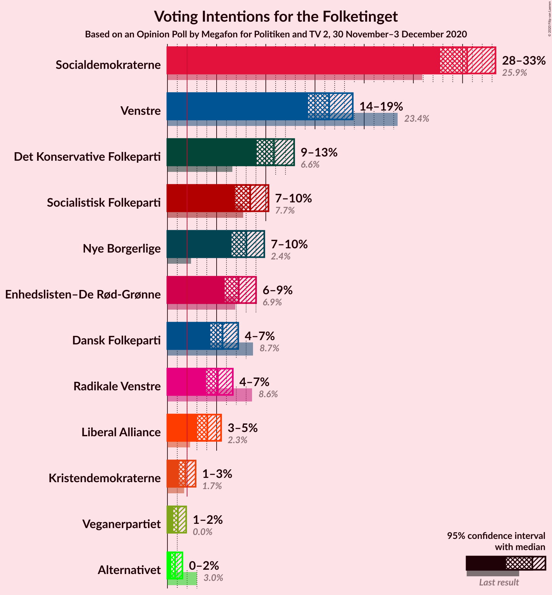

### Confidence Intervals

| Party | Last Result | Poll Result | 80% Confidence Interval | 90% Confidence Interval | 95% Confidence Interval | 99% Confidence Interval |
|:-----:|:-----------:|:-----------:|:-----------------------:|:-----------------------:|:-----------------------:|:-----------------------:|
| Socialdemokraterne | 25.9% | 30.5% | 28.7–32.3% |28.2–32.9% |27.7–33.3% |26.9–34.3% |
| Venstre | 23.4% | 16.4% | 15.0–18.0% |14.6–18.4% |14.3–18.8% |13.7–19.6% |
| Det Konservative Folkeparti | 6.6% | 10.8% | 9.7–12.2% |9.4–12.5% |9.1–12.9% |8.6–13.5% |
| Socialistisk Folkeparti | 7.7% | 8.4% | 7.4–9.6% |7.1–10.0% |6.9–10.3% |6.4–10.9% |
| Nye Borgerlige | 2.4% | 8.0% | 7.0–9.2% |6.8–9.6% |6.5–9.8% |6.1–10.5% |
| Enhedslisten–De Rød-Grønne | 6.9% | 7.3% | 6.3–8.4% |6.1–8.7% |5.8–9.0% |5.4–9.6% |
| Dansk Folkeparti | 8.7% | 5.6% | 4.8–6.6% |4.6–6.9% |4.4–7.2% |4.0–7.7% |
| Radikale Venstre | 8.6% | 5.1% | 4.3–6.1% |4.1–6.4% |3.9–6.6% |3.6–7.2% |
| Liberal Alliance | 2.3% | 4.1% | 3.4–5.0% |3.2–5.2% |3.0–5.5% |2.7–5.9% |
| Kristendemokraterne | 1.7% | 1.8% | 1.4–2.5% |1.3–2.7% |1.2–2.9% |1.0–3.2% |
| Veganerpartiet | 0.0% | 1.1% | 0.7–1.6% |0.7–1.8% |0.6–1.9% |0.5–2.2% |
| Alternativet | 3.0% | 0.8% | 0.5–1.3% |0.4–1.4% |0.4–1.5% |0.3–1.8% |

*Note:* The poll result column reflects the actual value used in the calculations. Published results may vary slightly, and in addition be rounded to fewer digits.

## Seats

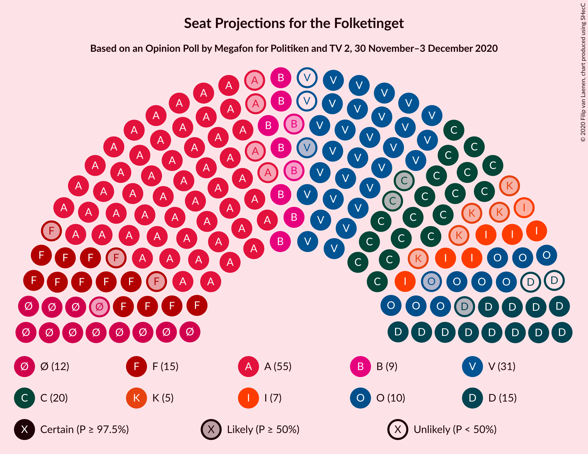

### Confidence Intervals

| Party | Last Result | Median | 80% Confidence Interval | 90% Confidence Interval | 95% Confidence Interval | 99% Confidence Interval |
|:-----:|:-----------:|:------:|:-----------------------:|:-----------------------:|:-----------------------:|:-----------------------:|
| <a href="#socialdemokraterne">Socialdemokraterne</a> | 48 | 55 | 52–55 |52–56 |51–58 |48–60 |
| <a href="#venstre">Venstre</a> | 43 | 29 | 29–31 |29–32 |28–33 |25–34 |
| <a href="#det-konservative-folkeparti">Det Konservative Folkeparti</a> | 12 | 20 | 18–20 |18–22 |18–22 |15–23 |
| <a href="#socialistisk-folkeparti">Socialistisk Folkeparti</a> | 14 | 15 | 14–16 |13–16 |12–17 |11–19 |
| <a href="#nye-borgerlige">Nye Borgerlige</a> | 4 | 13 | 13–15 |13–15 |12–18 |12–19 |
| <a href="#enhedslisten–de-rød-grønne">Enhedslisten–De Rød-Grønne</a> | 13 | 12 | 11–14 |11–16 |11–16 |9–17 |
| <a href="#dansk-folkeparti">Dansk Folkeparti</a> | 16 | 10 | 10–13 |9–13 |9–13 |8–13 |
| <a href="#radikale-venstre">Radikale Venstre</a> | 16 | 9 | 9–10 |7–11 |7–11 |7–12 |
| <a href="#liberal-alliance">Liberal Alliance</a> | 4 | 7 | 7 |6–7 |6–8 |5–10 |
| <a href="#kristendemokraterne">Kristendemokraterne</a> | 0 | 5 | 0–5 |0–5 |0–5 |0–5 |
| <a href="#veganerpartiet">Veganerpartiet</a> | 0 | 0 | 0 |0 |0 |0–4 |
| <a href="#alternativet">Alternativet</a> | 5 | 0 | 0 |0 |0 |0 |

### Socialdemokraterne

*For a full overview of the results for this party, see the [Socialdemokraterne](party-socialdemokraterne.html) page.*

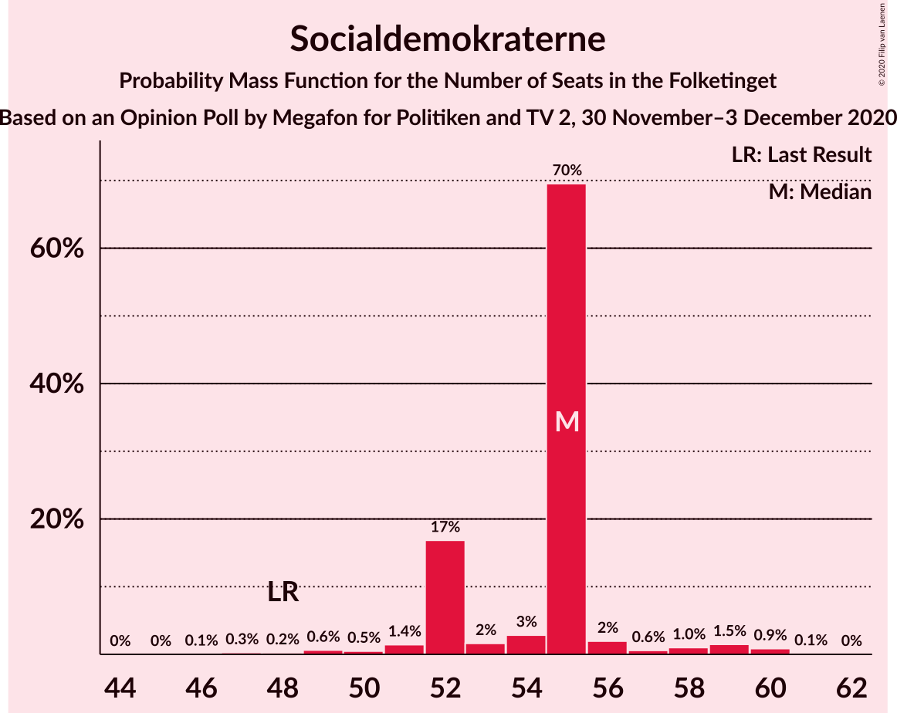

| Number of Seats | Probability | Accumulated | Special Marks |
|:---------------:|:-----------:|:-----------:|:-------------:|
| 46 | 0.1% | 100% |  |
| 47 | 0.3% | 99.9% |  |
| 48 | 0.2% | 99.7% | Last Result |
| 49 | 0.6% | 99.4% |  |
| 50 | 0.5% | 98.8% |  |
| 51 | 1.4% | 98% |  |
| 52 | 17% | 97% |  |
| 53 | 2% | 80% |  |
| 54 | 3% | 78% |  |
| 55 | 70% | 76% | Median |
| 56 | 2% | 6% |  |
| 57 | 0.6% | 4% |  |
| 58 | 1.0% | 3% |  |
| 59 | 1.5% | 2% |  |
| 60 | 0.9% | 1.0% |  |
| 61 | 0.1% | 0.2% |  |
| 62 | 0% | 0% |  |

### Venstre

*For a full overview of the results for this party, see the [Venstre](party-venstre.html) page.*

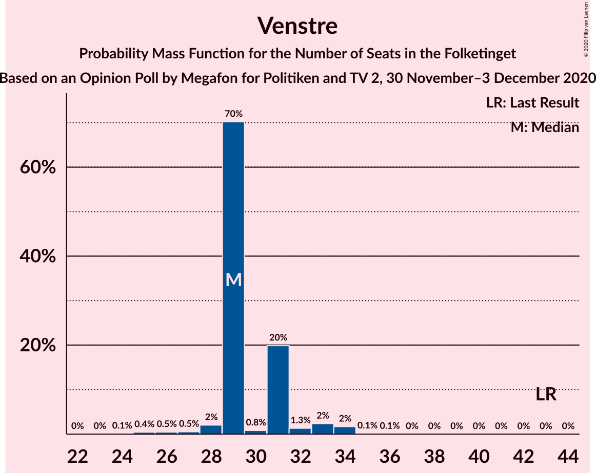

| Number of Seats | Probability | Accumulated | Special Marks |
|:---------------:|:-----------:|:-----------:|:-------------:|
| 24 | 0.1% | 100% |  |
| 25 | 0.4% | 99.9% |  |
| 26 | 0.5% | 99.4% |  |
| 27 | 0.5% | 99.0% |  |
| 28 | 2% | 98% |  |
| 29 | 70% | 96% | Median |
| 30 | 0.8% | 26% |  |
| 31 | 20% | 25% |  |
| 32 | 1.3% | 6% |  |
| 33 | 2% | 4% |  |
| 34 | 2% | 2% |  |
| 35 | 0.1% | 0.2% |  |
| 36 | 0.1% | 0.1% |  |
| 37 | 0% | 0% |  |
| 38 | 0% | 0% |  |
| 39 | 0% | 0% |  |
| 40 | 0% | 0% |  |
| 41 | 0% | 0% |  |
| 42 | 0% | 0% |  |
| 43 | 0% | 0% | Last Result |

### Det Konservative Folkeparti

*For a full overview of the results for this party, see the [Det Konservative Folkeparti](party-detkonservativefolkeparti.html) page.*

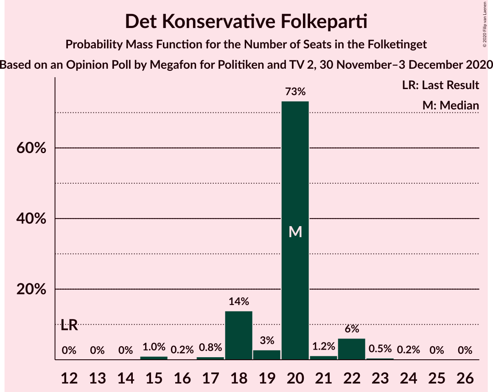

| Number of Seats | Probability | Accumulated | Special Marks |
|:---------------:|:-----------:|:-----------:|:-------------:|
| 12 | 0% | 100% | Last Result |
| 13 | 0% | 100% |  |
| 14 | 0% | 100% |  |
| 15 | 1.0% | 100% |  |
| 16 | 0.2% | 99.0% |  |
| 17 | 0.8% | 98.8% |  |
| 18 | 14% | 98% |  |
| 19 | 3% | 84% |  |
| 20 | 73% | 81% | Median |
| 21 | 1.2% | 8% |  |
| 22 | 6% | 7% |  |
| 23 | 0.5% | 0.7% |  |
| 24 | 0.2% | 0.3% |  |
| 25 | 0% | 0.1% |  |
| 26 | 0% | 0% |  |

### Socialistisk Folkeparti

*For a full overview of the results for this party, see the [Socialistisk Folkeparti](party-socialistiskfolkeparti.html) page.*

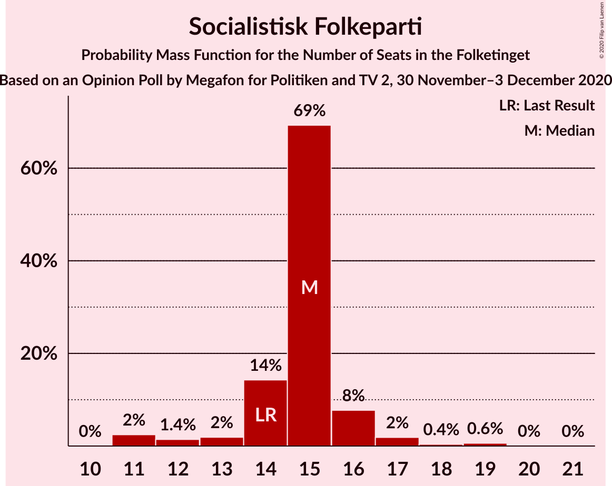

| Number of Seats | Probability | Accumulated | Special Marks |
|:---------------:|:-----------:|:-----------:|:-------------:|
| 11 | 2% | 100% |  |
| 12 | 1.4% | 98% |  |
| 13 | 2% | 96% |  |
| 14 | 14% | 94% | Last Result |
| 15 | 69% | 80% | Median |
| 16 | 8% | 11% |  |
| 17 | 2% | 3% |  |
| 18 | 0.4% | 1.1% |  |
| 19 | 0.6% | 0.7% |  |
| 20 | 0% | 0.1% |  |
| 21 | 0% | 0% |  |

### Nye Borgerlige

*For a full overview of the results for this party, see the [Nye Borgerlige](party-nyeborgerlige.html) page.*

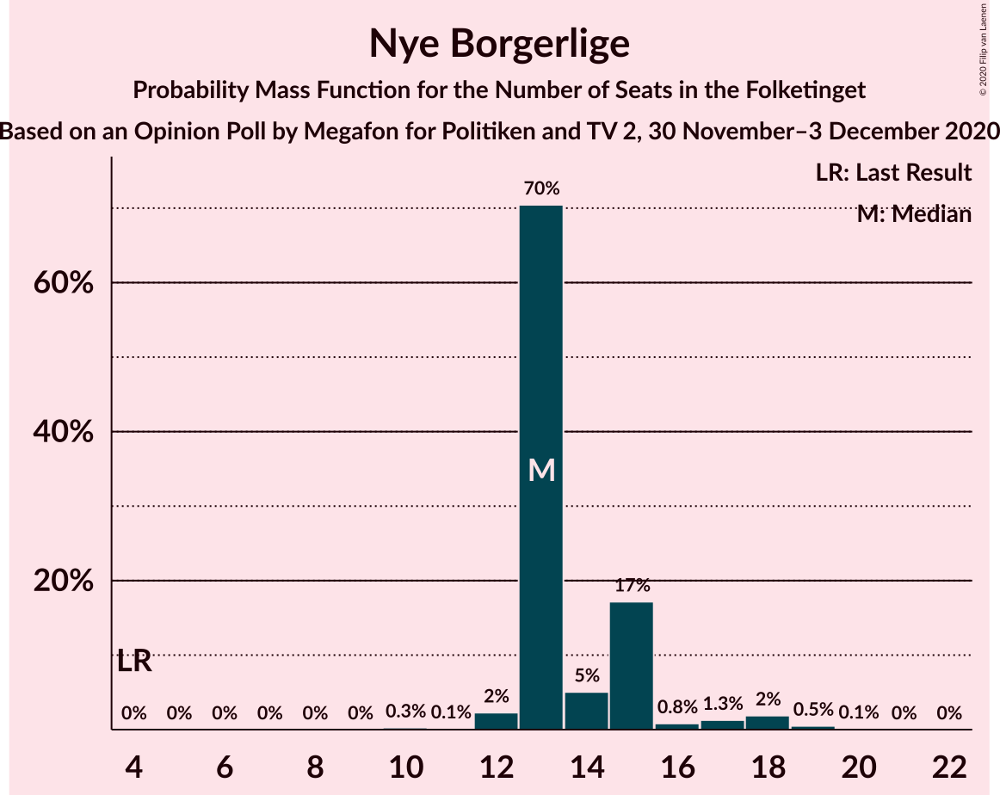

| Number of Seats | Probability | Accumulated | Special Marks |
|:---------------:|:-----------:|:-----------:|:-------------:|
| 4 | 0% | 100% | Last Result |
| 5 | 0% | 100% |  |
| 6 | 0% | 100% |  |
| 7 | 0% | 100% |  |
| 8 | 0% | 100% |  |
| 9 | 0% | 100% |  |
| 10 | 0.3% | 100% |  |
| 11 | 0.1% | 99.7% |  |
| 12 | 2% | 99.6% |  |
| 13 | 70% | 97% | Median |
| 14 | 5% | 27% |  |
| 15 | 17% | 22% |  |
| 16 | 0.8% | 5% |  |
| 17 | 1.3% | 4% |  |
| 18 | 2% | 3% |  |
| 19 | 0.5% | 0.6% |  |
| 20 | 0.1% | 0.1% |  |
| 21 | 0% | 0% |  |

### Enhedslisten–De Rød-Grønne

*For a full overview of the results for this party, see the [Enhedslisten–De Rød-Grønne](party-enhedslisten–derød-grønne.html) page.*

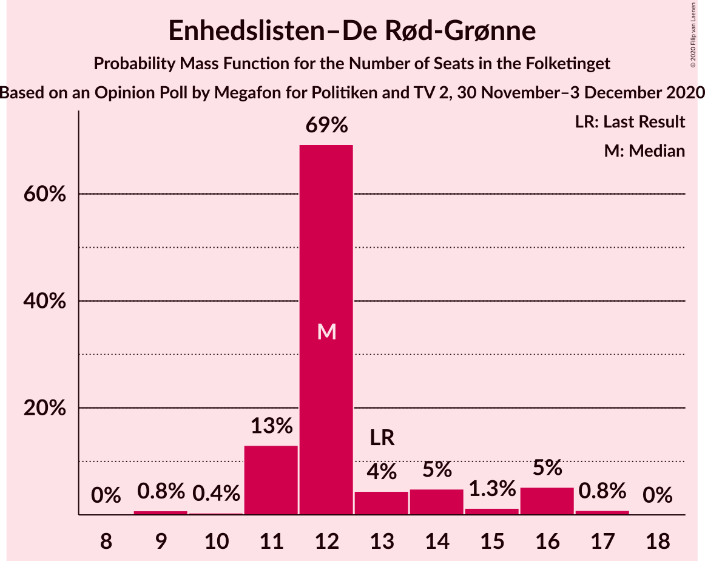

| Number of Seats | Probability | Accumulated | Special Marks |
|:---------------:|:-----------:|:-----------:|:-------------:|
| 9 | 0.8% | 100% |  |
| 10 | 0.4% | 99.2% |  |
| 11 | 13% | 98.8% |  |
| 12 | 69% | 86% | Median |
| 13 | 4% | 17% | Last Result |
| 14 | 5% | 12% |  |
| 15 | 1.3% | 7% |  |
| 16 | 5% | 6% |  |
| 17 | 0.8% | 0.9% |  |
| 18 | 0% | 0% |  |

### Dansk Folkeparti

*For a full overview of the results for this party, see the [Dansk Folkeparti](party-danskfolkeparti.html) page.*

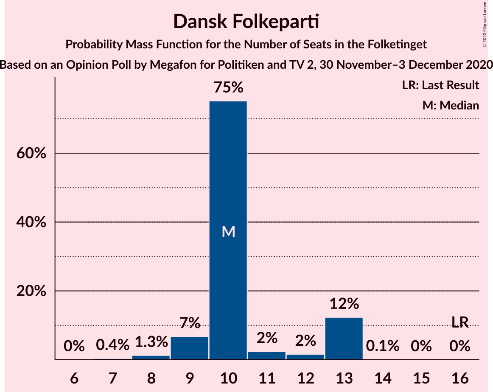

| Number of Seats | Probability | Accumulated | Special Marks |
|:---------------:|:-----------:|:-----------:|:-------------:|
| 7 | 0.4% | 100% |  |
| 8 | 1.3% | 99.6% |  |
| 9 | 7% | 98% |  |
| 10 | 75% | 92% | Median |
| 11 | 2% | 16% |  |
| 12 | 2% | 14% |  |
| 13 | 12% | 12% |  |
| 14 | 0.1% | 0.1% |  |
| 15 | 0% | 0% |  |
| 16 | 0% | 0% | Last Result |

### Radikale Venstre

*For a full overview of the results for this party, see the [Radikale Venstre](party-radikalevenstre.html) page.*

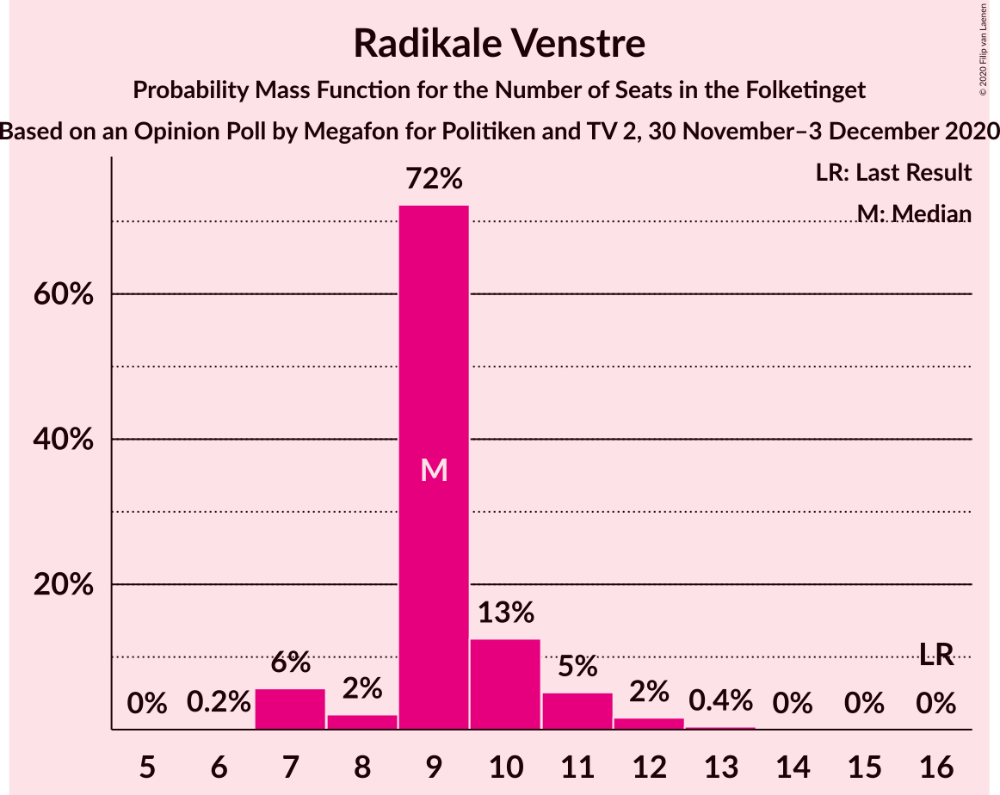

| Number of Seats | Probability | Accumulated | Special Marks |
|:---------------:|:-----------:|:-----------:|:-------------:|
| 6 | 0.2% | 100% |  |
| 7 | 6% | 99.8% |  |
| 8 | 2% | 94% |  |
| 9 | 72% | 92% | Median |
| 10 | 13% | 20% |  |
| 11 | 5% | 7% |  |
| 12 | 2% | 2% |  |
| 13 | 0.4% | 0.5% |  |
| 14 | 0% | 0.1% |  |
| 15 | 0% | 0% |  |
| 16 | 0% | 0% | Last Result |

### Liberal Alliance

*For a full overview of the results for this party, see the [Liberal Alliance](party-liberalalliance.html) page.*

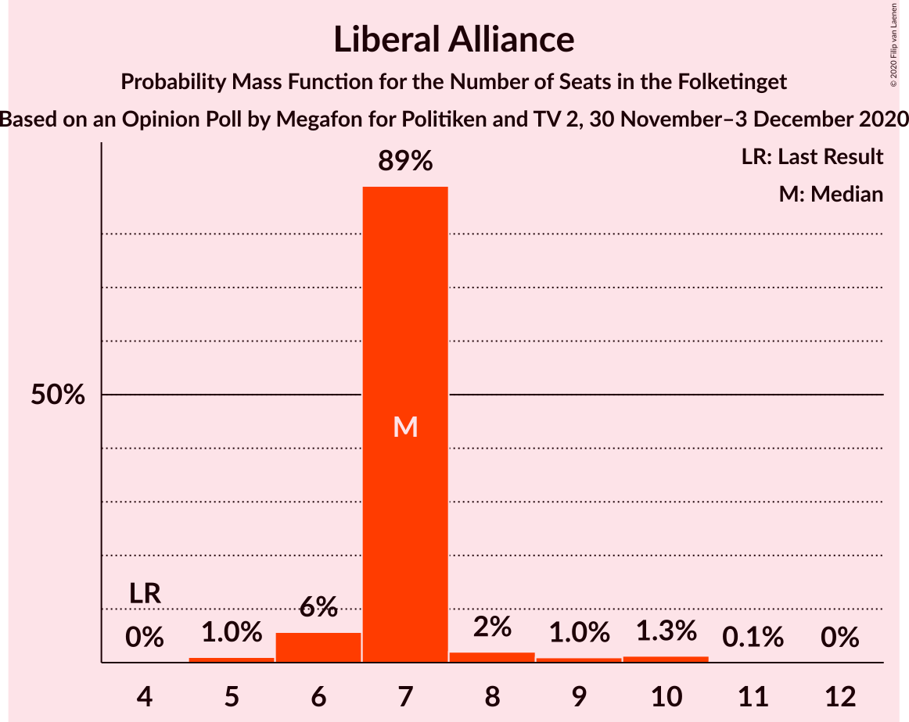

| Number of Seats | Probability | Accumulated | Special Marks |
|:---------------:|:-----------:|:-----------:|:-------------:|
| 4 | 0% | 100% | Last Result |
| 5 | 1.0% | 100% |  |
| 6 | 6% | 98.9% |  |
| 7 | 89% | 93% | Median |
| 8 | 2% | 4% |  |
| 9 | 1.0% | 2% |  |
| 10 | 1.3% | 1.3% |  |
| 11 | 0.1% | 0.1% |  |
| 12 | 0% | 0% |  |

### Kristendemokraterne

*For a full overview of the results for this party, see the [Kristendemokraterne](party-kristendemokraterne.html) page.*

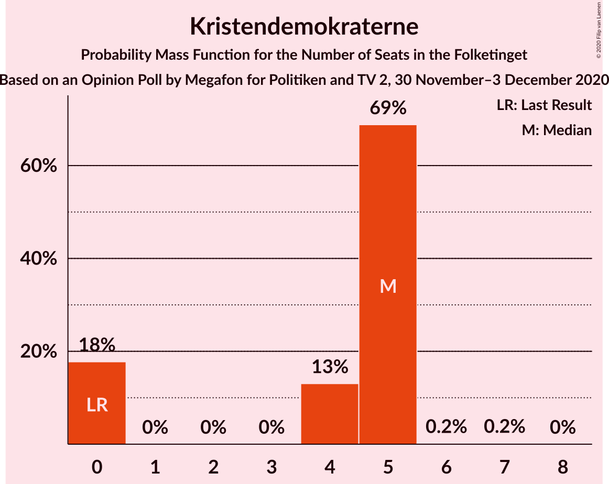

| Number of Seats | Probability | Accumulated | Special Marks |
|:---------------:|:-----------:|:-----------:|:-------------:|
| 0 | 18% | 100% | Last Result |
| 1 | 0% | 82% |  |
| 2 | 0% | 82% |  |
| 3 | 0% | 82% |  |
| 4 | 13% | 82% |  |
| 5 | 69% | 69% | Median |
| 6 | 0.2% | 0.4% |  |
| 7 | 0.2% | 0.2% |  |
| 8 | 0% | 0% |  |

### Veganerpartiet

*For a full overview of the results for this party, see the [Veganerpartiet](party-veganerpartiet.html) page.*

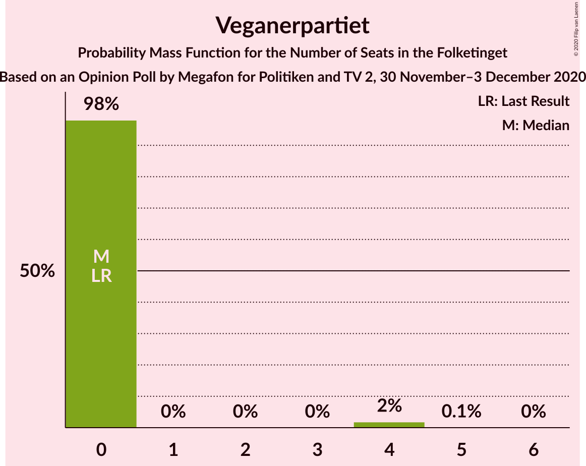

| Number of Seats | Probability | Accumulated | Special Marks |
|:---------------:|:-----------:|:-----------:|:-------------:|
| 0 | 98% | 100% | Last Result, Median |
| 1 | 0% | 2% |  |
| 2 | 0% | 2% |  |
| 3 | 0% | 2% |  |
| 4 | 2% | 2% |  |
| 5 | 0.1% | 0.1% |  |
| 6 | 0% | 0% |  |

### Alternativet

*For a full overview of the results for this party, see the [Alternativet](party-alternativet.html) page.*

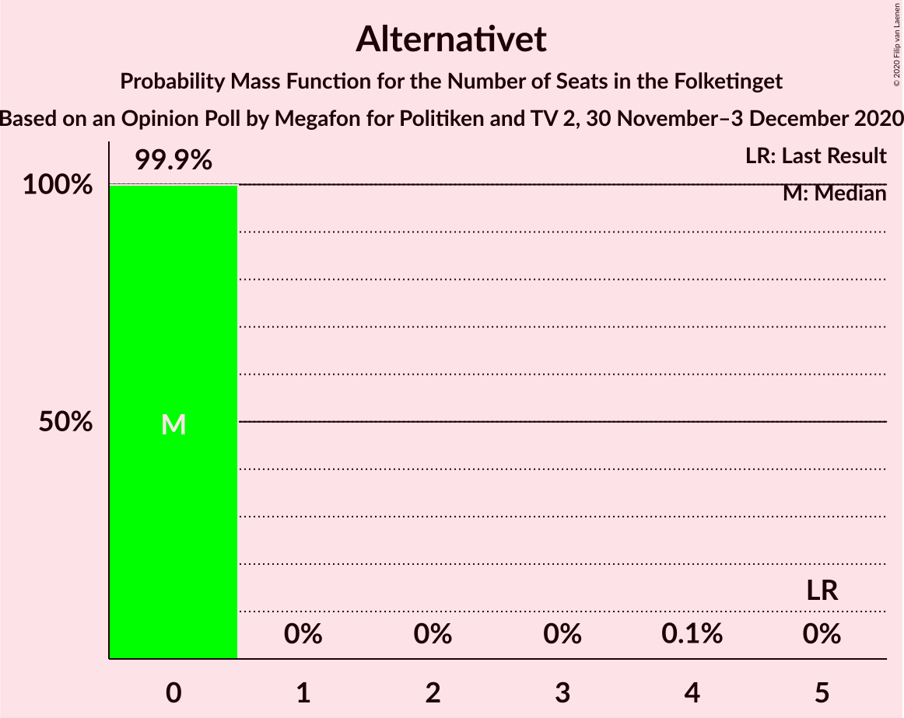

| Number of Seats | Probability | Accumulated | Special Marks |
|:---------------:|:-----------:|:-----------:|:-------------:|
| 0 | 99.9% | 100% | Median |
| 1 | 0% | 0.1% |  |
| 2 | 0% | 0.1% |  |
| 3 | 0% | 0.1% |  |
| 4 | 0.1% | 0.1% |  |
| 5 | 0% | 0% | Last Result |

## Coalitions

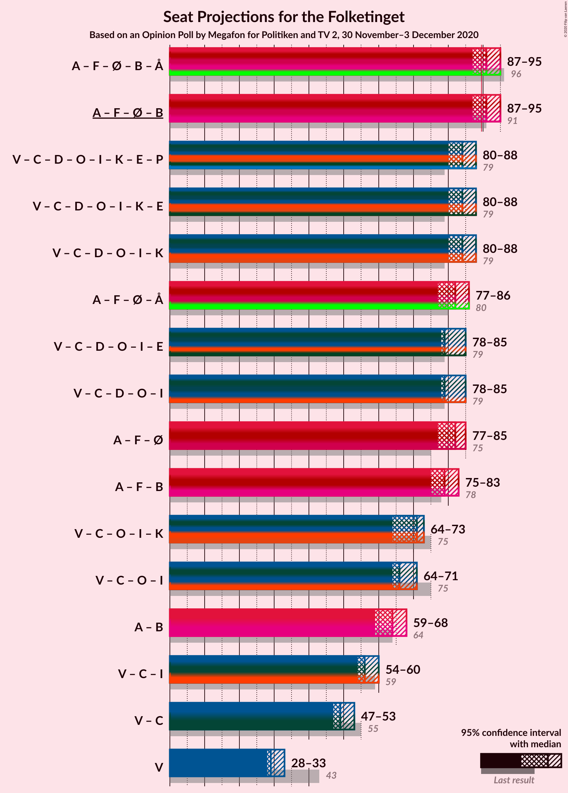

### Confidence Intervals

| Coalition | Last Result | Median | Majority? | 80% Confidence Interval | 90% Confidence Interval | 95% Confidence Interval | 99% Confidence Interval |
|:---------:|:-----------:|:------:|:---------:|:-----------------------:|:-----------------------:|:-----------------------:|:-----------------------:|
| Socialdemokraterne – Socialistisk Folkeparti – Enhedslisten–De Rød-Grønne – Radikale Venstre – Alternativet | 96 | 91 | 85% | 87–91 | 87–94 | 87–95 | 86–99 |
| Socialdemokraterne – Socialistisk Folkeparti – Enhedslisten–De Rød-Grønne – Radikale Venstre | 91 | 91 | 85% | 87–91 | 87–94 | 87–95 | 86–99 |
| Venstre – Det Konservative Folkeparti – Nye Borgerlige – Dansk Folkeparti – Liberal Alliance – Kristendemokraterne | 79 | 84 | 0.5% | 84–88 | 81–88 | 80–88 | 76–89 |
| Socialdemokraterne – Socialistisk Folkeparti – Enhedslisten–De Rød-Grønne – Alternativet | 80 | 82 | 1.3% | 77–84 | 77–84 | 77–86 | 75–90 |
| Venstre – Det Konservative Folkeparti – Nye Borgerlige – Dansk Folkeparti – Liberal Alliance | 79 | 79 | 0% | 79–84 | 79–84 | 78–85 | 75–88 |
| Socialdemokraterne – Socialistisk Folkeparti – Enhedslisten–De Rød-Grønne | 75 | 82 | 1.3% | 77–84 | 77–84 | 77–85 | 75–90 |
| Socialdemokraterne – Socialistisk Folkeparti – Radikale Venstre | 78 | 79 | 0% | 76–79 | 75–81 | 75–83 | 72–86 |
| Venstre – Det Konservative Folkeparti – Dansk Folkeparti – Liberal Alliance – Kristendemokraterne | 75 | 71 | 0% | 69–73 | 66–73 | 64–73 | 62–75 |
| Venstre – Det Konservative Folkeparti – Dansk Folkeparti – Liberal Alliance | 75 | 66 | 0% | 66–69 | 65–70 | 64–71 | 61–73 |
| Socialdemokraterne – Radikale Venstre | 64 | 64 | 0% | 62–64 | 59–66 | 59–68 | 57–69 |
| Venstre – Det Konservative Folkeparti – Liberal Alliance | 59 | 56 | 0% | 56–58 | 55–60 | 54–60 | 51–63 |
| Venstre – Det Konservative Folkeparti | 55 | 49 | 0% | 49–51 | 48–53 | 47–53 | 44–54 |
| Venstre | 43 | 29 | 0% | 29–31 | 29–32 | 28–33 | 25–34 |

### Socialdemokraterne – Socialistisk Folkeparti – Enhedslisten–De Rød-Grønne – Radikale Venstre – Alternativet

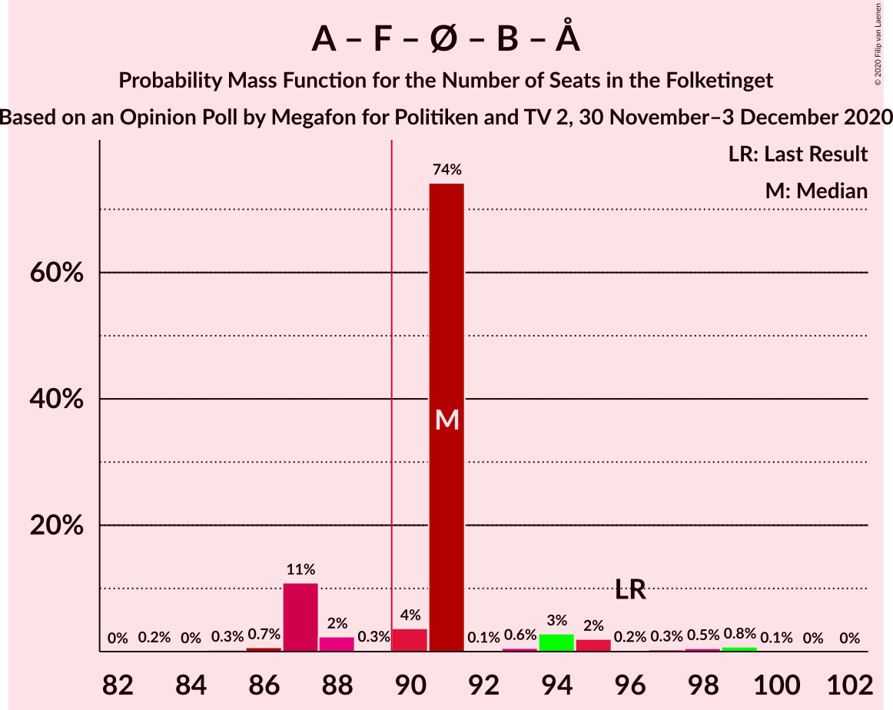

| Number of Seats | Probability | Accumulated | Special Marks |
|:---------------:|:-----------:|:-----------:|:-------------:|
| 83 | 0.2% | 100% |  |
| 84 | 0% | 99.8% |  |
| 85 | 0.3% | 99.8% |  |
| 86 | 0.7% | 99.5% |  |
| 87 | 11% | 98.9% |  |
| 88 | 2% | 88% |  |
| 89 | 0.3% | 86% |  |
| 90 | 4% | 85% | Majority |
| 91 | 74% | 82% | Median |
| 92 | 0.1% | 7% |  |
| 93 | 0.6% | 7% |  |
| 94 | 3% | 7% |  |
| 95 | 2% | 4% |  |
| 96 | 0.2% | 2% | Last Result |
| 97 | 0.3% | 2% |  |
| 98 | 0.5% | 1.4% |  |
| 99 | 0.8% | 0.9% |  |
| 100 | 0.1% | 0.1% |  |
| 101 | 0% | 0% |  |

### Socialdemokraterne – Socialistisk Folkeparti – Enhedslisten–De Rød-Grønne – Radikale Venstre

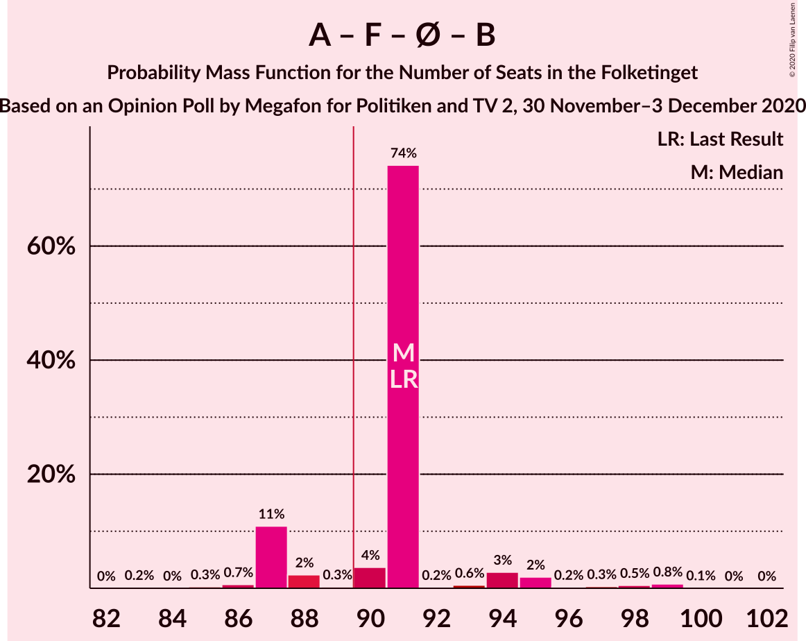

| Number of Seats | Probability | Accumulated | Special Marks |
|:---------------:|:-----------:|:-----------:|:-------------:|
| 83 | 0.2% | 100% |  |
| 84 | 0% | 99.8% |  |
| 85 | 0.3% | 99.8% |  |
| 86 | 0.7% | 99.5% |  |
| 87 | 11% | 98.9% |  |
| 88 | 2% | 88% |  |
| 89 | 0.3% | 86% |  |
| 90 | 4% | 85% | Majority |
| 91 | 74% | 82% | Last Result, Median |
| 92 | 0.2% | 7% |  |
| 93 | 0.6% | 7% |  |
| 94 | 3% | 7% |  |
| 95 | 2% | 4% |  |
| 96 | 0.2% | 2% |  |
| 97 | 0.3% | 2% |  |
| 98 | 0.5% | 1.4% |  |
| 99 | 0.8% | 0.9% |  |
| 100 | 0.1% | 0.1% |  |
| 101 | 0% | 0% |  |

### Venstre – Det Konservative Folkeparti – Nye Borgerlige – Dansk Folkeparti – Liberal Alliance – Kristendemokraterne

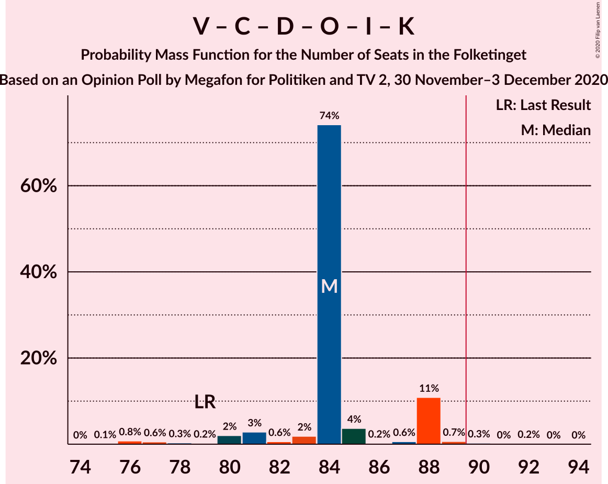

| Number of Seats | Probability | Accumulated | Special Marks |
|:---------------:|:-----------:|:-----------:|:-------------:|
| 75 | 0.1% | 100% |  |
| 76 | 0.8% | 99.9% |  |
| 77 | 0.6% | 99.1% |  |
| 78 | 0.3% | 98.6% |  |
| 79 | 0.2% | 98% | Last Result |
| 80 | 2% | 98% |  |
| 81 | 3% | 96% |  |
| 82 | 0.6% | 93% |  |
| 83 | 2% | 93% |  |
| 84 | 74% | 91% | Median |
| 85 | 4% | 17% |  |
| 86 | 0.2% | 13% |  |
| 87 | 0.6% | 13% |  |
| 88 | 11% | 12% |  |
| 89 | 0.7% | 1.1% |  |
| 90 | 0.3% | 0.5% | Majority |
| 91 | 0% | 0.2% |  |
| 92 | 0.2% | 0.2% |  |
| 93 | 0% | 0% |  |

### Socialdemokraterne – Socialistisk Folkeparti – Enhedslisten–De Rød-Grønne – Alternativet

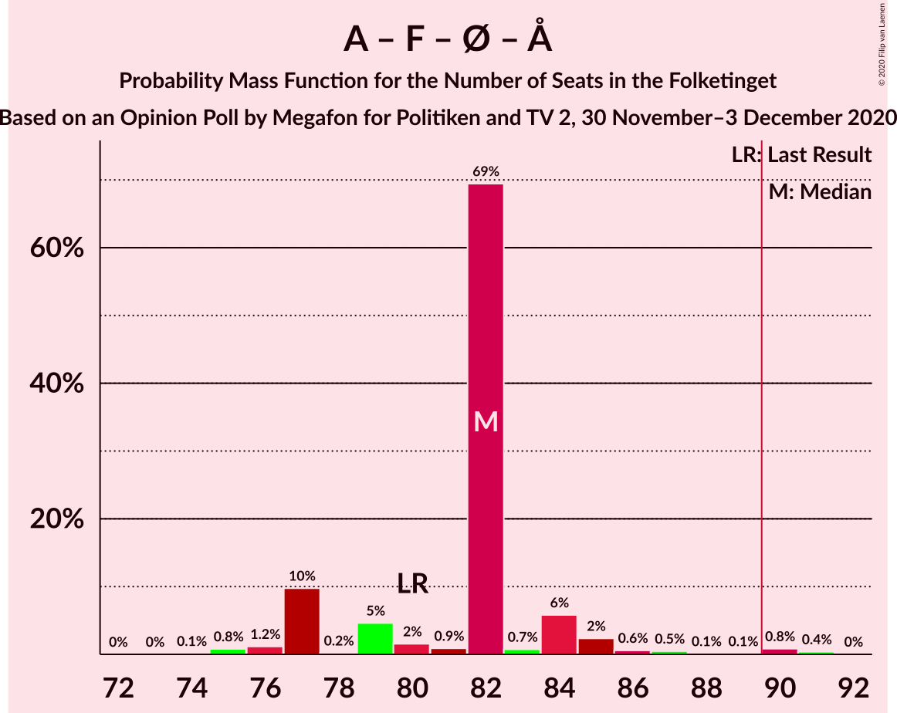

| Number of Seats | Probability | Accumulated | Special Marks |
|:---------------:|:-----------:|:-----------:|:-------------:|
| 74 | 0.1% | 100% |  |
| 75 | 0.8% | 99.9% |  |
| 76 | 1.2% | 99.1% |  |
| 77 | 10% | 98% |  |
| 78 | 0.2% | 88% |  |
| 79 | 5% | 88% |  |
| 80 | 2% | 83% | Last Result |
| 81 | 0.9% | 82% |  |
| 82 | 69% | 81% | Median |
| 83 | 0.7% | 11% |  |
| 84 | 6% | 11% |  |
| 85 | 2% | 5% |  |
| 86 | 0.6% | 3% |  |
| 87 | 0.5% | 2% |  |
| 88 | 0.1% | 1.5% |  |
| 89 | 0.1% | 1.3% |  |
| 90 | 0.8% | 1.3% | Majority |
| 91 | 0.4% | 0.4% |  |
| 92 | 0% | 0% |  |

### Venstre – Det Konservative Folkeparti – Nye Borgerlige – Dansk Folkeparti – Liberal Alliance

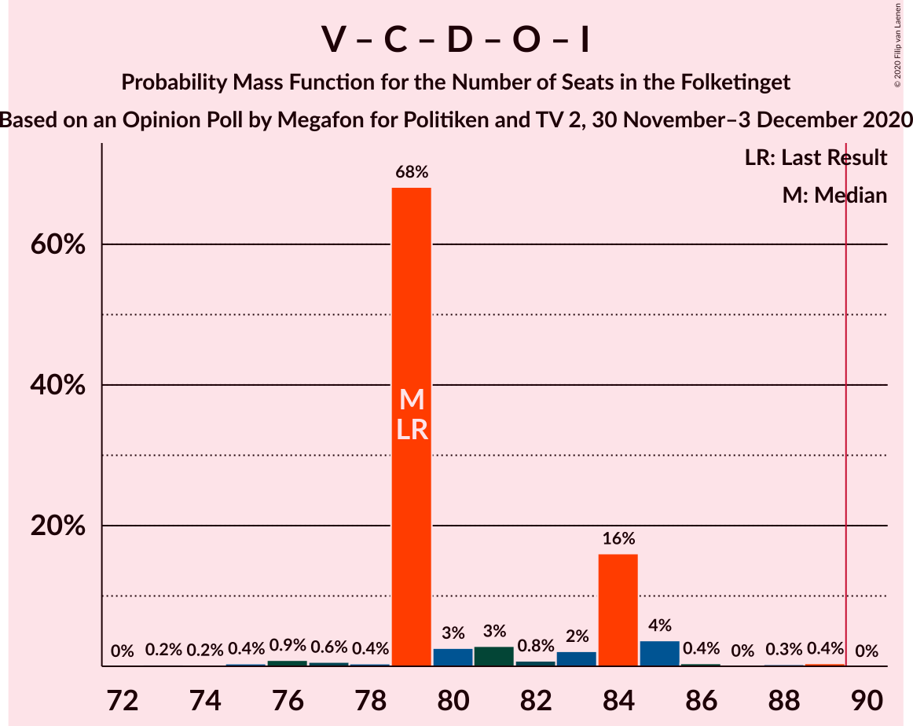

| Number of Seats | Probability | Accumulated | Special Marks |
|:---------------:|:-----------:|:-----------:|:-------------:|
| 73 | 0.2% | 100% |  |
| 74 | 0.2% | 99.8% |  |
| 75 | 0.4% | 99.6% |  |
| 76 | 0.9% | 99.2% |  |
| 77 | 0.6% | 98% |  |
| 78 | 0.4% | 98% |  |
| 79 | 68% | 97% | Last Result, Median |
| 80 | 3% | 29% |  |
| 81 | 3% | 27% |  |
| 82 | 0.8% | 24% |  |
| 83 | 2% | 23% |  |
| 84 | 16% | 21% |  |
| 85 | 4% | 5% |  |
| 86 | 0.4% | 1.2% |  |
| 87 | 0% | 0.7% |  |
| 88 | 0.3% | 0.7% |  |
| 89 | 0.4% | 0.4% |  |
| 90 | 0% | 0% | Majority |

### Socialdemokraterne – Socialistisk Folkeparti – Enhedslisten–De Rød-Grønne

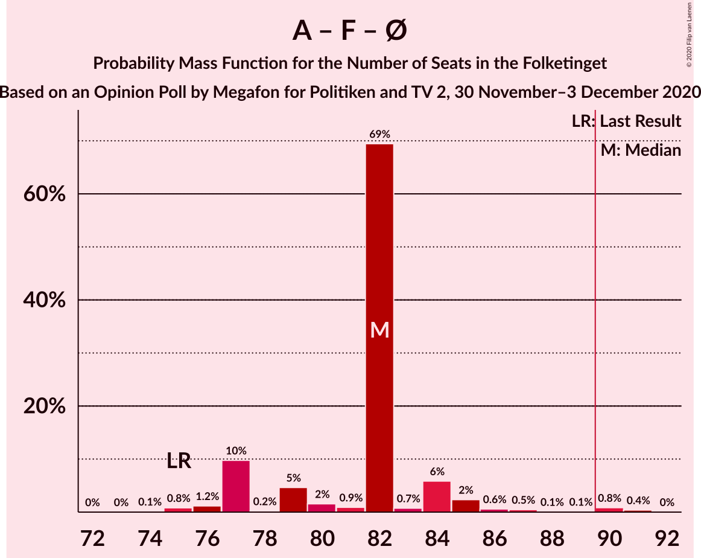

| Number of Seats | Probability | Accumulated | Special Marks |
|:---------------:|:-----------:|:-----------:|:-------------:|
| 74 | 0.1% | 100% |  |
| 75 | 0.8% | 99.9% | Last Result |
| 76 | 1.2% | 99.1% |  |
| 77 | 10% | 98% |  |
| 78 | 0.2% | 88% |  |
| 79 | 5% | 88% |  |
| 80 | 2% | 83% |  |
| 81 | 0.9% | 82% |  |
| 82 | 69% | 81% | Median |
| 83 | 0.7% | 11% |  |
| 84 | 6% | 11% |  |
| 85 | 2% | 5% |  |
| 86 | 0.6% | 2% |  |
| 87 | 0.5% | 2% |  |
| 88 | 0.1% | 1.4% |  |
| 89 | 0.1% | 1.3% |  |
| 90 | 0.8% | 1.3% | Majority |
| 91 | 0.4% | 0.4% |  |
| 92 | 0% | 0% |  |

### Socialdemokraterne – Socialistisk Folkeparti – Radikale Venstre

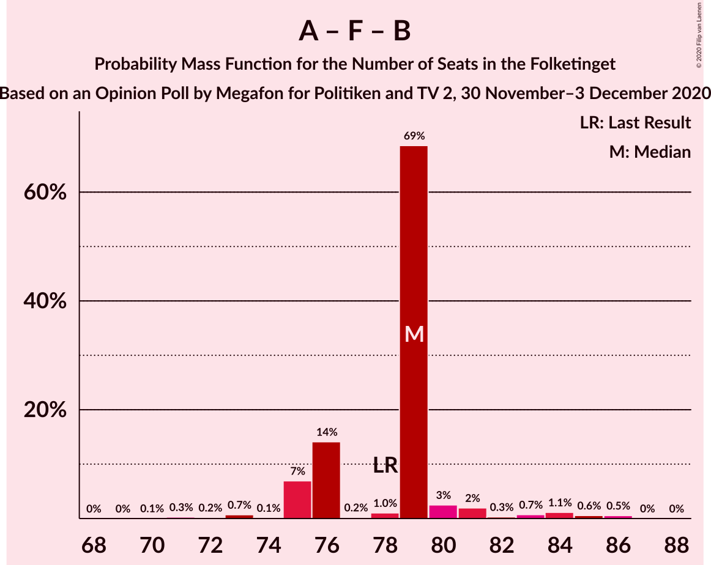

| Number of Seats | Probability | Accumulated | Special Marks |
|:---------------:|:-----------:|:-----------:|:-------------:|
| 70 | 0.1% | 100% |  |
| 71 | 0.3% | 99.9% |  |
| 72 | 0.2% | 99.7% |  |
| 73 | 0.7% | 99.5% |  |
| 74 | 0.1% | 98.8% |  |
| 75 | 7% | 98.6% |  |
| 76 | 14% | 92% |  |
| 77 | 0.2% | 78% |  |
| 78 | 1.0% | 77% | Last Result |
| 79 | 69% | 76% | Median |
| 80 | 3% | 8% |  |
| 81 | 2% | 5% |  |
| 82 | 0.3% | 3% |  |
| 83 | 0.7% | 3% |  |
| 84 | 1.1% | 2% |  |
| 85 | 0.6% | 1.2% |  |
| 86 | 0.5% | 0.6% |  |
| 87 | 0% | 0% |  |

### Venstre – Det Konservative Folkeparti – Dansk Folkeparti – Liberal Alliance – Kristendemokraterne

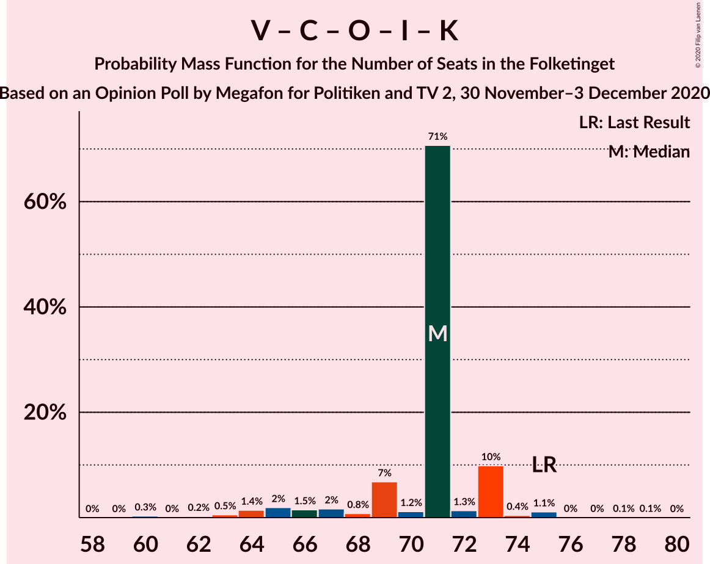

| Number of Seats | Probability | Accumulated | Special Marks |
|:---------------:|:-----------:|:-----------:|:-------------:|
| 60 | 0.3% | 100% |  |
| 61 | 0% | 99.7% |  |
| 62 | 0.2% | 99.7% |  |
| 63 | 0.5% | 99.4% |  |
| 64 | 1.4% | 98.9% |  |
| 65 | 2% | 97% |  |
| 66 | 1.5% | 96% |  |
| 67 | 2% | 94% |  |
| 68 | 0.8% | 92% |  |
| 69 | 7% | 92% |  |
| 70 | 1.2% | 85% |  |
| 71 | 71% | 84% | Median |
| 72 | 1.3% | 13% |  |
| 73 | 10% | 12% |  |
| 74 | 0.4% | 2% |  |
| 75 | 1.1% | 1.3% | Last Result |
| 76 | 0% | 0.2% |  |
| 77 | 0% | 0.1% |  |
| 78 | 0.1% | 0.1% |  |
| 79 | 0.1% | 0.1% |  |
| 80 | 0% | 0% |  |

### Venstre – Det Konservative Folkeparti – Dansk Folkeparti – Liberal Alliance

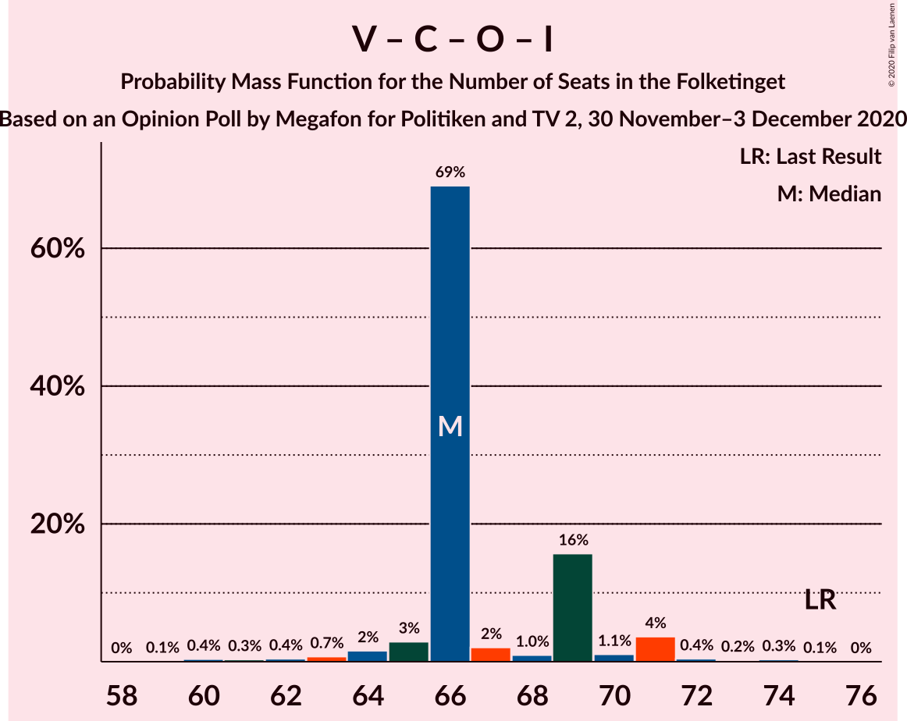

| Number of Seats | Probability | Accumulated | Special Marks |
|:---------------:|:-----------:|:-----------:|:-------------:|
| 59 | 0.1% | 100% |  |
| 60 | 0.4% | 99.9% |  |
| 61 | 0.3% | 99.5% |  |
| 62 | 0.4% | 99.2% |  |
| 63 | 0.7% | 98.8% |  |
| 64 | 2% | 98% |  |
| 65 | 3% | 96% |  |
| 66 | 69% | 94% | Median |
| 67 | 2% | 24% |  |
| 68 | 1.0% | 22% |  |
| 69 | 16% | 21% |  |
| 70 | 1.1% | 6% |  |
| 71 | 4% | 5% |  |
| 72 | 0.4% | 1.0% |  |
| 73 | 0.2% | 0.6% |  |
| 74 | 0.3% | 0.4% |  |
| 75 | 0.1% | 0.1% | Last Result |
| 76 | 0% | 0% |  |

### Socialdemokraterne – Radikale Venstre

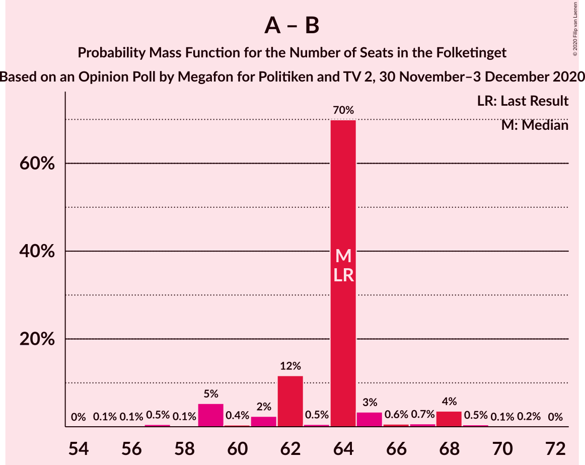

| Number of Seats | Probability | Accumulated | Special Marks |
|:---------------:|:-----------:|:-----------:|:-------------:|
| 55 | 0.1% | 100% |  |
| 56 | 0.1% | 99.9% |  |
| 57 | 0.5% | 99.8% |  |
| 58 | 0.1% | 99.3% |  |
| 59 | 5% | 99.1% |  |
| 60 | 0.4% | 94% |  |
| 61 | 2% | 93% |  |
| 62 | 12% | 91% |  |
| 63 | 0.5% | 79% |  |
| 64 | 70% | 79% | Last Result, Median |
| 65 | 3% | 9% |  |
| 66 | 0.6% | 6% |  |
| 67 | 0.7% | 5% |  |
| 68 | 4% | 4% |  |
| 69 | 0.5% | 0.7% |  |
| 70 | 0.1% | 0.3% |  |
| 71 | 0.2% | 0.2% |  |
| 72 | 0% | 0% |  |

### Venstre – Det Konservative Folkeparti – Liberal Alliance

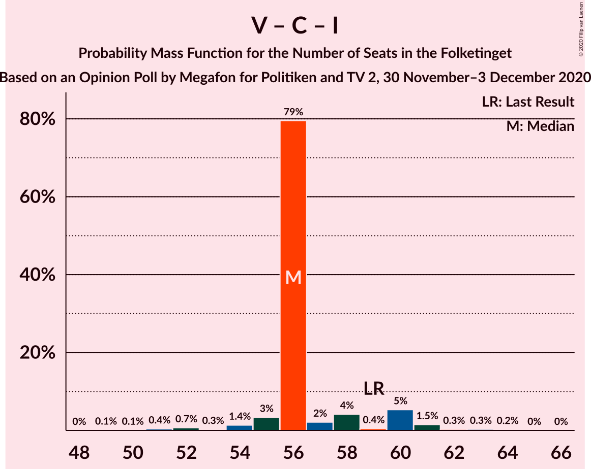

| Number of Seats | Probability | Accumulated | Special Marks |
|:---------------:|:-----------:|:-----------:|:-------------:|
| 49 | 0.1% | 100% |  |
| 50 | 0.1% | 99.9% |  |
| 51 | 0.4% | 99.8% |  |
| 52 | 0.7% | 99.5% |  |
| 53 | 0.3% | 98.8% |  |
| 54 | 1.4% | 98.5% |  |
| 55 | 3% | 97% |  |
| 56 | 79% | 94% | Median |
| 57 | 2% | 14% |  |
| 58 | 4% | 12% |  |
| 59 | 0.4% | 8% | Last Result |
| 60 | 5% | 8% |  |
| 61 | 1.5% | 2% |  |
| 62 | 0.3% | 0.8% |  |
| 63 | 0.3% | 0.5% |  |
| 64 | 0.2% | 0.3% |  |
| 65 | 0% | 0% |  |

### Venstre – Det Konservative Folkeparti

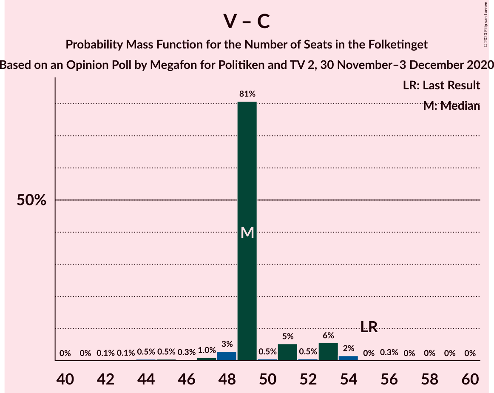

| Number of Seats | Probability | Accumulated | Special Marks |
|:---------------:|:-----------:|:-----------:|:-------------:|
| 42 | 0.1% | 100% |  |
| 43 | 0.1% | 99.9% |  |
| 44 | 0.5% | 99.8% |  |
| 45 | 0.5% | 99.3% |  |
| 46 | 0.3% | 98.8% |  |
| 47 | 1.0% | 98% |  |
| 48 | 3% | 97% |  |
| 49 | 81% | 95% | Median |
| 50 | 0.5% | 14% |  |
| 51 | 5% | 13% |  |
| 52 | 0.5% | 8% |  |
| 53 | 6% | 7% |  |
| 54 | 2% | 2% |  |
| 55 | 0% | 0.4% | Last Result |
| 56 | 0.3% | 0.4% |  |
| 57 | 0% | 0.1% |  |
| 58 | 0% | 0.1% |  |
| 59 | 0% | 0% |  |

### Venstre

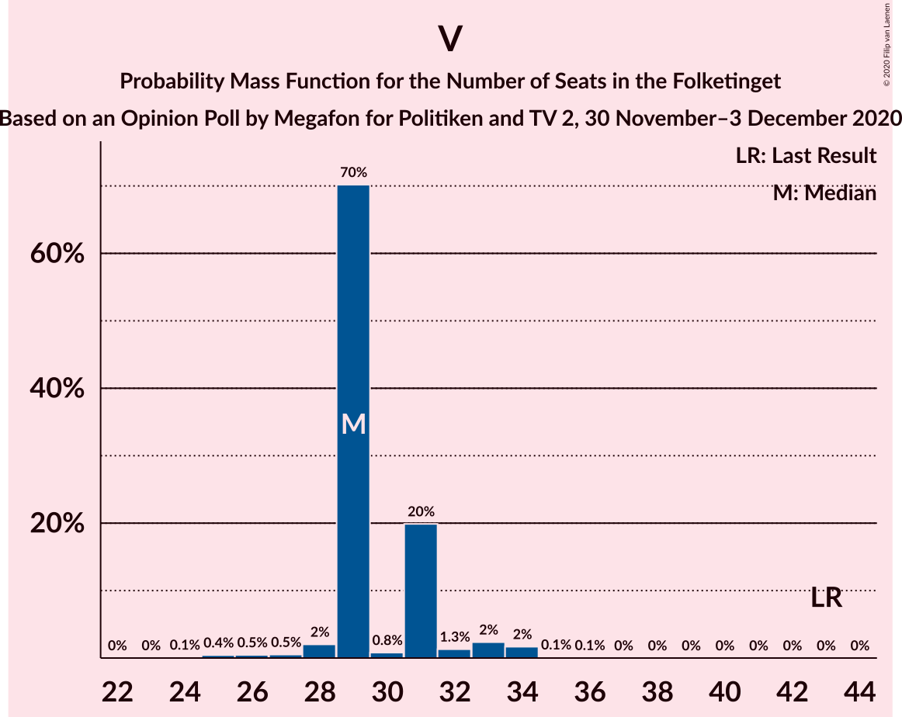

| Number of Seats | Probability | Accumulated | Special Marks |
|:---------------:|:-----------:|:-----------:|:-------------:|
| 24 | 0.1% | 100% |  |
| 25 | 0.4% | 99.9% |  |
| 26 | 0.5% | 99.4% |  |
| 27 | 0.5% | 99.0% |  |
| 28 | 2% | 98% |  |
| 29 | 70% | 96% | Median |
| 30 | 0.8% | 26% |  |
| 31 | 20% | 25% |  |
| 32 | 1.3% | 6% |  |
| 33 | 2% | 4% |  |
| 34 | 2% | 2% |  |
| 35 | 0.1% | 0.2% |  |
| 36 | 0.1% | 0.1% |  |
| 37 | 0% | 0% |  |
| 38 | 0% | 0% |  |
| 39 | 0% | 0% |  |
| 40 | 0% | 0% |  |
| 41 | 0% | 0% |  |
| 42 | 0% | 0% |  |
| 43 | 0% | 0% | Last Result |

## Technical Information

### Opinion Poll

+ **Polling firm:** Megafon
+ **Commissioner(s):** Politiken and TV 2
+ **Fieldwork period:** 30 November–3 December 2020

### Calculations

+ **Sample size:** 1034
+ **Simulations done:** 1,048,576
+ **Error estimate:** 2.59%

