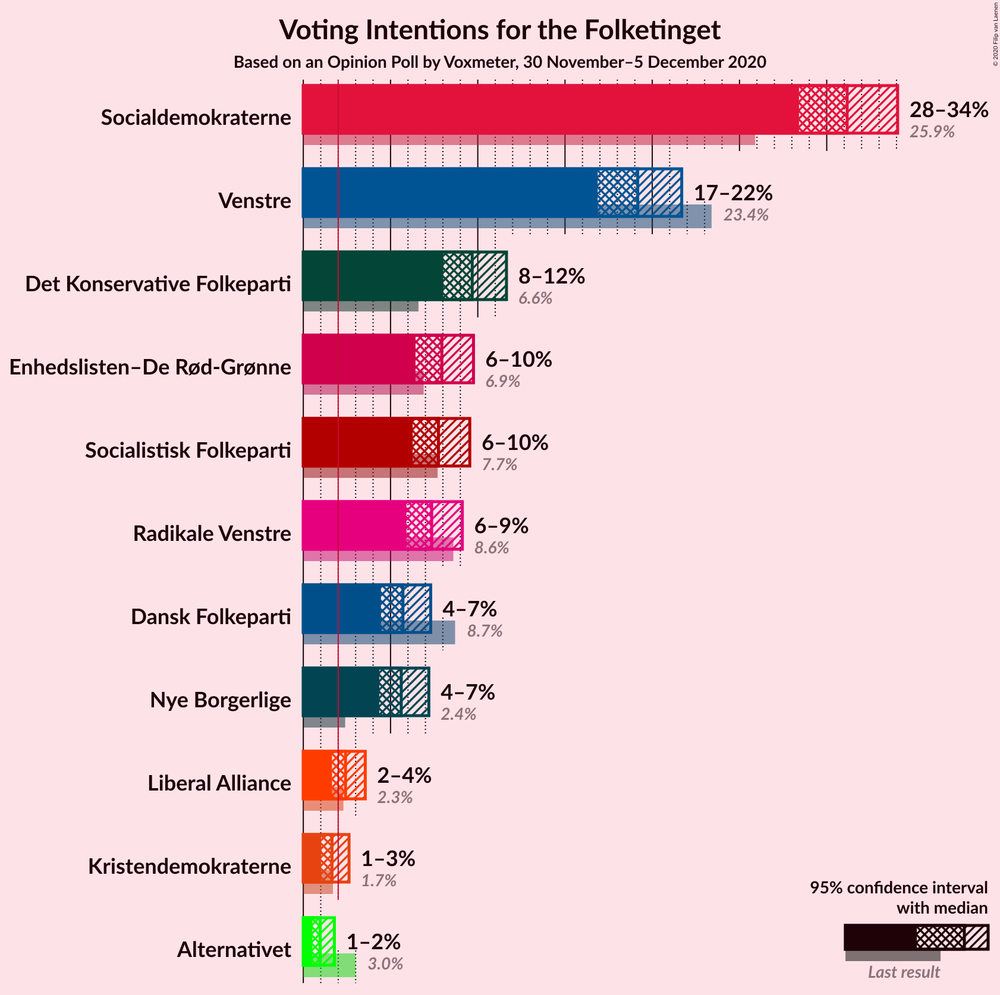

# Opinion Poll by Voxmeter, 30 November–5 December 2020

<a href="#voting-intentions">Voting Intentions</a> | <a href="#seats">Seats</a> | <a href="#coalitions">Coalitions</a> | <a href="#technical-information">Technical Information</a>

## Voting Intentions

### Confidence Intervals

| Party | Last Result | Poll Result | 80% Confidence Interval | 90% Confidence Interval | 95% Confidence Interval | 99% Confidence Interval |
|:-----:|:-----------:|:-----------:|:-----------------------:|:-----------------------:|:-----------------------:|:-----------------------:|
| Socialdemokraterne | 25.9% | 31.2% | 29.4–33.1% |28.9–33.6% |28.4–34.1% |27.6–35.0% |
| Venstre | 23.4% | 19.2% | 17.7–20.8% |17.2–21.3% |16.9–21.7% |16.2–22.5% |
| Det Konservative Folkeparti | 6.6% | 9.7% | 8.6–11.0% |8.3–11.3% |8.0–11.6% |7.5–12.3% |
| Enhedslisten–De Rød-Grønne | 6.9% | 7.9% | 7.0–9.1% |6.7–9.5% |6.4–9.8% |6.0–10.3% |
| Socialistisk Folkeparti | 7.7% | 7.7% | 6.8–8.9% |6.5–9.3% |6.3–9.5% |5.8–10.1% |
| Radikale Venstre | 8.6% | 7.4% | 6.4–8.5% |6.1–8.8% |5.9–9.1% |5.5–9.7% |
| Dansk Folkeparti | 8.7% | 5.7% | 4.9–6.8% |4.6–7.0% |4.5–7.3% |4.1–7.8% |
| Nye Borgerlige | 2.4% | 5.6% | 4.8–6.6% |4.6–6.9% |4.4–7.2% |4.0–7.7% |
| Liberal Alliance | 2.3% | 2.4% | 1.9–3.2% |1.8–3.4% |1.6–3.6% |1.4–3.9% |
| Kristendemokraterne | 1.7% | 1.6% | 1.2–2.3% |1.1–2.5% |1.0–2.6% |0.9–3.0% |
| Alternativet | 3.0% | 1.0% | 0.7–1.5% |0.6–1.6% |0.5–1.8% |0.4–2.1% |

*Note:* The poll result column reflects the actual value used in the calculations. Published results may vary slightly, and in addition be rounded to fewer digits.

## Seats

### Confidence Intervals

| Party | Last Result | Median | 80% Confidence Interval | 90% Confidence Interval | 95% Confidence Interval | 99% Confidence Interval |
|:-----:|:-----------:|:------:|:-----------------------:|:-----------------------:|:-----------------------:|:-----------------------:|
| <a href="#socialdemokraterne">Socialdemokraterne</a> | 48 | 56 | 52–62 |51–62 |51–62 |49–63 |
| <a href="#venstre">Venstre</a> | 43 | 34 | 32–38 |31–39 |30–39 |28–41 |
| <a href="#det-konservative-folkeparti">Det Konservative Folkeparti</a> | 12 | 18 | 15–20 |15–21 |15–21 |13–23 |
| <a href="#enhedslisten–de-rød-grønne">Enhedslisten–De Rød-Grønne</a> | 13 | 14 | 12–16 |12–16 |11–17 |11–18 |
| <a href="#socialistisk-folkeparti">Socialistisk Folkeparti</a> | 14 | 14 | 12–16 |12–16 |11–17 |10–18 |
| <a href="#radikale-venstre">Radikale Venstre</a> | 16 | 14 | 12–16 |11–16 |11–16 |9–17 |
| <a href="#dansk-folkeparti">Dansk Folkeparti</a> | 16 | 10 | 9–12 |8–12 |8–12 |7–14 |
| <a href="#nye-borgerlige">Nye Borgerlige</a> | 4 | 10 | 8–11 |8–12 |8–13 |7–14 |
| <a href="#liberal-alliance">Liberal Alliance</a> | 4 | 4 | 0–5 |0–6 |0–6 |0–7 |
| <a href="#kristendemokraterne">Kristendemokraterne</a> | 0 | 0 | 0–4 |0–4 |0–5 |0–5 |
| <a href="#alternativet">Alternativet</a> | 5 | 0 | 0 |0 |0 |0–4 |

### Socialdemokraterne

*For a full overview of the results for this party, see the [Socialdemokraterne](party-socialdemokraterne.html) page.*

| Number of Seats | Probability | Accumulated | Special Marks |
|:---------------:|:-----------:|:-----------:|:-------------:|
| 47 | 0.1% | 100% |  |
| 48 | 0.1% | 99.9% | Last Result |
| 49 | 0.4% | 99.8% |  |
| 50 | 1.1% | 99.5% |  |
| 51 | 7% | 98% |  |
| 52 | 1.5% | 91% |  |
| 53 | 8% | 90% |  |
| 54 | 11% | 82% |  |
| 55 | 14% | 71% |  |
| 56 | 20% | 58% | Median |
| 57 | 9% | 38% |  |
| 58 | 7% | 29% |  |
| 59 | 3% | 22% |  |
| 60 | 1.0% | 19% |  |
| 61 | 2% | 18% |  |
| 62 | 15% | 16% |  |
| 63 | 0.3% | 0.5% |  |
| 64 | 0.2% | 0.2% |  |
| 65 | 0% | 0% |  |

### Venstre

*For a full overview of the results for this party, see the [Venstre](party-venstre.html) page.*

| Number of Seats | Probability | Accumulated | Special Marks |
|:---------------:|:-----------:|:-----------:|:-------------:|
| 28 | 0.6% | 100% |  |
| 29 | 0.8% | 99.4% |  |
| 30 | 2% | 98.6% |  |
| 31 | 5% | 96% |  |
| 32 | 25% | 92% |  |
| 33 | 14% | 67% |  |
| 34 | 20% | 53% | Median |
| 35 | 9% | 34% |  |
| 36 | 8% | 25% |  |
| 37 | 7% | 17% |  |
| 38 | 5% | 11% |  |
| 39 | 4% | 5% |  |
| 40 | 0.6% | 1.4% |  |
| 41 | 0.7% | 0.8% |  |
| 42 | 0% | 0.1% |  |
| 43 | 0.1% | 0.1% | Last Result |
| 44 | 0% | 0% |  |

### Det Konservative Folkeparti

*For a full overview of the results for this party, see the [Det Konservative Folkeparti](party-detkonservativefolkeparti.html) page.*

| Number of Seats | Probability | Accumulated | Special Marks |
|:---------------:|:-----------:|:-----------:|:-------------:|
| 12 | 0.1% | 100% | Last Result |
| 13 | 0.5% | 99.9% |  |
| 14 | 1.0% | 99.5% |  |
| 15 | 15% | 98% |  |
| 16 | 7% | 83% |  |
| 17 | 22% | 77% |  |
| 18 | 22% | 55% | Median |
| 19 | 20% | 33% |  |
| 20 | 4% | 13% |  |
| 21 | 7% | 9% |  |
| 22 | 0.7% | 2% |  |
| 23 | 2% | 2% |  |
| 24 | 0% | 0% |  |

### Enhedslisten–De Rød-Grønne

*For a full overview of the results for this party, see the [Enhedslisten–De Rød-Grønne](party-enhedslisten–derød-grønne.html) page.*

| Number of Seats | Probability | Accumulated | Special Marks |
|:---------------:|:-----------:|:-----------:|:-------------:|
| 10 | 0.3% | 100% |  |
| 11 | 2% | 99.7% |  |
| 12 | 15% | 97% |  |
| 13 | 6% | 83% | Last Result |
| 14 | 28% | 76% | Median |
| 15 | 24% | 48% |  |
| 16 | 21% | 24% |  |
| 17 | 3% | 4% |  |
| 18 | 0.8% | 1.3% |  |
| 19 | 0.4% | 0.5% |  |
| 20 | 0.1% | 0.1% |  |
| 21 | 0% | 0% |  |

### Socialistisk Folkeparti

*For a full overview of the results for this party, see the [Socialistisk Folkeparti](party-socialistiskfolkeparti.html) page.*

| Number of Seats | Probability | Accumulated | Special Marks |
|:---------------:|:-----------:|:-----------:|:-------------:|
| 10 | 1.1% | 100% |  |
| 11 | 2% | 98.9% |  |
| 12 | 8% | 97% |  |
| 13 | 15% | 89% |  |
| 14 | 40% | 73% | Last Result, Median |
| 15 | 14% | 33% |  |
| 16 | 17% | 20% |  |
| 17 | 2% | 3% |  |
| 18 | 0.5% | 0.6% |  |
| 19 | 0.1% | 0.1% |  |
| 20 | 0% | 0.1% |  |
| 21 | 0% | 0% |  |

### Radikale Venstre

*For a full overview of the results for this party, see the [Radikale Venstre](party-radikalevenstre.html) page.*

| Number of Seats | Probability | Accumulated | Special Marks |
|:---------------:|:-----------:|:-----------:|:-------------:|
| 9 | 0.5% | 100% |  |
| 10 | 1.4% | 99.5% |  |
| 11 | 7% | 98% |  |
| 12 | 7% | 91% |  |
| 13 | 16% | 84% |  |
| 14 | 22% | 67% | Median |
| 15 | 36% | 46% |  |
| 16 | 9% | 10% | Last Result |
| 17 | 0.8% | 1.2% |  |
| 18 | 0.4% | 0.4% |  |
| 19 | 0% | 0% |  |

### Dansk Folkeparti

*For a full overview of the results for this party, see the [Dansk Folkeparti](party-danskfolkeparti.html) page.*

| Number of Seats | Probability | Accumulated | Special Marks |
|:---------------:|:-----------:|:-----------:|:-------------:|
| 6 | 0.1% | 100% |  |
| 7 | 0.7% | 99.9% |  |
| 8 | 6% | 99.2% |  |
| 9 | 25% | 94% |  |
| 10 | 27% | 68% | Median |
| 11 | 16% | 42% |  |
| 12 | 24% | 26% |  |
| 13 | 1.2% | 2% |  |
| 14 | 0.2% | 0.6% |  |
| 15 | 0.4% | 0.4% |  |
| 16 | 0% | 0% | Last Result |

### Nye Borgerlige

*For a full overview of the results for this party, see the [Nye Borgerlige](party-nyeborgerlige.html) page.*

| Number of Seats | Probability | Accumulated | Special Marks |
|:---------------:|:-----------:|:-----------:|:-------------:|
| 4 | 0% | 100% | Last Result |
| 5 | 0% | 100% |  |
| 6 | 0.1% | 100% |  |
| 7 | 0.7% | 99.9% |  |
| 8 | 12% | 99.2% |  |
| 9 | 22% | 88% |  |
| 10 | 30% | 66% | Median |
| 11 | 28% | 36% |  |
| 12 | 5% | 8% |  |
| 13 | 2% | 3% |  |
| 14 | 1.2% | 1.3% |  |
| 15 | 0.1% | 0.1% |  |
| 16 | 0% | 0% |  |

### Liberal Alliance

*For a full overview of the results for this party, see the [Liberal Alliance](party-liberalalliance.html) page.*

| Number of Seats | Probability | Accumulated | Special Marks |
|:---------------:|:-----------:|:-----------:|:-------------:|
| 0 | 39% | 100% |  |
| 1 | 0% | 61% |  |
| 2 | 0% | 61% |  |
| 3 | 0.1% | 61% |  |
| 4 | 15% | 61% | Last Result, Median |
| 5 | 39% | 46% |  |
| 6 | 6% | 7% |  |
| 7 | 0.7% | 0.9% |  |
| 8 | 0.1% | 0.1% |  |
| 9 | 0% | 0% |  |

### Kristendemokraterne

*For a full overview of the results for this party, see the [Kristendemokraterne](party-kristendemokraterne.html) page.*

| Number of Seats | Probability | Accumulated | Special Marks |
|:---------------:|:-----------:|:-----------:|:-------------:|
| 0 | 72% | 100% | Last Result, Median |
| 1 | 0% | 28% |  |
| 2 | 0% | 28% |  |
| 3 | 0% | 28% |  |
| 4 | 23% | 28% |  |
| 5 | 4% | 5% |  |
| 6 | 0.5% | 0.5% |  |
| 7 | 0% | 0% |  |

### Alternativet

*For a full overview of the results for this party, see the [Alternativet](party-alternativet.html) page.*

| Number of Seats | Probability | Accumulated | Special Marks |
|:---------------:|:-----------:|:-----------:|:-------------:|
| 0 | 99.1% | 100% | Median |
| 1 | 0% | 0.9% |  |
| 2 | 0% | 0.9% |  |
| 3 | 0% | 0.9% |  |
| 4 | 0.9% | 0.9% |  |
| 5 | 0% | 0% | Last Result |

## Coalitions

### Confidence Intervals

| Coalition | Last Result | Median | Majority? | 80% Confidence Interval | 90% Confidence Interval | 95% Confidence Interval | 99% Confidence Interval |
|:---------:|:-----------:|:------:|:---------:|:-----------------------:|:-----------------------:|:-----------------------:|:-----------------------:|
| Socialdemokraterne – Enhedslisten–De Rød-Grønne – Socialistisk Folkeparti – Radikale Venstre – Alternativet | 96 | 99 | 99.8% | 93–105 | 92–105 | 92–105 | 91–105 |
| Socialdemokraterne – Enhedslisten–De Rød-Grønne – Socialistisk Folkeparti – Radikale Venstre | 91 | 99 | 99.8% | 93–105 | 92–105 | 92–105 | 90–105 |
| Socialdemokraterne – Enhedslisten–De Rød-Grønne – Socialistisk Folkeparti – Alternativet | 80 | 85 | 16% | 80–91 | 79–91 | 78–91 | 77–91 |
| Socialdemokraterne – Enhedslisten–De Rød-Grønne – Socialistisk Folkeparti | 75 | 85 | 16% | 80–91 | 79–91 | 78–91 | 77–91 |
| Socialdemokraterne – Socialistisk Folkeparti – Radikale Venstre | 78 | 84 | 17% | 78–90 | 78–90 | 77–90 | 76–91 |
| Venstre – Det Konservative Folkeparti – Dansk Folkeparti – Nye Borgerlige – Liberal Alliance – Kristendemokraterne | 79 | 76 | 0% | 70–82 | 70–83 | 70–83 | 70–84 |
| Venstre – Det Konservative Folkeparti – Dansk Folkeparti – Nye Borgerlige – Liberal Alliance | 79 | 74 | 0% | 70–81 | 70–82 | 70–83 | 66–83 |
| Socialdemokraterne – Radikale Venstre | 64 | 70 | 0% | 65–76 | 64–76 | 64–76 | 63–77 |
| Venstre – Det Konservative Folkeparti – Dansk Folkeparti – Liberal Alliance – Kristendemokraterne | 75 | 66 | 0% | 61–71 | 61–72 | 61–73 | 59–74 |
| Venstre – Det Konservative Folkeparti – Dansk Folkeparti – Liberal Alliance | 75 | 64 | 0% | 61–70 | 61–71 | 60–72 | 56–73 |
| Venstre – Det Konservative Folkeparti – Liberal Alliance | 59 | 54 | 0% | 51–60 | 51–61 | 51–61 | 48–62 |
| Venstre – Det Konservative Folkeparti | 55 | 51 | 0% | 48–56 | 47–56 | 47–57 | 45–58 |
| Venstre | 43 | 34 | 0% | 32–38 | 31–39 | 30–39 | 28–41 |

### Socialdemokraterne – Enhedslisten–De Rød-Grønne – Socialistisk Folkeparti – Radikale Venstre – Alternativet

| Number of Seats | Probability | Accumulated | Special Marks |
|:---------------:|:-----------:|:-----------:|:-------------:|
| 88 | 0% | 100% |  |
| 89 | 0.1% | 99.9% |  |
| 90 | 0.3% | 99.8% | Majority |
| 91 | 0.9% | 99.5% |  |
| 92 | 4% | 98.7% |  |
| 93 | 6% | 95% |  |
| 94 | 6% | 89% |  |
| 95 | 2% | 83% |  |
| 96 | 12% | 81% | Last Result |
| 97 | 10% | 69% |  |
| 98 | 4% | 59% | Median |
| 99 | 13% | 55% |  |
| 100 | 3% | 42% |  |
| 101 | 20% | 39% |  |
| 102 | 2% | 19% |  |
| 103 | 1.0% | 17% |  |
| 104 | 0.3% | 16% |  |
| 105 | 16% | 16% |  |
| 106 | 0.1% | 0.2% |  |
| 107 | 0% | 0.1% |  |
| 108 | 0% | 0% |  |

### Socialdemokraterne – Enhedslisten–De Rød-Grønne – Socialistisk Folkeparti – Radikale Venstre

| Number of Seats | Probability | Accumulated | Special Marks |
|:---------------:|:-----------:|:-----------:|:-------------:|
| 88 | 0.1% | 100% |  |
| 89 | 0.1% | 99.9% |  |
| 90 | 0.3% | 99.8% | Majority |
| 91 | 0.9% | 99.5% | Last Result |
| 92 | 4% | 98.6% |  |
| 93 | 6% | 95% |  |
| 94 | 6% | 89% |  |
| 95 | 2% | 83% |  |
| 96 | 12% | 80% |  |
| 97 | 10% | 69% |  |
| 98 | 4% | 59% | Median |
| 99 | 13% | 55% |  |
| 100 | 3% | 42% |  |
| 101 | 20% | 39% |  |
| 102 | 2% | 19% |  |
| 103 | 1.0% | 17% |  |
| 104 | 0.3% | 16% |  |
| 105 | 16% | 16% |  |
| 106 | 0.1% | 0.2% |  |
| 107 | 0% | 0.1% |  |
| 108 | 0% | 0% |  |

### Socialdemokraterne – Enhedslisten–De Rød-Grønne – Socialistisk Folkeparti – Alternativet

| Number of Seats | Probability | Accumulated | Special Marks |
|:---------------:|:-----------:|:-----------:|:-------------:|
| 75 | 0% | 100% |  |
| 76 | 0.1% | 99.9% |  |
| 77 | 1.1% | 99.8% |  |
| 78 | 3% | 98.7% |  |
| 79 | 2% | 96% |  |
| 80 | 5% | 94% | Last Result |
| 81 | 15% | 89% |  |
| 82 | 4% | 74% |  |
| 83 | 4% | 70% |  |
| 84 | 13% | 66% | Median |
| 85 | 12% | 53% |  |
| 86 | 15% | 41% |  |
| 87 | 3% | 26% |  |
| 88 | 6% | 24% |  |
| 89 | 1.3% | 17% |  |
| 90 | 1.3% | 16% | Majority |
| 91 | 15% | 15% |  |
| 92 | 0.2% | 0.3% |  |
| 93 | 0.1% | 0.1% |  |
| 94 | 0% | 0% |  |

### Socialdemokraterne – Enhedslisten–De Rød-Grønne – Socialistisk Folkeparti

| Number of Seats | Probability | Accumulated | Special Marks |
|:---------------:|:-----------:|:-----------:|:-------------:|
| 74 | 0% | 100% |  |
| 75 | 0% | 99.9% | Last Result |
| 76 | 0.1% | 99.9% |  |
| 77 | 1.3% | 99.8% |  |
| 78 | 3% | 98% |  |
| 79 | 2% | 96% |  |
| 80 | 5% | 94% |  |
| 81 | 15% | 89% |  |
| 82 | 4% | 74% |  |
| 83 | 4% | 70% |  |
| 84 | 13% | 66% | Median |
| 85 | 12% | 53% |  |
| 86 | 15% | 41% |  |
| 87 | 3% | 26% |  |
| 88 | 6% | 24% |  |
| 89 | 1.3% | 17% |  |
| 90 | 1.3% | 16% | Majority |
| 91 | 15% | 15% |  |
| 92 | 0.2% | 0.3% |  |
| 93 | 0.1% | 0.1% |  |
| 94 | 0% | 0% |  |

### Socialdemokraterne – Socialistisk Folkeparti – Radikale Venstre

| Number of Seats | Probability | Accumulated | Special Marks |
|:---------------:|:-----------:|:-----------:|:-------------:|
| 74 | 0.1% | 100% |  |
| 75 | 0.2% | 99.9% |  |
| 76 | 0.3% | 99.8% |  |
| 77 | 4% | 99.5% |  |
| 78 | 7% | 96% | Last Result |
| 79 | 2% | 89% |  |
| 80 | 2% | 87% |  |
| 81 | 5% | 85% |  |
| 82 | 5% | 80% |  |
| 83 | 14% | 75% |  |
| 84 | 14% | 61% | Median |
| 85 | 14% | 48% |  |
| 86 | 2% | 34% |  |
| 87 | 12% | 32% |  |
| 88 | 1.3% | 20% |  |
| 89 | 2% | 18% |  |
| 90 | 16% | 17% | Majority |
| 91 | 0.7% | 1.1% |  |
| 92 | 0.3% | 0.4% |  |
| 93 | 0% | 0.1% |  |
| 94 | 0% | 0% |  |

### Venstre – Det Konservative Folkeparti – Dansk Folkeparti – Nye Borgerlige – Liberal Alliance – Kristendemokraterne

| Number of Seats | Probability | Accumulated | Special Marks |
|:---------------:|:-----------:|:-----------:|:-------------:|
| 68 | 0% | 100% |  |
| 69 | 0.1% | 99.9% |  |
| 70 | 16% | 99.8% |  |
| 71 | 0.3% | 84% |  |
| 72 | 1.0% | 84% |  |
| 73 | 2% | 83% |  |
| 74 | 20% | 81% |  |
| 75 | 3% | 61% |  |
| 76 | 13% | 58% | Median |
| 77 | 4% | 45% |  |
| 78 | 10% | 41% |  |
| 79 | 12% | 31% | Last Result |
| 80 | 2% | 19% |  |
| 81 | 6% | 17% |  |
| 82 | 6% | 11% |  |
| 83 | 4% | 5% |  |
| 84 | 0.9% | 1.3% |  |
| 85 | 0.3% | 0.5% |  |
| 86 | 0.1% | 0.2% |  |
| 87 | 0% | 0.1% |  |
| 88 | 0% | 0% |  |

### Venstre – Det Konservative Folkeparti – Dansk Folkeparti – Nye Borgerlige – Liberal Alliance

| Number of Seats | Probability | Accumulated | Special Marks |
|:---------------:|:-----------:|:-----------:|:-------------:|
| 66 | 0.5% | 100% |  |
| 67 | 0.1% | 99.5% |  |
| 68 | 0.4% | 99.4% |  |
| 69 | 0.2% | 99.0% |  |
| 70 | 15% | 98.8% |  |
| 71 | 0.9% | 84% |  |
| 72 | 8% | 83% |  |
| 73 | 4% | 74% |  |
| 74 | 21% | 70% |  |
| 75 | 12% | 49% |  |
| 76 | 6% | 37% | Median |
| 77 | 5% | 31% |  |
| 78 | 9% | 26% |  |
| 79 | 3% | 17% | Last Result |
| 80 | 2% | 14% |  |
| 81 | 5% | 12% |  |
| 82 | 3% | 7% |  |
| 83 | 3% | 4% |  |
| 84 | 0.1% | 0.4% |  |
| 85 | 0.2% | 0.2% |  |
| 86 | 0% | 0.1% |  |
| 87 | 0% | 0% |  |

### Socialdemokraterne – Radikale Venstre

| Number of Seats | Probability | Accumulated | Special Marks |
|:---------------:|:-----------:|:-----------:|:-------------:|
| 60 | 0.1% | 100% |  |
| 61 | 0.1% | 99.9% |  |
| 62 | 0.2% | 99.9% |  |
| 63 | 1.4% | 99.6% |  |
| 64 | 6% | 98% | Last Result |
| 65 | 5% | 93% |  |
| 66 | 3% | 87% |  |
| 67 | 4% | 85% |  |
| 68 | 6% | 81% |  |
| 69 | 12% | 75% |  |
| 70 | 20% | 63% | Median |
| 71 | 16% | 43% |  |
| 72 | 7% | 27% |  |
| 73 | 1.1% | 20% |  |
| 74 | 0.5% | 19% |  |
| 75 | 1.2% | 19% |  |
| 76 | 16% | 17% |  |
| 77 | 1.2% | 2% |  |
| 78 | 0.3% | 0.4% |  |
| 79 | 0.1% | 0.1% |  |
| 80 | 0% | 0% |  |

### Venstre – Det Konservative Folkeparti – Dansk Folkeparti – Liberal Alliance – Kristendemokraterne

| Number of Seats | Probability | Accumulated | Special Marks |
|:---------------:|:-----------:|:-----------:|:-------------:|
| 57 | 0.1% | 100% |  |
| 58 | 0.3% | 99.9% |  |
| 59 | 0.3% | 99.7% |  |
| 60 | 0.9% | 99.3% |  |
| 61 | 15% | 98% |  |
| 62 | 1.0% | 84% |  |
| 63 | 3% | 83% |  |
| 64 | 21% | 80% |  |
| 65 | 6% | 58% |  |
| 66 | 4% | 52% | Median |
| 67 | 6% | 49% |  |
| 68 | 17% | 43% |  |
| 69 | 4% | 26% |  |
| 70 | 12% | 23% |  |
| 71 | 3% | 11% |  |
| 72 | 6% | 8% |  |
| 73 | 1.3% | 3% |  |
| 74 | 1.1% | 1.4% |  |
| 75 | 0.1% | 0.3% | Last Result |
| 76 | 0.1% | 0.2% |  |
| 77 | 0.1% | 0.1% |  |
| 78 | 0% | 0% |  |

### Venstre – Det Konservative Folkeparti – Dansk Folkeparti – Liberal Alliance

| Number of Seats | Probability | Accumulated | Special Marks |
|:---------------:|:-----------:|:-----------:|:-------------:|
| 56 | 0.5% | 100% |  |
| 57 | 0.1% | 99.5% |  |
| 58 | 0.5% | 99.4% |  |
| 59 | 0.8% | 98.9% |  |
| 60 | 2% | 98% |  |
| 61 | 15% | 96% |  |
| 62 | 1.0% | 81% |  |
| 63 | 6% | 80% |  |
| 64 | 32% | 74% |  |
| 65 | 8% | 41% |  |
| 66 | 5% | 34% | Median |
| 67 | 6% | 29% |  |
| 68 | 3% | 23% |  |
| 69 | 3% | 20% |  |
| 70 | 11% | 17% |  |
| 71 | 2% | 7% |  |
| 72 | 4% | 5% |  |
| 73 | 0.5% | 0.8% |  |
| 74 | 0.1% | 0.2% |  |
| 75 | 0.1% | 0.1% | Last Result |
| 76 | 0% | 0% |  |

### Venstre – Det Konservative Folkeparti – Liberal Alliance

| Number of Seats | Probability | Accumulated | Special Marks |
|:---------------:|:-----------:|:-----------:|:-------------:|
| 46 | 0.1% | 100% |  |
| 47 | 0% | 99.9% |  |
| 48 | 0.7% | 99.9% |  |
| 49 | 0.9% | 99.1% |  |
| 50 | 0.7% | 98% |  |
| 51 | 17% | 98% |  |
| 52 | 19% | 80% |  |
| 53 | 6% | 61% |  |
| 54 | 8% | 54% |  |
| 55 | 13% | 46% |  |
| 56 | 4% | 33% | Median |
| 57 | 6% | 30% |  |
| 58 | 5% | 24% |  |
| 59 | 2% | 19% | Last Result |
| 60 | 8% | 17% |  |
| 61 | 6% | 9% |  |
| 62 | 2% | 2% |  |
| 63 | 0.1% | 0.3% |  |
| 64 | 0.1% | 0.1% |  |
| 65 | 0% | 0.1% |  |
| 66 | 0% | 0% |  |

### Venstre – Det Konservative Folkeparti

| Number of Seats | Probability | Accumulated | Special Marks |
|:---------------:|:-----------:|:-----------:|:-------------:|
| 44 | 0.3% | 100% |  |
| 45 | 0.3% | 99.7% |  |
| 46 | 0.8% | 99.3% |  |
| 47 | 8% | 98.6% |  |
| 48 | 2% | 90% |  |
| 49 | 8% | 88% |  |
| 50 | 13% | 80% |  |
| 51 | 20% | 67% |  |
| 52 | 15% | 48% | Median |
| 53 | 5% | 32% |  |
| 54 | 6% | 27% |  |
| 55 | 6% | 21% | Last Result |
| 56 | 12% | 15% |  |
| 57 | 1.3% | 3% |  |
| 58 | 2% | 2% |  |
| 59 | 0.1% | 0.2% |  |
| 60 | 0.1% | 0.1% |  |
| 61 | 0.1% | 0.1% |  |
| 62 | 0% | 0% |  |

### Venstre

| Number of Seats | Probability | Accumulated | Special Marks |
|:---------------:|:-----------:|:-----------:|:-------------:|
| 28 | 0.6% | 100% |  |
| 29 | 0.8% | 99.4% |  |
| 30 | 2% | 98.6% |  |
| 31 | 5% | 96% |  |
| 32 | 25% | 92% |  |
| 33 | 14% | 67% |  |
| 34 | 20% | 53% | Median |
| 35 | 9% | 34% |  |
| 36 | 8% | 25% |  |
| 37 | 7% | 17% |  |
| 38 | 5% | 11% |  |
| 39 | 4% | 5% |  |
| 40 | 0.6% | 1.4% |  |
| 41 | 0.7% | 0.8% |  |
| 42 | 0% | 0.1% |  |
| 43 | 0.1% | 0.1% | Last Result |
| 44 | 0% | 0% |  |

## Technical Information

### Opinion Poll

+ **Polling firm:** Voxmeter
+ **Commissioner(s):** —
+ **Fieldwork period:** 30 November–5 December 2020

### Calculations

+ **Sample size:** 1033
+ **Simulations done:** 1,048,576
+ **Error estimate:** 2.68%

