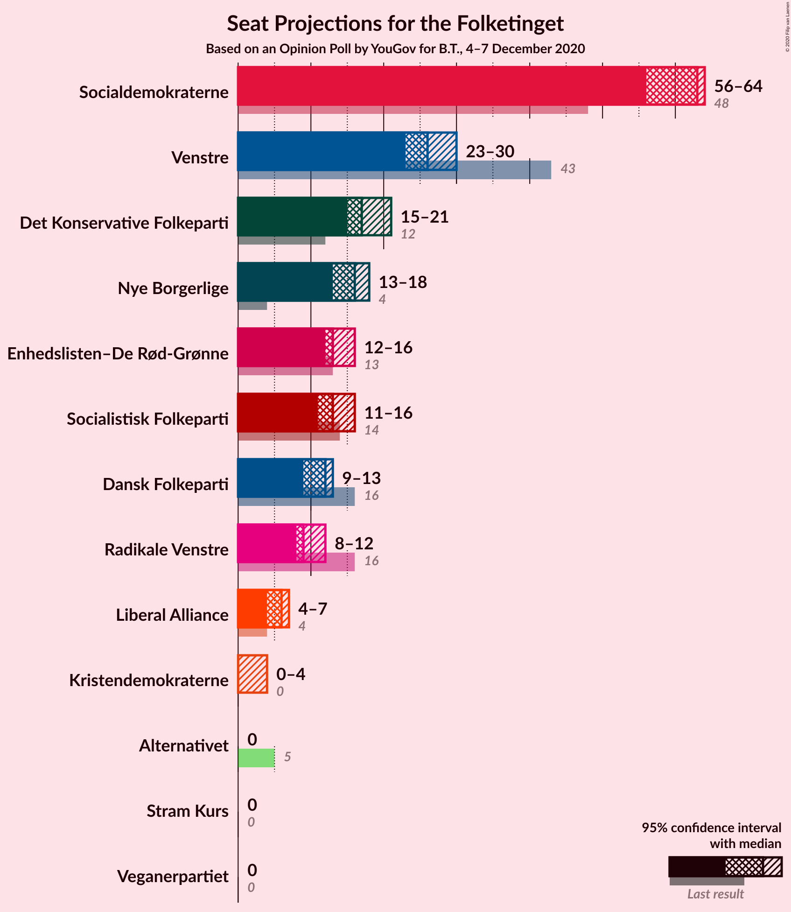
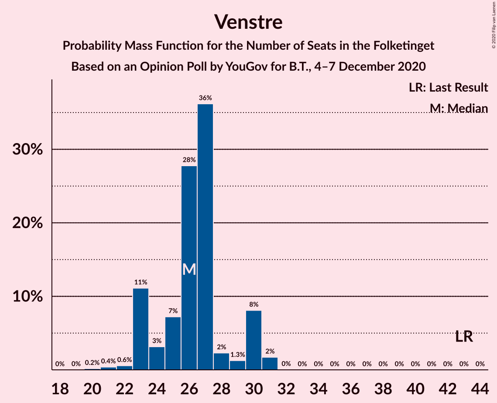
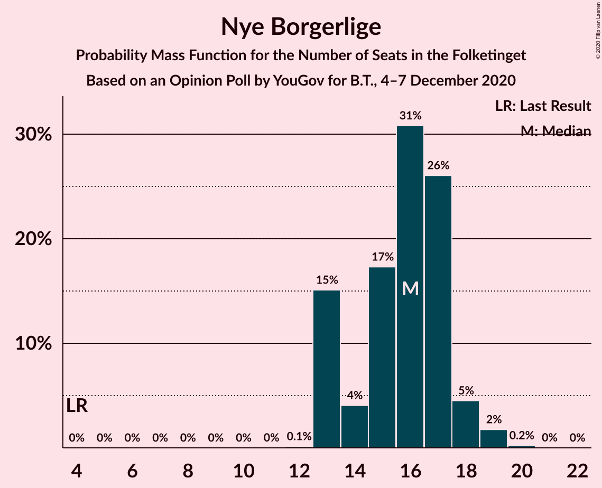
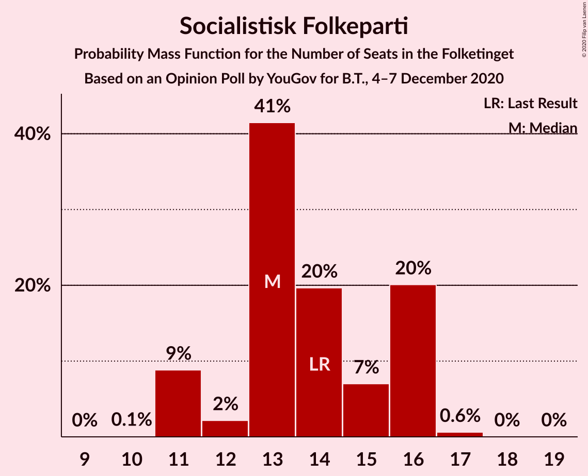
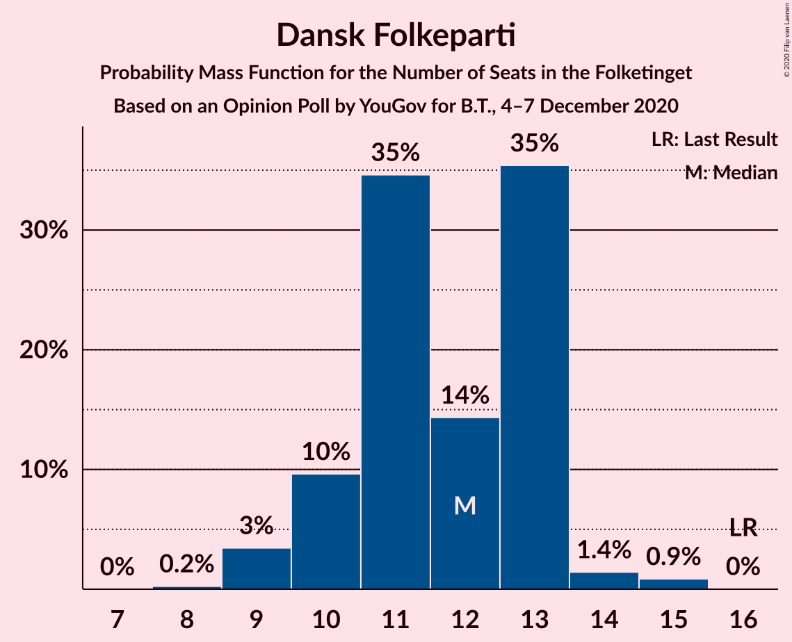
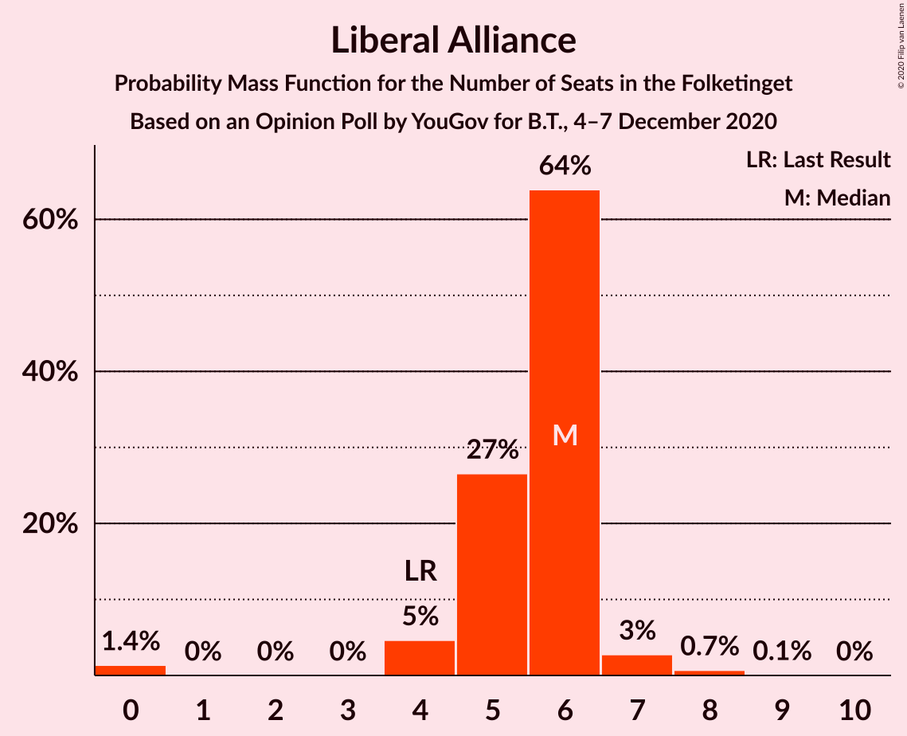
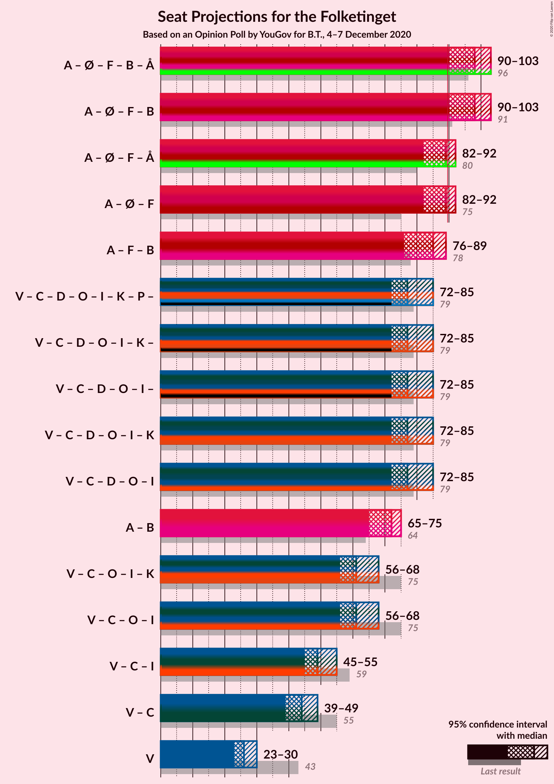
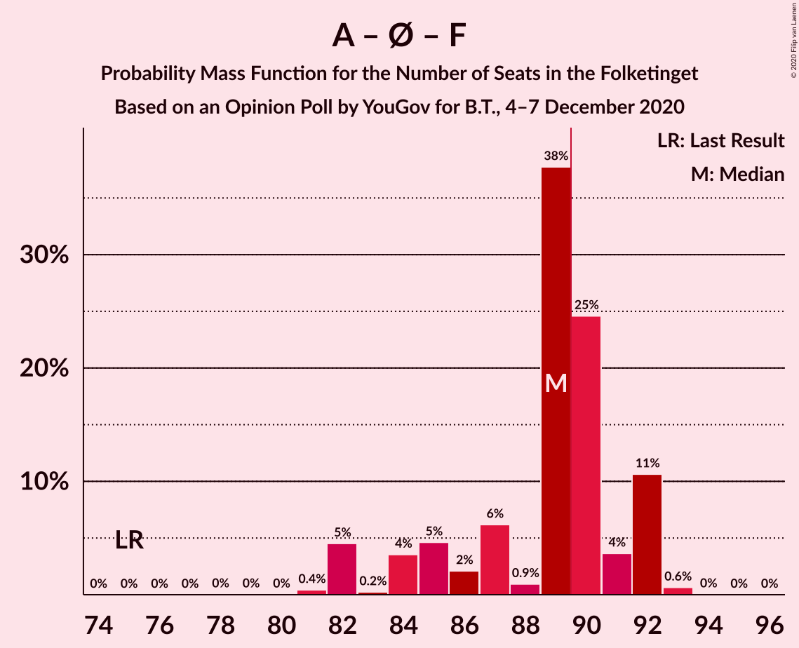

# Opinion Poll by YouGov for B.T., 4–7 December 2020

<a href="#voting-intentions">Voting Intentions</a> | <a href="#seats">Seats</a> | <a href="#coalitions">Coalitions</a> | <a href="#technical-information">Technical Information</a>

## Voting Intentions

### Confidence Intervals

| Party | Last Result | Poll Result | 80% Confidence Interval | 90% Confidence Interval | 95% Confidence Interval | 99% Confidence Interval |
|:-----:|:-----------:|:-----------:|:-----------------------:|:-----------------------:|:-----------------------:|:-----------------------:|
| Socialdemokraterne | 25.9% | 32.9% | 31.3–34.7% |30.8–35.2% |30.4–35.6% |29.6–36.4% |
| Venstre | 23.4% | 14.1% | 12.9–15.5% |12.6–15.9% |12.3–16.2% |11.8–16.9% |
| Det Konservative Folkeparti | 6.6% | 10.3% | 9.3–11.5% |9.0–11.8% |8.7–12.1% |8.3–12.7% |
| Nye Borgerlige | 2.4% | 8.6% | 7.7–9.7% |7.4–10.1% |7.2–10.3% |6.8–10.9% |
| Enhedslisten–De Rød-Grønne | 6.9% | 7.4% | 6.6–8.5% |6.3–8.8% |6.1–9.0% |5.7–9.6% |
| Socialistisk Folkeparti | 7.7% | 7.4% | 6.6–8.5% |6.3–8.8% |6.1–9.0% |5.7–9.6% |
| Dansk Folkeparti | 8.7% | 6.5% | 5.7–7.5% |5.4–7.7% |5.2–8.0% |4.9–8.5% |
| Radikale Venstre | 8.6% | 5.2% | 4.5–6.1% |4.3–6.4% |4.1–6.6% |3.8–7.0% |
| Liberal Alliance | 2.3% | 3.0% | 2.5–3.8% |2.3–4.0% |2.2–4.1% |2.0–4.5% |
| Kristendemokraterne | 1.7% | 1.4% | 1.0–1.9% |0.9–2.0% |0.9–2.2% |0.7–2.5% |
| Veganerpartiet | 0.0% | 1.3% | 0.9–1.8% |0.9–1.9% |0.8–2.1% |0.7–2.3% |
| Stram Kurs | 1.8% | 0.7% | 0.5–1.1% |0.4–1.3% |0.4–1.4% |0.3–1.6% |
| Alternativet | 3.0% | 0.4% | 0.2–0.7% |0.2–0.8% |0.2–0.9% |0.1–1.1% |

*Note:* The poll result column reflects the actual value used in the calculations. Published results may vary slightly, and in addition be rounded to fewer digits.

## Seats

### Confidence Intervals

| Party | Last Result | Median | 80% Confidence Interval | 90% Confidence Interval | 95% Confidence Interval | 99% Confidence Interval |
|:-----:|:-----------:|:------:|:-----------------------:|:-----------------------:|:-----------------------:|:-----------------------:|
| <a href="#socialdemokraterne">Socialdemokraterne</a> | 48 | 60 | 60–61 |58–62 |56–63 |55–65 |
| <a href="#venstre">Venstre</a> | 43 | 25 | 25–28 |24–28 |20–29 |20–29 |
| <a href="#det-konservative-folkeparti">Det Konservative Folkeparti</a> | 12 | 18 | 14–20 |14–21 |14–21 |14–22 |
| <a href="#nye-borgerlige">Nye Borgerlige</a> | 4 | 17 | 13–17 |13–18 |13–19 |13–20 |
| <a href="#enhedslisten–de-rød-grønne">Enhedslisten–De Rød-Grønne</a> | 13 | 14 | 13–15 |11–15 |11–15 |11–17 |
| <a href="#socialistisk-folkeparti">Socialistisk Folkeparti</a> | 14 | 15 | 13–17 |12–17 |12–17 |11–19 |
| <a href="#dansk-folkeparti">Dansk Folkeparti</a> | 16 | 9 | 9–12 |9–13 |9–13 |8–15 |
| <a href="#radikale-venstre">Radikale Venstre</a> | 16 | 11 | 8–11 |8–11 |6–11 |6–14 |
| <a href="#liberal-alliance">Liberal Alliance</a> | 4 | 6 | 6 |5–7 |4–7 |0–8 |
| <a href="#kristendemokraterne">Kristendemokraterne</a> | 0 | 0 | 0 |0 |0 |0–4 |
| <a href="#veganerpartiet">Veganerpartiet</a> | 0 | 0 | 0 |0 |0 |0 |
| <a href="#stram-kurs">Stram Kurs</a> | 0 | 0 | 0 |0 |0 |0 |
| <a href="#alternativet">Alternativet</a> | 5 | 0 | 0 |0 |0 |0 |

### Socialdemokraterne

*For a full overview of the results for this party, see the [Socialdemokraterne](party-socialdemokraterne.html) page.*

| Number of Seats | Probability | Accumulated | Special Marks |
|:---------------:|:-----------:|:-----------:|:-------------:|
| 48 | 0% | 100% | Last Result |
| 49 | 0% | 100% |  |
| 50 | 0% | 100% |  |
| 51 | 0.2% | 100% |  |
| 52 | 0% | 99.8% |  |
| 53 | 0% | 99.8% |  |
| 54 | 0.1% | 99.8% |  |
| 55 | 2% | 99.7% |  |
| 56 | 0.5% | 98% |  |
| 57 | 1.2% | 97% |  |
| 58 | 1.2% | 96% |  |
| 59 | 3% | 95% |  |
| 60 | 68% | 92% | Median |
| 61 | 18% | 24% |  |
| 62 | 0.3% | 5% |  |
| 63 | 4% | 5% |  |
| 64 | 0.2% | 1.3% |  |
| 65 | 1.0% | 1.1% |  |
| 66 | 0.1% | 0.1% |  |
| 67 | 0% | 0% |  |

### Venstre

*For a full overview of the results for this party, see the [Venstre](party-venstre.html) page.*

| Number of Seats | Probability | Accumulated | Special Marks |
|:---------------:|:-----------:|:-----------:|:-------------:|
| 20 | 3% | 100% |  |
| 21 | 0.1% | 96% |  |
| 22 | 0.1% | 96% |  |
| 23 | 0.1% | 96% |  |
| 24 | 3% | 96% |  |
| 25 | 45% | 93% | Median |
| 26 | 7% | 48% |  |
| 27 | 10% | 41% |  |
| 28 | 26% | 30% |  |
| 29 | 4% | 4% |  |
| 30 | 0% | 0.2% |  |
| 31 | 0% | 0.2% |  |
| 32 | 0.2% | 0.2% |  |
| 33 | 0% | 0% |  |
| 34 | 0% | 0% |  |
| 35 | 0% | 0% |  |
| 36 | 0% | 0% |  |
| 37 | 0% | 0% |  |
| 38 | 0% | 0% |  |
| 39 | 0% | 0% |  |
| 40 | 0% | 0% |  |
| 41 | 0% | 0% |  |
| 42 | 0% | 0% |  |
| 43 | 0% | 0% | Last Result |

### Det Konservative Folkeparti

*For a full overview of the results for this party, see the [Det Konservative Folkeparti](party-detkonservativefolkeparti.html) page.*

| Number of Seats | Probability | Accumulated | Special Marks |
|:---------------:|:-----------:|:-----------:|:-------------:|
| 12 | 0% | 100% | Last Result |
| 13 | 0% | 100% |  |
| 14 | 10% | 100% |  |
| 15 | 0% | 90% |  |
| 16 | 2% | 90% |  |
| 17 | 4% | 88% |  |
| 18 | 47% | 84% | Median |
| 19 | 4% | 37% |  |
| 20 | 24% | 33% |  |
| 21 | 7% | 9% |  |
| 22 | 2% | 2% |  |
| 23 | 0.1% | 0.1% |  |
| 24 | 0% | 0% |  |

### Nye Borgerlige

*For a full overview of the results for this party, see the [Nye Borgerlige](party-nyeborgerlige.html) page.*

| Number of Seats | Probability | Accumulated | Special Marks |
|:---------------:|:-----------:|:-----------:|:-------------:|
| 4 | 0% | 100% | Last Result |
| 5 | 0% | 100% |  |
| 6 | 0% | 100% |  |
| 7 | 0% | 100% |  |
| 8 | 0% | 100% |  |
| 9 | 0% | 100% |  |
| 10 | 0% | 100% |  |
| 11 | 0% | 100% |  |
| 12 | 0% | 100% |  |
| 13 | 11% | 99.9% |  |
| 14 | 4% | 89% |  |
| 15 | 6% | 86% |  |
| 16 | 5% | 80% |  |
| 17 | 68% | 74% | Median |
| 18 | 4% | 6% |  |
| 19 | 0.3% | 3% |  |
| 20 | 2% | 2% |  |
| 21 | 0% | 0% |  |

### Enhedslisten–De Rød-Grønne

*For a full overview of the results for this party, see the [Enhedslisten–De Rød-Grønne](party-enhedslisten–derød-grønne.html) page.*

| Number of Seats | Probability | Accumulated | Special Marks |
|:---------------:|:-----------:|:-----------:|:-------------:|
| 11 | 5% | 100% |  |
| 12 | 0.5% | 95% |  |
| 13 | 26% | 94% | Last Result |
| 14 | 55% | 68% | Median |
| 15 | 12% | 13% |  |
| 16 | 0.2% | 0.9% |  |
| 17 | 0.7% | 0.7% |  |
| 18 | 0% | 0.1% |  |
| 19 | 0% | 0% |  |

### Socialistisk Folkeparti

*For a full overview of the results for this party, see the [Socialistisk Folkeparti](party-socialistiskfolkeparti.html) page.*

| Number of Seats | Probability | Accumulated | Special Marks |
|:---------------:|:-----------:|:-----------:|:-------------:|
| 10 | 0.1% | 100% |  |
| 11 | 1.3% | 99.9% |  |
| 12 | 4% | 98.6% |  |
| 13 | 6% | 94% |  |
| 14 | 28% | 89% | Last Result |
| 15 | 46% | 61% | Median |
| 16 | 3% | 15% |  |
| 17 | 11% | 12% |  |
| 18 | 0.1% | 0.7% |  |
| 19 | 0.6% | 0.6% |  |
| 20 | 0% | 0% |  |

### Dansk Folkeparti

*For a full overview of the results for this party, see the [Dansk Folkeparti](party-danskfolkeparti.html) page.*

| Number of Seats | Probability | Accumulated | Special Marks |
|:---------------:|:-----------:|:-----------:|:-------------:|
| 8 | 1.0% | 100% |  |
| 9 | 68% | 99.0% | Median |
| 10 | 5% | 31% |  |
| 11 | 2% | 26% |  |
| 12 | 16% | 24% |  |
| 13 | 6% | 8% |  |
| 14 | 0.7% | 2% |  |
| 15 | 1.0% | 1.0% |  |
| 16 | 0% | 0% | Last Result |

### Radikale Venstre

*For a full overview of the results for this party, see the [Radikale Venstre](party-radikalevenstre.html) page.*

| Number of Seats | Probability | Accumulated | Special Marks |
|:---------------:|:-----------:|:-----------:|:-------------:|
| 6 | 4% | 100% |  |
| 7 | 0.7% | 96% |  |
| 8 | 27% | 96% |  |
| 9 | 7% | 68% |  |
| 10 | 11% | 61% |  |
| 11 | 48% | 50% | Median |
| 12 | 0.1% | 2% |  |
| 13 | 0.1% | 2% |  |
| 14 | 2% | 2% |  |
| 15 | 0% | 0% |  |
| 16 | 0% | 0% | Last Result |

### Liberal Alliance

*For a full overview of the results for this party, see the [Liberal Alliance](party-liberalalliance.html) page.*

| Number of Seats | Probability | Accumulated | Special Marks |
|:---------------:|:-----------:|:-----------:|:-------------:|
| 0 | 0.6% | 100% |  |
| 1 | 0% | 99.4% |  |
| 2 | 0% | 99.4% |  |
| 3 | 0% | 99.4% |  |
| 4 | 2% | 99.4% | Last Result |
| 5 | 7% | 97% |  |
| 6 | 84% | 90% | Median |
| 7 | 5% | 7% |  |
| 8 | 2% | 2% |  |
| 9 | 0.1% | 0.1% |  |
| 10 | 0% | 0% |  |

### Kristendemokraterne

*For a full overview of the results for this party, see the [Kristendemokraterne](party-kristendemokraterne.html) page.*

| Number of Seats | Probability | Accumulated | Special Marks |
|:---------------:|:-----------:|:-----------:|:-------------:|
| 0 | 98% | 100% | Last Result, Median |
| 1 | 0% | 2% |  |
| 2 | 0% | 2% |  |
| 3 | 0% | 2% |  |
| 4 | 2% | 2% |  |
| 5 | 0% | 0.1% |  |
| 6 | 0.1% | 0.1% |  |
| 7 | 0% | 0% |  |

### Veganerpartiet

*For a full overview of the results for this party, see the [Veganerpartiet](party-veganerpartiet.html) page.*

| Number of Seats | Probability | Accumulated | Special Marks |
|:---------------:|:-----------:|:-----------:|:-------------:|
| 0 | 99.8% | 100% | Last Result, Median |
| 1 | 0% | 0.2% |  |
| 2 | 0% | 0.2% |  |
| 3 | 0% | 0.2% |  |
| 4 | 0.2% | 0.2% |  |
| 5 | 0% | 0% |  |

### Stram Kurs

*For a full overview of the results for this party, see the [Stram Kurs](party-stramkurs.html) page.*

| Number of Seats | Probability | Accumulated | Special Marks |
|:---------------:|:-----------:|:-----------:|:-------------:|
| 0 | 100% | 100% | Last Result, Median |

### Alternativet

*For a full overview of the results for this party, see the [Alternativet](party-alternativet.html) page.*

| Number of Seats | Probability | Accumulated | Special Marks |
|:---------------:|:-----------:|:-----------:|:-------------:|
| 0 | 100% | 100% | Median |
| 1 | 0% | 0% |  |
| 2 | 0% | 0% |  |
| 3 | 0% | 0% |  |
| 4 | 0% | 0% |  |
| 5 | 0% | 0% | Last Result |

## Coalitions

### Confidence Intervals

| Coalition | Last Result | Median | Majority? | 80% Confidence Interval | 90% Confidence Interval | 95% Confidence Interval | 99% Confidence Interval |
|:---------:|:-----------:|:------:|:---------:|:-----------------------:|:-----------------------:|:-----------------------:|:-----------------------:|
| Socialdemokraterne – Enhedslisten–De Rød-Grønne – Socialistisk Folkeparti – Radikale Venstre – Alternativet | 96 | 100 | 99.8% | 95–103 | 94–103 | 93–103 | 93–103 |
| Socialdemokraterne – Enhedslisten–De Rød-Grønne – Socialistisk Folkeparti – Radikale Venstre | 91 | 100 | 99.8% | 95–103 | 94–103 | 93–103 | 93–103 |
| Socialdemokraterne – Enhedslisten–De Rød-Grønne – Socialistisk Folkeparti – Alternativet | 80 | 89 | 16% | 87–93 | 84–93 | 83–93 | 82–93 |
| Socialdemokraterne – Enhedslisten–De Rød-Grønne – Socialistisk Folkeparti | 75 | 89 | 16% | 87–93 | 84–93 | 83–93 | 82–93 |
| Socialdemokraterne – Socialistisk Folkeparti – Radikale Venstre | 78 | 86 | 0.1% | 82–88 | 82–88 | 82–88 | 78–88 |
| Venstre – Det Konservative Folkeparti – Nye Borgerlige – Dansk Folkeparti – Liberal Alliance – Kristendemokraterne | 79 | 75 | 0% | 72–80 | 72–81 | 72–82 | 72–82 |
| Venstre – Det Konservative Folkeparti – Nye Borgerlige – Dansk Folkeparti – Liberal Alliance | 79 | 75 | 0% | 72–80 | 72–80 | 72–82 | 72–82 |
| Socialdemokraterne – Radikale Venstre | 64 | 71 | 0% | 68–71 | 68–71 | 67–71 | 63–74 |
| Venstre – Det Konservative Folkeparti – Dansk Folkeparti – Liberal Alliance – Kristendemokraterne | 75 | 59 | 0% | 58–63 | 58–65 | 58–66 | 58–67 |
| Venstre – Det Konservative Folkeparti – Dansk Folkeparti – Liberal Alliance | 75 | 59 | 0% | 58–63 | 58–64 | 58–65 | 58–67 |
| Venstre – Det Konservative Folkeparti – Liberal Alliance | 59 | 49 | 0% | 47–54 | 47–54 | 47–54 | 44–55 |
| Venstre – Det Konservative Folkeparti | 55 | 43 | 0% | 41–48 | 41–48 | 41–48 | 40–48 |
| Venstre | 43 | 25 | 0% | 25–28 | 24–28 | 20–29 | 20–29 |

### Socialdemokraterne – Enhedslisten–De Rød-Grønne – Socialistisk Folkeparti – Radikale Venstre – Alternativet

| Number of Seats | Probability | Accumulated | Special Marks |
|:---------------:|:-----------:|:-----------:|:-------------:|
| 89 | 0.2% | 100% |  |
| 90 | 0% | 99.8% | Majority |
| 91 | 0.1% | 99.8% |  |
| 92 | 0.2% | 99.7% |  |
| 93 | 2% | 99.5% |  |
| 94 | 3% | 97% |  |
| 95 | 23% | 94% |  |
| 96 | 4% | 71% | Last Result |
| 97 | 8% | 67% |  |
| 98 | 0.9% | 59% |  |
| 99 | 1.1% | 58% |  |
| 100 | 45% | 57% | Median |
| 101 | 1.0% | 12% |  |
| 102 | 0.1% | 11% |  |
| 103 | 10% | 10% |  |
| 104 | 0% | 0.1% |  |
| 105 | 0% | 0.1% |  |
| 106 | 0.1% | 0.1% |  |
| 107 | 0% | 0% |  |

### Socialdemokraterne – Enhedslisten–De Rød-Grønne – Socialistisk Folkeparti – Radikale Venstre

| Number of Seats | Probability | Accumulated | Special Marks |
|:---------------:|:-----------:|:-----------:|:-------------:|
| 89 | 0.2% | 100% |  |
| 90 | 0% | 99.8% | Majority |
| 91 | 0.1% | 99.8% | Last Result |
| 92 | 0.2% | 99.7% |  |
| 93 | 2% | 99.5% |  |
| 94 | 3% | 97% |  |
| 95 | 23% | 94% |  |
| 96 | 4% | 71% |  |
| 97 | 8% | 67% |  |
| 98 | 0.9% | 59% |  |
| 99 | 1.1% | 58% |  |
| 100 | 45% | 57% | Median |
| 101 | 1.0% | 12% |  |
| 102 | 0.1% | 11% |  |
| 103 | 10% | 10% |  |
| 104 | 0% | 0.1% |  |
| 105 | 0% | 0.1% |  |
| 106 | 0.1% | 0.1% |  |
| 107 | 0% | 0% |  |

### Socialdemokraterne – Enhedslisten–De Rød-Grønne – Socialistisk Folkeparti – Alternativet

| Number of Seats | Probability | Accumulated | Special Marks |
|:---------------:|:-----------:|:-----------:|:-------------:|
| 79 | 0.2% | 100% |  |
| 80 | 0% | 99.8% | Last Result |
| 81 | 0% | 99.8% |  |
| 82 | 2% | 99.8% |  |
| 83 | 1.4% | 98% |  |
| 84 | 3% | 96% |  |
| 85 | 0.4% | 94% |  |
| 86 | 2% | 93% |  |
| 87 | 24% | 92% |  |
| 88 | 7% | 68% |  |
| 89 | 45% | 61% | Median |
| 90 | 0.3% | 16% | Majority |
| 91 | 5% | 16% |  |
| 92 | 0.1% | 11% |  |
| 93 | 11% | 11% |  |
| 94 | 0% | 0.1% |  |
| 95 | 0% | 0.1% |  |
| 96 | 0.1% | 0.1% |  |
| 97 | 0% | 0% |  |

### Socialdemokraterne – Enhedslisten–De Rød-Grønne – Socialistisk Folkeparti

| Number of Seats | Probability | Accumulated | Special Marks |
|:---------------:|:-----------:|:-----------:|:-------------:|
| 75 | 0% | 100% | Last Result |
| 76 | 0% | 100% |  |
| 77 | 0% | 100% |  |
| 78 | 0% | 100% |  |
| 79 | 0.2% | 100% |  |
| 80 | 0% | 99.8% |  |
| 81 | 0% | 99.8% |  |
| 82 | 2% | 99.8% |  |
| 83 | 1.4% | 98% |  |
| 84 | 3% | 96% |  |
| 85 | 0.4% | 94% |  |
| 86 | 2% | 93% |  |
| 87 | 24% | 92% |  |
| 88 | 7% | 68% |  |
| 89 | 45% | 61% | Median |
| 90 | 0.3% | 16% | Majority |
| 91 | 5% | 16% |  |
| 92 | 0.1% | 11% |  |
| 93 | 11% | 11% |  |
| 94 | 0% | 0.1% |  |
| 95 | 0% | 0.1% |  |
| 96 | 0.1% | 0.1% |  |
| 97 | 0% | 0% |  |

### Socialdemokraterne – Socialistisk Folkeparti – Radikale Venstre

| Number of Seats | Probability | Accumulated | Special Marks |
|:---------------:|:-----------:|:-----------:|:-------------:|
| 76 | 0.2% | 100% |  |
| 77 | 0.2% | 99.8% |  |
| 78 | 0.5% | 99.6% | Last Result |
| 79 | 0.2% | 99.1% |  |
| 80 | 0.3% | 98.9% |  |
| 81 | 0.3% | 98.6% |  |
| 82 | 27% | 98% |  |
| 83 | 12% | 72% |  |
| 84 | 0.5% | 59% |  |
| 85 | 3% | 59% |  |
| 86 | 45% | 56% | Median |
| 87 | 0.2% | 11% |  |
| 88 | 10% | 11% |  |
| 89 | 0.1% | 0.2% |  |
| 90 | 0% | 0.1% | Majority |
| 91 | 0% | 0% |  |

### Venstre – Det Konservative Folkeparti – Nye Borgerlige – Dansk Folkeparti – Liberal Alliance – Kristendemokraterne

| Number of Seats | Probability | Accumulated | Special Marks |
|:---------------:|:-----------:|:-----------:|:-------------:|
| 69 | 0.1% | 100% |  |
| 70 | 0% | 99.9% |  |
| 71 | 0% | 99.9% |  |
| 72 | 10% | 99.9% |  |
| 73 | 0.1% | 89% |  |
| 74 | 1.0% | 89% |  |
| 75 | 45% | 88% | Median |
| 76 | 1.1% | 43% |  |
| 77 | 1.0% | 42% |  |
| 78 | 8% | 41% |  |
| 79 | 4% | 33% | Last Result |
| 80 | 23% | 29% |  |
| 81 | 3% | 6% |  |
| 82 | 2% | 3% |  |
| 83 | 0.2% | 0.4% |  |
| 84 | 0% | 0.2% |  |
| 85 | 0% | 0.2% |  |
| 86 | 0.1% | 0.2% |  |
| 87 | 0% | 0% |  |

### Venstre – Det Konservative Folkeparti – Nye Borgerlige – Dansk Folkeparti – Liberal Alliance

| Number of Seats | Probability | Accumulated | Special Marks |
|:---------------:|:-----------:|:-----------:|:-------------:|
| 69 | 0.1% | 100% |  |
| 70 | 0.1% | 99.9% |  |
| 71 | 0% | 99.9% |  |
| 72 | 10% | 99.8% |  |
| 73 | 0.1% | 89% |  |
| 74 | 0.9% | 89% |  |
| 75 | 45% | 88% | Median |
| 76 | 1.1% | 43% |  |
| 77 | 2% | 42% |  |
| 78 | 8% | 40% |  |
| 79 | 4% | 32% | Last Result |
| 80 | 23% | 28% |  |
| 81 | 2% | 4% |  |
| 82 | 2% | 3% |  |
| 83 | 0.2% | 0.3% |  |
| 84 | 0% | 0.1% |  |
| 85 | 0% | 0% |  |

### Socialdemokraterne – Radikale Venstre

| Number of Seats | Probability | Accumulated | Special Marks |
|:---------------:|:-----------:|:-----------:|:-------------:|
| 61 | 0.1% | 100% |  |
| 62 | 0% | 99.8% |  |
| 63 | 0.5% | 99.8% |  |
| 64 | 0.1% | 99.3% | Last Result |
| 65 | 0.3% | 99.2% |  |
| 66 | 0.2% | 98.9% |  |
| 67 | 3% | 98.8% |  |
| 68 | 24% | 96% |  |
| 69 | 8% | 72% |  |
| 70 | 6% | 64% |  |
| 71 | 56% | 58% | Median |
| 72 | 0.4% | 2% |  |
| 73 | 0.5% | 1.3% |  |
| 74 | 0.6% | 0.8% |  |
| 75 | 0.2% | 0.2% |  |
| 76 | 0% | 0% |  |

### Venstre – Det Konservative Folkeparti – Dansk Folkeparti – Liberal Alliance – Kristendemokraterne

| Number of Seats | Probability | Accumulated | Special Marks |
|:---------------:|:-----------:|:-----------:|:-------------:|
| 53 | 0.1% | 100% |  |
| 54 | 0% | 99.9% |  |
| 55 | 0% | 99.9% |  |
| 56 | 0% | 99.9% |  |
| 57 | 0.2% | 99.9% |  |
| 58 | 45% | 99.7% | Median |
| 59 | 12% | 55% |  |
| 60 | 4% | 43% |  |
| 61 | 1.2% | 39% |  |
| 62 | 6% | 38% |  |
| 63 | 23% | 32% |  |
| 64 | 3% | 8% |  |
| 65 | 2% | 6% |  |
| 66 | 1.5% | 3% |  |
| 67 | 2% | 2% |  |
| 68 | 0.1% | 0.3% |  |
| 69 | 0% | 0.2% |  |
| 70 | 0% | 0.2% |  |
| 71 | 0% | 0.2% |  |
| 72 | 0.2% | 0.2% |  |
| 73 | 0% | 0% |  |
| 74 | 0% | 0% |  |
| 75 | 0% | 0% | Last Result |

### Venstre – Det Konservative Folkeparti – Dansk Folkeparti – Liberal Alliance

| Number of Seats | Probability | Accumulated | Special Marks |
|:---------------:|:-----------:|:-----------:|:-------------:|
| 53 | 0.1% | 100% |  |
| 54 | 0% | 99.9% |  |
| 55 | 0% | 99.9% |  |
| 56 | 0% | 99.9% |  |
| 57 | 0.2% | 99.9% |  |
| 58 | 45% | 99.7% | Median |
| 59 | 12% | 55% |  |
| 60 | 5% | 43% |  |
| 61 | 1.2% | 39% |  |
| 62 | 7% | 37% |  |
| 63 | 23% | 30% |  |
| 64 | 3% | 7% |  |
| 65 | 2% | 4% |  |
| 66 | 0% | 2% |  |
| 67 | 2% | 2% |  |
| 68 | 0.3% | 0.3% |  |
| 69 | 0% | 0% |  |
| 70 | 0% | 0% |  |
| 71 | 0% | 0% |  |
| 72 | 0% | 0% |  |
| 73 | 0% | 0% |  |
| 74 | 0% | 0% |  |
| 75 | 0% | 0% | Last Result |

### Venstre – Det Konservative Folkeparti – Liberal Alliance

| Number of Seats | Probability | Accumulated | Special Marks |
|:---------------:|:-----------:|:-----------:|:-------------:|
| 43 | 0.1% | 100% |  |
| 44 | 0.6% | 99.9% |  |
| 45 | 0.3% | 99.3% |  |
| 46 | 0.4% | 99.1% |  |
| 47 | 14% | 98.7% |  |
| 48 | 0.8% | 85% |  |
| 49 | 45% | 84% | Median |
| 50 | 5% | 39% |  |
| 51 | 1.5% | 34% |  |
| 52 | 6% | 33% |  |
| 53 | 0.2% | 27% |  |
| 54 | 25% | 26% |  |
| 55 | 2% | 2% |  |
| 56 | 0% | 0.2% |  |
| 57 | 0% | 0.2% |  |
| 58 | 0.1% | 0.2% |  |
| 59 | 0% | 0% | Last Result |

### Venstre – Det Konservative Folkeparti

| Number of Seats | Probability | Accumulated | Special Marks |
|:---------------:|:-----------:|:-----------:|:-------------:|
| 39 | 0.1% | 100% |  |
| 40 | 0.6% | 99.9% |  |
| 41 | 14% | 99.3% |  |
| 42 | 1.1% | 85% |  |
| 43 | 45% | 84% | Median |
| 44 | 0.3% | 40% |  |
| 45 | 7% | 39% |  |
| 46 | 4% | 33% |  |
| 47 | 5% | 28% |  |
| 48 | 23% | 24% |  |
| 49 | 0% | 0.2% |  |
| 50 | 0% | 0.2% |  |
| 51 | 0% | 0.2% |  |
| 52 | 0.2% | 0.2% |  |
| 53 | 0% | 0% |  |
| 54 | 0% | 0% |  |
| 55 | 0% | 0% | Last Result |

### Venstre

| Number of Seats | Probability | Accumulated | Special Marks |
|:---------------:|:-----------:|:-----------:|:-------------:|
| 20 | 3% | 100% |  |
| 21 | 0.1% | 96% |  |
| 22 | 0.1% | 96% |  |
| 23 | 0.1% | 96% |  |
| 24 | 3% | 96% |  |
| 25 | 45% | 93% | Median |
| 26 | 7% | 48% |  |
| 27 | 10% | 41% |  |
| 28 | 26% | 30% |  |
| 29 | 4% | 4% |  |
| 30 | 0% | 0.2% |  |
| 31 | 0% | 0.2% |  |
| 32 | 0.2% | 0.2% |  |
| 33 | 0% | 0% |  |
| 34 | 0% | 0% |  |
| 35 | 0% | 0% |  |
| 36 | 0% | 0% |  |
| 37 | 0% | 0% |  |
| 38 | 0% | 0% |  |
| 39 | 0% | 0% |  |
| 40 | 0% | 0% |  |
| 41 | 0% | 0% |  |
| 42 | 0% | 0% |  |
| 43 | 0% | 0% | Last Result |

## Technical Information

### Opinion Poll

+ **Polling firm:** YouGov
+ **Commissioner(s):** B.T.
+ **Fieldwork period:** 4–7 December 2020

### Calculations

+ **Sample size:** 1251
+ **Simulations done:** 131,072
+ **Error estimate:** 1.63%

