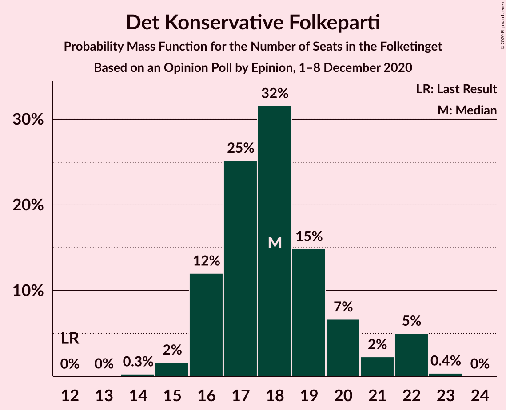
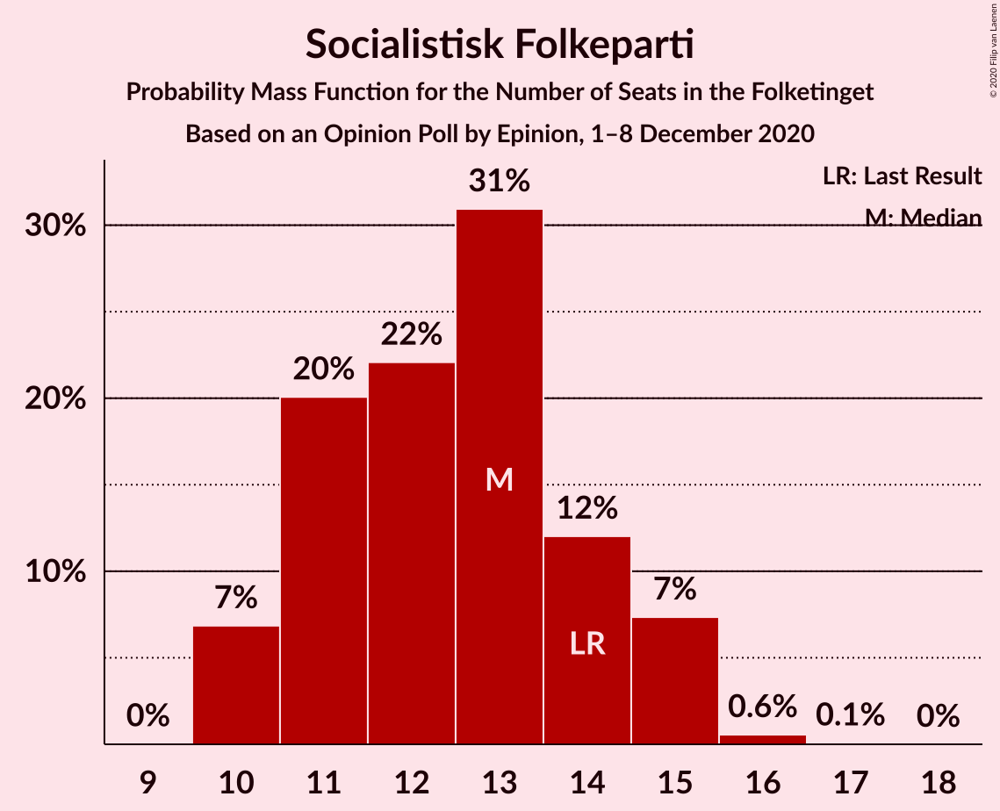
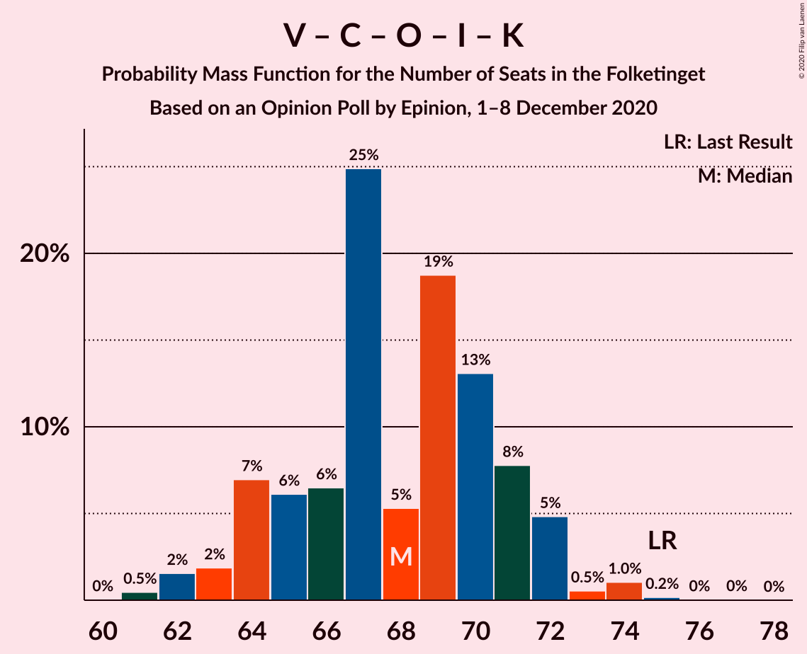
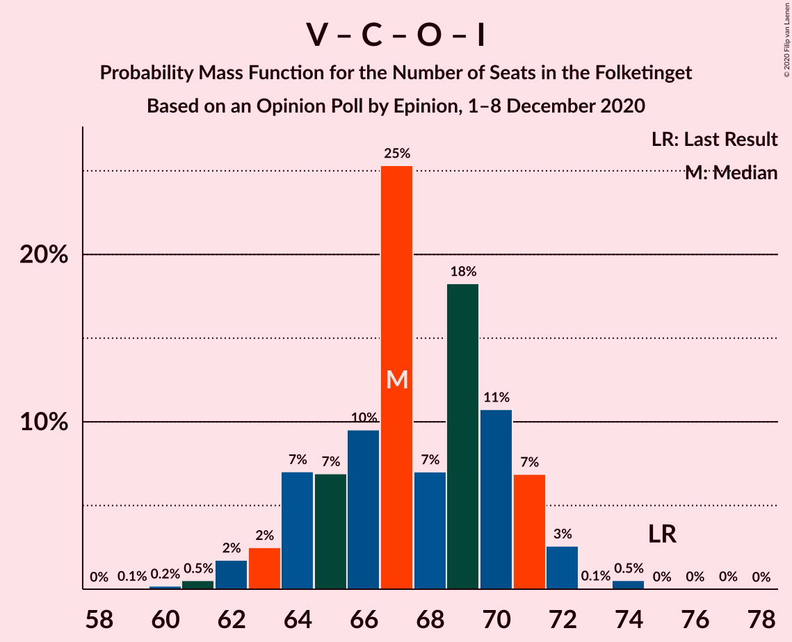
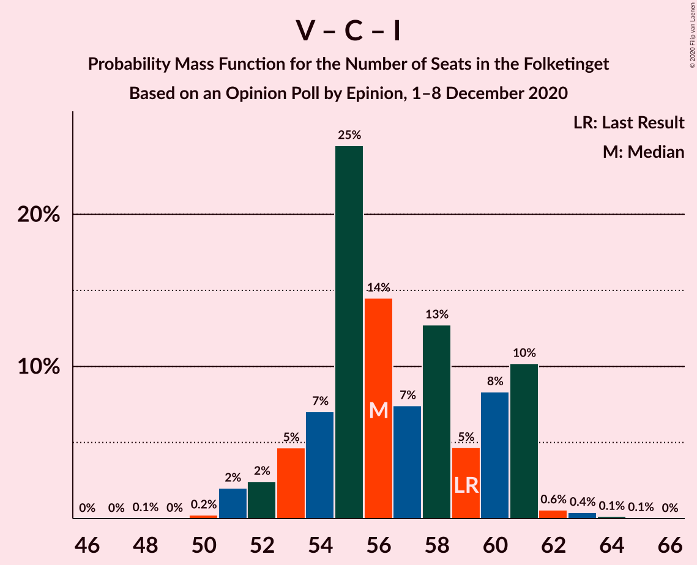

# Opinion Poll by Epinion, 1–8 December 2020

<a href="#voting-intentions">Voting Intentions</a> | <a href="#seats">Seats</a> | <a href="#coalitions">Coalitions</a> | <a href="#technical-information">Technical Information</a>

## Voting Intentions

### Confidence Intervals

| Party | Last Result | Poll Result | 80% Confidence Interval | 90% Confidence Interval | 95% Confidence Interval | 99% Confidence Interval |
|:-----:|:-----------:|:-----------:|:-----------------------:|:-----------------------:|:-----------------------:|:-----------------------:|
| Socialdemokraterne | 25.9% | 31.5% | 30.1–33.0% |29.7–33.4% |29.3–33.8% |28.7–34.5% |
| Venstre | 23.4% | 17.6% | 16.5–18.9% |16.1–19.2% |15.9–19.5% |15.3–20.1% |
| Det Konservative Folkeparti | 6.6% | 9.9% | 9.1–10.9% |8.8–11.2% |8.6–11.5% |8.2–11.9% |
| Nye Borgerlige | 2.4% | 7.8% | 7.0–8.7% |6.8–9.0% |6.6–9.2% |6.2–9.6% |
| Socialistisk Folkeparti | 7.7% | 7.1% | 6.3–8.0% |6.1–8.2% |6.0–8.4% |5.6–8.9% |
| Enhedslisten–De Rød-Grønne | 6.9% | 6.9% | 6.2–7.8% |6.0–8.0% |5.8–8.2% |5.5–8.7% |
| Radikale Venstre | 8.6% | 6.7% | 6.0–7.5% |5.7–7.8% |5.6–8.0% |5.3–8.4% |
| Dansk Folkeparti | 8.7% | 5.8% | 5.1–6.6% |4.9–6.8% |4.8–7.0% |4.5–7.4% |
| Liberal Alliance | 2.3% | 3.7% | 3.2–4.4% |3.0–4.6% |2.9–4.7% |2.7–5.1% |
| Kristendemokraterne | 1.7% | 1.6% | 1.3–2.1% |1.2–2.2% |1.1–2.3% |1.0–2.6% |
| Veganerpartiet | 0.0% | 0.5% | 0.3–0.8% |0.3–0.9% |0.2–0.9% |0.2–1.1% |
| Alternativet | 3.0% | 0.2% | 0.1–0.4% |0.1–0.5% |0.1–0.5% |0.0–0.7% |

*Note:* The poll result column reflects the actual value used in the calculations. Published results may vary slightly, and in addition be rounded to fewer digits.

## Seats

### Confidence Intervals

| Party | Last Result | Median | 80% Confidence Interval | 90% Confidence Interval | 95% Confidence Interval | 99% Confidence Interval |
|:-----:|:-----------:|:------:|:-----------------------:|:-----------------------:|:-----------------------:|:-----------------------:|
| <a href="#socialdemokraterne">Socialdemokraterne</a> | 48 | 56 | 53–60 |52–60 |52–60 |50–62 |
| <a href="#venstre">Venstre</a> | 43 | 31 | 29–35 |29–35 |28–35 |27–36 |
| <a href="#det-konservative-folkeparti">Det Konservative Folkeparti</a> | 12 | 18 | 16–20 |16–22 |16–22 |15–22 |
| <a href="#nye-borgerlige">Nye Borgerlige</a> | 4 | 14 | 13–16 |12–16 |12–17 |11–17 |
| <a href="#socialistisk-folkeparti">Socialistisk Folkeparti</a> | 14 | 13 | 11–14 |10–15 |10–15 |10–16 |
| <a href="#enhedslisten–de-rød-grønne">Enhedslisten–De Rød-Grønne</a> | 13 | 13 | 11–14 |10–14 |10–15 |10–15 |
| <a href="#radikale-venstre">Radikale Venstre</a> | 16 | 12 | 11–14 |10–14 |9–14 |9–15 |
| <a href="#dansk-folkeparti">Dansk Folkeparti</a> | 16 | 11 | 8–12 |8–13 |8–13 |8–14 |
| <a href="#liberal-alliance">Liberal Alliance</a> | 4 | 7 | 6–8 |6–8 |5–9 |5–9 |
| <a href="#kristendemokraterne">Kristendemokraterne</a> | 0 | 0 | 0 |0–4 |0–4 |0–5 |
| <a href="#veganerpartiet">Veganerpartiet</a> | 0 | 0 | 0 |0 |0 |0 |
| <a href="#alternativet">Alternativet</a> | 5 | 0 | 0 |0 |0 |0 |

### Socialdemokraterne

*For a full overview of the results for this party, see the [Socialdemokraterne](party-socialdemokraterne.html) page.*

| Number of Seats | Probability | Accumulated | Special Marks |
|:---------------:|:-----------:|:-----------:|:-------------:|
| 48 | 0% | 100% | Last Result |
| 49 | 0.1% | 100% |  |
| 50 | 1.3% | 99.9% |  |
| 51 | 0.6% | 98.6% |  |
| 52 | 4% | 98% |  |
| 53 | 9% | 94% |  |
| 54 | 22% | 86% |  |
| 55 | 6% | 64% |  |
| 56 | 17% | 58% | Median |
| 57 | 16% | 41% |  |
| 58 | 8% | 24% |  |
| 59 | 5% | 16% |  |
| 60 | 10% | 11% |  |
| 61 | 0.4% | 1.0% |  |
| 62 | 0.3% | 0.6% |  |
| 63 | 0% | 0.3% |  |
| 64 | 0.3% | 0.3% |  |
| 65 | 0% | 0% |  |

### Venstre

*For a full overview of the results for this party, see the [Venstre](party-venstre.html) page.*

| Number of Seats | Probability | Accumulated | Special Marks |
|:---------------:|:-----------:|:-----------:|:-------------:|
| 26 | 0.1% | 100% |  |
| 27 | 0.7% | 99.9% |  |
| 28 | 3% | 99.2% |  |
| 29 | 19% | 96% |  |
| 30 | 16% | 78% |  |
| 31 | 22% | 61% | Median |
| 32 | 11% | 39% |  |
| 33 | 9% | 29% |  |
| 34 | 6% | 20% |  |
| 35 | 12% | 13% |  |
| 36 | 1.3% | 2% |  |
| 37 | 0.3% | 0.3% |  |
| 38 | 0% | 0% |  |
| 39 | 0% | 0% |  |
| 40 | 0% | 0% |  |
| 41 | 0% | 0% |  |
| 42 | 0% | 0% |  |
| 43 | 0% | 0% | Last Result |

### Det Konservative Folkeparti

*For a full overview of the results for this party, see the [Det Konservative Folkeparti](party-detkonservativefolkeparti.html) page.*

| Number of Seats | Probability | Accumulated | Special Marks |
|:---------------:|:-----------:|:-----------:|:-------------:|
| 12 | 0% | 100% | Last Result |
| 13 | 0% | 100% |  |
| 14 | 0.3% | 100% |  |
| 15 | 2% | 99.7% |  |
| 16 | 12% | 98% |  |
| 17 | 25% | 86% |  |
| 18 | 32% | 61% | Median |
| 19 | 15% | 29% |  |
| 20 | 7% | 14% |  |
| 21 | 2% | 8% |  |
| 22 | 5% | 5% |  |
| 23 | 0.4% | 0.4% |  |
| 24 | 0% | 0% |  |

### Nye Borgerlige

*For a full overview of the results for this party, see the [Nye Borgerlige](party-nyeborgerlige.html) page.*

| Number of Seats | Probability | Accumulated | Special Marks |
|:---------------:|:-----------:|:-----------:|:-------------:|
| 4 | 0% | 100% | Last Result |
| 5 | 0% | 100% |  |
| 6 | 0% | 100% |  |
| 7 | 0% | 100% |  |
| 8 | 0% | 100% |  |
| 9 | 0% | 100% |  |
| 10 | 0.1% | 100% |  |
| 11 | 0.9% | 99.9% |  |
| 12 | 4% | 99.0% |  |
| 13 | 21% | 95% |  |
| 14 | 29% | 74% | Median |
| 15 | 28% | 45% |  |
| 16 | 13% | 17% |  |
| 17 | 4% | 4% |  |
| 18 | 0.2% | 0.2% |  |
| 19 | 0% | 0% |  |

### Socialistisk Folkeparti

*For a full overview of the results for this party, see the [Socialistisk Folkeparti](party-socialistiskfolkeparti.html) page.*

| Number of Seats | Probability | Accumulated | Special Marks |
|:---------------:|:-----------:|:-----------:|:-------------:|
| 10 | 7% | 100% |  |
| 11 | 20% | 93% |  |
| 12 | 22% | 73% |  |
| 13 | 31% | 51% | Median |
| 14 | 12% | 20% | Last Result |
| 15 | 7% | 8% |  |
| 16 | 0.6% | 0.6% |  |
| 17 | 0.1% | 0.1% |  |
| 18 | 0% | 0% |  |

### Enhedslisten–De Rød-Grønne

*For a full overview of the results for this party, see the [Enhedslisten–De Rød-Grønne](party-enhedslisten–derød-grønne.html) page.*

| Number of Seats | Probability | Accumulated | Special Marks |
|:---------------:|:-----------:|:-----------:|:-------------:|
| 9 | 0.2% | 100% |  |
| 10 | 7% | 99.8% |  |
| 11 | 24% | 93% |  |
| 12 | 13% | 69% |  |
| 13 | 45% | 57% | Last Result, Median |
| 14 | 8% | 11% |  |
| 15 | 3% | 4% |  |
| 16 | 0.3% | 0.4% |  |
| 17 | 0% | 0% |  |

### Radikale Venstre

*For a full overview of the results for this party, see the [Radikale Venstre](party-radikalevenstre.html) page.*

| Number of Seats | Probability | Accumulated | Special Marks |
|:---------------:|:-----------:|:-----------:|:-------------:|
| 8 | 0.1% | 100% |  |
| 9 | 2% | 99.9% |  |
| 10 | 6% | 97% |  |
| 11 | 29% | 91% |  |
| 12 | 33% | 62% | Median |
| 13 | 11% | 30% |  |
| 14 | 16% | 18% |  |
| 15 | 2% | 2% |  |
| 16 | 0.1% | 0.2% | Last Result |
| 17 | 0% | 0% |  |

### Dansk Folkeparti

*For a full overview of the results for this party, see the [Dansk Folkeparti](party-danskfolkeparti.html) page.*

| Number of Seats | Probability | Accumulated | Special Marks |
|:---------------:|:-----------:|:-----------:|:-------------:|
| 7 | 0.1% | 100% |  |
| 8 | 11% | 99.9% |  |
| 9 | 7% | 89% |  |
| 10 | 20% | 82% |  |
| 11 | 16% | 62% | Median |
| 12 | 37% | 46% |  |
| 13 | 8% | 8% |  |
| 14 | 0.6% | 0.7% |  |
| 15 | 0.1% | 0.1% |  |
| 16 | 0% | 0% | Last Result |

### Liberal Alliance

*For a full overview of the results for this party, see the [Liberal Alliance](party-liberalalliance.html) page.*

| Number of Seats | Probability | Accumulated | Special Marks |
|:---------------:|:-----------:|:-----------:|:-------------:|
| 4 | 0.1% | 100% | Last Result |
| 5 | 4% | 99.9% |  |
| 6 | 16% | 96% |  |
| 7 | 33% | 80% | Median |
| 8 | 42% | 46% |  |
| 9 | 4% | 4% |  |
| 10 | 0.1% | 0.1% |  |
| 11 | 0% | 0% |  |

### Kristendemokraterne

*For a full overview of the results for this party, see the [Kristendemokraterne](party-kristendemokraterne.html) page.*

| Number of Seats | Probability | Accumulated | Special Marks |
|:---------------:|:-----------:|:-----------:|:-------------:|
| 0 | 91% | 100% | Last Result, Median |
| 1 | 0% | 9% |  |
| 2 | 0% | 9% |  |
| 3 | 0.1% | 9% |  |
| 4 | 8% | 9% |  |
| 5 | 1.3% | 1.3% |  |
| 6 | 0% | 0% |  |

### Veganerpartiet

*For a full overview of the results for this party, see the [Veganerpartiet](party-veganerpartiet.html) page.*

| Number of Seats | Probability | Accumulated | Special Marks |
|:---------------:|:-----------:|:-----------:|:-------------:|
| 0 | 100% | 100% | Last Result, Median |

### Alternativet

*For a full overview of the results for this party, see the [Alternativet](party-alternativet.html) page.*

| Number of Seats | Probability | Accumulated | Special Marks |
|:---------------:|:-----------:|:-----------:|:-------------:|
| 0 | 100% | 100% | Median |
| 1 | 0% | 0% |  |
| 2 | 0% | 0% |  |
| 3 | 0% | 0% |  |
| 4 | 0% | 0% |  |
| 5 | 0% | 0% | Last Result |

## Coalitions

### Confidence Intervals

| Coalition | Last Result | Median | Majority? | 80% Confidence Interval | 90% Confidence Interval | 95% Confidence Interval | 99% Confidence Interval |
|:---------:|:-----------:|:------:|:---------:|:-----------------------:|:-----------------------:|:-----------------------:|:-----------------------:|
| Socialdemokraterne – Socialistisk Folkeparti – Enhedslisten–De Rød-Grønne – Radikale Venstre – Alternativet | 96 | 93 | 90% | 89–96 | 89–97 | 88–98 | 87–100 |
| Socialdemokraterne – Socialistisk Folkeparti – Enhedslisten–De Rød-Grønne – Radikale Venstre | 91 | 93 | 90% | 89–96 | 89–97 | 88–98 | 87–100 |
| Venstre – Det Konservative Folkeparti – Nye Borgerlige – Dansk Folkeparti – Liberal Alliance – Kristendemokraterne | 79 | 82 | 0.1% | 79–86 | 78–86 | 77–87 | 75–88 |
| Venstre – Det Konservative Folkeparti – Nye Borgerlige – Dansk Folkeparti – Liberal Alliance | 79 | 82 | 0.1% | 78–85 | 78–86 | 76–87 | 75–87 |
| Socialdemokraterne – Socialistisk Folkeparti – Enhedslisten–De Rød-Grønne – Alternativet | 80 | 81 | 0.1% | 77–84 | 76–86 | 76–86 | 75–88 |
| Socialdemokraterne – Socialistisk Folkeparti – Enhedslisten–De Rød-Grønne | 75 | 81 | 0.1% | 77–84 | 76–86 | 76–86 | 75–88 |
| Socialdemokraterne – Socialistisk Folkeparti – Radikale Venstre | 78 | 81 | 0% | 77–84 | 77–85 | 77–85 | 75–87 |
| Socialdemokraterne – Radikale Venstre | 64 | 68 | 0% | 64–71 | 64–72 | 64–73 | 63–74 |
| Venstre – Det Konservative Folkeparti – Dansk Folkeparti – Liberal Alliance – Kristendemokraterne | 75 | 68 | 0% | 64–71 | 64–72 | 63–72 | 61–74 |
| Venstre – Det Konservative Folkeparti – Dansk Folkeparti – Liberal Alliance | 75 | 67 | 0% | 64–71 | 63–71 | 62–72 | 61–74 |
| Venstre – Det Konservative Folkeparti – Liberal Alliance | 59 | 56 | 0% | 54–61 | 53–61 | 52–61 | 51–63 |
| Venstre – Det Konservative Folkeparti | 55 | 49 | 0% | 47–53 | 47–53 | 45–54 | 45–55 |
| Venstre | 43 | 31 | 0% | 29–35 | 29–35 | 28–35 | 27–36 |

### Socialdemokraterne – Socialistisk Folkeparti – Enhedslisten–De Rød-Grønne – Radikale Venstre – Alternativet

| Number of Seats | Probability | Accumulated | Special Marks |
|:---------------:|:-----------:|:-----------:|:-------------:|
| 85 | 0.1% | 100% |  |
| 86 | 0.3% | 99.9% |  |
| 87 | 0.2% | 99.6% |  |
| 88 | 4% | 99.5% |  |
| 89 | 6% | 96% |  |
| 90 | 5% | 90% | Majority |
| 91 | 11% | 84% |  |
| 92 | 17% | 74% |  |
| 93 | 24% | 57% |  |
| 94 | 17% | 34% | Median |
| 95 | 6% | 16% |  |
| 96 | 2% | 11% | Last Result |
| 97 | 5% | 8% |  |
| 98 | 1.1% | 3% |  |
| 99 | 1.2% | 2% |  |
| 100 | 0.5% | 0.6% |  |
| 101 | 0.1% | 0.1% |  |
| 102 | 0% | 0% |  |

### Socialdemokraterne – Socialistisk Folkeparti – Enhedslisten–De Rød-Grønne – Radikale Venstre

| Number of Seats | Probability | Accumulated | Special Marks |
|:---------------:|:-----------:|:-----------:|:-------------:|
| 85 | 0.1% | 100% |  |
| 86 | 0.3% | 99.9% |  |
| 87 | 0.2% | 99.6% |  |
| 88 | 4% | 99.5% |  |
| 89 | 6% | 96% |  |
| 90 | 5% | 90% | Majority |
| 91 | 11% | 84% | Last Result |
| 92 | 17% | 74% |  |
| 93 | 24% | 57% |  |
| 94 | 17% | 34% | Median |
| 95 | 6% | 16% |  |
| 96 | 2% | 11% |  |
| 97 | 5% | 8% |  |
| 98 | 1.1% | 3% |  |
| 99 | 1.2% | 2% |  |
| 100 | 0.5% | 0.6% |  |
| 101 | 0.1% | 0.1% |  |
| 102 | 0% | 0% |  |

### Venstre – Det Konservative Folkeparti – Nye Borgerlige – Dansk Folkeparti – Liberal Alliance – Kristendemokraterne

| Number of Seats | Probability | Accumulated | Special Marks |
|:---------------:|:-----------:|:-----------:|:-------------:|
| 74 | 0.1% | 100% |  |
| 75 | 0.5% | 99.9% |  |
| 76 | 1.2% | 99.4% |  |
| 77 | 1.1% | 98% |  |
| 78 | 5% | 97% |  |
| 79 | 2% | 92% | Last Result |
| 80 | 6% | 89% |  |
| 81 | 17% | 84% | Median |
| 82 | 24% | 66% |  |
| 83 | 17% | 43% |  |
| 84 | 11% | 26% |  |
| 85 | 5% | 16% |  |
| 86 | 6% | 10% |  |
| 87 | 4% | 4% |  |
| 88 | 0.2% | 0.5% |  |
| 89 | 0.3% | 0.4% |  |
| 90 | 0.1% | 0.1% | Majority |
| 91 | 0% | 0% |  |

### Venstre – Det Konservative Folkeparti – Nye Borgerlige – Dansk Folkeparti – Liberal Alliance

| Number of Seats | Probability | Accumulated | Special Marks |
|:---------------:|:-----------:|:-----------:|:-------------:|
| 72 | 0.1% | 100% |  |
| 73 | 0.1% | 99.9% |  |
| 74 | 0.2% | 99.8% |  |
| 75 | 0.8% | 99.6% |  |
| 76 | 1.3% | 98.8% |  |
| 77 | 2% | 97% |  |
| 78 | 7% | 96% |  |
| 79 | 3% | 89% | Last Result |
| 80 | 8% | 87% |  |
| 81 | 19% | 78% | Median |
| 82 | 23% | 59% |  |
| 83 | 17% | 36% |  |
| 84 | 8% | 20% |  |
| 85 | 3% | 12% |  |
| 86 | 6% | 9% |  |
| 87 | 3% | 3% |  |
| 88 | 0.2% | 0.4% |  |
| 89 | 0.1% | 0.2% |  |
| 90 | 0.1% | 0.1% | Majority |
| 91 | 0% | 0% |  |

### Socialdemokraterne – Socialistisk Folkeparti – Enhedslisten–De Rød-Grønne – Alternativet

| Number of Seats | Probability | Accumulated | Special Marks |
|:---------------:|:-----------:|:-----------:|:-------------:|
| 74 | 0.1% | 100% |  |
| 75 | 1.0% | 99.9% |  |
| 76 | 4% | 98.9% |  |
| 77 | 6% | 95% |  |
| 78 | 5% | 89% |  |
| 79 | 11% | 83% |  |
| 80 | 18% | 72% | Last Result |
| 81 | 23% | 54% |  |
| 82 | 12% | 31% | Median |
| 83 | 6% | 19% |  |
| 84 | 5% | 13% |  |
| 85 | 2% | 8% |  |
| 86 | 4% | 6% |  |
| 87 | 1.5% | 2% |  |
| 88 | 0.4% | 0.7% |  |
| 89 | 0.2% | 0.3% |  |
| 90 | 0.1% | 0.1% | Majority |
| 91 | 0% | 0% |  |

### Socialdemokraterne – Socialistisk Folkeparti – Enhedslisten–De Rød-Grønne

| Number of Seats | Probability | Accumulated | Special Marks |
|:---------------:|:-----------:|:-----------:|:-------------:|
| 74 | 0.1% | 100% |  |
| 75 | 1.0% | 99.9% | Last Result |
| 76 | 4% | 98.9% |  |
| 77 | 6% | 95% |  |
| 78 | 5% | 89% |  |
| 79 | 11% | 83% |  |
| 80 | 18% | 72% |  |
| 81 | 23% | 54% |  |
| 82 | 12% | 31% | Median |
| 83 | 6% | 19% |  |
| 84 | 5% | 13% |  |
| 85 | 2% | 8% |  |
| 86 | 4% | 6% |  |
| 87 | 1.5% | 2% |  |
| 88 | 0.4% | 0.7% |  |
| 89 | 0.2% | 0.3% |  |
| 90 | 0.1% | 0.1% | Majority |
| 91 | 0% | 0% |  |

### Socialdemokraterne – Socialistisk Folkeparti – Radikale Venstre

| Number of Seats | Probability | Accumulated | Special Marks |
|:---------------:|:-----------:|:-----------:|:-------------:|
| 74 | 0.3% | 100% |  |
| 75 | 0.3% | 99.7% |  |
| 76 | 1.4% | 99.4% |  |
| 77 | 9% | 98% |  |
| 78 | 11% | 89% | Last Result |
| 79 | 10% | 78% |  |
| 80 | 17% | 68% |  |
| 81 | 31% | 51% | Median |
| 82 | 3% | 20% |  |
| 83 | 5% | 17% |  |
| 84 | 6% | 12% |  |
| 85 | 4% | 6% |  |
| 86 | 1.4% | 2% |  |
| 87 | 0.3% | 0.6% |  |
| 88 | 0.2% | 0.3% |  |
| 89 | 0% | 0% |  |

### Socialdemokraterne – Radikale Venstre

| Number of Seats | Probability | Accumulated | Special Marks |
|:---------------:|:-----------:|:-----------:|:-------------:|
| 61 | 0.1% | 100% |  |
| 62 | 0.2% | 99.9% |  |
| 63 | 1.3% | 99.7% |  |
| 64 | 9% | 98% | Last Result |
| 65 | 8% | 90% |  |
| 66 | 9% | 82% |  |
| 67 | 13% | 73% |  |
| 68 | 17% | 61% | Median |
| 69 | 22% | 43% |  |
| 70 | 5% | 22% |  |
| 71 | 11% | 17% |  |
| 72 | 3% | 6% |  |
| 73 | 2% | 3% |  |
| 74 | 0.2% | 0.6% |  |
| 75 | 0.4% | 0.4% |  |
| 76 | 0% | 0% |  |

### Venstre – Det Konservative Folkeparti – Dansk Folkeparti – Liberal Alliance – Kristendemokraterne

| Number of Seats | Probability | Accumulated | Special Marks |
|:---------------:|:-----------:|:-----------:|:-------------:|
| 60 | 0% | 100% |  |
| 61 | 0.5% | 99.9% |  |
| 62 | 2% | 99.5% |  |
| 63 | 2% | 98% |  |
| 64 | 7% | 96% |  |
| 65 | 6% | 89% |  |
| 66 | 6% | 83% |  |
| 67 | 25% | 76% | Median |
| 68 | 5% | 52% |  |
| 69 | 19% | 46% |  |
| 70 | 13% | 28% |  |
| 71 | 8% | 14% |  |
| 72 | 5% | 7% |  |
| 73 | 0.5% | 2% |  |
| 74 | 1.0% | 1.3% |  |
| 75 | 0.2% | 0.2% | Last Result |
| 76 | 0% | 0.1% |  |
| 77 | 0% | 0% |  |

### Venstre – Det Konservative Folkeparti – Dansk Folkeparti – Liberal Alliance

| Number of Seats | Probability | Accumulated | Special Marks |
|:---------------:|:-----------:|:-----------:|:-------------:|
| 59 | 0.1% | 100% |  |
| 60 | 0.2% | 99.9% |  |
| 61 | 0.5% | 99.7% |  |
| 62 | 2% | 99.2% |  |
| 63 | 2% | 97% |  |
| 64 | 7% | 95% |  |
| 65 | 7% | 88% |  |
| 66 | 10% | 81% |  |
| 67 | 25% | 72% | Median |
| 68 | 7% | 46% |  |
| 69 | 18% | 39% |  |
| 70 | 11% | 21% |  |
| 71 | 7% | 10% |  |
| 72 | 3% | 3% |  |
| 73 | 0.1% | 0.7% |  |
| 74 | 0.5% | 0.6% |  |
| 75 | 0% | 0.1% | Last Result |
| 76 | 0% | 0.1% |  |
| 77 | 0% | 0% |  |

### Venstre – Det Konservative Folkeparti – Liberal Alliance

| Number of Seats | Probability | Accumulated | Special Marks |
|:---------------:|:-----------:|:-----------:|:-------------:|
| 48 | 0.1% | 100% |  |
| 49 | 0% | 99.9% |  |
| 50 | 0.2% | 99.9% |  |
| 51 | 2% | 99.7% |  |
| 52 | 2% | 98% |  |
| 53 | 5% | 95% |  |
| 54 | 7% | 91% |  |
| 55 | 25% | 84% |  |
| 56 | 14% | 59% | Median |
| 57 | 7% | 45% |  |
| 58 | 13% | 37% |  |
| 59 | 5% | 24% | Last Result |
| 60 | 8% | 20% |  |
| 61 | 10% | 11% |  |
| 62 | 0.6% | 1.2% |  |
| 63 | 0.4% | 0.6% |  |
| 64 | 0.1% | 0.2% |  |
| 65 | 0.1% | 0.1% |  |
| 66 | 0% | 0% |  |

### Venstre – Det Konservative Folkeparti

| Number of Seats | Probability | Accumulated | Special Marks |
|:---------------:|:-----------:|:-----------:|:-------------:|
| 43 | 0.2% | 100% |  |
| 44 | 0.1% | 99.8% |  |
| 45 | 2% | 99.7% |  |
| 46 | 2% | 97% |  |
| 47 | 28% | 95% |  |
| 48 | 7% | 67% |  |
| 49 | 18% | 61% | Median |
| 50 | 11% | 42% |  |
| 51 | 9% | 31% |  |
| 52 | 3% | 22% |  |
| 53 | 16% | 19% |  |
| 54 | 2% | 3% |  |
| 55 | 0.8% | 1.0% | Last Result |
| 56 | 0.1% | 0.2% |  |
| 57 | 0.1% | 0.1% |  |
| 58 | 0% | 0% |  |

### Venstre

| Number of Seats | Probability | Accumulated | Special Marks |
|:---------------:|:-----------:|:-----------:|:-------------:|
| 26 | 0.1% | 100% |  |
| 27 | 0.7% | 99.9% |  |
| 28 | 3% | 99.2% |  |
| 29 | 19% | 96% |  |
| 30 | 16% | 78% |  |
| 31 | 22% | 61% | Median |
| 32 | 11% | 39% |  |
| 33 | 9% | 29% |  |
| 34 | 6% | 20% |  |
| 35 | 12% | 13% |  |
| 36 | 1.3% | 2% |  |
| 37 | 0.3% | 0.3% |  |
| 38 | 0% | 0% |  |
| 39 | 0% | 0% |  |
| 40 | 0% | 0% |  |
| 41 | 0% | 0% |  |
| 42 | 0% | 0% |  |
| 43 | 0% | 0% | Last Result |

## Technical Information

### Opinion Poll

+ **Polling firm:** Epinion
+ **Commissioner(s):** —
+ **Fieldwork period:** 1–8 December 2020

### Calculations

+ **Sample size:** 1692
+ **Simulations done:** 1,048,576
+ **Error estimate:** 1.51%

