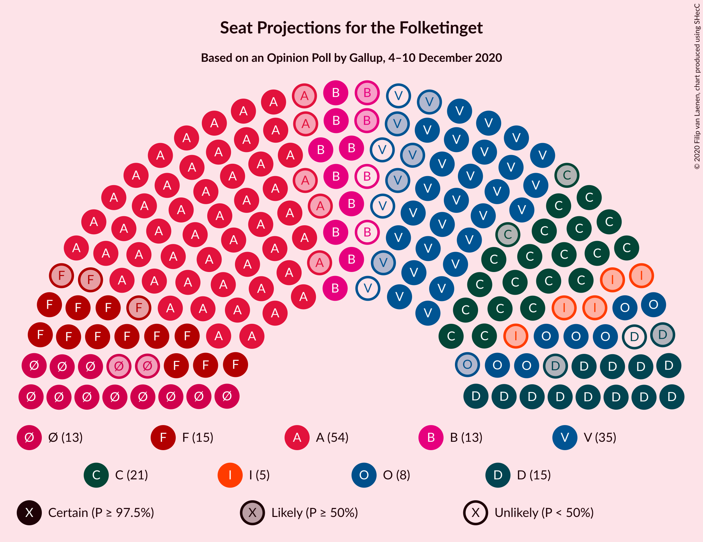
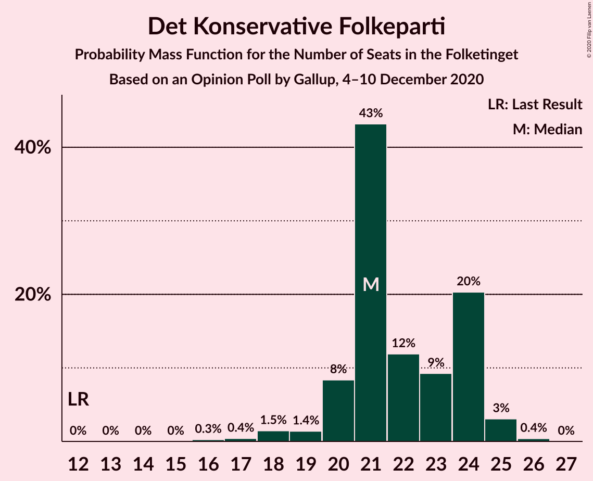
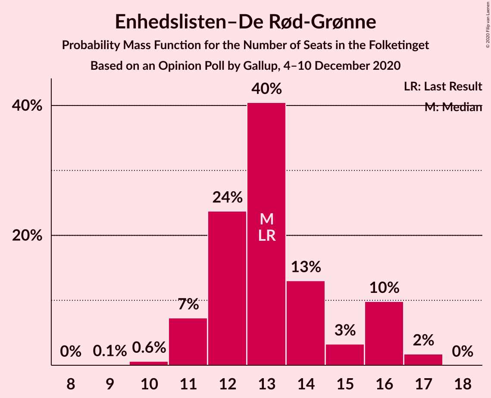
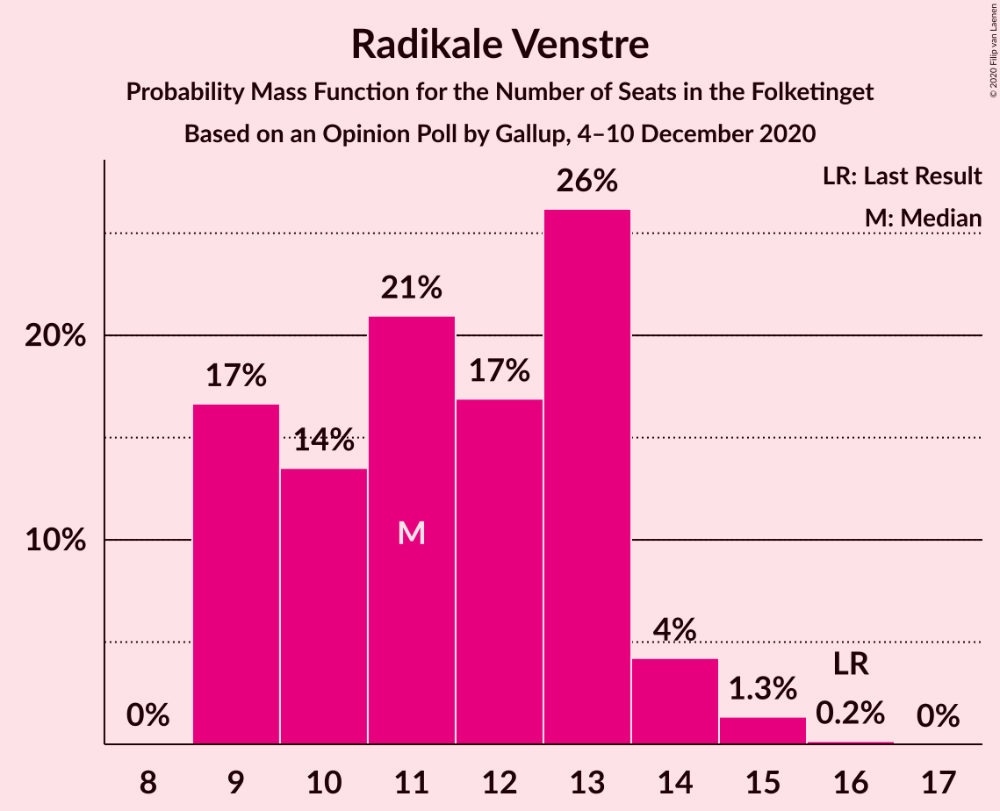
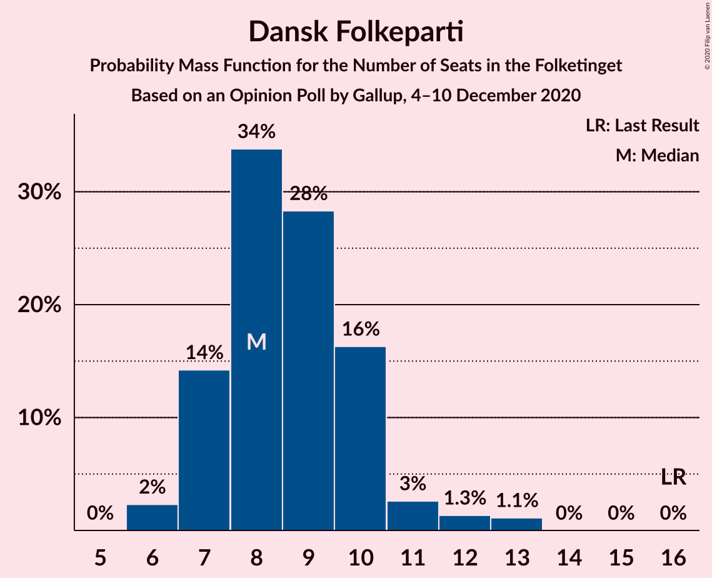
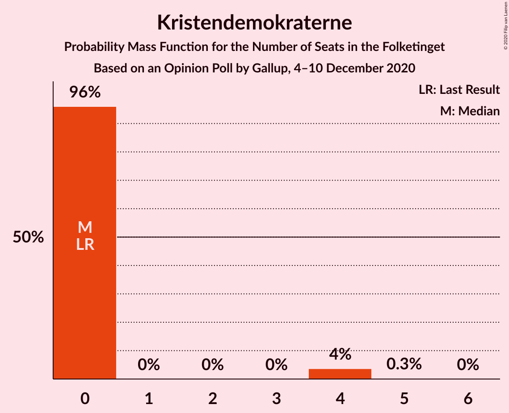
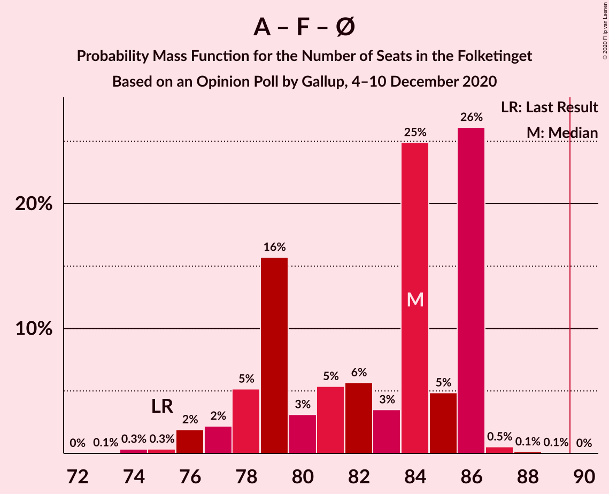
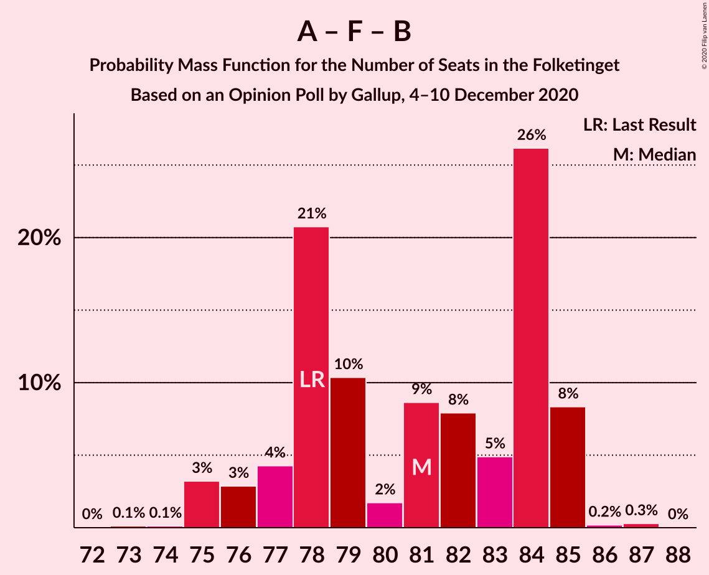
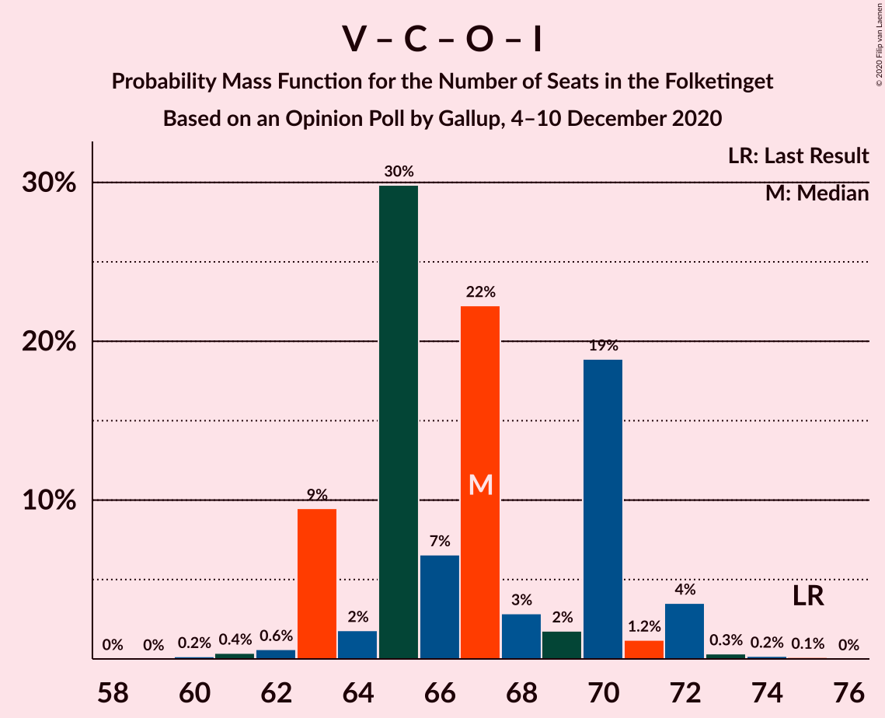
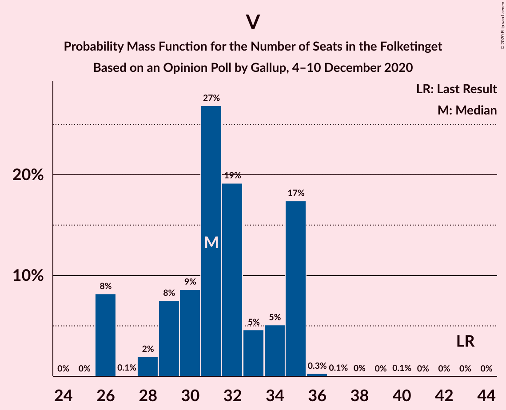

# Opinion Poll by Gallup, 4–10 December 2020

<a href="#voting-intentions">Voting Intentions</a> | <a href="#seats">Seats</a> | <a href="#coalitions">Coalitions</a> | <a href="#technical-information">Technical Information</a>

## Voting Intentions

### Confidence Intervals

| Party | Last Result | Poll Result | 80% Confidence Interval | 90% Confidence Interval | 95% Confidence Interval | 99% Confidence Interval |
|:-----:|:-----------:|:-----------:|:-----------------------:|:-----------------------:|:-----------------------:|:-----------------------:|
| Socialdemokraterne | 25.9% | 29.5% | 28.0–31.0% |27.6–31.5% |27.2–31.9% |26.5–32.6% |
| Venstre | 23.4% | 17.5% | 16.3–18.8% |16.0–19.2% |15.7–19.5% |15.1–20.2% |
| Det Konservative Folkeparti | 6.6% | 11.7% | 10.7–12.8% |10.4–13.2% |10.2–13.4% |9.7–14.0% |
| Socialistisk Folkeparti | 7.7% | 8.2% | 7.4–9.2% |7.1–9.5% |6.9–9.7% |6.5–10.2% |
| Nye Borgerlige | 2.4% | 7.8% | 7.0–8.8% |6.8–9.1% |6.6–9.3% |6.2–9.8% |
| Enhedslisten–De Rød-Grønne | 6.9% | 7.1% | 6.3–8.0% |6.1–8.3% |5.9–8.5% |5.5–9.0% |
| Radikale Venstre | 8.6% | 6.3% | 5.5–7.2% |5.3–7.4% |5.2–7.6% |4.8–8.1% |
| Dansk Folkeparti | 8.7% | 4.7% | 4.0–5.5% |3.9–5.7% |3.7–5.9% |3.4–6.3% |
| Liberal Alliance | 2.3% | 2.8% | 2.3–3.4% |2.2–3.6% |2.1–3.8% |1.9–4.1% |
| Kristendemokraterne | 1.7% | 1.4% | 1.1–1.9% |1.0–2.0% |0.9–2.1% |0.8–2.4% |
| Alternativet | 3.0% | 0.8% | 0.6–1.2% |0.5–1.3% |0.5–1.4% |0.4–1.6% |
| Stram Kurs | 1.8% | 0.8% | 0.6–1.2% |0.5–1.3% |0.5–1.4% |0.4–1.6% |
| Borgerlisten | 0.8% | 0.6% | 0.4–1.0% |0.4–1.1% |0.3–1.1% |0.2–1.3% |
| Veganerpartiet | 0.0% | 0.4% | 0.3–0.7% |0.2–0.8% |0.2–0.9% |0.1–1.1% |

*Note:* The poll result column reflects the actual value used in the calculations. Published results may vary slightly, and in addition be rounded to fewer digits.

## Seats

### Confidence Intervals

| Party | Last Result | Median | 80% Confidence Interval | 90% Confidence Interval | 95% Confidence Interval | 99% Confidence Interval |
|:-----:|:-----------:|:------:|:-----------------------:|:-----------------------:|:-----------------------:|:-----------------------:|
| <a href="#socialdemokraterne">Socialdemokraterne</a> | 48 | 50 | 49–57 |49–59 |49–59 |49–59 |
| <a href="#venstre">Venstre</a> | 43 | 32 | 30–32 |29–34 |29–34 |29–35 |
| <a href="#det-konservative-folkeparti">Det Konservative Folkeparti</a> | 12 | 22 | 21–24 |19–25 |19–25 |19–25 |
| <a href="#socialistisk-folkeparti">Socialistisk Folkeparti</a> | 14 | 14 | 12–16 |11–17 |11–17 |11–18 |
| <a href="#nye-borgerlige">Nye Borgerlige</a> | 4 | 16 | 13–18 |12–18 |12–18 |12–18 |
| <a href="#enhedslisten–de-rød-grønne">Enhedslisten–De Rød-Grønne</a> | 13 | 13 | 11–17 |11–17 |11–17 |11–17 |
| <a href="#radikale-venstre">Radikale Venstre</a> | 16 | 11 | 10–13 |10–14 |10–14 |9–14 |
| <a href="#dansk-folkeparti">Dansk Folkeparti</a> | 16 | 9 | 7–11 |7–11 |7–11 |6–12 |
| <a href="#liberal-alliance">Liberal Alliance</a> | 4 | 6 | 5–6 |0–7 |0–8 |0–8 |
| <a href="#kristendemokraterne">Kristendemokraterne</a> | 0 | 0 | 0 |0 |0–4 |0–5 |
| <a href="#alternativet">Alternativet</a> | 5 | 0 | 0 |0 |0 |0 |
| <a href="#stram-kurs">Stram Kurs</a> | 0 | 0 | 0 |0 |0 |0 |
| <a href="#borgerlisten">Borgerlisten</a> | 0 | 0 | 0 |0 |0 |0 |
| <a href="#veganerpartiet">Veganerpartiet</a> | 0 | 0 | 0 |0 |0 |0 |

### Socialdemokraterne

*For a full overview of the results for this party, see the [Socialdemokraterne](party-socialdemokraterne.html) page.*

| Number of Seats | Probability | Accumulated | Special Marks |
|:---------------:|:-----------:|:-----------:|:-------------:|
| 47 | 0.2% | 100% |  |
| 48 | 0% | 99.8% | Last Result |
| 49 | 24% | 99.8% |  |
| 50 | 31% | 76% | Median |
| 51 | 3% | 45% |  |
| 52 | 5% | 41% |  |
| 53 | 4% | 36% |  |
| 54 | 13% | 33% |  |
| 55 | 0.6% | 19% |  |
| 56 | 3% | 19% |  |
| 57 | 7% | 16% |  |
| 58 | 0.1% | 9% |  |
| 59 | 9% | 9% |  |
| 60 | 0% | 0.1% |  |
| 61 | 0% | 0.1% |  |
| 62 | 0% | 0% |  |

### Venstre

*For a full overview of the results for this party, see the [Venstre](party-venstre.html) page.*

| Number of Seats | Probability | Accumulated | Special Marks |
|:---------------:|:-----------:|:-----------:|:-------------:|
| 27 | 0.1% | 100% |  |
| 28 | 0.1% | 99.9% |  |
| 29 | 6% | 99.8% |  |
| 30 | 8% | 94% |  |
| 31 | 29% | 85% |  |
| 32 | 47% | 56% | Median |
| 33 | 3% | 10% |  |
| 34 | 5% | 7% |  |
| 35 | 2% | 2% |  |
| 36 | 0.1% | 0.4% |  |
| 37 | 0.2% | 0.3% |  |
| 38 | 0.1% | 0.1% |  |
| 39 | 0% | 0% |  |
| 40 | 0% | 0% |  |
| 41 | 0% | 0% |  |
| 42 | 0% | 0% |  |
| 43 | 0% | 0% | Last Result |

### Det Konservative Folkeparti

*For a full overview of the results for this party, see the [Det Konservative Folkeparti](party-detkonservativefolkeparti.html) page.*

| Number of Seats | Probability | Accumulated | Special Marks |
|:---------------:|:-----------:|:-----------:|:-------------:|
| 12 | 0% | 100% | Last Result |
| 13 | 0% | 100% |  |
| 14 | 0% | 100% |  |
| 15 | 0% | 100% |  |
| 16 | 0% | 100% |  |
| 17 | 0.3% | 100% |  |
| 18 | 0.1% | 99.7% |  |
| 19 | 6% | 99.6% |  |
| 20 | 3% | 93% |  |
| 21 | 34% | 90% |  |
| 22 | 10% | 56% | Median |
| 23 | 31% | 46% |  |
| 24 | 9% | 15% |  |
| 25 | 6% | 6% |  |
| 26 | 0.1% | 0.1% |  |
| 27 | 0% | 0% |  |

### Socialistisk Folkeparti

*For a full overview of the results for this party, see the [Socialistisk Folkeparti](party-socialistiskfolkeparti.html) page.*

| Number of Seats | Probability | Accumulated | Special Marks |
|:---------------:|:-----------:|:-----------:|:-------------:|
| 11 | 9% | 100% |  |
| 12 | 9% | 91% |  |
| 13 | 5% | 82% |  |
| 14 | 31% | 78% | Last Result, Median |
| 15 | 33% | 47% |  |
| 16 | 8% | 14% |  |
| 17 | 3% | 6% |  |
| 18 | 2% | 2% |  |
| 19 | 0% | 0% |  |

### Nye Borgerlige

*For a full overview of the results for this party, see the [Nye Borgerlige](party-nyeborgerlige.html) page.*

| Number of Seats | Probability | Accumulated | Special Marks |
|:---------------:|:-----------:|:-----------:|:-------------:|
| 4 | 0% | 100% | Last Result |
| 5 | 0% | 100% |  |
| 6 | 0% | 100% |  |
| 7 | 0% | 100% |  |
| 8 | 0% | 100% |  |
| 9 | 0% | 100% |  |
| 10 | 0% | 100% |  |
| 11 | 0.1% | 100% |  |
| 12 | 9% | 99.9% |  |
| 13 | 10% | 91% |  |
| 14 | 6% | 81% |  |
| 15 | 5% | 75% |  |
| 16 | 56% | 70% | Median |
| 17 | 4% | 15% |  |
| 18 | 11% | 11% |  |
| 19 | 0.2% | 0.2% |  |
| 20 | 0% | 0% |  |

### Enhedslisten–De Rød-Grønne

*For a full overview of the results for this party, see the [Enhedslisten–De Rød-Grønne](party-enhedslisten–derød-grønne.html) page.*

| Number of Seats | Probability | Accumulated | Special Marks |
|:---------------:|:-----------:|:-----------:|:-------------:|
| 9 | 0.1% | 100% |  |
| 10 | 0.3% | 99.9% |  |
| 11 | 13% | 99.7% |  |
| 12 | 32% | 86% |  |
| 13 | 6% | 54% | Last Result, Median |
| 14 | 18% | 48% |  |
| 15 | 5% | 31% |  |
| 16 | 0.2% | 26% |  |
| 17 | 25% | 25% |  |
| 18 | 0% | 0% |  |

### Radikale Venstre

*For a full overview of the results for this party, see the [Radikale Venstre](party-radikalevenstre.html) page.*

| Number of Seats | Probability | Accumulated | Special Marks |
|:---------------:|:-----------:|:-----------:|:-------------:|
| 8 | 0.4% | 100% |  |
| 9 | 1.5% | 99.6% |  |
| 10 | 36% | 98% |  |
| 11 | 18% | 62% | Median |
| 12 | 30% | 45% |  |
| 13 | 8% | 14% |  |
| 14 | 7% | 7% |  |
| 15 | 0% | 0% |  |
| 16 | 0% | 0% | Last Result |

### Dansk Folkeparti

*For a full overview of the results for this party, see the [Dansk Folkeparti](party-danskfolkeparti.html) page.*

| Number of Seats | Probability | Accumulated | Special Marks |
|:---------------:|:-----------:|:-----------:|:-------------:|
| 6 | 1.0% | 100% |  |
| 7 | 14% | 99.0% |  |
| 8 | 11% | 85% |  |
| 9 | 40% | 74% | Median |
| 10 | 2% | 34% |  |
| 11 | 31% | 32% |  |
| 12 | 1.3% | 1.3% |  |
| 13 | 0% | 0% |  |
| 14 | 0% | 0% |  |
| 15 | 0% | 0% |  |
| 16 | 0% | 0% | Last Result |

### Liberal Alliance

*For a full overview of the results for this party, see the [Liberal Alliance](party-liberalalliance.html) page.*

| Number of Seats | Probability | Accumulated | Special Marks |
|:---------------:|:-----------:|:-----------:|:-------------:|
| 0 | 9% | 100% |  |
| 1 | 0% | 91% |  |
| 2 | 0% | 91% |  |
| 3 | 0% | 91% |  |
| 4 | 0.7% | 91% | Last Result |
| 5 | 17% | 90% |  |
| 6 | 66% | 73% | Median |
| 7 | 4% | 7% |  |
| 8 | 4% | 4% |  |
| 9 | 0% | 0% |  |

### Kristendemokraterne

*For a full overview of the results for this party, see the [Kristendemokraterne](party-kristendemokraterne.html) page.*

| Number of Seats | Probability | Accumulated | Special Marks |
|:---------------:|:-----------:|:-----------:|:-------------:|
| 0 | 97% | 100% | Last Result, Median |
| 1 | 0% | 3% |  |
| 2 | 0% | 3% |  |
| 3 | 0% | 3% |  |
| 4 | 2% | 3% |  |
| 5 | 2% | 2% |  |
| 6 | 0% | 0% |  |

### Alternativet

*For a full overview of the results for this party, see the [Alternativet](party-alternativet.html) page.*

| Number of Seats | Probability | Accumulated | Special Marks |
|:---------------:|:-----------:|:-----------:|:-------------:|
| 0 | 100% | 100% | Median |
| 1 | 0% | 0% |  |
| 2 | 0% | 0% |  |
| 3 | 0% | 0% |  |
| 4 | 0% | 0% |  |
| 5 | 0% | 0% | Last Result |

### Stram Kurs

*For a full overview of the results for this party, see the [Stram Kurs](party-stramkurs.html) page.*

| Number of Seats | Probability | Accumulated | Special Marks |
|:---------------:|:-----------:|:-----------:|:-------------:|
| 0 | 99.9% | 100% | Last Result, Median |
| 1 | 0% | 0.1% |  |
| 2 | 0% | 0.1% |  |
| 3 | 0% | 0.1% |  |
| 4 | 0.1% | 0.1% |  |
| 5 | 0% | 0% |  |

### Borgerlisten

*For a full overview of the results for this party, see the [Borgerlisten](party-borgerlisten.html) page.*

| Number of Seats | Probability | Accumulated | Special Marks |
|:---------------:|:-----------:|:-----------:|:-------------:|
| 0 | 100% | 100% | Last Result, Median |

### Veganerpartiet

*For a full overview of the results for this party, see the [Veganerpartiet](party-veganerpartiet.html) page.*

| Number of Seats | Probability | Accumulated | Special Marks |
|:---------------:|:-----------:|:-----------:|:-------------:|
| 0 | 100% | 100% | Last Result, Median |

## Coalitions

### Confidence Intervals

| Coalition | Last Result | Median | Majority? | 80% Confidence Interval | 90% Confidence Interval | 95% Confidence Interval | 99% Confidence Interval |
|:---------:|:-----------:|:------:|:---------:|:-----------------------:|:-----------------------:|:-----------------------:|:-----------------------:|
| Socialdemokraterne – Socialistisk Folkeparti – Enhedslisten–De Rød-Grønne – Radikale Venstre – Alternativet | 96 | 92 | 68% | 87–96 | 87–99 | 87–101 | 87–101 |
| Socialdemokraterne – Socialistisk Folkeparti – Enhedslisten–De Rød-Grønne – Radikale Venstre | 91 | 92 | 68% | 87–96 | 87–99 | 87–101 | 87–101 |
| Venstre – Det Konservative Folkeparti – Nye Borgerlige – Dansk Folkeparti – Liberal Alliance – Kristendemokraterne | 79 | 83 | 0.2% | 79–88 | 76–88 | 74–88 | 74–88 |
| Venstre – Det Konservative Folkeparti – Nye Borgerlige – Dansk Folkeparti – Liberal Alliance | 79 | 83 | 0.1% | 79–88 | 74–88 | 74–88 | 74–88 |
| Socialdemokraterne – Socialistisk Folkeparti – Enhedslisten–De Rød-Grønne – Alternativet | 80 | 80 | 0% | 77–85 | 77–87 | 77–87 | 76–88 |
| Socialdemokraterne – Socialistisk Folkeparti – Enhedslisten–De Rød-Grønne | 75 | 80 | 0% | 77–85 | 77–87 | 77–87 | 76–88 |
| Socialdemokraterne – Socialistisk Folkeparti – Radikale Venstre | 78 | 75 | 0% | 75–83 | 75–84 | 75–87 | 75–87 |
| Venstre – Det Konservative Folkeparti – Dansk Folkeparti – Liberal Alliance – Kristendemokraterne | 75 | 68 | 0% | 63–72 | 62–72 | 61–72 | 61–72 |
| Venstre – Det Konservative Folkeparti – Dansk Folkeparti – Liberal Alliance | 75 | 67 | 0% | 63–72 | 61–72 | 61–72 | 60–72 |
| Socialdemokraterne – Radikale Venstre | 64 | 61 | 0% | 60–70 | 60–70 | 60–71 | 60–71 |
| Venstre – Det Konservative Folkeparti – Liberal Alliance | 59 | 60 | 0% | 55–61 | 53–61 | 52–61 | 52–62 |
| Venstre – Det Konservative Folkeparti | 55 | 54 | 0% | 52–56 | 51–56 | 49–56 | 48–56 |
| Venstre | 43 | 32 | 0% | 30–32 | 29–34 | 29–34 | 29–35 |

### Socialdemokraterne – Socialistisk Folkeparti – Enhedslisten–De Rød-Grønne – Radikale Venstre – Alternativet

| Number of Seats | Probability | Accumulated | Special Marks |
|:---------------:|:-----------:|:-----------:|:-------------:|
| 84 | 0.1% | 100% |  |
| 85 | 0.1% | 99.9% |  |
| 86 | 0.1% | 99.8% |  |
| 87 | 30% | 99.7% |  |
| 88 | 1.4% | 69% | Median |
| 89 | 0.1% | 68% |  |
| 90 | 8% | 68% | Majority |
| 91 | 2% | 60% |  |
| 92 | 31% | 58% |  |
| 93 | 12% | 27% |  |
| 94 | 1.3% | 15% |  |
| 95 | 2% | 14% |  |
| 96 | 6% | 12% | Last Result |
| 97 | 0.1% | 6% |  |
| 98 | 0.2% | 6% |  |
| 99 | 1.0% | 6% |  |
| 100 | 0.5% | 5% |  |
| 101 | 4% | 4% |  |
| 102 | 0% | 0% |  |

### Socialdemokraterne – Socialistisk Folkeparti – Enhedslisten–De Rød-Grønne – Radikale Venstre

| Number of Seats | Probability | Accumulated | Special Marks |
|:---------------:|:-----------:|:-----------:|:-------------:|
| 84 | 0.1% | 100% |  |
| 85 | 0.1% | 99.9% |  |
| 86 | 0.1% | 99.8% |  |
| 87 | 30% | 99.7% |  |
| 88 | 1.4% | 69% | Median |
| 89 | 0.2% | 68% |  |
| 90 | 8% | 68% | Majority |
| 91 | 2% | 60% | Last Result |
| 92 | 31% | 58% |  |
| 93 | 12% | 27% |  |
| 94 | 1.3% | 15% |  |
| 95 | 2% | 14% |  |
| 96 | 6% | 12% |  |
| 97 | 0.1% | 6% |  |
| 98 | 0.2% | 6% |  |
| 99 | 1.0% | 6% |  |
| 100 | 0.5% | 5% |  |
| 101 | 4% | 4% |  |
| 102 | 0% | 0% |  |

### Venstre – Det Konservative Folkeparti – Nye Borgerlige – Dansk Folkeparti – Liberal Alliance – Kristendemokraterne

| Number of Seats | Probability | Accumulated | Special Marks |
|:---------------:|:-----------:|:-----------:|:-------------:|
| 74 | 4% | 100% |  |
| 75 | 0.5% | 96% |  |
| 76 | 1.0% | 95% |  |
| 77 | 0.2% | 94% |  |
| 78 | 0.2% | 94% |  |
| 79 | 6% | 94% | Last Result |
| 80 | 2% | 88% |  |
| 81 | 1.3% | 86% |  |
| 82 | 12% | 85% |  |
| 83 | 31% | 73% |  |
| 84 | 2% | 42% |  |
| 85 | 8% | 40% | Median |
| 86 | 0.1% | 32% |  |
| 87 | 1.4% | 32% |  |
| 88 | 30% | 31% |  |
| 89 | 0.1% | 0.3% |  |
| 90 | 0.1% | 0.2% | Majority |
| 91 | 0.1% | 0.1% |  |
| 92 | 0% | 0% |  |

### Venstre – Det Konservative Folkeparti – Nye Borgerlige – Dansk Folkeparti – Liberal Alliance

| Number of Seats | Probability | Accumulated | Special Marks |
|:---------------:|:-----------:|:-----------:|:-------------:|
| 74 | 6% | 100% |  |
| 75 | 0.5% | 94% |  |
| 76 | 1.1% | 94% |  |
| 77 | 0.2% | 92% |  |
| 78 | 0.5% | 92% |  |
| 79 | 4% | 92% | Last Result |
| 80 | 3% | 87% |  |
| 81 | 1.3% | 85% |  |
| 82 | 12% | 84% |  |
| 83 | 31% | 72% |  |
| 84 | 1.2% | 41% |  |
| 85 | 8% | 40% | Median |
| 86 | 0% | 32% |  |
| 87 | 2% | 32% |  |
| 88 | 30% | 30% |  |
| 89 | 0.1% | 0.2% |  |
| 90 | 0.1% | 0.1% | Majority |
| 91 | 0% | 0% |  |

### Socialdemokraterne – Socialistisk Folkeparti – Enhedslisten–De Rød-Grønne – Alternativet

| Number of Seats | Probability | Accumulated | Special Marks |
|:---------------:|:-----------:|:-----------:|:-------------:|
| 73 | 0.1% | 100% |  |
| 74 | 0.2% | 99.9% |  |
| 75 | 0.1% | 99.8% |  |
| 76 | 1.3% | 99.6% |  |
| 77 | 30% | 98% | Median |
| 78 | 0.9% | 68% |  |
| 79 | 14% | 67% |  |
| 80 | 24% | 53% | Last Result |
| 81 | 5% | 29% |  |
| 82 | 10% | 24% |  |
| 83 | 0.5% | 14% |  |
| 84 | 2% | 13% |  |
| 85 | 3% | 12% |  |
| 86 | 3% | 9% |  |
| 87 | 4% | 5% |  |
| 88 | 1.0% | 1.0% |  |
| 89 | 0% | 0% |  |

### Socialdemokraterne – Socialistisk Folkeparti – Enhedslisten–De Rød-Grønne

| Number of Seats | Probability | Accumulated | Special Marks |
|:---------------:|:-----------:|:-----------:|:-------------:|
| 73 | 0.1% | 100% |  |
| 74 | 0.2% | 99.9% |  |
| 75 | 0.1% | 99.8% | Last Result |
| 76 | 1.3% | 99.6% |  |
| 77 | 30% | 98% | Median |
| 78 | 0.9% | 68% |  |
| 79 | 14% | 67% |  |
| 80 | 24% | 53% |  |
| 81 | 5% | 29% |  |
| 82 | 10% | 24% |  |
| 83 | 0.4% | 14% |  |
| 84 | 2% | 13% |  |
| 85 | 3% | 12% |  |
| 86 | 3% | 9% |  |
| 87 | 4% | 5% |  |
| 88 | 1.0% | 1.0% |  |
| 89 | 0% | 0% |  |

### Socialdemokraterne – Socialistisk Folkeparti – Radikale Venstre

| Number of Seats | Probability | Accumulated | Special Marks |
|:---------------:|:-----------:|:-----------:|:-------------:|
| 74 | 0.4% | 100% |  |
| 75 | 56% | 99.6% | Median |
| 76 | 9% | 44% |  |
| 77 | 1.3% | 35% |  |
| 78 | 7% | 34% | Last Result |
| 79 | 0.5% | 27% |  |
| 80 | 1.0% | 27% |  |
| 81 | 4% | 26% |  |
| 82 | 11% | 22% |  |
| 83 | 3% | 11% |  |
| 84 | 3% | 8% |  |
| 85 | 0% | 5% |  |
| 86 | 0.4% | 5% |  |
| 87 | 4% | 4% |  |
| 88 | 0% | 0.1% |  |
| 89 | 0% | 0% |  |

### Venstre – Det Konservative Folkeparti – Dansk Folkeparti – Liberal Alliance – Kristendemokraterne

| Number of Seats | Probability | Accumulated | Special Marks |
|:---------------:|:-----------:|:-----------:|:-------------:|
| 60 | 0% | 100% |  |
| 61 | 4% | 99.9% |  |
| 62 | 3% | 96% |  |
| 63 | 3% | 93% |  |
| 64 | 4% | 90% |  |
| 65 | 2% | 86% |  |
| 66 | 0.1% | 85% |  |
| 67 | 34% | 84% |  |
| 68 | 4% | 50% |  |
| 69 | 4% | 46% | Median |
| 70 | 9% | 42% |  |
| 71 | 1.4% | 33% |  |
| 72 | 31% | 32% |  |
| 73 | 0% | 0.4% |  |
| 74 | 0% | 0.4% |  |
| 75 | 0.2% | 0.3% | Last Result |
| 76 | 0.1% | 0.1% |  |
| 77 | 0% | 0% |  |

### Venstre – Det Konservative Folkeparti – Dansk Folkeparti – Liberal Alliance

| Number of Seats | Probability | Accumulated | Special Marks |
|:---------------:|:-----------:|:-----------:|:-------------:|
| 60 | 2% | 100% |  |
| 61 | 4% | 98% |  |
| 62 | 3% | 94% |  |
| 63 | 3% | 91% |  |
| 64 | 4% | 88% |  |
| 65 | 0.4% | 84% |  |
| 66 | 0.1% | 84% |  |
| 67 | 35% | 84% |  |
| 68 | 4% | 49% |  |
| 69 | 4% | 45% | Median |
| 70 | 9% | 41% |  |
| 71 | 0.4% | 32% |  |
| 72 | 32% | 32% |  |
| 73 | 0% | 0.2% |  |
| 74 | 0% | 0.2% |  |
| 75 | 0.2% | 0.2% | Last Result |
| 76 | 0% | 0% |  |

### Socialdemokraterne – Radikale Venstre

| Number of Seats | Probability | Accumulated | Special Marks |
|:---------------:|:-----------:|:-----------:|:-------------:|
| 58 | 0.2% | 100% |  |
| 59 | 0% | 99.8% |  |
| 60 | 30% | 99.8% |  |
| 61 | 26% | 70% | Median |
| 62 | 1.1% | 44% |  |
| 63 | 1.1% | 43% |  |
| 64 | 6% | 42% | Last Result |
| 65 | 11% | 36% |  |
| 66 | 3% | 25% |  |
| 67 | 5% | 22% |  |
| 68 | 3% | 16% |  |
| 69 | 0.6% | 14% |  |
| 70 | 9% | 13% |  |
| 71 | 4% | 4% |  |
| 72 | 0% | 0.1% |  |
| 73 | 0% | 0% |  |

### Venstre – Det Konservative Folkeparti – Liberal Alliance

| Number of Seats | Probability | Accumulated | Special Marks |
|:---------------:|:-----------:|:-----------:|:-------------:|
| 51 | 0.1% | 100% |  |
| 52 | 4% | 99.9% |  |
| 53 | 2% | 95% |  |
| 54 | 2% | 94% |  |
| 55 | 3% | 92% |  |
| 56 | 2% | 89% |  |
| 57 | 3% | 87% |  |
| 58 | 26% | 84% |  |
| 59 | 8% | 58% | Last Result |
| 60 | 3% | 50% | Median |
| 61 | 46% | 47% |  |
| 62 | 0.6% | 0.9% |  |
| 63 | 0% | 0.3% |  |
| 64 | 0% | 0.3% |  |
| 65 | 0.2% | 0.2% |  |
| 66 | 0% | 0% |  |

### Venstre – Det Konservative Folkeparti

| Number of Seats | Probability | Accumulated | Special Marks |
|:---------------:|:-----------:|:-----------:|:-------------:|
| 46 | 0.1% | 100% |  |
| 47 | 0.1% | 99.9% |  |
| 48 | 2% | 99.8% |  |
| 49 | 0.9% | 98% |  |
| 50 | 0.3% | 97% |  |
| 51 | 5% | 97% |  |
| 52 | 28% | 92% |  |
| 53 | 14% | 64% |  |
| 54 | 1.5% | 50% | Median |
| 55 | 36% | 49% | Last Result |
| 56 | 12% | 13% |  |
| 57 | 0.2% | 0.5% |  |
| 58 | 0.1% | 0.3% |  |
| 59 | 0.1% | 0.2% |  |
| 60 | 0.1% | 0.1% |  |
| 61 | 0% | 0% |  |

### Venstre

| Number of Seats | Probability | Accumulated | Special Marks |
|:---------------:|:-----------:|:-----------:|:-------------:|
| 27 | 0.1% | 100% |  |
| 28 | 0.1% | 99.9% |  |
| 29 | 6% | 99.8% |  |
| 30 | 8% | 94% |  |
| 31 | 29% | 85% |  |
| 32 | 47% | 56% | Median |
| 33 | 3% | 10% |  |
| 34 | 5% | 7% |  |
| 35 | 2% | 2% |  |
| 36 | 0.1% | 0.4% |  |
| 37 | 0.2% | 0.3% |  |
| 38 | 0.1% | 0.1% |  |
| 39 | 0% | 0% |  |
| 40 | 0% | 0% |  |
| 41 | 0% | 0% |  |
| 42 | 0% | 0% |  |
| 43 | 0% | 0% | Last Result |

## Technical Information

### Opinion Poll

+ **Polling firm:** Gallup
+ **Commissioner(s):** —
+ **Fieldwork period:** 4–10 December 2020

### Calculations

+ **Sample size:** 1496
+ **Simulations done:** 131,072
+ **Error estimate:** 2.71%

