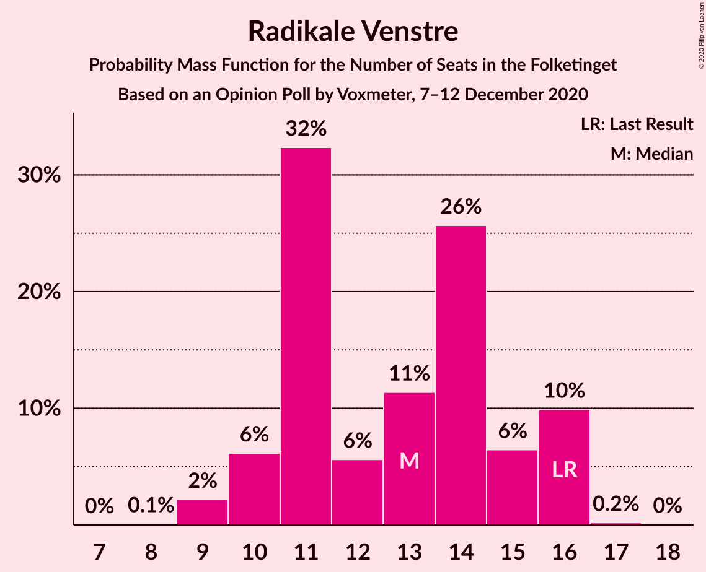

# Opinion Poll by Voxmeter, 7–12 December 2020

<a href="#voting-intentions">Voting Intentions</a> | <a href="#seats">Seats</a> | <a href="#coalitions">Coalitions</a> | <a href="#technical-information">Technical Information</a>

## Voting Intentions

### Confidence Intervals

| Party | Last Result | Poll Result | 80% Confidence Interval | 90% Confidence Interval | 95% Confidence Interval | 99% Confidence Interval |
|:-----:|:-----------:|:-----------:|:-----------------------:|:-----------------------:|:-----------------------:|:-----------------------:|
| Socialdemokraterne | 25.9% | 32.9% | 31.1–34.9% |30.6–35.4% |30.1–35.9% |29.3–36.8% |
| Venstre | 23.4% | 18.9% | 17.4–20.5% |16.9–21.0% |16.6–21.4% |15.9–22.2% |
| Det Konservative Folkeparti | 6.6% | 10.4% | 9.3–11.7% |8.9–12.1% |8.7–12.4% |8.2–13.1% |
| Enhedslisten–De Rød-Grønne | 6.9% | 7.4% | 6.4–8.5% |6.2–8.9% |5.9–9.2% |5.5–9.7% |
| Socialistisk Folkeparti | 7.7% | 7.4% | 6.4–8.5% |6.2–8.9% |5.9–9.2% |5.5–9.7% |
| Radikale Venstre | 8.6% | 7.0% | 6.1–8.1% |5.8–8.4% |5.6–8.7% |5.2–9.3% |
| Nye Borgerlige | 2.4% | 5.9% | 5.1–7.0% |4.8–7.3% |4.6–7.5% |4.3–8.1% |
| Dansk Folkeparti | 8.7% | 5.4% | 4.6–6.5% |4.4–6.8% |4.2–7.0% |3.9–7.5% |
| Liberal Alliance | 2.3% | 2.2% | 1.7–3.0% |1.6–3.2% |1.5–3.3% |1.3–3.7% |
| Kristendemokraterne | 1.7% | 1.4% | 1.0–2.0% |0.9–2.1% |0.8–2.3% |0.7–2.6% |
| Alternativet | 3.0% | 0.6% | 0.4–1.0% |0.3–1.2% |0.3–1.3% |0.2–1.5% |
| Veganerpartiet | 0.0% | 0.2% | 0.1–0.5% |0.1–0.6% |0.0–0.7% |0.0–0.9% |

*Note:* The poll result column reflects the actual value used in the calculations. Published results may vary slightly, and in addition be rounded to fewer digits.

## Seats

### Confidence Intervals

| Party | Last Result | Median | 80% Confidence Interval | 90% Confidence Interval | 95% Confidence Interval | 99% Confidence Interval |
|:-----:|:-----------:|:------:|:-----------------------:|:-----------------------:|:-----------------------:|:-----------------------:|
| <a href="#socialdemokraterne">Socialdemokraterne</a> | 48 | 59 | 55–62 |55–63 |53–64 |52–65 |
| <a href="#venstre">Venstre</a> | 43 | 35 | 31–37 |30–39 |30–40 |27–40 |
| <a href="#det-konservative-folkeparti">Det Konservative Folkeparti</a> | 12 | 19 | 17–21 |16–21 |15–22 |15–24 |
| <a href="#enhedslisten–de-rød-grønne">Enhedslisten–De Rød-Grønne</a> | 13 | 13 | 12–15 |11–17 |10–17 |10–18 |
| <a href="#socialistisk-folkeparti">Socialistisk Folkeparti</a> | 14 | 14 | 11–15 |10–16 |10–16 |9–17 |
| <a href="#radikale-venstre">Radikale Venstre</a> | 16 | 13 | 11–16 |10–16 |10–16 |9–16 |
| <a href="#nye-borgerlige">Nye Borgerlige</a> | 4 | 11 | 9–12 |8–13 |7–14 |7–15 |
| <a href="#dansk-folkeparti">Dansk Folkeparti</a> | 16 | 10 | 8–11 |8–12 |8–12 |7–15 |
| <a href="#liberal-alliance">Liberal Alliance</a> | 4 | 4 | 0–6 |0–6 |0–6 |0–6 |
| <a href="#kristendemokraterne">Kristendemokraterne</a> | 0 | 0 | 0 |0–4 |0–4 |0–4 |
| <a href="#alternativet">Alternativet</a> | 5 | 0 | 0 |0 |0 |0 |
| <a href="#veganerpartiet">Veganerpartiet</a> | 0 | 0 | 0 |0 |0 |0 |

### Socialdemokraterne

*For a full overview of the results for this party, see the [Socialdemokraterne](party-socialdemokraterne.html) page.*

| Number of Seats | Probability | Accumulated | Special Marks |
|:---------------:|:-----------:|:-----------:|:-------------:|
| 48 | 0% | 100% | Last Result |
| 49 | 0% | 100% |  |
| 50 | 0.1% | 100% |  |
| 51 | 0.1% | 99.9% |  |
| 52 | 1.2% | 99.8% |  |
| 53 | 1.3% | 98.6% |  |
| 54 | 0.9% | 97% |  |
| 55 | 12% | 96% |  |
| 56 | 5% | 84% |  |
| 57 | 19% | 79% |  |
| 58 | 6% | 60% |  |
| 59 | 5% | 54% | Median |
| 60 | 9% | 49% |  |
| 61 | 29% | 40% |  |
| 62 | 4% | 11% |  |
| 63 | 3% | 6% |  |
| 64 | 3% | 4% |  |
| 65 | 0.5% | 0.9% |  |
| 66 | 0.1% | 0.4% |  |
| 67 | 0.2% | 0.3% |  |
| 68 | 0.1% | 0.1% |  |
| 69 | 0% | 0% |  |

### Venstre

*For a full overview of the results for this party, see the [Venstre](party-venstre.html) page.*

| Number of Seats | Probability | Accumulated | Special Marks |
|:---------------:|:-----------:|:-----------:|:-------------:|
| 27 | 1.0% | 100% |  |
| 28 | 0.1% | 99.0% |  |
| 29 | 1.2% | 98.9% |  |
| 30 | 3% | 98% |  |
| 31 | 8% | 94% |  |
| 32 | 13% | 87% |  |
| 33 | 8% | 74% |  |
| 34 | 10% | 65% |  |
| 35 | 15% | 55% | Median |
| 36 | 6% | 40% |  |
| 37 | 26% | 34% |  |
| 38 | 2% | 8% |  |
| 39 | 1.3% | 5% |  |
| 40 | 4% | 4% |  |
| 41 | 0% | 0.1% |  |
| 42 | 0% | 0% |  |
| 43 | 0% | 0% | Last Result |

### Det Konservative Folkeparti

*For a full overview of the results for this party, see the [Det Konservative Folkeparti](party-detkonservativefolkeparti.html) page.*

| Number of Seats | Probability | Accumulated | Special Marks |
|:---------------:|:-----------:|:-----------:|:-------------:|
| 12 | 0% | 100% | Last Result |
| 13 | 0% | 100% |  |
| 14 | 0.1% | 100% |  |
| 15 | 3% | 99.8% |  |
| 16 | 5% | 97% |  |
| 17 | 6% | 92% |  |
| 18 | 26% | 86% |  |
| 19 | 33% | 59% | Median |
| 20 | 12% | 26% |  |
| 21 | 10% | 14% |  |
| 22 | 2% | 5% |  |
| 23 | 0.6% | 2% |  |
| 24 | 2% | 2% |  |
| 25 | 0% | 0% |  |

### Enhedslisten–De Rød-Grønne

*For a full overview of the results for this party, see the [Enhedslisten–De Rød-Grønne](party-enhedslisten–derød-grønne.html) page.*

| Number of Seats | Probability | Accumulated | Special Marks |
|:---------------:|:-----------:|:-----------:|:-------------:|
| 9 | 0.2% | 100% |  |
| 10 | 4% | 99.8% |  |
| 11 | 5% | 96% |  |
| 12 | 34% | 91% |  |
| 13 | 22% | 58% | Last Result, Median |
| 14 | 20% | 35% |  |
| 15 | 9% | 15% |  |
| 16 | 1.1% | 6% |  |
| 17 | 4% | 5% |  |
| 18 | 0.9% | 0.9% |  |
| 19 | 0% | 0% |  |

### Socialistisk Folkeparti

*For a full overview of the results for this party, see the [Socialistisk Folkeparti](party-socialistiskfolkeparti.html) page.*

| Number of Seats | Probability | Accumulated | Special Marks |
|:---------------:|:-----------:|:-----------:|:-------------:|
| 9 | 1.0% | 100% |  |
| 10 | 4% | 99.0% |  |
| 11 | 9% | 95% |  |
| 12 | 7% | 86% |  |
| 13 | 24% | 78% |  |
| 14 | 41% | 54% | Last Result, Median |
| 15 | 6% | 13% |  |
| 16 | 5% | 7% |  |
| 17 | 1.1% | 1.4% |  |
| 18 | 0.2% | 0.3% |  |
| 19 | 0% | 0.1% |  |
| 20 | 0.1% | 0.1% |  |
| 21 | 0% | 0% |  |

### Radikale Venstre

*For a full overview of the results for this party, see the [Radikale Venstre](party-radikalevenstre.html) page.*

| Number of Seats | Probability | Accumulated | Special Marks |
|:---------------:|:-----------:|:-----------:|:-------------:|
| 8 | 0.1% | 100% |  |
| 9 | 2% | 99.9% |  |
| 10 | 6% | 98% |  |
| 11 | 32% | 92% |  |
| 12 | 6% | 59% |  |
| 13 | 11% | 54% | Median |
| 14 | 26% | 42% |  |
| 15 | 6% | 17% |  |
| 16 | 10% | 10% | Last Result |
| 17 | 0.2% | 0.2% |  |
| 18 | 0% | 0% |  |

### Nye Borgerlige

*For a full overview of the results for this party, see the [Nye Borgerlige](party-nyeborgerlige.html) page.*

| Number of Seats | Probability | Accumulated | Special Marks |
|:---------------:|:-----------:|:-----------:|:-------------:|
| 4 | 0% | 100% | Last Result |
| 5 | 0% | 100% |  |
| 6 | 0% | 100% |  |
| 7 | 4% | 100% |  |
| 8 | 4% | 96% |  |
| 9 | 11% | 92% |  |
| 10 | 19% | 81% |  |
| 11 | 35% | 62% | Median |
| 12 | 18% | 27% |  |
| 13 | 5% | 9% |  |
| 14 | 3% | 4% |  |
| 15 | 1.2% | 1.2% |  |
| 16 | 0% | 0.1% |  |
| 17 | 0% | 0% |  |

### Dansk Folkeparti

*For a full overview of the results for this party, see the [Dansk Folkeparti](party-danskfolkeparti.html) page.*

| Number of Seats | Probability | Accumulated | Special Marks |
|:---------------:|:-----------:|:-----------:|:-------------:|
| 6 | 0.4% | 100% |  |
| 7 | 2% | 99.6% |  |
| 8 | 18% | 98% |  |
| 9 | 19% | 80% |  |
| 10 | 32% | 61% | Median |
| 11 | 21% | 29% |  |
| 12 | 6% | 8% |  |
| 13 | 0.6% | 2% |  |
| 14 | 0.8% | 2% |  |
| 15 | 0.9% | 0.9% |  |
| 16 | 0% | 0% | Last Result |

### Liberal Alliance

*For a full overview of the results for this party, see the [Liberal Alliance](party-liberalalliance.html) page.*

| Number of Seats | Probability | Accumulated | Special Marks |
|:---------------:|:-----------:|:-----------:|:-------------:|
| 0 | 44% | 100% |  |
| 1 | 0% | 56% |  |
| 2 | 0% | 56% |  |
| 3 | 0.3% | 56% |  |
| 4 | 18% | 56% | Last Result, Median |
| 5 | 28% | 38% |  |
| 6 | 10% | 10% |  |
| 7 | 0.3% | 0.3% |  |
| 8 | 0% | 0.1% |  |
| 9 | 0% | 0% |  |

### Kristendemokraterne

*For a full overview of the results for this party, see the [Kristendemokraterne](party-kristendemokraterne.html) page.*

| Number of Seats | Probability | Accumulated | Special Marks |
|:---------------:|:-----------:|:-----------:|:-------------:|
| 0 | 91% | 100% | Last Result, Median |
| 1 | 0% | 9% |  |
| 2 | 0% | 9% |  |
| 3 | 0% | 9% |  |
| 4 | 9% | 9% |  |
| 5 | 0.2% | 0.3% |  |
| 6 | 0% | 0% |  |

### Alternativet

*For a full overview of the results for this party, see the [Alternativet](party-alternativet.html) page.*

| Number of Seats | Probability | Accumulated | Special Marks |
|:---------------:|:-----------:|:-----------:|:-------------:|
| 0 | 100% | 100% | Median |
| 1 | 0% | 0% |  |
| 2 | 0% | 0% |  |
| 3 | 0% | 0% |  |
| 4 | 0% | 0% |  |
| 5 | 0% | 0% | Last Result |

### Veganerpartiet

*For a full overview of the results for this party, see the [Veganerpartiet](party-veganerpartiet.html) page.*

| Number of Seats | Probability | Accumulated | Special Marks |
|:---------------:|:-----------:|:-----------:|:-------------:|
| 0 | 100% | 100% | Last Result, Median |

## Coalitions

### Confidence Intervals

| Coalition | Last Result | Median | Majority? | 80% Confidence Interval | 90% Confidence Interval | 95% Confidence Interval | 99% Confidence Interval |
|:---------:|:-----------:|:------:|:---------:|:-----------------------:|:-----------------------:|:-----------------------:|:-----------------------:|
| Socialdemokraterne – Enhedslisten–De Rød-Grønne – Socialistisk Folkeparti – Radikale Venstre – Alternativet | 96 | 98 | 99.9% | 95–102 | 93–103 | 91–104 | 90–105 |
| Socialdemokraterne – Enhedslisten–De Rød-Grønne – Socialistisk Folkeparti – Radikale Venstre | 91 | 98 | 99.9% | 95–102 | 93–103 | 91–104 | 90–105 |
| Socialdemokraterne – Enhedslisten–De Rød-Grønne – Socialistisk Folkeparti – Alternativet | 80 | 85 | 9% | 81–89 | 80–91 | 80–92 | 77–93 |
| Socialdemokraterne – Enhedslisten–De Rød-Grønne – Socialistisk Folkeparti | 75 | 85 | 9% | 81–89 | 80–91 | 80–92 | 77–93 |
| Socialdemokraterne – Socialistisk Folkeparti – Radikale Venstre | 78 | 85 | 2% | 81–87 | 79–89 | 78–89 | 77–91 |
| Venstre – Det Konservative Folkeparti – Nye Borgerlige – Dansk Folkeparti – Liberal Alliance – Kristendemokraterne | 79 | 77 | 0% | 73–80 | 72–82 | 71–84 | 70–85 |
| Venstre – Det Konservative Folkeparti – Nye Borgerlige – Dansk Folkeparti – Liberal Alliance | 79 | 77 | 0% | 72–80 | 71–82 | 71–83 | 70–85 |
| Socialdemokraterne – Radikale Venstre | 64 | 72 | 0% | 68–75 | 65–76 | 65–77 | 64–78 |
| Venstre – Det Konservative Folkeparti – Dansk Folkeparti – Liberal Alliance – Kristendemokraterne | 75 | 66 | 0% | 64–69 | 60–71 | 60–72 | 59–75 |
| Venstre – Det Konservative Folkeparti – Dansk Folkeparti – Liberal Alliance | 75 | 66 | 0% | 63–69 | 60–71 | 60–71 | 59–75 |
| Venstre – Det Konservative Folkeparti – Liberal Alliance | 59 | 56 | 0% | 52–60 | 51–60 | 51–62 | 49–64 |
| Venstre – Det Konservative Folkeparti | 55 | 53 | 0% | 49–57 | 48–59 | 47–60 | 46–60 |
| Venstre | 43 | 35 | 0% | 31–37 | 30–39 | 30–40 | 27–40 |

### Socialdemokraterne – Enhedslisten–De Rød-Grønne – Socialistisk Folkeparti – Radikale Venstre – Alternativet

| Number of Seats | Probability | Accumulated | Special Marks |
|:---------------:|:-----------:|:-----------:|:-------------:|
| 86 | 0.1% | 100% |  |
| 87 | 0% | 99.9% |  |
| 88 | 0% | 99.9% |  |
| 89 | 0% | 99.9% |  |
| 90 | 1.2% | 99.9% | Majority |
| 91 | 1.3% | 98.7% |  |
| 92 | 1.5% | 97% |  |
| 93 | 2% | 96% |  |
| 94 | 2% | 94% |  |
| 95 | 8% | 91% |  |
| 96 | 3% | 83% | Last Result |
| 97 | 19% | 80% |  |
| 98 | 26% | 61% |  |
| 99 | 14% | 35% | Median |
| 100 | 9% | 21% |  |
| 101 | 1.3% | 12% |  |
| 102 | 3% | 10% |  |
| 103 | 5% | 8% |  |
| 104 | 2% | 3% |  |
| 105 | 0.4% | 0.7% |  |
| 106 | 0.1% | 0.3% |  |
| 107 | 0% | 0.2% |  |
| 108 | 0.1% | 0.2% |  |
| 109 | 0% | 0.1% |  |
| 110 | 0.1% | 0.1% |  |
| 111 | 0% | 0% |  |

### Socialdemokraterne – Enhedslisten–De Rød-Grønne – Socialistisk Folkeparti – Radikale Venstre

| Number of Seats | Probability | Accumulated | Special Marks |
|:---------------:|:-----------:|:-----------:|:-------------:|
| 86 | 0.1% | 100% |  |
| 87 | 0% | 99.9% |  |
| 88 | 0% | 99.9% |  |
| 89 | 0% | 99.9% |  |
| 90 | 1.2% | 99.9% | Majority |
| 91 | 1.3% | 98.7% | Last Result |
| 92 | 1.5% | 97% |  |
| 93 | 2% | 96% |  |
| 94 | 2% | 94% |  |
| 95 | 8% | 91% |  |
| 96 | 3% | 83% |  |
| 97 | 19% | 80% |  |
| 98 | 26% | 61% |  |
| 99 | 14% | 35% | Median |
| 100 | 9% | 21% |  |
| 101 | 1.3% | 12% |  |
| 102 | 3% | 10% |  |
| 103 | 5% | 8% |  |
| 104 | 2% | 3% |  |
| 105 | 0.4% | 0.7% |  |
| 106 | 0.1% | 0.3% |  |
| 107 | 0% | 0.2% |  |
| 108 | 0.1% | 0.2% |  |
| 109 | 0% | 0.1% |  |
| 110 | 0.1% | 0.1% |  |
| 111 | 0% | 0% |  |

### Socialdemokraterne – Enhedslisten–De Rød-Grønne – Socialistisk Folkeparti – Alternativet

| Number of Seats | Probability | Accumulated | Special Marks |
|:---------------:|:-----------:|:-----------:|:-------------:|
| 73 | 0.1% | 100% |  |
| 74 | 0% | 99.9% |  |
| 75 | 0% | 99.9% |  |
| 76 | 0.3% | 99.9% |  |
| 77 | 0.9% | 99.6% |  |
| 78 | 0.1% | 98.7% |  |
| 79 | 0.3% | 98.6% |  |
| 80 | 5% | 98% | Last Result |
| 81 | 9% | 93% |  |
| 82 | 6% | 84% |  |
| 83 | 8% | 78% |  |
| 84 | 6% | 70% |  |
| 85 | 15% | 64% |  |
| 86 | 8% | 49% | Median |
| 87 | 27% | 41% |  |
| 88 | 2% | 14% |  |
| 89 | 3% | 12% |  |
| 90 | 3% | 9% | Majority |
| 91 | 0.8% | 6% |  |
| 92 | 4% | 5% |  |
| 93 | 0.9% | 1.1% |  |
| 94 | 0% | 0.2% |  |
| 95 | 0.1% | 0.2% |  |
| 96 | 0.1% | 0.1% |  |
| 97 | 0% | 0% |  |

### Socialdemokraterne – Enhedslisten–De Rød-Grønne – Socialistisk Folkeparti

| Number of Seats | Probability | Accumulated | Special Marks |
|:---------------:|:-----------:|:-----------:|:-------------:|
| 73 | 0.1% | 100% |  |
| 74 | 0% | 99.9% |  |
| 75 | 0% | 99.9% | Last Result |
| 76 | 0.3% | 99.9% |  |
| 77 | 0.9% | 99.6% |  |
| 78 | 0.1% | 98.7% |  |
| 79 | 0.3% | 98.6% |  |
| 80 | 5% | 98% |  |
| 81 | 9% | 93% |  |
| 82 | 6% | 84% |  |
| 83 | 8% | 78% |  |
| 84 | 6% | 70% |  |
| 85 | 15% | 64% |  |
| 86 | 8% | 49% | Median |
| 87 | 27% | 41% |  |
| 88 | 2% | 14% |  |
| 89 | 3% | 12% |  |
| 90 | 3% | 9% | Majority |
| 91 | 0.8% | 6% |  |
| 92 | 4% | 5% |  |
| 93 | 0.9% | 1.1% |  |
| 94 | 0% | 0.2% |  |
| 95 | 0.1% | 0.2% |  |
| 96 | 0.1% | 0.1% |  |
| 97 | 0% | 0% |  |

### Socialdemokraterne – Socialistisk Folkeparti – Radikale Venstre

| Number of Seats | Probability | Accumulated | Special Marks |
|:---------------:|:-----------:|:-----------:|:-------------:|
| 75 | 0.1% | 100% |  |
| 76 | 0% | 99.9% |  |
| 77 | 1.3% | 99.9% |  |
| 78 | 1.4% | 98.6% | Last Result |
| 79 | 2% | 97% |  |
| 80 | 4% | 95% |  |
| 81 | 2% | 91% |  |
| 82 | 4% | 89% |  |
| 83 | 2% | 85% |  |
| 84 | 16% | 83% |  |
| 85 | 21% | 68% |  |
| 86 | 32% | 46% | Median |
| 87 | 7% | 14% |  |
| 88 | 3% | 8% |  |
| 89 | 3% | 5% |  |
| 90 | 1.3% | 2% | Majority |
| 91 | 0.5% | 0.9% |  |
| 92 | 0.2% | 0.5% |  |
| 93 | 0.1% | 0.3% |  |
| 94 | 0.2% | 0.2% |  |
| 95 | 0% | 0% |  |

### Venstre – Det Konservative Folkeparti – Nye Borgerlige – Dansk Folkeparti – Liberal Alliance – Kristendemokraterne

| Number of Seats | Probability | Accumulated | Special Marks |
|:---------------:|:-----------:|:-----------:|:-------------:|
| 65 | 0.1% | 100% |  |
| 66 | 0% | 99.9% |  |
| 67 | 0.1% | 99.9% |  |
| 68 | 0% | 99.8% |  |
| 69 | 0.1% | 99.8% |  |
| 70 | 0.4% | 99.7% |  |
| 71 | 2% | 99.3% |  |
| 72 | 5% | 97% |  |
| 73 | 3% | 92% |  |
| 74 | 1.3% | 90% |  |
| 75 | 9% | 88% |  |
| 76 | 14% | 79% |  |
| 77 | 26% | 65% |  |
| 78 | 19% | 39% |  |
| 79 | 3% | 20% | Last Result, Median |
| 80 | 8% | 17% |  |
| 81 | 2% | 9% |  |
| 82 | 2% | 6% |  |
| 83 | 1.5% | 4% |  |
| 84 | 1.3% | 3% |  |
| 85 | 1.2% | 1.3% |  |
| 86 | 0% | 0.1% |  |
| 87 | 0% | 0.1% |  |
| 88 | 0% | 0.1% |  |
| 89 | 0.1% | 0.1% |  |
| 90 | 0% | 0% | Majority |

### Venstre – Det Konservative Folkeparti – Nye Borgerlige – Dansk Folkeparti – Liberal Alliance

| Number of Seats | Probability | Accumulated | Special Marks |
|:---------------:|:-----------:|:-----------:|:-------------:|
| 65 | 0.1% | 100% |  |
| 66 | 0% | 99.9% |  |
| 67 | 0.1% | 99.9% |  |
| 68 | 0% | 99.8% |  |
| 69 | 0.1% | 99.8% |  |
| 70 | 0.4% | 99.7% |  |
| 71 | 5% | 99.3% |  |
| 72 | 6% | 94% |  |
| 73 | 3% | 88% |  |
| 74 | 2% | 85% |  |
| 75 | 6% | 83% |  |
| 76 | 16% | 77% |  |
| 77 | 27% | 61% |  |
| 78 | 18% | 34% |  |
| 79 | 3% | 16% | Last Result, Median |
| 80 | 5% | 13% |  |
| 81 | 2% | 8% |  |
| 82 | 2% | 6% |  |
| 83 | 1.4% | 4% |  |
| 84 | 1.2% | 2% |  |
| 85 | 1.2% | 1.2% |  |
| 86 | 0% | 0% |  |

### Socialdemokraterne – Radikale Venstre

| Number of Seats | Probability | Accumulated | Special Marks |
|:---------------:|:-----------:|:-----------:|:-------------:|
| 62 | 0% | 100% |  |
| 63 | 0.1% | 99.9% |  |
| 64 | 2% | 99.8% | Last Result |
| 65 | 3% | 98% |  |
| 66 | 0.3% | 95% |  |
| 67 | 4% | 95% |  |
| 68 | 2% | 91% |  |
| 69 | 3% | 89% |  |
| 70 | 5% | 86% |  |
| 71 | 28% | 81% |  |
| 72 | 27% | 53% | Median |
| 73 | 7% | 25% |  |
| 74 | 8% | 19% |  |
| 75 | 5% | 10% |  |
| 76 | 2% | 6% |  |
| 77 | 3% | 4% |  |
| 78 | 0.9% | 1.3% |  |
| 79 | 0.2% | 0.4% |  |
| 80 | 0.2% | 0.2% |  |
| 81 | 0.1% | 0.1% |  |
| 82 | 0% | 0% |  |

### Venstre – Det Konservative Folkeparti – Dansk Folkeparti – Liberal Alliance – Kristendemokraterne

| Number of Seats | Probability | Accumulated | Special Marks |
|:---------------:|:-----------:|:-----------:|:-------------:|
| 56 | 0.1% | 100% |  |
| 57 | 0.2% | 99.9% |  |
| 58 | 0% | 99.7% |  |
| 59 | 2% | 99.7% |  |
| 60 | 4% | 98% |  |
| 61 | 0.4% | 94% |  |
| 62 | 2% | 94% |  |
| 63 | 2% | 92% |  |
| 64 | 8% | 90% |  |
| 65 | 1.1% | 82% |  |
| 66 | 48% | 81% |  |
| 67 | 4% | 33% |  |
| 68 | 10% | 29% | Median |
| 69 | 10% | 19% |  |
| 70 | 2% | 9% |  |
| 71 | 5% | 7% |  |
| 72 | 1.0% | 3% |  |
| 73 | 0.6% | 2% |  |
| 74 | 0% | 1.0% |  |
| 75 | 0.9% | 1.0% | Last Result |
| 76 | 0% | 0.1% |  |
| 77 | 0% | 0.1% |  |
| 78 | 0% | 0.1% |  |
| 79 | 0.1% | 0.1% |  |
| 80 | 0% | 0% |  |

### Venstre – Det Konservative Folkeparti – Dansk Folkeparti – Liberal Alliance

| Number of Seats | Probability | Accumulated | Special Marks |
|:---------------:|:-----------:|:-----------:|:-------------:|
| 56 | 0.1% | 100% |  |
| 57 | 0.2% | 99.9% |  |
| 58 | 0.1% | 99.7% |  |
| 59 | 2% | 99.7% |  |
| 60 | 5% | 98% |  |
| 61 | 0.5% | 93% |  |
| 62 | 2% | 92% |  |
| 63 | 5% | 90% |  |
| 64 | 7% | 85% |  |
| 65 | 4% | 78% |  |
| 66 | 47% | 74% |  |
| 67 | 2% | 27% |  |
| 68 | 10% | 25% | Median |
| 69 | 7% | 16% |  |
| 70 | 2% | 9% |  |
| 71 | 5% | 7% |  |
| 72 | 0.9% | 2% |  |
| 73 | 0.5% | 1.5% |  |
| 74 | 0% | 1.0% |  |
| 75 | 0.9% | 0.9% | Last Result |
| 76 | 0% | 0% |  |

### Venstre – Det Konservative Folkeparti – Liberal Alliance

| Number of Seats | Probability | Accumulated | Special Marks |
|:---------------:|:-----------:|:-----------:|:-------------:|
| 47 | 0.1% | 100% |  |
| 48 | 0.1% | 99.9% |  |
| 49 | 0.3% | 99.8% |  |
| 50 | 0.8% | 99.4% |  |
| 51 | 7% | 98.7% |  |
| 52 | 2% | 91% |  |
| 53 | 8% | 89% |  |
| 54 | 1.4% | 82% |  |
| 55 | 14% | 80% |  |
| 56 | 27% | 66% |  |
| 57 | 7% | 40% |  |
| 58 | 15% | 32% | Median |
| 59 | 3% | 18% | Last Result |
| 60 | 11% | 14% |  |
| 61 | 0.7% | 4% |  |
| 62 | 1.3% | 3% |  |
| 63 | 0.5% | 2% |  |
| 64 | 0.9% | 1.0% |  |
| 65 | 0.1% | 0.1% |  |
| 66 | 0% | 0% |  |

### Venstre – Det Konservative Folkeparti

| Number of Seats | Probability | Accumulated | Special Marks |
|:---------------:|:-----------:|:-----------:|:-------------:|
| 44 | 0% | 100% |  |
| 45 | 0.2% | 99.9% |  |
| 46 | 0.3% | 99.7% |  |
| 47 | 4% | 99.4% |  |
| 48 | 1.4% | 95% |  |
| 49 | 6% | 94% |  |
| 50 | 11% | 88% |  |
| 51 | 6% | 77% |  |
| 52 | 5% | 71% |  |
| 53 | 17% | 66% |  |
| 54 | 5% | 48% | Median |
| 55 | 5% | 43% | Last Result |
| 56 | 26% | 38% |  |
| 57 | 5% | 12% |  |
| 58 | 1.1% | 6% |  |
| 59 | 1.1% | 5% |  |
| 60 | 4% | 4% |  |
| 61 | 0% | 0.1% |  |
| 62 | 0% | 0% |  |

### Venstre

| Number of Seats | Probability | Accumulated | Special Marks |
|:---------------:|:-----------:|:-----------:|:-------------:|
| 27 | 1.0% | 100% |  |
| 28 | 0.1% | 99.0% |  |
| 29 | 1.2% | 98.9% |  |
| 30 | 3% | 98% |  |
| 31 | 8% | 94% |  |
| 32 | 13% | 87% |  |
| 33 | 8% | 74% |  |
| 34 | 10% | 65% |  |
| 35 | 15% | 55% | Median |
| 36 | 6% | 40% |  |
| 37 | 26% | 34% |  |
| 38 | 2% | 8% |  |
| 39 | 1.3% | 5% |  |
| 40 | 4% | 4% |  |
| 41 | 0% | 0.1% |  |
| 42 | 0% | 0% |  |
| 43 | 0% | 0% | Last Result |

## Technical Information

### Opinion Poll

+ **Polling firm:** Voxmeter
+ **Commissioner(s):** —
+ **Fieldwork period:** 7–12 December 2020

### Calculations

+ **Sample size:** 1029
+ **Simulations done:** 1,048,576
+ **Error estimate:** 2.19%

