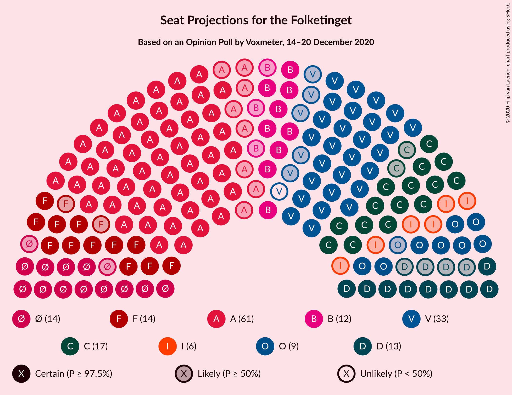
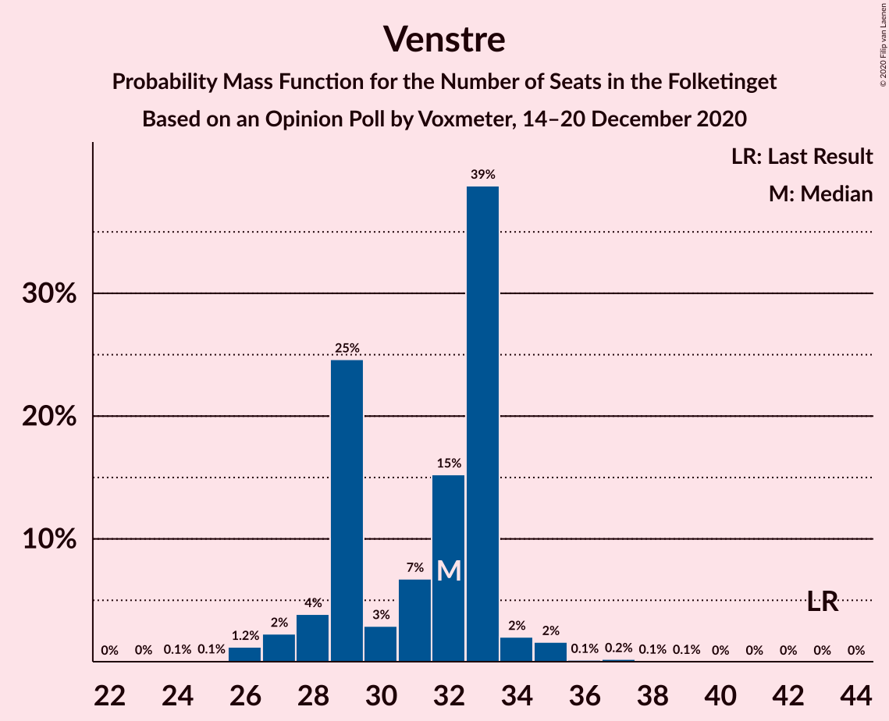
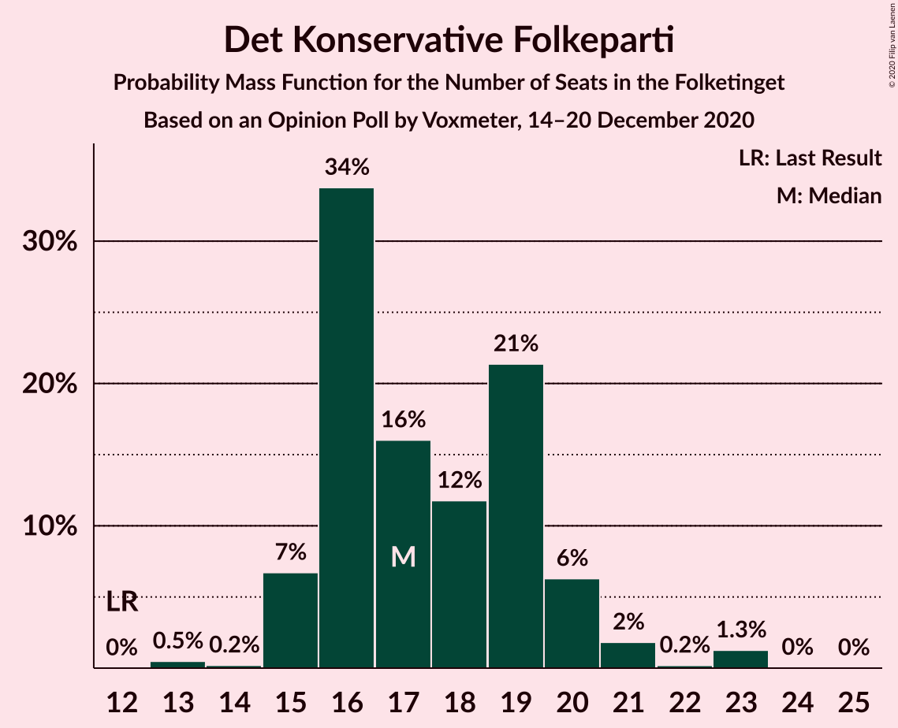
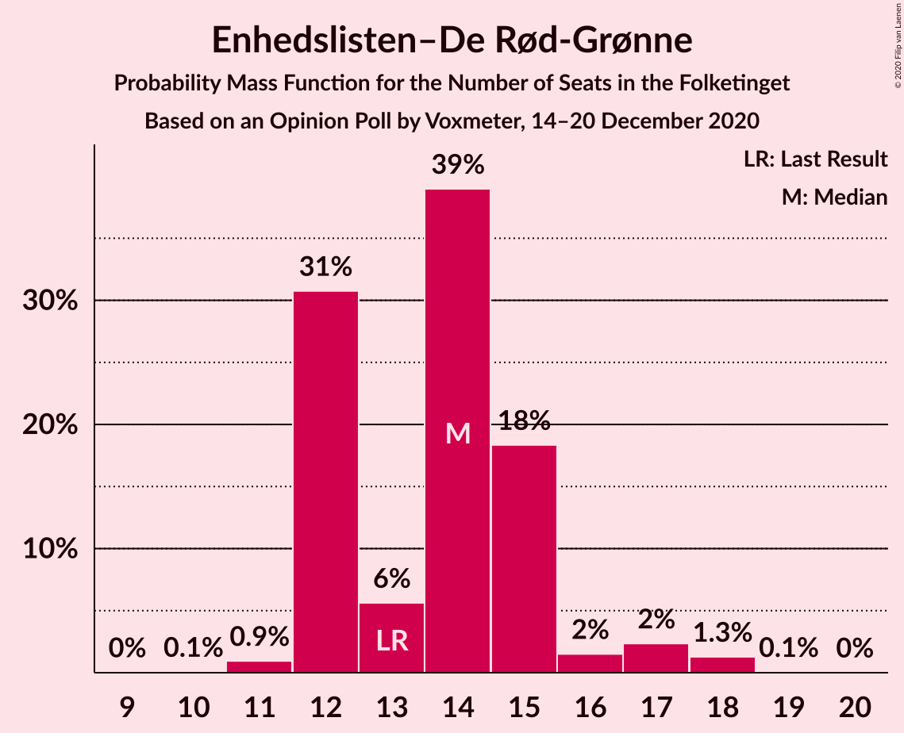
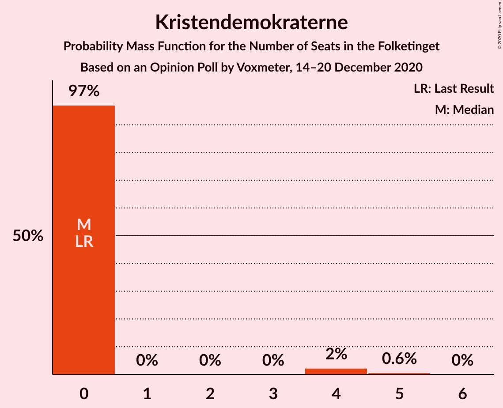
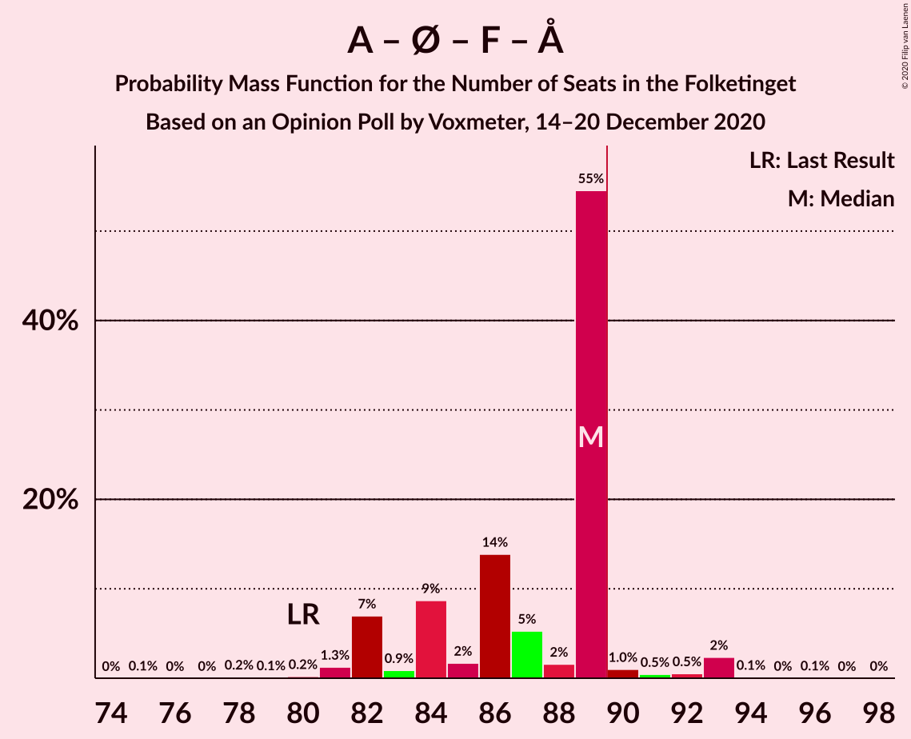
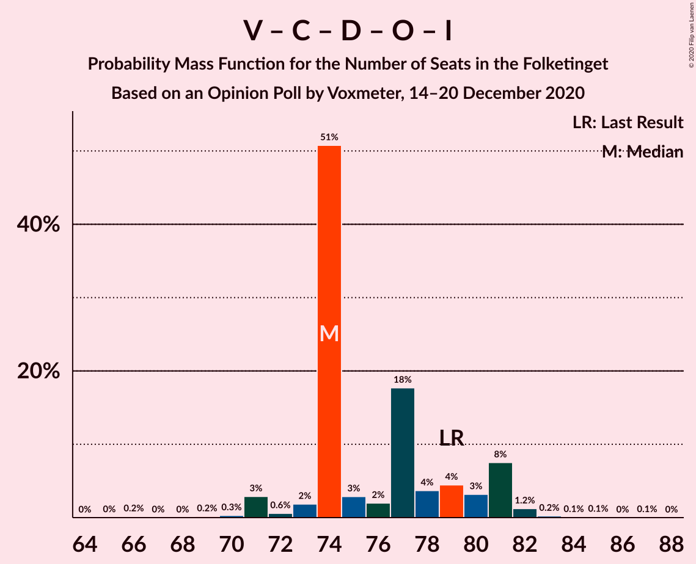
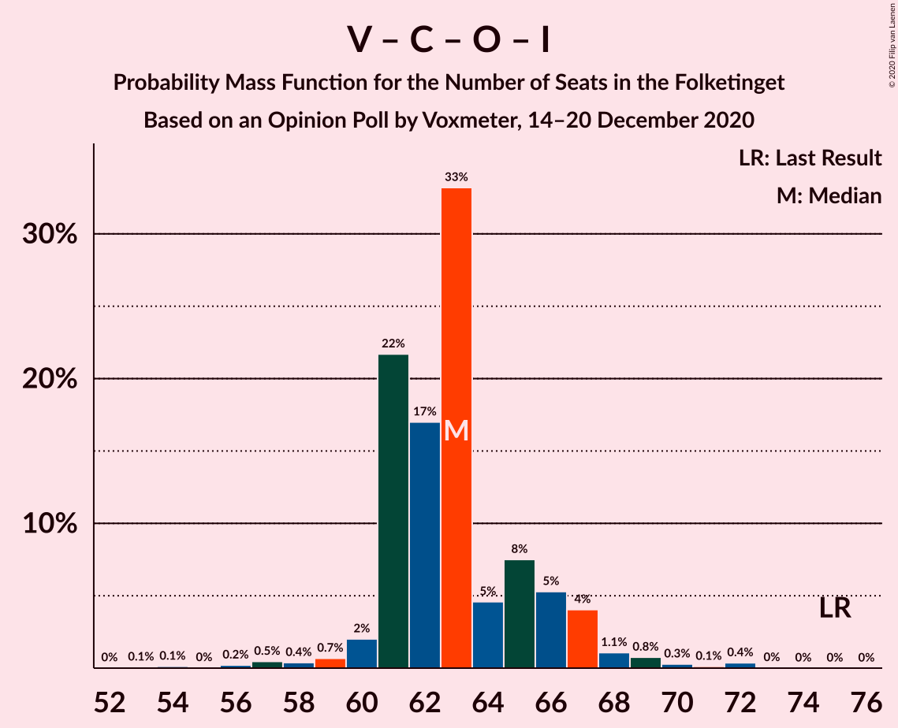

# Opinion Poll by Voxmeter, 14–20 December 2020

<a href="#voting-intentions">Voting Intentions</a> | <a href="#seats">Seats</a> | <a href="#coalitions">Coalitions</a> | <a href="#technical-information">Technical Information</a>

## Voting Intentions

### Confidence Intervals

| Party | Last Result | Poll Result | 80% Confidence Interval | 90% Confidence Interval | 95% Confidence Interval | 99% Confidence Interval |
|:-----:|:-----------:|:-----------:|:-----------------------:|:-----------------------:|:-----------------------:|:-----------------------:|
| Socialdemokraterne | 25.9% | 32.8% | 31.0–34.8% |30.5–35.3% |30.0–35.8% |29.2–36.7% |
| Venstre | 23.4% | 17.3% | 15.8–18.9% |15.4–19.3% |15.1–19.7% |14.4–20.5% |
| Det Konservative Folkeparti | 6.6% | 10.0% | 8.9–11.3% |8.6–11.7% |8.3–12.0% |7.8–12.7% |
| Enhedslisten–De Rød-Grønne | 6.9% | 7.8% | 6.9–9.0% |6.6–9.4% |6.3–9.7% |5.9–10.3% |
| Socialistisk Folkeparti | 7.7% | 7.7% | 6.8–8.9% |6.5–9.3% |6.2–9.6% |5.8–10.2% |
| Nye Borgerlige | 2.4% | 7.0% | 6.0–8.1% |5.8–8.4% |5.5–8.7% |5.1–9.3% |
| Radikale Venstre | 8.6% | 6.3% | 5.4–7.4% |5.2–7.7% |4.9–7.9% |4.5–8.5% |
| Dansk Folkeparti | 8.7% | 5.4% | 4.6–6.4% |4.4–6.7% |4.2–7.0% |3.8–7.5% |
| Liberal Alliance | 2.3% | 3.0% | 2.5–3.9% |2.3–4.1% |2.1–4.3% |1.9–4.7% |
| Kristendemokraterne | 1.7% | 1.4% | 1.0–2.0% |0.9–2.1% |0.8–2.3% |0.7–2.6% |
| Alternativet | 3.0% | 1.0% | 0.7–1.5% |0.6–1.7% |0.5–1.8% |0.4–2.1% |
| Veganerpartiet | 0.0% | 0.2% | 0.1–0.5% |0.1–0.6% |0.0–0.7% |0.0–0.9% |

*Note:* The poll result column reflects the actual value used in the calculations. Published results may vary slightly, and in addition be rounded to fewer digits.

## Seats

### Confidence Intervals

| Party | Last Result | Median | 80% Confidence Interval | 90% Confidence Interval | 95% Confidence Interval | 99% Confidence Interval |
|:-----:|:-----------:|:------:|:-----------------------:|:-----------------------:|:-----------------------:|:-----------------------:|
| <a href="#socialdemokraterne">Socialdemokraterne</a> | 48 | 61 | 56–62 |55–62 |53–62 |52–64 |
| <a href="#venstre">Venstre</a> | 43 | 32 | 29–33 |28–33 |27–34 |26–36 |
| <a href="#det-konservative-folkeparti">Det Konservative Folkeparti</a> | 12 | 17 | 16–19 |15–20 |15–21 |14–23 |
| <a href="#enhedslisten–de-rød-grønne">Enhedslisten–De Rød-Grønne</a> | 13 | 14 | 12–15 |12–16 |12–17 |11–18 |
| <a href="#socialistisk-folkeparti">Socialistisk Folkeparti</a> | 14 | 14 | 12–15 |12–16 |12–17 |10–17 |
| <a href="#nye-borgerlige">Nye Borgerlige</a> | 4 | 13 | 11–16 |11–16 |9–16 |9–16 |
| <a href="#radikale-venstre">Radikale Venstre</a> | 16 | 12 | 10–12 |9–13 |9–14 |8–15 |
| <a href="#dansk-folkeparti">Dansk Folkeparti</a> | 16 | 9 | 8–11 |8–11 |8–11 |6–13 |
| <a href="#liberal-alliance">Liberal Alliance</a> | 4 | 6 | 4–6 |4–7 |0–8 |0–9 |
| <a href="#kristendemokraterne">Kristendemokraterne</a> | 0 | 0 | 0 |0 |0–4 |0–5 |
| <a href="#alternativet">Alternativet</a> | 5 | 0 | 0 |0 |0 |0–4 |
| <a href="#veganerpartiet">Veganerpartiet</a> | 0 | 0 | 0 |0 |0 |0 |

### Socialdemokraterne

*For a full overview of the results for this party, see the [Socialdemokraterne](party-socialdemokraterne.html) page.*

| Number of Seats | Probability | Accumulated | Special Marks |
|:---------------:|:-----------:|:-----------:|:-------------:|
| 48 | 0% | 100% | Last Result |
| 49 | 0% | 100% |  |
| 50 | 0% | 100% |  |
| 51 | 0.2% | 100% |  |
| 52 | 2% | 99.8% |  |
| 53 | 0.8% | 98% |  |
| 54 | 1.3% | 97% |  |
| 55 | 1.1% | 95% |  |
| 56 | 5% | 94% |  |
| 57 | 2% | 89% |  |
| 58 | 10% | 87% |  |
| 59 | 15% | 77% |  |
| 60 | 2% | 62% |  |
| 61 | 32% | 60% | Median |
| 62 | 26% | 29% |  |
| 63 | 0.3% | 2% |  |
| 64 | 1.5% | 2% |  |
| 65 | 0.2% | 0.4% |  |
| 66 | 0.2% | 0.2% |  |
| 67 | 0% | 0% |  |

### Venstre

*For a full overview of the results for this party, see the [Venstre](party-venstre.html) page.*

| Number of Seats | Probability | Accumulated | Special Marks |
|:---------------:|:-----------:|:-----------:|:-------------:|
| 24 | 0.1% | 100% |  |
| 25 | 0.1% | 99.9% |  |
| 26 | 1.2% | 99.8% |  |
| 27 | 2% | 98.6% |  |
| 28 | 4% | 96% |  |
| 29 | 25% | 92% |  |
| 30 | 3% | 68% |  |
| 31 | 7% | 65% |  |
| 32 | 15% | 58% | Median |
| 33 | 39% | 43% |  |
| 34 | 2% | 4% |  |
| 35 | 2% | 2% |  |
| 36 | 0.1% | 0.5% |  |
| 37 | 0.2% | 0.4% |  |
| 38 | 0.1% | 0.2% |  |
| 39 | 0.1% | 0.1% |  |
| 40 | 0% | 0% |  |
| 41 | 0% | 0% |  |
| 42 | 0% | 0% |  |
| 43 | 0% | 0% | Last Result |

### Det Konservative Folkeparti

*For a full overview of the results for this party, see the [Det Konservative Folkeparti](party-detkonservativefolkeparti.html) page.*

| Number of Seats | Probability | Accumulated | Special Marks |
|:---------------:|:-----------:|:-----------:|:-------------:|
| 12 | 0% | 100% | Last Result |
| 13 | 0.5% | 100% |  |
| 14 | 0.2% | 99.5% |  |
| 15 | 7% | 99.3% |  |
| 16 | 34% | 93% |  |
| 17 | 16% | 59% | Median |
| 18 | 12% | 43% |  |
| 19 | 21% | 31% |  |
| 20 | 6% | 10% |  |
| 21 | 2% | 3% |  |
| 22 | 0.2% | 2% |  |
| 23 | 1.3% | 1.3% |  |
| 24 | 0% | 0.1% |  |
| 25 | 0% | 0% |  |

### Enhedslisten–De Rød-Grønne

*For a full overview of the results for this party, see the [Enhedslisten–De Rød-Grønne](party-enhedslisten–derød-grønne.html) page.*

| Number of Seats | Probability | Accumulated | Special Marks |
|:---------------:|:-----------:|:-----------:|:-------------:|
| 10 | 0.1% | 100% |  |
| 11 | 0.9% | 99.9% |  |
| 12 | 31% | 98.9% |  |
| 13 | 6% | 68% | Last Result |
| 14 | 39% | 63% | Median |
| 15 | 18% | 24% |  |
| 16 | 2% | 5% |  |
| 17 | 2% | 4% |  |
| 18 | 1.3% | 1.4% |  |
| 19 | 0.1% | 0.1% |  |
| 20 | 0% | 0% |  |

### Socialistisk Folkeparti

*For a full overview of the results for this party, see the [Socialistisk Folkeparti](party-socialistiskfolkeparti.html) page.*

| Number of Seats | Probability | Accumulated | Special Marks |
|:---------------:|:-----------:|:-----------:|:-------------:|
| 10 | 0.6% | 100% |  |
| 11 | 0.5% | 99.4% |  |
| 12 | 23% | 98.8% |  |
| 13 | 10% | 76% |  |
| 14 | 34% | 65% | Last Result, Median |
| 15 | 23% | 31% |  |
| 16 | 3% | 8% |  |
| 17 | 4% | 4% |  |
| 18 | 0.2% | 0.5% |  |
| 19 | 0.2% | 0.2% |  |
| 20 | 0% | 0% |  |

### Nye Borgerlige

*For a full overview of the results for this party, see the [Nye Borgerlige](party-nyeborgerlige.html) page.*

| Number of Seats | Probability | Accumulated | Special Marks |
|:---------------:|:-----------:|:-----------:|:-------------:|
| 4 | 0% | 100% | Last Result |
| 5 | 0% | 100% |  |
| 6 | 0% | 100% |  |
| 7 | 0% | 100% |  |
| 8 | 0.1% | 100% |  |
| 9 | 3% | 99.9% |  |
| 10 | 1.2% | 97% |  |
| 11 | 34% | 96% |  |
| 12 | 5% | 62% |  |
| 13 | 29% | 57% | Median |
| 14 | 4% | 28% |  |
| 15 | 13% | 24% |  |
| 16 | 12% | 12% |  |
| 17 | 0.2% | 0.2% |  |
| 18 | 0% | 0% |  |

### Radikale Venstre

*For a full overview of the results for this party, see the [Radikale Venstre](party-radikalevenstre.html) page.*

| Number of Seats | Probability | Accumulated | Special Marks |
|:---------------:|:-----------:|:-----------:|:-------------:|
| 7 | 0.1% | 100% |  |
| 8 | 0.6% | 99.9% |  |
| 9 | 4% | 99.3% |  |
| 10 | 6% | 95% |  |
| 11 | 7% | 89% |  |
| 12 | 75% | 82% | Median |
| 13 | 3% | 8% |  |
| 14 | 4% | 5% |  |
| 15 | 0.2% | 0.5% |  |
| 16 | 0.1% | 0.4% | Last Result |
| 17 | 0.3% | 0.3% |  |
| 18 | 0% | 0% |  |

### Dansk Folkeparti

*For a full overview of the results for this party, see the [Dansk Folkeparti](party-danskfolkeparti.html) page.*

| Number of Seats | Probability | Accumulated | Special Marks |
|:---------------:|:-----------:|:-----------:|:-------------:|
| 6 | 0.5% | 100% |  |
| 7 | 1.1% | 99.5% |  |
| 8 | 45% | 98% |  |
| 9 | 28% | 53% | Median |
| 10 | 7% | 25% |  |
| 11 | 16% | 18% |  |
| 12 | 1.0% | 2% |  |
| 13 | 1.2% | 1.4% |  |
| 14 | 0.1% | 0.1% |  |
| 15 | 0% | 0% |  |
| 16 | 0% | 0% | Last Result |

### Liberal Alliance

*For a full overview of the results for this party, see the [Liberal Alliance](party-liberalalliance.html) page.*

| Number of Seats | Probability | Accumulated | Special Marks |
|:---------------:|:-----------:|:-----------:|:-------------:|
| 0 | 3% | 100% |  |
| 1 | 0% | 97% |  |
| 2 | 0% | 97% |  |
| 3 | 0.2% | 97% |  |
| 4 | 24% | 97% | Last Result |
| 5 | 21% | 73% |  |
| 6 | 46% | 52% | Median |
| 7 | 2% | 6% |  |
| 8 | 3% | 3% |  |
| 9 | 0.7% | 0.7% |  |
| 10 | 0% | 0% |  |

### Kristendemokraterne

*For a full overview of the results for this party, see the [Kristendemokraterne](party-kristendemokraterne.html) page.*

| Number of Seats | Probability | Accumulated | Special Marks |
|:---------------:|:-----------:|:-----------:|:-------------:|
| 0 | 97% | 100% | Last Result, Median |
| 1 | 0% | 3% |  |
| 2 | 0% | 3% |  |
| 3 | 0% | 3% |  |
| 4 | 2% | 3% |  |
| 5 | 0.6% | 0.6% |  |
| 6 | 0% | 0% |  |

### Alternativet

*For a full overview of the results for this party, see the [Alternativet](party-alternativet.html) page.*

| Number of Seats | Probability | Accumulated | Special Marks |
|:---------------:|:-----------:|:-----------:|:-------------:|
| 0 | 99.5% | 100% | Median |
| 1 | 0% | 0.5% |  |
| 2 | 0% | 0.5% |  |
| 3 | 0% | 0.5% |  |
| 4 | 0.5% | 0.5% |  |
| 5 | 0% | 0% | Last Result |

### Veganerpartiet

*For a full overview of the results for this party, see the [Veganerpartiet](party-veganerpartiet.html) page.*

| Number of Seats | Probability | Accumulated | Special Marks |
|:---------------:|:-----------:|:-----------:|:-------------:|
| 0 | 100% | 100% | Last Result, Median |

## Coalitions

### Confidence Intervals

| Coalition | Last Result | Median | Majority? | 80% Confidence Interval | 90% Confidence Interval | 95% Confidence Interval | 99% Confidence Interval |
|:---------:|:-----------:|:------:|:---------:|:-----------------------:|:-----------------------:|:-----------------------:|:-----------------------:|
| Socialdemokraterne – Enhedslisten–De Rød-Grønne – Socialistisk Folkeparti – Radikale Venstre – Alternativet | 96 | 101 | 99.8% | 94–101 | 94–101 | 94–104 | 92–104 |
| Socialdemokraterne – Enhedslisten–De Rød-Grønne – Socialistisk Folkeparti – Radikale Venstre | 91 | 101 | 99.8% | 94–101 | 94–101 | 94–104 | 92–104 |
| Socialdemokraterne – Enhedslisten–De Rød-Grønne – Socialistisk Folkeparti – Alternativet | 80 | 89 | 5% | 84–89 | 82–89 | 82–93 | 80–93 |
| Socialdemokraterne – Enhedslisten–De Rød-Grønne – Socialistisk Folkeparti | 75 | 89 | 5% | 83–89 | 82–89 | 82–93 | 80–93 |
| Socialdemokraterne – Socialistisk Folkeparti – Radikale Venstre | 78 | 87 | 4% | 82–89 | 80–89 | 79–90 | 78–90 |
| Venstre – Det Konservative Folkeparti – Nye Borgerlige – Dansk Folkeparti – Liberal Alliance – Kristendemokraterne | 79 | 74 | 0% | 74–81 | 74–81 | 71–81 | 71–83 |
| Venstre – Det Konservative Folkeparti – Nye Borgerlige – Dansk Folkeparti – Liberal Alliance | 79 | 74 | 0% | 74–80 | 73–81 | 71–81 | 70–82 |
| Socialdemokraterne – Radikale Venstre | 64 | 73 | 0% | 68–74 | 67–74 | 64–74 | 64–77 |
| Venstre – Det Konservative Folkeparti – Dansk Folkeparti – Liberal Alliance – Kristendemokraterne | 75 | 63 | 0% | 61–66 | 61–67 | 60–68 | 58–72 |
| Venstre – Det Konservative Folkeparti – Dansk Folkeparti – Liberal Alliance | 75 | 63 | 0% | 61–66 | 61–67 | 60–68 | 57–71 |
| Venstre – Det Konservative Folkeparti – Liberal Alliance | 59 | 54 | 0% | 52–55 | 51–57 | 50–58 | 47–60 |
| Venstre – Det Konservative Folkeparti | 55 | 49 | 0% | 48–50 | 46–52 | 45–52 | 42–55 |
| Venstre | 43 | 32 | 0% | 29–33 | 28–33 | 27–34 | 26–36 |

### Socialdemokraterne – Enhedslisten–De Rød-Grønne – Socialistisk Folkeparti – Radikale Venstre – Alternativet

| Number of Seats | Probability | Accumulated | Special Marks |
|:---------------:|:-----------:|:-----------:|:-------------:|
| 88 | 0.1% | 100% |  |
| 89 | 0.1% | 99.9% |  |
| 90 | 0.2% | 99.8% | Majority |
| 91 | 0.1% | 99.7% |  |
| 92 | 0.2% | 99.5% |  |
| 93 | 2% | 99.3% |  |
| 94 | 8% | 98% |  |
| 95 | 3% | 90% |  |
| 96 | 5% | 87% | Last Result |
| 97 | 3% | 82% |  |
| 98 | 18% | 79% |  |
| 99 | 2% | 61% |  |
| 100 | 3% | 59% |  |
| 101 | 51% | 56% | Median |
| 102 | 1.5% | 5% |  |
| 103 | 0.6% | 3% |  |
| 104 | 2% | 3% |  |
| 105 | 0.3% | 0.5% |  |
| 106 | 0.2% | 0.2% |  |
| 107 | 0% | 0% |  |

### Socialdemokraterne – Enhedslisten–De Rød-Grønne – Socialistisk Folkeparti – Radikale Venstre

| Number of Seats | Probability | Accumulated | Special Marks |
|:---------------:|:-----------:|:-----------:|:-------------:|
| 88 | 0.1% | 100% |  |
| 89 | 0.1% | 99.9% |  |
| 90 | 0.2% | 99.8% | Majority |
| 91 | 0.1% | 99.7% | Last Result |
| 92 | 0.3% | 99.5% |  |
| 93 | 2% | 99.2% |  |
| 94 | 8% | 98% |  |
| 95 | 3% | 90% |  |
| 96 | 5% | 86% |  |
| 97 | 4% | 82% |  |
| 98 | 18% | 78% |  |
| 99 | 2% | 60% |  |
| 100 | 3% | 58% |  |
| 101 | 50% | 55% | Median |
| 102 | 1.5% | 5% |  |
| 103 | 0.6% | 3% |  |
| 104 | 2% | 3% |  |
| 105 | 0.3% | 0.5% |  |
| 106 | 0.2% | 0.2% |  |
| 107 | 0% | 0% |  |

### Socialdemokraterne – Enhedslisten–De Rød-Grønne – Socialistisk Folkeparti – Alternativet

| Number of Seats | Probability | Accumulated | Special Marks |
|:---------------:|:-----------:|:-----------:|:-------------:|
| 75 | 0.1% | 100% |  |
| 76 | 0% | 99.9% |  |
| 77 | 0% | 99.9% |  |
| 78 | 0.2% | 99.9% |  |
| 79 | 0.1% | 99.8% |  |
| 80 | 0.2% | 99.7% | Last Result |
| 81 | 1.3% | 99.5% |  |
| 82 | 7% | 98% |  |
| 83 | 0.9% | 91% |  |
| 84 | 9% | 90% |  |
| 85 | 2% | 82% |  |
| 86 | 14% | 80% |  |
| 87 | 5% | 66% |  |
| 88 | 2% | 61% |  |
| 89 | 55% | 59% | Median |
| 90 | 1.0% | 5% | Majority |
| 91 | 0.5% | 4% |  |
| 92 | 0.5% | 3% |  |
| 93 | 2% | 3% |  |
| 94 | 0.1% | 0.2% |  |
| 95 | 0% | 0.1% |  |
| 96 | 0.1% | 0.1% |  |
| 97 | 0% | 0% |  |

### Socialdemokraterne – Enhedslisten–De Rød-Grønne – Socialistisk Folkeparti

| Number of Seats | Probability | Accumulated | Special Marks |
|:---------------:|:-----------:|:-----------:|:-------------:|
| 75 | 0.1% | 100% | Last Result |
| 76 | 0% | 99.9% |  |
| 77 | 0% | 99.9% |  |
| 78 | 0.2% | 99.9% |  |
| 79 | 0.1% | 99.8% |  |
| 80 | 0.2% | 99.7% |  |
| 81 | 1.3% | 99.5% |  |
| 82 | 7% | 98% |  |
| 83 | 1.2% | 91% |  |
| 84 | 9% | 90% |  |
| 85 | 2% | 81% |  |
| 86 | 14% | 79% |  |
| 87 | 5% | 66% |  |
| 88 | 2% | 61% |  |
| 89 | 55% | 59% | Median |
| 90 | 1.0% | 5% | Majority |
| 91 | 0.4% | 4% |  |
| 92 | 0.5% | 3% |  |
| 93 | 2% | 3% |  |
| 94 | 0.1% | 0.2% |  |
| 95 | 0% | 0.1% |  |
| 96 | 0.1% | 0.1% |  |
| 97 | 0% | 0% |  |

### Socialdemokraterne – Socialistisk Folkeparti – Radikale Venstre

| Number of Seats | Probability | Accumulated | Special Marks |
|:---------------:|:-----------:|:-----------:|:-------------:|
| 75 | 0.1% | 100% |  |
| 76 | 0.2% | 99.9% |  |
| 77 | 0.2% | 99.7% |  |
| 78 | 0.5% | 99.5% | Last Result |
| 79 | 2% | 99.0% |  |
| 80 | 2% | 97% |  |
| 81 | 3% | 95% |  |
| 82 | 8% | 92% |  |
| 83 | 19% | 83% |  |
| 84 | 3% | 64% |  |
| 85 | 5% | 61% |  |
| 86 | 1.2% | 56% |  |
| 87 | 31% | 55% | Median |
| 88 | 0.3% | 24% |  |
| 89 | 20% | 24% |  |
| 90 | 4% | 4% | Majority |
| 91 | 0.1% | 0.2% |  |
| 92 | 0% | 0.1% |  |
| 93 | 0% | 0.1% |  |
| 94 | 0% | 0% |  |

### Venstre – Det Konservative Folkeparti – Nye Borgerlige – Dansk Folkeparti – Liberal Alliance – Kristendemokraterne

| Number of Seats | Probability | Accumulated | Special Marks |
|:---------------:|:-----------:|:-----------:|:-------------:|
| 69 | 0.2% | 100% |  |
| 70 | 0.3% | 99.8% |  |
| 71 | 2% | 99.5% |  |
| 72 | 0.6% | 97% |  |
| 73 | 1.5% | 97% |  |
| 74 | 51% | 95% |  |
| 75 | 3% | 44% |  |
| 76 | 2% | 41% |  |
| 77 | 18% | 39% | Median |
| 78 | 3% | 21% |  |
| 79 | 5% | 18% | Last Result |
| 80 | 3% | 13% |  |
| 81 | 8% | 10% |  |
| 82 | 2% | 2% |  |
| 83 | 0.2% | 0.7% |  |
| 84 | 0.1% | 0.5% |  |
| 85 | 0.2% | 0.3% |  |
| 86 | 0.1% | 0.2% |  |
| 87 | 0.1% | 0.1% |  |
| 88 | 0% | 0% |  |

### Venstre – Det Konservative Folkeparti – Nye Borgerlige – Dansk Folkeparti – Liberal Alliance

| Number of Seats | Probability | Accumulated | Special Marks |
|:---------------:|:-----------:|:-----------:|:-------------:|
| 66 | 0.2% | 100% |  |
| 67 | 0% | 99.8% |  |
| 68 | 0% | 99.8% |  |
| 69 | 0.2% | 99.8% |  |
| 70 | 0.3% | 99.6% |  |
| 71 | 3% | 99.3% |  |
| 72 | 0.6% | 96% |  |
| 73 | 2% | 96% |  |
| 74 | 51% | 94% |  |
| 75 | 3% | 43% |  |
| 76 | 2% | 40% |  |
| 77 | 18% | 38% | Median |
| 78 | 4% | 21% |  |
| 79 | 4% | 17% | Last Result |
| 80 | 3% | 12% |  |
| 81 | 8% | 9% |  |
| 82 | 1.2% | 2% |  |
| 83 | 0.2% | 0.5% |  |
| 84 | 0.1% | 0.2% |  |
| 85 | 0.1% | 0.2% |  |
| 86 | 0% | 0.1% |  |
| 87 | 0.1% | 0.1% |  |
| 88 | 0% | 0% |  |

### Socialdemokraterne – Radikale Venstre

| Number of Seats | Probability | Accumulated | Special Marks |
|:---------------:|:-----------:|:-----------:|:-------------:|
| 61 | 0.1% | 100% |  |
| 62 | 0.1% | 99.9% |  |
| 63 | 0.2% | 99.8% |  |
| 64 | 2% | 99.7% | Last Result |
| 65 | 0.8% | 97% |  |
| 66 | 1.3% | 97% |  |
| 67 | 2% | 95% |  |
| 68 | 6% | 93% |  |
| 69 | 2% | 87% |  |
| 70 | 10% | 85% |  |
| 71 | 16% | 76% |  |
| 72 | 4% | 59% |  |
| 73 | 33% | 55% | Median |
| 74 | 20% | 22% |  |
| 75 | 0.5% | 2% |  |
| 76 | 0.2% | 2% |  |
| 77 | 1.2% | 1.4% |  |
| 78 | 0% | 0.2% |  |
| 79 | 0.1% | 0.1% |  |
| 80 | 0% | 0% |  |

### Venstre – Det Konservative Folkeparti – Dansk Folkeparti – Liberal Alliance – Kristendemokraterne

| Number of Seats | Probability | Accumulated | Special Marks |
|:---------------:|:-----------:|:-----------:|:-------------:|
| 55 | 0% | 100% |  |
| 56 | 0.2% | 99.9% |  |
| 57 | 0.2% | 99.8% |  |
| 58 | 0.4% | 99.6% |  |
| 59 | 0.5% | 99.2% |  |
| 60 | 2% | 98.7% |  |
| 61 | 21% | 97% |  |
| 62 | 17% | 75% |  |
| 63 | 33% | 58% |  |
| 64 | 5% | 25% | Median |
| 65 | 8% | 21% |  |
| 66 | 6% | 13% |  |
| 67 | 4% | 7% |  |
| 68 | 1.0% | 3% |  |
| 69 | 1.1% | 2% |  |
| 70 | 0.3% | 1.2% |  |
| 71 | 0.2% | 0.9% |  |
| 72 | 0.5% | 0.7% |  |
| 73 | 0.1% | 0.2% |  |
| 74 | 0.1% | 0.1% |  |
| 75 | 0% | 0% | Last Result |

### Venstre – Det Konservative Folkeparti – Dansk Folkeparti – Liberal Alliance

| Number of Seats | Probability | Accumulated | Special Marks |
|:---------------:|:-----------:|:-----------:|:-------------:|
| 53 | 0.1% | 100% |  |
| 54 | 0.1% | 99.9% |  |
| 55 | 0% | 99.8% |  |
| 56 | 0.2% | 99.7% |  |
| 57 | 0.5% | 99.5% |  |
| 58 | 0.4% | 99.1% |  |
| 59 | 0.7% | 98.7% |  |
| 60 | 2% | 98% |  |
| 61 | 22% | 96% |  |
| 62 | 17% | 74% |  |
| 63 | 33% | 57% |  |
| 64 | 5% | 24% | Median |
| 65 | 8% | 19% |  |
| 66 | 5% | 12% |  |
| 67 | 4% | 7% |  |
| 68 | 1.1% | 3% |  |
| 69 | 0.8% | 2% |  |
| 70 | 0.3% | 0.8% |  |
| 71 | 0.1% | 0.5% |  |
| 72 | 0.4% | 0.4% |  |
| 73 | 0% | 0% |  |
| 74 | 0% | 0% |  |
| 75 | 0% | 0% | Last Result |

### Venstre – Det Konservative Folkeparti – Liberal Alliance

| Number of Seats | Probability | Accumulated | Special Marks |
|:---------------:|:-----------:|:-----------:|:-------------:|
| 44 | 0.1% | 100% |  |
| 45 | 0% | 99.9% |  |
| 46 | 0.3% | 99.9% |  |
| 47 | 0.2% | 99.6% |  |
| 48 | 0.3% | 99.4% |  |
| 49 | 0.6% | 99.1% |  |
| 50 | 1.1% | 98% |  |
| 51 | 3% | 97% |  |
| 52 | 23% | 94% |  |
| 53 | 5% | 71% |  |
| 54 | 19% | 66% |  |
| 55 | 38% | 47% | Median |
| 56 | 4% | 9% |  |
| 57 | 2% | 5% |  |
| 58 | 2% | 4% |  |
| 59 | 1.2% | 2% | Last Result |
| 60 | 0.5% | 0.8% |  |
| 61 | 0.1% | 0.3% |  |
| 62 | 0.2% | 0.2% |  |
| 63 | 0% | 0% |  |

### Venstre – Det Konservative Folkeparti

| Number of Seats | Probability | Accumulated | Special Marks |
|:---------------:|:-----------:|:-----------:|:-------------:|
| 41 | 0.1% | 100% |  |
| 42 | 0.7% | 99.9% |  |
| 43 | 0.4% | 99.2% |  |
| 44 | 0.5% | 98.8% |  |
| 45 | 2% | 98% |  |
| 46 | 2% | 96% |  |
| 47 | 4% | 94% |  |
| 48 | 29% | 90% |  |
| 49 | 46% | 61% | Median |
| 50 | 6% | 14% |  |
| 51 | 2% | 8% |  |
| 52 | 5% | 6% |  |
| 53 | 0.6% | 1.3% |  |
| 54 | 0.1% | 0.7% |  |
| 55 | 0.5% | 0.6% | Last Result |
| 56 | 0.1% | 0.1% |  |
| 57 | 0% | 0% |  |

### Venstre

| Number of Seats | Probability | Accumulated | Special Marks |
|:---------------:|:-----------:|:-----------:|:-------------:|
| 24 | 0.1% | 100% |  |
| 25 | 0.1% | 99.9% |  |
| 26 | 1.2% | 99.8% |  |
| 27 | 2% | 98.6% |  |
| 28 | 4% | 96% |  |
| 29 | 25% | 92% |  |
| 30 | 3% | 68% |  |
| 31 | 7% | 65% |  |
| 32 | 15% | 58% | Median |
| 33 | 39% | 43% |  |
| 34 | 2% | 4% |  |
| 35 | 2% | 2% |  |
| 36 | 0.1% | 0.5% |  |
| 37 | 0.2% | 0.4% |  |
| 38 | 0.1% | 0.2% |  |
| 39 | 0.1% | 0.1% |  |
| 40 | 0% | 0% |  |
| 41 | 0% | 0% |  |
| 42 | 0% | 0% |  |
| 43 | 0% | 0% | Last Result |

## Technical Information

### Opinion Poll

+ **Polling firm:** Voxmeter
+ **Commissioner(s):** —
+ **Fieldwork period:** 14–20 December 2020

### Calculations

+ **Sample size:** 1020
+ **Simulations done:** 1,048,576
+ **Error estimate:** 2.70%

