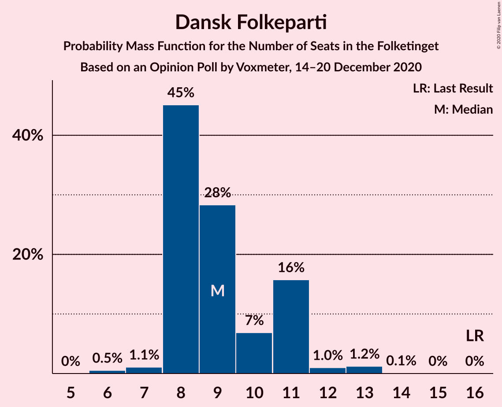
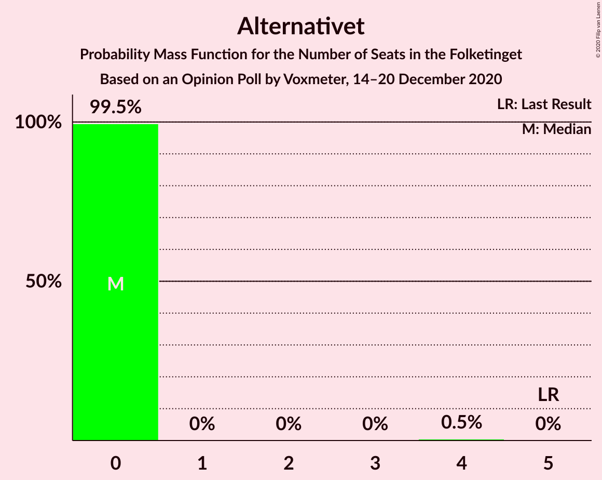
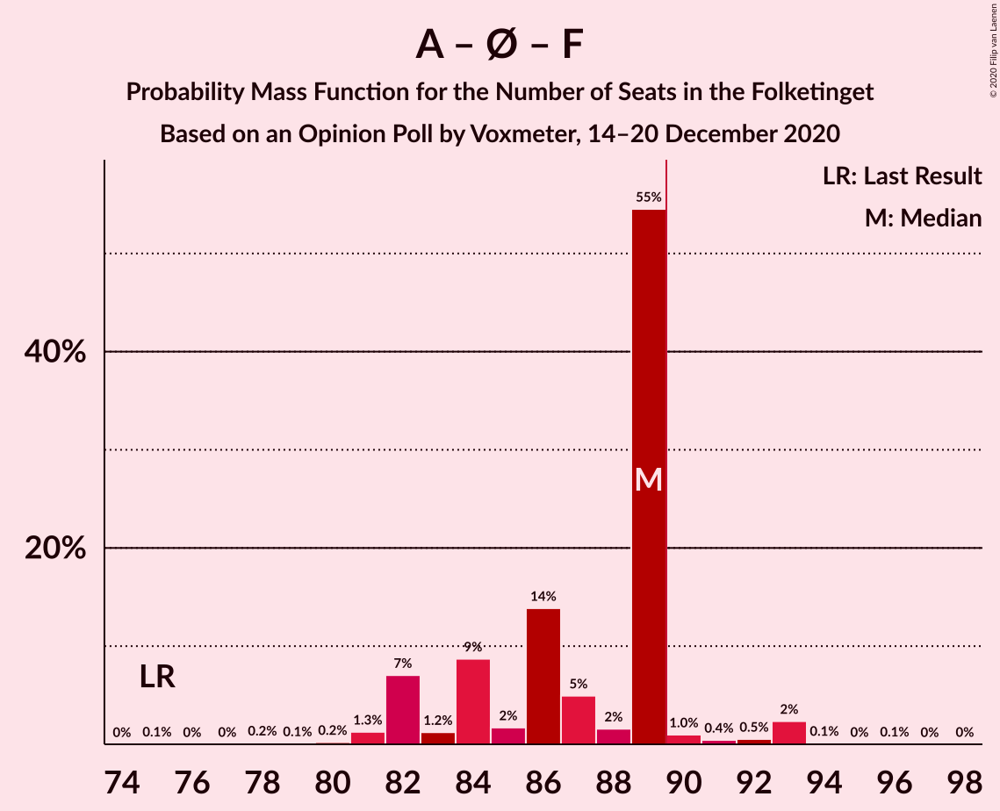
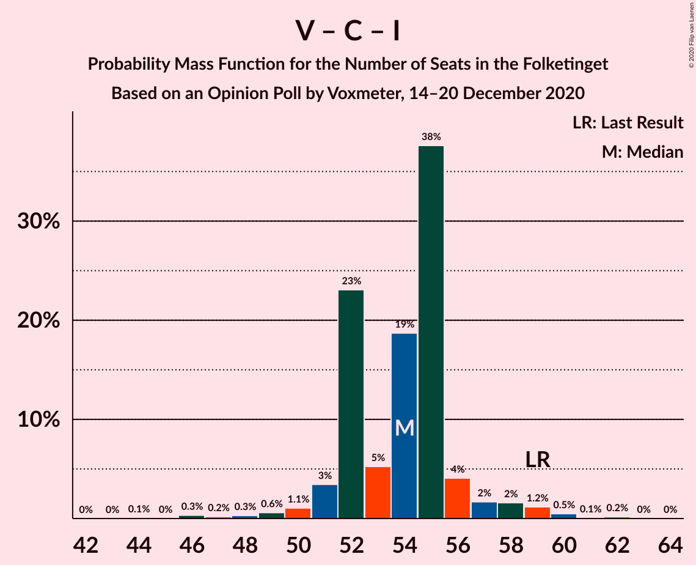

# Opinion Poll by Voxmeter, 14–20 December 2020

<a href="#voting-intentions">Voting Intentions</a> | <a href="#seats">Seats</a> | <a href="#coalitions">Coalitions</a> | <a href="#technical-information">Technical Information</a>

## Voting Intentions

### Confidence Intervals

| Party | Last Result | Poll Result | 80% Confidence Interval | 90% Confidence Interval | 95% Confidence Interval | 99% Confidence Interval |
|:-----:|:-----------:|:-----------:|:-----------------------:|:-----------------------:|:-----------------------:|:-----------------------:|
| Socialdemokraterne | 25.9% | 32.8% | 31.0–34.8% |30.5–35.3% |30.0–35.8% |29.2–36.7% |
| Venstre | 23.4% | 17.3% | 15.8–18.9% |15.4–19.3% |15.1–19.7% |14.4–20.5% |
| Det Konservative Folkeparti | 6.6% | 10.0% | 8.9–11.3% |8.6–11.7% |8.3–12.0% |7.8–12.7% |
| Enhedslisten–De Rød-Grønne | 6.9% | 7.8% | 6.9–9.0% |6.6–9.4% |6.3–9.7% |5.9–10.3% |
| Socialistisk Folkeparti | 7.7% | 7.7% | 6.8–8.9% |6.5–9.3% |6.2–9.6% |5.8–10.2% |
| Nye Borgerlige | 2.4% | 7.0% | 6.0–8.1% |5.8–8.4% |5.5–8.7% |5.1–9.3% |
| Radikale Venstre | 8.6% | 6.3% | 5.4–7.4% |5.2–7.7% |4.9–7.9% |4.5–8.5% |
| Dansk Folkeparti | 8.7% | 5.4% | 4.6–6.4% |4.4–6.7% |4.2–7.0% |3.8–7.5% |
| Liberal Alliance | 2.3% | 3.0% | 2.5–3.9% |2.3–4.1% |2.1–4.3% |1.9–4.7% |
| Kristendemokraterne | 1.7% | 1.4% | 1.0–2.0% |0.9–2.1% |0.8–2.3% |0.7–2.6% |
| Alternativet | 3.0% | 1.0% | 0.7–1.5% |0.6–1.7% |0.5–1.8% |0.4–2.1% |
| Veganerpartiet | 0.0% | 0.2% | 0.1–0.5% |0.1–0.6% |0.0–0.7% |0.0–0.9% |

*Note:* The poll result column reflects the actual value used in the calculations. Published results may vary slightly, and in addition be rounded to fewer digits.

## Seats

### Confidence Intervals

| Party | Last Result | Median | 80% Confidence Interval | 90% Confidence Interval | 95% Confidence Interval | 99% Confidence Interval |
|:-----:|:-----------:|:------:|:-----------------------:|:-----------------------:|:-----------------------:|:-----------------------:|
| <a href="#socialdemokraterne">Socialdemokraterne</a> | 48 | 59 | 56–59 |54–61 |52–62 |52–64 |
| <a href="#venstre">Venstre</a> | 43 | 32 | 30–33 |29–33 |28–35 |26–35 |
| <a href="#det-konservative-folkeparti">Det Konservative Folkeparti</a> | 12 | 17 | 17–20 |16–20 |15–20 |13–21 |
| <a href="#enhedslisten–de-rød-grønne">Enhedslisten–De Rød-Grønne</a> | 13 | 15 | 12–15 |12–15 |12–16 |11–17 |
| <a href="#socialistisk-folkeparti">Socialistisk Folkeparti</a> | 14 | 12 | 12–14 |12–16 |12–16 |10–17 |
| <a href="#nye-borgerlige">Nye Borgerlige</a> | 4 | 15 | 13–15 |12–15 |12–16 |11–16 |
| <a href="#radikale-venstre">Radikale Venstre</a> | 16 | 12 | 11–12 |11–12 |10–13 |10–13 |
| <a href="#dansk-folkeparti">Dansk Folkeparti</a> | 16 | 8 | 8–11 |8–12 |8–13 |7–13 |
| <a href="#liberal-alliance">Liberal Alliance</a> | 4 | 5 | 5 |4–7 |4–8 |3–8 |
| <a href="#kristendemokraterne">Kristendemokraterne</a> | 0 | 0 | 0 |0 |0 |0–4 |
| <a href="#alternativet">Alternativet</a> | 5 | 0 | 0 |0 |0 |0 |
| <a href="#veganerpartiet">Veganerpartiet</a> | 0 | 0 | 0 |0 |0 |0 |

### Socialdemokraterne

*For a full overview of the results for this party, see the [Socialdemokraterne](party-socialdemokraterne.html) page.*

| Number of Seats | Probability | Accumulated | Special Marks |
|:---------------:|:-----------:|:-----------:|:-------------:|
| 48 | 0% | 100% | Last Result |
| 49 | 0% | 100% |  |
| 50 | 0% | 100% |  |
| 51 | 0% | 100% |  |
| 52 | 3% | 100% |  |
| 53 | 0% | 97% |  |
| 54 | 3% | 97% |  |
| 55 | 0% | 94% |  |
| 56 | 5% | 94% |  |
| 57 | 3% | 89% |  |
| 58 | 1.0% | 86% |  |
| 59 | 80% | 85% | Median |
| 60 | 0% | 6% |  |
| 61 | 0.5% | 5% |  |
| 62 | 4% | 5% |  |
| 63 | 0.1% | 1.4% |  |
| 64 | 1.0% | 1.3% |  |
| 65 | 0% | 0.3% |  |
| 66 | 0.2% | 0.3% |  |
| 67 | 0% | 0.1% |  |
| 68 | 0% | 0.1% |  |
| 69 | 0.1% | 0.1% |  |
| 70 | 0% | 0% |  |

### Venstre

*For a full overview of the results for this party, see the [Venstre](party-venstre.html) page.*

| Number of Seats | Probability | Accumulated | Special Marks |
|:---------------:|:-----------:|:-----------:|:-------------:|
| 25 | 0% | 100% |  |
| 26 | 0.5% | 99.9% |  |
| 27 | 0.9% | 99.4% |  |
| 28 | 3% | 98.5% |  |
| 29 | 0.8% | 95% |  |
| 30 | 5% | 94% |  |
| 31 | 3% | 89% |  |
| 32 | 68% | 87% | Median |
| 33 | 15% | 19% |  |
| 34 | 0.2% | 4% |  |
| 35 | 3% | 3% |  |
| 36 | 0% | 0% |  |
| 37 | 0% | 0% |  |
| 38 | 0% | 0% |  |
| 39 | 0% | 0% |  |
| 40 | 0% | 0% |  |
| 41 | 0% | 0% |  |
| 42 | 0% | 0% |  |
| 43 | 0% | 0% | Last Result |

### Det Konservative Folkeparti

*For a full overview of the results for this party, see the [Det Konservative Folkeparti](party-detkonservativefolkeparti.html) page.*

| Number of Seats | Probability | Accumulated | Special Marks |
|:---------------:|:-----------:|:-----------:|:-------------:|
| 12 | 0% | 100% | Last Result |
| 13 | 0.7% | 100% |  |
| 14 | 0.2% | 99.3% |  |
| 15 | 3% | 99.1% |  |
| 16 | 3% | 96% |  |
| 17 | 81% | 93% | Median |
| 18 | 1.0% | 12% |  |
| 19 | 0.5% | 11% |  |
| 20 | 8% | 11% |  |
| 21 | 2% | 2% |  |
| 22 | 0% | 0.1% |  |
| 23 | 0% | 0.1% |  |
| 24 | 0% | 0.1% |  |
| 25 | 0% | 0.1% |  |
| 26 | 0.1% | 0.1% |  |
| 27 | 0% | 0% |  |

### Enhedslisten–De Rød-Grønne

*For a full overview of the results for this party, see the [Enhedslisten–De Rød-Grønne](party-enhedslisten–derød-grønne.html) page.*

| Number of Seats | Probability | Accumulated | Special Marks |
|:---------------:|:-----------:|:-----------:|:-------------:|
| 11 | 0.9% | 100% |  |
| 12 | 20% | 99.1% |  |
| 13 | 2% | 79% | Last Result |
| 14 | 8% | 78% |  |
| 15 | 67% | 70% | Median |
| 16 | 2% | 3% |  |
| 17 | 1.0% | 1.1% |  |
| 18 | 0.1% | 0.1% |  |
| 19 | 0% | 0% |  |

### Socialistisk Folkeparti

*For a full overview of the results for this party, see the [Socialistisk Folkeparti](party-socialistiskfolkeparti.html) page.*

| Number of Seats | Probability | Accumulated | Special Marks |
|:---------------:|:-----------:|:-----------:|:-------------:|
| 10 | 1.3% | 100% |  |
| 11 | 0.6% | 98.7% |  |
| 12 | 68% | 98% | Median |
| 13 | 16% | 30% |  |
| 14 | 5% | 14% | Last Result |
| 15 | 3% | 9% |  |
| 16 | 5% | 6% |  |
| 17 | 0.5% | 0.6% |  |
| 18 | 0.1% | 0.1% |  |
| 19 | 0% | 0% |  |

### Nye Borgerlige

*For a full overview of the results for this party, see the [Nye Borgerlige](party-nyeborgerlige.html) page.*

| Number of Seats | Probability | Accumulated | Special Marks |
|:---------------:|:-----------:|:-----------:|:-------------:|
| 4 | 0% | 100% | Last Result |
| 5 | 0% | 100% |  |
| 6 | 0% | 100% |  |
| 7 | 0% | 100% |  |
| 8 | 0% | 100% |  |
| 9 | 0.2% | 100% |  |
| 10 | 0.2% | 99.8% |  |
| 11 | 1.0% | 99.6% |  |
| 12 | 8% | 98.6% |  |
| 13 | 4% | 90% |  |
| 14 | 15% | 86% |  |
| 15 | 67% | 71% | Median |
| 16 | 3% | 3% |  |
| 17 | 0.1% | 0.1% |  |
| 18 | 0% | 0% |  |

### Radikale Venstre

*For a full overview of the results for this party, see the [Radikale Venstre](party-radikalevenstre.html) page.*

| Number of Seats | Probability | Accumulated | Special Marks |
|:---------------:|:-----------:|:-----------:|:-------------:|
| 9 | 0.1% | 100% |  |
| 10 | 3% | 99.9% |  |
| 11 | 17% | 97% |  |
| 12 | 77% | 80% | Median |
| 13 | 3% | 3% |  |
| 14 | 0.1% | 0.1% |  |
| 15 | 0.1% | 0.1% |  |
| 16 | 0% | 0% | Last Result |

### Dansk Folkeparti

*For a full overview of the results for this party, see the [Dansk Folkeparti](party-danskfolkeparti.html) page.*

| Number of Seats | Probability | Accumulated | Special Marks |
|:---------------:|:-----------:|:-----------:|:-------------:|
| 7 | 2% | 100% |  |
| 8 | 68% | 98% | Median |
| 9 | 6% | 31% |  |
| 10 | 1.1% | 25% |  |
| 11 | 18% | 24% |  |
| 12 | 0.7% | 5% |  |
| 13 | 5% | 5% |  |
| 14 | 0% | 0% |  |
| 15 | 0% | 0% |  |
| 16 | 0% | 0% | Last Result |

### Liberal Alliance

*For a full overview of the results for this party, see the [Liberal Alliance](party-liberalalliance.html) page.*

| Number of Seats | Probability | Accumulated | Special Marks |
|:---------------:|:-----------:|:-----------:|:-------------:|
| 0 | 0.2% | 100% |  |
| 1 | 0% | 99.8% |  |
| 2 | 0% | 99.8% |  |
| 3 | 0.9% | 99.8% |  |
| 4 | 5% | 99.0% | Last Result |
| 5 | 87% | 94% | Median |
| 6 | 0.9% | 7% |  |
| 7 | 4% | 7% |  |
| 8 | 3% | 3% |  |
| 9 | 0% | 0% |  |

### Kristendemokraterne

*For a full overview of the results for this party, see the [Kristendemokraterne](party-kristendemokraterne.html) page.*

| Number of Seats | Probability | Accumulated | Special Marks |
|:---------------:|:-----------:|:-----------:|:-------------:|
| 0 | 98% | 100% | Last Result, Median |
| 1 | 0% | 2% |  |
| 2 | 0% | 2% |  |
| 3 | 0% | 2% |  |
| 4 | 2% | 2% |  |
| 5 | 0% | 0% |  |

### Alternativet

*For a full overview of the results for this party, see the [Alternativet](party-alternativet.html) page.*

| Number of Seats | Probability | Accumulated | Special Marks |
|:---------------:|:-----------:|:-----------:|:-------------:|
| 0 | 99.9% | 100% | Median |
| 1 | 0% | 0.1% |  |
| 2 | 0% | 0.1% |  |
| 3 | 0% | 0.1% |  |
| 4 | 0.1% | 0.1% |  |
| 5 | 0% | 0% | Last Result |

### Veganerpartiet

*For a full overview of the results for this party, see the [Veganerpartiet](party-veganerpartiet.html) page.*

| Number of Seats | Probability | Accumulated | Special Marks |
|:---------------:|:-----------:|:-----------:|:-------------:|
| 0 | 100% | 100% | Last Result, Median |

## Coalitions

### Confidence Intervals

| Coalition | Last Result | Median | Majority? | 80% Confidence Interval | 90% Confidence Interval | 95% Confidence Interval | 99% Confidence Interval |
|:---------:|:-----------:|:------:|:---------:|:-----------------------:|:-----------------------:|:-----------------------:|:-----------------------:|
| Socialdemokraterne – Enhedslisten–De Rød-Grønne – Socialistisk Folkeparti – Radikale Venstre – Alternativet | 96 | 98 | 99.6% | 95–98 | 94–99 | 93–100 | 92–105 |
| Socialdemokraterne – Enhedslisten–De Rød-Grønne – Socialistisk Folkeparti – Radikale Venstre | 91 | 98 | 99.6% | 95–98 | 94–99 | 93–100 | 92–105 |
| Socialdemokraterne – Enhedslisten–De Rød-Grønne – Socialistisk Folkeparti – Alternativet | 80 | 86 | 4% | 84–86 | 82–88 | 81–90 | 81–92 |
| Socialdemokraterne – Enhedslisten–De Rød-Grønne – Socialistisk Folkeparti | 75 | 86 | 4% | 84–86 | 82–87 | 81–90 | 81–92 |
| Socialdemokraterne – Socialistisk Folkeparti – Radikale Venstre | 78 | 83 | 1.3% | 82–83 | 81–85 | 80–85 | 78–90 |
| Venstre – Det Konservative Folkeparti – Nye Borgerlige – Dansk Folkeparti – Liberal Alliance – Kristendemokraterne | 79 | 77 | 0% | 77–80 | 76–81 | 75–82 | 70–83 |
| Venstre – Det Konservative Folkeparti – Nye Borgerlige – Dansk Folkeparti – Liberal Alliance | 79 | 77 | 0% | 77–80 | 75–81 | 73–82 | 66–83 |
| Socialdemokraterne – Radikale Venstre | 64 | 71 | 0% | 68–71 | 66–72 | 64–74 | 64–77 |
| Venstre – Det Konservative Folkeparti – Dansk Folkeparti – Liberal Alliance – Kristendemokraterne | 75 | 62 | 0% | 62–66 | 62–67 | 62–68 | 58–70 |
| Venstre – Det Konservative Folkeparti – Dansk Folkeparti – Liberal Alliance | 75 | 62 | 0% | 62–66 | 62–67 | 60–68 | 54–70 |
| Venstre – Det Konservative Folkeparti – Liberal Alliance | 59 | 54 | 0% | 54–55 | 54–55 | 51–59 | 47–60 |
| Venstre – Det Konservative Folkeparti | 55 | 49 | 0% | 49–50 | 48–50 | 46–51 | 42–55 |
| Venstre | 43 | 32 | 0% | 30–33 | 29–33 | 28–35 | 26–35 |

### Socialdemokraterne – Enhedslisten–De Rød-Grønne – Socialistisk Folkeparti – Radikale Venstre – Alternativet

| Number of Seats | Probability | Accumulated | Special Marks |
|:---------------:|:-----------:|:-----------:|:-------------:|
| 89 | 0.4% | 100% |  |
| 90 | 0% | 99.6% | Majority |
| 91 | 0% | 99.6% |  |
| 92 | 0.9% | 99.6% |  |
| 93 | 2% | 98.7% |  |
| 94 | 3% | 96% |  |
| 95 | 15% | 93% |  |
| 96 | 4% | 79% | Last Result |
| 97 | 3% | 74% |  |
| 98 | 66% | 72% | Median |
| 99 | 1.1% | 6% |  |
| 100 | 3% | 5% |  |
| 101 | 0.2% | 2% |  |
| 102 | 0.1% | 2% |  |
| 103 | 0.2% | 2% |  |
| 104 | 0% | 1.3% |  |
| 105 | 1.2% | 1.3% |  |
| 106 | 0% | 0.1% |  |
| 107 | 0% | 0.1% |  |
| 108 | 0% | 0.1% |  |
| 109 | 0% | 0.1% |  |
| 110 | 0.1% | 0.1% |  |
| 111 | 0% | 0% |  |

### Socialdemokraterne – Enhedslisten–De Rød-Grønne – Socialistisk Folkeparti – Radikale Venstre

| Number of Seats | Probability | Accumulated | Special Marks |
|:---------------:|:-----------:|:-----------:|:-------------:|
| 89 | 0.4% | 100% |  |
| 90 | 0% | 99.6% | Majority |
| 91 | 0% | 99.6% | Last Result |
| 92 | 0.9% | 99.6% |  |
| 93 | 3% | 98.7% |  |
| 94 | 3% | 96% |  |
| 95 | 15% | 93% |  |
| 96 | 4% | 79% |  |
| 97 | 3% | 74% |  |
| 98 | 66% | 72% | Median |
| 99 | 1.1% | 6% |  |
| 100 | 3% | 5% |  |
| 101 | 0.2% | 2% |  |
| 102 | 0% | 2% |  |
| 103 | 0.2% | 2% |  |
| 104 | 0% | 1.3% |  |
| 105 | 1.2% | 1.3% |  |
| 106 | 0% | 0.1% |  |
| 107 | 0% | 0.1% |  |
| 108 | 0% | 0.1% |  |
| 109 | 0% | 0.1% |  |
| 110 | 0.1% | 0.1% |  |
| 111 | 0% | 0% |  |

### Socialdemokraterne – Enhedslisten–De Rød-Grønne – Socialistisk Folkeparti – Alternativet

| Number of Seats | Probability | Accumulated | Special Marks |
|:---------------:|:-----------:|:-----------:|:-------------:|
| 78 | 0.4% | 100% |  |
| 79 | 0% | 99.6% |  |
| 80 | 0% | 99.6% | Last Result |
| 81 | 3% | 99.6% |  |
| 82 | 3% | 96% |  |
| 83 | 0% | 94% |  |
| 84 | 19% | 94% |  |
| 85 | 3% | 74% |  |
| 86 | 65% | 71% | Median |
| 87 | 1.0% | 6% |  |
| 88 | 1.0% | 5% |  |
| 89 | 0% | 4% |  |
| 90 | 2% | 4% | Majority |
| 91 | 0.2% | 2% |  |
| 92 | 1.2% | 1.5% |  |
| 93 | 0.1% | 0.3% |  |
| 94 | 0% | 0.2% |  |
| 95 | 0.1% | 0.2% |  |
| 96 | 0% | 0.1% |  |
| 97 | 0% | 0.1% |  |
| 98 | 0.1% | 0.1% |  |
| 99 | 0% | 0% |  |

### Socialdemokraterne – Enhedslisten–De Rød-Grønne – Socialistisk Folkeparti

| Number of Seats | Probability | Accumulated | Special Marks |
|:---------------:|:-----------:|:-----------:|:-------------:|
| 75 | 0% | 100% | Last Result |
| 76 | 0% | 100% |  |
| 77 | 0% | 100% |  |
| 78 | 0.4% | 100% |  |
| 79 | 0% | 99.6% |  |
| 80 | 0% | 99.6% |  |
| 81 | 3% | 99.6% |  |
| 82 | 3% | 96% |  |
| 83 | 0% | 94% |  |
| 84 | 19% | 94% |  |
| 85 | 3% | 74% |  |
| 86 | 65% | 71% | Median |
| 87 | 1.0% | 6% |  |
| 88 | 1.0% | 5% |  |
| 89 | 0% | 4% |  |
| 90 | 2% | 4% | Majority |
| 91 | 0.2% | 2% |  |
| 92 | 1.2% | 1.5% |  |
| 93 | 0.1% | 0.3% |  |
| 94 | 0% | 0.2% |  |
| 95 | 0.1% | 0.2% |  |
| 96 | 0% | 0.1% |  |
| 97 | 0% | 0.1% |  |
| 98 | 0.1% | 0.1% |  |
| 99 | 0% | 0% |  |

### Socialdemokraterne – Socialistisk Folkeparti – Radikale Venstre

| Number of Seats | Probability | Accumulated | Special Marks |
|:---------------:|:-----------:|:-----------:|:-------------:|
| 78 | 0.5% | 100% | Last Result |
| 79 | 0.9% | 99.4% |  |
| 80 | 3% | 98.6% |  |
| 81 | 2% | 96% |  |
| 82 | 4% | 93% |  |
| 83 | 81% | 89% | Median |
| 84 | 2% | 8% |  |
| 85 | 4% | 6% |  |
| 86 | 0.3% | 2% |  |
| 87 | 0.5% | 2% |  |
| 88 | 0.3% | 2% |  |
| 89 | 0% | 1.3% |  |
| 90 | 1.1% | 1.3% | Majority |
| 91 | 0% | 0.2% |  |
| 92 | 0% | 0.2% |  |
| 93 | 0% | 0.1% |  |
| 94 | 0% | 0.1% |  |
| 95 | 0% | 0.1% |  |
| 96 | 0.1% | 0.1% |  |
| 97 | 0% | 0% |  |

### Venstre – Det Konservative Folkeparti – Nye Borgerlige – Dansk Folkeparti – Liberal Alliance – Kristendemokraterne

| Number of Seats | Probability | Accumulated | Special Marks |
|:---------------:|:-----------:|:-----------:|:-------------:|
| 65 | 0.1% | 100% |  |
| 66 | 0% | 99.9% |  |
| 67 | 0% | 99.9% |  |
| 68 | 0% | 99.9% |  |
| 69 | 0% | 99.9% |  |
| 70 | 1.2% | 99.9% |  |
| 71 | 0% | 98.7% |  |
| 72 | 0.2% | 98.7% |  |
| 73 | 0.1% | 98% |  |
| 74 | 0.2% | 98% |  |
| 75 | 3% | 98% |  |
| 76 | 1.1% | 95% |  |
| 77 | 66% | 94% | Median |
| 78 | 3% | 28% |  |
| 79 | 4% | 26% | Last Result |
| 80 | 15% | 21% |  |
| 81 | 3% | 7% |  |
| 82 | 2% | 4% |  |
| 83 | 0.9% | 1.3% |  |
| 84 | 0% | 0.4% |  |
| 85 | 0% | 0.4% |  |
| 86 | 0.4% | 0.4% |  |
| 87 | 0% | 0% |  |

### Venstre – Det Konservative Folkeparti – Nye Borgerlige – Dansk Folkeparti – Liberal Alliance

| Number of Seats | Probability | Accumulated | Special Marks |
|:---------------:|:-----------:|:-----------:|:-------------:|
| 65 | 0.1% | 100% |  |
| 66 | 0.7% | 99.9% |  |
| 67 | 0% | 99.2% |  |
| 68 | 0% | 99.2% |  |
| 69 | 0% | 99.2% |  |
| 70 | 0.5% | 99.2% |  |
| 71 | 0.7% | 98.7% |  |
| 72 | 0.3% | 98% |  |
| 73 | 0.2% | 98% |  |
| 74 | 0.6% | 97% |  |
| 75 | 2% | 97% |  |
| 76 | 1.0% | 95% |  |
| 77 | 66% | 94% | Median |
| 78 | 2% | 28% |  |
| 79 | 4% | 25% | Last Result |
| 80 | 15% | 21% |  |
| 81 | 3% | 7% |  |
| 82 | 3% | 4% |  |
| 83 | 0.9% | 1.0% |  |
| 84 | 0% | 0% |  |

### Socialdemokraterne – Radikale Venstre

| Number of Seats | Probability | Accumulated | Special Marks |
|:---------------:|:-----------:|:-----------:|:-------------:|
| 63 | 0% | 100% |  |
| 64 | 3% | 99.9% | Last Result |
| 65 | 0% | 97% |  |
| 66 | 3% | 97% |  |
| 67 | 0.4% | 95% |  |
| 68 | 5% | 94% |  |
| 69 | 4% | 89% |  |
| 70 | 15% | 85% |  |
| 71 | 65% | 71% | Median |
| 72 | 2% | 5% |  |
| 73 | 1.2% | 4% |  |
| 74 | 1.1% | 3% |  |
| 75 | 0.7% | 1.5% |  |
| 76 | 0.2% | 0.8% |  |
| 77 | 0.5% | 0.6% |  |
| 78 | 0% | 0.2% |  |
| 79 | 0% | 0.1% |  |
| 80 | 0% | 0.1% |  |
| 81 | 0.1% | 0.1% |  |
| 82 | 0% | 0% |  |

### Venstre – Det Konservative Folkeparti – Dansk Folkeparti – Liberal Alliance – Kristendemokraterne

| Number of Seats | Probability | Accumulated | Special Marks |
|:---------------:|:-----------:|:-----------:|:-------------:|
| 52 | 0.1% | 100% |  |
| 53 | 0% | 99.9% |  |
| 54 | 0% | 99.9% |  |
| 55 | 0% | 99.9% |  |
| 56 | 0.1% | 99.9% |  |
| 57 | 0% | 99.8% |  |
| 58 | 1.1% | 99.8% |  |
| 59 | 0.1% | 98.7% |  |
| 60 | 1.0% | 98.6% |  |
| 61 | 0% | 98% |  |
| 62 | 66% | 98% | Median |
| 63 | 4% | 32% |  |
| 64 | 0.9% | 28% |  |
| 65 | 0.8% | 27% |  |
| 66 | 17% | 26% |  |
| 67 | 5% | 9% |  |
| 68 | 3% | 4% |  |
| 69 | 0% | 1.4% |  |
| 70 | 0.9% | 1.4% |  |
| 71 | 0% | 0.5% |  |
| 72 | 0.1% | 0.5% |  |
| 73 | 0% | 0.4% |  |
| 74 | 0.4% | 0.4% |  |
| 75 | 0% | 0% | Last Result |

### Venstre – Det Konservative Folkeparti – Dansk Folkeparti – Liberal Alliance

| Number of Seats | Probability | Accumulated | Special Marks |
|:---------------:|:-----------:|:-----------:|:-------------:|
| 52 | 0.1% | 100% |  |
| 53 | 0% | 99.9% |  |
| 54 | 0.7% | 99.9% |  |
| 55 | 0% | 99.2% |  |
| 56 | 0.1% | 99.2% |  |
| 57 | 0% | 99.2% |  |
| 58 | 0.5% | 99.1% |  |
| 59 | 0.1% | 98.7% |  |
| 60 | 2% | 98.5% |  |
| 61 | 0.1% | 97% |  |
| 62 | 66% | 97% | Median |
| 63 | 4% | 30% |  |
| 64 | 0.1% | 26% |  |
| 65 | 0.7% | 26% |  |
| 66 | 17% | 25% |  |
| 67 | 4% | 8% |  |
| 68 | 3% | 4% |  |
| 69 | 0% | 1.4% |  |
| 70 | 1.2% | 1.3% |  |
| 71 | 0% | 0.1% |  |
| 72 | 0.1% | 0.1% |  |
| 73 | 0% | 0% |  |
| 74 | 0% | 0% |  |
| 75 | 0% | 0% | Last Result |

### Venstre – Det Konservative Folkeparti – Liberal Alliance

| Number of Seats | Probability | Accumulated | Special Marks |
|:---------------:|:-----------:|:-----------:|:-------------:|
| 41 | 0.1% | 100% |  |
| 42 | 0% | 99.9% |  |
| 43 | 0% | 99.9% |  |
| 44 | 0% | 99.9% |  |
| 45 | 0% | 99.9% |  |
| 46 | 0% | 99.9% |  |
| 47 | 0.7% | 99.8% |  |
| 48 | 0.1% | 99.2% |  |
| 49 | 1.0% | 99.1% |  |
| 50 | 0% | 98% |  |
| 51 | 1.2% | 98% |  |
| 52 | 0.8% | 97% |  |
| 53 | 0.6% | 96% |  |
| 54 | 71% | 95% | Median |
| 55 | 20% | 24% |  |
| 56 | 0% | 4% |  |
| 57 | 0% | 4% |  |
| 58 | 0.4% | 4% |  |
| 59 | 3% | 4% | Last Result |
| 60 | 0.9% | 1.0% |  |
| 61 | 0% | 0.1% |  |
| 62 | 0% | 0.1% |  |
| 63 | 0% | 0.1% |  |
| 64 | 0.1% | 0.1% |  |
| 65 | 0% | 0% |  |

### Venstre – Det Konservative Folkeparti

| Number of Seats | Probability | Accumulated | Special Marks |
|:---------------:|:-----------:|:-----------:|:-------------:|
| 41 | 0.1% | 100% |  |
| 42 | 0.7% | 99.8% |  |
| 43 | 0.2% | 99.2% |  |
| 44 | 0.8% | 99.0% |  |
| 45 | 0.5% | 98% |  |
| 46 | 1.0% | 98% |  |
| 47 | 1.2% | 97% |  |
| 48 | 3% | 95% |  |
| 49 | 67% | 93% | Median |
| 50 | 22% | 26% |  |
| 51 | 3% | 4% |  |
| 52 | 0% | 1.4% |  |
| 53 | 0.4% | 1.4% |  |
| 54 | 0% | 1.0% |  |
| 55 | 0.9% | 0.9% | Last Result |
| 56 | 0% | 0.1% |  |
| 57 | 0% | 0.1% |  |
| 58 | 0.1% | 0.1% |  |
| 59 | 0% | 0% |  |

### Venstre

| Number of Seats | Probability | Accumulated | Special Marks |
|:---------------:|:-----------:|:-----------:|:-------------:|
| 25 | 0% | 100% |  |
| 26 | 0.5% | 99.9% |  |
| 27 | 0.9% | 99.4% |  |
| 28 | 3% | 98.5% |  |
| 29 | 0.8% | 95% |  |
| 30 | 5% | 94% |  |
| 31 | 3% | 89% |  |
| 32 | 68% | 87% | Median |
| 33 | 15% | 19% |  |
| 34 | 0.2% | 4% |  |
| 35 | 3% | 3% |  |
| 36 | 0% | 0% |  |
| 37 | 0% | 0% |  |
| 38 | 0% | 0% |  |
| 39 | 0% | 0% |  |
| 40 | 0% | 0% |  |
| 41 | 0% | 0% |  |
| 42 | 0% | 0% |  |
| 43 | 0% | 0% | Last Result |

## Technical Information

### Opinion Poll

+ **Polling firm:** Voxmeter
+ **Commissioner(s):** —
+ **Fieldwork period:** 14–20 December 2020

### Calculations

+ **Sample size:** 1020
+ **Simulations done:** 131,072
+ **Error estimate:** 2.53%

