# Opinion Poll by Voxmeter, 4–9 January 2021

<a href="#voting-intentions">Voting Intentions</a> | <a href="#seats">Seats</a> | <a href="#coalitions">Coalitions</a> | <a href="#technical-information">Technical Information</a>

## Voting Intentions

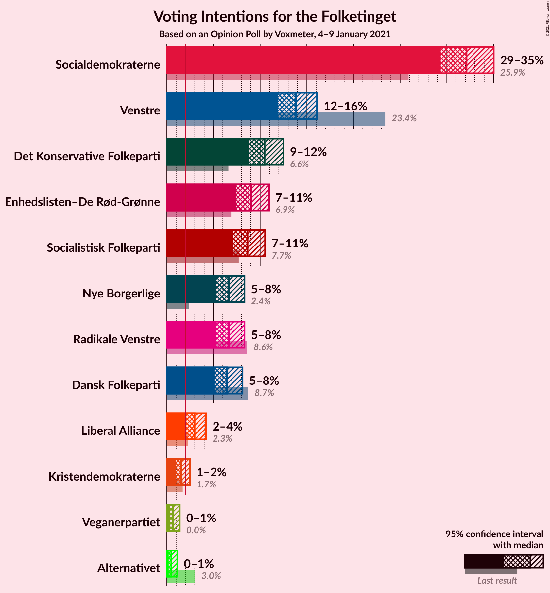

### Confidence Intervals

| Party | Last Result | Poll Result | 80% Confidence Interval | 90% Confidence Interval | 95% Confidence Interval | 99% Confidence Interval |
|:-----:|:-----------:|:-----------:|:-----------------------:|:-----------------------:|:-----------------------:|:-----------------------:|
| Socialdemokraterne | 25.9% | 32.1% | 30.3–34.0% |29.8–34.6% |29.3–35.0% |28.5–35.9% |
| Venstre | 23.4% | 13.8% | 12.5–15.3% |12.2–15.7% |11.9–16.1% |11.3–16.8% |
| Det Konservative Folkeparti | 6.6% | 10.5% | 9.3–11.8% |9.0–12.2% |8.8–12.5% |8.2–13.2% |
| Enhedslisten–De Rød-Grønne | 6.9% | 9.0% | 8.0–10.3% |7.7–10.6% |7.4–10.9% |7.0–11.6% |
| Socialistisk Folkeparti | 7.7% | 8.7% | 7.6–9.9% |7.3–10.2% |7.1–10.5% |6.6–11.1% |
| Radikale Venstre | 8.6% | 6.6% | 5.7–7.7% |5.5–8.0% |5.3–8.3% |4.9–8.9% |
| Nye Borgerlige | 2.4% | 6.6% | 5.7–7.7% |5.5–8.0% |5.3–8.3% |4.9–8.9% |
| Dansk Folkeparti | 8.7% | 6.4% | 5.6–7.5% |5.3–7.8% |5.1–8.1% |4.7–8.7% |
| Liberal Alliance | 2.3% | 3.0% | 2.4–3.8% |2.2–4.0% |2.1–4.2% |1.9–4.6% |
| Kristendemokraterne | 1.7% | 1.5% | 1.1–2.2% |1.0–2.3% |0.9–2.5% |0.8–2.8% |
| Veganerpartiet | 0.0% | 0.7% | 0.4–1.1% |0.4–1.3% |0.3–1.4% |0.2–1.6% |
| Alternativet | 3.0% | 0.5% | 0.3–0.9% |0.2–1.0% |0.2–1.1% |0.1–1.4% |

*Note:* The poll result column reflects the actual value used in the calculations. Published results may vary slightly, and in addition be rounded to fewer digits.

## Seats

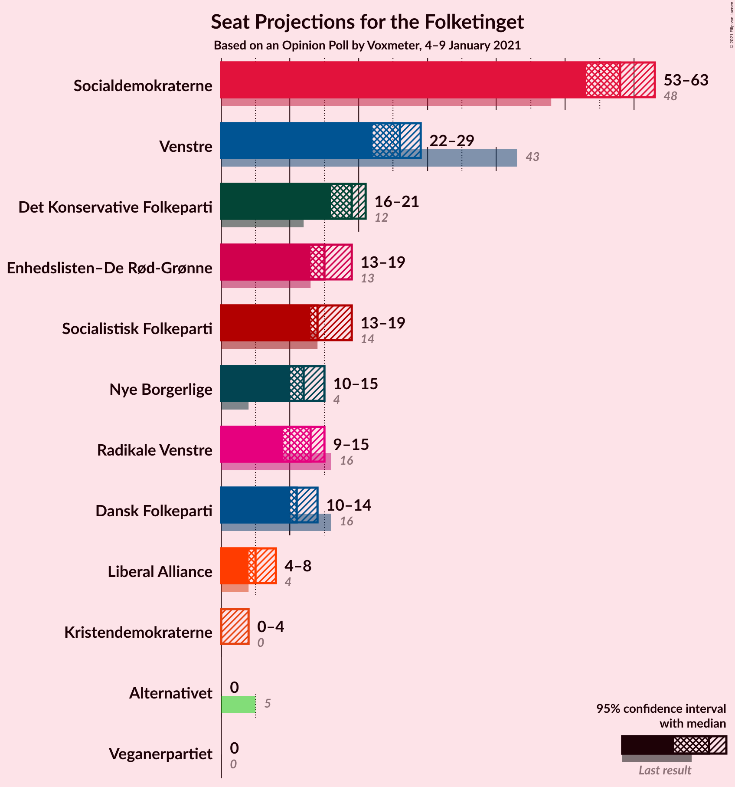

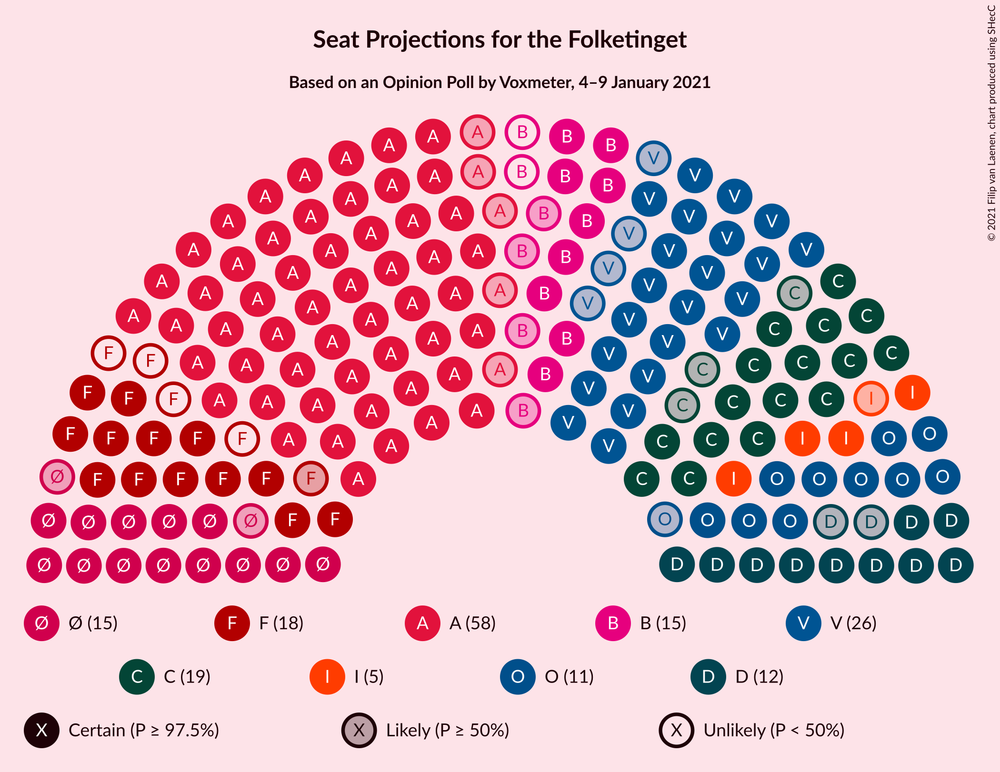

### Confidence Intervals

| Party | Last Result | Median | 80% Confidence Interval | 90% Confidence Interval | 95% Confidence Interval | 99% Confidence Interval |
|:-----:|:-----------:|:------:|:-----------------------:|:-----------------------:|:-----------------------:|:-----------------------:|
| <a href="#socialdemokraterne">Socialdemokraterne</a> | 48 | 58 | 54–60 |53–62 |53–63 |51–65 |
| <a href="#venstre">Venstre</a> | 43 | 26 | 23–27 |22–28 |22–29 |20–30 |
| <a href="#det-konservative-folkeparti">Det Konservative Folkeparti</a> | 12 | 19 | 17–20 |17–21 |16–21 |15–23 |
| <a href="#enhedslisten–de-rød-grønne">Enhedslisten–De Rød-Grønne</a> | 13 | 15 | 14–18 |14–18 |13–19 |13–21 |
| <a href="#socialistisk-folkeparti">Socialistisk Folkeparti</a> | 14 | 14 | 14–18 |14–18 |13–19 |12–21 |
| <a href="#radikale-venstre">Radikale Venstre</a> | 16 | 13 | 9–15 |9–15 |9–15 |9–17 |
| <a href="#nye-borgerlige">Nye Borgerlige</a> | 4 | 12 | 11–14 |10–15 |10–15 |9–16 |
| <a href="#dansk-folkeparti">Dansk Folkeparti</a> | 16 | 11 | 11–14 |10–14 |10–14 |9–15 |
| <a href="#liberal-alliance">Liberal Alliance</a> | 4 | 5 | 5–7 |4–8 |4–8 |0–8 |
| <a href="#kristendemokraterne">Kristendemokraterne</a> | 0 | 0 | 0 |0–4 |0–4 |0–5 |
| <a href="#veganerpartiet">Veganerpartiet</a> | 0 | 0 | 0 |0 |0 |0 |
| <a href="#alternativet">Alternativet</a> | 5 | 0 | 0 |0 |0 |0 |

### Socialdemokraterne

*For a full overview of the results for this party, see the [Socialdemokraterne](party-socialdemokraterne.html) page.*

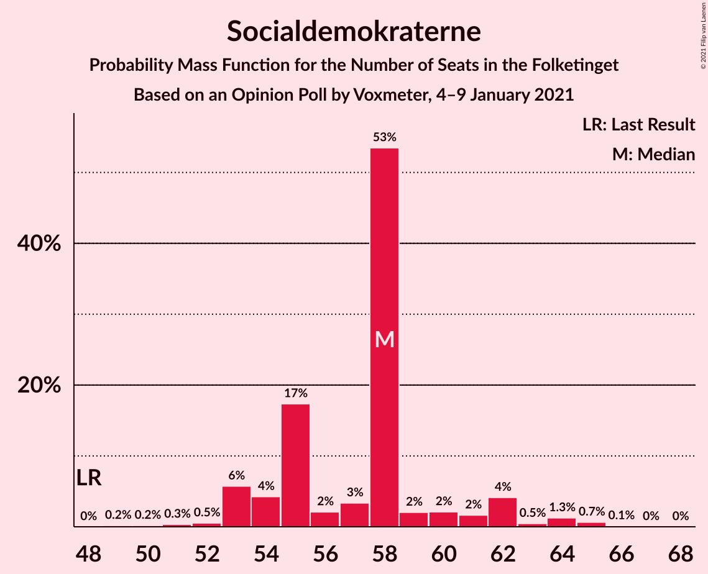

| Number of Seats | Probability | Accumulated | Special Marks |
|:---------------:|:-----------:|:-----------:|:-------------:|
| 48 | 0% | 100% | Last Result |
| 49 | 0.2% | 100% |  |
| 50 | 0.2% | 99.8% |  |
| 51 | 0.3% | 99.6% |  |
| 52 | 0.5% | 99.3% |  |
| 53 | 6% | 98.7% |  |
| 54 | 4% | 93% |  |
| 55 | 17% | 89% |  |
| 56 | 2% | 71% |  |
| 57 | 3% | 69% |  |
| 58 | 53% | 66% | Median |
| 59 | 2% | 12% |  |
| 60 | 2% | 10% |  |
| 61 | 2% | 8% |  |
| 62 | 4% | 7% |  |
| 63 | 0.5% | 3% |  |
| 64 | 1.3% | 2% |  |
| 65 | 0.7% | 0.8% |  |
| 66 | 0.1% | 0.1% |  |
| 67 | 0% | 0% |  |

### Venstre

*For a full overview of the results for this party, see the [Venstre](party-venstre.html) page.*

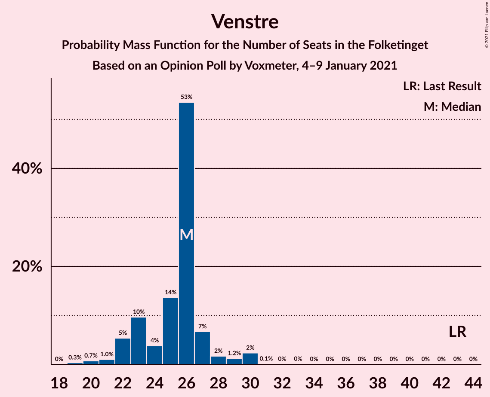

| Number of Seats | Probability | Accumulated | Special Marks |
|:---------------:|:-----------:|:-----------:|:-------------:|
| 19 | 0.3% | 100% |  |
| 20 | 0.7% | 99.7% |  |
| 21 | 1.0% | 99.0% |  |
| 22 | 5% | 98% |  |
| 23 | 10% | 93% |  |
| 24 | 4% | 83% |  |
| 25 | 14% | 79% |  |
| 26 | 53% | 66% | Median |
| 27 | 7% | 12% |  |
| 28 | 2% | 5% |  |
| 29 | 1.2% | 4% |  |
| 30 | 2% | 2% |  |
| 31 | 0.1% | 0.2% |  |
| 32 | 0% | 0.1% |  |
| 33 | 0% | 0.1% |  |
| 34 | 0% | 0% |  |
| 35 | 0% | 0% |  |
| 36 | 0% | 0% |  |
| 37 | 0% | 0% |  |
| 38 | 0% | 0% |  |
| 39 | 0% | 0% |  |
| 40 | 0% | 0% |  |
| 41 | 0% | 0% |  |
| 42 | 0% | 0% |  |
| 43 | 0% | 0% | Last Result |

### Det Konservative Folkeparti

*For a full overview of the results for this party, see the [Det Konservative Folkeparti](party-detkonservativefolkeparti.html) page.*

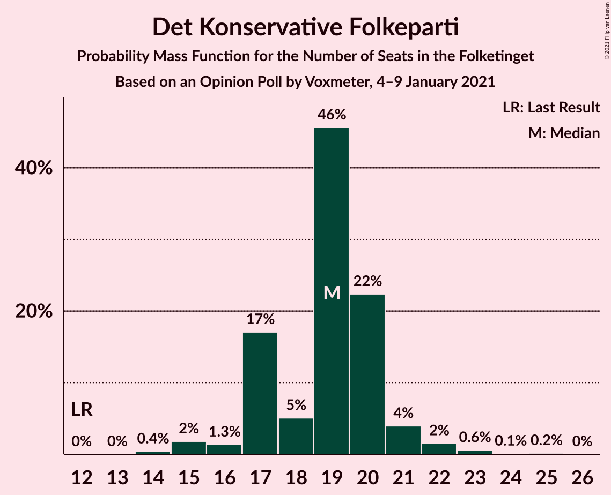

| Number of Seats | Probability | Accumulated | Special Marks |
|:---------------:|:-----------:|:-----------:|:-------------:|
| 12 | 0% | 100% | Last Result |
| 13 | 0% | 100% |  |
| 14 | 0.4% | 100% |  |
| 15 | 2% | 99.6% |  |
| 16 | 1.3% | 98% |  |
| 17 | 17% | 96% |  |
| 18 | 5% | 79% |  |
| 19 | 46% | 74% | Median |
| 20 | 22% | 29% |  |
| 21 | 4% | 6% |  |
| 22 | 2% | 2% |  |
| 23 | 0.6% | 0.8% |  |
| 24 | 0.1% | 0.3% |  |
| 25 | 0.2% | 0.2% |  |
| 26 | 0% | 0% |  |

### Enhedslisten–De Rød-Grønne

*For a full overview of the results for this party, see the [Enhedslisten–De Rød-Grønne](party-enhedslisten–derød-grønne.html) page.*

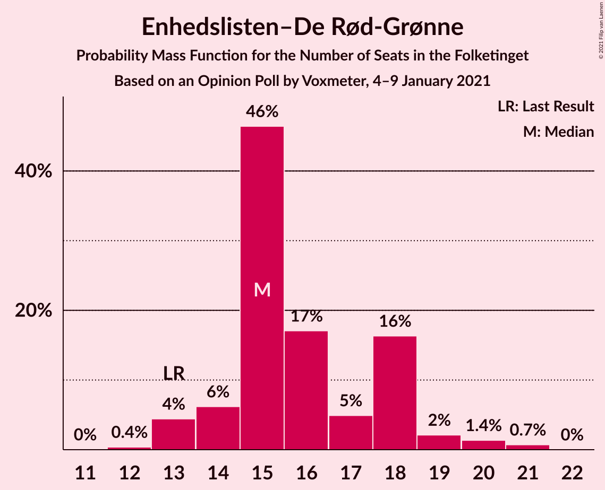

| Number of Seats | Probability | Accumulated | Special Marks |
|:---------------:|:-----------:|:-----------:|:-------------:|
| 12 | 0.4% | 100% |  |
| 13 | 4% | 99.6% | Last Result |
| 14 | 6% | 95% |  |
| 15 | 46% | 89% | Median |
| 16 | 17% | 43% |  |
| 17 | 5% | 25% |  |
| 18 | 16% | 21% |  |
| 19 | 2% | 4% |  |
| 20 | 1.4% | 2% |  |
| 21 | 0.7% | 0.8% |  |
| 22 | 0% | 0% |  |

### Socialistisk Folkeparti

*For a full overview of the results for this party, see the [Socialistisk Folkeparti](party-socialistiskfolkeparti.html) page.*

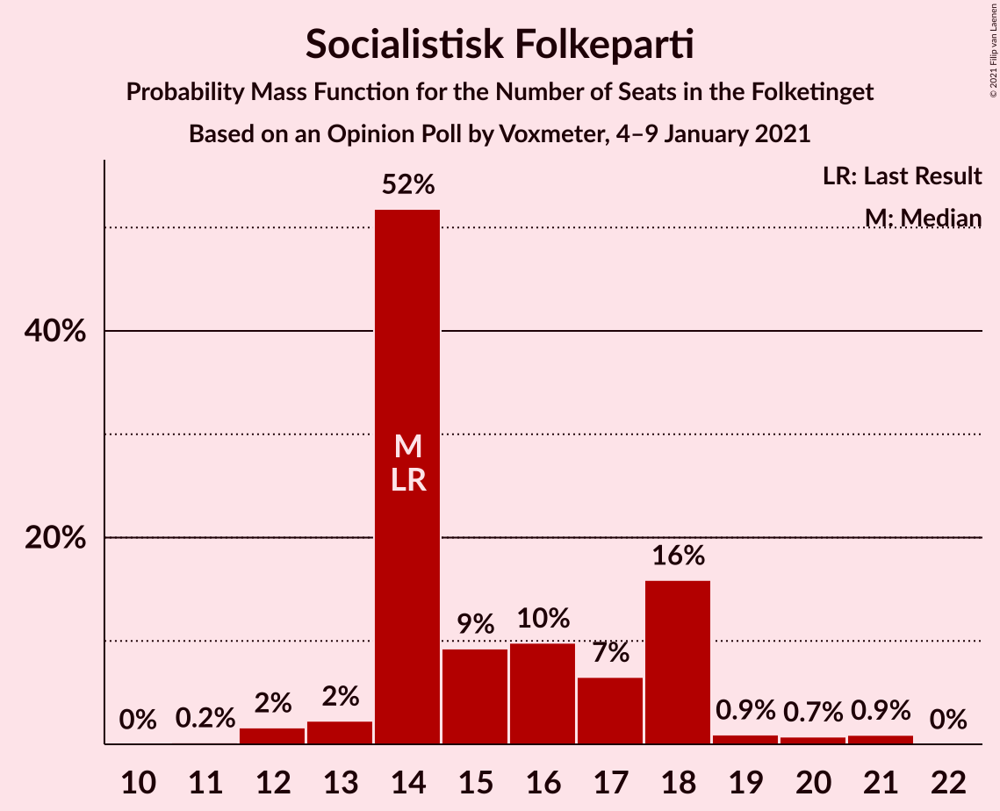

| Number of Seats | Probability | Accumulated | Special Marks |
|:---------------:|:-----------:|:-----------:|:-------------:|
| 11 | 0.2% | 100% |  |
| 12 | 2% | 99.8% |  |
| 13 | 2% | 98% |  |
| 14 | 52% | 96% | Last Result, Median |
| 15 | 9% | 44% |  |
| 16 | 10% | 35% |  |
| 17 | 7% | 25% |  |
| 18 | 16% | 19% |  |
| 19 | 0.9% | 3% |  |
| 20 | 0.7% | 2% |  |
| 21 | 0.9% | 0.9% |  |
| 22 | 0% | 0% |  |

### Radikale Venstre

*For a full overview of the results for this party, see the [Radikale Venstre](party-radikalevenstre.html) page.*

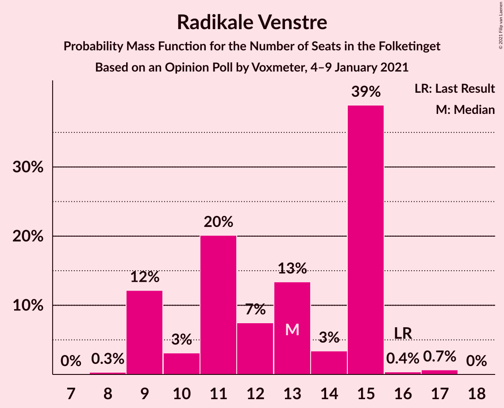

| Number of Seats | Probability | Accumulated | Special Marks |
|:---------------:|:-----------:|:-----------:|:-------------:|
| 8 | 0.3% | 100% |  |
| 9 | 12% | 99.7% |  |
| 10 | 3% | 88% |  |
| 11 | 20% | 84% |  |
| 12 | 7% | 64% |  |
| 13 | 13% | 57% | Median |
| 14 | 3% | 43% |  |
| 15 | 39% | 40% |  |
| 16 | 0.4% | 1.1% | Last Result |
| 17 | 0.7% | 0.7% |  |
| 18 | 0% | 0% |  |

### Nye Borgerlige

*For a full overview of the results for this party, see the [Nye Borgerlige](party-nyeborgerlige.html) page.*

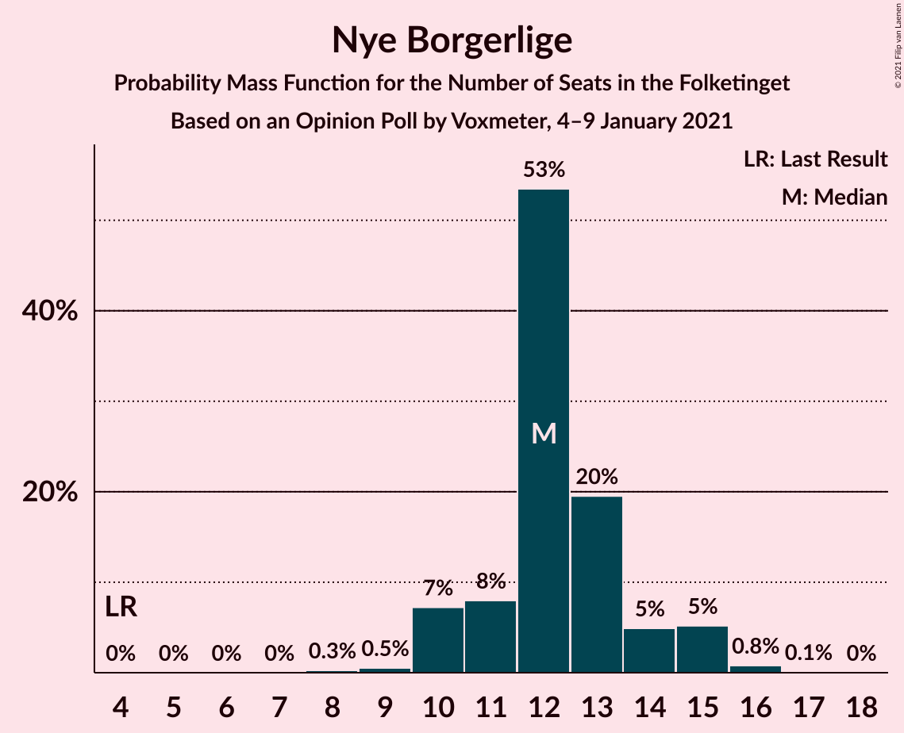

| Number of Seats | Probability | Accumulated | Special Marks |
|:---------------:|:-----------:|:-----------:|:-------------:|
| 4 | 0% | 100% | Last Result |
| 5 | 0% | 100% |  |
| 6 | 0% | 100% |  |
| 7 | 0% | 100% |  |
| 8 | 0.3% | 100% |  |
| 9 | 0.5% | 99.7% |  |
| 10 | 7% | 99.2% |  |
| 11 | 8% | 92% |  |
| 12 | 53% | 84% | Median |
| 13 | 20% | 31% |  |
| 14 | 5% | 11% |  |
| 15 | 5% | 6% |  |
| 16 | 0.8% | 0.9% |  |
| 17 | 0.1% | 0.1% |  |
| 18 | 0% | 0% |  |

### Dansk Folkeparti

*For a full overview of the results for this party, see the [Dansk Folkeparti](party-danskfolkeparti.html) page.*

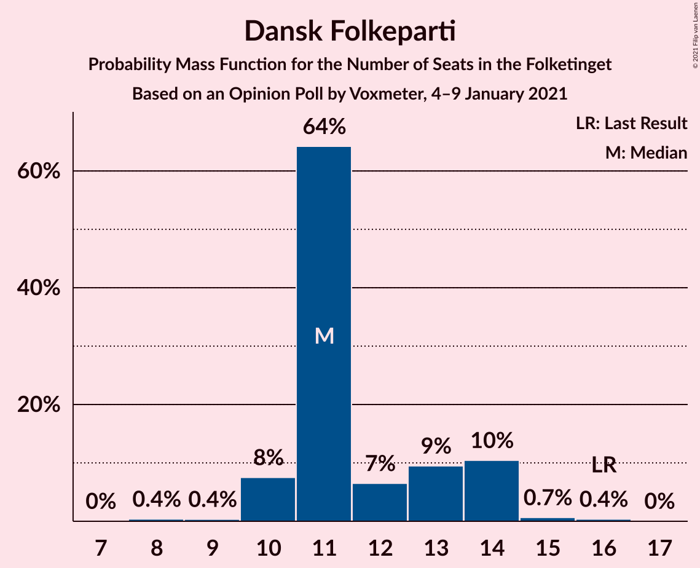

| Number of Seats | Probability | Accumulated | Special Marks |
|:---------------:|:-----------:|:-----------:|:-------------:|
| 8 | 0.4% | 100% |  |
| 9 | 0.4% | 99.6% |  |
| 10 | 8% | 99.2% |  |
| 11 | 64% | 92% | Median |
| 12 | 7% | 28% |  |
| 13 | 9% | 21% |  |
| 14 | 10% | 12% |  |
| 15 | 0.7% | 1.1% |  |
| 16 | 0.4% | 0.4% | Last Result |
| 17 | 0% | 0% |  |

### Liberal Alliance

*For a full overview of the results for this party, see the [Liberal Alliance](party-liberalalliance.html) page.*

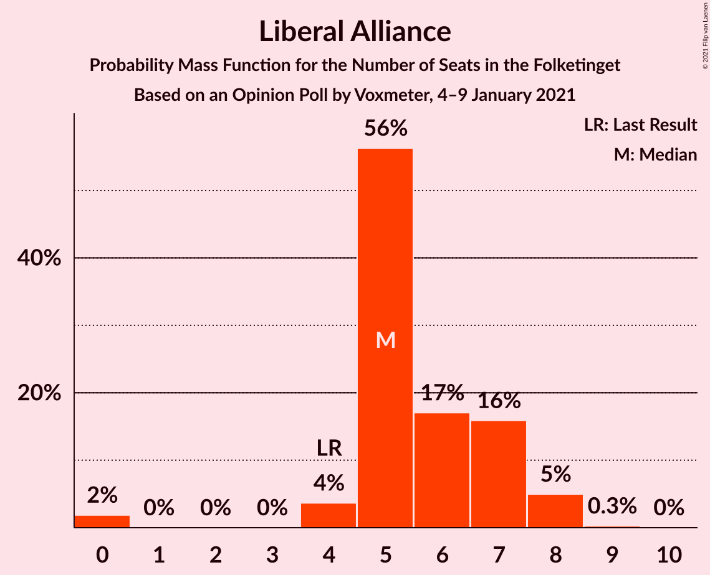

| Number of Seats | Probability | Accumulated | Special Marks |
|:---------------:|:-----------:|:-----------:|:-------------:|
| 0 | 2% | 100% |  |
| 1 | 0% | 98% |  |
| 2 | 0% | 98% |  |
| 3 | 0% | 98% |  |
| 4 | 4% | 98% | Last Result |
| 5 | 56% | 94% | Median |
| 6 | 17% | 38% |  |
| 7 | 16% | 21% |  |
| 8 | 5% | 5% |  |
| 9 | 0.3% | 0.3% |  |
| 10 | 0% | 0% |  |

### Kristendemokraterne

*For a full overview of the results for this party, see the [Kristendemokraterne](party-kristendemokraterne.html) page.*

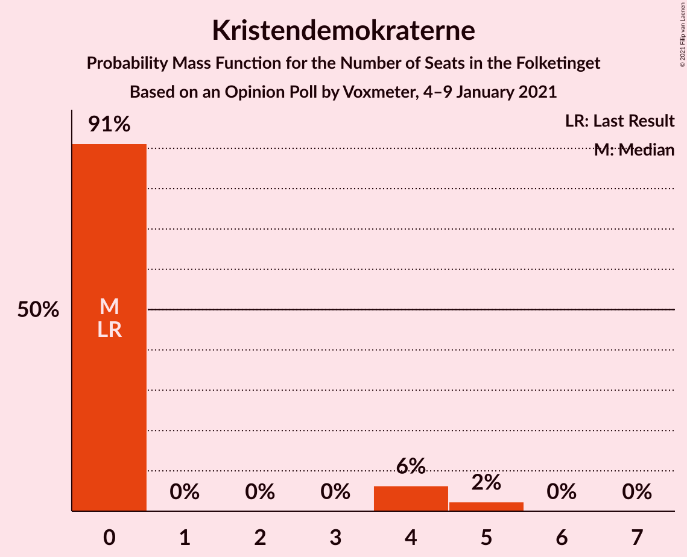

| Number of Seats | Probability | Accumulated | Special Marks |
|:---------------:|:-----------:|:-----------:|:-------------:|
| 0 | 91% | 100% | Last Result, Median |
| 1 | 0% | 9% |  |
| 2 | 0% | 9% |  |
| 3 | 0% | 9% |  |
| 4 | 6% | 9% |  |
| 5 | 2% | 2% |  |
| 6 | 0% | 0.1% |  |
| 7 | 0% | 0% |  |

### Veganerpartiet

*For a full overview of the results for this party, see the [Veganerpartiet](party-veganerpartiet.html) page.*

| Number of Seats | Probability | Accumulated | Special Marks |
|:---------------:|:-----------:|:-----------:|:-------------:|
| 0 | 100% | 100% | Last Result, Median |

### Alternativet

*For a full overview of the results for this party, see the [Alternativet](party-alternativet.html) page.*

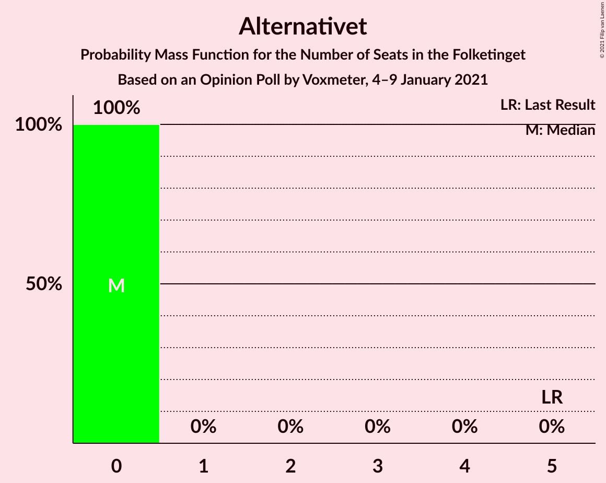

| Number of Seats | Probability | Accumulated | Special Marks |
|:---------------:|:-----------:|:-----------:|:-------------:|
| 0 | 100% | 100% | Median |
| 1 | 0% | 0% |  |
| 2 | 0% | 0% |  |
| 3 | 0% | 0% |  |
| 4 | 0% | 0% |  |
| 5 | 0% | 0% | Last Result |

## Coalitions

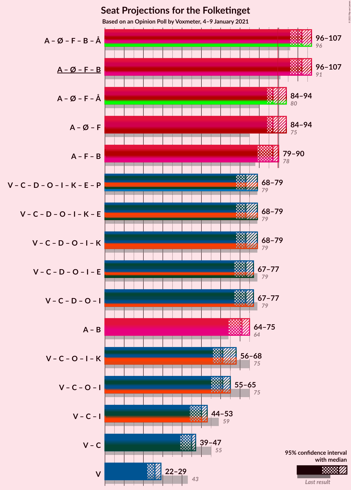

### Confidence Intervals

| Coalition | Last Result | Median | Majority? | 80% Confidence Interval | 90% Confidence Interval | 95% Confidence Interval | 99% Confidence Interval |
|:---------:|:-----------:|:------:|:---------:|:-----------------------:|:-----------------------:|:-----------------------:|:-----------------------:|
| Socialdemokraterne – Enhedslisten–De Rød-Grønne – Socialistisk Folkeparti – Radikale Venstre – Alternativet | 96 | 102 | 100% | 98–103 | 98–106 | 96–107 | 93–108 |
| Socialdemokraterne – Enhedslisten–De Rød-Grønne – Socialistisk Folkeparti – Radikale Venstre | 91 | 102 | 100% | 98–103 | 98–106 | 96–107 | 93–108 |
| Socialdemokraterne – Enhedslisten–De Rød-Grønne – Socialistisk Folkeparti – Alternativet | 80 | 87 | 31% | 86–91 | 85–93 | 84–94 | 81–96 |
| Socialdemokraterne – Enhedslisten–De Rød-Grønne – Socialistisk Folkeparti | 75 | 87 | 31% | 86–91 | 85–93 | 84–94 | 81–96 |
| Socialdemokraterne – Socialistisk Folkeparti – Radikale Venstre | 78 | 87 | 4% | 82–88 | 80–89 | 79–90 | 79–93 |
| Venstre – Det Konservative Folkeparti – Nye Borgerlige – Dansk Folkeparti – Liberal Alliance – Kristendemokraterne | 79 | 73 | 0% | 72–77 | 69–77 | 68–79 | 67–82 |
| Venstre – Det Konservative Folkeparti – Nye Borgerlige – Dansk Folkeparti – Liberal Alliance | 79 | 73 | 0% | 71–76 | 68–77 | 67–77 | 66–80 |
| Socialdemokraterne – Radikale Venstre | 64 | 71 | 0% | 64–73 | 64–74 | 64–75 | 63–77 |
| Venstre – Det Konservative Folkeparti – Dansk Folkeparti – Liberal Alliance – Kristendemokraterne | 75 | 61 | 0% | 60–64 | 57–65 | 56–68 | 53–69 |
| Venstre – Det Konservative Folkeparti – Dansk Folkeparti – Liberal Alliance | 75 | 61 | 0% | 58–64 | 56–64 | 55–65 | 53–68 |
| Venstre – Det Konservative Folkeparti – Liberal Alliance | 59 | 50 | 0% | 46–52 | 46–53 | 44–53 | 42–55 |
| Venstre – Det Konservative Folkeparti | 55 | 45 | 0% | 42–46 | 40–47 | 39–47 | 38–50 |
| Venstre | 43 | 26 | 0% | 23–27 | 22–28 | 22–29 | 20–30 |

### Socialdemokraterne – Enhedslisten–De Rød-Grønne – Socialistisk Folkeparti – Radikale Venstre – Alternativet

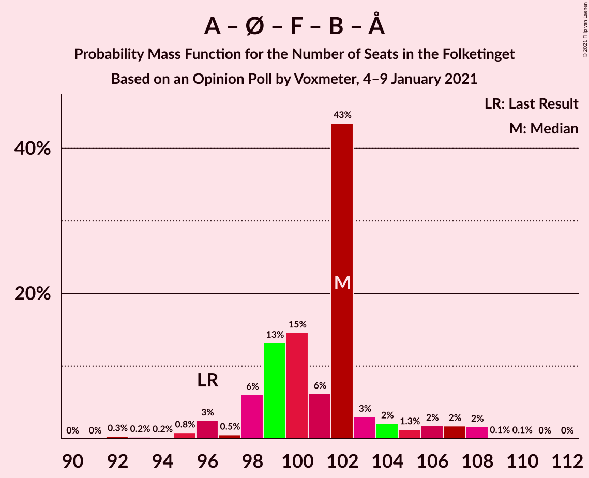

| Number of Seats | Probability | Accumulated | Special Marks |
|:---------------:|:-----------:|:-----------:|:-------------:|
| 92 | 0.3% | 100% |  |
| 93 | 0.2% | 99.6% |  |
| 94 | 0.2% | 99.4% |  |
| 95 | 0.8% | 99.2% |  |
| 96 | 3% | 98% | Last Result |
| 97 | 0.5% | 96% |  |
| 98 | 6% | 95% |  |
| 99 | 13% | 89% |  |
| 100 | 15% | 76% | Median |
| 101 | 6% | 61% |  |
| 102 | 43% | 55% |  |
| 103 | 3% | 12% |  |
| 104 | 2% | 9% |  |
| 105 | 1.3% | 7% |  |
| 106 | 2% | 5% |  |
| 107 | 2% | 4% |  |
| 108 | 2% | 2% |  |
| 109 | 0.1% | 0.2% |  |
| 110 | 0.1% | 0.1% |  |
| 111 | 0% | 0% |  |

### Socialdemokraterne – Enhedslisten–De Rød-Grønne – Socialistisk Folkeparti – Radikale Venstre

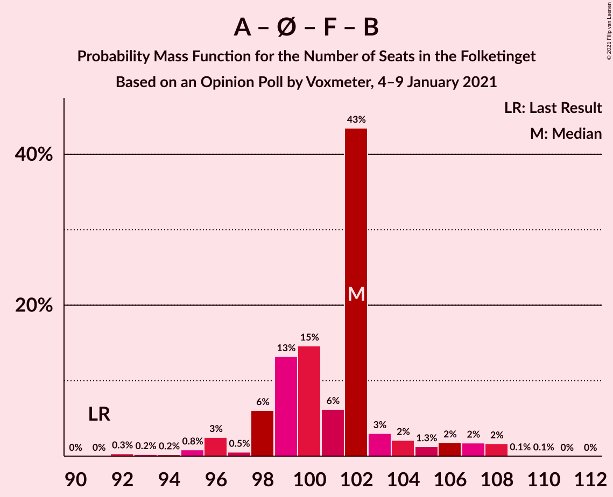

| Number of Seats | Probability | Accumulated | Special Marks |
|:---------------:|:-----------:|:-----------:|:-------------:|
| 91 | 0% | 100% | Last Result |
| 92 | 0.3% | 100% |  |
| 93 | 0.2% | 99.6% |  |
| 94 | 0.2% | 99.4% |  |
| 95 | 0.8% | 99.2% |  |
| 96 | 3% | 98% |  |
| 97 | 0.5% | 96% |  |
| 98 | 6% | 95% |  |
| 99 | 13% | 89% |  |
| 100 | 15% | 76% | Median |
| 101 | 6% | 61% |  |
| 102 | 43% | 55% |  |
| 103 | 3% | 12% |  |
| 104 | 2% | 9% |  |
| 105 | 1.3% | 7% |  |
| 106 | 2% | 5% |  |
| 107 | 2% | 4% |  |
| 108 | 2% | 2% |  |
| 109 | 0.1% | 0.2% |  |
| 110 | 0.1% | 0.1% |  |
| 111 | 0% | 0% |  |

### Socialdemokraterne – Enhedslisten–De Rød-Grønne – Socialistisk Folkeparti – Alternativet

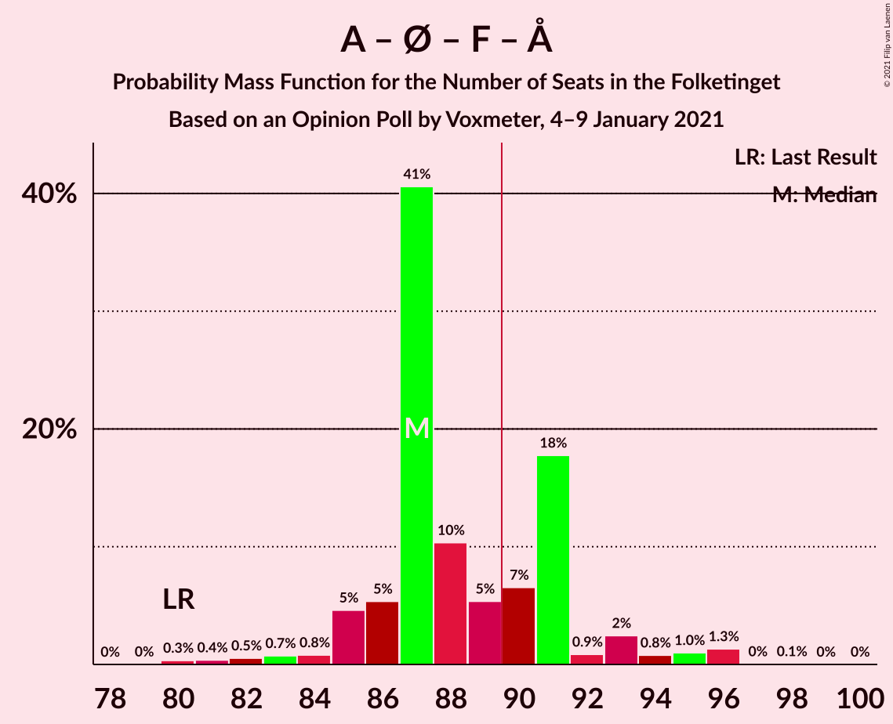

| Number of Seats | Probability | Accumulated | Special Marks |
|:---------------:|:-----------:|:-----------:|:-------------:|
| 80 | 0.3% | 100% | Last Result |
| 81 | 0.4% | 99.6% |  |
| 82 | 0.5% | 99.2% |  |
| 83 | 0.7% | 98.7% |  |
| 84 | 0.8% | 98% |  |
| 85 | 5% | 97% |  |
| 86 | 5% | 93% |  |
| 87 | 41% | 87% | Median |
| 88 | 10% | 47% |  |
| 89 | 5% | 36% |  |
| 90 | 7% | 31% | Majority |
| 91 | 18% | 24% |  |
| 92 | 0.9% | 7% |  |
| 93 | 2% | 6% |  |
| 94 | 0.8% | 3% |  |
| 95 | 1.0% | 2% |  |
| 96 | 1.3% | 1.5% |  |
| 97 | 0% | 0.1% |  |
| 98 | 0.1% | 0.1% |  |
| 99 | 0% | 0% |  |

### Socialdemokraterne – Enhedslisten–De Rød-Grønne – Socialistisk Folkeparti

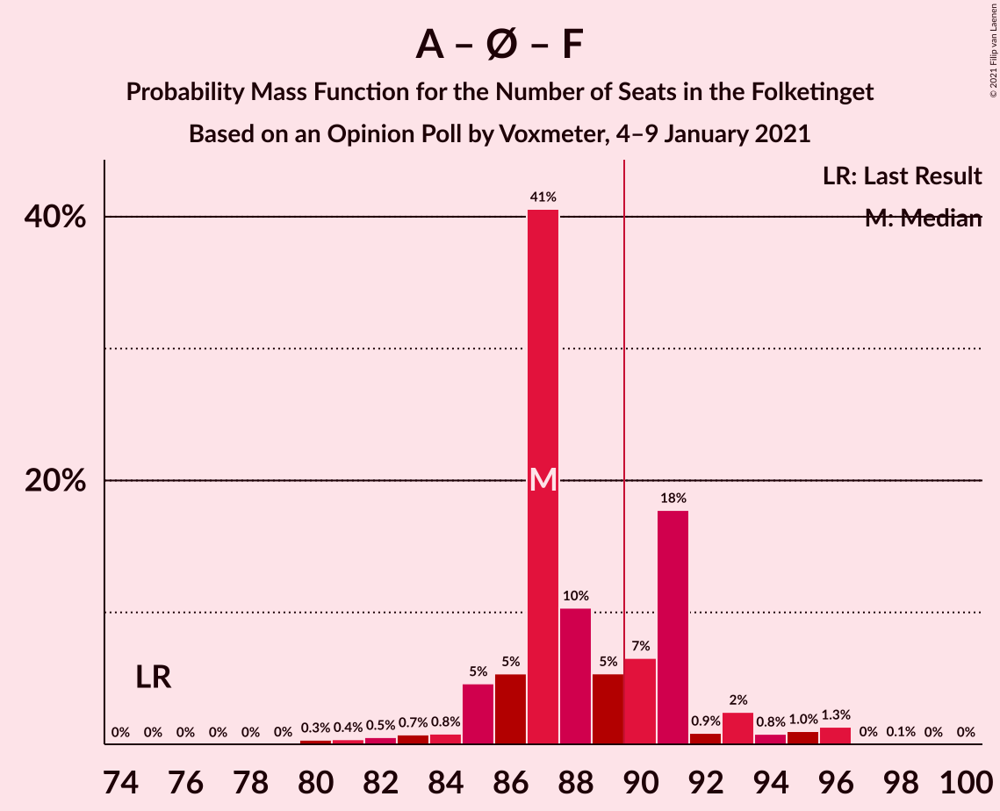

| Number of Seats | Probability | Accumulated | Special Marks |
|:---------------:|:-----------:|:-----------:|:-------------:|
| 75 | 0% | 100% | Last Result |
| 76 | 0% | 100% |  |
| 77 | 0% | 100% |  |
| 78 | 0% | 100% |  |
| 79 | 0% | 100% |  |
| 80 | 0.3% | 100% |  |
| 81 | 0.4% | 99.6% |  |
| 82 | 0.5% | 99.2% |  |
| 83 | 0.7% | 98.7% |  |
| 84 | 0.8% | 98% |  |
| 85 | 5% | 97% |  |
| 86 | 5% | 93% |  |
| 87 | 41% | 87% | Median |
| 88 | 10% | 47% |  |
| 89 | 5% | 36% |  |
| 90 | 7% | 31% | Majority |
| 91 | 18% | 24% |  |
| 92 | 0.9% | 7% |  |
| 93 | 2% | 6% |  |
| 94 | 0.8% | 3% |  |
| 95 | 1.0% | 2% |  |
| 96 | 1.3% | 1.5% |  |
| 97 | 0% | 0.1% |  |
| 98 | 0.1% | 0.1% |  |
| 99 | 0% | 0% |  |

### Socialdemokraterne – Socialistisk Folkeparti – Radikale Venstre

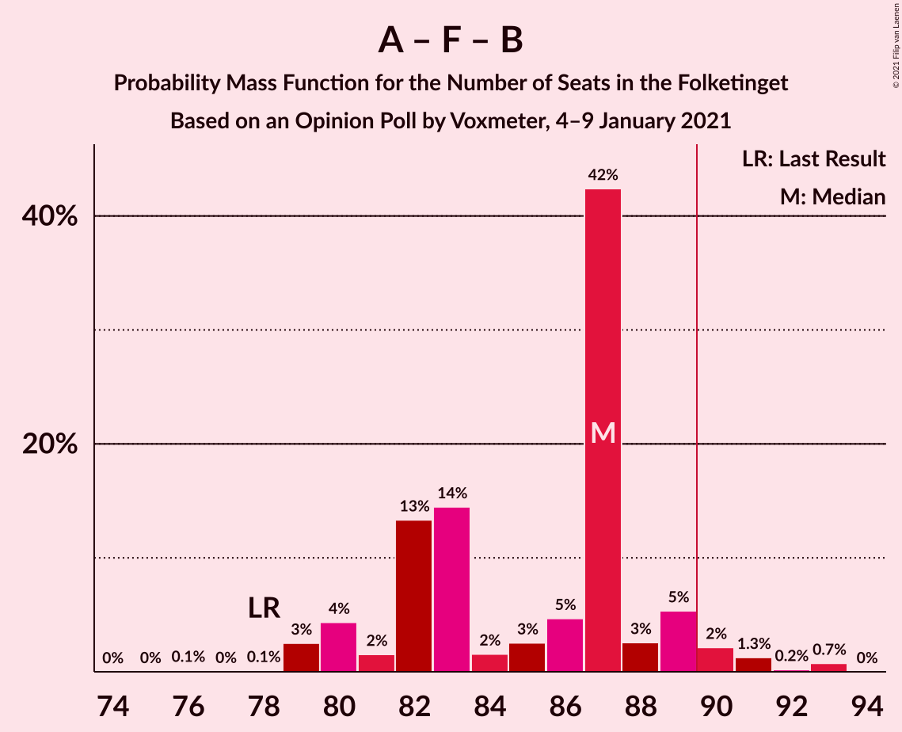

| Number of Seats | Probability | Accumulated | Special Marks |
|:---------------:|:-----------:|:-----------:|:-------------:|
| 76 | 0.1% | 100% |  |
| 77 | 0% | 99.8% |  |
| 78 | 0.1% | 99.8% | Last Result |
| 79 | 3% | 99.7% |  |
| 80 | 4% | 97% |  |
| 81 | 2% | 93% |  |
| 82 | 13% | 91% |  |
| 83 | 14% | 78% |  |
| 84 | 2% | 63% |  |
| 85 | 3% | 62% | Median |
| 86 | 5% | 59% |  |
| 87 | 42% | 55% |  |
| 88 | 3% | 12% |  |
| 89 | 5% | 10% |  |
| 90 | 2% | 4% | Majority |
| 91 | 1.3% | 2% |  |
| 92 | 0.2% | 1.0% |  |
| 93 | 0.7% | 0.8% |  |
| 94 | 0% | 0% |  |

### Venstre – Det Konservative Folkeparti – Nye Borgerlige – Dansk Folkeparti – Liberal Alliance – Kristendemokraterne

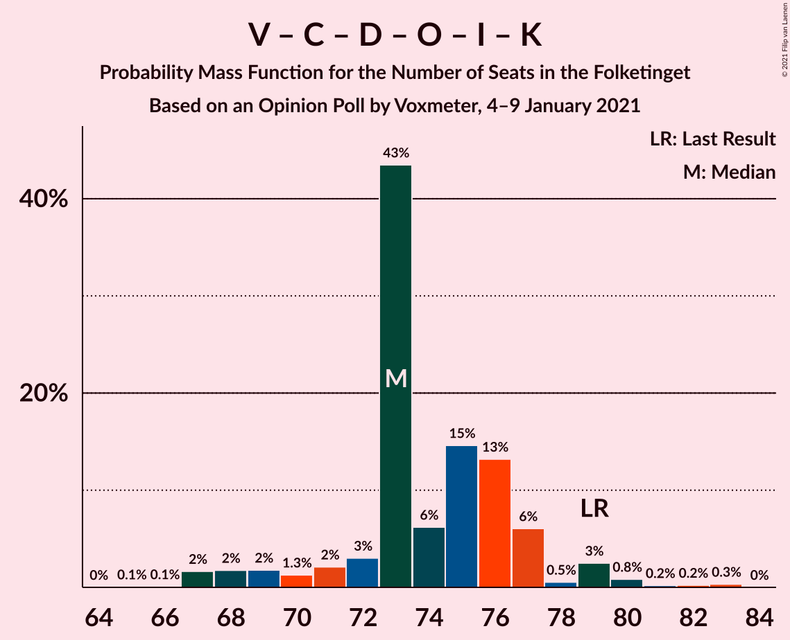

| Number of Seats | Probability | Accumulated | Special Marks |
|:---------------:|:-----------:|:-----------:|:-------------:|
| 65 | 0.1% | 100% |  |
| 66 | 0.1% | 99.9% |  |
| 67 | 2% | 99.8% |  |
| 68 | 2% | 98% |  |
| 69 | 2% | 96% |  |
| 70 | 1.3% | 95% |  |
| 71 | 2% | 93% |  |
| 72 | 3% | 91% |  |
| 73 | 43% | 88% | Median |
| 74 | 6% | 45% |  |
| 75 | 15% | 39% |  |
| 76 | 13% | 24% |  |
| 77 | 6% | 11% |  |
| 78 | 0.5% | 5% |  |
| 79 | 3% | 4% | Last Result |
| 80 | 0.8% | 2% |  |
| 81 | 0.2% | 0.8% |  |
| 82 | 0.2% | 0.6% |  |
| 83 | 0.3% | 0.4% |  |
| 84 | 0% | 0% |  |

### Venstre – Det Konservative Folkeparti – Nye Borgerlige – Dansk Folkeparti – Liberal Alliance

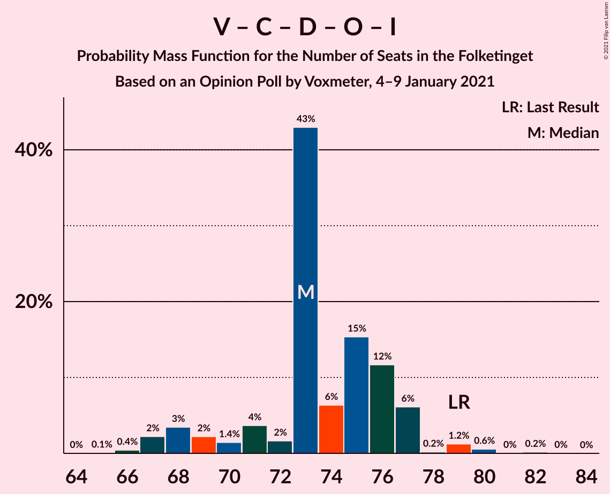

| Number of Seats | Probability | Accumulated | Special Marks |
|:---------------:|:-----------:|:-----------:|:-------------:|
| 65 | 0.1% | 100% |  |
| 66 | 0.4% | 99.9% |  |
| 67 | 2% | 99.4% |  |
| 68 | 3% | 97% |  |
| 69 | 2% | 94% |  |
| 70 | 1.4% | 92% |  |
| 71 | 4% | 90% |  |
| 72 | 2% | 86% |  |
| 73 | 43% | 85% | Median |
| 74 | 6% | 42% |  |
| 75 | 15% | 35% |  |
| 76 | 12% | 20% |  |
| 77 | 6% | 8% |  |
| 78 | 0.2% | 2% |  |
| 79 | 1.2% | 2% | Last Result |
| 80 | 0.6% | 0.8% |  |
| 81 | 0% | 0.3% |  |
| 82 | 0.2% | 0.2% |  |
| 83 | 0% | 0% |  |

### Socialdemokraterne – Radikale Venstre

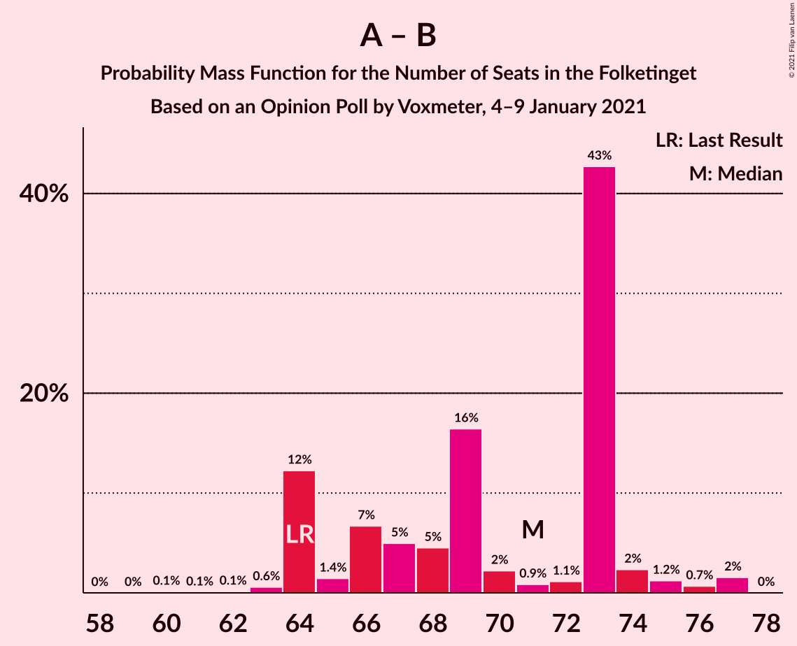

| Number of Seats | Probability | Accumulated | Special Marks |
|:---------------:|:-----------:|:-----------:|:-------------:|
| 60 | 0.1% | 100% |  |
| 61 | 0.1% | 99.9% |  |
| 62 | 0.1% | 99.8% |  |
| 63 | 0.6% | 99.7% |  |
| 64 | 12% | 99.1% | Last Result |
| 65 | 1.4% | 87% |  |
| 66 | 7% | 85% |  |
| 67 | 5% | 79% |  |
| 68 | 5% | 74% |  |
| 69 | 16% | 69% |  |
| 70 | 2% | 53% |  |
| 71 | 0.9% | 51% | Median |
| 72 | 1.1% | 50% |  |
| 73 | 43% | 49% |  |
| 74 | 2% | 6% |  |
| 75 | 1.2% | 3% |  |
| 76 | 0.7% | 2% |  |
| 77 | 2% | 2% |  |
| 78 | 0% | 0% |  |

### Venstre – Det Konservative Folkeparti – Dansk Folkeparti – Liberal Alliance – Kristendemokraterne

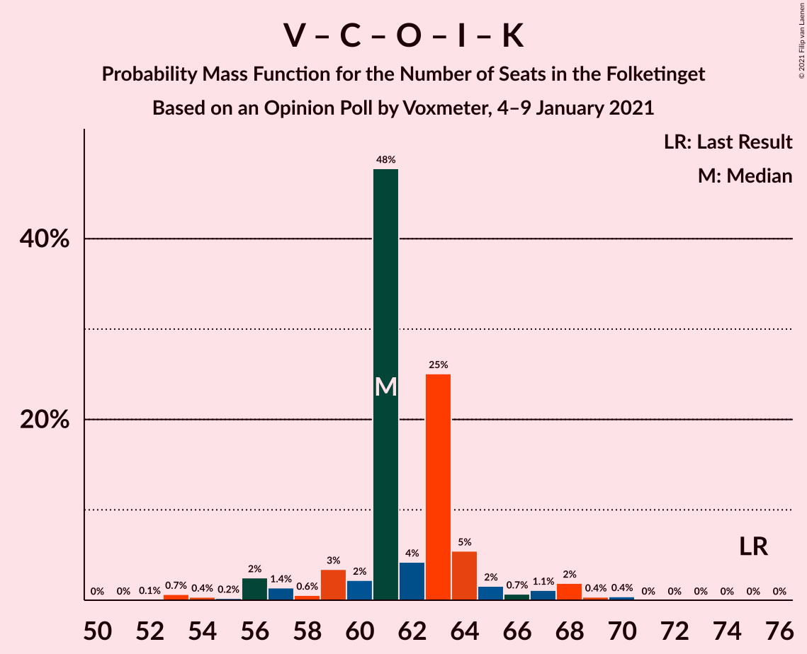

| Number of Seats | Probability | Accumulated | Special Marks |
|:---------------:|:-----------:|:-----------:|:-------------:|
| 52 | 0.1% | 100% |  |
| 53 | 0.7% | 99.9% |  |
| 54 | 0.4% | 99.2% |  |
| 55 | 0.2% | 98.9% |  |
| 56 | 2% | 98.7% |  |
| 57 | 1.4% | 96% |  |
| 58 | 0.6% | 95% |  |
| 59 | 3% | 94% |  |
| 60 | 2% | 91% |  |
| 61 | 48% | 89% | Median |
| 62 | 4% | 41% |  |
| 63 | 25% | 37% |  |
| 64 | 5% | 12% |  |
| 65 | 2% | 6% |  |
| 66 | 0.7% | 4% |  |
| 67 | 1.1% | 4% |  |
| 68 | 2% | 3% |  |
| 69 | 0.4% | 0.8% |  |
| 70 | 0.4% | 0.4% |  |
| 71 | 0% | 0% |  |
| 72 | 0% | 0% |  |
| 73 | 0% | 0% |  |
| 74 | 0% | 0% |  |
| 75 | 0% | 0% | Last Result |

### Venstre – Det Konservative Folkeparti – Dansk Folkeparti – Liberal Alliance

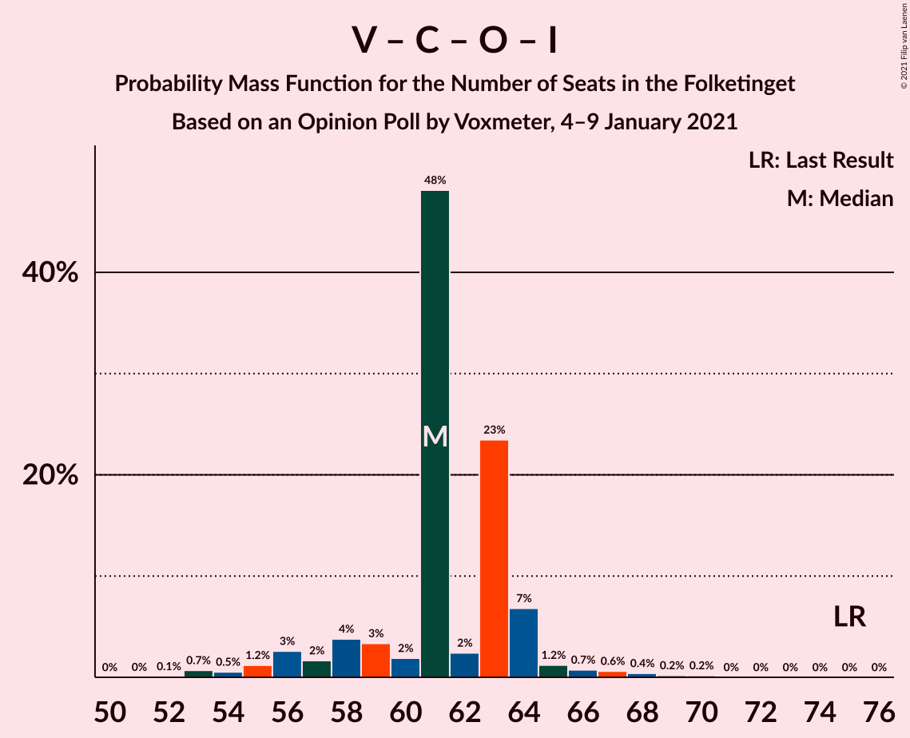

| Number of Seats | Probability | Accumulated | Special Marks |
|:---------------:|:-----------:|:-----------:|:-------------:|
| 52 | 0.1% | 100% |  |
| 53 | 0.7% | 99.9% |  |
| 54 | 0.5% | 99.2% |  |
| 55 | 1.2% | 98.7% |  |
| 56 | 3% | 97% |  |
| 57 | 2% | 95% |  |
| 58 | 4% | 93% |  |
| 59 | 3% | 89% |  |
| 60 | 2% | 86% |  |
| 61 | 48% | 84% | Median |
| 62 | 2% | 36% |  |
| 63 | 23% | 34% |  |
| 64 | 7% | 10% |  |
| 65 | 1.2% | 3% |  |
| 66 | 0.7% | 2% |  |
| 67 | 0.6% | 1.4% |  |
| 68 | 0.4% | 0.8% |  |
| 69 | 0.2% | 0.4% |  |
| 70 | 0.2% | 0.2% |  |
| 71 | 0% | 0% |  |
| 72 | 0% | 0% |  |
| 73 | 0% | 0% |  |
| 74 | 0% | 0% |  |
| 75 | 0% | 0% | Last Result |

### Venstre – Det Konservative Folkeparti – Liberal Alliance

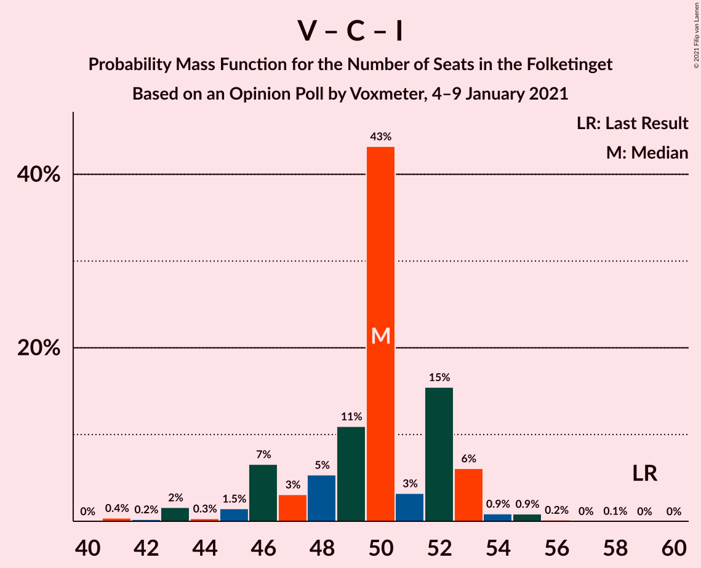

| Number of Seats | Probability | Accumulated | Special Marks |
|:---------------:|:-----------:|:-----------:|:-------------:|
| 41 | 0.4% | 100% |  |
| 42 | 0.2% | 99.6% |  |
| 43 | 2% | 99.4% |  |
| 44 | 0.3% | 98% |  |
| 45 | 1.5% | 97% |  |
| 46 | 7% | 96% |  |
| 47 | 3% | 89% |  |
| 48 | 5% | 86% |  |
| 49 | 11% | 81% |  |
| 50 | 43% | 70% | Median |
| 51 | 3% | 27% |  |
| 52 | 15% | 24% |  |
| 53 | 6% | 8% |  |
| 54 | 0.9% | 2% |  |
| 55 | 0.9% | 1.1% |  |
| 56 | 0.2% | 0.3% |  |
| 57 | 0% | 0.1% |  |
| 58 | 0.1% | 0.1% |  |
| 59 | 0% | 0% | Last Result |

### Venstre – Det Konservative Folkeparti

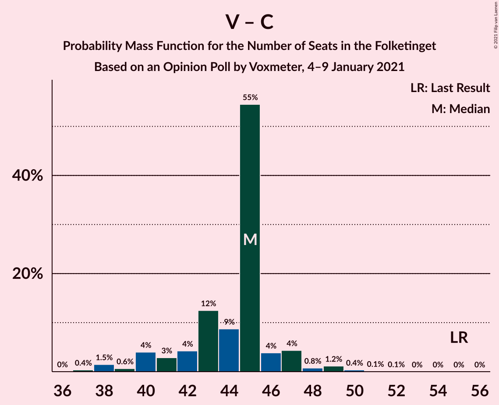

| Number of Seats | Probability | Accumulated | Special Marks |
|:---------------:|:-----------:|:-----------:|:-------------:|
| 37 | 0.4% | 100% |  |
| 38 | 1.5% | 99.6% |  |
| 39 | 0.6% | 98% |  |
| 40 | 4% | 97% |  |
| 41 | 3% | 93% |  |
| 42 | 4% | 91% |  |
| 43 | 12% | 86% |  |
| 44 | 9% | 74% |  |
| 45 | 55% | 65% | Median |
| 46 | 4% | 11% |  |
| 47 | 4% | 7% |  |
| 48 | 0.8% | 2% |  |
| 49 | 1.2% | 2% |  |
| 50 | 0.4% | 0.5% |  |
| 51 | 0.1% | 0.2% |  |
| 52 | 0.1% | 0.1% |  |
| 53 | 0% | 0% |  |
| 54 | 0% | 0% |  |
| 55 | 0% | 0% | Last Result |

### Venstre

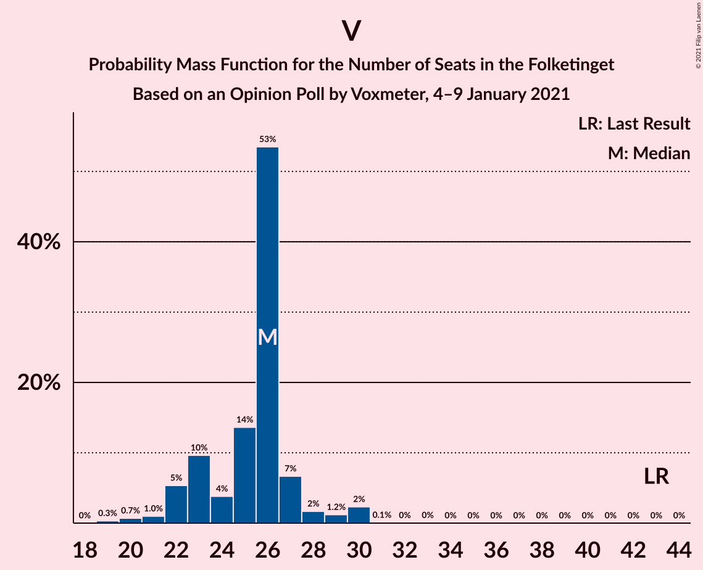

| Number of Seats | Probability | Accumulated | Special Marks |
|:---------------:|:-----------:|:-----------:|:-------------:|
| 19 | 0.3% | 100% |  |
| 20 | 0.7% | 99.7% |  |
| 21 | 1.0% | 99.0% |  |
| 22 | 5% | 98% |  |
| 23 | 10% | 93% |  |
| 24 | 4% | 83% |  |
| 25 | 14% | 79% |  |
| 26 | 53% | 66% | Median |
| 27 | 7% | 12% |  |
| 28 | 2% | 5% |  |
| 29 | 1.2% | 4% |  |
| 30 | 2% | 2% |  |
| 31 | 0.1% | 0.2% |  |
| 32 | 0% | 0.1% |  |
| 33 | 0% | 0.1% |  |
| 34 | 0% | 0% |  |
| 35 | 0% | 0% |  |
| 36 | 0% | 0% |  |
| 37 | 0% | 0% |  |
| 38 | 0% | 0% |  |
| 39 | 0% | 0% |  |
| 40 | 0% | 0% |  |
| 41 | 0% | 0% |  |
| 42 | 0% | 0% |  |
| 43 | 0% | 0% | Last Result |

## Technical Information

### Opinion Poll

+ **Polling firm:** Voxmeter
+ **Commissioner(s):** —
+ **Fieldwork period:** 4–9 January 2021

### Calculations

+ **Sample size:** 1040
+ **Simulations done:** 1,048,576
+ **Error estimate:** 1.83%

