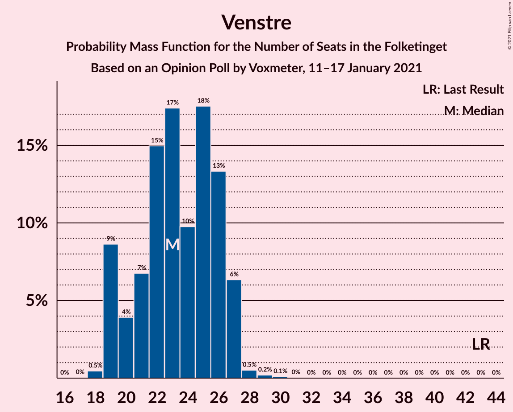
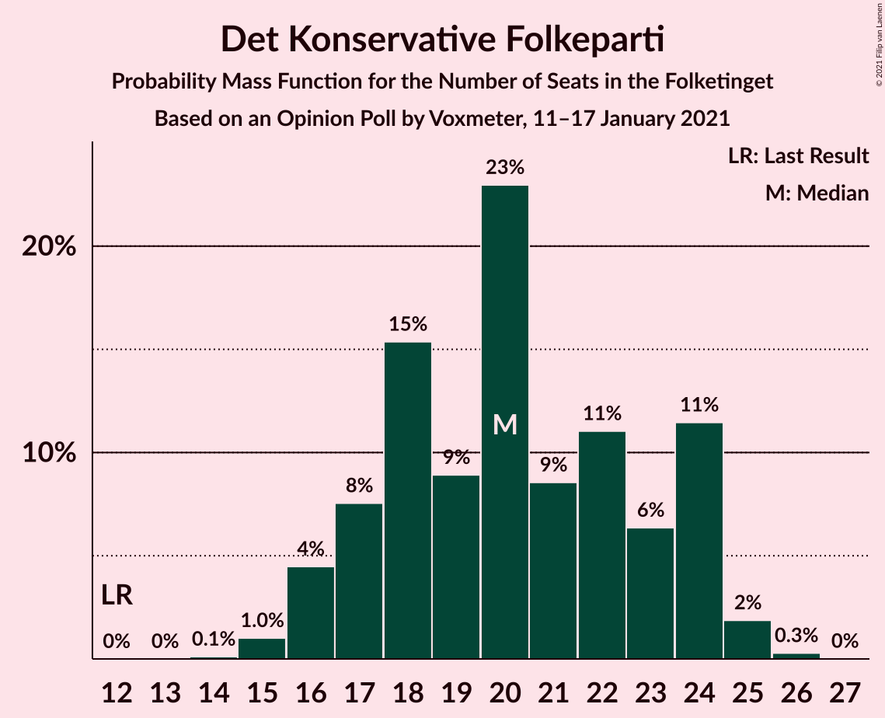

# Opinion Poll by Voxmeter, 11–17 January 2021

<a href="#voting-intentions">Voting Intentions</a> | <a href="#seats">Seats</a> | <a href="#coalitions">Coalitions</a> | <a href="#technical-information">Technical Information</a>

## Voting Intentions

### Confidence Intervals

| Party | Last Result | Poll Result | 80% Confidence Interval | 90% Confidence Interval | 95% Confidence Interval | 99% Confidence Interval |
|:-----:|:-----------:|:-----------:|:-----------------------:|:-----------------------:|:-----------------------:|:-----------------------:|
| Socialdemokraterne | 25.9% | 33.3% | 31.5–35.3% |31.0–35.8% |30.5–36.3% |29.6–37.2% |
| Venstre | 23.4% | 13.0% | 11.8–14.5% |11.4–14.9% |11.1–15.2% |10.5–16.0% |
| Det Konservative Folkeparti | 6.6% | 10.9% | 9.8–12.3% |9.4–12.6% |9.2–13.0% |8.6–13.6% |
| Socialistisk Folkeparti | 7.7% | 8.4% | 7.4–9.6% |7.1–10.0% |6.9–10.3% |6.4–10.9% |
| Enhedslisten–De Rød-Grønne | 6.9% | 8.2% | 7.2–9.4% |6.9–9.8% |6.7–10.1% |6.2–10.7% |
| Dansk Folkeparti | 8.7% | 6.6% | 5.7–7.7% |5.4–8.0% |5.2–8.3% |4.8–8.8% |
| Radikale Venstre | 8.6% | 6.6% | 5.7–7.7% |5.4–8.0% |5.2–8.3% |4.8–8.8% |
| Nye Borgerlige | 2.4% | 5.8% | 5.0–6.8% |4.7–7.1% |4.5–7.4% |4.2–7.9% |
| Liberal Alliance | 2.3% | 2.8% | 2.2–3.6% |2.1–3.8% |2.0–4.0% |1.7–4.4% |
| Kristendemokraterne | 1.7% | 1.6% | 1.2–2.3% |1.1–2.5% |1.0–2.6% |0.9–3.0% |
| Veganerpartiet | 0.0% | 1.4% | 1.0–2.0% |0.9–2.1% |0.8–2.3% |0.7–2.6% |
| Alternativet | 3.0% | 0.8% | 0.5–1.3% |0.4–1.4% |0.4–1.5% |0.3–1.8% |

*Note:* The poll result column reflects the actual value used in the calculations. Published results may vary slightly, and in addition be rounded to fewer digits.

## Seats

### Confidence Intervals

| Party | Last Result | Median | 80% Confidence Interval | 90% Confidence Interval | 95% Confidence Interval | 99% Confidence Interval |
|:-----:|:-----------:|:------:|:-----------------------:|:-----------------------:|:-----------------------:|:-----------------------:|
| <a href="#socialdemokraterne">Socialdemokraterne</a> | 48 | 60 | 57–65 |55–67 |54–67 |53–67 |
| <a href="#venstre">Venstre</a> | 43 | 23 | 20–26 |19–27 |19–27 |18–28 |
| <a href="#det-konservative-folkeparti">Det Konservative Folkeparti</a> | 12 | 20 | 17–24 |16–24 |16–24 |15–25 |
| <a href="#socialistisk-folkeparti">Socialistisk Folkeparti</a> | 14 | 15 | 13–17 |12–18 |12–18 |12–20 |
| <a href="#enhedslisten–de-rød-grønne">Enhedslisten–De Rød-Grønne</a> | 13 | 14 | 13–17 |12–17 |11–18 |11–20 |
| <a href="#dansk-folkeparti">Dansk Folkeparti</a> | 16 | 12 | 10–13 |9–14 |9–15 |9–16 |
| <a href="#radikale-venstre">Radikale Venstre</a> | 16 | 13 | 10–15 |10–15 |9–15 |8–16 |
| <a href="#nye-borgerlige">Nye Borgerlige</a> | 4 | 11 | 9–13 |9–14 |8–14 |7–15 |
| <a href="#liberal-alliance">Liberal Alliance</a> | 4 | 5 | 4–7 |0–8 |0–8 |0–8 |
| <a href="#kristendemokraterne">Kristendemokraterne</a> | 0 | 0 | 0–4 |0–5 |0–5 |0–5 |
| <a href="#veganerpartiet">Veganerpartiet</a> | 0 | 0 | 0–4 |0–4 |0–4 |0–5 |
| <a href="#alternativet">Alternativet</a> | 5 | 0 | 0 |0 |0 |0 |

### Socialdemokraterne

*For a full overview of the results for this party, see the [Socialdemokraterne](party-socialdemokraterne.html) page.*

| Number of Seats | Probability | Accumulated | Special Marks |
|:---------------:|:-----------:|:-----------:|:-------------:|
| 48 | 0% | 100% | Last Result |
| 49 | 0% | 100% |  |
| 50 | 0% | 100% |  |
| 51 | 0.2% | 100% |  |
| 52 | 0.1% | 99.8% |  |
| 53 | 0.4% | 99.7% |  |
| 54 | 3% | 99.4% |  |
| 55 | 4% | 96% |  |
| 56 | 2% | 93% |  |
| 57 | 6% | 91% |  |
| 58 | 27% | 85% |  |
| 59 | 8% | 58% |  |
| 60 | 10% | 51% | Median |
| 61 | 14% | 41% |  |
| 62 | 3% | 27% |  |
| 63 | 2% | 24% |  |
| 64 | 9% | 22% |  |
| 65 | 4% | 13% |  |
| 66 | 0.9% | 8% |  |
| 67 | 7% | 7% |  |
| 68 | 0.1% | 0.3% |  |
| 69 | 0.1% | 0.2% |  |
| 70 | 0% | 0% |  |

### Venstre

*For a full overview of the results for this party, see the [Venstre](party-venstre.html) page.*

| Number of Seats | Probability | Accumulated | Special Marks |
|:---------------:|:-----------:|:-----------:|:-------------:|
| 18 | 0.5% | 100% |  |
| 19 | 9% | 99.5% |  |
| 20 | 4% | 91% |  |
| 21 | 7% | 87% |  |
| 22 | 15% | 80% |  |
| 23 | 17% | 65% | Median |
| 24 | 10% | 48% |  |
| 25 | 18% | 38% |  |
| 26 | 13% | 21% |  |
| 27 | 6% | 7% |  |
| 28 | 0.5% | 0.9% |  |
| 29 | 0.2% | 0.3% |  |
| 30 | 0.1% | 0.1% |  |
| 31 | 0% | 0% |  |
| 32 | 0% | 0% |  |
| 33 | 0% | 0% |  |
| 34 | 0% | 0% |  |
| 35 | 0% | 0% |  |
| 36 | 0% | 0% |  |
| 37 | 0% | 0% |  |
| 38 | 0% | 0% |  |
| 39 | 0% | 0% |  |
| 40 | 0% | 0% |  |
| 41 | 0% | 0% |  |
| 42 | 0% | 0% |  |
| 43 | 0% | 0% | Last Result |

### Det Konservative Folkeparti

*For a full overview of the results for this party, see the [Det Konservative Folkeparti](party-detkonservativefolkeparti.html) page.*

| Number of Seats | Probability | Accumulated | Special Marks |
|:---------------:|:-----------:|:-----------:|:-------------:|
| 12 | 0% | 100% | Last Result |
| 13 | 0% | 100% |  |
| 14 | 0.1% | 100% |  |
| 15 | 1.0% | 99.9% |  |
| 16 | 4% | 98.9% |  |
| 17 | 8% | 94% |  |
| 18 | 15% | 87% |  |
| 19 | 9% | 71% |  |
| 20 | 23% | 63% | Median |
| 21 | 9% | 40% |  |
| 22 | 11% | 31% |  |
| 23 | 6% | 20% |  |
| 24 | 11% | 14% |  |
| 25 | 2% | 2% |  |
| 26 | 0.3% | 0.3% |  |
| 27 | 0% | 0% |  |

### Socialistisk Folkeparti

*For a full overview of the results for this party, see the [Socialistisk Folkeparti](party-socialistiskfolkeparti.html) page.*

| Number of Seats | Probability | Accumulated | Special Marks |
|:---------------:|:-----------:|:-----------:|:-------------:|
| 10 | 0.1% | 100% |  |
| 11 | 0.3% | 99.9% |  |
| 12 | 9% | 99.6% |  |
| 13 | 10% | 90% |  |
| 14 | 9% | 80% | Last Result |
| 15 | 33% | 71% | Median |
| 16 | 23% | 38% |  |
| 17 | 6% | 15% |  |
| 18 | 7% | 9% |  |
| 19 | 2% | 2% |  |
| 20 | 0.6% | 0.8% |  |
| 21 | 0.1% | 0.1% |  |
| 22 | 0.1% | 0.1% |  |
| 23 | 0% | 0% |  |

### Enhedslisten–De Rød-Grønne

*For a full overview of the results for this party, see the [Enhedslisten–De Rød-Grønne](party-enhedslisten–derød-grønne.html) page.*

| Number of Seats | Probability | Accumulated | Special Marks |
|:---------------:|:-----------:|:-----------:|:-------------:|
| 10 | 0.2% | 100% |  |
| 11 | 3% | 99.8% |  |
| 12 | 3% | 96% |  |
| 13 | 6% | 93% | Last Result |
| 14 | 43% | 87% | Median |
| 15 | 14% | 44% |  |
| 16 | 9% | 30% |  |
| 17 | 17% | 21% |  |
| 18 | 2% | 3% |  |
| 19 | 0.9% | 2% |  |
| 20 | 0.8% | 0.8% |  |
| 21 | 0% | 0% |  |

### Dansk Folkeparti

*For a full overview of the results for this party, see the [Dansk Folkeparti](party-danskfolkeparti.html) page.*

| Number of Seats | Probability | Accumulated | Special Marks |
|:---------------:|:-----------:|:-----------:|:-------------:|
| 8 | 0.3% | 100% |  |
| 9 | 7% | 99.7% |  |
| 10 | 17% | 92% |  |
| 11 | 17% | 75% |  |
| 12 | 29% | 58% | Median |
| 13 | 19% | 29% |  |
| 14 | 6% | 10% |  |
| 15 | 2% | 3% |  |
| 16 | 1.2% | 1.5% | Last Result |
| 17 | 0.1% | 0.3% |  |
| 18 | 0.2% | 0.2% |  |
| 19 | 0% | 0% |  |

### Radikale Venstre

*For a full overview of the results for this party, see the [Radikale Venstre](party-radikalevenstre.html) page.*

| Number of Seats | Probability | Accumulated | Special Marks |
|:---------------:|:-----------:|:-----------:|:-------------:|
| 8 | 0.5% | 100% |  |
| 9 | 3% | 99.4% |  |
| 10 | 14% | 97% |  |
| 11 | 17% | 82% |  |
| 12 | 16% | 66% |  |
| 13 | 24% | 50% | Median |
| 14 | 14% | 26% |  |
| 15 | 11% | 12% |  |
| 16 | 1.2% | 2% | Last Result |
| 17 | 0.4% | 0.4% |  |
| 18 | 0% | 0% |  |

### Nye Borgerlige

*For a full overview of the results for this party, see the [Nye Borgerlige](party-nyeborgerlige.html) page.*

| Number of Seats | Probability | Accumulated | Special Marks |
|:---------------:|:-----------:|:-----------:|:-------------:|
| 4 | 0% | 100% | Last Result |
| 5 | 0% | 100% |  |
| 6 | 0% | 100% |  |
| 7 | 1.4% | 100% |  |
| 8 | 2% | 98.6% |  |
| 9 | 19% | 96% |  |
| 10 | 26% | 77% |  |
| 11 | 24% | 52% | Median |
| 12 | 13% | 28% |  |
| 13 | 9% | 15% |  |
| 14 | 5% | 7% |  |
| 15 | 2% | 2% |  |
| 16 | 0% | 0% |  |

### Liberal Alliance

*For a full overview of the results for this party, see the [Liberal Alliance](party-liberalalliance.html) page.*

| Number of Seats | Probability | Accumulated | Special Marks |
|:---------------:|:-----------:|:-----------:|:-------------:|
| 0 | 8% | 100% |  |
| 1 | 0% | 92% |  |
| 2 | 0% | 92% |  |
| 3 | 0% | 92% |  |
| 4 | 29% | 92% | Last Result |
| 5 | 30% | 64% | Median |
| 6 | 23% | 34% |  |
| 7 | 6% | 11% |  |
| 8 | 5% | 5% |  |
| 9 | 0.4% | 0.4% |  |
| 10 | 0% | 0% |  |

### Kristendemokraterne

*For a full overview of the results for this party, see the [Kristendemokraterne](party-kristendemokraterne.html) page.*

| Number of Seats | Probability | Accumulated | Special Marks |
|:---------------:|:-----------:|:-----------:|:-------------:|
| 0 | 73% | 100% | Last Result, Median |
| 1 | 0% | 27% |  |
| 2 | 0% | 27% |  |
| 3 | 0% | 27% |  |
| 4 | 22% | 27% |  |
| 5 | 5% | 5% |  |
| 6 | 0.2% | 0.3% |  |
| 7 | 0.1% | 0.1% |  |
| 8 | 0% | 0% |  |

### Veganerpartiet

*For a full overview of the results for this party, see the [Veganerpartiet](party-veganerpartiet.html) page.*

| Number of Seats | Probability | Accumulated | Special Marks |
|:---------------:|:-----------:|:-----------:|:-------------:|
| 0 | 83% | 100% | Last Result, Median |
| 1 | 0% | 17% |  |
| 2 | 0% | 17% |  |
| 3 | 0% | 17% |  |
| 4 | 15% | 17% |  |
| 5 | 1.5% | 1.5% |  |
| 6 | 0% | 0% |  |

### Alternativet

*For a full overview of the results for this party, see the [Alternativet](party-alternativet.html) page.*

| Number of Seats | Probability | Accumulated | Special Marks |
|:---------------:|:-----------:|:-----------:|:-------------:|
| 0 | 99.9% | 100% | Median |
| 1 | 0% | 0.1% |  |
| 2 | 0% | 0.1% |  |
| 3 | 0% | 0.1% |  |
| 4 | 0.1% | 0.1% |  |
| 5 | 0% | 0% | Last Result |

## Coalitions

### Confidence Intervals

| Coalition | Last Result | Median | Majority? | 80% Confidence Interval | 90% Confidence Interval | 95% Confidence Interval | 99% Confidence Interval |
|:---------:|:-----------:|:------:|:---------:|:-----------------------:|:-----------------------:|:-----------------------:|:-----------------------:|
| Socialdemokraterne – Socialistisk Folkeparti – Enhedslisten–De Rød-Grønne – Radikale Venstre – Alternativet | 96 | 102 | 100% | 98–107 | 98–108 | 96–108 | 95–110 |
| Socialdemokraterne – Socialistisk Folkeparti – Enhedslisten–De Rød-Grønne – Radikale Venstre | 91 | 102 | 100% | 98–107 | 98–108 | 96–108 | 95–110 |
| Socialdemokraterne – Socialistisk Folkeparti – Enhedslisten–De Rød-Grønne – Alternativet | 80 | 90 | 51% | 86–94 | 84–96 | 84–96 | 82–98 |
| Socialdemokraterne – Socialistisk Folkeparti – Enhedslisten–De Rød-Grønne | 75 | 90 | 51% | 86–94 | 84–96 | 84–96 | 82–98 |
| Socialdemokraterne – Socialistisk Folkeparti – Radikale Venstre | 78 | 87 | 25% | 83–92 | 82–94 | 81–94 | 80–95 |
| Socialdemokraterne – Radikale Venstre | 64 | 73 | 0% | 68–77 | 68–79 | 67–79 | 65–80 |
| Venstre – Det Konservative Folkeparti – Dansk Folkeparti – Nye Borgerlige – Liberal Alliance – Kristendemokraterne | 79 | 72 | 0% | 67–76 | 67–77 | 66–77 | 64–80 |
| Venstre – Det Konservative Folkeparti – Dansk Folkeparti – Nye Borgerlige – Liberal Alliance | 79 | 71 | 0% | 67–75 | 66–77 | 65–77 | 64–79 |
| Venstre – Det Konservative Folkeparti – Dansk Folkeparti – Liberal Alliance – Kristendemokraterne | 75 | 61 | 0% | 56–66 | 55–66 | 55–67 | 54–69 |
| Venstre – Det Konservative Folkeparti – Dansk Folkeparti – Liberal Alliance | 75 | 60 | 0% | 55–64 | 55–65 | 54–66 | 53–68 |
| Venstre – Det Konservative Folkeparti – Liberal Alliance | 59 | 48 | 0% | 44–53 | 43–53 | 43–54 | 41–55 |
| Venstre – Det Konservative Folkeparti | 55 | 43 | 0% | 39–47 | 39–48 | 39–49 | 37–49 |
| Venstre | 43 | 23 | 0% | 20–26 | 19–27 | 19–27 | 18–28 |

### Socialdemokraterne – Socialistisk Folkeparti – Enhedslisten–De Rød-Grønne – Radikale Venstre – Alternativet

| Number of Seats | Probability | Accumulated | Special Marks |
|:---------------:|:-----------:|:-----------:|:-------------:|
| 92 | 0.1% | 100% |  |
| 93 | 0.1% | 99.9% |  |
| 94 | 0.2% | 99.8% |  |
| 95 | 1.0% | 99.6% |  |
| 96 | 2% | 98.6% | Last Result |
| 97 | 1.2% | 97% |  |
| 98 | 6% | 96% |  |
| 99 | 6% | 89% |  |
| 100 | 7% | 83% |  |
| 101 | 16% | 76% |  |
| 102 | 16% | 60% | Median |
| 103 | 8% | 44% |  |
| 104 | 19% | 36% |  |
| 105 | 3% | 17% |  |
| 106 | 4% | 14% |  |
| 107 | 1.2% | 10% |  |
| 108 | 7% | 9% |  |
| 109 | 1.1% | 2% |  |
| 110 | 0.4% | 0.6% |  |
| 111 | 0% | 0.1% |  |
| 112 | 0% | 0.1% |  |
| 113 | 0% | 0.1% |  |
| 114 | 0% | 0% |  |

### Socialdemokraterne – Socialistisk Folkeparti – Enhedslisten–De Rød-Grønne – Radikale Venstre

| Number of Seats | Probability | Accumulated | Special Marks |
|:---------------:|:-----------:|:-----------:|:-------------:|
| 91 | 0% | 100% | Last Result |
| 92 | 0.1% | 100% |  |
| 93 | 0.1% | 99.9% |  |
| 94 | 0.2% | 99.8% |  |
| 95 | 1.0% | 99.6% |  |
| 96 | 2% | 98.6% |  |
| 97 | 1.2% | 97% |  |
| 98 | 6% | 96% |  |
| 99 | 6% | 89% |  |
| 100 | 7% | 83% |  |
| 101 | 16% | 76% |  |
| 102 | 16% | 60% | Median |
| 103 | 8% | 44% |  |
| 104 | 19% | 36% |  |
| 105 | 3% | 17% |  |
| 106 | 4% | 14% |  |
| 107 | 1.2% | 10% |  |
| 108 | 7% | 9% |  |
| 109 | 1.1% | 2% |  |
| 110 | 0.4% | 0.6% |  |
| 111 | 0% | 0.1% |  |
| 112 | 0% | 0.1% |  |
| 113 | 0% | 0.1% |  |
| 114 | 0% | 0% |  |

### Socialdemokraterne – Socialistisk Folkeparti – Enhedslisten–De Rød-Grønne – Alternativet

| Number of Seats | Probability | Accumulated | Special Marks |
|:---------------:|:-----------:|:-----------:|:-------------:|
| 80 | 0.1% | 100% | Last Result |
| 81 | 0% | 99.9% |  |
| 82 | 0.7% | 99.8% |  |
| 83 | 0.4% | 99.1% |  |
| 84 | 4% | 98.7% |  |
| 85 | 2% | 95% |  |
| 86 | 3% | 92% |  |
| 87 | 14% | 89% |  |
| 88 | 14% | 75% |  |
| 89 | 10% | 61% | Median |
| 90 | 8% | 51% | Majority |
| 91 | 11% | 43% |  |
| 92 | 7% | 32% |  |
| 93 | 11% | 25% |  |
| 94 | 4% | 14% |  |
| 95 | 0.8% | 10% |  |
| 96 | 8% | 9% |  |
| 97 | 0.1% | 1.0% |  |
| 98 | 0.4% | 0.9% |  |
| 99 | 0.3% | 0.4% |  |
| 100 | 0.1% | 0.1% |  |
| 101 | 0% | 0% |  |

### Socialdemokraterne – Socialistisk Folkeparti – Enhedslisten–De Rød-Grønne

| Number of Seats | Probability | Accumulated | Special Marks |
|:---------------:|:-----------:|:-----------:|:-------------:|
| 75 | 0% | 100% | Last Result |
| 76 | 0% | 100% |  |
| 77 | 0% | 100% |  |
| 78 | 0% | 100% |  |
| 79 | 0% | 100% |  |
| 80 | 0.1% | 100% |  |
| 81 | 0% | 99.9% |  |
| 82 | 0.7% | 99.8% |  |
| 83 | 0.4% | 99.1% |  |
| 84 | 4% | 98.7% |  |
| 85 | 2% | 95% |  |
| 86 | 3% | 92% |  |
| 87 | 14% | 89% |  |
| 88 | 14% | 75% |  |
| 89 | 10% | 61% | Median |
| 90 | 8% | 51% | Majority |
| 91 | 11% | 43% |  |
| 92 | 7% | 32% |  |
| 93 | 11% | 25% |  |
| 94 | 4% | 14% |  |
| 95 | 0.8% | 10% |  |
| 96 | 8% | 9% |  |
| 97 | 0.1% | 1.0% |  |
| 98 | 0.4% | 0.8% |  |
| 99 | 0.3% | 0.4% |  |
| 100 | 0.1% | 0.1% |  |
| 101 | 0% | 0% |  |

### Socialdemokraterne – Socialistisk Folkeparti – Radikale Venstre

| Number of Seats | Probability | Accumulated | Special Marks |
|:---------------:|:-----------:|:-----------:|:-------------:|
| 76 | 0.1% | 100% |  |
| 77 | 0% | 99.9% |  |
| 78 | 0.2% | 99.9% | Last Result |
| 79 | 0.1% | 99.7% |  |
| 80 | 0.7% | 99.6% |  |
| 81 | 3% | 98.9% |  |
| 82 | 1.2% | 96% |  |
| 83 | 7% | 94% |  |
| 84 | 3% | 87% |  |
| 85 | 5% | 84% |  |
| 86 | 9% | 78% |  |
| 87 | 24% | 69% |  |
| 88 | 13% | 46% | Median |
| 89 | 8% | 33% |  |
| 90 | 10% | 25% | Majority |
| 91 | 4% | 15% |  |
| 92 | 3% | 11% |  |
| 93 | 0.4% | 9% |  |
| 94 | 7% | 8% |  |
| 95 | 0.5% | 0.9% |  |
| 96 | 0.2% | 0.3% |  |
| 97 | 0.1% | 0.1% |  |
| 98 | 0% | 0% |  |

### Socialdemokraterne – Radikale Venstre

| Number of Seats | Probability | Accumulated | Special Marks |
|:---------------:|:-----------:|:-----------:|:-------------:|
| 63 | 0.3% | 100% |  |
| 64 | 0.2% | 99.7% | Last Result |
| 65 | 0.2% | 99.5% |  |
| 66 | 0.8% | 99.3% |  |
| 67 | 2% | 98.5% |  |
| 68 | 11% | 97% |  |
| 69 | 8% | 86% |  |
| 70 | 4% | 78% |  |
| 71 | 16% | 74% |  |
| 72 | 6% | 59% |  |
| 73 | 18% | 53% | Median |
| 74 | 6% | 35% |  |
| 75 | 14% | 29% |  |
| 76 | 4% | 14% |  |
| 77 | 2% | 10% |  |
| 78 | 0.4% | 8% |  |
| 79 | 7% | 8% |  |
| 80 | 0.8% | 0.9% |  |
| 81 | 0.1% | 0.1% |  |
| 82 | 0% | 0% |  |

### Venstre – Det Konservative Folkeparti – Dansk Folkeparti – Nye Borgerlige – Liberal Alliance – Kristendemokraterne

| Number of Seats | Probability | Accumulated | Special Marks |
|:---------------:|:-----------:|:-----------:|:-------------:|
| 62 | 0.1% | 100% |  |
| 63 | 0.1% | 99.9% |  |
| 64 | 0.6% | 99.8% |  |
| 65 | 0.7% | 99.2% |  |
| 66 | 1.4% | 98.6% |  |
| 67 | 11% | 97% |  |
| 68 | 1.4% | 86% |  |
| 69 | 12% | 85% |  |
| 70 | 3% | 73% |  |
| 71 | 16% | 71% | Median |
| 72 | 8% | 55% |  |
| 73 | 7% | 46% |  |
| 74 | 16% | 39% |  |
| 75 | 8% | 23% |  |
| 76 | 7% | 15% |  |
| 77 | 6% | 8% |  |
| 78 | 0.8% | 2% |  |
| 79 | 0.5% | 1.1% | Last Result |
| 80 | 0.4% | 0.6% |  |
| 81 | 0.1% | 0.3% |  |
| 82 | 0% | 0.1% |  |
| 83 | 0.1% | 0.1% |  |
| 84 | 0% | 0% |  |

### Venstre – Det Konservative Folkeparti – Dansk Folkeparti – Nye Borgerlige – Liberal Alliance

| Number of Seats | Probability | Accumulated | Special Marks |
|:---------------:|:-----------:|:-----------:|:-------------:|
| 60 | 0.1% | 100% |  |
| 61 | 0% | 99.9% |  |
| 62 | 0.2% | 99.9% |  |
| 63 | 0.2% | 99.7% |  |
| 64 | 0.8% | 99.5% |  |
| 65 | 2% | 98.7% |  |
| 66 | 2% | 96% |  |
| 67 | 11% | 94% |  |
| 68 | 2% | 83% |  |
| 69 | 12% | 81% |  |
| 70 | 15% | 69% |  |
| 71 | 16% | 54% | Median |
| 72 | 13% | 38% |  |
| 73 | 6% | 25% |  |
| 74 | 4% | 19% |  |
| 75 | 7% | 15% |  |
| 76 | 2% | 8% |  |
| 77 | 5% | 6% |  |
| 78 | 0.5% | 1.1% |  |
| 79 | 0.4% | 0.5% | Last Result |
| 80 | 0.1% | 0.2% |  |
| 81 | 0.1% | 0.1% |  |
| 82 | 0% | 0% |  |

### Venstre – Det Konservative Folkeparti – Dansk Folkeparti – Liberal Alliance – Kristendemokraterne

| Number of Seats | Probability | Accumulated | Special Marks |
|:---------------:|:-----------:|:-----------:|:-------------:|
| 51 | 0% | 100% |  |
| 52 | 0% | 99.9% |  |
| 53 | 0.1% | 99.9% |  |
| 54 | 0.8% | 99.8% |  |
| 55 | 7% | 98.9% |  |
| 56 | 4% | 92% |  |
| 57 | 1.1% | 88% |  |
| 58 | 7% | 87% |  |
| 59 | 3% | 80% |  |
| 60 | 22% | 77% | Median |
| 61 | 8% | 55% |  |
| 62 | 8% | 47% |  |
| 63 | 10% | 39% |  |
| 64 | 13% | 29% |  |
| 65 | 6% | 16% |  |
| 66 | 6% | 10% |  |
| 67 | 2% | 4% |  |
| 68 | 0.7% | 1.4% |  |
| 69 | 0.3% | 0.7% |  |
| 70 | 0.1% | 0.4% |  |
| 71 | 0.2% | 0.3% |  |
| 72 | 0.1% | 0.1% |  |
| 73 | 0% | 0% |  |
| 74 | 0% | 0% |  |
| 75 | 0% | 0% | Last Result |

### Venstre – Det Konservative Folkeparti – Dansk Folkeparti – Liberal Alliance

| Number of Seats | Probability | Accumulated | Special Marks |
|:---------------:|:-----------:|:-----------:|:-------------:|
| 51 | 0.3% | 100% |  |
| 52 | 0.1% | 99.7% |  |
| 53 | 0.3% | 99.6% |  |
| 54 | 3% | 99.3% |  |
| 55 | 7% | 97% |  |
| 56 | 4% | 90% |  |
| 57 | 2% | 86% |  |
| 58 | 6% | 83% |  |
| 59 | 7% | 78% |  |
| 60 | 31% | 71% | Median |
| 61 | 11% | 40% |  |
| 62 | 11% | 28% |  |
| 63 | 7% | 17% |  |
| 64 | 4% | 10% |  |
| 65 | 2% | 6% |  |
| 66 | 3% | 4% |  |
| 67 | 0.3% | 1.1% |  |
| 68 | 0.6% | 0.8% |  |
| 69 | 0.2% | 0.3% |  |
| 70 | 0.1% | 0.1% |  |
| 71 | 0% | 0% |  |
| 72 | 0% | 0% |  |
| 73 | 0% | 0% |  |
| 74 | 0% | 0% |  |
| 75 | 0% | 0% | Last Result |

### Venstre – Det Konservative Folkeparti – Liberal Alliance

| Number of Seats | Probability | Accumulated | Special Marks |
|:---------------:|:-----------:|:-----------:|:-------------:|
| 39 | 0.1% | 100% |  |
| 40 | 0.1% | 99.8% |  |
| 41 | 0.4% | 99.8% |  |
| 42 | 0.6% | 99.3% |  |
| 43 | 8% | 98.7% |  |
| 44 | 3% | 91% |  |
| 45 | 5% | 89% |  |
| 46 | 3% | 83% |  |
| 47 | 12% | 80% |  |
| 48 | 18% | 68% | Median |
| 49 | 12% | 49% |  |
| 50 | 19% | 37% |  |
| 51 | 5% | 18% |  |
| 52 | 3% | 13% |  |
| 53 | 6% | 10% |  |
| 54 | 4% | 4% |  |
| 55 | 0.2% | 0.6% |  |
| 56 | 0.1% | 0.4% |  |
| 57 | 0.2% | 0.3% |  |
| 58 | 0% | 0.1% |  |
| 59 | 0% | 0.1% | Last Result |
| 60 | 0% | 0% |  |

### Venstre – Det Konservative Folkeparti

| Number of Seats | Probability | Accumulated | Special Marks |
|:---------------:|:-----------:|:-----------:|:-------------:|
| 35 | 0.1% | 100% |  |
| 36 | 0.4% | 99.9% |  |
| 37 | 0.5% | 99.5% |  |
| 38 | 0.8% | 99.0% |  |
| 39 | 10% | 98% |  |
| 40 | 3% | 88% |  |
| 41 | 7% | 86% |  |
| 42 | 7% | 79% |  |
| 43 | 24% | 72% | Median |
| 44 | 10% | 48% |  |
| 45 | 11% | 38% |  |
| 46 | 12% | 26% |  |
| 47 | 9% | 15% |  |
| 48 | 3% | 6% |  |
| 49 | 3% | 4% |  |
| 50 | 0.2% | 0.4% |  |
| 51 | 0.1% | 0.3% |  |
| 52 | 0.1% | 0.2% |  |
| 53 | 0% | 0% |  |
| 54 | 0% | 0% |  |
| 55 | 0% | 0% | Last Result |

### Venstre

| Number of Seats | Probability | Accumulated | Special Marks |
|:---------------:|:-----------:|:-----------:|:-------------:|
| 18 | 0.5% | 100% |  |
| 19 | 9% | 99.5% |  |
| 20 | 4% | 91% |  |
| 21 | 7% | 87% |  |
| 22 | 15% | 80% |  |
| 23 | 17% | 65% | Median |
| 24 | 10% | 48% |  |
| 25 | 18% | 38% |  |
| 26 | 13% | 21% |  |
| 27 | 6% | 7% |  |
| 28 | 0.5% | 0.9% |  |
| 29 | 0.2% | 0.3% |  |
| 30 | 0.1% | 0.1% |  |
| 31 | 0% | 0% |  |
| 32 | 0% | 0% |  |
| 33 | 0% | 0% |  |
| 34 | 0% | 0% |  |
| 35 | 0% | 0% |  |
| 36 | 0% | 0% |  |
| 37 | 0% | 0% |  |
| 38 | 0% | 0% |  |
| 39 | 0% | 0% |  |
| 40 | 0% | 0% |  |
| 41 | 0% | 0% |  |
| 42 | 0% | 0% |  |
| 43 | 0% | 0% | Last Result |

## Technical Information

### Opinion Poll

+ **Polling firm:** Voxmeter
+ **Commissioner(s):** —
+ **Fieldwork period:** 11–17 January 2021

### Calculations

+ **Sample size:** 1035
+ **Simulations done:** 1,048,576
+ **Error estimate:** 3.44%

