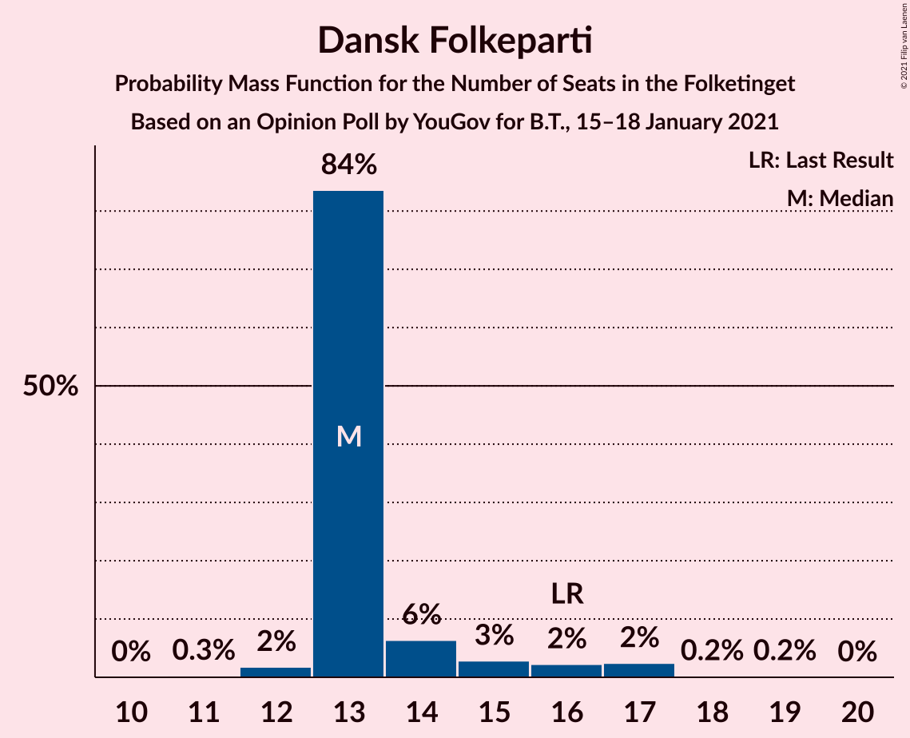
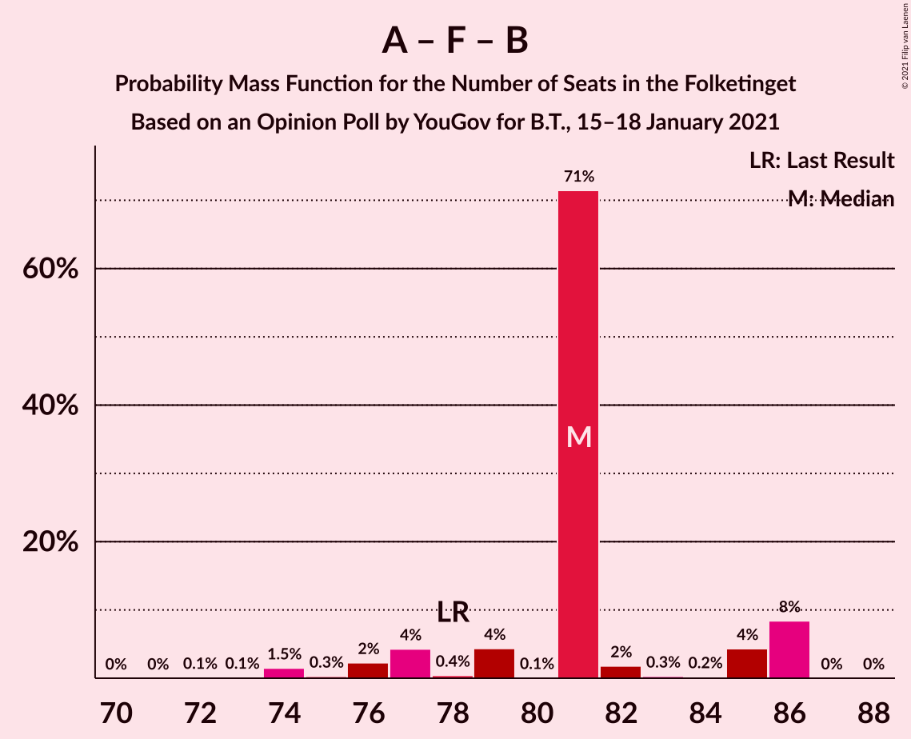

# Opinion Poll by YouGov for B.T., 15–18 January 2021

<a href="#voting-intentions">Voting Intentions</a> | <a href="#seats">Seats</a> | <a href="#coalitions">Coalitions</a> | <a href="#technical-information">Technical Information</a>

## Voting Intentions

### Confidence Intervals

| Party | Last Result | Poll Result | 80% Confidence Interval | 90% Confidence Interval | 95% Confidence Interval | 99% Confidence Interval |
|:-----:|:-----------:|:-----------:|:-----------------------:|:-----------------------:|:-----------------------:|:-----------------------:|
| Socialdemokraterne | 25.9% | 33.3% | 31.7–35.1% |31.2–35.6% |30.8–36.0% |30.0–36.9% |
| Det Konservative Folkeparti | 6.6% | 12.9% | 11.8–14.2% |11.4–14.6% |11.1–14.9% |10.6–15.5% |
| Nye Borgerlige | 2.4% | 11.8% | 10.7–13.0% |10.4–13.4% |10.1–13.7% |9.6–14.3% |
| Venstre | 23.4% | 9.2% | 8.2–10.3% |8.0–10.7% |7.7–11.0% |7.3–11.5% |
| Dansk Folkeparti | 8.7% | 8.0% | 7.1–9.1% |6.8–9.4% |6.6–9.7% |6.2–10.2% |
| Enhedslisten–De Rød-Grønne | 6.9% | 7.1% | 6.2–8.1% |6.0–8.4% |5.8–8.6% |5.4–9.1% |
| Socialistisk Folkeparti | 7.7% | 6.7% | 5.8–7.7% |5.6–7.9% |5.4–8.2% |5.0–8.7% |
| Radikale Venstre | 8.6% | 4.7% | 4.0–5.6% |3.8–5.8% |3.7–6.1% |3.4–6.5% |
| Liberal Alliance | 2.3% | 2.8% | 2.3–3.5% |2.1–3.7% |2.0–3.9% |1.8–4.3% |
| Kristendemokraterne | 1.7% | 1.9% | 1.5–2.5% |1.4–2.7% |1.3–2.9% |1.1–3.2% |
| Alternativet | 3.0% | 0.9% | 0.6–1.3% |0.5–1.5% |0.5–1.6% |0.4–1.8% |
| Veganerpartiet | 0.0% | 0.7% | 0.5–1.1% |0.4–1.3% |0.4–1.4% |0.3–1.6% |

*Note:* The poll result column reflects the actual value used in the calculations. Published results may vary slightly, and in addition be rounded to fewer digits.

## Seats

### Confidence Intervals

| Party | Last Result | Median | 80% Confidence Interval | 90% Confidence Interval | 95% Confidence Interval | 99% Confidence Interval |
|:-----:|:-----------:|:------:|:-----------------------:|:-----------------------:|:-----------------------:|:-----------------------:|
| <a href="#socialdemokraterne">Socialdemokraterne</a> | 48 | 61 | 59–63 |57–63 |57–64 |54–66 |
| <a href="#det-konservative-folkeparti">Det Konservative Folkeparti</a> | 12 | 26 | 21–26 |21–26 |20–26 |20–28 |
| <a href="#nye-borgerlige">Nye Borgerlige</a> | 4 | 23 | 21–23 |19–23 |18–24 |18–25 |
| <a href="#venstre">Venstre</a> | 43 | 14 | 14–18 |14–18 |14–18 |14–21 |
| <a href="#dansk-folkeparti">Dansk Folkeparti</a> | 16 | 13 | 13–14 |13–16 |13–17 |12–17 |
| <a href="#enhedslisten–de-rød-grønne">Enhedslisten–De Rød-Grønne</a> | 13 | 12 | 11–13 |11–14 |11–14 |10–16 |
| <a href="#socialistisk-folkeparti">Socialistisk Folkeparti</a> | 14 | 11 | 11–13 |10–14 |10–14 |9–14 |
| <a href="#radikale-venstre">Radikale Venstre</a> | 16 | 9 | 8–9 |7–10 |7–10 |7–11 |
| <a href="#liberal-alliance">Liberal Alliance</a> | 4 | 6 | 5–6 |4–6 |4–7 |4–7 |
| <a href="#kristendemokraterne">Kristendemokraterne</a> | 0 | 0 | 0–4 |0–5 |0–5 |0–5 |
| <a href="#alternativet">Alternativet</a> | 5 | 0 | 0 |0 |0 |0 |
| <a href="#veganerpartiet">Veganerpartiet</a> | 0 | 0 | 0 |0 |0 |0 |

### Socialdemokraterne

*For a full overview of the results for this party, see the [Socialdemokraterne](party-socialdemokraterne.html) page.*

| Number of Seats | Probability | Accumulated | Special Marks |
|:---------------:|:-----------:|:-----------:|:-------------:|
| 48 | 0% | 100% | Last Result |
| 49 | 0% | 100% |  |
| 50 | 0% | 100% |  |
| 51 | 0% | 100% |  |
| 52 | 0% | 100% |  |
| 53 | 0.1% | 100% |  |
| 54 | 2% | 99.8% |  |
| 55 | 0.3% | 98% |  |
| 56 | 0.3% | 98% |  |
| 57 | 4% | 98% |  |
| 58 | 4% | 94% |  |
| 59 | 0.6% | 90% |  |
| 60 | 2% | 90% |  |
| 61 | 73% | 87% | Median |
| 62 | 0.8% | 15% |  |
| 63 | 9% | 14% |  |
| 64 | 4% | 5% |  |
| 65 | 0% | 0.9% |  |
| 66 | 0.8% | 0.8% |  |
| 67 | 0% | 0% |  |

### Det Konservative Folkeparti

*For a full overview of the results for this party, see the [Det Konservative Folkeparti](party-detkonservativefolkeparti.html) page.*

| Number of Seats | Probability | Accumulated | Special Marks |
|:---------------:|:-----------:|:-----------:|:-------------:|
| 12 | 0% | 100% | Last Result |
| 13 | 0% | 100% |  |
| 14 | 0% | 100% |  |
| 15 | 0% | 100% |  |
| 16 | 0% | 100% |  |
| 17 | 0% | 100% |  |
| 18 | 0% | 100% |  |
| 19 | 0.2% | 100% |  |
| 20 | 2% | 99.8% |  |
| 21 | 16% | 97% |  |
| 22 | 1.3% | 82% |  |
| 23 | 2% | 80% |  |
| 24 | 0.5% | 79% |  |
| 25 | 7% | 78% |  |
| 26 | 69% | 71% | Median |
| 27 | 0.4% | 2% |  |
| 28 | 1.5% | 2% |  |
| 29 | 0% | 0% |  |

### Nye Borgerlige

*For a full overview of the results for this party, see the [Nye Borgerlige](party-nyeborgerlige.html) page.*

| Number of Seats | Probability | Accumulated | Special Marks |
|:---------------:|:-----------:|:-----------:|:-------------:|
| 4 | 0% | 100% | Last Result |
| 5 | 0% | 100% |  |
| 6 | 0% | 100% |  |
| 7 | 0% | 100% |  |
| 8 | 0% | 100% |  |
| 9 | 0% | 100% |  |
| 10 | 0% | 100% |  |
| 11 | 0% | 100% |  |
| 12 | 0% | 100% |  |
| 13 | 0% | 100% |  |
| 14 | 0% | 100% |  |
| 15 | 0% | 100% |  |
| 16 | 0% | 100% |  |
| 17 | 0.3% | 100% |  |
| 18 | 5% | 99.7% |  |
| 19 | 0.6% | 95% |  |
| 20 | 4% | 94% |  |
| 21 | 15% | 91% |  |
| 22 | 2% | 76% |  |
| 23 | 72% | 74% | Median |
| 24 | 0.5% | 3% |  |
| 25 | 2% | 2% |  |
| 26 | 0.1% | 0.1% |  |
| 27 | 0% | 0% |  |

### Venstre

*For a full overview of the results for this party, see the [Venstre](party-venstre.html) page.*

| Number of Seats | Probability | Accumulated | Special Marks |
|:---------------:|:-----------:|:-----------:|:-------------:|
| 12 | 0.1% | 100% |  |
| 13 | 0.1% | 99.9% |  |
| 14 | 69% | 99.8% | Median |
| 15 | 0.7% | 30% |  |
| 16 | 11% | 30% |  |
| 17 | 3% | 19% |  |
| 18 | 14% | 16% |  |
| 19 | 0.6% | 2% |  |
| 20 | 0.4% | 1.2% |  |
| 21 | 0.8% | 0.8% |  |
| 22 | 0% | 0% |  |
| 23 | 0% | 0% |  |
| 24 | 0% | 0% |  |
| 25 | 0% | 0% |  |
| 26 | 0% | 0% |  |
| 27 | 0% | 0% |  |
| 28 | 0% | 0% |  |
| 29 | 0% | 0% |  |
| 30 | 0% | 0% |  |
| 31 | 0% | 0% |  |
| 32 | 0% | 0% |  |
| 33 | 0% | 0% |  |
| 34 | 0% | 0% |  |
| 35 | 0% | 0% |  |
| 36 | 0% | 0% |  |
| 37 | 0% | 0% |  |
| 38 | 0% | 0% |  |
| 39 | 0% | 0% |  |
| 40 | 0% | 0% |  |
| 41 | 0% | 0% |  |
| 42 | 0% | 0% |  |
| 43 | 0% | 0% | Last Result |

### Dansk Folkeparti

*For a full overview of the results for this party, see the [Dansk Folkeparti](party-danskfolkeparti.html) page.*

| Number of Seats | Probability | Accumulated | Special Marks |
|:---------------:|:-----------:|:-----------:|:-------------:|
| 11 | 0.3% | 100% |  |
| 12 | 2% | 99.7% |  |
| 13 | 84% | 98% | Median |
| 14 | 6% | 14% |  |
| 15 | 3% | 8% |  |
| 16 | 2% | 5% | Last Result |
| 17 | 2% | 3% |  |
| 18 | 0.2% | 0.4% |  |
| 19 | 0.2% | 0.2% |  |
| 20 | 0% | 0% |  |

### Enhedslisten–De Rød-Grønne

*For a full overview of the results for this party, see the [Enhedslisten–De Rød-Grønne](party-enhedslisten–derød-grønne.html) page.*

| Number of Seats | Probability | Accumulated | Special Marks |
|:---------------:|:-----------:|:-----------:|:-------------:|
| 9 | 0.1% | 100% |  |
| 10 | 0.8% | 99.9% |  |
| 11 | 11% | 99.1% |  |
| 12 | 78% | 88% | Median |
| 13 | 3% | 11% | Last Result |
| 14 | 6% | 8% |  |
| 15 | 0.6% | 2% |  |
| 16 | 1.1% | 1.1% |  |
| 17 | 0.1% | 0.1% |  |
| 18 | 0% | 0% |  |

### Socialistisk Folkeparti

*For a full overview of the results for this party, see the [Socialistisk Folkeparti](party-socialistiskfolkeparti.html) page.*

| Number of Seats | Probability | Accumulated | Special Marks |
|:---------------:|:-----------:|:-----------:|:-------------:|
| 9 | 1.4% | 100% |  |
| 10 | 6% | 98.6% |  |
| 11 | 75% | 92% | Median |
| 12 | 4% | 18% |  |
| 13 | 5% | 14% |  |
| 14 | 9% | 9% | Last Result |
| 15 | 0.2% | 0.3% |  |
| 16 | 0.1% | 0.1% |  |
| 17 | 0% | 0% |  |

### Radikale Venstre

*For a full overview of the results for this party, see the [Radikale Venstre](party-radikalevenstre.html) page.*

| Number of Seats | Probability | Accumulated | Special Marks |
|:---------------:|:-----------:|:-----------:|:-------------:|
| 6 | 0.3% | 100% |  |
| 7 | 5% | 99.7% |  |
| 8 | 8% | 95% |  |
| 9 | 81% | 86% | Median |
| 10 | 4% | 6% |  |
| 11 | 1.3% | 1.5% |  |
| 12 | 0.2% | 0.2% |  |
| 13 | 0% | 0% |  |
| 14 | 0% | 0% |  |
| 15 | 0% | 0% |  |
| 16 | 0% | 0% | Last Result |

### Liberal Alliance

*For a full overview of the results for this party, see the [Liberal Alliance](party-liberalalliance.html) page.*

| Number of Seats | Probability | Accumulated | Special Marks |
|:---------------:|:-----------:|:-----------:|:-------------:|
| 0 | 0.2% | 100% |  |
| 1 | 0% | 99.8% |  |
| 2 | 0% | 99.8% |  |
| 3 | 0% | 99.8% |  |
| 4 | 5% | 99.8% | Last Result |
| 5 | 17% | 95% |  |
| 6 | 75% | 78% | Median |
| 7 | 3% | 3% |  |
| 8 | 0.2% | 0.2% |  |
| 9 | 0% | 0% |  |

### Kristendemokraterne

*For a full overview of the results for this party, see the [Kristendemokraterne](party-kristendemokraterne.html) page.*

| Number of Seats | Probability | Accumulated | Special Marks |
|:---------------:|:-----------:|:-----------:|:-------------:|
| 0 | 89% | 100% | Last Result, Median |
| 1 | 0% | 11% |  |
| 2 | 0% | 11% |  |
| 3 | 0% | 11% |  |
| 4 | 5% | 11% |  |
| 5 | 6% | 6% |  |
| 6 | 0.2% | 0.3% |  |
| 7 | 0.1% | 0.1% |  |
| 8 | 0% | 0% |  |

### Alternativet

*For a full overview of the results for this party, see the [Alternativet](party-alternativet.html) page.*

| Number of Seats | Probability | Accumulated | Special Marks |
|:---------------:|:-----------:|:-----------:|:-------------:|
| 0 | 99.8% | 100% | Median |
| 1 | 0% | 0.2% |  |
| 2 | 0% | 0.2% |  |
| 3 | 0% | 0.2% |  |
| 4 | 0.2% | 0.2% |  |
| 5 | 0% | 0% | Last Result |

### Veganerpartiet

*For a full overview of the results for this party, see the [Veganerpartiet](party-veganerpartiet.html) page.*

| Number of Seats | Probability | Accumulated | Special Marks |
|:---------------:|:-----------:|:-----------:|:-------------:|
| 0 | 100% | 100% | Last Result, Median |

## Coalitions

### Confidence Intervals

| Coalition | Last Result | Median | Majority? | 80% Confidence Interval | 90% Confidence Interval | 95% Confidence Interval | 99% Confidence Interval |
|:---------:|:-----------:|:------:|:---------:|:-----------------------:|:-----------------------:|:-----------------------:|:-----------------------:|
| Socialdemokraterne – Enhedslisten–De Rød-Grønne – Socialistisk Folkeparti – Radikale Venstre – Alternativet | 96 | 93 | 93% | 91–97 | 88–97 | 88–99 | 87–99 |
| Socialdemokraterne – Enhedslisten–De Rød-Grønne – Socialistisk Folkeparti – Radikale Venstre | 91 | 93 | 93% | 91–97 | 88–97 | 88–99 | 87–99 |
| Socialdemokraterne – Enhedslisten–De Rød-Grønne – Socialistisk Folkeparti – Alternativet | 80 | 84 | 1.0% | 82–88 | 81–88 | 80–89 | 79–90 |
| Socialdemokraterne – Enhedslisten–De Rød-Grønne – Socialistisk Folkeparti | 75 | 84 | 1.0% | 82–88 | 81–88 | 80–89 | 79–90 |
| Det Konservative Folkeparti – Nye Borgerlige – Venstre – Dansk Folkeparti – Liberal Alliance – Kristendemokraterne | 79 | 82 | 0.1% | 78–84 | 78–87 | 76–87 | 76–88 |
| Socialdemokraterne – Socialistisk Folkeparti – Radikale Venstre | 78 | 81 | 0% | 79–85 | 77–86 | 76–86 | 74–86 |
| Det Konservative Folkeparti – Nye Borgerlige – Venstre – Dansk Folkeparti – Liberal Alliance | 79 | 82 | 0% | 78–82 | 77–84 | 76–84 | 75–87 |
| Socialdemokraterne – Radikale Venstre | 64 | 70 | 0% | 67–72 | 66–72 | 65–74 | 61–74 |
| Det Konservative Folkeparti – Venstre – Dansk Folkeparti – Liberal Alliance – Kristendemokraterne | 75 | 59 | 0% | 57–62 | 57–65 | 55–66 | 55–68 |
| Det Konservative Folkeparti – Venstre – Dansk Folkeparti – Liberal Alliance | 75 | 59 | 0% | 57–60 | 57–61 | 55–62 | 55–64 |
| Det Konservative Folkeparti – Venstre – Liberal Alliance | 59 | 46 | 0% | 44–46 | 42–48 | 42–48 | 42–50 |
| Det Konservative Folkeparti – Venstre | 55 | 40 | 0% | 39–41 | 38–41 | 37–43 | 37–45 |
| Venstre | 43 | 14 | 0% | 14–18 | 14–18 | 14–18 | 14–21 |

### Socialdemokraterne – Enhedslisten–De Rød-Grønne – Socialistisk Folkeparti – Radikale Venstre – Alternativet

| Number of Seats | Probability | Accumulated | Special Marks |
|:---------------:|:-----------:|:-----------:|:-------------:|
| 85 | 0.1% | 100% |  |
| 86 | 0.1% | 99.9% |  |
| 87 | 2% | 99.7% |  |
| 88 | 3% | 98% |  |
| 89 | 2% | 95% |  |
| 90 | 0.1% | 93% | Majority |
| 91 | 3% | 93% |  |
| 92 | 0.4% | 89% |  |
| 93 | 74% | 89% | Median |
| 94 | 0.7% | 15% |  |
| 95 | 0.9% | 14% |  |
| 96 | 0.2% | 13% | Last Result |
| 97 | 9% | 13% |  |
| 98 | 0.9% | 4% |  |
| 99 | 4% | 4% |  |
| 100 | 0% | 0.1% |  |
| 101 | 0% | 0.1% |  |
| 102 | 0% | 0% |  |

### Socialdemokraterne – Enhedslisten–De Rød-Grønne – Socialistisk Folkeparti – Radikale Venstre

| Number of Seats | Probability | Accumulated | Special Marks |
|:---------------:|:-----------:|:-----------:|:-------------:|
| 85 | 0.1% | 100% |  |
| 86 | 0.1% | 99.9% |  |
| 87 | 2% | 99.7% |  |
| 88 | 3% | 98% |  |
| 89 | 2% | 95% |  |
| 90 | 0.1% | 93% | Majority |
| 91 | 4% | 92% | Last Result |
| 92 | 0.4% | 89% |  |
| 93 | 74% | 89% | Median |
| 94 | 0.7% | 15% |  |
| 95 | 0.7% | 14% |  |
| 96 | 0.2% | 13% |  |
| 97 | 9% | 13% |  |
| 98 | 0.9% | 4% |  |
| 99 | 4% | 4% |  |
| 100 | 0% | 0.1% |  |
| 101 | 0% | 0.1% |  |
| 102 | 0% | 0% |  |

### Socialdemokraterne – Enhedslisten–De Rød-Grønne – Socialistisk Folkeparti – Alternativet

| Number of Seats | Probability | Accumulated | Special Marks |
|:---------------:|:-----------:|:-----------:|:-------------:|
| 76 | 0.1% | 100% |  |
| 77 | 0% | 99.9% |  |
| 78 | 0.2% | 99.9% |  |
| 79 | 0.4% | 99.6% |  |
| 80 | 3% | 99.2% | Last Result |
| 81 | 1.4% | 96% |  |
| 82 | 5% | 94% |  |
| 83 | 1.3% | 89% |  |
| 84 | 69% | 88% | Median |
| 85 | 4% | 18% |  |
| 86 | 0.6% | 14% |  |
| 87 | 0.2% | 14% |  |
| 88 | 9% | 14% |  |
| 89 | 4% | 5% |  |
| 90 | 0.9% | 1.0% | Majority |
| 91 | 0% | 0.1% |  |
| 92 | 0% | 0.1% |  |
| 93 | 0% | 0% |  |

### Socialdemokraterne – Enhedslisten–De Rød-Grønne – Socialistisk Folkeparti

| Number of Seats | Probability | Accumulated | Special Marks |
|:---------------:|:-----------:|:-----------:|:-------------:|
| 75 | 0% | 100% | Last Result |
| 76 | 0.1% | 100% |  |
| 77 | 0% | 99.9% |  |
| 78 | 0.2% | 99.9% |  |
| 79 | 0.4% | 99.6% |  |
| 80 | 3% | 99.2% |  |
| 81 | 1.4% | 96% |  |
| 82 | 5% | 94% |  |
| 83 | 1.3% | 89% |  |
| 84 | 69% | 88% | Median |
| 85 | 4% | 18% |  |
| 86 | 0.4% | 14% |  |
| 87 | 0.2% | 14% |  |
| 88 | 9% | 14% |  |
| 89 | 4% | 5% |  |
| 90 | 0.9% | 1.0% | Majority |
| 91 | 0% | 0.1% |  |
| 92 | 0% | 0.1% |  |
| 93 | 0% | 0% |  |

### Det Konservative Folkeparti – Nye Borgerlige – Venstre – Dansk Folkeparti – Liberal Alliance – Kristendemokraterne

| Number of Seats | Probability | Accumulated | Special Marks |
|:---------------:|:-----------:|:-----------:|:-------------:|
| 74 | 0% | 100% |  |
| 75 | 0% | 99.9% |  |
| 76 | 4% | 99.9% |  |
| 77 | 0.9% | 96% |  |
| 78 | 9% | 96% |  |
| 79 | 0.2% | 87% | Last Result |
| 80 | 0.9% | 87% |  |
| 81 | 0.7% | 86% |  |
| 82 | 74% | 85% | Median |
| 83 | 0.4% | 11% |  |
| 84 | 3% | 11% |  |
| 85 | 0.1% | 7% |  |
| 86 | 2% | 7% |  |
| 87 | 3% | 5% |  |
| 88 | 2% | 2% |  |
| 89 | 0.1% | 0.3% |  |
| 90 | 0.1% | 0.1% | Majority |
| 91 | 0% | 0% |  |

### Socialdemokraterne – Socialistisk Folkeparti – Radikale Venstre

| Number of Seats | Probability | Accumulated | Special Marks |
|:---------------:|:-----------:|:-----------:|:-------------:|
| 72 | 0.1% | 100% |  |
| 73 | 0.1% | 99.9% |  |
| 74 | 1.5% | 99.8% |  |
| 75 | 0.3% | 98% |  |
| 76 | 2% | 98% |  |
| 77 | 4% | 96% |  |
| 78 | 0.4% | 91% | Last Result |
| 79 | 4% | 91% |  |
| 80 | 0.1% | 87% |  |
| 81 | 71% | 87% | Median |
| 82 | 2% | 15% |  |
| 83 | 0.3% | 13% |  |
| 84 | 0.2% | 13% |  |
| 85 | 4% | 13% |  |
| 86 | 8% | 8% |  |
| 87 | 0% | 0.1% |  |
| 88 | 0% | 0% |  |

### Det Konservative Folkeparti – Nye Borgerlige – Venstre – Dansk Folkeparti – Liberal Alliance

| Number of Seats | Probability | Accumulated | Special Marks |
|:---------------:|:-----------:|:-----------:|:-------------:|
| 73 | 0.3% | 100% |  |
| 74 | 0.1% | 99.6% |  |
| 75 | 0.2% | 99.6% |  |
| 76 | 4% | 99.4% |  |
| 77 | 2% | 96% |  |
| 78 | 10% | 93% |  |
| 79 | 2% | 83% | Last Result |
| 80 | 0.9% | 81% |  |
| 81 | 2% | 80% |  |
| 82 | 71% | 77% | Median |
| 83 | 1.4% | 7% |  |
| 84 | 3% | 5% |  |
| 85 | 0.1% | 2% |  |
| 86 | 0.3% | 2% |  |
| 87 | 2% | 2% |  |
| 88 | 0% | 0% |  |

### Socialdemokraterne – Radikale Venstre

| Number of Seats | Probability | Accumulated | Special Marks |
|:---------------:|:-----------:|:-----------:|:-------------:|
| 61 | 2% | 100% |  |
| 62 | 0.1% | 98% |  |
| 63 | 0.2% | 98% |  |
| 64 | 0.3% | 98% | Last Result |
| 65 | 1.2% | 98% |  |
| 66 | 5% | 97% |  |
| 67 | 2% | 92% |  |
| 68 | 2% | 90% |  |
| 69 | 4% | 88% |  |
| 70 | 70% | 84% | Median |
| 71 | 1.0% | 14% |  |
| 72 | 9% | 13% |  |
| 73 | 0.1% | 4% |  |
| 74 | 4% | 4% |  |
| 75 | 0% | 0% |  |

### Det Konservative Folkeparti – Venstre – Dansk Folkeparti – Liberal Alliance – Kristendemokraterne

| Number of Seats | Probability | Accumulated | Special Marks |
|:---------------:|:-----------:|:-----------:|:-------------:|
| 55 | 4% | 100% |  |
| 56 | 0.1% | 96% |  |
| 57 | 8% | 96% |  |
| 58 | 0.4% | 88% |  |
| 59 | 72% | 88% | Median |
| 60 | 0.8% | 15% |  |
| 61 | 1.2% | 15% |  |
| 62 | 4% | 13% |  |
| 63 | 0.4% | 9% |  |
| 64 | 1.5% | 9% |  |
| 65 | 3% | 7% |  |
| 66 | 2% | 4% |  |
| 67 | 0.1% | 2% |  |
| 68 | 2% | 2% |  |
| 69 | 0.1% | 0.1% |  |
| 70 | 0% | 0% |  |
| 71 | 0% | 0% |  |
| 72 | 0% | 0% |  |
| 73 | 0% | 0% |  |
| 74 | 0% | 0% |  |
| 75 | 0% | 0% | Last Result |

### Det Konservative Folkeparti – Venstre – Dansk Folkeparti – Liberal Alliance

| Number of Seats | Probability | Accumulated | Special Marks |
|:---------------:|:-----------:|:-----------:|:-------------:|
| 51 | 0.1% | 100% |  |
| 52 | 0% | 99.9% |  |
| 53 | 0% | 99.9% |  |
| 54 | 0.1% | 99.9% |  |
| 55 | 4% | 99.8% |  |
| 56 | 0.4% | 96% |  |
| 57 | 10% | 95% |  |
| 58 | 1.3% | 86% |  |
| 59 | 72% | 84% | Median |
| 60 | 3% | 12% |  |
| 61 | 4% | 9% |  |
| 62 | 2% | 4% |  |
| 63 | 0.2% | 2% |  |
| 64 | 2% | 2% |  |
| 65 | 0.3% | 0.4% |  |
| 66 | 0.1% | 0.2% |  |
| 67 | 0% | 0% |  |
| 68 | 0% | 0% |  |
| 69 | 0% | 0% |  |
| 70 | 0% | 0% |  |
| 71 | 0% | 0% |  |
| 72 | 0% | 0% |  |
| 73 | 0% | 0% |  |
| 74 | 0% | 0% |  |
| 75 | 0% | 0% | Last Result |

### Det Konservative Folkeparti – Venstre – Liberal Alliance

| Number of Seats | Probability | Accumulated | Special Marks |
|:---------------:|:-----------:|:-----------:|:-------------:|
| 38 | 0.1% | 100% |  |
| 39 | 0.1% | 99.9% |  |
| 40 | 0.1% | 99.8% |  |
| 41 | 0.1% | 99.7% |  |
| 42 | 5% | 99.6% |  |
| 43 | 0.7% | 95% |  |
| 44 | 12% | 94% |  |
| 45 | 6% | 82% |  |
| 46 | 70% | 77% | Median |
| 47 | 0.5% | 6% |  |
| 48 | 4% | 6% |  |
| 49 | 0.3% | 2% |  |
| 50 | 1.5% | 2% |  |
| 51 | 0.3% | 0.3% |  |
| 52 | 0% | 0% |  |
| 53 | 0% | 0% |  |
| 54 | 0% | 0% |  |
| 55 | 0% | 0% |  |
| 56 | 0% | 0% |  |
| 57 | 0% | 0% |  |
| 58 | 0% | 0% |  |
| 59 | 0% | 0% | Last Result |

### Det Konservative Folkeparti – Venstre

| Number of Seats | Probability | Accumulated | Special Marks |
|:---------------:|:-----------:|:-----------:|:-------------:|
| 31 | 0.1% | 100% |  |
| 32 | 0% | 99.9% |  |
| 33 | 0% | 99.9% |  |
| 34 | 0.1% | 99.9% |  |
| 35 | 0.1% | 99.9% |  |
| 36 | 0.2% | 99.7% |  |
| 37 | 4% | 99.5% |  |
| 38 | 3% | 95% |  |
| 39 | 12% | 92% |  |
| 40 | 70% | 80% | Median |
| 41 | 6% | 10% |  |
| 42 | 1.4% | 4% |  |
| 43 | 1.1% | 3% |  |
| 44 | 0.1% | 2% |  |
| 45 | 1.5% | 2% |  |
| 46 | 0.1% | 0.2% |  |
| 47 | 0.2% | 0.2% |  |
| 48 | 0% | 0% |  |
| 49 | 0% | 0% |  |
| 50 | 0% | 0% |  |
| 51 | 0% | 0% |  |
| 52 | 0% | 0% |  |
| 53 | 0% | 0% |  |
| 54 | 0% | 0% |  |
| 55 | 0% | 0% | Last Result |

### Venstre

| Number of Seats | Probability | Accumulated | Special Marks |
|:---------------:|:-----------:|:-----------:|:-------------:|
| 12 | 0.1% | 100% |  |
| 13 | 0.1% | 99.9% |  |
| 14 | 69% | 99.8% | Median |
| 15 | 0.7% | 30% |  |
| 16 | 11% | 30% |  |
| 17 | 3% | 19% |  |
| 18 | 14% | 16% |  |
| 19 | 0.6% | 2% |  |
| 20 | 0.4% | 1.2% |  |
| 21 | 0.8% | 0.8% |  |
| 22 | 0% | 0% |  |
| 23 | 0% | 0% |  |
| 24 | 0% | 0% |  |
| 25 | 0% | 0% |  |
| 26 | 0% | 0% |  |
| 27 | 0% | 0% |  |
| 28 | 0% | 0% |  |
| 29 | 0% | 0% |  |
| 30 | 0% | 0% |  |
| 31 | 0% | 0% |  |
| 32 | 0% | 0% |  |
| 33 | 0% | 0% |  |
| 34 | 0% | 0% |  |
| 35 | 0% | 0% |  |
| 36 | 0% | 0% |  |
| 37 | 0% | 0% |  |
| 38 | 0% | 0% |  |
| 39 | 0% | 0% |  |
| 40 | 0% | 0% |  |
| 41 | 0% | 0% |  |
| 42 | 0% | 0% |  |
| 43 | 0% | 0% | Last Result |

## Technical Information

### Opinion Poll

+ **Polling firm:** YouGov
+ **Commissioner(s):** B.T.
+ **Fieldwork period:** 15–18 January 2021

### Calculations

+ **Sample size:** 1248
+ **Simulations done:** 1,048,576
+ **Error estimate:** 2.64%

