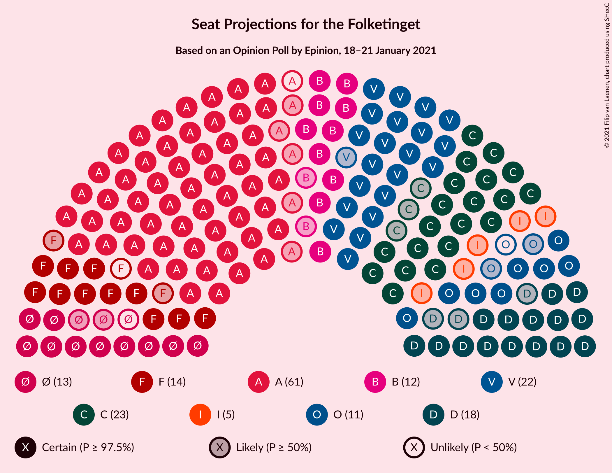
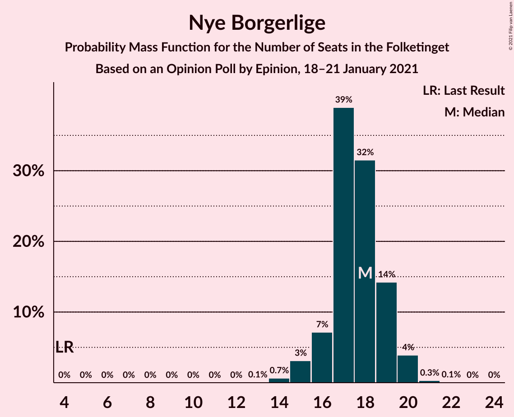
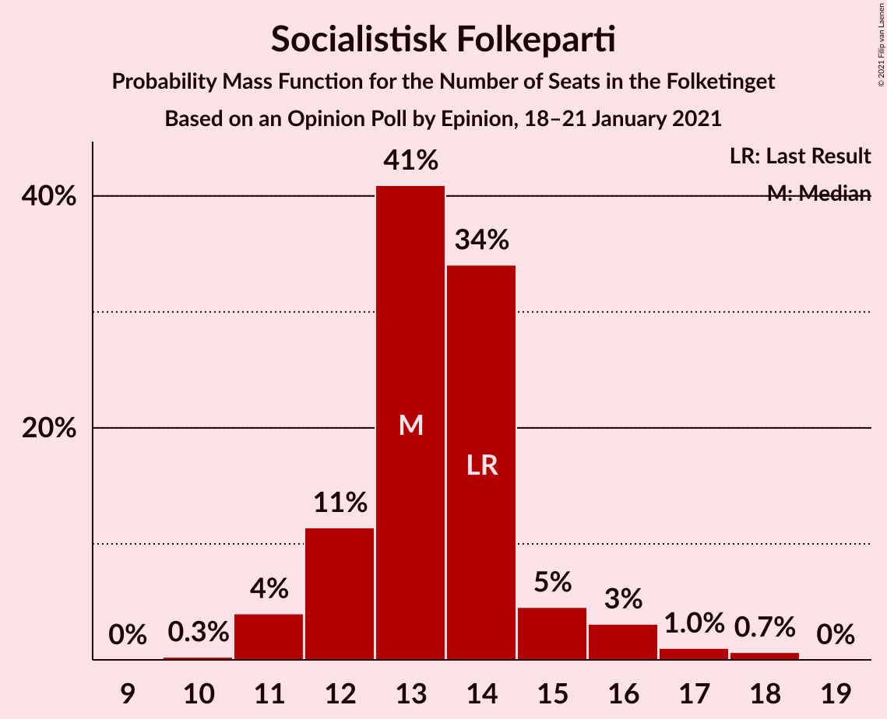
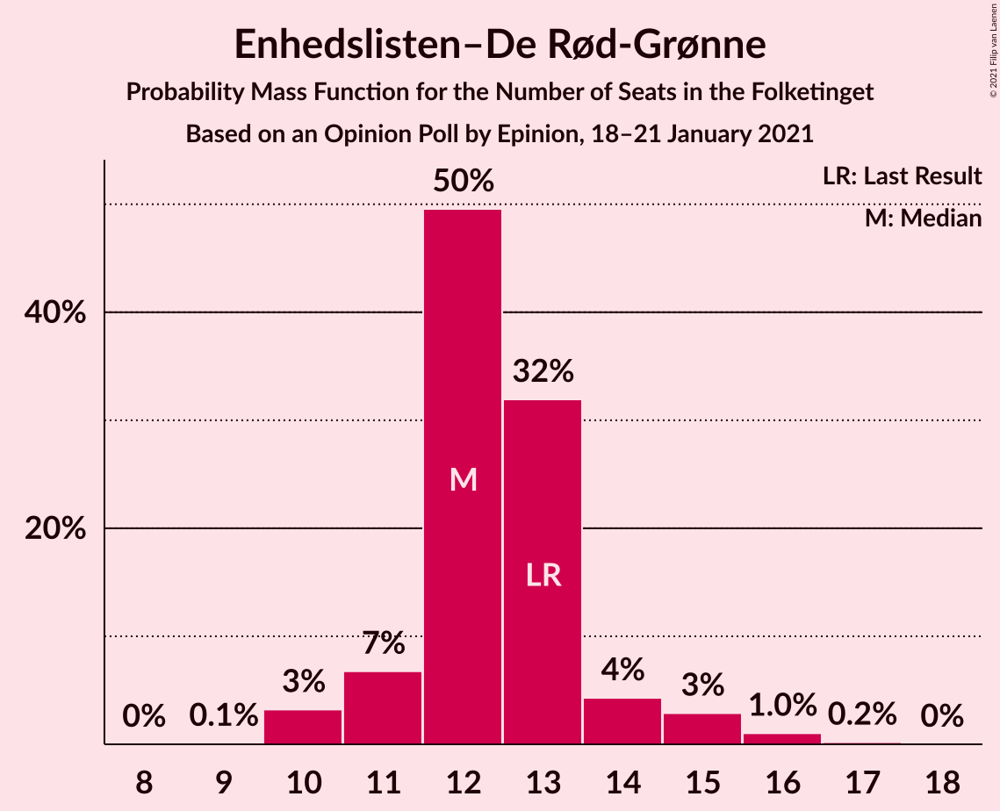
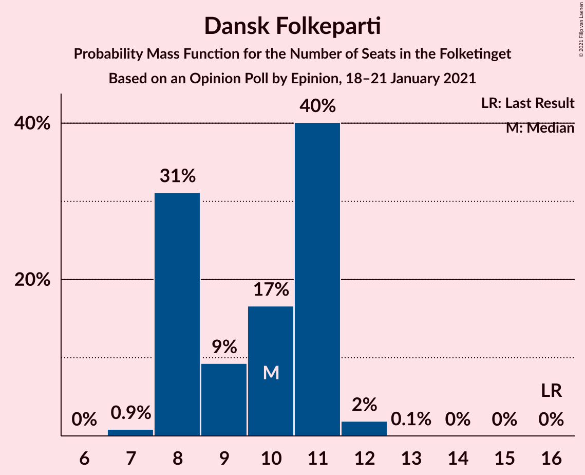
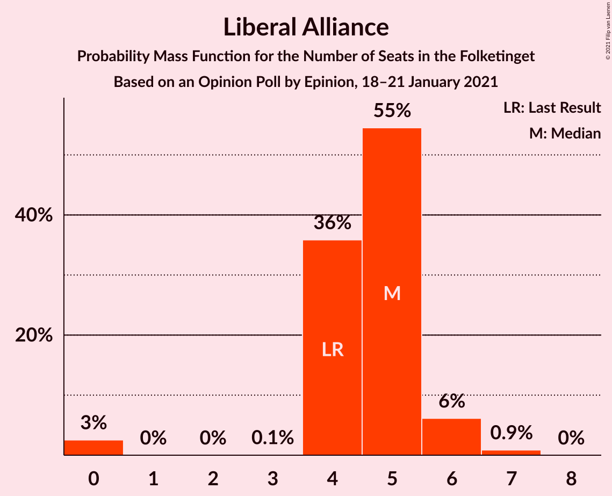
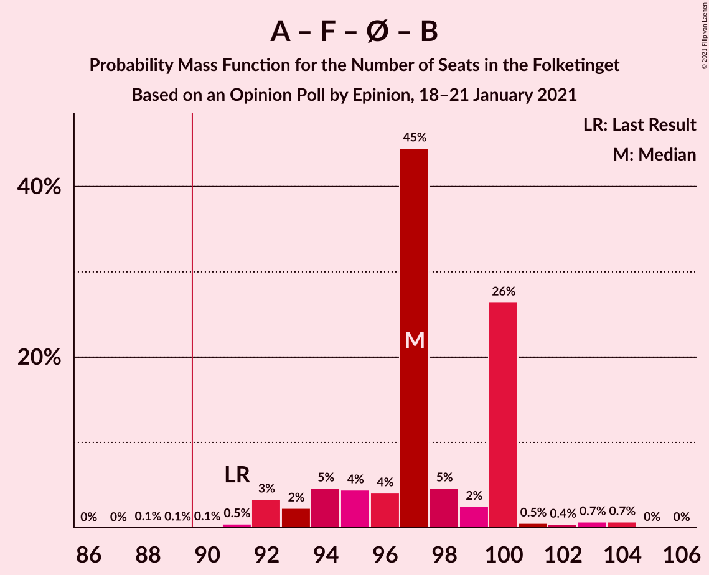
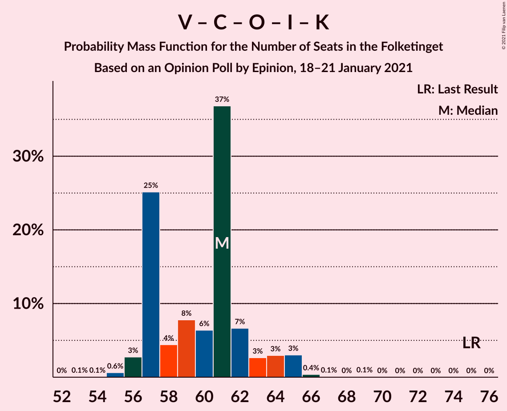

# Opinion Poll by Epinion, 18–21 January 2021

<a href="#voting-intentions">Voting Intentions</a> | <a href="#seats">Seats</a> | <a href="#coalitions">Coalitions</a> | <a href="#technical-information">Technical Information</a>

## Voting Intentions

### Confidence Intervals

| Party | Last Result | Poll Result | 80% Confidence Interval | 90% Confidence Interval | 95% Confidence Interval | 99% Confidence Interval |
|:-----:|:-----------:|:-----------:|:-----------------------:|:-----------------------:|:-----------------------:|:-----------------------:|
| Socialdemokraterne | 25.9% | 32.5% | 31.1–34.0% |30.7–34.4% |30.3–34.8% |29.7–35.5% |
| Venstre | 23.4% | 13.3% | 12.3–14.4% |12.0–14.7% |11.8–15.0% |11.3–15.5% |
| Det Konservative Folkeparti | 6.6% | 12.5% | 11.5–13.6% |11.3–13.9% |11.0–14.2% |10.6–14.7% |
| Nye Borgerlige | 2.4% | 9.6% | 8.8–10.6% |8.5–10.9% |8.3–11.1% |7.9–11.6% |
| Socialistisk Folkeparti | 7.7% | 7.6% | 6.8–8.5% |6.6–8.7% |6.4–9.0% |6.1–9.4% |
| Enhedslisten–De Rød-Grønne | 6.9% | 6.9% | 6.2–7.8% |6.0–8.0% |5.8–8.2% |5.5–8.6% |
| Radikale Venstre | 8.6% | 6.4% | 5.7–7.2% |5.5–7.5% |5.3–7.7% |5.0–8.1% |
| Dansk Folkeparti | 8.7% | 5.3% | 4.7–6.1% |4.5–6.3% |4.3–6.5% |4.1–6.8% |
| Liberal Alliance | 2.3% | 2.4% | 2.0–3.0% |1.9–3.1% |1.8–3.3% |1.6–3.6% |
| Kristendemokraterne | 1.7% | 1.2% | 0.9–1.6% |0.9–1.7% |0.8–1.8% |0.7–2.1% |
| Alternativet | 3.0% | 0.6% | 0.4–0.9% |0.4–1.0% |0.3–1.1% |0.2–1.2% |
| Veganerpartiet | 0.0% | 0.2% | 0.1–0.4% |0.1–0.5% |0.1–0.5% |0.0–0.6% |

*Note:* The poll result column reflects the actual value used in the calculations. Published results may vary slightly, and in addition be rounded to fewer digits.

## Seats

### Confidence Intervals

| Party | Last Result | Median | 80% Confidence Interval | 90% Confidence Interval | 95% Confidence Interval | 99% Confidence Interval |
|:-----:|:-----------:|:------:|:-----------------------:|:-----------------------:|:-----------------------:|:-----------------------:|
| <a href="#socialdemokraterne">Socialdemokraterne</a> | 48 | 60 | 57–61 |56–61 |55–62 |54–64 |
| <a href="#venstre">Venstre</a> | 43 | 22 | 22–25 |22–26 |21–26 |21–28 |
| <a href="#det-konservative-folkeparti">Det Konservative Folkeparti</a> | 12 | 23 | 20–23 |20–25 |20–25 |19–26 |
| <a href="#nye-borgerlige">Nye Borgerlige</a> | 4 | 18 | 16–19 |16–19 |15–20 |14–20 |
| <a href="#socialistisk-folkeparti">Socialistisk Folkeparti</a> | 14 | 13 | 12–14 |12–15 |11–16 |11–18 |
| <a href="#enhedslisten–de-rød-grønne">Enhedslisten–De Rød-Grønne</a> | 13 | 12 | 11–13 |11–14 |10–15 |10–16 |
| <a href="#radikale-venstre">Radikale Venstre</a> | 16 | 12 | 10–14 |10–14 |10–14 |9–14 |
| <a href="#dansk-folkeparti">Dansk Folkeparti</a> | 16 | 10 | 8–11 |8–11 |8–11 |7–12 |
| <a href="#liberal-alliance">Liberal Alliance</a> | 4 | 5 | 4–5 |4–6 |0–6 |0–7 |
| <a href="#kristendemokraterne">Kristendemokraterne</a> | 0 | 0 | 0 |0 |0 |0–4 |
| <a href="#alternativet">Alternativet</a> | 5 | 0 | 0 |0 |0 |0 |
| <a href="#veganerpartiet">Veganerpartiet</a> | 0 | 0 | 0 |0 |0 |0 |

### Socialdemokraterne

*For a full overview of the results for this party, see the [Socialdemokraterne](party-socialdemokraterne.html) page.*

| Number of Seats | Probability | Accumulated | Special Marks |
|:---------------:|:-----------:|:-----------:|:-------------:|
| 48 | 0% | 100% | Last Result |
| 49 | 0% | 100% |  |
| 50 | 0% | 100% |  |
| 51 | 0% | 100% |  |
| 52 | 0.2% | 100% |  |
| 53 | 0.1% | 99.8% |  |
| 54 | 0.3% | 99.6% |  |
| 55 | 3% | 99.3% |  |
| 56 | 4% | 96% |  |
| 57 | 3% | 92% |  |
| 58 | 8% | 90% |  |
| 59 | 10% | 82% |  |
| 60 | 38% | 72% | Median |
| 61 | 31% | 34% |  |
| 62 | 0.8% | 3% |  |
| 63 | 1.1% | 2% |  |
| 64 | 1.2% | 1.4% |  |
| 65 | 0.2% | 0.2% |  |
| 66 | 0% | 0% |  |

### Venstre

*For a full overview of the results for this party, see the [Venstre](party-venstre.html) page.*

| Number of Seats | Probability | Accumulated | Special Marks |
|:---------------:|:-----------:|:-----------:|:-------------:|
| 20 | 0.3% | 100% |  |
| 21 | 3% | 99.7% |  |
| 22 | 59% | 97% | Median |
| 23 | 6% | 38% |  |
| 24 | 13% | 32% |  |
| 25 | 12% | 19% |  |
| 26 | 5% | 7% |  |
| 27 | 2% | 2% |  |
| 28 | 0.2% | 0.6% |  |
| 29 | 0.4% | 0.4% |  |
| 30 | 0% | 0% |  |
| 31 | 0% | 0% |  |
| 32 | 0% | 0% |  |
| 33 | 0% | 0% |  |
| 34 | 0% | 0% |  |
| 35 | 0% | 0% |  |
| 36 | 0% | 0% |  |
| 37 | 0% | 0% |  |
| 38 | 0% | 0% |  |
| 39 | 0% | 0% |  |
| 40 | 0% | 0% |  |
| 41 | 0% | 0% |  |
| 42 | 0% | 0% |  |
| 43 | 0% | 0% | Last Result |

### Det Konservative Folkeparti

*For a full overview of the results for this party, see the [Det Konservative Folkeparti](party-detkonservativefolkeparti.html) page.*

| Number of Seats | Probability | Accumulated | Special Marks |
|:---------------:|:-----------:|:-----------:|:-------------:|
| 12 | 0% | 100% | Last Result |
| 13 | 0% | 100% |  |
| 14 | 0% | 100% |  |
| 15 | 0% | 100% |  |
| 16 | 0% | 100% |  |
| 17 | 0% | 100% |  |
| 18 | 0.1% | 100% |  |
| 19 | 2% | 99.9% |  |
| 20 | 9% | 98% |  |
| 21 | 9% | 89% |  |
| 22 | 10% | 80% |  |
| 23 | 62% | 71% | Median |
| 24 | 4% | 9% |  |
| 25 | 4% | 6% |  |
| 26 | 1.0% | 1.3% |  |
| 27 | 0.1% | 0.2% |  |
| 28 | 0.1% | 0.1% |  |
| 29 | 0% | 0% |  |

### Nye Borgerlige

*For a full overview of the results for this party, see the [Nye Borgerlige](party-nyeborgerlige.html) page.*

| Number of Seats | Probability | Accumulated | Special Marks |
|:---------------:|:-----------:|:-----------:|:-------------:|
| 4 | 0% | 100% | Last Result |
| 5 | 0% | 100% |  |
| 6 | 0% | 100% |  |
| 7 | 0% | 100% |  |
| 8 | 0% | 100% |  |
| 9 | 0% | 100% |  |
| 10 | 0% | 100% |  |
| 11 | 0% | 100% |  |
| 12 | 0% | 100% |  |
| 13 | 0.1% | 100% |  |
| 14 | 0.7% | 99.9% |  |
| 15 | 3% | 99.3% |  |
| 16 | 7% | 96% |  |
| 17 | 39% | 89% |  |
| 18 | 32% | 50% | Median |
| 19 | 14% | 19% |  |
| 20 | 4% | 4% |  |
| 21 | 0.3% | 0.4% |  |
| 22 | 0.1% | 0.1% |  |
| 23 | 0% | 0% |  |

### Socialistisk Folkeparti

*For a full overview of the results for this party, see the [Socialistisk Folkeparti](party-socialistiskfolkeparti.html) page.*

| Number of Seats | Probability | Accumulated | Special Marks |
|:---------------:|:-----------:|:-----------:|:-------------:|
| 10 | 0.3% | 100% |  |
| 11 | 4% | 99.7% |  |
| 12 | 11% | 96% |  |
| 13 | 41% | 84% | Median |
| 14 | 34% | 43% | Last Result |
| 15 | 5% | 9% |  |
| 16 | 3% | 5% |  |
| 17 | 1.0% | 2% |  |
| 18 | 0.7% | 0.7% |  |
| 19 | 0% | 0% |  |

### Enhedslisten–De Rød-Grønne

*For a full overview of the results for this party, see the [Enhedslisten–De Rød-Grønne](party-enhedslisten–derød-grønne.html) page.*

| Number of Seats | Probability | Accumulated | Special Marks |
|:---------------:|:-----------:|:-----------:|:-------------:|
| 9 | 0.1% | 100% |  |
| 10 | 3% | 99.9% |  |
| 11 | 7% | 97% |  |
| 12 | 50% | 90% | Median |
| 13 | 32% | 40% | Last Result |
| 14 | 4% | 8% |  |
| 15 | 3% | 4% |  |
| 16 | 1.0% | 1.2% |  |
| 17 | 0.2% | 0.2% |  |
| 18 | 0% | 0% |  |

### Radikale Venstre

*For a full overview of the results for this party, see the [Radikale Venstre](party-radikalevenstre.html) page.*

| Number of Seats | Probability | Accumulated | Special Marks |
|:---------------:|:-----------:|:-----------:|:-------------:|
| 9 | 2% | 100% |  |
| 10 | 9% | 98% |  |
| 11 | 11% | 89% |  |
| 12 | 62% | 78% | Median |
| 13 | 6% | 16% |  |
| 14 | 10% | 10% |  |
| 15 | 0.4% | 0.5% |  |
| 16 | 0% | 0% | Last Result |

### Dansk Folkeparti

*For a full overview of the results for this party, see the [Dansk Folkeparti](party-danskfolkeparti.html) page.*

| Number of Seats | Probability | Accumulated | Special Marks |
|:---------------:|:-----------:|:-----------:|:-------------:|
| 7 | 0.9% | 100% |  |
| 8 | 31% | 99.1% |  |
| 9 | 9% | 68% |  |
| 10 | 17% | 59% | Median |
| 11 | 40% | 42% |  |
| 12 | 2% | 2% |  |
| 13 | 0.1% | 0.1% |  |
| 14 | 0% | 0% |  |
| 15 | 0% | 0% |  |
| 16 | 0% | 0% | Last Result |

### Liberal Alliance

*For a full overview of the results for this party, see the [Liberal Alliance](party-liberalalliance.html) page.*

| Number of Seats | Probability | Accumulated | Special Marks |
|:---------------:|:-----------:|:-----------:|:-------------:|
| 0 | 3% | 100% |  |
| 1 | 0% | 97% |  |
| 2 | 0% | 97% |  |
| 3 | 0.1% | 97% |  |
| 4 | 36% | 97% | Last Result |
| 5 | 55% | 62% | Median |
| 6 | 6% | 7% |  |
| 7 | 0.9% | 0.9% |  |
| 8 | 0% | 0% |  |

### Kristendemokraterne

*For a full overview of the results for this party, see the [Kristendemokraterne](party-kristendemokraterne.html) page.*

| Number of Seats | Probability | Accumulated | Special Marks |
|:---------------:|:-----------:|:-----------:|:-------------:|
| 0 | 99.4% | 100% | Last Result, Median |
| 1 | 0% | 0.6% |  |
| 2 | 0% | 0.6% |  |
| 3 | 0% | 0.6% |  |
| 4 | 0.6% | 0.6% |  |
| 5 | 0% | 0% |  |

### Alternativet

*For a full overview of the results for this party, see the [Alternativet](party-alternativet.html) page.*

| Number of Seats | Probability | Accumulated | Special Marks |
|:---------------:|:-----------:|:-----------:|:-------------:|
| 0 | 100% | 100% | Median |
| 1 | 0% | 0% |  |
| 2 | 0% | 0% |  |
| 3 | 0% | 0% |  |
| 4 | 0% | 0% |  |
| 5 | 0% | 0% | Last Result |

### Veganerpartiet

*For a full overview of the results for this party, see the [Veganerpartiet](party-veganerpartiet.html) page.*

| Number of Seats | Probability | Accumulated | Special Marks |
|:---------------:|:-----------:|:-----------:|:-------------:|
| 0 | 100% | 100% | Last Result, Median |

## Coalitions

### Confidence Intervals

| Coalition | Last Result | Median | Majority? | 80% Confidence Interval | 90% Confidence Interval | 95% Confidence Interval | 99% Confidence Interval |
|:---------:|:-----------:|:------:|:---------:|:-----------------------:|:-----------------------:|:-----------------------:|:-----------------------:|
| Socialdemokraterne – Socialistisk Folkeparti – Enhedslisten–De Rød-Grønne – Radikale Venstre – Alternativet | 96 | 97 | 99.8% | 94–100 | 93–100 | 92–100 | 91–104 |
| Socialdemokraterne – Socialistisk Folkeparti – Enhedslisten–De Rød-Grønne – Radikale Venstre | 91 | 97 | 99.8% | 94–100 | 93–100 | 92–100 | 91–104 |
| Socialdemokraterne – Socialistisk Folkeparti – Enhedslisten–De Rød-Grønne – Alternativet | 80 | 85 | 2% | 83–88 | 82–88 | 82–89 | 79–93 |
| Socialdemokraterne – Socialistisk Folkeparti – Enhedslisten–De Rød-Grønne | 75 | 85 | 2% | 83–88 | 82–88 | 82–89 | 79–93 |
| Socialdemokraterne – Socialistisk Folkeparti – Radikale Venstre | 78 | 85 | 2% | 82–87 | 81–87 | 80–88 | 79–92 |
| Venstre – Det Konservative Folkeparti – Nye Borgerlige – Dansk Folkeparti – Liberal Alliance – Kristendemokraterne | 79 | 78 | 0% | 75–80 | 75–81 | 74–83 | 71–84 |
| Venstre – Det Konservative Folkeparti – Nye Borgerlige – Dansk Folkeparti – Liberal Alliance | 79 | 78 | 0% | 75–80 | 75–81 | 74–83 | 71–83 |
| Socialdemokraterne – Radikale Venstre | 64 | 72 | 0% | 68–73 | 67–73 | 67–74 | 65–76 |
| Venstre – Det Konservative Folkeparti – Dansk Folkeparti – Liberal Alliance – Kristendemokraterne | 75 | 61 | 0% | 57–62 | 57–64 | 56–65 | 55–66 |
| Venstre – Det Konservative Folkeparti – Dansk Folkeparti – Liberal Alliance | 75 | 61 | 0% | 57–62 | 57–64 | 56–65 | 55–65 |
| Venstre – Det Konservative Folkeparti – Liberal Alliance | 59 | 50 | 0% | 49–53 | 48–54 | 47–55 | 45–55 |
| Venstre – Det Konservative Folkeparti | 55 | 45 | 0% | 44–48 | 44–49 | 43–50 | 42–51 |
| Venstre | 43 | 22 | 0% | 22–25 | 22–26 | 21–26 | 21–28 |

### Socialdemokraterne – Socialistisk Folkeparti – Enhedslisten–De Rød-Grønne – Radikale Venstre – Alternativet

| Number of Seats | Probability | Accumulated | Special Marks |
|:---------------:|:-----------:|:-----------:|:-------------:|
| 88 | 0.1% | 100% |  |
| 89 | 0.1% | 99.9% |  |
| 90 | 0.1% | 99.8% | Majority |
| 91 | 0.5% | 99.7% |  |
| 92 | 3% | 99.3% |  |
| 93 | 2% | 96% |  |
| 94 | 5% | 94% |  |
| 95 | 4% | 89% |  |
| 96 | 4% | 85% | Last Result |
| 97 | 45% | 80% | Median |
| 98 | 5% | 36% |  |
| 99 | 2% | 31% |  |
| 100 | 26% | 29% |  |
| 101 | 0.5% | 2% |  |
| 102 | 0.4% | 2% |  |
| 103 | 0.7% | 1.4% |  |
| 104 | 0.7% | 0.7% |  |
| 105 | 0% | 0% |  |

### Socialdemokraterne – Socialistisk Folkeparti – Enhedslisten–De Rød-Grønne – Radikale Venstre

| Number of Seats | Probability | Accumulated | Special Marks |
|:---------------:|:-----------:|:-----------:|:-------------:|
| 88 | 0.1% | 100% |  |
| 89 | 0.1% | 99.9% |  |
| 90 | 0.1% | 99.8% | Majority |
| 91 | 0.5% | 99.7% | Last Result |
| 92 | 3% | 99.3% |  |
| 93 | 2% | 96% |  |
| 94 | 5% | 94% |  |
| 95 | 4% | 89% |  |
| 96 | 4% | 85% |  |
| 97 | 45% | 80% | Median |
| 98 | 5% | 36% |  |
| 99 | 2% | 31% |  |
| 100 | 26% | 29% |  |
| 101 | 0.5% | 2% |  |
| 102 | 0.4% | 2% |  |
| 103 | 0.7% | 1.4% |  |
| 104 | 0.7% | 0.7% |  |
| 105 | 0% | 0% |  |

### Socialdemokraterne – Socialistisk Folkeparti – Enhedslisten–De Rød-Grønne – Alternativet

| Number of Seats | Probability | Accumulated | Special Marks |
|:---------------:|:-----------:|:-----------:|:-------------:|
| 78 | 0.3% | 100% |  |
| 79 | 0.2% | 99.7% |  |
| 80 | 0.5% | 99.5% | Last Result |
| 81 | 1.3% | 99.0% |  |
| 82 | 6% | 98% |  |
| 83 | 9% | 92% |  |
| 84 | 9% | 83% |  |
| 85 | 37% | 73% | Median |
| 86 | 4% | 37% |  |
| 87 | 4% | 33% |  |
| 88 | 25% | 30% |  |
| 89 | 3% | 5% |  |
| 90 | 0.4% | 2% | Majority |
| 91 | 0.1% | 1.5% |  |
| 92 | 0.9% | 1.4% |  |
| 93 | 0.6% | 0.6% |  |
| 94 | 0% | 0% |  |

### Socialdemokraterne – Socialistisk Folkeparti – Enhedslisten–De Rød-Grønne

| Number of Seats | Probability | Accumulated | Special Marks |
|:---------------:|:-----------:|:-----------:|:-------------:|
| 75 | 0% | 100% | Last Result |
| 76 | 0% | 100% |  |
| 77 | 0% | 100% |  |
| 78 | 0.3% | 100% |  |
| 79 | 0.2% | 99.7% |  |
| 80 | 0.5% | 99.5% |  |
| 81 | 1.3% | 99.0% |  |
| 82 | 6% | 98% |  |
| 83 | 9% | 92% |  |
| 84 | 9% | 83% |  |
| 85 | 37% | 73% | Median |
| 86 | 4% | 37% |  |
| 87 | 4% | 33% |  |
| 88 | 25% | 30% |  |
| 89 | 3% | 5% |  |
| 90 | 0.4% | 2% | Majority |
| 91 | 0.1% | 1.5% |  |
| 92 | 0.9% | 1.4% |  |
| 93 | 0.6% | 0.6% |  |
| 94 | 0% | 0% |  |

### Socialdemokraterne – Socialistisk Folkeparti – Radikale Venstre

| Number of Seats | Probability | Accumulated | Special Marks |
|:---------------:|:-----------:|:-----------:|:-------------:|
| 75 | 0.1% | 100% |  |
| 76 | 0% | 99.9% |  |
| 77 | 0.2% | 99.9% |  |
| 78 | 0.2% | 99.7% | Last Result |
| 79 | 0.3% | 99.5% |  |
| 80 | 3% | 99.2% |  |
| 81 | 3% | 96% |  |
| 82 | 7% | 93% |  |
| 83 | 4% | 86% |  |
| 84 | 4% | 82% |  |
| 85 | 44% | 79% | Median |
| 86 | 6% | 34% |  |
| 87 | 26% | 28% |  |
| 88 | 0.7% | 3% |  |
| 89 | 0.5% | 2% |  |
| 90 | 0.8% | 2% | Majority |
| 91 | 0.1% | 0.7% |  |
| 92 | 0.6% | 0.6% |  |
| 93 | 0% | 0% |  |

### Venstre – Det Konservative Folkeparti – Nye Borgerlige – Dansk Folkeparti – Liberal Alliance – Kristendemokraterne

| Number of Seats | Probability | Accumulated | Special Marks |
|:---------------:|:-----------:|:-----------:|:-------------:|
| 71 | 0.7% | 100% |  |
| 72 | 0.8% | 99.3% |  |
| 73 | 0.5% | 98% |  |
| 74 | 0.9% | 98% |  |
| 75 | 27% | 97% |  |
| 76 | 3% | 71% |  |
| 77 | 5% | 68% |  |
| 78 | 46% | 63% | Median |
| 79 | 4% | 17% | Last Result |
| 80 | 4% | 13% |  |
| 81 | 4% | 8% |  |
| 82 | 0.5% | 4% |  |
| 83 | 3% | 4% |  |
| 84 | 0.3% | 0.5% |  |
| 85 | 0.1% | 0.2% |  |
| 86 | 0% | 0.1% |  |
| 87 | 0.1% | 0.1% |  |
| 88 | 0% | 0% |  |

### Venstre – Det Konservative Folkeparti – Nye Borgerlige – Dansk Folkeparti – Liberal Alliance

| Number of Seats | Probability | Accumulated | Special Marks |
|:---------------:|:-----------:|:-----------:|:-------------:|
| 71 | 0.7% | 100% |  |
| 72 | 0.8% | 99.3% |  |
| 73 | 0.5% | 98% |  |
| 74 | 1.0% | 98% |  |
| 75 | 27% | 97% |  |
| 76 | 3% | 70% |  |
| 77 | 5% | 67% |  |
| 78 | 46% | 62% | Median |
| 79 | 4% | 16% | Last Result |
| 80 | 4% | 12% |  |
| 81 | 4% | 8% |  |
| 82 | 0.5% | 4% |  |
| 83 | 3% | 4% |  |
| 84 | 0.3% | 0.4% |  |
| 85 | 0.1% | 0.1% |  |
| 86 | 0% | 0% |  |

### Socialdemokraterne – Radikale Venstre

| Number of Seats | Probability | Accumulated | Special Marks |
|:---------------:|:-----------:|:-----------:|:-------------:|
| 62 | 0.1% | 100% |  |
| 63 | 0.1% | 99.9% |  |
| 64 | 0.1% | 99.8% | Last Result |
| 65 | 0.2% | 99.7% |  |
| 66 | 0.8% | 99.5% |  |
| 67 | 4% | 98.6% |  |
| 68 | 6% | 95% |  |
| 69 | 4% | 89% |  |
| 70 | 5% | 86% |  |
| 71 | 8% | 81% |  |
| 72 | 37% | 73% | Median |
| 73 | 31% | 36% |  |
| 74 | 3% | 4% |  |
| 75 | 0.9% | 2% |  |
| 76 | 0.4% | 0.7% |  |
| 77 | 0.3% | 0.3% |  |
| 78 | 0% | 0% |  |

### Venstre – Det Konservative Folkeparti – Dansk Folkeparti – Liberal Alliance – Kristendemokraterne

| Number of Seats | Probability | Accumulated | Special Marks |
|:---------------:|:-----------:|:-----------:|:-------------:|
| 53 | 0.1% | 100% |  |
| 54 | 0.1% | 99.9% |  |
| 55 | 0.6% | 99.8% |  |
| 56 | 3% | 99.2% |  |
| 57 | 25% | 96% |  |
| 58 | 4% | 71% |  |
| 59 | 8% | 67% |  |
| 60 | 6% | 59% | Median |
| 61 | 37% | 53% |  |
| 62 | 7% | 16% |  |
| 63 | 3% | 9% |  |
| 64 | 3% | 7% |  |
| 65 | 3% | 4% |  |
| 66 | 0.4% | 0.6% |  |
| 67 | 0.1% | 0.2% |  |
| 68 | 0% | 0.1% |  |
| 69 | 0.1% | 0.1% |  |
| 70 | 0% | 0% |  |
| 71 | 0% | 0% |  |
| 72 | 0% | 0% |  |
| 73 | 0% | 0% |  |
| 74 | 0% | 0% |  |
| 75 | 0% | 0% | Last Result |

### Venstre – Det Konservative Folkeparti – Dansk Folkeparti – Liberal Alliance

| Number of Seats | Probability | Accumulated | Special Marks |
|:---------------:|:-----------:|:-----------:|:-------------:|
| 53 | 0.1% | 100% |  |
| 54 | 0.1% | 99.9% |  |
| 55 | 0.6% | 99.8% |  |
| 56 | 3% | 99.2% |  |
| 57 | 25% | 96% |  |
| 58 | 5% | 71% |  |
| 59 | 8% | 67% |  |
| 60 | 6% | 59% | Median |
| 61 | 37% | 52% |  |
| 62 | 6% | 16% |  |
| 63 | 3% | 9% |  |
| 64 | 3% | 6% |  |
| 65 | 3% | 3% |  |
| 66 | 0.3% | 0.4% |  |
| 67 | 0.1% | 0.1% |  |
| 68 | 0% | 0% |  |
| 69 | 0% | 0% |  |
| 70 | 0% | 0% |  |
| 71 | 0% | 0% |  |
| 72 | 0% | 0% |  |
| 73 | 0% | 0% |  |
| 74 | 0% | 0% |  |
| 75 | 0% | 0% | Last Result |

### Venstre – Det Konservative Folkeparti – Liberal Alliance

| Number of Seats | Probability | Accumulated | Special Marks |
|:---------------:|:-----------:|:-----------:|:-------------:|
| 43 | 0% | 100% |  |
| 44 | 0.1% | 99.9% |  |
| 45 | 1.4% | 99.9% |  |
| 46 | 0.3% | 98.5% |  |
| 47 | 2% | 98% |  |
| 48 | 3% | 96% |  |
| 49 | 32% | 93% |  |
| 50 | 38% | 61% | Median |
| 51 | 5% | 23% |  |
| 52 | 7% | 18% |  |
| 53 | 5% | 11% |  |
| 54 | 2% | 6% |  |
| 55 | 4% | 4% |  |
| 56 | 0.3% | 0.4% |  |
| 57 | 0.1% | 0.1% |  |
| 58 | 0% | 0% |  |
| 59 | 0% | 0% | Last Result |

### Venstre – Det Konservative Folkeparti

| Number of Seats | Probability | Accumulated | Special Marks |
|:---------------:|:-----------:|:-----------:|:-------------:|
| 41 | 0.3% | 100% |  |
| 42 | 1.1% | 99.7% |  |
| 43 | 3% | 98.6% |  |
| 44 | 9% | 96% |  |
| 45 | 61% | 87% | Median |
| 46 | 6% | 26% |  |
| 47 | 9% | 20% |  |
| 48 | 5% | 11% |  |
| 49 | 1.5% | 6% |  |
| 50 | 4% | 5% |  |
| 51 | 0.9% | 1.1% |  |
| 52 | 0.1% | 0.2% |  |
| 53 | 0.1% | 0.1% |  |
| 54 | 0% | 0% |  |
| 55 | 0% | 0% | Last Result |

### Venstre

| Number of Seats | Probability | Accumulated | Special Marks |
|:---------------:|:-----------:|:-----------:|:-------------:|
| 20 | 0.3% | 100% |  |
| 21 | 3% | 99.7% |  |
| 22 | 59% | 97% | Median |
| 23 | 6% | 38% |  |
| 24 | 13% | 32% |  |
| 25 | 12% | 19% |  |
| 26 | 5% | 7% |  |
| 27 | 2% | 2% |  |
| 28 | 0.2% | 0.6% |  |
| 29 | 0.4% | 0.4% |  |
| 30 | 0% | 0% |  |
| 31 | 0% | 0% |  |
| 32 | 0% | 0% |  |
| 33 | 0% | 0% |  |
| 34 | 0% | 0% |  |
| 35 | 0% | 0% |  |
| 36 | 0% | 0% |  |
| 37 | 0% | 0% |  |
| 38 | 0% | 0% |  |
| 39 | 0% | 0% |  |
| 40 | 0% | 0% |  |
| 41 | 0% | 0% |  |
| 42 | 0% | 0% |  |
| 43 | 0% | 0% | Last Result |

## Technical Information

### Opinion Poll

+ **Polling firm:** Epinion
+ **Commissioner(s):** —
+ **Fieldwork period:** 18–21 January 2021

### Calculations

+ **Sample size:** 1735
+ **Simulations done:** 1,048,576
+ **Error estimate:** 2.10%

