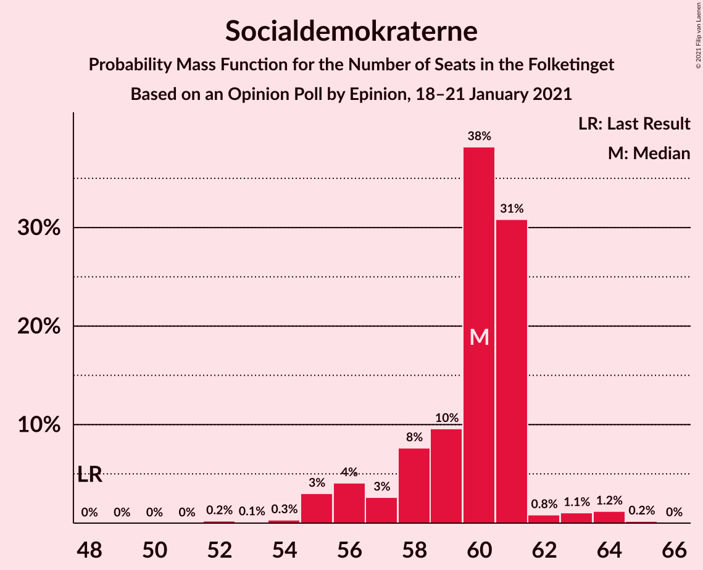
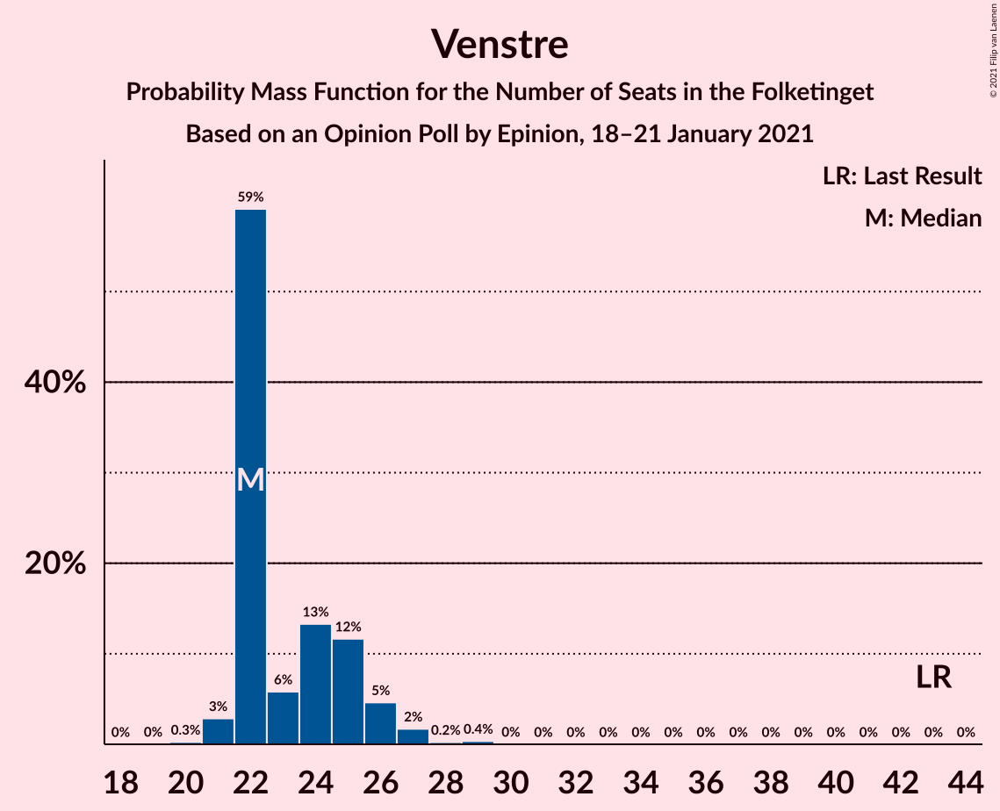
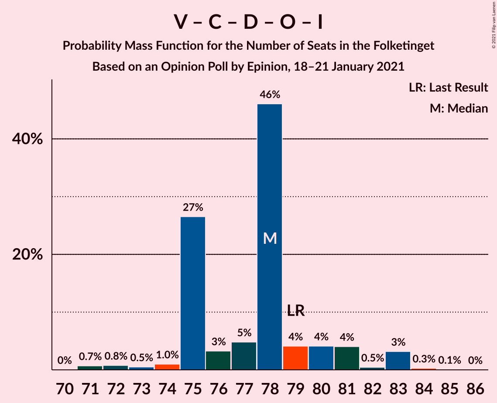
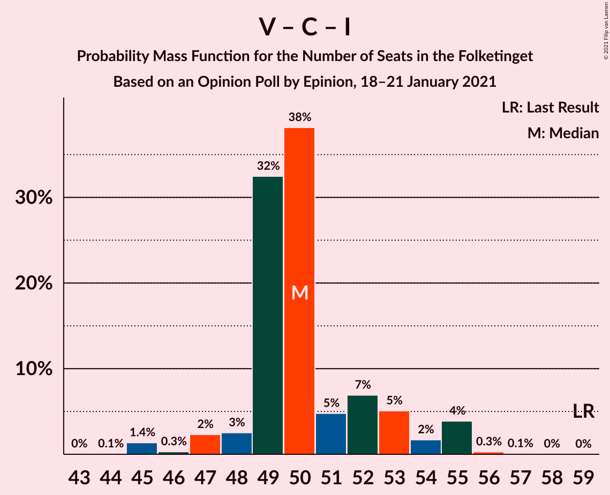
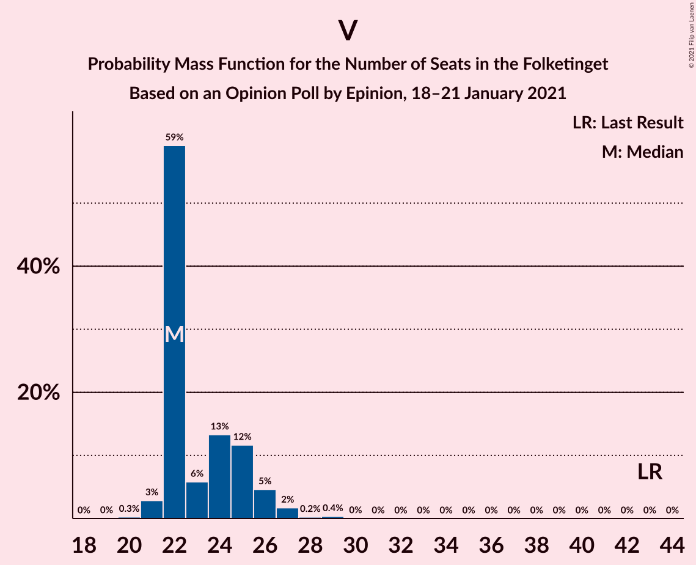

# Opinion Poll by Epinion, 18–21 January 2021

<a href="#voting-intentions">Voting Intentions</a> | <a href="#seats">Seats</a> | <a href="#coalitions">Coalitions</a> | <a href="#technical-information">Technical Information</a>

## Voting Intentions

### Confidence Intervals

| Party | Last Result | Poll Result | 80% Confidence Interval | 90% Confidence Interval | 95% Confidence Interval | 99% Confidence Interval |
|:-----:|:-----------:|:-----------:|:-----------------------:|:-----------------------:|:-----------------------:|:-----------------------:|
| Socialdemokraterne | 25.9% | 32.5% | 31.1–34.0% |30.7–34.4% |30.3–34.8% |29.7–35.5% |
| Venstre | 23.4% | 13.3% | 12.3–14.4% |12.0–14.7% |11.8–15.0% |11.3–15.5% |
| Det Konservative Folkeparti | 6.6% | 12.5% | 11.5–13.6% |11.3–13.9% |11.0–14.2% |10.6–14.7% |
| Nye Borgerlige | 2.4% | 9.6% | 8.8–10.6% |8.5–10.9% |8.3–11.1% |7.9–11.6% |
| Socialistisk Folkeparti | 7.7% | 7.6% | 6.8–8.5% |6.6–8.7% |6.4–9.0% |6.1–9.4% |
| Enhedslisten–De Rød-Grønne | 6.9% | 6.9% | 6.2–7.8% |6.0–8.0% |5.8–8.2% |5.5–8.6% |
| Radikale Venstre | 8.6% | 6.4% | 5.7–7.2% |5.5–7.5% |5.3–7.7% |5.0–8.1% |
| Dansk Folkeparti | 8.7% | 5.3% | 4.7–6.1% |4.5–6.3% |4.3–6.5% |4.1–6.8% |
| Liberal Alliance | 2.3% | 2.4% | 2.0–3.0% |1.9–3.1% |1.8–3.3% |1.6–3.6% |
| Kristendemokraterne | 1.7% | 1.2% | 0.9–1.6% |0.9–1.7% |0.8–1.8% |0.7–2.1% |
| Alternativet | 3.0% | 0.6% | 0.4–0.9% |0.4–1.0% |0.3–1.1% |0.2–1.2% |
| Veganerpartiet | 0.0% | 0.2% | 0.1–0.4% |0.1–0.5% |0.1–0.5% |0.0–0.6% |

*Note:* The poll result column reflects the actual value used in the calculations. Published results may vary slightly, and in addition be rounded to fewer digits.

## Seats

### Confidence Intervals

| Party | Last Result | Median | 80% Confidence Interval | 90% Confidence Interval | 95% Confidence Interval | 99% Confidence Interval |
|:-----:|:-----------:|:------:|:-----------------------:|:-----------------------:|:-----------------------:|:-----------------------:|
| <a href="#socialdemokraterne">Socialdemokraterne</a> | 48 | 57 | 55–60 |54–61 |52–63 |52–65 |
| <a href="#venstre">Venstre</a> | 43 | 24 | 22–27 |22–27 |22–27 |21–28 |
| <a href="#det-konservative-folkeparti">Det Konservative Folkeparti</a> | 12 | 22 | 20–25 |20–25 |20–26 |19–27 |
| <a href="#nye-borgerlige">Nye Borgerlige</a> | 4 | 17 | 15–19 |15–19 |14–19 |14–22 |
| <a href="#socialistisk-folkeparti">Socialistisk Folkeparti</a> | 14 | 14 | 13–17 |12–17 |11–17 |11–17 |
| <a href="#enhedslisten–de-rød-grønne">Enhedslisten–De Rød-Grønne</a> | 13 | 12 | 11–14 |10–14 |10–15 |10–16 |
| <a href="#radikale-venstre">Radikale Venstre</a> | 16 | 11 | 10–13 |9–14 |9–15 |9–15 |
| <a href="#dansk-folkeparti">Dansk Folkeparti</a> | 16 | 10 | 9–11 |8–11 |8–12 |7–12 |
| <a href="#liberal-alliance">Liberal Alliance</a> | 4 | 5 | 4–6 |0–6 |0–6 |0–7 |
| <a href="#kristendemokraterne">Kristendemokraterne</a> | 0 | 0 | 0 |0 |0–4 |0–4 |
| <a href="#alternativet">Alternativet</a> | 5 | 0 | 0 |0 |0 |0 |
| <a href="#veganerpartiet">Veganerpartiet</a> | 0 | 0 | 0 |0 |0 |0 |

### Socialdemokraterne

*For a full overview of the results for this party, see the [Socialdemokraterne](party-socialdemokraterne.html) page.*

| Number of Seats | Probability | Accumulated | Special Marks |
|:---------------:|:-----------:|:-----------:|:-------------:|
| 48 | 0% | 100% | Last Result |
| 49 | 0% | 100% |  |
| 50 | 0% | 100% |  |
| 51 | 0% | 100% |  |
| 52 | 3% | 99.9% |  |
| 53 | 0.1% | 97% |  |
| 54 | 3% | 97% |  |
| 55 | 8% | 94% |  |
| 56 | 16% | 86% |  |
| 57 | 23% | 70% | Median |
| 58 | 16% | 47% |  |
| 59 | 3% | 31% |  |
| 60 | 19% | 28% |  |
| 61 | 4% | 8% |  |
| 62 | 1.1% | 5% |  |
| 63 | 3% | 4% |  |
| 64 | 0.1% | 0.6% |  |
| 65 | 0.5% | 0.5% |  |
| 66 | 0% | 0% |  |

### Venstre

*For a full overview of the results for this party, see the [Venstre](party-venstre.html) page.*

| Number of Seats | Probability | Accumulated | Special Marks |
|:---------------:|:-----------:|:-----------:|:-------------:|
| 19 | 0.1% | 100% |  |
| 20 | 0.3% | 99.9% |  |
| 21 | 1.1% | 99.6% |  |
| 22 | 21% | 98% |  |
| 23 | 23% | 78% |  |
| 24 | 6% | 55% | Median |
| 25 | 13% | 49% |  |
| 26 | 20% | 35% |  |
| 27 | 13% | 15% |  |
| 28 | 2% | 2% |  |
| 29 | 0.2% | 0.3% |  |
| 30 | 0.1% | 0.1% |  |
| 31 | 0% | 0% |  |
| 32 | 0% | 0% |  |
| 33 | 0% | 0% |  |
| 34 | 0% | 0% |  |
| 35 | 0% | 0% |  |
| 36 | 0% | 0% |  |
| 37 | 0% | 0% |  |
| 38 | 0% | 0% |  |
| 39 | 0% | 0% |  |
| 40 | 0% | 0% |  |
| 41 | 0% | 0% |  |
| 42 | 0% | 0% |  |
| 43 | 0% | 0% | Last Result |

### Det Konservative Folkeparti

*For a full overview of the results for this party, see the [Det Konservative Folkeparti](party-detkonservativefolkeparti.html) page.*

| Number of Seats | Probability | Accumulated | Special Marks |
|:---------------:|:-----------:|:-----------:|:-------------:|
| 12 | 0% | 100% | Last Result |
| 13 | 0% | 100% |  |
| 14 | 0% | 100% |  |
| 15 | 0% | 100% |  |
| 16 | 0% | 100% |  |
| 17 | 0% | 100% |  |
| 18 | 0% | 100% |  |
| 19 | 0.5% | 100% |  |
| 20 | 11% | 99.4% |  |
| 21 | 15% | 89% |  |
| 22 | 27% | 74% | Median |
| 23 | 15% | 47% |  |
| 24 | 13% | 32% |  |
| 25 | 16% | 19% |  |
| 26 | 1.3% | 3% |  |
| 27 | 1.4% | 2% |  |
| 28 | 0% | 0.3% |  |
| 29 | 0.2% | 0.2% |  |
| 30 | 0% | 0% |  |

### Nye Borgerlige

*For a full overview of the results for this party, see the [Nye Borgerlige](party-nyeborgerlige.html) page.*

| Number of Seats | Probability | Accumulated | Special Marks |
|:---------------:|:-----------:|:-----------:|:-------------:|
| 4 | 0% | 100% | Last Result |
| 5 | 0% | 100% |  |
| 6 | 0% | 100% |  |
| 7 | 0% | 100% |  |
| 8 | 0% | 100% |  |
| 9 | 0% | 100% |  |
| 10 | 0% | 100% |  |
| 11 | 0% | 100% |  |
| 12 | 0% | 100% |  |
| 13 | 0% | 100% |  |
| 14 | 3% | 100% |  |
| 15 | 15% | 96% |  |
| 16 | 14% | 81% |  |
| 17 | 45% | 67% | Median |
| 18 | 6% | 22% |  |
| 19 | 14% | 16% |  |
| 20 | 0.4% | 2% |  |
| 21 | 0.6% | 2% |  |
| 22 | 0.9% | 1.0% |  |
| 23 | 0.1% | 0.1% |  |
| 24 | 0% | 0% |  |

### Socialistisk Folkeparti

*For a full overview of the results for this party, see the [Socialistisk Folkeparti](party-socialistiskfolkeparti.html) page.*

| Number of Seats | Probability | Accumulated | Special Marks |
|:---------------:|:-----------:|:-----------:|:-------------:|
| 10 | 0.1% | 100% |  |
| 11 | 3% | 99.9% |  |
| 12 | 7% | 97% |  |
| 13 | 22% | 90% |  |
| 14 | 30% | 68% | Last Result, Median |
| 15 | 4% | 38% |  |
| 16 | 10% | 34% |  |
| 17 | 24% | 24% |  |
| 18 | 0% | 0% |  |

### Enhedslisten–De Rød-Grønne

*For a full overview of the results for this party, see the [Enhedslisten–De Rød-Grønne](party-enhedslisten–derød-grønne.html) page.*

| Number of Seats | Probability | Accumulated | Special Marks |
|:---------------:|:-----------:|:-----------:|:-------------:|
| 8 | 0.1% | 100% |  |
| 9 | 0.1% | 99.9% |  |
| 10 | 8% | 99.8% |  |
| 11 | 31% | 92% |  |
| 12 | 19% | 61% | Median |
| 13 | 8% | 42% | Last Result |
| 14 | 29% | 34% |  |
| 15 | 3% | 5% |  |
| 16 | 2% | 2% |  |
| 17 | 0% | 0% |  |

### Radikale Venstre

*For a full overview of the results for this party, see the [Radikale Venstre](party-radikalevenstre.html) page.*

| Number of Seats | Probability | Accumulated | Special Marks |
|:---------------:|:-----------:|:-----------:|:-------------:|
| 8 | 0.1% | 100% |  |
| 9 | 8% | 99.9% |  |
| 10 | 24% | 92% |  |
| 11 | 18% | 68% | Median |
| 12 | 30% | 50% |  |
| 13 | 11% | 20% |  |
| 14 | 5% | 9% |  |
| 15 | 4% | 4% |  |
| 16 | 0% | 0% | Last Result |

### Dansk Folkeparti

*For a full overview of the results for this party, see the [Dansk Folkeparti](party-danskfolkeparti.html) page.*

| Number of Seats | Probability | Accumulated | Special Marks |
|:---------------:|:-----------:|:-----------:|:-------------:|
| 7 | 1.3% | 100% |  |
| 8 | 4% | 98.7% |  |
| 9 | 25% | 94% |  |
| 10 | 32% | 69% | Median |
| 11 | 34% | 38% |  |
| 12 | 3% | 3% |  |
| 13 | 0% | 0% |  |
| 14 | 0% | 0% |  |
| 15 | 0% | 0% |  |
| 16 | 0% | 0% | Last Result |

### Liberal Alliance

*For a full overview of the results for this party, see the [Liberal Alliance](party-liberalalliance.html) page.*

| Number of Seats | Probability | Accumulated | Special Marks |
|:---------------:|:-----------:|:-----------:|:-------------:|
| 0 | 5% | 100% |  |
| 1 | 0% | 95% |  |
| 2 | 0% | 95% |  |
| 3 | 0% | 95% |  |
| 4 | 27% | 95% | Last Result |
| 5 | 33% | 68% | Median |
| 6 | 32% | 35% |  |
| 7 | 2% | 2% |  |
| 8 | 0% | 0% |  |

### Kristendemokraterne

*For a full overview of the results for this party, see the [Kristendemokraterne](party-kristendemokraterne.html) page.*

| Number of Seats | Probability | Accumulated | Special Marks |
|:---------------:|:-----------:|:-----------:|:-------------:|
| 0 | 97% | 100% | Last Result, Median |
| 1 | 0% | 3% |  |
| 2 | 0% | 3% |  |
| 3 | 0% | 3% |  |
| 4 | 3% | 3% |  |
| 5 | 0% | 0% |  |

### Alternativet

*For a full overview of the results for this party, see the [Alternativet](party-alternativet.html) page.*

| Number of Seats | Probability | Accumulated | Special Marks |
|:---------------:|:-----------:|:-----------:|:-------------:|
| 0 | 100% | 100% | Median |
| 1 | 0% | 0% |  |
| 2 | 0% | 0% |  |
| 3 | 0% | 0% |  |
| 4 | 0% | 0% |  |
| 5 | 0% | 0% | Last Result |

### Veganerpartiet

*For a full overview of the results for this party, see the [Veganerpartiet](party-veganerpartiet.html) page.*

| Number of Seats | Probability | Accumulated | Special Marks |
|:---------------:|:-----------:|:-----------:|:-------------:|
| 0 | 100% | 100% | Last Result, Median |

## Coalitions

### Confidence Intervals

| Coalition | Last Result | Median | Majority? | 80% Confidence Interval | 90% Confidence Interval | 95% Confidence Interval | 99% Confidence Interval |
|:---------:|:-----------:|:------:|:---------:|:-----------------------:|:-----------------------:|:-----------------------:|:-----------------------:|
| Socialdemokraterne – Socialistisk Folkeparti – Enhedslisten–De Rød-Grønne – Radikale Venstre – Alternativet | 96 | 96 | 97% | 92–98 | 92–99 | 88–100 | 88–101 |
| Socialdemokraterne – Socialistisk Folkeparti – Enhedslisten–De Rød-Grønne – Radikale Venstre | 91 | 96 | 97% | 92–98 | 92–99 | 88–100 | 88–101 |
| Socialdemokraterne – Socialistisk Folkeparti – Enhedslisten–De Rød-Grønne – Alternativet | 80 | 84 | 3% | 81–88 | 78–88 | 78–90 | 78–92 |
| Socialdemokraterne – Socialistisk Folkeparti – Enhedslisten–De Rød-Grønne | 75 | 84 | 3% | 81–88 | 78–88 | 78–90 | 78–92 |
| Socialdemokraterne – Socialistisk Folkeparti – Radikale Venstre | 78 | 83 | 0.2% | 81–87 | 79–87 | 75–89 | 75–89 |
| Venstre – Det Konservative Folkeparti – Nye Borgerlige – Dansk Folkeparti – Liberal Alliance – Kristendemokraterne | 79 | 79 | 0% | 76–83 | 76–83 | 75–87 | 74–87 |
| Venstre – Det Konservative Folkeparti – Nye Borgerlige – Dansk Folkeparti – Liberal Alliance | 79 | 79 | 0% | 76–83 | 76–83 | 75–83 | 74–84 |
| Socialdemokraterne – Radikale Venstre | 64 | 69 | 0% | 66–72 | 66–73 | 62–74 | 62–76 |
| Venstre – Det Konservative Folkeparti – Dansk Folkeparti – Liberal Alliance – Kristendemokraterne | 75 | 62 | 0% | 60–64 | 59–65 | 57–69 | 52–69 |
| Venstre – Det Konservative Folkeparti – Dansk Folkeparti – Liberal Alliance | 75 | 62 | 0% | 60–64 | 59–65 | 57–65 | 52–65 |
| Venstre – Det Konservative Folkeparti – Liberal Alliance | 59 | 52 | 0% | 49–55 | 49–56 | 47–56 | 43–56 |
| Venstre – Det Konservative Folkeparti | 55 | 47 | 0% | 44–51 | 44–51 | 43–51 | 43–51 |
| Venstre | 43 | 24 | 0% | 22–27 | 22–27 | 22–27 | 21–28 |

### Socialdemokraterne – Socialistisk Folkeparti – Enhedslisten–De Rød-Grønne – Radikale Venstre – Alternativet

| Number of Seats | Probability | Accumulated | Special Marks |
|:---------------:|:-----------:|:-----------:|:-------------:|
| 88 | 3% | 100% |  |
| 89 | 0.2% | 97% |  |
| 90 | 0.2% | 97% | Majority |
| 91 | 1.2% | 97% |  |
| 92 | 12% | 96% |  |
| 93 | 0.3% | 84% |  |
| 94 | 6% | 84% | Median |
| 95 | 13% | 78% |  |
| 96 | 23% | 65% | Last Result |
| 97 | 3% | 42% |  |
| 98 | 29% | 39% |  |
| 99 | 5% | 9% |  |
| 100 | 3% | 5% |  |
| 101 | 1.0% | 1.4% |  |
| 102 | 0.2% | 0.3% |  |
| 103 | 0.1% | 0.2% |  |
| 104 | 0% | 0.1% |  |
| 105 | 0.1% | 0.1% |  |
| 106 | 0% | 0% |  |

### Socialdemokraterne – Socialistisk Folkeparti – Enhedslisten–De Rød-Grønne – Radikale Venstre

| Number of Seats | Probability | Accumulated | Special Marks |
|:---------------:|:-----------:|:-----------:|:-------------:|
| 88 | 3% | 100% |  |
| 89 | 0.2% | 97% |  |
| 90 | 0.2% | 97% | Majority |
| 91 | 1.2% | 97% | Last Result |
| 92 | 12% | 96% |  |
| 93 | 0.3% | 84% |  |
| 94 | 6% | 84% | Median |
| 95 | 13% | 78% |  |
| 96 | 23% | 65% |  |
| 97 | 3% | 42% |  |
| 98 | 29% | 39% |  |
| 99 | 5% | 9% |  |
| 100 | 3% | 5% |  |
| 101 | 1.0% | 1.4% |  |
| 102 | 0.2% | 0.3% |  |
| 103 | 0.1% | 0.2% |  |
| 104 | 0% | 0.1% |  |
| 105 | 0.1% | 0.1% |  |
| 106 | 0% | 0% |  |

### Socialdemokraterne – Socialistisk Folkeparti – Enhedslisten–De Rød-Grønne – Alternativet

| Number of Seats | Probability | Accumulated | Special Marks |
|:---------------:|:-----------:|:-----------:|:-------------:|
| 78 | 6% | 100% |  |
| 79 | 0.2% | 94% |  |
| 80 | 2% | 94% | Last Result |
| 81 | 4% | 92% |  |
| 82 | 3% | 88% |  |
| 83 | 25% | 86% | Median |
| 84 | 14% | 60% |  |
| 85 | 11% | 47% |  |
| 86 | 11% | 36% |  |
| 87 | 1.0% | 25% |  |
| 88 | 20% | 24% |  |
| 89 | 1.1% | 4% |  |
| 90 | 2% | 3% | Majority |
| 91 | 0.1% | 0.7% |  |
| 92 | 0.5% | 0.7% |  |
| 93 | 0.1% | 0.1% |  |
| 94 | 0% | 0% |  |

### Socialdemokraterne – Socialistisk Folkeparti – Enhedslisten–De Rød-Grønne

| Number of Seats | Probability | Accumulated | Special Marks |
|:---------------:|:-----------:|:-----------:|:-------------:|
| 75 | 0% | 100% | Last Result |
| 76 | 0% | 100% |  |
| 77 | 0% | 100% |  |
| 78 | 6% | 100% |  |
| 79 | 0.2% | 94% |  |
| 80 | 2% | 94% |  |
| 81 | 4% | 92% |  |
| 82 | 3% | 88% |  |
| 83 | 25% | 86% | Median |
| 84 | 14% | 60% |  |
| 85 | 11% | 47% |  |
| 86 | 11% | 36% |  |
| 87 | 1.0% | 25% |  |
| 88 | 20% | 24% |  |
| 89 | 1.1% | 4% |  |
| 90 | 2% | 3% | Majority |
| 91 | 0.1% | 0.7% |  |
| 92 | 0.5% | 0.7% |  |
| 93 | 0.1% | 0.1% |  |
| 94 | 0% | 0% |  |

### Socialdemokraterne – Socialistisk Folkeparti – Radikale Venstre

| Number of Seats | Probability | Accumulated | Special Marks |
|:---------------:|:-----------:|:-----------:|:-------------:|
| 75 | 3% | 100% |  |
| 76 | 0% | 97% |  |
| 77 | 0.1% | 97% |  |
| 78 | 1.3% | 97% | Last Result |
| 79 | 2% | 96% |  |
| 80 | 0.8% | 94% |  |
| 81 | 8% | 93% |  |
| 82 | 27% | 85% | Median |
| 83 | 13% | 59% |  |
| 84 | 9% | 46% |  |
| 85 | 10% | 38% |  |
| 86 | 5% | 28% |  |
| 87 | 19% | 23% |  |
| 88 | 1.1% | 4% |  |
| 89 | 3% | 3% |  |
| 90 | 0.1% | 0.2% | Majority |
| 91 | 0% | 0.1% |  |
| 92 | 0% | 0% |  |

### Venstre – Det Konservative Folkeparti – Nye Borgerlige – Dansk Folkeparti – Liberal Alliance – Kristendemokraterne

| Number of Seats | Probability | Accumulated | Special Marks |
|:---------------:|:-----------:|:-----------:|:-------------:|
| 70 | 0.1% | 100% |  |
| 71 | 0.1% | 99.9% |  |
| 72 | 0.1% | 99.9% |  |
| 73 | 0.2% | 99.8% |  |
| 74 | 1.1% | 99.6% |  |
| 75 | 3% | 98.5% |  |
| 76 | 6% | 95% |  |
| 77 | 32% | 89% |  |
| 78 | 3% | 57% | Median |
| 79 | 24% | 54% | Last Result |
| 80 | 12% | 31% |  |
| 81 | 3% | 19% |  |
| 82 | 0.4% | 16% |  |
| 83 | 11% | 15% |  |
| 84 | 1.2% | 4% |  |
| 85 | 0.2% | 3% |  |
| 86 | 0.1% | 3% |  |
| 87 | 3% | 3% |  |
| 88 | 0% | 0% |  |

### Venstre – Det Konservative Folkeparti – Nye Borgerlige – Dansk Folkeparti – Liberal Alliance

| Number of Seats | Probability | Accumulated | Special Marks |
|:---------------:|:-----------:|:-----------:|:-------------:|
| 70 | 0% | 100% |  |
| 71 | 0.1% | 99.9% |  |
| 72 | 0.1% | 99.9% |  |
| 73 | 0.2% | 99.8% |  |
| 74 | 1.1% | 99.6% |  |
| 75 | 3% | 98.5% |  |
| 76 | 7% | 95% |  |
| 77 | 32% | 88% |  |
| 78 | 3% | 57% | Median |
| 79 | 24% | 53% | Last Result |
| 80 | 11% | 30% |  |
| 81 | 3% | 19% |  |
| 82 | 0.4% | 16% |  |
| 83 | 14% | 15% |  |
| 84 | 1.2% | 1.4% |  |
| 85 | 0.2% | 0.2% |  |
| 86 | 0% | 0% |  |

### Socialdemokraterne – Radikale Venstre

| Number of Seats | Probability | Accumulated | Special Marks |
|:---------------:|:-----------:|:-----------:|:-------------:|
| 62 | 3% | 100% |  |
| 63 | 0% | 97% |  |
| 64 | 0.1% | 97% | Last Result |
| 65 | 0% | 97% |  |
| 66 | 8% | 97% |  |
| 67 | 7% | 89% |  |
| 68 | 17% | 81% | Median |
| 69 | 25% | 64% |  |
| 70 | 20% | 40% |  |
| 71 | 4% | 20% |  |
| 72 | 10% | 16% |  |
| 73 | 3% | 6% |  |
| 74 | 2% | 3% |  |
| 75 | 0.7% | 1.3% |  |
| 76 | 0.5% | 0.5% |  |
| 77 | 0% | 0% |  |

### Venstre – Det Konservative Folkeparti – Dansk Folkeparti – Liberal Alliance – Kristendemokraterne

| Number of Seats | Probability | Accumulated | Special Marks |
|:---------------:|:-----------:|:-----------:|:-------------:|
| 51 | 0.1% | 100% |  |
| 52 | 0.5% | 99.9% |  |
| 53 | 0.1% | 99.4% |  |
| 54 | 0.3% | 99.3% |  |
| 55 | 0.6% | 99.0% |  |
| 56 | 0.5% | 98% |  |
| 57 | 2% | 98% |  |
| 58 | 1.0% | 96% |  |
| 59 | 4% | 95% |  |
| 60 | 23% | 92% |  |
| 61 | 7% | 69% | Median |
| 62 | 17% | 62% |  |
| 63 | 17% | 45% |  |
| 64 | 22% | 28% |  |
| 65 | 3% | 6% |  |
| 66 | 0.1% | 3% |  |
| 67 | 0.2% | 3% |  |
| 68 | 0% | 3% |  |
| 69 | 3% | 3% |  |
| 70 | 0% | 0% |  |
| 71 | 0% | 0% |  |
| 72 | 0% | 0% |  |
| 73 | 0% | 0% |  |
| 74 | 0% | 0% |  |
| 75 | 0% | 0% | Last Result |

### Venstre – Det Konservative Folkeparti – Dansk Folkeparti – Liberal Alliance

| Number of Seats | Probability | Accumulated | Special Marks |
|:---------------:|:-----------:|:-----------:|:-------------:|
| 51 | 0.1% | 100% |  |
| 52 | 0.5% | 99.9% |  |
| 53 | 0.1% | 99.4% |  |
| 54 | 0.3% | 99.3% |  |
| 55 | 0.6% | 99.0% |  |
| 56 | 0.5% | 98% |  |
| 57 | 2% | 98% |  |
| 58 | 1.0% | 96% |  |
| 59 | 4% | 95% |  |
| 60 | 23% | 92% |  |
| 61 | 8% | 69% | Median |
| 62 | 17% | 61% |  |
| 63 | 17% | 44% |  |
| 64 | 22% | 27% |  |
| 65 | 5% | 5% |  |
| 66 | 0.1% | 0.3% |  |
| 67 | 0.2% | 0.2% |  |
| 68 | 0% | 0% |  |
| 69 | 0% | 0% |  |
| 70 | 0% | 0% |  |
| 71 | 0% | 0% |  |
| 72 | 0% | 0% |  |
| 73 | 0% | 0% |  |
| 74 | 0% | 0% |  |
| 75 | 0% | 0% | Last Result |

### Venstre – Det Konservative Folkeparti – Liberal Alliance

| Number of Seats | Probability | Accumulated | Special Marks |
|:---------------:|:-----------:|:-----------:|:-------------:|
| 42 | 0.3% | 100% |  |
| 43 | 0.5% | 99.7% |  |
| 44 | 0.1% | 99.2% |  |
| 45 | 0.6% | 99.2% |  |
| 46 | 0.2% | 98.6% |  |
| 47 | 2% | 98% |  |
| 48 | 0.4% | 96% |  |
| 49 | 21% | 96% |  |
| 50 | 7% | 75% |  |
| 51 | 11% | 69% | Median |
| 52 | 7% | 57% |  |
| 53 | 29% | 50% |  |
| 54 | 5% | 21% |  |
| 55 | 11% | 16% |  |
| 56 | 6% | 6% |  |
| 57 | 0.1% | 0.1% |  |
| 58 | 0% | 0% |  |
| 59 | 0% | 0% | Last Result |

### Venstre – Det Konservative Folkeparti

| Number of Seats | Probability | Accumulated | Special Marks |
|:---------------:|:-----------:|:-----------:|:-------------:|
| 40 | 0% | 100% |  |
| 41 | 0% | 99.9% |  |
| 42 | 0.3% | 99.9% |  |
| 43 | 2% | 99.6% |  |
| 44 | 22% | 97% |  |
| 45 | 4% | 75% |  |
| 46 | 6% | 71% | Median |
| 47 | 28% | 65% |  |
| 48 | 16% | 37% |  |
| 49 | 4% | 21% |  |
| 50 | 3% | 17% |  |
| 51 | 13% | 14% |  |
| 52 | 0.3% | 0.4% |  |
| 53 | 0.1% | 0.1% |  |
| 54 | 0% | 0% |  |
| 55 | 0% | 0% | Last Result |

### Venstre

| Number of Seats | Probability | Accumulated | Special Marks |
|:---------------:|:-----------:|:-----------:|:-------------:|
| 19 | 0.1% | 100% |  |
| 20 | 0.3% | 99.9% |  |
| 21 | 1.1% | 99.6% |  |
| 22 | 21% | 98% |  |
| 23 | 23% | 78% |  |
| 24 | 6% | 55% | Median |
| 25 | 13% | 49% |  |
| 26 | 20% | 35% |  |
| 27 | 13% | 15% |  |
| 28 | 2% | 2% |  |
| 29 | 0.2% | 0.3% |  |
| 30 | 0.1% | 0.1% |  |
| 31 | 0% | 0% |  |
| 32 | 0% | 0% |  |
| 33 | 0% | 0% |  |
| 34 | 0% | 0% |  |
| 35 | 0% | 0% |  |
| 36 | 0% | 0% |  |
| 37 | 0% | 0% |  |
| 38 | 0% | 0% |  |
| 39 | 0% | 0% |  |
| 40 | 0% | 0% |  |
| 41 | 0% | 0% |  |
| 42 | 0% | 0% |  |
| 43 | 0% | 0% | Last Result |

## Technical Information

### Opinion Poll

+ **Polling firm:** Epinion
+ **Commissioner(s):** —
+ **Fieldwork period:** 18–21 January 2021

### Calculations

+ **Sample size:** 1735
+ **Simulations done:** 131,072
+ **Error estimate:** 2.30%

