# Opinion Poll by Megafon for Politiken and TV 2, 18–21 January 2021

<a href="#voting-intentions">Voting Intentions</a> | <a href="#seats">Seats</a> | <a href="#coalitions">Coalitions</a> | <a href="#technical-information">Technical Information</a>

## Voting Intentions

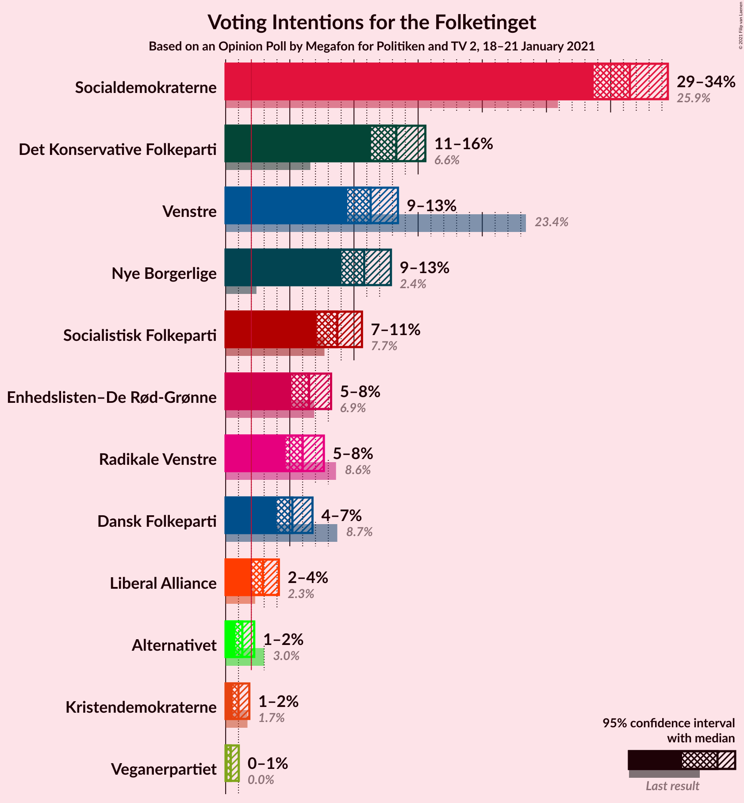

### Confidence Intervals

| Party | Last Result | Poll Result | 80% Confidence Interval | 90% Confidence Interval | 95% Confidence Interval | 99% Confidence Interval |
|:-----:|:-----------:|:-----------:|:-----------------------:|:-----------------------:|:-----------------------:|:-----------------------:|
| Socialdemokraterne | 25.9% | 31.5% | 29.7–33.4% |29.1–34.0% |28.7–34.5% |27.8–35.4% |
| Det Konservative Folkeparti | 6.6% | 13.3% | 12.0–14.8% |11.6–15.2% |11.3–15.6% |10.7–16.3% |
| Venstre | 23.4% | 11.3% | 10.1–12.7% |9.8–13.1% |9.5–13.4% |8.9–14.1% |
| Nye Borgerlige | 2.4% | 10.8% | 9.6–12.2% |9.3–12.5% |9.0–12.9% |8.5–13.6% |
| Socialistisk Folkeparti | 7.7% | 8.7% | 7.7–10.0% |7.3–10.3% |7.1–10.6% |6.6–11.2% |
| Enhedslisten–De Rød-Grønne | 6.9% | 6.5% | 5.6–7.6% |5.3–7.9% |5.1–8.2% |4.7–8.8% |
| Radikale Venstre | 8.6% | 6.0% | 5.1–7.1% |4.9–7.4% |4.7–7.7% |4.3–8.2% |
| Dansk Folkeparti | 8.7% | 5.2% | 4.4–6.2% |4.2–6.5% |4.0–6.8% |3.6–7.3% |
| Liberal Alliance | 2.3% | 2.9% | 2.3–3.7% |2.2–3.9% |2.0–4.1% |1.8–4.6% |
| Alternativet | 3.0% | 1.3% | 0.9–1.9% |0.8–2.1% |0.8–2.2% |0.6–2.5% |
| Kristendemokraterne | 1.7% | 1.0% | 0.7–1.5% |0.6–1.7% |0.5–1.8% |0.4–2.1% |
| Veganerpartiet | 0.0% | 0.4% | 0.2–0.8% |0.2–0.9% |0.2–1.0% |0.1–1.3% |

*Note:* The poll result column reflects the actual value used in the calculations. Published results may vary slightly, and in addition be rounded to fewer digits.

## Seats

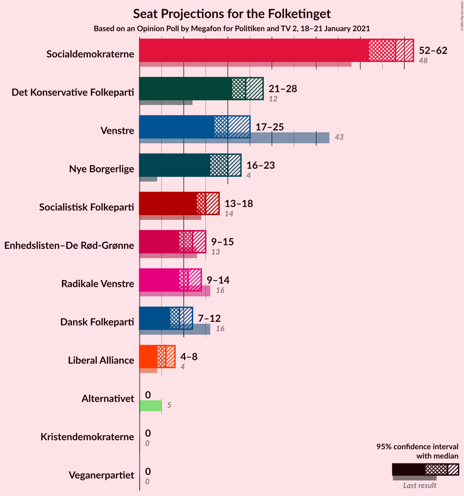

### Confidence Intervals

| Party | Last Result | Median | 80% Confidence Interval | 90% Confidence Interval | 95% Confidence Interval | 99% Confidence Interval |
|:-----:|:-----------:|:------:|:-----------------------:|:-----------------------:|:-----------------------:|:-----------------------:|
| <a href="#socialdemokraterne">Socialdemokraterne</a> | 48 | 58 | 54–60 |53–62 |52–62 |50–66 |
| <a href="#det-konservative-folkeparti">Det Konservative Folkeparti</a> | 12 | 24 | 22–27 |21–27 |21–28 |19–29 |
| <a href="#venstre">Venstre</a> | 43 | 20 | 18–24 |17–24 |17–25 |16–26 |
| <a href="#nye-borgerlige">Nye Borgerlige</a> | 4 | 20 | 17–22 |17–22 |16–23 |15–24 |
| <a href="#socialistisk-folkeparti">Socialistisk Folkeparti</a> | 14 | 15 | 13–17 |13–18 |13–18 |12–19 |
| <a href="#enhedslisten–de-rød-grønne">Enhedslisten–De Rød-Grønne</a> | 13 | 12 | 10–14 |9–15 |9–15 |8–16 |
| <a href="#radikale-venstre">Radikale Venstre</a> | 16 | 11 | 9–13 |9–13 |9–14 |8–14 |
| <a href="#dansk-folkeparti">Dansk Folkeparti</a> | 16 | 9 | 8–11 |8–12 |7–12 |6–13 |
| <a href="#liberal-alliance">Liberal Alliance</a> | 4 | 6 | 4–6 |4–7 |4–8 |0–8 |
| <a href="#alternativet">Alternativet</a> | 5 | 0 | 0 |0 |0 |0–4 |
| <a href="#kristendemokraterne">Kristendemokraterne</a> | 0 | 0 | 0 |0 |0 |0–4 |
| <a href="#veganerpartiet">Veganerpartiet</a> | 0 | 0 | 0 |0 |0 |0 |

### Socialdemokraterne

*For a full overview of the results for this party, see the [Socialdemokraterne](party-socialdemokraterne.html) page.*

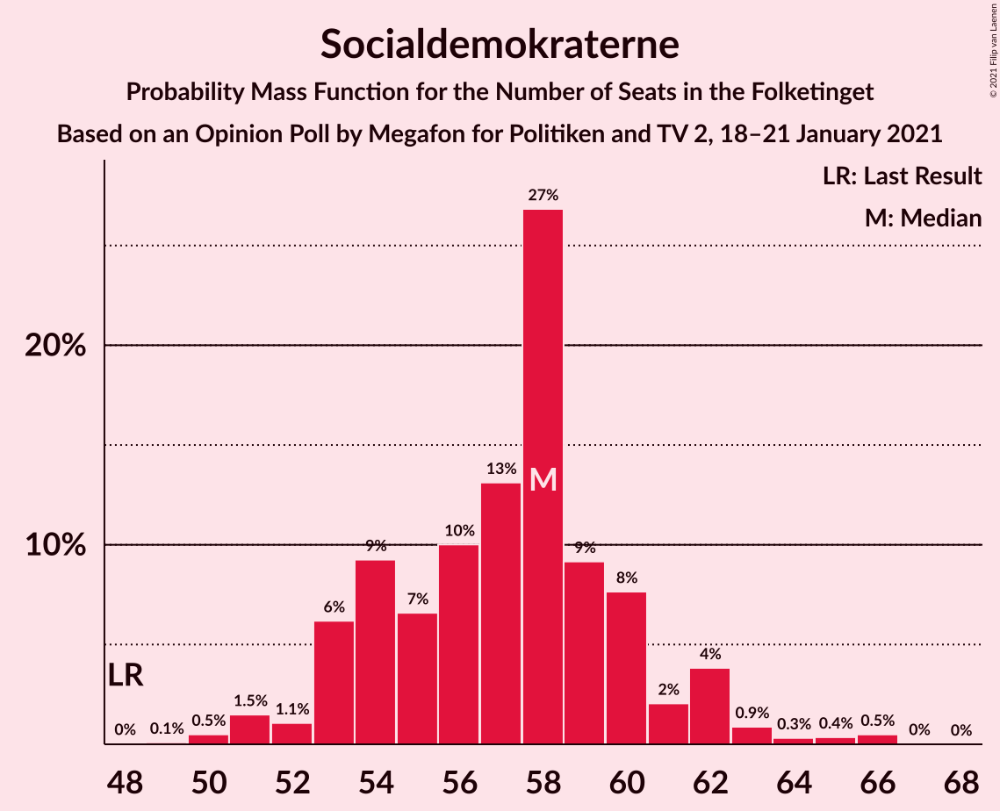

| Number of Seats | Probability | Accumulated | Special Marks |
|:---------------:|:-----------:|:-----------:|:-------------:|
| 48 | 0% | 100% | Last Result |
| 49 | 0.1% | 100% |  |
| 50 | 0.5% | 99.9% |  |
| 51 | 1.5% | 99.4% |  |
| 52 | 1.1% | 98% |  |
| 53 | 6% | 97% |  |
| 54 | 9% | 91% |  |
| 55 | 7% | 81% |  |
| 56 | 10% | 75% |  |
| 57 | 13% | 65% |  |
| 58 | 27% | 52% | Median |
| 59 | 9% | 25% |  |
| 60 | 8% | 16% |  |
| 61 | 2% | 8% |  |
| 62 | 4% | 6% |  |
| 63 | 0.9% | 2% |  |
| 64 | 0.3% | 1.2% |  |
| 65 | 0.4% | 0.9% |  |
| 66 | 0.5% | 0.5% |  |
| 67 | 0% | 0% |  |

### Det Konservative Folkeparti

*For a full overview of the results for this party, see the [Det Konservative Folkeparti](party-detkonservativefolkeparti.html) page.*

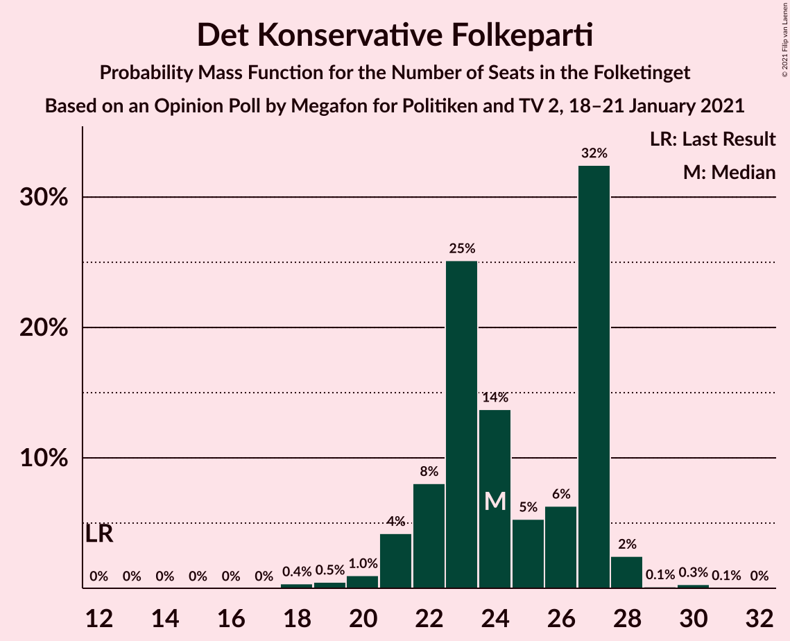

| Number of Seats | Probability | Accumulated | Special Marks |
|:---------------:|:-----------:|:-----------:|:-------------:|
| 12 | 0% | 100% | Last Result |
| 13 | 0% | 100% |  |
| 14 | 0% | 100% |  |
| 15 | 0% | 100% |  |
| 16 | 0% | 100% |  |
| 17 | 0% | 100% |  |
| 18 | 0.4% | 100% |  |
| 19 | 0.5% | 99.6% |  |
| 20 | 1.0% | 99.2% |  |
| 21 | 4% | 98% |  |
| 22 | 8% | 94% |  |
| 23 | 25% | 86% |  |
| 24 | 14% | 61% | Median |
| 25 | 5% | 47% |  |
| 26 | 6% | 42% |  |
| 27 | 32% | 35% |  |
| 28 | 2% | 3% |  |
| 29 | 0.1% | 0.5% |  |
| 30 | 0.3% | 0.4% |  |
| 31 | 0.1% | 0.1% |  |
| 32 | 0% | 0% |  |

### Venstre

*For a full overview of the results for this party, see the [Venstre](party-venstre.html) page.*

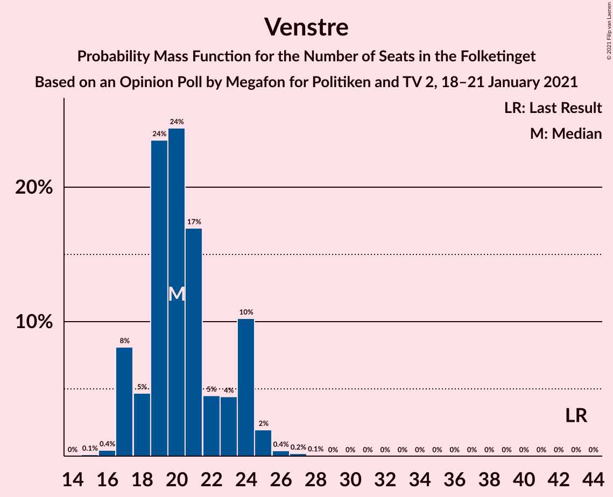

| Number of Seats | Probability | Accumulated | Special Marks |
|:---------------:|:-----------:|:-----------:|:-------------:|
| 15 | 0.1% | 100% |  |
| 16 | 0.4% | 99.9% |  |
| 17 | 8% | 99.4% |  |
| 18 | 5% | 91% |  |
| 19 | 24% | 87% |  |
| 20 | 24% | 63% | Median |
| 21 | 17% | 39% |  |
| 22 | 5% | 22% |  |
| 23 | 4% | 17% |  |
| 24 | 10% | 13% |  |
| 25 | 2% | 3% |  |
| 26 | 0.4% | 0.7% |  |
| 27 | 0.2% | 0.3% |  |
| 28 | 0.1% | 0.1% |  |
| 29 | 0% | 0% |  |
| 30 | 0% | 0% |  |
| 31 | 0% | 0% |  |
| 32 | 0% | 0% |  |
| 33 | 0% | 0% |  |
| 34 | 0% | 0% |  |
| 35 | 0% | 0% |  |
| 36 | 0% | 0% |  |
| 37 | 0% | 0% |  |
| 38 | 0% | 0% |  |
| 39 | 0% | 0% |  |
| 40 | 0% | 0% |  |
| 41 | 0% | 0% |  |
| 42 | 0% | 0% |  |
| 43 | 0% | 0% | Last Result |

### Nye Borgerlige

*For a full overview of the results for this party, see the [Nye Borgerlige](party-nyeborgerlige.html) page.*

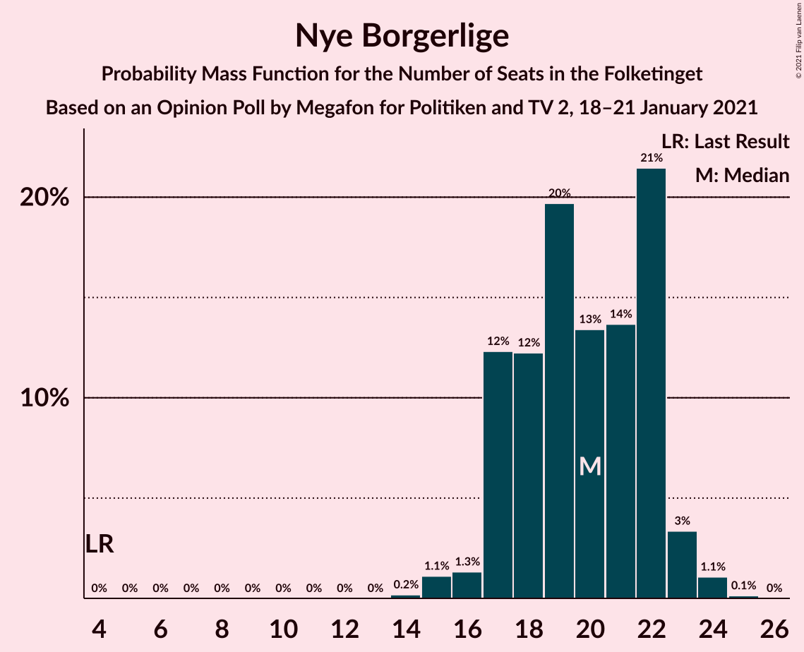

| Number of Seats | Probability | Accumulated | Special Marks |
|:---------------:|:-----------:|:-----------:|:-------------:|
| 4 | 0% | 100% | Last Result |
| 5 | 0% | 100% |  |
| 6 | 0% | 100% |  |
| 7 | 0% | 100% |  |
| 8 | 0% | 100% |  |
| 9 | 0% | 100% |  |
| 10 | 0% | 100% |  |
| 11 | 0% | 100% |  |
| 12 | 0% | 100% |  |
| 13 | 0% | 100% |  |
| 14 | 0.2% | 100% |  |
| 15 | 1.1% | 99.8% |  |
| 16 | 1.3% | 98.7% |  |
| 17 | 12% | 97% |  |
| 18 | 12% | 85% |  |
| 19 | 20% | 73% |  |
| 20 | 13% | 53% | Median |
| 21 | 14% | 40% |  |
| 22 | 21% | 26% |  |
| 23 | 3% | 5% |  |
| 24 | 1.1% | 1.2% |  |
| 25 | 0.1% | 0.1% |  |
| 26 | 0% | 0% |  |

### Socialistisk Folkeparti

*For a full overview of the results for this party, see the [Socialistisk Folkeparti](party-socialistiskfolkeparti.html) page.*

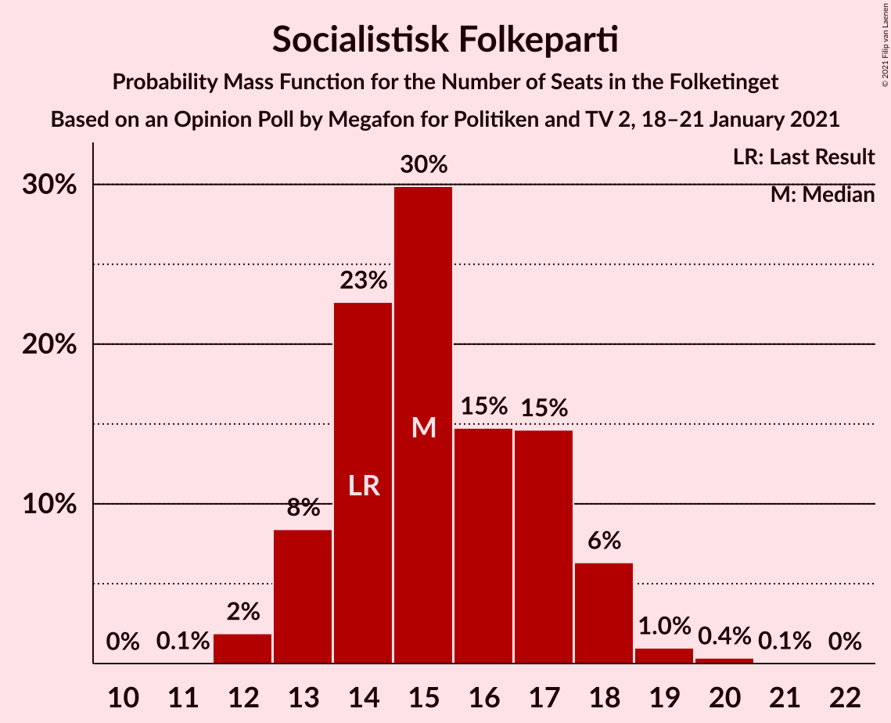

| Number of Seats | Probability | Accumulated | Special Marks |
|:---------------:|:-----------:|:-----------:|:-------------:|
| 11 | 0.1% | 100% |  |
| 12 | 2% | 99.9% |  |
| 13 | 8% | 98% |  |
| 14 | 23% | 90% | Last Result |
| 15 | 30% | 67% | Median |
| 16 | 15% | 37% |  |
| 17 | 15% | 22% |  |
| 18 | 6% | 8% |  |
| 19 | 1.0% | 1.4% |  |
| 20 | 0.4% | 0.4% |  |
| 21 | 0.1% | 0.1% |  |
| 22 | 0% | 0% |  |

### Enhedslisten–De Rød-Grønne

*For a full overview of the results for this party, see the [Enhedslisten–De Rød-Grønne](party-enhedslisten–derød-grønne.html) page.*

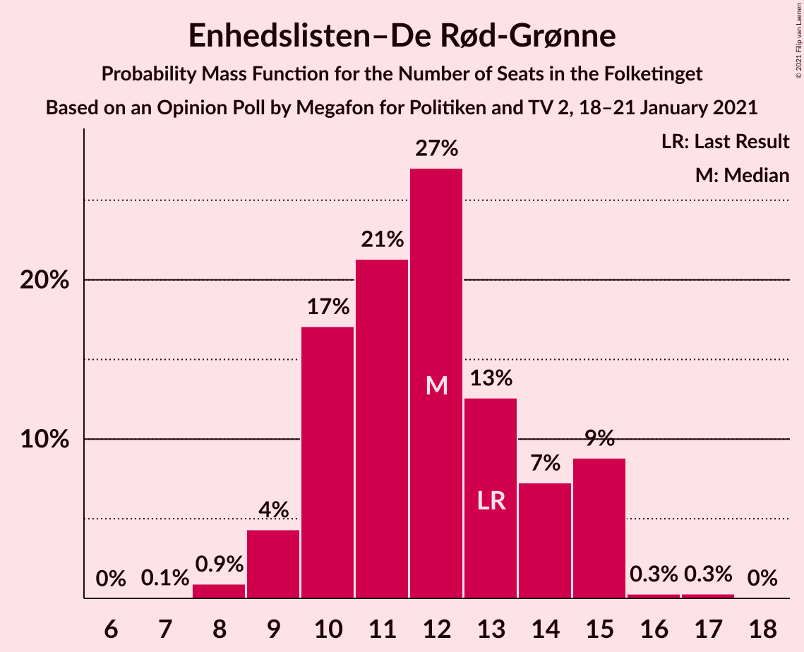

| Number of Seats | Probability | Accumulated | Special Marks |
|:---------------:|:-----------:|:-----------:|:-------------:|
| 7 | 0.1% | 100% |  |
| 8 | 0.9% | 99.9% |  |
| 9 | 4% | 99.0% |  |
| 10 | 17% | 95% |  |
| 11 | 21% | 78% |  |
| 12 | 27% | 56% | Median |
| 13 | 13% | 29% | Last Result |
| 14 | 7% | 17% |  |
| 15 | 9% | 9% |  |
| 16 | 0.3% | 0.6% |  |
| 17 | 0.3% | 0.3% |  |
| 18 | 0% | 0% |  |

### Radikale Venstre

*For a full overview of the results for this party, see the [Radikale Venstre](party-radikalevenstre.html) page.*

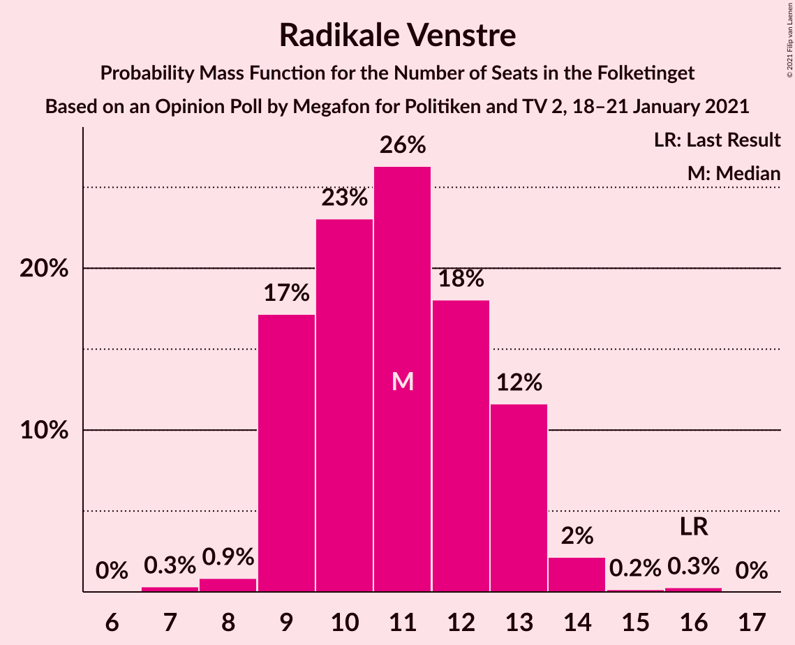

| Number of Seats | Probability | Accumulated | Special Marks |
|:---------------:|:-----------:|:-----------:|:-------------:|
| 7 | 0.3% | 100% |  |
| 8 | 0.9% | 99.7% |  |
| 9 | 17% | 98.8% |  |
| 10 | 23% | 82% |  |
| 11 | 26% | 59% | Median |
| 12 | 18% | 32% |  |
| 13 | 12% | 14% |  |
| 14 | 2% | 3% |  |
| 15 | 0.2% | 0.4% |  |
| 16 | 0.3% | 0.3% | Last Result |
| 17 | 0% | 0% |  |

### Dansk Folkeparti

*For a full overview of the results for this party, see the [Dansk Folkeparti](party-danskfolkeparti.html) page.*

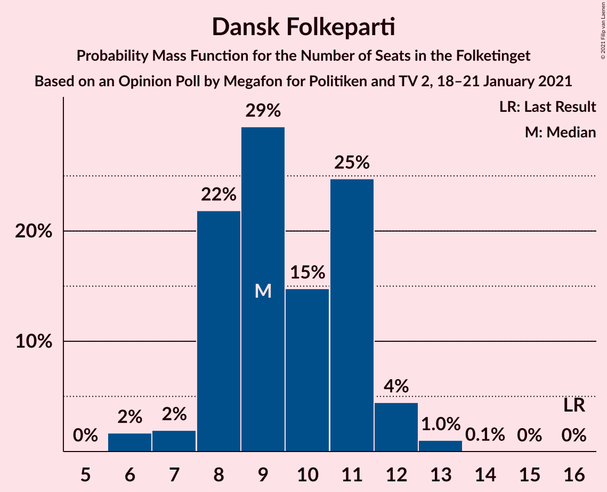

| Number of Seats | Probability | Accumulated | Special Marks |
|:---------------:|:-----------:|:-----------:|:-------------:|
| 6 | 2% | 100% |  |
| 7 | 2% | 98% |  |
| 8 | 22% | 96% |  |
| 9 | 29% | 75% | Median |
| 10 | 15% | 45% |  |
| 11 | 25% | 30% |  |
| 12 | 4% | 6% |  |
| 13 | 1.0% | 1.1% |  |
| 14 | 0.1% | 0.1% |  |
| 15 | 0% | 0% |  |
| 16 | 0% | 0% | Last Result |

### Liberal Alliance

*For a full overview of the results for this party, see the [Liberal Alliance](party-liberalalliance.html) page.*

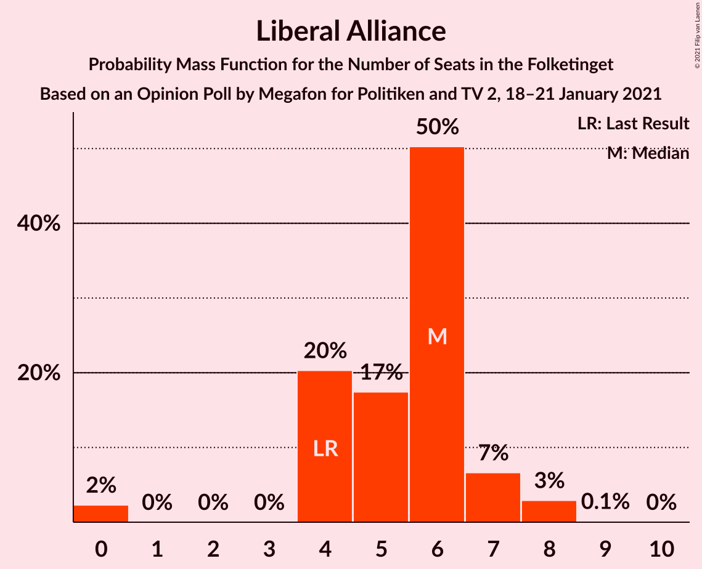

| Number of Seats | Probability | Accumulated | Special Marks |
|:---------------:|:-----------:|:-----------:|:-------------:|
| 0 | 2% | 100% |  |
| 1 | 0% | 98% |  |
| 2 | 0% | 98% |  |
| 3 | 0% | 98% |  |
| 4 | 20% | 98% | Last Result |
| 5 | 17% | 77% |  |
| 6 | 50% | 60% | Median |
| 7 | 7% | 10% |  |
| 8 | 3% | 3% |  |
| 9 | 0.1% | 0.1% |  |
| 10 | 0% | 0% |  |

### Alternativet

*For a full overview of the results for this party, see the [Alternativet](party-alternativet.html) page.*

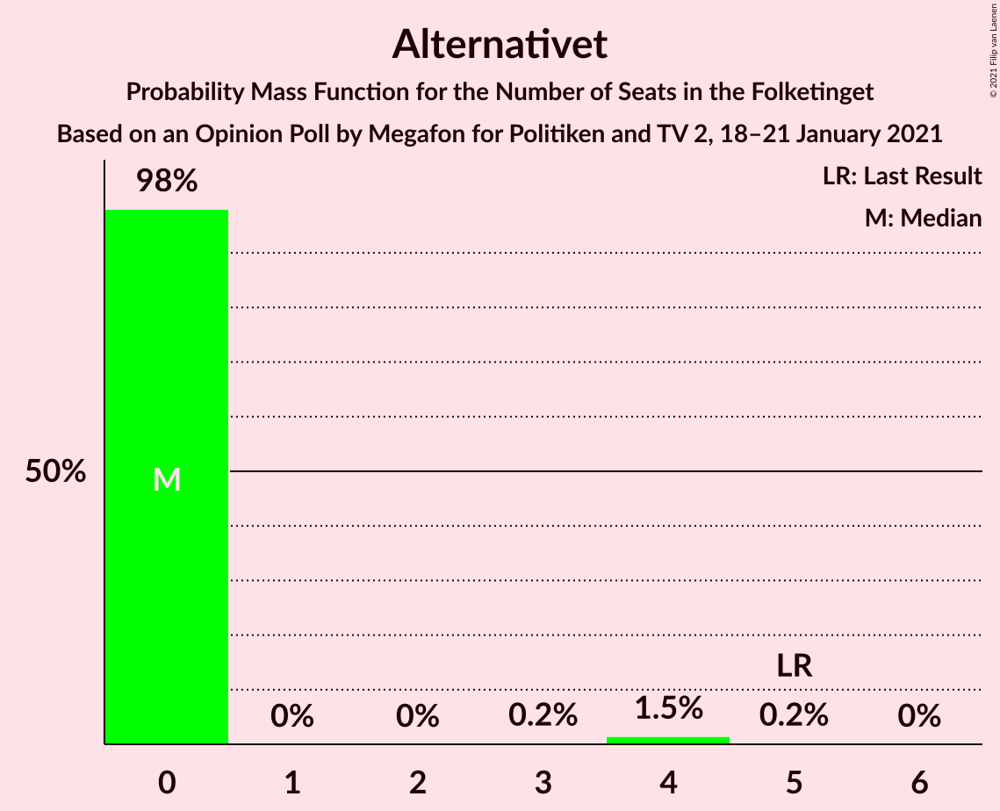

| Number of Seats | Probability | Accumulated | Special Marks |
|:---------------:|:-----------:|:-----------:|:-------------:|
| 0 | 98% | 100% | Median |
| 1 | 0% | 2% |  |
| 2 | 0% | 2% |  |
| 3 | 0.2% | 2% |  |
| 4 | 1.5% | 2% |  |
| 5 | 0.2% | 0.2% | Last Result |
| 6 | 0% | 0% |  |

### Kristendemokraterne

*For a full overview of the results for this party, see the [Kristendemokraterne](party-kristendemokraterne.html) page.*

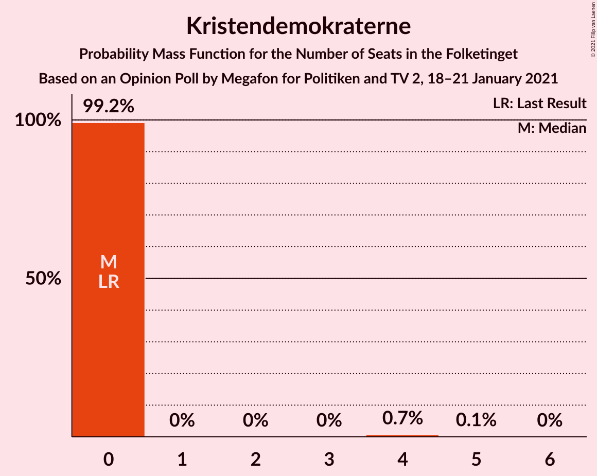

| Number of Seats | Probability | Accumulated | Special Marks |
|:---------------:|:-----------:|:-----------:|:-------------:|
| 0 | 99.2% | 100% | Last Result, Median |
| 1 | 0% | 0.8% |  |
| 2 | 0% | 0.8% |  |
| 3 | 0% | 0.8% |  |
| 4 | 0.7% | 0.8% |  |
| 5 | 0.1% | 0.1% |  |
| 6 | 0% | 0% |  |

### Veganerpartiet

*For a full overview of the results for this party, see the [Veganerpartiet](party-veganerpartiet.html) page.*

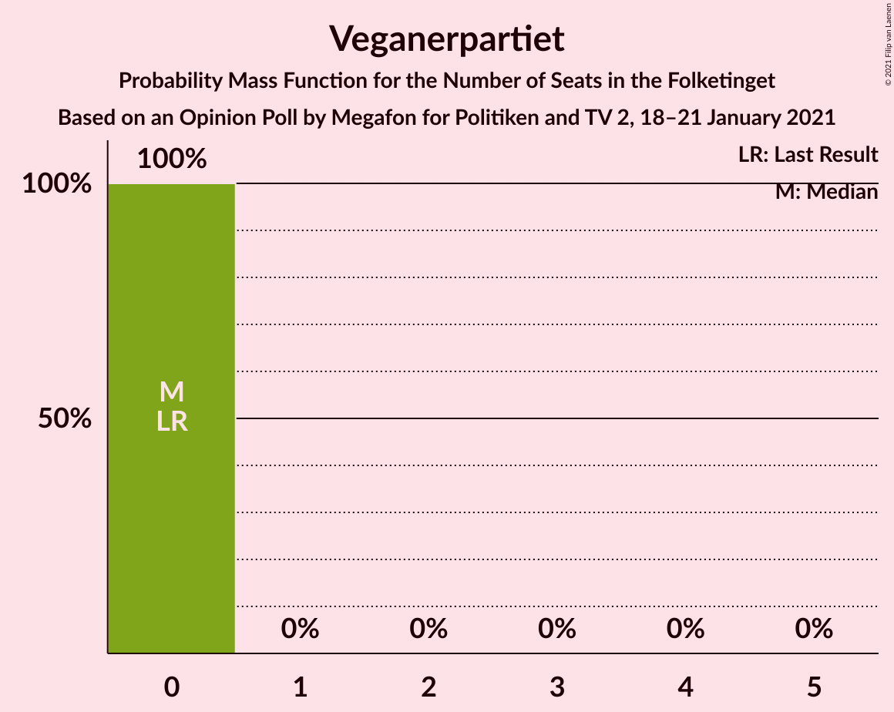

| Number of Seats | Probability | Accumulated | Special Marks |
|:---------------:|:-----------:|:-----------:|:-------------:|
| 0 | 100% | 100% | Last Result, Median |

## Coalitions

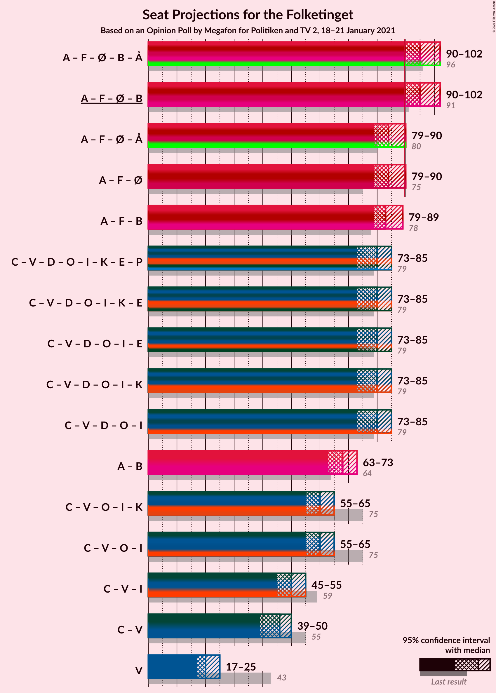

### Confidence Intervals

| Coalition | Last Result | Median | Majority? | 80% Confidence Interval | 90% Confidence Interval | 95% Confidence Interval | 99% Confidence Interval |
|:---------:|:-----------:|:------:|:---------:|:-----------------------:|:-----------------------:|:-----------------------:|:-----------------------:|
| Socialdemokraterne – Socialistisk Folkeparti – Enhedslisten–De Rød-Grønne – Radikale Venstre – Alternativet | 96 | 95 | 99.1% | 92–98 | 91–100 | 90–102 | 89–103 |
| Socialdemokraterne – Socialistisk Folkeparti – Enhedslisten–De Rød-Grønne – Radikale Venstre | 91 | 95 | 98.8% | 92–98 | 91–100 | 90–102 | 89–103 |
| Socialdemokraterne – Socialistisk Folkeparti – Enhedslisten–De Rød-Grønne – Alternativet | 80 | 84 | 4% | 81–87 | 80–89 | 79–90 | 78–92 |
| Socialdemokraterne – Socialistisk Folkeparti – Enhedslisten–De Rød-Grønne | 75 | 84 | 4% | 81–87 | 80–88 | 79–90 | 78–92 |
| Socialdemokraterne – Socialistisk Folkeparti – Radikale Venstre | 78 | 83 | 2% | 80–86 | 79–88 | 79–89 | 76–93 |
| Det Konservative Folkeparti – Venstre – Nye Borgerlige – Dansk Folkeparti – Liberal Alliance – Kristendemokraterne | 79 | 80 | 0% | 77–83 | 75–84 | 73–85 | 72–86 |
| Det Konservative Folkeparti – Venstre – Nye Borgerlige – Dansk Folkeparti – Liberal Alliance | 79 | 80 | 0% | 76–83 | 75–84 | 73–85 | 71–86 |
| Socialdemokraterne – Radikale Venstre | 64 | 68 | 0% | 65–71 | 64–72 | 63–73 | 61–78 |
| Det Konservative Folkeparti – Venstre – Dansk Folkeparti – Liberal Alliance – Kristendemokraterne | 75 | 60 | 0% | 56–65 | 56–65 | 55–65 | 53–66 |
| Det Konservative Folkeparti – Venstre – Dansk Folkeparti – Liberal Alliance | 75 | 60 | 0% | 56–65 | 56–65 | 55–65 | 53–66 |
| Det Konservative Folkeparti – Venstre – Liberal Alliance | 59 | 50 | 0% | 46–54 | 45–54 | 45–55 | 42–57 |
| Det Konservative Folkeparti – Venstre | 55 | 46 | 0% | 42–48 | 41–48 | 39–50 | 38–51 |
| Venstre | 43 | 20 | 0% | 18–24 | 17–24 | 17–25 | 16–26 |

### Socialdemokraterne – Socialistisk Folkeparti – Enhedslisten–De Rød-Grønne – Radikale Venstre – Alternativet

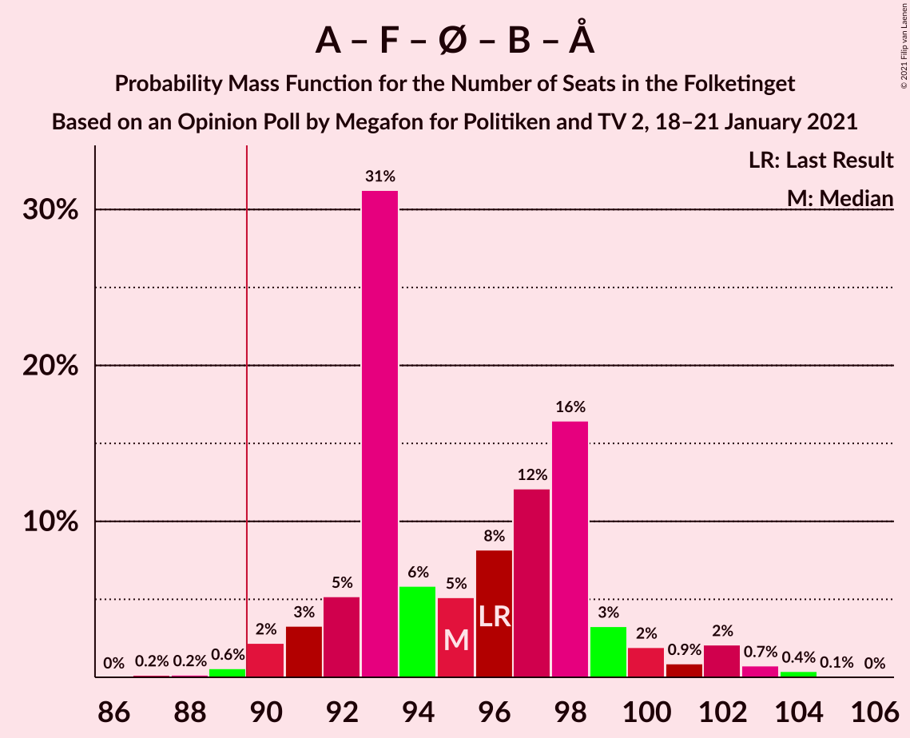

| Number of Seats | Probability | Accumulated | Special Marks |
|:---------------:|:-----------:|:-----------:|:-------------:|
| 86 | 0% | 100% |  |
| 87 | 0.2% | 99.9% |  |
| 88 | 0.2% | 99.8% |  |
| 89 | 0.6% | 99.6% |  |
| 90 | 2% | 99.1% | Majority |
| 91 | 3% | 97% |  |
| 92 | 5% | 94% |  |
| 93 | 31% | 88% |  |
| 94 | 6% | 57% |  |
| 95 | 5% | 51% |  |
| 96 | 8% | 46% | Last Result, Median |
| 97 | 12% | 38% |  |
| 98 | 16% | 26% |  |
| 99 | 3% | 9% |  |
| 100 | 2% | 6% |  |
| 101 | 0.9% | 4% |  |
| 102 | 2% | 3% |  |
| 103 | 0.7% | 1.2% |  |
| 104 | 0.4% | 0.5% |  |
| 105 | 0.1% | 0.1% |  |
| 106 | 0% | 0% |  |

### Socialdemokraterne – Socialistisk Folkeparti – Enhedslisten–De Rød-Grønne – Radikale Venstre

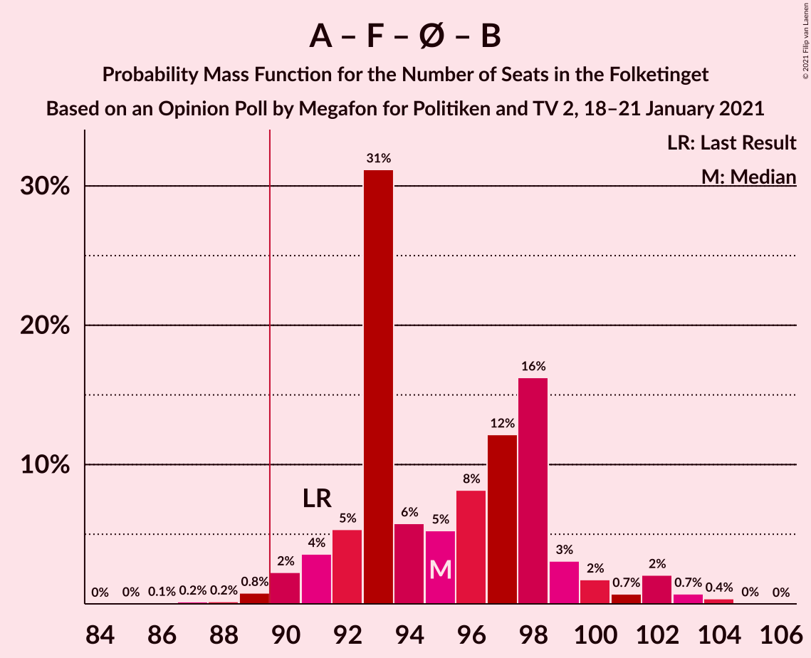

| Number of Seats | Probability | Accumulated | Special Marks |
|:---------------:|:-----------:|:-----------:|:-------------:|
| 85 | 0% | 100% |  |
| 86 | 0.1% | 99.9% |  |
| 87 | 0.2% | 99.9% |  |
| 88 | 0.2% | 99.7% |  |
| 89 | 0.8% | 99.5% |  |
| 90 | 2% | 98.8% | Majority |
| 91 | 4% | 96% | Last Result |
| 92 | 5% | 93% |  |
| 93 | 31% | 88% |  |
| 94 | 6% | 56% |  |
| 95 | 5% | 51% |  |
| 96 | 8% | 45% | Median |
| 97 | 12% | 37% |  |
| 98 | 16% | 25% |  |
| 99 | 3% | 9% |  |
| 100 | 2% | 6% |  |
| 101 | 0.7% | 4% |  |
| 102 | 2% | 3% |  |
| 103 | 0.7% | 1.2% |  |
| 104 | 0.4% | 0.4% |  |
| 105 | 0% | 0.1% |  |
| 106 | 0% | 0% |  |

### Socialdemokraterne – Socialistisk Folkeparti – Enhedslisten–De Rød-Grønne – Alternativet

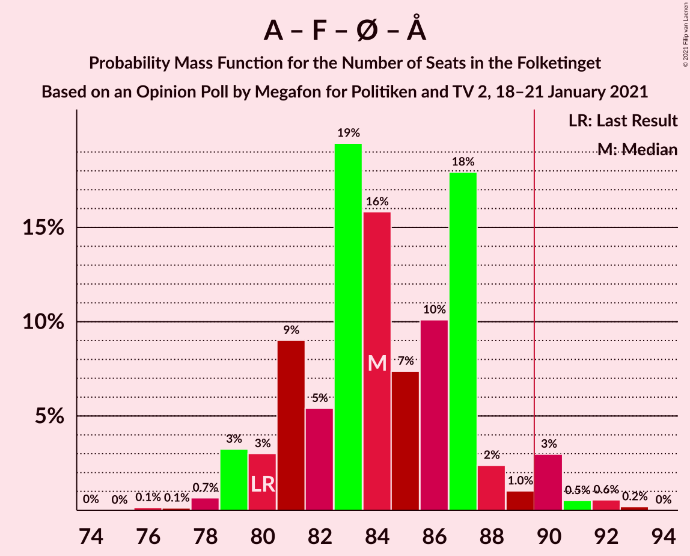

| Number of Seats | Probability | Accumulated | Special Marks |
|:---------------:|:-----------:|:-----------:|:-------------:|
| 75 | 0% | 100% |  |
| 76 | 0.1% | 99.9% |  |
| 77 | 0.1% | 99.8% |  |
| 78 | 0.7% | 99.7% |  |
| 79 | 3% | 99.0% |  |
| 80 | 3% | 96% | Last Result |
| 81 | 9% | 93% |  |
| 82 | 5% | 84% |  |
| 83 | 19% | 78% |  |
| 84 | 16% | 59% |  |
| 85 | 7% | 43% | Median |
| 86 | 10% | 36% |  |
| 87 | 18% | 26% |  |
| 88 | 2% | 8% |  |
| 89 | 1.0% | 5% |  |
| 90 | 3% | 4% | Majority |
| 91 | 0.5% | 1.3% |  |
| 92 | 0.6% | 0.8% |  |
| 93 | 0.2% | 0.2% |  |
| 94 | 0% | 0% |  |

### Socialdemokraterne – Socialistisk Folkeparti – Enhedslisten–De Rød-Grønne

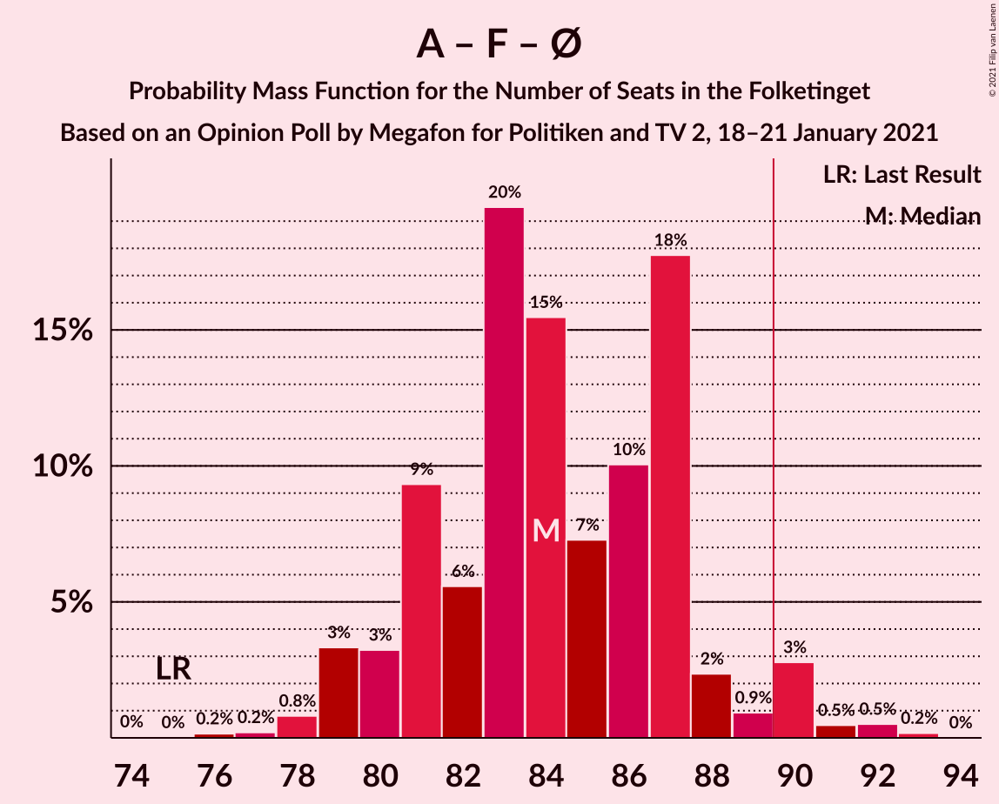

| Number of Seats | Probability | Accumulated | Special Marks |
|:---------------:|:-----------:|:-----------:|:-------------:|
| 74 | 0% | 100% |  |
| 75 | 0% | 99.9% | Last Result |
| 76 | 0.2% | 99.9% |  |
| 77 | 0.2% | 99.8% |  |
| 78 | 0.8% | 99.6% |  |
| 79 | 3% | 98.8% |  |
| 80 | 3% | 95% |  |
| 81 | 9% | 92% |  |
| 82 | 6% | 83% |  |
| 83 | 20% | 77% |  |
| 84 | 15% | 58% |  |
| 85 | 7% | 42% | Median |
| 86 | 10% | 35% |  |
| 87 | 18% | 25% |  |
| 88 | 2% | 7% |  |
| 89 | 0.9% | 5% |  |
| 90 | 3% | 4% | Majority |
| 91 | 0.5% | 1.2% |  |
| 92 | 0.5% | 0.7% |  |
| 93 | 0.2% | 0.2% |  |
| 94 | 0% | 0% |  |

### Socialdemokraterne – Socialistisk Folkeparti – Radikale Venstre

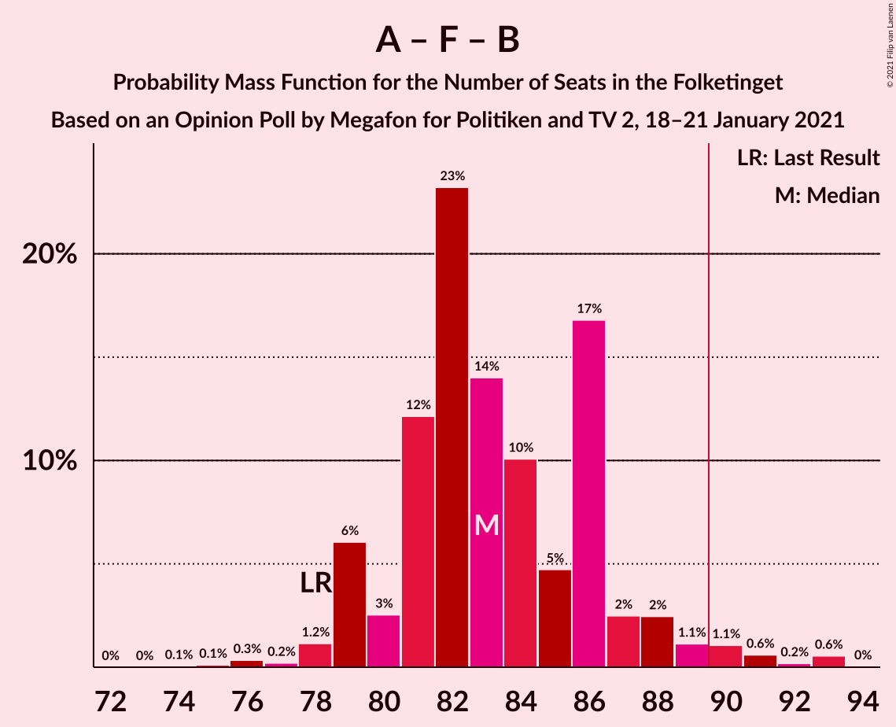

| Number of Seats | Probability | Accumulated | Special Marks |
|:---------------:|:-----------:|:-----------:|:-------------:|
| 74 | 0.1% | 100% |  |
| 75 | 0.1% | 99.9% |  |
| 76 | 0.3% | 99.8% |  |
| 77 | 0.2% | 99.5% |  |
| 78 | 1.2% | 99.3% | Last Result |
| 79 | 6% | 98% |  |
| 80 | 3% | 92% |  |
| 81 | 12% | 90% |  |
| 82 | 23% | 77% |  |
| 83 | 14% | 54% |  |
| 84 | 10% | 40% | Median |
| 85 | 5% | 30% |  |
| 86 | 17% | 25% |  |
| 87 | 2% | 9% |  |
| 88 | 2% | 6% |  |
| 89 | 1.1% | 4% |  |
| 90 | 1.1% | 2% | Majority |
| 91 | 0.6% | 1.4% |  |
| 92 | 0.2% | 0.8% |  |
| 93 | 0.6% | 0.6% |  |
| 94 | 0% | 0% |  |

### Det Konservative Folkeparti – Venstre – Nye Borgerlige – Dansk Folkeparti – Liberal Alliance – Kristendemokraterne

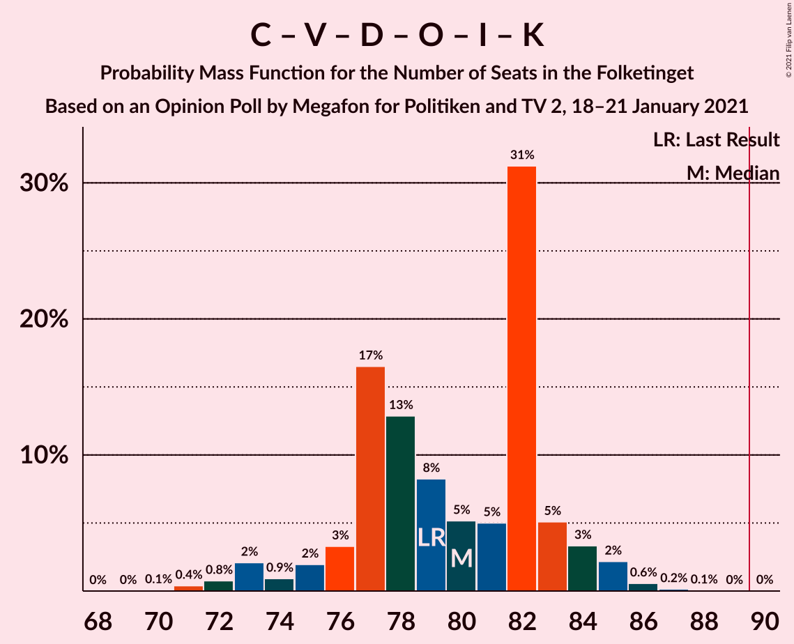

| Number of Seats | Probability | Accumulated | Special Marks |
|:---------------:|:-----------:|:-----------:|:-------------:|
| 70 | 0.1% | 100% |  |
| 71 | 0.4% | 99.9% |  |
| 72 | 0.8% | 99.5% |  |
| 73 | 2% | 98.7% |  |
| 74 | 0.9% | 97% |  |
| 75 | 2% | 96% |  |
| 76 | 3% | 94% |  |
| 77 | 17% | 90% |  |
| 78 | 13% | 74% |  |
| 79 | 8% | 61% | Last Result, Median |
| 80 | 5% | 53% |  |
| 81 | 5% | 48% |  |
| 82 | 31% | 43% |  |
| 83 | 5% | 11% |  |
| 84 | 3% | 6% |  |
| 85 | 2% | 3% |  |
| 86 | 0.6% | 0.8% |  |
| 87 | 0.2% | 0.3% |  |
| 88 | 0.1% | 0.1% |  |
| 89 | 0% | 0.1% |  |
| 90 | 0% | 0% | Majority |

### Det Konservative Folkeparti – Venstre – Nye Borgerlige – Dansk Folkeparti – Liberal Alliance

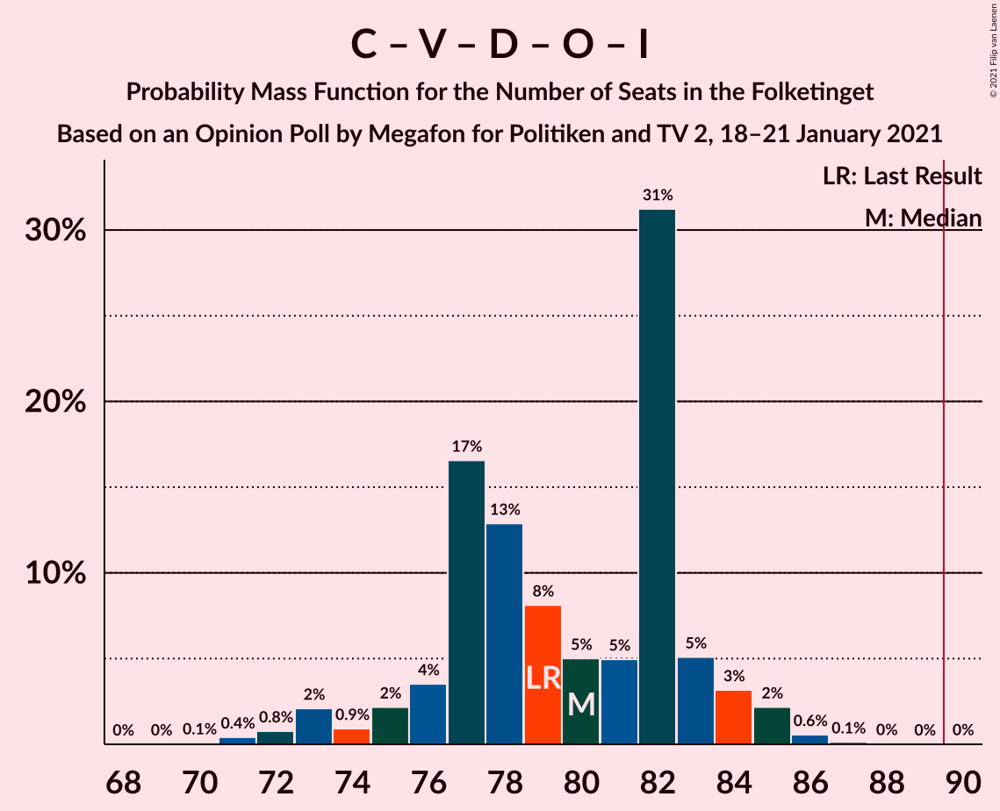

| Number of Seats | Probability | Accumulated | Special Marks |
|:---------------:|:-----------:|:-----------:|:-------------:|
| 70 | 0.1% | 100% |  |
| 71 | 0.4% | 99.9% |  |
| 72 | 0.8% | 99.5% |  |
| 73 | 2% | 98.7% |  |
| 74 | 0.9% | 97% |  |
| 75 | 2% | 96% |  |
| 76 | 4% | 94% |  |
| 77 | 17% | 90% |  |
| 78 | 13% | 73% |  |
| 79 | 8% | 61% | Last Result, Median |
| 80 | 5% | 52% |  |
| 81 | 5% | 47% |  |
| 82 | 31% | 42% |  |
| 83 | 5% | 11% |  |
| 84 | 3% | 6% |  |
| 85 | 2% | 3% |  |
| 86 | 0.6% | 0.8% |  |
| 87 | 0.1% | 0.2% |  |
| 88 | 0% | 0.1% |  |
| 89 | 0% | 0% |  |

### Socialdemokraterne – Radikale Venstre

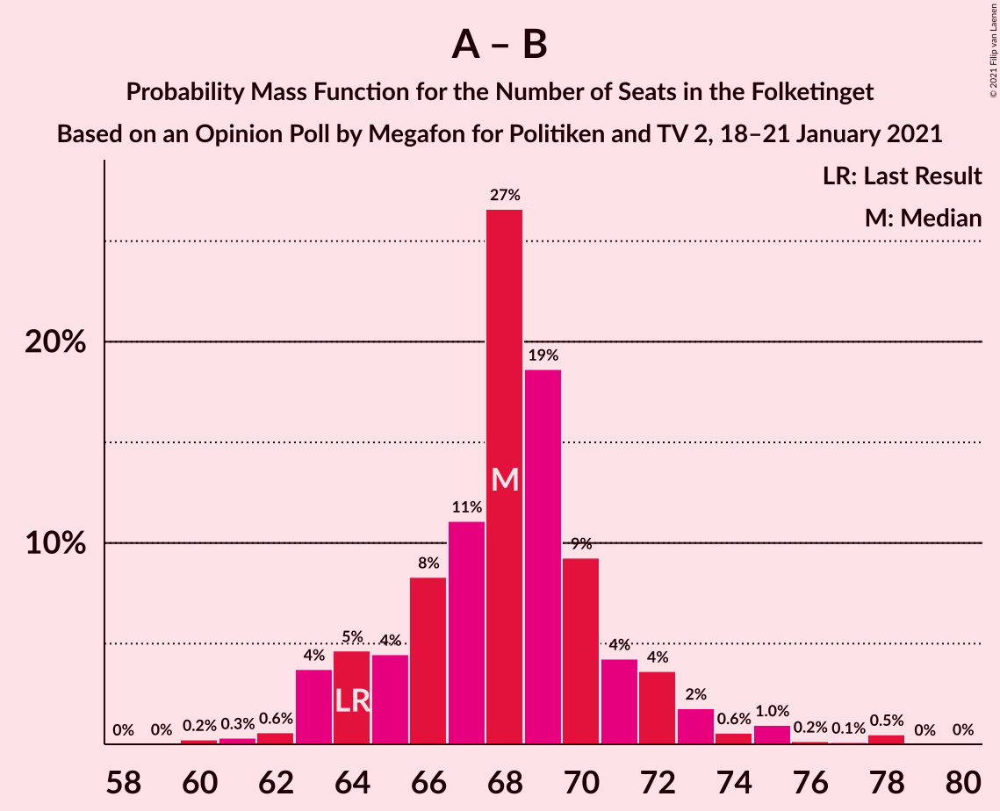

| Number of Seats | Probability | Accumulated | Special Marks |
|:---------------:|:-----------:|:-----------:|:-------------:|
| 60 | 0.2% | 100% |  |
| 61 | 0.3% | 99.7% |  |
| 62 | 0.6% | 99.4% |  |
| 63 | 4% | 98.8% |  |
| 64 | 5% | 95% | Last Result |
| 65 | 4% | 90% |  |
| 66 | 8% | 86% |  |
| 67 | 11% | 78% |  |
| 68 | 27% | 67% |  |
| 69 | 19% | 40% | Median |
| 70 | 9% | 21% |  |
| 71 | 4% | 12% |  |
| 72 | 4% | 8% |  |
| 73 | 2% | 4% |  |
| 74 | 0.6% | 2% |  |
| 75 | 1.0% | 2% |  |
| 76 | 0.2% | 0.8% |  |
| 77 | 0.1% | 0.6% |  |
| 78 | 0.5% | 0.5% |  |
| 79 | 0% | 0% |  |

### Det Konservative Folkeparti – Venstre – Dansk Folkeparti – Liberal Alliance – Kristendemokraterne

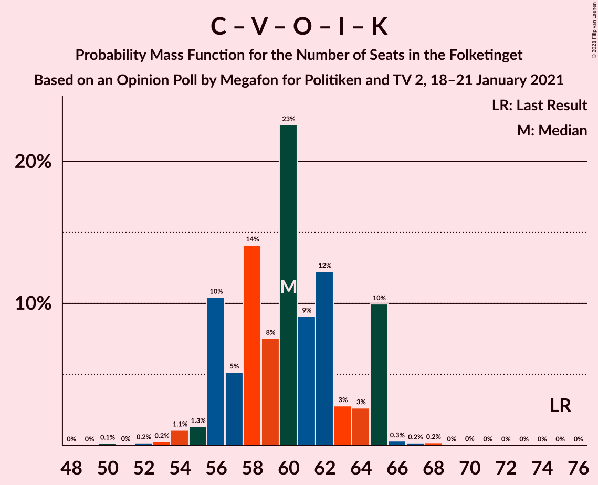

| Number of Seats | Probability | Accumulated | Special Marks |
|:---------------:|:-----------:|:-----------:|:-------------:|
| 50 | 0.1% | 100% |  |
| 51 | 0% | 99.9% |  |
| 52 | 0.2% | 99.8% |  |
| 53 | 0.2% | 99.7% |  |
| 54 | 1.1% | 99.4% |  |
| 55 | 1.3% | 98% |  |
| 56 | 10% | 97% |  |
| 57 | 5% | 87% |  |
| 58 | 14% | 82% |  |
| 59 | 8% | 67% | Median |
| 60 | 23% | 60% |  |
| 61 | 9% | 37% |  |
| 62 | 12% | 28% |  |
| 63 | 3% | 16% |  |
| 64 | 3% | 13% |  |
| 65 | 10% | 11% |  |
| 66 | 0.3% | 0.6% |  |
| 67 | 0.2% | 0.4% |  |
| 68 | 0.2% | 0.2% |  |
| 69 | 0% | 0% |  |
| 70 | 0% | 0% |  |
| 71 | 0% | 0% |  |
| 72 | 0% | 0% |  |
| 73 | 0% | 0% |  |
| 74 | 0% | 0% |  |
| 75 | 0% | 0% | Last Result |

### Det Konservative Folkeparti – Venstre – Dansk Folkeparti – Liberal Alliance

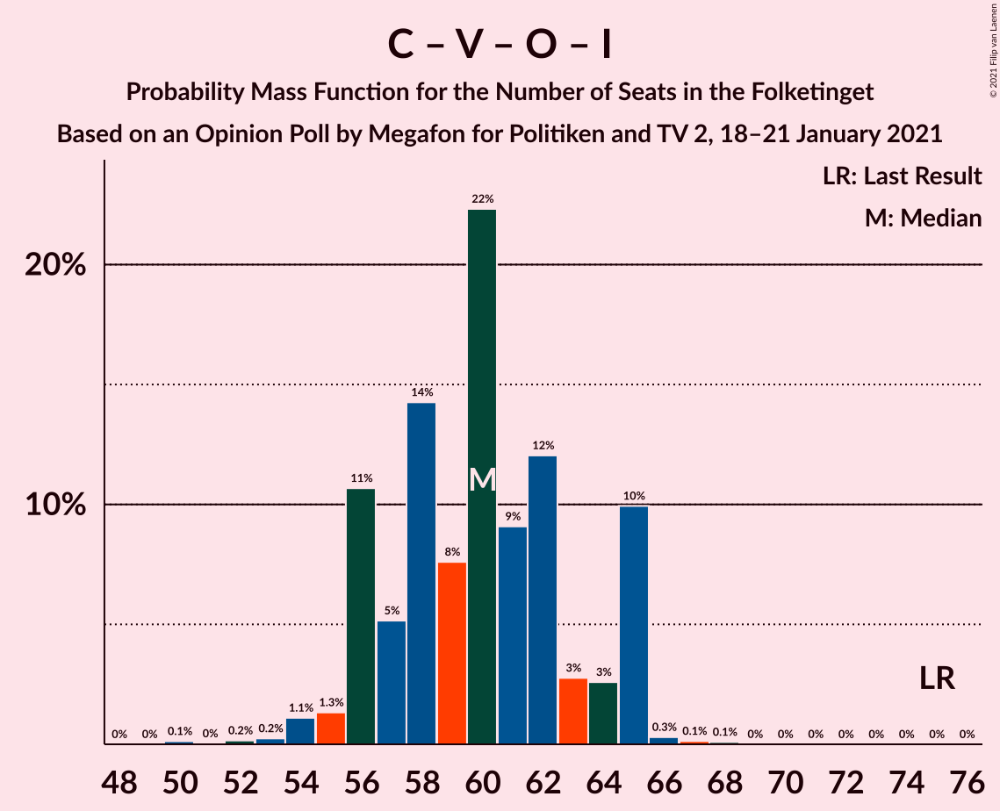

| Number of Seats | Probability | Accumulated | Special Marks |
|:---------------:|:-----------:|:-----------:|:-------------:|
| 50 | 0.1% | 100% |  |
| 51 | 0% | 99.9% |  |
| 52 | 0.2% | 99.8% |  |
| 53 | 0.2% | 99.7% |  |
| 54 | 1.1% | 99.4% |  |
| 55 | 1.3% | 98% |  |
| 56 | 11% | 97% |  |
| 57 | 5% | 86% |  |
| 58 | 14% | 81% |  |
| 59 | 8% | 67% | Median |
| 60 | 22% | 59% |  |
| 61 | 9% | 37% |  |
| 62 | 12% | 28% |  |
| 63 | 3% | 16% |  |
| 64 | 3% | 13% |  |
| 65 | 10% | 10% |  |
| 66 | 0.3% | 0.5% |  |
| 67 | 0.1% | 0.2% |  |
| 68 | 0.1% | 0.1% |  |
| 69 | 0% | 0% |  |
| 70 | 0% | 0% |  |
| 71 | 0% | 0% |  |
| 72 | 0% | 0% |  |
| 73 | 0% | 0% |  |
| 74 | 0% | 0% |  |
| 75 | 0% | 0% | Last Result |

### Det Konservative Folkeparti – Venstre – Liberal Alliance

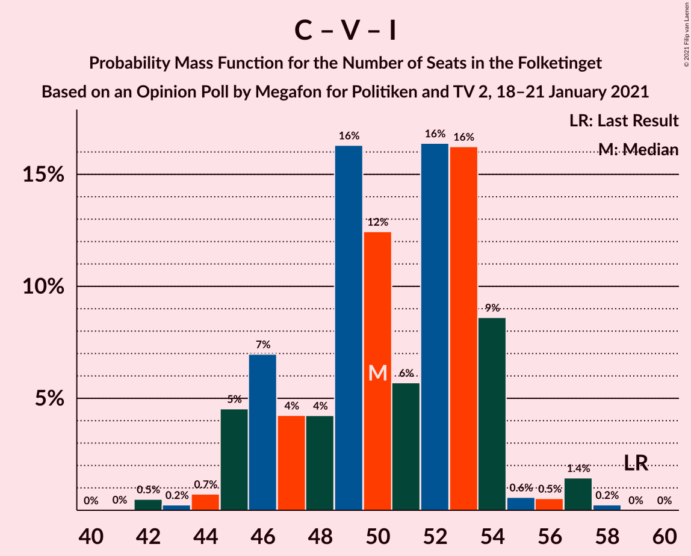

| Number of Seats | Probability | Accumulated | Special Marks |
|:---------------:|:-----------:|:-----------:|:-------------:|
| 42 | 0.5% | 100% |  |
| 43 | 0.2% | 99.5% |  |
| 44 | 0.7% | 99.2% |  |
| 45 | 5% | 98% |  |
| 46 | 7% | 94% |  |
| 47 | 4% | 87% |  |
| 48 | 4% | 83% |  |
| 49 | 16% | 79% |  |
| 50 | 12% | 62% | Median |
| 51 | 6% | 50% |  |
| 52 | 16% | 44% |  |
| 53 | 16% | 28% |  |
| 54 | 9% | 11% |  |
| 55 | 0.6% | 3% |  |
| 56 | 0.5% | 2% |  |
| 57 | 1.4% | 2% |  |
| 58 | 0.2% | 0.3% |  |
| 59 | 0% | 0% | Last Result |

### Det Konservative Folkeparti – Venstre

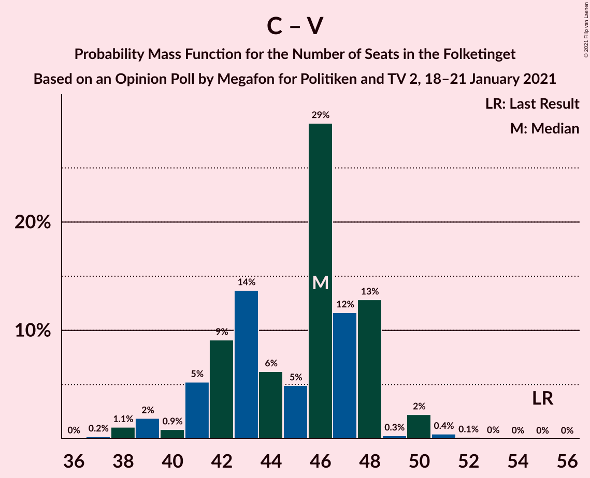

| Number of Seats | Probability | Accumulated | Special Marks |
|:---------------:|:-----------:|:-----------:|:-------------:|
| 37 | 0.2% | 100% |  |
| 38 | 1.1% | 99.8% |  |
| 39 | 2% | 98.7% |  |
| 40 | 0.9% | 97% |  |
| 41 | 5% | 96% |  |
| 42 | 9% | 91% |  |
| 43 | 14% | 82% |  |
| 44 | 6% | 68% | Median |
| 45 | 5% | 62% |  |
| 46 | 29% | 57% |  |
| 47 | 12% | 28% |  |
| 48 | 13% | 16% |  |
| 49 | 0.3% | 3% |  |
| 50 | 2% | 3% |  |
| 51 | 0.4% | 0.6% |  |
| 52 | 0.1% | 0.2% |  |
| 53 | 0% | 0.1% |  |
| 54 | 0% | 0% |  |
| 55 | 0% | 0% | Last Result |

### Venstre

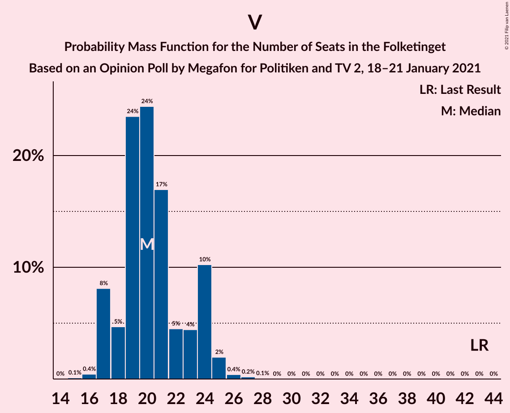

| Number of Seats | Probability | Accumulated | Special Marks |
|:---------------:|:-----------:|:-----------:|:-------------:|
| 15 | 0.1% | 100% |  |
| 16 | 0.4% | 99.9% |  |
| 17 | 8% | 99.4% |  |
| 18 | 5% | 91% |  |
| 19 | 24% | 87% |  |
| 20 | 24% | 63% | Median |
| 21 | 17% | 39% |  |
| 22 | 5% | 22% |  |
| 23 | 4% | 17% |  |
| 24 | 10% | 13% |  |
| 25 | 2% | 3% |  |
| 26 | 0.4% | 0.7% |  |
| 27 | 0.2% | 0.3% |  |
| 28 | 0.1% | 0.1% |  |
| 29 | 0% | 0% |  |
| 30 | 0% | 0% |  |
| 31 | 0% | 0% |  |
| 32 | 0% | 0% |  |
| 33 | 0% | 0% |  |
| 34 | 0% | 0% |  |
| 35 | 0% | 0% |  |
| 36 | 0% | 0% |  |
| 37 | 0% | 0% |  |
| 38 | 0% | 0% |  |
| 39 | 0% | 0% |  |
| 40 | 0% | 0% |  |
| 41 | 0% | 0% |  |
| 42 | 0% | 0% |  |
| 43 | 0% | 0% | Last Result |

## Technical Information

### Opinion Poll

+ **Polling firm:** Megafon
+ **Commissioner(s):** Politiken and TV 2
+ **Fieldwork period:** 18–21 January 2021

### Calculations

+ **Sample size:** 1000
+ **Simulations done:** 1,048,576
+ **Error estimate:** 3.06%

