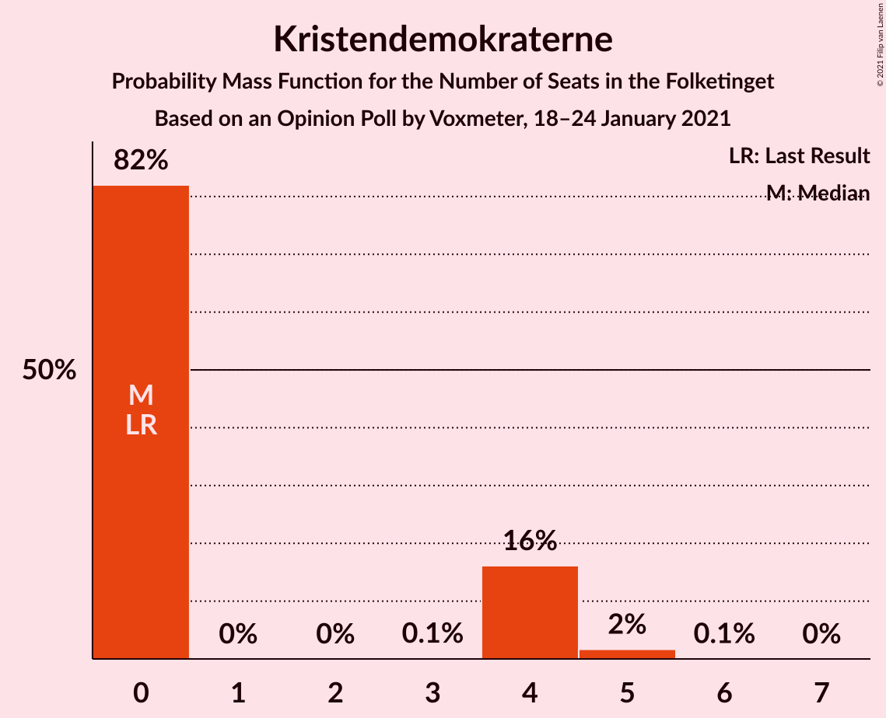
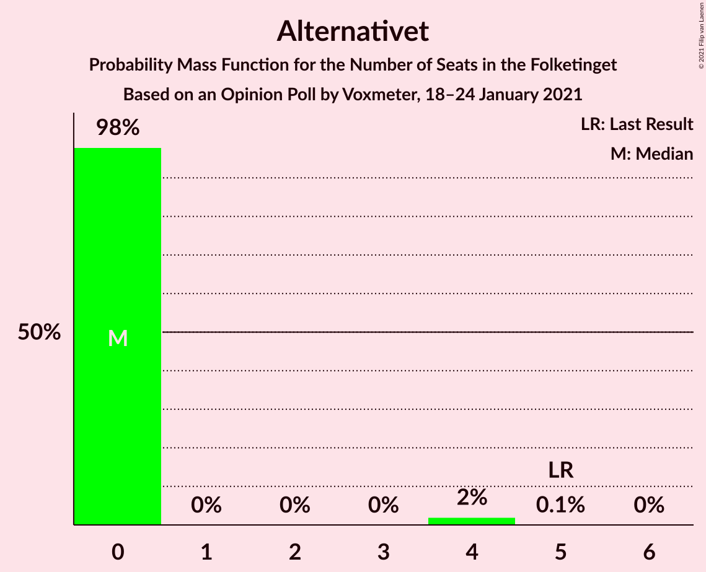
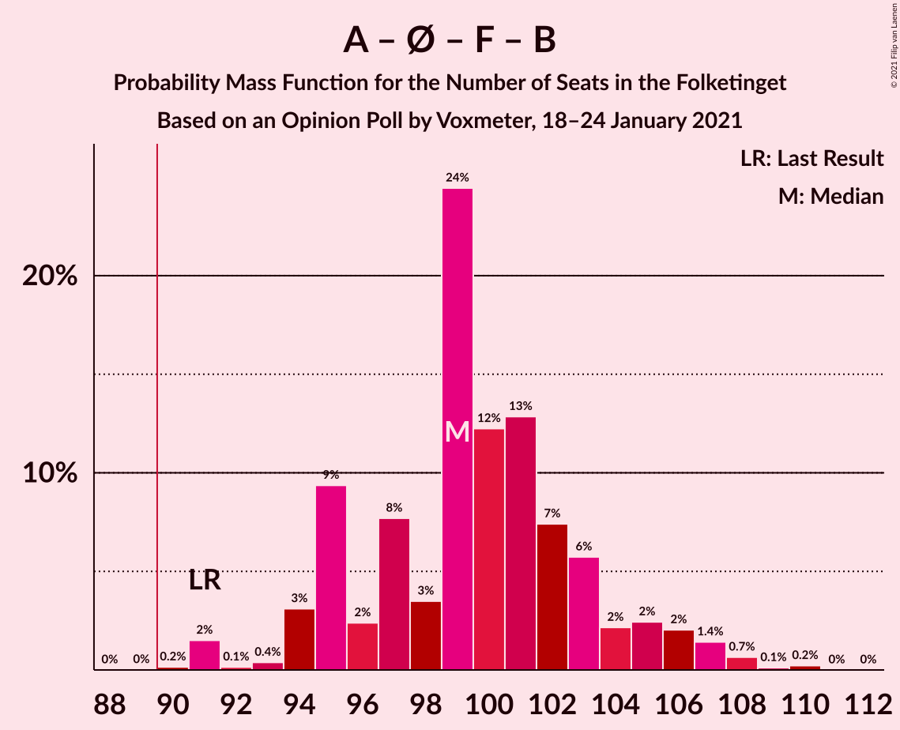
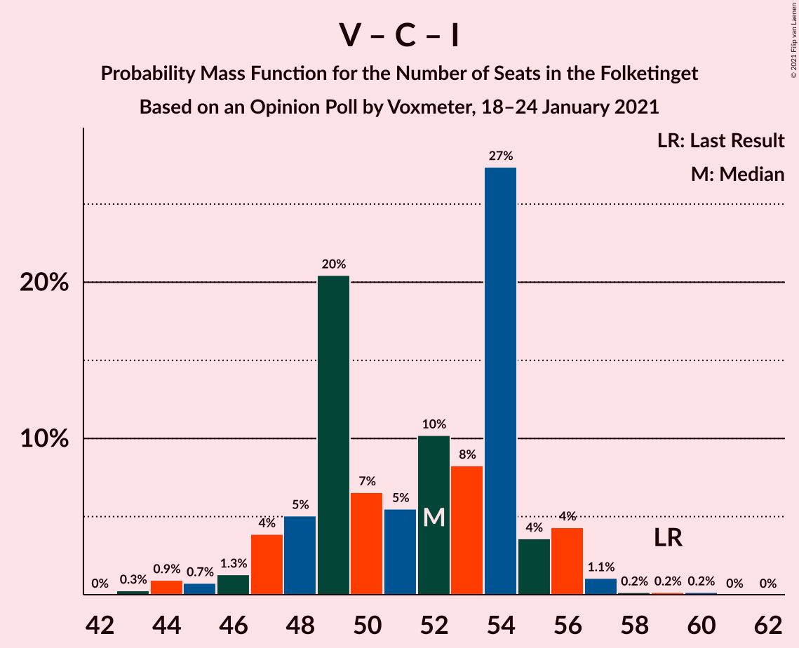

# Opinion Poll by Voxmeter, 18–24 January 2021

<a href="#voting-intentions">Voting Intentions</a> | <a href="#seats">Seats</a> | <a href="#coalitions">Coalitions</a> | <a href="#technical-information">Technical Information</a>

## Voting Intentions

### Confidence Intervals

| Party | Last Result | Poll Result | 80% Confidence Interval | 90% Confidence Interval | 95% Confidence Interval | 99% Confidence Interval |
|:-----:|:-----------:|:-----------:|:-----------------------:|:-----------------------:|:-----------------------:|:-----------------------:|
| Socialdemokraterne | 25.9% | 33.4% | 31.5–35.3% |31.0–35.8% |30.5–36.3% |29.6–37.3% |
| Venstre | 23.4% | 13.6% | 12.3–15.1% |11.9–15.5% |11.6–15.8% |11.0–16.6% |
| Det Konservative Folkeparti | 6.6% | 11.4% | 10.2–12.8% |9.9–13.2% |9.6–13.5% |9.1–14.2% |
| Enhedslisten–De Rød-Grønne | 6.9% | 8.5% | 7.4–9.7% |7.1–10.0% |6.9–10.3% |6.4–11.0% |
| Socialistisk Folkeparti | 7.7% | 7.4% | 6.4–8.6% |6.2–8.9% |5.9–9.2% |5.5–9.8% |
| Nye Borgerlige | 2.4% | 7.0% | 6.1–8.1% |5.8–8.4% |5.6–8.7% |5.2–9.3% |
| Radikale Venstre | 8.6% | 5.9% | 5.0–7.0% |4.8–7.3% |4.6–7.5% |4.2–8.1% |
| Dansk Folkeparti | 8.7% | 5.5% | 4.7–6.6% |4.5–6.8% |4.3–7.1% |3.9–7.6% |
| Liberal Alliance | 2.3% | 3.2% | 2.6–4.1% |2.5–4.3% |2.3–4.5% |2.1–5.0% |
| Kristendemokraterne | 1.7% | 1.4% | 1.0–2.0% |0.9–2.1% |0.8–2.3% |0.7–2.6% |
| Veganerpartiet | 0.0% | 1.3% | 0.9–1.9% |0.8–2.0% |0.7–2.2% |0.6–2.5% |
| Alternativet | 3.0% | 0.9% | 0.6–1.4% |0.5–1.5% |0.5–1.7% |0.4–2.0% |

*Note:* The poll result column reflects the actual value used in the calculations. Published results may vary slightly, and in addition be rounded to fewer digits.

## Seats

### Confidence Intervals

| Party | Last Result | Median | 80% Confidence Interval | 90% Confidence Interval | 95% Confidence Interval | 99% Confidence Interval |
|:-----:|:-----------:|:------:|:-----------------------:|:-----------------------:|:-----------------------:|:-----------------------:|
| <a href="#socialdemokraterne">Socialdemokraterne</a> | 48 | 60 | 55–64 |55–64 |55–65 |53–66 |
| <a href="#venstre">Venstre</a> | 43 | 25 | 22–28 |21–29 |20–31 |19–31 |
| <a href="#det-konservative-folkeparti">Det Konservative Folkeparti</a> | 12 | 20 | 18–23 |18–24 |17–25 |16–26 |
| <a href="#enhedslisten–de-rød-grønne">Enhedslisten–De Rød-Grønne</a> | 13 | 16 | 13–18 |12–19 |12–20 |11–20 |
| <a href="#socialistisk-folkeparti">Socialistisk Folkeparti</a> | 14 | 14 | 11–16 |11–16 |11–16 |10–17 |
| <a href="#nye-borgerlige">Nye Borgerlige</a> | 4 | 12 | 11–15 |10–16 |10–16 |9–17 |
| <a href="#radikale-venstre">Radikale Venstre</a> | 16 | 10 | 9–12 |9–13 |8–14 |8–15 |
| <a href="#dansk-folkeparti">Dansk Folkeparti</a> | 16 | 10 | 8–12 |8–13 |8–13 |7–15 |
| <a href="#liberal-alliance">Liberal Alliance</a> | 4 | 6 | 5–8 |4–8 |4–8 |4–9 |
| <a href="#kristendemokraterne">Kristendemokraterne</a> | 0 | 0 | 0–4 |0–4 |0–4 |0–5 |
| <a href="#veganerpartiet">Veganerpartiet</a> | 0 | 0 | 0–4 |0–4 |0–4 |0–5 |
| <a href="#alternativet">Alternativet</a> | 5 | 0 | 0 |0 |0 |0–4 |

### Socialdemokraterne

*For a full overview of the results for this party, see the [Socialdemokraterne](party-socialdemokraterne.html) page.*

| Number of Seats | Probability | Accumulated | Special Marks |
|:---------------:|:-----------:|:-----------:|:-------------:|
| 48 | 0% | 100% | Last Result |
| 49 | 0% | 100% |  |
| 50 | 0% | 100% |  |
| 51 | 0.2% | 100% |  |
| 52 | 0.2% | 99.8% |  |
| 53 | 0.2% | 99.6% |  |
| 54 | 1.1% | 99.5% |  |
| 55 | 10% | 98% |  |
| 56 | 4% | 88% |  |
| 57 | 9% | 84% |  |
| 58 | 10% | 75% |  |
| 59 | 5% | 65% |  |
| 60 | 24% | 60% | Median |
| 61 | 4% | 36% |  |
| 62 | 9% | 32% |  |
| 63 | 12% | 23% |  |
| 64 | 8% | 11% |  |
| 65 | 2% | 3% |  |
| 66 | 1.2% | 1.3% |  |
| 67 | 0% | 0.1% |  |
| 68 | 0% | 0.1% |  |
| 69 | 0% | 0% |  |

### Venstre

*For a full overview of the results for this party, see the [Venstre](party-venstre.html) page.*

| Number of Seats | Probability | Accumulated | Special Marks |
|:---------------:|:-----------:|:-----------:|:-------------:|
| 18 | 0.1% | 100% |  |
| 19 | 0.5% | 99.9% |  |
| 20 | 2% | 99.4% |  |
| 21 | 5% | 97% |  |
| 22 | 11% | 92% |  |
| 23 | 8% | 81% |  |
| 24 | 15% | 73% |  |
| 25 | 9% | 58% | Median |
| 26 | 31% | 48% |  |
| 27 | 5% | 18% |  |
| 28 | 7% | 13% |  |
| 29 | 0.6% | 5% |  |
| 30 | 2% | 4% |  |
| 31 | 2% | 3% |  |
| 32 | 0.2% | 0.2% |  |
| 33 | 0% | 0% |  |
| 34 | 0% | 0% |  |
| 35 | 0% | 0% |  |
| 36 | 0% | 0% |  |
| 37 | 0% | 0% |  |
| 38 | 0% | 0% |  |
| 39 | 0% | 0% |  |
| 40 | 0% | 0% |  |
| 41 | 0% | 0% |  |
| 42 | 0% | 0% |  |
| 43 | 0% | 0% | Last Result |

### Det Konservative Folkeparti

*For a full overview of the results for this party, see the [Det Konservative Folkeparti](party-detkonservativefolkeparti.html) page.*

| Number of Seats | Probability | Accumulated | Special Marks |
|:---------------:|:-----------:|:-----------:|:-------------:|
| 12 | 0% | 100% | Last Result |
| 13 | 0% | 100% |  |
| 14 | 0% | 100% |  |
| 15 | 0.2% | 100% |  |
| 16 | 1.2% | 99.8% |  |
| 17 | 2% | 98.6% |  |
| 18 | 9% | 97% |  |
| 19 | 18% | 88% |  |
| 20 | 22% | 70% | Median |
| 21 | 12% | 49% |  |
| 22 | 22% | 37% |  |
| 23 | 9% | 15% |  |
| 24 | 2% | 6% |  |
| 25 | 4% | 4% |  |
| 26 | 0.7% | 0.7% |  |
| 27 | 0% | 0% |  |

### Enhedslisten–De Rød-Grønne

*For a full overview of the results for this party, see the [Enhedslisten–De Rød-Grønne](party-enhedslisten–derød-grønne.html) page.*

| Number of Seats | Probability | Accumulated | Special Marks |
|:---------------:|:-----------:|:-----------:|:-------------:|
| 10 | 0.1% | 100% |  |
| 11 | 1.4% | 99.9% |  |
| 12 | 7% | 98.5% |  |
| 13 | 21% | 92% | Last Result |
| 14 | 9% | 71% |  |
| 15 | 12% | 63% |  |
| 16 | 17% | 51% | Median |
| 17 | 20% | 33% |  |
| 18 | 8% | 14% |  |
| 19 | 2% | 6% |  |
| 20 | 3% | 4% |  |
| 21 | 0.4% | 0.4% |  |
| 22 | 0% | 0% |  |

### Socialistisk Folkeparti

*For a full overview of the results for this party, see the [Socialistisk Folkeparti](party-socialistiskfolkeparti.html) page.*

| Number of Seats | Probability | Accumulated | Special Marks |
|:---------------:|:-----------:|:-----------:|:-------------:|
| 9 | 0.5% | 100% |  |
| 10 | 2% | 99.5% |  |
| 11 | 11% | 98% |  |
| 12 | 12% | 87% |  |
| 13 | 16% | 76% |  |
| 14 | 26% | 59% | Last Result, Median |
| 15 | 8% | 33% |  |
| 16 | 23% | 25% |  |
| 17 | 2% | 2% |  |
| 18 | 0.3% | 0.4% |  |
| 19 | 0.1% | 0.1% |  |
| 20 | 0% | 0% |  |

### Nye Borgerlige

*For a full overview of the results for this party, see the [Nye Borgerlige](party-nyeborgerlige.html) page.*

| Number of Seats | Probability | Accumulated | Special Marks |
|:---------------:|:-----------:|:-----------:|:-------------:|
| 4 | 0% | 100% | Last Result |
| 5 | 0% | 100% |  |
| 6 | 0% | 100% |  |
| 7 | 0% | 100% |  |
| 8 | 0.1% | 100% |  |
| 9 | 2% | 99.9% |  |
| 10 | 6% | 98% |  |
| 11 | 15% | 92% |  |
| 12 | 28% | 77% | Median |
| 13 | 11% | 49% |  |
| 14 | 25% | 38% |  |
| 15 | 8% | 13% |  |
| 16 | 4% | 5% |  |
| 17 | 0.9% | 1.0% |  |
| 18 | 0.1% | 0.1% |  |
| 19 | 0% | 0% |  |

### Radikale Venstre

*For a full overview of the results for this party, see the [Radikale Venstre](party-radikalevenstre.html) page.*

| Number of Seats | Probability | Accumulated | Special Marks |
|:---------------:|:-----------:|:-----------:|:-------------:|
| 7 | 0.5% | 100% |  |
| 8 | 2% | 99.5% |  |
| 9 | 15% | 97% |  |
| 10 | 39% | 82% | Median |
| 11 | 21% | 44% |  |
| 12 | 13% | 23% |  |
| 13 | 6% | 10% |  |
| 14 | 2% | 4% |  |
| 15 | 1.4% | 1.4% |  |
| 16 | 0% | 0.1% | Last Result |
| 17 | 0% | 0% |  |

### Dansk Folkeparti

*For a full overview of the results for this party, see the [Dansk Folkeparti](party-danskfolkeparti.html) page.*

| Number of Seats | Probability | Accumulated | Special Marks |
|:---------------:|:-----------:|:-----------:|:-------------:|
| 6 | 0.1% | 100% |  |
| 7 | 2% | 99.9% |  |
| 8 | 20% | 98% |  |
| 9 | 14% | 78% |  |
| 10 | 27% | 63% | Median |
| 11 | 21% | 36% |  |
| 12 | 9% | 15% |  |
| 13 | 4% | 6% |  |
| 14 | 1.2% | 2% |  |
| 15 | 0.4% | 0.5% |  |
| 16 | 0.1% | 0.1% | Last Result |
| 17 | 0% | 0% |  |

### Liberal Alliance

*For a full overview of the results for this party, see the [Liberal Alliance](party-liberalalliance.html) page.*

| Number of Seats | Probability | Accumulated | Special Marks |
|:---------------:|:-----------:|:-----------:|:-------------:|
| 0 | 0.2% | 100% |  |
| 1 | 0% | 99.8% |  |
| 2 | 0% | 99.8% |  |
| 3 | 0% | 99.8% |  |
| 4 | 7% | 99.8% | Last Result |
| 5 | 27% | 93% |  |
| 6 | 33% | 65% | Median |
| 7 | 22% | 32% |  |
| 8 | 9% | 11% |  |
| 9 | 2% | 2% |  |
| 10 | 0.4% | 0.4% |  |
| 11 | 0% | 0% |  |

### Kristendemokraterne

*For a full overview of the results for this party, see the [Kristendemokraterne](party-kristendemokraterne.html) page.*

| Number of Seats | Probability | Accumulated | Special Marks |
|:---------------:|:-----------:|:-----------:|:-------------:|
| 0 | 82% | 100% | Last Result, Median |
| 1 | 0% | 18% |  |
| 2 | 0% | 18% |  |
| 3 | 0.1% | 18% |  |
| 4 | 16% | 18% |  |
| 5 | 2% | 2% |  |
| 6 | 0.1% | 0.1% |  |
| 7 | 0% | 0% |  |

### Veganerpartiet

*For a full overview of the results for this party, see the [Veganerpartiet](party-veganerpartiet.html) page.*

| Number of Seats | Probability | Accumulated | Special Marks |
|:---------------:|:-----------:|:-----------:|:-------------:|
| 0 | 89% | 100% | Last Result, Median |
| 1 | 0% | 11% |  |
| 2 | 0% | 11% |  |
| 3 | 0% | 11% |  |
| 4 | 10% | 11% |  |
| 5 | 1.0% | 1.0% |  |
| 6 | 0% | 0% |  |

### Alternativet

*For a full overview of the results for this party, see the [Alternativet](party-alternativet.html) page.*

| Number of Seats | Probability | Accumulated | Special Marks |
|:---------------:|:-----------:|:-----------:|:-------------:|
| 0 | 98% | 100% | Median |
| 1 | 0% | 2% |  |
| 2 | 0% | 2% |  |
| 3 | 0% | 2% |  |
| 4 | 2% | 2% |  |
| 5 | 0.1% | 0.1% | Last Result |
| 6 | 0% | 0% |  |

## Coalitions

### Confidence Intervals

| Coalition | Last Result | Median | Majority? | 80% Confidence Interval | 90% Confidence Interval | 95% Confidence Interval | 99% Confidence Interval |
|:---------:|:-----------:|:------:|:---------:|:-----------------------:|:-----------------------:|:-----------------------:|:-----------------------:|
| Socialdemokraterne – Enhedslisten–De Rød-Grønne – Socialistisk Folkeparti – Radikale Venstre – Alternativet | 96 | 99 | 100% | 95–104 | 94–105 | 94–106 | 91–108 |
| Socialdemokraterne – Enhedslisten–De Rød-Grønne – Socialistisk Folkeparti – Radikale Venstre | 91 | 99 | 100% | 95–103 | 94–105 | 94–106 | 91–108 |
| Socialdemokraterne – Enhedslisten–De Rød-Grønne – Socialistisk Folkeparti – Alternativet | 80 | 89 | 44% | 84–93 | 84–94 | 83–96 | 82–97 |
| Socialdemokraterne – Enhedslisten–De Rød-Grønne – Socialistisk Folkeparti | 75 | 89 | 44% | 84–93 | 84–94 | 83–96 | 82–97 |
| Socialdemokraterne – Socialistisk Folkeparti – Radikale Venstre | 78 | 84 | 3% | 80–88 | 79–89 | 78–90 | 77–92 |
| Venstre – Det Konservative Folkeparti – Nye Borgerlige – Dansk Folkeparti – Liberal Alliance – Kristendemokraterne | 79 | 76 | 0% | 71–80 | 70–80 | 68–81 | 67–82 |
| Venstre – Det Konservative Folkeparti – Nye Borgerlige – Dansk Folkeparti – Liberal Alliance | 79 | 74 | 0% | 70–78 | 69–79 | 68–80 | 66–82 |
| Socialdemokraterne – Radikale Venstre | 64 | 70 | 0% | 66–74 | 65–75 | 64–76 | 63–78 |
| Venstre – Det Konservative Folkeparti – Dansk Folkeparti – Liberal Alliance – Kristendemokraterne | 75 | 62 | 0% | 58–67 | 57–68 | 56–68 | 54–69 |
| Venstre – Det Konservative Folkeparti – Dansk Folkeparti – Liberal Alliance | 75 | 62 | 0% | 58–65 | 57–66 | 56–68 | 54–69 |
| Venstre – Det Konservative Folkeparti – Liberal Alliance | 59 | 52 | 0% | 48–54 | 47–56 | 46–56 | 44–57 |
| Venstre – Det Konservative Folkeparti | 55 | 46 | 0% | 42–49 | 41–50 | 40–51 | 38–51 |
| Venstre | 43 | 25 | 0% | 22–28 | 21–29 | 20–31 | 19–31 |

### Socialdemokraterne – Enhedslisten–De Rød-Grønne – Socialistisk Folkeparti – Radikale Venstre – Alternativet

| Number of Seats | Probability | Accumulated | Special Marks |
|:---------------:|:-----------:|:-----------:|:-------------:|
| 90 | 0.1% | 100% | Majority |
| 91 | 2% | 99.8% |  |
| 92 | 0.1% | 98% |  |
| 93 | 0.4% | 98% |  |
| 94 | 3% | 98% |  |
| 95 | 9% | 95% |  |
| 96 | 2% | 86% | Last Result |
| 97 | 8% | 83% |  |
| 98 | 4% | 76% |  |
| 99 | 24% | 72% |  |
| 100 | 11% | 48% | Median |
| 101 | 13% | 37% |  |
| 102 | 7% | 24% |  |
| 103 | 6% | 16% |  |
| 104 | 4% | 11% |  |
| 105 | 2% | 7% |  |
| 106 | 2% | 4% |  |
| 107 | 1.4% | 2% |  |
| 108 | 0.7% | 1.0% |  |
| 109 | 0.1% | 0.3% |  |
| 110 | 0.2% | 0.2% |  |
| 111 | 0% | 0% |  |

### Socialdemokraterne – Enhedslisten–De Rød-Grønne – Socialistisk Folkeparti – Radikale Venstre

| Number of Seats | Probability | Accumulated | Special Marks |
|:---------------:|:-----------:|:-----------:|:-------------:|
| 90 | 0.2% | 100% | Majority |
| 91 | 2% | 99.8% | Last Result |
| 92 | 0.1% | 98% |  |
| 93 | 0.4% | 98% |  |
| 94 | 3% | 98% |  |
| 95 | 9% | 95% |  |
| 96 | 2% | 85% |  |
| 97 | 8% | 83% |  |
| 98 | 3% | 75% |  |
| 99 | 24% | 72% |  |
| 100 | 12% | 47% | Median |
| 101 | 13% | 35% |  |
| 102 | 7% | 22% |  |
| 103 | 6% | 15% |  |
| 104 | 2% | 9% |  |
| 105 | 2% | 7% |  |
| 106 | 2% | 4% |  |
| 107 | 1.4% | 2% |  |
| 108 | 0.7% | 1.0% |  |
| 109 | 0.1% | 0.3% |  |
| 110 | 0.2% | 0.2% |  |
| 111 | 0% | 0% |  |

### Socialdemokraterne – Enhedslisten–De Rød-Grønne – Socialistisk Folkeparti – Alternativet

| Number of Seats | Probability | Accumulated | Special Marks |
|:---------------:|:-----------:|:-----------:|:-------------:|
| 80 | 0.2% | 100% | Last Result |
| 81 | 0.2% | 99.7% |  |
| 82 | 2% | 99.6% |  |
| 83 | 2% | 98% |  |
| 84 | 9% | 96% |  |
| 85 | 6% | 86% |  |
| 86 | 5% | 81% |  |
| 87 | 8% | 76% |  |
| 88 | 4% | 68% |  |
| 89 | 20% | 64% |  |
| 90 | 9% | 44% | Median, Majority |
| 91 | 15% | 35% |  |
| 92 | 8% | 20% |  |
| 93 | 3% | 12% |  |
| 94 | 5% | 9% |  |
| 95 | 1.0% | 4% |  |
| 96 | 2% | 3% |  |
| 97 | 1.0% | 1.2% |  |
| 98 | 0.1% | 0.2% |  |
| 99 | 0.1% | 0.1% |  |
| 100 | 0% | 0% |  |

### Socialdemokraterne – Enhedslisten–De Rød-Grønne – Socialistisk Folkeparti

| Number of Seats | Probability | Accumulated | Special Marks |
|:---------------:|:-----------:|:-----------:|:-------------:|
| 75 | 0% | 100% | Last Result |
| 76 | 0% | 100% |  |
| 77 | 0% | 100% |  |
| 78 | 0% | 100% |  |
| 79 | 0% | 100% |  |
| 80 | 0.2% | 100% |  |
| 81 | 0.2% | 99.7% |  |
| 82 | 2% | 99.6% |  |
| 83 | 2% | 98% |  |
| 84 | 9% | 96% |  |
| 85 | 6% | 86% |  |
| 86 | 5% | 81% |  |
| 87 | 8% | 76% |  |
| 88 | 4% | 68% |  |
| 89 | 19% | 63% |  |
| 90 | 11% | 44% | Median, Majority |
| 91 | 15% | 33% |  |
| 92 | 8% | 18% |  |
| 93 | 3% | 10% |  |
| 94 | 3% | 7% |  |
| 95 | 1.0% | 4% |  |
| 96 | 2% | 3% |  |
| 97 | 1.0% | 1.2% |  |
| 98 | 0.1% | 0.2% |  |
| 99 | 0.1% | 0.1% |  |
| 100 | 0% | 0% |  |

### Socialdemokraterne – Socialistisk Folkeparti – Radikale Venstre

| Number of Seats | Probability | Accumulated | Special Marks |
|:---------------:|:-----------:|:-----------:|:-------------:|
| 75 | 0.1% | 100% |  |
| 76 | 0.2% | 99.9% |  |
| 77 | 2% | 99.7% |  |
| 78 | 3% | 98% | Last Result |
| 79 | 2% | 95% |  |
| 80 | 9% | 93% |  |
| 81 | 2% | 84% |  |
| 82 | 9% | 82% |  |
| 83 | 14% | 72% |  |
| 84 | 14% | 59% | Median |
| 85 | 8% | 45% |  |
| 86 | 14% | 37% |  |
| 87 | 12% | 23% |  |
| 88 | 4% | 12% |  |
| 89 | 4% | 8% |  |
| 90 | 1.0% | 3% | Majority |
| 91 | 2% | 2% |  |
| 92 | 0.5% | 0.6% |  |
| 93 | 0.1% | 0.2% |  |
| 94 | 0.1% | 0.1% |  |
| 95 | 0% | 0% |  |

### Venstre – Det Konservative Folkeparti – Nye Borgerlige – Dansk Folkeparti – Liberal Alliance – Kristendemokraterne

| Number of Seats | Probability | Accumulated | Special Marks |
|:---------------:|:-----------:|:-----------:|:-------------:|
| 65 | 0.3% | 100% |  |
| 66 | 0.2% | 99.7% |  |
| 67 | 0.7% | 99.5% |  |
| 68 | 1.4% | 98.8% |  |
| 69 | 2% | 97% |  |
| 70 | 3% | 95% |  |
| 71 | 9% | 93% |  |
| 72 | 6% | 83% |  |
| 73 | 8% | 78% | Median |
| 74 | 13% | 69% |  |
| 75 | 5% | 56% |  |
| 76 | 26% | 51% |  |
| 77 | 4% | 25% |  |
| 78 | 7% | 22% |  |
| 79 | 2% | 14% | Last Result |
| 80 | 9% | 12% |  |
| 81 | 3% | 3% |  |
| 82 | 0.3% | 0.6% |  |
| 83 | 0.1% | 0.4% |  |
| 84 | 0.1% | 0.2% |  |
| 85 | 0.1% | 0.2% |  |
| 86 | 0% | 0% |  |

### Venstre – Det Konservative Folkeparti – Nye Borgerlige – Dansk Folkeparti – Liberal Alliance

| Number of Seats | Probability | Accumulated | Special Marks |
|:---------------:|:-----------:|:-----------:|:-------------:|
| 65 | 0.3% | 100% |  |
| 66 | 0.2% | 99.7% |  |
| 67 | 1.0% | 99.5% |  |
| 68 | 2% | 98% |  |
| 69 | 4% | 97% |  |
| 70 | 4% | 93% |  |
| 71 | 9% | 89% |  |
| 72 | 9% | 80% |  |
| 73 | 8% | 71% | Median |
| 74 | 13% | 63% |  |
| 75 | 5% | 50% |  |
| 76 | 28% | 45% |  |
| 77 | 5% | 17% |  |
| 78 | 6% | 12% |  |
| 79 | 2% | 6% | Last Result |
| 80 | 4% | 5% |  |
| 81 | 0.2% | 0.8% |  |
| 82 | 0.2% | 0.5% |  |
| 83 | 0.1% | 0.3% |  |
| 84 | 0% | 0.2% |  |
| 85 | 0.1% | 0.1% |  |
| 86 | 0% | 0% |  |

### Socialdemokraterne – Radikale Venstre

| Number of Seats | Probability | Accumulated | Special Marks |
|:---------------:|:-----------:|:-----------:|:-------------:|
| 62 | 0.2% | 100% |  |
| 63 | 0.3% | 99.7% |  |
| 64 | 4% | 99.4% | Last Result |
| 65 | 0.5% | 95% |  |
| 66 | 8% | 95% |  |
| 67 | 2% | 87% |  |
| 68 | 11% | 86% |  |
| 69 | 9% | 75% |  |
| 70 | 24% | 66% | Median |
| 71 | 6% | 42% |  |
| 72 | 12% | 36% |  |
| 73 | 9% | 24% |  |
| 74 | 6% | 15% |  |
| 75 | 6% | 9% |  |
| 76 | 1.1% | 3% |  |
| 77 | 2% | 2% |  |
| 78 | 0.4% | 0.5% |  |
| 79 | 0% | 0.1% |  |
| 80 | 0.1% | 0.1% |  |
| 81 | 0% | 0% |  |

### Venstre – Det Konservative Folkeparti – Dansk Folkeparti – Liberal Alliance – Kristendemokraterne

| Number of Seats | Probability | Accumulated | Special Marks |
|:---------------:|:-----------:|:-----------:|:-------------:|
| 53 | 0.2% | 100% |  |
| 54 | 0.6% | 99.8% |  |
| 55 | 0.4% | 99.2% |  |
| 56 | 2% | 98.8% |  |
| 57 | 3% | 97% |  |
| 58 | 7% | 94% |  |
| 59 | 8% | 87% |  |
| 60 | 9% | 79% |  |
| 61 | 9% | 69% | Median |
| 62 | 18% | 60% |  |
| 63 | 11% | 43% |  |
| 64 | 8% | 32% |  |
| 65 | 6% | 24% |  |
| 66 | 5% | 18% |  |
| 67 | 4% | 14% |  |
| 68 | 8% | 10% |  |
| 69 | 1.3% | 2% |  |
| 70 | 0.2% | 0.4% |  |
| 71 | 0% | 0.2% |  |
| 72 | 0% | 0.2% |  |
| 73 | 0.1% | 0.1% |  |
| 74 | 0% | 0% |  |
| 75 | 0% | 0% | Last Result |

### Venstre – Det Konservative Folkeparti – Dansk Folkeparti – Liberal Alliance

| Number of Seats | Probability | Accumulated | Special Marks |
|:---------------:|:-----------:|:-----------:|:-------------:|
| 53 | 0.2% | 100% |  |
| 54 | 0.7% | 99.8% |  |
| 55 | 0.5% | 99.1% |  |
| 56 | 3% | 98.6% |  |
| 57 | 4% | 96% |  |
| 58 | 7% | 92% |  |
| 59 | 10% | 85% |  |
| 60 | 10% | 75% |  |
| 61 | 11% | 65% | Median |
| 62 | 18% | 53% |  |
| 63 | 11% | 36% |  |
| 64 | 12% | 24% |  |
| 65 | 4% | 12% |  |
| 66 | 4% | 9% |  |
| 67 | 2% | 5% |  |
| 68 | 3% | 3% |  |
| 69 | 0.3% | 0.5% |  |
| 70 | 0.1% | 0.3% |  |
| 71 | 0% | 0.2% |  |
| 72 | 0% | 0.1% |  |
| 73 | 0.1% | 0.1% |  |
| 74 | 0% | 0% |  |
| 75 | 0% | 0% | Last Result |

### Venstre – Det Konservative Folkeparti – Liberal Alliance

| Number of Seats | Probability | Accumulated | Special Marks |
|:---------------:|:-----------:|:-----------:|:-------------:|
| 43 | 0.3% | 100% |  |
| 44 | 0.9% | 99.7% |  |
| 45 | 0.7% | 98.8% |  |
| 46 | 1.3% | 98% |  |
| 47 | 4% | 97% |  |
| 48 | 5% | 93% |  |
| 49 | 20% | 88% |  |
| 50 | 7% | 67% |  |
| 51 | 5% | 61% | Median |
| 52 | 10% | 55% |  |
| 53 | 8% | 45% |  |
| 54 | 27% | 37% |  |
| 55 | 4% | 9% |  |
| 56 | 4% | 6% |  |
| 57 | 1.1% | 2% |  |
| 58 | 0.2% | 0.5% |  |
| 59 | 0.2% | 0.3% | Last Result |
| 60 | 0.2% | 0.2% |  |
| 61 | 0% | 0% |  |

### Venstre – Det Konservative Folkeparti

| Number of Seats | Probability | Accumulated | Special Marks |
|:---------------:|:-----------:|:-----------:|:-------------:|
| 37 | 0.1% | 100% |  |
| 38 | 0.5% | 99.9% |  |
| 39 | 2% | 99.4% |  |
| 40 | 1.0% | 98% |  |
| 41 | 5% | 97% |  |
| 42 | 4% | 92% |  |
| 43 | 7% | 88% |  |
| 44 | 17% | 80% |  |
| 45 | 13% | 63% | Median |
| 46 | 10% | 50% |  |
| 47 | 11% | 40% |  |
| 48 | 19% | 29% |  |
| 49 | 6% | 11% |  |
| 50 | 3% | 5% |  |
| 51 | 2% | 3% |  |
| 52 | 0.2% | 0.4% |  |
| 53 | 0.2% | 0.2% |  |
| 54 | 0% | 0% |  |
| 55 | 0% | 0% | Last Result |

### Venstre

| Number of Seats | Probability | Accumulated | Special Marks |
|:---------------:|:-----------:|:-----------:|:-------------:|
| 18 | 0.1% | 100% |  |
| 19 | 0.5% | 99.9% |  |
| 20 | 2% | 99.4% |  |
| 21 | 5% | 97% |  |
| 22 | 11% | 92% |  |
| 23 | 8% | 81% |  |
| 24 | 15% | 73% |  |
| 25 | 9% | 58% | Median |
| 26 | 31% | 48% |  |
| 27 | 5% | 18% |  |
| 28 | 7% | 13% |  |
| 29 | 0.6% | 5% |  |
| 30 | 2% | 4% |  |
| 31 | 2% | 3% |  |
| 32 | 0.2% | 0.2% |  |
| 33 | 0% | 0% |  |
| 34 | 0% | 0% |  |
| 35 | 0% | 0% |  |
| 36 | 0% | 0% |  |
| 37 | 0% | 0% |  |
| 38 | 0% | 0% |  |
| 39 | 0% | 0% |  |
| 40 | 0% | 0% |  |
| 41 | 0% | 0% |  |
| 42 | 0% | 0% |  |
| 43 | 0% | 0% | Last Result |

## Technical Information

### Opinion Poll

+ **Polling firm:** Voxmeter
+ **Commissioner(s):** —
+ **Fieldwork period:** 18–24 January 2021

### Calculations

+ **Sample size:** 1016
+ **Simulations done:** 1,048,576
+ **Error estimate:** 2.58%

