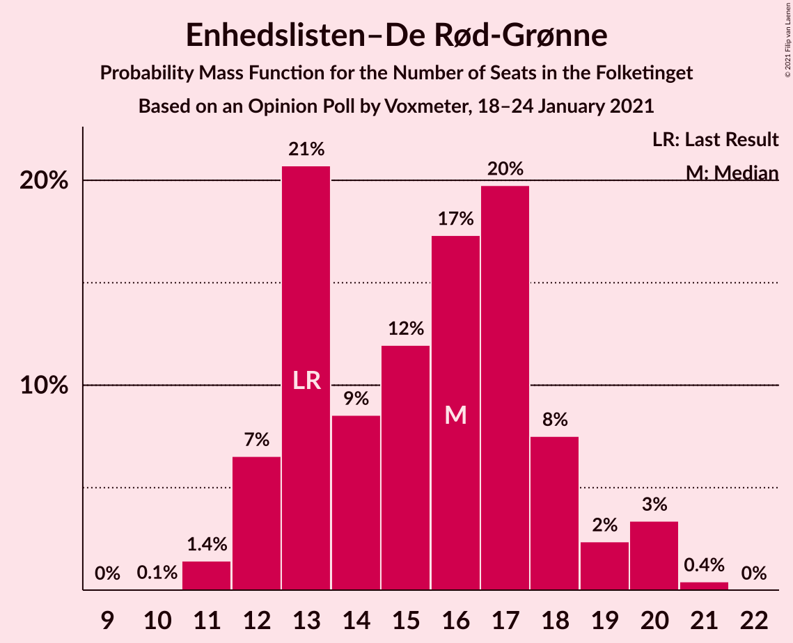
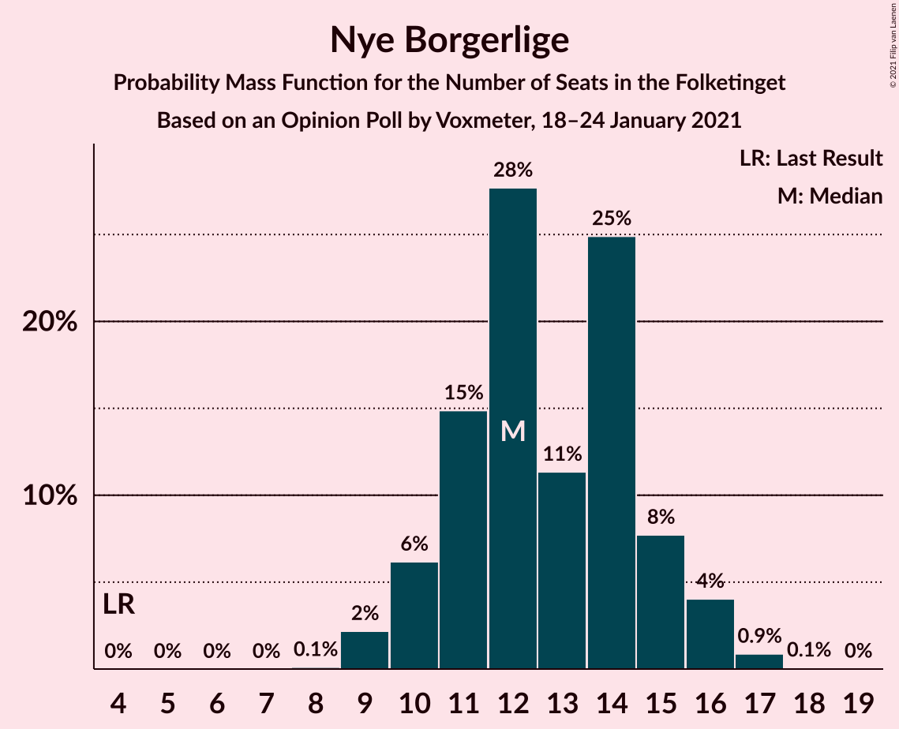
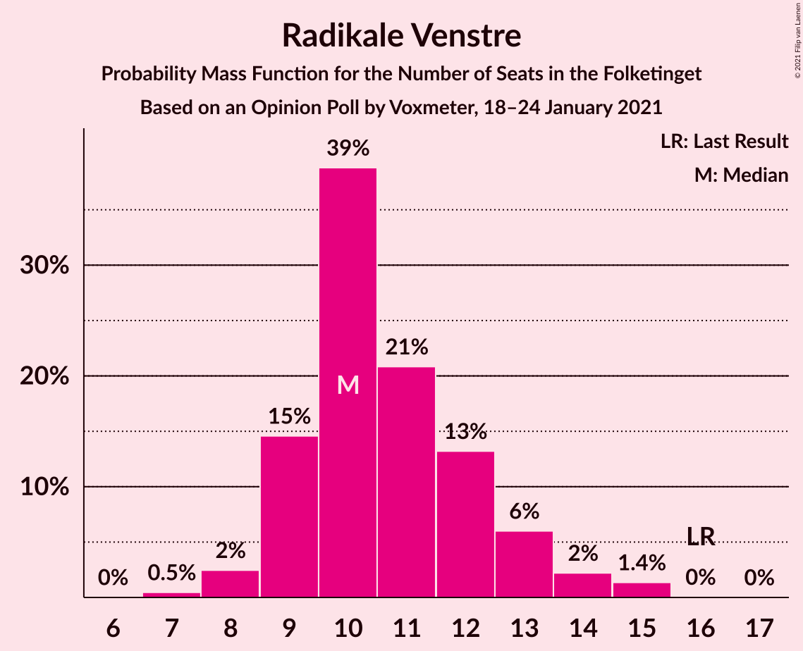
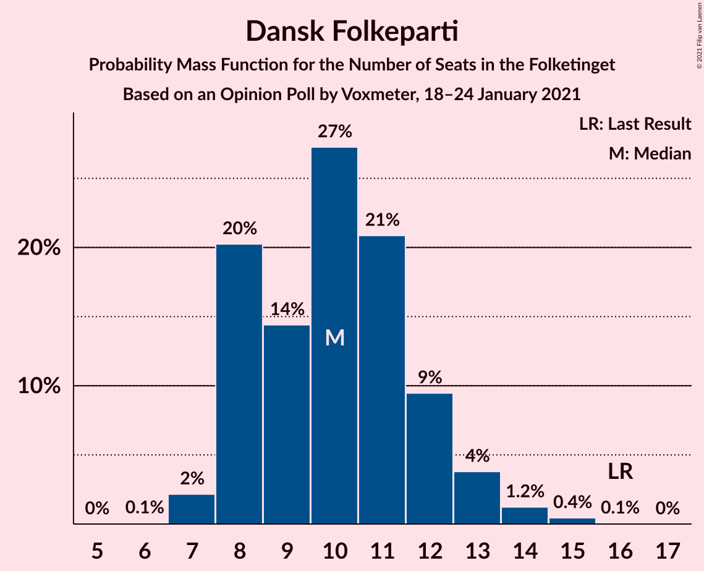
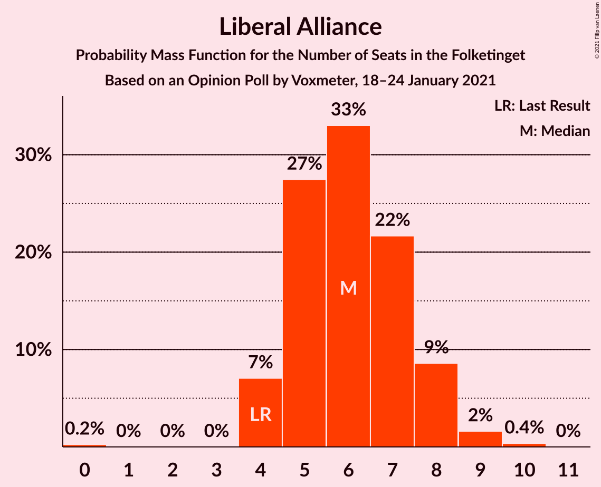
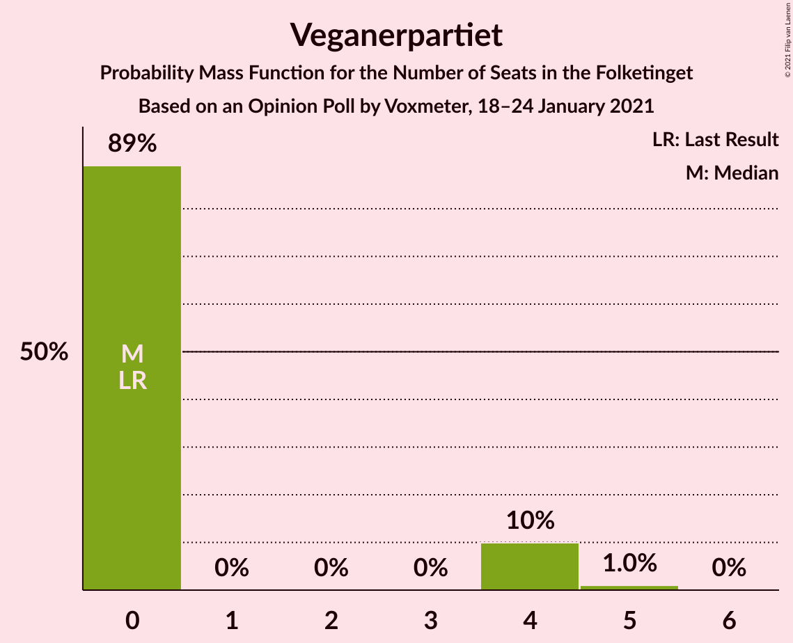
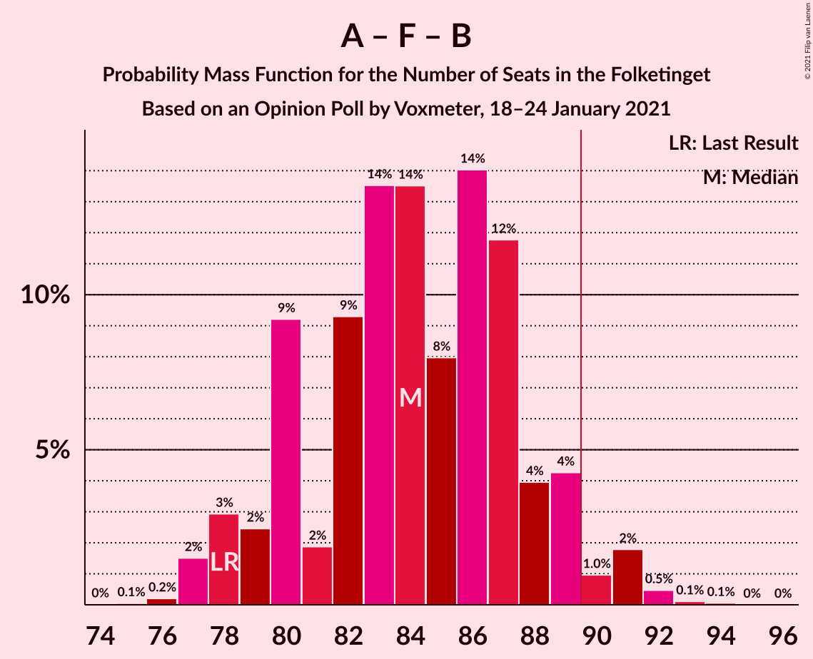
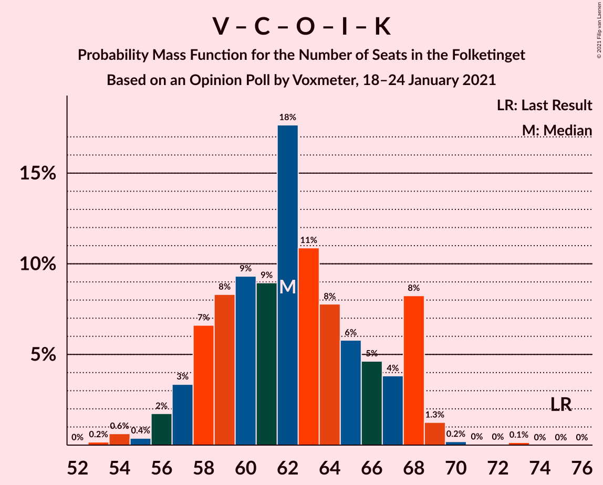
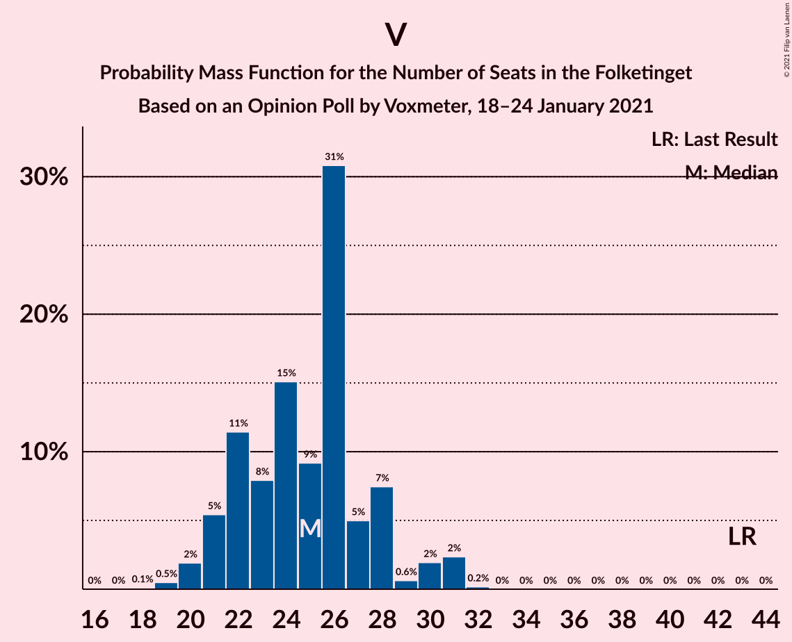

# Opinion Poll by Voxmeter, 18–24 January 2021

<a href="#voting-intentions">Voting Intentions</a> | <a href="#seats">Seats</a> | <a href="#coalitions">Coalitions</a> | <a href="#technical-information">Technical Information</a>

## Voting Intentions

### Confidence Intervals

| Party | Last Result | Poll Result | 80% Confidence Interval | 90% Confidence Interval | 95% Confidence Interval | 99% Confidence Interval |
|:-----:|:-----------:|:-----------:|:-----------------------:|:-----------------------:|:-----------------------:|:-----------------------:|
| Socialdemokraterne | 25.9% | 33.4% | 31.5–35.3% |31.0–35.8% |30.5–36.3% |29.6–37.3% |
| Venstre | 23.4% | 13.6% | 12.3–15.1% |11.9–15.5% |11.6–15.8% |11.0–16.6% |
| Det Konservative Folkeparti | 6.6% | 11.4% | 10.2–12.8% |9.9–13.2% |9.6–13.5% |9.1–14.2% |
| Enhedslisten–De Rød-Grønne | 6.9% | 8.5% | 7.4–9.7% |7.1–10.0% |6.9–10.3% |6.4–11.0% |
| Socialistisk Folkeparti | 7.7% | 7.4% | 6.4–8.6% |6.2–8.9% |5.9–9.2% |5.5–9.8% |
| Nye Borgerlige | 2.4% | 7.0% | 6.1–8.1% |5.8–8.4% |5.6–8.7% |5.2–9.3% |
| Radikale Venstre | 8.6% | 5.9% | 5.0–7.0% |4.8–7.3% |4.6–7.5% |4.2–8.1% |
| Dansk Folkeparti | 8.7% | 5.5% | 4.7–6.6% |4.5–6.8% |4.3–7.1% |3.9–7.6% |
| Liberal Alliance | 2.3% | 3.2% | 2.6–4.1% |2.5–4.3% |2.3–4.5% |2.1–5.0% |
| Kristendemokraterne | 1.7% | 1.4% | 1.0–2.0% |0.9–2.1% |0.8–2.3% |0.7–2.6% |
| Veganerpartiet | 0.0% | 1.3% | 0.9–1.9% |0.8–2.0% |0.7–2.2% |0.6–2.5% |
| Alternativet | 3.0% | 0.9% | 0.6–1.4% |0.5–1.5% |0.5–1.7% |0.4–2.0% |

*Note:* The poll result column reflects the actual value used in the calculations. Published results may vary slightly, and in addition be rounded to fewer digits.

## Seats

### Confidence Intervals

| Party | Last Result | Median | 80% Confidence Interval | 90% Confidence Interval | 95% Confidence Interval | 99% Confidence Interval |
|:-----:|:-----------:|:------:|:-----------------------:|:-----------------------:|:-----------------------:|:-----------------------:|
| <a href="#socialdemokraterne">Socialdemokraterne</a> | 48 | 60 | 56–66 |55–66 |51–66 |51–66 |
| <a href="#venstre">Venstre</a> | 43 | 24 | 20–28 |20–28 |20–28 |18–30 |
| <a href="#det-konservative-folkeparti">Det Konservative Folkeparti</a> | 12 | 20 | 19–23 |16–24 |16–24 |16–24 |
| <a href="#enhedslisten–de-rød-grønne">Enhedslisten–De Rød-Grønne</a> | 13 | 17 | 12–18 |12–19 |12–19 |11–19 |
| <a href="#socialistisk-folkeparti">Socialistisk Folkeparti</a> | 14 | 14 | 12–17 |12–17 |11–17 |10–17 |
| <a href="#nye-borgerlige">Nye Borgerlige</a> | 4 | 12 | 9–16 |9–17 |9–17 |8–17 |
| <a href="#radikale-venstre">Radikale Venstre</a> | 16 | 11 | 8–12 |8–12 |8–14 |7–15 |
| <a href="#dansk-folkeparti">Dansk Folkeparti</a> | 16 | 11 | 9–13 |9–13 |7–13 |7–14 |
| <a href="#liberal-alliance">Liberal Alliance</a> | 4 | 5 | 4–8 |4–8 |4–8 |4–9 |
| <a href="#kristendemokraterne">Kristendemokraterne</a> | 0 | 0 | 0–5 |0–5 |0–5 |0–6 |
| <a href="#veganerpartiet">Veganerpartiet</a> | 0 | 0 | 0 |0 |0–4 |0–4 |
| <a href="#alternativet">Alternativet</a> | 5 | 0 | 0 |0 |0–4 |0–4 |

### Socialdemokraterne

*For a full overview of the results for this party, see the [Socialdemokraterne](party-socialdemokraterne.html) page.*

| Number of Seats | Probability | Accumulated | Special Marks |
|:---------------:|:-----------:|:-----------:|:-------------:|
| 48 | 0% | 100% | Last Result |
| 49 | 0% | 100% |  |
| 50 | 0% | 100% |  |
| 51 | 3% | 100% |  |
| 52 | 0.3% | 97% |  |
| 53 | 0.2% | 96% |  |
| 54 | 0.3% | 96% |  |
| 55 | 3% | 96% |  |
| 56 | 3% | 93% |  |
| 57 | 3% | 89% |  |
| 58 | 4% | 86% |  |
| 59 | 25% | 83% |  |
| 60 | 13% | 58% | Median |
| 61 | 4% | 44% |  |
| 62 | 23% | 41% |  |
| 63 | 3% | 17% |  |
| 64 | 0.4% | 14% |  |
| 65 | 0.2% | 13% |  |
| 66 | 13% | 13% |  |
| 67 | 0.1% | 0.2% |  |
| 68 | 0.2% | 0.2% |  |
| 69 | 0% | 0% |  |

### Venstre

*For a full overview of the results for this party, see the [Venstre](party-venstre.html) page.*

| Number of Seats | Probability | Accumulated | Special Marks |
|:---------------:|:-----------:|:-----------:|:-------------:|
| 18 | 0.6% | 100% |  |
| 19 | 0.1% | 99.4% |  |
| 20 | 16% | 99.3% |  |
| 21 | 1.0% | 83% |  |
| 22 | 17% | 82% |  |
| 23 | 10% | 66% |  |
| 24 | 14% | 56% | Median |
| 25 | 18% | 42% |  |
| 26 | 5% | 24% |  |
| 27 | 0.4% | 19% |  |
| 28 | 18% | 19% |  |
| 29 | 0.4% | 1.0% |  |
| 30 | 0.4% | 0.6% |  |
| 31 | 0.1% | 0.2% |  |
| 32 | 0% | 0.1% |  |
| 33 | 0.1% | 0.1% |  |
| 34 | 0% | 0% |  |
| 35 | 0% | 0% |  |
| 36 | 0% | 0% |  |
| 37 | 0% | 0% |  |
| 38 | 0% | 0% |  |
| 39 | 0% | 0% |  |
| 40 | 0% | 0% |  |
| 41 | 0% | 0% |  |
| 42 | 0% | 0% |  |
| 43 | 0% | 0% | Last Result |

### Det Konservative Folkeparti

*For a full overview of the results for this party, see the [Det Konservative Folkeparti](party-detkonservativefolkeparti.html) page.*

| Number of Seats | Probability | Accumulated | Special Marks |
|:---------------:|:-----------:|:-----------:|:-------------:|
| 12 | 0% | 100% | Last Result |
| 13 | 0% | 100% |  |
| 14 | 0% | 100% |  |
| 15 | 0% | 100% |  |
| 16 | 5% | 100% |  |
| 17 | 1.2% | 95% |  |
| 18 | 1.4% | 93% |  |
| 19 | 24% | 92% |  |
| 20 | 33% | 68% | Median |
| 21 | 3% | 35% |  |
| 22 | 2% | 33% |  |
| 23 | 22% | 31% |  |
| 24 | 8% | 9% |  |
| 25 | 0.2% | 0.3% |  |
| 26 | 0% | 0.1% |  |
| 27 | 0% | 0% |  |

### Enhedslisten–De Rød-Grønne

*For a full overview of the results for this party, see the [Enhedslisten–De Rød-Grønne](party-enhedslisten–derød-grønne.html) page.*

| Number of Seats | Probability | Accumulated | Special Marks |
|:---------------:|:-----------:|:-----------:|:-------------:|
| 11 | 1.4% | 100% |  |
| 12 | 13% | 98.6% |  |
| 13 | 5% | 86% | Last Result |
| 14 | 3% | 81% |  |
| 15 | 25% | 78% |  |
| 16 | 2% | 53% |  |
| 17 | 25% | 51% | Median |
| 18 | 17% | 26% |  |
| 19 | 8% | 8% |  |
| 20 | 0.2% | 0.3% |  |
| 21 | 0.1% | 0.1% |  |
| 22 | 0% | 0% |  |

### Socialistisk Folkeparti

*For a full overview of the results for this party, see the [Socialistisk Folkeparti](party-socialistiskfolkeparti.html) page.*

| Number of Seats | Probability | Accumulated | Special Marks |
|:---------------:|:-----------:|:-----------:|:-------------:|
| 9 | 0.1% | 100% |  |
| 10 | 0.4% | 99.9% |  |
| 11 | 3% | 99.5% |  |
| 12 | 21% | 96% |  |
| 13 | 23% | 75% |  |
| 14 | 30% | 52% | Last Result, Median |
| 15 | 4% | 22% |  |
| 16 | 5% | 18% |  |
| 17 | 12% | 13% |  |
| 18 | 0.3% | 0.4% |  |
| 19 | 0.1% | 0.1% |  |
| 20 | 0% | 0% |  |

### Nye Borgerlige

*For a full overview of the results for this party, see the [Nye Borgerlige](party-nyeborgerlige.html) page.*

| Number of Seats | Probability | Accumulated | Special Marks |
|:---------------:|:-----------:|:-----------:|:-------------:|
| 4 | 0% | 100% | Last Result |
| 5 | 0% | 100% |  |
| 6 | 0% | 100% |  |
| 7 | 0% | 100% |  |
| 8 | 2% | 100% |  |
| 9 | 18% | 98% |  |
| 10 | 18% | 81% |  |
| 11 | 4% | 63% |  |
| 12 | 21% | 59% | Median |
| 13 | 18% | 38% |  |
| 14 | 4% | 20% |  |
| 15 | 3% | 16% |  |
| 16 | 7% | 14% |  |
| 17 | 7% | 7% |  |
| 18 | 0.1% | 0.2% |  |
| 19 | 0.1% | 0.1% |  |
| 20 | 0% | 0% |  |

### Radikale Venstre

*For a full overview of the results for this party, see the [Radikale Venstre](party-radikalevenstre.html) page.*

| Number of Seats | Probability | Accumulated | Special Marks |
|:---------------:|:-----------:|:-----------:|:-------------:|
| 7 | 1.5% | 100% |  |
| 8 | 14% | 98.5% |  |
| 9 | 3% | 84% |  |
| 10 | 20% | 81% |  |
| 11 | 44% | 61% | Median |
| 12 | 12% | 16% |  |
| 13 | 0.8% | 4% |  |
| 14 | 2% | 3% |  |
| 15 | 2% | 2% |  |
| 16 | 0% | 0.1% | Last Result |
| 17 | 0% | 0% |  |

### Dansk Folkeparti

*For a full overview of the results for this party, see the [Dansk Folkeparti](party-danskfolkeparti.html) page.*

| Number of Seats | Probability | Accumulated | Special Marks |
|:---------------:|:-----------:|:-----------:|:-------------:|
| 6 | 0.1% | 100% |  |
| 7 | 4% | 99.9% |  |
| 8 | 0.9% | 96% |  |
| 9 | 13% | 95% |  |
| 10 | 6% | 82% |  |
| 11 | 34% | 76% | Median |
| 12 | 24% | 42% |  |
| 13 | 16% | 18% |  |
| 14 | 2% | 2% |  |
| 15 | 0.1% | 0.1% |  |
| 16 | 0% | 0% | Last Result |

### Liberal Alliance

*For a full overview of the results for this party, see the [Liberal Alliance](party-liberalalliance.html) page.*

| Number of Seats | Probability | Accumulated | Special Marks |
|:---------------:|:-----------:|:-----------:|:-------------:|
| 0 | 0.2% | 100% |  |
| 1 | 0% | 99.8% |  |
| 2 | 0% | 99.8% |  |
| 3 | 0% | 99.8% |  |
| 4 | 20% | 99.8% | Last Result |
| 5 | 40% | 80% | Median |
| 6 | 15% | 41% |  |
| 7 | 12% | 26% |  |
| 8 | 13% | 14% |  |
| 9 | 0.4% | 0.6% |  |
| 10 | 0.1% | 0.1% |  |
| 11 | 0% | 0% |  |

### Kristendemokraterne

*For a full overview of the results for this party, see the [Kristendemokraterne](party-kristendemokraterne.html) page.*

| Number of Seats | Probability | Accumulated | Special Marks |
|:---------------:|:-----------:|:-----------:|:-------------:|
| 0 | 76% | 100% | Last Result, Median |
| 1 | 0% | 24% |  |
| 2 | 0% | 24% |  |
| 3 | 0% | 24% |  |
| 4 | 4% | 24% |  |
| 5 | 18% | 19% |  |
| 6 | 1.1% | 1.1% |  |
| 7 | 0% | 0% |  |

### Veganerpartiet

*For a full overview of the results for this party, see the [Veganerpartiet](party-veganerpartiet.html) page.*

| Number of Seats | Probability | Accumulated | Special Marks |
|:---------------:|:-----------:|:-----------:|:-------------:|
| 0 | 96% | 100% | Last Result, Median |
| 1 | 0% | 4% |  |
| 2 | 0% | 4% |  |
| 3 | 0% | 4% |  |
| 4 | 3% | 4% |  |
| 5 | 0.1% | 0.2% |  |
| 6 | 0.1% | 0.1% |  |
| 7 | 0% | 0% |  |

### Alternativet

*For a full overview of the results for this party, see the [Alternativet](party-alternativet.html) page.*

| Number of Seats | Probability | Accumulated | Special Marks |
|:---------------:|:-----------:|:-----------:|:-------------:|
| 0 | 97% | 100% | Median |
| 1 | 0% | 3% |  |
| 2 | 0% | 3% |  |
| 3 | 0% | 3% |  |
| 4 | 3% | 3% |  |
| 5 | 0% | 0% | Last Result |

## Coalitions

### Confidence Intervals

| Coalition | Last Result | Median | Majority? | 80% Confidence Interval | 90% Confidence Interval | 95% Confidence Interval | 99% Confidence Interval |
|:---------:|:-----------:|:------:|:---------:|:-----------------------:|:-----------------------:|:-----------------------:|:-----------------------:|
| Socialdemokraterne – Enhedslisten–De Rød-Grønne – Socialistisk Folkeparti – Radikale Venstre – Alternativet | 96 | 100 | 99.7% | 97–105 | 96–106 | 93–107 | 92–110 |
| Socialdemokraterne – Enhedslisten–De Rød-Grønne – Socialistisk Folkeparti – Radikale Venstre | 91 | 100 | 99.7% | 96–105 | 94–106 | 93–107 | 92–110 |
| Socialdemokraterne – Enhedslisten–De Rød-Grønne – Socialistisk Folkeparti – Alternativet | 80 | 91 | 62% | 85–94 | 84–94 | 83–95 | 80–95 |
| Socialdemokraterne – Enhedslisten–De Rød-Grønne – Socialistisk Folkeparti | 75 | 91 | 62% | 84–94 | 83–94 | 83–95 | 80–95 |
| Socialdemokraterne – Socialistisk Folkeparti – Radikale Venstre | 78 | 86 | 3% | 80–88 | 79–88 | 79–90 | 76–91 |
| Venstre – Det Konservative Folkeparti – Nye Borgerlige – Dansk Folkeparti – Liberal Alliance – Kristendemokraterne | 79 | 75 | 0% | 70–78 | 69–79 | 68–82 | 65–82 |
| Venstre – Det Konservative Folkeparti – Nye Borgerlige – Dansk Folkeparti – Liberal Alliance | 79 | 73 | 0% | 70–77 | 69–79 | 68–82 | 65–82 |
| Socialdemokraterne – Radikale Venstre | 64 | 71 | 0% | 67–74 | 65–74 | 63–77 | 63–78 |
| Venstre – Det Konservative Folkeparti – Dansk Folkeparti – Liberal Alliance – Kristendemokraterne | 75 | 61 | 0% | 57–69 | 57–69 | 55–69 | 53–69 |
| Venstre – Det Konservative Folkeparti – Dansk Folkeparti – Liberal Alliance | 75 | 61 | 0% | 57–65 | 57–66 | 55–67 | 53–67 |
| Venstre – Det Konservative Folkeparti – Liberal Alliance | 59 | 51 | 0% | 44–54 | 44–55 | 44–55 | 43–57 |
| Venstre – Det Konservative Folkeparti | 55 | 45 | 0% | 39–48 | 39–48 | 39–48 | 38–51 |
| Venstre | 43 | 24 | 0% | 20–28 | 20–28 | 20–28 | 18–30 |

### Socialdemokraterne – Enhedslisten–De Rød-Grønne – Socialistisk Folkeparti – Radikale Venstre – Alternativet

| Number of Seats | Probability | Accumulated | Special Marks |
|:---------------:|:-----------:|:-----------:|:-------------:|
| 89 | 0.3% | 100% |  |
| 90 | 0.2% | 99.7% | Majority |
| 91 | 0% | 99.6% |  |
| 92 | 0.2% | 99.5% |  |
| 93 | 3% | 99.3% |  |
| 94 | 0.3% | 96% |  |
| 95 | 0.5% | 96% |  |
| 96 | 5% | 95% | Last Result |
| 97 | 20% | 91% |  |
| 98 | 7% | 71% |  |
| 99 | 14% | 64% |  |
| 100 | 3% | 50% |  |
| 101 | 10% | 47% |  |
| 102 | 0.3% | 38% | Median |
| 103 | 2% | 38% |  |
| 104 | 15% | 36% |  |
| 105 | 12% | 20% |  |
| 106 | 4% | 8% |  |
| 107 | 2% | 4% |  |
| 108 | 0.1% | 2% |  |
| 109 | 0% | 1.5% |  |
| 110 | 1.5% | 1.5% |  |
| 111 | 0% | 0% |  |

### Socialdemokraterne – Enhedslisten–De Rød-Grønne – Socialistisk Folkeparti – Radikale Venstre

| Number of Seats | Probability | Accumulated | Special Marks |
|:---------------:|:-----------:|:-----------:|:-------------:|
| 89 | 0.3% | 100% |  |
| 90 | 0.2% | 99.7% | Majority |
| 91 | 0% | 99.5% | Last Result |
| 92 | 0.2% | 99.5% |  |
| 93 | 3% | 99.3% |  |
| 94 | 4% | 96% |  |
| 95 | 0.5% | 92% |  |
| 96 | 5% | 92% |  |
| 97 | 20% | 87% |  |
| 98 | 3% | 68% |  |
| 99 | 14% | 64% |  |
| 100 | 3% | 50% |  |
| 101 | 10% | 47% |  |
| 102 | 0.3% | 38% | Median |
| 103 | 2% | 38% |  |
| 104 | 15% | 36% |  |
| 105 | 12% | 20% |  |
| 106 | 4% | 8% |  |
| 107 | 2% | 4% |  |
| 108 | 0.1% | 2% |  |
| 109 | 0% | 1.5% |  |
| 110 | 1.5% | 1.5% |  |
| 111 | 0% | 0% |  |

### Socialdemokraterne – Enhedslisten–De Rød-Grønne – Socialistisk Folkeparti – Alternativet

| Number of Seats | Probability | Accumulated | Special Marks |
|:---------------:|:-----------:|:-----------:|:-------------:|
| 78 | 0.3% | 100% |  |
| 79 | 0.1% | 99.7% |  |
| 80 | 0.3% | 99.7% | Last Result |
| 81 | 0.2% | 99.4% |  |
| 82 | 0.1% | 99.2% |  |
| 83 | 3% | 99.1% |  |
| 84 | 3% | 96% |  |
| 85 | 4% | 92% |  |
| 86 | 17% | 88% |  |
| 87 | 4% | 71% |  |
| 88 | 1.0% | 67% |  |
| 89 | 4% | 66% |  |
| 90 | 11% | 62% | Majority |
| 91 | 13% | 51% | Median |
| 92 | 1.4% | 38% |  |
| 93 | 1.5% | 37% |  |
| 94 | 31% | 35% |  |
| 95 | 4% | 4% |  |
| 96 | 0% | 0.3% |  |
| 97 | 0% | 0.2% |  |
| 98 | 0.1% | 0.2% |  |
| 99 | 0% | 0.1% |  |
| 100 | 0.1% | 0.1% |  |
| 101 | 0% | 0% |  |

### Socialdemokraterne – Enhedslisten–De Rød-Grønne – Socialistisk Folkeparti

| Number of Seats | Probability | Accumulated | Special Marks |
|:---------------:|:-----------:|:-----------:|:-------------:|
| 75 | 0% | 100% | Last Result |
| 76 | 0% | 100% |  |
| 77 | 0% | 100% |  |
| 78 | 0.3% | 100% |  |
| 79 | 0.1% | 99.7% |  |
| 80 | 0.3% | 99.6% |  |
| 81 | 0.2% | 99.4% |  |
| 82 | 0.1% | 99.2% |  |
| 83 | 7% | 99.1% |  |
| 84 | 3% | 93% |  |
| 85 | 4% | 89% |  |
| 86 | 17% | 85% |  |
| 87 | 1.0% | 68% |  |
| 88 | 1.0% | 67% |  |
| 89 | 4% | 66% |  |
| 90 | 11% | 62% | Majority |
| 91 | 13% | 51% | Median |
| 92 | 1.3% | 38% |  |
| 93 | 1.5% | 37% |  |
| 94 | 31% | 35% |  |
| 95 | 4% | 4% |  |
| 96 | 0% | 0.3% |  |
| 97 | 0% | 0.2% |  |
| 98 | 0.1% | 0.2% |  |
| 99 | 0% | 0.1% |  |
| 100 | 0.1% | 0.1% |  |
| 101 | 0% | 0% |  |

### Socialdemokraterne – Socialistisk Folkeparti – Radikale Venstre

| Number of Seats | Probability | Accumulated | Special Marks |
|:---------------:|:-----------:|:-----------:|:-------------:|
| 74 | 0.1% | 100% |  |
| 75 | 0.1% | 99.9% |  |
| 76 | 0.4% | 99.8% |  |
| 77 | 0.3% | 99.4% |  |
| 78 | 0.5% | 99.1% | Last Result |
| 79 | 6% | 98.6% |  |
| 80 | 4% | 92% |  |
| 81 | 0.4% | 88% |  |
| 82 | 19% | 88% |  |
| 83 | 4% | 69% |  |
| 84 | 13% | 65% |  |
| 85 | 2% | 52% | Median |
| 86 | 17% | 51% |  |
| 87 | 17% | 34% |  |
| 88 | 14% | 17% |  |
| 89 | 0.2% | 3% |  |
| 90 | 0.8% | 3% | Majority |
| 91 | 2% | 2% |  |
| 92 | 0.1% | 0.2% |  |
| 93 | 0% | 0.1% |  |
| 94 | 0.1% | 0.1% |  |
| 95 | 0% | 0% |  |

### Venstre – Det Konservative Folkeparti – Nye Borgerlige – Dansk Folkeparti – Liberal Alliance – Kristendemokraterne

| Number of Seats | Probability | Accumulated | Special Marks |
|:---------------:|:-----------:|:-----------:|:-------------:|
| 65 | 1.5% | 100% |  |
| 66 | 0% | 98% |  |
| 67 | 0.1% | 98% |  |
| 68 | 2% | 98% |  |
| 69 | 4% | 96% |  |
| 70 | 14% | 92% |  |
| 71 | 16% | 78% |  |
| 72 | 2% | 62% | Median |
| 73 | 0.2% | 60% |  |
| 74 | 8% | 60% |  |
| 75 | 3% | 52% |  |
| 76 | 14% | 49% |  |
| 77 | 7% | 35% |  |
| 78 | 19% | 28% |  |
| 79 | 4% | 9% | Last Result |
| 80 | 0.1% | 4% |  |
| 81 | 0.5% | 4% |  |
| 82 | 4% | 4% |  |
| 83 | 0.2% | 0.3% |  |
| 84 | 0% | 0.1% |  |
| 85 | 0% | 0% |  |

### Venstre – Det Konservative Folkeparti – Nye Borgerlige – Dansk Folkeparti – Liberal Alliance

| Number of Seats | Probability | Accumulated | Special Marks |
|:---------------:|:-----------:|:-----------:|:-------------:|
| 65 | 2% | 100% |  |
| 66 | 0% | 98% |  |
| 67 | 0.2% | 98% |  |
| 68 | 2% | 98% |  |
| 69 | 4% | 96% |  |
| 70 | 16% | 92% |  |
| 71 | 16% | 76% |  |
| 72 | 3% | 60% | Median |
| 73 | 18% | 57% |  |
| 74 | 9% | 39% |  |
| 75 | 3% | 30% |  |
| 76 | 14% | 28% |  |
| 77 | 5% | 13% |  |
| 78 | 0.5% | 8% |  |
| 79 | 3% | 7% | Last Result |
| 80 | 0.1% | 4% |  |
| 81 | 0.4% | 4% |  |
| 82 | 4% | 4% |  |
| 83 | 0% | 0.1% |  |
| 84 | 0% | 0.1% |  |
| 85 | 0% | 0% |  |

### Socialdemokraterne – Radikale Venstre

| Number of Seats | Probability | Accumulated | Special Marks |
|:---------------:|:-----------:|:-----------:|:-------------:|
| 61 | 0.1% | 100% |  |
| 62 | 0.2% | 99.8% |  |
| 63 | 3% | 99.6% |  |
| 64 | 0.1% | 96% | Last Result |
| 65 | 3% | 96% |  |
| 66 | 1.0% | 93% |  |
| 67 | 3% | 92% |  |
| 68 | 3% | 88% |  |
| 69 | 4% | 85% |  |
| 70 | 25% | 81% |  |
| 71 | 16% | 56% | Median |
| 72 | 16% | 40% |  |
| 73 | 2% | 25% |  |
| 74 | 18% | 22% |  |
| 75 | 1.4% | 4% |  |
| 76 | 0% | 3% |  |
| 77 | 0.7% | 3% |  |
| 78 | 2% | 2% |  |
| 79 | 0% | 0.2% |  |
| 80 | 0.2% | 0.2% |  |
| 81 | 0% | 0% |  |

### Venstre – Det Konservative Folkeparti – Dansk Folkeparti – Liberal Alliance – Kristendemokraterne

| Number of Seats | Probability | Accumulated | Special Marks |
|:---------------:|:-----------:|:-----------:|:-------------:|
| 53 | 1.5% | 100% |  |
| 54 | 0.1% | 98% |  |
| 55 | 2% | 98% |  |
| 56 | 0.1% | 96% |  |
| 57 | 25% | 96% |  |
| 58 | 0.1% | 71% |  |
| 59 | 0.9% | 71% |  |
| 60 | 0.7% | 70% | Median |
| 61 | 20% | 70% |  |
| 62 | 1.0% | 50% |  |
| 63 | 4% | 49% |  |
| 64 | 13% | 45% |  |
| 65 | 3% | 32% |  |
| 66 | 6% | 29% |  |
| 67 | 4% | 23% |  |
| 68 | 3% | 19% |  |
| 69 | 16% | 16% |  |
| 70 | 0% | 0.1% |  |
| 71 | 0% | 0% |  |
| 72 | 0% | 0% |  |
| 73 | 0% | 0% |  |
| 74 | 0% | 0% |  |
| 75 | 0% | 0% | Last Result |

### Venstre – Det Konservative Folkeparti – Dansk Folkeparti – Liberal Alliance

| Number of Seats | Probability | Accumulated | Special Marks |
|:---------------:|:-----------:|:-----------:|:-------------:|
| 53 | 1.5% | 100% |  |
| 54 | 0.1% | 98% |  |
| 55 | 2% | 98% |  |
| 56 | 0.2% | 96% |  |
| 57 | 25% | 96% |  |
| 58 | 1.0% | 71% |  |
| 59 | 2% | 70% |  |
| 60 | 0.6% | 68% | Median |
| 61 | 21% | 68% |  |
| 62 | 3% | 46% |  |
| 63 | 3% | 43% |  |
| 64 | 30% | 41% |  |
| 65 | 3% | 11% |  |
| 66 | 3% | 7% |  |
| 67 | 4% | 4% |  |
| 68 | 0.3% | 0.4% |  |
| 69 | 0% | 0.1% |  |
| 70 | 0% | 0% |  |
| 71 | 0% | 0% |  |
| 72 | 0% | 0% |  |
| 73 | 0% | 0% |  |
| 74 | 0% | 0% |  |
| 75 | 0% | 0% | Last Result |

### Venstre – Det Konservative Folkeparti – Liberal Alliance

| Number of Seats | Probability | Accumulated | Special Marks |
|:---------------:|:-----------:|:-----------:|:-------------:|
| 43 | 2% | 100% |  |
| 44 | 14% | 98% |  |
| 45 | 5% | 84% |  |
| 46 | 1.0% | 79% |  |
| 47 | 1.4% | 78% |  |
| 48 | 7% | 77% |  |
| 49 | 16% | 70% | Median |
| 50 | 3% | 54% |  |
| 51 | 3% | 52% |  |
| 52 | 6% | 49% |  |
| 53 | 30% | 43% |  |
| 54 | 5% | 13% |  |
| 55 | 7% | 8% |  |
| 56 | 0.3% | 0.9% |  |
| 57 | 0.4% | 0.6% |  |
| 58 | 0.1% | 0.2% |  |
| 59 | 0.1% | 0.2% | Last Result |
| 60 | 0% | 0.1% |  |
| 61 | 0% | 0.1% |  |
| 62 | 0% | 0% |  |

### Venstre – Det Konservative Folkeparti

| Number of Seats | Probability | Accumulated | Special Marks |
|:---------------:|:-----------:|:-----------:|:-------------:|
| 37 | 0.5% | 100% |  |
| 38 | 0.1% | 99.5% |  |
| 39 | 15% | 99.4% |  |
| 40 | 6% | 84% |  |
| 41 | 0.8% | 78% |  |
| 42 | 7% | 78% |  |
| 43 | 0.3% | 70% |  |
| 44 | 2% | 70% | Median |
| 45 | 30% | 67% |  |
| 46 | 6% | 38% |  |
| 47 | 4% | 31% |  |
| 48 | 26% | 27% |  |
| 49 | 0.5% | 2% |  |
| 50 | 0.5% | 1.1% |  |
| 51 | 0.2% | 0.6% |  |
| 52 | 0.2% | 0.4% |  |
| 53 | 0.1% | 0.1% |  |
| 54 | 0% | 0.1% |  |
| 55 | 0.1% | 0.1% | Last Result |
| 56 | 0% | 0% |  |

### Venstre

| Number of Seats | Probability | Accumulated | Special Marks |
|:---------------:|:-----------:|:-----------:|:-------------:|
| 18 | 0.6% | 100% |  |
| 19 | 0.1% | 99.4% |  |
| 20 | 16% | 99.3% |  |
| 21 | 1.0% | 83% |  |
| 22 | 17% | 82% |  |
| 23 | 10% | 66% |  |
| 24 | 14% | 56% | Median |
| 25 | 18% | 42% |  |
| 26 | 5% | 24% |  |
| 27 | 0.4% | 19% |  |
| 28 | 18% | 19% |  |
| 29 | 0.4% | 1.0% |  |
| 30 | 0.4% | 0.6% |  |
| 31 | 0.1% | 0.2% |  |
| 32 | 0% | 0.1% |  |
| 33 | 0.1% | 0.1% |  |
| 34 | 0% | 0% |  |
| 35 | 0% | 0% |  |
| 36 | 0% | 0% |  |
| 37 | 0% | 0% |  |
| 38 | 0% | 0% |  |
| 39 | 0% | 0% |  |
| 40 | 0% | 0% |  |
| 41 | 0% | 0% |  |
| 42 | 0% | 0% |  |
| 43 | 0% | 0% | Last Result |

## Technical Information

### Opinion Poll

+ **Polling firm:** Voxmeter
+ **Commissioner(s):** —
+ **Fieldwork period:** 18–24 January 2021

### Calculations

+ **Sample size:** 1016
+ **Simulations done:** 131,072
+ **Error estimate:** 3.72%

