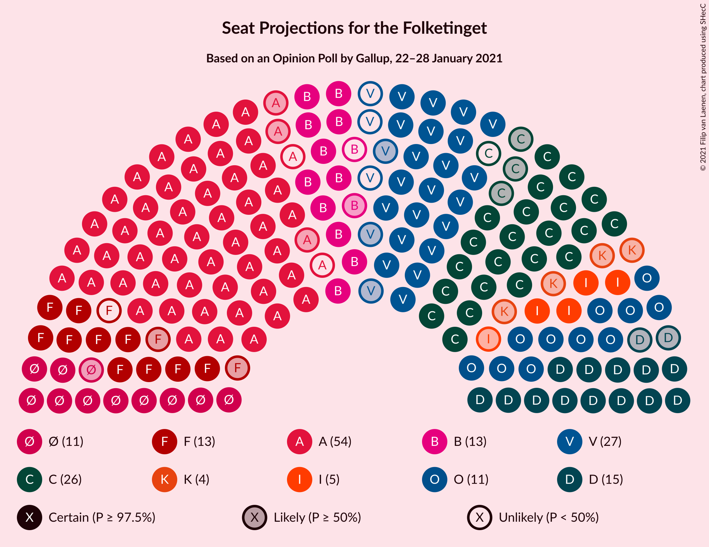
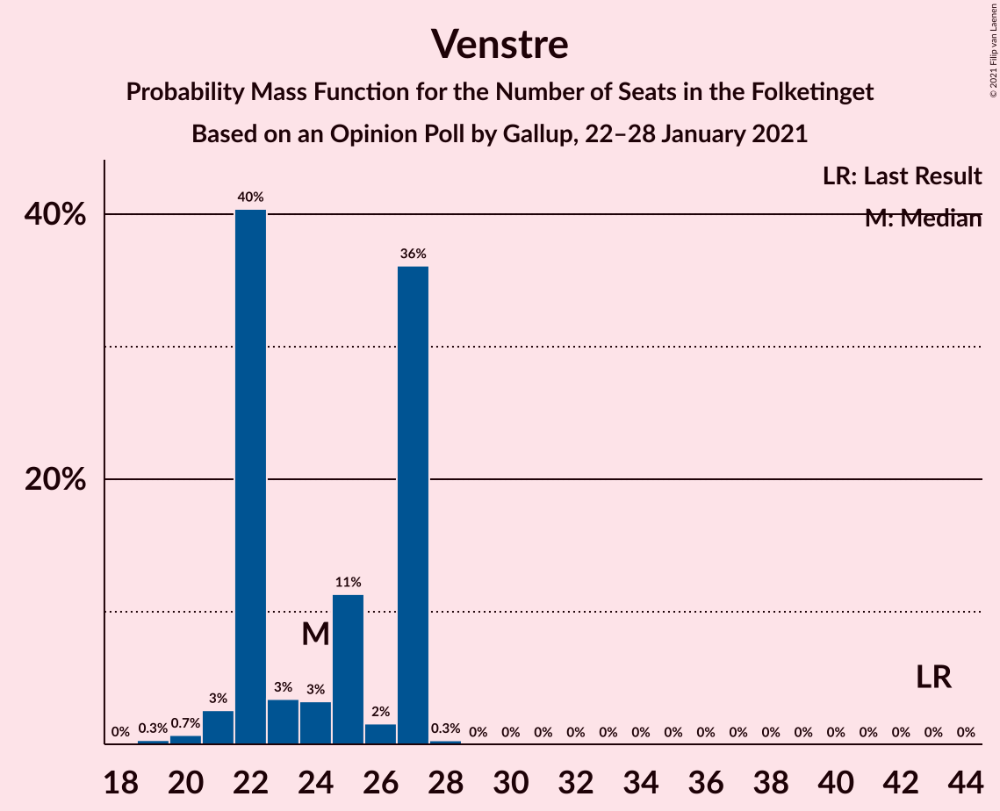
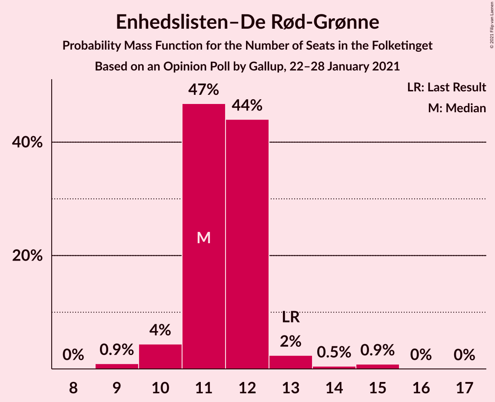
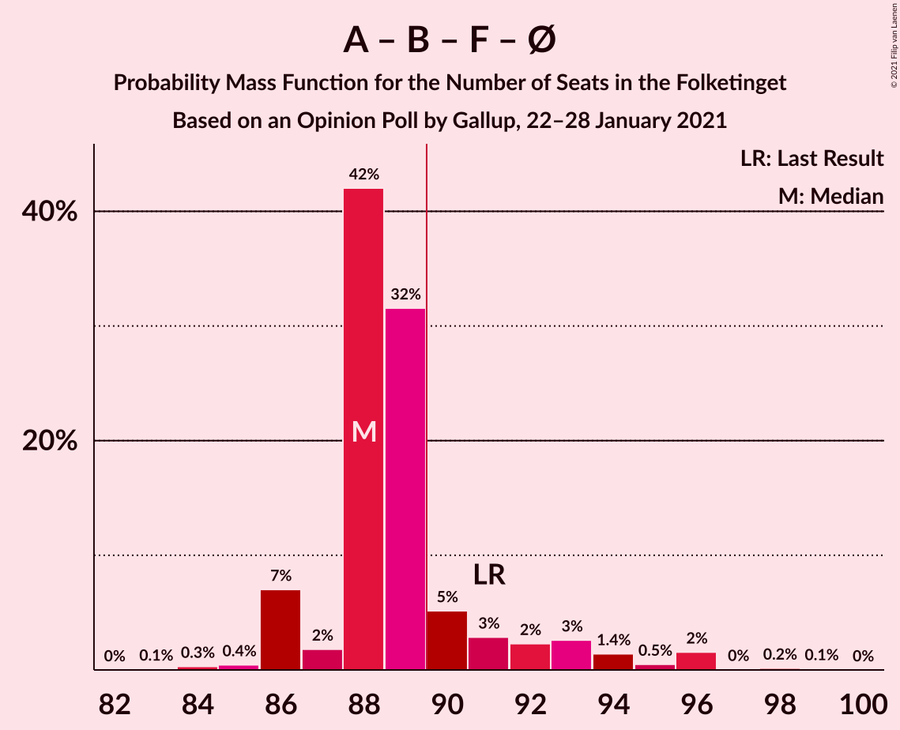
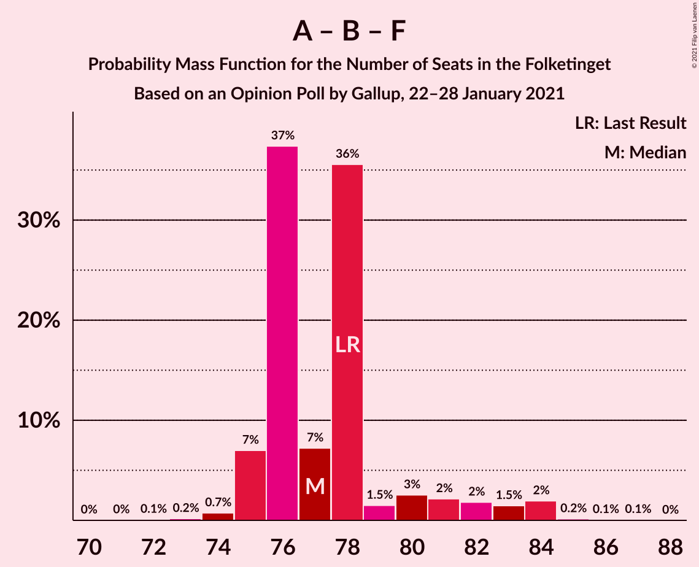
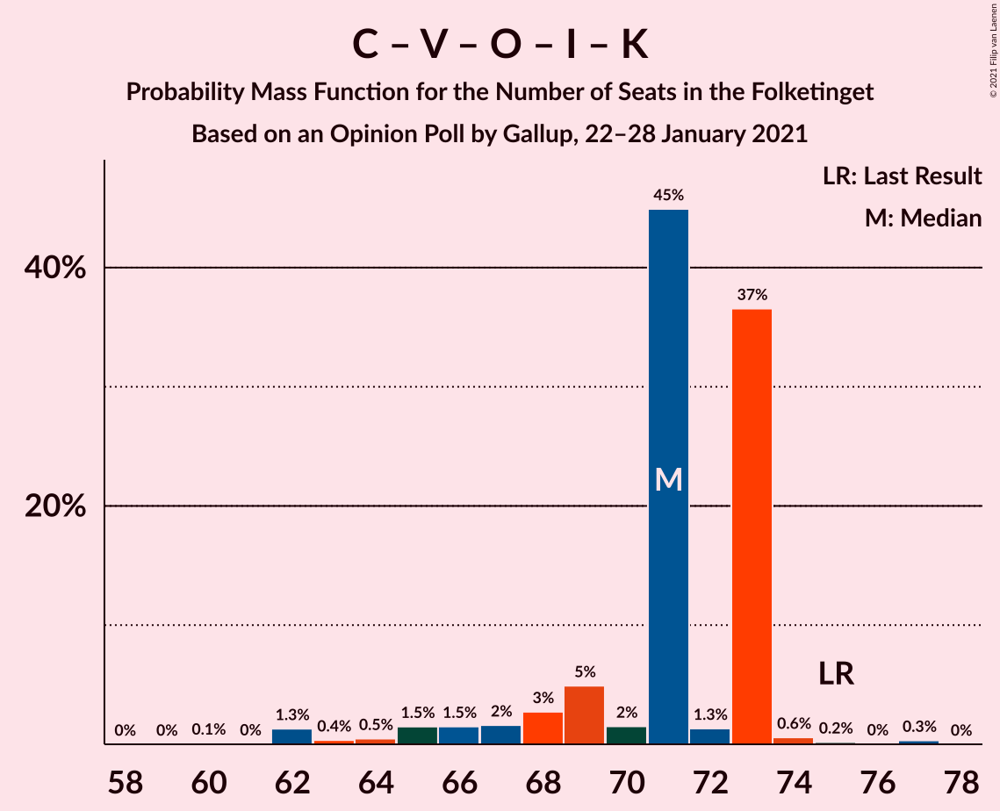

# Opinion Poll by Gallup, 22–28 January 2021

<a href="#voting-intentions">Voting Intentions</a> | <a href="#seats">Seats</a> | <a href="#coalitions">Coalitions</a> | <a href="#technical-information">Technical Information</a>

## Voting Intentions

### Confidence Intervals

| Party | Last Result | Poll Result | 80% Confidence Interval | 90% Confidence Interval | 95% Confidence Interval | 99% Confidence Interval |
|:-----:|:-----------:|:-----------:|:-----------------------:|:-----------------------:|:-----------------------:|:-----------------------:|
| Socialdemokraterne | 25.9% | 29.5% | 28.0–31.1% |27.6–31.5% |27.3–31.9% |26.6–32.6% |
| Det Konservative Folkeparti | 6.6% | 13.6% | 12.5–14.8% |12.2–15.2% |12.0–15.5% |11.5–16.1% |
| Venstre | 23.4% | 12.8% | 11.8–14.0% |11.5–14.3% |11.2–14.6% |10.7–15.2% |
| Nye Borgerlige | 2.4% | 8.4% | 7.6–9.4% |7.3–9.7% |7.1–9.9% |6.7–10.4% |
| Radikale Venstre | 8.6% | 7.4% | 6.6–8.4% |6.4–8.6% |6.2–8.9% |5.8–9.3% |
| Dansk Folkeparti | 8.7% | 7.1% | 6.3–8.0% |6.1–8.3% |5.9–8.5% |5.5–9.0% |
| Socialistisk Folkeparti | 7.7% | 6.9% | 6.1–7.8% |5.9–8.1% |5.7–8.3% |5.3–8.7% |
| Enhedslisten–De Rød-Grønne | 6.9% | 6.5% | 5.7–7.4% |5.5–7.6% |5.3–7.8% |5.0–8.3% |
| Liberal Alliance | 2.3% | 3.0% | 2.5–3.7% |2.4–3.8% |2.3–4.0% |2.0–4.3% |
| Kristendemokraterne | 1.7% | 2.2% | 1.8–2.8% |1.7–2.9% |1.6–3.1% |1.4–3.4% |
| Alternativet | 3.0% | 1.2% | 0.9–1.7% |0.8–1.8% |0.8–1.9% |0.6–2.1% |
| Borgerlisten | 0.8% | 0.6% | 0.4–1.0% |0.4–1.1% |0.3–1.1% |0.2–1.3% |
| Stram Kurs | 1.8% | 0.2% | 0.1–0.5% |0.1–0.5% |0.1–0.6% |0.0–0.7% |

*Note:* The poll result column reflects the actual value used in the calculations. Published results may vary slightly, and in addition be rounded to fewer digits.

## Seats

### Confidence Intervals

| Party | Last Result | Median | 80% Confidence Interval | 90% Confidence Interval | 95% Confidence Interval | 99% Confidence Interval |
|:-----:|:-----------:|:------:|:-----------------------:|:-----------------------:|:-----------------------:|:-----------------------:|
| <a href="#socialdemokraterne">Socialdemokraterne</a> | 48 | 52 | 51–56 |50–56 |49–57 |47–58 |
| <a href="#det-konservative-folkeparti">Det Konservative Folkeparti</a> | 12 | 25 | 24–26 |23–26 |22–27 |20–29 |
| <a href="#venstre">Venstre</a> | 43 | 24 | 22–27 |22–27 |21–27 |20–27 |
| <a href="#nye-borgerlige">Nye Borgerlige</a> | 4 | 15 | 14–17 |14–18 |13–18 |12–19 |
| <a href="#radikale-venstre">Radikale Venstre</a> | 16 | 12 | 11–14 |11–15 |11–16 |11–17 |
| <a href="#dansk-folkeparti">Dansk Folkeparti</a> | 16 | 11 | 11–14 |11–15 |11–15 |10–16 |
| <a href="#socialistisk-folkeparti">Socialistisk Folkeparti</a> | 14 | 12 | 11–13 |10–14 |10–14 |10–15 |
| <a href="#enhedslisten–de-rød-grønne">Enhedslisten–De Rød-Grønne</a> | 13 | 11 | 11–12 |10–12 |10–13 |9–15 |
| <a href="#liberal-alliance">Liberal Alliance</a> | 4 | 5 | 5–6 |5–7 |4–7 |0–7 |
| <a href="#kristendemokraterne">Kristendemokraterne</a> | 0 | 4 | 0–5 |0–5 |0–5 |0–6 |
| <a href="#alternativet">Alternativet</a> | 5 | 0 | 0 |0 |0 |0 |
| <a href="#borgerlisten">Borgerlisten</a> | 0 | 0 | 0 |0 |0 |0 |
| <a href="#stram-kurs">Stram Kurs</a> | 0 | 0 | 0 |0 |0 |0 |

### Socialdemokraterne

*For a full overview of the results for this party, see the [Socialdemokraterne](party-socialdemokraterne.html) page.*

| Number of Seats | Probability | Accumulated | Special Marks |
|:---------------:|:-----------:|:-----------:|:-------------:|
| 46 | 0.1% | 100% |  |
| 47 | 0.4% | 99.9% |  |
| 48 | 0.5% | 99.5% | Last Result |
| 49 | 4% | 99.0% |  |
| 50 | 2% | 95% |  |
| 51 | 8% | 93% |  |
| 52 | 38% | 85% | Median |
| 53 | 1.0% | 47% |  |
| 54 | 32% | 46% |  |
| 55 | 2% | 15% |  |
| 56 | 10% | 13% |  |
| 57 | 0.7% | 3% |  |
| 58 | 2% | 2% |  |
| 59 | 0.4% | 0.4% |  |
| 60 | 0% | 0% |  |

### Det Konservative Folkeparti

*For a full overview of the results for this party, see the [Det Konservative Folkeparti](party-detkonservativefolkeparti.html) page.*

| Number of Seats | Probability | Accumulated | Special Marks |
|:---------------:|:-----------:|:-----------:|:-------------:|
| 12 | 0% | 100% | Last Result |
| 13 | 0% | 100% |  |
| 14 | 0% | 100% |  |
| 15 | 0% | 100% |  |
| 16 | 0% | 100% |  |
| 17 | 0% | 100% |  |
| 18 | 0% | 100% |  |
| 19 | 0% | 100% |  |
| 20 | 0.8% | 100% |  |
| 21 | 2% | 99.2% |  |
| 22 | 0.9% | 98% |  |
| 23 | 2% | 97% |  |
| 24 | 6% | 95% |  |
| 25 | 40% | 88% | Median |
| 26 | 45% | 48% |  |
| 27 | 2% | 3% |  |
| 28 | 0.4% | 1.0% |  |
| 29 | 0.3% | 0.6% |  |
| 30 | 0% | 0.3% |  |
| 31 | 0.3% | 0.3% |  |
| 32 | 0% | 0% |  |

### Venstre

*For a full overview of the results for this party, see the [Venstre](party-venstre.html) page.*

| Number of Seats | Probability | Accumulated | Special Marks |
|:---------------:|:-----------:|:-----------:|:-------------:|
| 19 | 0.3% | 100% |  |
| 20 | 0.7% | 99.6% |  |
| 21 | 3% | 98.9% |  |
| 22 | 40% | 96% |  |
| 23 | 3% | 56% |  |
| 24 | 3% | 53% | Median |
| 25 | 11% | 49% |  |
| 26 | 2% | 38% |  |
| 27 | 36% | 36% |  |
| 28 | 0.3% | 0.3% |  |
| 29 | 0% | 0% |  |
| 30 | 0% | 0% |  |
| 31 | 0% | 0% |  |
| 32 | 0% | 0% |  |
| 33 | 0% | 0% |  |
| 34 | 0% | 0% |  |
| 35 | 0% | 0% |  |
| 36 | 0% | 0% |  |
| 37 | 0% | 0% |  |
| 38 | 0% | 0% |  |
| 39 | 0% | 0% |  |
| 40 | 0% | 0% |  |
| 41 | 0% | 0% |  |
| 42 | 0% | 0% |  |
| 43 | 0% | 0% | Last Result |

### Nye Borgerlige

*For a full overview of the results for this party, see the [Nye Borgerlige](party-nyeborgerlige.html) page.*

| Number of Seats | Probability | Accumulated | Special Marks |
|:---------------:|:-----------:|:-----------:|:-------------:|
| 4 | 0% | 100% | Last Result |
| 5 | 0% | 100% |  |
| 6 | 0% | 100% |  |
| 7 | 0% | 100% |  |
| 8 | 0% | 100% |  |
| 9 | 0% | 100% |  |
| 10 | 0% | 100% |  |
| 11 | 0.1% | 100% |  |
| 12 | 0.9% | 99.9% |  |
| 13 | 2% | 99.0% |  |
| 14 | 38% | 97% |  |
| 15 | 34% | 59% | Median |
| 16 | 13% | 25% |  |
| 17 | 2% | 11% |  |
| 18 | 8% | 9% |  |
| 19 | 0.5% | 0.6% |  |
| 20 | 0% | 0% |  |

### Radikale Venstre

*For a full overview of the results for this party, see the [Radikale Venstre](party-radikalevenstre.html) page.*

| Number of Seats | Probability | Accumulated | Special Marks |
|:---------------:|:-----------:|:-----------:|:-------------:|
| 9 | 0.1% | 100% |  |
| 10 | 0.3% | 99.9% |  |
| 11 | 43% | 99.6% |  |
| 12 | 10% | 57% | Median |
| 13 | 32% | 47% |  |
| 14 | 5% | 14% |  |
| 15 | 6% | 9% |  |
| 16 | 2% | 3% | Last Result |
| 17 | 0.9% | 1.1% |  |
| 18 | 0.2% | 0.2% |  |
| 19 | 0% | 0% |  |

### Dansk Folkeparti

*For a full overview of the results for this party, see the [Dansk Folkeparti](party-danskfolkeparti.html) page.*

| Number of Seats | Probability | Accumulated | Special Marks |
|:---------------:|:-----------:|:-----------:|:-------------:|
| 9 | 0.1% | 100% |  |
| 10 | 0.7% | 99.9% |  |
| 11 | 51% | 99.2% | Median |
| 12 | 2% | 48% |  |
| 13 | 4% | 46% |  |
| 14 | 36% | 42% |  |
| 15 | 4% | 6% |  |
| 16 | 2% | 2% | Last Result |
| 17 | 0% | 0% |  |

### Socialistisk Folkeparti

*For a full overview of the results for this party, see the [Socialistisk Folkeparti](party-socialistiskfolkeparti.html) page.*

| Number of Seats | Probability | Accumulated | Special Marks |
|:---------------:|:-----------:|:-----------:|:-------------:|
| 9 | 0.1% | 100% |  |
| 10 | 8% | 99.9% |  |
| 11 | 35% | 92% |  |
| 12 | 11% | 57% | Median |
| 13 | 38% | 46% |  |
| 14 | 7% | 8% | Last Result |
| 15 | 1.0% | 1.1% |  |
| 16 | 0.1% | 0.1% |  |
| 17 | 0% | 0% |  |

### Enhedslisten–De Rød-Grønne

*For a full overview of the results for this party, see the [Enhedslisten–De Rød-Grønne](party-enhedslisten–derød-grønne.html) page.*

| Number of Seats | Probability | Accumulated | Special Marks |
|:---------------:|:-----------:|:-----------:|:-------------:|
| 9 | 0.9% | 100% |  |
| 10 | 4% | 99.0% |  |
| 11 | 47% | 95% | Median |
| 12 | 44% | 48% |  |
| 13 | 2% | 4% | Last Result |
| 14 | 0.5% | 1.4% |  |
| 15 | 0.9% | 0.9% |  |
| 16 | 0% | 0.1% |  |
| 17 | 0% | 0% |  |

### Liberal Alliance

*For a full overview of the results for this party, see the [Liberal Alliance](party-liberalalliance.html) page.*

| Number of Seats | Probability | Accumulated | Special Marks |
|:---------------:|:-----------:|:-----------:|:-------------:|
| 0 | 1.3% | 100% |  |
| 1 | 0% | 98.7% |  |
| 2 | 0% | 98.7% |  |
| 3 | 0% | 98.7% |  |
| 4 | 3% | 98.7% | Last Result |
| 5 | 70% | 96% | Median |
| 6 | 16% | 26% |  |
| 7 | 9% | 10% |  |
| 8 | 0.2% | 0.2% |  |
| 9 | 0% | 0% |  |

### Kristendemokraterne

*For a full overview of the results for this party, see the [Kristendemokraterne](party-kristendemokraterne.html) page.*

| Number of Seats | Probability | Accumulated | Special Marks |
|:---------------:|:-----------:|:-----------:|:-------------:|
| 0 | 13% | 100% | Last Result |
| 1 | 0% | 87% |  |
| 2 | 0% | 87% |  |
| 3 | 0% | 87% |  |
| 4 | 47% | 87% | Median |
| 5 | 39% | 40% |  |
| 6 | 1.1% | 1.2% |  |
| 7 | 0% | 0% |  |

### Alternativet

*For a full overview of the results for this party, see the [Alternativet](party-alternativet.html) page.*

| Number of Seats | Probability | Accumulated | Special Marks |
|:---------------:|:-----------:|:-----------:|:-------------:|
| 0 | 99.7% | 100% | Median |
| 1 | 0% | 0.3% |  |
| 2 | 0% | 0.3% |  |
| 3 | 0% | 0.3% |  |
| 4 | 0.3% | 0.3% |  |
| 5 | 0% | 0% | Last Result |

### Borgerlisten

*For a full overview of the results for this party, see the [Borgerlisten](party-borgerlisten.html) page.*

| Number of Seats | Probability | Accumulated | Special Marks |
|:---------------:|:-----------:|:-----------:|:-------------:|
| 0 | 100% | 100% | Last Result, Median |

### Stram Kurs

*For a full overview of the results for this party, see the [Stram Kurs](party-stramkurs.html) page.*

| Number of Seats | Probability | Accumulated | Special Marks |
|:---------------:|:-----------:|:-----------:|:-------------:|
| 0 | 100% | 100% | Last Result, Median |

## Coalitions

### Confidence Intervals

| Coalition | Last Result | Median | Majority? | 80% Confidence Interval | 90% Confidence Interval | 95% Confidence Interval | 99% Confidence Interval |
|:---------:|:-----------:|:------:|:---------:|:-----------------------:|:-----------------------:|:-----------------------:|:-----------------------:|
| Socialdemokraterne – Radikale Venstre – Socialistisk Folkeparti – Enhedslisten–De Rød-Grønne – Alternativet | 96 | 88 | 17% | 88–91 | 86–93 | 86–94 | 85–96 |
| Socialdemokraterne – Radikale Venstre – Socialistisk Folkeparti – Enhedslisten–De Rød-Grønne | 91 | 88 | 17% | 88–91 | 86–93 | 86–94 | 85–96 |
| Det Konservative Folkeparti – Venstre – Nye Borgerlige – Dansk Folkeparti – Liberal Alliance – Kristendemokraterne | 79 | 87 | 0.8% | 84–87 | 82–89 | 81–89 | 79–90 |
| Det Konservative Folkeparti – Venstre – Nye Borgerlige – Dansk Folkeparti – Liberal Alliance | 79 | 83 | 0.1% | 81–85 | 79–85 | 79–85 | 77–88 |
| Socialdemokraterne – Radikale Venstre – Socialistisk Folkeparti | 78 | 77 | 0% | 76–80 | 75–82 | 75–83 | 74–84 |
| Socialdemokraterne – Socialistisk Folkeparti – Enhedslisten–De Rød-Grønne – Alternativet | 80 | 77 | 0% | 75–77 | 74–80 | 74–81 | 72–83 |
| Socialdemokraterne – Socialistisk Folkeparti – Enhedslisten–De Rød-Grønne | 75 | 77 | 0% | 75–77 | 74–80 | 74–81 | 72–83 |
| Det Konservative Folkeparti – Venstre – Dansk Folkeparti – Liberal Alliance – Kristendemokraterne | 75 | 71 | 0% | 69–73 | 66–73 | 65–73 | 62–75 |
| Socialdemokraterne – Radikale Venstre | 64 | 64 | 0% | 63–67 | 63–70 | 63–72 | 61–73 |
| Det Konservative Folkeparti – Venstre – Dansk Folkeparti – Liberal Alliance | 75 | 67 | 0% | 66–69 | 64–69 | 62–69 | 61–73 |
| Det Konservative Folkeparti – Venstre – Liberal Alliance | 59 | 55 | 0% | 52–58 | 51–58 | 49–58 | 47–59 |
| Det Konservative Folkeparti – Venstre | 55 | 49 | 0% | 47–53 | 46–53 | 44–53 | 42–53 |
| Venstre | 43 | 24 | 0% | 22–27 | 22–27 | 21–27 | 20–27 |

### Socialdemokraterne – Radikale Venstre – Socialistisk Folkeparti – Enhedslisten–De Rød-Grønne – Alternativet

| Number of Seats | Probability | Accumulated | Special Marks |
|:---------------:|:-----------:|:-----------:|:-------------:|
| 83 | 0.1% | 100% |  |
| 84 | 0.3% | 99.9% |  |
| 85 | 0.4% | 99.6% |  |
| 86 | 7% | 99.2% |  |
| 87 | 2% | 92% | Median |
| 88 | 42% | 90% |  |
| 89 | 32% | 48% |  |
| 90 | 5% | 17% | Majority |
| 91 | 3% | 12% |  |
| 92 | 2% | 9% |  |
| 93 | 3% | 6% |  |
| 94 | 1.5% | 4% |  |
| 95 | 0.5% | 2% |  |
| 96 | 2% | 2% | Last Result |
| 97 | 0% | 0.3% |  |
| 98 | 0.2% | 0.3% |  |
| 99 | 0.1% | 0.1% |  |
| 100 | 0% | 0% |  |

### Socialdemokraterne – Radikale Venstre – Socialistisk Folkeparti – Enhedslisten–De Rød-Grønne

| Number of Seats | Probability | Accumulated | Special Marks |
|:---------------:|:-----------:|:-----------:|:-------------:|
| 83 | 0.1% | 100% |  |
| 84 | 0.3% | 99.9% |  |
| 85 | 0.4% | 99.6% |  |
| 86 | 7% | 99.1% |  |
| 87 | 2% | 92% | Median |
| 88 | 42% | 90% |  |
| 89 | 32% | 48% |  |
| 90 | 5% | 17% | Majority |
| 91 | 3% | 12% | Last Result |
| 92 | 2% | 9% |  |
| 93 | 3% | 6% |  |
| 94 | 1.4% | 4% |  |
| 95 | 0.5% | 2% |  |
| 96 | 2% | 2% |  |
| 97 | 0% | 0.3% |  |
| 98 | 0.2% | 0.3% |  |
| 99 | 0.1% | 0.1% |  |
| 100 | 0% | 0% |  |

### Det Konservative Folkeparti – Venstre – Nye Borgerlige – Dansk Folkeparti – Liberal Alliance – Kristendemokraterne

| Number of Seats | Probability | Accumulated | Special Marks |
|:---------------:|:-----------:|:-----------:|:-------------:|
| 76 | 0.1% | 100% |  |
| 77 | 0.2% | 99.9% |  |
| 78 | 0% | 99.7% |  |
| 79 | 2% | 99.7% | Last Result |
| 80 | 0.5% | 98% |  |
| 81 | 1.5% | 98% |  |
| 82 | 3% | 96% |  |
| 83 | 2% | 94% |  |
| 84 | 3% | 91% | Median |
| 85 | 5% | 88% |  |
| 86 | 32% | 83% |  |
| 87 | 42% | 52% |  |
| 88 | 2% | 10% |  |
| 89 | 7% | 8% |  |
| 90 | 0.4% | 0.8% | Majority |
| 91 | 0.3% | 0.4% |  |
| 92 | 0.1% | 0.1% |  |
| 93 | 0% | 0% |  |

### Det Konservative Folkeparti – Venstre – Nye Borgerlige – Dansk Folkeparti – Liberal Alliance

| Number of Seats | Probability | Accumulated | Special Marks |
|:---------------:|:-----------:|:-----------:|:-------------:|
| 75 | 0.2% | 100% |  |
| 76 | 0.2% | 99.7% |  |
| 77 | 0.6% | 99.6% |  |
| 78 | 0.6% | 99.0% |  |
| 79 | 4% | 98% | Last Result |
| 80 | 2% | 95% | Median |
| 81 | 32% | 93% |  |
| 82 | 10% | 60% |  |
| 83 | 36% | 50% |  |
| 84 | 1.4% | 15% |  |
| 85 | 11% | 13% |  |
| 86 | 0.6% | 2% |  |
| 87 | 0.3% | 2% |  |
| 88 | 1.0% | 1.2% |  |
| 89 | 0.1% | 0.2% |  |
| 90 | 0% | 0.1% | Majority |
| 91 | 0% | 0% |  |

### Socialdemokraterne – Radikale Venstre – Socialistisk Folkeparti

| Number of Seats | Probability | Accumulated | Special Marks |
|:---------------:|:-----------:|:-----------:|:-------------:|
| 71 | 0% | 100% |  |
| 72 | 0.1% | 99.9% |  |
| 73 | 0.2% | 99.8% |  |
| 74 | 0.7% | 99.6% |  |
| 75 | 7% | 98.9% |  |
| 76 | 37% | 92% | Median |
| 77 | 7% | 55% |  |
| 78 | 36% | 47% | Last Result |
| 79 | 1.5% | 12% |  |
| 80 | 3% | 10% |  |
| 81 | 2% | 8% |  |
| 82 | 2% | 6% |  |
| 83 | 1.5% | 4% |  |
| 84 | 2% | 2% |  |
| 85 | 0.2% | 0.3% |  |
| 86 | 0.1% | 0.1% |  |
| 87 | 0.1% | 0.1% |  |
| 88 | 0% | 0% |  |

### Socialdemokraterne – Socialistisk Folkeparti – Enhedslisten–De Rød-Grønne – Alternativet

| Number of Seats | Probability | Accumulated | Special Marks |
|:---------------:|:-----------:|:-----------:|:-------------:|
| 70 | 0% | 100% |  |
| 71 | 0.4% | 99.9% |  |
| 72 | 0.5% | 99.6% |  |
| 73 | 0.2% | 99.1% |  |
| 74 | 8% | 98.9% |  |
| 75 | 6% | 91% | Median |
| 76 | 32% | 85% |  |
| 77 | 45% | 53% |  |
| 78 | 2% | 8% |  |
| 79 | 0.8% | 6% |  |
| 80 | 2% | 6% | Last Result |
| 81 | 2% | 3% |  |
| 82 | 0.6% | 1.5% |  |
| 83 | 0.8% | 0.9% |  |
| 84 | 0% | 0.1% |  |
| 85 | 0% | 0.1% |  |
| 86 | 0% | 0% |  |

### Socialdemokraterne – Socialistisk Folkeparti – Enhedslisten–De Rød-Grønne

| Number of Seats | Probability | Accumulated | Special Marks |
|:---------------:|:-----------:|:-----------:|:-------------:|
| 70 | 0% | 100% |  |
| 71 | 0.4% | 99.9% |  |
| 72 | 0.5% | 99.6% |  |
| 73 | 0.3% | 99.1% |  |
| 74 | 8% | 98.8% |  |
| 75 | 6% | 91% | Last Result, Median |
| 76 | 32% | 85% |  |
| 77 | 45% | 53% |  |
| 78 | 2% | 8% |  |
| 79 | 0.9% | 6% |  |
| 80 | 2% | 5% |  |
| 81 | 2% | 3% |  |
| 82 | 0.6% | 1.4% |  |
| 83 | 0.7% | 0.8% |  |
| 84 | 0% | 0.1% |  |
| 85 | 0% | 0.1% |  |
| 86 | 0% | 0% |  |

### Det Konservative Folkeparti – Venstre – Dansk Folkeparti – Liberal Alliance – Kristendemokraterne

| Number of Seats | Probability | Accumulated | Special Marks |
|:---------------:|:-----------:|:-----------:|:-------------:|
| 60 | 0.1% | 100% |  |
| 61 | 0% | 99.9% |  |
| 62 | 1.3% | 99.9% |  |
| 63 | 0.4% | 98.6% |  |
| 64 | 0.5% | 98% |  |
| 65 | 1.5% | 98% |  |
| 66 | 1.5% | 96% |  |
| 67 | 2% | 95% |  |
| 68 | 3% | 93% |  |
| 69 | 5% | 90% | Median |
| 70 | 2% | 85% |  |
| 71 | 45% | 84% |  |
| 72 | 1.3% | 39% |  |
| 73 | 37% | 38% |  |
| 74 | 0.6% | 1.2% |  |
| 75 | 0.2% | 0.6% | Last Result |
| 76 | 0% | 0.4% |  |
| 77 | 0.3% | 0.4% |  |
| 78 | 0% | 0% |  |

### Socialdemokraterne – Radikale Venstre

| Number of Seats | Probability | Accumulated | Special Marks |
|:---------------:|:-----------:|:-----------:|:-------------:|
| 58 | 0.1% | 100% |  |
| 59 | 0% | 99.9% |  |
| 60 | 0.1% | 99.9% |  |
| 61 | 0.3% | 99.8% |  |
| 62 | 1.0% | 99.5% |  |
| 63 | 43% | 98.5% |  |
| 64 | 6% | 56% | Last Result, Median |
| 65 | 1.0% | 49% |  |
| 66 | 2% | 48% |  |
| 67 | 37% | 46% |  |
| 68 | 3% | 10% |  |
| 69 | 0.7% | 7% |  |
| 70 | 2% | 6% |  |
| 71 | 1.3% | 4% |  |
| 72 | 1.2% | 3% |  |
| 73 | 1.4% | 2% |  |
| 74 | 0.3% | 0.4% |  |
| 75 | 0.1% | 0.1% |  |
| 76 | 0% | 0% |  |

### Det Konservative Folkeparti – Venstre – Dansk Folkeparti – Liberal Alliance

| Number of Seats | Probability | Accumulated | Special Marks |
|:---------------:|:-----------:|:-----------:|:-------------:|
| 60 | 0.2% | 100% |  |
| 61 | 2% | 99.8% |  |
| 62 | 2% | 98% |  |
| 63 | 0.8% | 97% |  |
| 64 | 1.2% | 96% |  |
| 65 | 2% | 95% | Median |
| 66 | 38% | 93% |  |
| 67 | 11% | 55% |  |
| 68 | 3% | 45% |  |
| 69 | 40% | 42% |  |
| 70 | 0.2% | 2% |  |
| 71 | 0.4% | 2% |  |
| 72 | 0.6% | 2% |  |
| 73 | 1.0% | 1.1% |  |
| 74 | 0.1% | 0.2% |  |
| 75 | 0% | 0.1% | Last Result |
| 76 | 0% | 0% |  |

### Det Konservative Folkeparti – Venstre – Liberal Alliance

| Number of Seats | Probability | Accumulated | Special Marks |
|:---------------:|:-----------:|:-----------:|:-------------:|
| 47 | 1.4% | 100% |  |
| 48 | 0% | 98.6% |  |
| 49 | 1.0% | 98.5% |  |
| 50 | 2% | 97% |  |
| 51 | 2% | 96% |  |
| 52 | 30% | 94% |  |
| 53 | 3% | 64% |  |
| 54 | 3% | 60% | Median |
| 55 | 12% | 57% |  |
| 56 | 8% | 45% |  |
| 57 | 1.5% | 37% |  |
| 58 | 35% | 36% |  |
| 59 | 0.5% | 0.5% | Last Result |
| 60 | 0% | 0.1% |  |
| 61 | 0% | 0% |  |

### Det Konservative Folkeparti – Venstre

| Number of Seats | Probability | Accumulated | Special Marks |
|:---------------:|:-----------:|:-----------:|:-------------:|
| 42 | 1.4% | 100% |  |
| 43 | 1.0% | 98.6% |  |
| 44 | 0.6% | 98% |  |
| 45 | 1.1% | 97% |  |
| 46 | 2% | 96% |  |
| 47 | 33% | 94% |  |
| 48 | 8% | 61% |  |
| 49 | 5% | 53% | Median |
| 50 | 10% | 48% |  |
| 51 | 0.5% | 38% |  |
| 52 | 1.0% | 37% |  |
| 53 | 36% | 36% |  |
| 54 | 0% | 0.3% |  |
| 55 | 0.2% | 0.3% | Last Result |
| 56 | 0% | 0% |  |

### Venstre

| Number of Seats | Probability | Accumulated | Special Marks |
|:---------------:|:-----------:|:-----------:|:-------------:|
| 19 | 0.3% | 100% |  |
| 20 | 0.7% | 99.6% |  |
| 21 | 3% | 98.9% |  |
| 22 | 40% | 96% |  |
| 23 | 3% | 56% |  |
| 24 | 3% | 53% | Median |
| 25 | 11% | 49% |  |
| 26 | 2% | 38% |  |
| 27 | 36% | 36% |  |
| 28 | 0.3% | 0.3% |  |
| 29 | 0% | 0% |  |
| 30 | 0% | 0% |  |
| 31 | 0% | 0% |  |
| 32 | 0% | 0% |  |
| 33 | 0% | 0% |  |
| 34 | 0% | 0% |  |
| 35 | 0% | 0% |  |
| 36 | 0% | 0% |  |
| 37 | 0% | 0% |  |
| 38 | 0% | 0% |  |
| 39 | 0% | 0% |  |
| 40 | 0% | 0% |  |
| 41 | 0% | 0% |  |
| 42 | 0% | 0% |  |
| 43 | 0% | 0% | Last Result |

## Technical Information

### Opinion Poll

+ **Polling firm:** Gallup
+ **Commissioner(s):** —
+ **Fieldwork period:** 22–28 January 2021

### Calculations

+ **Sample size:** 1497
+ **Simulations done:** 1,048,576
+ **Error estimate:** 2.45%

