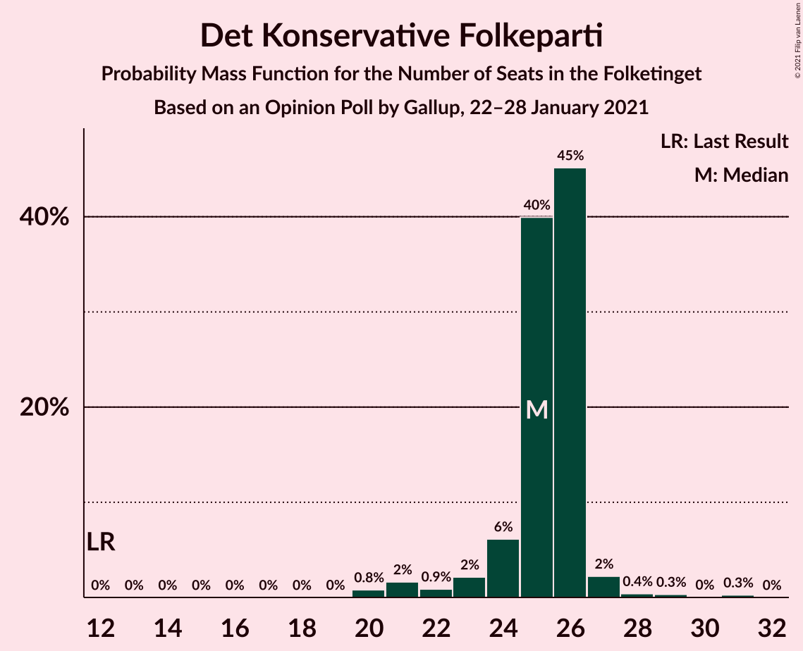
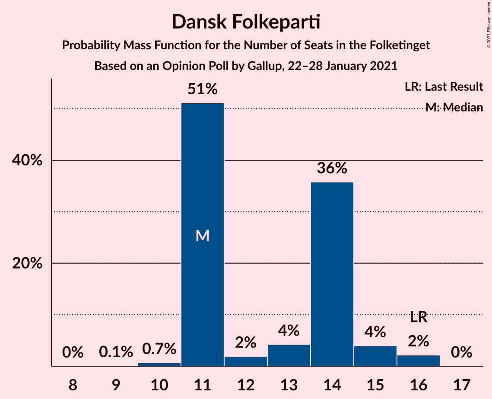
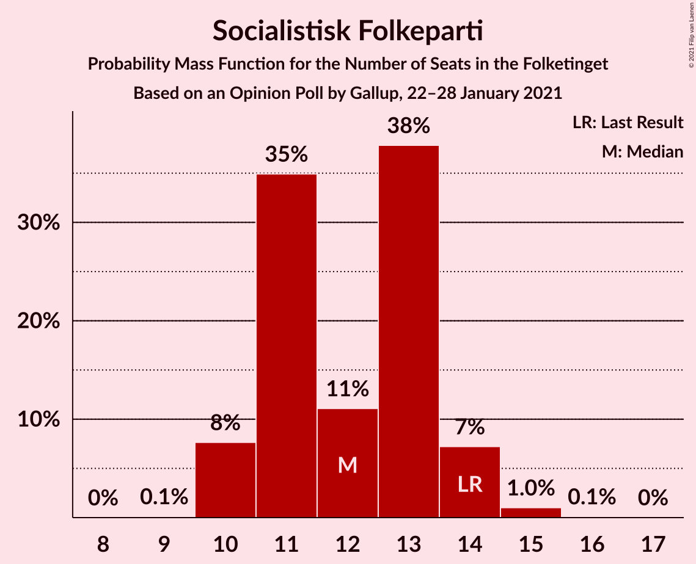
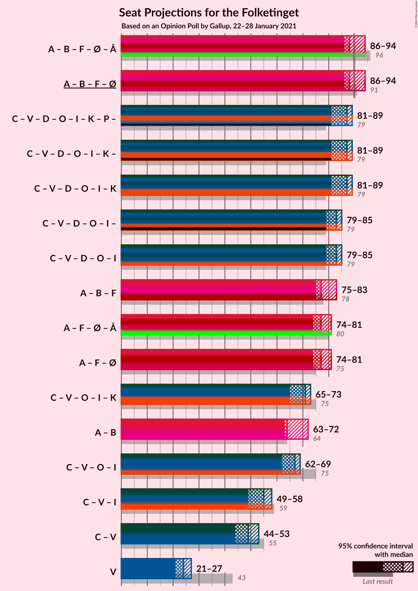
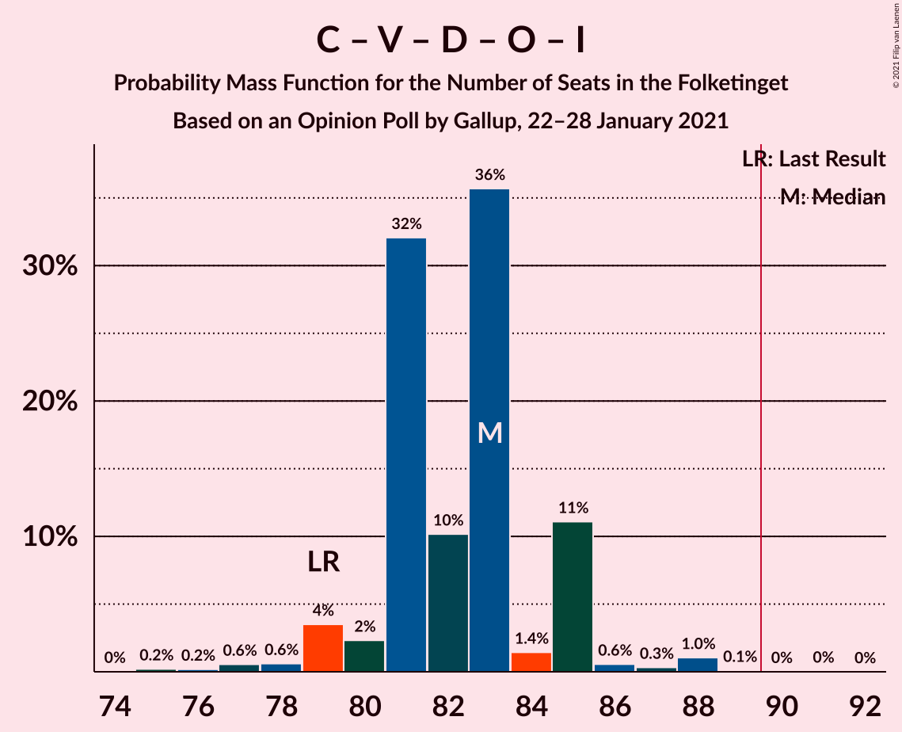
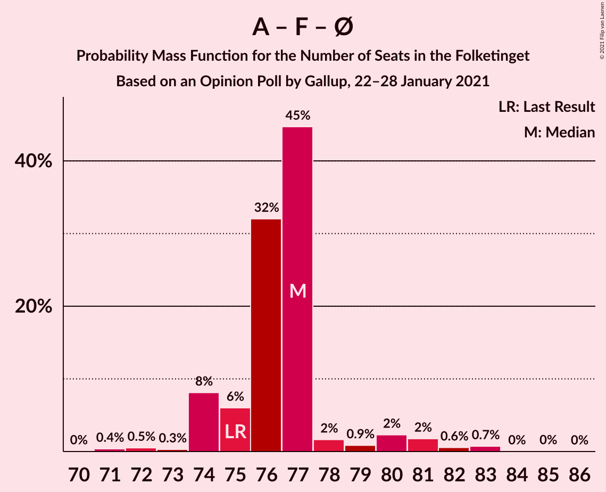

# Opinion Poll by Gallup, 22–28 January 2021

<a href="#voting-intentions">Voting Intentions</a> | <a href="#seats">Seats</a> | <a href="#coalitions">Coalitions</a> | <a href="#technical-information">Technical Information</a>

## Voting Intentions

### Confidence Intervals

| Party | Last Result | Poll Result | 80% Confidence Interval | 90% Confidence Interval | 95% Confidence Interval | 99% Confidence Interval |
|:-----:|:-----------:|:-----------:|:-----------------------:|:-----------------------:|:-----------------------:|:-----------------------:|
| Socialdemokraterne | 25.9% | 29.5% | 28.0–31.1% |27.6–31.5% |27.3–31.9% |26.6–32.6% |
| Det Konservative Folkeparti | 6.6% | 13.6% | 12.5–14.8% |12.2–15.2% |12.0–15.5% |11.5–16.1% |
| Venstre | 23.4% | 12.8% | 11.8–14.0% |11.5–14.3% |11.2–14.6% |10.7–15.2% |
| Nye Borgerlige | 2.4% | 8.4% | 7.6–9.4% |7.3–9.7% |7.1–9.9% |6.7–10.4% |
| Radikale Venstre | 8.6% | 7.4% | 6.6–8.4% |6.4–8.6% |6.2–8.9% |5.8–9.3% |
| Dansk Folkeparti | 8.7% | 7.1% | 6.3–8.0% |6.1–8.3% |5.9–8.5% |5.5–9.0% |
| Socialistisk Folkeparti | 7.7% | 6.9% | 6.1–7.8% |5.9–8.1% |5.7–8.3% |5.3–8.7% |
| Enhedslisten–De Rød-Grønne | 6.9% | 6.5% | 5.7–7.4% |5.5–7.6% |5.3–7.8% |5.0–8.3% |
| Liberal Alliance | 2.3% | 3.0% | 2.5–3.7% |2.4–3.8% |2.3–4.0% |2.0–4.3% |
| Kristendemokraterne | 1.7% | 2.2% | 1.8–2.8% |1.7–2.9% |1.6–3.1% |1.4–3.4% |
| Alternativet | 3.0% | 1.2% | 0.9–1.7% |0.8–1.8% |0.8–1.9% |0.6–2.1% |
| Borgerlisten | 0.8% | 0.6% | 0.4–1.0% |0.4–1.1% |0.3–1.1% |0.2–1.3% |
| Stram Kurs | 1.8% | 0.2% | 0.1–0.5% |0.1–0.5% |0.1–0.6% |0.0–0.7% |

*Note:* The poll result column reflects the actual value used in the calculations. Published results may vary slightly, and in addition be rounded to fewer digits.

## Seats

### Confidence Intervals

| Party | Last Result | Median | 80% Confidence Interval | 90% Confidence Interval | 95% Confidence Interval | 99% Confidence Interval |
|:-----:|:-----------:|:------:|:-----------------------:|:-----------------------:|:-----------------------:|:-----------------------:|
| <a href="#socialdemokraterne">Socialdemokraterne</a> | 48 | 52 | 52–56 |52–56 |52–56 |51–59 |
| <a href="#det-konservative-folkeparti">Det Konservative Folkeparti</a> | 12 | 26 | 26 |26 |25–26 |22–27 |
| <a href="#venstre">Venstre</a> | 43 | 27 | 22–27 |22–27 |22–27 |21–27 |
| <a href="#nye-borgerlige">Nye Borgerlige</a> | 4 | 14 | 14–16 |14–16 |14–16 |13–17 |
| <a href="#radikale-venstre">Radikale Venstre</a> | 16 | 11 | 11 |11 |11–13 |11–16 |
| <a href="#dansk-folkeparti">Dansk Folkeparti</a> | 16 | 11 | 11 |11 |11–12 |11–15 |
| <a href="#socialistisk-folkeparti">Socialistisk Folkeparti</a> | 14 | 13 | 10–13 |10–13 |10–13 |10–14 |
| <a href="#enhedslisten–de-rød-grønne">Enhedslisten–De Rød-Grønne</a> | 13 | 12 | 11–12 |11–12 |11–12 |9–13 |
| <a href="#liberal-alliance">Liberal Alliance</a> | 4 | 5 | 5–7 |5–7 |5–7 |5–7 |
| <a href="#kristendemokraterne">Kristendemokraterne</a> | 0 | 4 | 4–5 |4–5 |4–5 |0–6 |
| <a href="#alternativet">Alternativet</a> | 5 | 0 | 0 |0 |0 |0 |
| <a href="#borgerlisten">Borgerlisten</a> | 0 | 0 | 0 |0 |0 |0 |
| <a href="#stram-kurs">Stram Kurs</a> | 0 | 0 | 0 |0 |0 |0 |

### Socialdemokraterne

*For a full overview of the results for this party, see the [Socialdemokraterne](party-socialdemokraterne.html) page.*

| Number of Seats | Probability | Accumulated | Special Marks |
|:---------------:|:-----------:|:-----------:|:-------------:|
| 48 | 0.3% | 100% | Last Result |
| 49 | 0% | 99.7% |  |
| 50 | 0.1% | 99.7% |  |
| 51 | 1.1% | 99.6% |  |
| 52 | 81% | 98.5% | Median |
| 53 | 0% | 18% |  |
| 54 | 0% | 18% |  |
| 55 | 2% | 18% |  |
| 56 | 15% | 16% |  |
| 57 | 0% | 0.7% |  |
| 58 | 0% | 0.7% |  |
| 59 | 0.7% | 0.7% |  |
| 60 | 0% | 0% |  |

### Det Konservative Folkeparti

*For a full overview of the results for this party, see the [Det Konservative Folkeparti](party-detkonservativefolkeparti.html) page.*

| Number of Seats | Probability | Accumulated | Special Marks |
|:---------------:|:-----------:|:-----------:|:-------------:|
| 12 | 0% | 100% | Last Result |
| 13 | 0% | 100% |  |
| 14 | 0% | 100% |  |
| 15 | 0% | 100% |  |
| 16 | 0% | 100% |  |
| 17 | 0% | 100% |  |
| 18 | 0% | 100% |  |
| 19 | 0% | 100% |  |
| 20 | 0% | 100% |  |
| 21 | 0% | 100% |  |
| 22 | 0.5% | 100% |  |
| 23 | 0.9% | 99.5% |  |
| 24 | 0.1% | 98.5% |  |
| 25 | 1.3% | 98% |  |
| 26 | 96% | 97% | Median |
| 27 | 1.1% | 1.3% |  |
| 28 | 0.2% | 0.2% |  |
| 29 | 0% | 0% |  |

### Venstre

*For a full overview of the results for this party, see the [Venstre](party-venstre.html) page.*

| Number of Seats | Probability | Accumulated | Special Marks |
|:---------------:|:-----------:|:-----------:|:-------------:|
| 20 | 0.2% | 100% |  |
| 21 | 0.3% | 99.8% |  |
| 22 | 17% | 99.5% |  |
| 23 | 2% | 83% |  |
| 24 | 0.5% | 81% |  |
| 25 | 0.3% | 81% |  |
| 26 | 0.1% | 81% |  |
| 27 | 80% | 80% | Median |
| 28 | 0% | 0% |  |
| 29 | 0% | 0% |  |
| 30 | 0% | 0% |  |
| 31 | 0% | 0% |  |
| 32 | 0% | 0% |  |
| 33 | 0% | 0% |  |
| 34 | 0% | 0% |  |
| 35 | 0% | 0% |  |
| 36 | 0% | 0% |  |
| 37 | 0% | 0% |  |
| 38 | 0% | 0% |  |
| 39 | 0% | 0% |  |
| 40 | 0% | 0% |  |
| 41 | 0% | 0% |  |
| 42 | 0% | 0% |  |
| 43 | 0% | 0% | Last Result |

### Nye Borgerlige

*For a full overview of the results for this party, see the [Nye Borgerlige](party-nyeborgerlige.html) page.*

| Number of Seats | Probability | Accumulated | Special Marks |
|:---------------:|:-----------:|:-----------:|:-------------:|
| 4 | 0% | 100% | Last Result |
| 5 | 0% | 100% |  |
| 6 | 0% | 100% |  |
| 7 | 0% | 100% |  |
| 8 | 0% | 100% |  |
| 9 | 0% | 100% |  |
| 10 | 0% | 100% |  |
| 11 | 0% | 100% |  |
| 12 | 0.1% | 100% |  |
| 13 | 1.1% | 99.9% |  |
| 14 | 81% | 98.7% | Median |
| 15 | 2% | 18% |  |
| 16 | 15% | 16% |  |
| 17 | 0.7% | 1.2% |  |
| 18 | 0.5% | 0.5% |  |
| 19 | 0% | 0% |  |

### Radikale Venstre

*For a full overview of the results for this party, see the [Radikale Venstre](party-radikalevenstre.html) page.*

| Number of Seats | Probability | Accumulated | Special Marks |
|:---------------:|:-----------:|:-----------:|:-------------:|
| 11 | 96% | 100% | Median |
| 12 | 1.0% | 4% |  |
| 13 | 1.3% | 3% |  |
| 14 | 1.2% | 2% |  |
| 15 | 0% | 0.6% |  |
| 16 | 0.5% | 0.5% | Last Result |
| 17 | 0% | 0% |  |

### Dansk Folkeparti

*For a full overview of the results for this party, see the [Dansk Folkeparti](party-danskfolkeparti.html) page.*

| Number of Seats | Probability | Accumulated | Special Marks |
|:---------------:|:-----------:|:-----------:|:-------------:|
| 10 | 0.1% | 100% |  |
| 11 | 97% | 99.9% | Median |
| 12 | 1.1% | 3% |  |
| 13 | 0% | 2% |  |
| 14 | 0.1% | 2% |  |
| 15 | 1.3% | 2% |  |
| 16 | 0.2% | 0.2% | Last Result |
| 17 | 0% | 0% |  |

### Socialistisk Folkeparti

*For a full overview of the results for this party, see the [Socialistisk Folkeparti](party-socialistiskfolkeparti.html) page.*

| Number of Seats | Probability | Accumulated | Special Marks |
|:---------------:|:-----------:|:-----------:|:-------------:|
| 10 | 15% | 100% |  |
| 11 | 0.5% | 85% |  |
| 12 | 2% | 84% |  |
| 13 | 81% | 83% | Median |
| 14 | 1.5% | 2% | Last Result |
| 15 | 0.3% | 0.4% |  |
| 16 | 0.1% | 0.1% |  |
| 17 | 0% | 0% |  |

### Enhedslisten–De Rød-Grønne

*For a full overview of the results for this party, see the [Enhedslisten–De Rød-Grønne](party-enhedslisten–derød-grønne.html) page.*

| Number of Seats | Probability | Accumulated | Special Marks |
|:---------------:|:-----------:|:-----------:|:-------------:|
| 9 | 1.1% | 100% |  |
| 10 | 0.4% | 98.9% |  |
| 11 | 16% | 98.5% |  |
| 12 | 82% | 83% | Median |
| 13 | 0.5% | 1.0% | Last Result |
| 14 | 0.5% | 0.5% |  |
| 15 | 0% | 0% |  |

### Liberal Alliance

*For a full overview of the results for this party, see the [Liberal Alliance](party-liberalalliance.html) page.*

| Number of Seats | Probability | Accumulated | Special Marks |
|:---------------:|:-----------:|:-----------:|:-------------:|
| 4 | 0.3% | 100% | Last Result |
| 5 | 82% | 99.7% | Median |
| 6 | 1.5% | 18% |  |
| 7 | 16% | 16% |  |
| 8 | 0.1% | 0.1% |  |
| 9 | 0% | 0% |  |

### Kristendemokraterne

*For a full overview of the results for this party, see the [Kristendemokraterne](party-kristendemokraterne.html) page.*

| Number of Seats | Probability | Accumulated | Special Marks |
|:---------------:|:-----------:|:-----------:|:-------------:|
| 0 | 2% | 100% | Last Result |
| 1 | 0% | 98% |  |
| 2 | 0% | 98% |  |
| 3 | 0% | 98% |  |
| 4 | 81% | 98% | Median |
| 5 | 15% | 17% |  |
| 6 | 1.4% | 1.4% |  |
| 7 | 0% | 0% |  |

### Alternativet

*For a full overview of the results for this party, see the [Alternativet](party-alternativet.html) page.*

| Number of Seats | Probability | Accumulated | Special Marks |
|:---------------:|:-----------:|:-----------:|:-------------:|
| 0 | 100% | 100% | Median |
| 1 | 0% | 0% |  |
| 2 | 0% | 0% |  |
| 3 | 0% | 0% |  |
| 4 | 0% | 0% |  |
| 5 | 0% | 0% | Last Result |

### Borgerlisten

*For a full overview of the results for this party, see the [Borgerlisten](party-borgerlisten.html) page.*

| Number of Seats | Probability | Accumulated | Special Marks |
|:---------------:|:-----------:|:-----------:|:-------------:|
| 0 | 100% | 100% | Last Result, Median |

### Stram Kurs

*For a full overview of the results for this party, see the [Stram Kurs](party-stramkurs.html) page.*

| Number of Seats | Probability | Accumulated | Special Marks |
|:---------------:|:-----------:|:-----------:|:-------------:|
| 0 | 100% | 100% | Last Result, Median |

## Coalitions

### Confidence Intervals

| Coalition | Last Result | Median | Majority? | 80% Confidence Interval | 90% Confidence Interval | 95% Confidence Interval | 99% Confidence Interval |
|:---------:|:-----------:|:------:|:---------:|:-----------------------:|:-----------------------:|:-----------------------:|:-----------------------:|
| Socialdemokraterne – Radikale Venstre – Socialistisk Folkeparti – Enhedslisten–De Rød-Grønne – Alternativet | 96 | 88 | 3% | 88 | 88 | 88–93 | 87–94 |
| Socialdemokraterne – Radikale Venstre – Socialistisk Folkeparti – Enhedslisten–De Rød-Grønne | 91 | 88 | 3% | 88 | 88 | 88–93 | 87–94 |
| Det Konservative Folkeparti – Venstre – Nye Borgerlige – Dansk Folkeparti – Liberal Alliance – Kristendemokraterne | 79 | 87 | 0% | 87 | 87 | 82–87 | 81–88 |
| Det Konservative Folkeparti – Venstre – Nye Borgerlige – Dansk Folkeparti – Liberal Alliance | 79 | 83 | 0% | 82–83 | 82–83 | 82–83 | 77–83 |
| Socialdemokraterne – Radikale Venstre – Socialistisk Folkeparti | 78 | 76 | 0% | 76–77 | 76–77 | 76–81 | 76–82 |
| Socialdemokraterne – Socialistisk Folkeparti – Enhedslisten–De Rød-Grønne – Alternativet | 80 | 77 | 0% | 77 | 77 | 77–79 | 74–82 |
| Socialdemokraterne – Socialistisk Folkeparti – Enhedslisten–De Rød-Grønne | 75 | 77 | 0% | 77 | 77 | 77–79 | 74–82 |
| Det Konservative Folkeparti – Venstre – Dansk Folkeparti – Liberal Alliance – Kristendemokraterne | 75 | 73 | 0% | 71–73 | 71–73 | 69–73 | 64–73 |
| Det Konservative Folkeparti – Venstre – Dansk Folkeparti – Liberal Alliance | 75 | 69 | 0% | 66–69 | 66–69 | 66–69 | 62–69 |
| Socialdemokraterne – Radikale Venstre | 64 | 63 | 0% | 63–67 | 63–67 | 63–67 | 63–71 |
| Det Konservative Folkeparti – Venstre – Liberal Alliance | 59 | 58 | 0% | 55–58 | 55–58 | 54–58 | 49–58 |
| Det Konservative Folkeparti – Venstre | 55 | 53 | 0% | 48–53 | 48–53 | 47–53 | 44–53 |
| Venstre | 43 | 27 | 0% | 22–27 | 22–27 | 22–27 | 21–27 |

### Socialdemokraterne – Radikale Venstre – Socialistisk Folkeparti – Enhedslisten–De Rød-Grønne – Alternativet

| Number of Seats | Probability | Accumulated | Special Marks |
|:---------------:|:-----------:|:-----------:|:-------------:|
| 86 | 0.2% | 100% |  |
| 87 | 1.1% | 99.8% |  |
| 88 | 96% | 98.7% | Median |
| 89 | 0% | 3% |  |
| 90 | 0% | 3% | Majority |
| 91 | 0% | 3% |  |
| 92 | 0.4% | 3% |  |
| 93 | 1.3% | 3% |  |
| 94 | 1.1% | 1.3% |  |
| 95 | 0.1% | 0.1% |  |
| 96 | 0% | 0% | Last Result |

### Socialdemokraterne – Radikale Venstre – Socialistisk Folkeparti – Enhedslisten–De Rød-Grønne

| Number of Seats | Probability | Accumulated | Special Marks |
|:---------------:|:-----------:|:-----------:|:-------------:|
| 85 | 0% | 100% |  |
| 86 | 0.2% | 99.9% |  |
| 87 | 1.1% | 99.7% |  |
| 88 | 96% | 98.6% | Median |
| 89 | 0% | 3% |  |
| 90 | 0% | 3% | Majority |
| 91 | 0% | 3% | Last Result |
| 92 | 0.4% | 3% |  |
| 93 | 1.3% | 3% |  |
| 94 | 1.1% | 1.3% |  |
| 95 | 0.1% | 0.1% |  |
| 96 | 0% | 0% |  |

### Det Konservative Folkeparti – Venstre – Nye Borgerlige – Dansk Folkeparti – Liberal Alliance – Kristendemokraterne

| Number of Seats | Probability | Accumulated | Special Marks |
|:---------------:|:-----------:|:-----------:|:-------------:|
| 79 | 0% | 100% | Last Result |
| 80 | 0.1% | 100% |  |
| 81 | 1.1% | 99.9% |  |
| 82 | 1.3% | 98.7% |  |
| 83 | 0.4% | 97% |  |
| 84 | 0% | 97% |  |
| 85 | 0% | 97% |  |
| 86 | 0% | 97% |  |
| 87 | 96% | 97% | Median |
| 88 | 1.1% | 1.3% |  |
| 89 | 0.2% | 0.2% |  |
| 90 | 0% | 0% | Majority |

### Det Konservative Folkeparti – Venstre – Nye Borgerlige – Dansk Folkeparti – Liberal Alliance

| Number of Seats | Probability | Accumulated | Special Marks |
|:---------------:|:-----------:|:-----------:|:-------------:|
| 75 | 0.4% | 100% |  |
| 76 | 0% | 99.6% |  |
| 77 | 0.2% | 99.6% |  |
| 78 | 0% | 99.4% |  |
| 79 | 0.4% | 99.4% | Last Result |
| 80 | 0% | 99.0% |  |
| 81 | 0.9% | 98.9% |  |
| 82 | 17% | 98% |  |
| 83 | 81% | 81% | Median |
| 84 | 0% | 0.3% |  |
| 85 | 0% | 0.2% |  |
| 86 | 0% | 0.2% |  |
| 87 | 0% | 0.2% |  |
| 88 | 0% | 0.2% |  |
| 89 | 0.2% | 0.2% |  |
| 90 | 0% | 0% | Majority |

### Socialdemokraterne – Radikale Venstre – Socialistisk Folkeparti

| Number of Seats | Probability | Accumulated | Special Marks |
|:---------------:|:-----------:|:-----------:|:-------------:|
| 73 | 0% | 100% |  |
| 74 | 0.2% | 99.9% |  |
| 75 | 0% | 99.7% |  |
| 76 | 80% | 99.7% | Median |
| 77 | 15% | 19% |  |
| 78 | 1.1% | 4% | Last Result |
| 79 | 0% | 3% |  |
| 80 | 0.4% | 3% |  |
| 81 | 2% | 3% |  |
| 82 | 0.6% | 1.0% |  |
| 83 | 0.4% | 0.4% |  |
| 84 | 0% | 0% |  |

### Socialdemokraterne – Socialistisk Folkeparti – Enhedslisten–De Rød-Grønne – Alternativet

| Number of Seats | Probability | Accumulated | Special Marks |
|:---------------:|:-----------:|:-----------:|:-------------:|
| 73 | 0.2% | 100% |  |
| 74 | 1.1% | 99.8% |  |
| 75 | 0.1% | 98.7% |  |
| 76 | 0% | 98.6% |  |
| 77 | 95% | 98.6% | Median |
| 78 | 0.5% | 3% |  |
| 79 | 1.2% | 3% |  |
| 80 | 0.4% | 1.4% | Last Result |
| 81 | 0.2% | 1.0% |  |
| 82 | 0.3% | 0.7% |  |
| 83 | 0.5% | 0.5% |  |
| 84 | 0% | 0% |  |

### Socialdemokraterne – Socialistisk Folkeparti – Enhedslisten–De Rød-Grønne

| Number of Seats | Probability | Accumulated | Special Marks |
|:---------------:|:-----------:|:-----------:|:-------------:|
| 73 | 0.2% | 100% |  |
| 74 | 1.1% | 99.8% |  |
| 75 | 0.1% | 98.6% | Last Result |
| 76 | 0% | 98.5% |  |
| 77 | 95% | 98.5% | Median |
| 78 | 0.5% | 3% |  |
| 79 | 1.2% | 3% |  |
| 80 | 0.4% | 1.4% |  |
| 81 | 0.2% | 1.0% |  |
| 82 | 0.3% | 0.7% |  |
| 83 | 0.5% | 0.5% |  |
| 84 | 0% | 0% |  |

### Det Konservative Folkeparti – Venstre – Dansk Folkeparti – Liberal Alliance – Kristendemokraterne

| Number of Seats | Probability | Accumulated | Special Marks |
|:---------------:|:-----------:|:-----------:|:-------------:|
| 63 | 0.5% | 100% |  |
| 64 | 0% | 99.5% |  |
| 65 | 0% | 99.5% |  |
| 66 | 0.9% | 99.5% |  |
| 67 | 0.3% | 98.6% |  |
| 68 | 0.3% | 98% |  |
| 69 | 1.2% | 98% |  |
| 70 | 0.1% | 97% |  |
| 71 | 15% | 97% |  |
| 72 | 0.2% | 82% |  |
| 73 | 82% | 82% | Median |
| 74 | 0% | 0.1% |  |
| 75 | 0% | 0% | Last Result |

### Det Konservative Folkeparti – Venstre – Dansk Folkeparti – Liberal Alliance

| Number of Seats | Probability | Accumulated | Special Marks |
|:---------------:|:-----------:|:-----------:|:-------------:|
| 61 | 0.3% | 100% |  |
| 62 | 0.4% | 99.6% |  |
| 63 | 0.7% | 99.2% |  |
| 64 | 0% | 98.5% |  |
| 65 | 0% | 98.5% |  |
| 66 | 16% | 98% |  |
| 67 | 1.1% | 83% |  |
| 68 | 0% | 82% |  |
| 69 | 82% | 82% | Median |
| 70 | 0% | 0.2% |  |
| 71 | 0% | 0.2% |  |
| 72 | 0.2% | 0.2% |  |
| 73 | 0% | 0% |  |
| 74 | 0% | 0% |  |
| 75 | 0% | 0% | Last Result |

### Socialdemokraterne – Radikale Venstre

| Number of Seats | Probability | Accumulated | Special Marks |
|:---------------:|:-----------:|:-----------:|:-------------:|
| 61 | 0.3% | 100% |  |
| 62 | 0% | 99.7% |  |
| 63 | 80% | 99.7% | Median |
| 64 | 1.1% | 19% | Last Result |
| 65 | 0% | 18% |  |
| 66 | 0.4% | 18% |  |
| 67 | 15% | 18% |  |
| 68 | 0.1% | 2% |  |
| 69 | 1.2% | 2% |  |
| 70 | 0% | 1.2% |  |
| 71 | 1.1% | 1.1% |  |
| 72 | 0% | 0% |  |

### Det Konservative Folkeparti – Venstre – Liberal Alliance

| Number of Seats | Probability | Accumulated | Special Marks |
|:---------------:|:-----------:|:-----------:|:-------------:|
| 47 | 0.2% | 100% |  |
| 48 | 0% | 99.8% |  |
| 49 | 0.3% | 99.8% |  |
| 50 | 0.4% | 99.5% |  |
| 51 | 0% | 99.1% |  |
| 52 | 0.6% | 99.0% |  |
| 53 | 0% | 98% |  |
| 54 | 2% | 98% |  |
| 55 | 15% | 97% |  |
| 56 | 1.2% | 82% |  |
| 57 | 0.2% | 81% |  |
| 58 | 80% | 80% | Median |
| 59 | 0% | 0% | Last Result |

### Det Konservative Folkeparti – Venstre

| Number of Seats | Probability | Accumulated | Special Marks |
|:---------------:|:-----------:|:-----------:|:-------------:|
| 42 | 0.2% | 100% |  |
| 43 | 0.3% | 99.8% |  |
| 44 | 0% | 99.5% |  |
| 45 | 0.4% | 99.5% |  |
| 46 | 0% | 99.1% |  |
| 47 | 2% | 99.0% |  |
| 48 | 15% | 97% |  |
| 49 | 0.4% | 82% |  |
| 50 | 1.1% | 82% |  |
| 51 | 0% | 81% |  |
| 52 | 0% | 81% |  |
| 53 | 81% | 81% | Median |
| 54 | 0% | 0% |  |
| 55 | 0% | 0% | Last Result |

### Venstre

| Number of Seats | Probability | Accumulated | Special Marks |
|:---------------:|:-----------:|:-----------:|:-------------:|
| 20 | 0.2% | 100% |  |
| 21 | 0.3% | 99.8% |  |
| 22 | 17% | 99.5% |  |
| 23 | 2% | 83% |  |
| 24 | 0.5% | 81% |  |
| 25 | 0.3% | 81% |  |
| 26 | 0.1% | 81% |  |
| 27 | 80% | 80% | Median |
| 28 | 0% | 0% |  |
| 29 | 0% | 0% |  |
| 30 | 0% | 0% |  |
| 31 | 0% | 0% |  |
| 32 | 0% | 0% |  |
| 33 | 0% | 0% |  |
| 34 | 0% | 0% |  |
| 35 | 0% | 0% |  |
| 36 | 0% | 0% |  |
| 37 | 0% | 0% |  |
| 38 | 0% | 0% |  |
| 39 | 0% | 0% |  |
| 40 | 0% | 0% |  |
| 41 | 0% | 0% |  |
| 42 | 0% | 0% |  |
| 43 | 0% | 0% | Last Result |

## Technical Information

### Opinion Poll

+ **Polling firm:** Gallup
+ **Commissioner(s):** —
+ **Fieldwork period:** 22–28 January 2021

### Calculations

+ **Sample size:** 1497
+ **Simulations done:** 131,072
+ **Error estimate:** 1.89%

