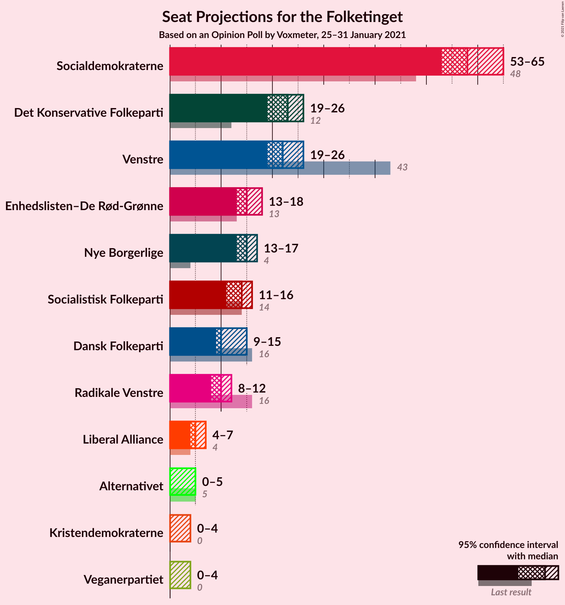
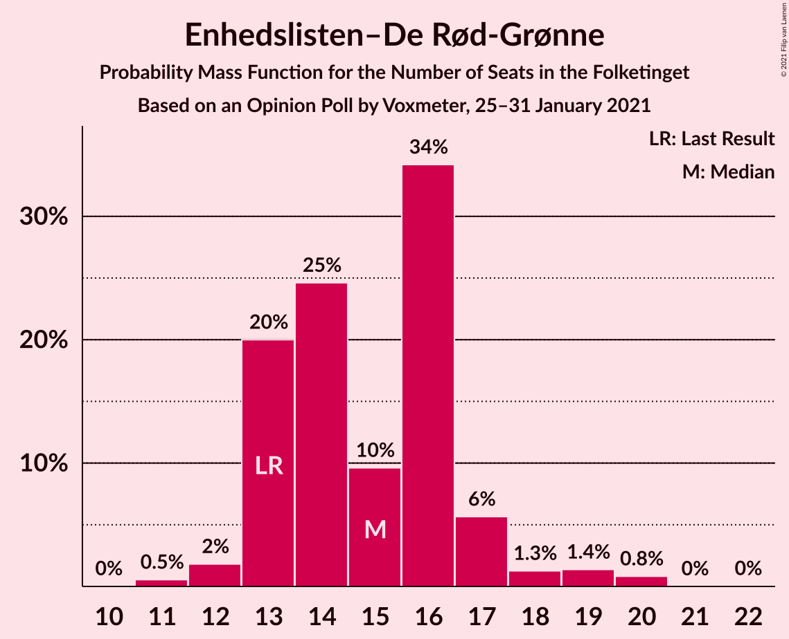
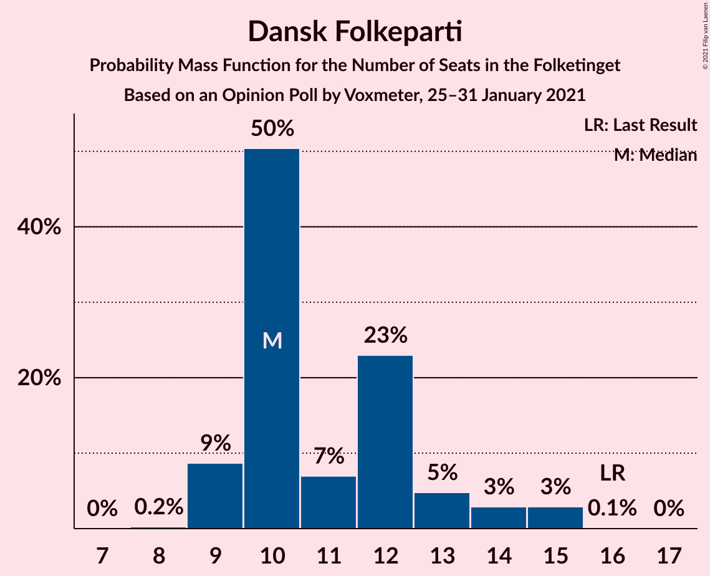
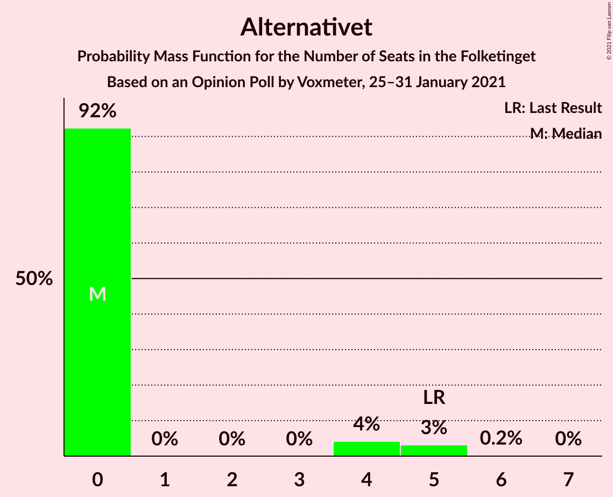
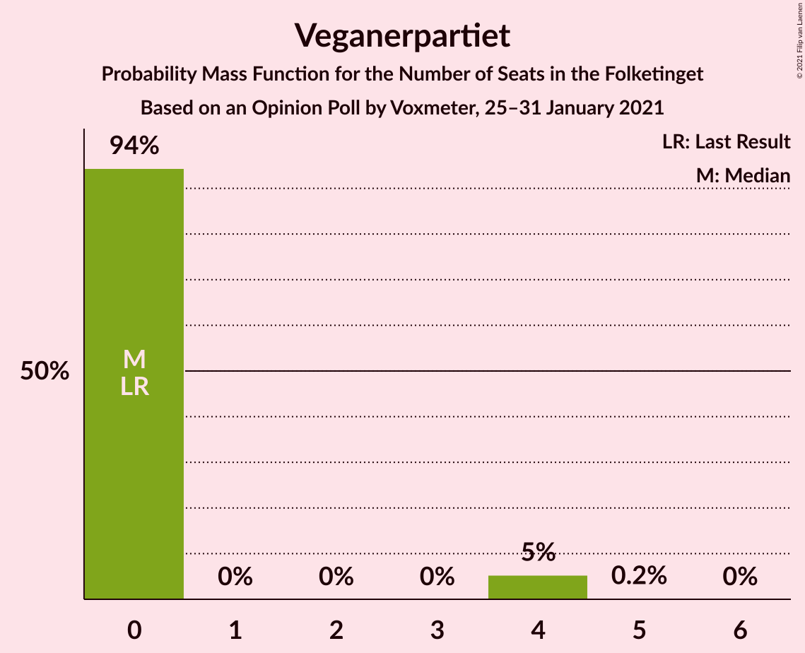
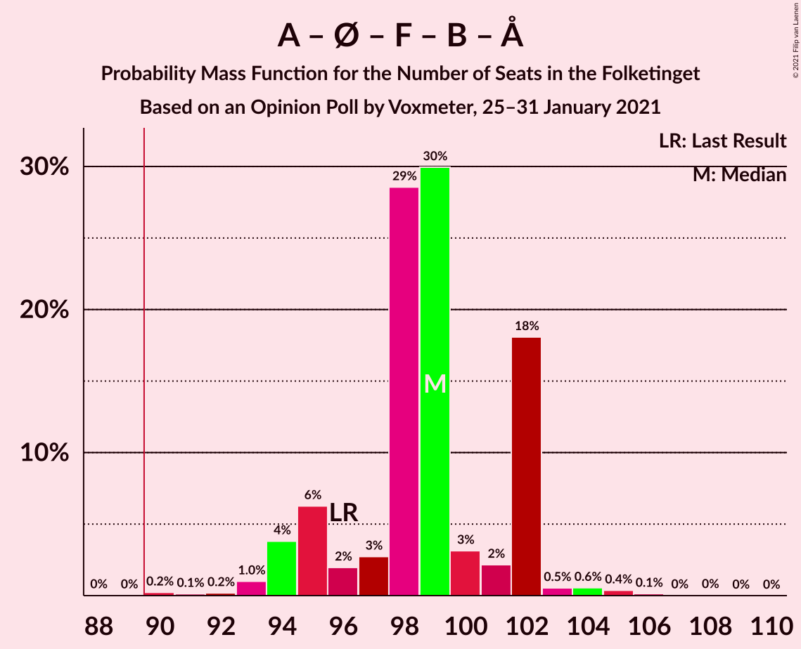
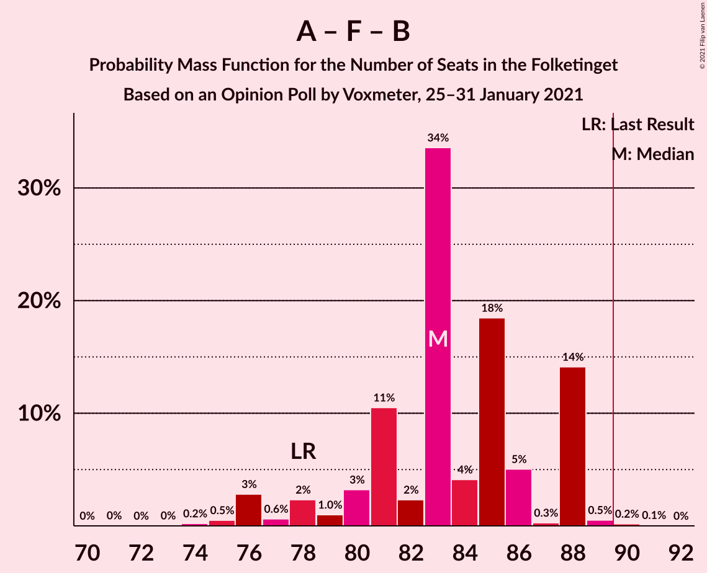
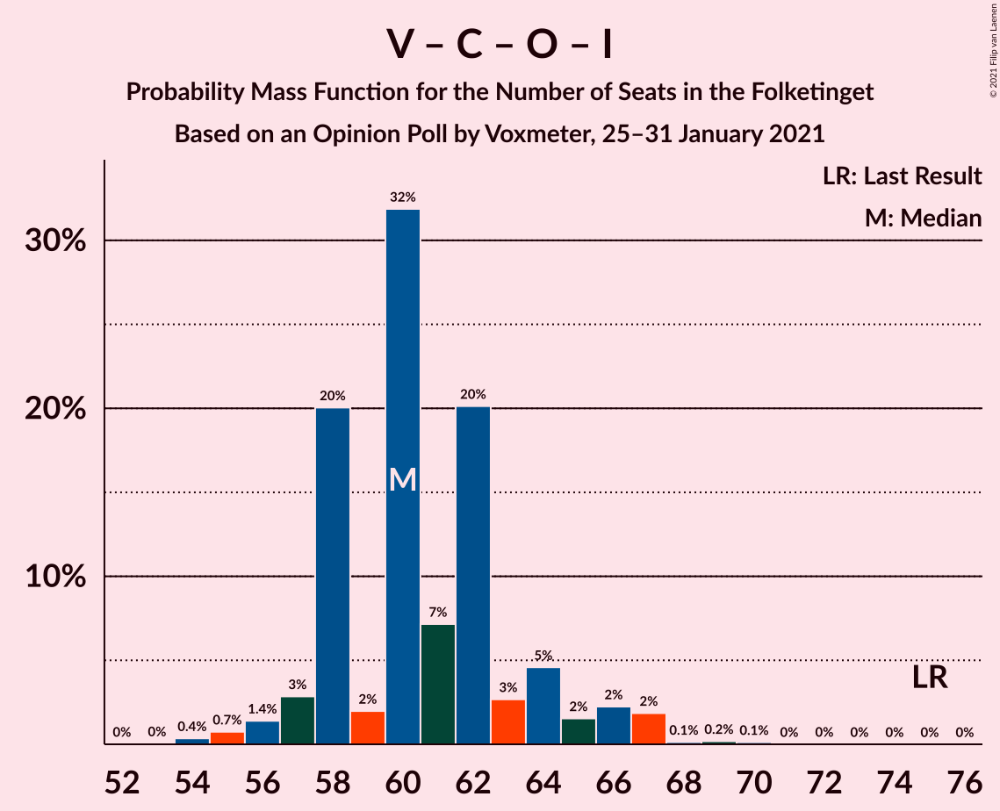
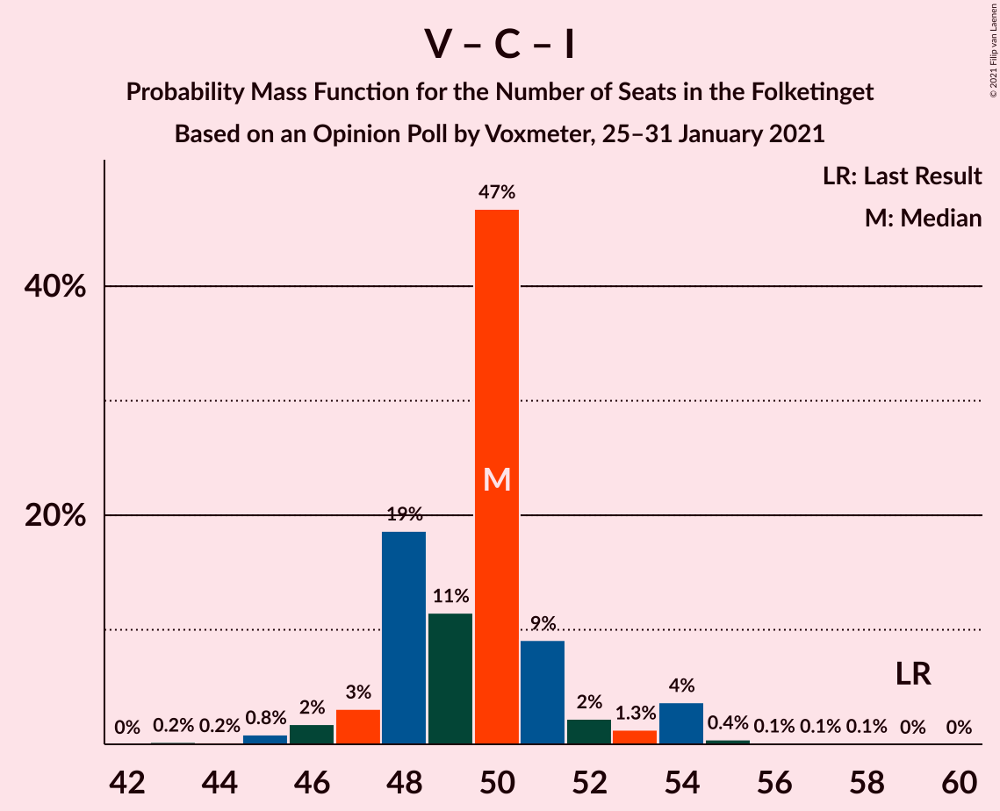

# Opinion Poll by Voxmeter, 25–31 January 2021

<a href="#voting-intentions">Voting Intentions</a> | <a href="#seats">Seats</a> | <a href="#coalitions">Coalitions</a> | <a href="#technical-information">Technical Information</a>

## Voting Intentions

### Confidence Intervals

| Party | Last Result | Poll Result | 80% Confidence Interval | 90% Confidence Interval | 95% Confidence Interval | 99% Confidence Interval |
|:-----:|:-----------:|:-----------:|:-----------------------:|:-----------------------:|:-----------------------:|:-----------------------:|
| Socialdemokraterne | 25.9% | 32.2% | 30.4–34.1% |29.9–34.7% |29.4–35.1% |28.5–36.0% |
| Venstre | 23.4% | 12.5% | 11.3–14.0% |11.0–14.4% |10.7–14.7% |10.1–15.4% |
| Det Konservative Folkeparti | 6.6% | 12.1% | 10.8–13.5% |10.5–13.9% |10.2–14.2% |9.6–14.9% |
| Enhedslisten–De Rød-Grønne | 6.9% | 8.5% | 7.4–9.7% |7.1–10.0% |6.9–10.3% |6.4–10.9% |
| Nye Borgerlige | 2.4% | 7.9% | 6.9–9.1% |6.6–9.4% |6.4–9.7% |5.9–10.3% |
| Socialistisk Folkeparti | 7.7% | 7.3% | 6.3–8.4% |6.1–8.8% |5.9–9.1% |5.4–9.6% |
| Dansk Folkeparti | 8.7% | 6.3% | 5.4–7.4% |5.2–7.7% |5.0–8.0% |4.6–8.5% |
| Radikale Venstre | 8.6% | 5.4% | 4.6–6.5% |4.4–6.8% |4.2–7.0% |3.9–7.5% |
| Liberal Alliance | 2.3% | 2.9% | 2.3–3.7% |2.2–3.9% |2.0–4.1% |1.8–4.6% |
| Alternativet | 3.0% | 1.7% | 1.2–2.3% |1.1–2.5% |1.0–2.6% |0.9–3.0% |
| Kristendemokraterne | 1.7% | 1.5% | 1.1–2.1% |1.0–2.2% |0.9–2.4% |0.7–2.7% |
| Veganerpartiet | 0.0% | 1.1% | 0.8–1.6% |0.7–1.8% |0.6–1.9% |0.5–2.2% |

*Note:* The poll result column reflects the actual value used in the calculations. Published results may vary slightly, and in addition be rounded to fewer digits.

## Seats

### Confidence Intervals

| Party | Last Result | Median | 80% Confidence Interval | 90% Confidence Interval | 95% Confidence Interval | 99% Confidence Interval |
|:-----:|:-----------:|:------:|:-----------------------:|:-----------------------:|:-----------------------:|:-----------------------:|
| <a href="#socialdemokraterne">Socialdemokraterne</a> | 48 | 58 | 57–65 |54–65 |53–65 |51–65 |
| <a href="#venstre">Venstre</a> | 43 | 22 | 20–23 |20–24 |19–26 |19–28 |
| <a href="#det-konservative-folkeparti">Det Konservative Folkeparti</a> | 12 | 23 | 21–24 |20–25 |19–26 |18–27 |
| <a href="#enhedslisten–de-rød-grønne">Enhedslisten–De Rød-Grønne</a> | 13 | 15 | 13–16 |13–17 |13–18 |11–20 |
| <a href="#nye-borgerlige">Nye Borgerlige</a> | 4 | 15 | 14–16 |13–16 |13–17 |11–19 |
| <a href="#socialistisk-folkeparti">Socialistisk Folkeparti</a> | 14 | 14 | 12–15 |12–15 |11–16 |10–18 |
| <a href="#dansk-folkeparti">Dansk Folkeparti</a> | 16 | 10 | 10–13 |9–14 |9–15 |9–15 |
| <a href="#radikale-venstre">Radikale Venstre</a> | 16 | 10 | 9–11 |9–12 |8–12 |7–13 |
| <a href="#liberal-alliance">Liberal Alliance</a> | 4 | 5 | 5–6 |4–7 |4–7 |0–8 |
| <a href="#alternativet">Alternativet</a> | 5 | 0 | 0 |0–4 |0–5 |0–5 |
| <a href="#kristendemokraterne">Kristendemokraterne</a> | 0 | 0 | 0 |0–4 |0–4 |0–5 |
| <a href="#veganerpartiet">Veganerpartiet</a> | 0 | 0 | 0 |0–4 |0–4 |0–4 |

### Socialdemokraterne

*For a full overview of the results for this party, see the [Socialdemokraterne](party-socialdemokraterne.html) page.*

| Number of Seats | Probability | Accumulated | Special Marks |
|:---------------:|:-----------:|:-----------:|:-------------:|
| 48 | 0% | 100% | Last Result |
| 49 | 0% | 100% |  |
| 50 | 0% | 100% |  |
| 51 | 2% | 99.9% |  |
| 52 | 0.2% | 98% |  |
| 53 | 0.9% | 98% |  |
| 54 | 2% | 97% |  |
| 55 | 3% | 95% |  |
| 56 | 1.0% | 92% |  |
| 57 | 4% | 91% |  |
| 58 | 38% | 87% | Median |
| 59 | 4% | 49% |  |
| 60 | 4% | 45% |  |
| 61 | 21% | 40% |  |
| 62 | 3% | 19% |  |
| 63 | 0.3% | 17% |  |
| 64 | 2% | 16% |  |
| 65 | 14% | 14% |  |
| 66 | 0.1% | 0.1% |  |
| 67 | 0% | 0% |  |

### Venstre

*For a full overview of the results for this party, see the [Venstre](party-venstre.html) page.*

| Number of Seats | Probability | Accumulated | Special Marks |
|:---------------:|:-----------:|:-----------:|:-------------:|
| 18 | 0.1% | 100% |  |
| 19 | 3% | 99.9% |  |
| 20 | 35% | 97% |  |
| 21 | 8% | 62% |  |
| 22 | 43% | 55% | Median |
| 23 | 4% | 12% |  |
| 24 | 3% | 7% |  |
| 25 | 0.7% | 5% |  |
| 26 | 3% | 4% |  |
| 27 | 0.2% | 1.2% |  |
| 28 | 0.8% | 0.9% |  |
| 29 | 0.2% | 0.2% |  |
| 30 | 0% | 0% |  |
| 31 | 0% | 0% |  |
| 32 | 0% | 0% |  |
| 33 | 0% | 0% |  |
| 34 | 0% | 0% |  |
| 35 | 0% | 0% |  |
| 36 | 0% | 0% |  |
| 37 | 0% | 0% |  |
| 38 | 0% | 0% |  |
| 39 | 0% | 0% |  |
| 40 | 0% | 0% |  |
| 41 | 0% | 0% |  |
| 42 | 0% | 0% |  |
| 43 | 0% | 0% | Last Result |

### Det Konservative Folkeparti

*For a full overview of the results for this party, see the [Det Konservative Folkeparti](party-detkonservativefolkeparti.html) page.*

| Number of Seats | Probability | Accumulated | Special Marks |
|:---------------:|:-----------:|:-----------:|:-------------:|
| 12 | 0% | 100% | Last Result |
| 13 | 0% | 100% |  |
| 14 | 0% | 100% |  |
| 15 | 0% | 100% |  |
| 16 | 0% | 100% |  |
| 17 | 0.1% | 100% |  |
| 18 | 0.6% | 99.9% |  |
| 19 | 3% | 99.3% |  |
| 20 | 3% | 97% |  |
| 21 | 7% | 94% |  |
| 22 | 26% | 87% |  |
| 23 | 33% | 61% | Median |
| 24 | 23% | 28% |  |
| 25 | 2% | 5% |  |
| 26 | 2% | 3% |  |
| 27 | 0.9% | 1.1% |  |
| 28 | 0.2% | 0.2% |  |
| 29 | 0% | 0.1% |  |
| 30 | 0% | 0% |  |

### Enhedslisten–De Rød-Grønne

*For a full overview of the results for this party, see the [Enhedslisten–De Rød-Grønne](party-enhedslisten–derød-grønne.html) page.*

| Number of Seats | Probability | Accumulated | Special Marks |
|:---------------:|:-----------:|:-----------:|:-------------:|
| 11 | 0.5% | 100% |  |
| 12 | 2% | 99.4% |  |
| 13 | 20% | 98% | Last Result |
| 14 | 25% | 78% |  |
| 15 | 10% | 53% | Median |
| 16 | 34% | 43% |  |
| 17 | 6% | 9% |  |
| 18 | 1.3% | 4% |  |
| 19 | 1.4% | 2% |  |
| 20 | 0.8% | 0.9% |  |
| 21 | 0% | 0.1% |  |
| 22 | 0% | 0% |  |

### Nye Borgerlige

*For a full overview of the results for this party, see the [Nye Borgerlige](party-nyeborgerlige.html) page.*

| Number of Seats | Probability | Accumulated | Special Marks |
|:---------------:|:-----------:|:-----------:|:-------------:|
| 4 | 0% | 100% | Last Result |
| 5 | 0% | 100% |  |
| 6 | 0% | 100% |  |
| 7 | 0% | 100% |  |
| 8 | 0% | 100% |  |
| 9 | 0% | 100% |  |
| 10 | 0.1% | 100% |  |
| 11 | 0.8% | 99.8% |  |
| 12 | 1.3% | 99.0% |  |
| 13 | 6% | 98% |  |
| 14 | 4% | 92% |  |
| 15 | 53% | 88% | Median |
| 16 | 31% | 34% |  |
| 17 | 2% | 4% |  |
| 18 | 0.2% | 1.2% |  |
| 19 | 0.9% | 1.0% |  |
| 20 | 0.1% | 0.1% |  |
| 21 | 0% | 0% |  |

### Socialistisk Folkeparti

*For a full overview of the results for this party, see the [Socialistisk Folkeparti](party-socialistiskfolkeparti.html) page.*

| Number of Seats | Probability | Accumulated | Special Marks |
|:---------------:|:-----------:|:-----------:|:-------------:|
| 9 | 0.1% | 100% |  |
| 10 | 0.5% | 99.9% |  |
| 11 | 3% | 99.4% |  |
| 12 | 9% | 96% |  |
| 13 | 23% | 87% |  |
| 14 | 54% | 65% | Last Result, Median |
| 15 | 7% | 11% |  |
| 16 | 3% | 4% |  |
| 17 | 0.2% | 0.8% |  |
| 18 | 0.5% | 0.6% |  |
| 19 | 0% | 0% |  |

### Dansk Folkeparti

*For a full overview of the results for this party, see the [Dansk Folkeparti](party-danskfolkeparti.html) page.*

| Number of Seats | Probability | Accumulated | Special Marks |
|:---------------:|:-----------:|:-----------:|:-------------:|
| 8 | 0.2% | 100% |  |
| 9 | 9% | 99.7% |  |
| 10 | 50% | 91% | Median |
| 11 | 7% | 41% |  |
| 12 | 23% | 34% |  |
| 13 | 5% | 11% |  |
| 14 | 3% | 6% |  |
| 15 | 3% | 3% |  |
| 16 | 0.1% | 0.1% | Last Result |
| 17 | 0% | 0% |  |

### Radikale Venstre

*For a full overview of the results for this party, see the [Radikale Venstre](party-radikalevenstre.html) page.*

| Number of Seats | Probability | Accumulated | Special Marks |
|:---------------:|:-----------:|:-----------:|:-------------:|
| 7 | 2% | 100% |  |
| 8 | 3% | 98% |  |
| 9 | 11% | 95% |  |
| 10 | 37% | 85% | Median |
| 11 | 43% | 48% |  |
| 12 | 4% | 5% |  |
| 13 | 1.4% | 1.5% |  |
| 14 | 0.1% | 0.1% |  |
| 15 | 0% | 0% |  |
| 16 | 0% | 0% | Last Result |

### Liberal Alliance

*For a full overview of the results for this party, see the [Liberal Alliance](party-liberalalliance.html) page.*

| Number of Seats | Probability | Accumulated | Special Marks |
|:---------------:|:-----------:|:-----------:|:-------------:|
| 0 | 0.9% | 100% |  |
| 1 | 0% | 99.1% |  |
| 2 | 0% | 99.1% |  |
| 3 | 0% | 99.1% |  |
| 4 | 4% | 99.1% | Last Result |
| 5 | 48% | 95% | Median |
| 6 | 40% | 47% |  |
| 7 | 6% | 7% |  |
| 8 | 0.5% | 0.7% |  |
| 9 | 0.2% | 0.2% |  |
| 10 | 0% | 0% |  |

### Alternativet

*For a full overview of the results for this party, see the [Alternativet](party-alternativet.html) page.*

| Number of Seats | Probability | Accumulated | Special Marks |
|:---------------:|:-----------:|:-----------:|:-------------:|
| 0 | 92% | 100% | Median |
| 1 | 0% | 8% |  |
| 2 | 0% | 8% |  |
| 3 | 0% | 8% |  |
| 4 | 4% | 8% |  |
| 5 | 3% | 3% | Last Result |
| 6 | 0.2% | 0.2% |  |
| 7 | 0% | 0% |  |

### Kristendemokraterne

*For a full overview of the results for this party, see the [Kristendemokraterne](party-kristendemokraterne.html) page.*

| Number of Seats | Probability | Accumulated | Special Marks |
|:---------------:|:-----------:|:-----------:|:-------------:|
| 0 | 91% | 100% | Last Result, Median |
| 1 | 0% | 9% |  |
| 2 | 0% | 9% |  |
| 3 | 0% | 9% |  |
| 4 | 8% | 9% |  |
| 5 | 0.8% | 0.8% |  |
| 6 | 0.1% | 0.1% |  |
| 7 | 0% | 0% |  |

### Veganerpartiet

*For a full overview of the results for this party, see the [Veganerpartiet](party-veganerpartiet.html) page.*

| Number of Seats | Probability | Accumulated | Special Marks |
|:---------------:|:-----------:|:-----------:|:-------------:|
| 0 | 94% | 100% | Last Result, Median |
| 1 | 0% | 6% |  |
| 2 | 0% | 6% |  |
| 3 | 0% | 6% |  |
| 4 | 5% | 6% |  |
| 5 | 0.2% | 0.2% |  |
| 6 | 0% | 0% |  |

## Coalitions

### Confidence Intervals

| Coalition | Last Result | Median | Majority? | 80% Confidence Interval | 90% Confidence Interval | 95% Confidence Interval | 99% Confidence Interval |
|:---------:|:-----------:|:------:|:---------:|:-----------------------:|:-----------------------:|:-----------------------:|:-----------------------:|
| Socialdemokraterne – Enhedslisten–De Rød-Grønne – Socialistisk Folkeparti – Radikale Venstre – Alternativet | 96 | 99 | 99.9% | 95–102 | 94–102 | 94–102 | 92–105 |
| Socialdemokraterne – Enhedslisten–De Rød-Grønne – Socialistisk Folkeparti – Radikale Venstre | 91 | 99 | 99.8% | 95–102 | 93–102 | 93–102 | 90–104 |
| Socialdemokraterne – Enhedslisten–De Rød-Grønne – Socialistisk Folkeparti – Alternativet | 80 | 88 | 26% | 85–92 | 84–92 | 84–93 | 81–95 |
| Socialdemokraterne – Enhedslisten–De Rød-Grønne – Socialistisk Folkeparti | 75 | 88 | 24% | 84–92 | 83–92 | 83–93 | 80–94 |
| Socialdemokraterne – Socialistisk Folkeparti – Radikale Venstre | 78 | 83 | 0.3% | 80–88 | 78–88 | 76–88 | 75–89 |
| Venstre – Det Konservative Folkeparti – Nye Borgerlige – Dansk Folkeparti – Liberal Alliance – Kristendemokraterne | 79 | 76 | 0% | 73–78 | 73–81 | 73–81 | 70–83 |
| Venstre – Det Konservative Folkeparti – Nye Borgerlige – Dansk Folkeparti – Liberal Alliance | 79 | 76 | 0% | 73–78 | 73–80 | 72–81 | 69–82 |
| Socialdemokraterne – Radikale Venstre | 64 | 69 | 0% | 67–75 | 65–75 | 62–75 | 61–75 |
| Venstre – Det Konservative Folkeparti – Dansk Folkeparti – Liberal Alliance – Kristendemokraterne | 75 | 60 | 0% | 58–64 | 58–66 | 57–67 | 55–69 |
| Venstre – Det Konservative Folkeparti – Dansk Folkeparti – Liberal Alliance | 75 | 60 | 0% | 58–64 | 57–65 | 56–66 | 55–67 |
| Venstre – Det Konservative Folkeparti – Liberal Alliance | 59 | 50 | 0% | 48–51 | 47–53 | 46–54 | 45–55 |
| Venstre – Det Konservative Folkeparti | 55 | 44 | 0% | 42–46 | 42–47 | 41–49 | 40–50 |
| Venstre | 43 | 22 | 0% | 20–23 | 20–24 | 19–26 | 19–28 |

### Socialdemokraterne – Enhedslisten–De Rød-Grønne – Socialistisk Folkeparti – Radikale Venstre – Alternativet

| Number of Seats | Probability | Accumulated | Special Marks |
|:---------------:|:-----------:|:-----------:|:-------------:|
| 88 | 0% | 100% |  |
| 89 | 0% | 99.9% |  |
| 90 | 0.2% | 99.9% | Majority |
| 91 | 0.1% | 99.7% |  |
| 92 | 0.2% | 99.5% |  |
| 93 | 1.0% | 99.4% |  |
| 94 | 4% | 98% |  |
| 95 | 6% | 95% |  |
| 96 | 2% | 88% | Last Result |
| 97 | 3% | 86% | Median |
| 98 | 29% | 84% |  |
| 99 | 30% | 55% |  |
| 100 | 3% | 25% |  |
| 101 | 2% | 22% |  |
| 102 | 18% | 20% |  |
| 103 | 0.5% | 2% |  |
| 104 | 0.6% | 1.1% |  |
| 105 | 0.4% | 0.6% |  |
| 106 | 0.1% | 0.2% |  |
| 107 | 0% | 0.1% |  |
| 108 | 0% | 0.1% |  |
| 109 | 0% | 0% |  |

### Socialdemokraterne – Enhedslisten–De Rød-Grønne – Socialistisk Folkeparti – Radikale Venstre

| Number of Seats | Probability | Accumulated | Special Marks |
|:---------------:|:-----------:|:-----------:|:-------------:|
| 87 | 0.1% | 100% |  |
| 88 | 0% | 99.9% |  |
| 89 | 0.1% | 99.9% |  |
| 90 | 0.4% | 99.8% | Majority |
| 91 | 0.3% | 99.4% | Last Result |
| 92 | 1.1% | 99.0% |  |
| 93 | 3% | 98% |  |
| 94 | 4% | 95% |  |
| 95 | 6% | 90% |  |
| 96 | 1.5% | 84% |  |
| 97 | 4% | 83% | Median |
| 98 | 26% | 79% |  |
| 99 | 30% | 52% |  |
| 100 | 3% | 22% |  |
| 101 | 1.4% | 19% |  |
| 102 | 17% | 18% |  |
| 103 | 0.2% | 1.0% |  |
| 104 | 0.5% | 0.7% |  |
| 105 | 0.1% | 0.3% |  |
| 106 | 0% | 0.1% |  |
| 107 | 0% | 0.1% |  |
| 108 | 0% | 0% |  |

### Socialdemokraterne – Enhedslisten–De Rød-Grønne – Socialistisk Folkeparti – Alternativet

| Number of Seats | Probability | Accumulated | Special Marks |
|:---------------:|:-----------:|:-----------:|:-------------:|
| 78 | 0.1% | 100% |  |
| 79 | 0.1% | 99.9% |  |
| 80 | 0.2% | 99.8% | Last Result |
| 81 | 0.2% | 99.6% |  |
| 82 | 0.5% | 99.5% |  |
| 83 | 1.3% | 98.9% |  |
| 84 | 5% | 98% |  |
| 85 | 3% | 92% |  |
| 86 | 2% | 89% |  |
| 87 | 11% | 87% | Median |
| 88 | 47% | 76% |  |
| 89 | 3% | 29% |  |
| 90 | 3% | 26% | Majority |
| 91 | 4% | 23% |  |
| 92 | 15% | 19% |  |
| 93 | 2% | 4% |  |
| 94 | 0.7% | 1.3% |  |
| 95 | 0.4% | 0.6% |  |
| 96 | 0.1% | 0.3% |  |
| 97 | 0.1% | 0.2% |  |
| 98 | 0% | 0.1% |  |
| 99 | 0% | 0% |  |

### Socialdemokraterne – Enhedslisten–De Rød-Grønne – Socialistisk Folkeparti

| Number of Seats | Probability | Accumulated | Special Marks |
|:---------------:|:-----------:|:-----------:|:-------------:|
| 75 | 0% | 100% | Last Result |
| 76 | 0% | 100% |  |
| 77 | 0% | 100% |  |
| 78 | 0.1% | 100% |  |
| 79 | 0.1% | 99.9% |  |
| 80 | 0.3% | 99.8% |  |
| 81 | 0.8% | 99.4% |  |
| 82 | 0.7% | 98.6% |  |
| 83 | 4% | 98% |  |
| 84 | 7% | 94% |  |
| 85 | 3% | 87% |  |
| 86 | 2% | 84% |  |
| 87 | 11% | 82% | Median |
| 88 | 45% | 71% |  |
| 89 | 2% | 26% |  |
| 90 | 3% | 24% | Majority |
| 91 | 4% | 21% |  |
| 92 | 15% | 18% |  |
| 93 | 2% | 3% |  |
| 94 | 0.5% | 0.8% |  |
| 95 | 0.2% | 0.3% |  |
| 96 | 0% | 0.1% |  |
| 97 | 0.1% | 0.1% |  |
| 98 | 0% | 0% |  |

### Socialdemokraterne – Socialistisk Folkeparti – Radikale Venstre

| Number of Seats | Probability | Accumulated | Special Marks |
|:---------------:|:-----------:|:-----------:|:-------------:|
| 71 | 0% | 100% |  |
| 72 | 0% | 99.9% |  |
| 73 | 0% | 99.9% |  |
| 74 | 0.2% | 99.9% |  |
| 75 | 0.5% | 99.7% |  |
| 76 | 3% | 99.2% |  |
| 77 | 0.6% | 96% |  |
| 78 | 2% | 96% | Last Result |
| 79 | 1.0% | 93% |  |
| 80 | 3% | 92% |  |
| 81 | 11% | 89% |  |
| 82 | 2% | 79% | Median |
| 83 | 34% | 76% |  |
| 84 | 4% | 43% |  |
| 85 | 18% | 39% |  |
| 86 | 5% | 20% |  |
| 87 | 0.3% | 15% |  |
| 88 | 14% | 15% |  |
| 89 | 0.5% | 0.8% |  |
| 90 | 0.2% | 0.3% | Majority |
| 91 | 0.1% | 0.1% |  |
| 92 | 0% | 0% |  |

### Venstre – Det Konservative Folkeparti – Nye Borgerlige – Dansk Folkeparti – Liberal Alliance – Kristendemokraterne

| Number of Seats | Probability | Accumulated | Special Marks |
|:---------------:|:-----------:|:-----------:|:-------------:|
| 67 | 0% | 100% |  |
| 68 | 0% | 99.9% |  |
| 69 | 0.1% | 99.9% |  |
| 70 | 0.4% | 99.8% |  |
| 71 | 0.6% | 99.4% |  |
| 72 | 0.7% | 98.8% |  |
| 73 | 18% | 98% |  |
| 74 | 2% | 80% |  |
| 75 | 3% | 78% | Median |
| 76 | 35% | 74% |  |
| 77 | 28% | 40% |  |
| 78 | 3% | 11% |  |
| 79 | 2% | 9% | Last Result |
| 80 | 1.4% | 7% |  |
| 81 | 4% | 5% |  |
| 82 | 0.9% | 1.5% |  |
| 83 | 0.2% | 0.5% |  |
| 84 | 0.1% | 0.4% |  |
| 85 | 0.1% | 0.2% |  |
| 86 | 0% | 0.1% |  |
| 87 | 0% | 0.1% |  |
| 88 | 0% | 0% |  |

### Venstre – Det Konservative Folkeparti – Nye Borgerlige – Dansk Folkeparti – Liberal Alliance

| Number of Seats | Probability | Accumulated | Special Marks |
|:---------------:|:-----------:|:-----------:|:-------------:|
| 67 | 0.2% | 100% |  |
| 68 | 0.1% | 99.8% |  |
| 69 | 0.4% | 99.7% |  |
| 70 | 0.4% | 99.3% |  |
| 71 | 0.9% | 98.9% |  |
| 72 | 2% | 98% |  |
| 73 | 24% | 96% |  |
| 74 | 2% | 73% |  |
| 75 | 3% | 71% | Median |
| 76 | 34% | 68% |  |
| 77 | 23% | 33% |  |
| 78 | 3% | 10% |  |
| 79 | 2% | 7% | Last Result |
| 80 | 1.2% | 6% |  |
| 81 | 3% | 4% |  |
| 82 | 0.8% | 1.1% |  |
| 83 | 0.2% | 0.3% |  |
| 84 | 0.1% | 0.2% |  |
| 85 | 0% | 0.1% |  |
| 86 | 0% | 0% |  |

### Socialdemokraterne – Radikale Venstre

| Number of Seats | Probability | Accumulated | Special Marks |
|:---------------:|:-----------:|:-----------:|:-------------:|
| 60 | 0.4% | 100% |  |
| 61 | 2% | 99.5% |  |
| 62 | 0.3% | 98% |  |
| 63 | 0.5% | 97% |  |
| 64 | 0.9% | 97% | Last Result |
| 65 | 3% | 96% |  |
| 66 | 2% | 93% |  |
| 67 | 3% | 91% |  |
| 68 | 7% | 88% | Median |
| 69 | 39% | 81% |  |
| 70 | 4% | 43% |  |
| 71 | 19% | 38% |  |
| 72 | 0.5% | 19% |  |
| 73 | 4% | 19% |  |
| 74 | 0.7% | 15% |  |
| 75 | 14% | 14% |  |
| 76 | 0% | 0.1% |  |
| 77 | 0% | 0.1% |  |
| 78 | 0% | 0.1% |  |
| 79 | 0% | 0% |  |

### Venstre – Det Konservative Folkeparti – Dansk Folkeparti – Liberal Alliance – Kristendemokraterne

| Number of Seats | Probability | Accumulated | Special Marks |
|:---------------:|:-----------:|:-----------:|:-------------:|
| 54 | 0.2% | 100% |  |
| 55 | 0.7% | 99.7% |  |
| 56 | 1.3% | 99.0% |  |
| 57 | 2% | 98% |  |
| 58 | 15% | 96% |  |
| 59 | 2% | 81% |  |
| 60 | 32% | 79% | Median |
| 61 | 7% | 48% |  |
| 62 | 25% | 40% |  |
| 63 | 3% | 15% |  |
| 64 | 5% | 12% |  |
| 65 | 2% | 8% |  |
| 66 | 3% | 6% |  |
| 67 | 2% | 3% |  |
| 68 | 0.3% | 0.8% |  |
| 69 | 0.2% | 0.6% |  |
| 70 | 0.1% | 0.3% |  |
| 71 | 0.1% | 0.2% |  |
| 72 | 0% | 0.1% |  |
| 73 | 0% | 0.1% |  |
| 74 | 0% | 0% |  |
| 75 | 0% | 0% | Last Result |

### Venstre – Det Konservative Folkeparti – Dansk Folkeparti – Liberal Alliance

| Number of Seats | Probability | Accumulated | Special Marks |
|:---------------:|:-----------:|:-----------:|:-------------:|
| 53 | 0% | 100% |  |
| 54 | 0.4% | 99.9% |  |
| 55 | 0.7% | 99.6% |  |
| 56 | 1.4% | 98.8% |  |
| 57 | 3% | 97% |  |
| 58 | 20% | 95% |  |
| 59 | 2% | 75% |  |
| 60 | 32% | 73% | Median |
| 61 | 7% | 41% |  |
| 62 | 20% | 34% |  |
| 63 | 3% | 13% |  |
| 64 | 5% | 11% |  |
| 65 | 2% | 6% |  |
| 66 | 2% | 5% |  |
| 67 | 2% | 2% |  |
| 68 | 0.1% | 0.5% |  |
| 69 | 0.2% | 0.3% |  |
| 70 | 0.1% | 0.2% |  |
| 71 | 0% | 0% |  |
| 72 | 0% | 0% |  |
| 73 | 0% | 0% |  |
| 74 | 0% | 0% |  |
| 75 | 0% | 0% | Last Result |

### Venstre – Det Konservative Folkeparti – Liberal Alliance

| Number of Seats | Probability | Accumulated | Special Marks |
|:---------------:|:-----------:|:-----------:|:-------------:|
| 43 | 0.2% | 100% |  |
| 44 | 0.2% | 99.8% |  |
| 45 | 0.8% | 99.6% |  |
| 46 | 2% | 98.8% |  |
| 47 | 3% | 97% |  |
| 48 | 19% | 94% |  |
| 49 | 11% | 75% |  |
| 50 | 47% | 64% | Median |
| 51 | 9% | 17% |  |
| 52 | 2% | 8% |  |
| 53 | 1.3% | 6% |  |
| 54 | 4% | 4% |  |
| 55 | 0.4% | 0.8% |  |
| 56 | 0.1% | 0.4% |  |
| 57 | 0.1% | 0.3% |  |
| 58 | 0.1% | 0.1% |  |
| 59 | 0% | 0% | Last Result |

### Venstre – Det Konservative Folkeparti

| Number of Seats | Probability | Accumulated | Special Marks |
|:---------------:|:-----------:|:-----------:|:-------------:|
| 37 | 0.1% | 100% |  |
| 38 | 0.1% | 99.9% |  |
| 39 | 0.3% | 99.8% |  |
| 40 | 2% | 99.5% |  |
| 41 | 3% | 98% |  |
| 42 | 18% | 95% |  |
| 43 | 5% | 77% |  |
| 44 | 26% | 72% |  |
| 45 | 32% | 46% | Median |
| 46 | 7% | 14% |  |
| 47 | 3% | 7% |  |
| 48 | 1.2% | 5% |  |
| 49 | 3% | 3% |  |
| 50 | 0.2% | 0.6% |  |
| 51 | 0.1% | 0.4% |  |
| 52 | 0.2% | 0.3% |  |
| 53 | 0.1% | 0.1% |  |
| 54 | 0% | 0% |  |
| 55 | 0% | 0% | Last Result |

### Venstre

| Number of Seats | Probability | Accumulated | Special Marks |
|:---------------:|:-----------:|:-----------:|:-------------:|
| 18 | 0.1% | 100% |  |
| 19 | 3% | 99.9% |  |
| 20 | 35% | 97% |  |
| 21 | 8% | 62% |  |
| 22 | 43% | 55% | Median |
| 23 | 4% | 12% |  |
| 24 | 3% | 7% |  |
| 25 | 0.7% | 5% |  |
| 26 | 3% | 4% |  |
| 27 | 0.2% | 1.2% |  |
| 28 | 0.8% | 0.9% |  |
| 29 | 0.2% | 0.2% |  |
| 30 | 0% | 0% |  |
| 31 | 0% | 0% |  |
| 32 | 0% | 0% |  |
| 33 | 0% | 0% |  |
| 34 | 0% | 0% |  |
| 35 | 0% | 0% |  |
| 36 | 0% | 0% |  |
| 37 | 0% | 0% |  |
| 38 | 0% | 0% |  |
| 39 | 0% | 0% |  |
| 40 | 0% | 0% |  |
| 41 | 0% | 0% |  |
| 42 | 0% | 0% |  |
| 43 | 0% | 0% | Last Result |

## Technical Information

### Opinion Poll

+ **Polling firm:** Voxmeter
+ **Commissioner(s):** —
+ **Fieldwork period:** 25–31 January 2021

### Calculations

+ **Sample size:** 1028
+ **Simulations done:** 1,048,576
+ **Error estimate:** 1.43%

