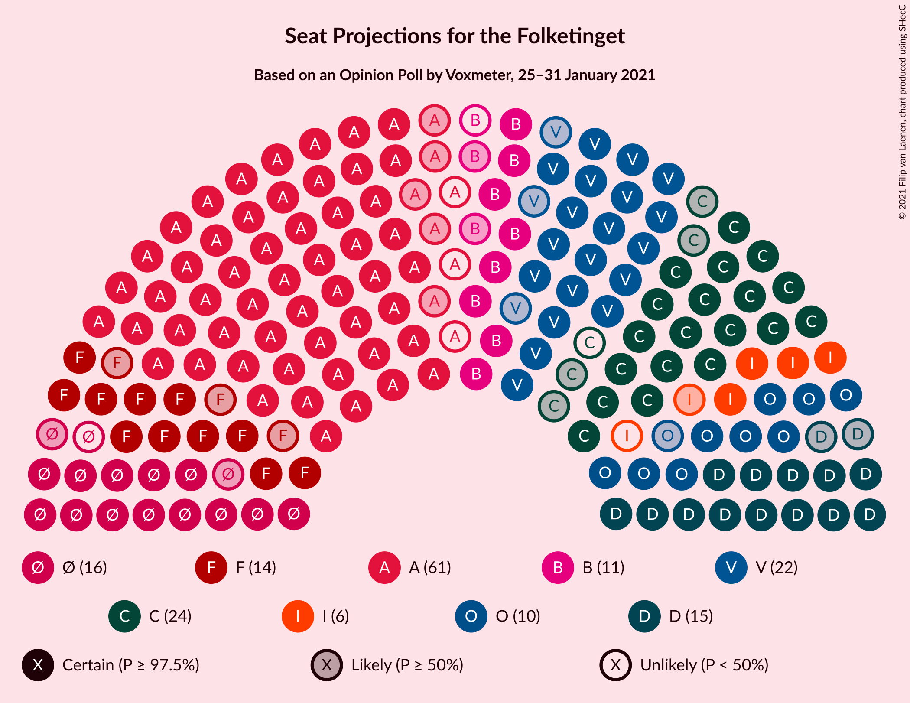
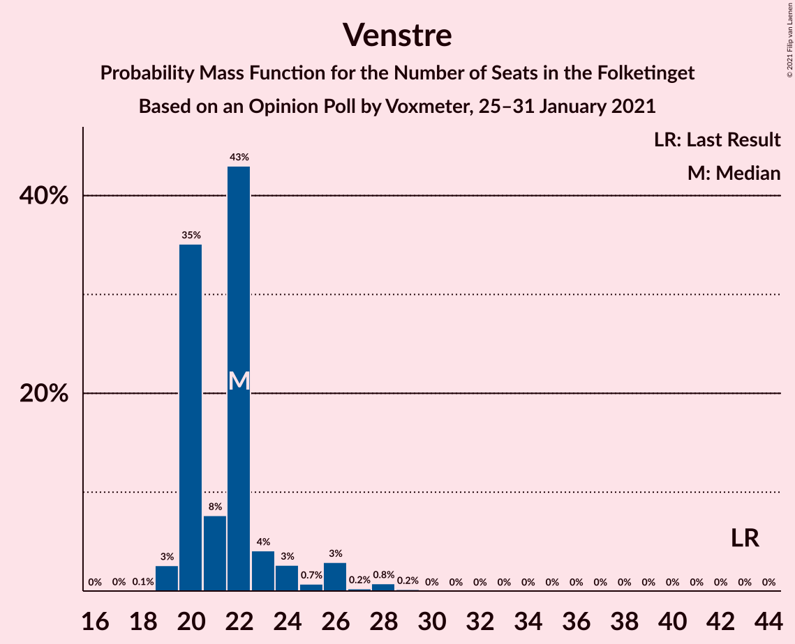
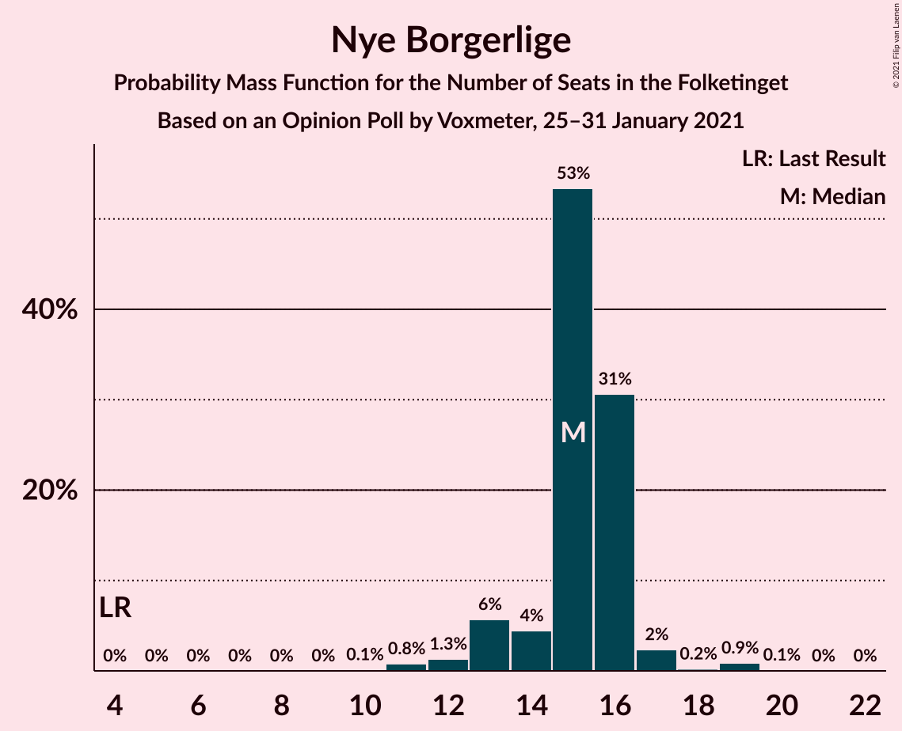
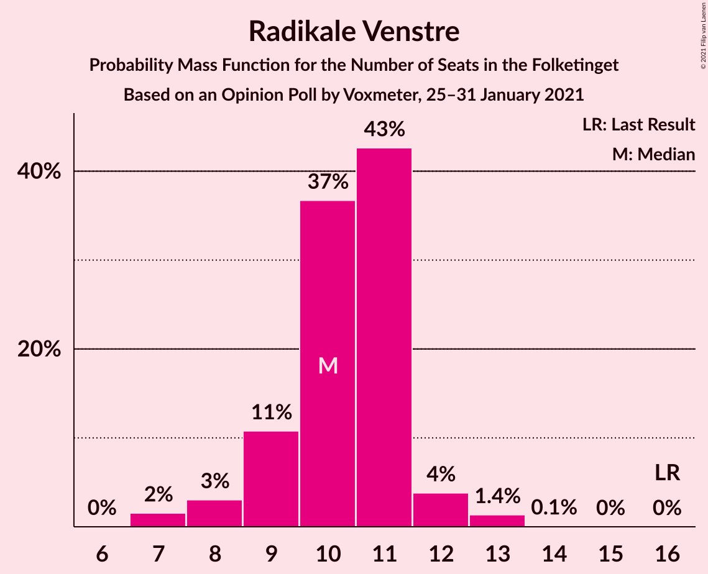
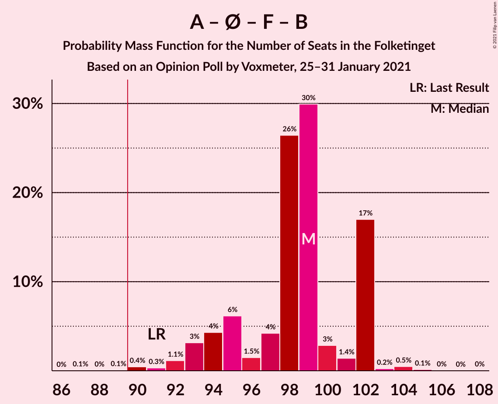
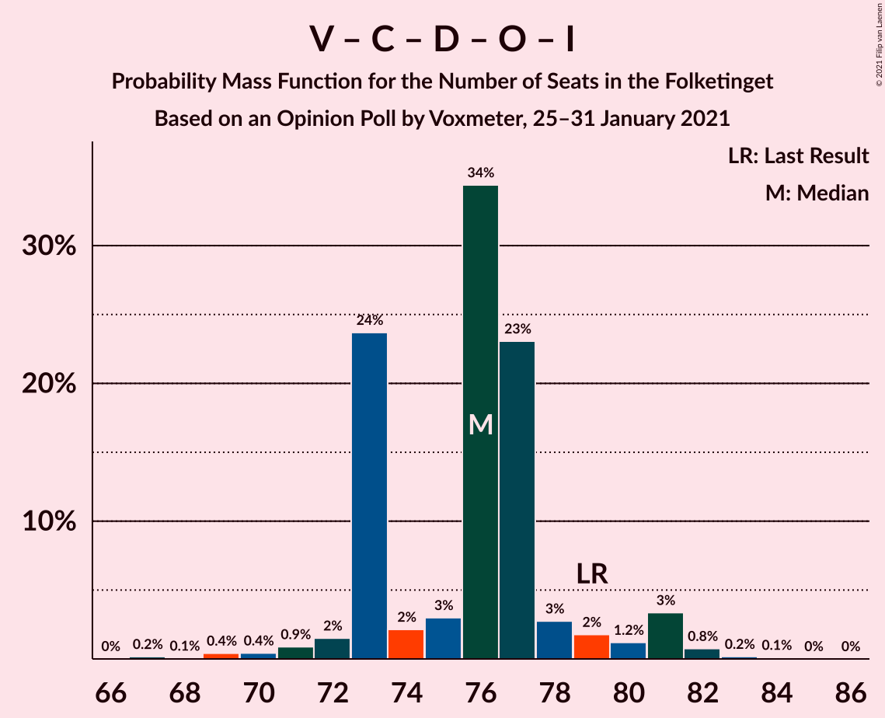
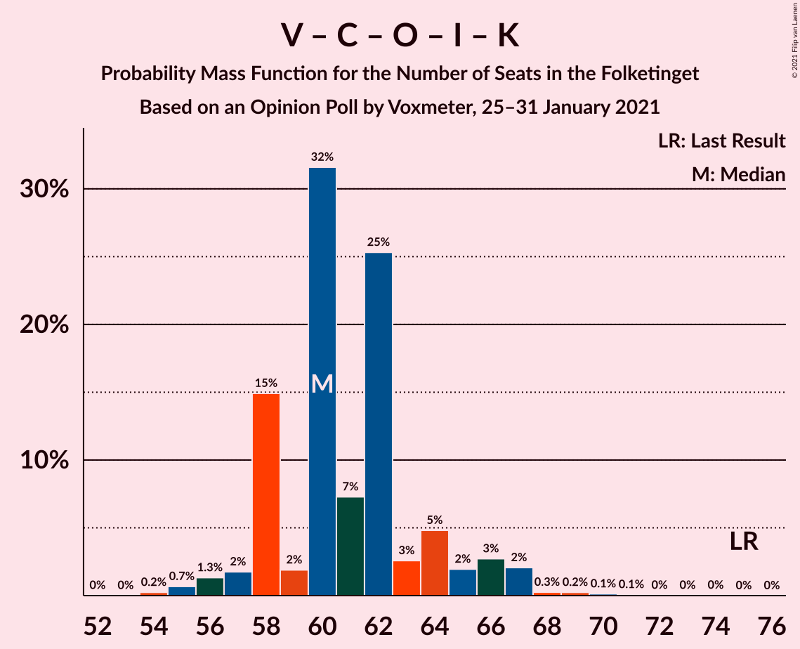

# Opinion Poll by Voxmeter, 25–31 January 2021

<a href="#voting-intentions">Voting Intentions</a> | <a href="#seats">Seats</a> | <a href="#coalitions">Coalitions</a> | <a href="#technical-information">Technical Information</a>

## Voting Intentions

### Confidence Intervals

| Party | Last Result | Poll Result | 80% Confidence Interval | 90% Confidence Interval | 95% Confidence Interval | 99% Confidence Interval |
|:-----:|:-----------:|:-----------:|:-----------------------:|:-----------------------:|:-----------------------:|:-----------------------:|
| Socialdemokraterne | 25.9% | 32.2% | 30.4–34.1% |29.9–34.7% |29.4–35.1% |28.5–36.0% |
| Venstre | 23.4% | 12.5% | 11.3–14.0% |11.0–14.4% |10.7–14.7% |10.1–15.4% |
| Det Konservative Folkeparti | 6.6% | 12.1% | 10.8–13.5% |10.5–13.9% |10.2–14.2% |9.6–14.9% |
| Enhedslisten–De Rød-Grønne | 6.9% | 8.5% | 7.4–9.7% |7.1–10.0% |6.9–10.3% |6.4–10.9% |
| Nye Borgerlige | 2.4% | 7.9% | 6.9–9.1% |6.6–9.4% |6.4–9.7% |5.9–10.3% |
| Socialistisk Folkeparti | 7.7% | 7.3% | 6.3–8.4% |6.1–8.8% |5.9–9.1% |5.4–9.6% |
| Dansk Folkeparti | 8.7% | 6.3% | 5.4–7.4% |5.2–7.7% |5.0–8.0% |4.6–8.5% |
| Radikale Venstre | 8.6% | 5.4% | 4.6–6.5% |4.4–6.8% |4.2–7.0% |3.9–7.5% |
| Liberal Alliance | 2.3% | 2.9% | 2.3–3.7% |2.2–3.9% |2.0–4.1% |1.8–4.6% |
| Alternativet | 3.0% | 1.7% | 1.2–2.3% |1.1–2.5% |1.0–2.6% |0.9–3.0% |
| Kristendemokraterne | 1.7% | 1.5% | 1.1–2.1% |1.0–2.2% |0.9–2.4% |0.7–2.7% |
| Veganerpartiet | 0.0% | 1.1% | 0.8–1.6% |0.7–1.8% |0.6–1.9% |0.5–2.2% |

*Note:* The poll result column reflects the actual value used in the calculations. Published results may vary slightly, and in addition be rounded to fewer digits.

## Seats

### Confidence Intervals

| Party | Last Result | Median | 80% Confidence Interval | 90% Confidence Interval | 95% Confidence Interval | 99% Confidence Interval |
|:-----:|:-----------:|:------:|:-----------------------:|:-----------------------:|:-----------------------:|:-----------------------:|
| <a href="#socialdemokraterne">Socialdemokraterne</a> | 48 | 58 | 55–60 |53–60 |53–61 |52–65 |
| <a href="#venstre">Venstre</a> | 43 | 22 | 21–24 |21–24 |20–26 |20–28 |
| <a href="#det-konservative-folkeparti">Det Konservative Folkeparti</a> | 12 | 22 | 21–24 |19–27 |19–27 |18–27 |
| <a href="#enhedslisten–de-rød-grønne">Enhedslisten–De Rød-Grønne</a> | 13 | 15 | 15–17 |14–18 |13–18 |12–20 |
| <a href="#nye-borgerlige">Nye Borgerlige</a> | 4 | 15 | 13–15 |13–17 |13–17 |11–20 |
| <a href="#socialistisk-folkeparti">Socialistisk Folkeparti</a> | 14 | 14 | 11–14 |11–15 |11–15 |9–16 |
| <a href="#dansk-folkeparti">Dansk Folkeparti</a> | 16 | 10 | 9–15 |9–15 |9–15 |8–15 |
| <a href="#radikale-venstre">Radikale Venstre</a> | 16 | 11 | 7–11 |7–12 |7–12 |7–13 |
| <a href="#liberal-alliance">Liberal Alliance</a> | 4 | 5 | 5–7 |5–7 |4–7 |0–7 |
| <a href="#alternativet">Alternativet</a> | 5 | 0 | 0 |0–4 |0–4 |0–6 |
| <a href="#kristendemokraterne">Kristendemokraterne</a> | 0 | 0 | 0–4 |0–4 |0–4 |0–4 |
| <a href="#veganerpartiet">Veganerpartiet</a> | 0 | 0 | 0 |0 |0 |0 |

### Socialdemokraterne

*For a full overview of the results for this party, see the [Socialdemokraterne](party-socialdemokraterne.html) page.*

| Number of Seats | Probability | Accumulated | Special Marks |
|:---------------:|:-----------:|:-----------:|:-------------:|
| 48 | 0.1% | 100% | Last Result |
| 49 | 0% | 99.9% |  |
| 50 | 0% | 99.9% |  |
| 51 | 0% | 99.9% |  |
| 52 | 1.0% | 99.9% |  |
| 53 | 5% | 98.9% |  |
| 54 | 0.5% | 94% |  |
| 55 | 9% | 94% |  |
| 56 | 0.1% | 85% |  |
| 57 | 19% | 85% |  |
| 58 | 48% | 65% | Median |
| 59 | 2% | 17% |  |
| 60 | 12% | 15% |  |
| 61 | 1.5% | 3% |  |
| 62 | 0.6% | 2% |  |
| 63 | 0% | 1.4% |  |
| 64 | 0.1% | 1.4% |  |
| 65 | 1.1% | 1.3% |  |
| 66 | 0.2% | 0.2% |  |
| 67 | 0% | 0% |  |

### Venstre

*For a full overview of the results for this party, see the [Venstre](party-venstre.html) page.*

| Number of Seats | Probability | Accumulated | Special Marks |
|:---------------:|:-----------:|:-----------:|:-------------:|
| 18 | 0.1% | 100% |  |
| 19 | 0.1% | 99.9% |  |
| 20 | 3% | 99.8% |  |
| 21 | 18% | 97% |  |
| 22 | 61% | 78% | Median |
| 23 | 2% | 18% |  |
| 24 | 12% | 16% |  |
| 25 | 0.3% | 4% |  |
| 26 | 3% | 4% |  |
| 27 | 0.1% | 0.8% |  |
| 28 | 0.7% | 0.7% |  |
| 29 | 0% | 0% |  |
| 30 | 0% | 0% |  |
| 31 | 0% | 0% |  |
| 32 | 0% | 0% |  |
| 33 | 0% | 0% |  |
| 34 | 0% | 0% |  |
| 35 | 0% | 0% |  |
| 36 | 0% | 0% |  |
| 37 | 0% | 0% |  |
| 38 | 0% | 0% |  |
| 39 | 0% | 0% |  |
| 40 | 0% | 0% |  |
| 41 | 0% | 0% |  |
| 42 | 0% | 0% |  |
| 43 | 0% | 0% | Last Result |

### Det Konservative Folkeparti

*For a full overview of the results for this party, see the [Det Konservative Folkeparti](party-detkonservativefolkeparti.html) page.*

| Number of Seats | Probability | Accumulated | Special Marks |
|:---------------:|:-----------:|:-----------:|:-------------:|
| 12 | 0% | 100% | Last Result |
| 13 | 0% | 100% |  |
| 14 | 0% | 100% |  |
| 15 | 0% | 100% |  |
| 16 | 0% | 100% |  |
| 17 | 0% | 100% |  |
| 18 | 0.6% | 99.9% |  |
| 19 | 4% | 99.3% |  |
| 20 | 0.3% | 95% |  |
| 21 | 14% | 95% |  |
| 22 | 65% | 81% | Median |
| 23 | 5% | 16% |  |
| 24 | 2% | 10% |  |
| 25 | 0.2% | 8% |  |
| 26 | 0.8% | 8% |  |
| 27 | 7% | 7% |  |
| 28 | 0% | 0.2% |  |
| 29 | 0% | 0.2% |  |
| 30 | 0.1% | 0.1% |  |
| 31 | 0% | 0% |  |

### Enhedslisten–De Rød-Grønne

*For a full overview of the results for this party, see the [Enhedslisten–De Rød-Grønne](party-enhedslisten–derød-grønne.html) page.*

| Number of Seats | Probability | Accumulated | Special Marks |
|:---------------:|:-----------:|:-----------:|:-------------:|
| 11 | 0.2% | 100% |  |
| 12 | 0.4% | 99.8% |  |
| 13 | 2% | 99.4% | Last Result |
| 14 | 4% | 97% |  |
| 15 | 49% | 94% | Median |
| 16 | 13% | 45% |  |
| 17 | 23% | 32% |  |
| 18 | 7% | 9% |  |
| 19 | 0% | 2% |  |
| 20 | 2% | 2% |  |
| 21 | 0% | 0% |  |

### Nye Borgerlige

*For a full overview of the results for this party, see the [Nye Borgerlige](party-nyeborgerlige.html) page.*

| Number of Seats | Probability | Accumulated | Special Marks |
|:---------------:|:-----------:|:-----------:|:-------------:|
| 4 | 0% | 100% | Last Result |
| 5 | 0% | 100% |  |
| 6 | 0% | 100% |  |
| 7 | 0% | 100% |  |
| 8 | 0% | 100% |  |
| 9 | 0% | 100% |  |
| 10 | 0.1% | 100% |  |
| 11 | 1.1% | 99.9% |  |
| 12 | 0.4% | 98.8% |  |
| 13 | 26% | 98% |  |
| 14 | 4% | 73% |  |
| 15 | 60% | 69% | Median |
| 16 | 3% | 9% |  |
| 17 | 4% | 5% |  |
| 18 | 0.3% | 0.8% |  |
| 19 | 0% | 0.5% |  |
| 20 | 0.5% | 0.5% |  |
| 21 | 0% | 0% |  |

### Socialistisk Folkeparti

*For a full overview of the results for this party, see the [Socialistisk Folkeparti](party-socialistiskfolkeparti.html) page.*

| Number of Seats | Probability | Accumulated | Special Marks |
|:---------------:|:-----------:|:-----------:|:-------------:|
| 9 | 0.5% | 100% |  |
| 10 | 0.5% | 99.5% |  |
| 11 | 15% | 98.9% |  |
| 12 | 2% | 83% |  |
| 13 | 20% | 81% |  |
| 14 | 56% | 61% | Last Result, Median |
| 15 | 5% | 6% |  |
| 16 | 0.7% | 1.1% |  |
| 17 | 0.2% | 0.4% |  |
| 18 | 0% | 0.2% |  |
| 19 | 0% | 0.2% |  |
| 20 | 0.2% | 0.2% |  |
| 21 | 0% | 0% |  |

### Dansk Folkeparti

*For a full overview of the results for this party, see the [Dansk Folkeparti](party-danskfolkeparti.html) page.*

| Number of Seats | Probability | Accumulated | Special Marks |
|:---------------:|:-----------:|:-----------:|:-------------:|
| 8 | 1.3% | 100% |  |
| 9 | 48% | 98.7% |  |
| 10 | 13% | 50% | Median |
| 11 | 4% | 38% |  |
| 12 | 2% | 34% |  |
| 13 | 1.0% | 32% |  |
| 14 | 13% | 31% |  |
| 15 | 18% | 18% |  |
| 16 | 0% | 0% | Last Result |

### Radikale Venstre

*For a full overview of the results for this party, see the [Radikale Venstre](party-radikalevenstre.html) page.*

| Number of Seats | Probability | Accumulated | Special Marks |
|:---------------:|:-----------:|:-----------:|:-------------:|
| 7 | 11% | 100% |  |
| 8 | 1.4% | 88% |  |
| 9 | 2% | 87% |  |
| 10 | 5% | 85% |  |
| 11 | 73% | 79% | Median |
| 12 | 6% | 7% |  |
| 13 | 0.6% | 0.7% |  |
| 14 | 0.1% | 0.2% |  |
| 15 | 0.1% | 0.1% |  |
| 16 | 0% | 0% | Last Result |

### Liberal Alliance

*For a full overview of the results for this party, see the [Liberal Alliance](party-liberalalliance.html) page.*

| Number of Seats | Probability | Accumulated | Special Marks |
|:---------------:|:-----------:|:-----------:|:-------------:|
| 0 | 0.9% | 100% |  |
| 1 | 0% | 99.1% |  |
| 2 | 0% | 99.1% |  |
| 3 | 0% | 99.1% |  |
| 4 | 2% | 99.1% | Last Result |
| 5 | 56% | 97% | Median |
| 6 | 29% | 41% |  |
| 7 | 12% | 13% |  |
| 8 | 0% | 0.2% |  |
| 9 | 0.2% | 0.2% |  |
| 10 | 0% | 0% |  |

### Alternativet

*For a full overview of the results for this party, see the [Alternativet](party-alternativet.html) page.*

| Number of Seats | Probability | Accumulated | Special Marks |
|:---------------:|:-----------:|:-----------:|:-------------:|
| 0 | 91% | 100% | Median |
| 1 | 0% | 9% |  |
| 2 | 0% | 9% |  |
| 3 | 0% | 9% |  |
| 4 | 7% | 9% |  |
| 5 | 0.9% | 2% | Last Result |
| 6 | 0.7% | 0.7% |  |
| 7 | 0% | 0% |  |

### Kristendemokraterne

*For a full overview of the results for this party, see the [Kristendemokraterne](party-kristendemokraterne.html) page.*

| Number of Seats | Probability | Accumulated | Special Marks |
|:---------------:|:-----------:|:-----------:|:-------------:|
| 0 | 51% | 100% | Last Result, Median |
| 1 | 0% | 49% |  |
| 2 | 0% | 49% |  |
| 3 | 0% | 49% |  |
| 4 | 49% | 49% |  |
| 5 | 0.1% | 0.1% |  |
| 6 | 0% | 0% |  |

### Veganerpartiet

*For a full overview of the results for this party, see the [Veganerpartiet](party-veganerpartiet.html) page.*

| Number of Seats | Probability | Accumulated | Special Marks |
|:---------------:|:-----------:|:-----------:|:-------------:|
| 0 | 99.9% | 100% | Last Result, Median |
| 1 | 0% | 0.1% |  |
| 2 | 0% | 0.1% |  |
| 3 | 0% | 0.1% |  |
| 4 | 0.1% | 0.1% |  |
| 5 | 0% | 0% |  |

## Coalitions

### Confidence Intervals

| Coalition | Last Result | Median | Majority? | 80% Confidence Interval | 90% Confidence Interval | 95% Confidence Interval | 99% Confidence Interval |
|:---------:|:-----------:|:------:|:---------:|:-----------------------:|:-----------------------:|:-----------------------:|:-----------------------:|
| Socialdemokraterne – Enhedslisten–De Rød-Grønne – Socialistisk Folkeparti – Radikale Venstre – Alternativet | 96 | 98 | 99.6% | 94–98 | 94–100 | 94–103 | 90–106 |
| Socialdemokraterne – Enhedslisten–De Rød-Grønne – Socialistisk Folkeparti – Radikale Venstre | 91 | 98 | 99.6% | 94–98 | 93–99 | 93–100 | 90–105 |
| Socialdemokraterne – Enhedslisten–De Rød-Grønne – Socialistisk Folkeparti – Alternativet | 80 | 87 | 6% | 87 | 85–90 | 85–94 | 80–97 |
| Socialdemokraterne – Enhedslisten–De Rød-Grønne – Socialistisk Folkeparti | 75 | 87 | 5% | 85–87 | 81–90 | 81–91 | 80–95 |
| Socialdemokraterne – Socialistisk Folkeparti – Radikale Venstre | 78 | 83 | 1.2% | 78–83 | 77–83 | 76–84 | 76–90 |
| Venstre – Det Konservative Folkeparti – Nye Borgerlige – Dansk Folkeparti – Liberal Alliance – Kristendemokraterne | 79 | 77 | 0% | 77–81 | 75–81 | 72–81 | 69–85 |
| Venstre – Det Konservative Folkeparti – Nye Borgerlige – Dansk Folkeparti – Liberal Alliance | 79 | 73 | 0% | 73–81 | 73–81 | 71–81 | 69–82 |
| Socialdemokraterne – Radikale Venstre | 64 | 69 | 0% | 66–69 | 65–69 | 65–70 | 61–75 |
| Venstre – Det Konservative Folkeparti – Dansk Folkeparti – Liberal Alliance – Kristendemokraterne | 75 | 62 | 0% | 61–66 | 60–66 | 58–67 | 54–71 |
| Venstre – Det Konservative Folkeparti – Dansk Folkeparti – Liberal Alliance | 75 | 58 | 0% | 58–66 | 58–66 | 56–66 | 54–69 |
| Venstre – Det Konservative Folkeparti – Liberal Alliance | 59 | 49 | 0% | 49–53 | 47–54 | 45–54 | 44–58 |
| Venstre – Det Konservative Folkeparti | 55 | 44 | 0% | 43–47 | 42–49 | 41–49 | 39–52 |
| Venstre | 43 | 22 | 0% | 21–24 | 21–24 | 20–26 | 20–28 |

### Socialdemokraterne – Enhedslisten–De Rød-Grønne – Socialistisk Folkeparti – Radikale Venstre – Alternativet

| Number of Seats | Probability | Accumulated | Special Marks |
|:---------------:|:-----------:|:-----------:|:-------------:|
| 87 | 0.3% | 100% |  |
| 88 | 0.1% | 99.7% |  |
| 89 | 0% | 99.6% |  |
| 90 | 0.6% | 99.6% | Majority |
| 91 | 0.1% | 99.0% |  |
| 92 | 0% | 98.9% |  |
| 93 | 0.5% | 98.9% |  |
| 94 | 11% | 98% |  |
| 95 | 2% | 87% |  |
| 96 | 1.0% | 85% | Last Result |
| 97 | 4% | 84% |  |
| 98 | 71% | 79% | Median |
| 99 | 1.4% | 8% |  |
| 100 | 2% | 7% |  |
| 101 | 0.5% | 4% |  |
| 102 | 1.0% | 4% |  |
| 103 | 1.0% | 3% |  |
| 104 | 0.2% | 2% |  |
| 105 | 1.1% | 2% |  |
| 106 | 0.7% | 0.7% |  |
| 107 | 0% | 0% |  |

### Socialdemokraterne – Enhedslisten–De Rød-Grønne – Socialistisk Folkeparti – Radikale Venstre

| Number of Seats | Probability | Accumulated | Special Marks |
|:---------------:|:-----------:|:-----------:|:-------------:|
| 84 | 0.1% | 100% |  |
| 85 | 0% | 99.9% |  |
| 86 | 0% | 99.9% |  |
| 87 | 0.3% | 99.9% |  |
| 88 | 0% | 99.6% |  |
| 89 | 0% | 99.6% |  |
| 90 | 0.6% | 99.6% | Majority |
| 91 | 0.8% | 99.0% | Last Result |
| 92 | 0.2% | 98% |  |
| 93 | 5% | 98% |  |
| 94 | 11% | 93% |  |
| 95 | 2% | 82% |  |
| 96 | 1.4% | 80% |  |
| 97 | 0.8% | 78% |  |
| 98 | 71% | 78% | Median |
| 99 | 2% | 6% |  |
| 100 | 2% | 4% |  |
| 101 | 0.4% | 2% |  |
| 102 | 0.2% | 2% |  |
| 103 | 0.1% | 1.4% |  |
| 104 | 0.1% | 1.3% |  |
| 105 | 1.1% | 1.1% |  |
| 106 | 0% | 0% |  |

### Socialdemokraterne – Enhedslisten–De Rød-Grønne – Socialistisk Folkeparti – Alternativet

| Number of Seats | Probability | Accumulated | Special Marks |
|:---------------:|:-----------:|:-----------:|:-------------:|
| 78 | 0.4% | 100% |  |
| 79 | 0% | 99.6% |  |
| 80 | 0.6% | 99.6% | Last Result |
| 81 | 0.3% | 99.0% |  |
| 82 | 0.2% | 98.7% |  |
| 83 | 0% | 98% |  |
| 84 | 0.1% | 98% |  |
| 85 | 6% | 98% |  |
| 86 | 0.5% | 92% |  |
| 87 | 84% | 92% | Median |
| 88 | 0.9% | 8% |  |
| 89 | 0.8% | 7% |  |
| 90 | 3% | 6% | Majority |
| 91 | 0.4% | 4% |  |
| 92 | 0.4% | 3% |  |
| 93 | 0% | 3% |  |
| 94 | 1.0% | 3% |  |
| 95 | 1.1% | 2% |  |
| 96 | 0% | 0.7% |  |
| 97 | 0.7% | 0.7% |  |
| 98 | 0% | 0% |  |

### Socialdemokraterne – Enhedslisten–De Rød-Grønne – Socialistisk Folkeparti

| Number of Seats | Probability | Accumulated | Special Marks |
|:---------------:|:-----------:|:-----------:|:-------------:|
| 74 | 0.1% | 100% |  |
| 75 | 0% | 99.9% | Last Result |
| 76 | 0% | 99.9% |  |
| 77 | 0% | 99.9% |  |
| 78 | 0.3% | 99.9% |  |
| 79 | 0% | 99.6% |  |
| 80 | 0.6% | 99.6% |  |
| 81 | 5% | 99.0% |  |
| 82 | 0.6% | 94% |  |
| 83 | 0.8% | 94% |  |
| 84 | 0.3% | 93% |  |
| 85 | 3% | 93% |  |
| 86 | 0.2% | 89% |  |
| 87 | 83% | 89% | Median |
| 88 | 0.7% | 6% |  |
| 89 | 0.2% | 6% |  |
| 90 | 3% | 5% | Majority |
| 91 | 1.1% | 3% |  |
| 92 | 0.4% | 2% |  |
| 93 | 0% | 1.2% |  |
| 94 | 0% | 1.1% |  |
| 95 | 1.1% | 1.1% |  |
| 96 | 0% | 0% |  |

### Socialdemokraterne – Socialistisk Folkeparti – Radikale Venstre

| Number of Seats | Probability | Accumulated | Special Marks |
|:---------------:|:-----------:|:-----------:|:-------------:|
| 70 | 0.1% | 100% |  |
| 71 | 0.3% | 99.9% |  |
| 72 | 0% | 99.6% |  |
| 73 | 0% | 99.6% |  |
| 74 | 0% | 99.6% |  |
| 75 | 0% | 99.6% |  |
| 76 | 4% | 99.6% |  |
| 77 | 2% | 95% |  |
| 78 | 11% | 94% | Last Result |
| 79 | 0.3% | 82% |  |
| 80 | 8% | 82% |  |
| 81 | 20% | 74% |  |
| 82 | 0.7% | 54% |  |
| 83 | 50% | 53% | Median |
| 84 | 1.2% | 3% |  |
| 85 | 0.4% | 2% |  |
| 86 | 0.1% | 2% |  |
| 87 | 0.1% | 1.4% |  |
| 88 | 0.1% | 1.4% |  |
| 89 | 0.1% | 1.3% |  |
| 90 | 1.2% | 1.2% | Majority |
| 91 | 0% | 0% |  |

### Venstre – Det Konservative Folkeparti – Nye Borgerlige – Dansk Folkeparti – Liberal Alliance – Kristendemokraterne

| Number of Seats | Probability | Accumulated | Special Marks |
|:---------------:|:-----------:|:-----------:|:-------------:|
| 69 | 0.7% | 100% |  |
| 70 | 1.1% | 99.3% |  |
| 71 | 0.2% | 98% |  |
| 72 | 1.0% | 98% |  |
| 73 | 1.0% | 97% |  |
| 74 | 0.5% | 96% | Median |
| 75 | 2% | 95% |  |
| 76 | 1.4% | 93% |  |
| 77 | 71% | 92% |  |
| 78 | 4% | 20% |  |
| 79 | 0.9% | 16% | Last Result |
| 80 | 2% | 15% |  |
| 81 | 11% | 13% |  |
| 82 | 0.5% | 2% |  |
| 83 | 0% | 1.1% |  |
| 84 | 0.1% | 1.1% |  |
| 85 | 0.6% | 1.0% |  |
| 86 | 0% | 0.4% |  |
| 87 | 0.1% | 0.4% |  |
| 88 | 0.3% | 0.3% |  |
| 89 | 0% | 0% |  |

### Venstre – Det Konservative Folkeparti – Nye Borgerlige – Dansk Folkeparti – Liberal Alliance

| Number of Seats | Probability | Accumulated | Special Marks |
|:---------------:|:-----------:|:-----------:|:-------------:|
| 67 | 0% | 100% |  |
| 68 | 0% | 99.9% |  |
| 69 | 0.7% | 99.9% |  |
| 70 | 1.2% | 99.2% |  |
| 71 | 0.6% | 98% |  |
| 72 | 1.3% | 97% |  |
| 73 | 48% | 96% |  |
| 74 | 0.4% | 48% | Median |
| 75 | 2% | 48% |  |
| 76 | 1.2% | 46% |  |
| 77 | 24% | 45% |  |
| 78 | 5% | 20% |  |
| 79 | 0.9% | 16% | Last Result |
| 80 | 2% | 15% |  |
| 81 | 12% | 12% |  |
| 82 | 0.2% | 0.6% |  |
| 83 | 0% | 0.4% |  |
| 84 | 0.3% | 0.4% |  |
| 85 | 0% | 0.1% |  |
| 86 | 0% | 0.1% |  |
| 87 | 0.1% | 0.1% |  |
| 88 | 0% | 0% |  |

### Socialdemokraterne – Radikale Venstre

| Number of Seats | Probability | Accumulated | Special Marks |
|:---------------:|:-----------:|:-----------:|:-------------:|
| 58 | 0.1% | 100% |  |
| 59 | 0% | 99.9% |  |
| 60 | 0.2% | 99.9% |  |
| 61 | 0.3% | 99.8% |  |
| 62 | 0.6% | 99.5% |  |
| 63 | 0.8% | 98.8% |  |
| 64 | 0.1% | 98% | Last Result |
| 65 | 7% | 98% |  |
| 66 | 7% | 91% |  |
| 67 | 12% | 84% |  |
| 68 | 18% | 73% |  |
| 69 | 50% | 55% | Median |
| 70 | 2% | 4% |  |
| 71 | 0.2% | 2% |  |
| 72 | 0.2% | 2% |  |
| 73 | 0.6% | 2% |  |
| 74 | 0% | 1.4% |  |
| 75 | 1.1% | 1.4% |  |
| 76 | 0.1% | 0.2% |  |
| 77 | 0.1% | 0.2% |  |
| 78 | 0% | 0.1% |  |
| 79 | 0.1% | 0.1% |  |
| 80 | 0% | 0% |  |

### Venstre – Det Konservative Folkeparti – Dansk Folkeparti – Liberal Alliance – Kristendemokraterne

| Number of Seats | Probability | Accumulated | Special Marks |
|:---------------:|:-----------:|:-----------:|:-------------:|
| 54 | 2% | 100% |  |
| 55 | 0% | 98% |  |
| 56 | 0.7% | 98% |  |
| 57 | 0% | 98% |  |
| 58 | 0.8% | 98% |  |
| 59 | 1.3% | 97% | Median |
| 60 | 1.0% | 95% |  |
| 61 | 6% | 94% |  |
| 62 | 48% | 88% |  |
| 63 | 0.2% | 40% |  |
| 64 | 26% | 40% |  |
| 65 | 0.2% | 14% |  |
| 66 | 11% | 14% |  |
| 67 | 0.5% | 3% |  |
| 68 | 0.4% | 2% |  |
| 69 | 0.8% | 2% |  |
| 70 | 0% | 1.0% |  |
| 71 | 0.6% | 1.0% |  |
| 72 | 0.1% | 0.4% |  |
| 73 | 0% | 0.3% |  |
| 74 | 0.3% | 0.3% |  |
| 75 | 0% | 0% | Last Result |

### Venstre – Det Konservative Folkeparti – Dansk Folkeparti – Liberal Alliance

| Number of Seats | Probability | Accumulated | Special Marks |
|:---------------:|:-----------:|:-----------:|:-------------:|
| 54 | 2% | 100% |  |
| 55 | 0.1% | 98% |  |
| 56 | 0.8% | 98% |  |
| 57 | 0.1% | 97% |  |
| 58 | 48% | 97% |  |
| 59 | 1.3% | 49% | Median |
| 60 | 0.9% | 48% |  |
| 61 | 6% | 47% |  |
| 62 | 0.3% | 40% |  |
| 63 | 0.2% | 40% |  |
| 64 | 26% | 40% |  |
| 65 | 0.1% | 14% |  |
| 66 | 11% | 13% |  |
| 67 | 1.1% | 2% |  |
| 68 | 0% | 1.2% |  |
| 69 | 0.8% | 1.2% |  |
| 70 | 0.3% | 0.4% |  |
| 71 | 0% | 0.1% |  |
| 72 | 0.1% | 0.1% |  |
| 73 | 0% | 0% |  |
| 74 | 0% | 0% |  |
| 75 | 0% | 0% | Last Result |

### Venstre – Det Konservative Folkeparti – Liberal Alliance

| Number of Seats | Probability | Accumulated | Special Marks |
|:---------------:|:-----------:|:-----------:|:-------------:|
| 41 | 0.1% | 100% |  |
| 42 | 0% | 99.9% |  |
| 43 | 0.1% | 99.9% |  |
| 44 | 0.7% | 99.9% |  |
| 45 | 2% | 99.2% |  |
| 46 | 0.4% | 97% |  |
| 47 | 2% | 96% |  |
| 48 | 0.6% | 94% |  |
| 49 | 65% | 94% | Median |
| 50 | 0.6% | 29% |  |
| 51 | 5% | 28% |  |
| 52 | 12% | 23% |  |
| 53 | 2% | 11% |  |
| 54 | 7% | 9% |  |
| 55 | 0.8% | 2% |  |
| 56 | 0.7% | 2% |  |
| 57 | 0.1% | 0.9% |  |
| 58 | 0.8% | 0.9% |  |
| 59 | 0.1% | 0.1% | Last Result |
| 60 | 0% | 0% |  |

### Venstre – Det Konservative Folkeparti

| Number of Seats | Probability | Accumulated | Special Marks |
|:---------------:|:-----------:|:-----------:|:-------------:|
| 37 | 0.1% | 100% |  |
| 38 | 0% | 99.9% |  |
| 39 | 1.2% | 99.9% |  |
| 40 | 0.6% | 98.8% |  |
| 41 | 3% | 98% |  |
| 42 | 1.0% | 96% |  |
| 43 | 18% | 94% |  |
| 44 | 49% | 77% | Median |
| 45 | 15% | 27% |  |
| 46 | 0.3% | 12% |  |
| 47 | 3% | 12% |  |
| 48 | 0.1% | 9% |  |
| 49 | 7% | 9% |  |
| 50 | 0.4% | 2% |  |
| 51 | 0.8% | 2% |  |
| 52 | 0.8% | 0.9% |  |
| 53 | 0.1% | 0.1% |  |
| 54 | 0% | 0% |  |
| 55 | 0% | 0% | Last Result |

### Venstre

| Number of Seats | Probability | Accumulated | Special Marks |
|:---------------:|:-----------:|:-----------:|:-------------:|
| 18 | 0.1% | 100% |  |
| 19 | 0.1% | 99.9% |  |
| 20 | 3% | 99.8% |  |
| 21 | 18% | 97% |  |
| 22 | 61% | 78% | Median |
| 23 | 2% | 18% |  |
| 24 | 12% | 16% |  |
| 25 | 0.3% | 4% |  |
| 26 | 3% | 4% |  |
| 27 | 0.1% | 0.8% |  |
| 28 | 0.7% | 0.7% |  |
| 29 | 0% | 0% |  |
| 30 | 0% | 0% |  |
| 31 | 0% | 0% |  |
| 32 | 0% | 0% |  |
| 33 | 0% | 0% |  |
| 34 | 0% | 0% |  |
| 35 | 0% | 0% |  |
| 36 | 0% | 0% |  |
| 37 | 0% | 0% |  |
| 38 | 0% | 0% |  |
| 39 | 0% | 0% |  |
| 40 | 0% | 0% |  |
| 41 | 0% | 0% |  |
| 42 | 0% | 0% |  |
| 43 | 0% | 0% | Last Result |

## Technical Information

### Opinion Poll

+ **Polling firm:** Voxmeter
+ **Commissioner(s):** —
+ **Fieldwork period:** 25–31 January 2021

### Calculations

+ **Sample size:** 1028
+ **Simulations done:** 131,072
+ **Error estimate:** 2.56%

