# Opinion Poll by Voxmeter, 1–6 February 2021

<a href="#voting-intentions">Voting Intentions</a> | <a href="#seats">Seats</a> | <a href="#coalitions">Coalitions</a> | <a href="#technical-information">Technical Information</a>

## Voting Intentions

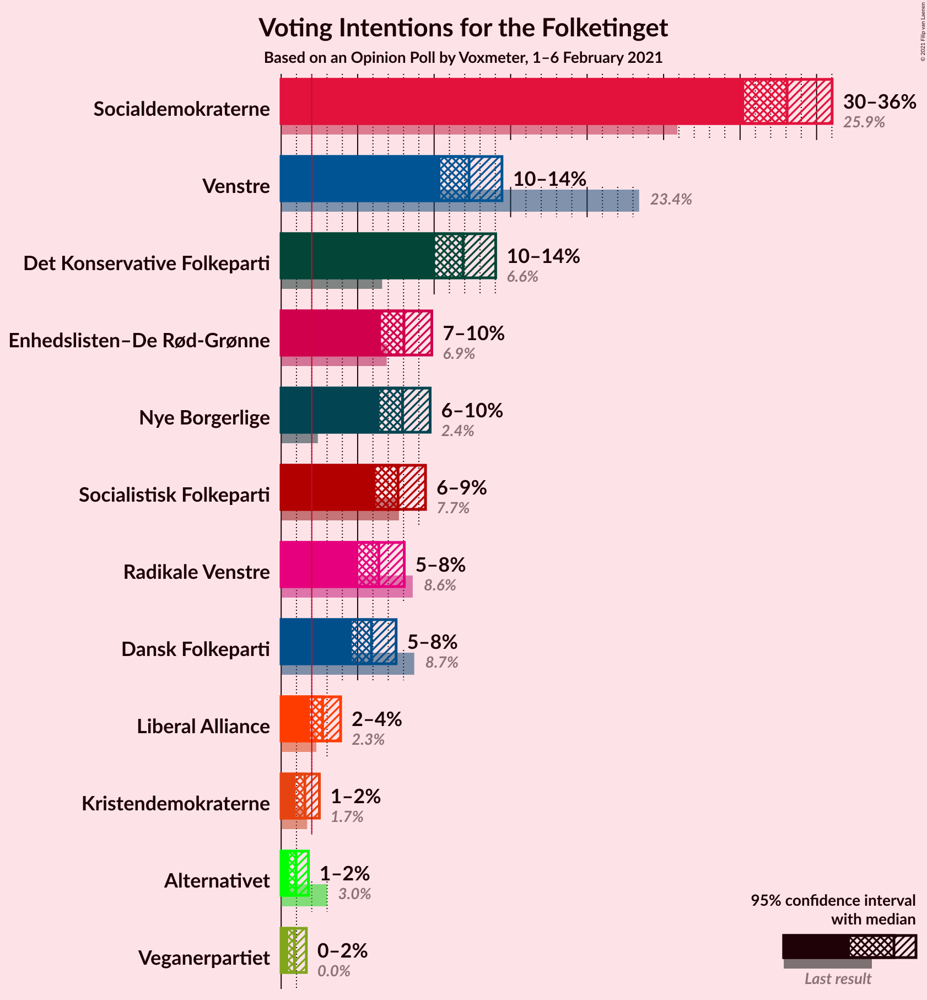

### Confidence Intervals

| Party | Last Result | Poll Result | 80% Confidence Interval | 90% Confidence Interval | 95% Confidence Interval | 99% Confidence Interval |
|:-----:|:-----------:|:-----------:|:-----------------------:|:-----------------------:|:-----------------------:|:-----------------------:|
| Socialdemokraterne | 25.9% | 33.1% | 31.2–35.0% |30.7–35.5% |30.3–36.0% |29.4–36.9% |
| Venstre | 23.4% | 12.3% | 11.1–13.7% |10.7–14.1% |10.4–14.4% |9.9–15.1% |
| Det Konservative Folkeparti | 6.6% | 11.9% | 10.7–13.3% |10.3–13.7% |10.1–14.0% |9.5–14.7% |
| Enhedslisten–De Rød-Grønne | 6.9% | 8.0% | 7.0–9.2% |6.8–9.6% |6.5–9.8% |6.1–10.5% |
| Nye Borgerlige | 2.4% | 7.9% | 6.9–9.1% |6.7–9.4% |6.4–9.7% |6.0–10.3% |
| Socialistisk Folkeparti | 7.7% | 7.6% | 6.7–8.8% |6.4–9.1% |6.2–9.4% |5.7–10.0% |
| Radikale Venstre | 8.6% | 6.4% | 5.5–7.5% |5.3–7.8% |5.0–8.0% |4.6–8.6% |
| Dansk Folkeparti | 8.7% | 5.9% | 5.1–7.0% |4.8–7.3% |4.6–7.5% |4.2–8.0% |
| Liberal Alliance | 2.3% | 2.7% | 2.2–3.5% |2.0–3.7% |1.9–3.9% |1.6–4.3% |
| Kristendemokraterne | 1.7% | 1.5% | 1.2–2.2% |1.0–2.3% |0.9–2.5% |0.8–2.8% |
| Alternativet | 3.0% | 1.0% | 0.7–1.5% |0.6–1.6% |0.5–1.8% |0.4–2.1% |
| Veganerpartiet | 0.0% | 0.9% | 0.6–1.4% |0.5–1.5% |0.5–1.6% |0.4–1.9% |

*Note:* The poll result column reflects the actual value used in the calculations. Published results may vary slightly, and in addition be rounded to fewer digits.

## Seats

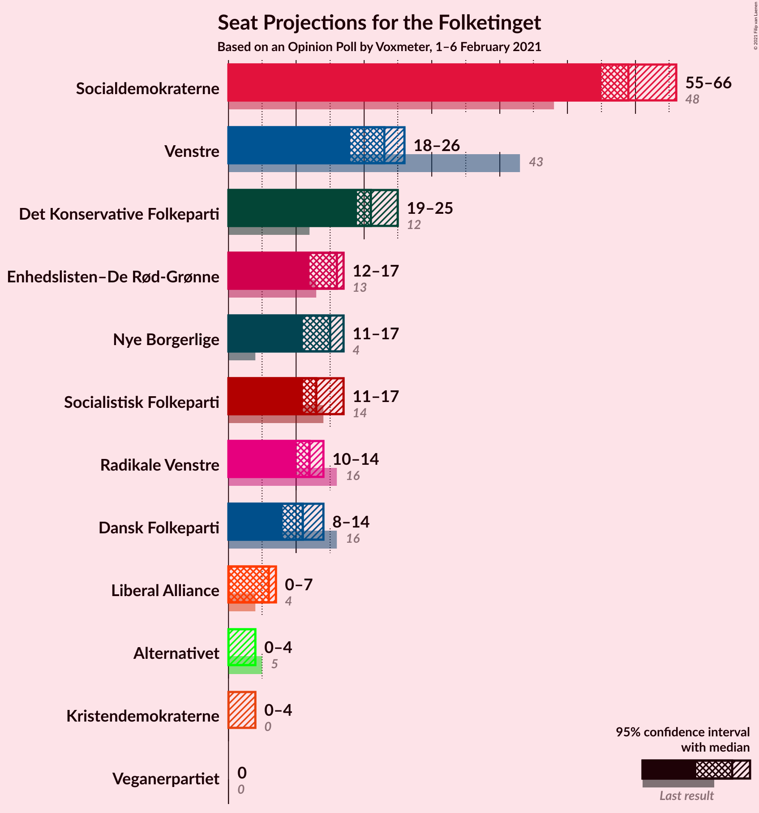

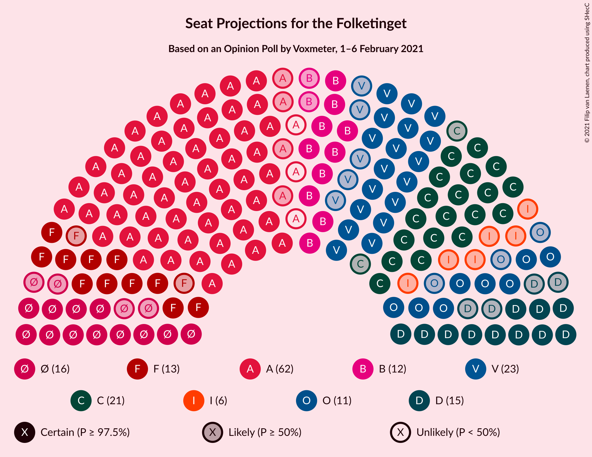

### Confidence Intervals

| Party | Last Result | Median | 80% Confidence Interval | 90% Confidence Interval | 95% Confidence Interval | 99% Confidence Interval |
|:-----:|:-----------:|:------:|:-----------------------:|:-----------------------:|:-----------------------:|:-----------------------:|
| <a href="#socialdemokraterne">Socialdemokraterne</a> | 48 | 59 | 57–63 |56–63 |55–66 |53–67 |
| <a href="#venstre">Venstre</a> | 43 | 23 | 20–24 |19–25 |18–26 |18–27 |
| <a href="#det-konservative-folkeparti">Det Konservative Folkeparti</a> | 12 | 21 | 20–24 |20–24 |19–25 |18–27 |
| <a href="#enhedslisten–de-rød-grønne">Enhedslisten–De Rød-Grønne</a> | 13 | 16 | 12–17 |12–17 |12–17 |11–18 |
| <a href="#nye-borgerlige">Nye Borgerlige</a> | 4 | 15 | 13–17 |12–17 |11–17 |11–19 |
| <a href="#socialistisk-folkeparti">Socialistisk Folkeparti</a> | 14 | 13 | 12–15 |12–16 |11–17 |11–19 |
| <a href="#radikale-venstre">Radikale Venstre</a> | 16 | 12 | 10–13 |10–14 |10–14 |9–15 |
| <a href="#dansk-folkeparti">Dansk Folkeparti</a> | 16 | 11 | 9–13 |9–13 |8–14 |8–15 |
| <a href="#liberal-alliance">Liberal Alliance</a> | 4 | 6 | 4–7 |0–7 |0–7 |0–8 |
| <a href="#kristendemokraterne">Kristendemokraterne</a> | 0 | 0 | 0 |0 |0–4 |0–5 |
| <a href="#alternativet">Alternativet</a> | 5 | 0 | 0 |0 |0–4 |0–4 |
| <a href="#veganerpartiet">Veganerpartiet</a> | 0 | 0 | 0 |0 |0 |0 |

### Socialdemokraterne

*For a full overview of the results for this party, see the [Socialdemokraterne](party-socialdemokraterne.html) page.*

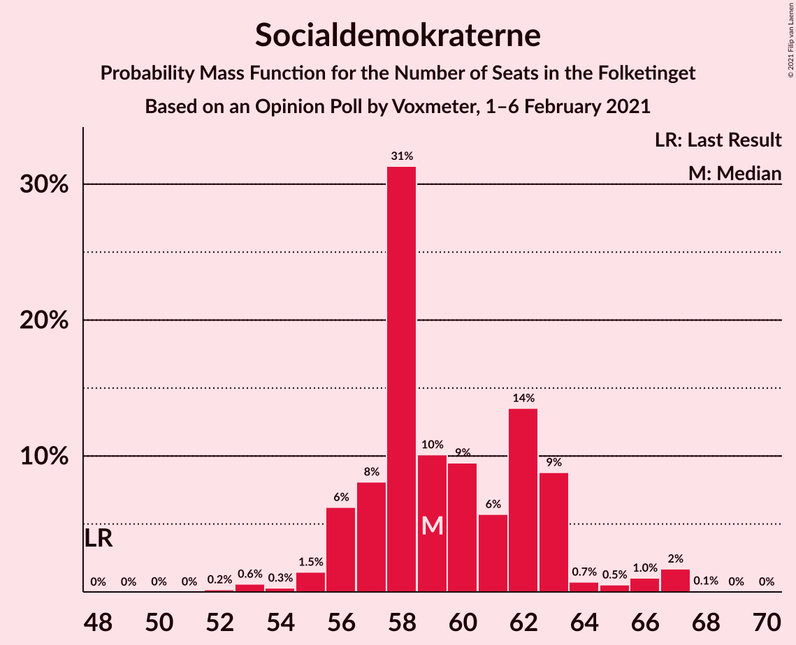

| Number of Seats | Probability | Accumulated | Special Marks |
|:---------------:|:-----------:|:-----------:|:-------------:|
| 48 | 0% | 100% | Last Result |
| 49 | 0% | 100% |  |
| 50 | 0% | 100% |  |
| 51 | 0% | 100% |  |
| 52 | 0.2% | 100% |  |
| 53 | 0.6% | 99.8% |  |
| 54 | 0.3% | 99.2% |  |
| 55 | 1.5% | 98.9% |  |
| 56 | 6% | 97% |  |
| 57 | 8% | 91% |  |
| 58 | 31% | 83% |  |
| 59 | 10% | 52% | Median |
| 60 | 9% | 42% |  |
| 61 | 6% | 32% |  |
| 62 | 14% | 26% |  |
| 63 | 9% | 13% |  |
| 64 | 0.7% | 4% |  |
| 65 | 0.5% | 3% |  |
| 66 | 1.0% | 3% |  |
| 67 | 2% | 2% |  |
| 68 | 0.1% | 0.1% |  |
| 69 | 0% | 0% |  |

### Venstre

*For a full overview of the results for this party, see the [Venstre](party-venstre.html) page.*

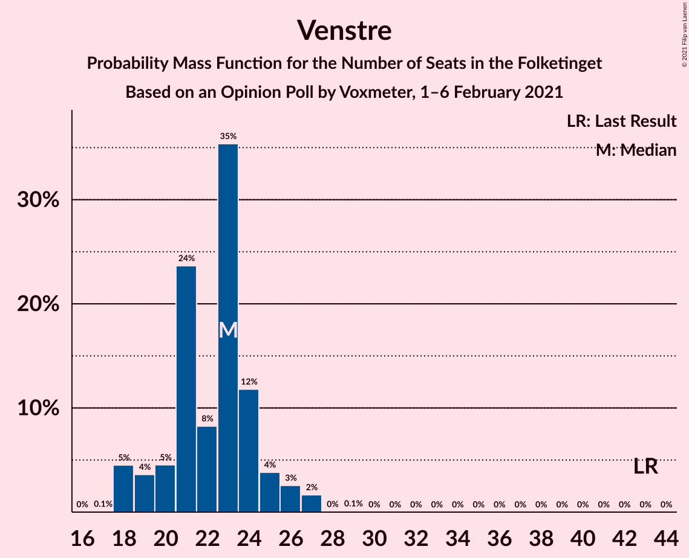

| Number of Seats | Probability | Accumulated | Special Marks |
|:---------------:|:-----------:|:-----------:|:-------------:|
| 17 | 0.1% | 100% |  |
| 18 | 5% | 99.9% |  |
| 19 | 4% | 95% |  |
| 20 | 5% | 92% |  |
| 21 | 24% | 87% |  |
| 22 | 8% | 64% |  |
| 23 | 35% | 55% | Median |
| 24 | 12% | 20% |  |
| 25 | 4% | 8% |  |
| 26 | 3% | 4% |  |
| 27 | 2% | 2% |  |
| 28 | 0% | 0.1% |  |
| 29 | 0.1% | 0.1% |  |
| 30 | 0% | 0% |  |
| 31 | 0% | 0% |  |
| 32 | 0% | 0% |  |
| 33 | 0% | 0% |  |
| 34 | 0% | 0% |  |
| 35 | 0% | 0% |  |
| 36 | 0% | 0% |  |
| 37 | 0% | 0% |  |
| 38 | 0% | 0% |  |
| 39 | 0% | 0% |  |
| 40 | 0% | 0% |  |
| 41 | 0% | 0% |  |
| 42 | 0% | 0% |  |
| 43 | 0% | 0% | Last Result |

### Det Konservative Folkeparti

*For a full overview of the results for this party, see the [Det Konservative Folkeparti](party-detkonservativefolkeparti.html) page.*

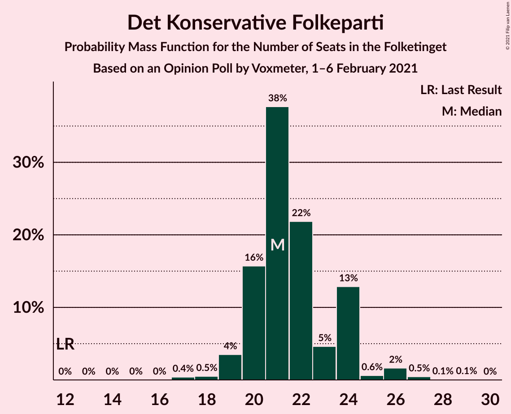

| Number of Seats | Probability | Accumulated | Special Marks |
|:---------------:|:-----------:|:-----------:|:-------------:|
| 12 | 0% | 100% | Last Result |
| 13 | 0% | 100% |  |
| 14 | 0% | 100% |  |
| 15 | 0% | 100% |  |
| 16 | 0% | 100% |  |
| 17 | 0.4% | 100% |  |
| 18 | 0.5% | 99.6% |  |
| 19 | 4% | 99.1% |  |
| 20 | 16% | 96% |  |
| 21 | 38% | 80% | Median |
| 22 | 22% | 42% |  |
| 23 | 5% | 20% |  |
| 24 | 13% | 16% |  |
| 25 | 0.6% | 3% |  |
| 26 | 2% | 2% |  |
| 27 | 0.5% | 0.6% |  |
| 28 | 0.1% | 0.1% |  |
| 29 | 0.1% | 0.1% |  |
| 30 | 0% | 0% |  |

### Enhedslisten–De Rød-Grønne

*For a full overview of the results for this party, see the [Enhedslisten–De Rød-Grønne](party-enhedslisten–derød-grønne.html) page.*

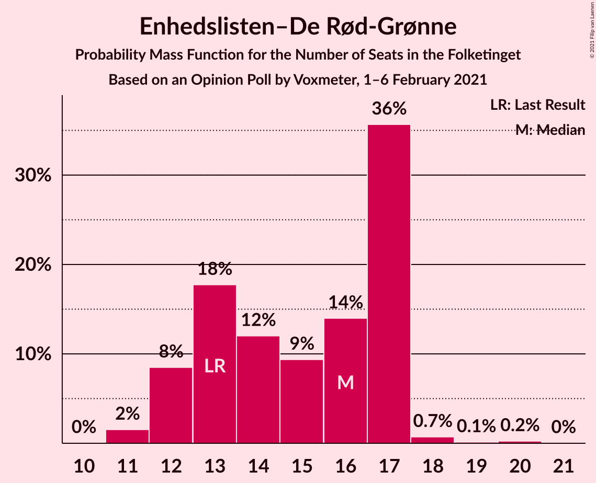

| Number of Seats | Probability | Accumulated | Special Marks |
|:---------------:|:-----------:|:-----------:|:-------------:|
| 11 | 2% | 100% |  |
| 12 | 8% | 98% |  |
| 13 | 18% | 90% | Last Result |
| 14 | 12% | 72% |  |
| 15 | 9% | 60% |  |
| 16 | 14% | 51% | Median |
| 17 | 36% | 37% |  |
| 18 | 0.7% | 1.1% |  |
| 19 | 0.1% | 0.4% |  |
| 20 | 0.2% | 0.3% |  |
| 21 | 0% | 0% |  |

### Nye Borgerlige

*For a full overview of the results for this party, see the [Nye Borgerlige](party-nyeborgerlige.html) page.*

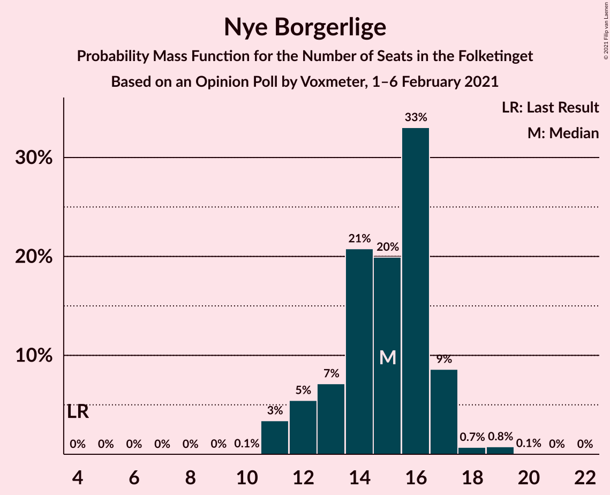

| Number of Seats | Probability | Accumulated | Special Marks |
|:---------------:|:-----------:|:-----------:|:-------------:|
| 4 | 0% | 100% | Last Result |
| 5 | 0% | 100% |  |
| 6 | 0% | 100% |  |
| 7 | 0% | 100% |  |
| 8 | 0% | 100% |  |
| 9 | 0% | 100% |  |
| 10 | 0.1% | 100% |  |
| 11 | 3% | 99.9% |  |
| 12 | 5% | 97% |  |
| 13 | 7% | 91% |  |
| 14 | 21% | 84% |  |
| 15 | 20% | 63% | Median |
| 16 | 33% | 43% |  |
| 17 | 9% | 10% |  |
| 18 | 0.7% | 2% |  |
| 19 | 0.8% | 0.9% |  |
| 20 | 0.1% | 0.1% |  |
| 21 | 0% | 0% |  |

### Socialistisk Folkeparti

*For a full overview of the results for this party, see the [Socialistisk Folkeparti](party-socialistiskfolkeparti.html) page.*

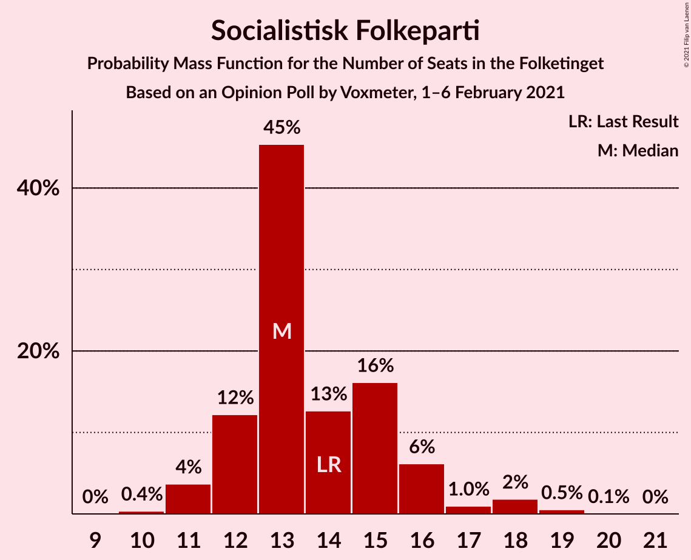

| Number of Seats | Probability | Accumulated | Special Marks |
|:---------------:|:-----------:|:-----------:|:-------------:|
| 10 | 0.4% | 100% |  |
| 11 | 4% | 99.6% |  |
| 12 | 12% | 96% |  |
| 13 | 45% | 84% | Median |
| 14 | 13% | 38% | Last Result |
| 15 | 16% | 26% |  |
| 16 | 6% | 10% |  |
| 17 | 1.0% | 3% |  |
| 18 | 2% | 2% |  |
| 19 | 0.5% | 0.6% |  |
| 20 | 0.1% | 0.1% |  |
| 21 | 0% | 0% |  |

### Radikale Venstre

*For a full overview of the results for this party, see the [Radikale Venstre](party-radikalevenstre.html) page.*

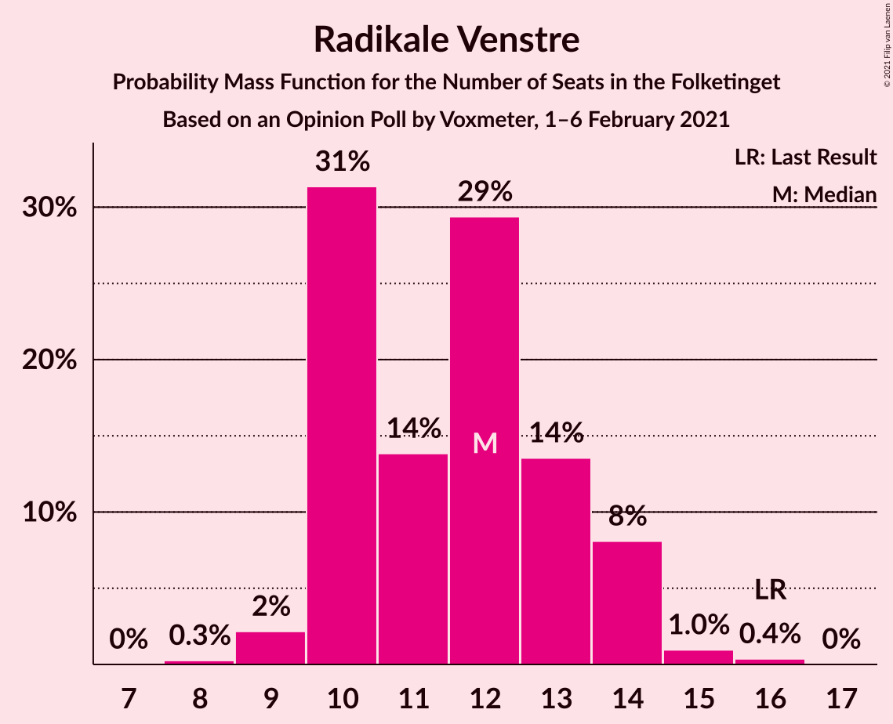

| Number of Seats | Probability | Accumulated | Special Marks |
|:---------------:|:-----------:|:-----------:|:-------------:|
| 8 | 0.3% | 100% |  |
| 9 | 2% | 99.7% |  |
| 10 | 31% | 98% |  |
| 11 | 14% | 66% |  |
| 12 | 29% | 52% | Median |
| 13 | 14% | 23% |  |
| 14 | 8% | 9% |  |
| 15 | 1.0% | 1.3% |  |
| 16 | 0.4% | 0.4% | Last Result |
| 17 | 0% | 0% |  |

### Dansk Folkeparti

*For a full overview of the results for this party, see the [Dansk Folkeparti](party-danskfolkeparti.html) page.*

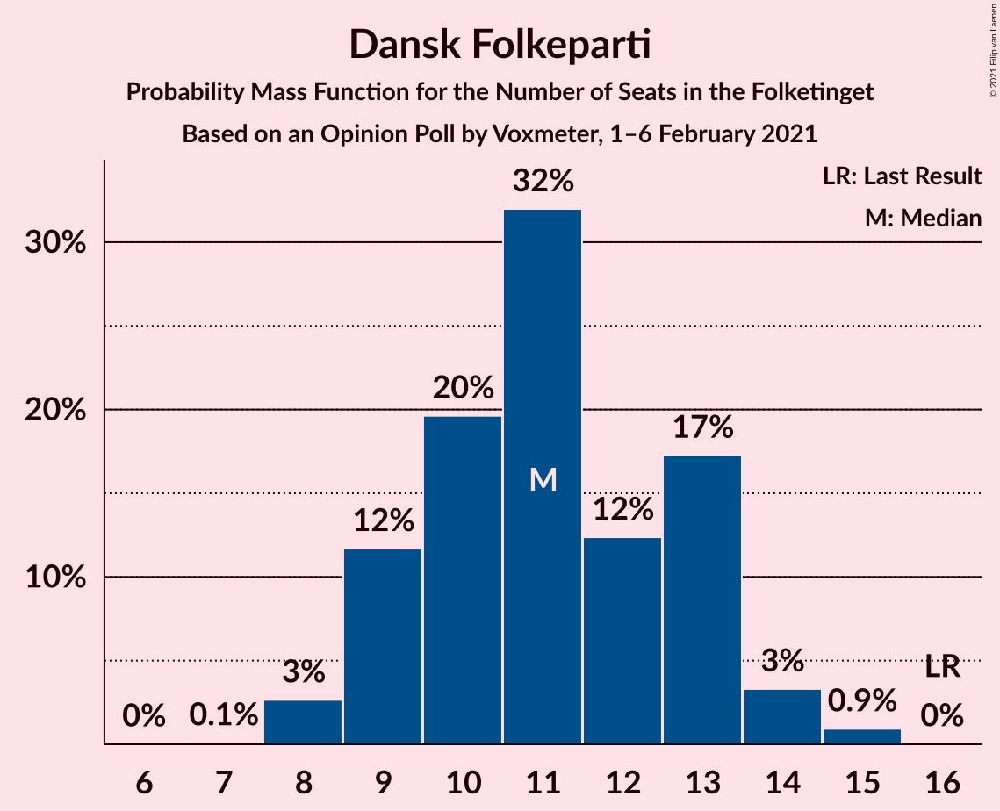

| Number of Seats | Probability | Accumulated | Special Marks |
|:---------------:|:-----------:|:-----------:|:-------------:|
| 7 | 0.1% | 100% |  |
| 8 | 3% | 99.9% |  |
| 9 | 12% | 97% |  |
| 10 | 20% | 86% |  |
| 11 | 32% | 66% | Median |
| 12 | 12% | 34% |  |
| 13 | 17% | 22% |  |
| 14 | 3% | 4% |  |
| 15 | 0.9% | 1.0% |  |
| 16 | 0% | 0% | Last Result |

### Liberal Alliance

*For a full overview of the results for this party, see the [Liberal Alliance](party-liberalalliance.html) page.*

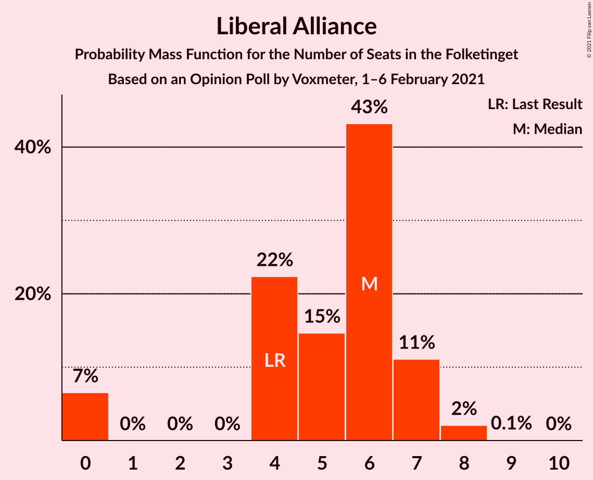

| Number of Seats | Probability | Accumulated | Special Marks |
|:---------------:|:-----------:|:-----------:|:-------------:|
| 0 | 7% | 100% |  |
| 1 | 0% | 93% |  |
| 2 | 0% | 93% |  |
| 3 | 0% | 93% |  |
| 4 | 22% | 93% | Last Result |
| 5 | 15% | 71% |  |
| 6 | 43% | 56% | Median |
| 7 | 11% | 13% |  |
| 8 | 2% | 2% |  |
| 9 | 0.1% | 0.1% |  |
| 10 | 0% | 0% |  |

### Kristendemokraterne

*For a full overview of the results for this party, see the [Kristendemokraterne](party-kristendemokraterne.html) page.*

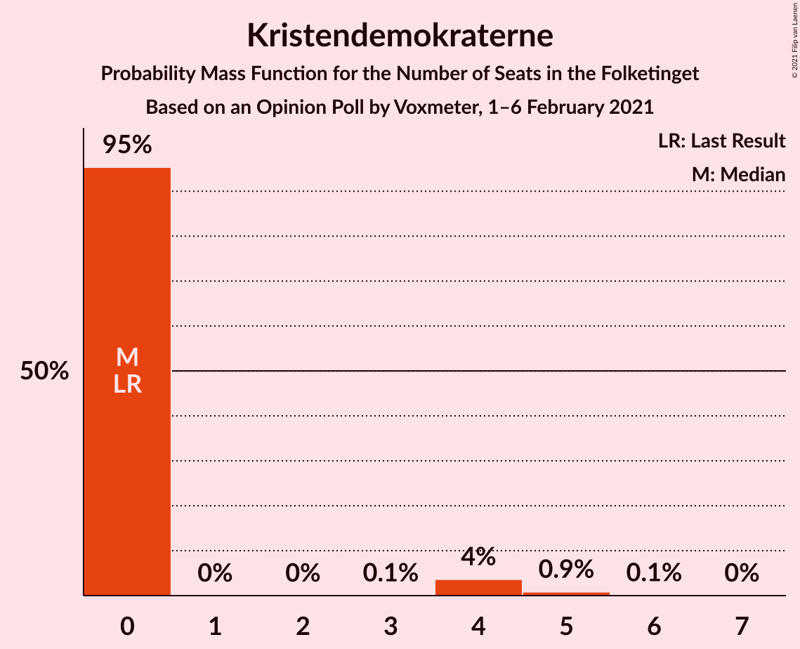

| Number of Seats | Probability | Accumulated | Special Marks |
|:---------------:|:-----------:|:-----------:|:-------------:|
| 0 | 95% | 100% | Last Result, Median |
| 1 | 0% | 5% |  |
| 2 | 0% | 5% |  |
| 3 | 0.1% | 5% |  |
| 4 | 4% | 5% |  |
| 5 | 0.9% | 1.0% |  |
| 6 | 0.1% | 0.1% |  |
| 7 | 0% | 0% |  |

### Alternativet

*For a full overview of the results for this party, see the [Alternativet](party-alternativet.html) page.*

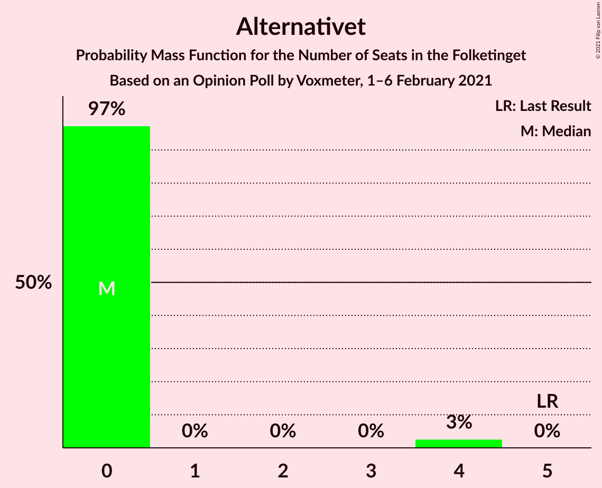

| Number of Seats | Probability | Accumulated | Special Marks |
|:---------------:|:-----------:|:-----------:|:-------------:|
| 0 | 97% | 100% | Median |
| 1 | 0% | 3% |  |
| 2 | 0% | 3% |  |
| 3 | 0% | 3% |  |
| 4 | 3% | 3% |  |
| 5 | 0% | 0% | Last Result |

### Veganerpartiet

*For a full overview of the results for this party, see the [Veganerpartiet](party-veganerpartiet.html) page.*

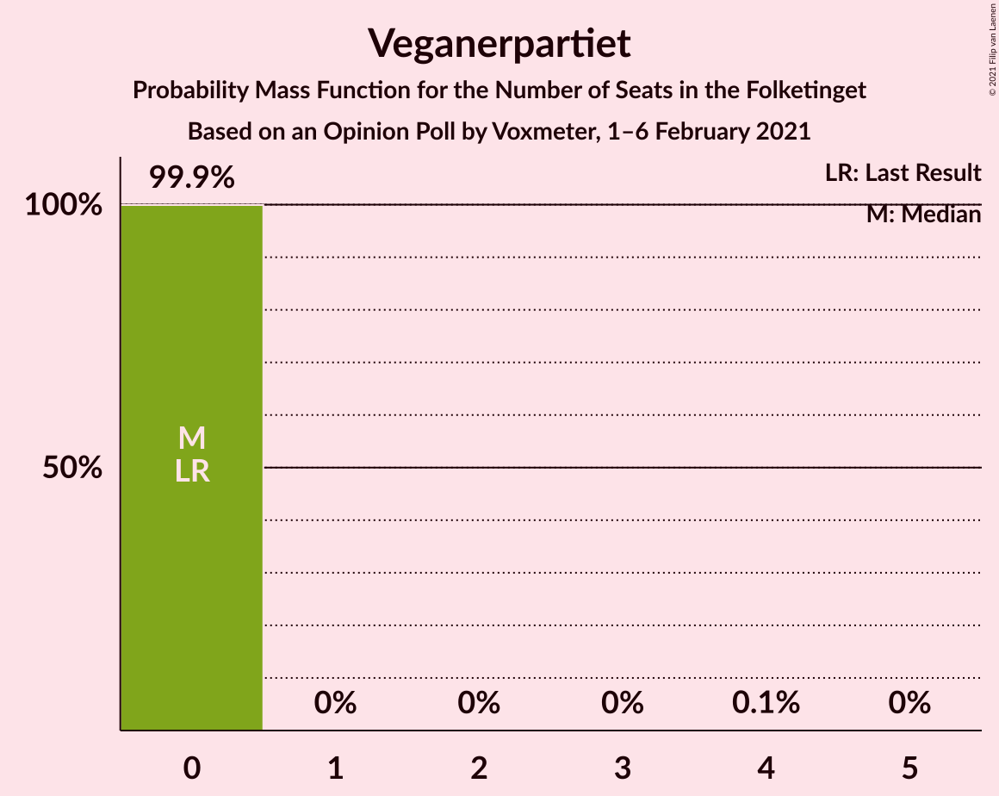

| Number of Seats | Probability | Accumulated | Special Marks |
|:---------------:|:-----------:|:-----------:|:-------------:|
| 0 | 99.9% | 100% | Last Result, Median |
| 1 | 0% | 0.1% |  |
| 2 | 0% | 0.1% |  |
| 3 | 0% | 0.1% |  |
| 4 | 0.1% | 0.1% |  |
| 5 | 0% | 0% |  |

## Coalitions

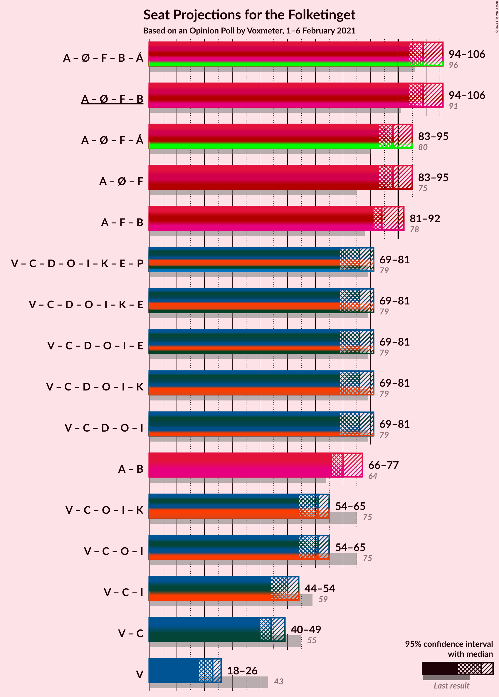

### Confidence Intervals

| Coalition | Last Result | Median | Majority? | 80% Confidence Interval | 90% Confidence Interval | 95% Confidence Interval | 99% Confidence Interval |
|:---------:|:-----------:|:------:|:---------:|:-----------------------:|:-----------------------:|:-----------------------:|:-----------------------:|
| Socialdemokraterne – Enhedslisten–De Rød-Grønne – Socialistisk Folkeparti – Radikale Venstre – Alternativet | 96 | 99 | 100% | 96–104 | 95–105 | 94–106 | 93–107 |
| Socialdemokraterne – Enhedslisten–De Rød-Grønne – Socialistisk Folkeparti – Radikale Venstre | 91 | 99 | 100% | 96–104 | 95–105 | 94–106 | 93–107 |
| Socialdemokraterne – Enhedslisten–De Rød-Grønne – Socialistisk Folkeparti – Alternativet | 80 | 88 | 38% | 84–91 | 83–92 | 83–95 | 81–95 |
| Socialdemokraterne – Enhedslisten–De Rød-Grønne – Socialistisk Folkeparti | 75 | 88 | 36% | 84–91 | 83–92 | 83–95 | 81–95 |
| Socialdemokraterne – Socialistisk Folkeparti – Radikale Venstre | 78 | 84 | 7% | 81–89 | 81–90 | 81–92 | 78–92 |
| Venstre – Det Konservative Folkeparti – Nye Borgerlige – Dansk Folkeparti – Liberal Alliance – Kristendemokraterne | 79 | 76 | 0% | 71–79 | 70–80 | 69–81 | 68–82 |
| Venstre – Det Konservative Folkeparti – Nye Borgerlige – Dansk Folkeparti – Liberal Alliance | 79 | 76 | 0% | 71–79 | 69–79 | 69–81 | 67–82 |
| Socialdemokraterne – Radikale Venstre | 64 | 70 | 0% | 68–75 | 68–76 | 66–77 | 65–79 |
| Venstre – Det Konservative Folkeparti – Dansk Folkeparti – Liberal Alliance – Kristendemokraterne | 75 | 61 | 0% | 56–63 | 54–65 | 54–65 | 53–67 |
| Venstre – Det Konservative Folkeparti – Dansk Folkeparti – Liberal Alliance | 75 | 61 | 0% | 56–63 | 54–64 | 54–65 | 53–66 |
| Venstre – Det Konservative Folkeparti – Liberal Alliance | 59 | 50 | 0% | 45–52 | 44–53 | 44–54 | 43–56 |
| Venstre – Det Konservative Folkeparti | 55 | 44 | 0% | 41–47 | 40–48 | 40–49 | 37–50 |
| Venstre | 43 | 23 | 0% | 20–24 | 19–25 | 18–26 | 18–27 |

### Socialdemokraterne – Enhedslisten–De Rød-Grønne – Socialistisk Folkeparti – Radikale Venstre – Alternativet

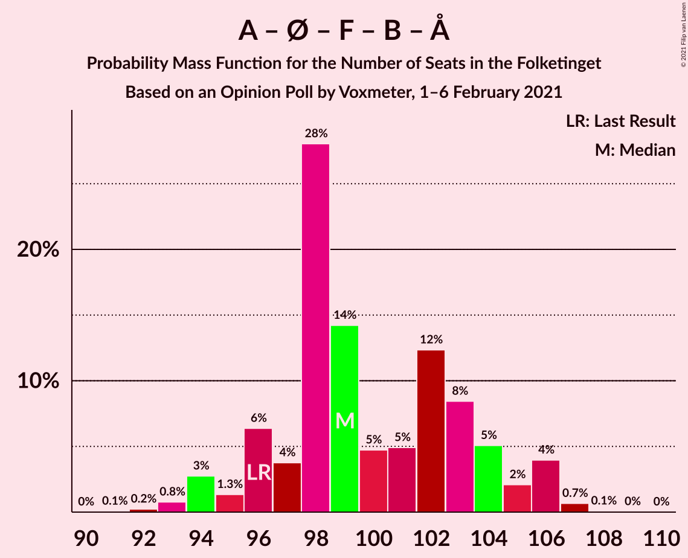

| Number of Seats | Probability | Accumulated | Special Marks |
|:---------------:|:-----------:|:-----------:|:-------------:|
| 91 | 0.1% | 100% |  |
| 92 | 0.2% | 99.9% |  |
| 93 | 0.8% | 99.7% |  |
| 94 | 3% | 98.9% |  |
| 95 | 1.3% | 96% |  |
| 96 | 6% | 95% | Last Result |
| 97 | 4% | 88% |  |
| 98 | 28% | 85% |  |
| 99 | 14% | 57% |  |
| 100 | 5% | 42% | Median |
| 101 | 5% | 38% |  |
| 102 | 12% | 33% |  |
| 103 | 8% | 20% |  |
| 104 | 5% | 12% |  |
| 105 | 2% | 7% |  |
| 106 | 4% | 5% |  |
| 107 | 0.7% | 0.8% |  |
| 108 | 0.1% | 0.2% |  |
| 109 | 0% | 0.1% |  |
| 110 | 0% | 0% |  |

### Socialdemokraterne – Enhedslisten–De Rød-Grønne – Socialistisk Folkeparti – Radikale Venstre

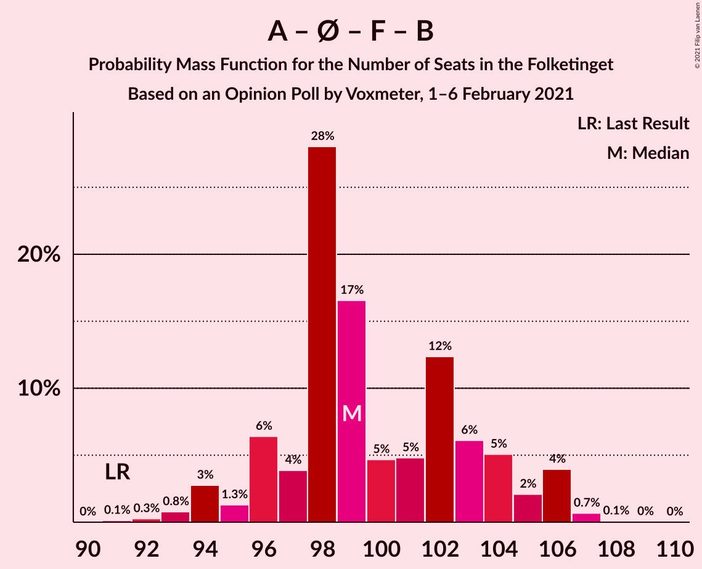

| Number of Seats | Probability | Accumulated | Special Marks |
|:---------------:|:-----------:|:-----------:|:-------------:|
| 91 | 0.1% | 100% | Last Result |
| 92 | 0.3% | 99.8% |  |
| 93 | 0.8% | 99.6% |  |
| 94 | 3% | 98.8% |  |
| 95 | 1.3% | 96% |  |
| 96 | 6% | 95% |  |
| 97 | 4% | 88% |  |
| 98 | 28% | 84% |  |
| 99 | 17% | 56% |  |
| 100 | 5% | 40% | Median |
| 101 | 5% | 35% |  |
| 102 | 12% | 30% |  |
| 103 | 6% | 18% |  |
| 104 | 5% | 12% |  |
| 105 | 2% | 7% |  |
| 106 | 4% | 5% |  |
| 107 | 0.7% | 0.8% |  |
| 108 | 0.1% | 0.1% |  |
| 109 | 0% | 0.1% |  |
| 110 | 0% | 0% |  |

### Socialdemokraterne – Enhedslisten–De Rød-Grønne – Socialistisk Folkeparti – Alternativet

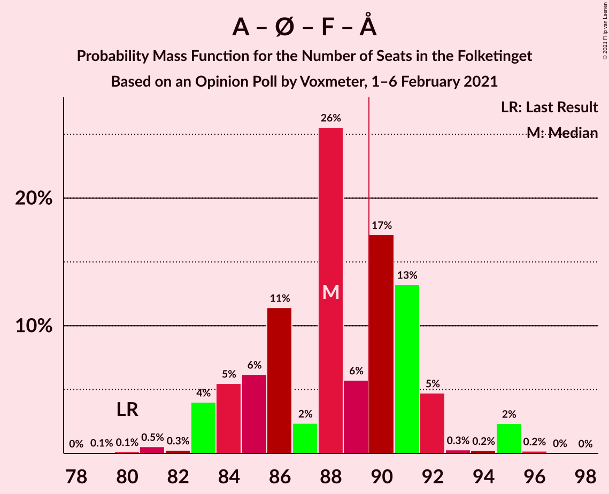

| Number of Seats | Probability | Accumulated | Special Marks |
|:---------------:|:-----------:|:-----------:|:-------------:|
| 79 | 0.1% | 100% |  |
| 80 | 0.1% | 99.9% | Last Result |
| 81 | 0.5% | 99.8% |  |
| 82 | 0.3% | 99.2% |  |
| 83 | 4% | 99.0% |  |
| 84 | 5% | 95% |  |
| 85 | 6% | 89% |  |
| 86 | 11% | 83% |  |
| 87 | 2% | 72% |  |
| 88 | 26% | 70% | Median |
| 89 | 6% | 44% |  |
| 90 | 17% | 38% | Majority |
| 91 | 13% | 21% |  |
| 92 | 5% | 8% |  |
| 93 | 0.3% | 3% |  |
| 94 | 0.2% | 3% |  |
| 95 | 2% | 3% |  |
| 96 | 0.2% | 0.3% |  |
| 97 | 0% | 0.1% |  |
| 98 | 0% | 0% |  |

### Socialdemokraterne – Enhedslisten–De Rød-Grønne – Socialistisk Folkeparti

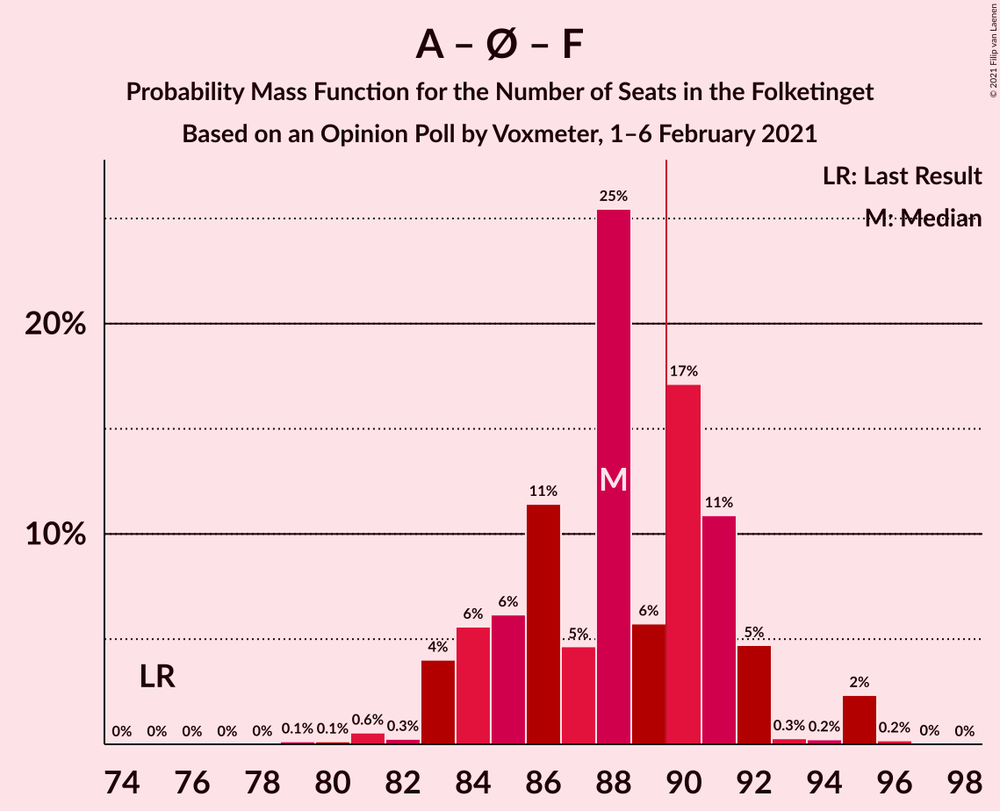

| Number of Seats | Probability | Accumulated | Special Marks |
|:---------------:|:-----------:|:-----------:|:-------------:|
| 75 | 0% | 100% | Last Result |
| 76 | 0% | 100% |  |
| 77 | 0% | 100% |  |
| 78 | 0% | 100% |  |
| 79 | 0.1% | 100% |  |
| 80 | 0.1% | 99.8% |  |
| 81 | 0.6% | 99.7% |  |
| 82 | 0.3% | 99.2% |  |
| 83 | 4% | 98.9% |  |
| 84 | 6% | 95% |  |
| 85 | 6% | 89% |  |
| 86 | 11% | 83% |  |
| 87 | 5% | 72% |  |
| 88 | 25% | 67% | Median |
| 89 | 6% | 42% |  |
| 90 | 17% | 36% | Majority |
| 91 | 11% | 19% |  |
| 92 | 5% | 8% |  |
| 93 | 0.3% | 3% |  |
| 94 | 0.2% | 3% |  |
| 95 | 2% | 3% |  |
| 96 | 0.2% | 0.2% |  |
| 97 | 0% | 0.1% |  |
| 98 | 0% | 0% |  |

### Socialdemokraterne – Socialistisk Folkeparti – Radikale Venstre

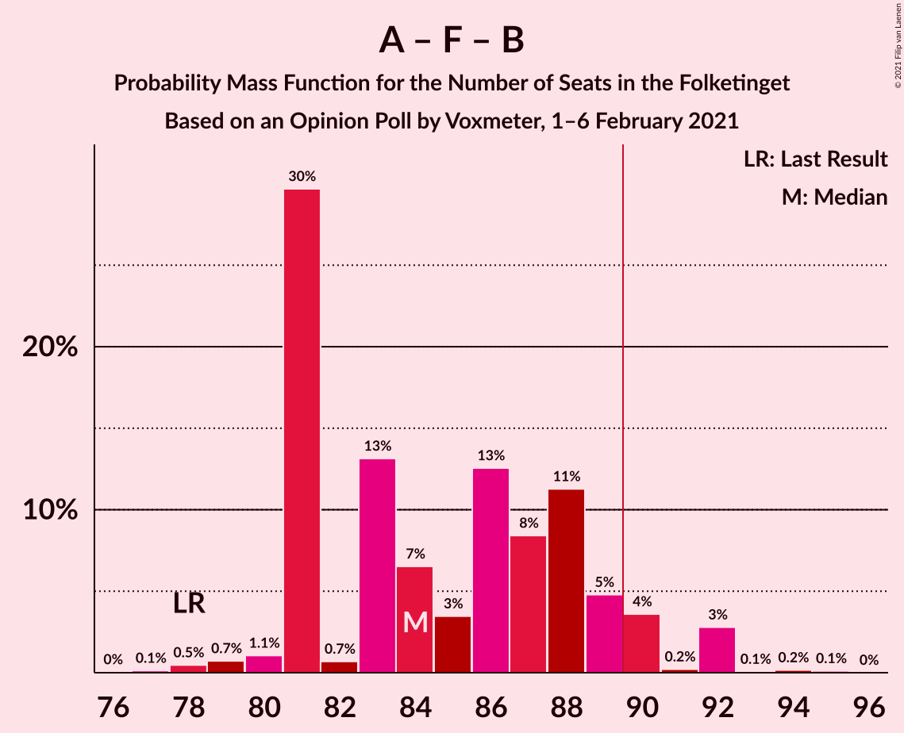

| Number of Seats | Probability | Accumulated | Special Marks |
|:---------------:|:-----------:|:-----------:|:-------------:|
| 76 | 0% | 100% |  |
| 77 | 0.1% | 99.9% |  |
| 78 | 0.5% | 99.8% | Last Result |
| 79 | 0.7% | 99.3% |  |
| 80 | 1.1% | 98.6% |  |
| 81 | 30% | 98% |  |
| 82 | 0.7% | 68% |  |
| 83 | 13% | 67% |  |
| 84 | 7% | 54% | Median |
| 85 | 3% | 47% |  |
| 86 | 13% | 44% |  |
| 87 | 8% | 31% |  |
| 88 | 11% | 23% |  |
| 89 | 5% | 12% |  |
| 90 | 4% | 7% | Majority |
| 91 | 0.2% | 3% |  |
| 92 | 3% | 3% |  |
| 93 | 0.1% | 0.4% |  |
| 94 | 0.2% | 0.3% |  |
| 95 | 0.1% | 0.1% |  |
| 96 | 0% | 0% |  |

### Venstre – Det Konservative Folkeparti – Nye Borgerlige – Dansk Folkeparti – Liberal Alliance – Kristendemokraterne

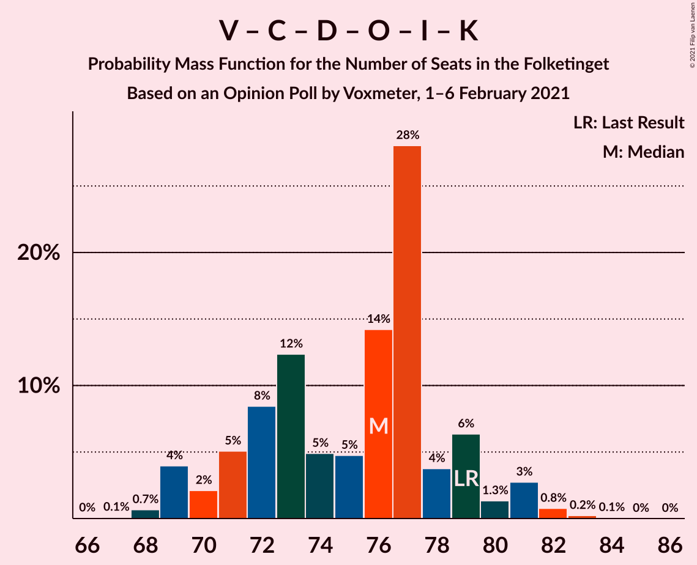

| Number of Seats | Probability | Accumulated | Special Marks |
|:---------------:|:-----------:|:-----------:|:-------------:|
| 66 | 0% | 100% |  |
| 67 | 0.1% | 99.9% |  |
| 68 | 0.7% | 99.8% |  |
| 69 | 4% | 99.2% |  |
| 70 | 2% | 95% |  |
| 71 | 5% | 93% |  |
| 72 | 8% | 88% |  |
| 73 | 12% | 80% |  |
| 74 | 5% | 67% |  |
| 75 | 5% | 62% |  |
| 76 | 14% | 58% | Median |
| 77 | 28% | 43% |  |
| 78 | 4% | 15% |  |
| 79 | 6% | 12% | Last Result |
| 80 | 1.3% | 5% |  |
| 81 | 3% | 4% |  |
| 82 | 0.8% | 1.1% |  |
| 83 | 0.2% | 0.3% |  |
| 84 | 0.1% | 0.1% |  |
| 85 | 0% | 0% |  |

### Venstre – Det Konservative Folkeparti – Nye Borgerlige – Dansk Folkeparti – Liberal Alliance

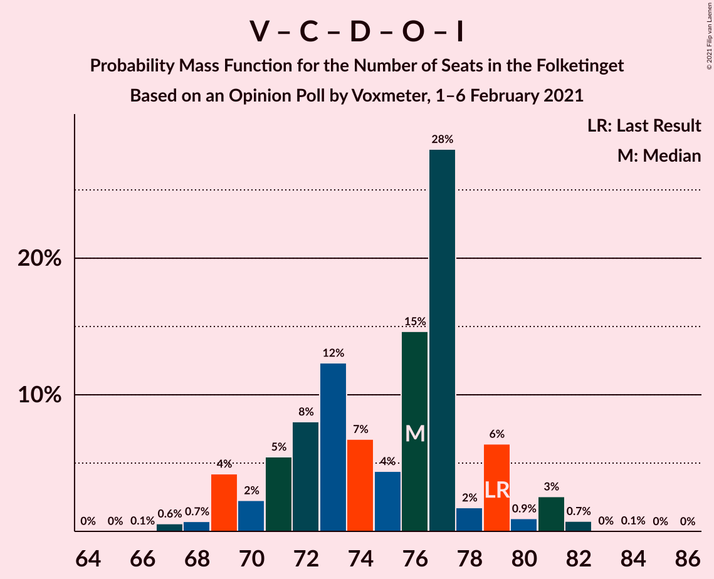

| Number of Seats | Probability | Accumulated | Special Marks |
|:---------------:|:-----------:|:-----------:|:-------------:|
| 65 | 0% | 100% |  |
| 66 | 0.1% | 99.9% |  |
| 67 | 0.6% | 99.9% |  |
| 68 | 0.7% | 99.3% |  |
| 69 | 4% | 98.6% |  |
| 70 | 2% | 94% |  |
| 71 | 5% | 92% |  |
| 72 | 8% | 87% |  |
| 73 | 12% | 79% |  |
| 74 | 7% | 66% |  |
| 75 | 4% | 60% |  |
| 76 | 15% | 55% | Median |
| 77 | 28% | 40% |  |
| 78 | 2% | 12% |  |
| 79 | 6% | 11% | Last Result |
| 80 | 0.9% | 4% |  |
| 81 | 3% | 3% |  |
| 82 | 0.7% | 0.9% |  |
| 83 | 0% | 0.1% |  |
| 84 | 0.1% | 0.1% |  |
| 85 | 0% | 0% |  |

### Socialdemokraterne – Radikale Venstre

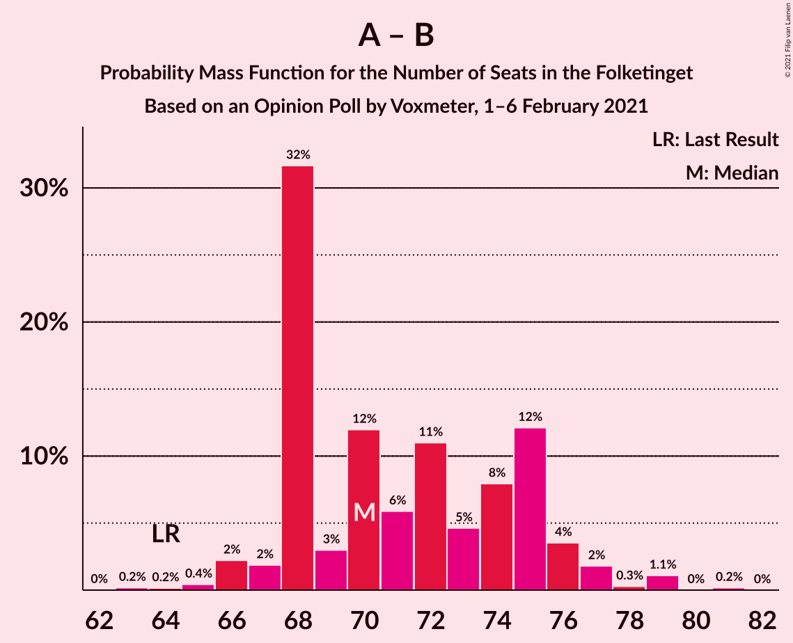

| Number of Seats | Probability | Accumulated | Special Marks |
|:---------------:|:-----------:|:-----------:|:-------------:|
| 63 | 0.2% | 100% |  |
| 64 | 0.2% | 99.8% | Last Result |
| 65 | 0.4% | 99.6% |  |
| 66 | 2% | 99.2% |  |
| 67 | 2% | 97% |  |
| 68 | 32% | 95% |  |
| 69 | 3% | 63% |  |
| 70 | 12% | 60% |  |
| 71 | 6% | 48% | Median |
| 72 | 11% | 43% |  |
| 73 | 5% | 32% |  |
| 74 | 8% | 27% |  |
| 75 | 12% | 19% |  |
| 76 | 4% | 7% |  |
| 77 | 2% | 3% |  |
| 78 | 0.3% | 2% |  |
| 79 | 1.1% | 1.3% |  |
| 80 | 0% | 0.2% |  |
| 81 | 0.2% | 0.2% |  |
| 82 | 0% | 0% |  |

### Venstre – Det Konservative Folkeparti – Dansk Folkeparti – Liberal Alliance – Kristendemokraterne

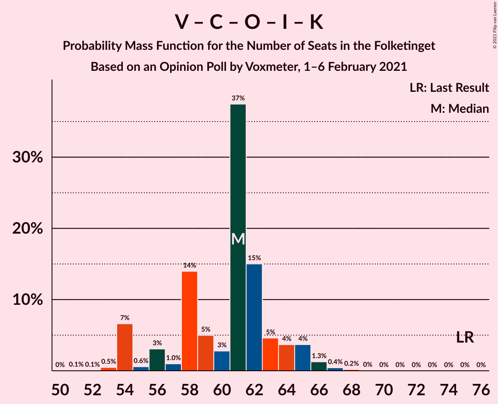

| Number of Seats | Probability | Accumulated | Special Marks |
|:---------------:|:-----------:|:-----------:|:-------------:|
| 51 | 0.1% | 100% |  |
| 52 | 0.1% | 99.9% |  |
| 53 | 0.5% | 99.9% |  |
| 54 | 7% | 99.4% |  |
| 55 | 0.6% | 93% |  |
| 56 | 3% | 92% |  |
| 57 | 1.0% | 89% |  |
| 58 | 14% | 88% |  |
| 59 | 5% | 74% |  |
| 60 | 3% | 69% |  |
| 61 | 37% | 66% | Median |
| 62 | 15% | 29% |  |
| 63 | 5% | 14% |  |
| 64 | 4% | 9% |  |
| 65 | 4% | 6% |  |
| 66 | 1.3% | 2% |  |
| 67 | 0.4% | 0.7% |  |
| 68 | 0.2% | 0.3% |  |
| 69 | 0% | 0.1% |  |
| 70 | 0% | 0% |  |
| 71 | 0% | 0% |  |
| 72 | 0% | 0% |  |
| 73 | 0% | 0% |  |
| 74 | 0% | 0% |  |
| 75 | 0% | 0% | Last Result |

### Venstre – Det Konservative Folkeparti – Dansk Folkeparti – Liberal Alliance

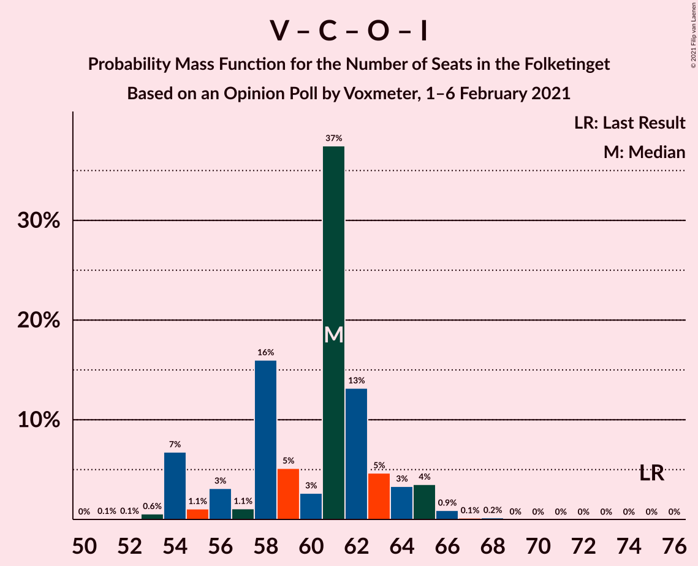

| Number of Seats | Probability | Accumulated | Special Marks |
|:---------------:|:-----------:|:-----------:|:-------------:|
| 51 | 0.1% | 100% |  |
| 52 | 0.1% | 99.9% |  |
| 53 | 0.6% | 99.8% |  |
| 54 | 7% | 99.2% |  |
| 55 | 1.1% | 92% |  |
| 56 | 3% | 91% |  |
| 57 | 1.1% | 88% |  |
| 58 | 16% | 87% |  |
| 59 | 5% | 71% |  |
| 60 | 3% | 66% |  |
| 61 | 37% | 63% | Median |
| 62 | 13% | 26% |  |
| 63 | 5% | 13% |  |
| 64 | 3% | 8% |  |
| 65 | 4% | 5% |  |
| 66 | 0.9% | 1.3% |  |
| 67 | 0.1% | 0.4% |  |
| 68 | 0.2% | 0.2% |  |
| 69 | 0% | 0% |  |
| 70 | 0% | 0% |  |
| 71 | 0% | 0% |  |
| 72 | 0% | 0% |  |
| 73 | 0% | 0% |  |
| 74 | 0% | 0% |  |
| 75 | 0% | 0% | Last Result |

### Venstre – Det Konservative Folkeparti – Liberal Alliance

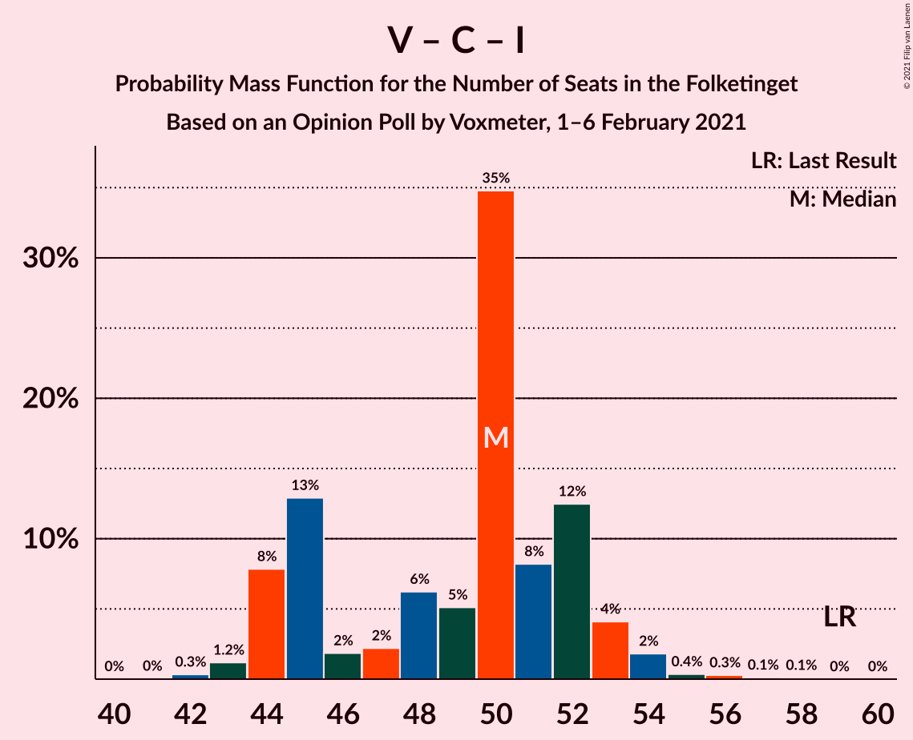

| Number of Seats | Probability | Accumulated | Special Marks |
|:---------------:|:-----------:|:-----------:|:-------------:|
| 41 | 0% | 100% |  |
| 42 | 0.3% | 99.9% |  |
| 43 | 1.2% | 99.6% |  |
| 44 | 8% | 98% |  |
| 45 | 13% | 91% |  |
| 46 | 2% | 78% |  |
| 47 | 2% | 76% |  |
| 48 | 6% | 74% |  |
| 49 | 5% | 67% |  |
| 50 | 35% | 62% | Median |
| 51 | 8% | 27% |  |
| 52 | 12% | 19% |  |
| 53 | 4% | 7% |  |
| 54 | 2% | 3% |  |
| 55 | 0.4% | 0.9% |  |
| 56 | 0.3% | 0.5% |  |
| 57 | 0.1% | 0.2% |  |
| 58 | 0.1% | 0.1% |  |
| 59 | 0% | 0% | Last Result |

### Venstre – Det Konservative Folkeparti

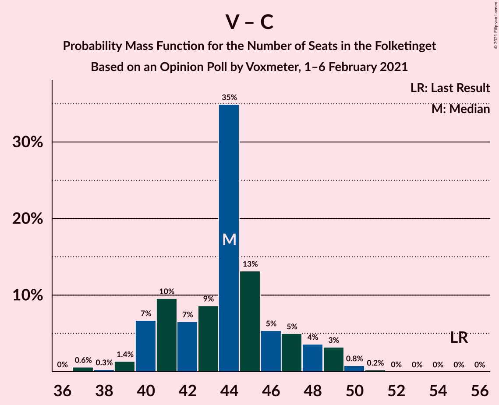

| Number of Seats | Probability | Accumulated | Special Marks |
|:---------------:|:-----------:|:-----------:|:-------------:|
| 37 | 0.6% | 100% |  |
| 38 | 0.3% | 99.4% |  |
| 39 | 1.4% | 99.1% |  |
| 40 | 7% | 98% |  |
| 41 | 10% | 91% |  |
| 42 | 7% | 81% |  |
| 43 | 9% | 75% |  |
| 44 | 35% | 66% | Median |
| 45 | 13% | 31% |  |
| 46 | 5% | 18% |  |
| 47 | 5% | 13% |  |
| 48 | 4% | 8% |  |
| 49 | 3% | 4% |  |
| 50 | 0.8% | 1.1% |  |
| 51 | 0.2% | 0.3% |  |
| 52 | 0% | 0% |  |
| 53 | 0% | 0% |  |
| 54 | 0% | 0% |  |
| 55 | 0% | 0% | Last Result |

### Venstre

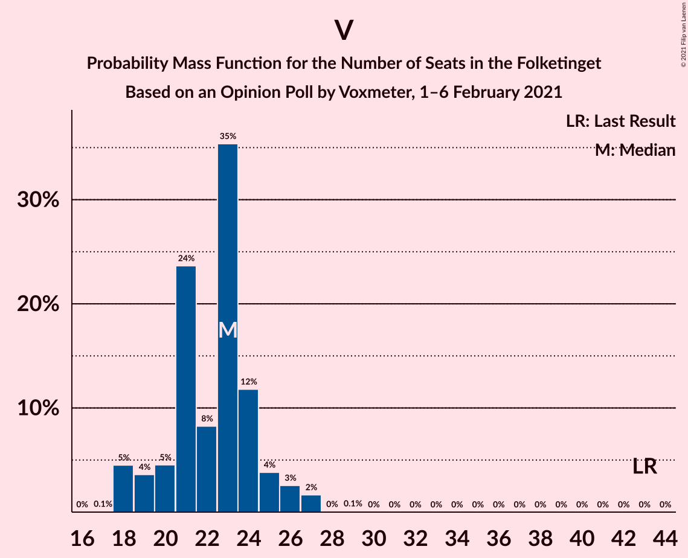

| Number of Seats | Probability | Accumulated | Special Marks |
|:---------------:|:-----------:|:-----------:|:-------------:|
| 17 | 0.1% | 100% |  |
| 18 | 5% | 99.9% |  |
| 19 | 4% | 95% |  |
| 20 | 5% | 92% |  |
| 21 | 24% | 87% |  |
| 22 | 8% | 64% |  |
| 23 | 35% | 55% | Median |
| 24 | 12% | 20% |  |
| 25 | 4% | 8% |  |
| 26 | 3% | 4% |  |
| 27 | 2% | 2% |  |
| 28 | 0% | 0.1% |  |
| 29 | 0.1% | 0.1% |  |
| 30 | 0% | 0% |  |
| 31 | 0% | 0% |  |
| 32 | 0% | 0% |  |
| 33 | 0% | 0% |  |
| 34 | 0% | 0% |  |
| 35 | 0% | 0% |  |
| 36 | 0% | 0% |  |
| 37 | 0% | 0% |  |
| 38 | 0% | 0% |  |
| 39 | 0% | 0% |  |
| 40 | 0% | 0% |  |
| 41 | 0% | 0% |  |
| 42 | 0% | 0% |  |
| 43 | 0% | 0% | Last Result |

## Technical Information

### Opinion Poll

+ **Polling firm:** Voxmeter
+ **Commissioner(s):** —
+ **Fieldwork period:** 1–6 February 2021

### Calculations

+ **Sample size:** 1034
+ **Simulations done:** 1,048,576
+ **Error estimate:** 2.33%

