# Opinion Poll by YouGov for B.T., 5–8 February 2021

<a href="#voting-intentions">Voting Intentions</a> | <a href="#seats">Seats</a> | <a href="#coalitions">Coalitions</a> | <a href="#technical-information">Technical Information</a>

## Voting Intentions

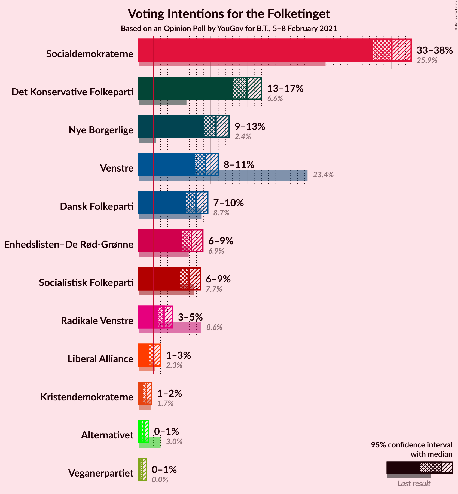

### Confidence Intervals

| Party | Last Result | Poll Result | 80% Confidence Interval | 90% Confidence Interval | 95% Confidence Interval | 99% Confidence Interval |
|:-----:|:-----------:|:-----------:|:-----------------------:|:-----------------------:|:-----------------------:|:-----------------------:|
| Socialdemokraterne | 25.9% | 35.1% | 33.4–36.9% |32.9–37.4% |32.5–37.8% |31.7–38.6% |
| Det Konservative Folkeparti | 6.6% | 15.0% | 13.7–16.3% |13.4–16.7% |13.1–17.1% |12.5–17.7% |
| Nye Borgerlige | 2.4% | 10.7% | 9.6–11.9% |9.4–12.2% |9.1–12.5% |8.6–13.1% |
| Venstre | 23.4% | 9.3% | 8.3–10.4% |8.0–10.7% |7.8–11.0% |7.3–11.6% |
| Dansk Folkeparti | 8.7% | 7.9% | 7.0–9.0% |6.8–9.3% |6.6–9.6% |6.1–10.1% |
| Enhedslisten–De Rød-Grønne | 6.9% | 7.3% | 6.4–8.3% |6.2–8.6% |6.0–8.9% |5.6–9.4% |
| Socialistisk Folkeparti | 7.7% | 7.0% | 6.1–8.0% |5.9–8.3% |5.7–8.5% |5.3–9.0% |
| Radikale Venstre | 8.6% | 3.5% | 2.9–4.3% |2.7–4.5% |2.6–4.6% |2.3–5.0% |
| Liberal Alliance | 2.3% | 2.1% | 1.6–2.7% |1.5–2.9% |1.4–3.0% |1.2–3.3% |
| Kristendemokraterne | 1.7% | 1.0% | 0.7–1.5% |0.7–1.6% |0.6–1.8% |0.5–2.0% |
| Alternativet | 3.0% | 0.7% | 0.5–1.1% |0.4–1.2% |0.4–1.4% |0.3–1.6% |
| Veganerpartiet | 0.0% | 0.5% | 0.3–0.8% |0.3–0.9% |0.2–1.0% |0.2–1.2% |

*Note:* The poll result column reflects the actual value used in the calculations. Published results may vary slightly, and in addition be rounded to fewer digits.

## Seats

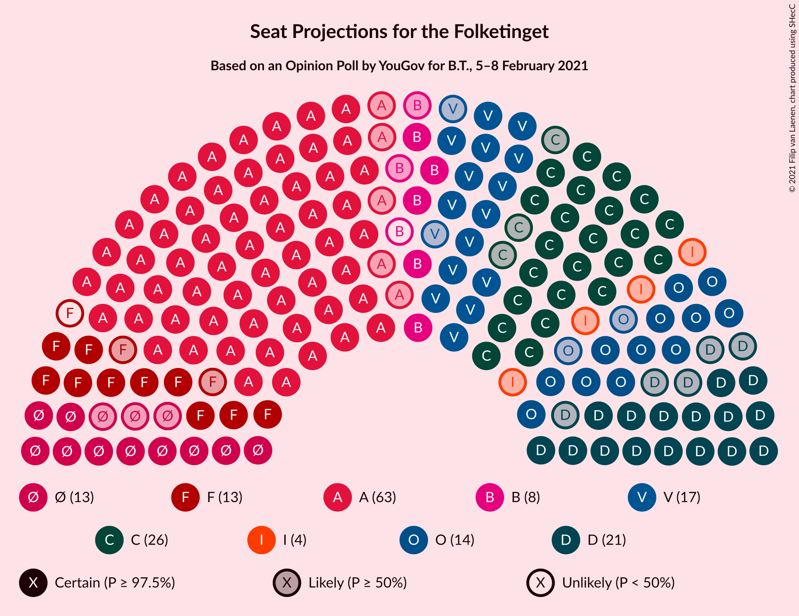

### Confidence Intervals

| Party | Last Result | Median | 80% Confidence Interval | 90% Confidence Interval | 95% Confidence Interval | 99% Confidence Interval |
|:-----:|:-----------:|:------:|:-----------------------:|:-----------------------:|:-----------------------:|:-----------------------:|
| <a href="#socialdemokraterne">Socialdemokraterne</a> | 48 | 63 | 60–65 |59–65 |58–65 |56–68 |
| <a href="#det-konservative-folkeparti">Det Konservative Folkeparti</a> | 12 | 26 | 25–29 |23–30 |23–32 |22–33 |
| <a href="#nye-borgerlige">Nye Borgerlige</a> | 4 | 21 | 19–21 |17–21 |16–22 |16–23 |
| <a href="#venstre">Venstre</a> | 43 | 17 | 16–18 |15–19 |15–19 |14–21 |
| <a href="#dansk-folkeparti">Dansk Folkeparti</a> | 16 | 14 | 12–15 |12–16 |12–17 |12–19 |
| <a href="#enhedslisten–de-rød-grønne">Enhedslisten–De Rød-Grønne</a> | 13 | 13 | 11–14 |11–15 |10–16 |10–17 |
| <a href="#socialistisk-folkeparti">Socialistisk Folkeparti</a> | 14 | 12 | 11–13 |11–14 |10–14 |10–16 |
| <a href="#radikale-venstre">Radikale Venstre</a> | 16 | 7 | 5–8 |5–8 |5–8 |4–10 |
| <a href="#liberal-alliance">Liberal Alliance</a> | 4 | 4 | 0–5 |0–5 |0–5 |0–6 |
| <a href="#kristendemokraterne">Kristendemokraterne</a> | 0 | 0 | 0 |0 |0 |0–4 |
| <a href="#alternativet">Alternativet</a> | 5 | 0 | 0 |0 |0 |0 |
| <a href="#veganerpartiet">Veganerpartiet</a> | 0 | 0 | 0 |0 |0 |0 |

### Socialdemokraterne

*For a full overview of the results for this party, see the [Socialdemokraterne](party-socialdemokraterne.html) page.*

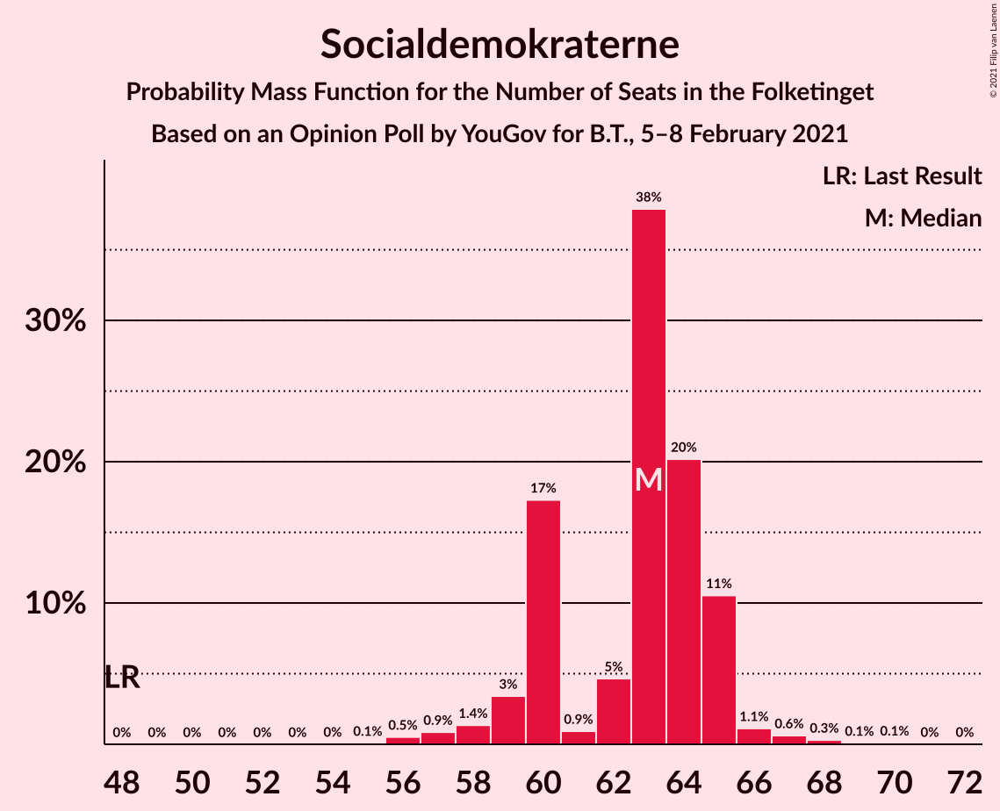

| Number of Seats | Probability | Accumulated | Special Marks |
|:---------------:|:-----------:|:-----------:|:-------------:|
| 48 | 0% | 100% | Last Result |
| 49 | 0% | 100% |  |
| 50 | 0% | 100% |  |
| 51 | 0% | 100% |  |
| 52 | 0% | 100% |  |
| 53 | 0% | 100% |  |
| 54 | 0% | 100% |  |
| 55 | 0.1% | 100% |  |
| 56 | 0.5% | 99.9% |  |
| 57 | 0.9% | 99.4% |  |
| 58 | 1.4% | 98.5% |  |
| 59 | 3% | 97% |  |
| 60 | 17% | 94% |  |
| 61 | 0.9% | 76% |  |
| 62 | 5% | 76% |  |
| 63 | 38% | 71% | Median |
| 64 | 20% | 33% |  |
| 65 | 11% | 13% |  |
| 66 | 1.1% | 2% |  |
| 67 | 0.6% | 1.1% |  |
| 68 | 0.3% | 0.5% |  |
| 69 | 0.1% | 0.2% |  |
| 70 | 0.1% | 0.1% |  |
| 71 | 0% | 0% |  |

### Det Konservative Folkeparti

*For a full overview of the results for this party, see the [Det Konservative Folkeparti](party-detkonservativefolkeparti.html) page.*

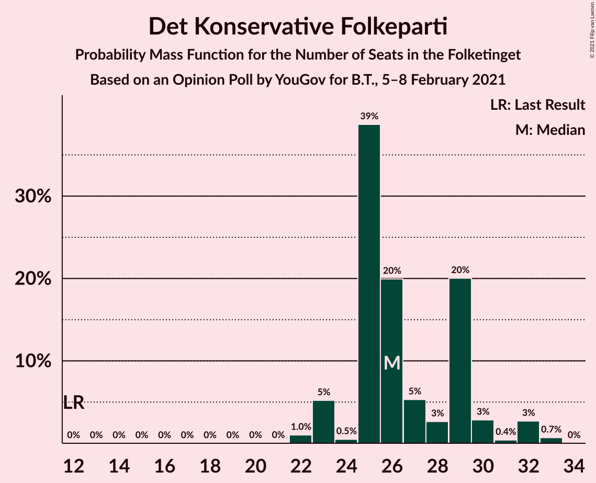

| Number of Seats | Probability | Accumulated | Special Marks |
|:---------------:|:-----------:|:-----------:|:-------------:|
| 12 | 0% | 100% | Last Result |
| 13 | 0% | 100% |  |
| 14 | 0% | 100% |  |
| 15 | 0% | 100% |  |
| 16 | 0% | 100% |  |
| 17 | 0% | 100% |  |
| 18 | 0% | 100% |  |
| 19 | 0% | 100% |  |
| 20 | 0% | 100% |  |
| 21 | 0% | 100% |  |
| 22 | 1.0% | 100% |  |
| 23 | 5% | 99.0% |  |
| 24 | 0.5% | 94% |  |
| 25 | 39% | 93% |  |
| 26 | 20% | 55% | Median |
| 27 | 5% | 35% |  |
| 28 | 3% | 29% |  |
| 29 | 20% | 27% |  |
| 30 | 3% | 7% |  |
| 31 | 0.4% | 4% |  |
| 32 | 3% | 3% |  |
| 33 | 0.7% | 0.7% |  |
| 34 | 0% | 0% |  |

### Nye Borgerlige

*For a full overview of the results for this party, see the [Nye Borgerlige](party-nyeborgerlige.html) page.*

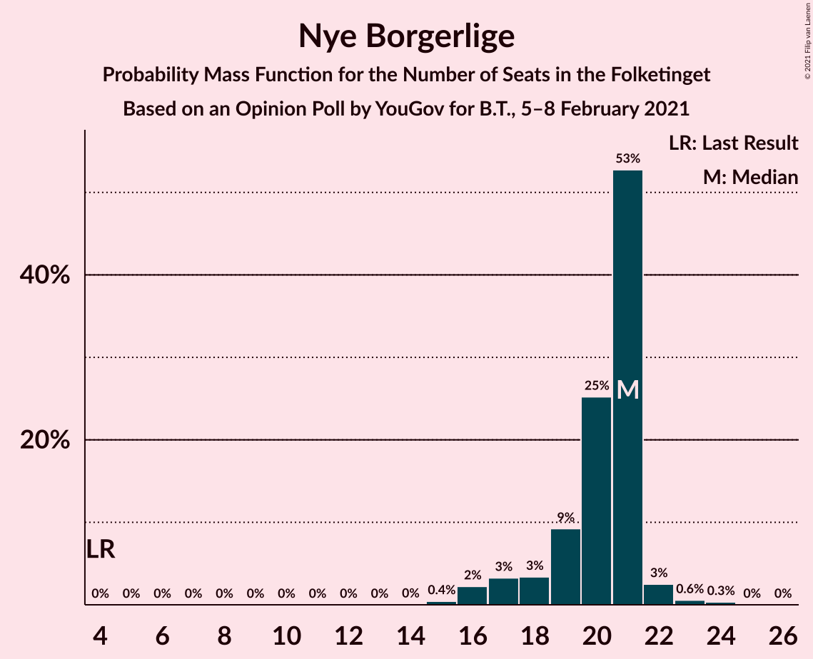

| Number of Seats | Probability | Accumulated | Special Marks |
|:---------------:|:-----------:|:-----------:|:-------------:|
| 4 | 0% | 100% | Last Result |
| 5 | 0% | 100% |  |
| 6 | 0% | 100% |  |
| 7 | 0% | 100% |  |
| 8 | 0% | 100% |  |
| 9 | 0% | 100% |  |
| 10 | 0% | 100% |  |
| 11 | 0% | 100% |  |
| 12 | 0% | 100% |  |
| 13 | 0% | 100% |  |
| 14 | 0% | 100% |  |
| 15 | 0.4% | 100% |  |
| 16 | 2% | 99.5% |  |
| 17 | 3% | 97% |  |
| 18 | 3% | 94% |  |
| 19 | 9% | 91% |  |
| 20 | 25% | 81% |  |
| 21 | 53% | 56% | Median |
| 22 | 3% | 3% |  |
| 23 | 0.6% | 0.9% |  |
| 24 | 0.3% | 0.4% |  |
| 25 | 0% | 0% |  |

### Venstre

*For a full overview of the results for this party, see the [Venstre](party-venstre.html) page.*

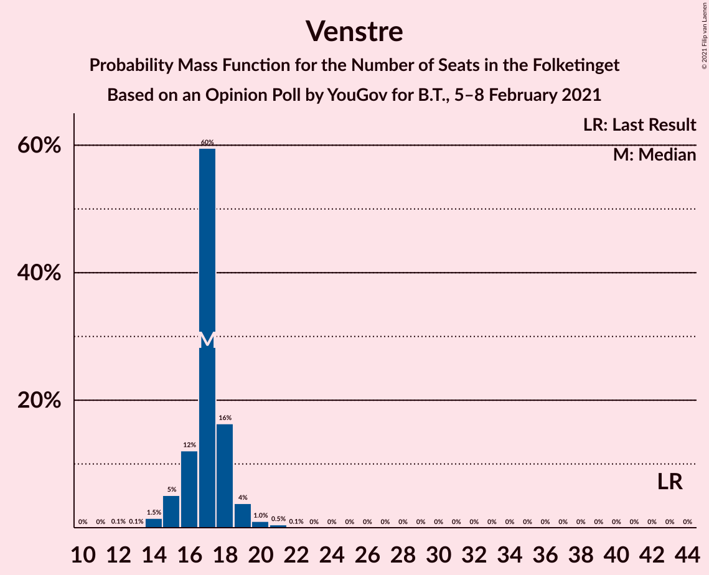

| Number of Seats | Probability | Accumulated | Special Marks |
|:---------------:|:-----------:|:-----------:|:-------------:|
| 12 | 0.1% | 100% |  |
| 13 | 0.1% | 99.9% |  |
| 14 | 1.5% | 99.9% |  |
| 15 | 5% | 98% |  |
| 16 | 12% | 93% |  |
| 17 | 60% | 81% | Median |
| 18 | 16% | 22% |  |
| 19 | 4% | 5% |  |
| 20 | 1.0% | 2% |  |
| 21 | 0.5% | 0.5% |  |
| 22 | 0.1% | 0.1% |  |
| 23 | 0% | 0% |  |
| 24 | 0% | 0% |  |
| 25 | 0% | 0% |  |
| 26 | 0% | 0% |  |
| 27 | 0% | 0% |  |
| 28 | 0% | 0% |  |
| 29 | 0% | 0% |  |
| 30 | 0% | 0% |  |
| 31 | 0% | 0% |  |
| 32 | 0% | 0% |  |
| 33 | 0% | 0% |  |
| 34 | 0% | 0% |  |
| 35 | 0% | 0% |  |
| 36 | 0% | 0% |  |
| 37 | 0% | 0% |  |
| 38 | 0% | 0% |  |
| 39 | 0% | 0% |  |
| 40 | 0% | 0% |  |
| 41 | 0% | 0% |  |
| 42 | 0% | 0% |  |
| 43 | 0% | 0% | Last Result |

### Dansk Folkeparti

*For a full overview of the results for this party, see the [Dansk Folkeparti](party-danskfolkeparti.html) page.*

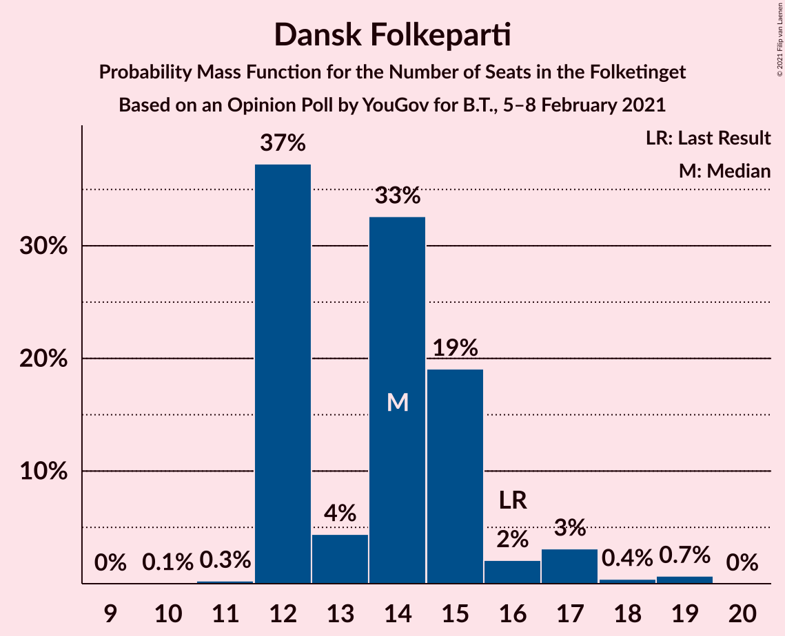

| Number of Seats | Probability | Accumulated | Special Marks |
|:---------------:|:-----------:|:-----------:|:-------------:|
| 10 | 0.1% | 100% |  |
| 11 | 0.3% | 99.9% |  |
| 12 | 37% | 99.7% |  |
| 13 | 4% | 62% |  |
| 14 | 33% | 58% | Median |
| 15 | 19% | 25% |  |
| 16 | 2% | 6% | Last Result |
| 17 | 3% | 4% |  |
| 18 | 0.4% | 1.1% |  |
| 19 | 0.7% | 0.7% |  |
| 20 | 0% | 0% |  |

### Enhedslisten–De Rød-Grønne

*For a full overview of the results for this party, see the [Enhedslisten–De Rød-Grønne](party-enhedslisten–derød-grønne.html) page.*

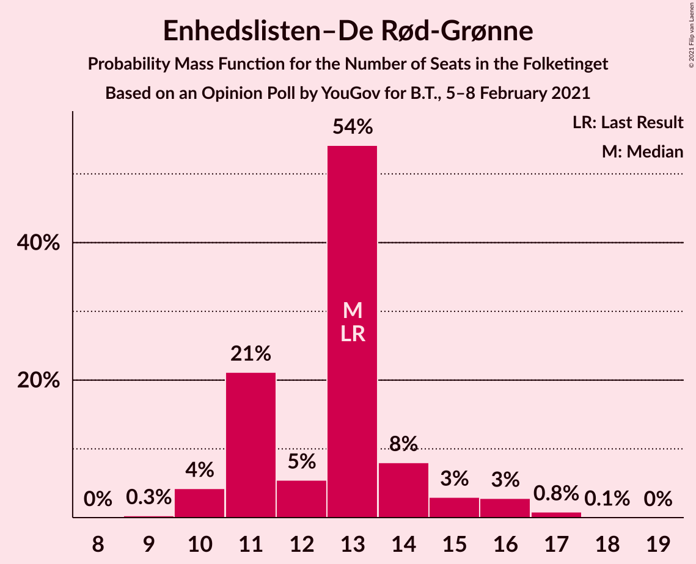

| Number of Seats | Probability | Accumulated | Special Marks |
|:---------------:|:-----------:|:-----------:|:-------------:|
| 9 | 0.3% | 100% |  |
| 10 | 4% | 99.7% |  |
| 11 | 21% | 95% |  |
| 12 | 5% | 74% |  |
| 13 | 54% | 69% | Last Result, Median |
| 14 | 8% | 15% |  |
| 15 | 3% | 7% |  |
| 16 | 3% | 4% |  |
| 17 | 0.8% | 0.9% |  |
| 18 | 0.1% | 0.1% |  |
| 19 | 0% | 0% |  |

### Socialistisk Folkeparti

*For a full overview of the results for this party, see the [Socialistisk Folkeparti](party-socialistiskfolkeparti.html) page.*

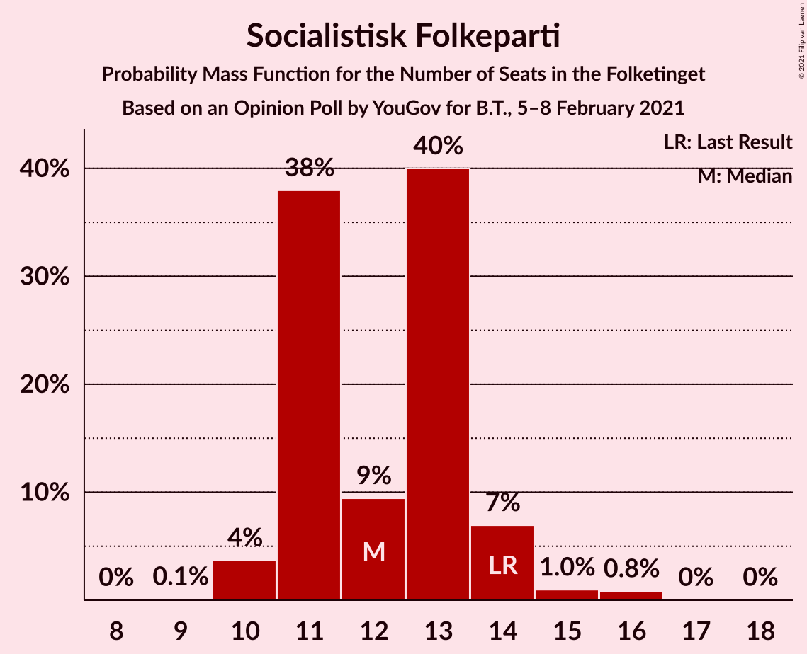

| Number of Seats | Probability | Accumulated | Special Marks |
|:---------------:|:-----------:|:-----------:|:-------------:|
| 9 | 0.1% | 100% |  |
| 10 | 4% | 99.9% |  |
| 11 | 38% | 96% |  |
| 12 | 9% | 58% | Median |
| 13 | 40% | 49% |  |
| 14 | 7% | 9% | Last Result |
| 15 | 1.0% | 2% |  |
| 16 | 0.8% | 0.9% |  |
| 17 | 0% | 0.1% |  |
| 18 | 0% | 0% |  |

### Radikale Venstre

*For a full overview of the results for this party, see the [Radikale Venstre](party-radikalevenstre.html) page.*

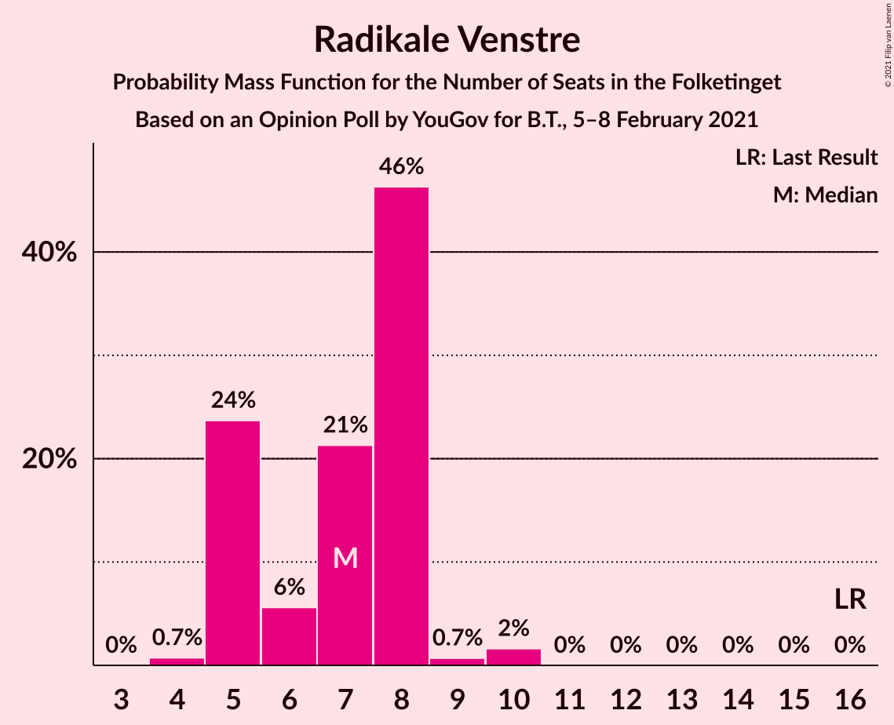

| Number of Seats | Probability | Accumulated | Special Marks |
|:---------------:|:-----------:|:-----------:|:-------------:|
| 4 | 0.7% | 100% |  |
| 5 | 24% | 99.2% |  |
| 6 | 6% | 76% |  |
| 7 | 21% | 70% | Median |
| 8 | 46% | 49% |  |
| 9 | 0.7% | 2% |  |
| 10 | 2% | 2% |  |
| 11 | 0% | 0% |  |
| 12 | 0% | 0% |  |
| 13 | 0% | 0% |  |
| 14 | 0% | 0% |  |
| 15 | 0% | 0% |  |
| 16 | 0% | 0% | Last Result |

### Liberal Alliance

*For a full overview of the results for this party, see the [Liberal Alliance](party-liberalalliance.html) page.*

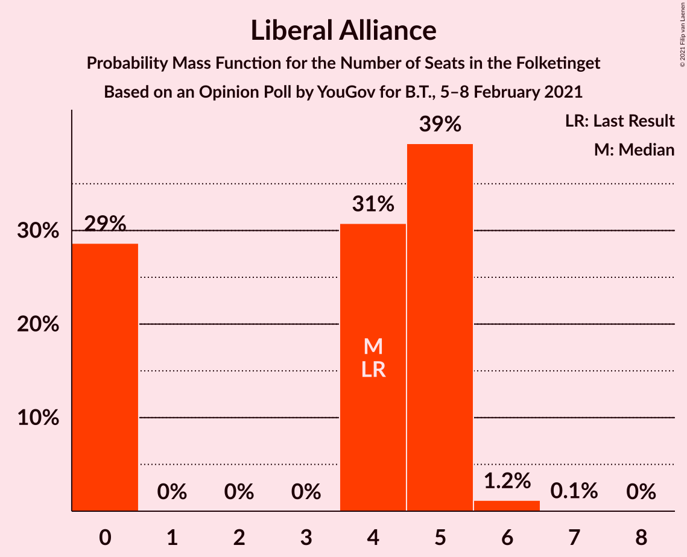

| Number of Seats | Probability | Accumulated | Special Marks |
|:---------------:|:-----------:|:-----------:|:-------------:|
| 0 | 29% | 100% |  |
| 1 | 0% | 71% |  |
| 2 | 0% | 71% |  |
| 3 | 0% | 71% |  |
| 4 | 31% | 71% | Last Result, Median |
| 5 | 39% | 41% |  |
| 6 | 1.2% | 1.3% |  |
| 7 | 0.1% | 0.1% |  |
| 8 | 0% | 0% |  |

### Kristendemokraterne

*For a full overview of the results for this party, see the [Kristendemokraterne](party-kristendemokraterne.html) page.*

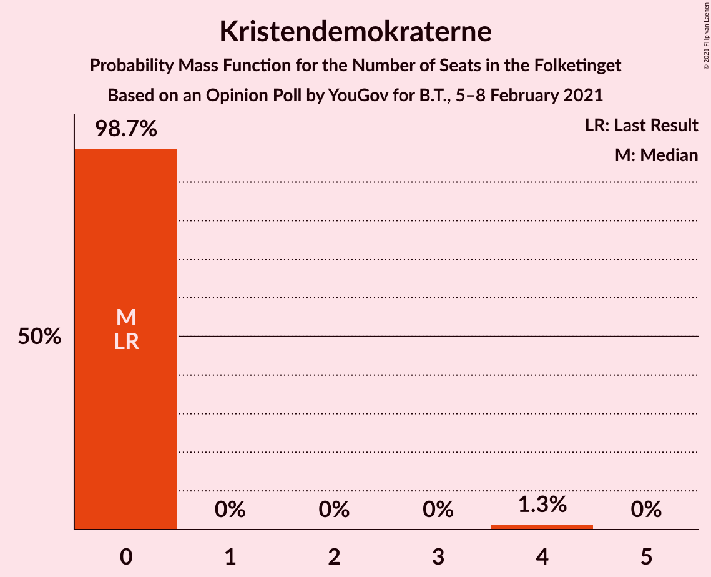

| Number of Seats | Probability | Accumulated | Special Marks |
|:---------------:|:-----------:|:-----------:|:-------------:|
| 0 | 98.7% | 100% | Last Result, Median |
| 1 | 0% | 1.3% |  |
| 2 | 0% | 1.3% |  |
| 3 | 0% | 1.3% |  |
| 4 | 1.3% | 1.3% |  |
| 5 | 0% | 0% |  |

### Alternativet

*For a full overview of the results for this party, see the [Alternativet](party-alternativet.html) page.*

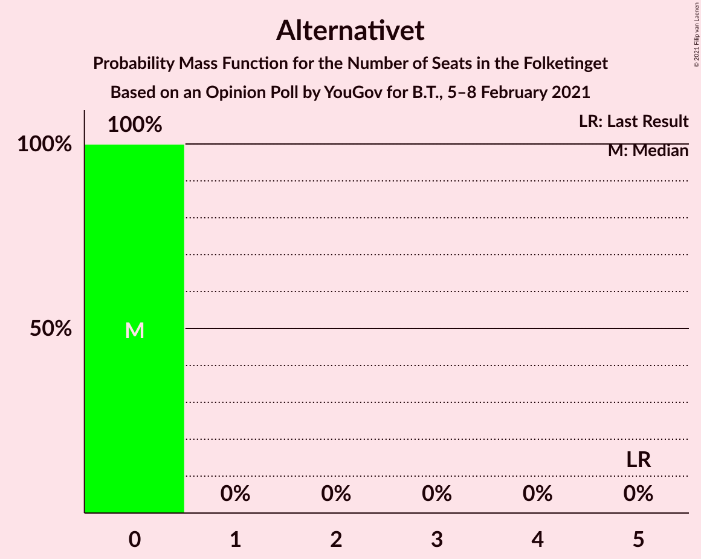

| Number of Seats | Probability | Accumulated | Special Marks |
|:---------------:|:-----------:|:-----------:|:-------------:|
| 0 | 100% | 100% | Median |
| 1 | 0% | 0% |  |
| 2 | 0% | 0% |  |
| 3 | 0% | 0% |  |
| 4 | 0% | 0% |  |
| 5 | 0% | 0% | Last Result |

### Veganerpartiet

*For a full overview of the results for this party, see the [Veganerpartiet](party-veganerpartiet.html) page.*

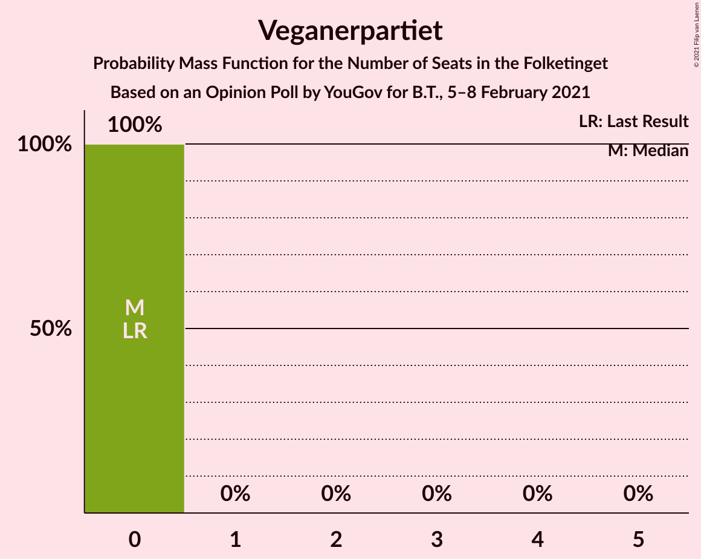

| Number of Seats | Probability | Accumulated | Special Marks |
|:---------------:|:-----------:|:-----------:|:-------------:|
| 0 | 100% | 100% | Last Result, Median |

## Coalitions

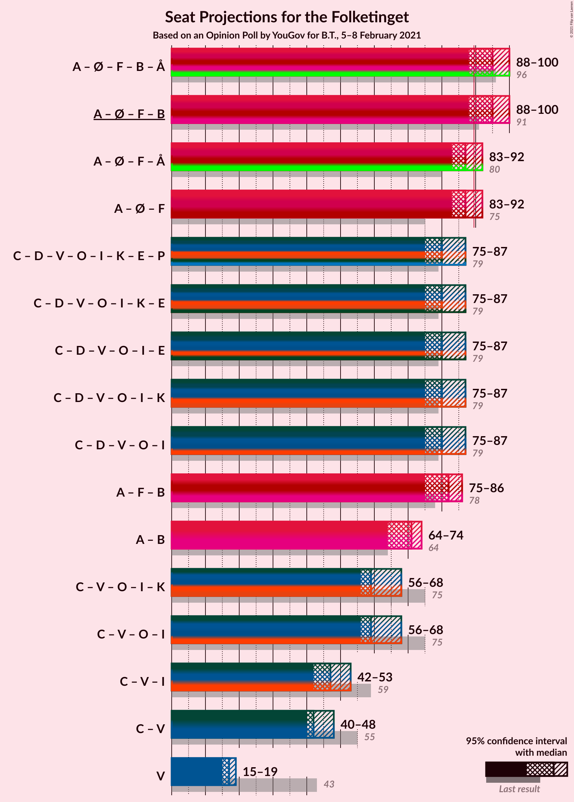

### Confidence Intervals

| Coalition | Last Result | Median | Majority? | 80% Confidence Interval | 90% Confidence Interval | 95% Confidence Interval | 99% Confidence Interval |
|:---------:|:-----------:|:------:|:---------:|:-----------------------:|:-----------------------:|:-----------------------:|:-----------------------:|
| Socialdemokraterne – Enhedslisten–De Rød-Grønne – Socialistisk Folkeparti – Radikale Venstre – Alternativet | 96 | 95 | 97% | 91–98 | 90–100 | 88–100 | 87–101 |
| Socialdemokraterne – Enhedslisten–De Rød-Grønne – Socialistisk Folkeparti – Radikale Venstre | 91 | 95 | 97% | 91–98 | 90–100 | 88–100 | 87–101 |
| Socialdemokraterne – Enhedslisten–De Rød-Grønne – Socialistisk Folkeparti – Alternativet | 80 | 87 | 14% | 85–92 | 84–92 | 83–92 | 82–95 |
| Socialdemokraterne – Enhedslisten–De Rød-Grønne – Socialistisk Folkeparti | 75 | 87 | 14% | 85–92 | 84–92 | 83–92 | 82–95 |
| Det Konservative Folkeparti – Nye Borgerlige – Venstre – Dansk Folkeparti – Liberal Alliance – Kristendemokraterne | 79 | 80 | 0% | 77–84 | 75–85 | 75–87 | 74–88 |
| Det Konservative Folkeparti – Nye Borgerlige – Venstre – Dansk Folkeparti – Liberal Alliance | 79 | 80 | 0% | 77–84 | 75–85 | 75–87 | 74–88 |
| Socialdemokraterne – Socialistisk Folkeparti – Radikale Venstre | 78 | 82 | 0.1% | 78–84 | 76–86 | 75–86 | 75–87 |
| Socialdemokraterne – Radikale Venstre | 64 | 71 | 0% | 65–71 | 65–73 | 64–74 | 62–74 |
| Det Konservative Folkeparti – Venstre – Dansk Folkeparti – Liberal Alliance – Kristendemokraterne | 75 | 59 | 0% | 58–65 | 56–66 | 56–68 | 55–69 |
| Det Konservative Folkeparti – Venstre – Dansk Folkeparti – Liberal Alliance | 75 | 59 | 0% | 58–64 | 56–66 | 56–68 | 55–69 |
| Det Konservative Folkeparti – Venstre – Liberal Alliance | 59 | 47 | 0% | 44–50 | 42–52 | 42–53 | 39–54 |
| Det Konservative Folkeparti – Venstre | 55 | 42 | 0% | 42–46 | 40–48 | 40–48 | 39–50 |
| Venstre | 43 | 17 | 0% | 16–18 | 15–19 | 15–19 | 14–21 |

### Socialdemokraterne – Enhedslisten–De Rød-Grønne – Socialistisk Folkeparti – Radikale Venstre – Alternativet

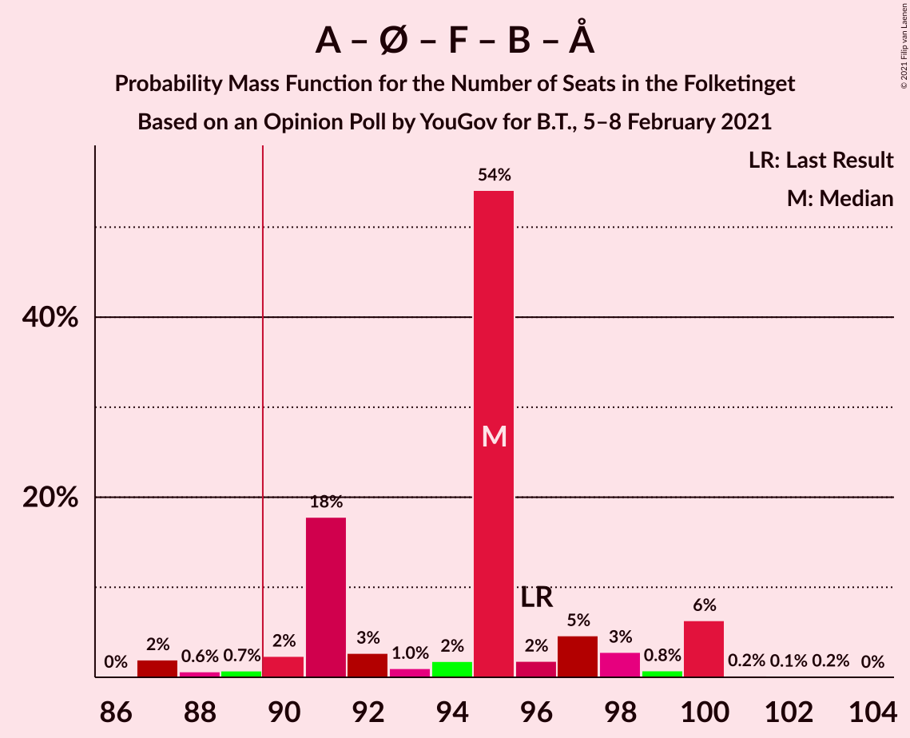

| Number of Seats | Probability | Accumulated | Special Marks |
|:---------------:|:-----------:|:-----------:|:-------------:|
| 87 | 2% | 100% |  |
| 88 | 0.6% | 98% |  |
| 89 | 0.7% | 97% |  |
| 90 | 2% | 97% | Majority |
| 91 | 18% | 94% |  |
| 92 | 3% | 76% |  |
| 93 | 1.0% | 74% |  |
| 94 | 2% | 73% |  |
| 95 | 54% | 71% | Median |
| 96 | 2% | 17% | Last Result |
| 97 | 5% | 15% |  |
| 98 | 3% | 10% |  |
| 99 | 0.8% | 8% |  |
| 100 | 6% | 7% |  |
| 101 | 0.2% | 0.5% |  |
| 102 | 0.1% | 0.3% |  |
| 103 | 0.2% | 0.2% |  |
| 104 | 0% | 0% |  |

### Socialdemokraterne – Enhedslisten–De Rød-Grønne – Socialistisk Folkeparti – Radikale Venstre

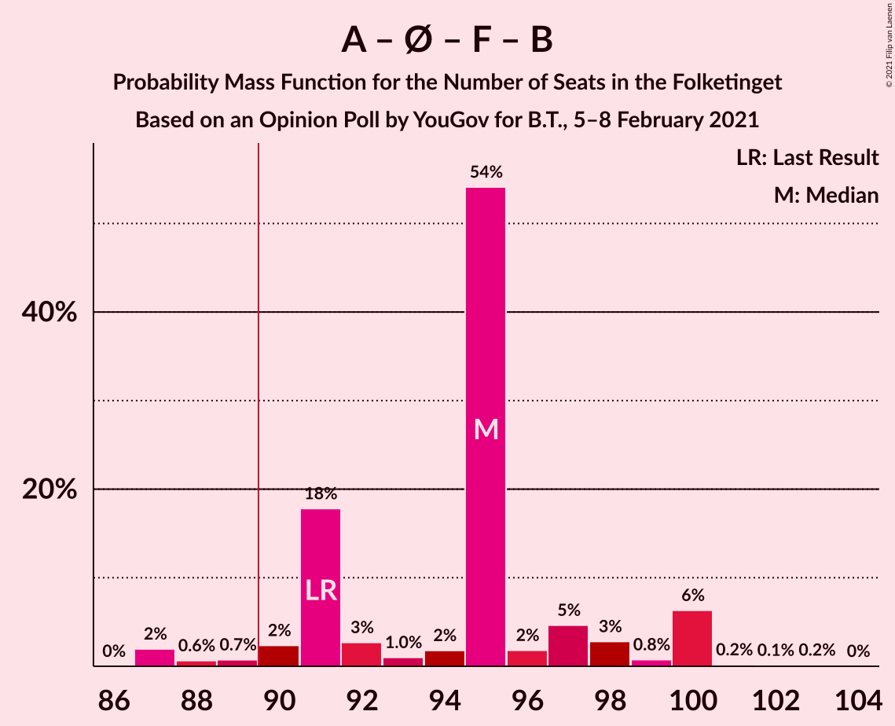

| Number of Seats | Probability | Accumulated | Special Marks |
|:---------------:|:-----------:|:-----------:|:-------------:|
| 87 | 2% | 100% |  |
| 88 | 0.6% | 98% |  |
| 89 | 0.7% | 97% |  |
| 90 | 2% | 97% | Majority |
| 91 | 18% | 94% | Last Result |
| 92 | 3% | 76% |  |
| 93 | 1.0% | 74% |  |
| 94 | 2% | 73% |  |
| 95 | 54% | 71% | Median |
| 96 | 2% | 17% |  |
| 97 | 5% | 15% |  |
| 98 | 3% | 10% |  |
| 99 | 0.8% | 8% |  |
| 100 | 6% | 7% |  |
| 101 | 0.2% | 0.5% |  |
| 102 | 0.1% | 0.3% |  |
| 103 | 0.2% | 0.2% |  |
| 104 | 0% | 0% |  |

### Socialdemokraterne – Enhedslisten–De Rød-Grønne – Socialistisk Folkeparti – Alternativet

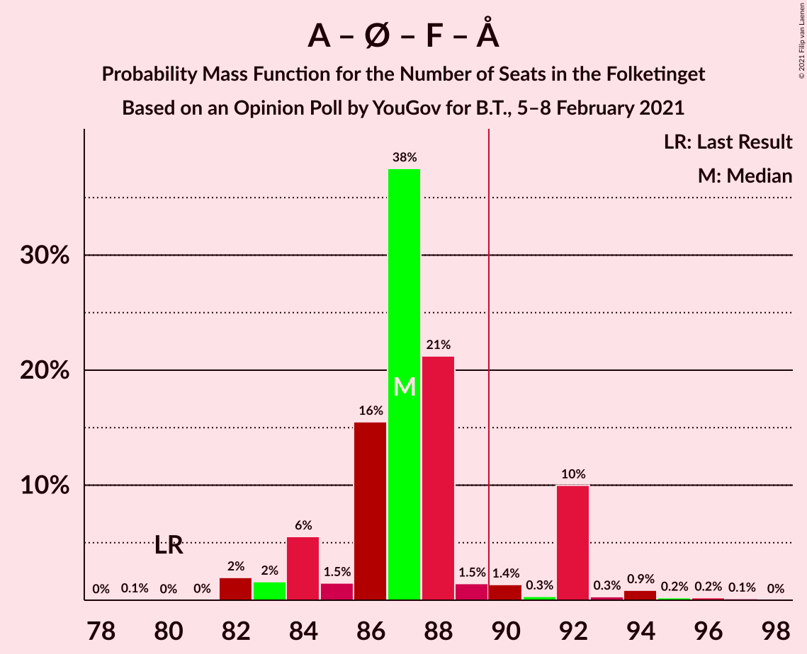

| Number of Seats | Probability | Accumulated | Special Marks |
|:---------------:|:-----------:|:-----------:|:-------------:|
| 79 | 0.1% | 100% |  |
| 80 | 0% | 99.9% | Last Result |
| 81 | 0% | 99.9% |  |
| 82 | 2% | 99.9% |  |
| 83 | 2% | 98% |  |
| 84 | 6% | 96% |  |
| 85 | 1.5% | 91% |  |
| 86 | 16% | 89% |  |
| 87 | 38% | 74% |  |
| 88 | 21% | 36% | Median |
| 89 | 1.5% | 15% |  |
| 90 | 1.4% | 14% | Majority |
| 91 | 0.3% | 12% |  |
| 92 | 10% | 12% |  |
| 93 | 0.3% | 2% |  |
| 94 | 0.9% | 1.5% |  |
| 95 | 0.2% | 0.6% |  |
| 96 | 0.2% | 0.4% |  |
| 97 | 0.1% | 0.2% |  |
| 98 | 0% | 0% |  |

### Socialdemokraterne – Enhedslisten–De Rød-Grønne – Socialistisk Folkeparti

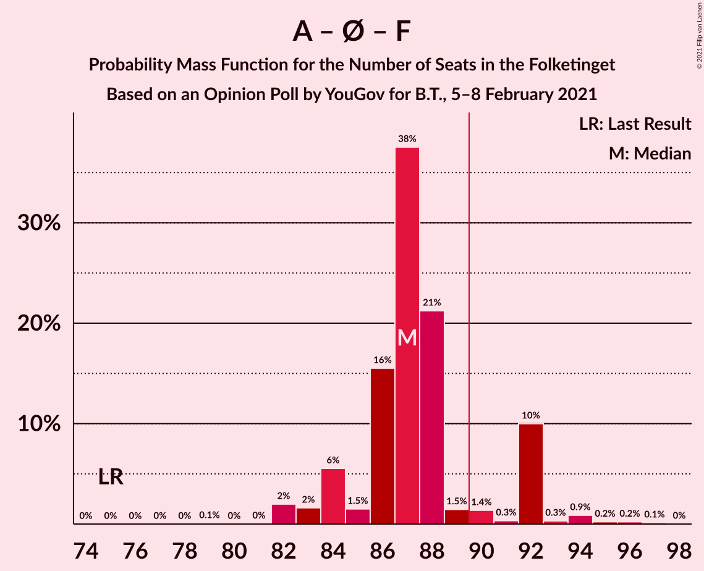

| Number of Seats | Probability | Accumulated | Special Marks |
|:---------------:|:-----------:|:-----------:|:-------------:|
| 75 | 0% | 100% | Last Result |
| 76 | 0% | 100% |  |
| 77 | 0% | 100% |  |
| 78 | 0% | 100% |  |
| 79 | 0.1% | 100% |  |
| 80 | 0% | 99.9% |  |
| 81 | 0% | 99.9% |  |
| 82 | 2% | 99.9% |  |
| 83 | 2% | 98% |  |
| 84 | 6% | 96% |  |
| 85 | 1.5% | 91% |  |
| 86 | 16% | 89% |  |
| 87 | 38% | 74% |  |
| 88 | 21% | 36% | Median |
| 89 | 1.5% | 15% |  |
| 90 | 1.4% | 14% | Majority |
| 91 | 0.3% | 12% |  |
| 92 | 10% | 12% |  |
| 93 | 0.3% | 2% |  |
| 94 | 0.9% | 1.5% |  |
| 95 | 0.2% | 0.6% |  |
| 96 | 0.2% | 0.4% |  |
| 97 | 0.1% | 0.2% |  |
| 98 | 0% | 0% |  |

### Det Konservative Folkeparti – Nye Borgerlige – Venstre – Dansk Folkeparti – Liberal Alliance – Kristendemokraterne

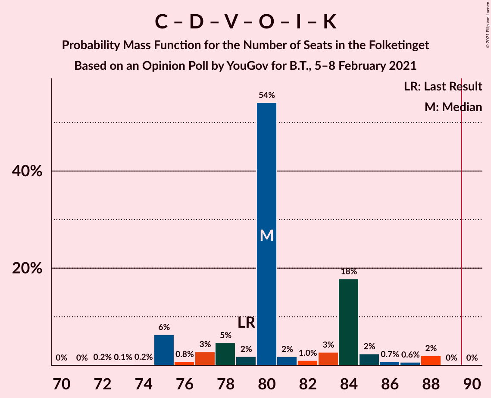

| Number of Seats | Probability | Accumulated | Special Marks |
|:---------------:|:-----------:|:-----------:|:-------------:|
| 72 | 0.2% | 100% |  |
| 73 | 0.1% | 99.8% |  |
| 74 | 0.2% | 99.7% |  |
| 75 | 6% | 99.5% |  |
| 76 | 0.8% | 93% |  |
| 77 | 3% | 92% |  |
| 78 | 5% | 90% |  |
| 79 | 2% | 85% | Last Result |
| 80 | 54% | 83% |  |
| 81 | 2% | 29% |  |
| 82 | 1.0% | 27% | Median |
| 83 | 3% | 26% |  |
| 84 | 18% | 24% |  |
| 85 | 2% | 6% |  |
| 86 | 0.7% | 3% |  |
| 87 | 0.6% | 3% |  |
| 88 | 2% | 2% |  |
| 89 | 0% | 0% |  |

### Det Konservative Folkeparti – Nye Borgerlige – Venstre – Dansk Folkeparti – Liberal Alliance

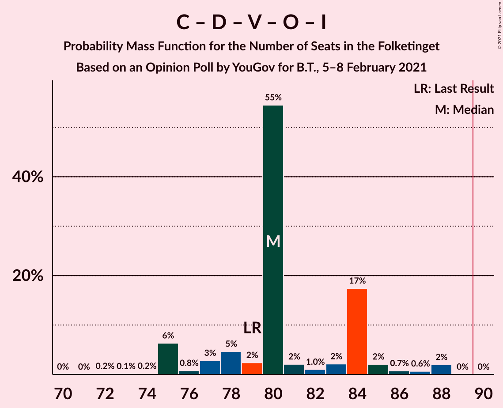

| Number of Seats | Probability | Accumulated | Special Marks |
|:---------------:|:-----------:|:-----------:|:-------------:|
| 72 | 0.2% | 100% |  |
| 73 | 0.1% | 99.8% |  |
| 74 | 0.2% | 99.7% |  |
| 75 | 6% | 99.5% |  |
| 76 | 0.8% | 93% |  |
| 77 | 3% | 92% |  |
| 78 | 5% | 90% |  |
| 79 | 2% | 85% | Last Result |
| 80 | 55% | 83% |  |
| 81 | 2% | 28% |  |
| 82 | 1.0% | 26% | Median |
| 83 | 2% | 25% |  |
| 84 | 17% | 23% |  |
| 85 | 2% | 5% |  |
| 86 | 0.7% | 3% |  |
| 87 | 0.6% | 3% |  |
| 88 | 2% | 2% |  |
| 89 | 0% | 0% |  |

### Socialdemokraterne – Socialistisk Folkeparti – Radikale Venstre

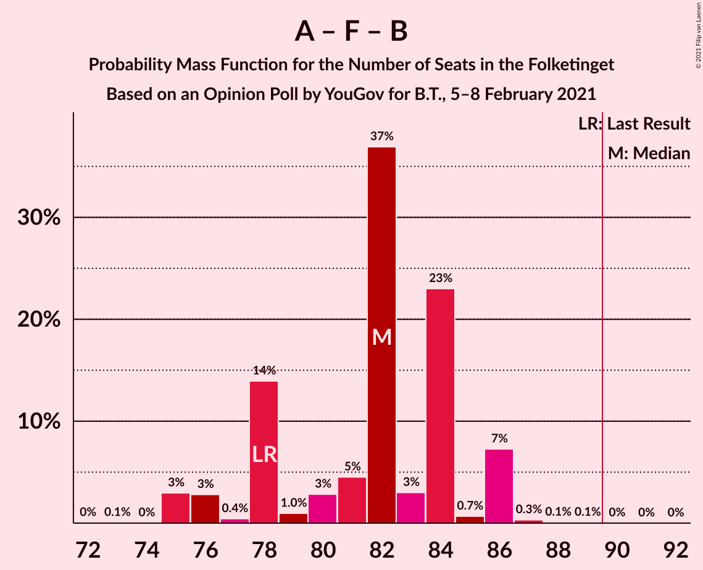

| Number of Seats | Probability | Accumulated | Special Marks |
|:---------------:|:-----------:|:-----------:|:-------------:|
| 72 | 0% | 100% |  |
| 73 | 0.1% | 99.9% |  |
| 74 | 0% | 99.9% |  |
| 75 | 3% | 99.9% |  |
| 76 | 3% | 97% |  |
| 77 | 0.4% | 94% |  |
| 78 | 14% | 94% | Last Result |
| 79 | 1.0% | 80% |  |
| 80 | 3% | 79% |  |
| 81 | 5% | 76% |  |
| 82 | 37% | 71% | Median |
| 83 | 3% | 34% |  |
| 84 | 23% | 31% |  |
| 85 | 0.7% | 8% |  |
| 86 | 7% | 8% |  |
| 87 | 0.3% | 0.5% |  |
| 88 | 0.1% | 0.2% |  |
| 89 | 0.1% | 0.1% |  |
| 90 | 0% | 0.1% | Majority |
| 91 | 0% | 0% |  |

### Socialdemokraterne – Radikale Venstre

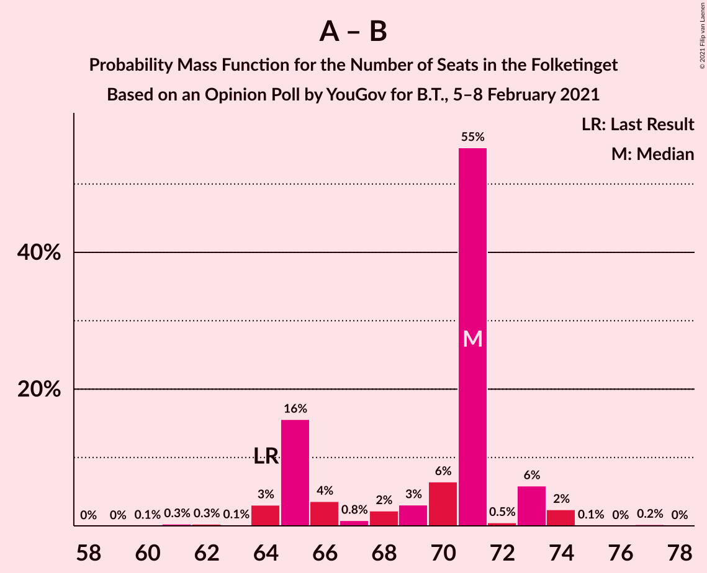

| Number of Seats | Probability | Accumulated | Special Marks |
|:---------------:|:-----------:|:-----------:|:-------------:|
| 60 | 0.1% | 100% |  |
| 61 | 0.3% | 99.9% |  |
| 62 | 0.3% | 99.6% |  |
| 63 | 0.1% | 99.4% |  |
| 64 | 3% | 99.2% | Last Result |
| 65 | 16% | 96% |  |
| 66 | 4% | 81% |  |
| 67 | 0.8% | 77% |  |
| 68 | 2% | 76% |  |
| 69 | 3% | 74% |  |
| 70 | 6% | 71% | Median |
| 71 | 55% | 64% |  |
| 72 | 0.5% | 9% |  |
| 73 | 6% | 9% |  |
| 74 | 2% | 3% |  |
| 75 | 0.1% | 0.4% |  |
| 76 | 0% | 0.3% |  |
| 77 | 0.2% | 0.2% |  |
| 78 | 0% | 0% |  |

### Det Konservative Folkeparti – Venstre – Dansk Folkeparti – Liberal Alliance – Kristendemokraterne

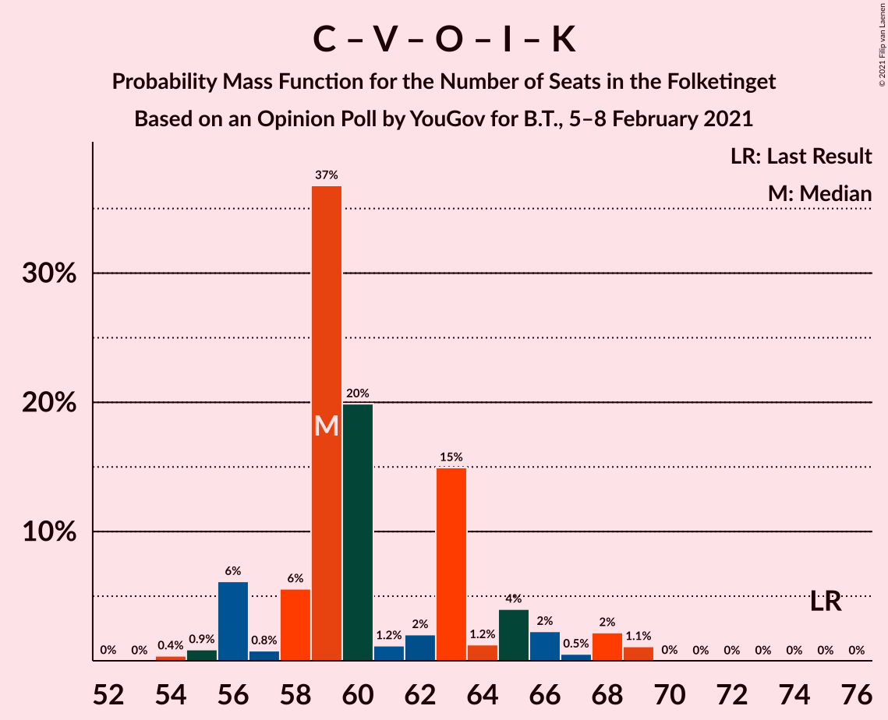

| Number of Seats | Probability | Accumulated | Special Marks |
|:---------------:|:-----------:|:-----------:|:-------------:|
| 54 | 0.4% | 100% |  |
| 55 | 0.9% | 99.6% |  |
| 56 | 6% | 98.7% |  |
| 57 | 0.8% | 93% |  |
| 58 | 6% | 92% |  |
| 59 | 37% | 86% |  |
| 60 | 20% | 49% |  |
| 61 | 1.2% | 30% | Median |
| 62 | 2% | 28% |  |
| 63 | 15% | 26% |  |
| 64 | 1.2% | 11% |  |
| 65 | 4% | 10% |  |
| 66 | 2% | 6% |  |
| 67 | 0.5% | 4% |  |
| 68 | 2% | 3% |  |
| 69 | 1.1% | 1.1% |  |
| 70 | 0% | 0% |  |
| 71 | 0% | 0% |  |
| 72 | 0% | 0% |  |
| 73 | 0% | 0% |  |
| 74 | 0% | 0% |  |
| 75 | 0% | 0% | Last Result |

### Det Konservative Folkeparti – Venstre – Dansk Folkeparti – Liberal Alliance

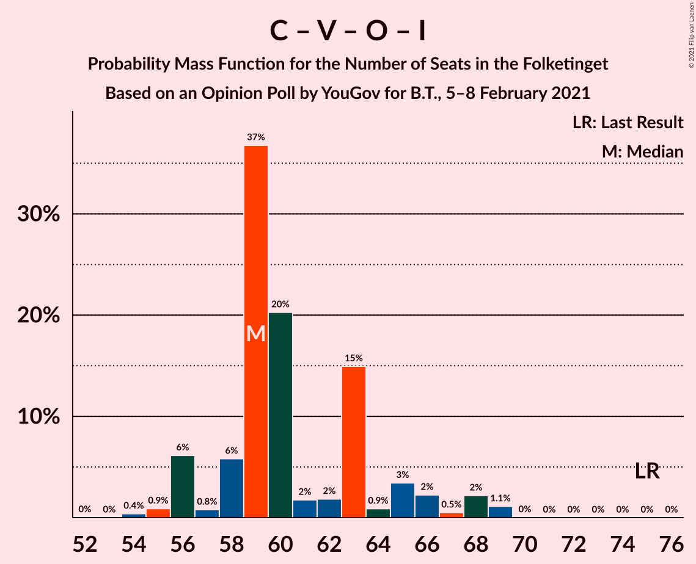

| Number of Seats | Probability | Accumulated | Special Marks |
|:---------------:|:-----------:|:-----------:|:-------------:|
| 53 | 0% | 100% |  |
| 54 | 0.4% | 99.9% |  |
| 55 | 0.9% | 99.6% |  |
| 56 | 6% | 98.7% |  |
| 57 | 0.8% | 93% |  |
| 58 | 6% | 92% |  |
| 59 | 37% | 86% |  |
| 60 | 20% | 49% |  |
| 61 | 2% | 29% | Median |
| 62 | 2% | 27% |  |
| 63 | 15% | 25% |  |
| 64 | 0.9% | 10% |  |
| 65 | 3% | 9% |  |
| 66 | 2% | 6% |  |
| 67 | 0.5% | 4% |  |
| 68 | 2% | 3% |  |
| 69 | 1.1% | 1.1% |  |
| 70 | 0% | 0% |  |
| 71 | 0% | 0% |  |
| 72 | 0% | 0% |  |
| 73 | 0% | 0% |  |
| 74 | 0% | 0% |  |
| 75 | 0% | 0% | Last Result |

### Det Konservative Folkeparti – Venstre – Liberal Alliance

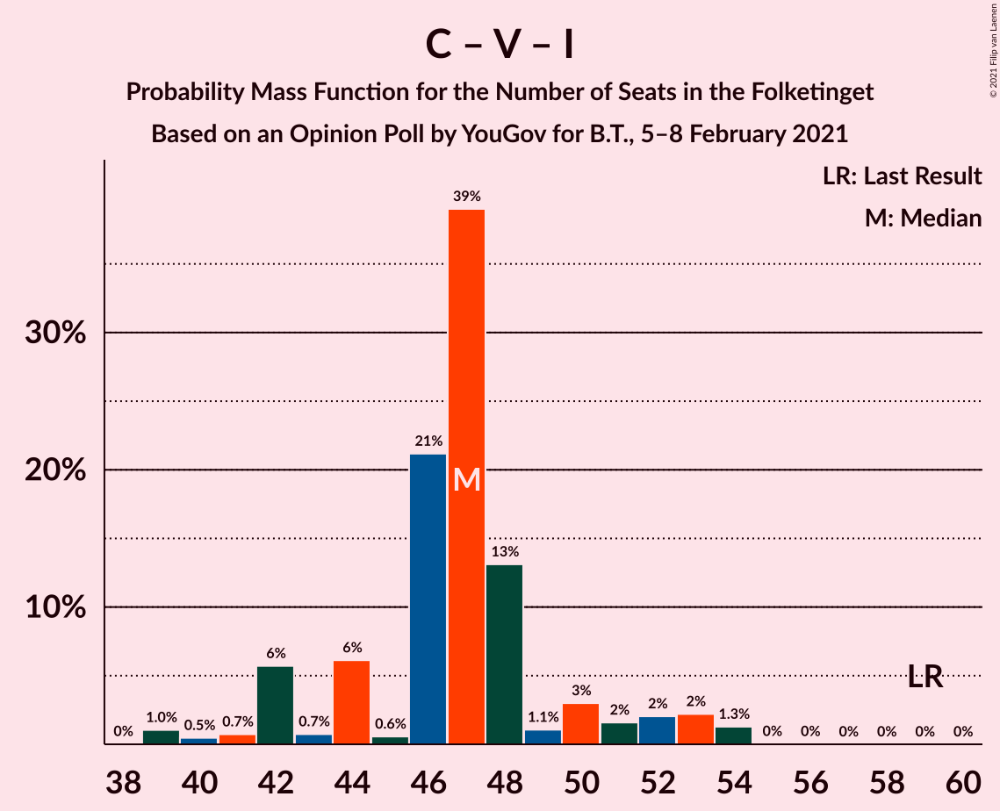

| Number of Seats | Probability | Accumulated | Special Marks |
|:---------------:|:-----------:|:-----------:|:-------------:|
| 39 | 1.0% | 100% |  |
| 40 | 0.5% | 98.9% |  |
| 41 | 0.7% | 98% |  |
| 42 | 6% | 98% |  |
| 43 | 0.7% | 92% |  |
| 44 | 6% | 91% |  |
| 45 | 0.6% | 85% |  |
| 46 | 21% | 85% |  |
| 47 | 39% | 63% | Median |
| 48 | 13% | 24% |  |
| 49 | 1.1% | 11% |  |
| 50 | 3% | 10% |  |
| 51 | 2% | 7% |  |
| 52 | 2% | 6% |  |
| 53 | 2% | 4% |  |
| 54 | 1.3% | 1.4% |  |
| 55 | 0% | 0.1% |  |
| 56 | 0% | 0% |  |
| 57 | 0% | 0% |  |
| 58 | 0% | 0% |  |
| 59 | 0% | 0% | Last Result |

### Det Konservative Folkeparti – Venstre

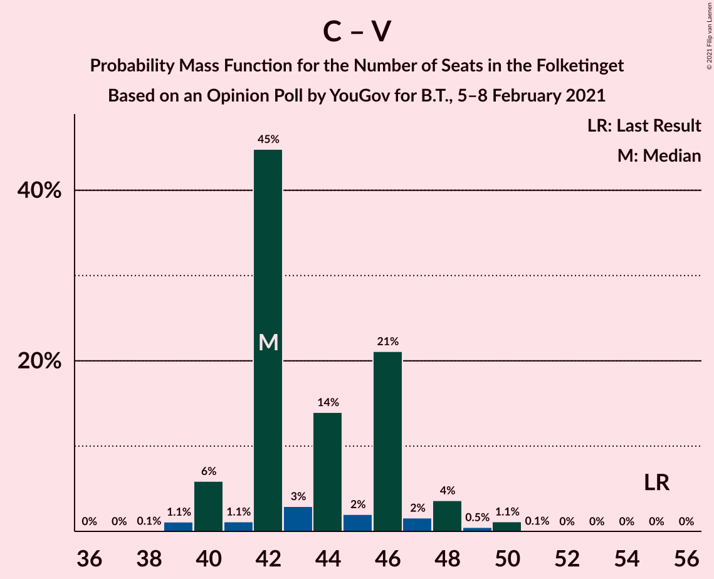

| Number of Seats | Probability | Accumulated | Special Marks |
|:---------------:|:-----------:|:-----------:|:-------------:|
| 38 | 0.1% | 100% |  |
| 39 | 1.1% | 99.9% |  |
| 40 | 6% | 98.8% |  |
| 41 | 1.1% | 93% |  |
| 42 | 45% | 92% |  |
| 43 | 3% | 47% | Median |
| 44 | 14% | 44% |  |
| 45 | 2% | 30% |  |
| 46 | 21% | 28% |  |
| 47 | 2% | 7% |  |
| 48 | 4% | 5% |  |
| 49 | 0.5% | 2% |  |
| 50 | 1.1% | 1.2% |  |
| 51 | 0.1% | 0.1% |  |
| 52 | 0% | 0% |  |
| 53 | 0% | 0% |  |
| 54 | 0% | 0% |  |
| 55 | 0% | 0% | Last Result |

### Venstre

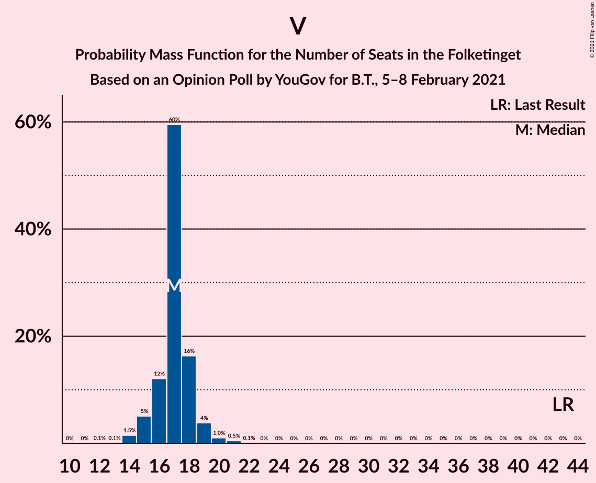

| Number of Seats | Probability | Accumulated | Special Marks |
|:---------------:|:-----------:|:-----------:|:-------------:|
| 12 | 0.1% | 100% |  |
| 13 | 0.1% | 99.9% |  |
| 14 | 1.5% | 99.9% |  |
| 15 | 5% | 98% |  |
| 16 | 12% | 93% |  |
| 17 | 60% | 81% | Median |
| 18 | 16% | 22% |  |
| 19 | 4% | 5% |  |
| 20 | 1.0% | 2% |  |
| 21 | 0.5% | 0.5% |  |
| 22 | 0.1% | 0.1% |  |
| 23 | 0% | 0% |  |
| 24 | 0% | 0% |  |
| 25 | 0% | 0% |  |
| 26 | 0% | 0% |  |
| 27 | 0% | 0% |  |
| 28 | 0% | 0% |  |
| 29 | 0% | 0% |  |
| 30 | 0% | 0% |  |
| 31 | 0% | 0% |  |
| 32 | 0% | 0% |  |
| 33 | 0% | 0% |  |
| 34 | 0% | 0% |  |
| 35 | 0% | 0% |  |
| 36 | 0% | 0% |  |
| 37 | 0% | 0% |  |
| 38 | 0% | 0% |  |
| 39 | 0% | 0% |  |
| 40 | 0% | 0% |  |
| 41 | 0% | 0% |  |
| 42 | 0% | 0% |  |
| 43 | 0% | 0% | Last Result |

## Technical Information

### Opinion Poll

+ **Polling firm:** YouGov
+ **Commissioner(s):** B.T.
+ **Fieldwork period:** 5–8 February 2021

### Calculations

+ **Sample size:** 1262
+ **Simulations done:** 1,048,576
+ **Error estimate:** 1.86%

