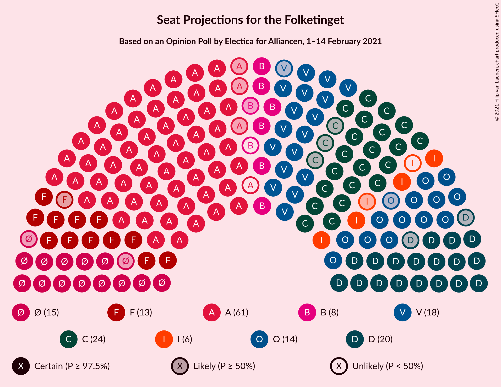
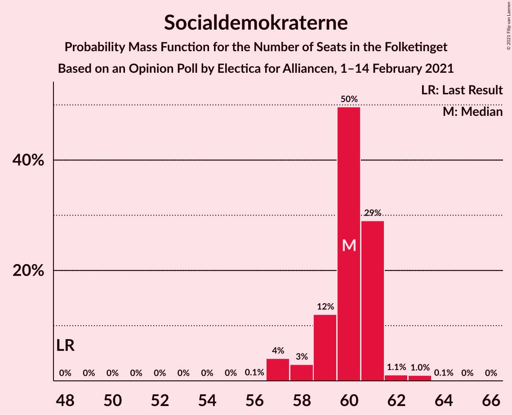
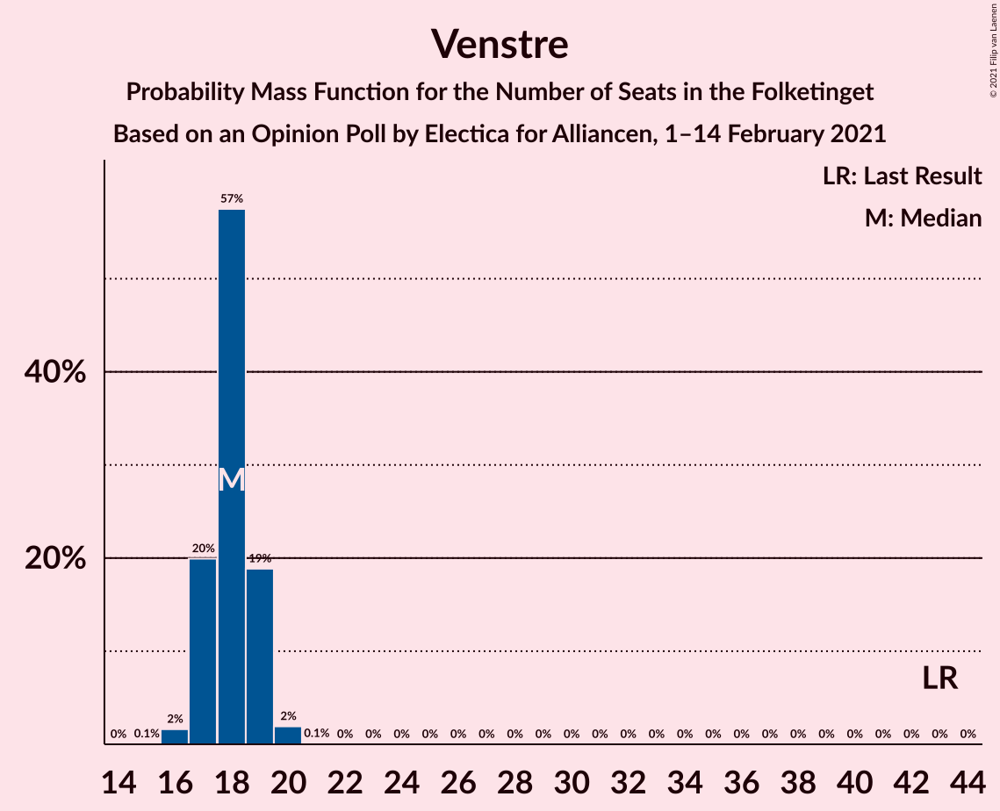
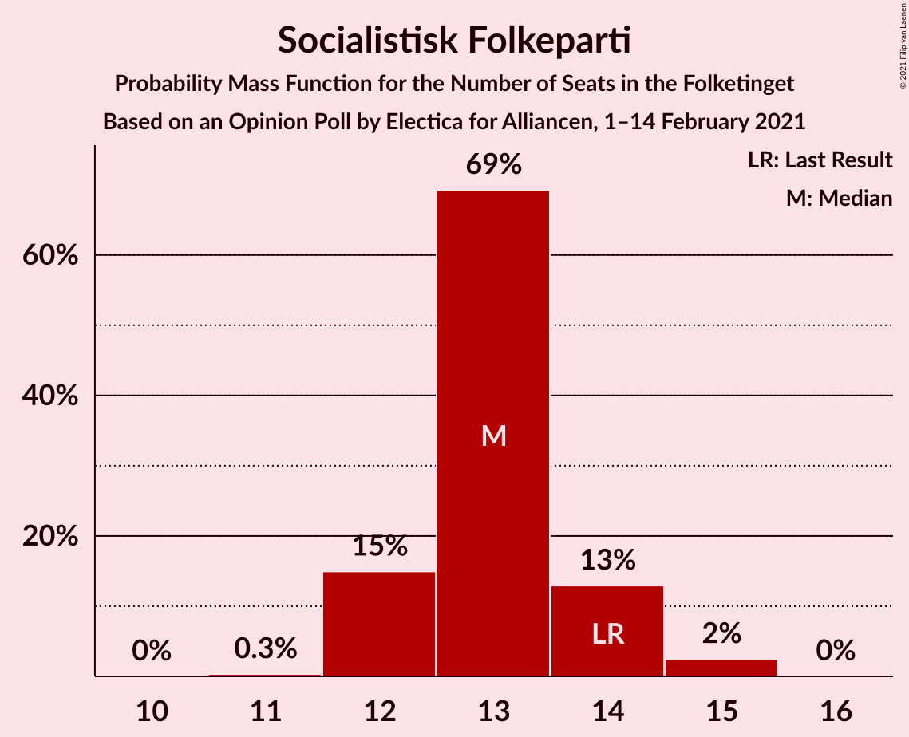
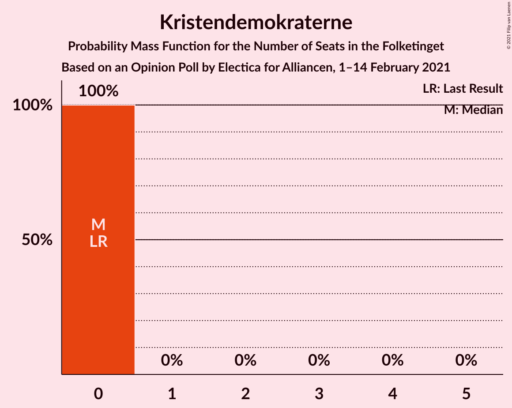
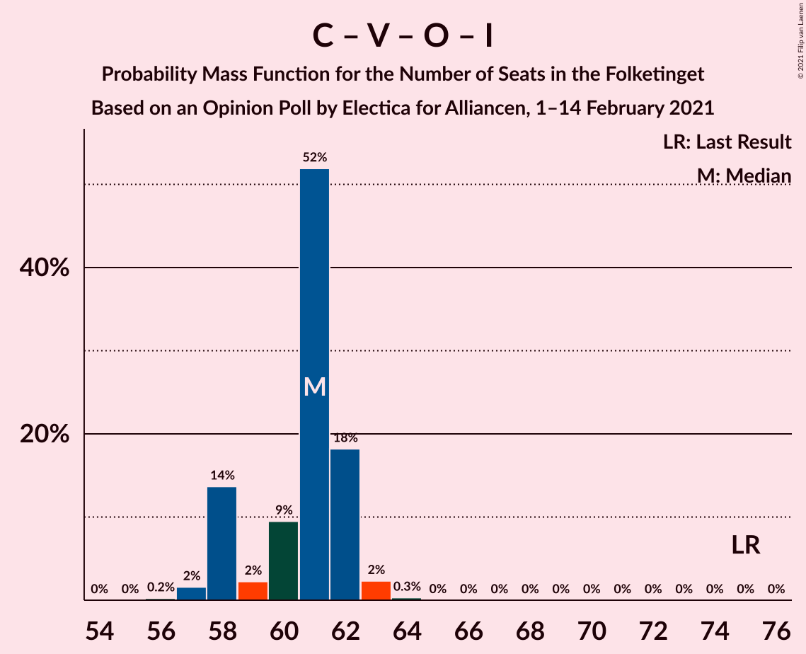

# Opinion Poll by Electica for Alliancen, 1–14 February 2021

<a href="#voting-intentions">Voting Intentions</a> | <a href="#seats">Seats</a> | <a href="#coalitions">Coalitions</a> | <a href="#technical-information">Technical Information</a>

## Voting Intentions

### Confidence Intervals

| Party | Last Result | Poll Result | 80% Confidence Interval | 90% Confidence Interval | 95% Confidence Interval | 99% Confidence Interval |
|:-----:|:-----------:|:-----------:|:-----------------------:|:-----------------------:|:-----------------------:|:-----------------------:|
| Socialdemokraterne | 25.9% | 32.6% | 31.6–33.5% |31.4–33.8% |31.2–34.0% |30.7–34.5% |
| Det Konservative Folkeparti | 6.6% | 12.6% | 11.9–13.3% |11.8–13.5% |11.6–13.6% |11.3–14.0% |
| Nye Borgerlige | 2.4% | 11.0% | 10.4–11.6% |10.2–11.8% |10.1–12.0% |9.8–12.3% |
| Venstre | 23.4% | 9.8% | 9.2–10.4% |9.1–10.6% |8.9–10.7% |8.6–11.0% |
| Enhedslisten–De Rød-Grønne | 6.9% | 7.7% | 7.2–8.2% |7.0–8.4% |6.9–8.6% |6.7–8.8% |
| Dansk Folkeparti | 8.7% | 7.6% | 7.1–8.2% |6.9–8.3% |6.8–8.4% |6.6–8.7% |
| Socialistisk Folkeparti | 7.7% | 7.2% | 6.7–7.7% |6.6–7.9% |6.4–8.0% |6.2–8.3% |
| Radikale Venstre | 8.6% | 4.0% | 3.6–4.4% |3.5–4.5% |3.4–4.6% |3.3–4.8% |
| Liberal Alliance | 2.3% | 2.8% | 2.5–3.2% |2.4–3.3% |2.3–3.4% |2.2–3.5% |
| Kristendemokraterne | 1.7% | 1.4% | 1.2–1.7% |1.1–1.8% |1.1–1.8% |1.0–2.0% |
| Alternativet | 3.0% | 1.0% | 0.8–1.2% |0.8–1.3% |0.7–1.3% |0.7–1.5% |
| Veganerpartiet | 0.0% | 0.9% | 0.7–1.1% |0.7–1.2% |0.6–1.2% |0.6–1.4% |

*Note:* The poll result column reflects the actual value used in the calculations. Published results may vary slightly, and in addition be rounded to fewer digits.

## Seats

### Confidence Intervals

| Party | Last Result | Median | 80% Confidence Interval | 90% Confidence Interval | 95% Confidence Interval | 99% Confidence Interval |
|:-----:|:-----------:|:------:|:-----------------------:|:-----------------------:|:-----------------------:|:-----------------------:|
| <a href="#socialdemokraterne">Socialdemokraterne</a> | 48 | 60 | 59–61 |58–61 |57–61 |57–63 |
| <a href="#det-konservative-folkeparti">Det Konservative Folkeparti</a> | 12 | 24 | 21–24 |21–24 |21–25 |21–26 |
| <a href="#nye-borgerlige">Nye Borgerlige</a> | 4 | 20 | 19–21 |19–21 |18–22 |18–22 |
| <a href="#venstre">Venstre</a> | 43 | 18 | 17–19 |17–19 |17–19 |16–20 |
| <a href="#enhedslisten–de-rød-grønne">Enhedslisten–De Rød-Grønne</a> | 13 | 15 | 14–15 |13–15 |13–15 |12–16 |
| <a href="#dansk-folkeparti">Dansk Folkeparti</a> | 16 | 14 | 13–15 |13–15 |13–15 |12–16 |
| <a href="#socialistisk-folkeparti">Socialistisk Folkeparti</a> | 14 | 13 | 12–14 |12–14 |12–15 |12–15 |
| <a href="#radikale-venstre">Radikale Venstre</a> | 16 | 7 | 6–8 |6–8 |6–8 |6–8 |
| <a href="#liberal-alliance">Liberal Alliance</a> | 4 | 5 | 5–6 |5–6 |4–6 |4–6 |
| <a href="#kristendemokraterne">Kristendemokraterne</a> | 0 | 0 | 0 |0 |0 |0 |
| <a href="#alternativet">Alternativet</a> | 5 | 0 | 0 |0 |0 |0 |
| <a href="#veganerpartiet">Veganerpartiet</a> | 0 | 0 | 0 |0 |0 |0 |

### Socialdemokraterne

*For a full overview of the results for this party, see the [Socialdemokraterne](party-socialdemokraterne.html) page.*

| Number of Seats | Probability | Accumulated | Special Marks |
|:---------------:|:-----------:|:-----------:|:-------------:|
| 48 | 0% | 100% | Last Result |
| 49 | 0% | 100% |  |
| 50 | 0% | 100% |  |
| 51 | 0% | 100% |  |
| 52 | 0% | 100% |  |
| 53 | 0% | 100% |  |
| 54 | 0% | 100% |  |
| 55 | 0% | 100% |  |
| 56 | 0.1% | 100% |  |
| 57 | 4% | 99.9% |  |
| 58 | 3% | 96% |  |
| 59 | 12% | 93% |  |
| 60 | 50% | 81% | Median |
| 61 | 29% | 31% |  |
| 62 | 1.1% | 2% |  |
| 63 | 1.0% | 1.1% |  |
| 64 | 0.1% | 0.1% |  |
| 65 | 0% | 0% |  |

### Det Konservative Folkeparti

*For a full overview of the results for this party, see the [Det Konservative Folkeparti](party-detkonservativefolkeparti.html) page.*

| Number of Seats | Probability | Accumulated | Special Marks |
|:---------------:|:-----------:|:-----------:|:-------------:|
| 12 | 0% | 100% | Last Result |
| 13 | 0% | 100% |  |
| 14 | 0% | 100% |  |
| 15 | 0% | 100% |  |
| 16 | 0% | 100% |  |
| 17 | 0% | 100% |  |
| 18 | 0% | 100% |  |
| 19 | 0% | 100% |  |
| 20 | 0% | 100% |  |
| 21 | 14% | 100% |  |
| 22 | 7% | 86% |  |
| 23 | 10% | 78% |  |
| 24 | 65% | 69% | Median |
| 25 | 3% | 4% |  |
| 26 | 0.6% | 0.6% |  |
| 27 | 0% | 0% |  |

### Nye Borgerlige

*For a full overview of the results for this party, see the [Nye Borgerlige](party-nyeborgerlige.html) page.*

| Number of Seats | Probability | Accumulated | Special Marks |
|:---------------:|:-----------:|:-----------:|:-------------:|
| 4 | 0% | 100% | Last Result |
| 5 | 0% | 100% |  |
| 6 | 0% | 100% |  |
| 7 | 0% | 100% |  |
| 8 | 0% | 100% |  |
| 9 | 0% | 100% |  |
| 10 | 0% | 100% |  |
| 11 | 0% | 100% |  |
| 12 | 0% | 100% |  |
| 13 | 0% | 100% |  |
| 14 | 0% | 100% |  |
| 15 | 0% | 100% |  |
| 16 | 0% | 100% |  |
| 17 | 0% | 100% |  |
| 18 | 4% | 100% |  |
| 19 | 17% | 96% |  |
| 20 | 55% | 78% | Median |
| 21 | 21% | 23% |  |
| 22 | 3% | 3% |  |
| 23 | 0.3% | 0.3% |  |
| 24 | 0% | 0% |  |

### Venstre

*For a full overview of the results for this party, see the [Venstre](party-venstre.html) page.*

| Number of Seats | Probability | Accumulated | Special Marks |
|:---------------:|:-----------:|:-----------:|:-------------:|
| 15 | 0.1% | 100% |  |
| 16 | 2% | 99.9% |  |
| 17 | 20% | 98% |  |
| 18 | 57% | 78% | Median |
| 19 | 19% | 21% |  |
| 20 | 2% | 2% |  |
| 21 | 0.1% | 0.1% |  |
| 22 | 0% | 0% |  |
| 23 | 0% | 0% |  |
| 24 | 0% | 0% |  |
| 25 | 0% | 0% |  |
| 26 | 0% | 0% |  |
| 27 | 0% | 0% |  |
| 28 | 0% | 0% |  |
| 29 | 0% | 0% |  |
| 30 | 0% | 0% |  |
| 31 | 0% | 0% |  |
| 32 | 0% | 0% |  |
| 33 | 0% | 0% |  |
| 34 | 0% | 0% |  |
| 35 | 0% | 0% |  |
| 36 | 0% | 0% |  |
| 37 | 0% | 0% |  |
| 38 | 0% | 0% |  |
| 39 | 0% | 0% |  |
| 40 | 0% | 0% |  |
| 41 | 0% | 0% |  |
| 42 | 0% | 0% |  |
| 43 | 0% | 0% | Last Result |

### Enhedslisten–De Rød-Grønne

*For a full overview of the results for this party, see the [Enhedslisten–De Rød-Grønne](party-enhedslisten–derød-grønne.html) page.*

| Number of Seats | Probability | Accumulated | Special Marks |
|:---------------:|:-----------:|:-----------:|:-------------:|
| 12 | 2% | 100% |  |
| 13 | 4% | 98% | Last Result |
| 14 | 31% | 94% |  |
| 15 | 61% | 63% | Median |
| 16 | 2% | 2% |  |
| 17 | 0% | 0% |  |

### Dansk Folkeparti

*For a full overview of the results for this party, see the [Dansk Folkeparti](party-danskfolkeparti.html) page.*

| Number of Seats | Probability | Accumulated | Special Marks |
|:---------------:|:-----------:|:-----------:|:-------------:|
| 12 | 1.0% | 100% |  |
| 13 | 23% | 98.9% |  |
| 14 | 56% | 76% | Median |
| 15 | 19% | 20% |  |
| 16 | 1.3% | 1.3% | Last Result |
| 17 | 0% | 0% |  |

### Socialistisk Folkeparti

*For a full overview of the results for this party, see the [Socialistisk Folkeparti](party-socialistiskfolkeparti.html) page.*

| Number of Seats | Probability | Accumulated | Special Marks |
|:---------------:|:-----------:|:-----------:|:-------------:|
| 11 | 0.3% | 100% |  |
| 12 | 15% | 99.7% |  |
| 13 | 69% | 85% | Median |
| 14 | 13% | 15% | Last Result |
| 15 | 2% | 3% |  |
| 16 | 0% | 0% |  |

### Radikale Venstre

*For a full overview of the results for this party, see the [Radikale Venstre](party-radikalevenstre.html) page.*

| Number of Seats | Probability | Accumulated | Special Marks |
|:---------------:|:-----------:|:-----------:|:-------------:|
| 6 | 46% | 100% |  |
| 7 | 35% | 54% | Median |
| 8 | 18% | 19% |  |
| 9 | 0.4% | 0.5% |  |
| 10 | 0% | 0% |  |
| 11 | 0% | 0% |  |
| 12 | 0% | 0% |  |
| 13 | 0% | 0% |  |
| 14 | 0% | 0% |  |
| 15 | 0% | 0% |  |
| 16 | 0% | 0% | Last Result |

### Liberal Alliance

*For a full overview of the results for this party, see the [Liberal Alliance](party-liberalalliance.html) page.*

| Number of Seats | Probability | Accumulated | Special Marks |
|:---------------:|:-----------:|:-----------:|:-------------:|
| 4 | 3% | 100% | Last Result |
| 5 | 67% | 97% | Median |
| 6 | 31% | 31% |  |
| 7 | 0.1% | 0.1% |  |
| 8 | 0% | 0% |  |

### Kristendemokraterne

*For a full overview of the results for this party, see the [Kristendemokraterne](party-kristendemokraterne.html) page.*

| Number of Seats | Probability | Accumulated | Special Marks |
|:---------------:|:-----------:|:-----------:|:-------------:|
| 0 | 100% | 100% | Last Result, Median |

### Alternativet

*For a full overview of the results for this party, see the [Alternativet](party-alternativet.html) page.*

| Number of Seats | Probability | Accumulated | Special Marks |
|:---------------:|:-----------:|:-----------:|:-------------:|
| 0 | 100% | 100% | Median |
| 1 | 0% | 0% |  |
| 2 | 0% | 0% |  |
| 3 | 0% | 0% |  |
| 4 | 0% | 0% |  |
| 5 | 0% | 0% | Last Result |

### Veganerpartiet

*For a full overview of the results for this party, see the [Veganerpartiet](party-veganerpartiet.html) page.*

| Number of Seats | Probability | Accumulated | Special Marks |
|:---------------:|:-----------:|:-----------:|:-------------:|
| 0 | 100% | 100% | Last Result, Median |

## Coalitions

### Confidence Intervals

| Coalition | Last Result | Median | Majority? | 80% Confidence Interval | 90% Confidence Interval | 95% Confidence Interval | 99% Confidence Interval |
|:---------:|:-----------:|:------:|:---------:|:-----------------------:|:-----------------------:|:-----------------------:|:-----------------------:|
| Socialdemokraterne – Enhedslisten–De Rød-Grønne – Socialistisk Folkeparti – Radikale Venstre – Alternativet | 96 | 94 | 100% | 93–96 | 93–96 | 92–97 | 91–98 |
| Socialdemokraterne – Enhedslisten–De Rød-Grønne – Socialistisk Folkeparti – Radikale Venstre | 91 | 94 | 100% | 93–96 | 93–96 | 92–97 | 91–98 |
| Socialdemokraterne – Enhedslisten–De Rød-Grønne – Socialistisk Folkeparti – Alternativet | 80 | 88 | 3% | 86–89 | 85–89 | 85–90 | 84–90 |
| Socialdemokraterne – Enhedslisten–De Rød-Grønne – Socialistisk Folkeparti | 75 | 88 | 3% | 86–89 | 85–89 | 85–90 | 84–90 |
| Det Konservative Folkeparti – Nye Borgerlige – Venstre – Dansk Folkeparti – Liberal Alliance – Kristendemokraterne | 79 | 81 | 0% | 79–82 | 79–82 | 78–83 | 77–84 |
| Det Konservative Folkeparti – Nye Borgerlige – Venstre – Dansk Folkeparti – Liberal Alliance | 79 | 81 | 0% | 79–82 | 79–82 | 78–83 | 77–84 |
| Socialdemokraterne – Socialistisk Folkeparti – Radikale Venstre | 78 | 79 | 0% | 79–81 | 79–82 | 78–83 | 78–83 |
| Socialdemokraterne – Radikale Venstre | 64 | 66 | 0% | 66–68 | 65–68 | 65–69 | 65–70 |
| Det Konservative Folkeparti – Venstre – Dansk Folkeparti – Liberal Alliance – Kristendemokraterne | 75 | 61 | 0% | 58–62 | 58–62 | 58–63 | 57–63 |
| Det Konservative Folkeparti – Venstre – Dansk Folkeparti – Liberal Alliance | 75 | 61 | 0% | 58–62 | 58–62 | 58–63 | 57–63 |
| Det Konservative Folkeparti – Venstre – Liberal Alliance | 59 | 47 | 0% | 43–49 | 43–49 | 43–49 | 43–49 |
| Det Konservative Folkeparti – Venstre | 55 | 42 | 0% | 38–43 | 38–43 | 38–43 | 38–44 |
| Venstre | 43 | 18 | 0% | 17–19 | 17–19 | 17–19 | 16–20 |

### Socialdemokraterne – Enhedslisten–De Rød-Grønne – Socialistisk Folkeparti – Radikale Venstre – Alternativet

| Number of Seats | Probability | Accumulated | Special Marks |
|:---------------:|:-----------:|:-----------:|:-------------:|
| 90 | 0.1% | 100% | Majority |
| 91 | 0.5% | 99.9% |  |
| 92 | 3% | 99.3% |  |
| 93 | 7% | 96% |  |
| 94 | 61% | 89% |  |
| 95 | 10% | 28% | Median |
| 96 | 16% | 19% | Last Result |
| 97 | 3% | 3% |  |
| 98 | 0.5% | 0.5% |  |
| 99 | 0% | 0% |  |

### Socialdemokraterne – Enhedslisten–De Rød-Grønne – Socialistisk Folkeparti – Radikale Venstre

| Number of Seats | Probability | Accumulated | Special Marks |
|:---------------:|:-----------:|:-----------:|:-------------:|
| 90 | 0.1% | 100% | Majority |
| 91 | 0.5% | 99.9% | Last Result |
| 92 | 3% | 99.3% |  |
| 93 | 7% | 96% |  |
| 94 | 61% | 89% |  |
| 95 | 10% | 28% | Median |
| 96 | 16% | 19% |  |
| 97 | 3% | 3% |  |
| 98 | 0.5% | 0.5% |  |
| 99 | 0% | 0% |  |

### Socialdemokraterne – Enhedslisten–De Rød-Grønne – Socialistisk Folkeparti – Alternativet

| Number of Seats | Probability | Accumulated | Special Marks |
|:---------------:|:-----------:|:-----------:|:-------------:|
| 80 | 0% | 100% | Last Result |
| 81 | 0% | 100% |  |
| 82 | 0% | 100% |  |
| 83 | 0.3% | 100% |  |
| 84 | 0.9% | 99.6% |  |
| 85 | 7% | 98.7% |  |
| 86 | 7% | 92% |  |
| 87 | 18% | 85% |  |
| 88 | 50% | 67% | Median |
| 89 | 14% | 17% |  |
| 90 | 3% | 3% | Majority |
| 91 | 0.4% | 0.4% |  |
| 92 | 0% | 0% |  |

### Socialdemokraterne – Enhedslisten–De Rød-Grønne – Socialistisk Folkeparti

| Number of Seats | Probability | Accumulated | Special Marks |
|:---------------:|:-----------:|:-----------:|:-------------:|
| 75 | 0% | 100% | Last Result |
| 76 | 0% | 100% |  |
| 77 | 0% | 100% |  |
| 78 | 0% | 100% |  |
| 79 | 0% | 100% |  |
| 80 | 0% | 100% |  |
| 81 | 0% | 100% |  |
| 82 | 0% | 100% |  |
| 83 | 0.3% | 100% |  |
| 84 | 0.9% | 99.6% |  |
| 85 | 7% | 98.7% |  |
| 86 | 7% | 92% |  |
| 87 | 18% | 85% |  |
| 88 | 50% | 67% | Median |
| 89 | 14% | 17% |  |
| 90 | 3% | 3% | Majority |
| 91 | 0.4% | 0.4% |  |
| 92 | 0% | 0% |  |

### Det Konservative Folkeparti – Nye Borgerlige – Venstre – Dansk Folkeparti – Liberal Alliance – Kristendemokraterne

| Number of Seats | Probability | Accumulated | Special Marks |
|:---------------:|:-----------:|:-----------:|:-------------:|
| 76 | 0.3% | 100% |  |
| 77 | 0.6% | 99.7% |  |
| 78 | 3% | 99.2% |  |
| 79 | 16% | 96% | Last Result |
| 80 | 9% | 81% |  |
| 81 | 61% | 71% | Median |
| 82 | 7% | 11% |  |
| 83 | 3% | 4% |  |
| 84 | 0.5% | 0.6% |  |
| 85 | 0.1% | 0.1% |  |
| 86 | 0% | 0% |  |

### Det Konservative Folkeparti – Nye Borgerlige – Venstre – Dansk Folkeparti – Liberal Alliance

| Number of Seats | Probability | Accumulated | Special Marks |
|:---------------:|:-----------:|:-----------:|:-------------:|
| 76 | 0.3% | 100% |  |
| 77 | 0.6% | 99.7% |  |
| 78 | 3% | 99.2% |  |
| 79 | 16% | 96% | Last Result |
| 80 | 9% | 81% |  |
| 81 | 61% | 71% | Median |
| 82 | 7% | 11% |  |
| 83 | 3% | 4% |  |
| 84 | 0.5% | 0.6% |  |
| 85 | 0.1% | 0.1% |  |
| 86 | 0% | 0% |  |

### Socialdemokraterne – Socialistisk Folkeparti – Radikale Venstre

| Number of Seats | Probability | Accumulated | Special Marks |
|:---------------:|:-----------:|:-----------:|:-------------:|
| 76 | 0.1% | 100% |  |
| 77 | 0.3% | 99.9% |  |
| 78 | 2% | 99.6% | Last Result |
| 79 | 53% | 97% |  |
| 80 | 17% | 45% | Median |
| 81 | 23% | 28% |  |
| 82 | 3% | 5% |  |
| 83 | 2% | 3% |  |
| 84 | 0.4% | 0.4% |  |
| 85 | 0% | 0% |  |

### Socialdemokraterne – Radikale Venstre

| Number of Seats | Probability | Accumulated | Special Marks |
|:---------------:|:-----------:|:-----------:|:-------------:|
| 63 | 0.1% | 100% |  |
| 64 | 0.3% | 99.9% | Last Result |
| 65 | 7% | 99.6% |  |
| 66 | 46% | 93% |  |
| 67 | 14% | 47% | Median |
| 68 | 30% | 33% |  |
| 69 | 2% | 3% |  |
| 70 | 0.8% | 1.1% |  |
| 71 | 0.3% | 0.3% |  |
| 72 | 0% | 0% |  |

### Det Konservative Folkeparti – Venstre – Dansk Folkeparti – Liberal Alliance – Kristendemokraterne

| Number of Seats | Probability | Accumulated | Special Marks |
|:---------------:|:-----------:|:-----------:|:-------------:|
| 56 | 0.2% | 100% |  |
| 57 | 2% | 99.8% |  |
| 58 | 14% | 98% |  |
| 59 | 2% | 85% |  |
| 60 | 9% | 82% |  |
| 61 | 52% | 73% | Median |
| 62 | 18% | 21% |  |
| 63 | 2% | 3% |  |
| 64 | 0.3% | 0.3% |  |
| 65 | 0% | 0% |  |
| 66 | 0% | 0% |  |
| 67 | 0% | 0% |  |
| 68 | 0% | 0% |  |
| 69 | 0% | 0% |  |
| 70 | 0% | 0% |  |
| 71 | 0% | 0% |  |
| 72 | 0% | 0% |  |
| 73 | 0% | 0% |  |
| 74 | 0% | 0% |  |
| 75 | 0% | 0% | Last Result |

### Det Konservative Folkeparti – Venstre – Dansk Folkeparti – Liberal Alliance

| Number of Seats | Probability | Accumulated | Special Marks |
|:---------------:|:-----------:|:-----------:|:-------------:|
| 56 | 0.2% | 100% |  |
| 57 | 2% | 99.8% |  |
| 58 | 14% | 98% |  |
| 59 | 2% | 84% |  |
| 60 | 9% | 82% |  |
| 61 | 52% | 73% | Median |
| 62 | 18% | 21% |  |
| 63 | 2% | 3% |  |
| 64 | 0.3% | 0.3% |  |
| 65 | 0% | 0% |  |
| 66 | 0% | 0% |  |
| 67 | 0% | 0% |  |
| 68 | 0% | 0% |  |
| 69 | 0% | 0% |  |
| 70 | 0% | 0% |  |
| 71 | 0% | 0% |  |
| 72 | 0% | 0% |  |
| 73 | 0% | 0% |  |
| 74 | 0% | 0% |  |
| 75 | 0% | 0% | Last Result |

### Det Konservative Folkeparti – Venstre – Liberal Alliance

| Number of Seats | Probability | Accumulated | Special Marks |
|:---------------:|:-----------:|:-----------:|:-------------:|
| 42 | 0.1% | 100% |  |
| 43 | 14% | 99.9% |  |
| 44 | 2% | 86% |  |
| 45 | 2% | 85% |  |
| 46 | 6% | 83% |  |
| 47 | 57% | 76% | Median |
| 48 | 4% | 19% |  |
| 49 | 15% | 16% |  |
| 50 | 0.4% | 0.4% |  |
| 51 | 0% | 0% |  |
| 52 | 0% | 0% |  |
| 53 | 0% | 0% |  |
| 54 | 0% | 0% |  |
| 55 | 0% | 0% |  |
| 56 | 0% | 0% |  |
| 57 | 0% | 0% |  |
| 58 | 0% | 0% |  |
| 59 | 0% | 0% | Last Result |

### Det Konservative Folkeparti – Venstre

| Number of Seats | Probability | Accumulated | Special Marks |
|:---------------:|:-----------:|:-----------:|:-------------:|
| 38 | 13% | 100% |  |
| 39 | 2% | 87% |  |
| 40 | 4% | 85% |  |
| 41 | 15% | 81% |  |
| 42 | 49% | 66% | Median |
| 43 | 17% | 18% |  |
| 44 | 0.7% | 0.9% |  |
| 45 | 0.2% | 0.2% |  |
| 46 | 0% | 0% |  |
| 47 | 0% | 0% |  |
| 48 | 0% | 0% |  |
| 49 | 0% | 0% |  |
| 50 | 0% | 0% |  |
| 51 | 0% | 0% |  |
| 52 | 0% | 0% |  |
| 53 | 0% | 0% |  |
| 54 | 0% | 0% |  |
| 55 | 0% | 0% | Last Result |

### Venstre

| Number of Seats | Probability | Accumulated | Special Marks |
|:---------------:|:-----------:|:-----------:|:-------------:|
| 15 | 0.1% | 100% |  |
| 16 | 2% | 99.9% |  |
| 17 | 20% | 98% |  |
| 18 | 57% | 78% | Median |
| 19 | 19% | 21% |  |
| 20 | 2% | 2% |  |
| 21 | 0.1% | 0.1% |  |
| 22 | 0% | 0% |  |
| 23 | 0% | 0% |  |
| 24 | 0% | 0% |  |
| 25 | 0% | 0% |  |
| 26 | 0% | 0% |  |
| 27 | 0% | 0% |  |
| 28 | 0% | 0% |  |
| 29 | 0% | 0% |  |
| 30 | 0% | 0% |  |
| 31 | 0% | 0% |  |
| 32 | 0% | 0% |  |
| 33 | 0% | 0% |  |
| 34 | 0% | 0% |  |
| 35 | 0% | 0% |  |
| 36 | 0% | 0% |  |
| 37 | 0% | 0% |  |
| 38 | 0% | 0% |  |
| 39 | 0% | 0% |  |
| 40 | 0% | 0% |  |
| 41 | 0% | 0% |  |
| 42 | 0% | 0% |  |
| 43 | 0% | 0% | Last Result |

## Technical Information

### Opinion Poll

+ **Polling firm:** Electica
+ **Commissioner(s):** Alliancen
+ **Fieldwork period:** 1–14 February 2021

### Calculations

+ **Sample size:** 4138
+ **Simulations done:** 1,048,576
+ **Error estimate:** 0.75%

