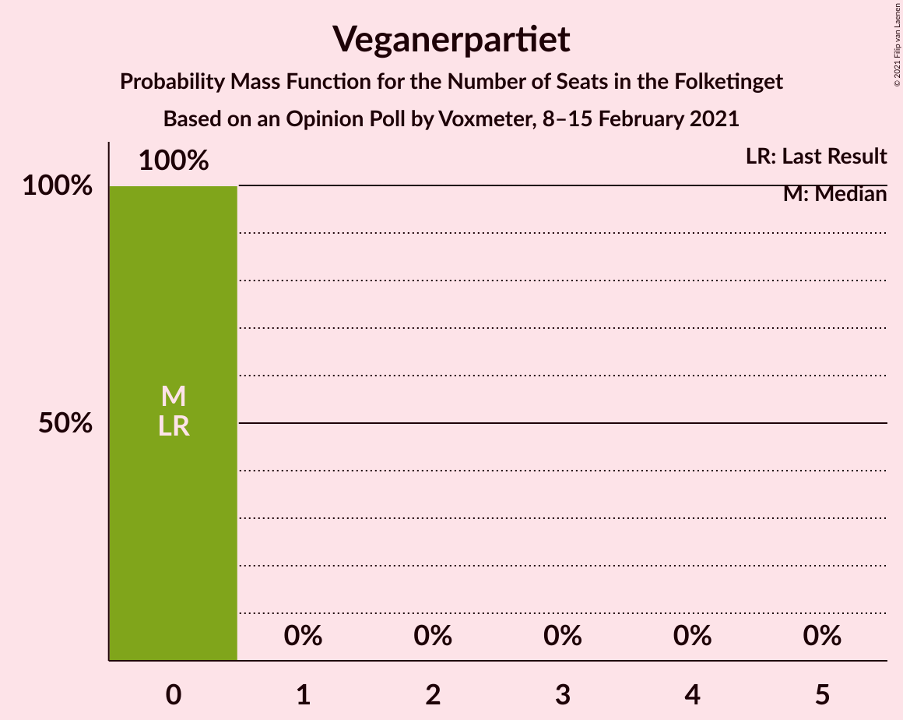
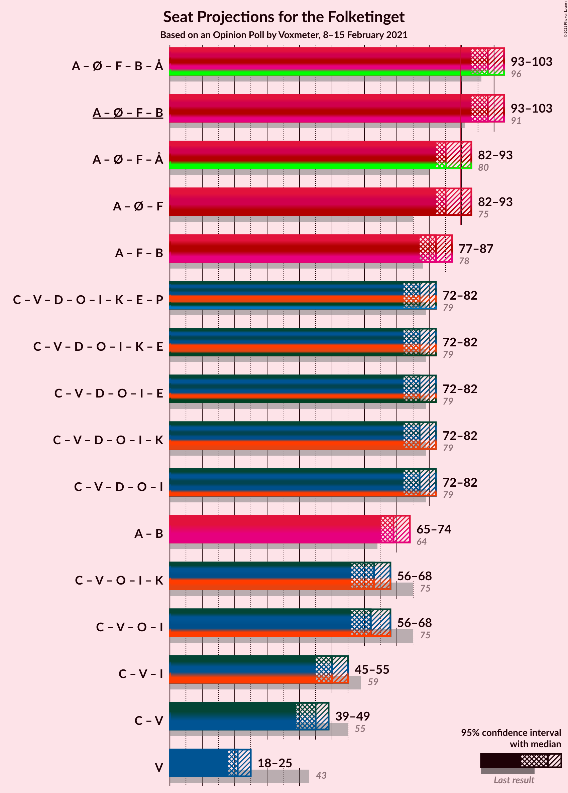
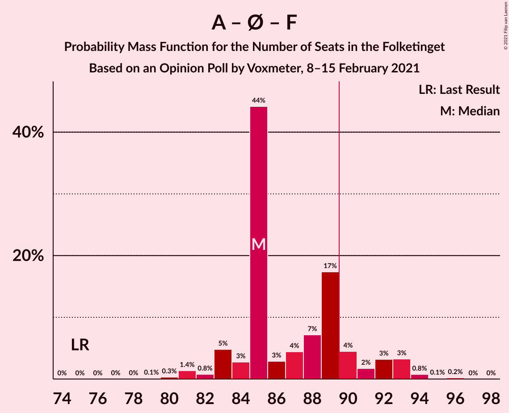
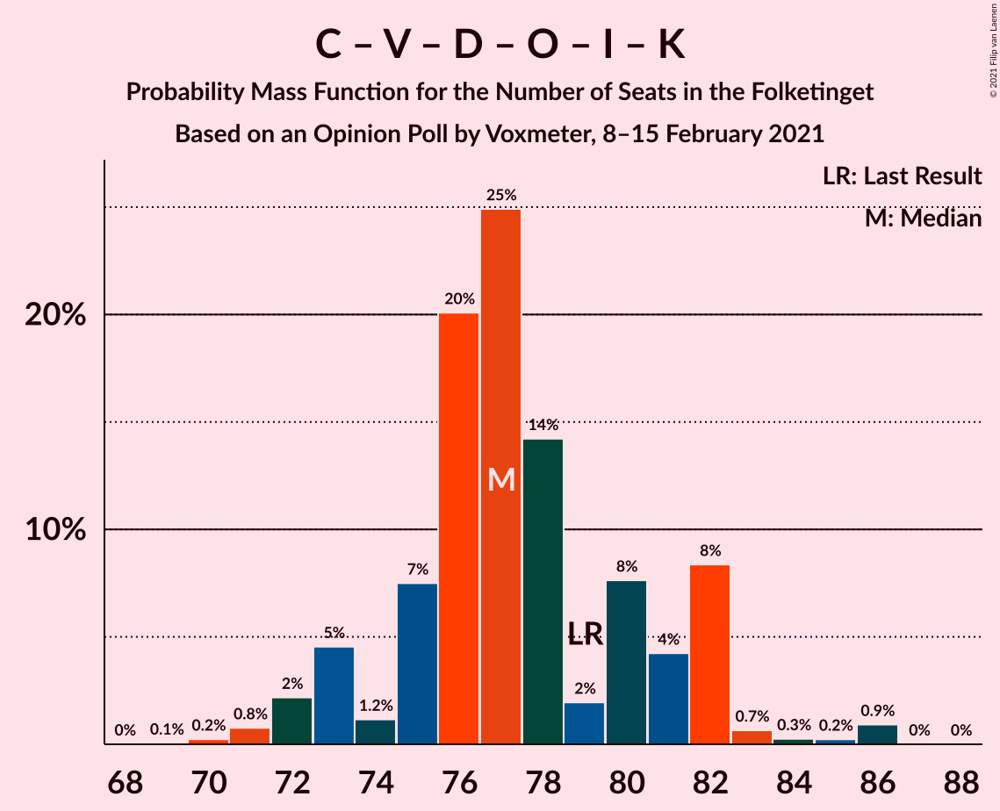

# Opinion Poll by Voxmeter, 8–15 February 2021

<a href="#voting-intentions">Voting Intentions</a> | <a href="#seats">Seats</a> | <a href="#coalitions">Coalitions</a> | <a href="#technical-information">Technical Information</a>

## Voting Intentions

### Confidence Intervals

| Party | Last Result | Poll Result | 80% Confidence Interval | 90% Confidence Interval | 95% Confidence Interval | 99% Confidence Interval |
|:-----:|:-----------:|:-----------:|:-----------------------:|:-----------------------:|:-----------------------:|:-----------------------:|
| Socialdemokraterne | 25.9% | 32.9% | 31.0–34.8% |30.5–35.3% |30.1–35.8% |29.2–36.7% |
| Det Konservative Folkeparti | 6.6% | 12.9% | 11.6–14.3% |11.3–14.7% |11.0–15.1% |10.4–15.8% |
| Venstre | 23.4% | 11.8% | 10.6–13.2% |10.3–13.6% |10.0–13.9% |9.4–14.6% |
| Enhedslisten–De Rød-Grønne | 6.9% | 8.7% | 7.6–9.9% |7.3–10.2% |7.1–10.5% |6.6–11.1% |
| Nye Borgerlige | 2.4% | 8.4% | 7.3–9.6% |7.1–9.9% |6.8–10.2% |6.4–10.8% |
| Socialistisk Folkeparti | 7.7% | 7.1% | 6.2–8.2% |5.9–8.6% |5.7–8.9% |5.3–9.4% |
| Dansk Folkeparti | 8.7% | 6.6% | 5.7–7.7% |5.5–8.0% |5.3–8.3% |4.9–8.9% |
| Radikale Venstre | 8.6% | 5.6% | 4.8–6.6% |4.5–6.9% |4.3–7.1% |4.0–7.7% |
| Liberal Alliance | 2.3% | 2.9% | 2.3–3.7% |2.1–3.9% |2.0–4.1% |1.8–4.5% |
| Kristendemokraterne | 1.7% | 1.5% | 1.1–2.2% |1.0–2.3% |0.9–2.5% |0.8–2.8% |
| Alternativet | 3.0% | 0.5% | 0.3–0.9% |0.2–1.0% |0.2–1.1% |0.1–1.4% |
| Veganerpartiet | 0.0% | 0.4% | 0.2–0.8% |0.2–0.9% |0.2–1.0% |0.1–1.2% |

*Note:* The poll result column reflects the actual value used in the calculations. Published results may vary slightly, and in addition be rounded to fewer digits.

## Seats

### Confidence Intervals

| Party | Last Result | Median | 80% Confidence Interval | 90% Confidence Interval | 95% Confidence Interval | 99% Confidence Interval |
|:-----:|:-----------:|:------:|:-----------------------:|:-----------------------:|:-----------------------:|:-----------------------:|
| <a href="#socialdemokraterne">Socialdemokraterne</a> | 48 | 57 | 56–61 |55–63 |55–64 |53–64 |
| <a href="#det-konservative-folkeparti">Det Konservative Folkeparti</a> | 12 | 24 | 22–25 |20–26 |20–27 |19–28 |
| <a href="#venstre">Venstre</a> | 43 | 21 | 19–24 |18–25 |18–25 |17–25 |
| <a href="#enhedslisten–de-rød-grønne">Enhedslisten–De Rød-Grønne</a> | 13 | 16 | 14–18 |13–18 |12–19 |12–20 |
| <a href="#nye-borgerlige">Nye Borgerlige</a> | 4 | 15 | 12–18 |12–18 |11–18 |11–19 |
| <a href="#socialistisk-folkeparti">Socialistisk Folkeparti</a> | 14 | 12 | 11–14 |11–14 |10–15 |10–16 |
| <a href="#dansk-folkeparti">Dansk Folkeparti</a> | 16 | 12 | 11–14 |11–14 |10–14 |9–16 |
| <a href="#radikale-venstre">Radikale Venstre</a> | 16 | 11 | 8–13 |8–13 |8–13 |7–14 |
| <a href="#liberal-alliance">Liberal Alliance</a> | 4 | 5 | 4–7 |4–7 |4–7 |0–8 |
| <a href="#kristendemokraterne">Kristendemokraterne</a> | 0 | 0 | 0 |0–4 |0–4 |0–5 |
| <a href="#alternativet">Alternativet</a> | 5 | 0 | 0 |0 |0 |0 |
| <a href="#veganerpartiet">Veganerpartiet</a> | 0 | 0 | 0 |0 |0 |0 |

### Socialdemokraterne

*For a full overview of the results for this party, see the [Socialdemokraterne](party-socialdemokraterne.html) page.*

| Number of Seats | Probability | Accumulated | Special Marks |
|:---------------:|:-----------:|:-----------:|:-------------:|
| 48 | 0% | 100% | Last Result |
| 49 | 0% | 100% |  |
| 50 | 0% | 100% |  |
| 51 | 0.1% | 100% |  |
| 52 | 0.1% | 99.9% |  |
| 53 | 0.7% | 99.8% |  |
| 54 | 0.7% | 99.0% |  |
| 55 | 4% | 98% |  |
| 56 | 27% | 94% |  |
| 57 | 21% | 67% | Median |
| 58 | 4% | 46% |  |
| 59 | 4% | 42% |  |
| 60 | 26% | 38% |  |
| 61 | 5% | 12% |  |
| 62 | 1.0% | 7% |  |
| 63 | 1.3% | 6% |  |
| 64 | 4% | 4% |  |
| 65 | 0.4% | 0.5% |  |
| 66 | 0% | 0.1% |  |
| 67 | 0% | 0% |  |

### Det Konservative Folkeparti

*For a full overview of the results for this party, see the [Det Konservative Folkeparti](party-detkonservativefolkeparti.html) page.*

| Number of Seats | Probability | Accumulated | Special Marks |
|:---------------:|:-----------:|:-----------:|:-------------:|
| 12 | 0% | 100% | Last Result |
| 13 | 0% | 100% |  |
| 14 | 0% | 100% |  |
| 15 | 0% | 100% |  |
| 16 | 0% | 100% |  |
| 17 | 0.1% | 100% |  |
| 18 | 0.1% | 99.9% |  |
| 19 | 0.4% | 99.8% |  |
| 20 | 5% | 99.4% |  |
| 21 | 2% | 94% |  |
| 22 | 10% | 93% |  |
| 23 | 19% | 83% |  |
| 24 | 30% | 64% | Median |
| 25 | 26% | 34% |  |
| 26 | 3% | 7% |  |
| 27 | 4% | 5% |  |
| 28 | 0.8% | 1.0% |  |
| 29 | 0.1% | 0.2% |  |
| 30 | 0.1% | 0.1% |  |
| 31 | 0% | 0% |  |

### Venstre

*For a full overview of the results for this party, see the [Venstre](party-venstre.html) page.*

| Number of Seats | Probability | Accumulated | Special Marks |
|:---------------:|:-----------:|:-----------:|:-------------:|
| 16 | 0.2% | 100% |  |
| 17 | 1.1% | 99.8% |  |
| 18 | 5% | 98.7% |  |
| 19 | 24% | 93% |  |
| 20 | 14% | 69% |  |
| 21 | 28% | 56% | Median |
| 22 | 5% | 28% |  |
| 23 | 10% | 23% |  |
| 24 | 6% | 14% |  |
| 25 | 7% | 7% |  |
| 26 | 0.3% | 0.5% |  |
| 27 | 0.2% | 0.2% |  |
| 28 | 0% | 0% |  |
| 29 | 0% | 0% |  |
| 30 | 0% | 0% |  |
| 31 | 0% | 0% |  |
| 32 | 0% | 0% |  |
| 33 | 0% | 0% |  |
| 34 | 0% | 0% |  |
| 35 | 0% | 0% |  |
| 36 | 0% | 0% |  |
| 37 | 0% | 0% |  |
| 38 | 0% | 0% |  |
| 39 | 0% | 0% |  |
| 40 | 0% | 0% |  |
| 41 | 0% | 0% |  |
| 42 | 0% | 0% |  |
| 43 | 0% | 0% | Last Result |

### Enhedslisten–De Rød-Grønne

*For a full overview of the results for this party, see the [Enhedslisten–De Rød-Grønne](party-enhedslisten–derød-grønne.html) page.*

| Number of Seats | Probability | Accumulated | Special Marks |
|:---------------:|:-----------:|:-----------:|:-------------:|
| 12 | 3% | 100% |  |
| 13 | 3% | 97% | Last Result |
| 14 | 20% | 93% |  |
| 15 | 4% | 74% |  |
| 16 | 27% | 69% | Median |
| 17 | 30% | 42% |  |
| 18 | 7% | 12% |  |
| 19 | 4% | 5% |  |
| 20 | 0.6% | 0.7% |  |
| 21 | 0.1% | 0.1% |  |
| 22 | 0.1% | 0.1% |  |
| 23 | 0% | 0% |  |

### Nye Borgerlige

*For a full overview of the results for this party, see the [Nye Borgerlige](party-nyeborgerlige.html) page.*

| Number of Seats | Probability | Accumulated | Special Marks |
|:---------------:|:-----------:|:-----------:|:-------------:|
| 4 | 0% | 100% | Last Result |
| 5 | 0% | 100% |  |
| 6 | 0% | 100% |  |
| 7 | 0% | 100% |  |
| 8 | 0% | 100% |  |
| 9 | 0% | 100% |  |
| 10 | 0% | 100% |  |
| 11 | 3% | 100% |  |
| 12 | 10% | 97% |  |
| 13 | 4% | 87% |  |
| 14 | 31% | 82% |  |
| 15 | 10% | 52% | Median |
| 16 | 17% | 42% |  |
| 17 | 3% | 25% |  |
| 18 | 20% | 22% |  |
| 19 | 2% | 2% |  |
| 20 | 0.1% | 0.1% |  |
| 21 | 0% | 0% |  |

### Socialistisk Folkeparti

*For a full overview of the results for this party, see the [Socialistisk Folkeparti](party-socialistiskfolkeparti.html) page.*

| Number of Seats | Probability | Accumulated | Special Marks |
|:---------------:|:-----------:|:-----------:|:-------------:|
| 9 | 0.1% | 100% |  |
| 10 | 3% | 99.9% |  |
| 11 | 9% | 97% |  |
| 12 | 38% | 88% | Median |
| 13 | 20% | 49% |  |
| 14 | 26% | 29% | Last Result |
| 15 | 2% | 3% |  |
| 16 | 0.3% | 0.6% |  |
| 17 | 0.2% | 0.3% |  |
| 18 | 0.1% | 0.1% |  |
| 19 | 0% | 0% |  |

### Dansk Folkeparti

*For a full overview of the results for this party, see the [Dansk Folkeparti](party-danskfolkeparti.html) page.*

| Number of Seats | Probability | Accumulated | Special Marks |
|:---------------:|:-----------:|:-----------:|:-------------:|
| 8 | 0.1% | 100% |  |
| 9 | 2% | 99.9% |  |
| 10 | 2% | 98% |  |
| 11 | 33% | 96% |  |
| 12 | 34% | 63% | Median |
| 13 | 18% | 29% |  |
| 14 | 9% | 11% |  |
| 15 | 1.0% | 2% |  |
| 16 | 0.5% | 0.6% | Last Result |
| 17 | 0% | 0% |  |

### Radikale Venstre

*For a full overview of the results for this party, see the [Radikale Venstre](party-radikalevenstre.html) page.*

| Number of Seats | Probability | Accumulated | Special Marks |
|:---------------:|:-----------:|:-----------:|:-------------:|
| 6 | 0.1% | 100% |  |
| 7 | 1.1% | 99.9% |  |
| 8 | 9% | 98.8% |  |
| 9 | 10% | 90% |  |
| 10 | 27% | 80% |  |
| 11 | 13% | 53% | Median |
| 12 | 15% | 40% |  |
| 13 | 23% | 25% |  |
| 14 | 2% | 2% |  |
| 15 | 0% | 0.1% |  |
| 16 | 0% | 0% | Last Result |

### Liberal Alliance

*For a full overview of the results for this party, see the [Liberal Alliance](party-liberalalliance.html) page.*

| Number of Seats | Probability | Accumulated | Special Marks |
|:---------------:|:-----------:|:-----------:|:-------------:|
| 0 | 1.4% | 100% |  |
| 1 | 0% | 98.6% |  |
| 2 | 0% | 98.6% |  |
| 3 | 0% | 98.6% |  |
| 4 | 24% | 98.6% | Last Result |
| 5 | 32% | 74% | Median |
| 6 | 29% | 42% |  |
| 7 | 11% | 13% |  |
| 8 | 2% | 2% |  |
| 9 | 0% | 0% |  |

### Kristendemokraterne

*For a full overview of the results for this party, see the [Kristendemokraterne](party-kristendemokraterne.html) page.*

| Number of Seats | Probability | Accumulated | Special Marks |
|:---------------:|:-----------:|:-----------:|:-------------:|
| 0 | 91% | 100% | Last Result, Median |
| 1 | 0% | 9% |  |
| 2 | 0% | 9% |  |
| 3 | 0.4% | 9% |  |
| 4 | 7% | 8% |  |
| 5 | 1.4% | 1.4% |  |
| 6 | 0% | 0% |  |

### Alternativet

*For a full overview of the results for this party, see the [Alternativet](party-alternativet.html) page.*

| Number of Seats | Probability | Accumulated | Special Marks |
|:---------------:|:-----------:|:-----------:|:-------------:|
| 0 | 100% | 100% | Median |
| 1 | 0% | 0% |  |
| 2 | 0% | 0% |  |
| 3 | 0% | 0% |  |
| 4 | 0% | 0% |  |
| 5 | 0% | 0% | Last Result |

### Veganerpartiet

*For a full overview of the results for this party, see the [Veganerpartiet](party-veganerpartiet.html) page.*

| Number of Seats | Probability | Accumulated | Special Marks |
|:---------------:|:-----------:|:-----------:|:-------------:|
| 0 | 100% | 100% | Last Result, Median |

## Coalitions

### Confidence Intervals

| Coalition | Last Result | Median | Majority? | 80% Confidence Interval | 90% Confidence Interval | 95% Confidence Interval | 99% Confidence Interval |
|:---------:|:-----------:|:------:|:---------:|:-----------------------:|:-----------------------:|:-----------------------:|:-----------------------:|
| Socialdemokraterne – Enhedslisten–De Rød-Grønne – Socialistisk Folkeparti – Radikale Venstre – Alternativet | 96 | 98 | 99.0% | 93–100 | 93–102 | 93–103 | 89–104 |
| Socialdemokraterne – Enhedslisten–De Rød-Grønne – Socialistisk Folkeparti – Radikale Venstre | 91 | 98 | 99.0% | 93–100 | 93–102 | 93–103 | 89–104 |
| Socialdemokraterne – Enhedslisten–De Rød-Grønne – Socialistisk Folkeparti – Alternativet | 80 | 85 | 14% | 84–90 | 83–92 | 82–93 | 81–94 |
| Socialdemokraterne – Enhedslisten–De Rød-Grønne – Socialistisk Folkeparti | 75 | 85 | 14% | 84–90 | 83–92 | 82–93 | 81–94 |
| Socialdemokraterne – Socialistisk Folkeparti – Radikale Venstre | 78 | 82 | 0.1% | 79–84 | 78–85 | 77–87 | 75–87 |
| Det Konservative Folkeparti – Venstre – Nye Borgerlige – Dansk Folkeparti – Liberal Alliance – Kristendemokraterne | 79 | 77 | 0% | 75–82 | 73–82 | 72–82 | 71–86 |
| Det Konservative Folkeparti – Venstre – Nye Borgerlige – Dansk Folkeparti – Liberal Alliance | 79 | 77 | 0% | 74–81 | 73–82 | 72–82 | 70–84 |
| Socialdemokraterne – Radikale Venstre | 64 | 69 | 0% | 66–71 | 65–73 | 65–74 | 63–75 |
| Det Konservative Folkeparti – Venstre – Dansk Folkeparti – Liberal Alliance – Kristendemokraterne | 75 | 63 | 0% | 58–67 | 58–67 | 56–68 | 55–70 |
| Det Konservative Folkeparti – Venstre – Dansk Folkeparti – Liberal Alliance | 75 | 62 | 0% | 58–67 | 58–67 | 56–68 | 55–69 |
| Det Konservative Folkeparti – Venstre – Liberal Alliance | 59 | 50 | 0% | 47–54 | 46–55 | 45–55 | 43–56 |
| Det Konservative Folkeparti – Venstre | 55 | 45 | 0% | 42–49 | 41–49 | 39–49 | 38–50 |
| Venstre | 43 | 21 | 0% | 19–24 | 18–25 | 18–25 | 17–25 |

### Socialdemokraterne – Enhedslisten–De Rød-Grønne – Socialistisk Folkeparti – Radikale Venstre – Alternativet

| Number of Seats | Probability | Accumulated | Special Marks |
|:---------------:|:-----------:|:-----------:|:-------------:|
| 89 | 0.9% | 100% |  |
| 90 | 0.2% | 99.0% | Majority |
| 91 | 0.3% | 98.8% |  |
| 92 | 0.7% | 98.6% |  |
| 93 | 8% | 98% |  |
| 94 | 4% | 90% |  |
| 95 | 8% | 85% |  |
| 96 | 2% | 78% | Last Result, Median |
| 97 | 14% | 76% |  |
| 98 | 25% | 61% |  |
| 99 | 20% | 37% |  |
| 100 | 7% | 16% |  |
| 101 | 1.2% | 9% |  |
| 102 | 5% | 8% |  |
| 103 | 2% | 3% |  |
| 104 | 0.8% | 1.1% |  |
| 105 | 0.2% | 0.3% |  |
| 106 | 0% | 0.1% |  |
| 107 | 0% | 0.1% |  |
| 108 | 0% | 0% |  |

### Socialdemokraterne – Enhedslisten–De Rød-Grønne – Socialistisk Folkeparti – Radikale Venstre

| Number of Seats | Probability | Accumulated | Special Marks |
|:---------------:|:-----------:|:-----------:|:-------------:|
| 89 | 0.9% | 100% |  |
| 90 | 0.2% | 99.0% | Majority |
| 91 | 0.3% | 98.8% | Last Result |
| 92 | 0.7% | 98.6% |  |
| 93 | 8% | 98% |  |
| 94 | 4% | 90% |  |
| 95 | 8% | 85% |  |
| 96 | 2% | 78% | Median |
| 97 | 14% | 76% |  |
| 98 | 25% | 61% |  |
| 99 | 20% | 37% |  |
| 100 | 7% | 16% |  |
| 101 | 1.2% | 9% |  |
| 102 | 5% | 8% |  |
| 103 | 2% | 3% |  |
| 104 | 0.8% | 1.1% |  |
| 105 | 0.2% | 0.3% |  |
| 106 | 0% | 0.1% |  |
| 107 | 0% | 0.1% |  |
| 108 | 0% | 0% |  |

### Socialdemokraterne – Enhedslisten–De Rød-Grønne – Socialistisk Folkeparti – Alternativet

| Number of Seats | Probability | Accumulated | Special Marks |
|:---------------:|:-----------:|:-----------:|:-------------:|
| 78 | 0% | 100% |  |
| 79 | 0.1% | 99.9% |  |
| 80 | 0.3% | 99.8% | Last Result |
| 81 | 1.4% | 99.5% |  |
| 82 | 0.8% | 98% |  |
| 83 | 5% | 97% |  |
| 84 | 3% | 93% |  |
| 85 | 44% | 90% | Median |
| 86 | 3% | 46% |  |
| 87 | 4% | 43% |  |
| 88 | 7% | 38% |  |
| 89 | 17% | 31% |  |
| 90 | 4% | 14% | Majority |
| 91 | 2% | 9% |  |
| 92 | 3% | 8% |  |
| 93 | 3% | 4% |  |
| 94 | 0.8% | 1.1% |  |
| 95 | 0.1% | 0.3% |  |
| 96 | 0.2% | 0.2% |  |
| 97 | 0% | 0% |  |

### Socialdemokraterne – Enhedslisten–De Rød-Grønne – Socialistisk Folkeparti

| Number of Seats | Probability | Accumulated | Special Marks |
|:---------------:|:-----------:|:-----------:|:-------------:|
| 75 | 0% | 100% | Last Result |
| 76 | 0% | 100% |  |
| 77 | 0% | 100% |  |
| 78 | 0% | 100% |  |
| 79 | 0.1% | 99.9% |  |
| 80 | 0.3% | 99.8% |  |
| 81 | 1.4% | 99.5% |  |
| 82 | 0.8% | 98% |  |
| 83 | 5% | 97% |  |
| 84 | 3% | 93% |  |
| 85 | 44% | 90% | Median |
| 86 | 3% | 46% |  |
| 87 | 4% | 43% |  |
| 88 | 7% | 38% |  |
| 89 | 17% | 31% |  |
| 90 | 4% | 14% | Majority |
| 91 | 2% | 9% |  |
| 92 | 3% | 8% |  |
| 93 | 3% | 4% |  |
| 94 | 0.8% | 1.1% |  |
| 95 | 0.1% | 0.3% |  |
| 96 | 0.2% | 0.2% |  |
| 97 | 0% | 0% |  |

### Socialdemokraterne – Socialistisk Folkeparti – Radikale Venstre

| Number of Seats | Probability | Accumulated | Special Marks |
|:---------------:|:-----------:|:-----------:|:-------------:|
| 73 | 0.1% | 100% |  |
| 74 | 0.1% | 99.9% |  |
| 75 | 1.0% | 99.8% |  |
| 76 | 0.7% | 98.8% |  |
| 77 | 0.8% | 98% |  |
| 78 | 6% | 97% | Last Result |
| 79 | 11% | 92% |  |
| 80 | 4% | 81% | Median |
| 81 | 27% | 77% |  |
| 82 | 3% | 50% |  |
| 83 | 37% | 47% |  |
| 84 | 3% | 10% |  |
| 85 | 4% | 8% |  |
| 86 | 0.6% | 4% |  |
| 87 | 3% | 3% |  |
| 88 | 0.2% | 0.5% |  |
| 89 | 0.2% | 0.3% |  |
| 90 | 0% | 0.1% | Majority |
| 91 | 0.1% | 0.1% |  |
| 92 | 0.1% | 0.1% |  |
| 93 | 0% | 0% |  |

### Det Konservative Folkeparti – Venstre – Nye Borgerlige – Dansk Folkeparti – Liberal Alliance – Kristendemokraterne

| Number of Seats | Probability | Accumulated | Special Marks |
|:---------------:|:-----------:|:-----------:|:-------------:|
| 68 | 0% | 100% |  |
| 69 | 0.1% | 99.9% |  |
| 70 | 0.2% | 99.9% |  |
| 71 | 0.8% | 99.7% |  |
| 72 | 2% | 98.9% |  |
| 73 | 5% | 97% |  |
| 74 | 1.2% | 92% |  |
| 75 | 7% | 91% |  |
| 76 | 20% | 84% |  |
| 77 | 25% | 63% | Median |
| 78 | 14% | 39% |  |
| 79 | 2% | 24% | Last Result |
| 80 | 8% | 22% |  |
| 81 | 4% | 15% |  |
| 82 | 8% | 10% |  |
| 83 | 0.7% | 2% |  |
| 84 | 0.3% | 1.4% |  |
| 85 | 0.2% | 1.2% |  |
| 86 | 0.9% | 1.0% |  |
| 87 | 0% | 0% |  |

### Det Konservative Folkeparti – Venstre – Nye Borgerlige – Dansk Folkeparti – Liberal Alliance

| Number of Seats | Probability | Accumulated | Special Marks |
|:---------------:|:-----------:|:-----------:|:-------------:|
| 68 | 0% | 100% |  |
| 69 | 0.1% | 99.9% |  |
| 70 | 0.3% | 99.8% |  |
| 71 | 0.9% | 99.5% |  |
| 72 | 3% | 98.6% |  |
| 73 | 5% | 95% |  |
| 74 | 1.5% | 90% |  |
| 75 | 7% | 89% |  |
| 76 | 20% | 82% |  |
| 77 | 28% | 61% | Median |
| 78 | 14% | 33% |  |
| 79 | 2% | 18% | Last Result |
| 80 | 7% | 17% |  |
| 81 | 1.2% | 10% |  |
| 82 | 8% | 9% |  |
| 83 | 0.5% | 1.1% |  |
| 84 | 0.2% | 0.6% |  |
| 85 | 0.2% | 0.3% |  |
| 86 | 0.2% | 0.2% |  |
| 87 | 0% | 0% |  |

### Socialdemokraterne – Radikale Venstre

| Number of Seats | Probability | Accumulated | Special Marks |
|:---------------:|:-----------:|:-----------:|:-------------:|
| 61 | 0% | 100% |  |
| 62 | 0.1% | 99.9% |  |
| 63 | 0.8% | 99.9% |  |
| 64 | 1.2% | 99.0% | Last Result |
| 65 | 7% | 98% |  |
| 66 | 5% | 91% |  |
| 67 | 6% | 86% |  |
| 68 | 7% | 81% | Median |
| 69 | 40% | 74% |  |
| 70 | 18% | 34% |  |
| 71 | 8% | 16% |  |
| 72 | 3% | 9% |  |
| 73 | 2% | 5% |  |
| 74 | 2% | 4% |  |
| 75 | 2% | 2% |  |
| 76 | 0.2% | 0.3% |  |
| 77 | 0% | 0.1% |  |
| 78 | 0% | 0% |  |

### Det Konservative Folkeparti – Venstre – Dansk Folkeparti – Liberal Alliance – Kristendemokraterne

| Number of Seats | Probability | Accumulated | Special Marks |
|:---------------:|:-----------:|:-----------:|:-------------:|
| 54 | 0.1% | 100% |  |
| 55 | 0.6% | 99.8% |  |
| 56 | 2% | 99.3% |  |
| 57 | 0.5% | 97% |  |
| 58 | 16% | 97% |  |
| 59 | 1.4% | 81% |  |
| 60 | 1.1% | 79% |  |
| 61 | 10% | 78% |  |
| 62 | 15% | 68% | Median |
| 63 | 29% | 53% |  |
| 64 | 7% | 25% |  |
| 65 | 1.1% | 18% |  |
| 66 | 5% | 17% |  |
| 67 | 7% | 12% |  |
| 68 | 3% | 5% |  |
| 69 | 0.4% | 2% |  |
| 70 | 1.1% | 1.2% |  |
| 71 | 0.1% | 0.2% |  |
| 72 | 0% | 0.1% |  |
| 73 | 0.1% | 0.1% |  |
| 74 | 0% | 0% |  |
| 75 | 0% | 0% | Last Result |

### Det Konservative Folkeparti – Venstre – Dansk Folkeparti – Liberal Alliance

| Number of Seats | Probability | Accumulated | Special Marks |
|:---------------:|:-----------:|:-----------:|:-------------:|
| 53 | 0% | 100% |  |
| 54 | 0.1% | 99.9% |  |
| 55 | 0.7% | 99.8% |  |
| 56 | 2% | 99.1% |  |
| 57 | 0.7% | 97% |  |
| 58 | 17% | 96% |  |
| 59 | 6% | 79% |  |
| 60 | 2% | 74% |  |
| 61 | 10% | 71% |  |
| 62 | 15% | 61% | Median |
| 63 | 24% | 46% |  |
| 64 | 6% | 22% |  |
| 65 | 1.2% | 17% |  |
| 66 | 4% | 15% |  |
| 67 | 7% | 11% |  |
| 68 | 3% | 4% |  |
| 69 | 0.4% | 0.8% |  |
| 70 | 0.4% | 0.4% |  |
| 71 | 0.1% | 0.1% |  |
| 72 | 0% | 0% |  |
| 73 | 0% | 0% |  |
| 74 | 0% | 0% |  |
| 75 | 0% | 0% | Last Result |

### Det Konservative Folkeparti – Venstre – Liberal Alliance

| Number of Seats | Probability | Accumulated | Special Marks |
|:---------------:|:-----------:|:-----------:|:-------------:|
| 40 | 0.1% | 100% |  |
| 41 | 0.2% | 99.9% |  |
| 42 | 0.1% | 99.8% |  |
| 43 | 0.8% | 99.7% |  |
| 44 | 0.2% | 98.9% |  |
| 45 | 3% | 98.7% |  |
| 46 | 2% | 96% |  |
| 47 | 18% | 94% |  |
| 48 | 8% | 76% |  |
| 49 | 14% | 68% |  |
| 50 | 5% | 54% | Median |
| 51 | 27% | 48% |  |
| 52 | 3% | 22% |  |
| 53 | 6% | 19% |  |
| 54 | 6% | 13% |  |
| 55 | 7% | 8% |  |
| 56 | 0.2% | 0.7% |  |
| 57 | 0.3% | 0.5% |  |
| 58 | 0.1% | 0.2% |  |
| 59 | 0% | 0% | Last Result |

### Det Konservative Folkeparti – Venstre

| Number of Seats | Probability | Accumulated | Special Marks |
|:---------------:|:-----------:|:-----------:|:-------------:|
| 38 | 2% | 100% |  |
| 39 | 2% | 98% |  |
| 40 | 1.1% | 96% |  |
| 41 | 1.4% | 95% |  |
| 42 | 6% | 94% |  |
| 43 | 32% | 88% |  |
| 44 | 2% | 55% |  |
| 45 | 4% | 53% | Median |
| 46 | 31% | 49% |  |
| 47 | 4% | 17% |  |
| 48 | 3% | 13% |  |
| 49 | 9% | 10% |  |
| 50 | 0.8% | 1.1% |  |
| 51 | 0.1% | 0.3% |  |
| 52 | 0.1% | 0.2% |  |
| 53 | 0.1% | 0.1% |  |
| 54 | 0% | 0% |  |
| 55 | 0% | 0% | Last Result |

### Venstre

| Number of Seats | Probability | Accumulated | Special Marks |
|:---------------:|:-----------:|:-----------:|:-------------:|
| 16 | 0.2% | 100% |  |
| 17 | 1.1% | 99.8% |  |
| 18 | 5% | 98.7% |  |
| 19 | 24% | 93% |  |
| 20 | 14% | 69% |  |
| 21 | 28% | 56% | Median |
| 22 | 5% | 28% |  |
| 23 | 10% | 23% |  |
| 24 | 6% | 14% |  |
| 25 | 7% | 7% |  |
| 26 | 0.3% | 0.5% |  |
| 27 | 0.2% | 0.2% |  |
| 28 | 0% | 0% |  |
| 29 | 0% | 0% |  |
| 30 | 0% | 0% |  |
| 31 | 0% | 0% |  |
| 32 | 0% | 0% |  |
| 33 | 0% | 0% |  |
| 34 | 0% | 0% |  |
| 35 | 0% | 0% |  |
| 36 | 0% | 0% |  |
| 37 | 0% | 0% |  |
| 38 | 0% | 0% |  |
| 39 | 0% | 0% |  |
| 40 | 0% | 0% |  |
| 41 | 0% | 0% |  |
| 42 | 0% | 0% |  |
| 43 | 0% | 0% | Last Result |

## Technical Information

### Opinion Poll

+ **Polling firm:** Voxmeter
+ **Commissioner(s):** —
+ **Fieldwork period:** 8–15 February 2021

### Calculations

+ **Sample size:** 1040
+ **Simulations done:** 1,048,576
+ **Error estimate:** 2.13%

