# Opinion Poll by Voxmeter, 15–21 February 2021

<a href="#voting-intentions">Voting Intentions</a> | <a href="#seats">Seats</a> | <a href="#coalitions">Coalitions</a> | <a href="#technical-information">Technical Information</a>

## Voting Intentions

### Confidence Intervals

| Party | Last Result | Poll Result | 80% Confidence Interval | 90% Confidence Interval | 95% Confidence Interval | 99% Confidence Interval |
|:-----:|:-----------:|:-----------:|:-----------------------:|:-----------------------:|:-----------------------:|:-----------------------:|
| Socialdemokraterne | 25.9% | 32.1% | 30.3–34.0% |29.8–34.5% |29.3–35.0% |28.5–35.9% |
| Det Konservative Folkeparti | 6.6% | 13.1% | 11.8–14.5% |11.4–14.9% |11.1–15.3% |10.6–16.0% |
| Venstre | 23.4% | 12.7% | 11.4–14.1% |11.1–14.5% |10.8–14.8% |10.2–15.5% |
| Socialistisk Folkeparti | 7.7% | 8.0% | 7.0–9.2% |6.7–9.5% |6.5–9.8% |6.0–10.4% |
| Nye Borgerlige | 2.4% | 8.0% | 7.0–9.2% |6.7–9.5% |6.5–9.8% |6.0–10.4% |
| Enhedslisten–De Rød-Grønne | 6.9% | 7.9% | 6.9–9.1% |6.6–9.4% |6.4–9.7% |5.9–10.3% |
| Dansk Folkeparti | 8.7% | 6.2% | 5.4–7.3% |5.1–7.6% |4.9–7.9% |4.5–8.4% |
| Radikale Venstre | 8.6% | 6.2% | 5.4–7.3% |5.1–7.6% |4.9–7.9% |4.5–8.4% |
| Liberal Alliance | 2.3% | 2.4% | 1.9–3.1% |1.8–3.3% |1.6–3.5% |1.4–3.9% |
| Kristendemokraterne | 1.7% | 1.7% | 1.3–2.4% |1.2–2.6% |1.1–2.7% |0.9–3.1% |
| Alternativet | 3.0% | 0.5% | 0.3–0.9% |0.2–1.0% |0.2–1.1% |0.1–1.4% |
| Veganerpartiet | 0.0% | 0.4% | 0.2–0.8% |0.2–0.9% |0.2–1.0% |0.1–1.2% |

*Note:* The poll result column reflects the actual value used in the calculations. Published results may vary slightly, and in addition be rounded to fewer digits.

## Seats

### Confidence Intervals

| Party | Last Result | Median | 80% Confidence Interval | 90% Confidence Interval | 95% Confidence Interval | 99% Confidence Interval |
|:-----:|:-----------:|:------:|:-----------------------:|:-----------------------:|:-----------------------:|:-----------------------:|
| <a href="#socialdemokraterne">Socialdemokraterne</a> | 48 | 57 | 57–61 |57–61 |54–63 |53–64 |
| <a href="#det-konservative-folkeparti">Det Konservative Folkeparti</a> | 12 | 26 | 23–26 |21–26 |20–26 |18–27 |
| <a href="#venstre">Venstre</a> | 43 | 21 | 21 |21–22 |20–23 |19–26 |
| <a href="#socialistisk-folkeparti">Socialistisk Folkeparti</a> | 14 | 13 | 13 |13–15 |13–16 |12–17 |
| <a href="#nye-borgerlige">Nye Borgerlige</a> | 4 | 12 | 12–15 |12–15 |12–16 |10–17 |
| <a href="#enhedslisten–de-rød-grønne">Enhedslisten–De Rød-Grønne</a> | 13 | 15 | 13–15 |13–15 |13–17 |12–18 |
| <a href="#dansk-folkeparti">Dansk Folkeparti</a> | 16 | 11 | 9–11 |9–11 |9–13 |8–13 |
| <a href="#radikale-venstre">Radikale Venstre</a> | 16 | 11 | 11 |11–13 |10–13 |9–15 |
| <a href="#liberal-alliance">Liberal Alliance</a> | 4 | 5 | 5 |4–5 |0–5 |0–7 |
| <a href="#kristendemokraterne">Kristendemokraterne</a> | 0 | 4 | 4 |4 |0–4 |0–5 |
| <a href="#alternativet">Alternativet</a> | 5 | 0 | 0 |0 |0 |0 |
| <a href="#veganerpartiet">Veganerpartiet</a> | 0 | 0 | 0 |0 |0 |0 |

### Socialdemokraterne

*For a full overview of the results for this party, see the [Socialdemokraterne](party-socialdemokraterne.html) page.*

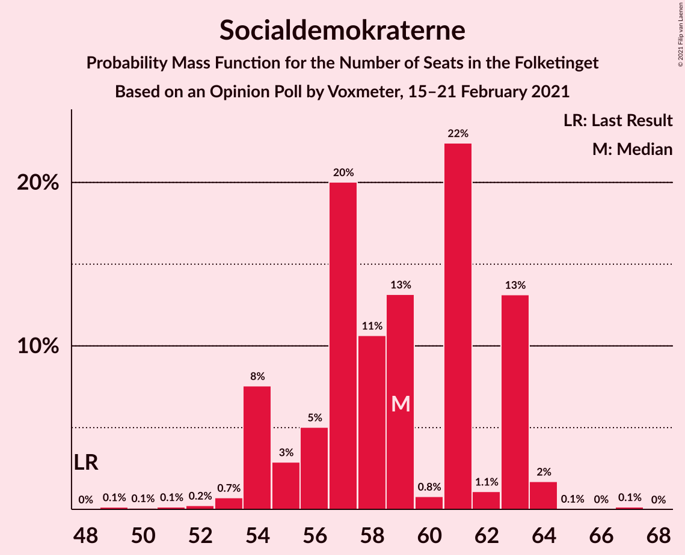

| Number of Seats | Probability | Accumulated | Special Marks |
|:---------------:|:-----------:|:-----------:|:-------------:|
| 48 | 0% | 100% | Last Result |
| 49 | 0% | 100% |  |
| 50 | 0% | 100% |  |
| 51 | 0.1% | 100% |  |
| 52 | 0.2% | 99.9% |  |
| 53 | 0.2% | 99.7% |  |
| 54 | 2% | 99.5% |  |
| 55 | 0.7% | 97% |  |
| 56 | 0.7% | 96% |  |
| 57 | 54% | 96% | Median |
| 58 | 0.3% | 42% |  |
| 59 | 0.4% | 41% |  |
| 60 | 2% | 41% |  |
| 61 | 36% | 39% |  |
| 62 | 0.2% | 3% |  |
| 63 | 2% | 3% |  |
| 64 | 0.7% | 0.9% |  |
| 65 | 0% | 0.1% |  |
| 66 | 0.1% | 0.1% |  |
| 67 | 0.1% | 0.1% |  |
| 68 | 0% | 0% |  |

### Det Konservative Folkeparti

*For a full overview of the results for this party, see the [Det Konservative Folkeparti](party-detkonservativefolkeparti.html) page.*

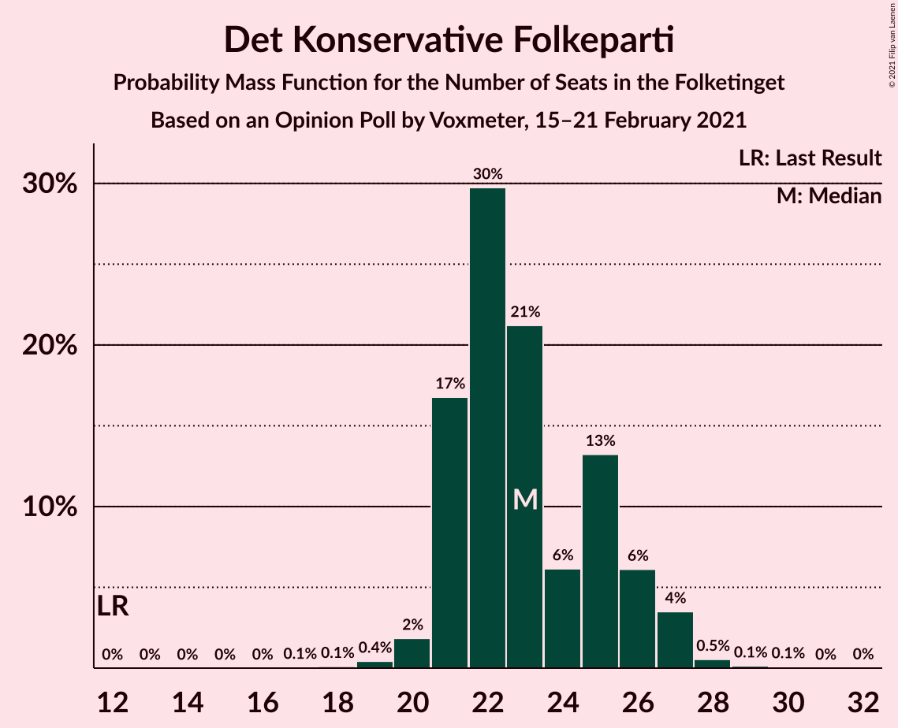

| Number of Seats | Probability | Accumulated | Special Marks |
|:---------------:|:-----------:|:-----------:|:-------------:|
| 12 | 0% | 100% | Last Result |
| 13 | 0% | 100% |  |
| 14 | 0% | 100% |  |
| 15 | 0% | 100% |  |
| 16 | 0% | 100% |  |
| 17 | 0.2% | 100% |  |
| 18 | 0.5% | 99.8% |  |
| 19 | 0.3% | 99.2% |  |
| 20 | 4% | 99.0% |  |
| 21 | 2% | 95% |  |
| 22 | 2% | 93% |  |
| 23 | 36% | 91% |  |
| 24 | 0.5% | 55% |  |
| 25 | 2% | 54% |  |
| 26 | 52% | 52% | Median |
| 27 | 0.6% | 0.8% |  |
| 28 | 0.1% | 0.2% |  |
| 29 | 0% | 0% |  |

### Venstre

*For a full overview of the results for this party, see the [Venstre](party-venstre.html) page.*

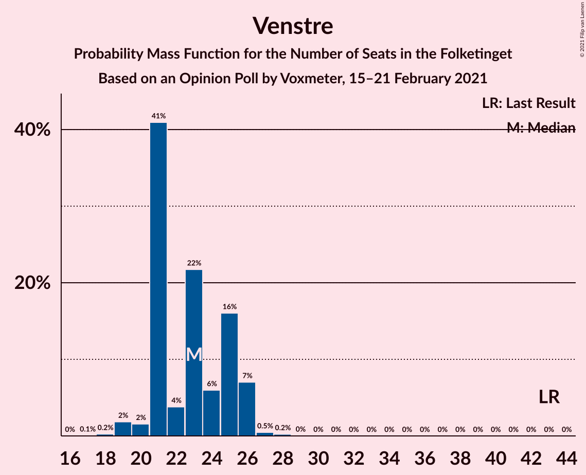

| Number of Seats | Probability | Accumulated | Special Marks |
|:---------------:|:-----------:|:-----------:|:-------------:|
| 18 | 0% | 100% |  |
| 19 | 1.1% | 99.9% |  |
| 20 | 2% | 98.9% |  |
| 21 | 89% | 97% | Median |
| 22 | 4% | 8% |  |
| 23 | 1.0% | 3% |  |
| 24 | 1.1% | 2% |  |
| 25 | 0.3% | 1.2% |  |
| 26 | 0.5% | 0.9% |  |
| 27 | 0.3% | 0.4% |  |
| 28 | 0.1% | 0.1% |  |
| 29 | 0% | 0% |  |
| 30 | 0% | 0% |  |
| 31 | 0% | 0% |  |
| 32 | 0% | 0% |  |
| 33 | 0% | 0% |  |
| 34 | 0% | 0% |  |
| 35 | 0% | 0% |  |
| 36 | 0% | 0% |  |
| 37 | 0% | 0% |  |
| 38 | 0% | 0% |  |
| 39 | 0% | 0% |  |
| 40 | 0% | 0% |  |
| 41 | 0% | 0% |  |
| 42 | 0% | 0% |  |
| 43 | 0% | 0% | Last Result |

### Socialistisk Folkeparti

*For a full overview of the results for this party, see the [Socialistisk Folkeparti](party-socialistiskfolkeparti.html) page.*

| Number of Seats | Probability | Accumulated | Special Marks |
|:---------------:|:-----------:|:-----------:|:-------------:|
| 10 | 0.1% | 100% |  |
| 11 | 0.3% | 99.9% |  |
| 12 | 2% | 99.6% |  |
| 13 | 89% | 98% | Median |
| 14 | 0.5% | 9% | Last Result |
| 15 | 4% | 8% |  |
| 16 | 3% | 5% |  |
| 17 | 2% | 2% |  |
| 18 | 0.1% | 0.2% |  |
| 19 | 0.1% | 0.1% |  |
| 20 | 0% | 0% |  |

### Nye Borgerlige

*For a full overview of the results for this party, see the [Nye Borgerlige](party-nyeborgerlige.html) page.*

| Number of Seats | Probability | Accumulated | Special Marks |
|:---------------:|:-----------:|:-----------:|:-------------:|
| 4 | 0% | 100% | Last Result |
| 5 | 0% | 100% |  |
| 6 | 0% | 100% |  |
| 7 | 0% | 100% |  |
| 8 | 0% | 100% |  |
| 9 | 0% | 100% |  |
| 10 | 2% | 100% |  |
| 11 | 0.2% | 98% |  |
| 12 | 52% | 98% | Median |
| 13 | 4% | 46% |  |
| 14 | 2% | 42% |  |
| 15 | 36% | 40% |  |
| 16 | 1.5% | 4% |  |
| 17 | 2% | 2% |  |
| 18 | 0.2% | 0.2% |  |
| 19 | 0% | 0% |  |

### Enhedslisten–De Rød-Grønne

*For a full overview of the results for this party, see the [Enhedslisten–De Rød-Grønne](party-enhedslisten–derød-grønne.html) page.*

| Number of Seats | Probability | Accumulated | Special Marks |
|:---------------:|:-----------:|:-----------:|:-------------:|
| 11 | 0.1% | 100% |  |
| 12 | 1.1% | 99.9% |  |
| 13 | 40% | 98.8% | Last Result |
| 14 | 3% | 59% |  |
| 15 | 52% | 56% | Median |
| 16 | 0.5% | 4% |  |
| 17 | 2% | 3% |  |
| 18 | 1.2% | 1.4% |  |
| 19 | 0.1% | 0.2% |  |
| 20 | 0.1% | 0.1% |  |
| 21 | 0.1% | 0.1% |  |
| 22 | 0% | 0% |  |

### Dansk Folkeparti

*For a full overview of the results for this party, see the [Dansk Folkeparti](party-danskfolkeparti.html) page.*

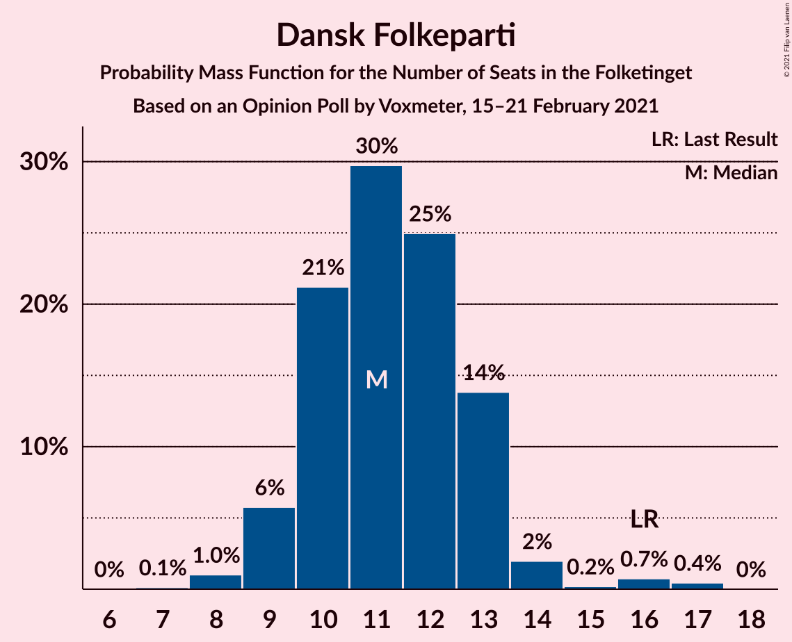

| Number of Seats | Probability | Accumulated | Special Marks |
|:---------------:|:-----------:|:-----------:|:-------------:|
| 7 | 0.1% | 100% |  |
| 8 | 0.6% | 99.9% |  |
| 9 | 36% | 99.3% |  |
| 10 | 3% | 63% |  |
| 11 | 56% | 60% | Median |
| 12 | 1.0% | 4% |  |
| 13 | 3% | 3% |  |
| 14 | 0.3% | 0.4% |  |
| 15 | 0.1% | 0.1% |  |
| 16 | 0% | 0% | Last Result |

### Radikale Venstre

*For a full overview of the results for this party, see the [Radikale Venstre](party-radikalevenstre.html) page.*

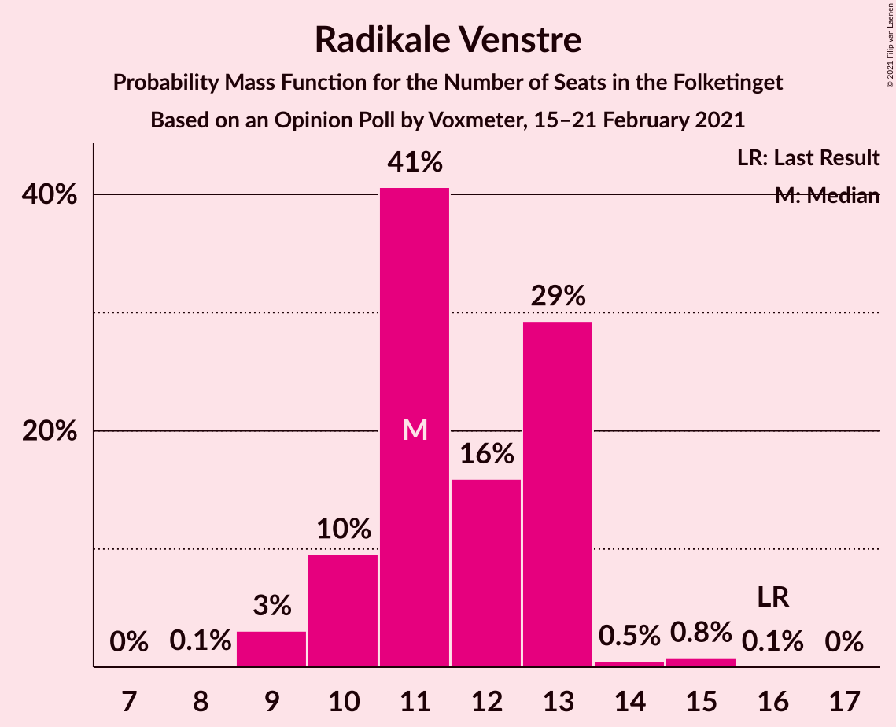

| Number of Seats | Probability | Accumulated | Special Marks |
|:---------------:|:-----------:|:-----------:|:-------------:|
| 8 | 0.1% | 100% |  |
| 9 | 0.6% | 99.8% |  |
| 10 | 2% | 99.2% |  |
| 11 | 88% | 97% | Median |
| 12 | 4% | 9% |  |
| 13 | 4% | 5% |  |
| 14 | 0.1% | 1.2% |  |
| 15 | 1.0% | 1.1% |  |
| 16 | 0% | 0.1% | Last Result |
| 17 | 0% | 0% |  |

### Liberal Alliance

*For a full overview of the results for this party, see the [Liberal Alliance](party-liberalalliance.html) page.*

| Number of Seats | Probability | Accumulated | Special Marks |
|:---------------:|:-----------:|:-----------:|:-------------:|
| 0 | 4% | 100% |  |
| 1 | 0% | 96% |  |
| 2 | 0% | 96% |  |
| 3 | 0% | 96% |  |
| 4 | 5% | 96% | Last Result |
| 5 | 89% | 91% | Median |
| 6 | 0.8% | 2% |  |
| 7 | 1.2% | 1.2% |  |
| 8 | 0% | 0% |  |

### Kristendemokraterne

*For a full overview of the results for this party, see the [Kristendemokraterne](party-kristendemokraterne.html) page.*

| Number of Seats | Probability | Accumulated | Special Marks |
|:---------------:|:-----------:|:-----------:|:-------------:|
| 0 | 3% | 100% | Last Result |
| 1 | 0% | 97% |  |
| 2 | 0% | 97% |  |
| 3 | 0% | 97% |  |
| 4 | 95% | 97% | Median |
| 5 | 1.4% | 1.4% |  |
| 6 | 0% | 0% |  |

### Alternativet

*For a full overview of the results for this party, see the [Alternativet](party-alternativet.html) page.*

| Number of Seats | Probability | Accumulated | Special Marks |
|:---------------:|:-----------:|:-----------:|:-------------:|
| 0 | 100% | 100% | Median |
| 1 | 0% | 0% |  |
| 2 | 0% | 0% |  |
| 3 | 0% | 0% |  |
| 4 | 0% | 0% |  |
| 5 | 0% | 0% | Last Result |

### Veganerpartiet

*For a full overview of the results for this party, see the [Veganerpartiet](party-veganerpartiet.html) page.*

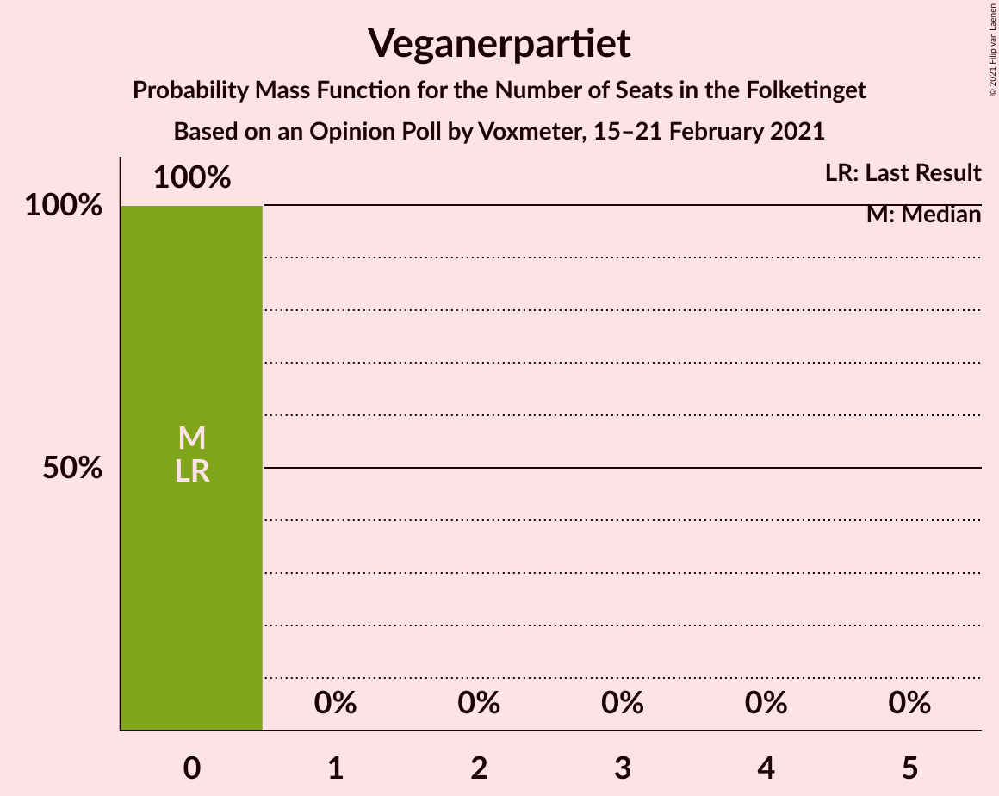

| Number of Seats | Probability | Accumulated | Special Marks |
|:---------------:|:-----------:|:-----------:|:-------------:|
| 0 | 100% | 100% | Last Result, Median |

## Coalitions

### Confidence Intervals

| Coalition | Last Result | Median | Majority? | 80% Confidence Interval | 90% Confidence Interval | 95% Confidence Interval | 99% Confidence Interval |
|:---------:|:-----------:|:------:|:---------:|:-----------------------:|:-----------------------:|:-----------------------:|:-----------------------:|
| Socialdemokraterne – Socialistisk Folkeparti – Enhedslisten–De Rød-Grønne – Radikale Venstre – Alternativet | 96 | 96 | 100% | 96–98 | 96–100 | 96–102 | 93–107 |
| Socialdemokraterne – Socialistisk Folkeparti – Enhedslisten–De Rød-Grønne – Radikale Venstre | 91 | 96 | 100% | 96–98 | 96–100 | 96–102 | 93–107 |
| Socialdemokraterne – Socialistisk Folkeparti – Enhedslisten–De Rød-Grønne – Alternativet | 80 | 85 | 2% | 85–87 | 85–88 | 84–89 | 83–97 |
| Socialdemokraterne – Socialistisk Folkeparti – Enhedslisten–De Rød-Grønne | 75 | 85 | 2% | 85–87 | 85–88 | 84–89 | 83–97 |
| Socialdemokraterne – Socialistisk Folkeparti – Radikale Venstre | 78 | 81 | 0.3% | 81–85 | 81–87 | 81–89 | 79–89 |
| Det Konservative Folkeparti – Venstre – Nye Borgerlige – Dansk Folkeparti – Liberal Alliance – Kristendemokraterne | 79 | 79 | 0% | 77–79 | 75–79 | 73–79 | 68–82 |
| Det Konservative Folkeparti – Venstre – Nye Borgerlige – Dansk Folkeparti – Liberal Alliance | 79 | 75 | 0% | 73–75 | 71–75 | 69–75 | 68–78 |
| Socialdemokraterne – Radikale Venstre | 64 | 68 | 0% | 68–72 | 68–73 | 67–74 | 64–75 |
| Det Konservative Folkeparti – Venstre – Dansk Folkeparti – Liberal Alliance – Kristendemokraterne | 75 | 67 | 0% | 62–67 | 60–67 | 59–67 | 52–67 |
| Det Konservative Folkeparti – Venstre – Dansk Folkeparti – Liberal Alliance | 75 | 63 | 0% | 58–63 | 56–63 | 55–63 | 52–65 |
| Det Konservative Folkeparti – Venstre – Liberal Alliance | 59 | 52 | 0% | 49–52 | 45–52 | 43–52 | 41–54 |
| Det Konservative Folkeparti – Venstre | 55 | 47 | 0% | 44–47 | 42–47 | 41–47 | 40–50 |
| Venstre | 43 | 21 | 0% | 21 | 21–22 | 20–23 | 19–26 |

### Socialdemokraterne – Socialistisk Folkeparti – Enhedslisten–De Rød-Grønne – Radikale Venstre – Alternativet

| Number of Seats | Probability | Accumulated | Special Marks |
|:---------------:|:-----------:|:-----------:|:-------------:|
| 90 | 0% | 100% | Majority |
| 91 | 0% | 99.9% |  |
| 92 | 0.1% | 99.9% |  |
| 93 | 0.4% | 99.8% |  |
| 94 | 0.3% | 99.4% |  |
| 95 | 0.9% | 99.1% |  |
| 96 | 54% | 98% | Last Result, Median |
| 97 | 0.8% | 44% |  |
| 98 | 35% | 43% |  |
| 99 | 1.2% | 8% |  |
| 100 | 2% | 7% |  |
| 101 | 0.3% | 4% |  |
| 102 | 2% | 4% |  |
| 103 | 0% | 2% |  |
| 104 | 0.1% | 2% |  |
| 105 | 0.2% | 2% |  |
| 106 | 0.6% | 1.5% |  |
| 107 | 0.7% | 0.9% |  |
| 108 | 0.1% | 0.1% |  |
| 109 | 0% | 0% |  |

### Socialdemokraterne – Socialistisk Folkeparti – Enhedslisten–De Rød-Grønne – Radikale Venstre

| Number of Seats | Probability | Accumulated | Special Marks |
|:---------------:|:-----------:|:-----------:|:-------------:|
| 90 | 0% | 100% | Majority |
| 91 | 0% | 99.9% | Last Result |
| 92 | 0.1% | 99.9% |  |
| 93 | 0.4% | 99.8% |  |
| 94 | 0.3% | 99.4% |  |
| 95 | 0.9% | 99.1% |  |
| 96 | 54% | 98% | Median |
| 97 | 0.8% | 44% |  |
| 98 | 35% | 43% |  |
| 99 | 1.2% | 8% |  |
| 100 | 2% | 7% |  |
| 101 | 0.3% | 4% |  |
| 102 | 2% | 4% |  |
| 103 | 0% | 2% |  |
| 104 | 0.1% | 2% |  |
| 105 | 0.2% | 2% |  |
| 106 | 0.6% | 1.5% |  |
| 107 | 0.7% | 0.9% |  |
| 108 | 0.1% | 0.1% |  |
| 109 | 0% | 0% |  |

### Socialdemokraterne – Socialistisk Folkeparti – Enhedslisten–De Rød-Grønne – Alternativet

| Number of Seats | Probability | Accumulated | Special Marks |
|:---------------:|:-----------:|:-----------:|:-------------:|
| 78 | 0% | 100% |  |
| 79 | 0.1% | 99.9% |  |
| 80 | 0.1% | 99.8% | Last Result |
| 81 | 0% | 99.8% |  |
| 82 | 0.2% | 99.7% |  |
| 83 | 0.9% | 99.5% |  |
| 84 | 2% | 98.6% |  |
| 85 | 52% | 96% | Median |
| 86 | 2% | 44% |  |
| 87 | 35% | 42% |  |
| 88 | 2% | 7% |  |
| 89 | 2% | 5% |  |
| 90 | 0.2% | 2% | Majority |
| 91 | 1.0% | 2% |  |
| 92 | 0% | 1.2% |  |
| 93 | 0.1% | 1.2% |  |
| 94 | 0.1% | 1.1% |  |
| 95 | 0.1% | 1.0% |  |
| 96 | 0% | 0.9% |  |
| 97 | 0.8% | 0.9% |  |
| 98 | 0% | 0% |  |

### Socialdemokraterne – Socialistisk Folkeparti – Enhedslisten–De Rød-Grønne

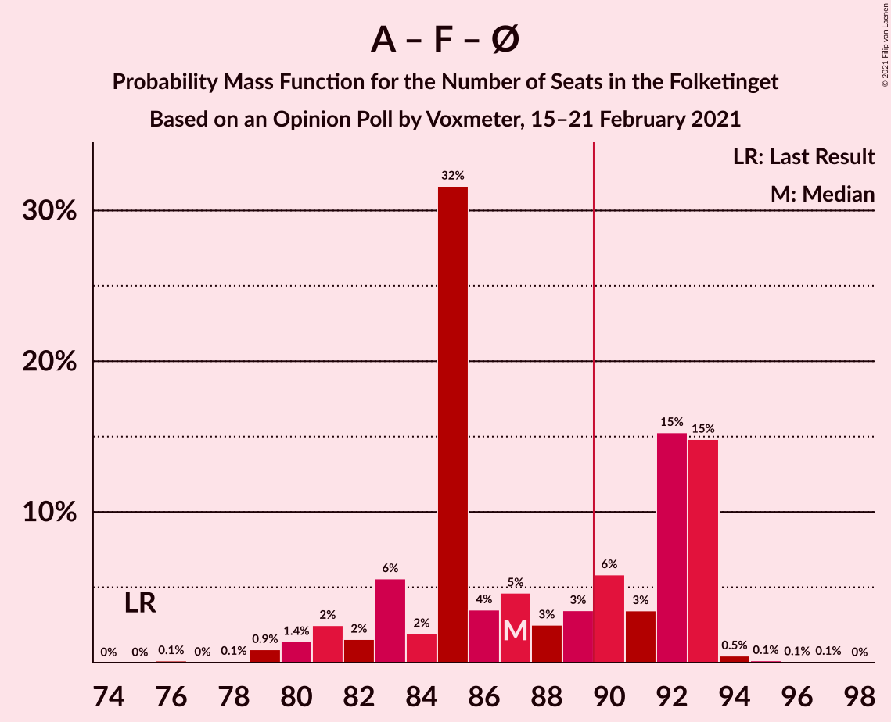

| Number of Seats | Probability | Accumulated | Special Marks |
|:---------------:|:-----------:|:-----------:|:-------------:|
| 75 | 0% | 100% | Last Result |
| 76 | 0% | 100% |  |
| 77 | 0% | 100% |  |
| 78 | 0% | 100% |  |
| 79 | 0.1% | 99.9% |  |
| 80 | 0.1% | 99.8% |  |
| 81 | 0% | 99.8% |  |
| 82 | 0.2% | 99.7% |  |
| 83 | 0.9% | 99.5% |  |
| 84 | 2% | 98.6% |  |
| 85 | 52% | 96% | Median |
| 86 | 2% | 44% |  |
| 87 | 35% | 42% |  |
| 88 | 2% | 7% |  |
| 89 | 2% | 5% |  |
| 90 | 0.2% | 2% | Majority |
| 91 | 1.0% | 2% |  |
| 92 | 0% | 1.2% |  |
| 93 | 0.1% | 1.2% |  |
| 94 | 0.1% | 1.1% |  |
| 95 | 0.1% | 1.0% |  |
| 96 | 0% | 0.9% |  |
| 97 | 0.8% | 0.9% |  |
| 98 | 0% | 0% |  |

### Socialdemokraterne – Socialistisk Folkeparti – Radikale Venstre

| Number of Seats | Probability | Accumulated | Special Marks |
|:---------------:|:-----------:|:-----------:|:-------------:|
| 76 | 0.1% | 100% |  |
| 77 | 0% | 99.8% |  |
| 78 | 0.1% | 99.8% | Last Result |
| 79 | 0.6% | 99.7% |  |
| 80 | 0.1% | 99.1% |  |
| 81 | 52% | 99.0% | Median |
| 82 | 3% | 47% |  |
| 83 | 0.7% | 43% |  |
| 84 | 0.8% | 43% |  |
| 85 | 35% | 42% |  |
| 86 | 0.8% | 7% |  |
| 87 | 2% | 6% |  |
| 88 | 0.4% | 4% |  |
| 89 | 3% | 3% |  |
| 90 | 0.1% | 0.3% | Majority |
| 91 | 0% | 0.2% |  |
| 92 | 0.1% | 0.1% |  |
| 93 | 0.1% | 0.1% |  |
| 94 | 0% | 0% |  |

### Det Konservative Folkeparti – Venstre – Nye Borgerlige – Dansk Folkeparti – Liberal Alliance – Kristendemokraterne

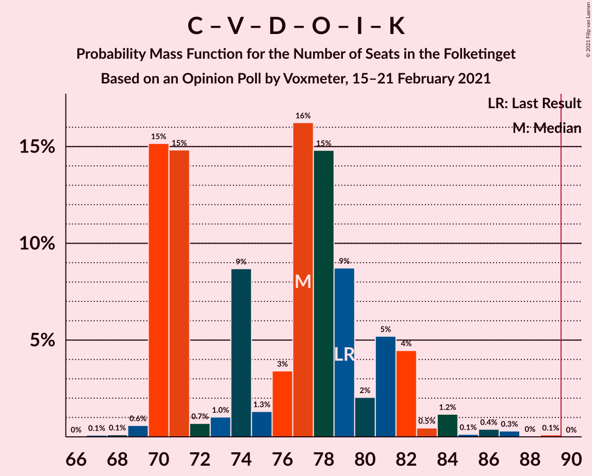

| Number of Seats | Probability | Accumulated | Special Marks |
|:---------------:|:-----------:|:-----------:|:-------------:|
| 67 | 0.1% | 100% |  |
| 68 | 0.7% | 99.9% |  |
| 69 | 0.6% | 99.1% |  |
| 70 | 0.2% | 98.5% |  |
| 71 | 0.1% | 98% |  |
| 72 | 0% | 98% |  |
| 73 | 2% | 98% |  |
| 74 | 0.3% | 96% |  |
| 75 | 4% | 96% |  |
| 76 | 1.2% | 91% |  |
| 77 | 35% | 90% |  |
| 78 | 0.8% | 55% |  |
| 79 | 52% | 54% | Last Result, Median |
| 80 | 0.9% | 2% |  |
| 81 | 0.3% | 0.9% |  |
| 82 | 0.4% | 0.6% |  |
| 83 | 0.1% | 0.2% |  |
| 84 | 0% | 0.1% |  |
| 85 | 0% | 0.1% |  |
| 86 | 0% | 0% |  |

### Det Konservative Folkeparti – Venstre – Nye Borgerlige – Dansk Folkeparti – Liberal Alliance

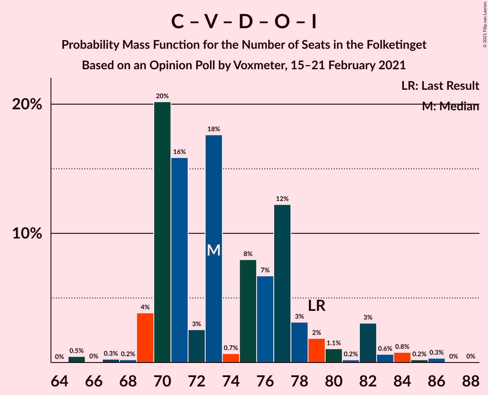

| Number of Seats | Probability | Accumulated | Special Marks |
|:---------------:|:-----------:|:-----------:|:-------------:|
| 66 | 0% | 100% |  |
| 67 | 0.1% | 99.9% |  |
| 68 | 0.7% | 99.8% |  |
| 69 | 3% | 99.1% |  |
| 70 | 0.3% | 96% |  |
| 71 | 4% | 96% |  |
| 72 | 1.2% | 92% |  |
| 73 | 36% | 91% |  |
| 74 | 0.3% | 55% |  |
| 75 | 53% | 55% | Median |
| 76 | 0.7% | 2% |  |
| 77 | 0.2% | 1.1% |  |
| 78 | 0.5% | 0.9% |  |
| 79 | 0.1% | 0.4% | Last Result |
| 80 | 0% | 0.3% |  |
| 81 | 0% | 0.3% |  |
| 82 | 0.1% | 0.3% |  |
| 83 | 0.1% | 0.1% |  |
| 84 | 0% | 0% |  |

### Socialdemokraterne – Radikale Venstre

| Number of Seats | Probability | Accumulated | Special Marks |
|:---------------:|:-----------:|:-----------:|:-------------:|
| 61 | 0.1% | 100% |  |
| 62 | 0.1% | 99.9% |  |
| 63 | 0.2% | 99.9% |  |
| 64 | 0.4% | 99.6% | Last Result |
| 65 | 0.7% | 99.2% |  |
| 66 | 0.5% | 98.5% |  |
| 67 | 2% | 98% |  |
| 68 | 51% | 96% | Median |
| 69 | 2% | 44% |  |
| 70 | 0.3% | 42% |  |
| 71 | 0.9% | 42% |  |
| 72 | 36% | 41% |  |
| 73 | 2% | 5% |  |
| 74 | 0.7% | 3% |  |
| 75 | 2% | 2% |  |
| 76 | 0% | 0.1% |  |
| 77 | 0% | 0.1% |  |
| 78 | 0.1% | 0.1% |  |
| 79 | 0% | 0% |  |

### Det Konservative Folkeparti – Venstre – Dansk Folkeparti – Liberal Alliance – Kristendemokraterne

| Number of Seats | Probability | Accumulated | Special Marks |
|:---------------:|:-----------:|:-----------:|:-------------:|
| 52 | 1.4% | 100% |  |
| 53 | 0% | 98.5% |  |
| 54 | 0% | 98.5% |  |
| 55 | 0.1% | 98.5% |  |
| 56 | 0.1% | 98% |  |
| 57 | 0.4% | 98% |  |
| 58 | 0% | 98% |  |
| 59 | 1.3% | 98% |  |
| 60 | 2% | 97% |  |
| 61 | 2% | 95% |  |
| 62 | 36% | 92% |  |
| 63 | 0.5% | 57% |  |
| 64 | 0.2% | 56% |  |
| 65 | 3% | 56% |  |
| 66 | 1.1% | 53% |  |
| 67 | 52% | 52% | Median |
| 68 | 0.2% | 0.4% |  |
| 69 | 0.1% | 0.2% |  |
| 70 | 0.1% | 0.1% |  |
| 71 | 0% | 0.1% |  |
| 72 | 0% | 0.1% |  |
| 73 | 0% | 0% |  |
| 74 | 0% | 0% |  |
| 75 | 0% | 0% | Last Result |

### Det Konservative Folkeparti – Venstre – Dansk Folkeparti – Liberal Alliance

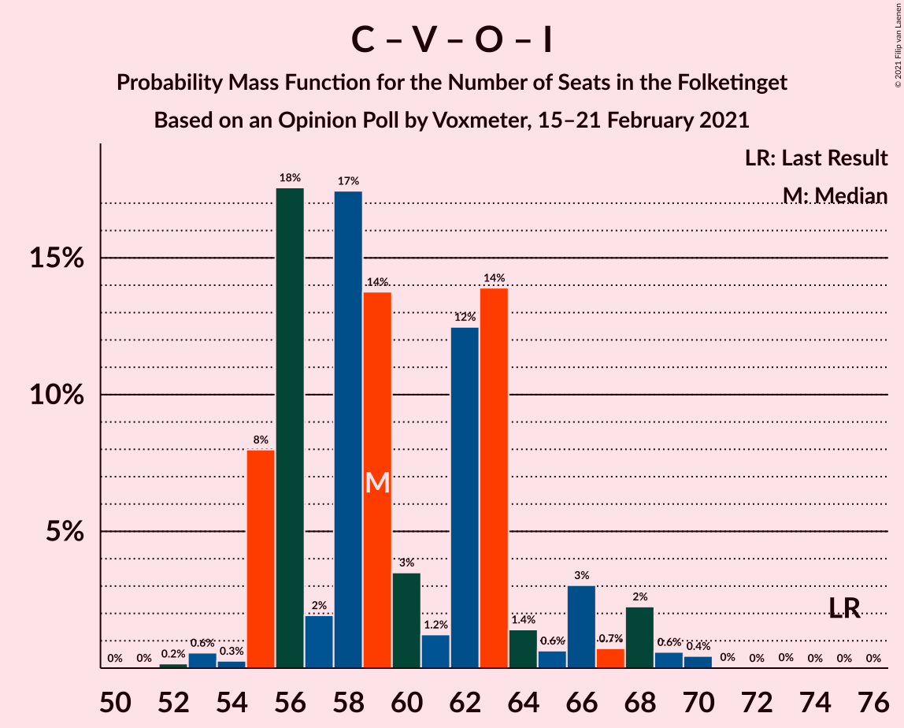

| Number of Seats | Probability | Accumulated | Special Marks |
|:---------------:|:-----------:|:-----------:|:-------------:|
| 51 | 0% | 100% |  |
| 52 | 1.4% | 99.9% |  |
| 53 | 0.3% | 98.5% |  |
| 54 | 0% | 98% |  |
| 55 | 1.2% | 98% |  |
| 56 | 2% | 97% |  |
| 57 | 2% | 95% |  |
| 58 | 35% | 93% |  |
| 59 | 0.5% | 58% |  |
| 60 | 0.8% | 57% |  |
| 61 | 2% | 56% |  |
| 62 | 1.1% | 54% |  |
| 63 | 52% | 53% | Median |
| 64 | 0.2% | 1.0% |  |
| 65 | 0.4% | 0.8% |  |
| 66 | 0.2% | 0.4% |  |
| 67 | 0% | 0.1% |  |
| 68 | 0.1% | 0.1% |  |
| 69 | 0% | 0% |  |
| 70 | 0% | 0% |  |
| 71 | 0% | 0% |  |
| 72 | 0% | 0% |  |
| 73 | 0% | 0% |  |
| 74 | 0% | 0% |  |
| 75 | 0% | 0% | Last Result |

### Det Konservative Folkeparti – Venstre – Liberal Alliance

| Number of Seats | Probability | Accumulated | Special Marks |
|:---------------:|:-----------:|:-----------:|:-------------:|
| 41 | 2% | 100% |  |
| 42 | 0.1% | 98% |  |
| 43 | 2% | 98% |  |
| 44 | 1.1% | 96% |  |
| 45 | 0.4% | 95% |  |
| 46 | 2% | 95% |  |
| 47 | 0.1% | 93% |  |
| 48 | 0.9% | 93% |  |
| 49 | 36% | 92% |  |
| 50 | 0.4% | 56% |  |
| 51 | 2% | 56% |  |
| 52 | 52% | 54% | Median |
| 53 | 1.1% | 2% |  |
| 54 | 0.4% | 0.7% |  |
| 55 | 0.2% | 0.3% |  |
| 56 | 0% | 0.1% |  |
| 57 | 0% | 0.1% |  |
| 58 | 0% | 0.1% |  |
| 59 | 0.1% | 0.1% | Last Result |
| 60 | 0% | 0% |  |

### Det Konservative Folkeparti – Venstre

| Number of Seats | Probability | Accumulated | Special Marks |
|:---------------:|:-----------:|:-----------:|:-------------:|
| 40 | 1.1% | 100% |  |
| 41 | 4% | 98.8% |  |
| 42 | 0.2% | 95% |  |
| 43 | 2% | 95% |  |
| 44 | 36% | 92% |  |
| 45 | 0.6% | 56% |  |
| 46 | 1.4% | 56% |  |
| 47 | 53% | 54% | Median |
| 48 | 0.1% | 1.0% |  |
| 49 | 0.1% | 0.9% |  |
| 50 | 0.5% | 0.8% |  |
| 51 | 0.1% | 0.3% |  |
| 52 | 0.1% | 0.3% |  |
| 53 | 0.1% | 0.1% |  |
| 54 | 0.1% | 0.1% |  |
| 55 | 0% | 0% | Last Result |

### Venstre

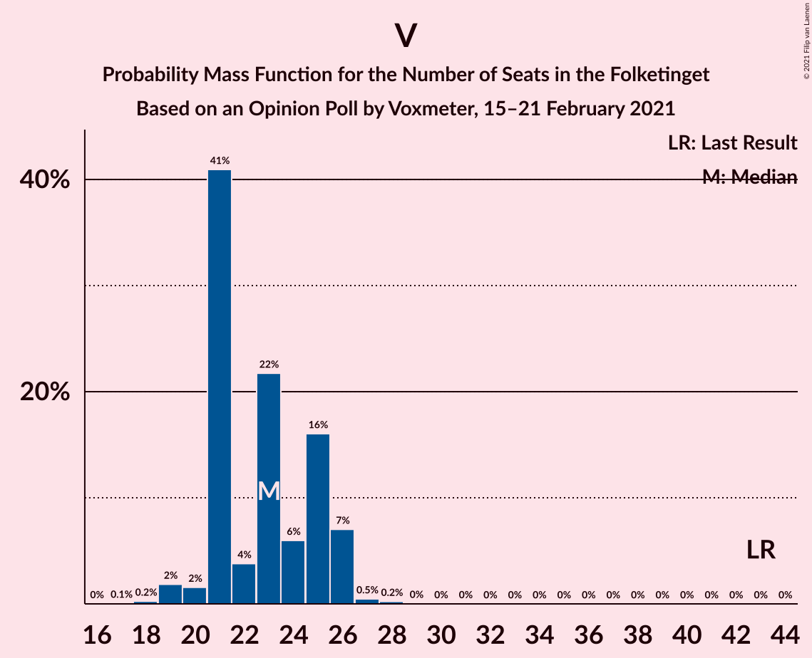

| Number of Seats | Probability | Accumulated | Special Marks |
|:---------------:|:-----------:|:-----------:|:-------------:|
| 18 | 0% | 100% |  |
| 19 | 1.1% | 99.9% |  |
| 20 | 2% | 98.9% |  |
| 21 | 89% | 97% | Median |
| 22 | 4% | 8% |  |
| 23 | 1.0% | 3% |  |
| 24 | 1.1% | 2% |  |
| 25 | 0.3% | 1.2% |  |
| 26 | 0.5% | 0.9% |  |
| 27 | 0.3% | 0.4% |  |
| 28 | 0.1% | 0.1% |  |
| 29 | 0% | 0% |  |
| 30 | 0% | 0% |  |
| 31 | 0% | 0% |  |
| 32 | 0% | 0% |  |
| 33 | 0% | 0% |  |
| 34 | 0% | 0% |  |
| 35 | 0% | 0% |  |
| 36 | 0% | 0% |  |
| 37 | 0% | 0% |  |
| 38 | 0% | 0% |  |
| 39 | 0% | 0% |  |
| 40 | 0% | 0% |  |
| 41 | 0% | 0% |  |
| 42 | 0% | 0% |  |
| 43 | 0% | 0% | Last Result |

## Technical Information

### Opinion Poll

+ **Polling firm:** Voxmeter
+ **Commissioner(s):** —
+ **Fieldwork period:** 15–21 February 2021

### Calculations

+ **Sample size:** 1041
+ **Simulations done:** 131,072
+ **Error estimate:** 2.88%

