# Opinion Poll by Megafon, 22–25 February 2021

<a href="#voting-intentions">Voting Intentions</a> | <a href="#seats">Seats</a> | <a href="#coalitions">Coalitions</a> | <a href="#technical-information">Technical Information</a>

## Voting Intentions

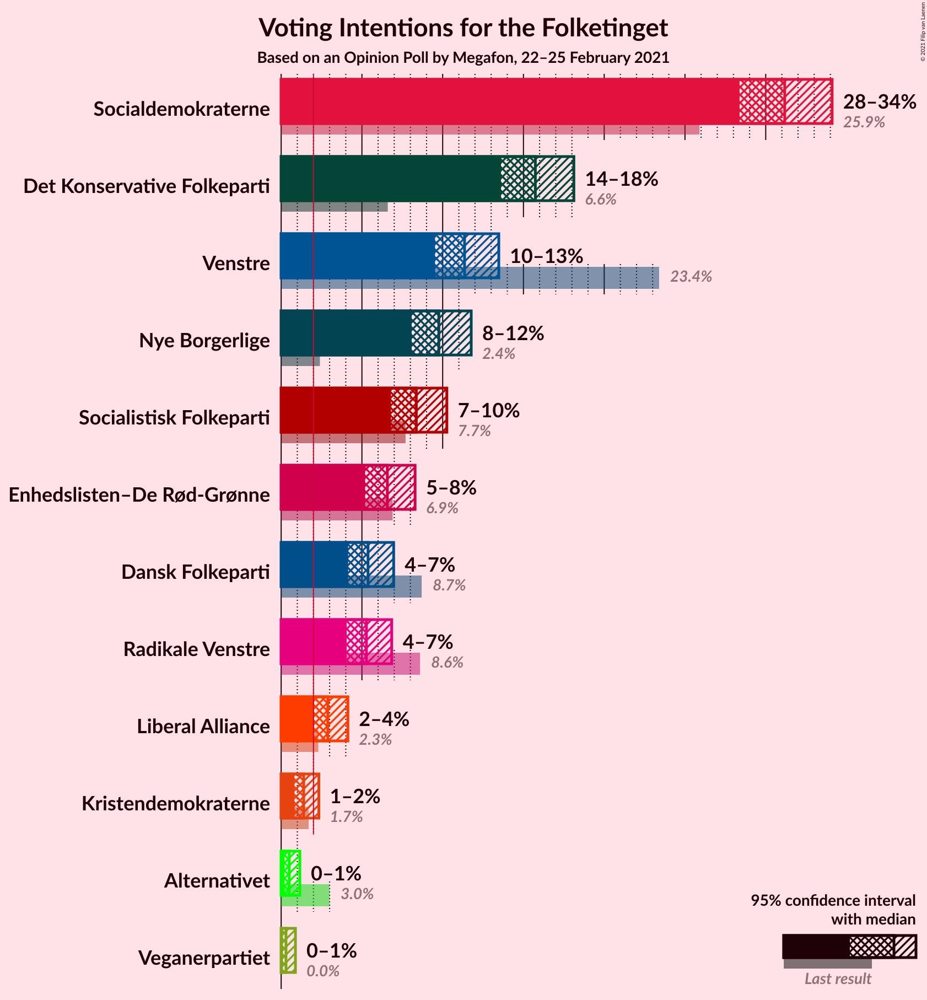

### Confidence Intervals

| Party | Last Result | Poll Result | 80% Confidence Interval | 90% Confidence Interval | 95% Confidence Interval | 99% Confidence Interval |
|:-----:|:-----------:|:-----------:|:-----------------------:|:-----------------------:|:-----------------------:|:-----------------------:|
| Socialdemokraterne | 25.9% | 31.2% | 29.3–33.1% |28.8–33.6% |28.4–34.1% |27.5–35.0% |
| Det Konservative Folkeparti | 6.6% | 15.7% | 14.3–17.3% |13.9–17.7% |13.6–18.1% |13.0–18.9% |
| Venstre | 23.4% | 11.4% | 10.2–12.7% |9.8–13.1% |9.5–13.5% |9.0–14.2% |
| Nye Borgerlige | 2.4% | 9.8% | 8.6–11.1% |8.3–11.4% |8.1–11.8% |7.6–12.4% |
| Socialistisk Folkeparti | 7.7% | 8.4% | 7.3–9.6% |7.0–9.9% |6.8–10.3% |6.3–10.9% |
| Enhedslisten–De Rød-Grønne | 6.9% | 6.6% | 5.7–7.7% |5.4–8.0% |5.2–8.3% |4.8–8.9% |
| Dansk Folkeparti | 8.7% | 5.4% | 4.6–6.4% |4.3–6.7% |4.1–7.0% |3.8–7.5% |
| Radikale Venstre | 8.6% | 5.3% | 4.5–6.3% |4.2–6.6% |4.1–6.8% |3.7–7.4% |
| Liberal Alliance | 2.3% | 2.9% | 2.3–3.7% |2.1–3.9% |2.0–4.1% |1.8–4.5% |
| Kristendemokraterne | 1.7% | 1.4% | 1.0–2.0% |0.9–2.2% |0.8–2.3% |0.7–2.7% |
| Alternativet | 3.0% | 0.5% | 0.3–0.9% |0.3–1.1% |0.2–1.2% |0.2–1.4% |
| Veganerpartiet | 0.0% | 0.3% | 0.2–0.7% |0.1–0.8% |0.1–0.9% |0.1–1.1% |

*Note:* The poll result column reflects the actual value used in the calculations. Published results may vary slightly, and in addition be rounded to fewer digits.

## Seats

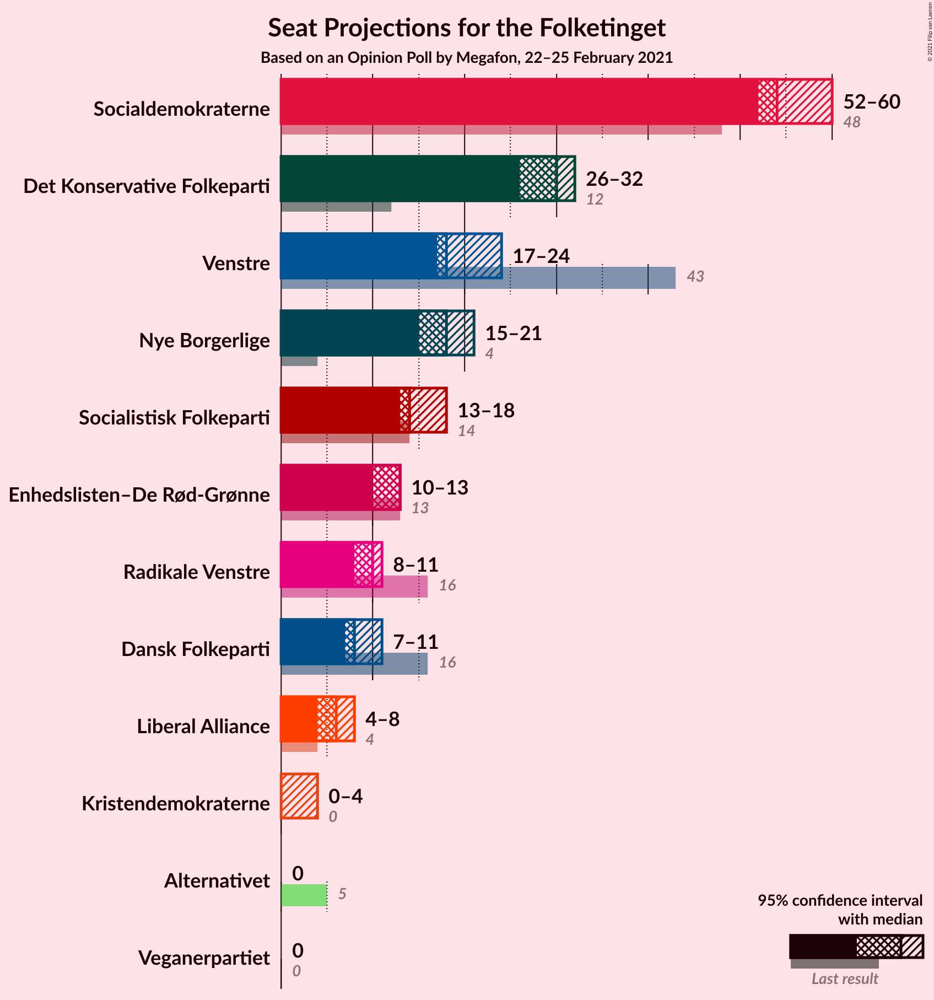

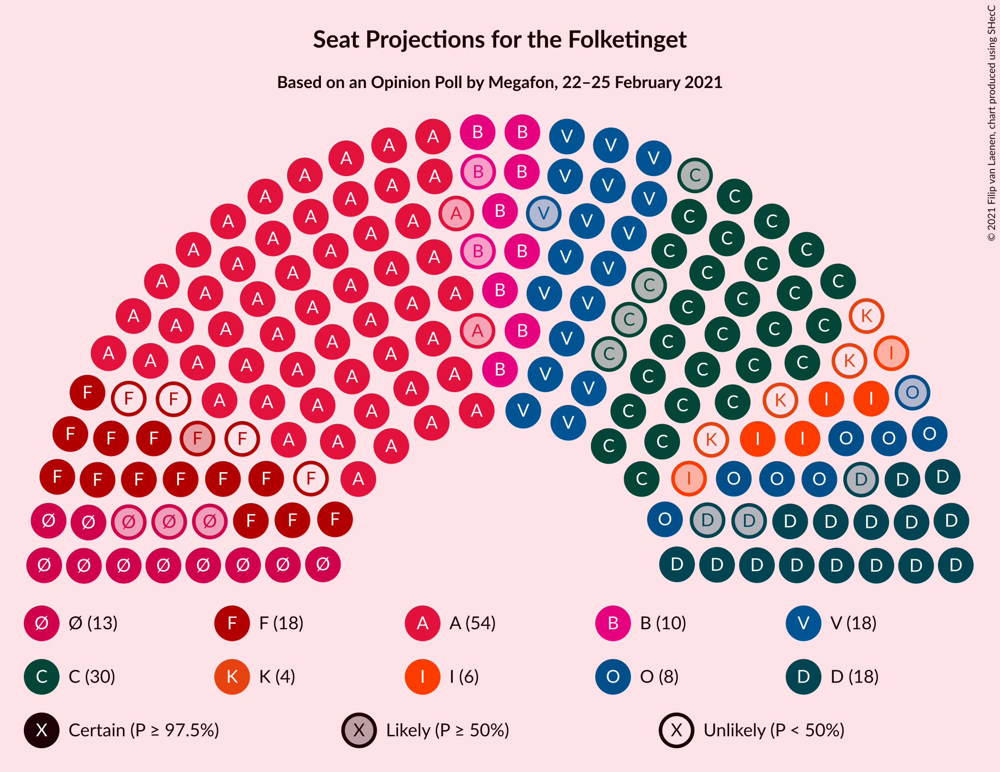

### Confidence Intervals

| Party | Last Result | Median | 80% Confidence Interval | 90% Confidence Interval | 95% Confidence Interval | 99% Confidence Interval |
|:-----:|:-----------:|:------:|:-----------------------:|:-----------------------:|:-----------------------:|:-----------------------:|
| <a href="#socialdemokraterne">Socialdemokraterne</a> | 48 | 56 | 51–60 |51–60 |51–60 |49–62 |
| <a href="#det-konservative-folkeparti">Det Konservative Folkeparti</a> | 12 | 28 | 26–30 |25–31 |25–32 |24–33 |
| <a href="#venstre">Venstre</a> | 43 | 20 | 18–22 |17–24 |17–24 |16–24 |
| <a href="#nye-borgerlige">Nye Borgerlige</a> | 4 | 18 | 16–20 |15–20 |14–20 |13–22 |
| <a href="#socialistisk-folkeparti">Socialistisk Folkeparti</a> | 14 | 15 | 14–16 |13–18 |13–18 |11–19 |
| <a href="#enhedslisten–de-rød-grønne">Enhedslisten–De Rød-Grønne</a> | 13 | 11 | 11–14 |10–14 |10–15 |9–15 |
| <a href="#dansk-folkeparti">Dansk Folkeparti</a> | 16 | 10 | 8–13 |8–13 |8–13 |7–13 |
| <a href="#radikale-venstre">Radikale Venstre</a> | 16 | 10 | 8–11 |7–11 |7–11 |7–13 |
| <a href="#liberal-alliance">Liberal Alliance</a> | 4 | 5 | 5–7 |4–7 |4–8 |4–8 |
| <a href="#kristendemokraterne">Kristendemokraterne</a> | 0 | 0 | 0–4 |0–4 |0–4 |0–4 |
| <a href="#alternativet">Alternativet</a> | 5 | 0 | 0 |0 |0 |0 |
| <a href="#veganerpartiet">Veganerpartiet</a> | 0 | 0 | 0 |0 |0 |0 |

### Socialdemokraterne

*For a full overview of the results for this party, see the [Socialdemokraterne](party-socialdemokraterne.html) page.*

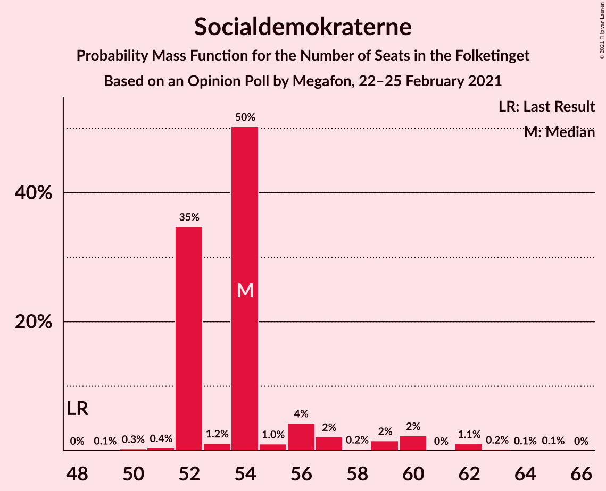

| Number of Seats | Probability | Accumulated | Special Marks |
|:---------------:|:-----------:|:-----------:|:-------------:|
| 47 | 0.1% | 100% |  |
| 48 | 0.1% | 99.9% | Last Result |
| 49 | 0.6% | 99.8% |  |
| 50 | 2% | 99.3% |  |
| 51 | 8% | 98% |  |
| 52 | 4% | 89% |  |
| 53 | 3% | 85% |  |
| 54 | 6% | 82% |  |
| 55 | 1.2% | 75% |  |
| 56 | 54% | 74% | Median |
| 57 | 6% | 20% |  |
| 58 | 2% | 14% |  |
| 59 | 0.8% | 12% |  |
| 60 | 10% | 11% |  |
| 61 | 0.6% | 1.4% |  |
| 62 | 0.7% | 0.8% |  |
| 63 | 0.1% | 0.2% |  |
| 64 | 0.1% | 0.1% |  |
| 65 | 0% | 0% |  |

### Det Konservative Folkeparti

*For a full overview of the results for this party, see the [Det Konservative Folkeparti](party-detkonservativefolkeparti.html) page.*

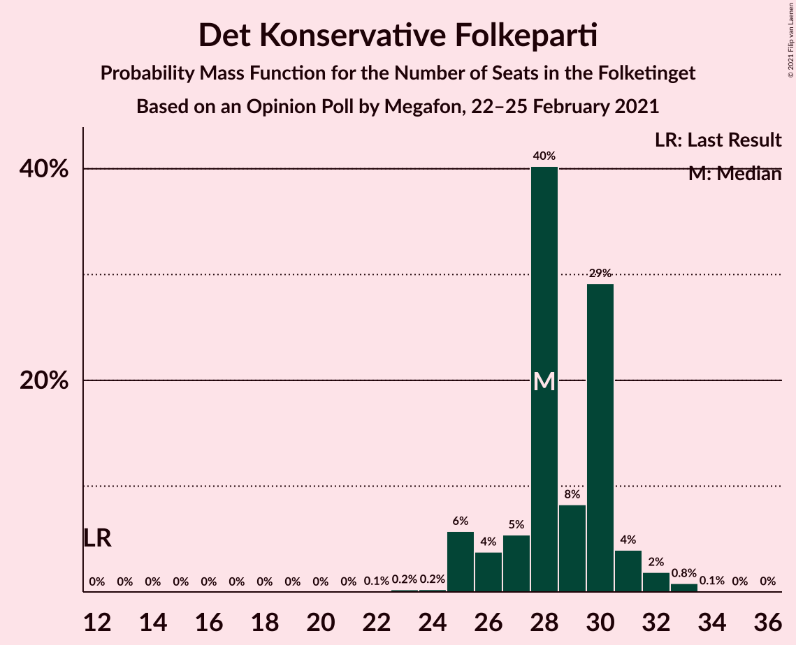

| Number of Seats | Probability | Accumulated | Special Marks |
|:---------------:|:-----------:|:-----------:|:-------------:|
| 12 | 0% | 100% | Last Result |
| 13 | 0% | 100% |  |
| 14 | 0% | 100% |  |
| 15 | 0% | 100% |  |
| 16 | 0% | 100% |  |
| 17 | 0% | 100% |  |
| 18 | 0% | 100% |  |
| 19 | 0% | 100% |  |
| 20 | 0% | 100% |  |
| 21 | 0% | 100% |  |
| 22 | 0.1% | 100% |  |
| 23 | 0.2% | 99.9% |  |
| 24 | 0.2% | 99.7% |  |
| 25 | 6% | 99.4% |  |
| 26 | 4% | 94% |  |
| 27 | 5% | 90% |  |
| 28 | 40% | 85% | Median |
| 29 | 8% | 44% |  |
| 30 | 29% | 36% |  |
| 31 | 4% | 7% |  |
| 32 | 2% | 3% |  |
| 33 | 0.8% | 1.0% |  |
| 34 | 0.1% | 0.2% |  |
| 35 | 0% | 0.1% |  |
| 36 | 0% | 0% |  |

### Venstre

*For a full overview of the results for this party, see the [Venstre](party-venstre.html) page.*

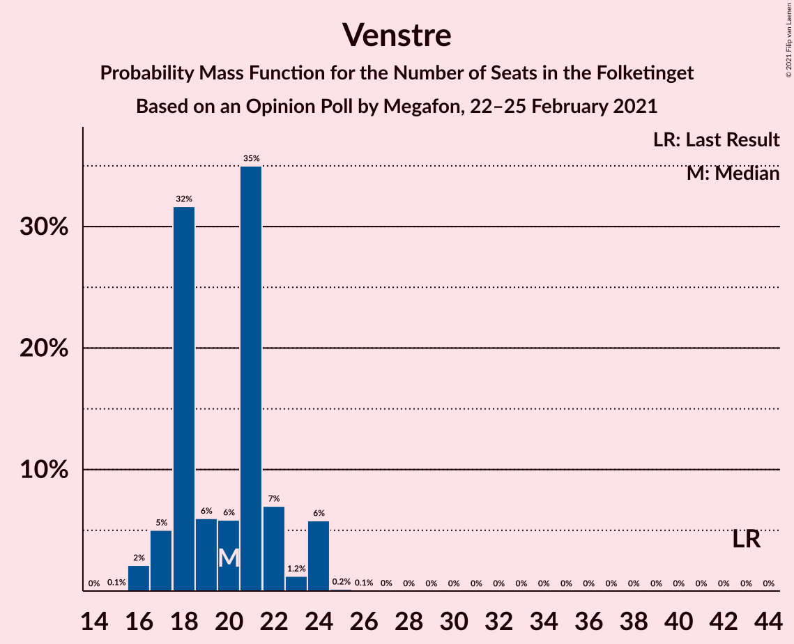

| Number of Seats | Probability | Accumulated | Special Marks |
|:---------------:|:-----------:|:-----------:|:-------------:|
| 15 | 0.1% | 100% |  |
| 16 | 2% | 99.9% |  |
| 17 | 5% | 98% |  |
| 18 | 32% | 93% |  |
| 19 | 6% | 61% |  |
| 20 | 6% | 55% | Median |
| 21 | 35% | 49% |  |
| 22 | 7% | 14% |  |
| 23 | 1.2% | 7% |  |
| 24 | 6% | 6% |  |
| 25 | 0.2% | 0.3% |  |
| 26 | 0.1% | 0.1% |  |
| 27 | 0% | 0% |  |
| 28 | 0% | 0% |  |
| 29 | 0% | 0% |  |
| 30 | 0% | 0% |  |
| 31 | 0% | 0% |  |
| 32 | 0% | 0% |  |
| 33 | 0% | 0% |  |
| 34 | 0% | 0% |  |
| 35 | 0% | 0% |  |
| 36 | 0% | 0% |  |
| 37 | 0% | 0% |  |
| 38 | 0% | 0% |  |
| 39 | 0% | 0% |  |
| 40 | 0% | 0% |  |
| 41 | 0% | 0% |  |
| 42 | 0% | 0% |  |
| 43 | 0% | 0% | Last Result |

### Nye Borgerlige

*For a full overview of the results for this party, see the [Nye Borgerlige](party-nyeborgerlige.html) page.*

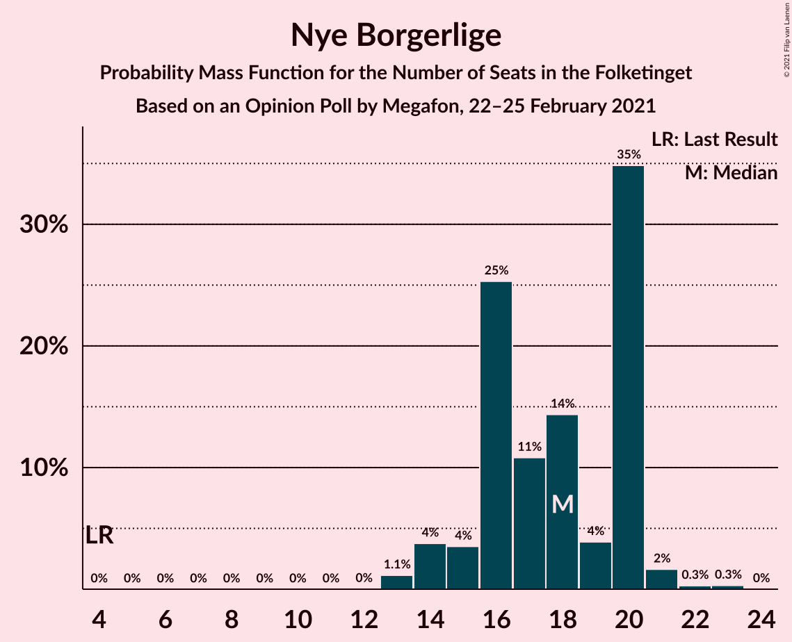

| Number of Seats | Probability | Accumulated | Special Marks |
|:---------------:|:-----------:|:-----------:|:-------------:|
| 4 | 0% | 100% | Last Result |
| 5 | 0% | 100% |  |
| 6 | 0% | 100% |  |
| 7 | 0% | 100% |  |
| 8 | 0% | 100% |  |
| 9 | 0% | 100% |  |
| 10 | 0% | 100% |  |
| 11 | 0% | 100% |  |
| 12 | 0% | 100% |  |
| 13 | 1.1% | 100% |  |
| 14 | 4% | 98.8% |  |
| 15 | 4% | 95% |  |
| 16 | 25% | 92% |  |
| 17 | 11% | 66% |  |
| 18 | 14% | 55% | Median |
| 19 | 4% | 41% |  |
| 20 | 35% | 37% |  |
| 21 | 2% | 2% |  |
| 22 | 0.3% | 0.7% |  |
| 23 | 0.3% | 0.4% |  |
| 24 | 0% | 0% |  |

### Socialistisk Folkeparti

*For a full overview of the results for this party, see the [Socialistisk Folkeparti](party-socialistiskfolkeparti.html) page.*

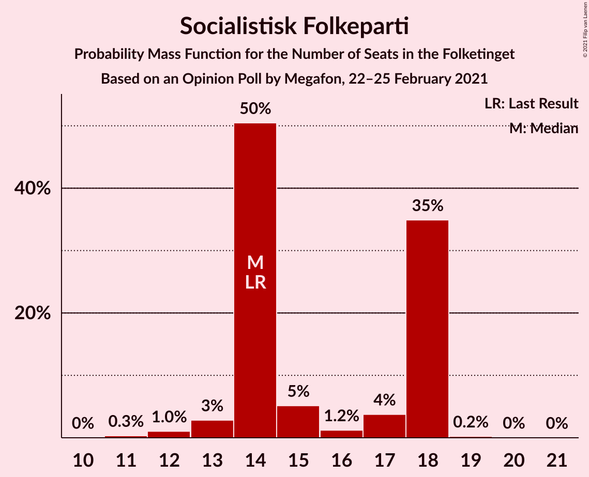

| Number of Seats | Probability | Accumulated | Special Marks |
|:---------------:|:-----------:|:-----------:|:-------------:|
| 11 | 0.6% | 100% |  |
| 12 | 2% | 99.4% |  |
| 13 | 7% | 98% |  |
| 14 | 36% | 91% | Last Result |
| 15 | 40% | 55% | Median |
| 16 | 6% | 15% |  |
| 17 | 3% | 9% |  |
| 18 | 4% | 6% |  |
| 19 | 1.1% | 1.4% |  |
| 20 | 0.3% | 0.3% |  |
| 21 | 0% | 0% |  |

### Enhedslisten–De Rød-Grønne

*For a full overview of the results for this party, see the [Enhedslisten–De Rød-Grønne](party-enhedslisten–derød-grønne.html) page.*

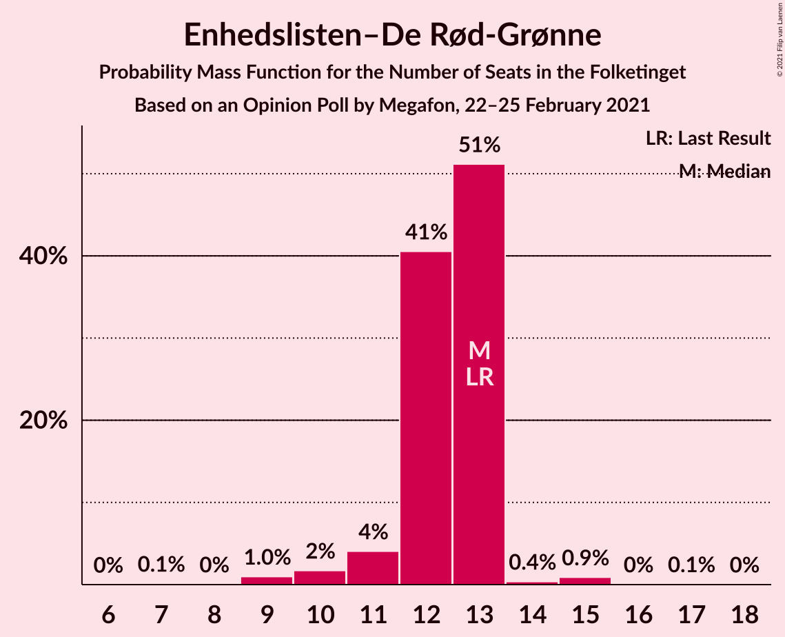

| Number of Seats | Probability | Accumulated | Special Marks |
|:---------------:|:-----------:|:-----------:|:-------------:|
| 8 | 0.3% | 100% |  |
| 9 | 0.8% | 99.7% |  |
| 10 | 7% | 98.9% |  |
| 11 | 56% | 92% | Median |
| 12 | 8% | 37% |  |
| 13 | 12% | 29% | Last Result |
| 14 | 14% | 17% |  |
| 15 | 2% | 3% |  |
| 16 | 0.1% | 0.5% |  |
| 17 | 0.3% | 0.3% |  |
| 18 | 0% | 0% |  |

### Dansk Folkeparti

*For a full overview of the results for this party, see the [Dansk Folkeparti](party-danskfolkeparti.html) page.*

| Number of Seats | Probability | Accumulated | Special Marks |
|:---------------:|:-----------:|:-----------:|:-------------:|
| 7 | 2% | 100% |  |
| 8 | 11% | 98% |  |
| 9 | 31% | 87% |  |
| 10 | 18% | 55% | Median |
| 11 | 7% | 37% |  |
| 12 | 5% | 30% |  |
| 13 | 25% | 25% |  |
| 14 | 0.2% | 0.3% |  |
| 15 | 0.1% | 0.1% |  |
| 16 | 0% | 0% | Last Result |

### Radikale Venstre

*For a full overview of the results for this party, see the [Radikale Venstre](party-radikalevenstre.html) page.*

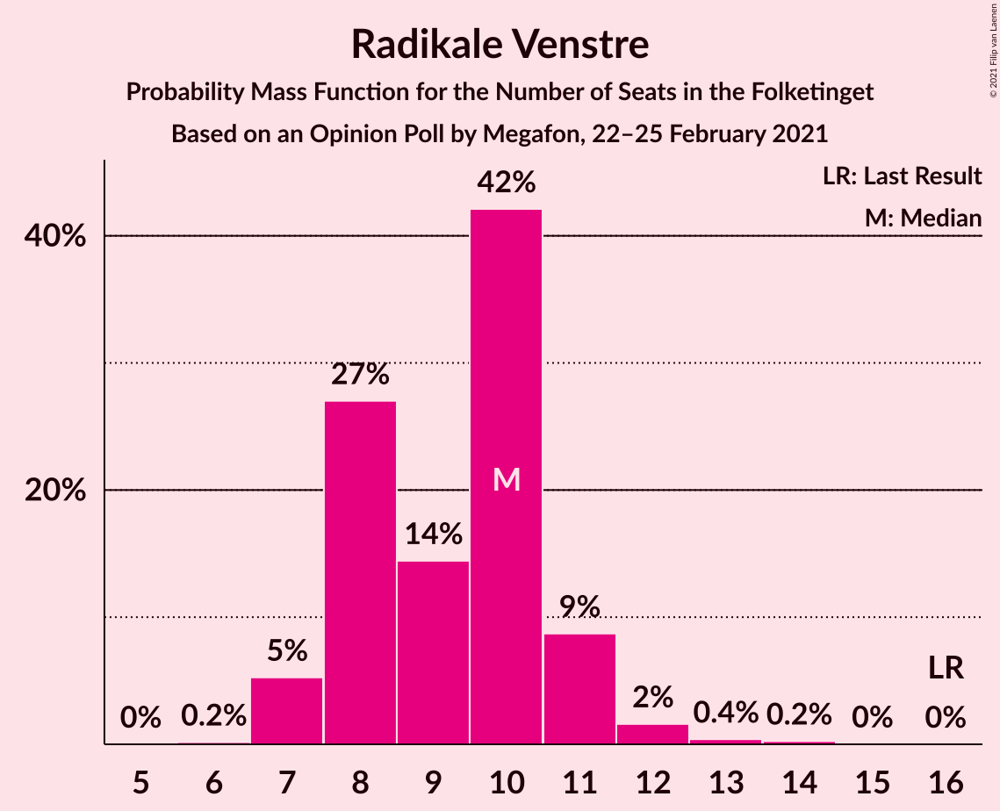

| Number of Seats | Probability | Accumulated | Special Marks |
|:---------------:|:-----------:|:-----------:|:-------------:|
| 6 | 0.2% | 100% |  |
| 7 | 5% | 99.8% |  |
| 8 | 27% | 95% |  |
| 9 | 14% | 68% |  |
| 10 | 42% | 53% | Median |
| 11 | 9% | 11% |  |
| 12 | 2% | 2% |  |
| 13 | 0.4% | 0.7% |  |
| 14 | 0.2% | 0.3% |  |
| 15 | 0% | 0% |  |
| 16 | 0% | 0% | Last Result |

### Liberal Alliance

*For a full overview of the results for this party, see the [Liberal Alliance](party-liberalalliance.html) page.*

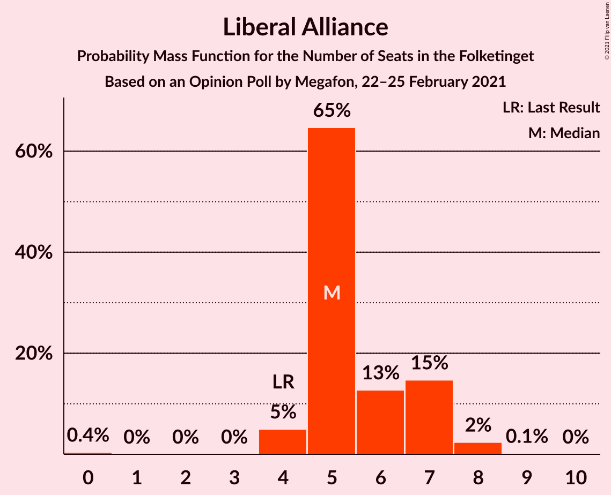

| Number of Seats | Probability | Accumulated | Special Marks |
|:---------------:|:-----------:|:-----------:|:-------------:|
| 0 | 0.4% | 100% |  |
| 1 | 0% | 99.6% |  |
| 2 | 0% | 99.6% |  |
| 3 | 0% | 99.6% |  |
| 4 | 5% | 99.6% | Last Result |
| 5 | 65% | 95% | Median |
| 6 | 13% | 30% |  |
| 7 | 15% | 17% |  |
| 8 | 2% | 3% |  |
| 9 | 0.1% | 0.2% |  |
| 10 | 0% | 0% |  |

### Kristendemokraterne

*For a full overview of the results for this party, see the [Kristendemokraterne](party-kristendemokraterne.html) page.*

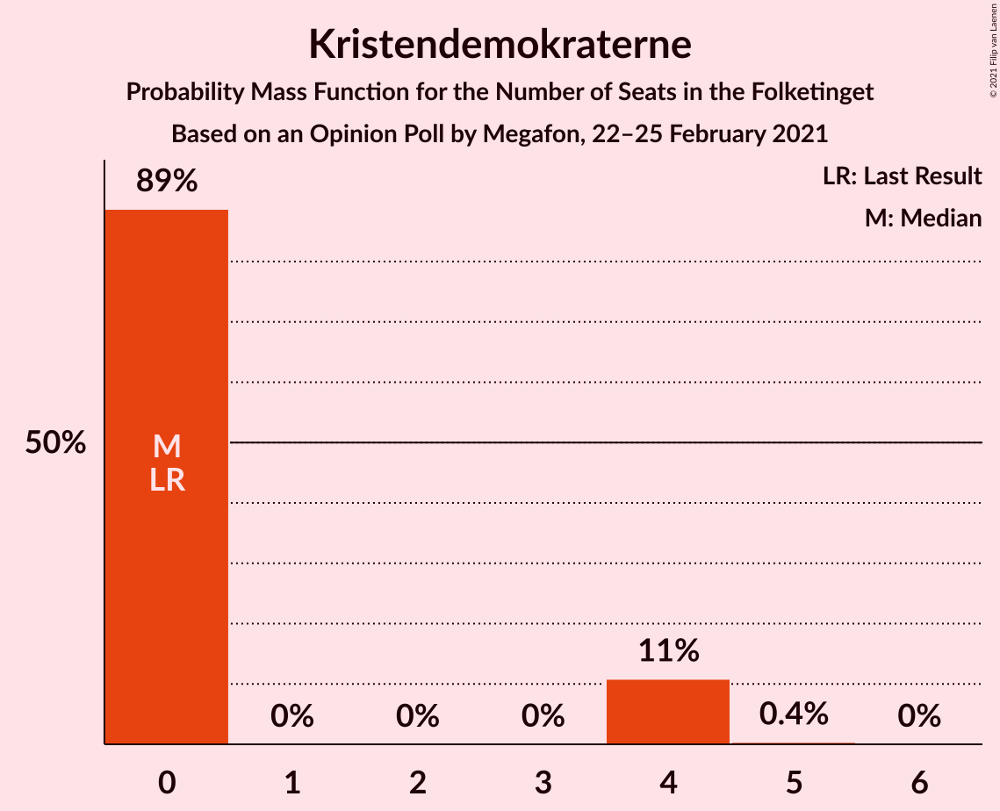

| Number of Seats | Probability | Accumulated | Special Marks |
|:---------------:|:-----------:|:-----------:|:-------------:|
| 0 | 89% | 100% | Last Result, Median |
| 1 | 0% | 11% |  |
| 2 | 0% | 11% |  |
| 3 | 0% | 11% |  |
| 4 | 11% | 11% |  |
| 5 | 0.4% | 0.4% |  |
| 6 | 0% | 0% |  |

### Alternativet

*For a full overview of the results for this party, see the [Alternativet](party-alternativet.html) page.*

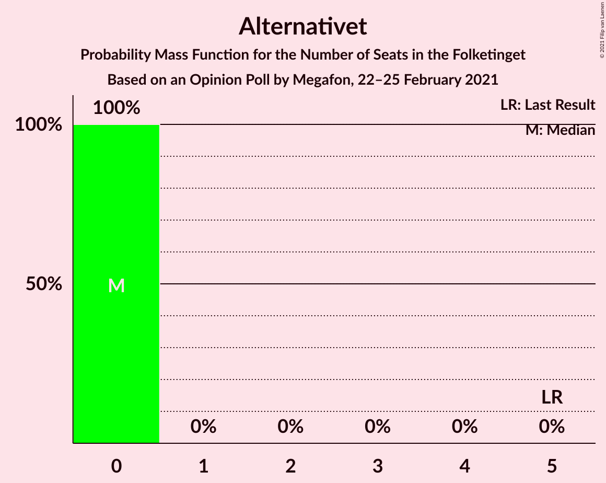

| Number of Seats | Probability | Accumulated | Special Marks |
|:---------------:|:-----------:|:-----------:|:-------------:|
| 0 | 100% | 100% | Median |
| 1 | 0% | 0% |  |
| 2 | 0% | 0% |  |
| 3 | 0% | 0% |  |
| 4 | 0% | 0% |  |
| 5 | 0% | 0% | Last Result |

### Veganerpartiet

*For a full overview of the results for this party, see the [Veganerpartiet](party-veganerpartiet.html) page.*

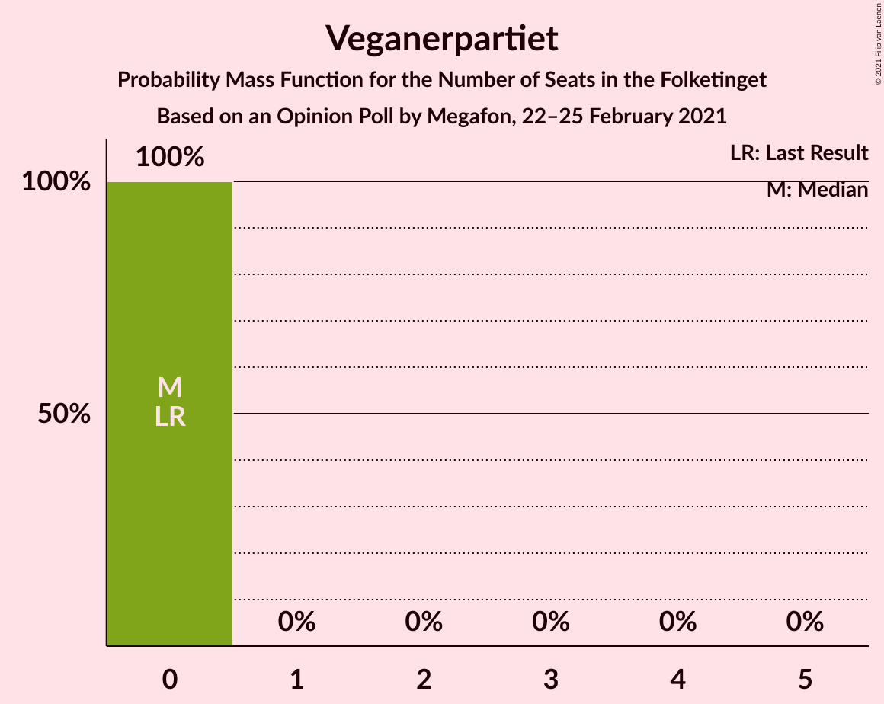

| Number of Seats | Probability | Accumulated | Special Marks |
|:---------------:|:-----------:|:-----------:|:-------------:|
| 0 | 100% | 100% | Last Result, Median |

## Coalitions

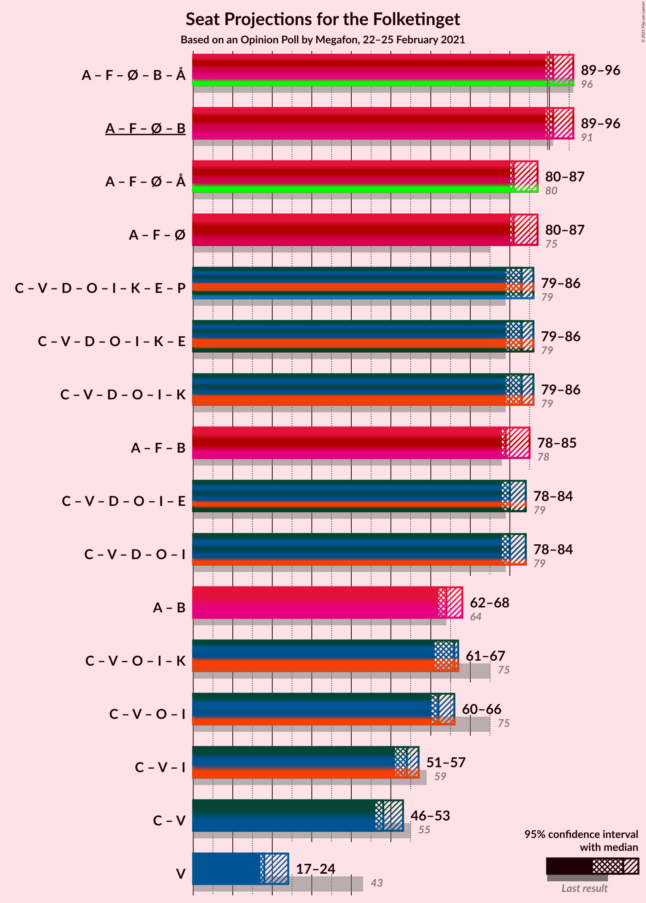

### Confidence Intervals

| Coalition | Last Result | Median | Majority? | 80% Confidence Interval | 90% Confidence Interval | 95% Confidence Interval | 99% Confidence Interval |
|:---------:|:-----------:|:------:|:---------:|:-----------------------:|:-----------------------:|:-----------------------:|:-----------------------:|
| Socialdemokraterne – Socialistisk Folkeparti – Enhedslisten–De Rød-Grønne – Radikale Venstre – Alternativet | 96 | 91 | 84% | 89–95 | 89–97 | 89–100 | 85–100 |
| Socialdemokraterne – Socialistisk Folkeparti – Enhedslisten–De Rød-Grønne – Radikale Venstre | 91 | 91 | 84% | 89–95 | 89–97 | 89–100 | 85–100 |
| Socialdemokraterne – Socialistisk Folkeparti – Enhedslisten–De Rød-Grønne – Alternativet | 80 | 82 | 4% | 80–85 | 80–86 | 79–90 | 77–90 |
| Socialdemokraterne – Socialistisk Folkeparti – Enhedslisten–De Rød-Grønne | 75 | 82 | 4% | 80–85 | 80–86 | 79–90 | 77–90 |
| Det Konservative Folkeparti – Venstre – Nye Borgerlige – Dansk Folkeparti – Liberal Alliance – Kristendemokraterne | 79 | 83 | 0.6% | 80–86 | 78–86 | 75–86 | 75–90 |
| Det Konservative Folkeparti – Venstre – Nye Borgerlige – Dansk Folkeparti – Liberal Alliance | 79 | 82 | 0.1% | 79–85 | 78–86 | 75–86 | 74–87 |
| Socialdemokraterne – Socialistisk Folkeparti – Radikale Venstre | 78 | 80 | 0.1% | 75–83 | 75–85 | 75–86 | 74–86 |
| Socialdemokraterne – Radikale Venstre | 64 | 64 | 0% | 61–70 | 60–70 | 60–71 | 59–71 |
| Det Konservative Folkeparti – Venstre – Dansk Folkeparti – Liberal Alliance – Kristendemokraterne | 75 | 65 | 0% | 62–67 | 61–68 | 58–69 | 58–71 |
| Det Konservative Folkeparti – Venstre – Dansk Folkeparti – Liberal Alliance | 75 | 64 | 0% | 62–66 | 61–66 | 58–68 | 57–70 |
| Det Konservative Folkeparti – Venstre – Liberal Alliance | 59 | 55 | 0% | 51–56 | 50–56 | 47–58 | 47–59 |
| Det Konservative Folkeparti – Venstre | 55 | 49 | 0% | 46–51 | 44–51 | 42–52 | 42–54 |
| Venstre | 43 | 20 | 0% | 18–22 | 17–24 | 17–24 | 16–24 |

### Socialdemokraterne – Socialistisk Folkeparti – Enhedslisten–De Rød-Grønne – Radikale Venstre – Alternativet

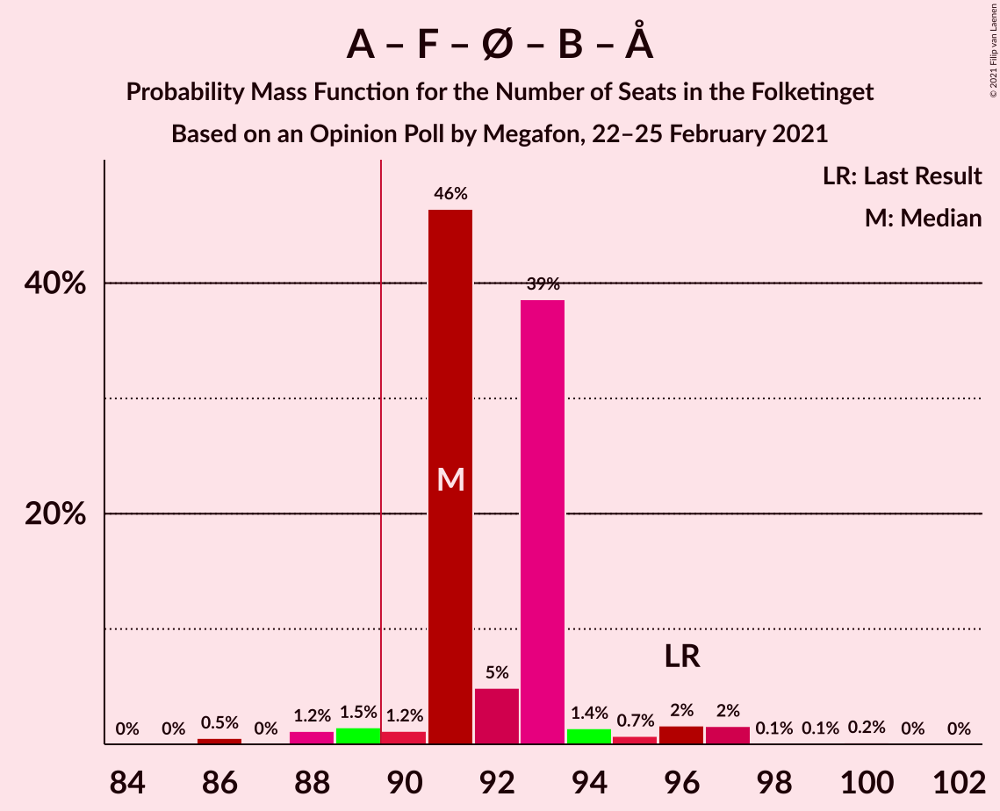

| Number of Seats | Probability | Accumulated | Special Marks |
|:---------------:|:-----------:|:-----------:|:-------------:|
| 84 | 0.1% | 100% |  |
| 85 | 0.5% | 99.9% |  |
| 86 | 0.4% | 99.4% |  |
| 87 | 0.6% | 98.9% |  |
| 88 | 0.6% | 98% |  |
| 89 | 14% | 98% |  |
| 90 | 27% | 84% | Majority |
| 91 | 30% | 57% |  |
| 92 | 4% | 27% | Median |
| 93 | 7% | 24% |  |
| 94 | 4% | 17% |  |
| 95 | 4% | 13% |  |
| 96 | 4% | 9% | Last Result |
| 97 | 1.0% | 5% |  |
| 98 | 0.1% | 4% |  |
| 99 | 0.2% | 4% |  |
| 100 | 3% | 4% |  |
| 101 | 0.2% | 0.3% |  |
| 102 | 0% | 0.1% |  |
| 103 | 0% | 0% |  |

### Socialdemokraterne – Socialistisk Folkeparti – Enhedslisten–De Rød-Grønne – Radikale Venstre

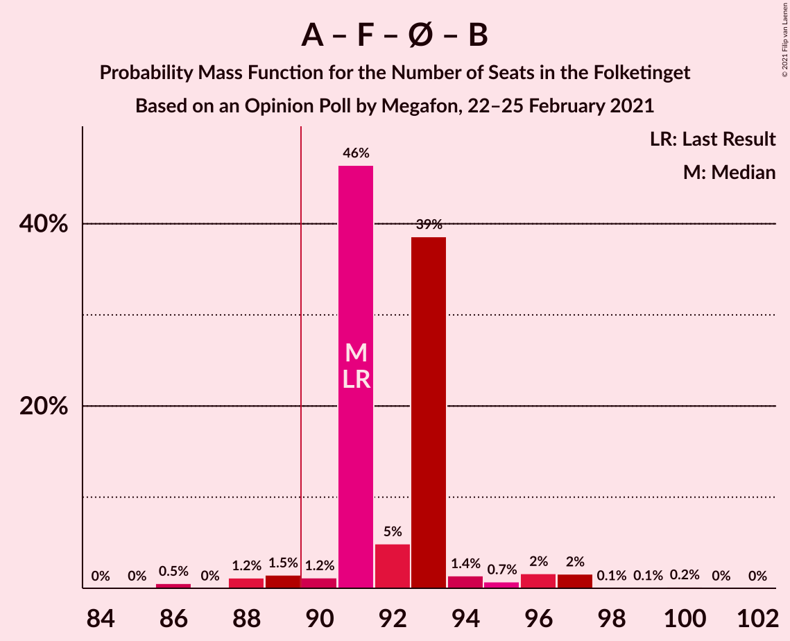

| Number of Seats | Probability | Accumulated | Special Marks |
|:---------------:|:-----------:|:-----------:|:-------------:|
| 84 | 0.1% | 100% |  |
| 85 | 0.5% | 99.9% |  |
| 86 | 0.4% | 99.4% |  |
| 87 | 0.6% | 98.9% |  |
| 88 | 0.6% | 98% |  |
| 89 | 14% | 98% |  |
| 90 | 27% | 84% | Majority |
| 91 | 30% | 57% | Last Result |
| 92 | 4% | 27% | Median |
| 93 | 7% | 24% |  |
| 94 | 4% | 17% |  |
| 95 | 4% | 13% |  |
| 96 | 4% | 9% |  |
| 97 | 1.0% | 5% |  |
| 98 | 0.1% | 4% |  |
| 99 | 0.2% | 4% |  |
| 100 | 3% | 4% |  |
| 101 | 0.2% | 0.3% |  |
| 102 | 0% | 0.1% |  |
| 103 | 0% | 0% |  |

### Socialdemokraterne – Socialistisk Folkeparti – Enhedslisten–De Rød-Grønne – Alternativet

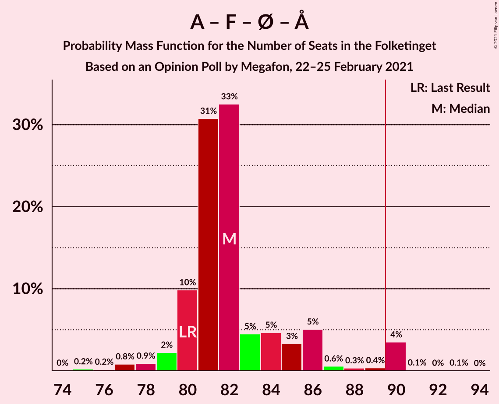

| Number of Seats | Probability | Accumulated | Special Marks |
|:---------------:|:-----------:|:-----------:|:-------------:|
| 74 | 0% | 100% |  |
| 75 | 0.2% | 99.9% |  |
| 76 | 0.2% | 99.7% |  |
| 77 | 0.8% | 99.6% |  |
| 78 | 0.9% | 98.7% |  |
| 79 | 2% | 98% |  |
| 80 | 10% | 96% | Last Result |
| 81 | 31% | 86% |  |
| 82 | 33% | 55% | Median |
| 83 | 5% | 22% |  |
| 84 | 5% | 18% |  |
| 85 | 3% | 13% |  |
| 86 | 5% | 10% |  |
| 87 | 0.6% | 5% |  |
| 88 | 0.3% | 4% |  |
| 89 | 0.4% | 4% |  |
| 90 | 4% | 4% | Majority |
| 91 | 0.1% | 0.2% |  |
| 92 | 0% | 0.1% |  |
| 93 | 0.1% | 0.1% |  |
| 94 | 0% | 0% |  |

### Socialdemokraterne – Socialistisk Folkeparti – Enhedslisten–De Rød-Grønne

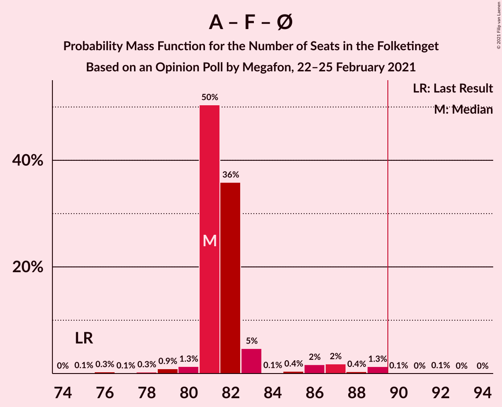

| Number of Seats | Probability | Accumulated | Special Marks |
|:---------------:|:-----------:|:-----------:|:-------------:|
| 74 | 0% | 100% |  |
| 75 | 0.2% | 99.9% | Last Result |
| 76 | 0.2% | 99.7% |  |
| 77 | 0.8% | 99.6% |  |
| 78 | 0.9% | 98.7% |  |
| 79 | 2% | 98% |  |
| 80 | 10% | 96% |  |
| 81 | 31% | 86% |  |
| 82 | 33% | 55% | Median |
| 83 | 5% | 22% |  |
| 84 | 5% | 18% |  |
| 85 | 3% | 13% |  |
| 86 | 5% | 10% |  |
| 87 | 0.6% | 5% |  |
| 88 | 0.3% | 4% |  |
| 89 | 0.4% | 4% |  |
| 90 | 4% | 4% | Majority |
| 91 | 0.1% | 0.2% |  |
| 92 | 0% | 0.1% |  |
| 93 | 0.1% | 0.1% |  |
| 94 | 0% | 0% |  |

### Det Konservative Folkeparti – Venstre – Nye Borgerlige – Dansk Folkeparti – Liberal Alliance – Kristendemokraterne

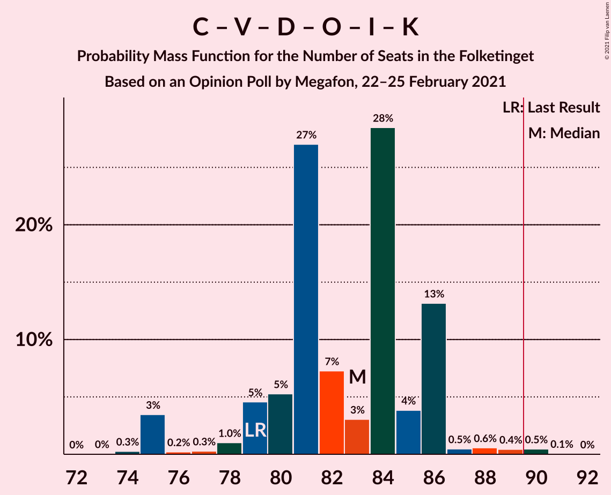

| Number of Seats | Probability | Accumulated | Special Marks |
|:---------------:|:-----------:|:-----------:|:-------------:|
| 73 | 0% | 100% |  |
| 74 | 0.3% | 99.9% |  |
| 75 | 3% | 99.7% |  |
| 76 | 0.2% | 96% |  |
| 77 | 0.3% | 96% |  |
| 78 | 1.0% | 96% |  |
| 79 | 5% | 95% | Last Result |
| 80 | 5% | 90% |  |
| 81 | 27% | 85% | Median |
| 82 | 7% | 58% |  |
| 83 | 3% | 51% |  |
| 84 | 28% | 48% |  |
| 85 | 4% | 19% |  |
| 86 | 13% | 15% |  |
| 87 | 0.5% | 2% |  |
| 88 | 0.6% | 2% |  |
| 89 | 0.4% | 1.0% |  |
| 90 | 0.5% | 0.6% | Majority |
| 91 | 0.1% | 0.1% |  |
| 92 | 0% | 0% |  |

### Det Konservative Folkeparti – Venstre – Nye Borgerlige – Dansk Folkeparti – Liberal Alliance

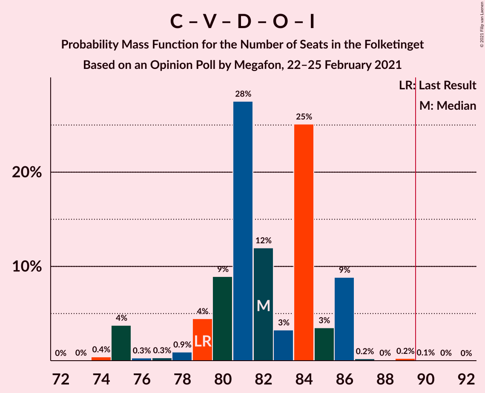

| Number of Seats | Probability | Accumulated | Special Marks |
|:---------------:|:-----------:|:-----------:|:-------------:|
| 72 | 0% | 100% |  |
| 73 | 0% | 99.9% |  |
| 74 | 0.4% | 99.9% |  |
| 75 | 4% | 99.5% |  |
| 76 | 0.3% | 96% |  |
| 77 | 0.3% | 95% |  |
| 78 | 0.9% | 95% |  |
| 79 | 4% | 94% | Last Result |
| 80 | 9% | 90% |  |
| 81 | 28% | 81% | Median |
| 82 | 12% | 53% |  |
| 83 | 3% | 41% |  |
| 84 | 25% | 38% |  |
| 85 | 3% | 13% |  |
| 86 | 9% | 9% |  |
| 87 | 0.2% | 0.6% |  |
| 88 | 0% | 0.4% |  |
| 89 | 0.2% | 0.4% |  |
| 90 | 0.1% | 0.1% | Majority |
| 91 | 0% | 0.1% |  |
| 92 | 0% | 0% |  |

### Socialdemokraterne – Socialistisk Folkeparti – Radikale Venstre

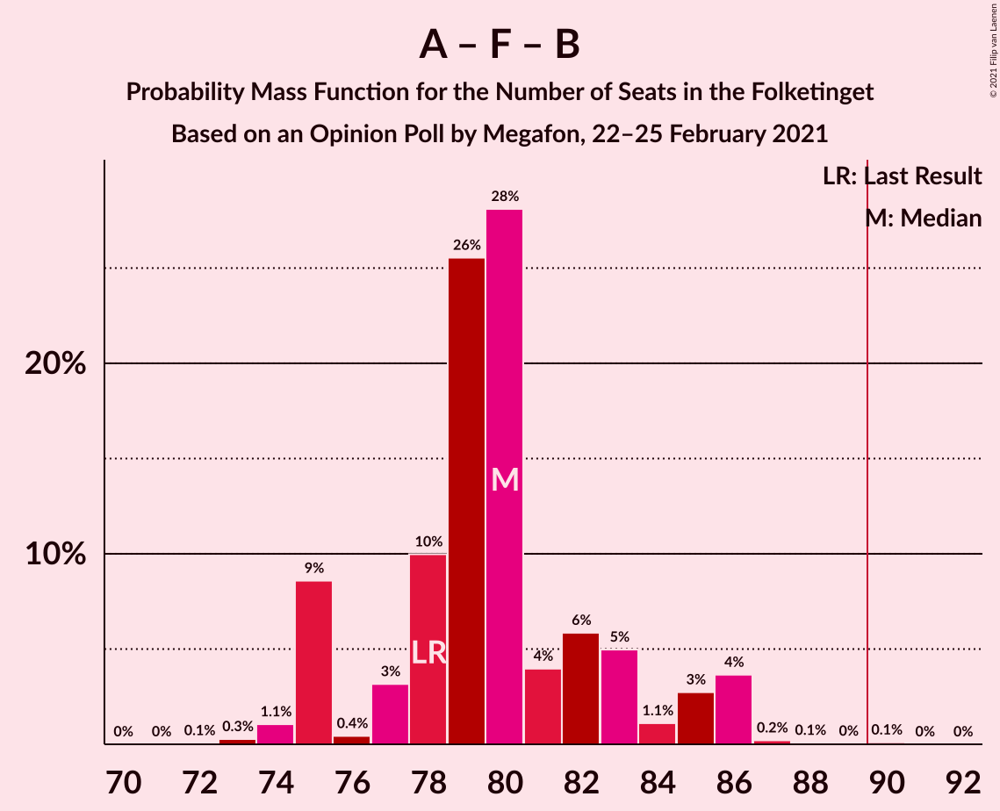

| Number of Seats | Probability | Accumulated | Special Marks |
|:---------------:|:-----------:|:-----------:|:-------------:|
| 72 | 0.1% | 100% |  |
| 73 | 0.3% | 99.9% |  |
| 74 | 1.1% | 99.6% |  |
| 75 | 9% | 98.6% |  |
| 76 | 0.4% | 90% |  |
| 77 | 3% | 90% |  |
| 78 | 10% | 86% | Last Result |
| 79 | 26% | 76% |  |
| 80 | 28% | 51% |  |
| 81 | 4% | 23% | Median |
| 82 | 6% | 19% |  |
| 83 | 5% | 13% |  |
| 84 | 1.1% | 8% |  |
| 85 | 3% | 7% |  |
| 86 | 4% | 4% |  |
| 87 | 0.2% | 0.4% |  |
| 88 | 0.1% | 0.2% |  |
| 89 | 0% | 0.2% |  |
| 90 | 0.1% | 0.1% | Majority |
| 91 | 0% | 0% |  |

### Socialdemokraterne – Radikale Venstre

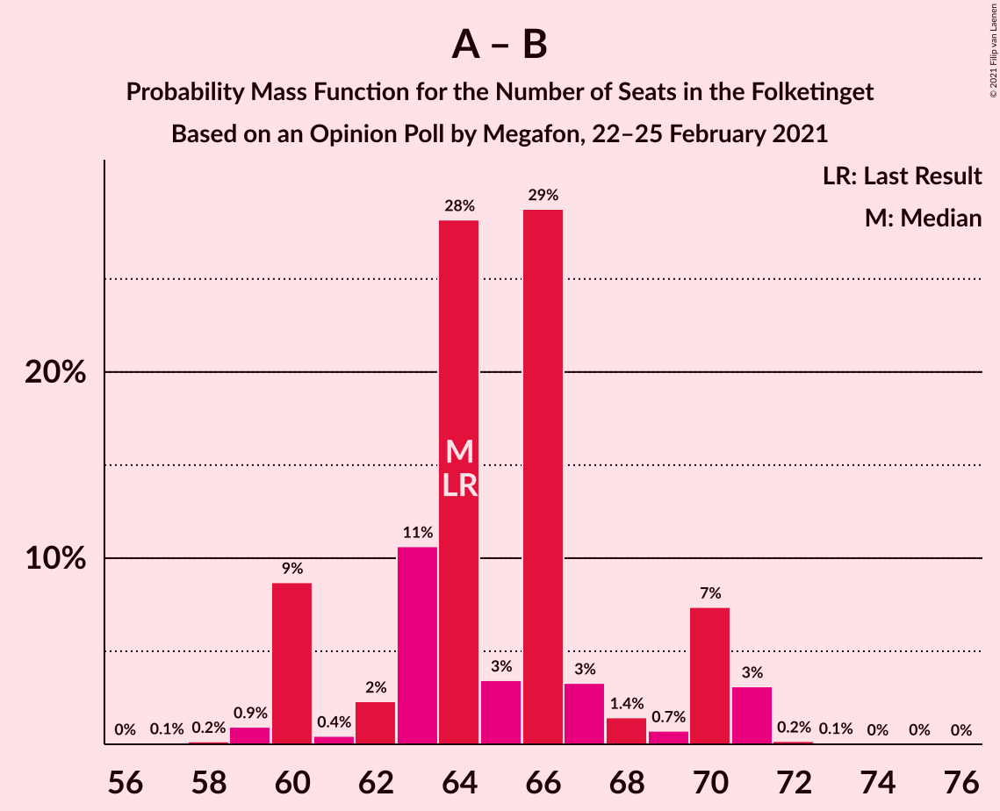

| Number of Seats | Probability | Accumulated | Special Marks |
|:---------------:|:-----------:|:-----------:|:-------------:|
| 56 | 0% | 100% |  |
| 57 | 0.1% | 99.9% |  |
| 58 | 0.2% | 99.9% |  |
| 59 | 0.9% | 99.7% |  |
| 60 | 9% | 98.8% |  |
| 61 | 0.4% | 90% |  |
| 62 | 2% | 90% |  |
| 63 | 11% | 87% |  |
| 64 | 28% | 77% | Last Result |
| 65 | 3% | 48% |  |
| 66 | 29% | 45% | Median |
| 67 | 3% | 16% |  |
| 68 | 1.4% | 13% |  |
| 69 | 0.7% | 12% |  |
| 70 | 7% | 11% |  |
| 71 | 3% | 3% |  |
| 72 | 0.2% | 0.3% |  |
| 73 | 0.1% | 0.1% |  |
| 74 | 0% | 0.1% |  |
| 75 | 0% | 0% |  |

### Det Konservative Folkeparti – Venstre – Dansk Folkeparti – Liberal Alliance – Kristendemokraterne

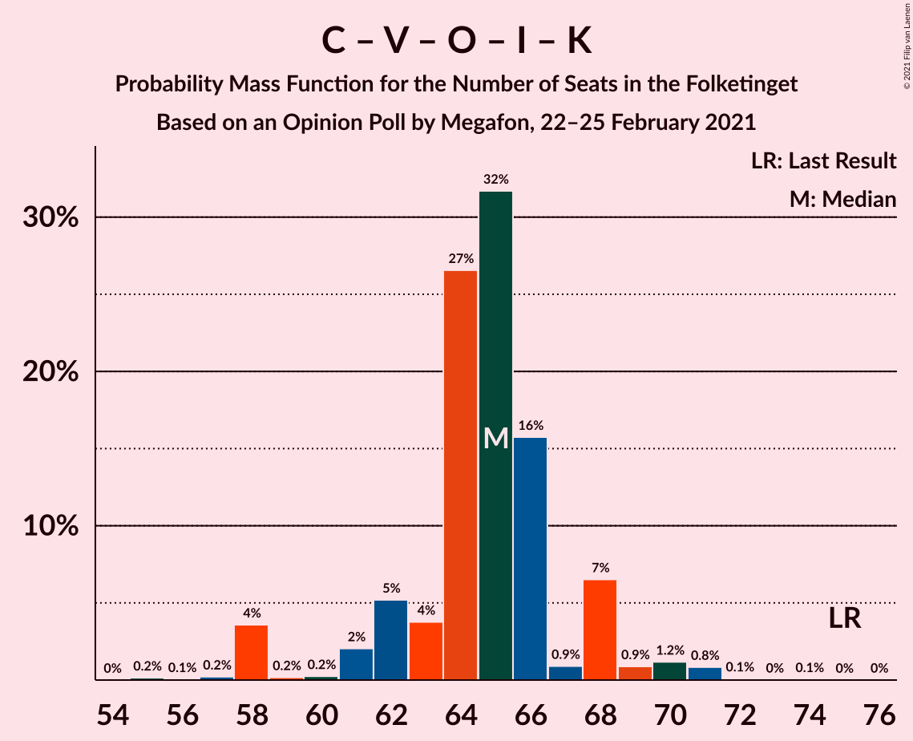

| Number of Seats | Probability | Accumulated | Special Marks |
|:---------------:|:-----------:|:-----------:|:-------------:|
| 55 | 0.2% | 100% |  |
| 56 | 0.1% | 99.8% |  |
| 57 | 0.2% | 99.8% |  |
| 58 | 4% | 99.6% |  |
| 59 | 0.2% | 96% |  |
| 60 | 0.2% | 96% |  |
| 61 | 2% | 96% |  |
| 62 | 5% | 94% |  |
| 63 | 4% | 88% | Median |
| 64 | 27% | 85% |  |
| 65 | 32% | 58% |  |
| 66 | 16% | 26% |  |
| 67 | 0.9% | 11% |  |
| 68 | 7% | 10% |  |
| 69 | 0.9% | 3% |  |
| 70 | 1.2% | 2% |  |
| 71 | 0.8% | 1.0% |  |
| 72 | 0.1% | 0.2% |  |
| 73 | 0% | 0.1% |  |
| 74 | 0.1% | 0.1% |  |
| 75 | 0% | 0% | Last Result |

### Det Konservative Folkeparti – Venstre – Dansk Folkeparti – Liberal Alliance

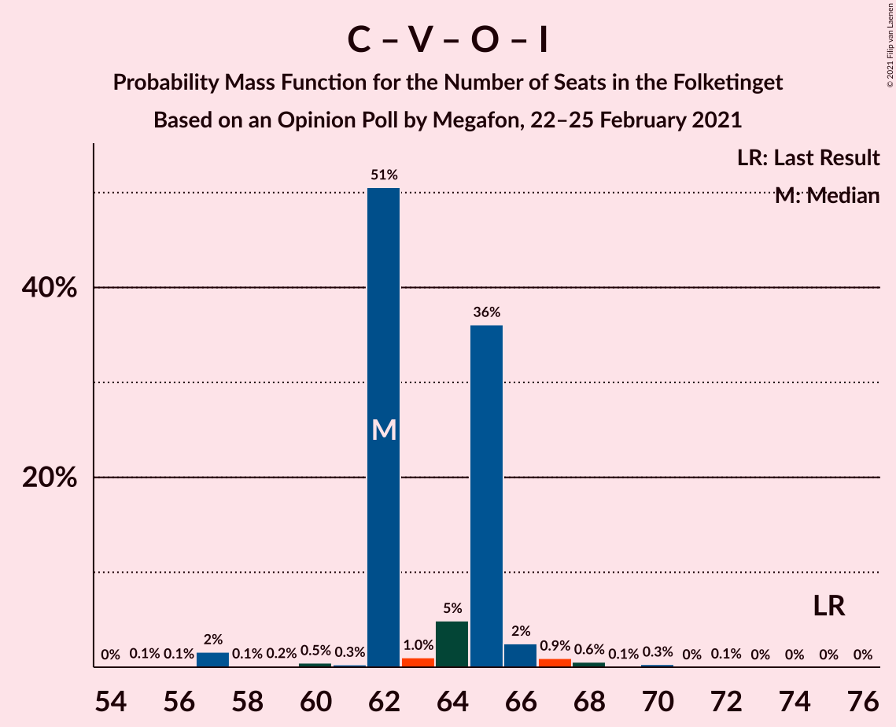

| Number of Seats | Probability | Accumulated | Special Marks |
|:---------------:|:-----------:|:-----------:|:-------------:|
| 55 | 0.2% | 100% |  |
| 56 | 0.1% | 99.8% |  |
| 57 | 0.3% | 99.7% |  |
| 58 | 4% | 99.5% |  |
| 59 | 0.5% | 96% |  |
| 60 | 0.4% | 95% |  |
| 61 | 2% | 95% |  |
| 62 | 9% | 93% |  |
| 63 | 4% | 84% | Median |
| 64 | 32% | 80% |  |
| 65 | 32% | 49% |  |
| 66 | 12% | 16% |  |
| 67 | 1.4% | 4% |  |
| 68 | 1.3% | 3% |  |
| 69 | 0.1% | 2% |  |
| 70 | 1.1% | 1.4% |  |
| 71 | 0.2% | 0.3% |  |
| 72 | 0.1% | 0.1% |  |
| 73 | 0% | 0.1% |  |
| 74 | 0% | 0.1% |  |
| 75 | 0% | 0% | Last Result |

### Det Konservative Folkeparti – Venstre – Liberal Alliance

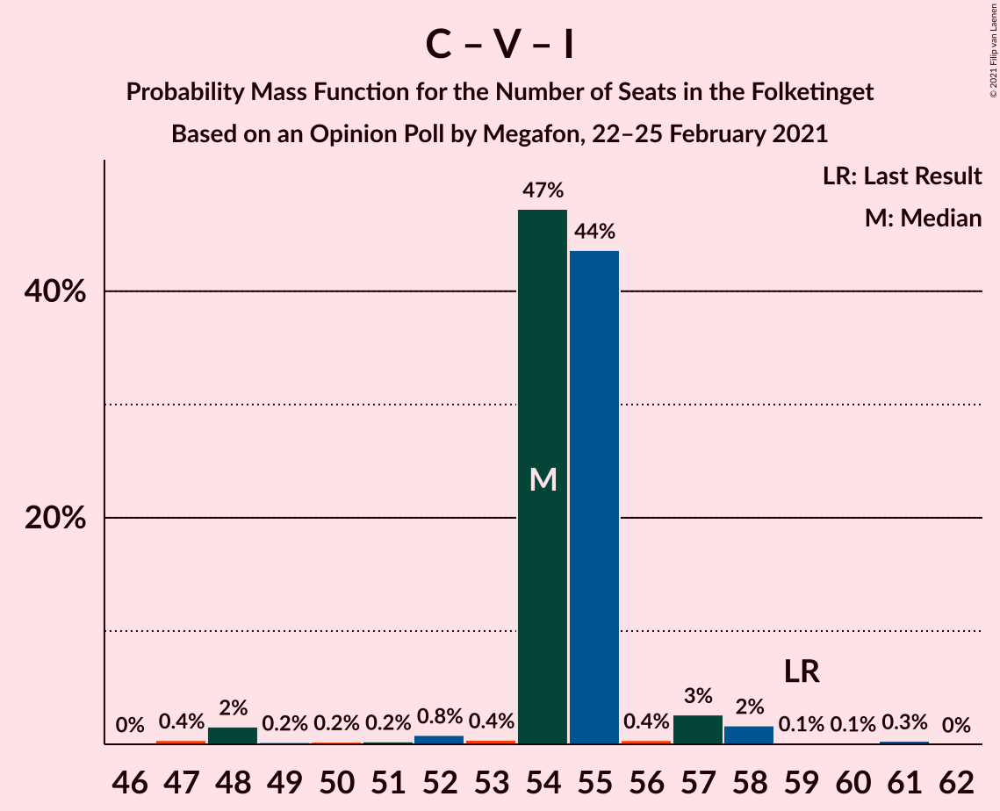

| Number of Seats | Probability | Accumulated | Special Marks |
|:---------------:|:-----------:|:-----------:|:-------------:|
| 46 | 0.3% | 100% |  |
| 47 | 4% | 99.7% |  |
| 48 | 0.2% | 96% |  |
| 49 | 0.6% | 96% |  |
| 50 | 0.4% | 95% |  |
| 51 | 25% | 95% |  |
| 52 | 6% | 70% |  |
| 53 | 2% | 64% | Median |
| 54 | 10% | 62% |  |
| 55 | 7% | 53% |  |
| 56 | 42% | 46% |  |
| 57 | 1.3% | 4% |  |
| 58 | 2% | 3% |  |
| 59 | 0.1% | 0.6% | Last Result |
| 60 | 0.1% | 0.5% |  |
| 61 | 0.2% | 0.4% |  |
| 62 | 0.1% | 0.2% |  |
| 63 | 0% | 0% |  |

### Det Konservative Folkeparti – Venstre

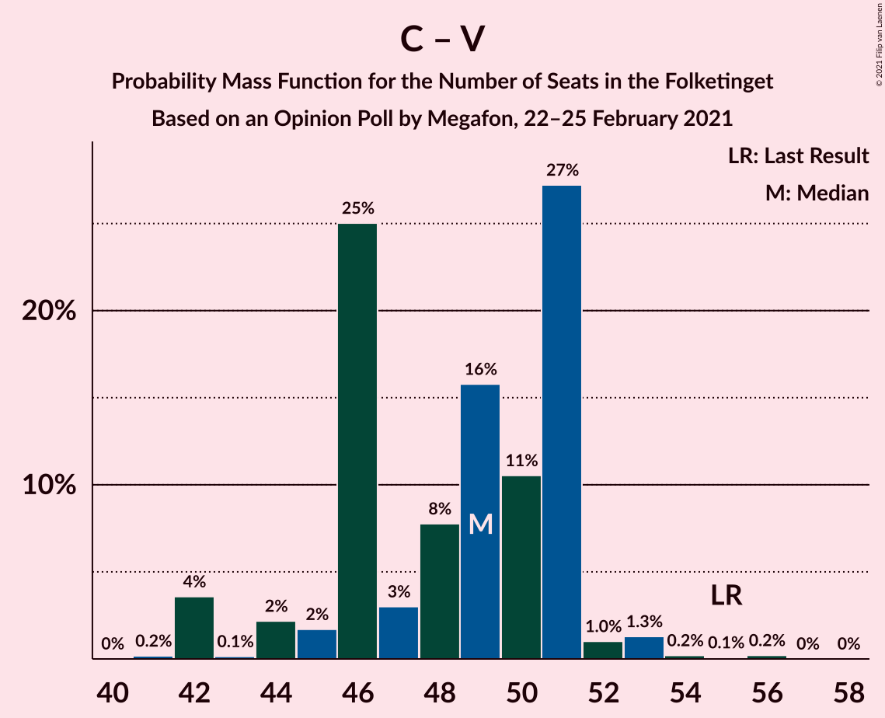

| Number of Seats | Probability | Accumulated | Special Marks |
|:---------------:|:-----------:|:-----------:|:-------------:|
| 41 | 0.2% | 100% |  |
| 42 | 4% | 99.8% |  |
| 43 | 0.1% | 96% |  |
| 44 | 2% | 96% |  |
| 45 | 2% | 94% |  |
| 46 | 25% | 92% |  |
| 47 | 3% | 67% |  |
| 48 | 8% | 64% | Median |
| 49 | 16% | 56% |  |
| 50 | 11% | 41% |  |
| 51 | 27% | 30% |  |
| 52 | 1.0% | 3% |  |
| 53 | 1.3% | 2% |  |
| 54 | 0.2% | 0.5% |  |
| 55 | 0.1% | 0.3% | Last Result |
| 56 | 0.2% | 0.3% |  |
| 57 | 0% | 0% |  |

### Venstre

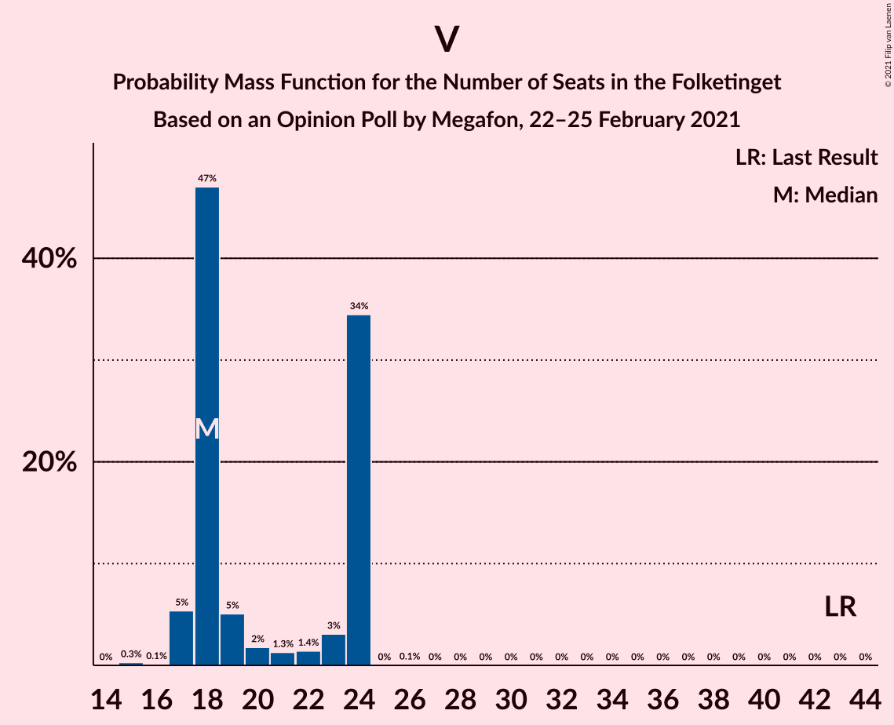

| Number of Seats | Probability | Accumulated | Special Marks |
|:---------------:|:-----------:|:-----------:|:-------------:|
| 15 | 0.1% | 100% |  |
| 16 | 2% | 99.9% |  |
| 17 | 5% | 98% |  |
| 18 | 32% | 93% |  |
| 19 | 6% | 61% |  |
| 20 | 6% | 55% | Median |
| 21 | 35% | 49% |  |
| 22 | 7% | 14% |  |
| 23 | 1.2% | 7% |  |
| 24 | 6% | 6% |  |
| 25 | 0.2% | 0.3% |  |
| 26 | 0.1% | 0.1% |  |
| 27 | 0% | 0% |  |
| 28 | 0% | 0% |  |
| 29 | 0% | 0% |  |
| 30 | 0% | 0% |  |
| 31 | 0% | 0% |  |
| 32 | 0% | 0% |  |
| 33 | 0% | 0% |  |
| 34 | 0% | 0% |  |
| 35 | 0% | 0% |  |
| 36 | 0% | 0% |  |
| 37 | 0% | 0% |  |
| 38 | 0% | 0% |  |
| 39 | 0% | 0% |  |
| 40 | 0% | 0% |  |
| 41 | 0% | 0% |  |
| 42 | 0% | 0% |  |
| 43 | 0% | 0% | Last Result |

## Technical Information

### Opinion Poll

+ **Polling firm:** Megafon
+ **Commissioner(s):** —
+ **Fieldwork period:** 22–25 February 2021

### Calculations

+ **Sample size:** 1004
+ **Simulations done:** 1,048,576
+ **Error estimate:** 2.39%

