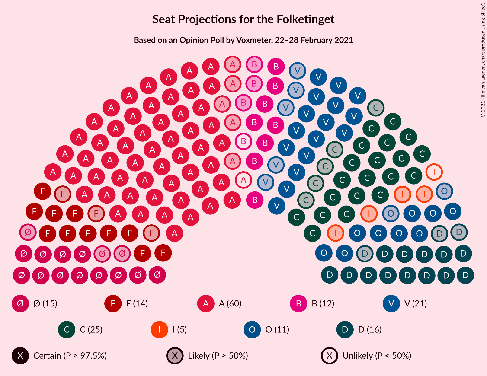
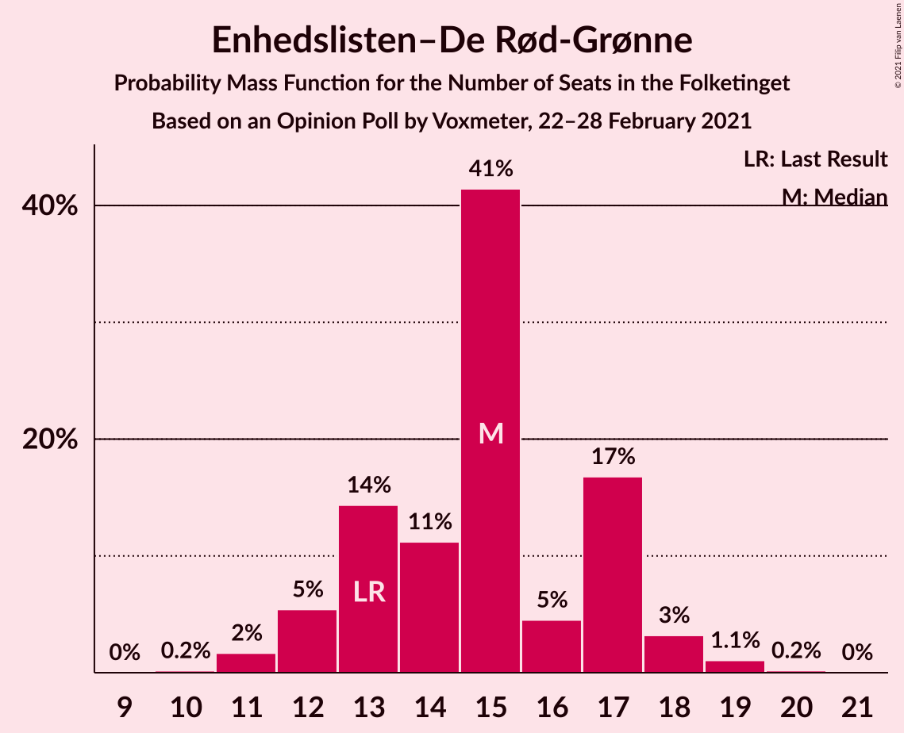
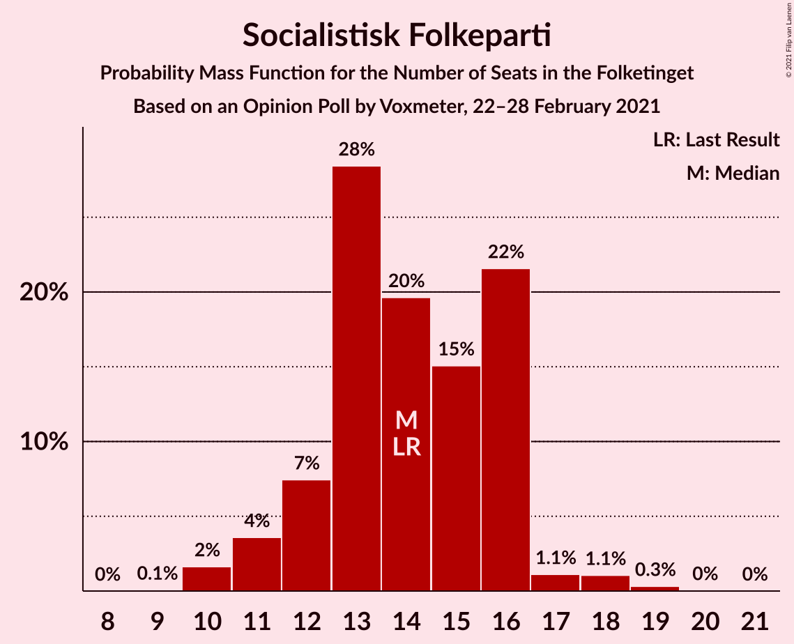
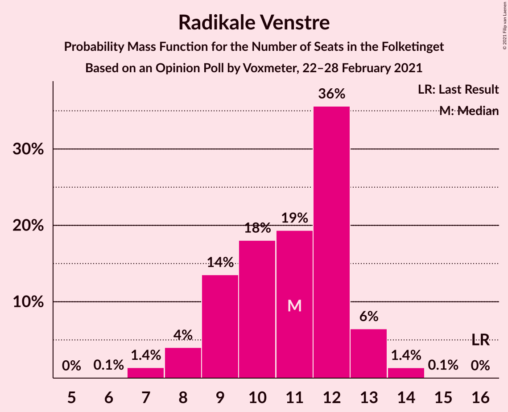
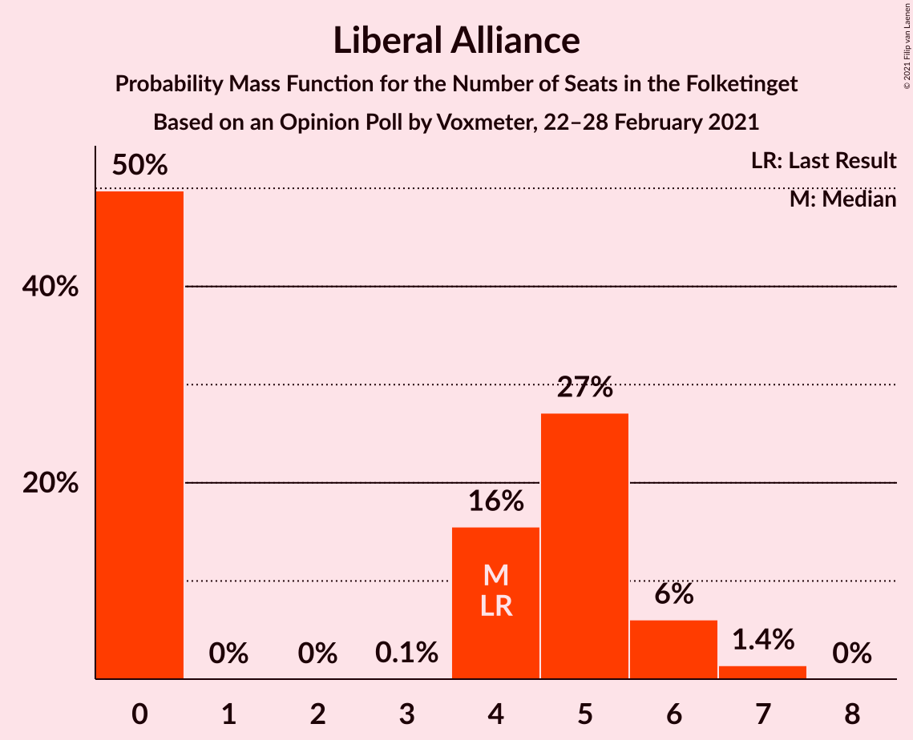
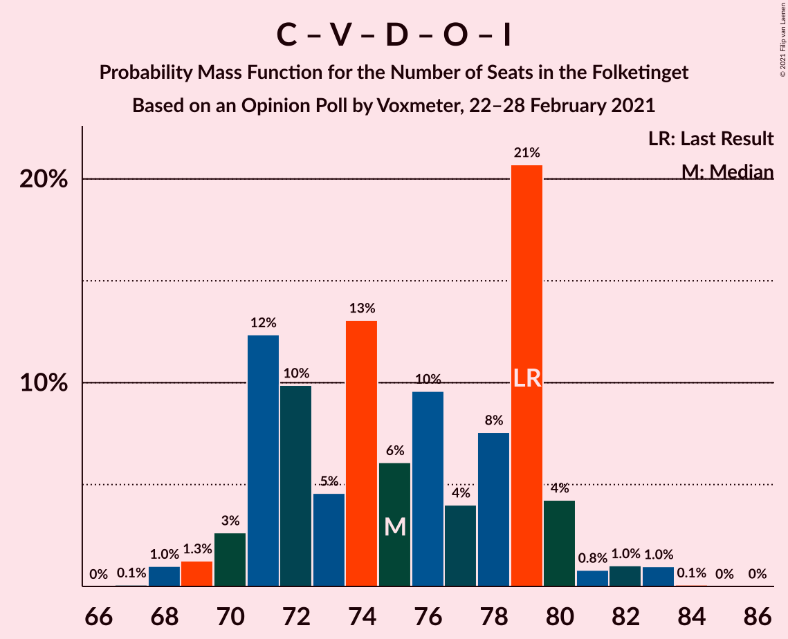
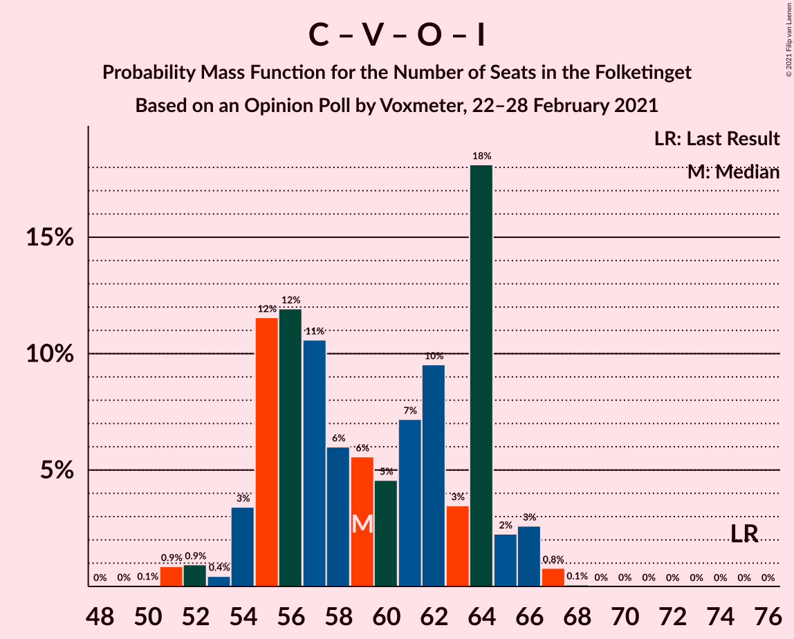
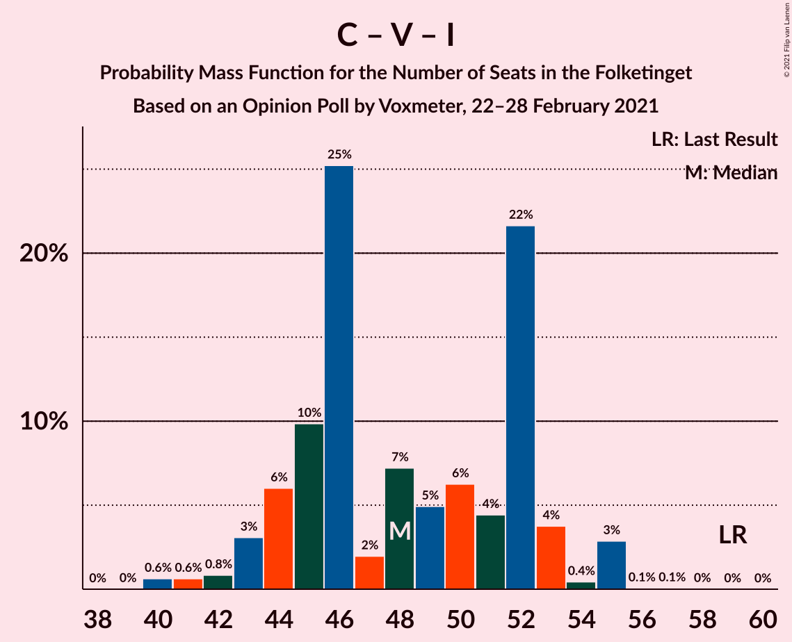

# Opinion Poll by Voxmeter, 22–28 February 2021

<a href="#voting-intentions">Voting Intentions</a> | <a href="#seats">Seats</a> | <a href="#coalitions">Coalitions</a> | <a href="#technical-information">Technical Information</a>

## Voting Intentions

### Confidence Intervals

| Party | Last Result | Poll Result | 80% Confidence Interval | 90% Confidence Interval | 95% Confidence Interval | 99% Confidence Interval |
|:-----:|:-----------:|:-----------:|:-----------------------:|:-----------------------:|:-----------------------:|:-----------------------:|
| Socialdemokraterne | 25.9% | 32.6% | 30.8–34.5% |30.2–35.0% |29.8–35.5% |28.9–36.4% |
| Det Konservative Folkeparti | 6.6% | 13.5% | 12.3–15.0% |11.9–15.4% |11.6–15.8% |11.0–16.5% |
| Venstre | 23.4% | 11.2% | 10.0–12.6% |9.7–13.0% |9.4–13.3% |8.9–14.0% |
| Nye Borgerlige | 2.4% | 9.0% | 7.9–10.2% |7.7–10.6% |7.4–10.9% |6.9–11.5% |
| Enhedslisten–De Rød-Grønne | 6.9% | 7.9% | 6.9–9.1% |6.7–9.4% |6.4–9.7% |6.0–10.3% |
| Socialistisk Folkeparti | 7.7% | 7.6% | 6.7–8.8% |6.4–9.1% |6.2–9.4% |5.7–10.0% |
| Dansk Folkeparti | 8.7% | 6.4% | 5.5–7.5% |5.3–7.8% |5.0–8.0% |4.6–8.6% |
| Radikale Venstre | 8.6% | 5.7% | 4.9–6.8% |4.6–7.0% |4.5–7.3% |4.1–7.8% |
| Liberal Alliance | 2.3% | 2.1% | 1.6–2.8% |1.5–3.0% |1.4–3.2% |1.2–3.6% |
| Kristendemokraterne | 1.7% | 1.7% | 1.3–2.4% |1.2–2.6% |1.1–2.7% |0.9–3.1% |
| Alternativet | 3.0% | 0.9% | 0.6–1.4% |0.5–1.5% |0.5–1.6% |0.4–1.9% |
| Veganerpartiet | 0.0% | 0.4% | 0.2–0.8% |0.2–0.9% |0.2–1.0% |0.1–1.2% |

*Note:* The poll result column reflects the actual value used in the calculations. Published results may vary slightly, and in addition be rounded to fewer digits.

## Seats

### Confidence Intervals

| Party | Last Result | Median | 80% Confidence Interval | 90% Confidence Interval | 95% Confidence Interval | 99% Confidence Interval |
|:-----:|:-----------:|:------:|:-----------------------:|:-----------------------:|:-----------------------:|:-----------------------:|
| <a href="#socialdemokraterne">Socialdemokraterne</a> | 48 | 59 | 56–62 |55–63 |54–64 |52–67 |
| <a href="#det-konservative-folkeparti">Det Konservative Folkeparti</a> | 12 | 25 | 21–29 |20–29 |20–29 |20–30 |
| <a href="#venstre">Venstre</a> | 43 | 21 | 17–23 |16–23 |16–24 |16–26 |
| <a href="#nye-borgerlige">Nye Borgerlige</a> | 4 | 16 | 14–18 |13–19 |13–20 |13–21 |
| <a href="#enhedslisten–de-rød-grønne">Enhedslisten–De Rød-Grønne</a> | 13 | 15 | 13–17 |12–17 |12–18 |11–19 |
| <a href="#socialistisk-folkeparti">Socialistisk Folkeparti</a> | 14 | 14 | 12–16 |11–16 |11–17 |10–18 |
| <a href="#dansk-folkeparti">Dansk Folkeparti</a> | 16 | 11 | 9–13 |9–14 |9–15 |8–15 |
| <a href="#radikale-venstre">Radikale Venstre</a> | 16 | 11 | 9–12 |8–13 |8–13 |7–14 |
| <a href="#liberal-alliance">Liberal Alliance</a> | 4 | 4 | 0–5 |0–6 |0–6 |0–7 |
| <a href="#kristendemokraterne">Kristendemokraterne</a> | 0 | 0 | 0–4 |0–5 |0–5 |0–6 |
| <a href="#alternativet">Alternativet</a> | 5 | 0 | 0 |0 |0 |0 |
| <a href="#veganerpartiet">Veganerpartiet</a> | 0 | 0 | 0 |0 |0 |0 |

### Socialdemokraterne

*For a full overview of the results for this party, see the [Socialdemokraterne](party-socialdemokraterne.html) page.*

| Number of Seats | Probability | Accumulated | Special Marks |
|:---------------:|:-----------:|:-----------:|:-------------:|
| 48 | 0% | 100% | Last Result |
| 49 | 0% | 100% |  |
| 50 | 0.1% | 100% |  |
| 51 | 0.3% | 99.9% |  |
| 52 | 0.9% | 99.6% |  |
| 53 | 1.0% | 98.8% |  |
| 54 | 1.2% | 98% |  |
| 55 | 3% | 97% |  |
| 56 | 29% | 94% |  |
| 57 | 6% | 65% |  |
| 58 | 9% | 59% |  |
| 59 | 10% | 51% | Median |
| 60 | 11% | 41% |  |
| 61 | 8% | 29% |  |
| 62 | 14% | 21% |  |
| 63 | 4% | 7% |  |
| 64 | 0.9% | 3% |  |
| 65 | 1.4% | 2% |  |
| 66 | 0.2% | 0.7% |  |
| 67 | 0.4% | 0.6% |  |
| 68 | 0.1% | 0.2% |  |
| 69 | 0% | 0% |  |

### Det Konservative Folkeparti

*For a full overview of the results for this party, see the [Det Konservative Folkeparti](party-detkonservativefolkeparti.html) page.*

| Number of Seats | Probability | Accumulated | Special Marks |
|:---------------:|:-----------:|:-----------:|:-------------:|
| 12 | 0% | 100% | Last Result |
| 13 | 0% | 100% |  |
| 14 | 0% | 100% |  |
| 15 | 0% | 100% |  |
| 16 | 0% | 100% |  |
| 17 | 0% | 100% |  |
| 18 | 0.2% | 100% |  |
| 19 | 0.1% | 99.8% |  |
| 20 | 6% | 99.8% |  |
| 21 | 7% | 94% |  |
| 22 | 3% | 87% |  |
| 23 | 11% | 84% |  |
| 24 | 21% | 73% |  |
| 25 | 13% | 52% | Median |
| 26 | 7% | 39% |  |
| 27 | 6% | 32% |  |
| 28 | 1.5% | 26% |  |
| 29 | 24% | 24% |  |
| 30 | 0.6% | 0.7% |  |
| 31 | 0.1% | 0.1% |  |
| 32 | 0% | 0% |  |

### Venstre

*For a full overview of the results for this party, see the [Venstre](party-venstre.html) page.*

| Number of Seats | Probability | Accumulated | Special Marks |
|:---------------:|:-----------:|:-----------:|:-------------:|
| 15 | 0.1% | 100% |  |
| 16 | 6% | 99.9% |  |
| 17 | 5% | 94% |  |
| 18 | 11% | 89% |  |
| 19 | 5% | 78% |  |
| 20 | 16% | 73% |  |
| 21 | 15% | 57% | Median |
| 22 | 15% | 43% |  |
| 23 | 23% | 28% |  |
| 24 | 4% | 5% |  |
| 25 | 0.4% | 1.0% |  |
| 26 | 0.2% | 0.6% |  |
| 27 | 0.3% | 0.4% |  |
| 28 | 0.2% | 0.2% |  |
| 29 | 0% | 0% |  |
| 30 | 0% | 0% |  |
| 31 | 0% | 0% |  |
| 32 | 0% | 0% |  |
| 33 | 0% | 0% |  |
| 34 | 0% | 0% |  |
| 35 | 0% | 0% |  |
| 36 | 0% | 0% |  |
| 37 | 0% | 0% |  |
| 38 | 0% | 0% |  |
| 39 | 0% | 0% |  |
| 40 | 0% | 0% |  |
| 41 | 0% | 0% |  |
| 42 | 0% | 0% |  |
| 43 | 0% | 0% | Last Result |

### Nye Borgerlige

*For a full overview of the results for this party, see the [Nye Borgerlige](party-nyeborgerlige.html) page.*

| Number of Seats | Probability | Accumulated | Special Marks |
|:---------------:|:-----------:|:-----------:|:-------------:|
| 4 | 0% | 100% | Last Result |
| 5 | 0% | 100% |  |
| 6 | 0% | 100% |  |
| 7 | 0% | 100% |  |
| 8 | 0% | 100% |  |
| 9 | 0% | 100% |  |
| 10 | 0% | 100% |  |
| 11 | 0.2% | 100% |  |
| 12 | 0.2% | 99.8% |  |
| 13 | 6% | 99.6% |  |
| 14 | 12% | 93% |  |
| 15 | 27% | 81% |  |
| 16 | 27% | 54% | Median |
| 17 | 5% | 27% |  |
| 18 | 14% | 21% |  |
| 19 | 4% | 7% |  |
| 20 | 2% | 3% |  |
| 21 | 0.6% | 1.0% |  |
| 22 | 0.3% | 0.4% |  |
| 23 | 0.1% | 0.1% |  |
| 24 | 0% | 0% |  |

### Enhedslisten–De Rød-Grønne

*For a full overview of the results for this party, see the [Enhedslisten–De Rød-Grønne](party-enhedslisten–derød-grønne.html) page.*

| Number of Seats | Probability | Accumulated | Special Marks |
|:---------------:|:-----------:|:-----------:|:-------------:|
| 10 | 0.2% | 100% |  |
| 11 | 2% | 99.8% |  |
| 12 | 5% | 98% |  |
| 13 | 14% | 93% | Last Result |
| 14 | 11% | 78% |  |
| 15 | 41% | 67% | Median |
| 16 | 5% | 26% |  |
| 17 | 17% | 21% |  |
| 18 | 3% | 4% |  |
| 19 | 1.1% | 1.3% |  |
| 20 | 0.2% | 0.2% |  |
| 21 | 0% | 0% |  |

### Socialistisk Folkeparti

*For a full overview of the results for this party, see the [Socialistisk Folkeparti](party-socialistiskfolkeparti.html) page.*

| Number of Seats | Probability | Accumulated | Special Marks |
|:---------------:|:-----------:|:-----------:|:-------------:|
| 9 | 0.1% | 100% |  |
| 10 | 2% | 99.9% |  |
| 11 | 4% | 98% |  |
| 12 | 7% | 95% |  |
| 13 | 28% | 87% |  |
| 14 | 20% | 59% | Last Result, Median |
| 15 | 15% | 39% |  |
| 16 | 22% | 24% |  |
| 17 | 1.1% | 3% |  |
| 18 | 1.1% | 1.4% |  |
| 19 | 0.3% | 0.4% |  |
| 20 | 0% | 0.1% |  |
| 21 | 0% | 0% |  |

### Dansk Folkeparti

*For a full overview of the results for this party, see the [Dansk Folkeparti](party-danskfolkeparti.html) page.*

| Number of Seats | Probability | Accumulated | Special Marks |
|:---------------:|:-----------:|:-----------:|:-------------:|
| 8 | 1.4% | 100% |  |
| 9 | 13% | 98.6% |  |
| 10 | 14% | 86% |  |
| 11 | 29% | 72% | Median |
| 12 | 31% | 44% |  |
| 13 | 6% | 13% |  |
| 14 | 4% | 7% |  |
| 15 | 3% | 3% |  |
| 16 | 0.4% | 0.5% | Last Result |
| 17 | 0% | 0.1% |  |
| 18 | 0% | 0% |  |

### Radikale Venstre

*For a full overview of the results for this party, see the [Radikale Venstre](party-radikalevenstre.html) page.*

| Number of Seats | Probability | Accumulated | Special Marks |
|:---------------:|:-----------:|:-----------:|:-------------:|
| 6 | 0.1% | 100% |  |
| 7 | 1.4% | 99.9% |  |
| 8 | 4% | 98.5% |  |
| 9 | 14% | 95% |  |
| 10 | 18% | 81% |  |
| 11 | 19% | 63% | Median |
| 12 | 36% | 44% |  |
| 13 | 6% | 8% |  |
| 14 | 1.4% | 1.5% |  |
| 15 | 0.1% | 0.1% |  |
| 16 | 0% | 0% | Last Result |

### Liberal Alliance

*For a full overview of the results for this party, see the [Liberal Alliance](party-liberalalliance.html) page.*

| Number of Seats | Probability | Accumulated | Special Marks |
|:---------------:|:-----------:|:-----------:|:-------------:|
| 0 | 50% | 100% |  |
| 1 | 0% | 50% |  |
| 2 | 0% | 50% |  |
| 3 | 0.1% | 50% |  |
| 4 | 16% | 50% | Last Result, Median |
| 5 | 27% | 35% |  |
| 6 | 6% | 7% |  |
| 7 | 1.4% | 1.4% |  |
| 8 | 0% | 0% |  |

### Kristendemokraterne

*For a full overview of the results for this party, see the [Kristendemokraterne](party-kristendemokraterne.html) page.*

| Number of Seats | Probability | Accumulated | Special Marks |
|:---------------:|:-----------:|:-----------:|:-------------:|
| 0 | 74% | 100% | Last Result, Median |
| 1 | 0% | 26% |  |
| 2 | 0% | 26% |  |
| 3 | 0% | 26% |  |
| 4 | 19% | 26% |  |
| 5 | 5% | 6% |  |
| 6 | 0.9% | 1.0% |  |
| 7 | 0% | 0% |  |

### Alternativet

*For a full overview of the results for this party, see the [Alternativet](party-alternativet.html) page.*

| Number of Seats | Probability | Accumulated | Special Marks |
|:---------------:|:-----------:|:-----------:|:-------------:|
| 0 | 99.7% | 100% | Median |
| 1 | 0% | 0.3% |  |
| 2 | 0% | 0.3% |  |
| 3 | 0% | 0.3% |  |
| 4 | 0.2% | 0.3% |  |
| 5 | 0% | 0% | Last Result |

### Veganerpartiet

*For a full overview of the results for this party, see the [Veganerpartiet](party-veganerpartiet.html) page.*

| Number of Seats | Probability | Accumulated | Special Marks |
|:---------------:|:-----------:|:-----------:|:-------------:|
| 0 | 100% | 100% | Last Result, Median |

## Coalitions

### Confidence Intervals

| Coalition | Last Result | Median | Majority? | 80% Confidence Interval | 90% Confidence Interval | 95% Confidence Interval | 99% Confidence Interval |
|:---------:|:-----------:|:------:|:---------:|:-----------------------:|:-----------------------:|:-----------------------:|:-----------------------:|
| Socialdemokraterne – Enhedslisten–De Rød-Grønne – Socialistisk Folkeparti – Radikale Venstre – Alternativet | 96 | 98 | 99.3% | 94–104 | 93–104 | 92–104 | 89–106 |
| Socialdemokraterne – Enhedslisten–De Rød-Grønne – Socialistisk Folkeparti – Radikale Venstre | 91 | 98 | 99.3% | 94–104 | 93–104 | 92–104 | 89–106 |
| Socialdemokraterne – Enhedslisten–De Rød-Grønne – Socialistisk Folkeparti – Alternativet | 80 | 87 | 35% | 83–92 | 82–93 | 82–94 | 79–96 |
| Socialdemokraterne – Enhedslisten–De Rød-Grønne – Socialistisk Folkeparti | 75 | 87 | 35% | 83–92 | 82–93 | 81–94 | 79–96 |
| Socialdemokraterne – Socialistisk Folkeparti – Radikale Venstre | 78 | 83 | 2% | 80–89 | 80–89 | 78–89 | 75–91 |
| Det Konservative Folkeparti – Venstre – Nye Borgerlige – Dansk Folkeparti – Liberal Alliance – Kristendemokraterne | 79 | 77 | 0% | 71–81 | 71–82 | 71–83 | 69–86 |
| Det Konservative Folkeparti – Venstre – Nye Borgerlige – Dansk Folkeparti – Liberal Alliance | 79 | 75 | 0% | 71–79 | 71–80 | 70–81 | 68–83 |
| Socialdemokraterne – Radikale Venstre | 64 | 69 | 0% | 66–73 | 65–74 | 64–75 | 61–77 |
| Det Konservative Folkeparti – Venstre – Dansk Folkeparti – Liberal Alliance – Kristendemokraterne | 75 | 61 | 0% | 55–66 | 55–66 | 54–67 | 52–68 |
| Det Konservative Folkeparti – Venstre – Dansk Folkeparti – Liberal Alliance | 75 | 59 | 0% | 55–64 | 54–65 | 54–66 | 51–67 |
| Det Konservative Folkeparti – Venstre – Liberal Alliance | 59 | 48 | 0% | 44–52 | 43–53 | 43–55 | 40–55 |
| Det Konservative Folkeparti – Venstre | 55 | 46 | 0% | 40–52 | 40–52 | 40–52 | 39–53 |
| Venstre | 43 | 21 | 0% | 17–23 | 16–23 | 16–24 | 16–26 |

### Socialdemokraterne – Enhedslisten–De Rød-Grønne – Socialistisk Folkeparti – Radikale Venstre – Alternativet

| Number of Seats | Probability | Accumulated | Special Marks |
|:---------------:|:-----------:|:-----------:|:-------------:|
| 88 | 0% | 100% |  |
| 89 | 0.6% | 99.9% |  |
| 90 | 0.2% | 99.3% | Majority |
| 91 | 0.6% | 99.1% |  |
| 92 | 2% | 98% |  |
| 93 | 5% | 97% |  |
| 94 | 3% | 92% |  |
| 95 | 10% | 90% |  |
| 96 | 22% | 80% | Last Result |
| 97 | 5% | 58% |  |
| 98 | 8% | 53% |  |
| 99 | 2% | 45% | Median |
| 100 | 7% | 43% |  |
| 101 | 12% | 36% |  |
| 102 | 0.9% | 24% |  |
| 103 | 9% | 23% |  |
| 104 | 11% | 13% |  |
| 105 | 1.3% | 2% |  |
| 106 | 0.6% | 1.0% |  |
| 107 | 0.3% | 0.4% |  |
| 108 | 0% | 0.1% |  |
| 109 | 0% | 0% |  |

### Socialdemokraterne – Enhedslisten–De Rød-Grønne – Socialistisk Folkeparti – Radikale Venstre

| Number of Seats | Probability | Accumulated | Special Marks |
|:---------------:|:-----------:|:-----------:|:-------------:|
| 88 | 0% | 100% |  |
| 89 | 0.7% | 99.9% |  |
| 90 | 0.2% | 99.3% | Majority |
| 91 | 0.6% | 99.0% | Last Result |
| 92 | 2% | 98% |  |
| 93 | 5% | 97% |  |
| 94 | 3% | 92% |  |
| 95 | 10% | 90% |  |
| 96 | 22% | 79% |  |
| 97 | 5% | 58% |  |
| 98 | 8% | 53% |  |
| 99 | 2% | 45% | Median |
| 100 | 7% | 43% |  |
| 101 | 12% | 36% |  |
| 102 | 0.9% | 24% |  |
| 103 | 9% | 23% |  |
| 104 | 11% | 13% |  |
| 105 | 1.3% | 2% |  |
| 106 | 0.6% | 1.0% |  |
| 107 | 0.3% | 0.4% |  |
| 108 | 0% | 0.1% |  |
| 109 | 0% | 0% |  |

### Socialdemokraterne – Enhedslisten–De Rød-Grønne – Socialistisk Folkeparti – Alternativet

| Number of Seats | Probability | Accumulated | Special Marks |
|:---------------:|:-----------:|:-----------:|:-------------:|
| 78 | 0.1% | 100% |  |
| 79 | 0.8% | 99.9% |  |
| 80 | 0.7% | 99.1% | Last Result |
| 81 | 0.9% | 98% |  |
| 82 | 3% | 98% |  |
| 83 | 6% | 95% |  |
| 84 | 22% | 89% |  |
| 85 | 4% | 67% |  |
| 86 | 6% | 63% |  |
| 87 | 7% | 57% |  |
| 88 | 4% | 49% | Median |
| 89 | 10% | 45% |  |
| 90 | 3% | 35% | Majority |
| 91 | 12% | 32% |  |
| 92 | 11% | 20% |  |
| 93 | 6% | 9% |  |
| 94 | 2% | 3% |  |
| 95 | 0.2% | 2% |  |
| 96 | 2% | 2% |  |
| 97 | 0% | 0.1% |  |
| 98 | 0% | 0% |  |

### Socialdemokraterne – Enhedslisten–De Rød-Grønne – Socialistisk Folkeparti

| Number of Seats | Probability | Accumulated | Special Marks |
|:---------------:|:-----------:|:-----------:|:-------------:|
| 75 | 0% | 100% | Last Result |
| 76 | 0% | 100% |  |
| 77 | 0% | 100% |  |
| 78 | 0.1% | 99.9% |  |
| 79 | 0.8% | 99.9% |  |
| 80 | 0.7% | 99.1% |  |
| 81 | 0.9% | 98% |  |
| 82 | 3% | 97% |  |
| 83 | 6% | 95% |  |
| 84 | 22% | 89% |  |
| 85 | 4% | 67% |  |
| 86 | 6% | 63% |  |
| 87 | 8% | 57% |  |
| 88 | 4% | 49% | Median |
| 89 | 10% | 45% |  |
| 90 | 3% | 35% | Majority |
| 91 | 12% | 32% |  |
| 92 | 11% | 20% |  |
| 93 | 6% | 9% |  |
| 94 | 2% | 3% |  |
| 95 | 0.2% | 2% |  |
| 96 | 2% | 2% |  |
| 97 | 0% | 0.1% |  |
| 98 | 0% | 0% |  |

### Socialdemokraterne – Socialistisk Folkeparti – Radikale Venstre

| Number of Seats | Probability | Accumulated | Special Marks |
|:---------------:|:-----------:|:-----------:|:-------------:|
| 73 | 0% | 100% |  |
| 74 | 0.4% | 99.9% |  |
| 75 | 0.1% | 99.5% |  |
| 76 | 1.2% | 99.4% |  |
| 77 | 0.5% | 98% |  |
| 78 | 1.0% | 98% | Last Result |
| 79 | 1.3% | 97% |  |
| 80 | 9% | 95% |  |
| 81 | 23% | 86% |  |
| 82 | 8% | 63% |  |
| 83 | 7% | 55% |  |
| 84 | 9% | 49% | Median |
| 85 | 9% | 39% |  |
| 86 | 13% | 31% |  |
| 87 | 0.7% | 18% |  |
| 88 | 4% | 17% |  |
| 89 | 11% | 13% |  |
| 90 | 1.3% | 2% | Majority |
| 91 | 0.6% | 1.0% |  |
| 92 | 0.1% | 0.4% |  |
| 93 | 0.3% | 0.3% |  |
| 94 | 0% | 0% |  |

### Det Konservative Folkeparti – Venstre – Nye Borgerlige – Dansk Folkeparti – Liberal Alliance – Kristendemokraterne

| Number of Seats | Probability | Accumulated | Special Marks |
|:---------------:|:-----------:|:-----------:|:-------------:|
| 67 | 0% | 100% |  |
| 68 | 0.3% | 99.9% |  |
| 69 | 0.6% | 99.6% |  |
| 70 | 1.3% | 99.0% |  |
| 71 | 11% | 98% |  |
| 72 | 9% | 87% |  |
| 73 | 0.9% | 77% |  |
| 74 | 12% | 76% |  |
| 75 | 7% | 64% |  |
| 76 | 2% | 57% |  |
| 77 | 8% | 55% | Median |
| 78 | 5% | 47% |  |
| 79 | 22% | 42% | Last Result |
| 80 | 10% | 20% |  |
| 81 | 3% | 10% |  |
| 82 | 5% | 8% |  |
| 83 | 2% | 3% |  |
| 84 | 0.5% | 1.4% |  |
| 85 | 0.2% | 0.9% |  |
| 86 | 0.6% | 0.7% |  |
| 87 | 0% | 0.1% |  |
| 88 | 0% | 0% |  |

### Det Konservative Folkeparti – Venstre – Nye Borgerlige – Dansk Folkeparti – Liberal Alliance

| Number of Seats | Probability | Accumulated | Special Marks |
|:---------------:|:-----------:|:-----------:|:-------------:|
| 67 | 0.1% | 100% |  |
| 68 | 1.0% | 99.9% |  |
| 69 | 1.3% | 98.9% |  |
| 70 | 3% | 98% |  |
| 71 | 12% | 95% |  |
| 72 | 10% | 83% |  |
| 73 | 5% | 73% |  |
| 74 | 13% | 68% |  |
| 75 | 6% | 55% |  |
| 76 | 10% | 49% |  |
| 77 | 4% | 39% | Median |
| 78 | 8% | 35% |  |
| 79 | 21% | 28% | Last Result |
| 80 | 4% | 7% |  |
| 81 | 0.8% | 3% |  |
| 82 | 1.0% | 2% |  |
| 83 | 1.0% | 1.1% |  |
| 84 | 0.1% | 0.1% |  |
| 85 | 0% | 0.1% |  |
| 86 | 0% | 0% |  |

### Socialdemokraterne – Radikale Venstre

| Number of Seats | Probability | Accumulated | Special Marks |
|:---------------:|:-----------:|:-----------:|:-------------:|
| 59 | 0.1% | 100% |  |
| 60 | 0.1% | 99.9% |  |
| 61 | 0.6% | 99.8% |  |
| 62 | 0.1% | 99.2% |  |
| 63 | 0.7% | 99.0% |  |
| 64 | 2% | 98% | Last Result |
| 65 | 3% | 97% |  |
| 66 | 10% | 93% |  |
| 67 | 2% | 83% |  |
| 68 | 22% | 82% |  |
| 69 | 15% | 60% |  |
| 70 | 9% | 45% | Median |
| 71 | 6% | 36% |  |
| 72 | 8% | 30% |  |
| 73 | 17% | 22% |  |
| 74 | 2% | 5% |  |
| 75 | 1.4% | 3% |  |
| 76 | 0.7% | 1.4% |  |
| 77 | 0.2% | 0.7% |  |
| 78 | 0.3% | 0.4% |  |
| 79 | 0.1% | 0.1% |  |
| 80 | 0% | 0% |  |

### Det Konservative Folkeparti – Venstre – Dansk Folkeparti – Liberal Alliance – Kristendemokraterne

| Number of Seats | Probability | Accumulated | Special Marks |
|:---------------:|:-----------:|:-----------:|:-------------:|
| 51 | 0% | 100% |  |
| 52 | 0.7% | 99.9% |  |
| 53 | 0.3% | 99.3% |  |
| 54 | 2% | 99.0% |  |
| 55 | 8% | 97% |  |
| 56 | 12% | 89% |  |
| 57 | 9% | 77% |  |
| 58 | 5% | 68% |  |
| 59 | 10% | 63% |  |
| 60 | 2% | 54% |  |
| 61 | 7% | 51% | Median |
| 62 | 4% | 45% |  |
| 63 | 3% | 41% |  |
| 64 | 21% | 38% |  |
| 65 | 3% | 17% |  |
| 66 | 10% | 14% |  |
| 67 | 3% | 4% |  |
| 68 | 0.3% | 0.8% |  |
| 69 | 0.3% | 0.5% |  |
| 70 | 0.1% | 0.2% |  |
| 71 | 0.1% | 0.1% |  |
| 72 | 0% | 0% |  |
| 73 | 0% | 0% |  |
| 74 | 0% | 0% |  |
| 75 | 0% | 0% | Last Result |

### Det Konservative Folkeparti – Venstre – Dansk Folkeparti – Liberal Alliance

| Number of Seats | Probability | Accumulated | Special Marks |
|:---------------:|:-----------:|:-----------:|:-------------:|
| 50 | 0.1% | 100% |  |
| 51 | 0.9% | 99.9% |  |
| 52 | 0.9% | 99.1% |  |
| 53 | 0.4% | 98% |  |
| 54 | 3% | 98% |  |
| 55 | 12% | 94% |  |
| 56 | 12% | 83% |  |
| 57 | 11% | 71% |  |
| 58 | 6% | 60% |  |
| 59 | 6% | 54% |  |
| 60 | 5% | 49% |  |
| 61 | 7% | 44% | Median |
| 62 | 10% | 37% |  |
| 63 | 3% | 27% |  |
| 64 | 18% | 24% |  |
| 65 | 2% | 6% |  |
| 66 | 3% | 3% |  |
| 67 | 0.8% | 0.9% |  |
| 68 | 0.1% | 0.1% |  |
| 69 | 0% | 0% |  |
| 70 | 0% | 0% |  |
| 71 | 0% | 0% |  |
| 72 | 0% | 0% |  |
| 73 | 0% | 0% |  |
| 74 | 0% | 0% |  |
| 75 | 0% | 0% | Last Result |

### Det Konservative Folkeparti – Venstre – Liberal Alliance

| Number of Seats | Probability | Accumulated | Special Marks |
|:---------------:|:-----------:|:-----------:|:-------------:|
| 40 | 0.6% | 100% |  |
| 41 | 0.6% | 99.3% |  |
| 42 | 0.8% | 98.7% |  |
| 43 | 3% | 98% |  |
| 44 | 6% | 95% |  |
| 45 | 10% | 89% |  |
| 46 | 25% | 79% |  |
| 47 | 2% | 54% |  |
| 48 | 7% | 52% |  |
| 49 | 5% | 45% |  |
| 50 | 6% | 40% | Median |
| 51 | 4% | 33% |  |
| 52 | 22% | 29% |  |
| 53 | 4% | 7% |  |
| 54 | 0.4% | 3% |  |
| 55 | 3% | 3% |  |
| 56 | 0.1% | 0.2% |  |
| 57 | 0.1% | 0.1% |  |
| 58 | 0% | 0% |  |
| 59 | 0% | 0% | Last Result |

### Det Konservative Folkeparti – Venstre

| Number of Seats | Probability | Accumulated | Special Marks |
|:---------------:|:-----------:|:-----------:|:-------------:|
| 37 | 0% | 100% |  |
| 38 | 0.2% | 99.9% |  |
| 39 | 1.2% | 99.8% |  |
| 40 | 9% | 98.6% |  |
| 41 | 12% | 90% |  |
| 42 | 2% | 78% |  |
| 43 | 5% | 76% |  |
| 44 | 9% | 71% |  |
| 45 | 5% | 62% |  |
| 46 | 20% | 57% | Median |
| 47 | 6% | 37% |  |
| 48 | 8% | 31% |  |
| 49 | 4% | 23% |  |
| 50 | 0.8% | 19% |  |
| 51 | 0.3% | 18% |  |
| 52 | 17% | 18% |  |
| 53 | 0.5% | 0.6% |  |
| 54 | 0% | 0.1% |  |
| 55 | 0% | 0% | Last Result |

### Venstre

| Number of Seats | Probability | Accumulated | Special Marks |
|:---------------:|:-----------:|:-----------:|:-------------:|
| 15 | 0.1% | 100% |  |
| 16 | 6% | 99.9% |  |
| 17 | 5% | 94% |  |
| 18 | 11% | 89% |  |
| 19 | 5% | 78% |  |
| 20 | 16% | 73% |  |
| 21 | 15% | 57% | Median |
| 22 | 15% | 43% |  |
| 23 | 23% | 28% |  |
| 24 | 4% | 5% |  |
| 25 | 0.4% | 1.0% |  |
| 26 | 0.2% | 0.6% |  |
| 27 | 0.3% | 0.4% |  |
| 28 | 0.2% | 0.2% |  |
| 29 | 0% | 0% |  |
| 30 | 0% | 0% |  |
| 31 | 0% | 0% |  |
| 32 | 0% | 0% |  |
| 33 | 0% | 0% |  |
| 34 | 0% | 0% |  |
| 35 | 0% | 0% |  |
| 36 | 0% | 0% |  |
| 37 | 0% | 0% |  |
| 38 | 0% | 0% |  |
| 39 | 0% | 0% |  |
| 40 | 0% | 0% |  |
| 41 | 0% | 0% |  |
| 42 | 0% | 0% |  |
| 43 | 0% | 0% | Last Result |

## Technical Information

### Opinion Poll

+ **Polling firm:** Voxmeter
+ **Commissioner(s):** —
+ **Fieldwork period:** 22–28 February 2021

### Calculations

+ **Sample size:** 1034
+ **Simulations done:** 1,048,576
+ **Error estimate:** 3.46%

