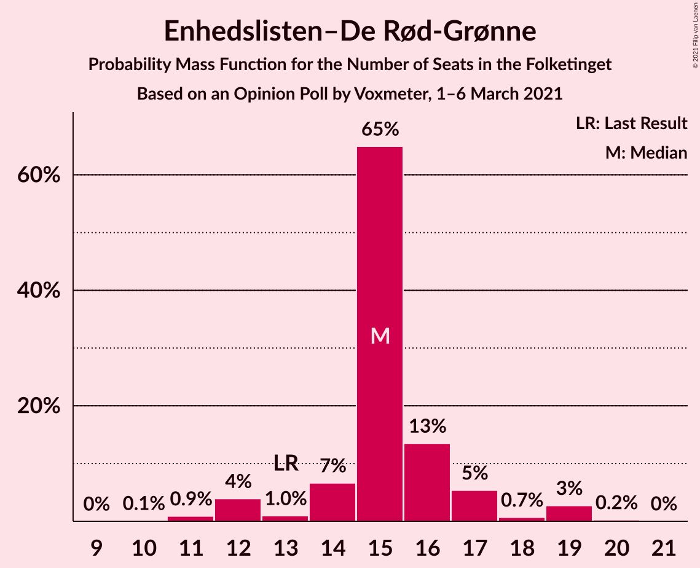
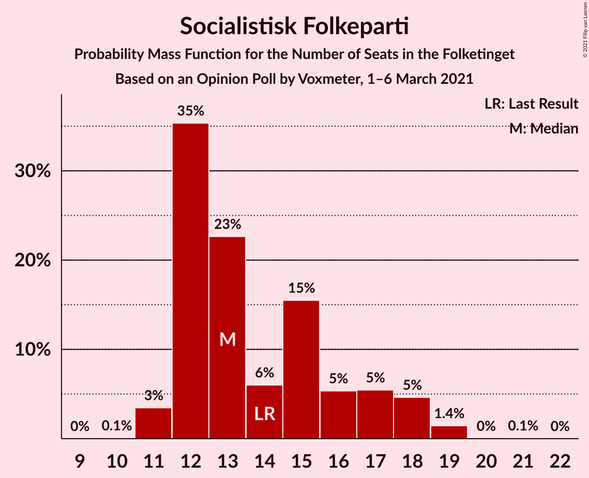

# Opinion Poll by Voxmeter, 1–6 March 2021

<a href="#voting-intentions">Voting Intentions</a> | <a href="#seats">Seats</a> | <a href="#coalitions">Coalitions</a> | <a href="#technical-information">Technical Information</a>

## Voting Intentions

### Confidence Intervals

| Party | Last Result | Poll Result | 80% Confidence Interval | 90% Confidence Interval | 95% Confidence Interval | 99% Confidence Interval |
|:-----:|:-----------:|:-----------:|:-----------------------:|:-----------------------:|:-----------------------:|:-----------------------:|
| Socialdemokraterne | 25.9% | 32.4% | 30.6–34.3% |30.0–34.9% |29.6–35.3% |28.7–36.2% |
| Det Konservative Folkeparti | 6.6% | 14.0% | 12.7–15.5% |12.3–15.9% |12.0–16.3% |11.4–17.0% |
| Venstre | 23.4% | 12.3% | 11.0–13.7% |10.7–14.1% |10.4–14.4% |9.8–15.1% |
| Nye Borgerlige | 2.4% | 8.7% | 7.6–9.9% |7.3–10.2% |7.1–10.5% |6.6–11.2% |
| Enhedslisten–De Rød-Grønne | 6.9% | 8.4% | 7.3–9.6% |7.1–9.9% |6.8–10.2% |6.4–10.8% |
| Socialistisk Folkeparti | 7.7% | 8.1% | 7.1–9.3% |6.8–9.6% |6.6–9.9% |6.1–10.5% |
| Dansk Folkeparti | 8.7% | 5.6% | 4.8–6.7% |4.6–7.0% |4.4–7.2% |4.0–7.8% |
| Radikale Venstre | 8.6% | 5.1% | 4.3–6.1% |4.1–6.3% |3.9–6.6% |3.5–7.1% |
| Kristendemokraterne | 1.7% | 2.1% | 1.7–2.9% |1.5–3.0% |1.4–3.2% |1.2–3.6% |
| Liberal Alliance | 2.3% | 1.9% | 1.5–2.6% |1.4–2.8% |1.3–3.0% |1.1–3.4% |
| Alternativet | 3.0% | 0.8% | 0.5–1.3% |0.4–1.4% |0.4–1.5% |0.3–1.8% |
| Veganerpartiet | 0.0% | 0.3% | 0.2–0.7% |0.1–0.8% |0.1–0.9% |0.1–1.1% |

*Note:* The poll result column reflects the actual value used in the calculations. Published results may vary slightly, and in addition be rounded to fewer digits.

## Seats

### Confidence Intervals

| Party | Last Result | Median | 80% Confidence Interval | 90% Confidence Interval | 95% Confidence Interval | 99% Confidence Interval |
|:-----:|:-----------:|:------:|:-----------------------:|:-----------------------:|:-----------------------:|:-----------------------:|
| <a href="#socialdemokraterne">Socialdemokraterne</a> | 48 | 58 | 55–63 |54–63 |54–63 |52–65 |
| <a href="#det-konservative-folkeparti">Det Konservative Folkeparti</a> | 12 | 25 | 23–29 |21–30 |21–30 |20–32 |
| <a href="#venstre">Venstre</a> | 43 | 23 | 21–24 |19–25 |19–25 |17–27 |
| <a href="#nye-borgerlige">Nye Borgerlige</a> | 4 | 14 | 13–17 |13–19 |13–19 |12–19 |
| <a href="#enhedslisten–de-rød-grønne">Enhedslisten–De Rød-Grønne</a> | 13 | 15 | 14–16 |13–17 |12–19 |11–19 |
| <a href="#socialistisk-folkeparti">Socialistisk Folkeparti</a> | 14 | 13 | 12–17 |12–18 |11–18 |11–19 |
| <a href="#dansk-folkeparti">Dansk Folkeparti</a> | 16 | 10 | 9–11 |9–12 |8–12 |7–14 |
| <a href="#radikale-venstre">Radikale Venstre</a> | 16 | 9 | 7–11 |7–11 |7–12 |6–13 |
| <a href="#kristendemokraterne">Kristendemokraterne</a> | 0 | 4 | 0–5 |0–5 |0–6 |0–7 |
| <a href="#liberal-alliance">Liberal Alliance</a> | 4 | 4 | 0–5 |0–5 |0–5 |0–6 |
| <a href="#alternativet">Alternativet</a> | 5 | 0 | 0 |0 |0 |0 |
| <a href="#veganerpartiet">Veganerpartiet</a> | 0 | 0 | 0 |0 |0 |0 |

### Socialdemokraterne

*For a full overview of the results for this party, see the [Socialdemokraterne](party-socialdemokraterne.html) page.*

| Number of Seats | Probability | Accumulated | Special Marks |
|:---------------:|:-----------:|:-----------:|:-------------:|
| 48 | 0% | 100% | Last Result |
| 49 | 0% | 100% |  |
| 50 | 0.1% | 99.9% |  |
| 51 | 0.1% | 99.8% |  |
| 52 | 0.8% | 99.7% |  |
| 53 | 0.6% | 98.9% |  |
| 54 | 5% | 98% |  |
| 55 | 32% | 93% |  |
| 56 | 9% | 61% |  |
| 57 | 2% | 52% |  |
| 58 | 2% | 50% | Median |
| 59 | 5% | 48% |  |
| 60 | 19% | 43% |  |
| 61 | 2% | 24% |  |
| 62 | 0.8% | 22% |  |
| 63 | 20% | 21% |  |
| 64 | 0.7% | 1.3% |  |
| 65 | 0.4% | 0.6% |  |
| 66 | 0.1% | 0.2% |  |
| 67 | 0% | 0.1% |  |
| 68 | 0% | 0.1% |  |
| 69 | 0.1% | 0.1% |  |
| 70 | 0% | 0% |  |

### Det Konservative Folkeparti

*For a full overview of the results for this party, see the [Det Konservative Folkeparti](party-detkonservativefolkeparti.html) page.*

| Number of Seats | Probability | Accumulated | Special Marks |
|:---------------:|:-----------:|:-----------:|:-------------:|
| 12 | 0% | 100% | Last Result |
| 13 | 0% | 100% |  |
| 14 | 0% | 100% |  |
| 15 | 0% | 100% |  |
| 16 | 0% | 100% |  |
| 17 | 0% | 100% |  |
| 18 | 0% | 100% |  |
| 19 | 0.5% | 100% |  |
| 20 | 0.2% | 99.5% |  |
| 21 | 6% | 99.3% |  |
| 22 | 0.7% | 93% |  |
| 23 | 22% | 93% |  |
| 24 | 7% | 71% |  |
| 25 | 15% | 64% | Median |
| 26 | 33% | 49% |  |
| 27 | 2% | 16% |  |
| 28 | 3% | 13% |  |
| 29 | 3% | 10% |  |
| 30 | 5% | 7% |  |
| 31 | 0.7% | 1.4% |  |
| 32 | 0.6% | 0.7% |  |
| 33 | 0.1% | 0.1% |  |
| 34 | 0% | 0% |  |

### Venstre

*For a full overview of the results for this party, see the [Venstre](party-venstre.html) page.*

| Number of Seats | Probability | Accumulated | Special Marks |
|:---------------:|:-----------:|:-----------:|:-------------:|
| 16 | 0.4% | 100% |  |
| 17 | 0.6% | 99.6% |  |
| 18 | 0.5% | 99.0% |  |
| 19 | 5% | 98.5% |  |
| 20 | 3% | 94% |  |
| 21 | 18% | 91% |  |
| 22 | 13% | 73% |  |
| 23 | 32% | 61% | Median |
| 24 | 22% | 29% |  |
| 25 | 4% | 6% |  |
| 26 | 2% | 2% |  |
| 27 | 0.5% | 0.6% |  |
| 28 | 0.1% | 0.1% |  |
| 29 | 0% | 0% |  |
| 30 | 0% | 0% |  |
| 31 | 0% | 0% |  |
| 32 | 0% | 0% |  |
| 33 | 0% | 0% |  |
| 34 | 0% | 0% |  |
| 35 | 0% | 0% |  |
| 36 | 0% | 0% |  |
| 37 | 0% | 0% |  |
| 38 | 0% | 0% |  |
| 39 | 0% | 0% |  |
| 40 | 0% | 0% |  |
| 41 | 0% | 0% |  |
| 42 | 0% | 0% |  |
| 43 | 0% | 0% | Last Result |

### Nye Borgerlige

*For a full overview of the results for this party, see the [Nye Borgerlige](party-nyeborgerlige.html) page.*

| Number of Seats | Probability | Accumulated | Special Marks |
|:---------------:|:-----------:|:-----------:|:-------------:|
| 4 | 0% | 100% | Last Result |
| 5 | 0% | 100% |  |
| 6 | 0% | 100% |  |
| 7 | 0% | 100% |  |
| 8 | 0% | 100% |  |
| 9 | 0% | 100% |  |
| 10 | 0% | 100% |  |
| 11 | 0% | 100% |  |
| 12 | 1.3% | 100% |  |
| 13 | 20% | 98.7% |  |
| 14 | 34% | 79% | Median |
| 15 | 17% | 45% |  |
| 16 | 15% | 28% |  |
| 17 | 4% | 13% |  |
| 18 | 4% | 9% |  |
| 19 | 5% | 5% |  |
| 20 | 0.2% | 0.4% |  |
| 21 | 0.1% | 0.2% |  |
| 22 | 0% | 0% |  |

### Enhedslisten–De Rød-Grønne

*For a full overview of the results for this party, see the [Enhedslisten–De Rød-Grønne](party-enhedslisten–derød-grønne.html) page.*

| Number of Seats | Probability | Accumulated | Special Marks |
|:---------------:|:-----------:|:-----------:|:-------------:|
| 10 | 0.1% | 100% |  |
| 11 | 0.9% | 99.9% |  |
| 12 | 4% | 99.0% |  |
| 13 | 1.0% | 95% | Last Result |
| 14 | 7% | 94% |  |
| 15 | 65% | 87% | Median |
| 16 | 13% | 23% |  |
| 17 | 5% | 9% |  |
| 18 | 0.7% | 4% |  |
| 19 | 3% | 3% |  |
| 20 | 0.2% | 0.3% |  |
| 21 | 0% | 0% |  |

### Socialistisk Folkeparti

*For a full overview of the results for this party, see the [Socialistisk Folkeparti](party-socialistiskfolkeparti.html) page.*

| Number of Seats | Probability | Accumulated | Special Marks |
|:---------------:|:-----------:|:-----------:|:-------------:|
| 10 | 0.1% | 100% |  |
| 11 | 3% | 99.9% |  |
| 12 | 35% | 96% |  |
| 13 | 23% | 61% | Median |
| 14 | 6% | 38% | Last Result |
| 15 | 15% | 32% |  |
| 16 | 5% | 17% |  |
| 17 | 5% | 12% |  |
| 18 | 5% | 6% |  |
| 19 | 1.4% | 2% |  |
| 20 | 0% | 0.1% |  |
| 21 | 0.1% | 0.1% |  |
| 22 | 0% | 0% |  |

### Dansk Folkeparti

*For a full overview of the results for this party, see the [Dansk Folkeparti](party-danskfolkeparti.html) page.*

| Number of Seats | Probability | Accumulated | Special Marks |
|:---------------:|:-----------:|:-----------:|:-------------:|
| 7 | 0.9% | 100% |  |
| 8 | 2% | 99.0% |  |
| 9 | 8% | 97% |  |
| 10 | 42% | 89% | Median |
| 11 | 37% | 47% |  |
| 12 | 8% | 10% |  |
| 13 | 1.1% | 2% |  |
| 14 | 0.5% | 0.6% |  |
| 15 | 0.1% | 0.1% |  |
| 16 | 0% | 0% | Last Result |

### Radikale Venstre

*For a full overview of the results for this party, see the [Radikale Venstre](party-radikalevenstre.html) page.*

| Number of Seats | Probability | Accumulated | Special Marks |
|:---------------:|:-----------:|:-----------:|:-------------:|
| 6 | 2% | 100% |  |
| 7 | 8% | 98% |  |
| 8 | 5% | 90% |  |
| 9 | 40% | 85% | Median |
| 10 | 6% | 45% |  |
| 11 | 34% | 39% |  |
| 12 | 4% | 4% |  |
| 13 | 0.5% | 0.5% |  |
| 14 | 0.1% | 0.1% |  |
| 15 | 0% | 0% |  |
| 16 | 0% | 0% | Last Result |

### Kristendemokraterne

*For a full overview of the results for this party, see the [Kristendemokraterne](party-kristendemokraterne.html) page.*

| Number of Seats | Probability | Accumulated | Special Marks |
|:---------------:|:-----------:|:-----------:|:-------------:|
| 0 | 33% | 100% | Last Result |
| 1 | 0% | 67% |  |
| 2 | 0% | 67% |  |
| 3 | 0.3% | 67% |  |
| 4 | 41% | 66% | Median |
| 5 | 22% | 25% |  |
| 6 | 2% | 3% |  |
| 7 | 0.5% | 0.5% |  |
| 8 | 0% | 0% |  |

### Liberal Alliance

*For a full overview of the results for this party, see the [Liberal Alliance](party-liberalalliance.html) page.*

| Number of Seats | Probability | Accumulated | Special Marks |
|:---------------:|:-----------:|:-----------:|:-------------:|
| 0 | 39% | 100% |  |
| 1 | 0% | 61% |  |
| 2 | 0% | 61% |  |
| 3 | 0% | 61% |  |
| 4 | 47% | 61% | Last Result, Median |
| 5 | 13% | 14% |  |
| 6 | 1.1% | 1.1% |  |
| 7 | 0% | 0% |  |

### Alternativet

*For a full overview of the results for this party, see the [Alternativet](party-alternativet.html) page.*

| Number of Seats | Probability | Accumulated | Special Marks |
|:---------------:|:-----------:|:-----------:|:-------------:|
| 0 | 99.8% | 100% | Median |
| 1 | 0% | 0.2% |  |
| 2 | 0% | 0.2% |  |
| 3 | 0% | 0.2% |  |
| 4 | 0.2% | 0.2% |  |
| 5 | 0% | 0% | Last Result |

### Veganerpartiet

*For a full overview of the results for this party, see the [Veganerpartiet](party-veganerpartiet.html) page.*

| Number of Seats | Probability | Accumulated | Special Marks |
|:---------------:|:-----------:|:-----------:|:-------------:|
| 0 | 100% | 100% | Last Result, Median |

## Coalitions

### Confidence Intervals

| Coalition | Last Result | Median | Majority? | 80% Confidence Interval | 90% Confidence Interval | 95% Confidence Interval | 99% Confidence Interval |
|:---------:|:-----------:|:------:|:---------:|:-----------------------:|:-----------------------:|:-----------------------:|:-----------------------:|
| Socialdemokraterne – Enhedslisten–De Rød-Grønne – Socialistisk Folkeparti – Radikale Venstre – Alternativet | 96 | 97 | 99.6% | 93–100 | 92–102 | 92–102 | 90–105 |
| Socialdemokraterne – Enhedslisten–De Rød-Grønne – Socialistisk Folkeparti – Radikale Venstre | 91 | 97 | 99.6% | 93–100 | 92–102 | 92–102 | 90–105 |
| Socialdemokraterne – Enhedslisten–De Rød-Grønne – Socialistisk Folkeparti – Alternativet | 80 | 88 | 42% | 82–91 | 82–93 | 82–93 | 81–96 |
| Socialdemokraterne – Enhedslisten–De Rød-Grønne – Socialistisk Folkeparti | 75 | 88 | 42% | 82–91 | 82–93 | 82–93 | 81–96 |
| Socialdemokraterne – Socialistisk Folkeparti – Radikale Venstre | 78 | 81 | 0.8% | 78–85 | 76–85 | 76–87 | 75–90 |
| Det Konservative Folkeparti – Venstre – Nye Borgerlige – Dansk Folkeparti – Kristendemokraterne – Liberal Alliance | 79 | 78 | 0% | 75–82 | 73–83 | 73–83 | 70–85 |
| Det Konservative Folkeparti – Venstre – Nye Borgerlige – Dansk Folkeparti – Liberal Alliance | 79 | 76 | 0% | 70–78 | 70–79 | 70–80 | 68–85 |
| Socialdemokraterne – Radikale Venstre | 64 | 66 | 0% | 65–72 | 63–72 | 62–72 | 59–75 |
| Det Konservative Folkeparti – Venstre – Dansk Folkeparti – Kristendemokraterne – Liberal Alliance | 75 | 62 | 0% | 59–68 | 56–68 | 56–68 | 54–70 |
| Det Konservative Folkeparti – Venstre – Dansk Folkeparti – Liberal Alliance | 75 | 61 | 0% | 57–64 | 56–64 | 55–66 | 53–67 |
| Det Konservative Folkeparti – Venstre – Liberal Alliance | 59 | 51 | 0% | 46–53 | 46–54 | 45–56 | 41–57 |
| Det Konservative Folkeparti – Venstre | 55 | 47 | 0% | 46–50 | 45–51 | 43–52 | 41–54 |
| Venstre | 43 | 23 | 0% | 21–24 | 19–25 | 19–25 | 17–27 |

### Socialdemokraterne – Enhedslisten–De Rød-Grønne – Socialistisk Folkeparti – Radikale Venstre – Alternativet

| Number of Seats | Probability | Accumulated | Special Marks |
|:---------------:|:-----------:|:-----------:|:-------------:|
| 87 | 0.1% | 100% |  |
| 88 | 0% | 99.8% |  |
| 89 | 0.2% | 99.8% |  |
| 90 | 2% | 99.6% | Majority |
| 91 | 0.4% | 98% |  |
| 92 | 4% | 98% |  |
| 93 | 32% | 94% |  |
| 94 | 2% | 62% |  |
| 95 | 4% | 60% | Median |
| 96 | 2% | 56% | Last Result |
| 97 | 9% | 54% |  |
| 98 | 4% | 46% |  |
| 99 | 11% | 41% |  |
| 100 | 24% | 31% |  |
| 101 | 0.9% | 6% |  |
| 102 | 3% | 5% |  |
| 103 | 0.7% | 2% |  |
| 104 | 0.4% | 2% |  |
| 105 | 1.1% | 1.2% |  |
| 106 | 0% | 0.1% |  |
| 107 | 0% | 0.1% |  |
| 108 | 0% | 0% |  |

### Socialdemokraterne – Enhedslisten–De Rød-Grønne – Socialistisk Folkeparti – Radikale Venstre

| Number of Seats | Probability | Accumulated | Special Marks |
|:---------------:|:-----------:|:-----------:|:-------------:|
| 87 | 0.1% | 100% |  |
| 88 | 0% | 99.8% |  |
| 89 | 0.2% | 99.8% |  |
| 90 | 2% | 99.6% | Majority |
| 91 | 0.4% | 98% | Last Result |
| 92 | 4% | 98% |  |
| 93 | 32% | 94% |  |
| 94 | 2% | 61% |  |
| 95 | 4% | 60% | Median |
| 96 | 2% | 56% |  |
| 97 | 9% | 54% |  |
| 98 | 4% | 46% |  |
| 99 | 11% | 41% |  |
| 100 | 24% | 31% |  |
| 101 | 0.9% | 6% |  |
| 102 | 3% | 5% |  |
| 103 | 0.7% | 2% |  |
| 104 | 0.4% | 2% |  |
| 105 | 1.1% | 1.2% |  |
| 106 | 0% | 0.1% |  |
| 107 | 0% | 0.1% |  |
| 108 | 0% | 0% |  |

### Socialdemokraterne – Enhedslisten–De Rød-Grønne – Socialistisk Folkeparti – Alternativet

| Number of Seats | Probability | Accumulated | Special Marks |
|:---------------:|:-----------:|:-----------:|:-------------:|
| 78 | 0% | 100% |  |
| 79 | 0.2% | 99.9% |  |
| 80 | 0% | 99.8% | Last Result |
| 81 | 1.0% | 99.7% |  |
| 82 | 33% | 98.7% |  |
| 83 | 3% | 66% |  |
| 84 | 2% | 63% |  |
| 85 | 1.5% | 61% |  |
| 86 | 2% | 59% | Median |
| 87 | 3% | 57% |  |
| 88 | 12% | 55% |  |
| 89 | 1.1% | 43% |  |
| 90 | 13% | 42% | Majority |
| 91 | 20% | 29% |  |
| 92 | 1.5% | 9% |  |
| 93 | 5% | 8% |  |
| 94 | 0.8% | 2% |  |
| 95 | 0.6% | 1.5% |  |
| 96 | 0.8% | 0.9% |  |
| 97 | 0% | 0.1% |  |
| 98 | 0% | 0.1% |  |
| 99 | 0% | 0% |  |

### Socialdemokraterne – Enhedslisten–De Rød-Grønne – Socialistisk Folkeparti

| Number of Seats | Probability | Accumulated | Special Marks |
|:---------------:|:-----------:|:-----------:|:-------------:|
| 75 | 0% | 100% | Last Result |
| 76 | 0% | 100% |  |
| 77 | 0% | 100% |  |
| 78 | 0% | 100% |  |
| 79 | 0.2% | 99.9% |  |
| 80 | 0% | 99.8% |  |
| 81 | 1.0% | 99.7% |  |
| 82 | 33% | 98.7% |  |
| 83 | 3% | 66% |  |
| 84 | 2% | 63% |  |
| 85 | 1.5% | 60% |  |
| 86 | 2% | 59% | Median |
| 87 | 3% | 57% |  |
| 88 | 12% | 55% |  |
| 89 | 1.1% | 43% |  |
| 90 | 13% | 42% | Majority |
| 91 | 20% | 29% |  |
| 92 | 2% | 9% |  |
| 93 | 5% | 8% |  |
| 94 | 0.8% | 2% |  |
| 95 | 0.6% | 1.5% |  |
| 96 | 0.8% | 0.9% |  |
| 97 | 0% | 0.1% |  |
| 98 | 0% | 0.1% |  |
| 99 | 0% | 0% |  |

### Socialdemokraterne – Socialistisk Folkeparti – Radikale Venstre

| Number of Seats | Probability | Accumulated | Special Marks |
|:---------------:|:-----------:|:-----------:|:-------------:|
| 73 | 0.1% | 100% |  |
| 74 | 0.1% | 99.8% |  |
| 75 | 2% | 99.7% |  |
| 76 | 3% | 98% |  |
| 77 | 0.5% | 95% |  |
| 78 | 32% | 95% | Last Result |
| 79 | 2% | 62% |  |
| 80 | 4% | 60% | Median |
| 81 | 6% | 55% |  |
| 82 | 3% | 49% |  |
| 83 | 3% | 47% |  |
| 84 | 19% | 44% |  |
| 85 | 21% | 25% |  |
| 86 | 1.2% | 4% |  |
| 87 | 1.3% | 3% |  |
| 88 | 0.2% | 2% |  |
| 89 | 0.5% | 1.3% |  |
| 90 | 0.7% | 0.8% | Majority |
| 91 | 0% | 0.1% |  |
| 92 | 0.1% | 0.1% |  |
| 93 | 0% | 0% |  |

### Det Konservative Folkeparti – Venstre – Nye Borgerlige – Dansk Folkeparti – Kristendemokraterne – Liberal Alliance

| Number of Seats | Probability | Accumulated | Special Marks |
|:---------------:|:-----------:|:-----------:|:-------------:|
| 68 | 0% | 100% |  |
| 69 | 0% | 99.9% |  |
| 70 | 1.1% | 99.9% |  |
| 71 | 0.4% | 98.8% |  |
| 72 | 0.7% | 98% |  |
| 73 | 3% | 98% |  |
| 74 | 0.9% | 95% |  |
| 75 | 24% | 94% |  |
| 76 | 11% | 69% |  |
| 77 | 4% | 59% |  |
| 78 | 9% | 54% |  |
| 79 | 2% | 46% | Last Result |
| 80 | 4% | 44% | Median |
| 81 | 2% | 40% |  |
| 82 | 32% | 38% |  |
| 83 | 4% | 6% |  |
| 84 | 0.4% | 2% |  |
| 85 | 2% | 2% |  |
| 86 | 0.2% | 0.4% |  |
| 87 | 0% | 0.2% |  |
| 88 | 0.1% | 0.2% |  |
| 89 | 0% | 0% |  |

### Det Konservative Folkeparti – Venstre – Nye Borgerlige – Dansk Folkeparti – Liberal Alliance

| Number of Seats | Probability | Accumulated | Special Marks |
|:---------------:|:-----------:|:-----------:|:-------------:|
| 66 | 0% | 100% |  |
| 67 | 0.1% | 99.9% |  |
| 68 | 0.5% | 99.8% |  |
| 69 | 0.3% | 99.3% |  |
| 70 | 20% | 99.0% |  |
| 71 | 0.6% | 79% |  |
| 72 | 0.8% | 79% |  |
| 73 | 4% | 78% |  |
| 74 | 6% | 73% |  |
| 75 | 6% | 67% |  |
| 76 | 12% | 61% | Median |
| 77 | 6% | 49% |  |
| 78 | 35% | 44% |  |
| 79 | 4% | 9% | Last Result |
| 80 | 2% | 4% |  |
| 81 | 0.4% | 2% |  |
| 82 | 0.2% | 2% |  |
| 83 | 0.1% | 2% |  |
| 84 | 0.2% | 2% |  |
| 85 | 1.5% | 1.5% |  |
| 86 | 0% | 0% |  |

### Socialdemokraterne – Radikale Venstre

| Number of Seats | Probability | Accumulated | Special Marks |
|:---------------:|:-----------:|:-----------:|:-------------:|
| 59 | 0.5% | 100% |  |
| 60 | 0.2% | 99.5% |  |
| 61 | 0.1% | 99.3% |  |
| 62 | 2% | 99.1% |  |
| 63 | 5% | 97% |  |
| 64 | 1.3% | 93% | Last Result |
| 65 | 7% | 91% |  |
| 66 | 34% | 84% |  |
| 67 | 6% | 50% | Median |
| 68 | 3% | 44% |  |
| 69 | 11% | 40% |  |
| 70 | 5% | 29% |  |
| 71 | 3% | 24% |  |
| 72 | 19% | 21% |  |
| 73 | 0.3% | 2% |  |
| 74 | 1.0% | 2% |  |
| 75 | 0.4% | 0.6% |  |
| 76 | 0% | 0.1% |  |
| 77 | 0% | 0.1% |  |
| 78 | 0.1% | 0.1% |  |
| 79 | 0% | 0% |  |

### Det Konservative Folkeparti – Venstre – Dansk Folkeparti – Kristendemokraterne – Liberal Alliance

| Number of Seats | Probability | Accumulated | Special Marks |
|:---------------:|:-----------:|:-----------:|:-------------:|
| 53 | 0.4% | 100% |  |
| 54 | 0.7% | 99.5% |  |
| 55 | 0.2% | 98.8% |  |
| 56 | 4% | 98.6% |  |
| 57 | 1.0% | 94% |  |
| 58 | 3% | 93% |  |
| 59 | 0.8% | 90% |  |
| 60 | 3% | 89% |  |
| 61 | 14% | 87% |  |
| 62 | 27% | 72% |  |
| 63 | 2% | 45% |  |
| 64 | 2% | 43% |  |
| 65 | 1.2% | 41% |  |
| 66 | 2% | 40% | Median |
| 67 | 6% | 38% |  |
| 68 | 31% | 32% |  |
| 69 | 0.4% | 1.1% |  |
| 70 | 0.6% | 0.7% |  |
| 71 | 0% | 0.2% |  |
| 72 | 0.1% | 0.2% |  |
| 73 | 0% | 0% |  |
| 74 | 0% | 0% |  |
| 75 | 0% | 0% | Last Result |

### Det Konservative Folkeparti – Venstre – Dansk Folkeparti – Liberal Alliance

| Number of Seats | Probability | Accumulated | Special Marks |
|:---------------:|:-----------:|:-----------:|:-------------:|
| 50 | 0.2% | 100% |  |
| 51 | 0.1% | 99.8% |  |
| 52 | 0% | 99.7% |  |
| 53 | 0.7% | 99.6% |  |
| 54 | 0.9% | 98.9% |  |
| 55 | 0.6% | 98% |  |
| 56 | 5% | 97% |  |
| 57 | 21% | 92% |  |
| 58 | 8% | 71% |  |
| 59 | 1.4% | 64% |  |
| 60 | 3% | 62% |  |
| 61 | 15% | 60% |  |
| 62 | 5% | 45% | Median |
| 63 | 4% | 40% |  |
| 64 | 32% | 36% |  |
| 65 | 0.6% | 3% |  |
| 66 | 1.0% | 3% |  |
| 67 | 2% | 2% |  |
| 68 | 0.1% | 0.3% |  |
| 69 | 0.1% | 0.2% |  |
| 70 | 0% | 0% |  |
| 71 | 0% | 0% |  |
| 72 | 0% | 0% |  |
| 73 | 0% | 0% |  |
| 74 | 0% | 0% |  |
| 75 | 0% | 0% | Last Result |

### Det Konservative Folkeparti – Venstre – Liberal Alliance

| Number of Seats | Probability | Accumulated | Special Marks |
|:---------------:|:-----------:|:-----------:|:-------------:|
| 40 | 0.2% | 100% |  |
| 41 | 0.5% | 99.8% |  |
| 42 | 0.1% | 99.3% |  |
| 43 | 0.9% | 99.3% |  |
| 44 | 0.3% | 98% |  |
| 45 | 2% | 98% |  |
| 46 | 9% | 96% |  |
| 47 | 20% | 88% |  |
| 48 | 1.2% | 68% |  |
| 49 | 4% | 66% |  |
| 50 | 2% | 62% |  |
| 51 | 18% | 60% |  |
| 52 | 4% | 42% | Median |
| 53 | 33% | 38% |  |
| 54 | 1.4% | 5% |  |
| 55 | 0.9% | 4% |  |
| 56 | 2% | 3% |  |
| 57 | 0.5% | 0.7% |  |
| 58 | 0.2% | 0.2% |  |
| 59 | 0.1% | 0.1% | Last Result |
| 60 | 0% | 0% |  |

### Det Konservative Folkeparti – Venstre

| Number of Seats | Probability | Accumulated | Special Marks |
|:---------------:|:-----------:|:-----------:|:-------------:|
| 39 | 0% | 100% |  |
| 40 | 0.2% | 99.9% |  |
| 41 | 1.0% | 99.7% |  |
| 42 | 0.5% | 98.7% |  |
| 43 | 2% | 98% |  |
| 44 | 0.9% | 96% |  |
| 45 | 4% | 96% |  |
| 46 | 19% | 91% |  |
| 47 | 23% | 72% |  |
| 48 | 4% | 49% | Median |
| 49 | 34% | 45% |  |
| 50 | 2% | 11% |  |
| 51 | 5% | 9% |  |
| 52 | 3% | 4% |  |
| 53 | 0.3% | 1.0% |  |
| 54 | 0.6% | 0.7% |  |
| 55 | 0.1% | 0.1% | Last Result |
| 56 | 0% | 0% |  |

### Venstre

| Number of Seats | Probability | Accumulated | Special Marks |
|:---------------:|:-----------:|:-----------:|:-------------:|
| 16 | 0.4% | 100% |  |
| 17 | 0.6% | 99.6% |  |
| 18 | 0.5% | 99.0% |  |
| 19 | 5% | 98.5% |  |
| 20 | 3% | 94% |  |
| 21 | 18% | 91% |  |
| 22 | 13% | 73% |  |
| 23 | 32% | 61% | Median |
| 24 | 22% | 29% |  |
| 25 | 4% | 6% |  |
| 26 | 2% | 2% |  |
| 27 | 0.5% | 0.6% |  |
| 28 | 0.1% | 0.1% |  |
| 29 | 0% | 0% |  |
| 30 | 0% | 0% |  |
| 31 | 0% | 0% |  |
| 32 | 0% | 0% |  |
| 33 | 0% | 0% |  |
| 34 | 0% | 0% |  |
| 35 | 0% | 0% |  |
| 36 | 0% | 0% |  |
| 37 | 0% | 0% |  |
| 38 | 0% | 0% |  |
| 39 | 0% | 0% |  |
| 40 | 0% | 0% |  |
| 41 | 0% | 0% |  |
| 42 | 0% | 0% |  |
| 43 | 0% | 0% | Last Result |

## Technical Information

### Opinion Poll

+ **Polling firm:** Voxmeter
+ **Commissioner(s):** —
+ **Fieldwork period:** 1–6 March 2021

### Calculations

+ **Sample size:** 1028
+ **Simulations done:** 1,048,576
+ **Error estimate:** 2.15%

