# Opinion Poll by Voxmeter, 7–14 March 2021

<a href="#voting-intentions">Voting Intentions</a> | <a href="#seats">Seats</a> | <a href="#coalitions">Coalitions</a> | <a href="#technical-information">Technical Information</a>

## Voting Intentions

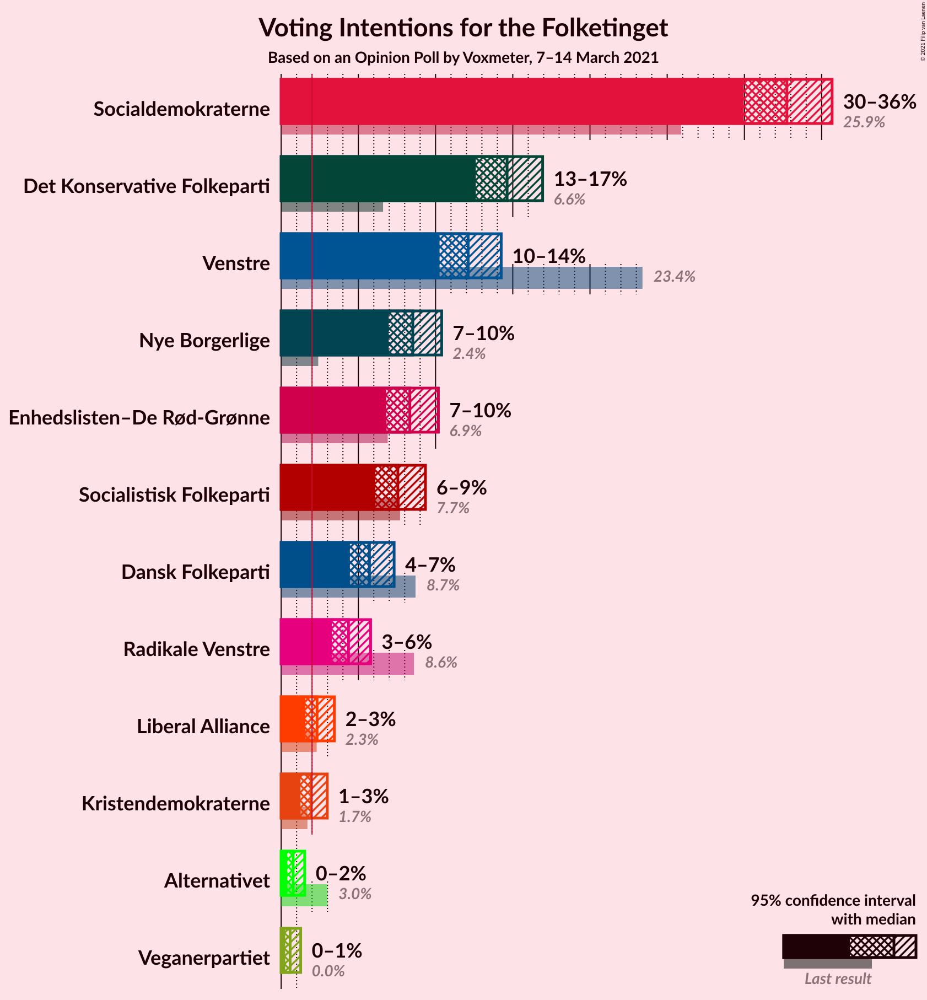

### Confidence Intervals

| Party | Last Result | Poll Result | 80% Confidence Interval | 90% Confidence Interval | 95% Confidence Interval | 99% Confidence Interval |
|:-----:|:-----------:|:-----------:|:-----------------------:|:-----------------------:|:-----------------------:|:-----------------------:|
| Socialdemokraterne | 25.9% | 32.8% | 30.9–34.7% |30.4–35.2% |29.9–35.7% |29.1–36.6% |
| Det Konservative Folkeparti | 6.6% | 14.6% | 13.3–16.1% |12.9–16.6% |12.6–16.9% |12.0–17.7% |
| Venstre | 23.4% | 12.1% | 10.9–13.5% |10.5–13.9% |10.3–14.3% |9.7–15.0% |
| Nye Borgerlige | 2.4% | 8.5% | 7.5–9.8% |7.2–10.1% |7.0–10.4% |6.5–11.0% |
| Enhedslisten–De Rød-Grønne | 6.9% | 8.3% | 7.3–9.5% |7.0–9.9% |6.8–10.2% |6.3–10.8% |
| Socialistisk Folkeparti | 7.7% | 7.6% | 6.6–8.7% |6.3–9.1% |6.1–9.3% |5.7–9.9% |
| Dansk Folkeparti | 8.7% | 5.7% | 4.9–6.8% |4.6–7.1% |4.5–7.3% |4.1–7.8% |
| Radikale Venstre | 8.6% | 4.4% | 3.6–5.3% |3.4–5.6% |3.3–5.8% |3.0–6.3% |
| Liberal Alliance | 2.3% | 2.3% | 1.8–3.0% |1.7–3.3% |1.6–3.4% |1.4–3.8% |
| Kristendemokraterne | 1.7% | 1.9% | 1.5–2.6% |1.4–2.8% |1.2–3.0% |1.1–3.3% |
| Alternativet | 3.0% | 0.8% | 0.5–1.3% |0.4–1.4% |0.4–1.5% |0.3–1.8% |
| Veganerpartiet | 0.0% | 0.6% | 0.4–1.0% |0.3–1.1% |0.3–1.3% |0.2–1.5% |

*Note:* The poll result column reflects the actual value used in the calculations. Published results may vary slightly, and in addition be rounded to fewer digits.

## Seats

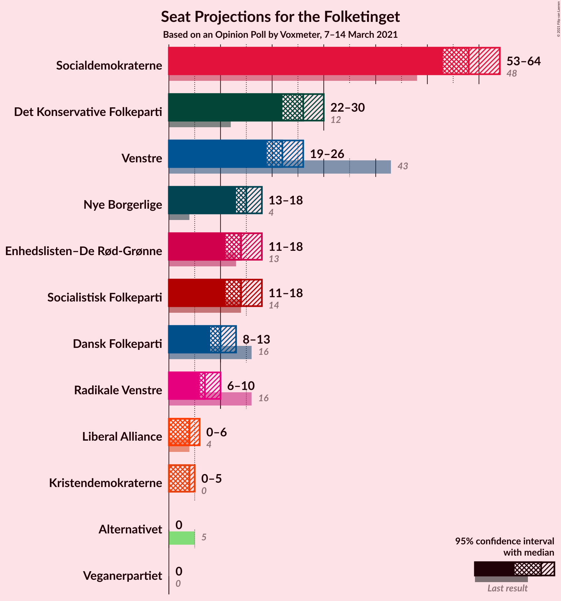

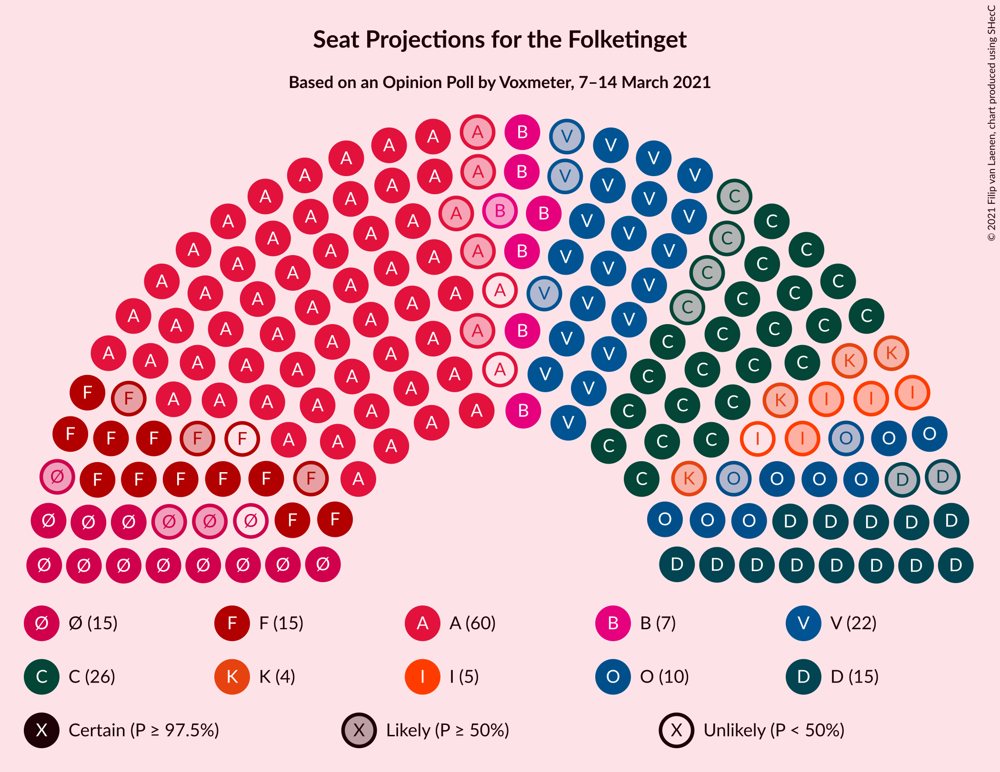

### Confidence Intervals

| Party | Last Result | Median | 80% Confidence Interval | 90% Confidence Interval | 95% Confidence Interval | 99% Confidence Interval |
|:-----:|:-----------:|:------:|:-----------------------:|:-----------------------:|:-----------------------:|:-----------------------:|
| <a href="#socialdemokraterne">Socialdemokraterne</a> | 48 | 58 | 56–62 |55–63 |53–64 |52–66 |
| <a href="#det-konservative-folkeparti">Det Konservative Folkeparti</a> | 12 | 26 | 23–28 |23–29 |22–30 |21–31 |
| <a href="#venstre">Venstre</a> | 43 | 22 | 20–25 |19–26 |19–26 |17–26 |
| <a href="#nye-borgerlige">Nye Borgerlige</a> | 4 | 15 | 14–18 |13–18 |13–18 |11–20 |
| <a href="#enhedslisten–de-rød-grønne">Enhedslisten–De Rød-Grønne</a> | 13 | 14 | 12–17 |12–18 |11–18 |10–19 |
| <a href="#socialistisk-folkeparti">Socialistisk Folkeparti</a> | 14 | 14 | 11–17 |11–17 |11–18 |10–18 |
| <a href="#dansk-folkeparti">Dansk Folkeparti</a> | 16 | 10 | 9–12 |8–13 |8–13 |7–14 |
| <a href="#radikale-venstre">Radikale Venstre</a> | 16 | 7 | 6–9 |6–10 |6–10 |5–11 |
| <a href="#liberal-alliance">Liberal Alliance</a> | 4 | 4 | 0–5 |0–6 |0–6 |0–7 |
| <a href="#kristendemokraterne">Kristendemokraterne</a> | 0 | 4 | 0–5 |0–5 |0–5 |0–6 |
| <a href="#alternativet">Alternativet</a> | 5 | 0 | 0 |0 |0 |0 |
| <a href="#veganerpartiet">Veganerpartiet</a> | 0 | 0 | 0 |0 |0 |0 |

### Socialdemokraterne

*For a full overview of the results for this party, see the [Socialdemokraterne](party-socialdemokraterne.html) page.*

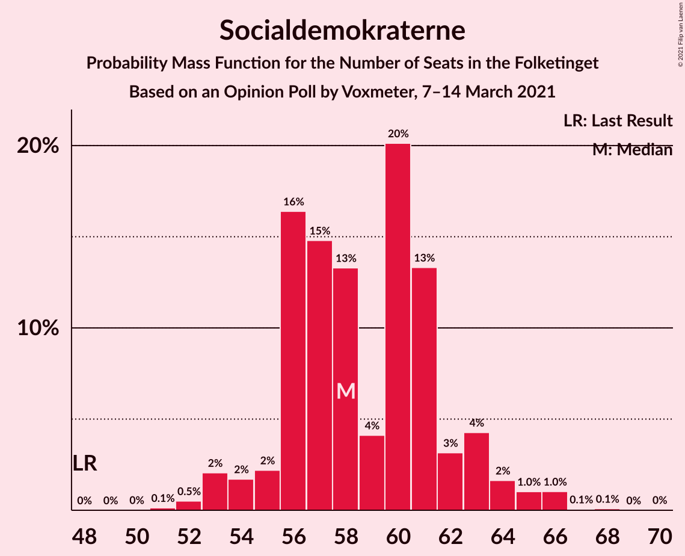

| Number of Seats | Probability | Accumulated | Special Marks |
|:---------------:|:-----------:|:-----------:|:-------------:|
| 48 | 0% | 100% | Last Result |
| 49 | 0% | 100% |  |
| 50 | 0% | 100% |  |
| 51 | 0.1% | 100% |  |
| 52 | 0.5% | 99.8% |  |
| 53 | 2% | 99.3% |  |
| 54 | 2% | 97% |  |
| 55 | 2% | 96% |  |
| 56 | 16% | 93% |  |
| 57 | 15% | 77% |  |
| 58 | 13% | 62% | Median |
| 59 | 4% | 49% |  |
| 60 | 20% | 45% |  |
| 61 | 13% | 25% |  |
| 62 | 3% | 11% |  |
| 63 | 4% | 8% |  |
| 64 | 2% | 4% |  |
| 65 | 1.0% | 2% |  |
| 66 | 1.0% | 1.2% |  |
| 67 | 0.1% | 0.2% |  |
| 68 | 0.1% | 0.1% |  |
| 69 | 0% | 0% |  |

### Det Konservative Folkeparti

*For a full overview of the results for this party, see the [Det Konservative Folkeparti](party-detkonservativefolkeparti.html) page.*

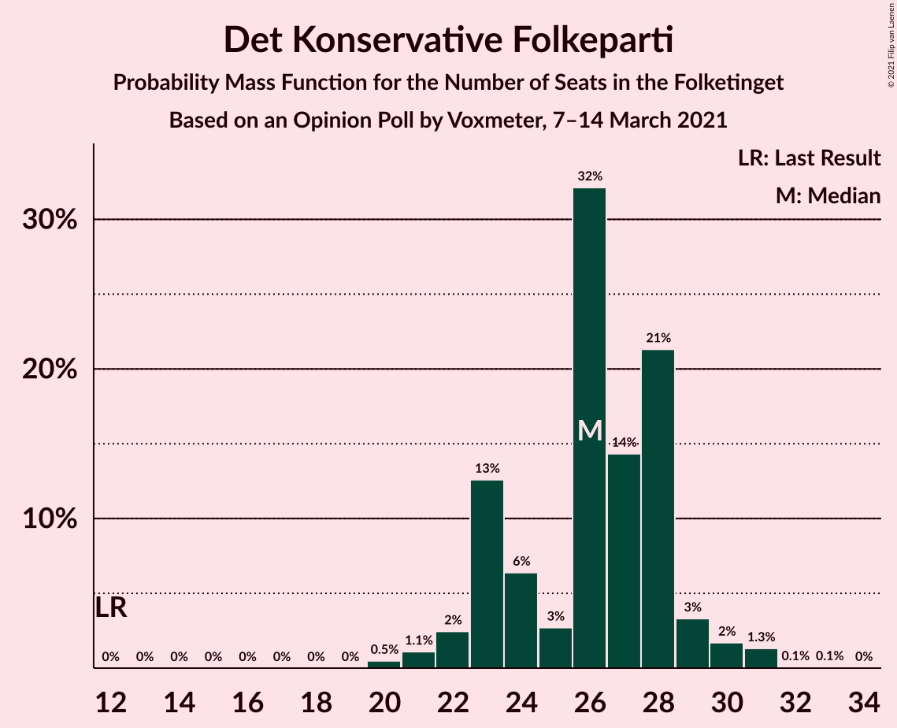

| Number of Seats | Probability | Accumulated | Special Marks |
|:---------------:|:-----------:|:-----------:|:-------------:|
| 12 | 0% | 100% | Last Result |
| 13 | 0% | 100% |  |
| 14 | 0% | 100% |  |
| 15 | 0% | 100% |  |
| 16 | 0% | 100% |  |
| 17 | 0% | 100% |  |
| 18 | 0% | 100% |  |
| 19 | 0% | 100% |  |
| 20 | 0.5% | 100% |  |
| 21 | 1.1% | 99.5% |  |
| 22 | 2% | 98% |  |
| 23 | 13% | 96% |  |
| 24 | 6% | 83% |  |
| 25 | 3% | 77% |  |
| 26 | 32% | 74% | Median |
| 27 | 14% | 42% |  |
| 28 | 21% | 28% |  |
| 29 | 3% | 6% |  |
| 30 | 2% | 3% |  |
| 31 | 1.3% | 1.5% |  |
| 32 | 0.1% | 0.1% |  |
| 33 | 0.1% | 0.1% |  |
| 34 | 0% | 0% |  |

### Venstre

*For a full overview of the results for this party, see the [Venstre](party-venstre.html) page.*

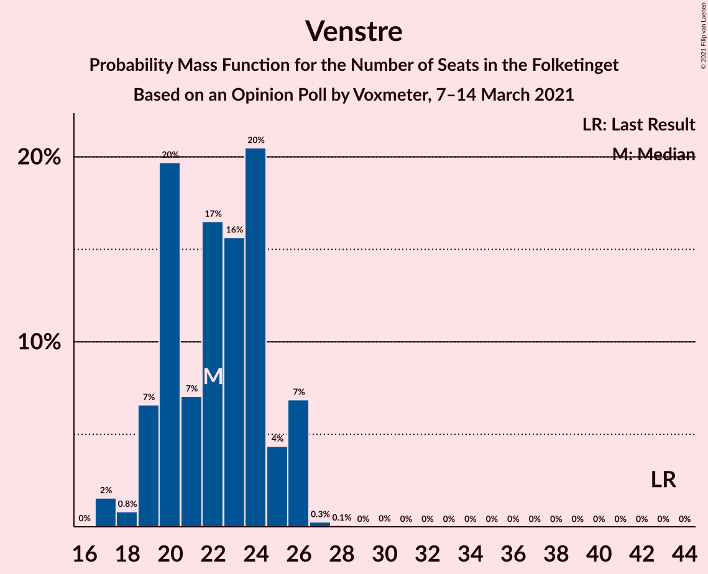

| Number of Seats | Probability | Accumulated | Special Marks |
|:---------------:|:-----------:|:-----------:|:-------------:|
| 16 | 0% | 100% |  |
| 17 | 2% | 99.9% |  |
| 18 | 0.8% | 98% |  |
| 19 | 7% | 98% |  |
| 20 | 20% | 91% |  |
| 21 | 7% | 71% |  |
| 22 | 17% | 64% | Median |
| 23 | 16% | 48% |  |
| 24 | 20% | 32% |  |
| 25 | 4% | 12% |  |
| 26 | 7% | 7% |  |
| 27 | 0.3% | 0.4% |  |
| 28 | 0.1% | 0.1% |  |
| 29 | 0% | 0% |  |
| 30 | 0% | 0% |  |
| 31 | 0% | 0% |  |
| 32 | 0% | 0% |  |
| 33 | 0% | 0% |  |
| 34 | 0% | 0% |  |
| 35 | 0% | 0% |  |
| 36 | 0% | 0% |  |
| 37 | 0% | 0% |  |
| 38 | 0% | 0% |  |
| 39 | 0% | 0% |  |
| 40 | 0% | 0% |  |
| 41 | 0% | 0% |  |
| 42 | 0% | 0% |  |
| 43 | 0% | 0% | Last Result |

### Nye Borgerlige

*For a full overview of the results for this party, see the [Nye Borgerlige](party-nyeborgerlige.html) page.*

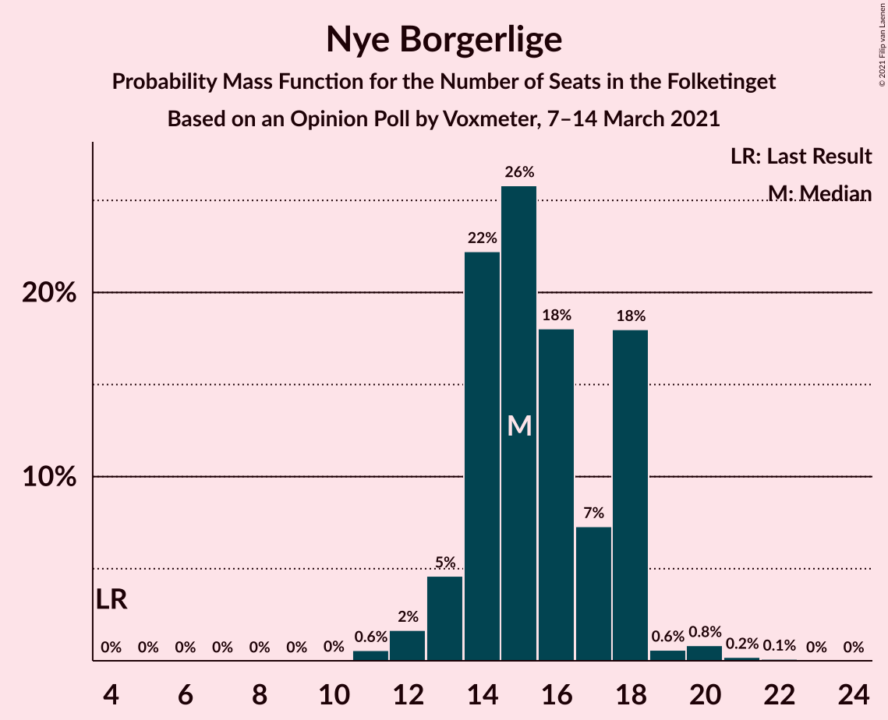

| Number of Seats | Probability | Accumulated | Special Marks |
|:---------------:|:-----------:|:-----------:|:-------------:|
| 4 | 0% | 100% | Last Result |
| 5 | 0% | 100% |  |
| 6 | 0% | 100% |  |
| 7 | 0% | 100% |  |
| 8 | 0% | 100% |  |
| 9 | 0% | 100% |  |
| 10 | 0% | 100% |  |
| 11 | 0.6% | 100% |  |
| 12 | 2% | 99.4% |  |
| 13 | 5% | 98% |  |
| 14 | 22% | 93% |  |
| 15 | 26% | 71% | Median |
| 16 | 18% | 45% |  |
| 17 | 7% | 27% |  |
| 18 | 18% | 20% |  |
| 19 | 0.6% | 2% |  |
| 20 | 0.8% | 1.1% |  |
| 21 | 0.2% | 0.3% |  |
| 22 | 0.1% | 0.1% |  |
| 23 | 0% | 0% |  |

### Enhedslisten–De Rød-Grønne

*For a full overview of the results for this party, see the [Enhedslisten–De Rød-Grønne](party-enhedslisten–derød-grønne.html) page.*

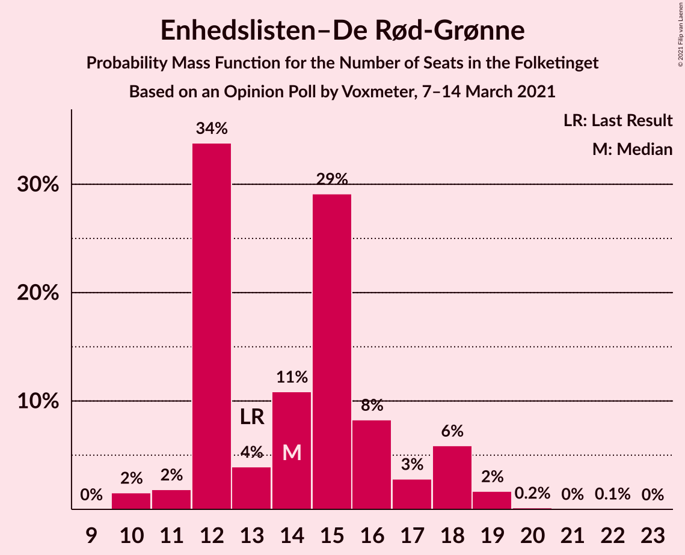

| Number of Seats | Probability | Accumulated | Special Marks |
|:---------------:|:-----------:|:-----------:|:-------------:|
| 10 | 2% | 100% |  |
| 11 | 2% | 98% |  |
| 12 | 34% | 97% |  |
| 13 | 4% | 63% | Last Result |
| 14 | 11% | 59% | Median |
| 15 | 29% | 48% |  |
| 16 | 8% | 19% |  |
| 17 | 3% | 11% |  |
| 18 | 6% | 8% |  |
| 19 | 2% | 2% |  |
| 20 | 0.2% | 0.3% |  |
| 21 | 0% | 0.1% |  |
| 22 | 0.1% | 0.1% |  |
| 23 | 0% | 0% |  |

### Socialistisk Folkeparti

*For a full overview of the results for this party, see the [Socialistisk Folkeparti](party-socialistiskfolkeparti.html) page.*

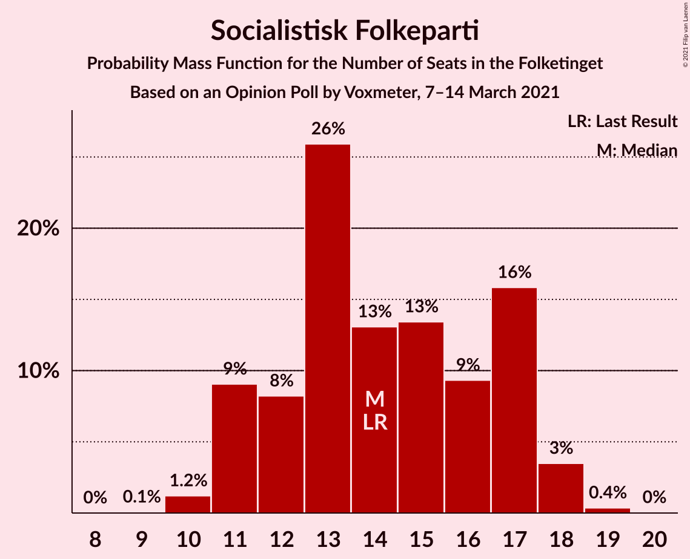

| Number of Seats | Probability | Accumulated | Special Marks |
|:---------------:|:-----------:|:-----------:|:-------------:|
| 9 | 0.1% | 100% |  |
| 10 | 1.2% | 99.9% |  |
| 11 | 9% | 98.7% |  |
| 12 | 8% | 90% |  |
| 13 | 26% | 81% |  |
| 14 | 13% | 56% | Last Result, Median |
| 15 | 13% | 42% |  |
| 16 | 9% | 29% |  |
| 17 | 16% | 20% |  |
| 18 | 3% | 4% |  |
| 19 | 0.4% | 0.4% |  |
| 20 | 0% | 0% |  |

### Dansk Folkeparti

*For a full overview of the results for this party, see the [Dansk Folkeparti](party-danskfolkeparti.html) page.*

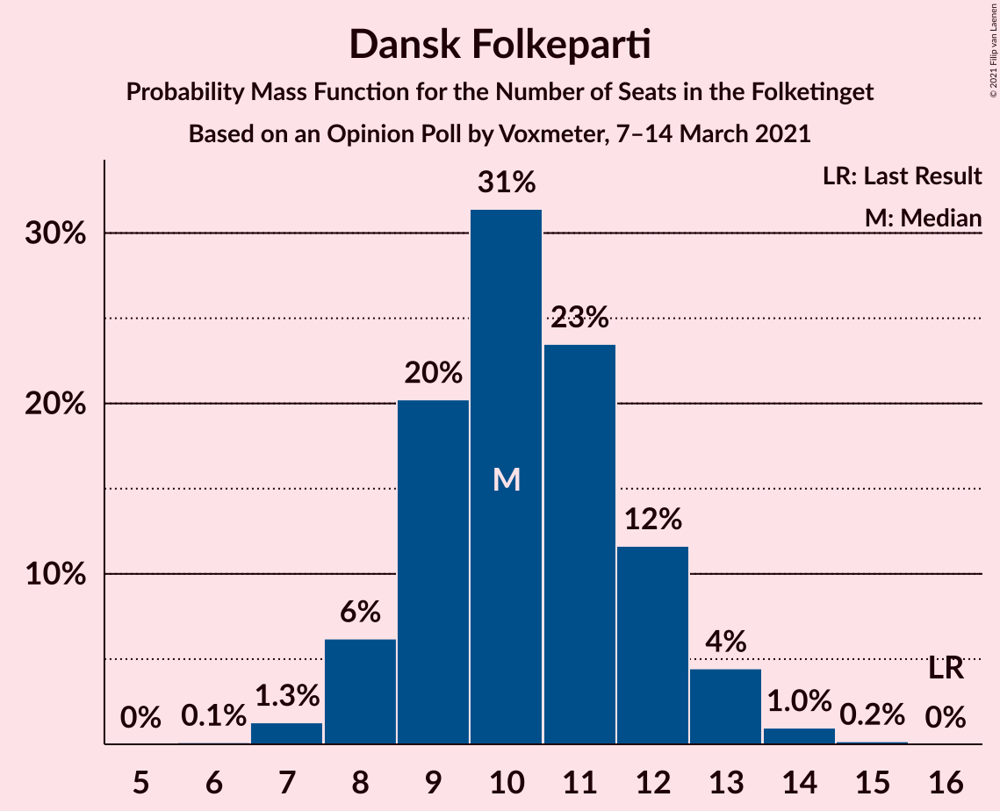

| Number of Seats | Probability | Accumulated | Special Marks |
|:---------------:|:-----------:|:-----------:|:-------------:|
| 6 | 0.1% | 100% |  |
| 7 | 1.3% | 99.9% |  |
| 8 | 6% | 98.6% |  |
| 9 | 20% | 92% |  |
| 10 | 31% | 72% | Median |
| 11 | 23% | 41% |  |
| 12 | 12% | 17% |  |
| 13 | 4% | 6% |  |
| 14 | 1.0% | 1.2% |  |
| 15 | 0.2% | 0.2% |  |
| 16 | 0% | 0% | Last Result |

### Radikale Venstre

*For a full overview of the results for this party, see the [Radikale Venstre](party-radikalevenstre.html) page.*

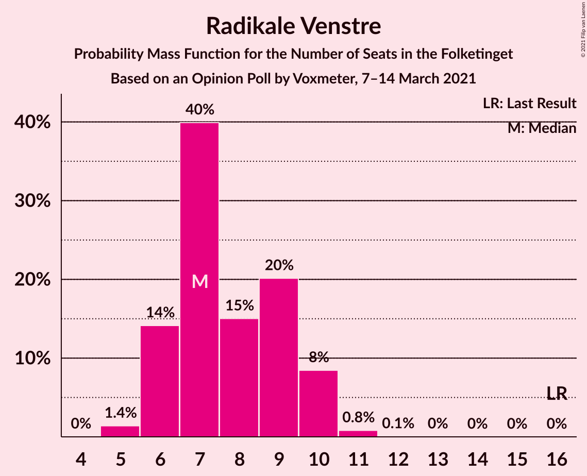

| Number of Seats | Probability | Accumulated | Special Marks |
|:---------------:|:-----------:|:-----------:|:-------------:|
| 5 | 1.4% | 100% |  |
| 6 | 14% | 98.6% |  |
| 7 | 40% | 84% | Median |
| 8 | 15% | 45% |  |
| 9 | 20% | 30% |  |
| 10 | 8% | 9% |  |
| 11 | 0.8% | 0.9% |  |
| 12 | 0.1% | 0.1% |  |
| 13 | 0% | 0% |  |
| 14 | 0% | 0% |  |
| 15 | 0% | 0% |  |
| 16 | 0% | 0% | Last Result |

### Liberal Alliance

*For a full overview of the results for this party, see the [Liberal Alliance](party-liberalalliance.html) page.*

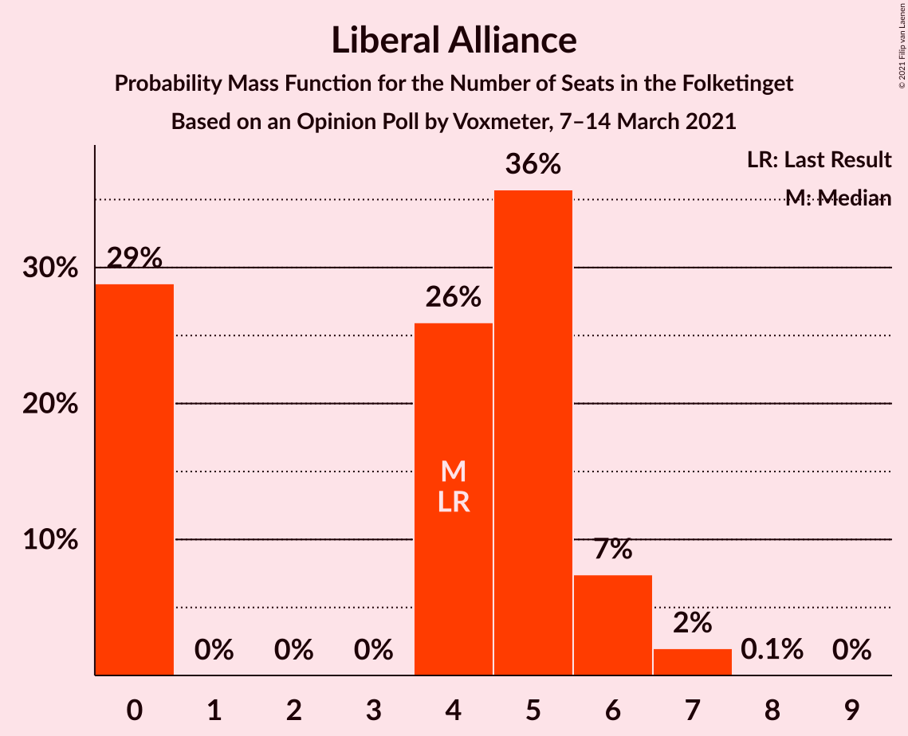

| Number of Seats | Probability | Accumulated | Special Marks |
|:---------------:|:-----------:|:-----------:|:-------------:|
| 0 | 29% | 100% |  |
| 1 | 0% | 71% |  |
| 2 | 0% | 71% |  |
| 3 | 0% | 71% |  |
| 4 | 26% | 71% | Last Result, Median |
| 5 | 36% | 45% |  |
| 6 | 7% | 9% |  |
| 7 | 2% | 2% |  |
| 8 | 0.1% | 0.1% |  |
| 9 | 0% | 0% |  |

### Kristendemokraterne

*For a full overview of the results for this party, see the [Kristendemokraterne](party-kristendemokraterne.html) page.*

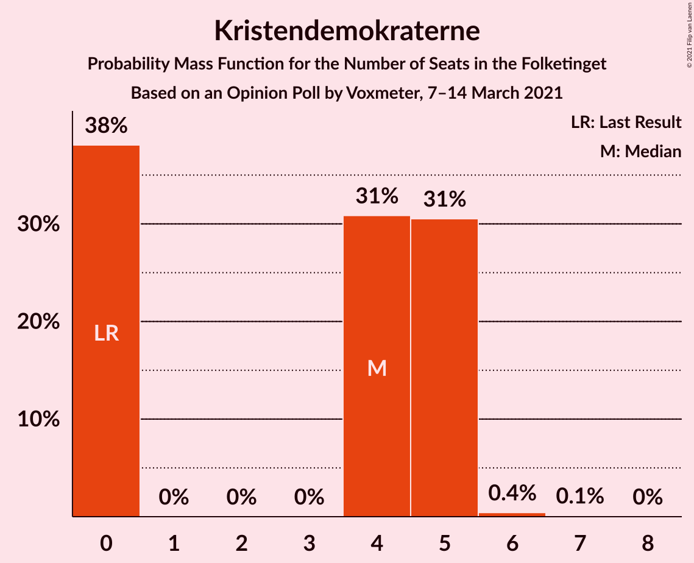

| Number of Seats | Probability | Accumulated | Special Marks |
|:---------------:|:-----------:|:-----------:|:-------------:|
| 0 | 38% | 100% | Last Result |
| 1 | 0% | 62% |  |
| 2 | 0% | 62% |  |
| 3 | 0% | 62% |  |
| 4 | 31% | 62% | Median |
| 5 | 31% | 31% |  |
| 6 | 0.4% | 0.5% |  |
| 7 | 0.1% | 0.1% |  |
| 8 | 0% | 0% |  |

### Alternativet

*For a full overview of the results for this party, see the [Alternativet](party-alternativet.html) page.*

| Number of Seats | Probability | Accumulated | Special Marks |
|:---------------:|:-----------:|:-----------:|:-------------:|
| 0 | 99.8% | 100% | Median |
| 1 | 0% | 0.2% |  |
| 2 | 0% | 0.2% |  |
| 3 | 0% | 0.2% |  |
| 4 | 0.2% | 0.2% |  |
| 5 | 0% | 0% | Last Result |

### Veganerpartiet

*For a full overview of the results for this party, see the [Veganerpartiet](party-veganerpartiet.html) page.*

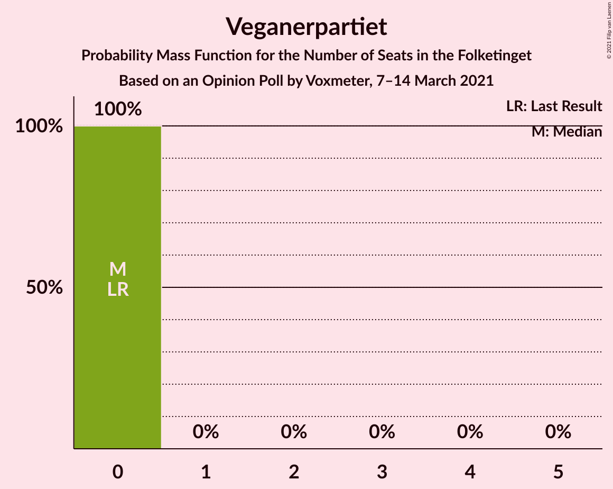

| Number of Seats | Probability | Accumulated | Special Marks |
|:---------------:|:-----------:|:-----------:|:-------------:|
| 0 | 100% | 100% | Last Result, Median |

## Coalitions

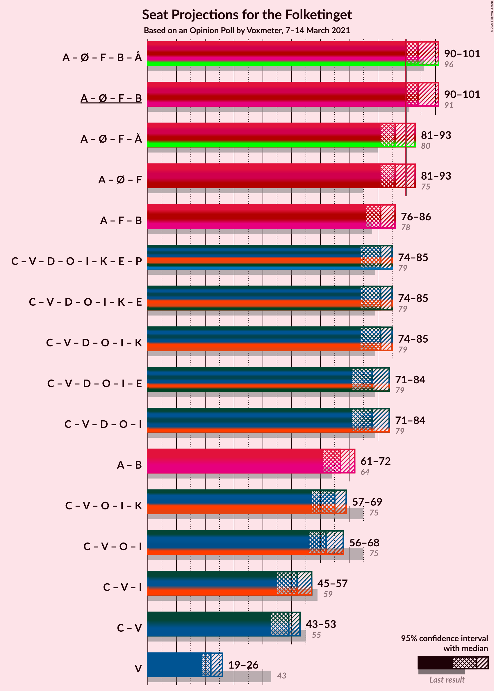

### Confidence Intervals

| Coalition | Last Result | Median | Majority? | 80% Confidence Interval | 90% Confidence Interval | 95% Confidence Interval | 99% Confidence Interval |
|:---------:|:-----------:|:------:|:---------:|:-----------------------:|:-----------------------:|:-----------------------:|:-----------------------:|
| Socialdemokraterne – Enhedslisten–De Rød-Grønne – Socialistisk Folkeparti – Radikale Venstre – Alternativet | 96 | 94 | 99.3% | 91–99 | 91–100 | 90–101 | 89–103 |
| Socialdemokraterne – Enhedslisten–De Rød-Grønne – Socialistisk Folkeparti – Radikale Venstre | 91 | 94 | 99.3% | 91–99 | 91–100 | 90–101 | 89–103 |
| Socialdemokraterne – Enhedslisten–De Rød-Grønne – Socialistisk Folkeparti – Alternativet | 80 | 86 | 19% | 83–91 | 81–93 | 81–93 | 80–95 |
| Socialdemokraterne – Enhedslisten–De Rød-Grønne – Socialistisk Folkeparti | 75 | 86 | 19% | 83–91 | 81–93 | 81–93 | 80–95 |
| Socialdemokraterne – Socialistisk Folkeparti – Radikale Venstre | 78 | 81 | 1.0% | 77–83 | 77–85 | 76–86 | 74–90 |
| Det Konservative Folkeparti – Venstre – Nye Borgerlige – Dansk Folkeparti – Liberal Alliance – Kristendemokraterne | 79 | 81 | 0.1% | 76–84 | 75–84 | 74–85 | 72–86 |
| Det Konservative Folkeparti – Venstre – Nye Borgerlige – Dansk Folkeparti – Liberal Alliance | 79 | 78 | 0% | 73–83 | 71–83 | 71–84 | 70–85 |
| Socialdemokraterne – Radikale Venstre | 64 | 67 | 0% | 64–70 | 63–71 | 61–72 | 60–76 |
| Det Konservative Folkeparti – Venstre – Dansk Folkeparti – Liberal Alliance – Kristendemokraterne | 75 | 65 | 0% | 60–69 | 60–69 | 57–69 | 56–72 |
| Det Konservative Folkeparti – Venstre – Dansk Folkeparti – Liberal Alliance | 75 | 62 | 0% | 58–65 | 56–67 | 56–68 | 54–69 |
| Det Konservative Folkeparti – Venstre – Liberal Alliance | 59 | 52 | 0% | 48–55 | 45–56 | 45–57 | 44–58 |
| Det Konservative Folkeparti – Venstre | 55 | 49 | 0% | 44–51 | 43–52 | 43–53 | 40–54 |
| Venstre | 43 | 22 | 0% | 20–25 | 19–26 | 19–26 | 17–26 |

### Socialdemokraterne – Enhedslisten–De Rød-Grønne – Socialistisk Folkeparti – Radikale Venstre – Alternativet

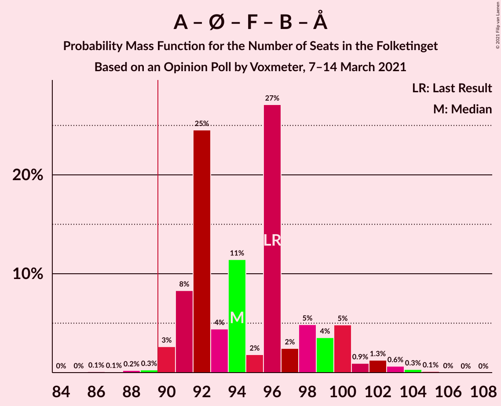

| Number of Seats | Probability | Accumulated | Special Marks |
|:---------------:|:-----------:|:-----------:|:-------------:|
| 85 | 0% | 100% |  |
| 86 | 0.1% | 99.9% |  |
| 87 | 0.1% | 99.8% |  |
| 88 | 0.2% | 99.8% |  |
| 89 | 0.3% | 99.5% |  |
| 90 | 3% | 99.3% | Majority |
| 91 | 8% | 97% |  |
| 92 | 25% | 88% |  |
| 93 | 4% | 64% | Median |
| 94 | 11% | 59% |  |
| 95 | 2% | 48% |  |
| 96 | 27% | 46% | Last Result |
| 97 | 2% | 19% |  |
| 98 | 5% | 17% |  |
| 99 | 4% | 12% |  |
| 100 | 5% | 8% |  |
| 101 | 0.9% | 3% |  |
| 102 | 1.3% | 2% |  |
| 103 | 0.6% | 1.1% |  |
| 104 | 0.3% | 0.5% |  |
| 105 | 0.1% | 0.2% |  |
| 106 | 0% | 0.1% |  |
| 107 | 0% | 0% |  |

### Socialdemokraterne – Enhedslisten–De Rød-Grønne – Socialistisk Folkeparti – Radikale Venstre

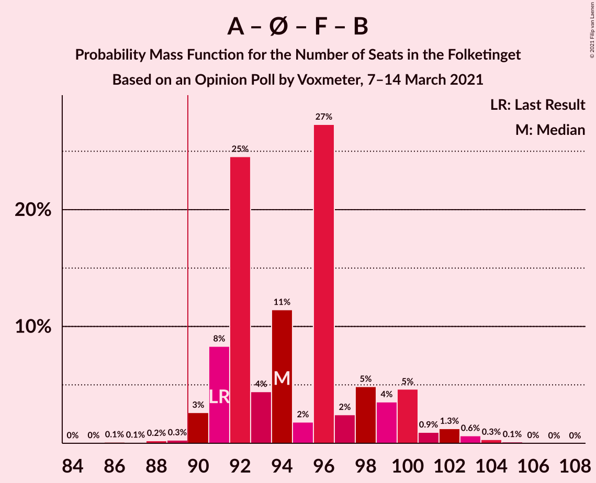

| Number of Seats | Probability | Accumulated | Special Marks |
|:---------------:|:-----------:|:-----------:|:-------------:|
| 85 | 0% | 100% |  |
| 86 | 0.1% | 99.9% |  |
| 87 | 0.1% | 99.8% |  |
| 88 | 0.2% | 99.8% |  |
| 89 | 0.3% | 99.5% |  |
| 90 | 3% | 99.3% | Majority |
| 91 | 8% | 97% | Last Result |
| 92 | 25% | 88% |  |
| 93 | 4% | 64% | Median |
| 94 | 11% | 59% |  |
| 95 | 2% | 48% |  |
| 96 | 27% | 46% |  |
| 97 | 2% | 19% |  |
| 98 | 5% | 16% |  |
| 99 | 4% | 12% |  |
| 100 | 5% | 8% |  |
| 101 | 0.9% | 3% |  |
| 102 | 1.3% | 2% |  |
| 103 | 0.6% | 1.1% |  |
| 104 | 0.3% | 0.5% |  |
| 105 | 0.1% | 0.2% |  |
| 106 | 0% | 0.1% |  |
| 107 | 0% | 0% |  |

### Socialdemokraterne – Enhedslisten–De Rød-Grønne – Socialistisk Folkeparti – Alternativet

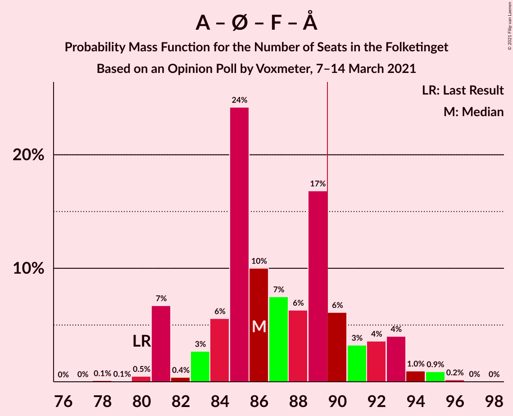

| Number of Seats | Probability | Accumulated | Special Marks |
|:---------------:|:-----------:|:-----------:|:-------------:|
| 78 | 0.1% | 100% |  |
| 79 | 0.1% | 99.8% |  |
| 80 | 0.5% | 99.8% | Last Result |
| 81 | 7% | 99.3% |  |
| 82 | 0.4% | 93% |  |
| 83 | 3% | 92% |  |
| 84 | 6% | 89% |  |
| 85 | 24% | 84% |  |
| 86 | 10% | 60% | Median |
| 87 | 7% | 50% |  |
| 88 | 6% | 42% |  |
| 89 | 17% | 36% |  |
| 90 | 6% | 19% | Majority |
| 91 | 3% | 13% |  |
| 92 | 4% | 10% |  |
| 93 | 4% | 6% |  |
| 94 | 1.0% | 2% |  |
| 95 | 0.9% | 1.2% |  |
| 96 | 0.2% | 0.3% |  |
| 97 | 0% | 0.1% |  |
| 98 | 0% | 0% |  |

### Socialdemokraterne – Enhedslisten–De Rød-Grønne – Socialistisk Folkeparti

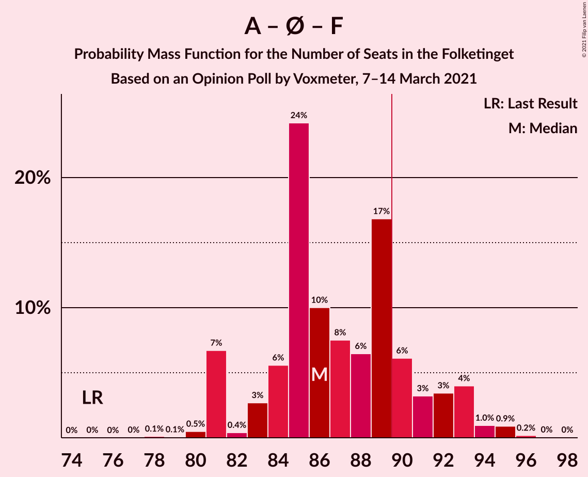

| Number of Seats | Probability | Accumulated | Special Marks |
|:---------------:|:-----------:|:-----------:|:-------------:|
| 75 | 0% | 100% | Last Result |
| 76 | 0% | 100% |  |
| 77 | 0% | 100% |  |
| 78 | 0.1% | 100% |  |
| 79 | 0.1% | 99.8% |  |
| 80 | 0.5% | 99.8% |  |
| 81 | 7% | 99.3% |  |
| 82 | 0.4% | 93% |  |
| 83 | 3% | 92% |  |
| 84 | 6% | 89% |  |
| 85 | 24% | 84% |  |
| 86 | 10% | 60% | Median |
| 87 | 8% | 50% |  |
| 88 | 6% | 42% |  |
| 89 | 17% | 36% |  |
| 90 | 6% | 19% | Majority |
| 91 | 3% | 13% |  |
| 92 | 3% | 10% |  |
| 93 | 4% | 6% |  |
| 94 | 1.0% | 2% |  |
| 95 | 0.9% | 1.2% |  |
| 96 | 0.2% | 0.3% |  |
| 97 | 0% | 0.1% |  |
| 98 | 0% | 0% |  |

### Socialdemokraterne – Socialistisk Folkeparti – Radikale Venstre

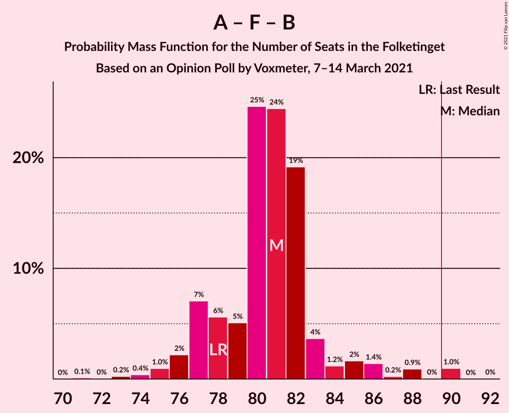

| Number of Seats | Probability | Accumulated | Special Marks |
|:---------------:|:-----------:|:-----------:|:-------------:|
| 71 | 0.1% | 100% |  |
| 72 | 0% | 99.9% |  |
| 73 | 0.2% | 99.8% |  |
| 74 | 0.4% | 99.6% |  |
| 75 | 1.0% | 99.2% |  |
| 76 | 2% | 98% |  |
| 77 | 7% | 96% |  |
| 78 | 6% | 89% | Last Result |
| 79 | 5% | 83% | Median |
| 80 | 25% | 78% |  |
| 81 | 24% | 54% |  |
| 82 | 19% | 29% |  |
| 83 | 4% | 10% |  |
| 84 | 1.2% | 6% |  |
| 85 | 2% | 5% |  |
| 86 | 1.4% | 4% |  |
| 87 | 0.2% | 2% |  |
| 88 | 0.9% | 2% |  |
| 89 | 0% | 1.1% |  |
| 90 | 1.0% | 1.0% | Majority |
| 91 | 0% | 0% |  |

### Det Konservative Folkeparti – Venstre – Nye Borgerlige – Dansk Folkeparti – Liberal Alliance – Kristendemokraterne

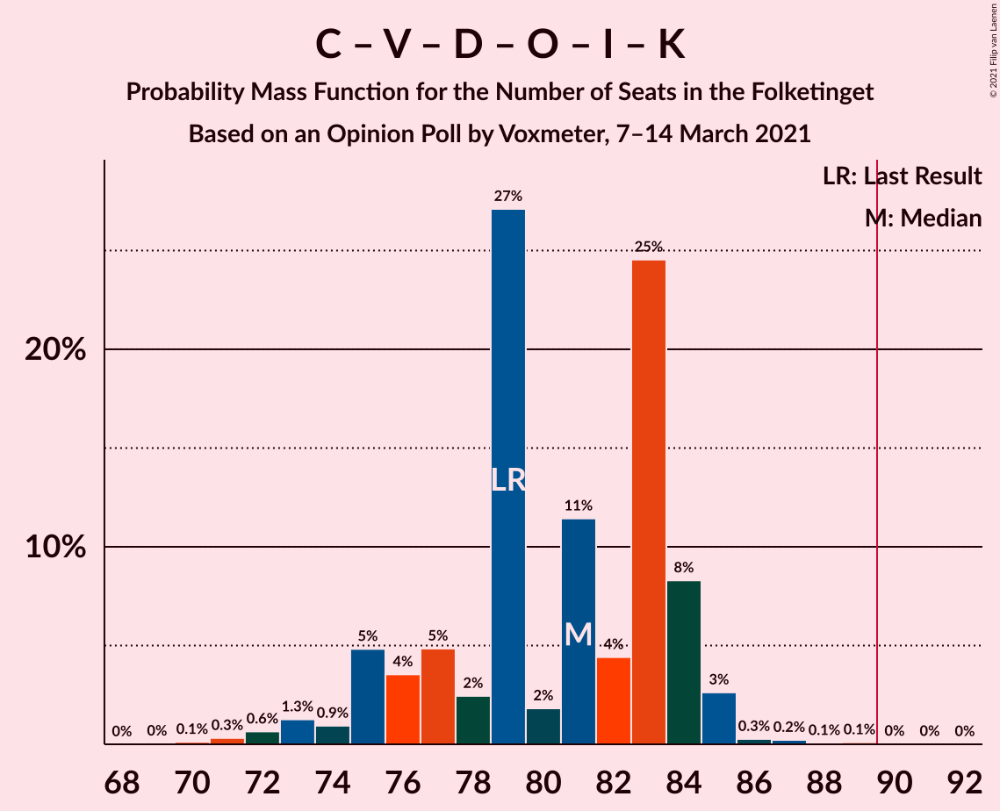

| Number of Seats | Probability | Accumulated | Special Marks |
|:---------------:|:-----------:|:-----------:|:-------------:|
| 69 | 0% | 100% |  |
| 70 | 0.1% | 99.9% |  |
| 71 | 0.3% | 99.8% |  |
| 72 | 0.6% | 99.5% |  |
| 73 | 1.3% | 98.9% |  |
| 74 | 0.9% | 98% |  |
| 75 | 5% | 97% |  |
| 76 | 4% | 92% |  |
| 77 | 5% | 88% |  |
| 78 | 2% | 83% |  |
| 79 | 27% | 81% | Last Result |
| 80 | 2% | 54% |  |
| 81 | 11% | 52% | Median |
| 82 | 4% | 41% |  |
| 83 | 25% | 36% |  |
| 84 | 8% | 12% |  |
| 85 | 3% | 3% |  |
| 86 | 0.3% | 0.7% |  |
| 87 | 0.2% | 0.5% |  |
| 88 | 0.1% | 0.2% |  |
| 89 | 0.1% | 0.2% |  |
| 90 | 0% | 0.1% | Majority |
| 91 | 0% | 0% |  |

### Det Konservative Folkeparti – Venstre – Nye Borgerlige – Dansk Folkeparti – Liberal Alliance

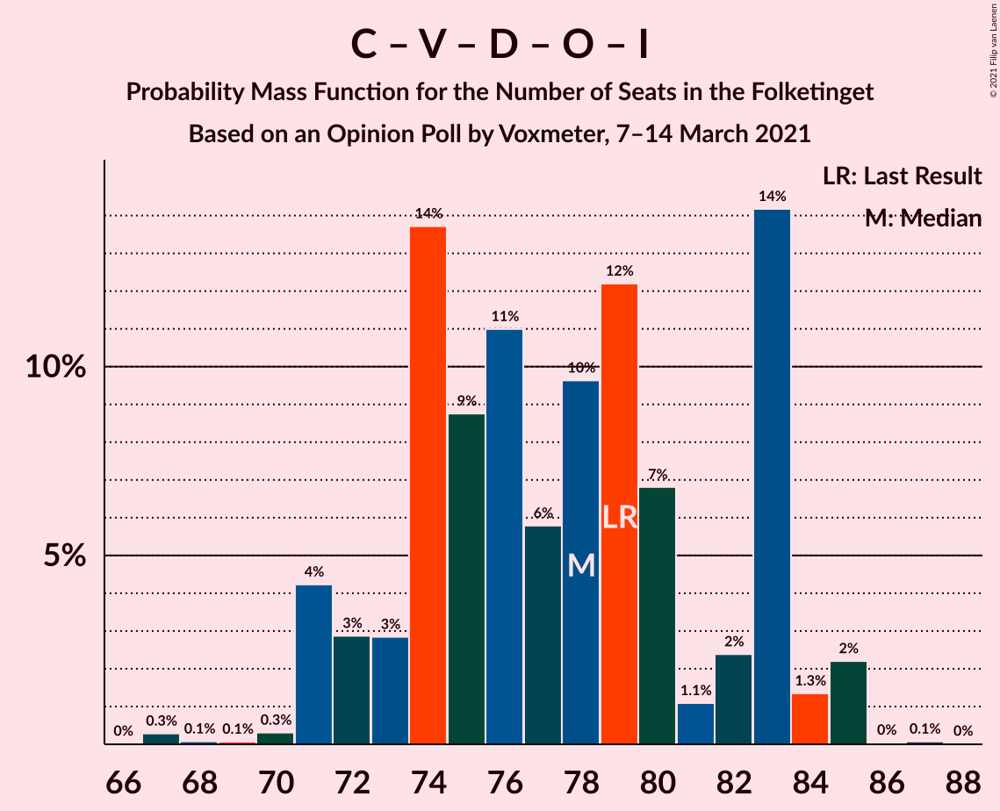

| Number of Seats | Probability | Accumulated | Special Marks |
|:---------------:|:-----------:|:-----------:|:-------------:|
| 67 | 0.3% | 100% |  |
| 68 | 0.1% | 99.7% |  |
| 69 | 0.1% | 99.6% |  |
| 70 | 0.3% | 99.5% |  |
| 71 | 4% | 99.2% |  |
| 72 | 3% | 95% |  |
| 73 | 3% | 92% |  |
| 74 | 14% | 89% |  |
| 75 | 9% | 76% |  |
| 76 | 11% | 67% |  |
| 77 | 6% | 56% | Median |
| 78 | 10% | 50% |  |
| 79 | 12% | 40% | Last Result |
| 80 | 7% | 28% |  |
| 81 | 1.1% | 21% |  |
| 82 | 2% | 20% |  |
| 83 | 14% | 18% |  |
| 84 | 1.3% | 4% |  |
| 85 | 2% | 2% |  |
| 86 | 0% | 0.1% |  |
| 87 | 0.1% | 0.1% |  |
| 88 | 0% | 0% |  |

### Socialdemokraterne – Radikale Venstre

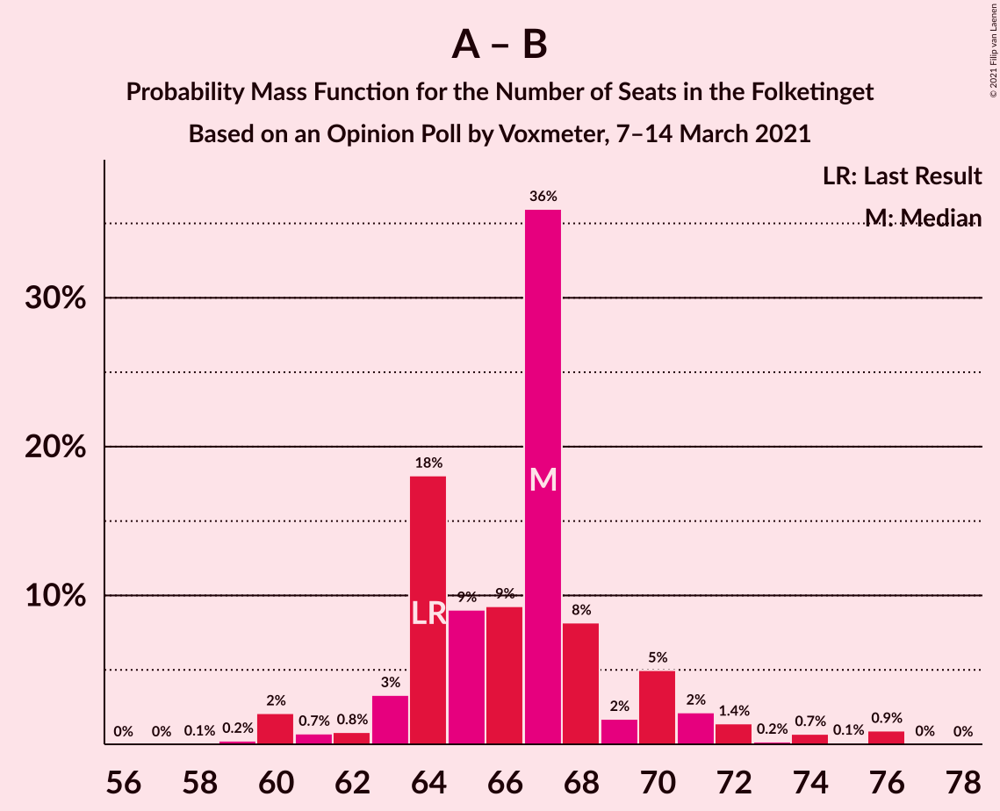

| Number of Seats | Probability | Accumulated | Special Marks |
|:---------------:|:-----------:|:-----------:|:-------------:|
| 58 | 0.1% | 100% |  |
| 59 | 0.2% | 99.9% |  |
| 60 | 2% | 99.7% |  |
| 61 | 0.7% | 98% |  |
| 62 | 0.8% | 97% |  |
| 63 | 3% | 96% |  |
| 64 | 18% | 93% | Last Result |
| 65 | 9% | 75% | Median |
| 66 | 9% | 66% |  |
| 67 | 36% | 56% |  |
| 68 | 8% | 20% |  |
| 69 | 2% | 12% |  |
| 70 | 5% | 10% |  |
| 71 | 2% | 6% |  |
| 72 | 1.4% | 3% |  |
| 73 | 0.2% | 2% |  |
| 74 | 0.7% | 2% |  |
| 75 | 0.1% | 1.1% |  |
| 76 | 0.9% | 1.0% |  |
| 77 | 0% | 0.1% |  |
| 78 | 0% | 0% |  |

### Det Konservative Folkeparti – Venstre – Dansk Folkeparti – Liberal Alliance – Kristendemokraterne

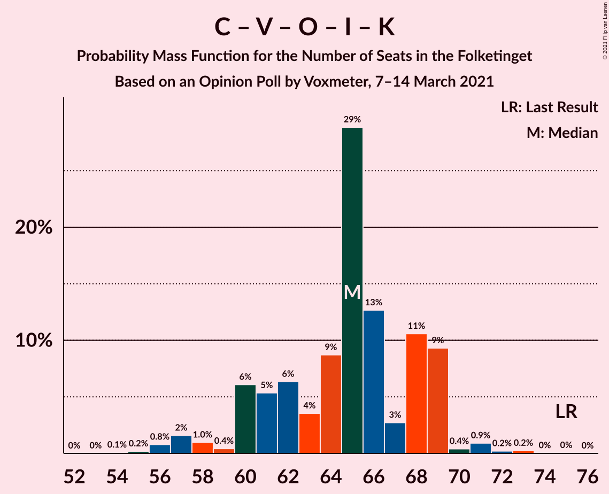

| Number of Seats | Probability | Accumulated | Special Marks |
|:---------------:|:-----------:|:-----------:|:-------------:|
| 54 | 0.1% | 100% |  |
| 55 | 0.2% | 99.9% |  |
| 56 | 0.8% | 99.7% |  |
| 57 | 2% | 98.9% |  |
| 58 | 1.0% | 97% |  |
| 59 | 0.4% | 96% |  |
| 60 | 6% | 96% |  |
| 61 | 5% | 90% |  |
| 62 | 6% | 85% |  |
| 63 | 4% | 78% |  |
| 64 | 9% | 75% |  |
| 65 | 29% | 66% |  |
| 66 | 13% | 37% | Median |
| 67 | 3% | 24% |  |
| 68 | 11% | 22% |  |
| 69 | 9% | 11% |  |
| 70 | 0.4% | 2% |  |
| 71 | 0.9% | 1.4% |  |
| 72 | 0.2% | 0.5% |  |
| 73 | 0.2% | 0.3% |  |
| 74 | 0% | 0.1% |  |
| 75 | 0% | 0% | Last Result |

### Det Konservative Folkeparti – Venstre – Dansk Folkeparti – Liberal Alliance

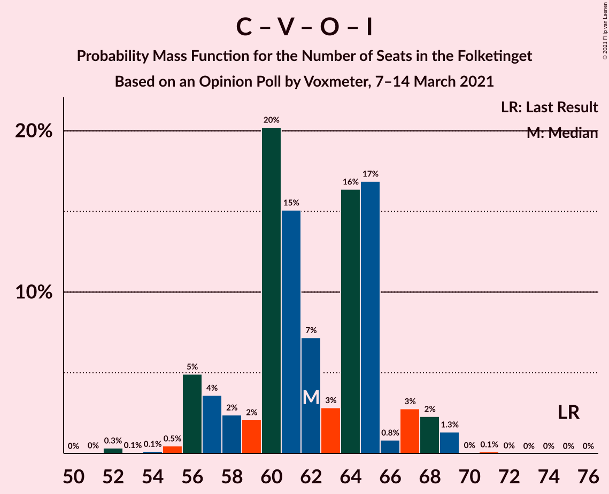

| Number of Seats | Probability | Accumulated | Special Marks |
|:---------------:|:-----------:|:-----------:|:-------------:|
| 52 | 0.3% | 100% |  |
| 53 | 0.1% | 99.6% |  |
| 54 | 0.1% | 99.6% |  |
| 55 | 0.5% | 99.4% |  |
| 56 | 5% | 99.0% |  |
| 57 | 4% | 94% |  |
| 58 | 2% | 90% |  |
| 59 | 2% | 88% |  |
| 60 | 20% | 86% |  |
| 61 | 15% | 66% |  |
| 62 | 7% | 51% | Median |
| 63 | 3% | 43% |  |
| 64 | 16% | 41% |  |
| 65 | 17% | 24% |  |
| 66 | 0.8% | 7% |  |
| 67 | 3% | 7% |  |
| 68 | 2% | 4% |  |
| 69 | 1.3% | 2% |  |
| 70 | 0% | 0.2% |  |
| 71 | 0.1% | 0.1% |  |
| 72 | 0% | 0% |  |
| 73 | 0% | 0% |  |
| 74 | 0% | 0% |  |
| 75 | 0% | 0% | Last Result |

### Det Konservative Folkeparti – Venstre – Liberal Alliance

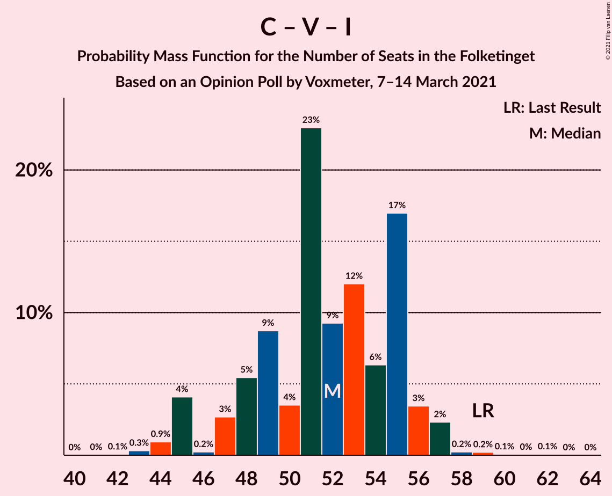

| Number of Seats | Probability | Accumulated | Special Marks |
|:---------------:|:-----------:|:-----------:|:-------------:|
| 42 | 0.1% | 100% |  |
| 43 | 0.3% | 99.9% |  |
| 44 | 0.9% | 99.6% |  |
| 45 | 4% | 98.7% |  |
| 46 | 0.2% | 95% |  |
| 47 | 3% | 94% |  |
| 48 | 5% | 92% |  |
| 49 | 9% | 86% |  |
| 50 | 4% | 77% |  |
| 51 | 23% | 74% |  |
| 52 | 9% | 51% | Median |
| 53 | 12% | 42% |  |
| 54 | 6% | 30% |  |
| 55 | 17% | 23% |  |
| 56 | 3% | 6% |  |
| 57 | 2% | 3% |  |
| 58 | 0.2% | 0.6% |  |
| 59 | 0.2% | 0.4% | Last Result |
| 60 | 0.1% | 0.2% |  |
| 61 | 0% | 0.1% |  |
| 62 | 0.1% | 0.1% |  |
| 63 | 0% | 0% |  |

### Det Konservative Folkeparti – Venstre

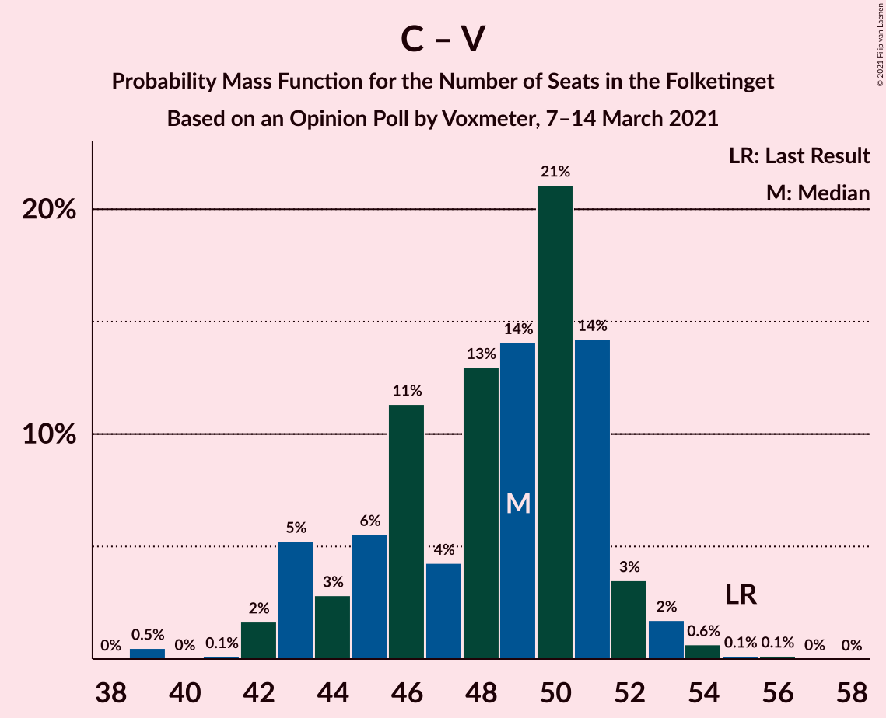

| Number of Seats | Probability | Accumulated | Special Marks |
|:---------------:|:-----------:|:-----------:|:-------------:|
| 39 | 0.5% | 100% |  |
| 40 | 0% | 99.5% |  |
| 41 | 0.1% | 99.5% |  |
| 42 | 2% | 99.4% |  |
| 43 | 5% | 98% |  |
| 44 | 3% | 92% |  |
| 45 | 6% | 90% |  |
| 46 | 11% | 84% |  |
| 47 | 4% | 73% |  |
| 48 | 13% | 69% | Median |
| 49 | 14% | 56% |  |
| 50 | 21% | 41% |  |
| 51 | 14% | 20% |  |
| 52 | 3% | 6% |  |
| 53 | 2% | 3% |  |
| 54 | 0.6% | 0.9% |  |
| 55 | 0.1% | 0.3% | Last Result |
| 56 | 0.1% | 0.2% |  |
| 57 | 0% | 0% |  |

### Venstre

| Number of Seats | Probability | Accumulated | Special Marks |
|:---------------:|:-----------:|:-----------:|:-------------:|
| 16 | 0% | 100% |  |
| 17 | 2% | 99.9% |  |
| 18 | 0.8% | 98% |  |
| 19 | 7% | 98% |  |
| 20 | 20% | 91% |  |
| 21 | 7% | 71% |  |
| 22 | 17% | 64% | Median |
| 23 | 16% | 48% |  |
| 24 | 20% | 32% |  |
| 25 | 4% | 12% |  |
| 26 | 7% | 7% |  |
| 27 | 0.3% | 0.4% |  |
| 28 | 0.1% | 0.1% |  |
| 29 | 0% | 0% |  |
| 30 | 0% | 0% |  |
| 31 | 0% | 0% |  |
| 32 | 0% | 0% |  |
| 33 | 0% | 0% |  |
| 34 | 0% | 0% |  |
| 35 | 0% | 0% |  |
| 36 | 0% | 0% |  |
| 37 | 0% | 0% |  |
| 38 | 0% | 0% |  |
| 39 | 0% | 0% |  |
| 40 | 0% | 0% |  |
| 41 | 0% | 0% |  |
| 42 | 0% | 0% |  |
| 43 | 0% | 0% | Last Result |

## Technical Information

### Opinion Poll

+ **Polling firm:** Voxmeter
+ **Commissioner(s):** —
+ **Fieldwork period:** 7–14 March 2021

### Calculations

+ **Sample size:** 1032
+ **Simulations done:** 1,048,576
+ **Error estimate:** 2.29%

