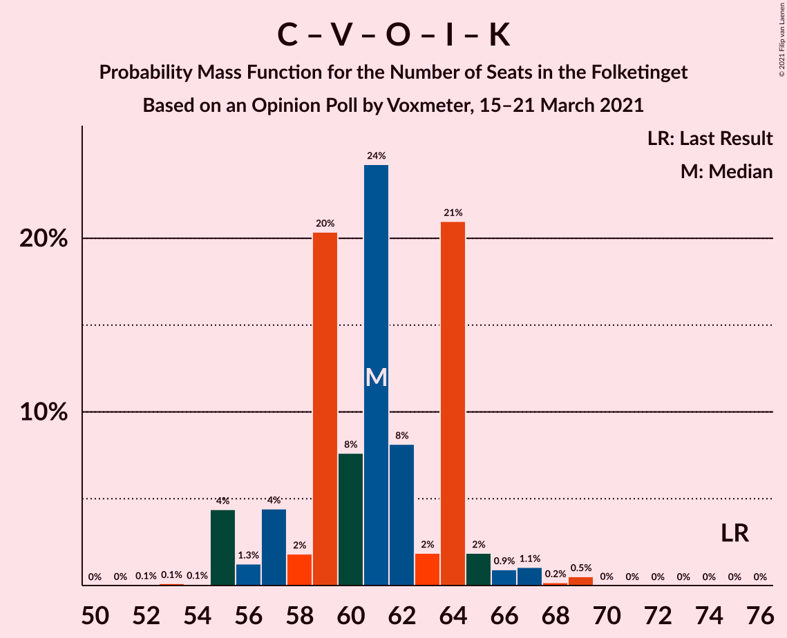

# Opinion Poll by Voxmeter, 15–21 March 2021

<a href="#voting-intentions">Voting Intentions</a> | <a href="#seats">Seats</a> | <a href="#coalitions">Coalitions</a> | <a href="#technical-information">Technical Information</a>

## Voting Intentions

### Confidence Intervals

| Party | Last Result | Poll Result | 80% Confidence Interval | 90% Confidence Interval | 95% Confidence Interval | 99% Confidence Interval |
|:-----:|:-----------:|:-----------:|:-----------------------:|:-----------------------:|:-----------------------:|:-----------------------:|
| Socialdemokraterne | 25.9% | 34.1% | 32.3–36.1% |31.8–36.6% |31.3–37.1% |30.4–38.0% |
| Det Konservative Folkeparti | 6.6% | 13.8% | 12.5–15.3% |12.2–15.7% |11.9–16.1% |11.3–16.8% |
| Venstre | 23.4% | 11.9% | 10.7–13.3% |10.3–13.7% |10.1–14.0% |9.5–14.7% |
| Socialistisk Folkeparti | 7.7% | 8.1% | 7.1–9.3% |6.8–9.7% |6.6–10.0% |6.2–10.6% |
| Nye Borgerlige | 2.4% | 8.0% | 7.0–9.2% |6.8–9.6% |6.5–9.8% |6.1–10.5% |
| Enhedslisten–De Rød-Grønne | 6.9% | 7.6% | 6.7–8.8% |6.4–9.1% |6.2–9.4% |5.7–10.0% |
| Dansk Folkeparti | 8.7% | 5.8% | 5.0–6.8% |4.7–7.1% |4.5–7.4% |4.2–7.9% |
| Radikale Venstre | 8.6% | 5.3% | 4.5–6.3% |4.3–6.6% |4.1–6.9% |3.7–7.4% |
| Liberal Alliance | 2.3% | 2.2% | 1.7–2.9% |1.6–3.1% |1.5–3.3% |1.3–3.7% |
| Kristendemokraterne | 1.7% | 1.4% | 1.0–2.0% |0.9–2.1% |0.8–2.3% |0.7–2.6% |
| Alternativet | 3.0% | 0.7% | 0.4–1.1% |0.4–1.3% |0.3–1.4% |0.2–1.7% |
| Veganerpartiet | 0.0% | 0.5% | 0.3–0.9% |0.2–1.0% |0.2–1.1% |0.1–1.4% |

*Note:* The poll result column reflects the actual value used in the calculations. Published results may vary slightly, and in addition be rounded to fewer digits.

## Seats

### Confidence Intervals

| Party | Last Result | Median | 80% Confidence Interval | 90% Confidence Interval | 95% Confidence Interval | 99% Confidence Interval |
|:-----:|:-----------:|:------:|:-----------------------:|:-----------------------:|:-----------------------:|:-----------------------:|
| <a href="#socialdemokraterne">Socialdemokraterne</a> | 48 | 61 | 57–66 |57–66 |56–66 |54–67 |
| <a href="#det-konservative-folkeparti">Det Konservative Folkeparti</a> | 12 | 25 | 22–26 |22–27 |20–28 |19–29 |
| <a href="#venstre">Venstre</a> | 43 | 22 | 19–24 |19–25 |18–26 |17–26 |
| <a href="#socialistisk-folkeparti">Socialistisk Folkeparti</a> | 14 | 14 | 13–17 |12–17 |12–18 |10–19 |
| <a href="#nye-borgerlige">Nye Borgerlige</a> | 4 | 16 | 13–17 |13–17 |12–17 |11–18 |
| <a href="#enhedslisten–de-rød-grønne">Enhedslisten–De Rød-Grønne</a> | 13 | 14 | 11–16 |11–17 |11–17 |10–17 |
| <a href="#dansk-folkeparti">Dansk Folkeparti</a> | 16 | 11 | 9–14 |9–14 |9–14 |8–14 |
| <a href="#radikale-venstre">Radikale Venstre</a> | 16 | 9 | 8–11 |8–11 |8–12 |7–13 |
| <a href="#liberal-alliance">Liberal Alliance</a> | 4 | 4 | 0–5 |0–5 |0–5 |0–6 |
| <a href="#kristendemokraterne">Kristendemokraterne</a> | 0 | 0 | 0 |0–4 |0–4 |0–5 |
| <a href="#alternativet">Alternativet</a> | 5 | 0 | 0 |0 |0 |0 |
| <a href="#veganerpartiet">Veganerpartiet</a> | 0 | 0 | 0 |0 |0 |0 |

### Socialdemokraterne

*For a full overview of the results for this party, see the [Socialdemokraterne](party-socialdemokraterne.html) page.*

| Number of Seats | Probability | Accumulated | Special Marks |
|:---------------:|:-----------:|:-----------:|:-------------:|
| 48 | 0% | 100% | Last Result |
| 49 | 0% | 100% |  |
| 50 | 0% | 100% |  |
| 51 | 0% | 100% |  |
| 52 | 0% | 100% |  |
| 53 | 0% | 100% |  |
| 54 | 1.3% | 99.9% |  |
| 55 | 0.2% | 98.7% |  |
| 56 | 1.4% | 98% |  |
| 57 | 16% | 97% |  |
| 58 | 1.3% | 81% |  |
| 59 | 9% | 79% |  |
| 60 | 18% | 70% |  |
| 61 | 7% | 52% | Median |
| 62 | 8% | 44% |  |
| 63 | 11% | 36% |  |
| 64 | 3% | 25% |  |
| 65 | 3% | 22% |  |
| 66 | 18% | 19% |  |
| 67 | 0.2% | 0.5% |  |
| 68 | 0.2% | 0.4% |  |
| 69 | 0.1% | 0.2% |  |
| 70 | 0.1% | 0.1% |  |
| 71 | 0% | 0% |  |

### Det Konservative Folkeparti

*For a full overview of the results for this party, see the [Det Konservative Folkeparti](party-detkonservativefolkeparti.html) page.*

| Number of Seats | Probability | Accumulated | Special Marks |
|:---------------:|:-----------:|:-----------:|:-------------:|
| 12 | 0% | 100% | Last Result |
| 13 | 0% | 100% |  |
| 14 | 0% | 100% |  |
| 15 | 0% | 100% |  |
| 16 | 0% | 100% |  |
| 17 | 0% | 100% |  |
| 18 | 0% | 100% |  |
| 19 | 1.4% | 100% |  |
| 20 | 2% | 98.6% |  |
| 21 | 0.6% | 97% |  |
| 22 | 11% | 96% |  |
| 23 | 2% | 86% |  |
| 24 | 18% | 83% |  |
| 25 | 17% | 65% | Median |
| 26 | 39% | 48% |  |
| 27 | 6% | 8% |  |
| 28 | 0.6% | 3% |  |
| 29 | 2% | 2% |  |
| 30 | 0.3% | 0.5% |  |
| 31 | 0.2% | 0.2% |  |
| 32 | 0% | 0% |  |

### Venstre

*For a full overview of the results for this party, see the [Venstre](party-venstre.html) page.*

| Number of Seats | Probability | Accumulated | Special Marks |
|:---------------:|:-----------:|:-----------:|:-------------:|
| 15 | 0.1% | 100% |  |
| 16 | 0.1% | 99.9% |  |
| 17 | 1.4% | 99.8% |  |
| 18 | 3% | 98% |  |
| 19 | 25% | 96% |  |
| 20 | 6% | 70% |  |
| 21 | 7% | 64% |  |
| 22 | 39% | 57% | Median |
| 23 | 3% | 18% |  |
| 24 | 10% | 15% |  |
| 25 | 2% | 5% |  |
| 26 | 3% | 3% |  |
| 27 | 0.3% | 0.4% |  |
| 28 | 0.1% | 0.1% |  |
| 29 | 0% | 0% |  |
| 30 | 0% | 0% |  |
| 31 | 0% | 0% |  |
| 32 | 0% | 0% |  |
| 33 | 0% | 0% |  |
| 34 | 0% | 0% |  |
| 35 | 0% | 0% |  |
| 36 | 0% | 0% |  |
| 37 | 0% | 0% |  |
| 38 | 0% | 0% |  |
| 39 | 0% | 0% |  |
| 40 | 0% | 0% |  |
| 41 | 0% | 0% |  |
| 42 | 0% | 0% |  |
| 43 | 0% | 0% | Last Result |

### Socialistisk Folkeparti

*For a full overview of the results for this party, see the [Socialistisk Folkeparti](party-socialistiskfolkeparti.html) page.*

| Number of Seats | Probability | Accumulated | Special Marks |
|:---------------:|:-----------:|:-----------:|:-------------:|
| 10 | 0.6% | 100% |  |
| 11 | 0.6% | 99.4% |  |
| 12 | 7% | 98.9% |  |
| 13 | 8% | 92% |  |
| 14 | 41% | 84% | Last Result, Median |
| 15 | 5% | 43% |  |
| 16 | 25% | 38% |  |
| 17 | 9% | 13% |  |
| 18 | 4% | 4% |  |
| 19 | 0.5% | 0.8% |  |
| 20 | 0.3% | 0.3% |  |
| 21 | 0% | 0% |  |

### Nye Borgerlige

*For a full overview of the results for this party, see the [Nye Borgerlige](party-nyeborgerlige.html) page.*

| Number of Seats | Probability | Accumulated | Special Marks |
|:---------------:|:-----------:|:-----------:|:-------------:|
| 4 | 0% | 100% | Last Result |
| 5 | 0% | 100% |  |
| 6 | 0% | 100% |  |
| 7 | 0% | 100% |  |
| 8 | 0% | 100% |  |
| 9 | 0% | 100% |  |
| 10 | 0.1% | 100% |  |
| 11 | 2% | 99.9% |  |
| 12 | 1.5% | 98% |  |
| 13 | 13% | 97% |  |
| 14 | 15% | 83% |  |
| 15 | 11% | 68% |  |
| 16 | 39% | 57% | Median |
| 17 | 17% | 18% |  |
| 18 | 0.6% | 0.8% |  |
| 19 | 0.1% | 0.1% |  |
| 20 | 0% | 0.1% |  |
| 21 | 0% | 0% |  |

### Enhedslisten–De Rød-Grønne

*For a full overview of the results for this party, see the [Enhedslisten–De Rød-Grønne](party-enhedslisten–derød-grønne.html) page.*

| Number of Seats | Probability | Accumulated | Special Marks |
|:---------------:|:-----------:|:-----------:|:-------------:|
| 9 | 0.3% | 100% |  |
| 10 | 1.0% | 99.7% |  |
| 11 | 16% | 98.7% |  |
| 12 | 7% | 82% |  |
| 13 | 23% | 75% | Last Result |
| 14 | 35% | 52% | Median |
| 15 | 3% | 17% |  |
| 16 | 7% | 14% |  |
| 17 | 7% | 7% |  |
| 18 | 0.1% | 0.2% |  |
| 19 | 0% | 0.1% |  |
| 20 | 0% | 0% |  |

### Dansk Folkeparti

*For a full overview of the results for this party, see the [Dansk Folkeparti](party-danskfolkeparti.html) page.*

| Number of Seats | Probability | Accumulated | Special Marks |
|:---------------:|:-----------:|:-----------:|:-------------:|
| 7 | 0.2% | 100% |  |
| 8 | 1.5% | 99.8% |  |
| 9 | 15% | 98% |  |
| 10 | 27% | 84% |  |
| 11 | 7% | 57% | Median |
| 12 | 8% | 49% |  |
| 13 | 26% | 42% |  |
| 14 | 15% | 15% |  |
| 15 | 0.1% | 0.2% |  |
| 16 | 0% | 0.1% | Last Result |
| 17 | 0% | 0% |  |

### Radikale Venstre

*For a full overview of the results for this party, see the [Radikale Venstre](party-radikalevenstre.html) page.*

| Number of Seats | Probability | Accumulated | Special Marks |
|:---------------:|:-----------:|:-----------:|:-------------:|
| 6 | 0.1% | 100% |  |
| 7 | 2% | 99.9% |  |
| 8 | 8% | 98% |  |
| 9 | 54% | 90% | Median |
| 10 | 22% | 36% |  |
| 11 | 11% | 14% |  |
| 12 | 2% | 3% |  |
| 13 | 0.5% | 0.9% |  |
| 14 | 0.2% | 0.4% |  |
| 15 | 0.2% | 0.2% |  |
| 16 | 0% | 0% | Last Result |

### Liberal Alliance

*For a full overview of the results for this party, see the [Liberal Alliance](party-liberalalliance.html) page.*

| Number of Seats | Probability | Accumulated | Special Marks |
|:---------------:|:-----------:|:-----------:|:-------------:|
| 0 | 28% | 100% |  |
| 1 | 0% | 72% |  |
| 2 | 0% | 72% |  |
| 3 | 4% | 72% |  |
| 4 | 53% | 68% | Last Result, Median |
| 5 | 12% | 15% |  |
| 6 | 2% | 2% |  |
| 7 | 0.2% | 0.2% |  |
| 8 | 0% | 0% |  |

### Kristendemokraterne

*For a full overview of the results for this party, see the [Kristendemokraterne](party-kristendemokraterne.html) page.*

| Number of Seats | Probability | Accumulated | Special Marks |
|:---------------:|:-----------:|:-----------:|:-------------:|
| 0 | 92% | 100% | Last Result, Median |
| 1 | 0% | 8% |  |
| 2 | 0% | 8% |  |
| 3 | 0% | 8% |  |
| 4 | 7% | 8% |  |
| 5 | 1.1% | 1.1% |  |
| 6 | 0% | 0% |  |

### Alternativet

*For a full overview of the results for this party, see the [Alternativet](party-alternativet.html) page.*

| Number of Seats | Probability | Accumulated | Special Marks |
|:---------------:|:-----------:|:-----------:|:-------------:|
| 0 | 100% | 100% | Median |
| 1 | 0% | 0% |  |
| 2 | 0% | 0% |  |
| 3 | 0% | 0% |  |
| 4 | 0% | 0% |  |
| 5 | 0% | 0% | Last Result |

### Veganerpartiet

*For a full overview of the results for this party, see the [Veganerpartiet](party-veganerpartiet.html) page.*

| Number of Seats | Probability | Accumulated | Special Marks |
|:---------------:|:-----------:|:-----------:|:-------------:|
| 0 | 100% | 100% | Last Result, Median |

## Coalitions

### Confidence Intervals

| Coalition | Last Result | Median | Majority? | 80% Confidence Interval | 90% Confidence Interval | 95% Confidence Interval | 99% Confidence Interval |
|:---------:|:-----------:|:------:|:---------:|:-----------------------:|:-----------------------:|:-----------------------:|:-----------------------:|
| Socialdemokraterne – Socialistisk Folkeparti – Enhedslisten–De Rød-Grønne – Radikale Venstre – Alternativet | 96 | 99 | 100% | 95–104 | 95–104 | 95–105 | 92–107 |
| Socialdemokraterne – Socialistisk Folkeparti – Enhedslisten–De Rød-Grønne – Radikale Venstre | 91 | 99 | 100% | 95–104 | 95–104 | 95–105 | 92–107 |
| Socialdemokraterne – Socialistisk Folkeparti – Enhedslisten–De Rød-Grønne – Alternativet | 80 | 89 | 49% | 86–93 | 86–95 | 85–96 | 83–97 |
| Socialdemokraterne – Socialistisk Folkeparti – Enhedslisten–De Rød-Grønne | 75 | 89 | 49% | 86–93 | 86–95 | 85–96 | 83–97 |
| Socialdemokraterne – Socialistisk Folkeparti – Radikale Venstre | 78 | 85 | 5% | 82–89 | 82–89 | 81–91 | 79–94 |
| Det Konservative Folkeparti – Venstre – Nye Borgerlige – Dansk Folkeparti – Liberal Alliance – Kristendemokraterne | 79 | 76 | 0% | 71–80 | 71–80 | 70–80 | 68–83 |
| Det Konservative Folkeparti – Venstre – Nye Borgerlige – Dansk Folkeparti – Liberal Alliance | 79 | 75 | 0% | 71–80 | 71–80 | 70–80 | 68–83 |
| Socialdemokraterne – Radikale Venstre | 64 | 70 | 0% | 66–75 | 66–75 | 65–76 | 64–77 |
| Det Konservative Folkeparti – Venstre – Dansk Folkeparti – Liberal Alliance – Kristendemokraterne | 75 | 61 | 0% | 57–64 | 56–64 | 55–66 | 55–69 |
| Det Konservative Folkeparti – Venstre – Dansk Folkeparti – Liberal Alliance | 75 | 61 | 0% | 57–64 | 55–64 | 55–65 | 55–69 |
| Det Konservative Folkeparti – Venstre – Liberal Alliance | 59 | 49 | 0% | 47–53 | 46–53 | 45–54 | 42–56 |
| Det Konservative Folkeparti – Venstre | 55 | 46 | 0% | 43–49 | 43–51 | 42–51 | 38–53 |
| Venstre | 43 | 22 | 0% | 19–24 | 19–25 | 18–26 | 17–26 |

### Socialdemokraterne – Socialistisk Folkeparti – Enhedslisten–De Rød-Grønne – Radikale Venstre – Alternativet

| Number of Seats | Probability | Accumulated | Special Marks |
|:---------------:|:-----------:|:-----------:|:-------------:|
| 90 | 0.1% | 100% | Majority |
| 91 | 0% | 99.9% |  |
| 92 | 0.5% | 99.9% |  |
| 93 | 1.1% | 99.4% |  |
| 94 | 0.3% | 98% |  |
| 95 | 15% | 98% |  |
| 96 | 3% | 83% | Last Result |
| 97 | 19% | 79% |  |
| 98 | 10% | 61% | Median |
| 99 | 5% | 50% |  |
| 100 | 18% | 45% |  |
| 101 | 12% | 27% |  |
| 102 | 2% | 16% |  |
| 103 | 2% | 13% |  |
| 104 | 8% | 11% |  |
| 105 | 2% | 3% |  |
| 106 | 0.6% | 1.1% |  |
| 107 | 0.4% | 0.6% |  |
| 108 | 0.1% | 0.2% |  |
| 109 | 0% | 0.1% |  |
| 110 | 0% | 0% |  |

### Socialdemokraterne – Socialistisk Folkeparti – Enhedslisten–De Rød-Grønne – Radikale Venstre

| Number of Seats | Probability | Accumulated | Special Marks |
|:---------------:|:-----------:|:-----------:|:-------------:|
| 90 | 0.1% | 100% | Majority |
| 91 | 0% | 99.9% | Last Result |
| 92 | 0.5% | 99.9% |  |
| 93 | 1.1% | 99.4% |  |
| 94 | 0.3% | 98% |  |
| 95 | 15% | 98% |  |
| 96 | 3% | 83% |  |
| 97 | 19% | 79% |  |
| 98 | 10% | 61% | Median |
| 99 | 5% | 50% |  |
| 100 | 18% | 45% |  |
| 101 | 12% | 27% |  |
| 102 | 2% | 16% |  |
| 103 | 2% | 13% |  |
| 104 | 8% | 11% |  |
| 105 | 2% | 3% |  |
| 106 | 0.6% | 1.1% |  |
| 107 | 0.4% | 0.6% |  |
| 108 | 0.1% | 0.2% |  |
| 109 | 0% | 0.1% |  |
| 110 | 0% | 0% |  |

### Socialdemokraterne – Socialistisk Folkeparti – Enhedslisten–De Rød-Grønne – Alternativet

| Number of Seats | Probability | Accumulated | Special Marks |
|:---------------:|:-----------:|:-----------:|:-------------:|
| 80 | 0% | 100% | Last Result |
| 81 | 0.1% | 100% |  |
| 82 | 0.1% | 99.8% |  |
| 83 | 0.4% | 99.7% |  |
| 84 | 1.0% | 99.4% |  |
| 85 | 2% | 98% |  |
| 86 | 16% | 97% |  |
| 87 | 2% | 80% |  |
| 88 | 26% | 78% |  |
| 89 | 3% | 52% | Median |
| 90 | 8% | 49% | Majority |
| 91 | 26% | 41% |  |
| 92 | 0.8% | 15% |  |
| 93 | 6% | 14% |  |
| 94 | 2% | 8% |  |
| 95 | 2% | 6% |  |
| 96 | 3% | 3% |  |
| 97 | 0.2% | 0.5% |  |
| 98 | 0.3% | 0.4% |  |
| 99 | 0% | 0.1% |  |
| 100 | 0% | 0% |  |

### Socialdemokraterne – Socialistisk Folkeparti – Enhedslisten–De Rød-Grønne

| Number of Seats | Probability | Accumulated | Special Marks |
|:---------------:|:-----------:|:-----------:|:-------------:|
| 75 | 0% | 100% | Last Result |
| 76 | 0% | 100% |  |
| 77 | 0% | 100% |  |
| 78 | 0% | 100% |  |
| 79 | 0% | 100% |  |
| 80 | 0% | 100% |  |
| 81 | 0.1% | 100% |  |
| 82 | 0.1% | 99.8% |  |
| 83 | 0.4% | 99.7% |  |
| 84 | 1.0% | 99.3% |  |
| 85 | 2% | 98% |  |
| 86 | 16% | 97% |  |
| 87 | 2% | 80% |  |
| 88 | 26% | 78% |  |
| 89 | 3% | 52% | Median |
| 90 | 8% | 49% | Majority |
| 91 | 26% | 41% |  |
| 92 | 0.8% | 15% |  |
| 93 | 6% | 14% |  |
| 94 | 2% | 8% |  |
| 95 | 2% | 6% |  |
| 96 | 3% | 3% |  |
| 97 | 0.2% | 0.5% |  |
| 98 | 0.3% | 0.4% |  |
| 99 | 0% | 0.1% |  |
| 100 | 0% | 0% |  |

### Socialdemokraterne – Socialistisk Folkeparti – Radikale Venstre

| Number of Seats | Probability | Accumulated | Special Marks |
|:---------------:|:-----------:|:-----------:|:-------------:|
| 76 | 0.1% | 100% |  |
| 77 | 0% | 99.9% |  |
| 78 | 0.3% | 99.9% | Last Result |
| 79 | 2% | 99.6% |  |
| 80 | 0.3% | 98% |  |
| 81 | 1.0% | 98% |  |
| 82 | 17% | 97% |  |
| 83 | 17% | 80% |  |
| 84 | 8% | 62% | Median |
| 85 | 10% | 54% |  |
| 86 | 0.6% | 44% |  |
| 87 | 13% | 43% |  |
| 88 | 7% | 30% |  |
| 89 | 19% | 23% |  |
| 90 | 1.3% | 5% | Majority |
| 91 | 3% | 3% |  |
| 92 | 0.2% | 0.9% |  |
| 93 | 0.2% | 0.7% |  |
| 94 | 0.5% | 0.5% |  |
| 95 | 0% | 0% |  |

### Det Konservative Folkeparti – Venstre – Nye Borgerlige – Dansk Folkeparti – Liberal Alliance – Kristendemokraterne

| Number of Seats | Probability | Accumulated | Special Marks |
|:---------------:|:-----------:|:-----------:|:-------------:|
| 66 | 0% | 100% |  |
| 67 | 0.1% | 99.9% |  |
| 68 | 0.4% | 99.8% |  |
| 69 | 0.6% | 99.4% |  |
| 70 | 2% | 98.9% |  |
| 71 | 8% | 97% |  |
| 72 | 2% | 89% |  |
| 73 | 2% | 87% |  |
| 74 | 12% | 84% |  |
| 75 | 18% | 73% |  |
| 76 | 5% | 55% |  |
| 77 | 10% | 50% |  |
| 78 | 19% | 39% | Median |
| 79 | 3% | 21% | Last Result |
| 80 | 15% | 17% |  |
| 81 | 0.3% | 2% |  |
| 82 | 1.1% | 2% |  |
| 83 | 0.5% | 0.6% |  |
| 84 | 0% | 0.1% |  |
| 85 | 0.1% | 0.1% |  |
| 86 | 0% | 0% |  |

### Det Konservative Folkeparti – Venstre – Nye Borgerlige – Dansk Folkeparti – Liberal Alliance

| Number of Seats | Probability | Accumulated | Special Marks |
|:---------------:|:-----------:|:-----------:|:-------------:|
| 64 | 0% | 100% |  |
| 65 | 0% | 99.9% |  |
| 66 | 0.1% | 99.9% |  |
| 67 | 0.1% | 99.9% |  |
| 68 | 2% | 99.7% |  |
| 69 | 0.7% | 98% |  |
| 70 | 2% | 98% |  |
| 71 | 8% | 96% |  |
| 72 | 2% | 88% |  |
| 73 | 7% | 86% |  |
| 74 | 12% | 79% |  |
| 75 | 18% | 67% |  |
| 76 | 5% | 49% |  |
| 77 | 6% | 44% |  |
| 78 | 18% | 38% | Median |
| 79 | 3% | 20% | Last Result |
| 80 | 15% | 17% |  |
| 81 | 0.3% | 2% |  |
| 82 | 1.1% | 2% |  |
| 83 | 0.4% | 0.5% |  |
| 84 | 0% | 0.1% |  |
| 85 | 0.1% | 0.1% |  |
| 86 | 0% | 0% |  |

### Socialdemokraterne – Radikale Venstre

| Number of Seats | Probability | Accumulated | Special Marks |
|:---------------:|:-----------:|:-----------:|:-------------:|
| 63 | 0.1% | 100% |  |
| 64 | 1.1% | 99.9% | Last Result |
| 65 | 2% | 98.8% |  |
| 66 | 16% | 97% |  |
| 67 | 2% | 81% |  |
| 68 | 3% | 79% |  |
| 69 | 20% | 76% |  |
| 70 | 8% | 56% | Median |
| 71 | 7% | 48% |  |
| 72 | 9% | 42% |  |
| 73 | 5% | 33% |  |
| 74 | 8% | 28% |  |
| 75 | 18% | 20% |  |
| 76 | 2% | 3% |  |
| 77 | 0.2% | 0.6% |  |
| 78 | 0.1% | 0.4% |  |
| 79 | 0.2% | 0.3% |  |
| 80 | 0% | 0.1% |  |
| 81 | 0.1% | 0.1% |  |
| 82 | 0% | 0% |  |

### Det Konservative Folkeparti – Venstre – Dansk Folkeparti – Liberal Alliance – Kristendemokraterne

| Number of Seats | Probability | Accumulated | Special Marks |
|:---------------:|:-----------:|:-----------:|:-------------:|
| 52 | 0.1% | 100% |  |
| 53 | 0.1% | 99.9% |  |
| 54 | 0.1% | 99.8% |  |
| 55 | 4% | 99.7% |  |
| 56 | 1.3% | 95% |  |
| 57 | 4% | 94% |  |
| 58 | 2% | 90% |  |
| 59 | 20% | 88% |  |
| 60 | 8% | 67% |  |
| 61 | 24% | 60% |  |
| 62 | 8% | 36% | Median |
| 63 | 2% | 27% |  |
| 64 | 21% | 26% |  |
| 65 | 2% | 5% |  |
| 66 | 0.9% | 3% |  |
| 67 | 1.1% | 2% |  |
| 68 | 0.2% | 0.7% |  |
| 69 | 0.5% | 0.6% |  |
| 70 | 0% | 0% |  |
| 71 | 0% | 0% |  |
| 72 | 0% | 0% |  |
| 73 | 0% | 0% |  |
| 74 | 0% | 0% |  |
| 75 | 0% | 0% | Last Result |

### Det Konservative Folkeparti – Venstre – Dansk Folkeparti – Liberal Alliance

| Number of Seats | Probability | Accumulated | Special Marks |
|:---------------:|:-----------:|:-----------:|:-------------:|
| 52 | 0.1% | 100% |  |
| 53 | 0.2% | 99.9% |  |
| 54 | 0.1% | 99.7% |  |
| 55 | 5% | 99.6% |  |
| 56 | 1.3% | 95% |  |
| 57 | 6% | 94% |  |
| 58 | 2% | 88% |  |
| 59 | 20% | 85% |  |
| 60 | 12% | 65% |  |
| 61 | 23% | 53% |  |
| 62 | 8% | 30% | Median |
| 63 | 1.3% | 22% |  |
| 64 | 17% | 20% |  |
| 65 | 1.3% | 3% |  |
| 66 | 0.4% | 2% |  |
| 67 | 1.0% | 2% |  |
| 68 | 0.1% | 0.7% |  |
| 69 | 0.5% | 0.5% |  |
| 70 | 0% | 0% |  |
| 71 | 0% | 0% |  |
| 72 | 0% | 0% |  |
| 73 | 0% | 0% |  |
| 74 | 0% | 0% |  |
| 75 | 0% | 0% | Last Result |

### Det Konservative Folkeparti – Venstre – Liberal Alliance

| Number of Seats | Probability | Accumulated | Special Marks |
|:---------------:|:-----------:|:-----------:|:-------------:|
| 41 | 0% | 100% |  |
| 42 | 1.3% | 99.9% |  |
| 43 | 0.2% | 98.6% |  |
| 44 | 0.6% | 98% |  |
| 45 | 0.7% | 98% |  |
| 46 | 6% | 97% |  |
| 47 | 11% | 92% |  |
| 48 | 21% | 81% |  |
| 49 | 22% | 60% |  |
| 50 | 20% | 38% |  |
| 51 | 5% | 18% | Median |
| 52 | 2% | 13% |  |
| 53 | 8% | 11% |  |
| 54 | 1.4% | 4% |  |
| 55 | 0.9% | 2% |  |
| 56 | 1.3% | 2% |  |
| 57 | 0.1% | 0.3% |  |
| 58 | 0.1% | 0.2% |  |
| 59 | 0% | 0.1% | Last Result |
| 60 | 0.1% | 0.1% |  |
| 61 | 0% | 0% |  |

### Det Konservative Folkeparti – Venstre

| Number of Seats | Probability | Accumulated | Special Marks |
|:---------------:|:-----------:|:-----------:|:-------------:|
| 38 | 1.3% | 100% |  |
| 39 | 0% | 98.7% |  |
| 40 | 0.1% | 98.6% |  |
| 41 | 0.6% | 98.5% |  |
| 42 | 1.4% | 98% |  |
| 43 | 9% | 97% |  |
| 44 | 6% | 88% |  |
| 45 | 25% | 82% |  |
| 46 | 23% | 57% |  |
| 47 | 2% | 34% | Median |
| 48 | 18% | 33% |  |
| 49 | 7% | 14% |  |
| 50 | 2% | 8% |  |
| 51 | 4% | 5% |  |
| 52 | 0.3% | 1.1% |  |
| 53 | 0.6% | 0.8% |  |
| 54 | 0% | 0.2% |  |
| 55 | 0.1% | 0.1% | Last Result |
| 56 | 0.1% | 0.1% |  |
| 57 | 0% | 0% |  |

### Venstre

| Number of Seats | Probability | Accumulated | Special Marks |
|:---------------:|:-----------:|:-----------:|:-------------:|
| 15 | 0.1% | 100% |  |
| 16 | 0.1% | 99.9% |  |
| 17 | 1.4% | 99.8% |  |
| 18 | 3% | 98% |  |
| 19 | 25% | 96% |  |
| 20 | 6% | 70% |  |
| 21 | 7% | 64% |  |
| 22 | 39% | 57% | Median |
| 23 | 3% | 18% |  |
| 24 | 10% | 15% |  |
| 25 | 2% | 5% |  |
| 26 | 3% | 3% |  |
| 27 | 0.3% | 0.4% |  |
| 28 | 0.1% | 0.1% |  |
| 29 | 0% | 0% |  |
| 30 | 0% | 0% |  |
| 31 | 0% | 0% |  |
| 32 | 0% | 0% |  |
| 33 | 0% | 0% |  |
| 34 | 0% | 0% |  |
| 35 | 0% | 0% |  |
| 36 | 0% | 0% |  |
| 37 | 0% | 0% |  |
| 38 | 0% | 0% |  |
| 39 | 0% | 0% |  |
| 40 | 0% | 0% |  |
| 41 | 0% | 0% |  |
| 42 | 0% | 0% |  |
| 43 | 0% | 0% | Last Result |

## Technical Information

### Opinion Poll

+ **Polling firm:** Voxmeter
+ **Commissioner(s):** —
+ **Fieldwork period:** 15–21 March 2021

### Calculations

+ **Sample size:** 1034
+ **Simulations done:** 1,048,576
+ **Error estimate:** 1.91%

