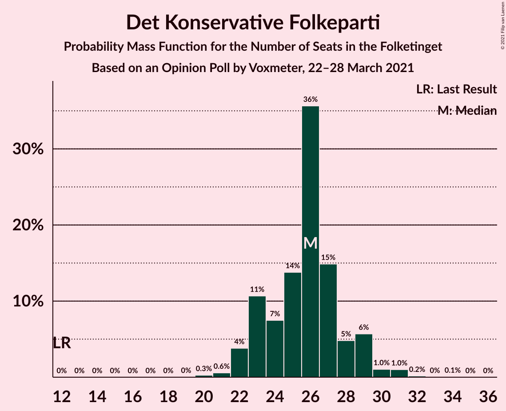
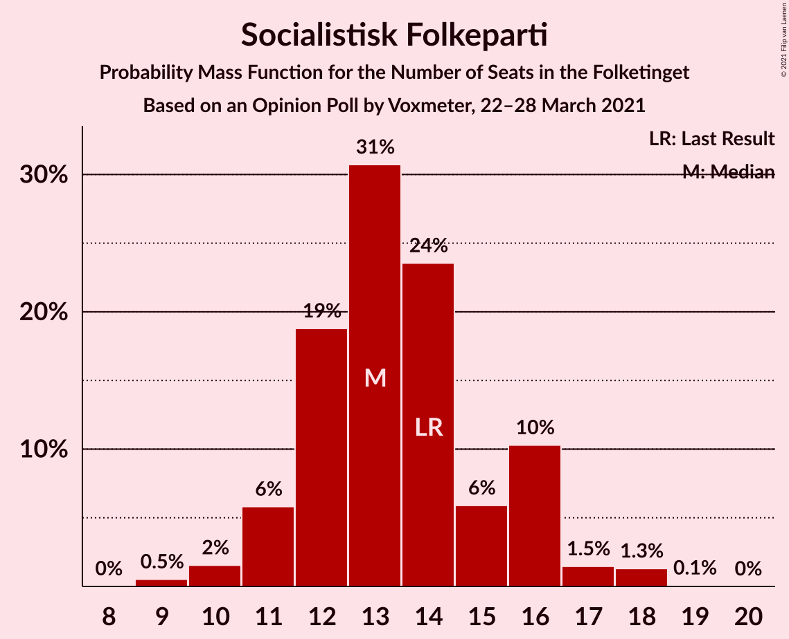
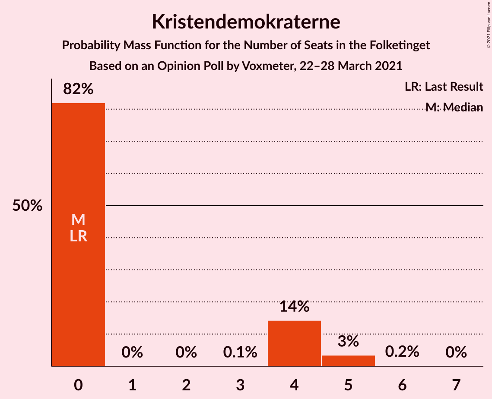
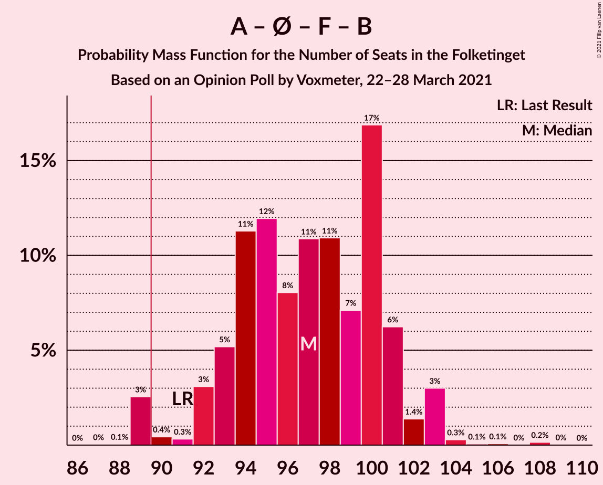

# Opinion Poll by Voxmeter, 22–28 March 2021

<a href="#voting-intentions">Voting Intentions</a> | <a href="#seats">Seats</a> | <a href="#coalitions">Coalitions</a> | <a href="#technical-information">Technical Information</a>

## Voting Intentions

### Confidence Intervals

| Party | Last Result | Poll Result | 80% Confidence Interval | 90% Confidence Interval | 95% Confidence Interval | 99% Confidence Interval |
|:-----:|:-----------:|:-----------:|:-----------------------:|:-----------------------:|:-----------------------:|:-----------------------:|
| Socialdemokraterne | 25.9% | 33.4% | 31.5–35.3% |31.0–35.8% |30.5–36.3% |29.7–37.2% |
| Det Konservative Folkeparti | 6.6% | 14.4% | 13.0–15.9% |12.7–16.3% |12.3–16.6% |11.7–17.4% |
| Venstre | 23.4% | 11.2% | 10.0–12.5% |9.6–12.9% |9.4–13.2% |8.8–13.9% |
| Nye Borgerlige | 2.4% | 8.9% | 7.9–10.2% |7.6–10.5% |7.3–10.8% |6.9–11.4% |
| Enhedslisten–De Rød-Grønne | 6.9% | 8.0% | 7.0–9.1% |6.7–9.5% |6.4–9.8% |6.0–10.4% |
| Socialistisk Folkeparti | 7.7% | 7.5% | 6.5–8.6% |6.2–9.0% |6.0–9.3% |5.6–9.8% |
| Dansk Folkeparti | 8.7% | 5.9% | 5.1–7.0% |4.8–7.3% |4.6–7.5% |4.3–8.1% |
| Radikale Venstre | 8.6% | 5.0% | 4.3–6.0% |4.0–6.3% |3.9–6.6% |3.5–7.1% |
| Liberal Alliance | 2.3% | 2.4% | 1.9–3.2% |1.8–3.4% |1.6–3.6% |1.4–3.9% |
| Kristendemokraterne | 1.7% | 1.7% | 1.3–2.4% |1.2–2.6% |1.1–2.7% |0.9–3.1% |
| Alternativet | 3.0% | 1.1% | 0.7–1.6% |0.7–1.8% |0.6–1.9% |0.5–2.2% |

*Note:* The poll result column reflects the actual value used in the calculations. Published results may vary slightly, and in addition be rounded to fewer digits.

## Seats

### Confidence Intervals

| Party | Last Result | Median | 80% Confidence Interval | 90% Confidence Interval | 95% Confidence Interval | 99% Confidence Interval |
|:-----:|:-----------:|:------:|:-----------------------:|:-----------------------:|:-----------------------:|:-----------------------:|
| <a href="#socialdemokraterne">Socialdemokraterne</a> | 48 | 60 | 57–64 |55–65 |53–65 |53–65 |
| <a href="#det-konservative-folkeparti">Det Konservative Folkeparti</a> | 12 | 26 | 23–28 |23–29 |22–29 |21–31 |
| <a href="#venstre">Venstre</a> | 43 | 20 | 17–22 |17–23 |17–23 |15–25 |
| <a href="#nye-borgerlige">Nye Borgerlige</a> | 4 | 17 | 14–18 |13–19 |13–19 |13–20 |
| <a href="#enhedslisten–de-rød-grønne">Enhedslisten–De Rød-Grønne</a> | 13 | 15 | 13–16 |13–17 |13–17 |11–18 |
| <a href="#socialistisk-folkeparti">Socialistisk Folkeparti</a> | 14 | 13 | 12–16 |11–16 |11–17 |9–18 |
| <a href="#dansk-folkeparti">Dansk Folkeparti</a> | 16 | 11 | 9–12 |9–13 |8–13 |7–15 |
| <a href="#radikale-venstre">Radikale Venstre</a> | 16 | 9 | 8–11 |7–11 |7–11 |6–12 |
| <a href="#liberal-alliance">Liberal Alliance</a> | 4 | 4 | 0–5 |0–6 |0–6 |0–7 |
| <a href="#kristendemokraterne">Kristendemokraterne</a> | 0 | 0 | 0–4 |0–4 |0–5 |0–5 |
| <a href="#alternativet">Alternativet</a> | 5 | 0 | 0 |0 |0 |0–4 |

### Socialdemokraterne

*For a full overview of the results for this party, see the [Socialdemokraterne](party-socialdemokraterne.html) page.*

| Number of Seats | Probability | Accumulated | Special Marks |
|:---------------:|:-----------:|:-----------:|:-------------:|
| 48 | 0% | 100% | Last Result |
| 49 | 0% | 100% |  |
| 50 | 0% | 100% |  |
| 51 | 0.1% | 100% |  |
| 52 | 0.2% | 99.9% |  |
| 53 | 3% | 99.7% |  |
| 54 | 1.2% | 97% |  |
| 55 | 1.5% | 96% |  |
| 56 | 2% | 94% |  |
| 57 | 11% | 93% |  |
| 58 | 11% | 82% |  |
| 59 | 20% | 71% |  |
| 60 | 23% | 51% | Median |
| 61 | 8% | 28% |  |
| 62 | 2% | 19% |  |
| 63 | 5% | 17% |  |
| 64 | 4% | 13% |  |
| 65 | 8% | 8% |  |
| 66 | 0.2% | 0.4% |  |
| 67 | 0.1% | 0.2% |  |
| 68 | 0.1% | 0.1% |  |
| 69 | 0% | 0% |  |

### Det Konservative Folkeparti

*For a full overview of the results for this party, see the [Det Konservative Folkeparti](party-detkonservativefolkeparti.html) page.*

| Number of Seats | Probability | Accumulated | Special Marks |
|:---------------:|:-----------:|:-----------:|:-------------:|
| 12 | 0% | 100% | Last Result |
| 13 | 0% | 100% |  |
| 14 | 0% | 100% |  |
| 15 | 0% | 100% |  |
| 16 | 0% | 100% |  |
| 17 | 0% | 100% |  |
| 18 | 0% | 100% |  |
| 19 | 0% | 100% |  |
| 20 | 0.3% | 100% |  |
| 21 | 0.6% | 99.7% |  |
| 22 | 4% | 99.1% |  |
| 23 | 11% | 95% |  |
| 24 | 7% | 85% |  |
| 25 | 14% | 77% |  |
| 26 | 36% | 63% | Median |
| 27 | 15% | 28% |  |
| 28 | 5% | 13% |  |
| 29 | 6% | 8% |  |
| 30 | 1.0% | 2% |  |
| 31 | 1.0% | 1.3% |  |
| 32 | 0.2% | 0.2% |  |
| 33 | 0% | 0.1% |  |
| 34 | 0.1% | 0.1% |  |
| 35 | 0% | 0% |  |

### Venstre

*For a full overview of the results for this party, see the [Venstre](party-venstre.html) page.*

| Number of Seats | Probability | Accumulated | Special Marks |
|:---------------:|:-----------:|:-----------:|:-------------:|
| 14 | 0.1% | 100% |  |
| 15 | 0.7% | 99.9% |  |
| 16 | 0.9% | 99.2% |  |
| 17 | 9% | 98% |  |
| 18 | 7% | 90% |  |
| 19 | 16% | 83% |  |
| 20 | 23% | 67% | Median |
| 21 | 10% | 44% |  |
| 22 | 26% | 34% |  |
| 23 | 7% | 8% |  |
| 24 | 0.6% | 1.1% |  |
| 25 | 0.5% | 0.5% |  |
| 26 | 0% | 0% |  |
| 27 | 0% | 0% |  |
| 28 | 0% | 0% |  |
| 29 | 0% | 0% |  |
| 30 | 0% | 0% |  |
| 31 | 0% | 0% |  |
| 32 | 0% | 0% |  |
| 33 | 0% | 0% |  |
| 34 | 0% | 0% |  |
| 35 | 0% | 0% |  |
| 36 | 0% | 0% |  |
| 37 | 0% | 0% |  |
| 38 | 0% | 0% |  |
| 39 | 0% | 0% |  |
| 40 | 0% | 0% |  |
| 41 | 0% | 0% |  |
| 42 | 0% | 0% |  |
| 43 | 0% | 0% | Last Result |

### Nye Borgerlige

*For a full overview of the results for this party, see the [Nye Borgerlige](party-nyeborgerlige.html) page.*

| Number of Seats | Probability | Accumulated | Special Marks |
|:---------------:|:-----------:|:-----------:|:-------------:|
| 4 | 0% | 100% | Last Result |
| 5 | 0% | 100% |  |
| 6 | 0% | 100% |  |
| 7 | 0% | 100% |  |
| 8 | 0% | 100% |  |
| 9 | 0% | 100% |  |
| 10 | 0% | 100% |  |
| 11 | 0% | 100% |  |
| 12 | 0.3% | 100% |  |
| 13 | 5% | 99.7% |  |
| 14 | 14% | 95% |  |
| 15 | 18% | 81% |  |
| 16 | 12% | 63% |  |
| 17 | 18% | 51% | Median |
| 18 | 24% | 33% |  |
| 19 | 8% | 9% |  |
| 20 | 1.4% | 2% |  |
| 21 | 0.2% | 0.2% |  |
| 22 | 0% | 0.1% |  |
| 23 | 0% | 0% |  |

### Enhedslisten–De Rød-Grønne

*For a full overview of the results for this party, see the [Enhedslisten–De Rød-Grønne](party-enhedslisten–derød-grønne.html) page.*

| Number of Seats | Probability | Accumulated | Special Marks |
|:---------------:|:-----------:|:-----------:|:-------------:|
| 10 | 0.1% | 100% |  |
| 11 | 0.6% | 99.9% |  |
| 12 | 2% | 99.3% |  |
| 13 | 12% | 98% | Last Result |
| 14 | 29% | 86% |  |
| 15 | 18% | 57% | Median |
| 16 | 32% | 39% |  |
| 17 | 5% | 7% |  |
| 18 | 2% | 2% |  |
| 19 | 0.3% | 0.3% |  |
| 20 | 0% | 0% |  |

### Socialistisk Folkeparti

*For a full overview of the results for this party, see the [Socialistisk Folkeparti](party-socialistiskfolkeparti.html) page.*

| Number of Seats | Probability | Accumulated | Special Marks |
|:---------------:|:-----------:|:-----------:|:-------------:|
| 9 | 0.5% | 100% |  |
| 10 | 2% | 99.5% |  |
| 11 | 6% | 98% |  |
| 12 | 19% | 92% |  |
| 13 | 31% | 73% | Median |
| 14 | 24% | 43% | Last Result |
| 15 | 6% | 19% |  |
| 16 | 10% | 13% |  |
| 17 | 1.5% | 3% |  |
| 18 | 1.3% | 1.4% |  |
| 19 | 0.1% | 0.1% |  |
| 20 | 0% | 0% |  |

### Dansk Folkeparti

*For a full overview of the results for this party, see the [Dansk Folkeparti](party-danskfolkeparti.html) page.*

| Number of Seats | Probability | Accumulated | Special Marks |
|:---------------:|:-----------:|:-----------:|:-------------:|
| 7 | 1.2% | 100% |  |
| 8 | 2% | 98.8% |  |
| 9 | 9% | 97% |  |
| 10 | 32% | 87% |  |
| 11 | 34% | 56% | Median |
| 12 | 16% | 22% |  |
| 13 | 3% | 6% |  |
| 14 | 0.8% | 2% |  |
| 15 | 1.2% | 2% |  |
| 16 | 0.3% | 0.3% | Last Result |
| 17 | 0% | 0% |  |

### Radikale Venstre

*For a full overview of the results for this party, see the [Radikale Venstre](party-radikalevenstre.html) page.*

| Number of Seats | Probability | Accumulated | Special Marks |
|:---------------:|:-----------:|:-----------:|:-------------:|
| 6 | 0.5% | 100% |  |
| 7 | 9% | 99.5% |  |
| 8 | 35% | 91% |  |
| 9 | 20% | 56% | Median |
| 10 | 15% | 35% |  |
| 11 | 19% | 21% |  |
| 12 | 1.3% | 2% |  |
| 13 | 0.2% | 0.3% |  |
| 14 | 0.1% | 0.1% |  |
| 15 | 0% | 0% |  |
| 16 | 0% | 0% | Last Result |

### Liberal Alliance

*For a full overview of the results for this party, see the [Liberal Alliance](party-liberalalliance.html) page.*

| Number of Seats | Probability | Accumulated | Special Marks |
|:---------------:|:-----------:|:-----------:|:-------------:|
| 0 | 10% | 100% |  |
| 1 | 0% | 90% |  |
| 2 | 0% | 90% |  |
| 3 | 0% | 90% |  |
| 4 | 46% | 90% | Last Result, Median |
| 5 | 36% | 44% |  |
| 6 | 7% | 8% |  |
| 7 | 1.3% | 2% |  |
| 8 | 0.3% | 0.3% |  |
| 9 | 0% | 0% |  |

### Kristendemokraterne

*For a full overview of the results for this party, see the [Kristendemokraterne](party-kristendemokraterne.html) page.*

| Number of Seats | Probability | Accumulated | Special Marks |
|:---------------:|:-----------:|:-----------:|:-------------:|
| 0 | 82% | 100% | Last Result, Median |
| 1 | 0% | 18% |  |
| 2 | 0% | 18% |  |
| 3 | 0.1% | 18% |  |
| 4 | 14% | 18% |  |
| 5 | 3% | 4% |  |
| 6 | 0.2% | 0.3% |  |
| 7 | 0% | 0% |  |

### Alternativet

*For a full overview of the results for this party, see the [Alternativet](party-alternativet.html) page.*

| Number of Seats | Probability | Accumulated | Special Marks |
|:---------------:|:-----------:|:-----------:|:-------------:|
| 0 | 98% | 100% | Median |
| 1 | 0% | 2% |  |
| 2 | 0% | 2% |  |
| 3 | 0% | 2% |  |
| 4 | 2% | 2% |  |
| 5 | 0.1% | 0.1% | Last Result |
| 6 | 0% | 0% |  |

## Coalitions

### Confidence Intervals

| Coalition | Last Result | Median | Majority? | 80% Confidence Interval | 90% Confidence Interval | 95% Confidence Interval | 99% Confidence Interval |
|:---------:|:-----------:|:------:|:---------:|:-----------------------:|:-----------------------:|:-----------------------:|:-----------------------:|
| Socialdemokraterne – Enhedslisten–De Rød-Grønne – Socialistisk Folkeparti – Radikale Venstre – Alternativet | 96 | 97 | 97% | 93–101 | 92–103 | 89–103 | 89–104 |
| Socialdemokraterne – Enhedslisten–De Rød-Grønne – Socialistisk Folkeparti – Radikale Venstre | 91 | 97 | 97% | 93–101 | 92–101 | 89–103 | 89–104 |
| Socialdemokraterne – Enhedslisten–De Rød-Grønne – Socialistisk Folkeparti – Alternativet | 80 | 89 | 31% | 85–91 | 84–93 | 81–94 | 81–96 |
| Socialdemokraterne – Enhedslisten–De Rød-Grønne – Socialistisk Folkeparti | 75 | 89 | 31% | 85–91 | 84–93 | 81–93 | 81–95 |
| Socialdemokraterne – Socialistisk Folkeparti – Radikale Venstre | 78 | 82 | 0.8% | 78–86 | 78–87 | 75–88 | 74–90 |
| Det Konservative Folkeparti – Venstre – Nye Borgerlige – Dansk Folkeparti – Liberal Alliance – Kristendemokraterne | 79 | 78 | 0% | 74–82 | 72–83 | 72–86 | 71–86 |
| Det Konservative Folkeparti – Venstre – Nye Borgerlige – Dansk Folkeparti – Liberal Alliance | 79 | 77 | 0% | 74–81 | 72–81 | 71–82 | 69–85 |
| Socialdemokraterne – Radikale Venstre | 64 | 69 | 0% | 66–72 | 64–75 | 63–75 | 61–75 |
| Det Konservative Folkeparti – Venstre – Dansk Folkeparti – Liberal Alliance – Kristendemokraterne | 75 | 61 | 0% | 57–65 | 56–67 | 56–69 | 53–69 |
| Det Konservative Folkeparti – Venstre – Dansk Folkeparti – Liberal Alliance | 75 | 61 | 0% | 57–64 | 56–65 | 55–66 | 53–68 |
| Det Konservative Folkeparti – Venstre – Liberal Alliance | 59 | 50 | 0% | 46–53 | 46–55 | 45–56 | 42–56 |
| Det Konservative Folkeparti – Venstre | 55 | 46 | 0% | 43–49 | 42–50 | 41–51 | 40–52 |
| Venstre | 43 | 20 | 0% | 17–22 | 17–23 | 17–23 | 15–25 |

### Socialdemokraterne – Enhedslisten–De Rød-Grønne – Socialistisk Folkeparti – Radikale Venstre – Alternativet

| Number of Seats | Probability | Accumulated | Special Marks |
|:---------------:|:-----------:|:-----------:|:-------------:|
| 87 | 0% | 100% |  |
| 88 | 0% | 99.9% |  |
| 89 | 3% | 99.9% |  |
| 90 | 0.4% | 97% | Majority |
| 91 | 0.3% | 97% |  |
| 92 | 3% | 97% |  |
| 93 | 5% | 94% |  |
| 94 | 11% | 88% |  |
| 95 | 12% | 77% |  |
| 96 | 8% | 65% | Last Result |
| 97 | 11% | 57% | Median |
| 98 | 11% | 47% |  |
| 99 | 7% | 36% |  |
| 100 | 16% | 28% |  |
| 101 | 6% | 13% |  |
| 102 | 1.4% | 6% |  |
| 103 | 3% | 5% |  |
| 104 | 2% | 2% |  |
| 105 | 0.1% | 0.4% |  |
| 106 | 0.1% | 0.3% |  |
| 107 | 0% | 0.2% |  |
| 108 | 0.2% | 0.2% |  |
| 109 | 0% | 0% |  |

### Socialdemokraterne – Enhedslisten–De Rød-Grønne – Socialistisk Folkeparti – Radikale Venstre

| Number of Seats | Probability | Accumulated | Special Marks |
|:---------------:|:-----------:|:-----------:|:-------------:|
| 87 | 0% | 100% |  |
| 88 | 0.1% | 99.9% |  |
| 89 | 3% | 99.9% |  |
| 90 | 0.4% | 97% | Majority |
| 91 | 0.3% | 97% | Last Result |
| 92 | 3% | 97% |  |
| 93 | 5% | 93% |  |
| 94 | 11% | 88% |  |
| 95 | 12% | 77% |  |
| 96 | 8% | 65% |  |
| 97 | 11% | 57% | Median |
| 98 | 11% | 46% |  |
| 99 | 7% | 35% |  |
| 100 | 17% | 28% |  |
| 101 | 6% | 11% |  |
| 102 | 1.4% | 5% |  |
| 103 | 3% | 4% |  |
| 104 | 0.3% | 0.6% |  |
| 105 | 0.1% | 0.3% |  |
| 106 | 0.1% | 0.3% |  |
| 107 | 0% | 0.2% |  |
| 108 | 0.2% | 0.2% |  |
| 109 | 0% | 0% |  |

### Socialdemokraterne – Enhedslisten–De Rød-Grønne – Socialistisk Folkeparti – Alternativet

| Number of Seats | Probability | Accumulated | Special Marks |
|:---------------:|:-----------:|:-----------:|:-------------:|
| 78 | 0% | 100% |  |
| 79 | 0.1% | 99.9% |  |
| 80 | 0.2% | 99.8% | Last Result |
| 81 | 2% | 99.6% |  |
| 82 | 0.9% | 97% |  |
| 83 | 0.9% | 96% |  |
| 84 | 4% | 96% |  |
| 85 | 11% | 92% |  |
| 86 | 19% | 81% |  |
| 87 | 4% | 62% |  |
| 88 | 3% | 58% | Median |
| 89 | 23% | 54% |  |
| 90 | 17% | 31% | Majority |
| 91 | 5% | 15% |  |
| 92 | 2% | 10% |  |
| 93 | 4% | 7% |  |
| 94 | 2% | 4% |  |
| 95 | 0.3% | 2% |  |
| 96 | 1.3% | 2% |  |
| 97 | 0% | 0.2% |  |
| 98 | 0.1% | 0.2% |  |
| 99 | 0.1% | 0.1% |  |
| 100 | 0% | 0% |  |

### Socialdemokraterne – Enhedslisten–De Rød-Grønne – Socialistisk Folkeparti

| Number of Seats | Probability | Accumulated | Special Marks |
|:---------------:|:-----------:|:-----------:|:-------------:|
| 75 | 0% | 100% | Last Result |
| 76 | 0% | 100% |  |
| 77 | 0% | 100% |  |
| 78 | 0% | 100% |  |
| 79 | 0.1% | 99.9% |  |
| 80 | 0.3% | 99.8% |  |
| 81 | 2% | 99.6% |  |
| 82 | 1.0% | 97% |  |
| 83 | 1.0% | 96% |  |
| 84 | 4% | 95% |  |
| 85 | 11% | 92% |  |
| 86 | 19% | 81% |  |
| 87 | 4% | 62% |  |
| 88 | 3% | 58% | Median |
| 89 | 23% | 54% |  |
| 90 | 17% | 31% | Majority |
| 91 | 5% | 14% |  |
| 92 | 3% | 9% |  |
| 93 | 4% | 6% |  |
| 94 | 2% | 2% |  |
| 95 | 0.3% | 0.6% |  |
| 96 | 0.1% | 0.3% |  |
| 97 | 0% | 0.2% |  |
| 98 | 0.1% | 0.2% |  |
| 99 | 0% | 0.1% |  |
| 100 | 0% | 0% |  |

### Socialdemokraterne – Socialistisk Folkeparti – Radikale Venstre

| Number of Seats | Probability | Accumulated | Special Marks |
|:---------------:|:-----------:|:-----------:|:-------------:|
| 73 | 0.1% | 100% |  |
| 74 | 2% | 99.9% |  |
| 75 | 0.3% | 98% |  |
| 76 | 0.9% | 97% |  |
| 77 | 0.8% | 97% |  |
| 78 | 6% | 96% | Last Result |
| 79 | 12% | 89% |  |
| 80 | 4% | 77% |  |
| 81 | 16% | 73% |  |
| 82 | 9% | 57% | Median |
| 83 | 9% | 48% |  |
| 84 | 22% | 39% |  |
| 85 | 5% | 17% |  |
| 86 | 3% | 12% |  |
| 87 | 5% | 9% |  |
| 88 | 2% | 4% |  |
| 89 | 0.6% | 1.4% |  |
| 90 | 0.5% | 0.8% | Majority |
| 91 | 0.2% | 0.3% |  |
| 92 | 0% | 0.1% |  |
| 93 | 0.1% | 0.1% |  |
| 94 | 0% | 0% |  |

### Det Konservative Folkeparti – Venstre – Nye Borgerlige – Dansk Folkeparti – Liberal Alliance – Kristendemokraterne

| Number of Seats | Probability | Accumulated | Special Marks |
|:---------------:|:-----------:|:-----------:|:-------------:|
| 67 | 0.2% | 100% |  |
| 68 | 0% | 99.8% |  |
| 69 | 0.1% | 99.8% |  |
| 70 | 0.1% | 99.7% |  |
| 71 | 2% | 99.6% |  |
| 72 | 3% | 98% |  |
| 73 | 1.4% | 95% |  |
| 74 | 6% | 94% |  |
| 75 | 16% | 87% |  |
| 76 | 7% | 72% |  |
| 77 | 11% | 64% |  |
| 78 | 11% | 53% | Median |
| 79 | 8% | 43% | Last Result |
| 80 | 12% | 35% |  |
| 81 | 11% | 23% |  |
| 82 | 5% | 12% |  |
| 83 | 3% | 6% |  |
| 84 | 0.3% | 3% |  |
| 85 | 0.4% | 3% |  |
| 86 | 3% | 3% |  |
| 87 | 0% | 0.1% |  |
| 88 | 0% | 0.1% |  |
| 89 | 0% | 0% |  |

### Det Konservative Folkeparti – Venstre – Nye Borgerlige – Dansk Folkeparti – Liberal Alliance

| Number of Seats | Probability | Accumulated | Special Marks |
|:---------------:|:-----------:|:-----------:|:-------------:|
| 67 | 0.2% | 100% |  |
| 68 | 0.2% | 99.8% |  |
| 69 | 0.6% | 99.6% |  |
| 70 | 0.5% | 99.0% |  |
| 71 | 2% | 98.6% |  |
| 72 | 5% | 97% |  |
| 73 | 1.2% | 92% |  |
| 74 | 8% | 91% |  |
| 75 | 16% | 83% |  |
| 76 | 8% | 66% |  |
| 77 | 12% | 59% |  |
| 78 | 12% | 47% | Median |
| 79 | 9% | 35% | Last Result |
| 80 | 11% | 26% |  |
| 81 | 11% | 15% |  |
| 82 | 3% | 4% |  |
| 83 | 0.3% | 1.1% |  |
| 84 | 0.3% | 0.8% |  |
| 85 | 0.2% | 0.5% |  |
| 86 | 0.3% | 0.3% |  |
| 87 | 0% | 0% |  |

### Socialdemokraterne – Radikale Venstre

| Number of Seats | Probability | Accumulated | Special Marks |
|:---------------:|:-----------:|:-----------:|:-------------:|
| 60 | 0.1% | 100% |  |
| 61 | 2% | 99.9% |  |
| 62 | 0.2% | 98% |  |
| 63 | 0.8% | 98% |  |
| 64 | 2% | 97% | Last Result |
| 65 | 3% | 94% |  |
| 66 | 13% | 92% |  |
| 67 | 14% | 79% |  |
| 68 | 14% | 64% |  |
| 69 | 16% | 50% | Median |
| 70 | 7% | 34% |  |
| 71 | 11% | 27% |  |
| 72 | 6% | 16% |  |
| 73 | 3% | 10% |  |
| 74 | 0.3% | 7% |  |
| 75 | 6% | 6% |  |
| 76 | 0.1% | 0.4% |  |
| 77 | 0.2% | 0.3% |  |
| 78 | 0.1% | 0.1% |  |
| 79 | 0% | 0% |  |

### Det Konservative Folkeparti – Venstre – Dansk Folkeparti – Liberal Alliance – Kristendemokraterne

| Number of Seats | Probability | Accumulated | Special Marks |
|:---------------:|:-----------:|:-----------:|:-------------:|
| 52 | 0.2% | 100% |  |
| 53 | 0.4% | 99.8% |  |
| 54 | 0.2% | 99.4% |  |
| 55 | 0.8% | 99.2% |  |
| 56 | 6% | 98% |  |
| 57 | 4% | 93% |  |
| 58 | 1.3% | 89% |  |
| 59 | 7% | 87% |  |
| 60 | 16% | 80% |  |
| 61 | 16% | 64% | Median |
| 62 | 17% | 49% |  |
| 63 | 3% | 31% |  |
| 64 | 14% | 28% |  |
| 65 | 6% | 14% |  |
| 66 | 0.6% | 9% |  |
| 67 | 5% | 8% |  |
| 68 | 0.6% | 3% |  |
| 69 | 2% | 3% |  |
| 70 | 0.1% | 0.2% |  |
| 71 | 0.1% | 0.1% |  |
| 72 | 0% | 0% |  |
| 73 | 0% | 0% |  |
| 74 | 0% | 0% |  |
| 75 | 0% | 0% | Last Result |

### Det Konservative Folkeparti – Venstre – Dansk Folkeparti – Liberal Alliance

| Number of Seats | Probability | Accumulated | Special Marks |
|:---------------:|:-----------:|:-----------:|:-------------:|
| 51 | 0% | 100% |  |
| 52 | 0.2% | 99.9% |  |
| 53 | 0.8% | 99.7% |  |
| 54 | 0.8% | 98.9% |  |
| 55 | 2% | 98% |  |
| 56 | 6% | 97% |  |
| 57 | 5% | 90% |  |
| 58 | 2% | 85% |  |
| 59 | 8% | 83% |  |
| 60 | 18% | 74% |  |
| 61 | 16% | 56% | Median |
| 62 | 17% | 40% |  |
| 63 | 4% | 23% |  |
| 64 | 11% | 19% |  |
| 65 | 6% | 9% |  |
| 66 | 0.4% | 3% |  |
| 67 | 2% | 2% |  |
| 68 | 0.4% | 0.8% |  |
| 69 | 0.3% | 0.4% |  |
| 70 | 0% | 0.1% |  |
| 71 | 0% | 0% |  |
| 72 | 0% | 0% |  |
| 73 | 0% | 0% |  |
| 74 | 0% | 0% |  |
| 75 | 0% | 0% | Last Result |

### Det Konservative Folkeparti – Venstre – Liberal Alliance

| Number of Seats | Probability | Accumulated | Special Marks |
|:---------------:|:-----------:|:-----------:|:-------------:|
| 41 | 0.2% | 100% |  |
| 42 | 0.7% | 99.8% |  |
| 43 | 0.4% | 99.1% |  |
| 44 | 0.8% | 98.7% |  |
| 45 | 2% | 98% |  |
| 46 | 11% | 96% |  |
| 47 | 4% | 86% |  |
| 48 | 7% | 82% |  |
| 49 | 13% | 75% |  |
| 50 | 15% | 61% | Median |
| 51 | 20% | 47% |  |
| 52 | 5% | 27% |  |
| 53 | 12% | 21% |  |
| 54 | 3% | 9% |  |
| 55 | 3% | 6% |  |
| 56 | 3% | 3% |  |
| 57 | 0.3% | 0.5% |  |
| 58 | 0.1% | 0.2% |  |
| 59 | 0.1% | 0.1% | Last Result |
| 60 | 0% | 0% |  |

### Det Konservative Folkeparti – Venstre

| Number of Seats | Probability | Accumulated | Special Marks |
|:---------------:|:-----------:|:-----------:|:-------------:|
| 37 | 0% | 100% |  |
| 38 | 0.1% | 99.9% |  |
| 39 | 0.1% | 99.8% |  |
| 40 | 1.3% | 99.7% |  |
| 41 | 3% | 98% |  |
| 42 | 5% | 95% |  |
| 43 | 4% | 91% |  |
| 44 | 11% | 86% |  |
| 45 | 10% | 75% |  |
| 46 | 25% | 65% | Median |
| 47 | 17% | 39% |  |
| 48 | 12% | 23% |  |
| 49 | 2% | 10% |  |
| 50 | 4% | 8% |  |
| 51 | 4% | 5% |  |
| 52 | 0.4% | 0.7% |  |
| 53 | 0.3% | 0.4% |  |
| 54 | 0.1% | 0.1% |  |
| 55 | 0% | 0% | Last Result |

### Venstre

| Number of Seats | Probability | Accumulated | Special Marks |
|:---------------:|:-----------:|:-----------:|:-------------:|
| 14 | 0.1% | 100% |  |
| 15 | 0.7% | 99.9% |  |
| 16 | 0.9% | 99.2% |  |
| 17 | 9% | 98% |  |
| 18 | 7% | 90% |  |
| 19 | 16% | 83% |  |
| 20 | 23% | 67% | Median |
| 21 | 10% | 44% |  |
| 22 | 26% | 34% |  |
| 23 | 7% | 8% |  |
| 24 | 0.6% | 1.1% |  |
| 25 | 0.5% | 0.5% |  |
| 26 | 0% | 0% |  |
| 27 | 0% | 0% |  |
| 28 | 0% | 0% |  |
| 29 | 0% | 0% |  |
| 30 | 0% | 0% |  |
| 31 | 0% | 0% |  |
| 32 | 0% | 0% |  |
| 33 | 0% | 0% |  |
| 34 | 0% | 0% |  |
| 35 | 0% | 0% |  |
| 36 | 0% | 0% |  |
| 37 | 0% | 0% |  |
| 38 | 0% | 0% |  |
| 39 | 0% | 0% |  |
| 40 | 0% | 0% |  |
| 41 | 0% | 0% |  |
| 42 | 0% | 0% |  |
| 43 | 0% | 0% | Last Result |

## Technical Information

### Opinion Poll

+ **Polling firm:** Voxmeter
+ **Commissioner(s):** —
+ **Fieldwork period:** 22–28 March 2021

### Calculations

+ **Sample size:** 1031
+ **Simulations done:** 1,048,576
+ **Error estimate:** 2.48%

