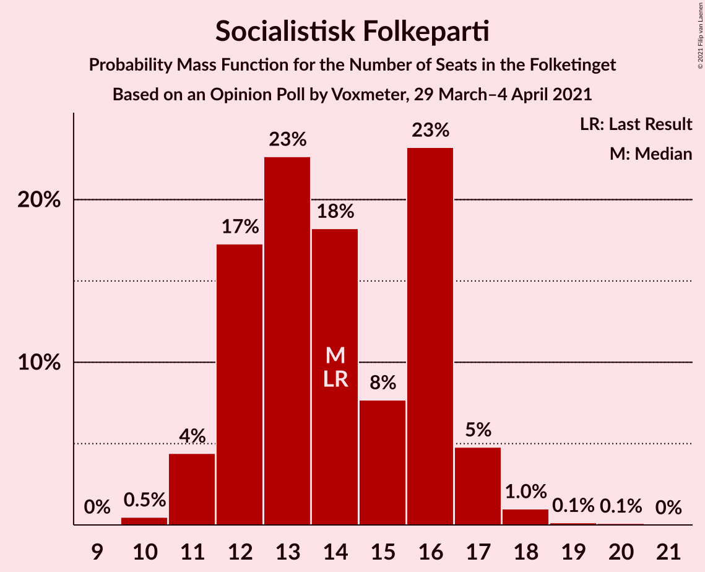
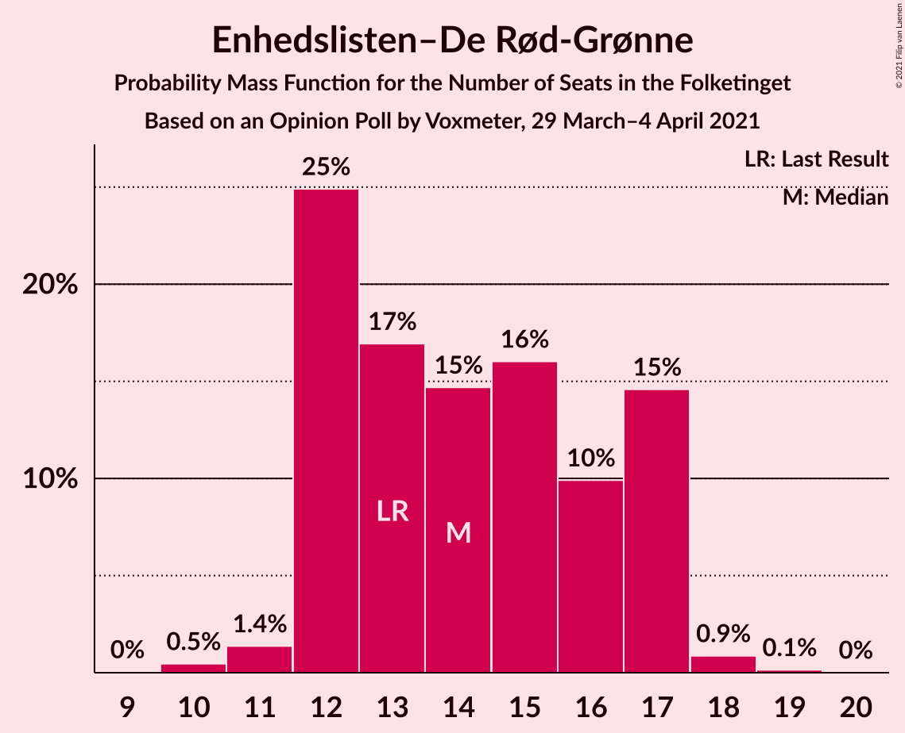
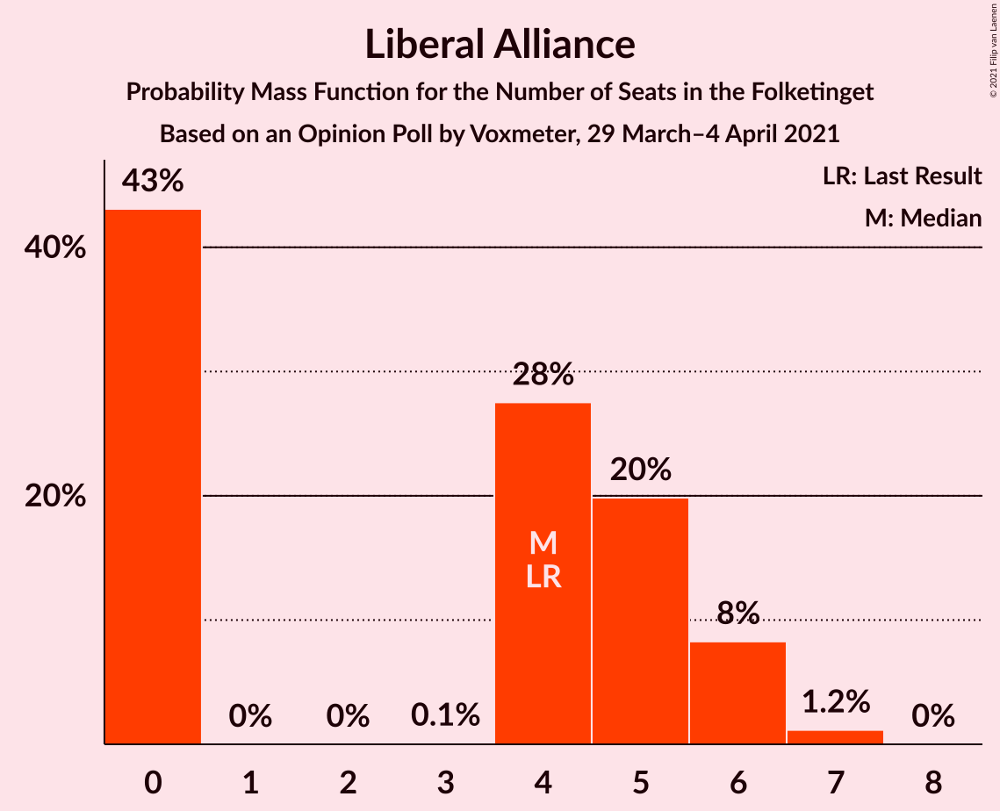
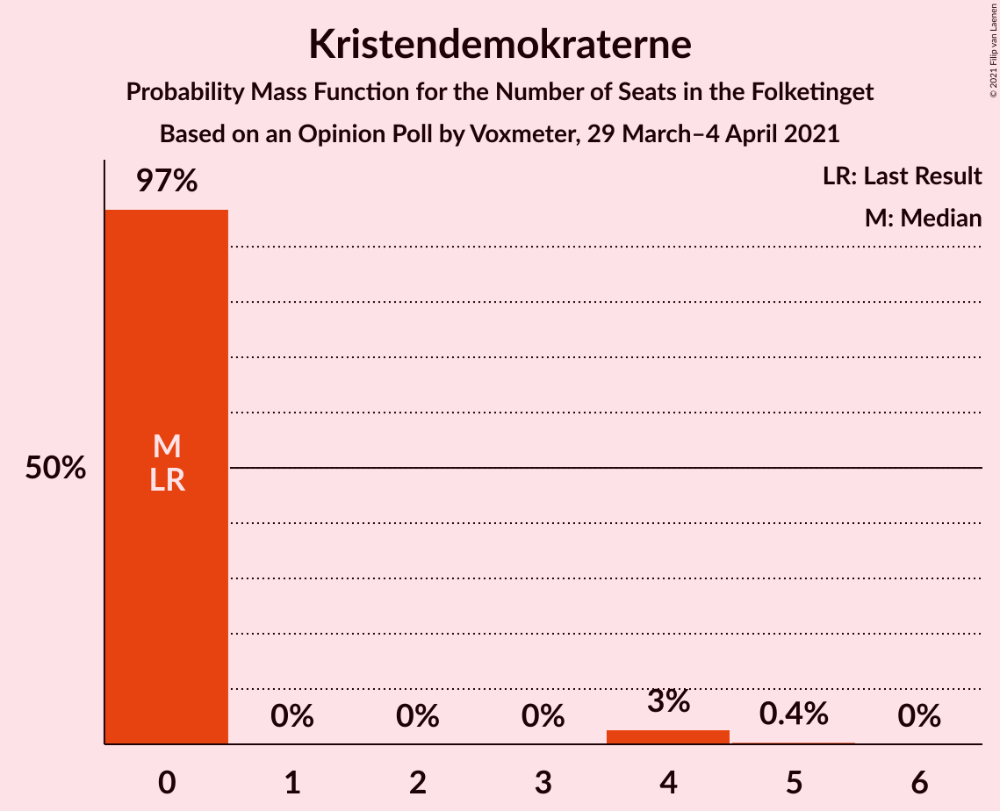
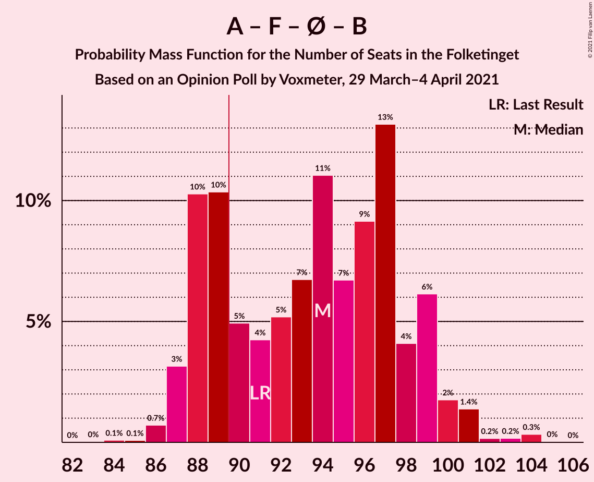
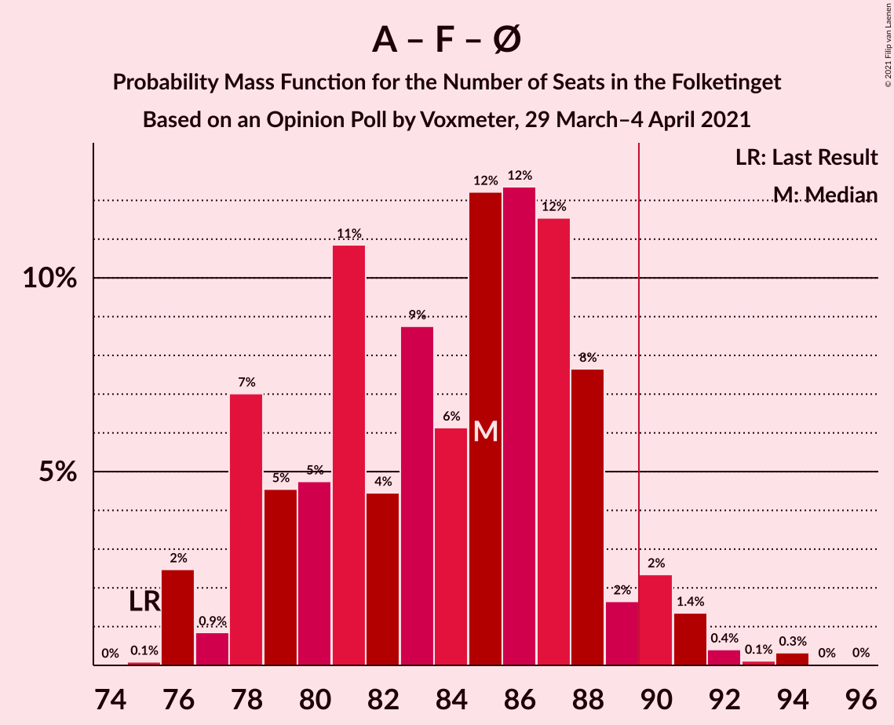
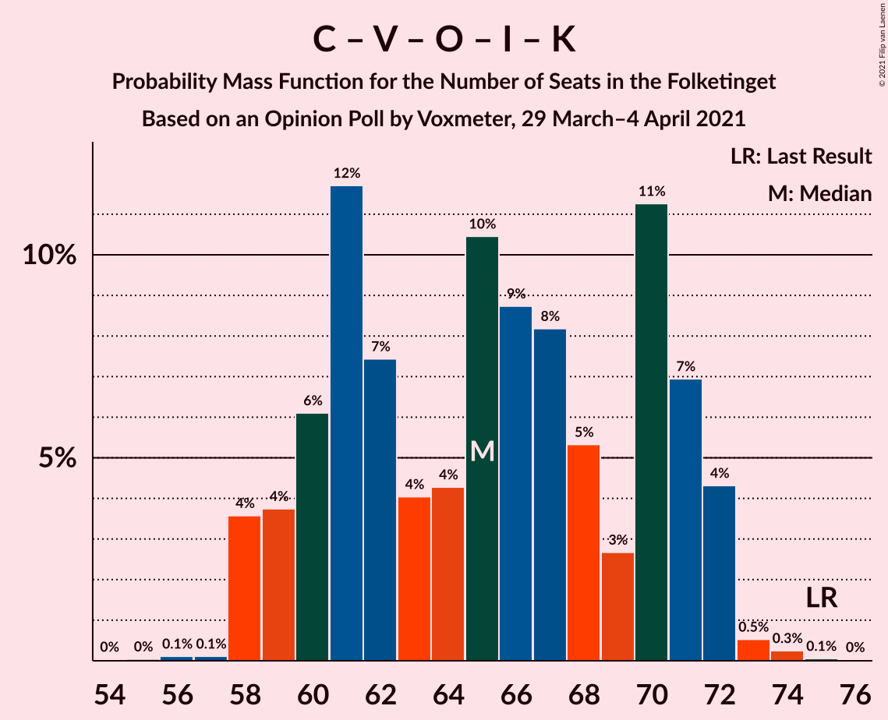
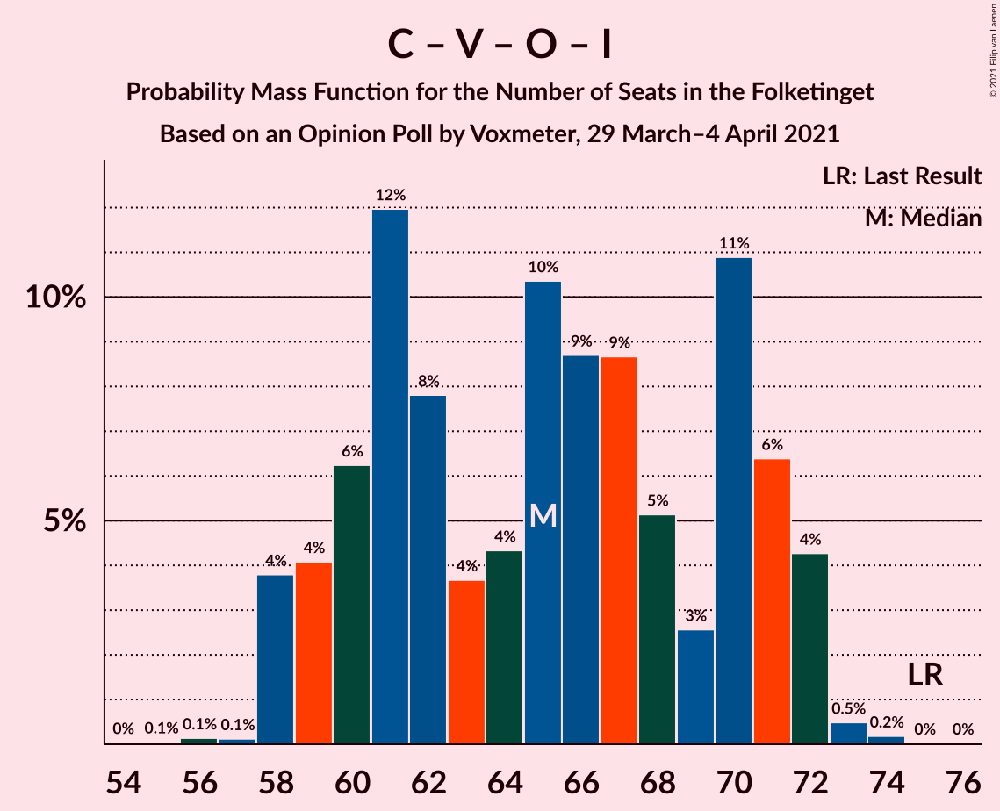

# Opinion Poll by Voxmeter, 29 March–4 April 2021

<a href="#voting-intentions">Voting Intentions</a> | <a href="#seats">Seats</a> | <a href="#coalitions">Coalitions</a> | <a href="#technical-information">Technical Information</a>

## Voting Intentions

### Confidence Intervals

| Party | Last Result | Poll Result | 80% Confidence Interval | 90% Confidence Interval | 95% Confidence Interval | 99% Confidence Interval |
|:-----:|:-----------:|:-----------:|:-----------------------:|:-----------------------:|:-----------------------:|:-----------------------:|
| Socialdemokraterne | 25.9% | 30.9% | 29.1–32.8% |28.6–33.4% |28.2–33.8% |27.3–34.8% |
| Det Konservative Folkeparti | 6.6% | 16.0% | 14.6–17.6% |14.2–18.0% |13.9–18.4% |13.2–19.1% |
| Venstre | 23.4% | 12.7% | 11.4–14.1% |11.1–14.5% |10.7–14.8% |10.2–15.6% |
| Nye Borgerlige | 2.4% | 8.7% | 7.7–10.0% |7.4–10.3% |7.1–10.6% |6.7–11.2% |
| Socialistisk Folkeparti | 7.7% | 7.8% | 6.8–8.9% |6.5–9.3% |6.3–9.6% |5.8–10.2% |
| Enhedslisten–De Rød-Grønne | 6.9% | 7.7% | 6.7–8.8% |6.4–9.2% |6.2–9.5% |5.7–10.0% |
| Dansk Folkeparti | 8.7% | 5.6% | 4.8–6.6% |4.5–6.9% |4.3–7.2% |4.0–7.7% |
| Radikale Venstre | 8.6% | 5.3% | 4.5–6.3% |4.3–6.6% |4.1–6.9% |3.7–7.4% |
| Liberal Alliance | 2.3% | 2.1% | 1.6–2.8% |1.5–3.0% |1.4–3.1% |1.2–3.5% |
| Kristendemokraterne | 1.7% | 1.3% | 0.9–1.9% |0.8–2.0% |0.7–2.2% |0.6–2.5% |
| Alternativet | 3.0% | 0.9% | 0.6–1.4% |0.5–1.5% |0.5–1.7% |0.4–2.0% |

*Note:* The poll result column reflects the actual value used in the calculations. Published results may vary slightly, and in addition be rounded to fewer digits.

## Seats

### Confidence Intervals

| Party | Last Result | Median | 80% Confidence Interval | 90% Confidence Interval | 95% Confidence Interval | 99% Confidence Interval |
|:-----:|:-----------:|:------:|:-----------------------:|:-----------------------:|:-----------------------:|:-----------------------:|
| <a href="#socialdemokraterne">Socialdemokraterne</a> | 48 | 52 | 50–58 |50–58 |50–58 |48–60 |
| <a href="#det-konservative-folkeparti">Det Konservative Folkeparti</a> | 12 | 28 | 25–32 |25–32 |25–32 |24–34 |
| <a href="#venstre">Venstre</a> | 43 | 26 | 24–28 |22–28 |21–28 |19–29 |
| <a href="#nye-borgerlige">Nye Borgerlige</a> | 4 | 16 | 14–17 |14–18 |13–19 |13–20 |
| <a href="#socialistisk-folkeparti">Socialistisk Folkeparti</a> | 14 | 14 | 13–17 |13–17 |12–17 |11–20 |
| <a href="#enhedslisten–de-rød-grønne">Enhedslisten–De Rød-Grønne</a> | 13 | 13 | 12–15 |12–16 |12–17 |11–18 |
| <a href="#dansk-folkeparti">Dansk Folkeparti</a> | 16 | 10 | 9–12 |8–12 |8–12 |7–13 |
| <a href="#radikale-venstre">Radikale Venstre</a> | 16 | 11 | 8–12 |8–12 |8–12 |7–14 |
| <a href="#liberal-alliance">Liberal Alliance</a> | 4 | 4 | 0–5 |0–5 |0–5 |0–6 |
| <a href="#kristendemokraterne">Kristendemokraterne</a> | 0 | 0 | 0 |0–4 |0–4 |0–4 |
| <a href="#alternativet">Alternativet</a> | 5 | 0 | 0 |0 |0 |0–4 |

### Socialdemokraterne

*For a full overview of the results for this party, see the [Socialdemokraterne](party-socialdemokraterne.html) page.*

| Number of Seats | Probability | Accumulated | Special Marks |
|:---------------:|:-----------:|:-----------:|:-------------:|
| 45 | 0.1% | 100% |  |
| 46 | 0% | 99.9% |  |
| 47 | 0.4% | 99.9% |  |
| 48 | 0.2% | 99.5% | Last Result |
| 49 | 1.4% | 99.4% |  |
| 50 | 23% | 98% |  |
| 51 | 16% | 75% |  |
| 52 | 14% | 60% | Median |
| 53 | 4% | 46% |  |
| 54 | 7% | 42% |  |
| 55 | 5% | 36% |  |
| 56 | 2% | 31% |  |
| 57 | 2% | 29% |  |
| 58 | 25% | 27% |  |
| 59 | 2% | 2% |  |
| 60 | 0.5% | 0.8% |  |
| 61 | 0.1% | 0.3% |  |
| 62 | 0.2% | 0.2% |  |
| 63 | 0% | 0.1% |  |
| 64 | 0.1% | 0.1% |  |
| 65 | 0% | 0% |  |

### Det Konservative Folkeparti

*For a full overview of the results for this party, see the [Det Konservative Folkeparti](party-detkonservativefolkeparti.html) page.*

| Number of Seats | Probability | Accumulated | Special Marks |
|:---------------:|:-----------:|:-----------:|:-------------:|
| 12 | 0% | 100% | Last Result |
| 13 | 0% | 100% |  |
| 14 | 0% | 100% |  |
| 15 | 0% | 100% |  |
| 16 | 0% | 100% |  |
| 17 | 0% | 100% |  |
| 18 | 0% | 100% |  |
| 19 | 0% | 100% |  |
| 20 | 0% | 100% |  |
| 21 | 0% | 100% |  |
| 22 | 0% | 100% |  |
| 23 | 0.4% | 100% |  |
| 24 | 0.4% | 99.5% |  |
| 25 | 25% | 99.1% |  |
| 26 | 8% | 74% |  |
| 27 | 4% | 66% |  |
| 28 | 14% | 62% | Median |
| 29 | 9% | 47% |  |
| 30 | 9% | 38% |  |
| 31 | 3% | 30% |  |
| 32 | 25% | 27% |  |
| 33 | 0.9% | 2% |  |
| 34 | 0.6% | 0.6% |  |
| 35 | 0% | 0.1% |  |
| 36 | 0% | 0% |  |

### Venstre

*For a full overview of the results for this party, see the [Venstre](party-venstre.html) page.*

| Number of Seats | Probability | Accumulated | Special Marks |
|:---------------:|:-----------:|:-----------:|:-------------:|
| 17 | 0.1% | 100% |  |
| 18 | 0% | 99.9% |  |
| 19 | 1.1% | 99.9% |  |
| 20 | 0.9% | 98.8% |  |
| 21 | 3% | 98% |  |
| 22 | 2% | 95% |  |
| 23 | 2% | 93% |  |
| 24 | 29% | 91% |  |
| 25 | 7% | 62% |  |
| 26 | 27% | 54% | Median |
| 27 | 7% | 27% |  |
| 28 | 19% | 20% |  |
| 29 | 0.4% | 0.6% |  |
| 30 | 0.2% | 0.3% |  |
| 31 | 0% | 0% |  |
| 32 | 0% | 0% |  |
| 33 | 0% | 0% |  |
| 34 | 0% | 0% |  |
| 35 | 0% | 0% |  |
| 36 | 0% | 0% |  |
| 37 | 0% | 0% |  |
| 38 | 0% | 0% |  |
| 39 | 0% | 0% |  |
| 40 | 0% | 0% |  |
| 41 | 0% | 0% |  |
| 42 | 0% | 0% |  |
| 43 | 0% | 0% | Last Result |

### Nye Borgerlige

*For a full overview of the results for this party, see the [Nye Borgerlige](party-nyeborgerlige.html) page.*

| Number of Seats | Probability | Accumulated | Special Marks |
|:---------------:|:-----------:|:-----------:|:-------------:|
| 4 | 0% | 100% | Last Result |
| 5 | 0% | 100% |  |
| 6 | 0% | 100% |  |
| 7 | 0% | 100% |  |
| 8 | 0% | 100% |  |
| 9 | 0% | 100% |  |
| 10 | 0% | 100% |  |
| 11 | 0% | 100% |  |
| 12 | 0.2% | 100% |  |
| 13 | 3% | 99.8% |  |
| 14 | 9% | 97% |  |
| 15 | 22% | 88% |  |
| 16 | 34% | 67% | Median |
| 17 | 26% | 33% |  |
| 18 | 3% | 7% |  |
| 19 | 2% | 4% |  |
| 20 | 2% | 2% |  |
| 21 | 0.3% | 0.3% |  |
| 22 | 0% | 0% |  |

### Socialistisk Folkeparti

*For a full overview of the results for this party, see the [Socialistisk Folkeparti](party-socialistiskfolkeparti.html) page.*

| Number of Seats | Probability | Accumulated | Special Marks |
|:---------------:|:-----------:|:-----------:|:-------------:|
| 10 | 0.4% | 100% |  |
| 11 | 2% | 99.6% |  |
| 12 | 2% | 98% |  |
| 13 | 24% | 96% |  |
| 14 | 37% | 73% | Last Result, Median |
| 15 | 8% | 35% |  |
| 16 | 14% | 27% |  |
| 17 | 11% | 13% |  |
| 18 | 2% | 2% |  |
| 19 | 0.1% | 0.8% |  |
| 20 | 0.6% | 0.6% |  |
| 21 | 0% | 0% |  |

### Enhedslisten–De Rød-Grønne

*For a full overview of the results for this party, see the [Enhedslisten–De Rød-Grønne](party-enhedslisten–derød-grønne.html) page.*

| Number of Seats | Probability | Accumulated | Special Marks |
|:---------------:|:-----------:|:-----------:|:-------------:|
| 10 | 0.2% | 100% |  |
| 11 | 1.3% | 99.8% |  |
| 12 | 23% | 98% |  |
| 13 | 33% | 76% | Last Result, Median |
| 14 | 7% | 42% |  |
| 15 | 29% | 36% |  |
| 16 | 4% | 7% |  |
| 17 | 2% | 3% |  |
| 18 | 1.0% | 1.1% |  |
| 19 | 0.1% | 0.1% |  |
| 20 | 0% | 0% |  |

### Dansk Folkeparti

*For a full overview of the results for this party, see the [Dansk Folkeparti](party-danskfolkeparti.html) page.*

| Number of Seats | Probability | Accumulated | Special Marks |
|:---------------:|:-----------:|:-----------:|:-------------:|
| 7 | 1.2% | 100% |  |
| 8 | 5% | 98.8% |  |
| 9 | 5% | 94% |  |
| 10 | 58% | 89% | Median |
| 11 | 11% | 31% |  |
| 12 | 18% | 20% |  |
| 13 | 1.3% | 2% |  |
| 14 | 0.2% | 0.3% |  |
| 15 | 0% | 0.1% |  |
| 16 | 0.1% | 0.1% | Last Result |
| 17 | 0% | 0% |  |

### Radikale Venstre

*For a full overview of the results for this party, see the [Radikale Venstre](party-radikalevenstre.html) page.*

| Number of Seats | Probability | Accumulated | Special Marks |
|:---------------:|:-----------:|:-----------:|:-------------:|
| 6 | 0.2% | 100% |  |
| 7 | 2% | 99.8% |  |
| 8 | 17% | 98% |  |
| 9 | 9% | 81% |  |
| 10 | 18% | 72% |  |
| 11 | 23% | 54% | Median |
| 12 | 29% | 31% |  |
| 13 | 1.3% | 2% |  |
| 14 | 0.5% | 0.7% |  |
| 15 | 0.1% | 0.1% |  |
| 16 | 0% | 0% | Last Result |

### Liberal Alliance

*For a full overview of the results for this party, see the [Liberal Alliance](party-liberalalliance.html) page.*

| Number of Seats | Probability | Accumulated | Special Marks |
|:---------------:|:-----------:|:-----------:|:-------------:|
| 0 | 44% | 100% |  |
| 1 | 0% | 56% |  |
| 2 | 0% | 56% |  |
| 3 | 0.7% | 56% |  |
| 4 | 40% | 55% | Last Result, Median |
| 5 | 14% | 15% |  |
| 6 | 1.4% | 2% |  |
| 7 | 0.1% | 0.1% |  |
| 8 | 0% | 0% |  |

### Kristendemokraterne

*For a full overview of the results for this party, see the [Kristendemokraterne](party-kristendemokraterne.html) page.*

| Number of Seats | Probability | Accumulated | Special Marks |
|:---------------:|:-----------:|:-----------:|:-------------:|
| 0 | 92% | 100% | Last Result, Median |
| 1 | 0% | 8% |  |
| 2 | 0% | 8% |  |
| 3 | 0% | 8% |  |
| 4 | 8% | 8% |  |
| 5 | 0.4% | 0.4% |  |
| 6 | 0% | 0% |  |

### Alternativet

*For a full overview of the results for this party, see the [Alternativet](party-alternativet.html) page.*

| Number of Seats | Probability | Accumulated | Special Marks |
|:---------------:|:-----------:|:-----------:|:-------------:|
| 0 | 98.9% | 100% | Median |
| 1 | 0% | 1.1% |  |
| 2 | 0% | 1.1% |  |
| 3 | 0% | 1.1% |  |
| 4 | 1.1% | 1.1% |  |
| 5 | 0% | 0% | Last Result |

## Coalitions

### Confidence Intervals

| Coalition | Last Result | Median | Majority? | 80% Confidence Interval | 90% Confidence Interval | 95% Confidence Interval | 99% Confidence Interval |
|:---------:|:-----------:|:------:|:---------:|:-----------------------:|:-----------------------:|:-----------------------:|:-----------------------:|
| Socialdemokraterne – Socialistisk Folkeparti – Enhedslisten–De Rød-Grønne – Radikale Venstre – Alternativet | 96 | 90 | 56% | 87–99 | 87–99 | 86–99 | 86–101 |
| Socialdemokraterne – Socialistisk Folkeparti – Enhedslisten–De Rød-Grønne – Radikale Venstre | 91 | 90 | 55% | 87–99 | 87–99 | 86–99 | 86–101 |
| Det Konservative Folkeparti – Venstre – Nye Borgerlige – Dansk Folkeparti – Liberal Alliance – Kristendemokraterne | 79 | 84 | 0.2% | 76–88 | 76–88 | 76–89 | 74–89 |
| Det Konservative Folkeparti – Venstre – Nye Borgerlige – Dansk Folkeparti – Liberal Alliance | 79 | 84 | 0.2% | 76–88 | 76–88 | 74–89 | 73–89 |
| Socialdemokraterne – Socialistisk Folkeparti – Enhedslisten–De Rød-Grønne – Alternativet | 80 | 81 | 0.9% | 76–87 | 76–87 | 76–88 | 76–91 |
| Socialdemokraterne – Socialistisk Folkeparti – Enhedslisten–De Rød-Grønne | 75 | 81 | 0.7% | 76–87 | 76–87 | 76–88 | 76–91 |
| Socialdemokraterne – Socialistisk Folkeparti – Radikale Venstre | 78 | 77 | 0.1% | 74–84 | 74–84 | 74–84 | 72–87 |
| Det Konservative Folkeparti – Venstre – Dansk Folkeparti – Liberal Alliance – Kristendemokraterne | 75 | 69 | 0% | 59–72 | 59–72 | 59–73 | 58–73 |
| Det Konservative Folkeparti – Venstre – Dansk Folkeparti – Liberal Alliance | 75 | 68 | 0% | 59–72 | 59–72 | 59–73 | 57–73 |
| Socialdemokraterne – Radikale Venstre | 64 | 61 | 0% | 60–70 | 60–70 | 59–70 | 58–71 |
| Det Konservative Folkeparti – Venstre – Liberal Alliance | 59 | 57 | 0% | 49–62 | 49–62 | 49–63 | 48–63 |
| Det Konservative Folkeparti – Venstre | 55 | 55 | 0% | 49–58 | 49–58 | 48–58 | 46–61 |
| Venstre | 43 | 26 | 0% | 24–28 | 22–28 | 21–28 | 19–29 |

### Socialdemokraterne – Socialistisk Folkeparti – Enhedslisten–De Rød-Grønne – Radikale Venstre – Alternativet

| Number of Seats | Probability | Accumulated | Special Marks |
|:---------------:|:-----------:|:-----------:|:-------------:|
| 84 | 0.2% | 100% |  |
| 85 | 0.2% | 99.8% |  |
| 86 | 3% | 99.6% |  |
| 87 | 20% | 96% |  |
| 88 | 19% | 77% |  |
| 89 | 2% | 58% |  |
| 90 | 6% | 56% | Median, Majority |
| 91 | 8% | 50% |  |
| 92 | 5% | 41% |  |
| 93 | 1.1% | 36% |  |
| 94 | 2% | 35% |  |
| 95 | 2% | 33% |  |
| 96 | 1.1% | 31% | Last Result |
| 97 | 1.3% | 30% |  |
| 98 | 3% | 29% |  |
| 99 | 25% | 26% |  |
| 100 | 0.2% | 0.9% |  |
| 101 | 0.4% | 0.7% |  |
| 102 | 0% | 0.3% |  |
| 103 | 0.2% | 0.3% |  |
| 104 | 0.1% | 0.1% |  |
| 105 | 0% | 0% |  |

### Socialdemokraterne – Socialistisk Folkeparti – Enhedslisten–De Rød-Grønne – Radikale Venstre

| Number of Seats | Probability | Accumulated | Special Marks |
|:---------------:|:-----------:|:-----------:|:-------------:|
| 84 | 0.2% | 100% |  |
| 85 | 0.2% | 99.8% |  |
| 86 | 3% | 99.6% |  |
| 87 | 20% | 96% |  |
| 88 | 19% | 77% |  |
| 89 | 2% | 58% |  |
| 90 | 6% | 55% | Median, Majority |
| 91 | 8% | 49% | Last Result |
| 92 | 5% | 41% |  |
| 93 | 1.1% | 36% |  |
| 94 | 3% | 35% |  |
| 95 | 2% | 32% |  |
| 96 | 1.1% | 30% |  |
| 97 | 1.3% | 29% |  |
| 98 | 2% | 28% |  |
| 99 | 25% | 26% |  |
| 100 | 0.2% | 0.8% |  |
| 101 | 0.4% | 0.6% |  |
| 102 | 0% | 0.2% |  |
| 103 | 0.1% | 0.1% |  |
| 104 | 0% | 0% |  |

### Det Konservative Folkeparti – Venstre – Nye Borgerlige – Dansk Folkeparti – Liberal Alliance – Kristendemokraterne

| Number of Seats | Probability | Accumulated | Special Marks |
|:---------------:|:-----------:|:-----------:|:-------------:|
| 71 | 0.1% | 100% |  |
| 72 | 0.2% | 99.9% |  |
| 73 | 0% | 99.7% |  |
| 74 | 0.5% | 99.7% |  |
| 75 | 0.2% | 99.2% |  |
| 76 | 25% | 98.9% |  |
| 77 | 3% | 74% |  |
| 78 | 2% | 71% |  |
| 79 | 2% | 69% | Last Result |
| 80 | 2% | 68% |  |
| 81 | 2% | 66% |  |
| 82 | 0.8% | 64% |  |
| 83 | 5% | 63% |  |
| 84 | 9% | 58% | Median |
| 85 | 6% | 49% |  |
| 86 | 2% | 43% |  |
| 87 | 19% | 41% |  |
| 88 | 19% | 23% |  |
| 89 | 3% | 4% |  |
| 90 | 0.2% | 0.2% | Majority |
| 91 | 0% | 0% |  |

### Det Konservative Folkeparti – Venstre – Nye Borgerlige – Dansk Folkeparti – Liberal Alliance

| Number of Seats | Probability | Accumulated | Special Marks |
|:---------------:|:-----------:|:-----------:|:-------------:|
| 71 | 0.1% | 100% |  |
| 72 | 0.2% | 99.9% |  |
| 73 | 2% | 99.7% |  |
| 74 | 0.6% | 98% |  |
| 75 | 0.4% | 97% |  |
| 76 | 25% | 97% |  |
| 77 | 1.3% | 72% |  |
| 78 | 2% | 70% |  |
| 79 | 3% | 69% | Last Result |
| 80 | 2% | 66% |  |
| 81 | 6% | 64% |  |
| 82 | 0.9% | 59% |  |
| 83 | 4% | 58% |  |
| 84 | 8% | 53% | Median |
| 85 | 2% | 45% |  |
| 86 | 2% | 43% |  |
| 87 | 18% | 41% |  |
| 88 | 19% | 22% |  |
| 89 | 3% | 4% |  |
| 90 | 0.2% | 0.2% | Majority |
| 91 | 0% | 0% |  |

### Socialdemokraterne – Socialistisk Folkeparti – Enhedslisten–De Rød-Grønne – Alternativet

| Number of Seats | Probability | Accumulated | Special Marks |
|:---------------:|:-----------:|:-----------:|:-------------:|
| 75 | 0.3% | 100% |  |
| 76 | 19% | 99.7% |  |
| 77 | 1.4% | 81% |  |
| 78 | 11% | 79% |  |
| 79 | 0.6% | 69% | Median |
| 80 | 18% | 68% | Last Result |
| 81 | 9% | 50% |  |
| 82 | 5% | 41% |  |
| 83 | 0.7% | 36% |  |
| 84 | 0.9% | 35% |  |
| 85 | 4% | 34% |  |
| 86 | 0.4% | 30% |  |
| 87 | 25% | 30% |  |
| 88 | 3% | 4% |  |
| 89 | 0.3% | 1.2% |  |
| 90 | 0.1% | 0.9% | Majority |
| 91 | 0.6% | 0.8% |  |
| 92 | 0.2% | 0.2% |  |
| 93 | 0% | 0% |  |

### Socialdemokraterne – Socialistisk Folkeparti – Enhedslisten–De Rød-Grønne

| Number of Seats | Probability | Accumulated | Special Marks |
|:---------------:|:-----------:|:-----------:|:-------------:|
| 75 | 0.3% | 100% | Last Result |
| 76 | 19% | 99.7% |  |
| 77 | 1.4% | 81% |  |
| 78 | 11% | 79% |  |
| 79 | 0.6% | 68% | Median |
| 80 | 18% | 68% |  |
| 81 | 9% | 50% |  |
| 82 | 5% | 41% |  |
| 83 | 0.8% | 36% |  |
| 84 | 2% | 35% |  |
| 85 | 4% | 33% |  |
| 86 | 0.5% | 29% |  |
| 87 | 25% | 29% |  |
| 88 | 3% | 4% |  |
| 89 | 0.3% | 1.0% |  |
| 90 | 0.1% | 0.7% | Majority |
| 91 | 0.6% | 0.7% |  |
| 92 | 0.1% | 0.1% |  |
| 93 | 0% | 0% |  |

### Socialdemokraterne – Socialistisk Folkeparti – Radikale Venstre

| Number of Seats | Probability | Accumulated | Special Marks |
|:---------------:|:-----------:|:-----------:|:-------------:|
| 70 | 0.1% | 100% |  |
| 71 | 0.3% | 99.9% |  |
| 72 | 0.2% | 99.6% |  |
| 73 | 0.5% | 99.4% |  |
| 74 | 23% | 99.0% |  |
| 75 | 7% | 76% |  |
| 76 | 19% | 69% |  |
| 77 | 2% | 50% | Median |
| 78 | 12% | 48% | Last Result |
| 79 | 1.4% | 36% |  |
| 80 | 1.3% | 34% |  |
| 81 | 1.4% | 33% |  |
| 82 | 4% | 32% |  |
| 83 | 3% | 28% |  |
| 84 | 24% | 25% |  |
| 85 | 0.3% | 1.2% |  |
| 86 | 0.4% | 0.9% |  |
| 87 | 0.2% | 0.5% |  |
| 88 | 0.2% | 0.3% |  |
| 89 | 0% | 0.1% |  |
| 90 | 0.1% | 0.1% | Majority |
| 91 | 0% | 0% |  |

### Det Konservative Folkeparti – Venstre – Dansk Folkeparti – Liberal Alliance – Kristendemokraterne

| Number of Seats | Probability | Accumulated | Special Marks |
|:---------------:|:-----------:|:-----------:|:-------------:|
| 56 | 0.3% | 100% |  |
| 57 | 0.2% | 99.7% |  |
| 58 | 0.2% | 99.5% |  |
| 59 | 25% | 99.3% |  |
| 60 | 1.3% | 75% |  |
| 61 | 0.3% | 73% |  |
| 62 | 1.2% | 73% |  |
| 63 | 5% | 72% |  |
| 64 | 0.9% | 67% |  |
| 65 | 2% | 66% |  |
| 66 | 0.8% | 64% |  |
| 67 | 3% | 63% |  |
| 68 | 7% | 60% | Median |
| 69 | 7% | 53% |  |
| 70 | 1.2% | 46% |  |
| 71 | 11% | 44% |  |
| 72 | 30% | 34% |  |
| 73 | 3% | 3% |  |
| 74 | 0.1% | 0.2% |  |
| 75 | 0% | 0.1% | Last Result |
| 76 | 0% | 0% |  |

### Det Konservative Folkeparti – Venstre – Dansk Folkeparti – Liberal Alliance

| Number of Seats | Probability | Accumulated | Special Marks |
|:---------------:|:-----------:|:-----------:|:-------------:|
| 56 | 0.4% | 100% |  |
| 57 | 0.2% | 99.6% |  |
| 58 | 0.4% | 99.5% |  |
| 59 | 27% | 99.1% |  |
| 60 | 1.3% | 72% |  |
| 61 | 0.5% | 71% |  |
| 62 | 1.2% | 71% |  |
| 63 | 3% | 69% |  |
| 64 | 1.2% | 67% |  |
| 65 | 3% | 65% |  |
| 66 | 1.3% | 63% |  |
| 67 | 7% | 61% |  |
| 68 | 7% | 54% | Median |
| 69 | 7% | 48% |  |
| 70 | 0.7% | 41% |  |
| 71 | 7% | 40% |  |
| 72 | 30% | 34% |  |
| 73 | 3% | 3% |  |
| 74 | 0% | 0.1% |  |
| 75 | 0% | 0.1% | Last Result |
| 76 | 0% | 0% |  |

### Socialdemokraterne – Radikale Venstre

| Number of Seats | Probability | Accumulated | Special Marks |
|:---------------:|:-----------:|:-----------:|:-------------:|
| 56 | 0.2% | 100% |  |
| 57 | 0.2% | 99.7% |  |
| 58 | 0.5% | 99.6% |  |
| 59 | 4% | 99.1% |  |
| 60 | 12% | 95% |  |
| 61 | 33% | 83% |  |
| 62 | 5% | 50% |  |
| 63 | 8% | 45% | Median |
| 64 | 2% | 37% | Last Result |
| 65 | 4% | 35% |  |
| 66 | 2% | 31% |  |
| 67 | 0.4% | 29% |  |
| 68 | 1.2% | 28% |  |
| 69 | 1.3% | 27% |  |
| 70 | 25% | 26% |  |
| 71 | 1.0% | 1.3% |  |
| 72 | 0.1% | 0.3% |  |
| 73 | 0.1% | 0.2% |  |
| 74 | 0% | 0.1% |  |
| 75 | 0.1% | 0.1% |  |
| 76 | 0.1% | 0.1% |  |
| 77 | 0% | 0% |  |

### Det Konservative Folkeparti – Venstre – Liberal Alliance

| Number of Seats | Probability | Accumulated | Special Marks |
|:---------------:|:-----------:|:-----------:|:-------------:|
| 45 | 0.2% | 100% |  |
| 46 | 0% | 99.8% |  |
| 47 | 0% | 99.8% |  |
| 48 | 0.5% | 99.8% |  |
| 49 | 24% | 99.3% |  |
| 50 | 3% | 75% |  |
| 51 | 2% | 72% |  |
| 52 | 0.9% | 70% |  |
| 53 | 2% | 69% |  |
| 54 | 1.0% | 66% |  |
| 55 | 1.1% | 66% |  |
| 56 | 1.4% | 64% |  |
| 57 | 14% | 63% |  |
| 58 | 5% | 49% | Median |
| 59 | 3% | 43% | Last Result |
| 60 | 18% | 40% |  |
| 61 | 0.8% | 23% |  |
| 62 | 19% | 22% |  |
| 63 | 3% | 3% |  |
| 64 | 0% | 0% |  |

### Det Konservative Folkeparti – Venstre

| Number of Seats | Probability | Accumulated | Special Marks |
|:---------------:|:-----------:|:-----------:|:-------------:|
| 44 | 0.1% | 100% |  |
| 45 | 0.2% | 99.9% |  |
| 46 | 0.4% | 99.7% |  |
| 47 | 0.6% | 99.3% |  |
| 48 | 3% | 98.7% |  |
| 49 | 25% | 96% |  |
| 50 | 3% | 71% |  |
| 51 | 2% | 67% |  |
| 52 | 1.1% | 65% |  |
| 53 | 7% | 64% |  |
| 54 | 2% | 57% | Median |
| 55 | 8% | 56% | Last Result |
| 56 | 12% | 47% |  |
| 57 | 9% | 35% |  |
| 58 | 26% | 27% |  |
| 59 | 0.1% | 0.9% |  |
| 60 | 0% | 0.8% |  |
| 61 | 0.7% | 0.7% |  |
| 62 | 0% | 0% |  |

### Venstre

| Number of Seats | Probability | Accumulated | Special Marks |
|:---------------:|:-----------:|:-----------:|:-------------:|
| 17 | 0.1% | 100% |  |
| 18 | 0% | 99.9% |  |
| 19 | 1.1% | 99.9% |  |
| 20 | 0.9% | 98.8% |  |
| 21 | 3% | 98% |  |
| 22 | 2% | 95% |  |
| 23 | 2% | 93% |  |
| 24 | 29% | 91% |  |
| 25 | 7% | 62% |  |
| 26 | 27% | 54% | Median |
| 27 | 7% | 27% |  |
| 28 | 19% | 20% |  |
| 29 | 0.4% | 0.6% |  |
| 30 | 0.2% | 0.3% |  |
| 31 | 0% | 0% |  |
| 32 | 0% | 0% |  |
| 33 | 0% | 0% |  |
| 34 | 0% | 0% |  |
| 35 | 0% | 0% |  |
| 36 | 0% | 0% |  |
| 37 | 0% | 0% |  |
| 38 | 0% | 0% |  |
| 39 | 0% | 0% |  |
| 40 | 0% | 0% |  |
| 41 | 0% | 0% |  |
| 42 | 0% | 0% |  |
| 43 | 0% | 0% | Last Result |

## Technical Information

### Opinion Poll

+ **Polling firm:** Voxmeter
+ **Commissioner(s):** —
+ **Fieldwork period:** 29 March–4 April 2021

### Calculations

+ **Sample size:** 1019
+ **Simulations done:** 131,072
+ **Error estimate:** 3.86%

