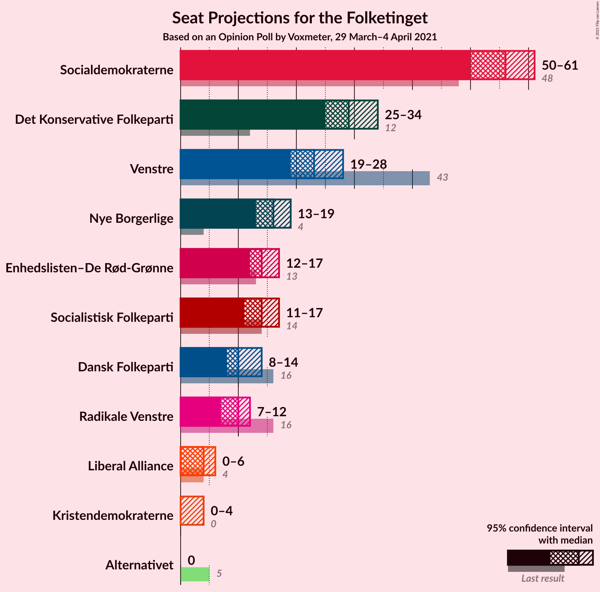
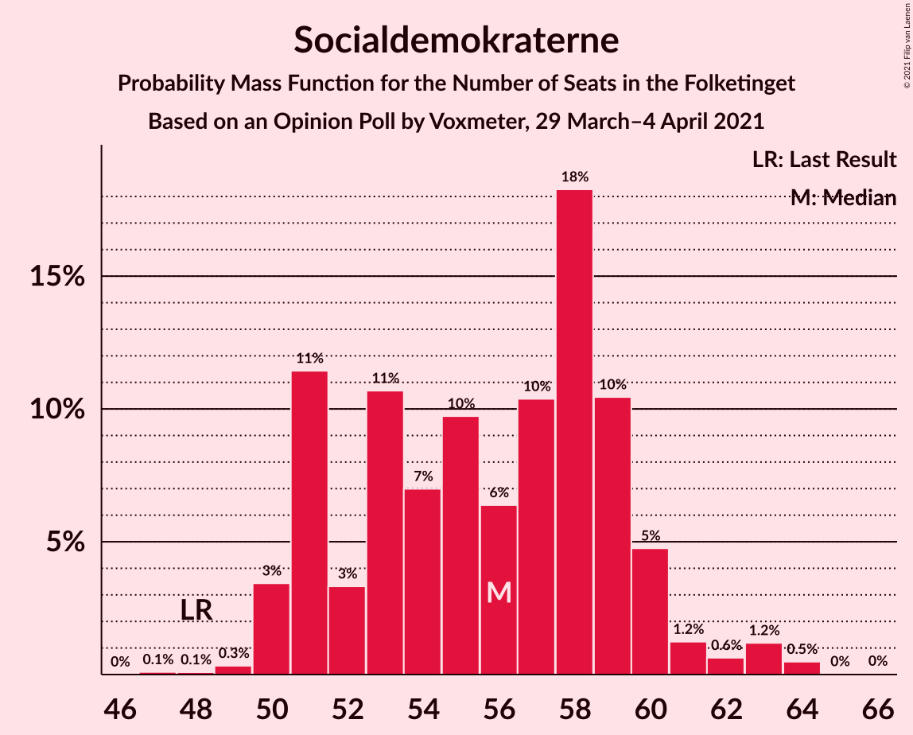
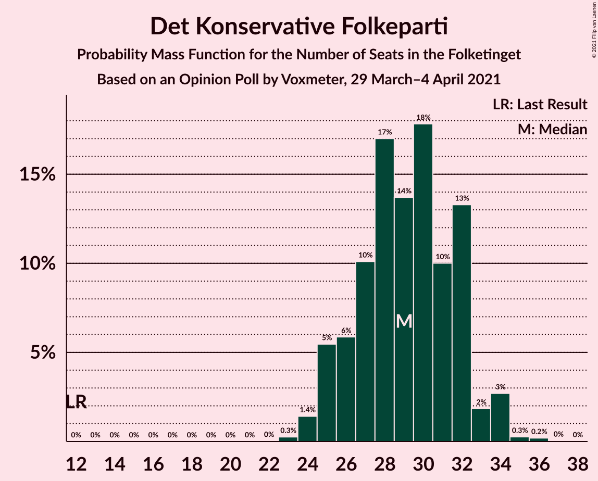
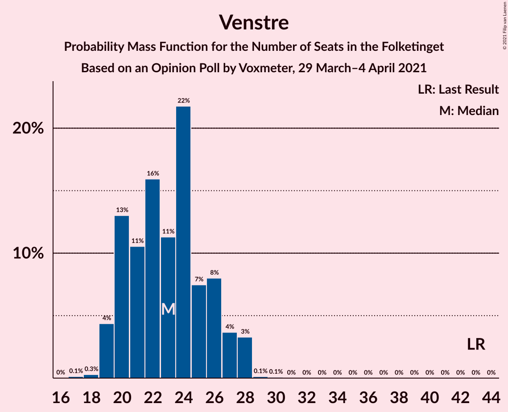
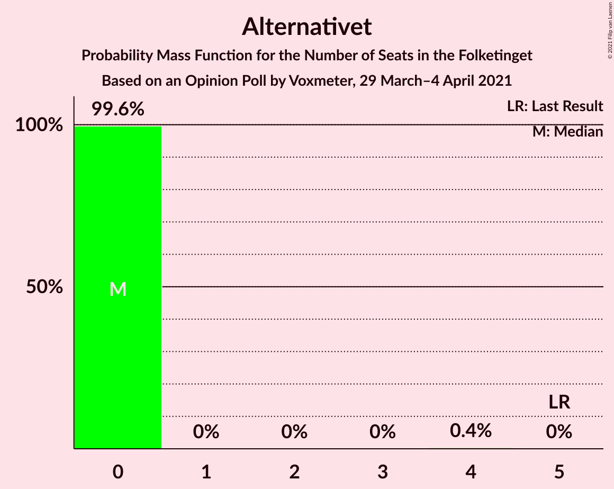
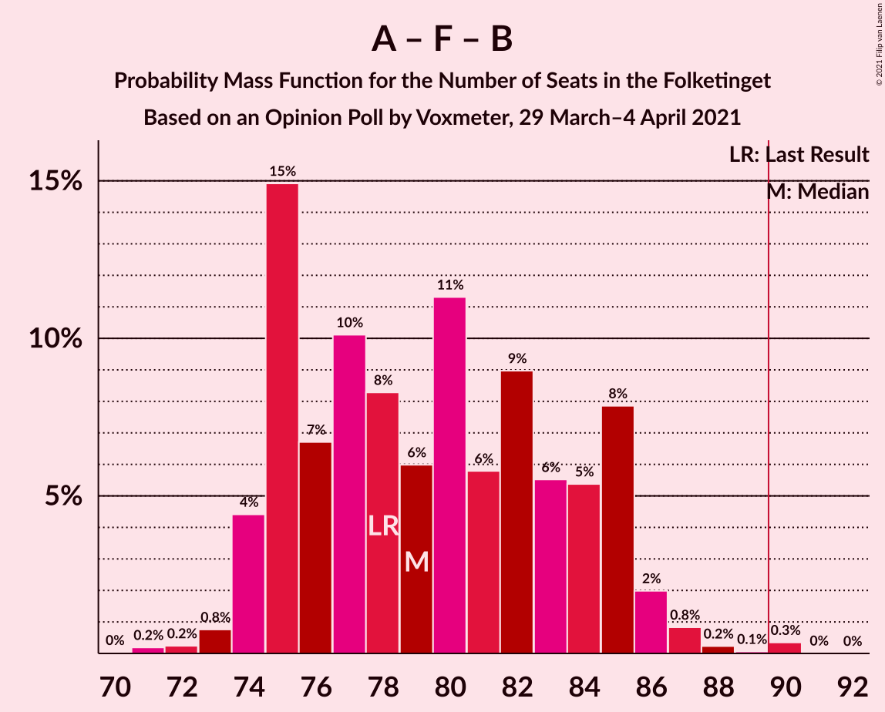

# Opinion Poll by Voxmeter, 29 March–4 April 2021

<a href="#voting-intentions">Voting Intentions</a> | <a href="#seats">Seats</a> | <a href="#coalitions">Coalitions</a> | <a href="#technical-information">Technical Information</a>

## Voting Intentions

### Confidence Intervals

| Party | Last Result | Poll Result | 80% Confidence Interval | 90% Confidence Interval | 95% Confidence Interval | 99% Confidence Interval |
|:-----:|:-----------:|:-----------:|:-----------------------:|:-----------------------:|:-----------------------:|:-----------------------:|
| Socialdemokraterne | 25.9% | 30.9% | 29.1–32.8% |28.6–33.4% |28.2–33.8% |27.3–34.8% |
| Det Konservative Folkeparti | 6.6% | 16.0% | 14.6–17.6% |14.2–18.0% |13.9–18.4% |13.2–19.1% |
| Venstre | 23.4% | 12.7% | 11.4–14.1% |11.1–14.5% |10.7–14.8% |10.2–15.6% |
| Nye Borgerlige | 2.4% | 8.7% | 7.7–10.0% |7.4–10.3% |7.1–10.6% |6.7–11.2% |
| Socialistisk Folkeparti | 7.7% | 7.8% | 6.8–8.9% |6.5–9.3% |6.3–9.6% |5.8–10.2% |
| Enhedslisten–De Rød-Grønne | 6.9% | 7.7% | 6.7–8.8% |6.4–9.2% |6.2–9.5% |5.7–10.0% |
| Dansk Folkeparti | 8.7% | 5.6% | 4.8–6.6% |4.5–6.9% |4.3–7.2% |4.0–7.7% |
| Radikale Venstre | 8.6% | 5.3% | 4.5–6.3% |4.3–6.6% |4.1–6.9% |3.7–7.4% |
| Liberal Alliance | 2.3% | 2.1% | 1.6–2.8% |1.5–3.0% |1.4–3.1% |1.2–3.5% |
| Kristendemokraterne | 1.7% | 1.3% | 0.9–1.9% |0.8–2.0% |0.7–2.2% |0.6–2.5% |
| Alternativet | 3.0% | 0.9% | 0.6–1.4% |0.5–1.5% |0.5–1.7% |0.4–2.0% |

*Note:* The poll result column reflects the actual value used in the calculations. Published results may vary slightly, and in addition be rounded to fewer digits.

## Seats

### Confidence Intervals

| Party | Last Result | Median | 80% Confidence Interval | 90% Confidence Interval | 95% Confidence Interval | 99% Confidence Interval |
|:-----:|:-----------:|:------:|:-----------------------:|:-----------------------:|:-----------------------:|:-----------------------:|
| <a href="#socialdemokraterne">Socialdemokraterne</a> | 48 | 56 | 51–59 |51–60 |50–61 |49–64 |
| <a href="#det-konservative-folkeparti">Det Konservative Folkeparti</a> | 12 | 29 | 26–32 |25–33 |25–34 |24–35 |
| <a href="#venstre">Venstre</a> | 43 | 23 | 20–26 |20–27 |19–28 |19–28 |
| <a href="#nye-borgerlige">Nye Borgerlige</a> | 4 | 16 | 14–18 |13–18 |13–19 |12–21 |
| <a href="#socialistisk-folkeparti">Socialistisk Folkeparti</a> | 14 | 14 | 12–16 |12–17 |11–17 |10–18 |
| <a href="#enhedslisten–de-rød-grønne">Enhedslisten–De Rød-Grønne</a> | 13 | 14 | 12–17 |12–17 |12–17 |10–18 |
| <a href="#dansk-folkeparti">Dansk Folkeparti</a> | 16 | 10 | 9–12 |8–13 |8–14 |7–14 |
| <a href="#radikale-venstre">Radikale Venstre</a> | 16 | 10 | 8–11 |7–12 |7–12 |7–14 |
| <a href="#liberal-alliance">Liberal Alliance</a> | 4 | 4 | 0–5 |0–6 |0–6 |0–7 |
| <a href="#kristendemokraterne">Kristendemokraterne</a> | 0 | 0 | 0 |0 |0–4 |0–4 |
| <a href="#alternativet">Alternativet</a> | 5 | 0 | 0 |0 |0 |0 |

### Socialdemokraterne

*For a full overview of the results for this party, see the [Socialdemokraterne](party-socialdemokraterne.html) page.*

| Number of Seats | Probability | Accumulated | Special Marks |
|:---------------:|:-----------:|:-----------:|:-------------:|
| 47 | 0.1% | 100% |  |
| 48 | 0.1% | 99.9% | Last Result |
| 49 | 0.3% | 99.8% |  |
| 50 | 3% | 99.5% |  |
| 51 | 11% | 96% |  |
| 52 | 3% | 85% |  |
| 53 | 11% | 81% |  |
| 54 | 7% | 71% |  |
| 55 | 10% | 64% |  |
| 56 | 6% | 54% | Median |
| 57 | 10% | 47% |  |
| 58 | 18% | 37% |  |
| 59 | 10% | 19% |  |
| 60 | 5% | 8% |  |
| 61 | 1.2% | 4% |  |
| 62 | 0.6% | 2% |  |
| 63 | 1.2% | 2% |  |
| 64 | 0.5% | 0.6% |  |
| 65 | 0% | 0.1% |  |
| 66 | 0% | 0% |  |

### Det Konservative Folkeparti

*For a full overview of the results for this party, see the [Det Konservative Folkeparti](party-detkonservativefolkeparti.html) page.*

| Number of Seats | Probability | Accumulated | Special Marks |
|:---------------:|:-----------:|:-----------:|:-------------:|
| 12 | 0% | 100% | Last Result |
| 13 | 0% | 100% |  |
| 14 | 0% | 100% |  |
| 15 | 0% | 100% |  |
| 16 | 0% | 100% |  |
| 17 | 0% | 100% |  |
| 18 | 0% | 100% |  |
| 19 | 0% | 100% |  |
| 20 | 0% | 100% |  |
| 21 | 0% | 100% |  |
| 22 | 0% | 100% |  |
| 23 | 0.3% | 100% |  |
| 24 | 1.4% | 99.7% |  |
| 25 | 5% | 98% |  |
| 26 | 6% | 93% |  |
| 27 | 10% | 87% |  |
| 28 | 17% | 77% |  |
| 29 | 14% | 60% | Median |
| 30 | 18% | 46% |  |
| 31 | 10% | 28% |  |
| 32 | 13% | 18% |  |
| 33 | 2% | 5% |  |
| 34 | 3% | 3% |  |
| 35 | 0.3% | 0.5% |  |
| 36 | 0.2% | 0.3% |  |
| 37 | 0% | 0.1% |  |
| 38 | 0% | 0% |  |

### Venstre

*For a full overview of the results for this party, see the [Venstre](party-venstre.html) page.*

| Number of Seats | Probability | Accumulated | Special Marks |
|:---------------:|:-----------:|:-----------:|:-------------:|
| 17 | 0.1% | 100% |  |
| 18 | 0.3% | 99.8% |  |
| 19 | 4% | 99.6% |  |
| 20 | 13% | 95% |  |
| 21 | 11% | 82% |  |
| 22 | 16% | 72% |  |
| 23 | 11% | 56% | Median |
| 24 | 22% | 44% |  |
| 25 | 7% | 23% |  |
| 26 | 8% | 15% |  |
| 27 | 4% | 7% |  |
| 28 | 3% | 3% |  |
| 29 | 0.1% | 0.2% |  |
| 30 | 0.1% | 0.1% |  |
| 31 | 0% | 0% |  |
| 32 | 0% | 0% |  |
| 33 | 0% | 0% |  |
| 34 | 0% | 0% |  |
| 35 | 0% | 0% |  |
| 36 | 0% | 0% |  |
| 37 | 0% | 0% |  |
| 38 | 0% | 0% |  |
| 39 | 0% | 0% |  |
| 40 | 0% | 0% |  |
| 41 | 0% | 0% |  |
| 42 | 0% | 0% |  |
| 43 | 0% | 0% | Last Result |

### Nye Borgerlige

*For a full overview of the results for this party, see the [Nye Borgerlige](party-nyeborgerlige.html) page.*

| Number of Seats | Probability | Accumulated | Special Marks |
|:---------------:|:-----------:|:-----------:|:-------------:|
| 4 | 0% | 100% | Last Result |
| 5 | 0% | 100% |  |
| 6 | 0% | 100% |  |
| 7 | 0% | 100% |  |
| 8 | 0% | 100% |  |
| 9 | 0% | 100% |  |
| 10 | 0% | 100% |  |
| 11 | 0.1% | 100% |  |
| 12 | 1.1% | 99.9% |  |
| 13 | 5% | 98.8% |  |
| 14 | 10% | 94% |  |
| 15 | 19% | 84% |  |
| 16 | 26% | 65% | Median |
| 17 | 18% | 39% |  |
| 18 | 18% | 21% |  |
| 19 | 1.3% | 3% |  |
| 20 | 0.7% | 1.4% |  |
| 21 | 0.4% | 0.7% |  |
| 22 | 0.4% | 0.4% |  |
| 23 | 0% | 0% |  |

### Socialistisk Folkeparti

*For a full overview of the results for this party, see the [Socialistisk Folkeparti](party-socialistiskfolkeparti.html) page.*

| Number of Seats | Probability | Accumulated | Special Marks |
|:---------------:|:-----------:|:-----------:|:-------------:|
| 10 | 0.5% | 100% |  |
| 11 | 4% | 99.5% |  |
| 12 | 17% | 95% |  |
| 13 | 23% | 78% |  |
| 14 | 18% | 55% | Last Result, Median |
| 15 | 8% | 37% |  |
| 16 | 23% | 29% |  |
| 17 | 5% | 6% |  |
| 18 | 1.0% | 1.2% |  |
| 19 | 0.1% | 0.2% |  |
| 20 | 0.1% | 0.1% |  |
| 21 | 0% | 0% |  |

### Enhedslisten–De Rød-Grønne

*For a full overview of the results for this party, see the [Enhedslisten–De Rød-Grønne](party-enhedslisten–derød-grønne.html) page.*

| Number of Seats | Probability | Accumulated | Special Marks |
|:---------------:|:-----------:|:-----------:|:-------------:|
| 10 | 0.5% | 100% |  |
| 11 | 1.4% | 99.5% |  |
| 12 | 25% | 98% |  |
| 13 | 17% | 73% | Last Result |
| 14 | 15% | 56% | Median |
| 15 | 16% | 42% |  |
| 16 | 10% | 26% |  |
| 17 | 15% | 16% |  |
| 18 | 0.9% | 1.0% |  |
| 19 | 0.1% | 0.2% |  |
| 20 | 0% | 0% |  |

### Dansk Folkeparti

*For a full overview of the results for this party, see the [Dansk Folkeparti](party-danskfolkeparti.html) page.*

| Number of Seats | Probability | Accumulated | Special Marks |
|:---------------:|:-----------:|:-----------:|:-------------:|
| 6 | 0.1% | 100% |  |
| 7 | 0.9% | 99.9% |  |
| 8 | 8% | 99.0% |  |
| 9 | 22% | 92% |  |
| 10 | 31% | 70% | Median |
| 11 | 22% | 39% |  |
| 12 | 7% | 17% |  |
| 13 | 5% | 10% |  |
| 14 | 4% | 4% |  |
| 15 | 0.3% | 0.3% |  |
| 16 | 0% | 0% | Last Result |

### Radikale Venstre

*For a full overview of the results for this party, see the [Radikale Venstre](party-radikalevenstre.html) page.*

| Number of Seats | Probability | Accumulated | Special Marks |
|:---------------:|:-----------:|:-----------:|:-------------:|
| 6 | 0.4% | 100% |  |
| 7 | 6% | 99.6% |  |
| 8 | 18% | 94% |  |
| 9 | 23% | 77% |  |
| 10 | 26% | 54% | Median |
| 11 | 18% | 28% |  |
| 12 | 8% | 10% |  |
| 13 | 2% | 2% |  |
| 14 | 0.5% | 0.5% |  |
| 15 | 0% | 0% |  |
| 16 | 0% | 0% | Last Result |

### Liberal Alliance

*For a full overview of the results for this party, see the [Liberal Alliance](party-liberalalliance.html) page.*

| Number of Seats | Probability | Accumulated | Special Marks |
|:---------------:|:-----------:|:-----------:|:-------------:|
| 0 | 43% | 100% |  |
| 1 | 0% | 57% |  |
| 2 | 0% | 57% |  |
| 3 | 0.1% | 57% |  |
| 4 | 28% | 57% | Last Result, Median |
| 5 | 20% | 29% |  |
| 6 | 8% | 9% |  |
| 7 | 1.2% | 1.2% |  |
| 8 | 0% | 0% |  |

### Kristendemokraterne

*For a full overview of the results for this party, see the [Kristendemokraterne](party-kristendemokraterne.html) page.*

| Number of Seats | Probability | Accumulated | Special Marks |
|:---------------:|:-----------:|:-----------:|:-------------:|
| 0 | 97% | 100% | Last Result, Median |
| 1 | 0% | 3% |  |
| 2 | 0% | 3% |  |
| 3 | 0% | 3% |  |
| 4 | 3% | 3% |  |
| 5 | 0.4% | 0.4% |  |
| 6 | 0% | 0% |  |

### Alternativet

*For a full overview of the results for this party, see the [Alternativet](party-alternativet.html) page.*

| Number of Seats | Probability | Accumulated | Special Marks |
|:---------------:|:-----------:|:-----------:|:-------------:|
| 0 | 99.6% | 100% | Median |
| 1 | 0% | 0.4% |  |
| 2 | 0% | 0.4% |  |
| 3 | 0% | 0.4% |  |
| 4 | 0.4% | 0.4% |  |
| 5 | 0% | 0% | Last Result |

## Coalitions

### Confidence Intervals

| Coalition | Last Result | Median | Majority? | 80% Confidence Interval | 90% Confidence Interval | 95% Confidence Interval | 99% Confidence Interval |
|:---------:|:-----------:|:------:|:---------:|:-----------------------:|:-----------------------:|:-----------------------:|:-----------------------:|
| Socialdemokraterne – Socialistisk Folkeparti – Enhedslisten–De Rød-Grønne – Radikale Venstre – Alternativet | 96 | 94 | 75% | 88–99 | 88–99 | 87–100 | 86–103 |
| Socialdemokraterne – Socialistisk Folkeparti – Enhedslisten–De Rød-Grønne – Radikale Venstre | 91 | 94 | 75% | 88–99 | 88–99 | 87–100 | 86–103 |
| Socialdemokraterne – Socialistisk Folkeparti – Enhedslisten–De Rød-Grønne – Alternativet | 80 | 85 | 5% | 78–88 | 78–89 | 76–90 | 76–93 |
| Socialdemokraterne – Socialistisk Folkeparti – Enhedslisten–De Rød-Grønne | 75 | 85 | 5% | 78–88 | 78–89 | 76–90 | 76–93 |
| Det Konservative Folkeparti – Venstre – Nye Borgerlige – Dansk Folkeparti – Liberal Alliance – Kristendemokraterne | 79 | 81 | 0.2% | 76–87 | 76–87 | 75–88 | 72–89 |
| Det Konservative Folkeparti – Venstre – Nye Borgerlige – Dansk Folkeparti – Liberal Alliance | 79 | 81 | 0.1% | 76–87 | 76–87 | 74–88 | 72–89 |
| Socialdemokraterne – Socialistisk Folkeparti – Radikale Venstre | 78 | 79 | 0.4% | 75–85 | 74–85 | 74–86 | 73–88 |
| Det Konservative Folkeparti – Venstre – Dansk Folkeparti – Liberal Alliance – Kristendemokraterne | 75 | 65 | 0% | 60–71 | 59–72 | 58–72 | 58–73 |
| Det Konservative Folkeparti – Venstre – Dansk Folkeparti – Liberal Alliance | 75 | 65 | 0% | 60–71 | 59–72 | 58–72 | 58–73 |
| Socialdemokraterne – Radikale Venstre | 64 | 65 | 0% | 60–70 | 59–70 | 59–71 | 59–74 |
| Det Konservative Folkeparti – Venstre – Liberal Alliance | 59 | 55 | 0% | 50–60 | 49–61 | 48–62 | 47–63 |
| Det Konservative Folkeparti – Venstre | 55 | 52 | 0% | 48–56 | 47–57 | 47–58 | 45–59 |
| Venstre | 43 | 23 | 0% | 20–26 | 20–27 | 19–28 | 19–28 |

### Socialdemokraterne – Socialistisk Folkeparti – Enhedslisten–De Rød-Grønne – Radikale Venstre – Alternativet

| Number of Seats | Probability | Accumulated | Special Marks |
|:---------------:|:-----------:|:-----------:|:-------------:|
| 84 | 0.1% | 100% |  |
| 85 | 0.1% | 99.9% |  |
| 86 | 0.7% | 99.8% |  |
| 87 | 3% | 99.1% |  |
| 88 | 10% | 96% |  |
| 89 | 10% | 86% |  |
| 90 | 5% | 75% | Majority |
| 91 | 4% | 70% |  |
| 92 | 5% | 66% |  |
| 93 | 7% | 61% |  |
| 94 | 11% | 54% | Median |
| 95 | 7% | 43% |  |
| 96 | 9% | 37% | Last Result |
| 97 | 13% | 27% |  |
| 98 | 4% | 14% |  |
| 99 | 6% | 10% |  |
| 100 | 2% | 4% |  |
| 101 | 1.4% | 2% |  |
| 102 | 0.2% | 0.7% |  |
| 103 | 0.2% | 0.6% |  |
| 104 | 0.3% | 0.4% |  |
| 105 | 0% | 0% |  |

### Socialdemokraterne – Socialistisk Folkeparti – Enhedslisten–De Rød-Grønne – Radikale Venstre

| Number of Seats | Probability | Accumulated | Special Marks |
|:---------------:|:-----------:|:-----------:|:-------------:|
| 84 | 0.1% | 100% |  |
| 85 | 0.1% | 99.9% |  |
| 86 | 0.7% | 99.8% |  |
| 87 | 3% | 99.1% |  |
| 88 | 10% | 96% |  |
| 89 | 10% | 86% |  |
| 90 | 5% | 75% | Majority |
| 91 | 4% | 70% | Last Result |
| 92 | 5% | 66% |  |
| 93 | 7% | 61% |  |
| 94 | 11% | 54% | Median |
| 95 | 7% | 43% |  |
| 96 | 9% | 36% |  |
| 97 | 13% | 27% |  |
| 98 | 4% | 14% |  |
| 99 | 6% | 10% |  |
| 100 | 2% | 4% |  |
| 101 | 1.4% | 2% |  |
| 102 | 0.2% | 0.7% |  |
| 103 | 0.2% | 0.6% |  |
| 104 | 0.3% | 0.4% |  |
| 105 | 0% | 0% |  |

### Socialdemokraterne – Socialistisk Folkeparti – Enhedslisten–De Rød-Grønne – Alternativet

| Number of Seats | Probability | Accumulated | Special Marks |
|:---------------:|:-----------:|:-----------:|:-------------:|
| 75 | 0.1% | 100% |  |
| 76 | 2% | 99.9% |  |
| 77 | 0.8% | 97% |  |
| 78 | 7% | 97% |  |
| 79 | 5% | 90% |  |
| 80 | 5% | 85% | Last Result |
| 81 | 11% | 80% |  |
| 82 | 4% | 70% |  |
| 83 | 9% | 65% |  |
| 84 | 6% | 56% | Median |
| 85 | 12% | 50% |  |
| 86 | 12% | 38% |  |
| 87 | 12% | 26% |  |
| 88 | 8% | 14% |  |
| 89 | 2% | 6% |  |
| 90 | 2% | 5% | Majority |
| 91 | 1.4% | 2% |  |
| 92 | 0.4% | 0.9% |  |
| 93 | 0.1% | 0.5% |  |
| 94 | 0.3% | 0.4% |  |
| 95 | 0% | 0.1% |  |
| 96 | 0% | 0% |  |

### Socialdemokraterne – Socialistisk Folkeparti – Enhedslisten–De Rød-Grønne

| Number of Seats | Probability | Accumulated | Special Marks |
|:---------------:|:-----------:|:-----------:|:-------------:|
| 75 | 0.1% | 100% | Last Result |
| 76 | 2% | 99.9% |  |
| 77 | 0.9% | 97% |  |
| 78 | 7% | 97% |  |
| 79 | 5% | 90% |  |
| 80 | 5% | 85% |  |
| 81 | 11% | 80% |  |
| 82 | 4% | 69% |  |
| 83 | 9% | 65% |  |
| 84 | 6% | 56% | Median |
| 85 | 12% | 50% |  |
| 86 | 12% | 38% |  |
| 87 | 12% | 25% |  |
| 88 | 8% | 14% |  |
| 89 | 2% | 6% |  |
| 90 | 2% | 5% | Majority |
| 91 | 1.4% | 2% |  |
| 92 | 0.4% | 0.9% |  |
| 93 | 0.1% | 0.5% |  |
| 94 | 0.3% | 0.4% |  |
| 95 | 0% | 0.1% |  |
| 96 | 0% | 0% |  |

### Det Konservative Folkeparti – Venstre – Nye Borgerlige – Dansk Folkeparti – Liberal Alliance – Kristendemokraterne

| Number of Seats | Probability | Accumulated | Special Marks |
|:---------------:|:-----------:|:-----------:|:-------------:|
| 71 | 0.4% | 100% |  |
| 72 | 0.2% | 99.6% |  |
| 73 | 0.2% | 99.4% |  |
| 74 | 2% | 99.2% |  |
| 75 | 2% | 98% |  |
| 76 | 6% | 96% |  |
| 77 | 4% | 89% |  |
| 78 | 13% | 85% |  |
| 79 | 10% | 72% | Last Result |
| 80 | 7% | 62% |  |
| 81 | 11% | 55% |  |
| 82 | 7% | 44% | Median |
| 83 | 6% | 37% |  |
| 84 | 4% | 31% |  |
| 85 | 4% | 27% |  |
| 86 | 10% | 22% |  |
| 87 | 8% | 12% |  |
| 88 | 3% | 4% |  |
| 89 | 0.7% | 0.9% |  |
| 90 | 0.1% | 0.2% | Majority |
| 91 | 0.1% | 0.1% |  |
| 92 | 0% | 0% |  |

### Det Konservative Folkeparti – Venstre – Nye Borgerlige – Dansk Folkeparti – Liberal Alliance

| Number of Seats | Probability | Accumulated | Special Marks |
|:---------------:|:-----------:|:-----------:|:-------------:|
| 70 | 0% | 100% |  |
| 71 | 0.4% | 99.9% |  |
| 72 | 0.2% | 99.6% |  |
| 73 | 0.5% | 99.3% |  |
| 74 | 2% | 98.8% |  |
| 75 | 2% | 97% |  |
| 76 | 7% | 95% |  |
| 77 | 4% | 88% |  |
| 78 | 13% | 84% |  |
| 79 | 10% | 71% | Last Result |
| 80 | 7% | 61% |  |
| 81 | 12% | 54% |  |
| 82 | 7% | 43% | Median |
| 83 | 6% | 36% |  |
| 84 | 4% | 30% |  |
| 85 | 4% | 25% |  |
| 86 | 10% | 22% |  |
| 87 | 8% | 11% |  |
| 88 | 3% | 3% |  |
| 89 | 0.7% | 0.8% |  |
| 90 | 0% | 0.1% | Majority |
| 91 | 0.1% | 0.1% |  |
| 92 | 0% | 0% |  |

### Socialdemokraterne – Socialistisk Folkeparti – Radikale Venstre

| Number of Seats | Probability | Accumulated | Special Marks |
|:---------------:|:-----------:|:-----------:|:-------------:|
| 70 | 0% | 100% |  |
| 71 | 0.2% | 99.9% |  |
| 72 | 0.2% | 99.7% |  |
| 73 | 0.8% | 99.5% |  |
| 74 | 4% | 98.7% |  |
| 75 | 15% | 94% |  |
| 76 | 7% | 79% |  |
| 77 | 10% | 73% |  |
| 78 | 8% | 63% | Last Result |
| 79 | 6% | 54% |  |
| 80 | 11% | 48% | Median |
| 81 | 6% | 37% |  |
| 82 | 9% | 31% |  |
| 83 | 6% | 22% |  |
| 84 | 5% | 17% |  |
| 85 | 8% | 11% |  |
| 86 | 2% | 3% |  |
| 87 | 0.8% | 1.5% |  |
| 88 | 0.2% | 0.7% |  |
| 89 | 0.1% | 0.4% |  |
| 90 | 0.3% | 0.4% | Majority |
| 91 | 0% | 0% |  |

### Det Konservative Folkeparti – Venstre – Dansk Folkeparti – Liberal Alliance – Kristendemokraterne

| Number of Seats | Probability | Accumulated | Special Marks |
|:---------------:|:-----------:|:-----------:|:-------------:|
| 55 | 0% | 100% |  |
| 56 | 0.1% | 99.9% |  |
| 57 | 0.1% | 99.8% |  |
| 58 | 4% | 99.7% |  |
| 59 | 4% | 96% |  |
| 60 | 6% | 92% |  |
| 61 | 12% | 86% |  |
| 62 | 7% | 75% |  |
| 63 | 4% | 67% |  |
| 64 | 4% | 63% |  |
| 65 | 10% | 59% |  |
| 66 | 9% | 48% | Median |
| 67 | 8% | 40% |  |
| 68 | 5% | 31% |  |
| 69 | 3% | 26% |  |
| 70 | 11% | 23% |  |
| 71 | 7% | 12% |  |
| 72 | 4% | 5% |  |
| 73 | 0.5% | 0.9% |  |
| 74 | 0.3% | 0.4% |  |
| 75 | 0.1% | 0.1% | Last Result |
| 76 | 0% | 0% |  |

### Det Konservative Folkeparti – Venstre – Dansk Folkeparti – Liberal Alliance

| Number of Seats | Probability | Accumulated | Special Marks |
|:---------------:|:-----------:|:-----------:|:-------------:|
| 55 | 0.1% | 100% |  |
| 56 | 0.1% | 99.9% |  |
| 57 | 0.1% | 99.8% |  |
| 58 | 4% | 99.6% |  |
| 59 | 4% | 96% |  |
| 60 | 6% | 92% |  |
| 61 | 12% | 86% |  |
| 62 | 8% | 74% |  |
| 63 | 4% | 66% |  |
| 64 | 4% | 62% |  |
| 65 | 10% | 58% |  |
| 66 | 9% | 47% | Median |
| 67 | 9% | 39% |  |
| 68 | 5% | 30% |  |
| 69 | 3% | 25% |  |
| 70 | 11% | 22% |  |
| 71 | 6% | 11% |  |
| 72 | 4% | 5% |  |
| 73 | 0.5% | 0.7% |  |
| 74 | 0.2% | 0.2% |  |
| 75 | 0% | 0.1% | Last Result |
| 76 | 0% | 0% |  |

### Socialdemokraterne – Radikale Venstre

| Number of Seats | Probability | Accumulated | Special Marks |
|:---------------:|:-----------:|:-----------:|:-------------:|
| 56 | 0% | 100% |  |
| 57 | 0.1% | 99.9% |  |
| 58 | 0.2% | 99.8% |  |
| 59 | 8% | 99.6% |  |
| 60 | 3% | 92% |  |
| 61 | 7% | 89% |  |
| 62 | 4% | 81% |  |
| 63 | 9% | 77% |  |
| 64 | 13% | 68% | Last Result |
| 65 | 7% | 55% |  |
| 66 | 5% | 49% | Median |
| 67 | 8% | 43% |  |
| 68 | 11% | 35% |  |
| 69 | 14% | 25% |  |
| 70 | 6% | 10% |  |
| 71 | 2% | 4% |  |
| 72 | 0.6% | 2% |  |
| 73 | 0.5% | 2% |  |
| 74 | 1.0% | 1.1% |  |
| 75 | 0% | 0.1% |  |
| 76 | 0% | 0.1% |  |
| 77 | 0% | 0% |  |

### Det Konservative Folkeparti – Venstre – Liberal Alliance

| Number of Seats | Probability | Accumulated | Special Marks |
|:---------------:|:-----------:|:-----------:|:-------------:|
| 45 | 0.1% | 100% |  |
| 46 | 0.3% | 99.9% |  |
| 47 | 0.8% | 99.6% |  |
| 48 | 2% | 98.8% |  |
| 49 | 7% | 97% |  |
| 50 | 9% | 90% |  |
| 51 | 10% | 81% |  |
| 52 | 9% | 72% |  |
| 53 | 5% | 63% |  |
| 54 | 5% | 58% |  |
| 55 | 7% | 54% |  |
| 56 | 11% | 47% | Median |
| 57 | 4% | 36% |  |
| 58 | 6% | 32% |  |
| 59 | 11% | 26% | Last Result |
| 60 | 5% | 14% |  |
| 61 | 6% | 10% |  |
| 62 | 3% | 3% |  |
| 63 | 0.6% | 0.7% |  |
| 64 | 0.1% | 0.1% |  |
| 65 | 0% | 0% |  |

### Det Konservative Folkeparti – Venstre

| Number of Seats | Probability | Accumulated | Special Marks |
|:---------------:|:-----------:|:-----------:|:-------------:|
| 43 | 0% | 100% |  |
| 44 | 0.2% | 99.9% |  |
| 45 | 0.4% | 99.8% |  |
| 46 | 1.4% | 99.4% |  |
| 47 | 5% | 98% |  |
| 48 | 4% | 93% |  |
| 49 | 8% | 89% |  |
| 50 | 13% | 80% |  |
| 51 | 12% | 68% |  |
| 52 | 16% | 56% | Median |
| 53 | 3% | 41% |  |
| 54 | 12% | 38% |  |
| 55 | 14% | 26% | Last Result |
| 56 | 4% | 12% |  |
| 57 | 3% | 8% |  |
| 58 | 4% | 5% |  |
| 59 | 0.6% | 0.8% |  |
| 60 | 0.1% | 0.2% |  |
| 61 | 0.1% | 0.1% |  |
| 62 | 0% | 0% |  |

### Venstre

| Number of Seats | Probability | Accumulated | Special Marks |
|:---------------:|:-----------:|:-----------:|:-------------:|
| 17 | 0.1% | 100% |  |
| 18 | 0.3% | 99.8% |  |
| 19 | 4% | 99.6% |  |
| 20 | 13% | 95% |  |
| 21 | 11% | 82% |  |
| 22 | 16% | 72% |  |
| 23 | 11% | 56% | Median |
| 24 | 22% | 44% |  |
| 25 | 7% | 23% |  |
| 26 | 8% | 15% |  |
| 27 | 4% | 7% |  |
| 28 | 3% | 3% |  |
| 29 | 0.1% | 0.2% |  |
| 30 | 0.1% | 0.1% |  |
| 31 | 0% | 0% |  |
| 32 | 0% | 0% |  |
| 33 | 0% | 0% |  |
| 34 | 0% | 0% |  |
| 35 | 0% | 0% |  |
| 36 | 0% | 0% |  |
| 37 | 0% | 0% |  |
| 38 | 0% | 0% |  |
| 39 | 0% | 0% |  |
| 40 | 0% | 0% |  |
| 41 | 0% | 0% |  |
| 42 | 0% | 0% |  |
| 43 | 0% | 0% | Last Result |

## Technical Information

### Opinion Poll

+ **Polling firm:** Voxmeter
+ **Commissioner(s):** —
+ **Fieldwork period:** 29 March–4 April 2021

### Calculations

+ **Sample size:** 1019
+ **Simulations done:** 1,048,576
+ **Error estimate:** 1.59%

