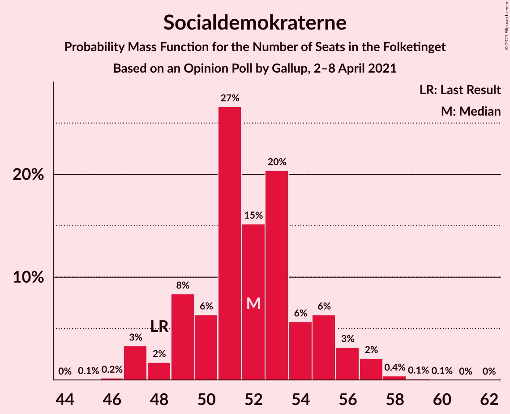
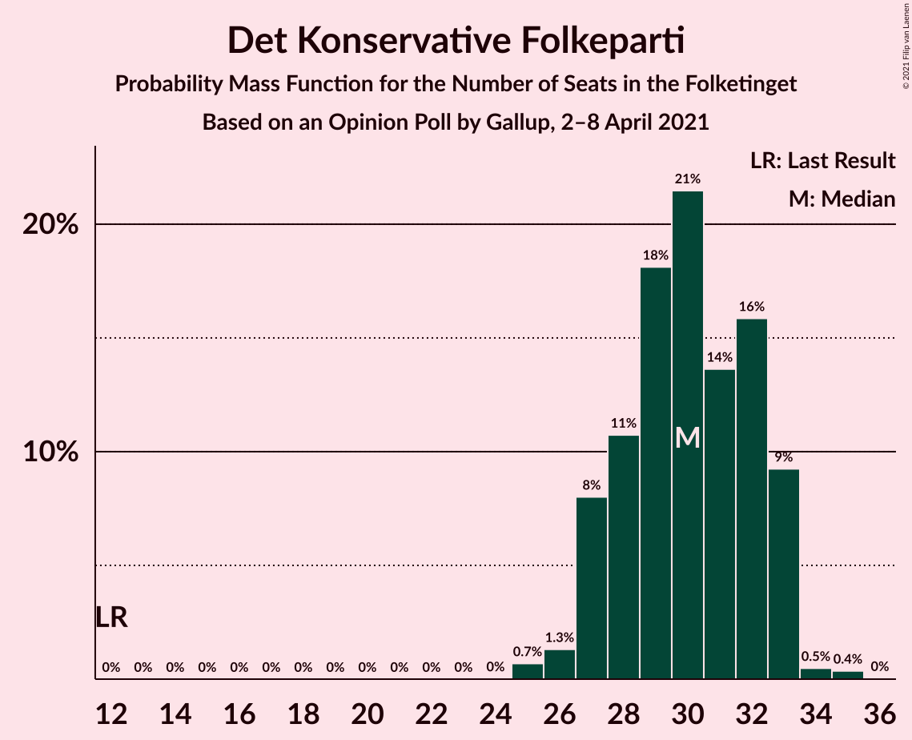
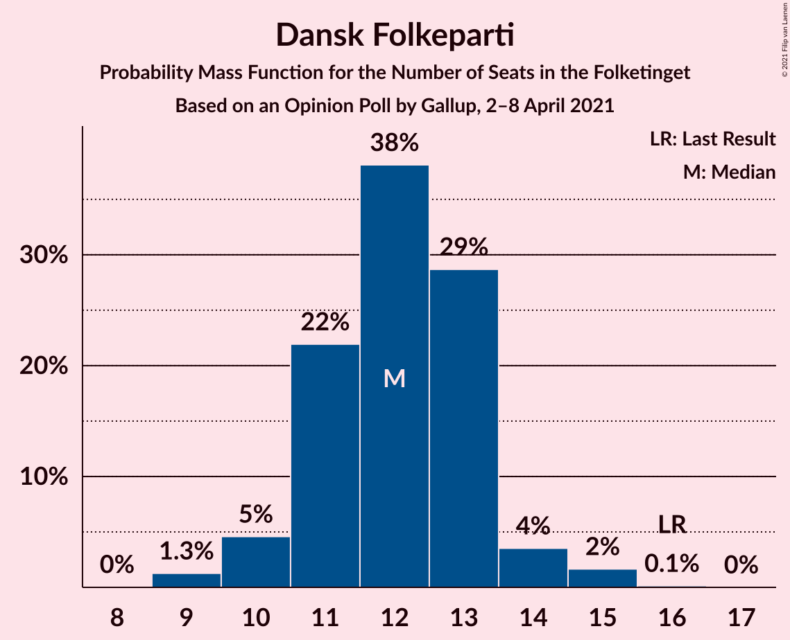
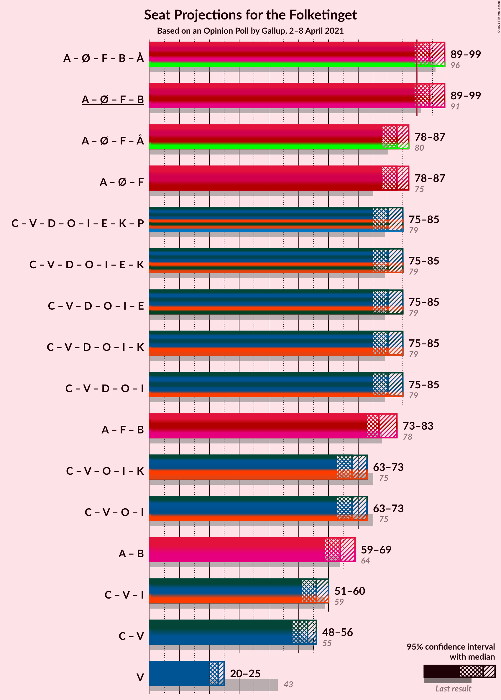
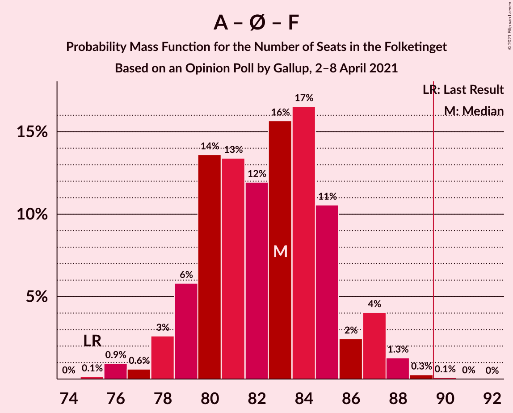
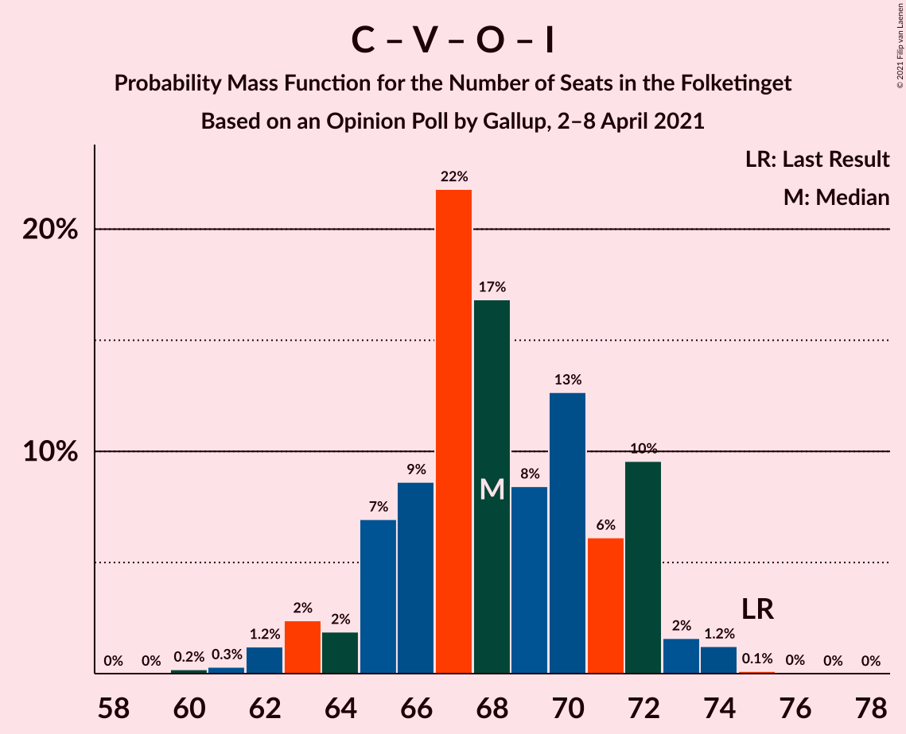
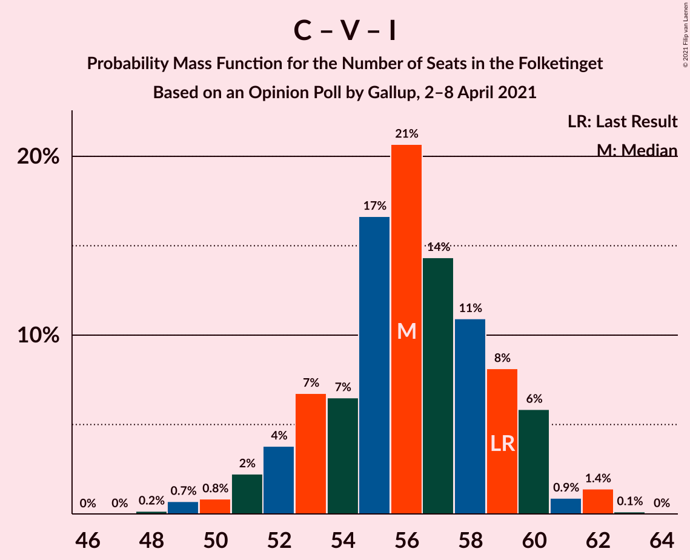
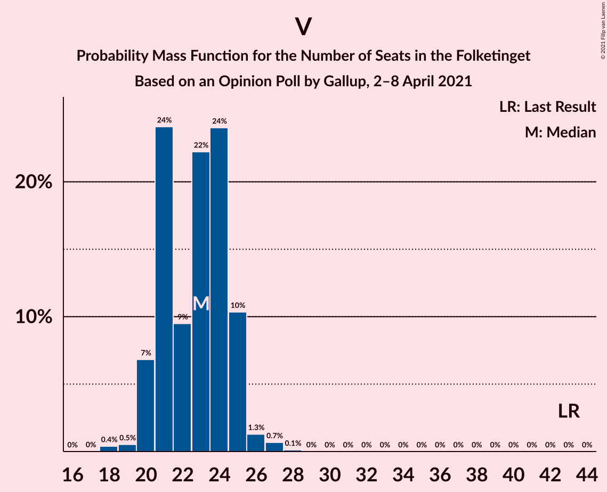

# Opinion Poll by Gallup, 2–8 April 2021

<a href="#voting-intentions">Voting Intentions</a> | <a href="#seats">Seats</a> | <a href="#coalitions">Coalitions</a> | <a href="#technical-information">Technical Information</a>

## Voting Intentions

### Confidence Intervals

| Party | Last Result | Poll Result | 80% Confidence Interval | 90% Confidence Interval | 95% Confidence Interval | 99% Confidence Interval |
|:-----:|:-----------:|:-----------:|:-----------------------:|:-----------------------:|:-----------------------:|:-----------------------:|
| Socialdemokraterne | 25.9% | 29.3% | 27.9–30.8% |27.5–31.2% |27.2–31.6% |26.6–32.3% |
| Det Konservative Folkeparti | 6.6% | 16.7% | 15.6–17.9% |15.3–18.3% |15.0–18.6% |14.5–19.2% |
| Venstre | 23.4% | 12.6% | 11.6–13.7% |11.3–14.0% |11.1–14.3% |10.7–14.8% |
| Enhedslisten–De Rød-Grønne | 6.9% | 9.1% | 8.3–10.1% |8.0–10.4% |7.8–10.6% |7.5–11.1% |
| Socialistisk Folkeparti | 7.7% | 7.8% | 7.0–8.7% |6.8–8.9% |6.6–9.2% |6.2–9.6% |
| Nye Borgerlige | 2.4% | 6.8% | 6.1–7.6% |5.8–7.9% |5.7–8.1% |5.3–8.5% |
| Dansk Folkeparti | 8.7% | 6.7% | 6.0–7.6% |5.8–7.8% |5.6–8.0% |5.3–8.4% |
| Radikale Venstre | 8.6% | 6.5% | 5.8–7.3% |5.6–7.5% |5.4–7.8% |5.1–8.2% |
| Liberal Alliance | 2.3% | 2.3% | 1.9–2.8% |1.8–3.0% |1.7–3.1% |1.5–3.4% |
| Alternativet | 3.0% | 0.4% | 0.3–0.7% |0.2–0.8% |0.2–0.9% |0.1–1.0% |

*Note:* The poll result column reflects the actual value used in the calculations. Published results may vary slightly, and in addition be rounded to fewer digits.

## Seats

### Confidence Intervals

| Party | Last Result | Median | 80% Confidence Interval | 90% Confidence Interval | 95% Confidence Interval | 99% Confidence Interval |
|:-----:|:-----------:|:------:|:-----------------------:|:-----------------------:|:-----------------------:|:-----------------------:|
| <a href="#socialdemokraterne">Socialdemokraterne</a> | 48 | 51 | 49–56 |48–56 |48–56 |47–57 |
| <a href="#det-konservative-folkeparti">Det Konservative Folkeparti</a> | 12 | 29 | 28–33 |27–33 |26–33 |25–33 |
| <a href="#venstre">Venstre</a> | 43 | 23 | 20–24 |20–25 |20–27 |18–27 |
| <a href="#enhedslisten–de-rød-grønne">Enhedslisten–De Rød-Grønne</a> | 13 | 16 | 14–18 |14–18 |14–18 |14–19 |
| <a href="#socialistisk-folkeparti">Socialistisk Folkeparti</a> | 14 | 14 | 12–16 |12–16 |11–16 |11–17 |
| <a href="#nye-borgerlige">Nye Borgerlige</a> | 4 | 12 | 11–13 |11–14 |11–14 |9–15 |
| <a href="#dansk-folkeparti">Dansk Folkeparti</a> | 16 | 12 | 10–14 |10–14 |9–15 |9–15 |
| <a href="#radikale-venstre">Radikale Venstre</a> | 16 | 13 | 10–13 |9–13 |9–14 |9–14 |
| <a href="#liberal-alliance">Liberal Alliance</a> | 4 | 4 | 0–5 |0–6 |0–6 |0–6 |
| <a href="#alternativet">Alternativet</a> | 5 | 0 | 0 |0 |0 |0 |

### Socialdemokraterne

*For a full overview of the results for this party, see the [Socialdemokraterne](party-socialdemokraterne.html) page.*

| Number of Seats | Probability | Accumulated | Special Marks |
|:---------------:|:-----------:|:-----------:|:-------------:|
| 46 | 0.2% | 100% |  |
| 47 | 0.9% | 99.7% |  |
| 48 | 4% | 98.8% | Last Result |
| 49 | 18% | 95% |  |
| 50 | 23% | 76% |  |
| 51 | 5% | 54% | Median |
| 52 | 6% | 48% |  |
| 53 | 7% | 42% |  |
| 54 | 8% | 35% |  |
| 55 | 13% | 27% |  |
| 56 | 12% | 14% |  |
| 57 | 2% | 2% |  |
| 58 | 0.1% | 0.4% |  |
| 59 | 0.3% | 0.3% |  |
| 60 | 0% | 0% |  |

### Det Konservative Folkeparti

*For a full overview of the results for this party, see the [Det Konservative Folkeparti](party-detkonservativefolkeparti.html) page.*

| Number of Seats | Probability | Accumulated | Special Marks |
|:---------------:|:-----------:|:-----------:|:-------------:|
| 12 | 0% | 100% | Last Result |
| 13 | 0% | 100% |  |
| 14 | 0% | 100% |  |
| 15 | 0% | 100% |  |
| 16 | 0% | 100% |  |
| 17 | 0% | 100% |  |
| 18 | 0% | 100% |  |
| 19 | 0% | 100% |  |
| 20 | 0% | 100% |  |
| 21 | 0% | 100% |  |
| 22 | 0% | 100% |  |
| 23 | 0% | 100% |  |
| 24 | 0% | 100% |  |
| 25 | 1.1% | 100% |  |
| 26 | 2% | 98.9% |  |
| 27 | 6% | 97% |  |
| 28 | 14% | 91% |  |
| 29 | 31% | 77% | Median |
| 30 | 5% | 46% |  |
| 31 | 13% | 41% |  |
| 32 | 7% | 27% |  |
| 33 | 20% | 20% |  |
| 34 | 0.2% | 0.3% |  |
| 35 | 0% | 0.1% |  |
| 36 | 0.1% | 0.1% |  |
| 37 | 0% | 0% |  |

### Venstre

*For a full overview of the results for this party, see the [Venstre](party-venstre.html) page.*

| Number of Seats | Probability | Accumulated | Special Marks |
|:---------------:|:-----------:|:-----------:|:-------------:|
| 18 | 1.3% | 100% |  |
| 19 | 0.9% | 98.7% |  |
| 20 | 8% | 98% |  |
| 21 | 12% | 90% |  |
| 22 | 12% | 77% |  |
| 23 | 34% | 65% | Median |
| 24 | 21% | 31% |  |
| 25 | 5% | 10% |  |
| 26 | 1.3% | 5% |  |
| 27 | 3% | 3% |  |
| 28 | 0% | 0% |  |
| 29 | 0% | 0% |  |
| 30 | 0% | 0% |  |
| 31 | 0% | 0% |  |
| 32 | 0% | 0% |  |
| 33 | 0% | 0% |  |
| 34 | 0% | 0% |  |
| 35 | 0% | 0% |  |
| 36 | 0% | 0% |  |
| 37 | 0% | 0% |  |
| 38 | 0% | 0% |  |
| 39 | 0% | 0% |  |
| 40 | 0% | 0% |  |
| 41 | 0% | 0% |  |
| 42 | 0% | 0% |  |
| 43 | 0% | 0% | Last Result |

### Enhedslisten–De Rød-Grønne

*For a full overview of the results for this party, see the [Enhedslisten–De Rød-Grønne](party-enhedslisten–derød-grønne.html) page.*

| Number of Seats | Probability | Accumulated | Special Marks |
|:---------------:|:-----------:|:-----------:|:-------------:|
| 12 | 0.1% | 100% |  |
| 13 | 0.1% | 99.9% | Last Result |
| 14 | 16% | 99.8% |  |
| 15 | 12% | 84% |  |
| 16 | 25% | 72% | Median |
| 17 | 34% | 47% |  |
| 18 | 11% | 13% |  |
| 19 | 2% | 2% |  |
| 20 | 0.3% | 0.4% |  |
| 21 | 0% | 0% |  |

### Socialistisk Folkeparti

*For a full overview of the results for this party, see the [Socialistisk Folkeparti](party-socialistiskfolkeparti.html) page.*

| Number of Seats | Probability | Accumulated | Special Marks |
|:---------------:|:-----------:|:-----------:|:-------------:|
| 10 | 0.4% | 100% |  |
| 11 | 3% | 99.6% |  |
| 12 | 7% | 97% |  |
| 13 | 21% | 90% |  |
| 14 | 45% | 68% | Last Result, Median |
| 15 | 8% | 23% |  |
| 16 | 14% | 15% |  |
| 17 | 0.6% | 0.9% |  |
| 18 | 0.2% | 0.2% |  |
| 19 | 0% | 0% |  |

### Nye Borgerlige

*For a full overview of the results for this party, see the [Nye Borgerlige](party-nyeborgerlige.html) page.*

| Number of Seats | Probability | Accumulated | Special Marks |
|:---------------:|:-----------:|:-----------:|:-------------:|
| 4 | 0% | 100% | Last Result |
| 5 | 0% | 100% |  |
| 6 | 0% | 100% |  |
| 7 | 0% | 100% |  |
| 8 | 0% | 100% |  |
| 9 | 0.5% | 100% |  |
| 10 | 2% | 99.5% |  |
| 11 | 38% | 98% |  |
| 12 | 30% | 59% | Median |
| 13 | 20% | 30% |  |
| 14 | 7% | 9% |  |
| 15 | 2% | 2% |  |
| 16 | 0.2% | 0.2% |  |
| 17 | 0% | 0% |  |

### Dansk Folkeparti

*For a full overview of the results for this party, see the [Dansk Folkeparti](party-danskfolkeparti.html) page.*

| Number of Seats | Probability | Accumulated | Special Marks |
|:---------------:|:-----------:|:-----------:|:-------------:|
| 8 | 0.2% | 100% |  |
| 9 | 2% | 99.8% |  |
| 10 | 18% | 97% |  |
| 11 | 20% | 79% |  |
| 12 | 27% | 60% | Median |
| 13 | 15% | 33% |  |
| 14 | 15% | 17% |  |
| 15 | 2% | 3% |  |
| 16 | 0.3% | 0.4% | Last Result |
| 17 | 0% | 0% |  |

### Radikale Venstre

*For a full overview of the results for this party, see the [Radikale Venstre](party-radikalevenstre.html) page.*

| Number of Seats | Probability | Accumulated | Special Marks |
|:---------------:|:-----------:|:-----------:|:-------------:|
| 9 | 6% | 100% |  |
| 10 | 18% | 94% |  |
| 11 | 9% | 76% |  |
| 12 | 7% | 66% |  |
| 13 | 56% | 59% | Median |
| 14 | 3% | 3% |  |
| 15 | 0.3% | 0.3% |  |
| 16 | 0.1% | 0.1% | Last Result |
| 17 | 0% | 0% |  |

### Liberal Alliance

*For a full overview of the results for this party, see the [Liberal Alliance](party-liberalalliance.html) page.*

| Number of Seats | Probability | Accumulated | Special Marks |
|:---------------:|:-----------:|:-----------:|:-------------:|
| 0 | 25% | 100% |  |
| 1 | 0% | 75% |  |
| 2 | 0% | 75% |  |
| 3 | 0% | 75% |  |
| 4 | 48% | 75% | Last Result, Median |
| 5 | 19% | 28% |  |
| 6 | 8% | 8% |  |
| 7 | 0.3% | 0.3% |  |
| 8 | 0% | 0% |  |

### Alternativet

*For a full overview of the results for this party, see the [Alternativet](party-alternativet.html) page.*

| Number of Seats | Probability | Accumulated | Special Marks |
|:---------------:|:-----------:|:-----------:|:-------------:|
| 0 | 100% | 100% | Median |
| 1 | 0% | 0% |  |
| 2 | 0% | 0% |  |
| 3 | 0% | 0% |  |
| 4 | 0% | 0% |  |
| 5 | 0% | 0% | Last Result |

## Coalitions

### Confidence Intervals

| Coalition | Last Result | Median | Majority? | 80% Confidence Interval | 90% Confidence Interval | 95% Confidence Interval | 99% Confidence Interval |
|:---------:|:-----------:|:------:|:---------:|:-----------------------:|:-----------------------:|:-----------------------:|:-----------------------:|
| Socialdemokraterne – Enhedslisten–De Rød-Grønne – Socialistisk Folkeparti – Radikale Venstre – Alternativet | 96 | 94 | 96% | 90–98 | 90–98 | 89–98 | 88–100 |
| Socialdemokraterne – Enhedslisten–De Rød-Grønne – Socialistisk Folkeparti – Radikale Venstre | 91 | 94 | 96% | 90–98 | 90–98 | 89–98 | 88–100 |
| Socialdemokraterne – Enhedslisten–De Rød-Grønne – Socialistisk Folkeparti – Alternativet | 80 | 81 | 0% | 80–85 | 79–86 | 78–88 | 77–88 |
| Socialdemokraterne – Enhedslisten–De Rød-Grønne – Socialistisk Folkeparti | 75 | 81 | 0% | 80–85 | 79–86 | 78–88 | 77–88 |
| Det Konservative Folkeparti – Venstre – Nye Borgerlige – Dansk Folkeparti – Liberal Alliance | 79 | 81 | 0% | 77–82 | 77–83 | 76–84 | 72–86 |
| Socialdemokraterne – Socialistisk Folkeparti – Radikale Venstre | 78 | 77 | 0% | 74–82 | 73–82 | 73–82 | 72–84 |
| Det Konservative Folkeparti – Venstre – Dansk Folkeparti – Liberal Alliance | 75 | 69 | 0% | 65–70 | 63–72 | 62–73 | 60–74 |
| Socialdemokraterne – Radikale Venstre | 64 | 63 | 0% | 60–69 | 59–69 | 59–69 | 58–70 |
| Det Konservative Folkeparti – Venstre – Liberal Alliance | 59 | 56 | 0% | 52–60 | 51–60 | 51–60 | 49–62 |
| Det Konservative Folkeparti – Venstre | 55 | 52 | 0% | 50–56 | 48–56 | 48–57 | 46–58 |
| Venstre | 43 | 23 | 0% | 20–24 | 20–25 | 20–27 | 18–27 |

### Socialdemokraterne – Enhedslisten–De Rød-Grønne – Socialistisk Folkeparti – Radikale Venstre – Alternativet

| Number of Seats | Probability | Accumulated | Special Marks |
|:---------------:|:-----------:|:-----------:|:-------------:|
| 87 | 0.1% | 100% |  |
| 88 | 1.0% | 99.9% |  |
| 89 | 3% | 98.9% |  |
| 90 | 6% | 96% | Majority |
| 91 | 6% | 90% |  |
| 92 | 7% | 84% |  |
| 93 | 17% | 77% |  |
| 94 | 25% | 60% | Median |
| 95 | 6% | 35% |  |
| 96 | 12% | 30% | Last Result |
| 97 | 3% | 17% |  |
| 98 | 13% | 14% |  |
| 99 | 0.5% | 1.2% |  |
| 100 | 0.6% | 0.7% |  |
| 101 | 0% | 0.1% |  |
| 102 | 0% | 0% |  |

### Socialdemokraterne – Enhedslisten–De Rød-Grønne – Socialistisk Folkeparti – Radikale Venstre

| Number of Seats | Probability | Accumulated | Special Marks |
|:---------------:|:-----------:|:-----------:|:-------------:|
| 87 | 0.1% | 100% |  |
| 88 | 1.0% | 99.9% |  |
| 89 | 3% | 98.9% |  |
| 90 | 6% | 96% | Majority |
| 91 | 6% | 90% | Last Result |
| 92 | 7% | 84% |  |
| 93 | 17% | 77% |  |
| 94 | 25% | 60% | Median |
| 95 | 6% | 35% |  |
| 96 | 12% | 30% |  |
| 97 | 3% | 17% |  |
| 98 | 13% | 14% |  |
| 99 | 0.5% | 1.2% |  |
| 100 | 0.6% | 0.7% |  |
| 101 | 0% | 0.1% |  |
| 102 | 0% | 0% |  |

### Socialdemokraterne – Enhedslisten–De Rød-Grønne – Socialistisk Folkeparti – Alternativet

| Number of Seats | Probability | Accumulated | Special Marks |
|:---------------:|:-----------:|:-----------:|:-------------:|
| 75 | 0.1% | 100% |  |
| 76 | 0.2% | 99.9% |  |
| 77 | 0.8% | 99.6% |  |
| 78 | 2% | 98.8% |  |
| 79 | 3% | 96% |  |
| 80 | 22% | 93% | Last Result |
| 81 | 23% | 71% | Median |
| 82 | 8% | 49% |  |
| 83 | 15% | 41% |  |
| 84 | 9% | 26% |  |
| 85 | 12% | 17% |  |
| 86 | 0.8% | 5% |  |
| 87 | 2% | 5% |  |
| 88 | 3% | 3% |  |
| 89 | 0% | 0.1% |  |
| 90 | 0% | 0% | Majority |

### Socialdemokraterne – Enhedslisten–De Rød-Grønne – Socialistisk Folkeparti

| Number of Seats | Probability | Accumulated | Special Marks |
|:---------------:|:-----------:|:-----------:|:-------------:|
| 75 | 0.1% | 100% | Last Result |
| 76 | 0.2% | 99.9% |  |
| 77 | 0.8% | 99.6% |  |
| 78 | 2% | 98.8% |  |
| 79 | 3% | 96% |  |
| 80 | 22% | 93% |  |
| 81 | 23% | 71% | Median |
| 82 | 8% | 49% |  |
| 83 | 15% | 41% |  |
| 84 | 9% | 26% |  |
| 85 | 12% | 17% |  |
| 86 | 0.8% | 5% |  |
| 87 | 2% | 5% |  |
| 88 | 3% | 3% |  |
| 89 | 0% | 0.1% |  |
| 90 | 0% | 0% | Majority |

### Det Konservative Folkeparti – Venstre – Nye Borgerlige – Dansk Folkeparti – Liberal Alliance

| Number of Seats | Probability | Accumulated | Special Marks |
|:---------------:|:-----------:|:-----------:|:-------------:|
| 71 | 0.1% | 100% |  |
| 72 | 0.5% | 99.9% |  |
| 73 | 0.6% | 99.4% |  |
| 74 | 0.1% | 98.8% |  |
| 75 | 1.1% | 98.7% |  |
| 76 | 1.5% | 98% |  |
| 77 | 15% | 96% |  |
| 78 | 6% | 81% |  |
| 79 | 15% | 75% | Last Result |
| 80 | 7% | 60% | Median |
| 81 | 27% | 52% |  |
| 82 | 16% | 25% |  |
| 83 | 4% | 9% |  |
| 84 | 2% | 5% |  |
| 85 | 0.6% | 2% |  |
| 86 | 2% | 2% |  |
| 87 | 0% | 0.1% |  |
| 88 | 0% | 0% |  |

### Socialdemokraterne – Socialistisk Folkeparti – Radikale Venstre

| Number of Seats | Probability | Accumulated | Special Marks |
|:---------------:|:-----------:|:-----------:|:-------------:|
| 71 | 0.3% | 100% |  |
| 72 | 2% | 99.7% |  |
| 73 | 6% | 98% |  |
| 74 | 5% | 93% |  |
| 75 | 7% | 88% |  |
| 76 | 12% | 81% |  |
| 77 | 19% | 68% |  |
| 78 | 13% | 49% | Last Result, Median |
| 79 | 7% | 35% |  |
| 80 | 6% | 29% |  |
| 81 | 1.0% | 23% |  |
| 82 | 21% | 22% |  |
| 83 | 0.5% | 1.0% |  |
| 84 | 0.1% | 0.5% |  |
| 85 | 0.3% | 0.4% |  |
| 86 | 0.1% | 0.1% |  |
| 87 | 0% | 0% |  |

### Det Konservative Folkeparti – Venstre – Dansk Folkeparti – Liberal Alliance

| Number of Seats | Probability | Accumulated | Special Marks |
|:---------------:|:-----------:|:-----------:|:-------------:|
| 60 | 0.6% | 100% |  |
| 61 | 0.1% | 99.4% |  |
| 62 | 2% | 99.3% |  |
| 63 | 3% | 97% |  |
| 64 | 3% | 95% |  |
| 65 | 13% | 91% |  |
| 66 | 7% | 78% |  |
| 67 | 8% | 72% |  |
| 68 | 13% | 63% | Median |
| 69 | 15% | 51% |  |
| 70 | 27% | 36% |  |
| 71 | 3% | 9% |  |
| 72 | 2% | 6% |  |
| 73 | 2% | 4% |  |
| 74 | 2% | 2% |  |
| 75 | 0% | 0.1% | Last Result |
| 76 | 0% | 0% |  |

### Socialdemokraterne – Radikale Venstre

| Number of Seats | Probability | Accumulated | Special Marks |
|:---------------:|:-----------:|:-----------:|:-------------:|
| 56 | 0.1% | 100% |  |
| 57 | 0.1% | 99.9% |  |
| 58 | 1.3% | 99.7% |  |
| 59 | 8% | 98% |  |
| 60 | 1.3% | 91% |  |
| 61 | 9% | 89% |  |
| 62 | 17% | 81% |  |
| 63 | 21% | 64% |  |
| 64 | 5% | 43% | Last Result, Median |
| 65 | 7% | 37% |  |
| 66 | 9% | 30% |  |
| 67 | 0.4% | 22% |  |
| 68 | 8% | 22% |  |
| 69 | 12% | 14% |  |
| 70 | 1.4% | 2% |  |
| 71 | 0.3% | 0.3% |  |
| 72 | 0% | 0.1% |  |
| 73 | 0% | 0% |  |

### Det Konservative Folkeparti – Venstre – Liberal Alliance

| Number of Seats | Probability | Accumulated | Special Marks |
|:---------------:|:-----------:|:-----------:|:-------------:|
| 48 | 0% | 100% |  |
| 49 | 0.5% | 99.9% |  |
| 50 | 2% | 99.4% |  |
| 51 | 8% | 98% |  |
| 52 | 6% | 90% |  |
| 53 | 10% | 84% |  |
| 54 | 4% | 74% |  |
| 55 | 6% | 70% |  |
| 56 | 21% | 64% | Median |
| 57 | 4% | 43% |  |
| 58 | 14% | 39% |  |
| 59 | 3% | 25% | Last Result |
| 60 | 20% | 22% |  |
| 61 | 1.2% | 2% |  |
| 62 | 0.5% | 0.7% |  |
| 63 | 0.2% | 0.2% |  |
| 64 | 0% | 0% |  |

### Det Konservative Folkeparti – Venstre

| Number of Seats | Probability | Accumulated | Special Marks |
|:---------------:|:-----------:|:-----------:|:-------------:|
| 46 | 2% | 100% |  |
| 47 | 0.6% | 98% |  |
| 48 | 3% | 98% |  |
| 49 | 4% | 94% |  |
| 50 | 3% | 91% |  |
| 51 | 14% | 88% |  |
| 52 | 27% | 74% | Median |
| 53 | 15% | 48% |  |
| 54 | 7% | 32% |  |
| 55 | 2% | 26% | Last Result |
| 56 | 20% | 23% |  |
| 57 | 2% | 3% |  |
| 58 | 0.9% | 1.0% |  |
| 59 | 0.1% | 0.1% |  |
| 60 | 0% | 0% |  |

### Venstre

| Number of Seats | Probability | Accumulated | Special Marks |
|:---------------:|:-----------:|:-----------:|:-------------:|
| 18 | 1.3% | 100% |  |
| 19 | 0.9% | 98.7% |  |
| 20 | 8% | 98% |  |
| 21 | 12% | 90% |  |
| 22 | 12% | 77% |  |
| 23 | 34% | 65% | Median |
| 24 | 21% | 31% |  |
| 25 | 5% | 10% |  |
| 26 | 1.3% | 5% |  |
| 27 | 3% | 3% |  |
| 28 | 0% | 0% |  |
| 29 | 0% | 0% |  |
| 30 | 0% | 0% |  |
| 31 | 0% | 0% |  |
| 32 | 0% | 0% |  |
| 33 | 0% | 0% |  |
| 34 | 0% | 0% |  |
| 35 | 0% | 0% |  |
| 36 | 0% | 0% |  |
| 37 | 0% | 0% |  |
| 38 | 0% | 0% |  |
| 39 | 0% | 0% |  |
| 40 | 0% | 0% |  |
| 41 | 0% | 0% |  |
| 42 | 0% | 0% |  |
| 43 | 0% | 0% | Last Result |

## Technical Information

### Opinion Poll

+ **Polling firm:** Gallup
+ **Commissioner(s):** —
+ **Fieldwork period:** 2–8 April 2021

### Calculations

+ **Sample size:** 1698
+ **Simulations done:** 131,072
+ **Error estimate:** 2.23%

