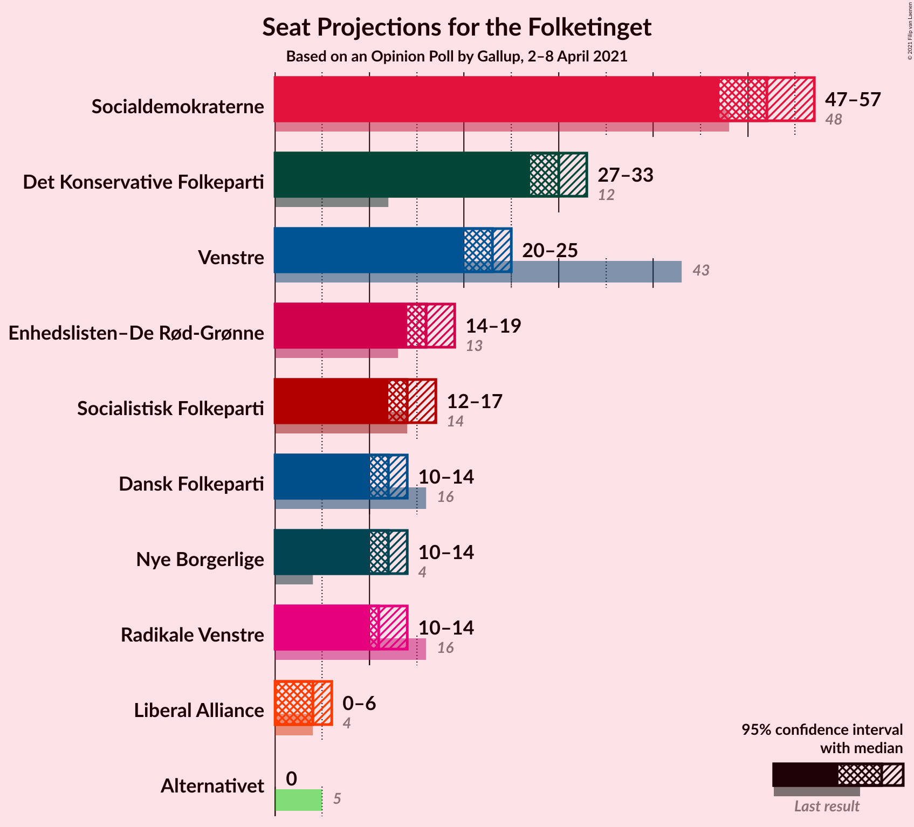
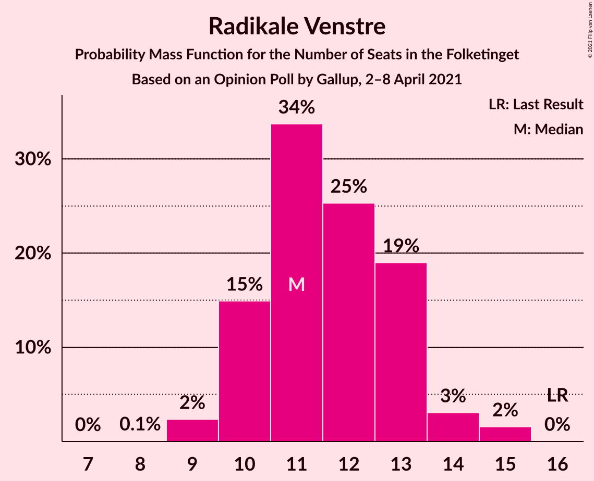
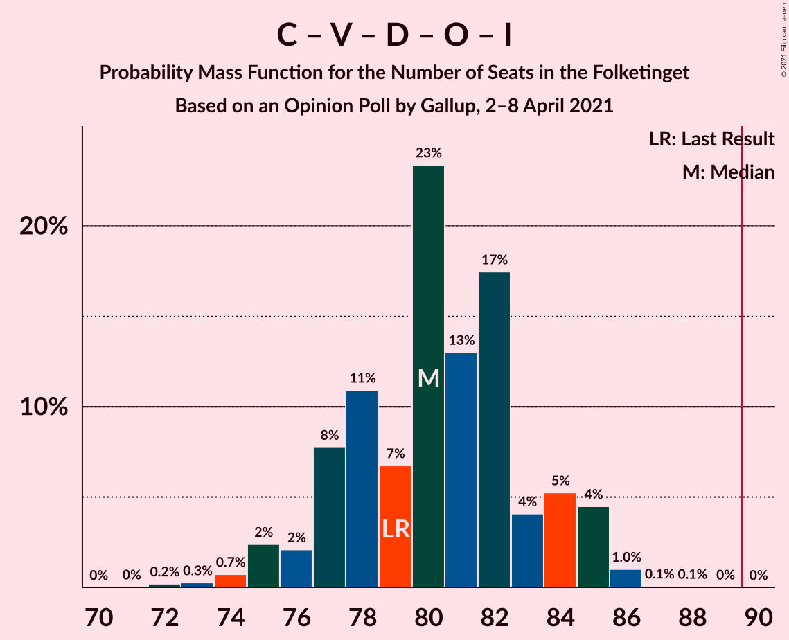

# Opinion Poll by Gallup, 2–8 April 2021

<a href="#voting-intentions">Voting Intentions</a> | <a href="#seats">Seats</a> | <a href="#coalitions">Coalitions</a> | <a href="#technical-information">Technical Information</a>

## Voting Intentions

### Confidence Intervals

| Party | Last Result | Poll Result | 80% Confidence Interval | 90% Confidence Interval | 95% Confidence Interval | 99% Confidence Interval |
|:-----:|:-----------:|:-----------:|:-----------------------:|:-----------------------:|:-----------------------:|:-----------------------:|
| Socialdemokraterne | 25.9% | 29.3% | 27.9–30.8% |27.5–31.2% |27.2–31.6% |26.6–32.3% |
| Det Konservative Folkeparti | 6.6% | 16.7% | 15.6–17.9% |15.3–18.3% |15.0–18.6% |14.5–19.2% |
| Venstre | 23.4% | 12.6% | 11.6–13.7% |11.3–14.0% |11.1–14.3% |10.7–14.8% |
| Enhedslisten–De Rød-Grønne | 6.9% | 9.1% | 8.3–10.1% |8.0–10.4% |7.8–10.6% |7.5–11.1% |
| Socialistisk Folkeparti | 7.7% | 7.8% | 7.0–8.7% |6.8–8.9% |6.6–9.2% |6.2–9.6% |
| Nye Borgerlige | 2.4% | 6.8% | 6.1–7.6% |5.8–7.9% |5.7–8.1% |5.3–8.5% |
| Dansk Folkeparti | 8.7% | 6.7% | 6.0–7.6% |5.8–7.8% |5.6–8.0% |5.3–8.4% |
| Radikale Venstre | 8.6% | 6.5% | 5.8–7.3% |5.6–7.5% |5.4–7.8% |5.1–8.2% |
| Liberal Alliance | 2.3% | 2.3% | 1.9–2.8% |1.8–3.0% |1.7–3.1% |1.5–3.4% |
| Alternativet | 3.0% | 0.4% | 0.3–0.7% |0.2–0.8% |0.2–0.9% |0.1–1.0% |

*Note:* The poll result column reflects the actual value used in the calculations. Published results may vary slightly, and in addition be rounded to fewer digits.

## Seats

### Confidence Intervals

| Party | Last Result | Median | 80% Confidence Interval | 90% Confidence Interval | 95% Confidence Interval | 99% Confidence Interval |
|:-----:|:-----------:|:------:|:-----------------------:|:-----------------------:|:-----------------------:|:-----------------------:|
| <a href="#socialdemokraterne">Socialdemokraterne</a> | 48 | 52 | 49–55 |48–56 |47–57 |47–58 |
| <a href="#det-konservative-folkeparti">Det Konservative Folkeparti</a> | 12 | 30 | 27–33 |27–33 |27–33 |25–34 |
| <a href="#venstre">Venstre</a> | 43 | 23 | 21–25 |20–25 |20–25 |19–27 |
| <a href="#enhedslisten–de-rød-grønne">Enhedslisten–De Rød-Grønne</a> | 13 | 16 | 15–18 |14–18 |14–19 |13–20 |
| <a href="#socialistisk-folkeparti">Socialistisk Folkeparti</a> | 14 | 14 | 12–16 |12–16 |12–17 |11–17 |
| <a href="#nye-borgerlige">Nye Borgerlige</a> | 4 | 12 | 10–14 |10–14 |10–14 |10–15 |
| <a href="#dansk-folkeparti">Dansk Folkeparti</a> | 16 | 12 | 11–13 |10–14 |10–14 |9–15 |
| <a href="#radikale-venstre">Radikale Venstre</a> | 16 | 11 | 10–13 |10–13 |10–14 |9–15 |
| <a href="#liberal-alliance">Liberal Alliance</a> | 4 | 4 | 0–5 |0–5 |0–6 |0–6 |
| <a href="#alternativet">Alternativet</a> | 5 | 0 | 0 |0 |0 |0 |

### Socialdemokraterne

*For a full overview of the results for this party, see the [Socialdemokraterne](party-socialdemokraterne.html) page.*

| Number of Seats | Probability | Accumulated | Special Marks |
|:---------------:|:-----------:|:-----------:|:-------------:|
| 45 | 0.1% | 100% |  |
| 46 | 0.2% | 99.9% |  |
| 47 | 3% | 99.7% |  |
| 48 | 2% | 96% | Last Result |
| 49 | 8% | 95% |  |
| 50 | 6% | 86% |  |
| 51 | 27% | 80% |  |
| 52 | 15% | 53% | Median |
| 53 | 20% | 38% |  |
| 54 | 6% | 18% |  |
| 55 | 6% | 12% |  |
| 56 | 3% | 6% |  |
| 57 | 2% | 3% |  |
| 58 | 0.4% | 0.6% |  |
| 59 | 0.1% | 0.2% |  |
| 60 | 0.1% | 0.1% |  |
| 61 | 0% | 0% |  |

### Det Konservative Folkeparti

*For a full overview of the results for this party, see the [Det Konservative Folkeparti](party-detkonservativefolkeparti.html) page.*

| Number of Seats | Probability | Accumulated | Special Marks |
|:---------------:|:-----------:|:-----------:|:-------------:|
| 12 | 0% | 100% | Last Result |
| 13 | 0% | 100% |  |
| 14 | 0% | 100% |  |
| 15 | 0% | 100% |  |
| 16 | 0% | 100% |  |
| 17 | 0% | 100% |  |
| 18 | 0% | 100% |  |
| 19 | 0% | 100% |  |
| 20 | 0% | 100% |  |
| 21 | 0% | 100% |  |
| 22 | 0% | 100% |  |
| 23 | 0% | 100% |  |
| 24 | 0% | 100% |  |
| 25 | 0.7% | 100% |  |
| 26 | 1.3% | 99.3% |  |
| 27 | 8% | 98% |  |
| 28 | 11% | 90% |  |
| 29 | 18% | 79% |  |
| 30 | 21% | 61% | Median |
| 31 | 14% | 40% |  |
| 32 | 16% | 26% |  |
| 33 | 9% | 10% |  |
| 34 | 0.5% | 0.9% |  |
| 35 | 0.4% | 0.4% |  |
| 36 | 0% | 0% |  |

### Venstre

*For a full overview of the results for this party, see the [Venstre](party-venstre.html) page.*

| Number of Seats | Probability | Accumulated | Special Marks |
|:---------------:|:-----------:|:-----------:|:-------------:|
| 18 | 0.4% | 100% |  |
| 19 | 0.5% | 99.6% |  |
| 20 | 7% | 99.1% |  |
| 21 | 24% | 92% |  |
| 22 | 9% | 68% |  |
| 23 | 22% | 59% | Median |
| 24 | 24% | 36% |  |
| 25 | 10% | 12% |  |
| 26 | 1.3% | 2% |  |
| 27 | 0.7% | 0.8% |  |
| 28 | 0.1% | 0.1% |  |
| 29 | 0% | 0% |  |
| 30 | 0% | 0% |  |
| 31 | 0% | 0% |  |
| 32 | 0% | 0% |  |
| 33 | 0% | 0% |  |
| 34 | 0% | 0% |  |
| 35 | 0% | 0% |  |
| 36 | 0% | 0% |  |
| 37 | 0% | 0% |  |
| 38 | 0% | 0% |  |
| 39 | 0% | 0% |  |
| 40 | 0% | 0% |  |
| 41 | 0% | 0% |  |
| 42 | 0% | 0% |  |
| 43 | 0% | 0% | Last Result |

### Enhedslisten–De Rød-Grønne

*For a full overview of the results for this party, see the [Enhedslisten–De Rød-Grønne](party-enhedslisten–derød-grønne.html) page.*

| Number of Seats | Probability | Accumulated | Special Marks |
|:---------------:|:-----------:|:-----------:|:-------------:|
| 12 | 0.1% | 100% |  |
| 13 | 1.0% | 99.9% | Last Result |
| 14 | 8% | 99.0% |  |
| 15 | 8% | 91% |  |
| 16 | 44% | 83% | Median |
| 17 | 15% | 39% |  |
| 18 | 20% | 24% |  |
| 19 | 3% | 3% |  |
| 20 | 0.5% | 0.6% |  |
| 21 | 0.1% | 0.1% |  |
| 22 | 0% | 0% |  |

### Socialistisk Folkeparti

*For a full overview of the results for this party, see the [Socialistisk Folkeparti](party-socialistiskfolkeparti.html) page.*

| Number of Seats | Probability | Accumulated | Special Marks |
|:---------------:|:-----------:|:-----------:|:-------------:|
| 10 | 0.2% | 100% |  |
| 11 | 1.3% | 99.8% |  |
| 12 | 9% | 98% |  |
| 13 | 28% | 89% |  |
| 14 | 17% | 61% | Last Result, Median |
| 15 | 26% | 44% |  |
| 16 | 14% | 18% |  |
| 17 | 4% | 4% |  |
| 18 | 0.3% | 0.3% |  |
| 19 | 0% | 0% |  |

### Nye Borgerlige

*For a full overview of the results for this party, see the [Nye Borgerlige](party-nyeborgerlige.html) page.*

| Number of Seats | Probability | Accumulated | Special Marks |
|:---------------:|:-----------:|:-----------:|:-------------:|
| 4 | 0% | 100% | Last Result |
| 5 | 0% | 100% |  |
| 6 | 0% | 100% |  |
| 7 | 0% | 100% |  |
| 8 | 0% | 100% |  |
| 9 | 0.4% | 100% |  |
| 10 | 12% | 99.6% |  |
| 11 | 25% | 88% |  |
| 12 | 18% | 63% | Median |
| 13 | 28% | 45% |  |
| 14 | 15% | 17% |  |
| 15 | 1.3% | 2% |  |
| 16 | 0.4% | 0.4% |  |
| 17 | 0% | 0% |  |

### Dansk Folkeparti

*For a full overview of the results for this party, see the [Dansk Folkeparti](party-danskfolkeparti.html) page.*

| Number of Seats | Probability | Accumulated | Special Marks |
|:---------------:|:-----------:|:-----------:|:-------------:|
| 9 | 1.3% | 100% |  |
| 10 | 5% | 98.7% |  |
| 11 | 22% | 94% |  |
| 12 | 38% | 72% | Median |
| 13 | 29% | 34% |  |
| 14 | 4% | 5% |  |
| 15 | 2% | 2% |  |
| 16 | 0.1% | 0.2% | Last Result |
| 17 | 0% | 0% |  |

### Radikale Venstre

*For a full overview of the results for this party, see the [Radikale Venstre](party-radikalevenstre.html) page.*

| Number of Seats | Probability | Accumulated | Special Marks |
|:---------------:|:-----------:|:-----------:|:-------------:|
| 8 | 0.1% | 100% |  |
| 9 | 2% | 99.9% |  |
| 10 | 15% | 98% |  |
| 11 | 34% | 83% | Median |
| 12 | 25% | 49% |  |
| 13 | 19% | 24% |  |
| 14 | 3% | 5% |  |
| 15 | 2% | 2% |  |
| 16 | 0% | 0% | Last Result |

### Liberal Alliance

*For a full overview of the results for this party, see the [Liberal Alliance](party-liberalalliance.html) page.*

| Number of Seats | Probability | Accumulated | Special Marks |
|:---------------:|:-----------:|:-----------:|:-------------:|
| 0 | 22% | 100% |  |
| 1 | 0% | 78% |  |
| 2 | 0% | 78% |  |
| 3 | 2% | 78% |  |
| 4 | 56% | 77% | Last Result, Median |
| 5 | 17% | 21% |  |
| 6 | 3% | 3% |  |
| 7 | 0.1% | 0.1% |  |
| 8 | 0% | 0% |  |

### Alternativet

*For a full overview of the results for this party, see the [Alternativet](party-alternativet.html) page.*

| Number of Seats | Probability | Accumulated | Special Marks |
|:---------------:|:-----------:|:-----------:|:-------------:|
| 0 | 100% | 100% | Median |
| 1 | 0% | 0% |  |
| 2 | 0% | 0% |  |
| 3 | 0% | 0% |  |
| 4 | 0% | 0% |  |
| 5 | 0% | 0% | Last Result |

## Coalitions

### Confidence Intervals

| Coalition | Last Result | Median | Majority? | 80% Confidence Interval | 90% Confidence Interval | 95% Confidence Interval | 99% Confidence Interval |
|:---------:|:-----------:|:------:|:---------:|:-----------------------:|:-----------------------:|:-----------------------:|:-----------------------:|
| Socialdemokraterne – Enhedslisten–De Rød-Grønne – Socialistisk Folkeparti – Radikale Venstre – Alternativet | 96 | 94 | 97% | 91–97 | 90–98 | 89–99 | 88–100 |
| Socialdemokraterne – Enhedslisten–De Rød-Grønne – Socialistisk Folkeparti – Radikale Venstre | 91 | 94 | 97% | 91–97 | 90–98 | 89–99 | 88–100 |
| Socialdemokraterne – Enhedslisten–De Rød-Grønne – Socialistisk Folkeparti – Alternativet | 80 | 83 | 0.1% | 79–85 | 79–87 | 78–87 | 76–88 |
| Socialdemokraterne – Enhedslisten–De Rød-Grønne – Socialistisk Folkeparti | 75 | 83 | 0.1% | 79–85 | 79–87 | 78–87 | 76–88 |
| Det Konservative Folkeparti – Venstre – Nye Borgerlige – Dansk Folkeparti – Liberal Alliance | 79 | 80 | 0% | 77–84 | 76–85 | 75–85 | 74–86 |
| Socialdemokraterne – Socialistisk Folkeparti – Radikale Venstre | 78 | 77 | 0% | 74–81 | 74–82 | 73–83 | 72–85 |
| Det Konservative Folkeparti – Venstre – Dansk Folkeparti – Liberal Alliance | 75 | 68 | 0% | 65–72 | 64–72 | 63–73 | 61–74 |
| Socialdemokraterne – Radikale Venstre | 64 | 64 | 0% | 60–66 | 59–68 | 59–69 | 58–70 |
| Det Konservative Folkeparti – Venstre – Liberal Alliance | 59 | 56 | 0% | 53–59 | 52–60 | 51–60 | 49–62 |
| Det Konservative Folkeparti – Venstre | 55 | 53 | 0% | 50–56 | 49–56 | 48–56 | 47–57 |
| Venstre | 43 | 23 | 0% | 21–25 | 20–25 | 20–25 | 19–27 |

### Socialdemokraterne – Enhedslisten–De Rød-Grønne – Socialistisk Folkeparti – Radikale Venstre – Alternativet

| Number of Seats | Probability | Accumulated | Special Marks |
|:---------------:|:-----------:|:-----------:|:-------------:|
| 86 | 0.1% | 100% |  |
| 87 | 0.4% | 99.9% |  |
| 88 | 1.0% | 99.5% |  |
| 89 | 1.4% | 98% |  |
| 90 | 7% | 97% | Majority |
| 91 | 8% | 90% |  |
| 92 | 5% | 82% |  |
| 93 | 19% | 77% | Median |
| 94 | 12% | 58% |  |
| 95 | 22% | 45% |  |
| 96 | 6% | 23% | Last Result |
| 97 | 10% | 18% |  |
| 98 | 4% | 7% |  |
| 99 | 1.4% | 3% |  |
| 100 | 2% | 2% |  |
| 101 | 0.3% | 0.4% |  |
| 102 | 0.1% | 0.1% |  |
| 103 | 0% | 0% |  |

### Socialdemokraterne – Enhedslisten–De Rød-Grønne – Socialistisk Folkeparti – Radikale Venstre

| Number of Seats | Probability | Accumulated | Special Marks |
|:---------------:|:-----------:|:-----------:|:-------------:|
| 86 | 0.1% | 100% |  |
| 87 | 0.4% | 99.9% |  |
| 88 | 1.0% | 99.5% |  |
| 89 | 1.4% | 98% |  |
| 90 | 7% | 97% | Majority |
| 91 | 8% | 90% | Last Result |
| 92 | 5% | 82% |  |
| 93 | 19% | 77% | Median |
| 94 | 12% | 58% |  |
| 95 | 22% | 45% |  |
| 96 | 6% | 23% |  |
| 97 | 10% | 18% |  |
| 98 | 4% | 7% |  |
| 99 | 1.4% | 3% |  |
| 100 | 2% | 2% |  |
| 101 | 0.3% | 0.4% |  |
| 102 | 0.1% | 0.1% |  |
| 103 | 0% | 0% |  |

### Socialdemokraterne – Enhedslisten–De Rød-Grønne – Socialistisk Folkeparti – Alternativet

| Number of Seats | Probability | Accumulated | Special Marks |
|:---------------:|:-----------:|:-----------:|:-------------:|
| 75 | 0.1% | 100% |  |
| 76 | 0.9% | 99.8% |  |
| 77 | 0.6% | 98.9% |  |
| 78 | 3% | 98% |  |
| 79 | 6% | 96% |  |
| 80 | 14% | 90% | Last Result |
| 81 | 13% | 76% |  |
| 82 | 12% | 63% | Median |
| 83 | 16% | 51% |  |
| 84 | 17% | 35% |  |
| 85 | 11% | 19% |  |
| 86 | 2% | 8% |  |
| 87 | 4% | 6% |  |
| 88 | 1.3% | 2% |  |
| 89 | 0.3% | 0.4% |  |
| 90 | 0.1% | 0.1% | Majority |
| 91 | 0% | 0% |  |

### Socialdemokraterne – Enhedslisten–De Rød-Grønne – Socialistisk Folkeparti

| Number of Seats | Probability | Accumulated | Special Marks |
|:---------------:|:-----------:|:-----------:|:-------------:|
| 75 | 0.1% | 100% | Last Result |
| 76 | 0.9% | 99.8% |  |
| 77 | 0.6% | 98.9% |  |
| 78 | 3% | 98% |  |
| 79 | 6% | 96% |  |
| 80 | 14% | 90% |  |
| 81 | 13% | 76% |  |
| 82 | 12% | 63% | Median |
| 83 | 16% | 51% |  |
| 84 | 17% | 35% |  |
| 85 | 11% | 19% |  |
| 86 | 2% | 8% |  |
| 87 | 4% | 6% |  |
| 88 | 1.3% | 2% |  |
| 89 | 0.3% | 0.4% |  |
| 90 | 0.1% | 0.1% | Majority |
| 91 | 0% | 0% |  |

### Det Konservative Folkeparti – Venstre – Nye Borgerlige – Dansk Folkeparti – Liberal Alliance

| Number of Seats | Probability | Accumulated | Special Marks |
|:---------------:|:-----------:|:-----------:|:-------------:|
| 72 | 0.2% | 100% |  |
| 73 | 0.3% | 99.8% |  |
| 74 | 0.7% | 99.5% |  |
| 75 | 2% | 98.8% |  |
| 76 | 2% | 96% |  |
| 77 | 8% | 94% |  |
| 78 | 11% | 87% |  |
| 79 | 7% | 76% | Last Result |
| 80 | 23% | 69% |  |
| 81 | 13% | 45% | Median |
| 82 | 17% | 32% |  |
| 83 | 4% | 15% |  |
| 84 | 5% | 11% |  |
| 85 | 4% | 6% |  |
| 86 | 1.0% | 1.2% |  |
| 87 | 0.1% | 0.2% |  |
| 88 | 0.1% | 0.1% |  |
| 89 | 0% | 0% |  |

### Socialdemokraterne – Socialistisk Folkeparti – Radikale Venstre

| Number of Seats | Probability | Accumulated | Special Marks |
|:---------------:|:-----------:|:-----------:|:-------------:|
| 70 | 0.1% | 100% |  |
| 71 | 0.2% | 99.8% |  |
| 72 | 0.9% | 99.6% |  |
| 73 | 2% | 98.8% |  |
| 74 | 9% | 97% |  |
| 75 | 8% | 88% |  |
| 76 | 6% | 80% |  |
| 77 | 27% | 74% | Median |
| 78 | 16% | 47% | Last Result |
| 79 | 12% | 31% |  |
| 80 | 4% | 19% |  |
| 81 | 9% | 15% |  |
| 82 | 3% | 6% |  |
| 83 | 2% | 3% |  |
| 84 | 0.4% | 1.3% |  |
| 85 | 0.8% | 0.9% |  |
| 86 | 0.1% | 0.1% |  |
| 87 | 0% | 0% |  |

### Det Konservative Folkeparti – Venstre – Dansk Folkeparti – Liberal Alliance

| Number of Seats | Probability | Accumulated | Special Marks |
|:---------------:|:-----------:|:-----------:|:-------------:|
| 60 | 0.2% | 100% |  |
| 61 | 0.3% | 99.8% |  |
| 62 | 1.2% | 99.5% |  |
| 63 | 2% | 98% |  |
| 64 | 2% | 96% |  |
| 65 | 7% | 94% |  |
| 66 | 9% | 87% |  |
| 67 | 22% | 78% |  |
| 68 | 17% | 57% |  |
| 69 | 8% | 40% | Median |
| 70 | 13% | 31% |  |
| 71 | 6% | 19% |  |
| 72 | 10% | 13% |  |
| 73 | 2% | 3% |  |
| 74 | 1.2% | 1.4% |  |
| 75 | 0.1% | 0.2% | Last Result |
| 76 | 0% | 0.1% |  |
| 77 | 0% | 0% |  |

### Socialdemokraterne – Radikale Venstre

| Number of Seats | Probability | Accumulated | Special Marks |
|:---------------:|:-----------:|:-----------:|:-------------:|
| 56 | 0.1% | 100% |  |
| 57 | 0.1% | 99.9% |  |
| 58 | 0.8% | 99.8% |  |
| 59 | 7% | 98.9% |  |
| 60 | 3% | 92% |  |
| 61 | 11% | 89% |  |
| 62 | 13% | 78% |  |
| 63 | 14% | 65% | Median |
| 64 | 16% | 51% | Last Result |
| 65 | 18% | 35% |  |
| 66 | 8% | 18% |  |
| 67 | 3% | 10% |  |
| 68 | 4% | 7% |  |
| 69 | 2% | 3% |  |
| 70 | 1.2% | 1.2% |  |
| 71 | 0.1% | 0.1% |  |
| 72 | 0% | 0% |  |

### Det Konservative Folkeparti – Venstre – Liberal Alliance

| Number of Seats | Probability | Accumulated | Special Marks |
|:---------------:|:-----------:|:-----------:|:-------------:|
| 48 | 0.2% | 100% |  |
| 49 | 0.7% | 99.8% |  |
| 50 | 0.8% | 99.1% |  |
| 51 | 2% | 98% |  |
| 52 | 4% | 96% |  |
| 53 | 7% | 92% |  |
| 54 | 7% | 86% |  |
| 55 | 17% | 79% |  |
| 56 | 21% | 62% |  |
| 57 | 14% | 42% | Median |
| 58 | 11% | 27% |  |
| 59 | 8% | 16% | Last Result |
| 60 | 6% | 8% |  |
| 61 | 0.9% | 2% |  |
| 62 | 1.4% | 2% |  |
| 63 | 0.1% | 0.1% |  |
| 64 | 0% | 0% |  |

### Det Konservative Folkeparti – Venstre

| Number of Seats | Probability | Accumulated | Special Marks |
|:---------------:|:-----------:|:-----------:|:-------------:|
| 46 | 0.4% | 100% |  |
| 47 | 0.6% | 99.6% |  |
| 48 | 3% | 99.0% |  |
| 49 | 6% | 96% |  |
| 50 | 6% | 90% |  |
| 51 | 13% | 84% |  |
| 52 | 17% | 71% |  |
| 53 | 17% | 54% | Median |
| 54 | 9% | 37% |  |
| 55 | 15% | 28% | Last Result |
| 56 | 10% | 13% |  |
| 57 | 2% | 2% |  |
| 58 | 0.3% | 0.5% |  |
| 59 | 0.2% | 0.2% |  |
| 60 | 0% | 0% |  |

### Venstre

| Number of Seats | Probability | Accumulated | Special Marks |
|:---------------:|:-----------:|:-----------:|:-------------:|
| 18 | 0.4% | 100% |  |
| 19 | 0.5% | 99.6% |  |
| 20 | 7% | 99.1% |  |
| 21 | 24% | 92% |  |
| 22 | 9% | 68% |  |
| 23 | 22% | 59% | Median |
| 24 | 24% | 36% |  |
| 25 | 10% | 12% |  |
| 26 | 1.3% | 2% |  |
| 27 | 0.7% | 0.8% |  |
| 28 | 0.1% | 0.1% |  |
| 29 | 0% | 0% |  |
| 30 | 0% | 0% |  |
| 31 | 0% | 0% |  |
| 32 | 0% | 0% |  |
| 33 | 0% | 0% |  |
| 34 | 0% | 0% |  |
| 35 | 0% | 0% |  |
| 36 | 0% | 0% |  |
| 37 | 0% | 0% |  |
| 38 | 0% | 0% |  |
| 39 | 0% | 0% |  |
| 40 | 0% | 0% |  |
| 41 | 0% | 0% |  |
| 42 | 0% | 0% |  |
| 43 | 0% | 0% | Last Result |

## Technical Information

### Opinion Poll

+ **Polling firm:** Gallup
+ **Commissioner(s):** —
+ **Fieldwork period:** 2–8 April 2021

### Calculations

+ **Sample size:** 1698
+ **Simulations done:** 1,048,576
+ **Error estimate:** 2.44%

