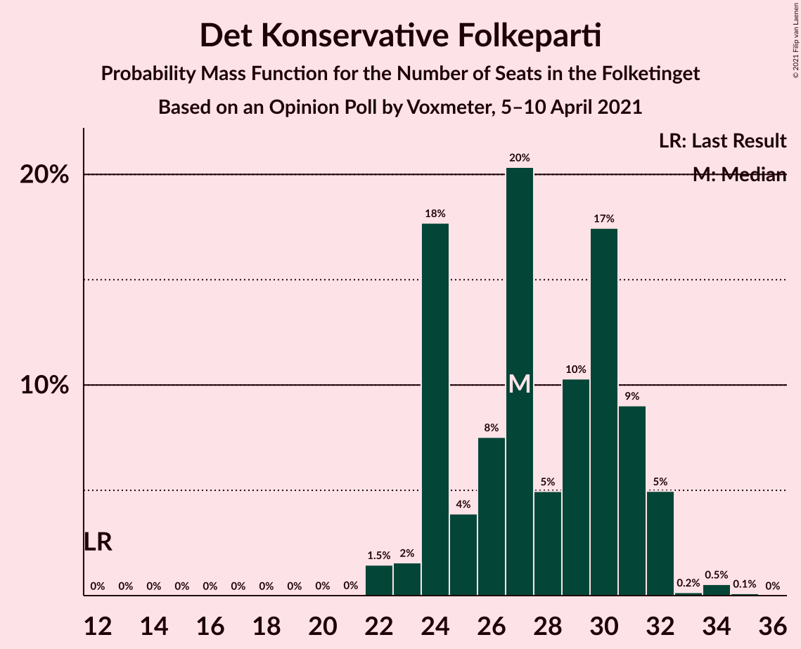
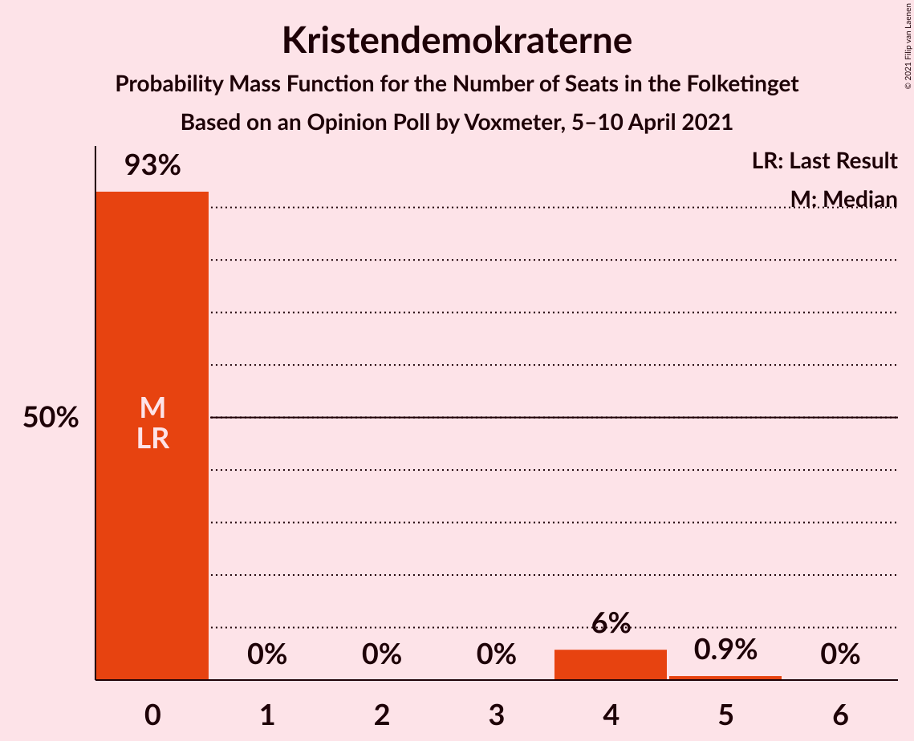
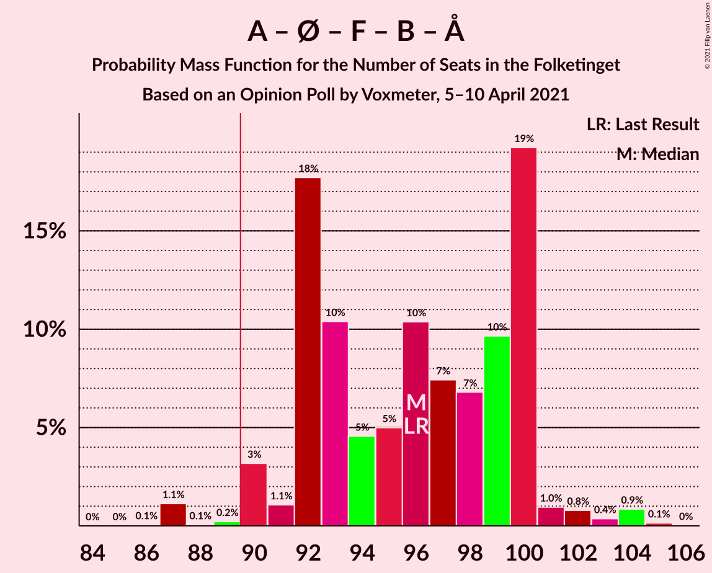
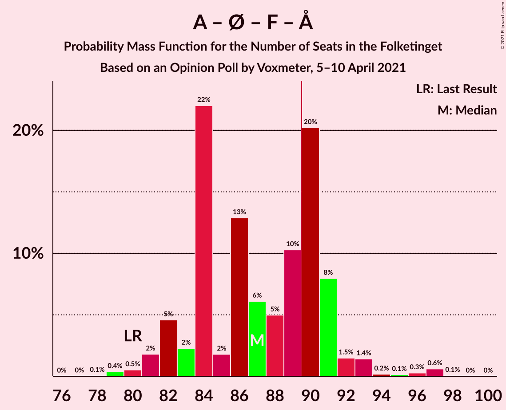
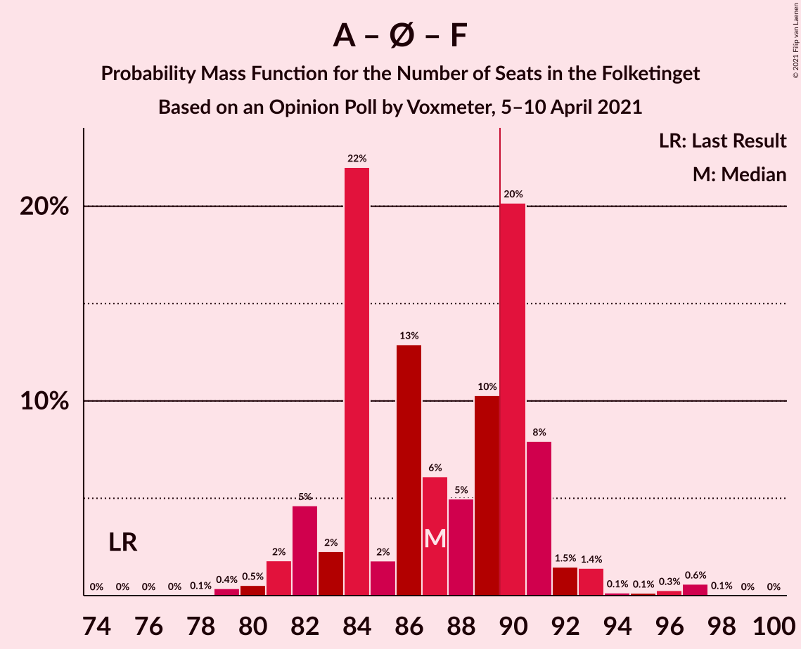
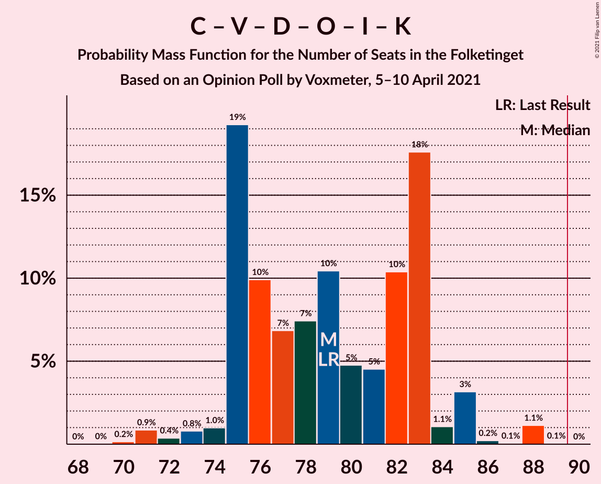
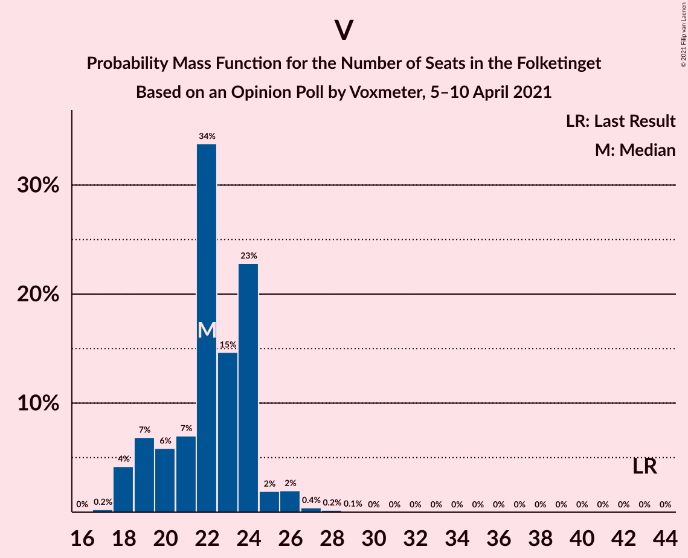

# Opinion Poll by Voxmeter, 5–10 April 2021

<a href="#voting-intentions">Voting Intentions</a> | <a href="#seats">Seats</a> | <a href="#coalitions">Coalitions</a> | <a href="#technical-information">Technical Information</a>

## Voting Intentions

### Confidence Intervals

| Party | Last Result | Poll Result | 80% Confidence Interval | 90% Confidence Interval | 95% Confidence Interval | 99% Confidence Interval |
|:-----:|:-----------:|:-----------:|:-----------------------:|:-----------------------:|:-----------------------:|:-----------------------:|
| Socialdemokraterne | 25.9% | 32.0% | 30.1–33.9% |29.6–34.4% |29.1–34.9% |28.3–35.8% |
| Det Konservative Folkeparti | 6.6% | 15.2% | 13.8–16.7% |13.4–17.2% |13.1–17.5% |12.5–18.3% |
| Venstre | 23.4% | 12.1% | 10.9–13.5% |10.5–13.9% |10.3–14.3% |9.7–15.0% |
| Nye Borgerlige | 2.4% | 9.0% | 7.9–10.2% |7.6–10.6% |7.4–10.9% |6.9–11.5% |
| Enhedslisten–De Rød-Grønne | 6.9% | 8.6% | 7.5–9.8% |7.3–10.2% |7.0–10.5% |6.5–11.1% |
| Socialistisk Folkeparti | 7.7% | 7.6% | 6.6–8.8% |6.3–9.1% |6.1–9.4% |5.7–10.0% |
| Dansk Folkeparti | 8.7% | 5.7% | 4.9–6.8% |4.6–7.1% |4.5–7.3% |4.1–7.9% |
| Radikale Venstre | 8.6% | 4.9% | 4.2–5.9% |3.9–6.2% |3.7–6.4% |3.4–7.0% |
| Liberal Alliance | 2.3% | 1.8% | 1.3–2.4% |1.2–2.6% |1.1–2.8% |0.9–3.1% |
| Kristendemokraterne | 1.7% | 1.3% | 0.9–1.9% |0.8–2.0% |0.7–2.2% |0.6–2.5% |
| Alternativet | 3.0% | 0.8% | 0.5–1.3% |0.5–1.4% |0.4–1.6% |0.3–1.8% |
| Veganerpartiet | 0.0% | 0.2% | 0.1–0.5% |0.1–0.6% |0.1–0.7% |0.0–0.9% |

*Note:* The poll result column reflects the actual value used in the calculations. Published results may vary slightly, and in addition be rounded to fewer digits.

## Seats

### Confidence Intervals

| Party | Last Result | Median | 80% Confidence Interval | 90% Confidence Interval | 95% Confidence Interval | 99% Confidence Interval |
|:-----:|:-----------:|:------:|:-----------------------:|:-----------------------:|:-----------------------:|:-----------------------:|
| <a href="#socialdemokraterne">Socialdemokraterne</a> | 48 | 58 | 55–60 |54–61 |53–63 |51–64 |
| <a href="#det-konservative-folkeparti">Det Konservative Folkeparti</a> | 12 | 27 | 24–31 |24–32 |23–32 |22–34 |
| <a href="#venstre">Venstre</a> | 43 | 22 | 19–24 |19–24 |18–26 |18–27 |
| <a href="#nye-borgerlige">Nye Borgerlige</a> | 4 | 15 | 14–19 |14–20 |14–20 |13–21 |
| <a href="#enhedslisten–de-rød-grønne">Enhedslisten–De Rød-Grønne</a> | 13 | 15 | 13–18 |12–20 |12–20 |11–20 |
| <a href="#socialistisk-folkeparti">Socialistisk Folkeparti</a> | 14 | 14 | 13–16 |12–17 |11–17 |10–18 |
| <a href="#dansk-folkeparti">Dansk Folkeparti</a> | 16 | 10 | 8–13 |8–14 |8–14 |7–14 |
| <a href="#radikale-venstre">Radikale Venstre</a> | 16 | 8 | 7–11 |7–12 |6–12 |6–13 |
| <a href="#liberal-alliance">Liberal Alliance</a> | 4 | 4 | 0–5 |0–5 |0–5 |0–6 |
| <a href="#kristendemokraterne">Kristendemokraterne</a> | 0 | 0 | 0 |0–4 |0–4 |0–5 |
| <a href="#alternativet">Alternativet</a> | 5 | 0 | 0 |0 |0 |0 |
| <a href="#veganerpartiet">Veganerpartiet</a> | 0 | 0 | 0 |0 |0 |0 |

### Socialdemokraterne

*For a full overview of the results for this party, see the [Socialdemokraterne](party-socialdemokraterne.html) page.*

| Number of Seats | Probability | Accumulated | Special Marks |
|:---------------:|:-----------:|:-----------:|:-------------:|
| 48 | 0.1% | 100% | Last Result |
| 49 | 0% | 99.9% |  |
| 50 | 0.1% | 99.9% |  |
| 51 | 0.3% | 99.8% |  |
| 52 | 1.0% | 99.5% |  |
| 53 | 2% | 98% |  |
| 54 | 3% | 96% |  |
| 55 | 29% | 93% |  |
| 56 | 6% | 65% |  |
| 57 | 8% | 59% |  |
| 58 | 20% | 51% | Median |
| 59 | 19% | 31% |  |
| 60 | 6% | 12% |  |
| 61 | 2% | 6% |  |
| 62 | 1.3% | 4% |  |
| 63 | 2% | 3% |  |
| 64 | 0.2% | 0.5% |  |
| 65 | 0.2% | 0.3% |  |
| 66 | 0.1% | 0.2% |  |
| 67 | 0% | 0.1% |  |
| 68 | 0.1% | 0.1% |  |
| 69 | 0% | 0% |  |

### Det Konservative Folkeparti

*For a full overview of the results for this party, see the [Det Konservative Folkeparti](party-detkonservativefolkeparti.html) page.*

| Number of Seats | Probability | Accumulated | Special Marks |
|:---------------:|:-----------:|:-----------:|:-------------:|
| 12 | 0% | 100% | Last Result |
| 13 | 0% | 100% |  |
| 14 | 0% | 100% |  |
| 15 | 0% | 100% |  |
| 16 | 0% | 100% |  |
| 17 | 0% | 100% |  |
| 18 | 0% | 100% |  |
| 19 | 0% | 100% |  |
| 20 | 0% | 100% |  |
| 21 | 0% | 100% |  |
| 22 | 1.5% | 100% |  |
| 23 | 2% | 98% |  |
| 24 | 18% | 97% |  |
| 25 | 4% | 79% |  |
| 26 | 8% | 75% |  |
| 27 | 20% | 68% | Median |
| 28 | 5% | 47% |  |
| 29 | 10% | 43% |  |
| 30 | 17% | 32% |  |
| 31 | 9% | 15% |  |
| 32 | 5% | 6% |  |
| 33 | 0.2% | 0.8% |  |
| 34 | 0.5% | 0.7% |  |
| 35 | 0.1% | 0.1% |  |
| 36 | 0% | 0% |  |

### Venstre

*For a full overview of the results for this party, see the [Venstre](party-venstre.html) page.*

| Number of Seats | Probability | Accumulated | Special Marks |
|:---------------:|:-----------:|:-----------:|:-------------:|
| 17 | 0.2% | 100% |  |
| 18 | 4% | 99.7% |  |
| 19 | 7% | 96% |  |
| 20 | 6% | 89% |  |
| 21 | 7% | 83% |  |
| 22 | 34% | 76% | Median |
| 23 | 15% | 42% |  |
| 24 | 23% | 27% |  |
| 25 | 2% | 5% |  |
| 26 | 2% | 3% |  |
| 27 | 0.4% | 0.7% |  |
| 28 | 0.2% | 0.3% |  |
| 29 | 0.1% | 0.1% |  |
| 30 | 0% | 0% |  |
| 31 | 0% | 0% |  |
| 32 | 0% | 0% |  |
| 33 | 0% | 0% |  |
| 34 | 0% | 0% |  |
| 35 | 0% | 0% |  |
| 36 | 0% | 0% |  |
| 37 | 0% | 0% |  |
| 38 | 0% | 0% |  |
| 39 | 0% | 0% |  |
| 40 | 0% | 0% |  |
| 41 | 0% | 0% |  |
| 42 | 0% | 0% |  |
| 43 | 0% | 0% | Last Result |

### Nye Borgerlige

*For a full overview of the results for this party, see the [Nye Borgerlige](party-nyeborgerlige.html) page.*

| Number of Seats | Probability | Accumulated | Special Marks |
|:---------------:|:-----------:|:-----------:|:-------------:|
| 4 | 0% | 100% | Last Result |
| 5 | 0% | 100% |  |
| 6 | 0% | 100% |  |
| 7 | 0% | 100% |  |
| 8 | 0% | 100% |  |
| 9 | 0% | 100% |  |
| 10 | 0% | 100% |  |
| 11 | 0.1% | 100% |  |
| 12 | 0.4% | 99.9% |  |
| 13 | 1.2% | 99.5% |  |
| 14 | 10% | 98% |  |
| 15 | 54% | 88% | Median |
| 16 | 6% | 34% |  |
| 17 | 6% | 28% |  |
| 18 | 10% | 22% |  |
| 19 | 4% | 11% |  |
| 20 | 7% | 8% |  |
| 21 | 0.5% | 0.8% |  |
| 22 | 0% | 0.2% |  |
| 23 | 0.1% | 0.2% |  |
| 24 | 0.1% | 0.1% |  |
| 25 | 0% | 0% |  |

### Enhedslisten–De Rød-Grønne

*For a full overview of the results for this party, see the [Enhedslisten–De Rød-Grønne](party-enhedslisten–derød-grønne.html) page.*

| Number of Seats | Probability | Accumulated | Special Marks |
|:---------------:|:-----------:|:-----------:|:-------------:|
| 11 | 0.8% | 100% |  |
| 12 | 5% | 99.2% |  |
| 13 | 6% | 94% | Last Result |
| 14 | 29% | 89% |  |
| 15 | 12% | 59% | Median |
| 16 | 7% | 48% |  |
| 17 | 26% | 40% |  |
| 18 | 8% | 14% |  |
| 19 | 0.7% | 6% |  |
| 20 | 5% | 5% |  |
| 21 | 0.2% | 0.2% |  |
| 22 | 0% | 0% |  |

### Socialistisk Folkeparti

*For a full overview of the results for this party, see the [Socialistisk Folkeparti](party-socialistiskfolkeparti.html) page.*

| Number of Seats | Probability | Accumulated | Special Marks |
|:---------------:|:-----------:|:-----------:|:-------------:|
| 9 | 0.2% | 100% |  |
| 10 | 0.9% | 99.8% |  |
| 11 | 2% | 98.9% |  |
| 12 | 5% | 97% |  |
| 13 | 13% | 92% |  |
| 14 | 36% | 79% | Last Result, Median |
| 15 | 27% | 43% |  |
| 16 | 7% | 16% |  |
| 17 | 7% | 9% |  |
| 18 | 2% | 2% |  |
| 19 | 0.1% | 0.2% |  |
| 20 | 0.1% | 0.1% |  |
| 21 | 0% | 0% |  |

### Dansk Folkeparti

*For a full overview of the results for this party, see the [Dansk Folkeparti](party-danskfolkeparti.html) page.*

| Number of Seats | Probability | Accumulated | Special Marks |
|:---------------:|:-----------:|:-----------:|:-------------:|
| 6 | 0.2% | 100% |  |
| 7 | 0.9% | 99.8% |  |
| 8 | 19% | 98.9% |  |
| 9 | 10% | 80% |  |
| 10 | 24% | 70% | Median |
| 11 | 26% | 46% |  |
| 12 | 7% | 20% |  |
| 13 | 6% | 12% |  |
| 14 | 6% | 6% |  |
| 15 | 0.4% | 0.4% |  |
| 16 | 0.1% | 0.1% | Last Result |
| 17 | 0% | 0% |  |

### Radikale Venstre

*For a full overview of the results for this party, see the [Radikale Venstre](party-radikalevenstre.html) page.*

| Number of Seats | Probability | Accumulated | Special Marks |
|:---------------:|:-----------:|:-----------:|:-------------:|
| 5 | 0.1% | 100% |  |
| 6 | 3% | 99.9% |  |
| 7 | 19% | 97% |  |
| 8 | 33% | 78% | Median |
| 9 | 8% | 45% |  |
| 10 | 23% | 37% |  |
| 11 | 6% | 14% |  |
| 12 | 8% | 9% |  |
| 13 | 0.7% | 0.7% |  |
| 14 | 0% | 0.1% |  |
| 15 | 0% | 0% |  |
| 16 | 0% | 0% | Last Result |

### Liberal Alliance

*For a full overview of the results for this party, see the [Liberal Alliance](party-liberalalliance.html) page.*

| Number of Seats | Probability | Accumulated | Special Marks |
|:---------------:|:-----------:|:-----------:|:-------------:|
| 0 | 38% | 100% |  |
| 1 | 0% | 62% |  |
| 2 | 0% | 62% |  |
| 3 | 0.7% | 62% |  |
| 4 | 41% | 62% | Last Result, Median |
| 5 | 20% | 21% |  |
| 6 | 0.6% | 0.6% |  |
| 7 | 0% | 0% |  |

### Kristendemokraterne

*For a full overview of the results for this party, see the [Kristendemokraterne](party-kristendemokraterne.html) page.*

| Number of Seats | Probability | Accumulated | Special Marks |
|:---------------:|:-----------:|:-----------:|:-------------:|
| 0 | 93% | 100% | Last Result, Median |
| 1 | 0% | 7% |  |
| 2 | 0% | 7% |  |
| 3 | 0% | 7% |  |
| 4 | 6% | 7% |  |
| 5 | 0.9% | 0.9% |  |
| 6 | 0% | 0% |  |

### Alternativet

*For a full overview of the results for this party, see the [Alternativet](party-alternativet.html) page.*

| Number of Seats | Probability | Accumulated | Special Marks |
|:---------------:|:-----------:|:-----------:|:-------------:|
| 0 | 99.8% | 100% | Median |
| 1 | 0% | 0.2% |  |
| 2 | 0% | 0.2% |  |
| 3 | 0% | 0.2% |  |
| 4 | 0.2% | 0.2% |  |
| 5 | 0% | 0% | Last Result |

### Veganerpartiet

*For a full overview of the results for this party, see the [Veganerpartiet](party-veganerpartiet.html) page.*

| Number of Seats | Probability | Accumulated | Special Marks |
|:---------------:|:-----------:|:-----------:|:-------------:|
| 0 | 100% | 100% | Last Result, Median |

## Coalitions

### Confidence Intervals

| Coalition | Last Result | Median | Majority? | 80% Confidence Interval | 90% Confidence Interval | 95% Confidence Interval | 99% Confidence Interval |
|:---------:|:-----------:|:------:|:---------:|:-----------------------:|:-----------------------:|:-----------------------:|:-----------------------:|
| Socialdemokraterne – Enhedslisten–De Rød-Grønne – Socialistisk Folkeparti – Radikale Venstre – Alternativet | 96 | 96 | 98.5% | 92–100 | 91–100 | 90–101 | 87–104 |
| Socialdemokraterne – Enhedslisten–De Rød-Grønne – Socialistisk Folkeparti – Radikale Venstre | 91 | 96 | 98.5% | 92–100 | 91–100 | 90–101 | 87–104 |
| Socialdemokraterne – Enhedslisten–De Rød-Grønne – Socialistisk Folkeparti – Alternativet | 80 | 87 | 32% | 84–91 | 82–91 | 81–93 | 80–97 |
| Socialdemokraterne – Enhedslisten–De Rød-Grønne – Socialistisk Folkeparti | 75 | 87 | 32% | 84–91 | 82–91 | 81–93 | 80–97 |
| Socialdemokraterne – Socialistisk Folkeparti – Radikale Venstre | 78 | 80 | 0.1% | 77–84 | 76–84 | 75–85 | 72–87 |
| Det Konservative Folkeparti – Venstre – Nye Borgerlige – Dansk Folkeparti – Liberal Alliance – Kristendemokraterne | 79 | 79 | 0% | 75–83 | 75–84 | 74–85 | 71–88 |
| Det Konservative Folkeparti – Venstre – Nye Borgerlige – Dansk Folkeparti – Liberal Alliance | 79 | 79 | 0% | 75–83 | 74–84 | 73–85 | 71–87 |
| Socialdemokraterne – Radikale Venstre | 64 | 66 | 0% | 63–69 | 63–70 | 62–71 | 59–73 |
| Det Konservative Folkeparti – Venstre – Dansk Folkeparti – Liberal Alliance – Kristendemokraterne | 75 | 63 | 0% | 59–68 | 58–68 | 57–68 | 54–71 |
| Det Konservative Folkeparti – Venstre – Dansk Folkeparti – Liberal Alliance | 75 | 62 | 0% | 59–68 | 58–68 | 57–68 | 54–69 |
| Det Konservative Folkeparti – Venstre – Liberal Alliance | 59 | 52 | 0% | 49–57 | 47–57 | 47–57 | 43–58 |
| Det Konservative Folkeparti – Venstre | 55 | 50 | 0% | 46–53 | 45–55 | 44–55 | 43–56 |
| Venstre | 43 | 22 | 0% | 19–24 | 19–24 | 18–26 | 18–27 |

### Socialdemokraterne – Enhedslisten–De Rød-Grønne – Socialistisk Folkeparti – Radikale Venstre – Alternativet

| Number of Seats | Probability | Accumulated | Special Marks |
|:---------------:|:-----------:|:-----------:|:-------------:|
| 86 | 0.1% | 100% |  |
| 87 | 1.1% | 99.9% |  |
| 88 | 0.1% | 98.8% |  |
| 89 | 0.2% | 98.8% |  |
| 90 | 3% | 98.5% | Majority |
| 91 | 1.1% | 95% |  |
| 92 | 18% | 94% |  |
| 93 | 10% | 77% |  |
| 94 | 5% | 66% |  |
| 95 | 5% | 62% | Median |
| 96 | 10% | 57% | Last Result |
| 97 | 7% | 46% |  |
| 98 | 7% | 39% |  |
| 99 | 10% | 32% |  |
| 100 | 19% | 22% |  |
| 101 | 1.0% | 3% |  |
| 102 | 0.8% | 2% |  |
| 103 | 0.4% | 1.4% |  |
| 104 | 0.9% | 1.0% |  |
| 105 | 0.1% | 0.2% |  |
| 106 | 0% | 0% |  |

### Socialdemokraterne – Enhedslisten–De Rød-Grønne – Socialistisk Folkeparti – Radikale Venstre

| Number of Seats | Probability | Accumulated | Special Marks |
|:---------------:|:-----------:|:-----------:|:-------------:|
| 86 | 0.1% | 100% |  |
| 87 | 1.1% | 99.9% |  |
| 88 | 0.1% | 98.8% |  |
| 89 | 0.2% | 98.8% |  |
| 90 | 3% | 98.5% | Majority |
| 91 | 1.1% | 95% | Last Result |
| 92 | 18% | 94% |  |
| 93 | 10% | 77% |  |
| 94 | 5% | 66% |  |
| 95 | 5% | 62% | Median |
| 96 | 10% | 57% |  |
| 97 | 7% | 46% |  |
| 98 | 7% | 39% |  |
| 99 | 10% | 32% |  |
| 100 | 19% | 22% |  |
| 101 | 0.9% | 3% |  |
| 102 | 0.7% | 2% |  |
| 103 | 0.4% | 1.4% |  |
| 104 | 0.8% | 1.0% |  |
| 105 | 0.1% | 0.2% |  |
| 106 | 0% | 0% |  |

### Socialdemokraterne – Enhedslisten–De Rød-Grønne – Socialistisk Folkeparti – Alternativet

| Number of Seats | Probability | Accumulated | Special Marks |
|:---------------:|:-----------:|:-----------:|:-------------:|
| 78 | 0.1% | 100% |  |
| 79 | 0.4% | 99.9% |  |
| 80 | 0.5% | 99.5% | Last Result |
| 81 | 2% | 99.0% |  |
| 82 | 5% | 97% |  |
| 83 | 2% | 93% |  |
| 84 | 22% | 90% |  |
| 85 | 2% | 68% |  |
| 86 | 13% | 67% |  |
| 87 | 6% | 54% | Median |
| 88 | 5% | 48% |  |
| 89 | 10% | 43% |  |
| 90 | 20% | 32% | Majority |
| 91 | 8% | 12% |  |
| 92 | 1.5% | 4% |  |
| 93 | 1.4% | 3% |  |
| 94 | 0.2% | 1.2% |  |
| 95 | 0.1% | 1.1% |  |
| 96 | 0.3% | 0.9% |  |
| 97 | 0.6% | 0.7% |  |
| 98 | 0.1% | 0.1% |  |
| 99 | 0% | 0% |  |

### Socialdemokraterne – Enhedslisten–De Rød-Grønne – Socialistisk Folkeparti

| Number of Seats | Probability | Accumulated | Special Marks |
|:---------------:|:-----------:|:-----------:|:-------------:|
| 75 | 0% | 100% | Last Result |
| 76 | 0% | 100% |  |
| 77 | 0% | 100% |  |
| 78 | 0.1% | 100% |  |
| 79 | 0.4% | 99.9% |  |
| 80 | 0.5% | 99.5% |  |
| 81 | 2% | 99.0% |  |
| 82 | 5% | 97% |  |
| 83 | 2% | 93% |  |
| 84 | 22% | 90% |  |
| 85 | 2% | 68% |  |
| 86 | 13% | 67% |  |
| 87 | 6% | 54% | Median |
| 88 | 5% | 47% |  |
| 89 | 10% | 43% |  |
| 90 | 20% | 32% | Majority |
| 91 | 8% | 12% |  |
| 92 | 1.5% | 4% |  |
| 93 | 1.4% | 3% |  |
| 94 | 0.1% | 1.2% |  |
| 95 | 0.1% | 1.1% |  |
| 96 | 0.3% | 0.9% |  |
| 97 | 0.6% | 0.7% |  |
| 98 | 0.1% | 0.1% |  |
| 99 | 0% | 0% |  |

### Socialdemokraterne – Socialistisk Folkeparti – Radikale Venstre

| Number of Seats | Probability | Accumulated | Special Marks |
|:---------------:|:-----------:|:-----------:|:-------------:|
| 70 | 0.1% | 100% |  |
| 71 | 0.4% | 99.9% |  |
| 72 | 0.7% | 99.5% |  |
| 73 | 0.3% | 98.8% |  |
| 74 | 0.5% | 98% |  |
| 75 | 1.0% | 98% |  |
| 76 | 2% | 97% |  |
| 77 | 6% | 95% |  |
| 78 | 18% | 89% | Last Result |
| 79 | 14% | 70% |  |
| 80 | 7% | 57% | Median |
| 81 | 14% | 50% |  |
| 82 | 5% | 36% |  |
| 83 | 19% | 31% |  |
| 84 | 7% | 12% |  |
| 85 | 3% | 5% |  |
| 86 | 0.6% | 2% |  |
| 87 | 0.9% | 1.3% |  |
| 88 | 0.3% | 0.4% |  |
| 89 | 0.1% | 0.2% |  |
| 90 | 0% | 0.1% | Majority |
| 91 | 0.1% | 0.1% |  |
| 92 | 0% | 0% |  |

### Det Konservative Folkeparti – Venstre – Nye Borgerlige – Dansk Folkeparti – Liberal Alliance – Kristendemokraterne

| Number of Seats | Probability | Accumulated | Special Marks |
|:---------------:|:-----------:|:-----------:|:-------------:|
| 70 | 0.2% | 100% |  |
| 71 | 0.9% | 99.8% |  |
| 72 | 0.4% | 99.0% |  |
| 73 | 0.8% | 98.6% |  |
| 74 | 1.0% | 98% |  |
| 75 | 19% | 97% |  |
| 76 | 10% | 78% |  |
| 77 | 7% | 68% |  |
| 78 | 7% | 61% | Median |
| 79 | 10% | 53% | Last Result |
| 80 | 5% | 43% |  |
| 81 | 5% | 38% |  |
| 82 | 10% | 34% |  |
| 83 | 18% | 23% |  |
| 84 | 1.1% | 6% |  |
| 85 | 3% | 5% |  |
| 86 | 0.2% | 1.5% |  |
| 87 | 0.1% | 1.2% |  |
| 88 | 1.1% | 1.2% |  |
| 89 | 0.1% | 0.1% |  |
| 90 | 0% | 0% | Majority |

### Det Konservative Folkeparti – Venstre – Nye Borgerlige – Dansk Folkeparti – Liberal Alliance

| Number of Seats | Probability | Accumulated | Special Marks |
|:---------------:|:-----------:|:-----------:|:-------------:|
| 69 | 0% | 100% |  |
| 70 | 0.2% | 99.9% |  |
| 71 | 0.9% | 99.7% |  |
| 72 | 0.7% | 98.9% |  |
| 73 | 3% | 98% |  |
| 74 | 2% | 96% |  |
| 75 | 19% | 93% |  |
| 76 | 11% | 74% |  |
| 77 | 5% | 63% |  |
| 78 | 6% | 58% | Median |
| 79 | 11% | 52% | Last Result |
| 80 | 4% | 41% |  |
| 81 | 4% | 37% |  |
| 82 | 10% | 32% |  |
| 83 | 17% | 22% |  |
| 84 | 2% | 5% |  |
| 85 | 3% | 4% |  |
| 86 | 0.2% | 0.7% |  |
| 87 | 0% | 0.5% |  |
| 88 | 0.4% | 0.5% |  |
| 89 | 0% | 0.1% |  |
| 90 | 0% | 0% | Majority |

### Socialdemokraterne – Radikale Venstre

| Number of Seats | Probability | Accumulated | Special Marks |
|:---------------:|:-----------:|:-----------:|:-------------:|
| 57 | 0% | 100% |  |
| 58 | 0.1% | 99.9% |  |
| 59 | 0.8% | 99.8% |  |
| 60 | 0.7% | 99.0% |  |
| 61 | 0.5% | 98% |  |
| 62 | 2% | 98% |  |
| 63 | 21% | 95% |  |
| 64 | 6% | 75% | Last Result |
| 65 | 15% | 69% |  |
| 66 | 10% | 53% | Median |
| 67 | 14% | 44% |  |
| 68 | 4% | 30% |  |
| 69 | 18% | 26% |  |
| 70 | 3% | 7% |  |
| 71 | 3% | 5% |  |
| 72 | 0.7% | 1.3% |  |
| 73 | 0.2% | 0.6% |  |
| 74 | 0.1% | 0.5% |  |
| 75 | 0.3% | 0.4% |  |
| 76 | 0.1% | 0.1% |  |
| 77 | 0% | 0% |  |

### Det Konservative Folkeparti – Venstre – Dansk Folkeparti – Liberal Alliance – Kristendemokraterne

| Number of Seats | Probability | Accumulated | Special Marks |
|:---------------:|:-----------:|:-----------:|:-------------:|
| 53 | 0.1% | 100% |  |
| 54 | 0.6% | 99.9% |  |
| 55 | 0.2% | 99.2% |  |
| 56 | 0.3% | 99.1% |  |
| 57 | 2% | 98.8% |  |
| 58 | 5% | 96% |  |
| 59 | 3% | 92% |  |
| 60 | 20% | 89% |  |
| 61 | 10% | 69% |  |
| 62 | 8% | 59% |  |
| 63 | 4% | 51% | Median |
| 64 | 10% | 46% |  |
| 65 | 4% | 36% |  |
| 66 | 6% | 32% |  |
| 67 | 9% | 26% |  |
| 68 | 16% | 18% |  |
| 69 | 0.5% | 2% |  |
| 70 | 0.6% | 1.4% |  |
| 71 | 0.8% | 0.9% |  |
| 72 | 0.1% | 0.1% |  |
| 73 | 0% | 0% |  |
| 74 | 0% | 0% |  |
| 75 | 0% | 0% | Last Result |

### Det Konservative Folkeparti – Venstre – Dansk Folkeparti – Liberal Alliance

| Number of Seats | Probability | Accumulated | Special Marks |
|:---------------:|:-----------:|:-----------:|:-------------:|
| 53 | 0.1% | 100% |  |
| 54 | 0.6% | 99.8% |  |
| 55 | 0.5% | 99.2% |  |
| 56 | 0.6% | 98.7% |  |
| 57 | 3% | 98% |  |
| 58 | 5% | 95% |  |
| 59 | 5% | 91% |  |
| 60 | 22% | 86% |  |
| 61 | 10% | 64% |  |
| 62 | 8% | 54% |  |
| 63 | 3% | 47% | Median |
| 64 | 8% | 44% |  |
| 65 | 4% | 35% |  |
| 66 | 6% | 31% |  |
| 67 | 9% | 25% |  |
| 68 | 16% | 17% |  |
| 69 | 0.4% | 0.9% |  |
| 70 | 0.3% | 0.5% |  |
| 71 | 0.1% | 0.2% |  |
| 72 | 0% | 0.1% |  |
| 73 | 0% | 0% |  |
| 74 | 0% | 0% |  |
| 75 | 0% | 0% | Last Result |

### Det Konservative Folkeparti – Venstre – Liberal Alliance

| Number of Seats | Probability | Accumulated | Special Marks |
|:---------------:|:-----------:|:-----------:|:-------------:|
| 42 | 0.1% | 100% |  |
| 43 | 0.9% | 99.9% |  |
| 44 | 0.2% | 99.0% |  |
| 45 | 0.5% | 98.8% |  |
| 46 | 0.5% | 98% |  |
| 47 | 3% | 98% |  |
| 48 | 4% | 95% |  |
| 49 | 9% | 91% |  |
| 50 | 11% | 81% |  |
| 51 | 7% | 70% |  |
| 52 | 20% | 63% |  |
| 53 | 9% | 43% | Median |
| 54 | 2% | 34% |  |
| 55 | 7% | 32% |  |
| 56 | 1.0% | 25% |  |
| 57 | 23% | 24% |  |
| 58 | 0.6% | 1.1% |  |
| 59 | 0.3% | 0.5% | Last Result |
| 60 | 0.1% | 0.2% |  |
| 61 | 0% | 0.1% |  |
| 62 | 0.1% | 0.1% |  |
| 63 | 0% | 0% |  |

### Det Konservative Folkeparti – Venstre

| Number of Seats | Probability | Accumulated | Special Marks |
|:---------------:|:-----------:|:-----------:|:-------------:|
| 42 | 0.2% | 100% |  |
| 43 | 1.1% | 99.8% |  |
| 44 | 2% | 98.7% |  |
| 45 | 6% | 97% |  |
| 46 | 2% | 91% |  |
| 47 | 4% | 88% |  |
| 48 | 20% | 84% |  |
| 49 | 11% | 64% | Median |
| 50 | 10% | 53% |  |
| 51 | 8% | 43% |  |
| 52 | 18% | 34% |  |
| 53 | 10% | 16% |  |
| 54 | 0.9% | 7% |  |
| 55 | 5% | 6% | Last Result |
| 56 | 0.5% | 1.0% |  |
| 57 | 0.1% | 0.5% |  |
| 58 | 0.4% | 0.4% |  |
| 59 | 0% | 0% |  |

### Venstre

| Number of Seats | Probability | Accumulated | Special Marks |
|:---------------:|:-----------:|:-----------:|:-------------:|
| 17 | 0.2% | 100% |  |
| 18 | 4% | 99.7% |  |
| 19 | 7% | 96% |  |
| 20 | 6% | 89% |  |
| 21 | 7% | 83% |  |
| 22 | 34% | 76% | Median |
| 23 | 15% | 42% |  |
| 24 | 23% | 27% |  |
| 25 | 2% | 5% |  |
| 26 | 2% | 3% |  |
| 27 | 0.4% | 0.7% |  |
| 28 | 0.2% | 0.3% |  |
| 29 | 0.1% | 0.1% |  |
| 30 | 0% | 0% |  |
| 31 | 0% | 0% |  |
| 32 | 0% | 0% |  |
| 33 | 0% | 0% |  |
| 34 | 0% | 0% |  |
| 35 | 0% | 0% |  |
| 36 | 0% | 0% |  |
| 37 | 0% | 0% |  |
| 38 | 0% | 0% |  |
| 39 | 0% | 0% |  |
| 40 | 0% | 0% |  |
| 41 | 0% | 0% |  |
| 42 | 0% | 0% |  |
| 43 | 0% | 0% | Last Result |

## Technical Information

### Opinion Poll

+ **Polling firm:** Voxmeter
+ **Commissioner(s):** —
+ **Fieldwork period:** 5–10 April 2021

### Calculations

+ **Sample size:** 1014
+ **Simulations done:** 1,048,576
+ **Error estimate:** 2.90%

