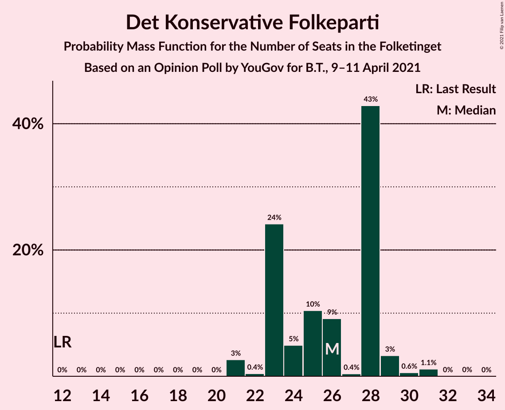
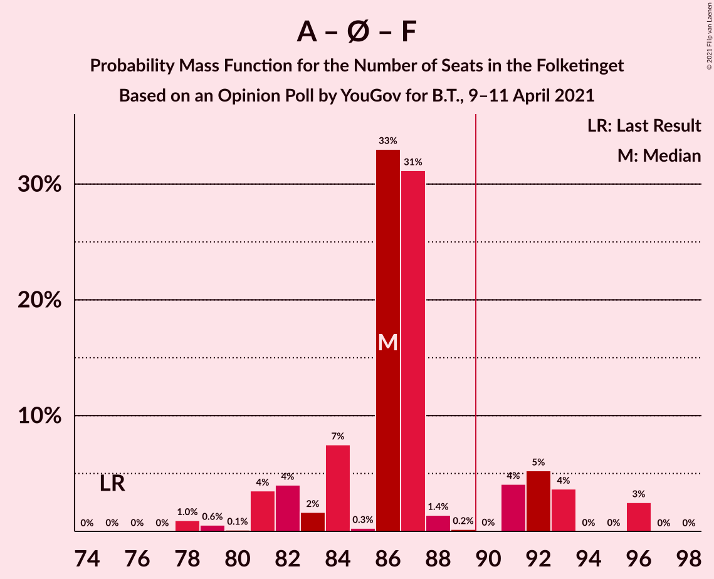
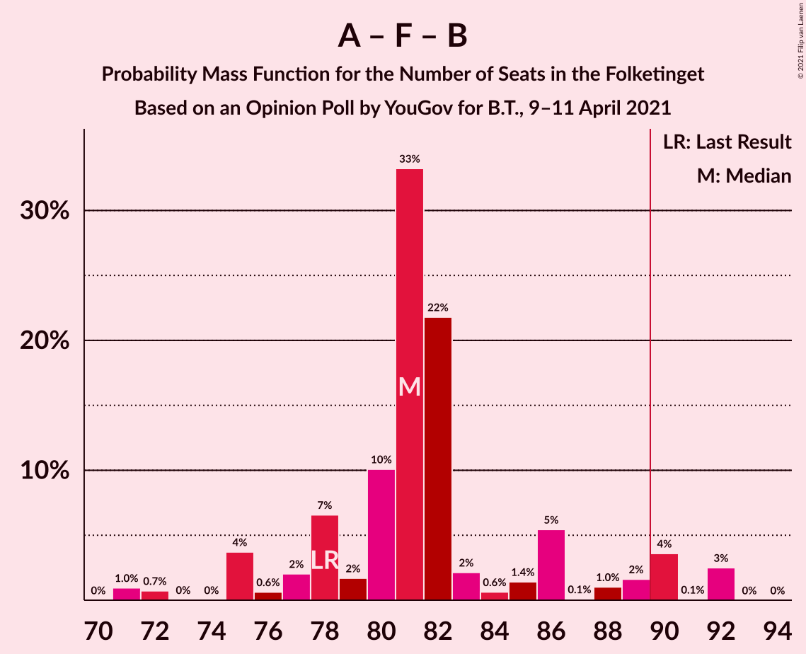

# Opinion Poll by YouGov for B.T., 9–11 April 2021

<a href="#voting-intentions">Voting Intentions</a> | <a href="#seats">Seats</a> | <a href="#coalitions">Coalitions</a> | <a href="#technical-information">Technical Information</a>

## Voting Intentions

### Confidence Intervals

| Party | Last Result | Poll Result | 80% Confidence Interval | 90% Confidence Interval | 95% Confidence Interval | 99% Confidence Interval |
|:-----:|:-----------:|:-----------:|:-----------------------:|:-----------------------:|:-----------------------:|:-----------------------:|
| Socialdemokraterne | 25.9% | 33.2% | 31.6–35.0% |31.1–35.5% |30.7–35.9% |29.9–36.7% |
| Det Konservative Folkeparti | 6.6% | 15.0% | 13.8–16.4% |13.4–16.8% |13.2–17.1% |12.6–17.8% |
| Nye Borgerlige | 2.4% | 11.7% | 10.6–12.9% |10.3–13.3% |10.0–13.6% |9.5–14.2% |
| Venstre | 23.4% | 8.7% | 7.7–9.8% |7.5–10.1% |7.2–10.3% |6.8–10.9% |
| Enhedslisten–De Rød-Grønne | 6.9% | 7.4% | 6.5–8.4% |6.3–8.7% |6.1–9.0% |5.7–9.5% |
| Socialistisk Folkeparti | 7.7% | 7.4% | 6.5–8.4% |6.3–8.7% |6.1–9.0% |5.7–9.5% |
| Dansk Folkeparti | 8.7% | 6.8% | 6.0–7.8% |5.8–8.1% |5.6–8.4% |5.2–8.9% |
| Radikale Venstre | 8.6% | 4.8% | 4.1–5.6% |3.9–5.9% |3.7–6.1% |3.4–6.5% |
| Liberal Alliance | 2.3% | 2.9% | 2.3–3.6% |2.2–3.8% |2.1–3.9% |1.8–4.3% |
| Kristendemokraterne | 1.7% | 1.2% | 0.9–1.7% |0.8–1.8% |0.7–2.0% |0.6–2.2% |
| Veganerpartiet | 0.0% | 0.6% | 0.4–1.0% |0.4–1.2% |0.3–1.2% |0.2–1.5% |
| Alternativet | 3.0% | 0.3% | 0.2–0.6% |0.2–0.7% |0.1–0.8% |0.1–1.0% |

*Note:* The poll result column reflects the actual value used in the calculations. Published results may vary slightly, and in addition be rounded to fewer digits.

## Seats

### Confidence Intervals

| Party | Last Result | Median | 80% Confidence Interval | 90% Confidence Interval | 95% Confidence Interval | 99% Confidence Interval |
|:-----:|:-----------:|:------:|:-----------------------:|:-----------------------:|:-----------------------:|:-----------------------:|
| <a href="#socialdemokraterne">Socialdemokraterne</a> | 48 | 58 | 56–62 |55–66 |54–68 |50–69 |
| <a href="#det-konservative-folkeparti">Det Konservative Folkeparti</a> | 12 | 26 | 23–28 |23–29 |21–29 |21–31 |
| <a href="#nye-borgerlige">Nye Borgerlige</a> | 4 | 21 | 19–24 |19–24 |19–24 |16–25 |
| <a href="#venstre">Venstre</a> | 43 | 14 | 14–17 |14–20 |13–20 |12–21 |
| <a href="#enhedslisten–de-rød-grønne">Enhedslisten–De Rød-Grønne</a> | 13 | 14 | 13–15 |11–15 |11–16 |10–17 |
| <a href="#socialistisk-folkeparti">Socialistisk Folkeparti</a> | 14 | 14 | 11–16 |10–17 |10–17 |10–17 |
| <a href="#dansk-folkeparti">Dansk Folkeparti</a> | 16 | 13 | 10–13 |9–14 |9–14 |9–16 |
| <a href="#radikale-venstre">Radikale Venstre</a> | 16 | 9 | 7–10 |7–10 |7–11 |6–11 |
| <a href="#liberal-alliance">Liberal Alliance</a> | 4 | 5 | 4–6 |4–7 |0–8 |0–8 |
| <a href="#kristendemokraterne">Kristendemokraterne</a> | 0 | 0 | 0 |0–4 |0–4 |0–5 |
| <a href="#veganerpartiet">Veganerpartiet</a> | 0 | 0 | 0 |0 |0 |0 |
| <a href="#alternativet">Alternativet</a> | 5 | 0 | 0 |0 |0 |0 |

### Socialdemokraterne

*For a full overview of the results for this party, see the [Socialdemokraterne](party-socialdemokraterne.html) page.*

| Number of Seats | Probability | Accumulated | Special Marks |
|:---------------:|:-----------:|:-----------:|:-------------:|
| 48 | 0% | 100% | Last Result |
| 49 | 0% | 100% |  |
| 50 | 1.0% | 100% |  |
| 51 | 0.2% | 99.0% |  |
| 52 | 0.4% | 98.8% |  |
| 53 | 0.2% | 98% |  |
| 54 | 3% | 98% |  |
| 55 | 1.2% | 96% |  |
| 56 | 10% | 94% |  |
| 57 | 2% | 84% |  |
| 58 | 35% | 82% | Median |
| 59 | 0.9% | 47% |  |
| 60 | 2% | 46% |  |
| 61 | 34% | 44% |  |
| 62 | 0.4% | 10% |  |
| 63 | 0.1% | 10% |  |
| 64 | 2% | 10% |  |
| 65 | 0% | 8% |  |
| 66 | 4% | 8% |  |
| 67 | 0.1% | 4% |  |
| 68 | 3% | 3% |  |
| 69 | 0.9% | 0.9% |  |
| 70 | 0% | 0% |  |

### Det Konservative Folkeparti

*For a full overview of the results for this party, see the [Det Konservative Folkeparti](party-detkonservativefolkeparti.html) page.*

| Number of Seats | Probability | Accumulated | Special Marks |
|:---------------:|:-----------:|:-----------:|:-------------:|
| 12 | 0% | 100% | Last Result |
| 13 | 0% | 100% |  |
| 14 | 0% | 100% |  |
| 15 | 0% | 100% |  |
| 16 | 0% | 100% |  |
| 17 | 0% | 100% |  |
| 18 | 0% | 100% |  |
| 19 | 0% | 100% |  |
| 20 | 0% | 100% |  |
| 21 | 3% | 100% |  |
| 22 | 0.4% | 97% |  |
| 23 | 24% | 97% |  |
| 24 | 5% | 73% |  |
| 25 | 10% | 68% |  |
| 26 | 9% | 57% | Median |
| 27 | 0.4% | 48% |  |
| 28 | 43% | 48% |  |
| 29 | 3% | 5% |  |
| 30 | 0.6% | 2% |  |
| 31 | 1.1% | 1.2% |  |
| 32 | 0% | 0.1% |  |
| 33 | 0% | 0% |  |

### Nye Borgerlige

*For a full overview of the results for this party, see the [Nye Borgerlige](party-nyeborgerlige.html) page.*

| Number of Seats | Probability | Accumulated | Special Marks |
|:---------------:|:-----------:|:-----------:|:-------------:|
| 4 | 0% | 100% | Last Result |
| 5 | 0% | 100% |  |
| 6 | 0% | 100% |  |
| 7 | 0% | 100% |  |
| 8 | 0% | 100% |  |
| 9 | 0% | 100% |  |
| 10 | 0% | 100% |  |
| 11 | 0% | 100% |  |
| 12 | 0% | 100% |  |
| 13 | 0% | 100% |  |
| 14 | 0% | 100% |  |
| 15 | 0.1% | 100% |  |
| 16 | 0.5% | 99.9% |  |
| 17 | 0.7% | 99.4% |  |
| 18 | 1.0% | 98.7% |  |
| 19 | 10% | 98% |  |
| 20 | 37% | 88% |  |
| 21 | 7% | 51% | Median |
| 22 | 7% | 44% |  |
| 23 | 12% | 37% |  |
| 24 | 23% | 25% |  |
| 25 | 1.5% | 2% |  |
| 26 | 0.2% | 0.2% |  |
| 27 | 0% | 0% |  |

### Venstre

*For a full overview of the results for this party, see the [Venstre](party-venstre.html) page.*

| Number of Seats | Probability | Accumulated | Special Marks |
|:---------------:|:-----------:|:-----------:|:-------------:|
| 10 | 0.1% | 100% |  |
| 11 | 0.1% | 99.9% |  |
| 12 | 0.6% | 99.8% |  |
| 13 | 4% | 99.2% |  |
| 14 | 62% | 96% | Median |
| 15 | 10% | 34% |  |
| 16 | 5% | 24% |  |
| 17 | 11% | 19% |  |
| 18 | 0.2% | 8% |  |
| 19 | 2% | 8% |  |
| 20 | 5% | 6% |  |
| 21 | 0.7% | 1.2% |  |
| 22 | 0.5% | 0.5% |  |
| 23 | 0% | 0% |  |
| 24 | 0% | 0% |  |
| 25 | 0% | 0% |  |
| 26 | 0% | 0% |  |
| 27 | 0% | 0% |  |
| 28 | 0% | 0% |  |
| 29 | 0% | 0% |  |
| 30 | 0% | 0% |  |
| 31 | 0% | 0% |  |
| 32 | 0% | 0% |  |
| 33 | 0% | 0% |  |
| 34 | 0% | 0% |  |
| 35 | 0% | 0% |  |
| 36 | 0% | 0% |  |
| 37 | 0% | 0% |  |
| 38 | 0% | 0% |  |
| 39 | 0% | 0% |  |
| 40 | 0% | 0% |  |
| 41 | 0% | 0% |  |
| 42 | 0% | 0% |  |
| 43 | 0% | 0% | Last Result |

### Enhedslisten–De Rød-Grønne

*For a full overview of the results for this party, see the [Enhedslisten–De Rød-Grønne](party-enhedslisten–derød-grønne.html) page.*

| Number of Seats | Probability | Accumulated | Special Marks |
|:---------------:|:-----------:|:-----------:|:-------------:|
| 9 | 0.3% | 100% |  |
| 10 | 2% | 99.7% |  |
| 11 | 4% | 98% |  |
| 12 | 2% | 94% |  |
| 13 | 17% | 92% | Last Result |
| 14 | 45% | 75% | Median |
| 15 | 26% | 30% |  |
| 16 | 3% | 4% |  |
| 17 | 1.2% | 1.2% |  |
| 18 | 0% | 0.1% |  |
| 19 | 0% | 0% |  |

### Socialistisk Folkeparti

*For a full overview of the results for this party, see the [Socialistisk Folkeparti](party-socialistiskfolkeparti.html) page.*

| Number of Seats | Probability | Accumulated | Special Marks |
|:---------------:|:-----------:|:-----------:|:-------------:|
| 9 | 0.1% | 100% |  |
| 10 | 6% | 99.9% |  |
| 11 | 25% | 94% |  |
| 12 | 3% | 69% |  |
| 13 | 4% | 66% |  |
| 14 | 40% | 62% | Last Result, Median |
| 15 | 7% | 22% |  |
| 16 | 6% | 15% |  |
| 17 | 8% | 9% |  |
| 18 | 0% | 0.1% |  |
| 19 | 0.1% | 0.1% |  |
| 20 | 0% | 0% |  |

### Dansk Folkeparti

*For a full overview of the results for this party, see the [Dansk Folkeparti](party-danskfolkeparti.html) page.*

| Number of Seats | Probability | Accumulated | Special Marks |
|:---------------:|:-----------:|:-----------:|:-------------:|
| 9 | 6% | 100% |  |
| 10 | 4% | 94% |  |
| 11 | 20% | 89% |  |
| 12 | 5% | 69% |  |
| 13 | 57% | 64% | Median |
| 14 | 5% | 7% |  |
| 15 | 1.4% | 2% |  |
| 16 | 0.4% | 0.6% | Last Result |
| 17 | 0.2% | 0.2% |  |
| 18 | 0% | 0% |  |

### Radikale Venstre

*For a full overview of the results for this party, see the [Radikale Venstre](party-radikalevenstre.html) page.*

| Number of Seats | Probability | Accumulated | Special Marks |
|:---------------:|:-----------:|:-----------:|:-------------:|
| 5 | 0% | 100% |  |
| 6 | 1.3% | 99.9% |  |
| 7 | 21% | 98.7% |  |
| 8 | 4% | 77% |  |
| 9 | 43% | 73% | Median |
| 10 | 27% | 30% |  |
| 11 | 3% | 3% |  |
| 12 | 0.2% | 0.2% |  |
| 13 | 0% | 0% |  |
| 14 | 0% | 0% |  |
| 15 | 0% | 0% |  |
| 16 | 0% | 0% | Last Result |

### Liberal Alliance

*For a full overview of the results for this party, see the [Liberal Alliance](party-liberalalliance.html) page.*

| Number of Seats | Probability | Accumulated | Special Marks |
|:---------------:|:-----------:|:-----------:|:-------------:|
| 0 | 5% | 100% |  |
| 1 | 0% | 95% |  |
| 2 | 0% | 95% |  |
| 3 | 0% | 95% |  |
| 4 | 39% | 95% | Last Result |
| 5 | 39% | 56% | Median |
| 6 | 10% | 17% |  |
| 7 | 3% | 7% |  |
| 8 | 3% | 3% |  |
| 9 | 0.1% | 0.1% |  |
| 10 | 0% | 0% |  |

### Kristendemokraterne

*For a full overview of the results for this party, see the [Kristendemokraterne](party-kristendemokraterne.html) page.*

| Number of Seats | Probability | Accumulated | Special Marks |
|:---------------:|:-----------:|:-----------:|:-------------:|
| 0 | 95% | 100% | Last Result, Median |
| 1 | 0% | 5% |  |
| 2 | 0% | 5% |  |
| 3 | 0% | 5% |  |
| 4 | 4% | 5% |  |
| 5 | 2% | 2% |  |
| 6 | 0% | 0% |  |

### Veganerpartiet

*For a full overview of the results for this party, see the [Veganerpartiet](party-veganerpartiet.html) page.*

| Number of Seats | Probability | Accumulated | Special Marks |
|:---------------:|:-----------:|:-----------:|:-------------:|
| 0 | 99.9% | 100% | Last Result, Median |
| 1 | 0% | 0.1% |  |
| 2 | 0% | 0.1% |  |
| 3 | 0% | 0.1% |  |
| 4 | 0.1% | 0.1% |  |
| 5 | 0% | 0% |  |

### Alternativet

*For a full overview of the results for this party, see the [Alternativet](party-alternativet.html) page.*

| Number of Seats | Probability | Accumulated | Special Marks |
|:---------------:|:-----------:|:-----------:|:-------------:|
| 0 | 100% | 100% | Median |
| 1 | 0% | 0% |  |
| 2 | 0% | 0% |  |
| 3 | 0% | 0% |  |
| 4 | 0% | 0% |  |
| 5 | 0% | 0% | Last Result |

## Coalitions

### Confidence Intervals

| Coalition | Last Result | Median | Majority? | 80% Confidence Interval | 90% Confidence Interval | 95% Confidence Interval | 99% Confidence Interval |
|:---------:|:-----------:|:------:|:---------:|:-----------------------:|:-----------------------:|:-----------------------:|:-----------------------:|
| Socialdemokraterne – Enhedslisten–De Rød-Grønne – Socialistisk Folkeparti – Radikale Venstre – Alternativet | 96 | 95 | 95% | 91–101 | 89–103 | 88–105 | 85–105 |
| Socialdemokraterne – Enhedslisten–De Rød-Grønne – Socialistisk Folkeparti – Radikale Venstre | 91 | 95 | 95% | 91–101 | 89–103 | 88–105 | 85–105 |
| Socialdemokraterne – Enhedslisten–De Rød-Grønne – Socialistisk Folkeparti – Alternativet | 80 | 86 | 16% | 83–92 | 81–93 | 81–96 | 78–96 |
| Socialdemokraterne – Enhedslisten–De Rød-Grønne – Socialistisk Folkeparti | 75 | 86 | 16% | 83–92 | 81–93 | 81–96 | 78–96 |
| Socialdemokraterne – Socialistisk Folkeparti – Radikale Venstre | 78 | 81 | 6% | 78–86 | 75–90 | 75–92 | 71–92 |
| Det Konservative Folkeparti – Nye Borgerlige – Venstre – Dansk Folkeparti – Liberal Alliance – Kristendemokraterne | 79 | 80 | 0.9% | 74–84 | 72–86 | 70–87 | 70–90 |
| Det Konservative Folkeparti – Nye Borgerlige – Venstre – Dansk Folkeparti – Liberal Alliance | 79 | 80 | 0.9% | 74–84 | 72–84 | 70–86 | 70–90 |
| Socialdemokraterne – Radikale Venstre | 64 | 67 | 0% | 63–71 | 63–76 | 62–77 | 57–78 |
| Det Konservative Folkeparti – Venstre – Dansk Folkeparti – Liberal Alliance – Kristendemokraterne | 75 | 60 | 0% | 54–62 | 51–65 | 50–67 | 50–68 |
| Det Konservative Folkeparti – Venstre – Dansk Folkeparti – Liberal Alliance | 75 | 59 | 0% | 54–62 | 51–62 | 50–67 | 50–68 |
| Det Konservative Folkeparti – Venstre – Liberal Alliance | 59 | 47 | 0% | 41–50 | 39–51 | 39–53 | 39–55 |
| Det Konservative Folkeparti – Venstre | 55 | 42 | 0% | 37–44 | 37–45 | 35–45 | 35–50 |
| Venstre | 43 | 14 | 0% | 14–17 | 14–20 | 13–20 | 12–21 |

### Socialdemokraterne – Enhedslisten–De Rød-Grønne – Socialistisk Folkeparti – Radikale Venstre – Alternativet

| Number of Seats | Probability | Accumulated | Special Marks |
|:---------------:|:-----------:|:-----------:|:-------------:|
| 85 | 0.8% | 100% |  |
| 86 | 0% | 99.1% |  |
| 87 | 0% | 99.1% |  |
| 88 | 2% | 99.1% |  |
| 89 | 2% | 97% |  |
| 90 | 2% | 95% | Majority |
| 91 | 8% | 92% |  |
| 92 | 1.4% | 84% |  |
| 93 | 0.3% | 83% |  |
| 94 | 11% | 82% |  |
| 95 | 33% | 72% | Median |
| 96 | 0.9% | 39% | Last Result |
| 97 | 22% | 38% |  |
| 98 | 0.2% | 16% |  |
| 99 | 2% | 15% |  |
| 100 | 0.9% | 13% |  |
| 101 | 5% | 13% |  |
| 102 | 2% | 8% |  |
| 103 | 4% | 6% |  |
| 104 | 0% | 3% |  |
| 105 | 3% | 3% |  |
| 106 | 0% | 0% |  |

### Socialdemokraterne – Enhedslisten–De Rød-Grønne – Socialistisk Folkeparti – Radikale Venstre

| Number of Seats | Probability | Accumulated | Special Marks |
|:---------------:|:-----------:|:-----------:|:-------------:|
| 85 | 0.8% | 100% |  |
| 86 | 0% | 99.1% |  |
| 87 | 0% | 99.1% |  |
| 88 | 2% | 99.1% |  |
| 89 | 2% | 97% |  |
| 90 | 2% | 95% | Majority |
| 91 | 8% | 92% | Last Result |
| 92 | 1.4% | 84% |  |
| 93 | 0.3% | 83% |  |
| 94 | 11% | 82% |  |
| 95 | 33% | 72% | Median |
| 96 | 0.9% | 39% |  |
| 97 | 22% | 38% |  |
| 98 | 0.2% | 16% |  |
| 99 | 2% | 15% |  |
| 100 | 0.9% | 13% |  |
| 101 | 5% | 13% |  |
| 102 | 2% | 8% |  |
| 103 | 4% | 6% |  |
| 104 | 0% | 3% |  |
| 105 | 3% | 3% |  |
| 106 | 0% | 0% |  |

### Socialdemokraterne – Enhedslisten–De Rød-Grønne – Socialistisk Folkeparti – Alternativet

| Number of Seats | Probability | Accumulated | Special Marks |
|:---------------:|:-----------:|:-----------:|:-------------:|
| 78 | 1.0% | 100% |  |
| 79 | 0.6% | 99.0% |  |
| 80 | 0.1% | 98% | Last Result |
| 81 | 4% | 98% |  |
| 82 | 4% | 95% |  |
| 83 | 2% | 91% |  |
| 84 | 7% | 89% |  |
| 85 | 0.3% | 82% |  |
| 86 | 33% | 81% | Median |
| 87 | 31% | 48% |  |
| 88 | 1.4% | 17% |  |
| 89 | 0.2% | 16% |  |
| 90 | 0% | 16% | Majority |
| 91 | 4% | 16% |  |
| 92 | 5% | 11% |  |
| 93 | 4% | 6% |  |
| 94 | 0% | 3% |  |
| 95 | 0% | 3% |  |
| 96 | 3% | 3% |  |
| 97 | 0% | 0% |  |

### Socialdemokraterne – Enhedslisten–De Rød-Grønne – Socialistisk Folkeparti

| Number of Seats | Probability | Accumulated | Special Marks |
|:---------------:|:-----------:|:-----------:|:-------------:|
| 75 | 0% | 100% | Last Result |
| 76 | 0% | 100% |  |
| 77 | 0% | 100% |  |
| 78 | 1.0% | 100% |  |
| 79 | 0.6% | 99.0% |  |
| 80 | 0.1% | 98% |  |
| 81 | 4% | 98% |  |
| 82 | 4% | 95% |  |
| 83 | 2% | 91% |  |
| 84 | 7% | 89% |  |
| 85 | 0.3% | 82% |  |
| 86 | 33% | 81% | Median |
| 87 | 31% | 48% |  |
| 88 | 1.4% | 17% |  |
| 89 | 0.2% | 16% |  |
| 90 | 0% | 16% | Majority |
| 91 | 4% | 16% |  |
| 92 | 5% | 11% |  |
| 93 | 4% | 6% |  |
| 94 | 0% | 3% |  |
| 95 | 0% | 3% |  |
| 96 | 3% | 3% |  |
| 97 | 0% | 0% |  |

### Socialdemokraterne – Socialistisk Folkeparti – Radikale Venstre

| Number of Seats | Probability | Accumulated | Special Marks |
|:---------------:|:-----------:|:-----------:|:-------------:|
| 71 | 1.0% | 100% |  |
| 72 | 0.7% | 99.0% |  |
| 73 | 0% | 98% |  |
| 74 | 0% | 98% |  |
| 75 | 4% | 98% |  |
| 76 | 0.6% | 95% |  |
| 77 | 2% | 94% |  |
| 78 | 7% | 92% | Last Result |
| 79 | 2% | 85% |  |
| 80 | 10% | 84% |  |
| 81 | 33% | 74% | Median |
| 82 | 22% | 40% |  |
| 83 | 2% | 19% |  |
| 84 | 0.6% | 16% |  |
| 85 | 1.4% | 16% |  |
| 86 | 5% | 14% |  |
| 87 | 0.1% | 9% |  |
| 88 | 1.0% | 9% |  |
| 89 | 2% | 8% |  |
| 90 | 4% | 6% | Majority |
| 91 | 0.1% | 3% |  |
| 92 | 3% | 3% |  |
| 93 | 0% | 0% |  |

### Det Konservative Folkeparti – Nye Borgerlige – Venstre – Dansk Folkeparti – Liberal Alliance – Kristendemokraterne

| Number of Seats | Probability | Accumulated | Special Marks |
|:---------------:|:-----------:|:-----------:|:-------------:|
| 70 | 3% | 100% |  |
| 71 | 0% | 97% |  |
| 72 | 4% | 97% |  |
| 73 | 2% | 94% |  |
| 74 | 5% | 92% |  |
| 75 | 0.9% | 87% |  |
| 76 | 2% | 87% |  |
| 77 | 0.2% | 85% |  |
| 78 | 22% | 84% |  |
| 79 | 0.9% | 62% | Last Result, Median |
| 80 | 33% | 61% |  |
| 81 | 11% | 28% |  |
| 82 | 0.3% | 18% |  |
| 83 | 1.4% | 17% |  |
| 84 | 8% | 16% |  |
| 85 | 3% | 8% |  |
| 86 | 2% | 5% |  |
| 87 | 2% | 3% |  |
| 88 | 0% | 0.9% |  |
| 89 | 0% | 0.9% |  |
| 90 | 0.8% | 0.9% | Majority |
| 91 | 0% | 0% |  |

### Det Konservative Folkeparti – Nye Borgerlige – Venstre – Dansk Folkeparti – Liberal Alliance

| Number of Seats | Probability | Accumulated | Special Marks |
|:---------------:|:-----------:|:-----------:|:-------------:|
| 70 | 3% | 100% |  |
| 71 | 0% | 97% |  |
| 72 | 4% | 97% |  |
| 73 | 2% | 94% |  |
| 74 | 5% | 92% |  |
| 75 | 0.9% | 87% |  |
| 76 | 2% | 86% |  |
| 77 | 0.2% | 84% |  |
| 78 | 22% | 84% |  |
| 79 | 0.7% | 62% | Last Result, Median |
| 80 | 34% | 61% |  |
| 81 | 12% | 27% |  |
| 82 | 2% | 15% |  |
| 83 | 1.4% | 13% |  |
| 84 | 7% | 11% |  |
| 85 | 1.3% | 4% |  |
| 86 | 0.8% | 3% |  |
| 87 | 1.1% | 2% |  |
| 88 | 0% | 0.9% |  |
| 89 | 0% | 0.9% |  |
| 90 | 0.8% | 0.9% | Majority |
| 91 | 0% | 0% |  |

### Socialdemokraterne – Radikale Venstre

| Number of Seats | Probability | Accumulated | Special Marks |
|:---------------:|:-----------:|:-----------:|:-------------:|
| 57 | 1.0% | 100% |  |
| 58 | 0% | 99.0% |  |
| 59 | 0% | 99.0% |  |
| 60 | 0.3% | 99.0% |  |
| 61 | 0.9% | 98.7% |  |
| 62 | 0.5% | 98% |  |
| 63 | 11% | 97% |  |
| 64 | 3% | 86% | Last Result |
| 65 | 2% | 83% |  |
| 66 | 2% | 82% |  |
| 67 | 34% | 80% | Median |
| 68 | 7% | 46% |  |
| 69 | 2% | 39% |  |
| 70 | 5% | 36% |  |
| 71 | 22% | 32% |  |
| 72 | 0.1% | 10% |  |
| 73 | 0.8% | 10% |  |
| 74 | 0.1% | 9% |  |
| 75 | 2% | 9% |  |
| 76 | 4% | 7% |  |
| 77 | 3% | 3% |  |
| 78 | 0.9% | 0.9% |  |
| 79 | 0% | 0% |  |

### Det Konservative Folkeparti – Venstre – Dansk Folkeparti – Liberal Alliance – Kristendemokraterne

| Number of Seats | Probability | Accumulated | Special Marks |
|:---------------:|:-----------:|:-----------:|:-------------:|
| 50 | 3% | 100% |  |
| 51 | 4% | 97% |  |
| 52 | 0% | 94% |  |
| 53 | 0% | 94% |  |
| 54 | 23% | 94% |  |
| 55 | 5% | 71% |  |
| 56 | 1.2% | 66% |  |
| 57 | 3% | 65% |  |
| 58 | 10% | 62% | Median |
| 59 | 0.8% | 52% |  |
| 60 | 35% | 52% |  |
| 61 | 4% | 17% |  |
| 62 | 6% | 13% |  |
| 63 | 0.8% | 7% |  |
| 64 | 2% | 7% |  |
| 65 | 1.3% | 5% |  |
| 66 | 0.5% | 4% |  |
| 67 | 2% | 3% |  |
| 68 | 1.0% | 1.0% |  |
| 69 | 0% | 0% |  |
| 70 | 0% | 0% |  |
| 71 | 0% | 0% |  |
| 72 | 0% | 0% |  |
| 73 | 0% | 0% |  |
| 74 | 0% | 0% |  |
| 75 | 0% | 0% | Last Result |

### Det Konservative Folkeparti – Venstre – Dansk Folkeparti – Liberal Alliance

| Number of Seats | Probability | Accumulated | Special Marks |
|:---------------:|:-----------:|:-----------:|:-------------:|
| 50 | 3% | 100% |  |
| 51 | 4% | 97% |  |
| 52 | 0% | 94% |  |
| 53 | 0.1% | 94% |  |
| 54 | 23% | 94% |  |
| 55 | 5% | 71% |  |
| 56 | 2% | 66% |  |
| 57 | 4% | 63% |  |
| 58 | 10% | 60% | Median |
| 59 | 0.8% | 50% |  |
| 60 | 36% | 49% |  |
| 61 | 3% | 13% |  |
| 62 | 6% | 11% |  |
| 63 | 0.8% | 5% |  |
| 64 | 0.5% | 4% |  |
| 65 | 0.3% | 4% |  |
| 66 | 0.2% | 3% |  |
| 67 | 2% | 3% |  |
| 68 | 1.0% | 1.0% |  |
| 69 | 0% | 0% |  |
| 70 | 0% | 0% |  |
| 71 | 0% | 0% |  |
| 72 | 0% | 0% |  |
| 73 | 0% | 0% |  |
| 74 | 0% | 0% |  |
| 75 | 0% | 0% | Last Result |

### Det Konservative Folkeparti – Venstre – Liberal Alliance

| Number of Seats | Probability | Accumulated | Special Marks |
|:---------------:|:-----------:|:-----------:|:-------------:|
| 39 | 6% | 100% |  |
| 40 | 0% | 94% |  |
| 41 | 22% | 94% |  |
| 42 | 0% | 72% |  |
| 43 | 0.3% | 72% |  |
| 44 | 3% | 72% |  |
| 45 | 3% | 69% | Median |
| 46 | 7% | 66% |  |
| 47 | 43% | 59% |  |
| 48 | 2% | 15% |  |
| 49 | 1.0% | 14% |  |
| 50 | 4% | 13% |  |
| 51 | 5% | 9% |  |
| 52 | 0.2% | 3% |  |
| 53 | 2% | 3% |  |
| 54 | 0.1% | 1.3% |  |
| 55 | 1.2% | 1.2% |  |
| 56 | 0% | 0% |  |
| 57 | 0% | 0% |  |
| 58 | 0% | 0% |  |
| 59 | 0% | 0% | Last Result |

### Det Konservative Folkeparti – Venstre

| Number of Seats | Probability | Accumulated | Special Marks |
|:---------------:|:-----------:|:-----------:|:-------------:|
| 34 | 0.1% | 100% |  |
| 35 | 3% | 99.9% |  |
| 36 | 0% | 97% |  |
| 37 | 21% | 97% |  |
| 38 | 3% | 76% |  |
| 39 | 5% | 73% |  |
| 40 | 2% | 69% | Median |
| 41 | 4% | 67% |  |
| 42 | 39% | 63% |  |
| 43 | 12% | 24% |  |
| 44 | 3% | 12% |  |
| 45 | 7% | 9% |  |
| 46 | 0.8% | 2% |  |
| 47 | 0.2% | 2% |  |
| 48 | 0.1% | 1.3% |  |
| 49 | 0.7% | 1.2% |  |
| 50 | 0.5% | 0.5% |  |
| 51 | 0% | 0% |  |
| 52 | 0% | 0% |  |
| 53 | 0% | 0% |  |
| 54 | 0% | 0% |  |
| 55 | 0% | 0% | Last Result |

### Venstre

| Number of Seats | Probability | Accumulated | Special Marks |
|:---------------:|:-----------:|:-----------:|:-------------:|
| 10 | 0.1% | 100% |  |
| 11 | 0.1% | 99.9% |  |
| 12 | 0.6% | 99.8% |  |
| 13 | 4% | 99.2% |  |
| 14 | 62% | 96% | Median |
| 15 | 10% | 34% |  |
| 16 | 5% | 24% |  |
| 17 | 11% | 19% |  |
| 18 | 0.2% | 8% |  |
| 19 | 2% | 8% |  |
| 20 | 5% | 6% |  |
| 21 | 0.7% | 1.2% |  |
| 22 | 0.5% | 0.5% |  |
| 23 | 0% | 0% |  |
| 24 | 0% | 0% |  |
| 25 | 0% | 0% |  |
| 26 | 0% | 0% |  |
| 27 | 0% | 0% |  |
| 28 | 0% | 0% |  |
| 29 | 0% | 0% |  |
| 30 | 0% | 0% |  |
| 31 | 0% | 0% |  |
| 32 | 0% | 0% |  |
| 33 | 0% | 0% |  |
| 34 | 0% | 0% |  |
| 35 | 0% | 0% |  |
| 36 | 0% | 0% |  |
| 37 | 0% | 0% |  |
| 38 | 0% | 0% |  |
| 39 | 0% | 0% |  |
| 40 | 0% | 0% |  |
| 41 | 0% | 0% |  |
| 42 | 0% | 0% |  |
| 43 | 0% | 0% | Last Result |

## Technical Information

### Opinion Poll

+ **Polling firm:** YouGov
+ **Commissioner(s):** B.T.
+ **Fieldwork period:** 9–11 April 2021

### Calculations

+ **Sample size:** 1258
+ **Simulations done:** 131,072
+ **Error estimate:** 2.67%

