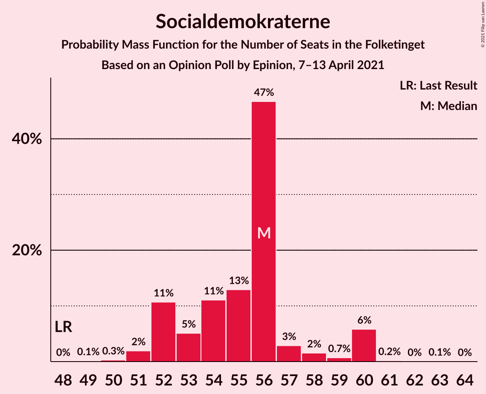
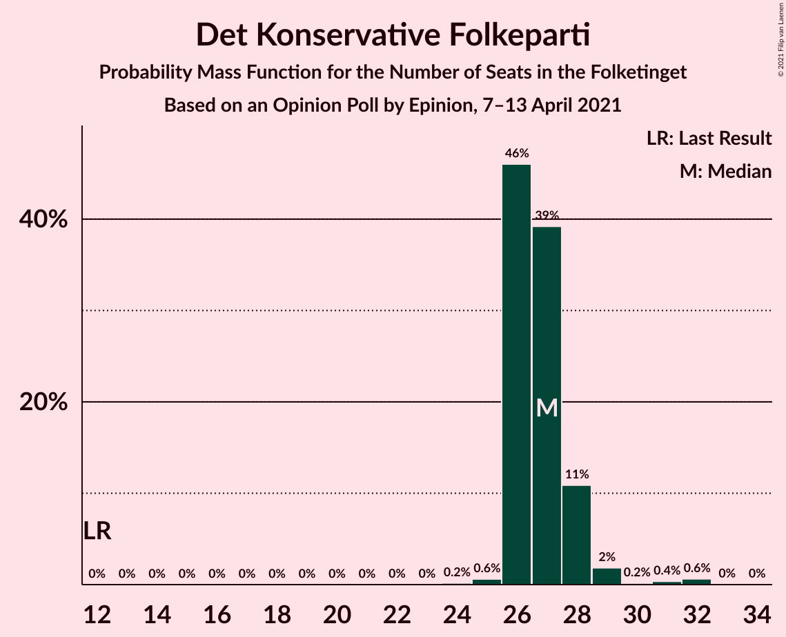
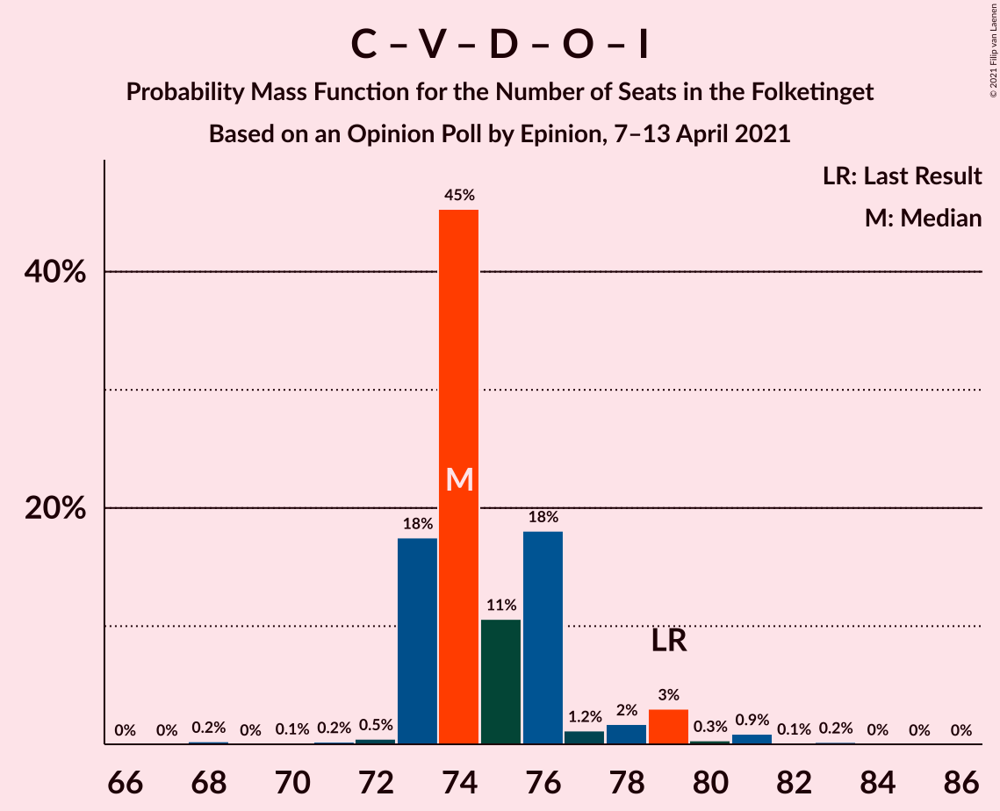
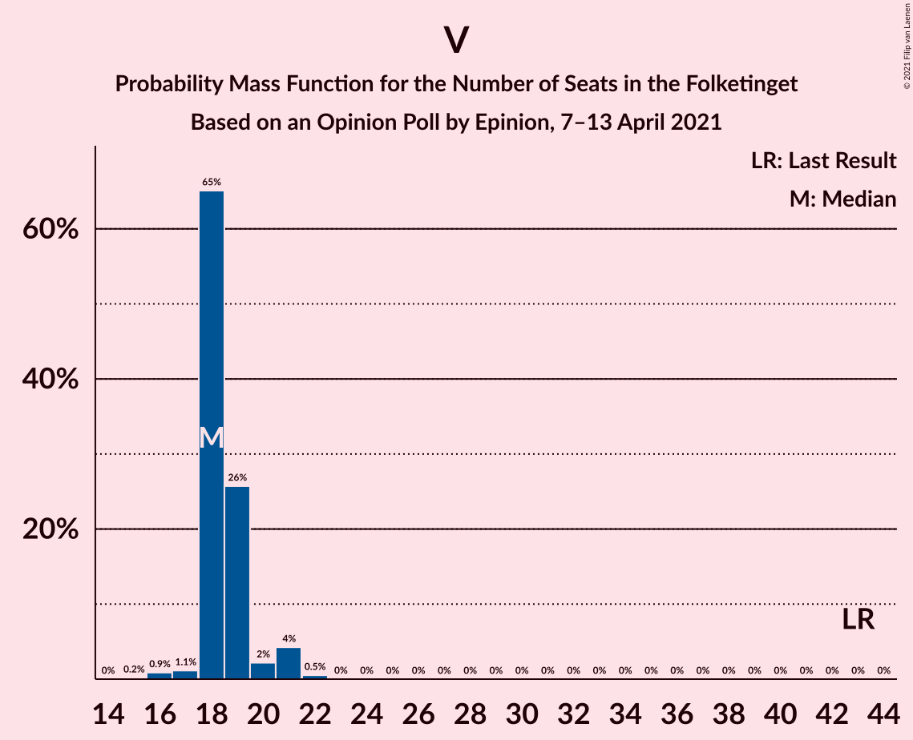

# Opinion Poll by Epinion, 7–13 April 2021

<a href="#voting-intentions">Voting Intentions</a> | <a href="#seats">Seats</a> | <a href="#coalitions">Coalitions</a> | <a href="#technical-information">Technical Information</a>

## Voting Intentions

### Confidence Intervals

| Party | Last Result | Poll Result | 80% Confidence Interval | 90% Confidence Interval | 95% Confidence Interval | 99% Confidence Interval |
|:-----:|:-----------:|:-----------:|:-----------------------:|:-----------------------:|:-----------------------:|:-----------------------:|
| Socialdemokraterne | 25.9% | 30.7% | 29.2–32.2% |28.8–32.6% |28.4–33.0% |27.8–33.7% |
| Det Konservative Folkeparti | 6.6% | 15.5% | 14.4–16.8% |14.1–17.1% |13.8–17.4% |13.3–18.0% |
| Venstre | 23.4% | 10.4% | 9.5–11.4% |9.2–11.7% |9.0–12.0% |8.6–12.5% |
| Nye Borgerlige | 2.4% | 8.8% | 8.0–9.8% |7.7–10.1% |7.5–10.3% |7.1–10.8% |
| Socialistisk Folkeparti | 7.7% | 8.1% | 7.3–9.1% |7.1–9.3% |6.9–9.6% |6.5–10.0% |
| Enhedslisten–De Rød-Grønne | 6.9% | 7.6% | 6.8–8.5% |6.6–8.8% |6.4–9.0% |6.0–9.5% |
| Dansk Folkeparti | 8.7% | 5.3% | 4.7–6.1% |4.5–6.4% |4.3–6.6% |4.0–7.0% |
| Radikale Venstre | 8.6% | 5.0% | 4.4–5.8% |4.2–6.0% |4.0–6.2% |3.7–6.6% |
| Liberal Alliance | 2.3% | 2.5% | 2.0–3.1% |1.9–3.2% |1.8–3.4% |1.6–3.7% |
| Kristendemokraterne | 1.7% | 2.2% | 1.8–2.8% |1.7–2.9% |1.6–3.1% |1.4–3.4% |
| Alternativet | 3.0% | 1.0% | 0.7–1.4% |0.7–1.5% |0.6–1.6% |0.5–1.9% |
| Veganerpartiet | 0.0% | 0.5% | 0.3–0.8% |0.3–0.9% |0.3–1.0% |0.2–1.2% |

*Note:* The poll result column reflects the actual value used in the calculations. Published results may vary slightly, and in addition be rounded to fewer digits.

## Seats

### Confidence Intervals

| Party | Last Result | Median | 80% Confidence Interval | 90% Confidence Interval | 95% Confidence Interval | 99% Confidence Interval |
|:-----:|:-----------:|:------:|:-----------------------:|:-----------------------:|:-----------------------:|:-----------------------:|
| <a href="#socialdemokraterne">Socialdemokraterne</a> | 48 | 60 | 51–60 |51–60 |51–60 |51–60 |
| <a href="#det-konservative-folkeparti">Det Konservative Folkeparti</a> | 12 | 26 | 26–28 |26–28 |26–29 |24–32 |
| <a href="#venstre">Venstre</a> | 43 | 19 | 19 |19–20 |17–21 |16–22 |
| <a href="#nye-borgerlige">Nye Borgerlige</a> | 4 | 16 | 16 |15–16 |14–17 |13–19 |
| <a href="#socialistisk-folkeparti">Socialistisk Folkeparti</a> | 14 | 15 | 13–17 |13–17 |12–17 |12–17 |
| <a href="#enhedslisten–de-rød-grønne">Enhedslisten–De Rød-Grønne</a> | 13 | 13 | 11–15 |10–15 |10–16 |10–16 |
| <a href="#dansk-folkeparti">Dansk Folkeparti</a> | 16 | 8 | 8–10 |8–10 |8–11 |8–12 |
| <a href="#radikale-venstre">Radikale Venstre</a> | 16 | 9 | 9–10 |9–10 |9–10 |8–10 |
| <a href="#liberal-alliance">Liberal Alliance</a> | 4 | 4 | 4–5 |4–5 |0–5 |0–5 |
| <a href="#kristendemokraterne">Kristendemokraterne</a> | 0 | 0 | 0–4 |0–4 |0–5 |0–5 |
| <a href="#alternativet">Alternativet</a> | 5 | 0 | 0 |0 |0 |0 |
| <a href="#veganerpartiet">Veganerpartiet</a> | 0 | 0 | 0 |0 |0 |0 |

### Socialdemokraterne

*For a full overview of the results for this party, see the [Socialdemokraterne](party-socialdemokraterne.html) page.*

| Number of Seats | Probability | Accumulated | Special Marks |
|:---------------:|:-----------:|:-----------:|:-------------:|
| 47 | 0.1% | 100% |  |
| 48 | 0% | 99.9% | Last Result |
| 49 | 0% | 99.9% |  |
| 50 | 0.2% | 99.8% |  |
| 51 | 15% | 99.7% |  |
| 52 | 3% | 84% |  |
| 53 | 2% | 82% |  |
| 54 | 0.1% | 80% |  |
| 55 | 13% | 80% |  |
| 56 | 4% | 67% |  |
| 57 | 0.1% | 63% |  |
| 58 | 0.3% | 63% |  |
| 59 | 0.1% | 63% |  |
| 60 | 63% | 63% | Median |
| 61 | 0% | 0.1% |  |
| 62 | 0% | 0% |  |

### Det Konservative Folkeparti

*For a full overview of the results for this party, see the [Det Konservative Folkeparti](party-detkonservativefolkeparti.html) page.*

| Number of Seats | Probability | Accumulated | Special Marks |
|:---------------:|:-----------:|:-----------:|:-------------:|
| 12 | 0% | 100% | Last Result |
| 13 | 0% | 100% |  |
| 14 | 0% | 100% |  |
| 15 | 0% | 100% |  |
| 16 | 0% | 100% |  |
| 17 | 0% | 100% |  |
| 18 | 0% | 100% |  |
| 19 | 0% | 100% |  |
| 20 | 0% | 100% |  |
| 21 | 0% | 100% |  |
| 22 | 0% | 100% |  |
| 23 | 0% | 100% |  |
| 24 | 0.7% | 100% |  |
| 25 | 0% | 99.3% |  |
| 26 | 80% | 99.2% | Median |
| 27 | 2% | 19% |  |
| 28 | 12% | 17% |  |
| 29 | 4% | 5% |  |
| 30 | 0.2% | 1.3% |  |
| 31 | 0.3% | 1.1% |  |
| 32 | 0.9% | 0.9% |  |
| 33 | 0% | 0% |  |

### Venstre

*For a full overview of the results for this party, see the [Venstre](party-venstre.html) page.*

| Number of Seats | Probability | Accumulated | Special Marks |
|:---------------:|:-----------:|:-----------:|:-------------:|
| 15 | 0.1% | 100% |  |
| 16 | 1.1% | 99.9% |  |
| 17 | 2% | 98.8% |  |
| 18 | 1.0% | 96% |  |
| 19 | 89% | 95% | Median |
| 20 | 3% | 6% |  |
| 21 | 2% | 4% |  |
| 22 | 2% | 2% |  |
| 23 | 0.1% | 0.1% |  |
| 24 | 0% | 0% |  |
| 25 | 0% | 0% |  |
| 26 | 0% | 0% |  |
| 27 | 0% | 0% |  |
| 28 | 0% | 0% |  |
| 29 | 0% | 0% |  |
| 30 | 0% | 0% |  |
| 31 | 0% | 0% |  |
| 32 | 0% | 0% |  |
| 33 | 0% | 0% |  |
| 34 | 0% | 0% |  |
| 35 | 0% | 0% |  |
| 36 | 0% | 0% |  |
| 37 | 0% | 0% |  |
| 38 | 0% | 0% |  |
| 39 | 0% | 0% |  |
| 40 | 0% | 0% |  |
| 41 | 0% | 0% |  |
| 42 | 0% | 0% |  |
| 43 | 0% | 0% | Last Result |

### Nye Borgerlige

*For a full overview of the results for this party, see the [Nye Borgerlige](party-nyeborgerlige.html) page.*

| Number of Seats | Probability | Accumulated | Special Marks |
|:---------------:|:-----------:|:-----------:|:-------------:|
| 4 | 0% | 100% | Last Result |
| 5 | 0% | 100% |  |
| 6 | 0% | 100% |  |
| 7 | 0% | 100% |  |
| 8 | 0% | 100% |  |
| 9 | 0% | 100% |  |
| 10 | 0% | 100% |  |
| 11 | 0% | 100% |  |
| 12 | 0% | 100% |  |
| 13 | 2% | 100% |  |
| 14 | 2% | 98% |  |
| 15 | 4% | 95% |  |
| 16 | 88% | 91% | Median |
| 17 | 1.5% | 3% |  |
| 18 | 2% | 2% |  |
| 19 | 0% | 0.5% |  |
| 20 | 0.3% | 0.5% |  |
| 21 | 0.1% | 0.1% |  |
| 22 | 0% | 0% |  |

### Socialistisk Folkeparti

*For a full overview of the results for this party, see the [Socialistisk Folkeparti](party-socialistiskfolkeparti.html) page.*

| Number of Seats | Probability | Accumulated | Special Marks |
|:---------------:|:-----------:|:-----------:|:-------------:|
| 12 | 4% | 100% |  |
| 13 | 12% | 96% |  |
| 14 | 1.1% | 84% | Last Result |
| 15 | 66% | 83% | Median |
| 16 | 3% | 18% |  |
| 17 | 15% | 15% |  |
| 18 | 0.3% | 0.3% |  |
| 19 | 0% | 0% |  |

### Enhedslisten–De Rød-Grønne

*For a full overview of the results for this party, see the [Enhedslisten–De Rød-Grønne](party-enhedslisten–derød-grønne.html) page.*

| Number of Seats | Probability | Accumulated | Special Marks |
|:---------------:|:-----------:|:-----------:|:-------------:|
| 10 | 9% | 100% |  |
| 11 | 3% | 91% |  |
| 12 | 0.6% | 88% |  |
| 13 | 63% | 88% | Last Result, Median |
| 14 | 4% | 24% |  |
| 15 | 17% | 20% |  |
| 16 | 3% | 3% |  |
| 17 | 0% | 0.1% |  |
| 18 | 0% | 0% |  |

### Dansk Folkeparti

*For a full overview of the results for this party, see the [Dansk Folkeparti](party-danskfolkeparti.html) page.*

| Number of Seats | Probability | Accumulated | Special Marks |
|:---------------:|:-----------:|:-----------:|:-------------:|
| 7 | 0.4% | 100% |  |
| 8 | 66% | 99.6% | Median |
| 9 | 19% | 33% |  |
| 10 | 10% | 15% |  |
| 11 | 3% | 4% |  |
| 12 | 1.1% | 1.1% |  |
| 13 | 0% | 0% |  |
| 14 | 0% | 0% |  |
| 15 | 0% | 0% |  |
| 16 | 0% | 0% | Last Result |

### Radikale Venstre

*For a full overview of the results for this party, see the [Radikale Venstre](party-radikalevenstre.html) page.*

| Number of Seats | Probability | Accumulated | Special Marks |
|:---------------:|:-----------:|:-----------:|:-------------:|
| 6 | 0.1% | 100% |  |
| 7 | 0.3% | 99.9% |  |
| 8 | 1.0% | 99.6% |  |
| 9 | 77% | 98.6% | Median |
| 10 | 21% | 22% |  |
| 11 | 0.2% | 0.3% |  |
| 12 | 0.1% | 0.1% |  |
| 13 | 0% | 0% |  |
| 14 | 0% | 0% |  |
| 15 | 0% | 0% |  |
| 16 | 0% | 0% | Last Result |

### Liberal Alliance

*For a full overview of the results for this party, see the [Liberal Alliance](party-liberalalliance.html) page.*

| Number of Seats | Probability | Accumulated | Special Marks |
|:---------------:|:-----------:|:-----------:|:-------------:|
| 0 | 3% | 100% |  |
| 1 | 0% | 97% |  |
| 2 | 0% | 97% |  |
| 3 | 0% | 97% |  |
| 4 | 79% | 97% | Last Result, Median |
| 5 | 18% | 18% |  |
| 6 | 0.2% | 0.3% |  |
| 7 | 0% | 0% |  |

### Kristendemokraterne

*For a full overview of the results for this party, see the [Kristendemokraterne](party-kristendemokraterne.html) page.*

| Number of Seats | Probability | Accumulated | Special Marks |
|:---------------:|:-----------:|:-----------:|:-------------:|
| 0 | 64% | 100% | Last Result, Median |
| 1 | 0% | 36% |  |
| 2 | 0% | 36% |  |
| 3 | 0% | 36% |  |
| 4 | 32% | 36% |  |
| 5 | 3% | 3% |  |
| 6 | 0.1% | 0.1% |  |
| 7 | 0% | 0% |  |

### Alternativet

*For a full overview of the results for this party, see the [Alternativet](party-alternativet.html) page.*

| Number of Seats | Probability | Accumulated | Special Marks |
|:---------------:|:-----------:|:-----------:|:-------------:|
| 0 | 99.9% | 100% | Median |
| 1 | 0% | 0.1% |  |
| 2 | 0% | 0.1% |  |
| 3 | 0% | 0.1% |  |
| 4 | 0.1% | 0.1% |  |
| 5 | 0% | 0% | Last Result |

### Veganerpartiet

*For a full overview of the results for this party, see the [Veganerpartiet](party-veganerpartiet.html) page.*

| Number of Seats | Probability | Accumulated | Special Marks |
|:---------------:|:-----------:|:-----------:|:-------------:|
| 0 | 100% | 100% | Last Result, Median |

## Coalitions

### Confidence Intervals

| Coalition | Last Result | Median | Majority? | 80% Confidence Interval | 90% Confidence Interval | 95% Confidence Interval | 99% Confidence Interval |
|:---------:|:-----------:|:------:|:---------:|:-----------------------:|:-----------------------:|:-----------------------:|:-----------------------:|
| Socialdemokraterne – Socialistisk Folkeparti – Enhedslisten–De Rød-Grønne – Radikale Venstre – Alternativet | 96 | 97 | 86% | 89–97 | 87–97 | 87–97 | 87–97 |
| Socialdemokraterne – Socialistisk Folkeparti – Enhedslisten–De Rød-Grønne – Radikale Venstre | 91 | 97 | 86% | 89–97 | 87–97 | 87–97 | 87–97 |
| Socialdemokraterne – Socialistisk Folkeparti – Enhedslisten–De Rød-Grønne – Alternativet | 80 | 88 | 0.3% | 79–88 | 78–88 | 78–88 | 77–89 |
| Socialdemokraterne – Socialistisk Folkeparti – Enhedslisten–De Rød-Grønne | 75 | 88 | 0.3% | 79–88 | 78–88 | 78–88 | 77–89 |
| Socialdemokraterne – Socialistisk Folkeparti – Radikale Venstre | 78 | 84 | 0% | 77–84 | 76–84 | 75–84 | 74–84 |
| Det Konservative Folkeparti – Venstre – Nye Borgerlige – Dansk Folkeparti – Liberal Alliance – Kristendemokraterne | 79 | 73 | 0% | 73–82 | 73–82 | 73–82 | 73–85 |
| Det Konservative Folkeparti – Venstre – Nye Borgerlige – Dansk Folkeparti – Liberal Alliance | 79 | 73 | 0% | 73–78 | 73–78 | 71–78 | 68–83 |
| Socialdemokraterne – Radikale Venstre | 64 | 69 | 0% | 61–69 | 61–69 | 61–69 | 60–69 |
| Det Konservative Folkeparti – Venstre – Dansk Folkeparti – Liberal Alliance – Kristendemokraterne | 75 | 57 | 0% | 57–66 | 57–66 | 57–66 | 56–68 |
| Det Konservative Folkeparti – Venstre – Dansk Folkeparti – Liberal Alliance | 75 | 57 | 0% | 57–62 | 57–62 | 56–63 | 54–66 |
| Det Konservative Folkeparti – Venstre – Liberal Alliance | 59 | 49 | 0% | 49–52 | 49–52 | 46–54 | 46–58 |
| Det Konservative Folkeparti – Venstre | 55 | 45 | 0% | 45–47 | 45–47 | 45–49 | 42–53 |
| Venstre | 43 | 19 | 0% | 19 | 19–20 | 17–21 | 16–22 |

### Socialdemokraterne – Socialistisk Folkeparti – Enhedslisten–De Rød-Grønne – Radikale Venstre – Alternativet

| Number of Seats | Probability | Accumulated | Special Marks |
|:---------------:|:-----------:|:-----------:|:-------------:|
| 84 | 0.1% | 100% |  |
| 85 | 0.1% | 99.9% |  |
| 86 | 0.2% | 99.8% |  |
| 87 | 9% | 99.5% |  |
| 88 | 0.4% | 90% |  |
| 89 | 4% | 90% |  |
| 90 | 1.0% | 86% | Majority |
| 91 | 3% | 85% |  |
| 92 | 1.4% | 82% |  |
| 93 | 15% | 81% |  |
| 94 | 0.4% | 66% |  |
| 95 | 0.1% | 65% |  |
| 96 | 0.3% | 65% | Last Result |
| 97 | 65% | 65% | Median |
| 98 | 0.1% | 0.4% |  |
| 99 | 0.3% | 0.3% |  |
| 100 | 0.1% | 0.1% |  |
| 101 | 0% | 0% |  |

### Socialdemokraterne – Socialistisk Folkeparti – Enhedslisten–De Rød-Grønne – Radikale Venstre

| Number of Seats | Probability | Accumulated | Special Marks |
|:---------------:|:-----------:|:-----------:|:-------------:|
| 84 | 0.1% | 100% |  |
| 85 | 0.1% | 99.9% |  |
| 86 | 0.2% | 99.8% |  |
| 87 | 9% | 99.5% |  |
| 88 | 0.4% | 90% |  |
| 89 | 4% | 90% |  |
| 90 | 1.0% | 86% | Majority |
| 91 | 3% | 85% | Last Result |
| 92 | 1.4% | 82% |  |
| 93 | 15% | 81% |  |
| 94 | 0.5% | 66% |  |
| 95 | 0.1% | 65% |  |
| 96 | 0.3% | 65% |  |
| 97 | 65% | 65% | Median |
| 98 | 0% | 0.3% |  |
| 99 | 0.3% | 0.3% |  |
| 100 | 0.1% | 0.1% |  |
| 101 | 0% | 0% |  |

### Socialdemokraterne – Socialistisk Folkeparti – Enhedslisten–De Rød-Grønne – Alternativet

| Number of Seats | Probability | Accumulated | Special Marks |
|:---------------:|:-----------:|:-----------:|:-------------:|
| 74 | 0.1% | 100% |  |
| 75 | 0.1% | 99.9% |  |
| 76 | 0.2% | 99.8% |  |
| 77 | 0.1% | 99.5% |  |
| 78 | 9% | 99.5% |  |
| 79 | 2% | 90% |  |
| 80 | 2% | 88% | Last Result |
| 81 | 1.2% | 86% |  |
| 82 | 3% | 85% |  |
| 83 | 15% | 81% |  |
| 84 | 0.6% | 67% |  |
| 85 | 0.5% | 66% |  |
| 86 | 0.1% | 65% |  |
| 87 | 2% | 65% |  |
| 88 | 62% | 63% | Median |
| 89 | 0.4% | 0.7% |  |
| 90 | 0.3% | 0.3% | Majority |
| 91 | 0% | 0.1% |  |
| 92 | 0% | 0% |  |

### Socialdemokraterne – Socialistisk Folkeparti – Enhedslisten–De Rød-Grønne

| Number of Seats | Probability | Accumulated | Special Marks |
|:---------------:|:-----------:|:-----------:|:-------------:|
| 74 | 0.1% | 100% |  |
| 75 | 0.1% | 99.9% | Last Result |
| 76 | 0.2% | 99.8% |  |
| 77 | 0.1% | 99.5% |  |
| 78 | 9% | 99.5% |  |
| 79 | 2% | 90% |  |
| 80 | 2% | 88% |  |
| 81 | 1.2% | 86% |  |
| 82 | 3% | 85% |  |
| 83 | 15% | 81% |  |
| 84 | 0.6% | 67% |  |
| 85 | 0.6% | 66% |  |
| 86 | 0.1% | 65% |  |
| 87 | 2% | 65% |  |
| 88 | 62% | 63% | Median |
| 89 | 0.3% | 0.6% |  |
| 90 | 0.3% | 0.3% | Majority |
| 91 | 0% | 0.1% |  |
| 92 | 0% | 0% |  |

### Socialdemokraterne – Socialistisk Folkeparti – Radikale Venstre

| Number of Seats | Probability | Accumulated | Special Marks |
|:---------------:|:-----------:|:-----------:|:-------------:|
| 72 | 0.1% | 100% |  |
| 73 | 0.2% | 99.9% |  |
| 74 | 0.4% | 99.7% |  |
| 75 | 2% | 99.4% |  |
| 76 | 3% | 97% |  |
| 77 | 10% | 94% |  |
| 78 | 17% | 84% | Last Result |
| 79 | 0.1% | 66% |  |
| 80 | 0.4% | 66% |  |
| 81 | 3% | 66% |  |
| 82 | 0.4% | 63% |  |
| 83 | 0% | 63% |  |
| 84 | 62% | 63% | Median |
| 85 | 0.3% | 0.4% |  |
| 86 | 0.1% | 0.1% |  |
| 87 | 0% | 0% |  |

### Det Konservative Folkeparti – Venstre – Nye Borgerlige – Dansk Folkeparti – Liberal Alliance – Kristendemokraterne

| Number of Seats | Probability | Accumulated | Special Marks |
|:---------------:|:-----------:|:-----------:|:-------------:|
| 71 | 0.2% | 100% |  |
| 72 | 0.1% | 99.8% |  |
| 73 | 65% | 99.7% | Median |
| 74 | 0.4% | 35% |  |
| 75 | 0.1% | 35% |  |
| 76 | 0.3% | 35% |  |
| 77 | 0% | 34% |  |
| 78 | 15% | 34% |  |
| 79 | 3% | 19% | Last Result |
| 80 | 3% | 17% |  |
| 81 | 0.5% | 14% |  |
| 82 | 12% | 13% |  |
| 83 | 0.8% | 2% |  |
| 84 | 0.1% | 1.0% |  |
| 85 | 0.7% | 0.9% |  |
| 86 | 0% | 0.2% |  |
| 87 | 0.2% | 0.2% |  |
| 88 | 0% | 0% |  |

### Det Konservative Folkeparti – Venstre – Nye Borgerlige – Dansk Folkeparti – Liberal Alliance

| Number of Seats | Probability | Accumulated | Special Marks |
|:---------------:|:-----------:|:-----------:|:-------------:|
| 68 | 2% | 100% |  |
| 69 | 0% | 98% |  |
| 70 | 0% | 98% |  |
| 71 | 0.3% | 98% |  |
| 72 | 0.1% | 97% |  |
| 73 | 62% | 97% | Median |
| 74 | 16% | 35% |  |
| 75 | 2% | 19% |  |
| 76 | 3% | 17% |  |
| 77 | 0.4% | 14% |  |
| 78 | 11% | 14% |  |
| 79 | 0.2% | 2% | Last Result |
| 80 | 0.2% | 2% |  |
| 81 | 0.6% | 2% |  |
| 82 | 0% | 1.1% |  |
| 83 | 1.0% | 1.1% |  |
| 84 | 0% | 0.1% |  |
| 85 | 0% | 0% |  |

### Socialdemokraterne – Radikale Venstre

| Number of Seats | Probability | Accumulated | Special Marks |
|:---------------:|:-----------:|:-----------:|:-------------:|
| 57 | 0.1% | 100% |  |
| 58 | 0% | 99.9% |  |
| 59 | 0.1% | 99.9% |  |
| 60 | 1.0% | 99.8% |  |
| 61 | 15% | 98.8% |  |
| 62 | 4% | 84% |  |
| 63 | 0.2% | 80% |  |
| 64 | 12% | 79% | Last Result |
| 65 | 1.0% | 68% |  |
| 66 | 3% | 67% |  |
| 67 | 0.7% | 63% |  |
| 68 | 0% | 63% |  |
| 69 | 63% | 63% | Median |
| 70 | 0.1% | 0.1% |  |
| 71 | 0% | 0.1% |  |
| 72 | 0% | 0% |  |

### Det Konservative Folkeparti – Venstre – Dansk Folkeparti – Liberal Alliance – Kristendemokraterne

| Number of Seats | Probability | Accumulated | Special Marks |
|:---------------:|:-----------:|:-----------:|:-------------:|
| 56 | 0.6% | 100% |  |
| 57 | 62% | 99.4% | Median |
| 58 | 0.3% | 37% |  |
| 59 | 2% | 37% |  |
| 60 | 0.7% | 34% |  |
| 61 | 0.1% | 34% |  |
| 62 | 15% | 34% |  |
| 63 | 0.3% | 19% |  |
| 64 | 1.1% | 19% |  |
| 65 | 2% | 18% |  |
| 66 | 13% | 15% |  |
| 67 | 2% | 2% |  |
| 68 | 0.3% | 0.6% |  |
| 69 | 0.1% | 0.2% |  |
| 70 | 0% | 0.2% |  |
| 71 | 0.1% | 0.1% |  |
| 72 | 0% | 0% |  |
| 73 | 0% | 0% |  |
| 74 | 0% | 0% |  |
| 75 | 0% | 0% | Last Result |

### Det Konservative Folkeparti – Venstre – Dansk Folkeparti – Liberal Alliance

| Number of Seats | Probability | Accumulated | Special Marks |
|:---------------:|:-----------:|:-----------:|:-------------:|
| 54 | 2% | 100% |  |
| 55 | 0% | 98% |  |
| 56 | 1.2% | 98% |  |
| 57 | 62% | 96% | Median |
| 58 | 15% | 34% |  |
| 59 | 0.3% | 19% |  |
| 60 | 0.9% | 19% |  |
| 61 | 2% | 18% |  |
| 62 | 12% | 15% |  |
| 63 | 2% | 3% |  |
| 64 | 0.2% | 1.3% |  |
| 65 | 0.1% | 1.1% |  |
| 66 | 0.9% | 1.0% |  |
| 67 | 0.2% | 0.2% |  |
| 68 | 0% | 0% |  |
| 69 | 0% | 0% |  |
| 70 | 0% | 0% |  |
| 71 | 0% | 0% |  |
| 72 | 0% | 0% |  |
| 73 | 0% | 0% |  |
| 74 | 0% | 0% |  |
| 75 | 0% | 0% | Last Result |

### Det Konservative Folkeparti – Venstre – Liberal Alliance

| Number of Seats | Probability | Accumulated | Special Marks |
|:---------------:|:-----------:|:-----------:|:-------------:|
| 46 | 3% | 100% |  |
| 47 | 0.4% | 97% |  |
| 48 | 0.1% | 96% |  |
| 49 | 77% | 96% | Median |
| 50 | 1.1% | 19% |  |
| 51 | 2% | 18% |  |
| 52 | 12% | 15% |  |
| 53 | 0.1% | 3% |  |
| 54 | 2% | 3% |  |
| 55 | 0.1% | 1.1% |  |
| 56 | 0.2% | 1.0% |  |
| 57 | 0% | 0.9% |  |
| 58 | 0.8% | 0.8% |  |
| 59 | 0% | 0% | Last Result |

### Det Konservative Folkeparti – Venstre

| Number of Seats | Probability | Accumulated | Special Marks |
|:---------------:|:-----------:|:-----------:|:-------------:|
| 42 | 1.0% | 100% |  |
| 43 | 0.1% | 99.0% |  |
| 44 | 0.1% | 98.9% |  |
| 45 | 78% | 98.8% | Median |
| 46 | 5% | 21% |  |
| 47 | 12% | 16% |  |
| 48 | 1.1% | 4% |  |
| 49 | 2% | 3% |  |
| 50 | 0.2% | 1.2% |  |
| 51 | 0% | 0.9% |  |
| 52 | 0.1% | 0.9% |  |
| 53 | 0.8% | 0.8% |  |
| 54 | 0% | 0% |  |
| 55 | 0% | 0% | Last Result |

### Venstre

| Number of Seats | Probability | Accumulated | Special Marks |
|:---------------:|:-----------:|:-----------:|:-------------:|
| 15 | 0.1% | 100% |  |
| 16 | 1.1% | 99.9% |  |
| 17 | 2% | 98.8% |  |
| 18 | 1.0% | 96% |  |
| 19 | 89% | 95% | Median |
| 20 | 3% | 6% |  |
| 21 | 2% | 4% |  |
| 22 | 2% | 2% |  |
| 23 | 0.1% | 0.1% |  |
| 24 | 0% | 0% |  |
| 25 | 0% | 0% |  |
| 26 | 0% | 0% |  |
| 27 | 0% | 0% |  |
| 28 | 0% | 0% |  |
| 29 | 0% | 0% |  |
| 30 | 0% | 0% |  |
| 31 | 0% | 0% |  |
| 32 | 0% | 0% |  |
| 33 | 0% | 0% |  |
| 34 | 0% | 0% |  |
| 35 | 0% | 0% |  |
| 36 | 0% | 0% |  |
| 37 | 0% | 0% |  |
| 38 | 0% | 0% |  |
| 39 | 0% | 0% |  |
| 40 | 0% | 0% |  |
| 41 | 0% | 0% |  |
| 42 | 0% | 0% |  |
| 43 | 0% | 0% | Last Result |

## Technical Information

### Opinion Poll

+ **Polling firm:** Epinion
+ **Commissioner(s):** —
+ **Fieldwork period:** 7–13 April 2021

### Calculations

+ **Sample size:** 1578
+ **Simulations done:** 131,072
+ **Error estimate:** 2.00%

