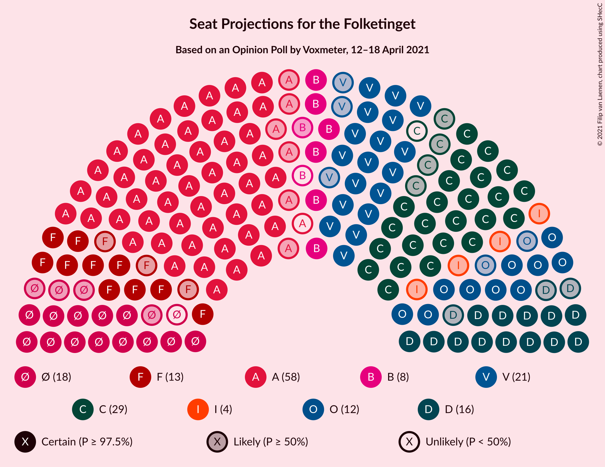
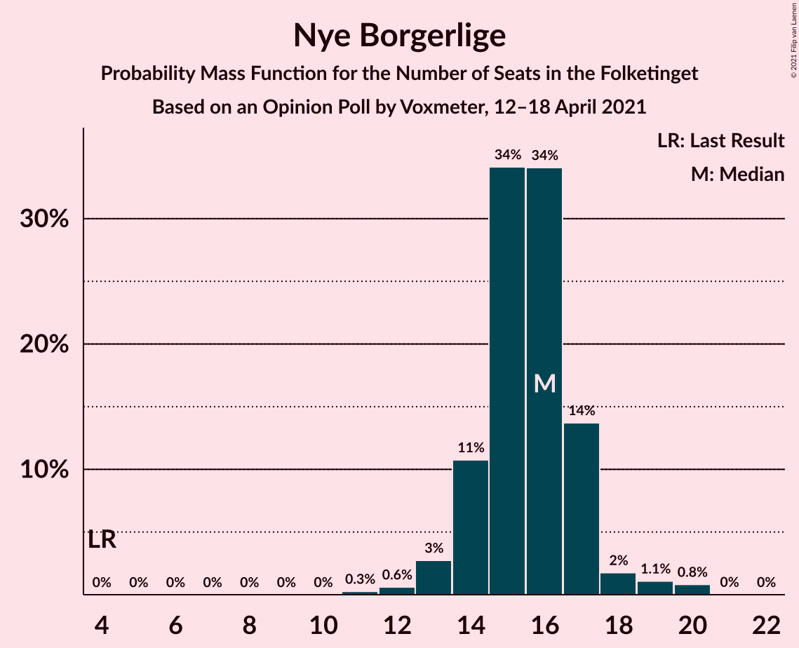
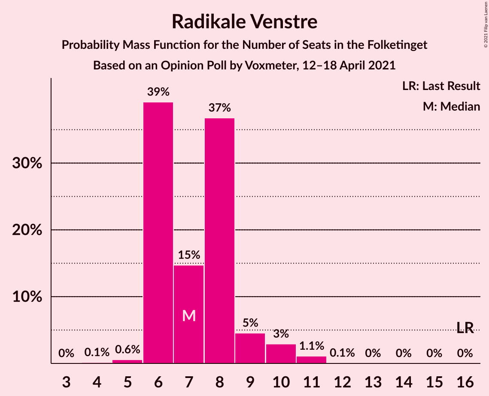
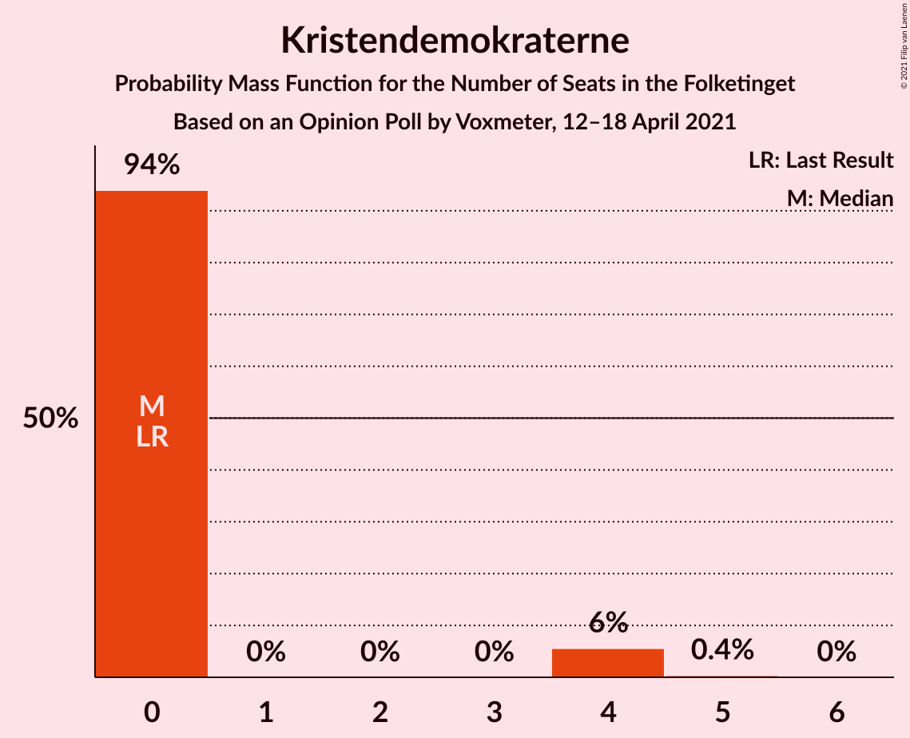
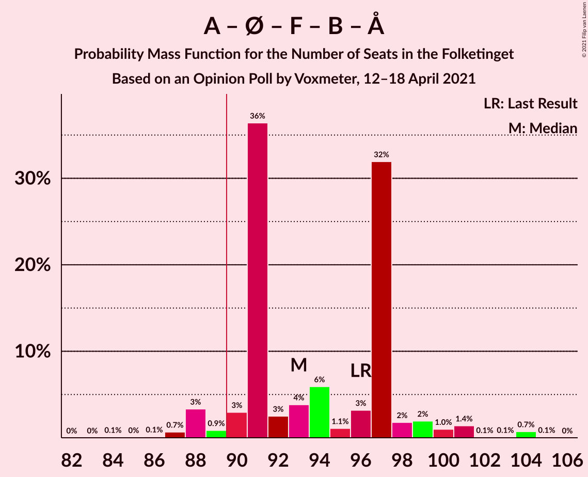
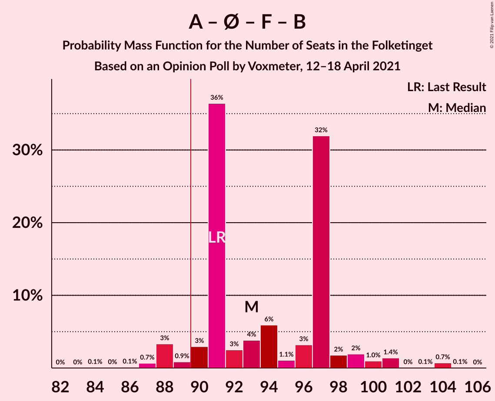
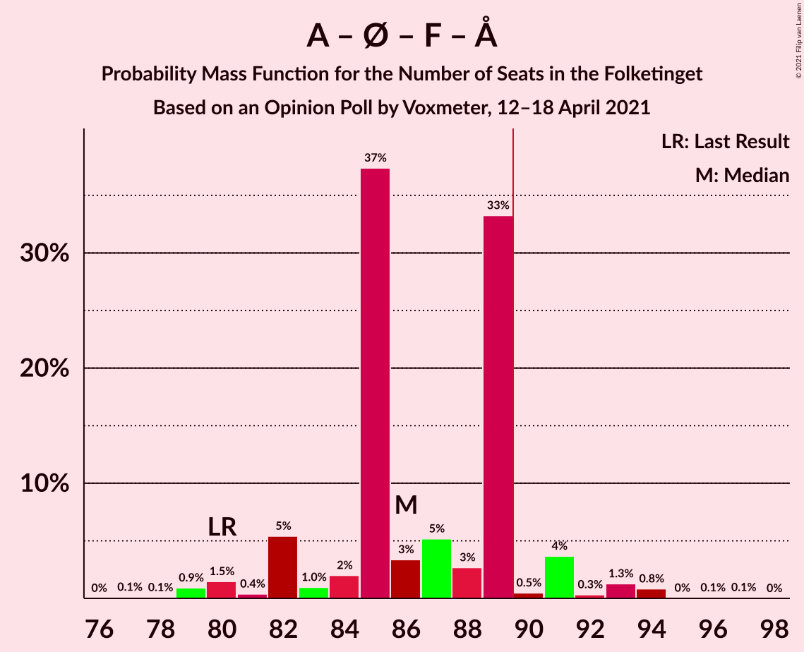

# Opinion Poll by Voxmeter, 12–18 April 2021

<a href="#voting-intentions">Voting Intentions</a> | <a href="#seats">Seats</a> | <a href="#coalitions">Coalitions</a> | <a href="#technical-information">Technical Information</a>

## Voting Intentions

### Confidence Intervals

| Party | Last Result | Poll Result | 80% Confidence Interval | 90% Confidence Interval | 95% Confidence Interval | 99% Confidence Interval |
|:-----:|:-----------:|:-----------:|:-----------------------:|:-----------------------:|:-----------------------:|:-----------------------:|
| Socialdemokraterne | 25.9% | 31.3% | 29.5–33.3% |29.0–33.8% |28.6–34.3% |27.7–35.2% |
| Det Konservative Folkeparti | 6.6% | 15.2% | 13.9–16.8% |13.5–17.2% |13.2–17.6% |12.5–18.3% |
| Venstre | 23.4% | 11.3% | 10.1–12.7% |9.8–13.1% |9.5–13.4% |9.0–14.1% |
| Enhedslisten–De Rød-Grønne | 6.9% | 9.2% | 8.1–10.4% |7.8–10.8% |7.6–11.1% |7.1–11.7% |
| Nye Borgerlige | 2.4% | 8.7% | 7.7–9.9% |7.4–10.3% |7.1–10.6% |6.6–11.2% |
| Socialistisk Folkeparti | 7.7% | 7.3% | 6.4–8.5% |6.1–8.8% |5.9–9.1% |5.5–9.7% |
| Dansk Folkeparti | 8.7% | 6.5% | 5.6–7.7% |5.4–8.0% |5.2–8.2% |4.8–8.8% |
| Radikale Venstre | 8.6% | 4.3% | 3.6–5.2% |3.4–5.5% |3.2–5.7% |2.9–6.2% |
| Liberal Alliance | 2.3% | 2.4% | 1.9–3.2% |1.8–3.4% |1.7–3.6% |1.4–4.0% |
| Kristendemokraterne | 1.7% | 1.4% | 1.0–2.0% |0.9–2.1% |0.8–2.3% |0.7–2.6% |
| Alternativet | 3.0% | 0.8% | 0.5–1.3% |0.5–1.4% |0.4–1.5% |0.3–1.8% |
| Veganerpartiet | 0.0% | 0.2% | 0.1–0.5% |0.1–0.6% |0.0–0.7% |0.0–0.9% |

*Note:* The poll result column reflects the actual value used in the calculations. Published results may vary slightly, and in addition be rounded to fewer digits.

## Seats

### Confidence Intervals

| Party | Last Result | Median | 80% Confidence Interval | 90% Confidence Interval | 95% Confidence Interval | 99% Confidence Interval |
|:-----:|:-----------:|:------:|:-----------------------:|:-----------------------:|:-----------------------:|:-----------------------:|
| <a href="#socialdemokraterne">Socialdemokraterne</a> | 48 | 57 | 55–59 |53–59 |51–61 |51–63 |
| <a href="#det-konservative-folkeparti">Det Konservative Folkeparti</a> | 12 | 28 | 26–29 |25–30 |24–30 |23–32 |
| <a href="#venstre">Venstre</a> | 43 | 21 | 19–23 |18–24 |18–25 |16–25 |
| <a href="#enhedslisten–de-rød-grønne">Enhedslisten–De Rød-Grønne</a> | 13 | 17 | 16–18 |15–19 |13–19 |13–20 |
| <a href="#nye-borgerlige">Nye Borgerlige</a> | 4 | 16 | 14–17 |14–17 |13–18 |12–20 |
| <a href="#socialistisk-folkeparti">Socialistisk Folkeparti</a> | 14 | 13 | 11–14 |10–15 |10–16 |10–17 |
| <a href="#dansk-folkeparti">Dansk Folkeparti</a> | 16 | 12 | 10–14 |10–14 |10–16 |9–17 |
| <a href="#radikale-venstre">Radikale Venstre</a> | 16 | 7 | 6–8 |6–9 |6–10 |5–11 |
| <a href="#liberal-alliance">Liberal Alliance</a> | 4 | 4 | 4–5 |0–6 |0–6 |0–7 |
| <a href="#kristendemokraterne">Kristendemokraterne</a> | 0 | 0 | 0 |0–4 |0–4 |0–4 |
| <a href="#alternativet">Alternativet</a> | 5 | 0 | 0 |0 |0 |0 |
| <a href="#veganerpartiet">Veganerpartiet</a> | 0 | 0 | 0 |0 |0 |0 |

### Socialdemokraterne

*For a full overview of the results for this party, see the [Socialdemokraterne](party-socialdemokraterne.html) page.*

| Number of Seats | Probability | Accumulated | Special Marks |
|:---------------:|:-----------:|:-----------:|:-------------:|
| 48 | 0% | 100% | Last Result |
| 49 | 0.1% | 99.9% |  |
| 50 | 0.2% | 99.9% |  |
| 51 | 3% | 99.6% |  |
| 52 | 1.0% | 96% |  |
| 53 | 2% | 95% |  |
| 54 | 3% | 93% |  |
| 55 | 34% | 91% |  |
| 56 | 4% | 56% |  |
| 57 | 7% | 53% | Median |
| 58 | 32% | 46% |  |
| 59 | 9% | 14% |  |
| 60 | 0.5% | 5% |  |
| 61 | 2% | 4% |  |
| 62 | 0.9% | 2% |  |
| 63 | 1.3% | 1.4% |  |
| 64 | 0% | 0.2% |  |
| 65 | 0.1% | 0.1% |  |
| 66 | 0% | 0% |  |

### Det Konservative Folkeparti

*For a full overview of the results for this party, see the [Det Konservative Folkeparti](party-detkonservativefolkeparti.html) page.*

| Number of Seats | Probability | Accumulated | Special Marks |
|:---------------:|:-----------:|:-----------:|:-------------:|
| 12 | 0% | 100% | Last Result |
| 13 | 0% | 100% |  |
| 14 | 0% | 100% |  |
| 15 | 0% | 100% |  |
| 16 | 0% | 100% |  |
| 17 | 0% | 100% |  |
| 18 | 0% | 100% |  |
| 19 | 0% | 100% |  |
| 20 | 0% | 100% |  |
| 21 | 0% | 100% |  |
| 22 | 0.1% | 100% |  |
| 23 | 1.4% | 99.8% |  |
| 24 | 1.0% | 98% |  |
| 25 | 4% | 97% |  |
| 26 | 5% | 93% |  |
| 27 | 36% | 88% |  |
| 28 | 6% | 52% | Median |
| 29 | 37% | 46% |  |
| 30 | 7% | 9% |  |
| 31 | 0.9% | 2% |  |
| 32 | 0.7% | 0.9% |  |
| 33 | 0.1% | 0.2% |  |
| 34 | 0% | 0.1% |  |
| 35 | 0% | 0% |  |

### Venstre

*For a full overview of the results for this party, see the [Venstre](party-venstre.html) page.*

| Number of Seats | Probability | Accumulated | Special Marks |
|:---------------:|:-----------:|:-----------:|:-------------:|
| 15 | 0.1% | 100% |  |
| 16 | 0.5% | 99.9% |  |
| 17 | 0.7% | 99.3% |  |
| 18 | 5% | 98.6% |  |
| 19 | 7% | 94% |  |
| 20 | 34% | 87% |  |
| 21 | 38% | 53% | Median |
| 22 | 2% | 15% |  |
| 23 | 6% | 13% |  |
| 24 | 4% | 7% |  |
| 25 | 3% | 3% |  |
| 26 | 0.3% | 0.4% |  |
| 27 | 0% | 0.1% |  |
| 28 | 0.1% | 0.1% |  |
| 29 | 0% | 0% |  |
| 30 | 0% | 0% |  |
| 31 | 0% | 0% |  |
| 32 | 0% | 0% |  |
| 33 | 0% | 0% |  |
| 34 | 0% | 0% |  |
| 35 | 0% | 0% |  |
| 36 | 0% | 0% |  |
| 37 | 0% | 0% |  |
| 38 | 0% | 0% |  |
| 39 | 0% | 0% |  |
| 40 | 0% | 0% |  |
| 41 | 0% | 0% |  |
| 42 | 0% | 0% |  |
| 43 | 0% | 0% | Last Result |

### Enhedslisten–De Rød-Grønne

*For a full overview of the results for this party, see the [Enhedslisten–De Rød-Grønne](party-enhedslisten–derød-grønne.html) page.*

| Number of Seats | Probability | Accumulated | Special Marks |
|:---------------:|:-----------:|:-----------:|:-------------:|
| 11 | 0.1% | 100% |  |
| 12 | 0.1% | 99.9% |  |
| 13 | 3% | 99.9% | Last Result |
| 14 | 2% | 97% |  |
| 15 | 4% | 95% |  |
| 16 | 11% | 91% |  |
| 17 | 32% | 80% | Median |
| 18 | 41% | 48% |  |
| 19 | 5% | 6% |  |
| 20 | 2% | 2% |  |
| 21 | 0.1% | 0.2% |  |
| 22 | 0.1% | 0.1% |  |
| 23 | 0% | 0% |  |

### Nye Borgerlige

*For a full overview of the results for this party, see the [Nye Borgerlige](party-nyeborgerlige.html) page.*

| Number of Seats | Probability | Accumulated | Special Marks |
|:---------------:|:-----------:|:-----------:|:-------------:|
| 4 | 0% | 100% | Last Result |
| 5 | 0% | 100% |  |
| 6 | 0% | 100% |  |
| 7 | 0% | 100% |  |
| 8 | 0% | 100% |  |
| 9 | 0% | 100% |  |
| 10 | 0% | 100% |  |
| 11 | 0.3% | 100% |  |
| 12 | 0.6% | 99.7% |  |
| 13 | 3% | 99.1% |  |
| 14 | 11% | 96% |  |
| 15 | 34% | 86% |  |
| 16 | 34% | 51% | Median |
| 17 | 14% | 17% |  |
| 18 | 2% | 4% |  |
| 19 | 1.1% | 2% |  |
| 20 | 0.8% | 0.9% |  |
| 21 | 0% | 0% |  |

### Socialistisk Folkeparti

*For a full overview of the results for this party, see the [Socialistisk Folkeparti](party-socialistiskfolkeparti.html) page.*

| Number of Seats | Probability | Accumulated | Special Marks |
|:---------------:|:-----------:|:-----------:|:-------------:|
| 9 | 0.1% | 100% |  |
| 10 | 6% | 99.9% |  |
| 11 | 6% | 94% |  |
| 12 | 8% | 88% |  |
| 13 | 67% | 81% | Median |
| 14 | 9% | 14% | Last Result |
| 15 | 3% | 5% |  |
| 16 | 2% | 3% |  |
| 17 | 0.6% | 1.0% |  |
| 18 | 0.2% | 0.5% |  |
| 19 | 0.3% | 0.3% |  |
| 20 | 0% | 0% |  |

### Dansk Folkeparti

*For a full overview of the results for this party, see the [Dansk Folkeparti](party-danskfolkeparti.html) page.*

| Number of Seats | Probability | Accumulated | Special Marks |
|:---------------:|:-----------:|:-----------:|:-------------:|
| 8 | 0.1% | 100% |  |
| 9 | 2% | 99.9% |  |
| 10 | 37% | 98% |  |
| 11 | 6% | 61% |  |
| 12 | 39% | 56% | Median |
| 13 | 5% | 16% |  |
| 14 | 7% | 11% |  |
| 15 | 2% | 4% |  |
| 16 | 2% | 3% | Last Result |
| 17 | 0.6% | 0.6% |  |
| 18 | 0% | 0% |  |

### Radikale Venstre

*For a full overview of the results for this party, see the [Radikale Venstre](party-radikalevenstre.html) page.*

| Number of Seats | Probability | Accumulated | Special Marks |
|:---------------:|:-----------:|:-----------:|:-------------:|
| 4 | 0.1% | 100% |  |
| 5 | 0.6% | 99.9% |  |
| 6 | 39% | 99.3% |  |
| 7 | 15% | 60% | Median |
| 8 | 37% | 45% |  |
| 9 | 5% | 9% |  |
| 10 | 3% | 4% |  |
| 11 | 1.1% | 1.2% |  |
| 12 | 0.1% | 0.1% |  |
| 13 | 0% | 0% |  |
| 14 | 0% | 0% |  |
| 15 | 0% | 0% |  |
| 16 | 0% | 0% | Last Result |

### Liberal Alliance

*For a full overview of the results for this party, see the [Liberal Alliance](party-liberalalliance.html) page.*

| Number of Seats | Probability | Accumulated | Special Marks |
|:---------------:|:-----------:|:-----------:|:-------------:|
| 0 | 5% | 100% |  |
| 1 | 0% | 95% |  |
| 2 | 0% | 95% |  |
| 3 | 0% | 95% |  |
| 4 | 79% | 95% | Last Result, Median |
| 5 | 9% | 16% |  |
| 6 | 5% | 7% |  |
| 7 | 2% | 2% |  |
| 8 | 0.1% | 0.1% |  |
| 9 | 0% | 0% |  |

### Kristendemokraterne

*For a full overview of the results for this party, see the [Kristendemokraterne](party-kristendemokraterne.html) page.*

| Number of Seats | Probability | Accumulated | Special Marks |
|:---------------:|:-----------:|:-----------:|:-------------:|
| 0 | 94% | 100% | Last Result, Median |
| 1 | 0% | 6% |  |
| 2 | 0% | 6% |  |
| 3 | 0% | 6% |  |
| 4 | 6% | 6% |  |
| 5 | 0.4% | 0.4% |  |
| 6 | 0% | 0% |  |

### Alternativet

*For a full overview of the results for this party, see the [Alternativet](party-alternativet.html) page.*

| Number of Seats | Probability | Accumulated | Special Marks |
|:---------------:|:-----------:|:-----------:|:-------------:|
| 0 | 99.9% | 100% | Median |
| 1 | 0% | 0.1% |  |
| 2 | 0% | 0.1% |  |
| 3 | 0% | 0.1% |  |
| 4 | 0.1% | 0.1% |  |
| 5 | 0% | 0% | Last Result |

### Veganerpartiet

*For a full overview of the results for this party, see the [Veganerpartiet](party-veganerpartiet.html) page.*

| Number of Seats | Probability | Accumulated | Special Marks |
|:---------------:|:-----------:|:-----------:|:-------------:|
| 0 | 100% | 100% | Last Result, Median |

## Coalitions

### Confidence Intervals

| Coalition | Last Result | Median | Majority? | 80% Confidence Interval | 90% Confidence Interval | 95% Confidence Interval | 99% Confidence Interval |
|:---------:|:-----------:|:------:|:---------:|:-----------------------:|:-----------------------:|:-----------------------:|:-----------------------:|
| Socialdemokraterne – Enhedslisten–De Rød-Grønne – Socialistisk Folkeparti – Radikale Venstre – Alternativet | 96 | 93 | 95% | 91–97 | 89–99 | 88–100 | 87–104 |
| Socialdemokraterne – Enhedslisten–De Rød-Grønne – Socialistisk Folkeparti – Radikale Venstre | 91 | 93 | 95% | 91–97 | 89–99 | 88–100 | 87–104 |
| Socialdemokraterne – Enhedslisten–De Rød-Grønne – Socialistisk Folkeparti – Alternativet | 80 | 86 | 7% | 84–89 | 82–91 | 80–92 | 79–94 |
| Socialdemokraterne – Enhedslisten–De Rød-Grønne – Socialistisk Folkeparti | 75 | 86 | 7% | 84–89 | 82–91 | 80–92 | 79–94 |
| Det Konservative Folkeparti – Venstre – Nye Borgerlige – Dansk Folkeparti – Liberal Alliance – Kristendemokraterne | 79 | 80 | 0.1% | 78–84 | 76–85 | 75–87 | 71–88 |
| Det Konservative Folkeparti – Venstre – Nye Borgerlige – Dansk Folkeparti – Liberal Alliance | 79 | 80 | 0.1% | 78–84 | 76–85 | 74–87 | 71–88 |
| Socialdemokraterne – Socialistisk Folkeparti – Radikale Venstre | 78 | 76 | 0% | 74–79 | 74–82 | 72–83 | 71–85 |
| Det Konservative Folkeparti – Venstre – Dansk Folkeparti – Liberal Alliance – Kristendemokraterne | 75 | 64 | 0% | 63–68 | 60–70 | 59–70 | 55–71 |
| Det Konservative Folkeparti – Venstre – Dansk Folkeparti – Liberal Alliance | 75 | 64 | 0% | 63–68 | 60–70 | 59–70 | 55–71 |
| Socialdemokraterne – Radikale Venstre | 64 | 64 | 0% | 61–66 | 61–69 | 59–70 | 58–72 |
| Det Konservative Folkeparti – Venstre – Liberal Alliance | 59 | 53 | 0% | 49–57 | 48–57 | 46–58 | 44–58 |
| Det Konservative Folkeparti – Venstre | 55 | 49 | 0% | 46–52 | 44–53 | 43–53 | 41–54 |
| Venstre | 43 | 21 | 0% | 19–23 | 18–24 | 18–25 | 16–25 |

### Socialdemokraterne – Enhedslisten–De Rød-Grønne – Socialistisk Folkeparti – Radikale Venstre – Alternativet

| Number of Seats | Probability | Accumulated | Special Marks |
|:---------------:|:-----------:|:-----------:|:-------------:|
| 84 | 0.1% | 100% |  |
| 85 | 0% | 99.9% |  |
| 86 | 0.1% | 99.9% |  |
| 87 | 0.7% | 99.7% |  |
| 88 | 3% | 99.1% |  |
| 89 | 0.9% | 96% |  |
| 90 | 3% | 95% | Majority |
| 91 | 36% | 92% |  |
| 92 | 3% | 56% |  |
| 93 | 4% | 53% |  |
| 94 | 6% | 49% | Median |
| 95 | 1.1% | 43% |  |
| 96 | 3% | 42% | Last Result |
| 97 | 32% | 39% |  |
| 98 | 2% | 7% |  |
| 99 | 2% | 5% |  |
| 100 | 1.0% | 3% |  |
| 101 | 1.4% | 2% |  |
| 102 | 0.1% | 0.9% |  |
| 103 | 0.1% | 0.9% |  |
| 104 | 0.7% | 0.8% |  |
| 105 | 0.1% | 0.1% |  |
| 106 | 0% | 0% |  |

### Socialdemokraterne – Enhedslisten–De Rød-Grønne – Socialistisk Folkeparti – Radikale Venstre

| Number of Seats | Probability | Accumulated | Special Marks |
|:---------------:|:-----------:|:-----------:|:-------------:|
| 84 | 0.1% | 100% |  |
| 85 | 0% | 99.9% |  |
| 86 | 0.1% | 99.9% |  |
| 87 | 0.7% | 99.7% |  |
| 88 | 3% | 99.1% |  |
| 89 | 0.9% | 96% |  |
| 90 | 3% | 95% | Majority |
| 91 | 36% | 92% | Last Result |
| 92 | 3% | 55% |  |
| 93 | 4% | 53% |  |
| 94 | 6% | 49% | Median |
| 95 | 1.1% | 43% |  |
| 96 | 3% | 42% |  |
| 97 | 32% | 39% |  |
| 98 | 2% | 7% |  |
| 99 | 2% | 5% |  |
| 100 | 1.0% | 3% |  |
| 101 | 1.4% | 2% |  |
| 102 | 0% | 0.9% |  |
| 103 | 0.1% | 0.9% |  |
| 104 | 0.7% | 0.8% |  |
| 105 | 0.1% | 0.1% |  |
| 106 | 0% | 0% |  |

### Socialdemokraterne – Enhedslisten–De Rød-Grønne – Socialistisk Folkeparti – Alternativet

| Number of Seats | Probability | Accumulated | Special Marks |
|:---------------:|:-----------:|:-----------:|:-------------:|
| 77 | 0.1% | 100% |  |
| 78 | 0.1% | 99.9% |  |
| 79 | 0.9% | 99.8% |  |
| 80 | 1.5% | 98.9% | Last Result |
| 81 | 0.4% | 97% |  |
| 82 | 5% | 97% |  |
| 83 | 1.0% | 92% |  |
| 84 | 2% | 91% |  |
| 85 | 37% | 89% |  |
| 86 | 3% | 51% |  |
| 87 | 5% | 48% | Median |
| 88 | 3% | 43% |  |
| 89 | 33% | 40% |  |
| 90 | 0.5% | 7% | Majority |
| 91 | 4% | 6% |  |
| 92 | 0.3% | 3% |  |
| 93 | 1.3% | 2% |  |
| 94 | 0.8% | 1.0% |  |
| 95 | 0% | 0.2% |  |
| 96 | 0.1% | 0.1% |  |
| 97 | 0.1% | 0.1% |  |
| 98 | 0% | 0% |  |

### Socialdemokraterne – Enhedslisten–De Rød-Grønne – Socialistisk Folkeparti

| Number of Seats | Probability | Accumulated | Special Marks |
|:---------------:|:-----------:|:-----------:|:-------------:|
| 75 | 0% | 100% | Last Result |
| 76 | 0% | 100% |  |
| 77 | 0.1% | 100% |  |
| 78 | 0.1% | 99.9% |  |
| 79 | 0.9% | 99.8% |  |
| 80 | 1.5% | 98.9% |  |
| 81 | 0.4% | 97% |  |
| 82 | 5% | 97% |  |
| 83 | 1.0% | 92% |  |
| 84 | 2% | 91% |  |
| 85 | 37% | 89% |  |
| 86 | 3% | 51% |  |
| 87 | 5% | 48% | Median |
| 88 | 3% | 43% |  |
| 89 | 33% | 40% |  |
| 90 | 0.5% | 7% | Majority |
| 91 | 4% | 6% |  |
| 92 | 0.3% | 3% |  |
| 93 | 1.3% | 2% |  |
| 94 | 0.8% | 1.0% |  |
| 95 | 0% | 0.2% |  |
| 96 | 0.1% | 0.1% |  |
| 97 | 0.1% | 0.1% |  |
| 98 | 0% | 0% |  |

### Det Konservative Folkeparti – Venstre – Nye Borgerlige – Dansk Folkeparti – Liberal Alliance – Kristendemokraterne

| Number of Seats | Probability | Accumulated | Special Marks |
|:---------------:|:-----------:|:-----------:|:-------------:|
| 70 | 0.1% | 100% |  |
| 71 | 0.7% | 99.9% |  |
| 72 | 0.1% | 99.2% |  |
| 73 | 0.2% | 99.1% |  |
| 74 | 1.4% | 99.0% |  |
| 75 | 1.1% | 98% |  |
| 76 | 2% | 96% |  |
| 77 | 2% | 94% |  |
| 78 | 32% | 92% |  |
| 79 | 3% | 60% | Last Result |
| 80 | 29% | 57% |  |
| 81 | 6% | 27% | Median |
| 82 | 4% | 21% |  |
| 83 | 3% | 18% |  |
| 84 | 8% | 15% |  |
| 85 | 3% | 7% |  |
| 86 | 0.8% | 5% |  |
| 87 | 3% | 4% |  |
| 88 | 0.6% | 0.8% |  |
| 89 | 0.1% | 0.2% |  |
| 90 | 0% | 0.1% | Majority |
| 91 | 0.1% | 0.1% |  |
| 92 | 0% | 0% |  |

### Det Konservative Folkeparti – Venstre – Nye Borgerlige – Dansk Folkeparti – Liberal Alliance

| Number of Seats | Probability | Accumulated | Special Marks |
|:---------------:|:-----------:|:-----------:|:-------------:|
| 70 | 0.4% | 100% |  |
| 71 | 0.7% | 99.6% |  |
| 72 | 0.1% | 98.9% |  |
| 73 | 0.6% | 98.8% |  |
| 74 | 1.2% | 98% |  |
| 75 | 1.3% | 97% |  |
| 76 | 2% | 96% |  |
| 77 | 2% | 93% |  |
| 78 | 33% | 91% |  |
| 79 | 3% | 59% | Last Result |
| 80 | 32% | 56% |  |
| 81 | 6% | 23% | Median |
| 82 | 3% | 17% |  |
| 83 | 3% | 14% |  |
| 84 | 5% | 11% |  |
| 85 | 2% | 6% |  |
| 86 | 0.8% | 4% |  |
| 87 | 2% | 3% |  |
| 88 | 0.6% | 0.7% |  |
| 89 | 0% | 0.1% |  |
| 90 | 0% | 0.1% | Majority |
| 91 | 0.1% | 0.1% |  |
| 92 | 0% | 0% |  |

### Socialdemokraterne – Socialistisk Folkeparti – Radikale Venstre

| Number of Seats | Probability | Accumulated | Special Marks |
|:---------------:|:-----------:|:-----------:|:-------------:|
| 69 | 0.1% | 100% |  |
| 70 | 0.2% | 99.9% |  |
| 71 | 0.8% | 99.7% |  |
| 72 | 3% | 98.9% |  |
| 73 | 0.8% | 96% |  |
| 74 | 30% | 95% |  |
| 75 | 13% | 66% |  |
| 76 | 6% | 53% |  |
| 77 | 6% | 47% | Median |
| 78 | 1.0% | 41% | Last Result |
| 79 | 31% | 40% |  |
| 80 | 2% | 9% |  |
| 81 | 2% | 7% |  |
| 82 | 2% | 5% |  |
| 83 | 2% | 4% |  |
| 84 | 1.2% | 2% |  |
| 85 | 0.5% | 0.7% |  |
| 86 | 0.2% | 0.2% |  |
| 87 | 0% | 0.1% |  |
| 88 | 0% | 0% |  |

### Det Konservative Folkeparti – Venstre – Dansk Folkeparti – Liberal Alliance – Kristendemokraterne

| Number of Seats | Probability | Accumulated | Special Marks |
|:---------------:|:-----------:|:-----------:|:-------------:|
| 55 | 0.7% | 100% |  |
| 56 | 0.4% | 99.3% |  |
| 57 | 0.1% | 98.8% |  |
| 58 | 0.2% | 98.8% |  |
| 59 | 1.4% | 98.6% |  |
| 60 | 2% | 97% |  |
| 61 | 2% | 95% |  |
| 62 | 1.5% | 93% |  |
| 63 | 31% | 92% |  |
| 64 | 34% | 61% |  |
| 65 | 5% | 27% | Median |
| 66 | 2% | 22% |  |
| 67 | 4% | 20% |  |
| 68 | 6% | 16% |  |
| 69 | 2% | 9% |  |
| 70 | 7% | 8% |  |
| 71 | 0.5% | 0.9% |  |
| 72 | 0.2% | 0.3% |  |
| 73 | 0.2% | 0.2% |  |
| 74 | 0% | 0% |  |
| 75 | 0% | 0% | Last Result |

### Det Konservative Folkeparti – Venstre – Dansk Folkeparti – Liberal Alliance

| Number of Seats | Probability | Accumulated | Special Marks |
|:---------------:|:-----------:|:-----------:|:-------------:|
| 55 | 1.0% | 100% |  |
| 56 | 0.4% | 99.0% |  |
| 57 | 0.1% | 98.6% |  |
| 58 | 0.6% | 98% |  |
| 59 | 1.4% | 98% |  |
| 60 | 2% | 96% |  |
| 61 | 2% | 94% |  |
| 62 | 2% | 93% |  |
| 63 | 34% | 91% |  |
| 64 | 35% | 57% |  |
| 65 | 5% | 22% | Median |
| 66 | 1.4% | 18% |  |
| 67 | 2% | 16% |  |
| 68 | 6% | 15% |  |
| 69 | 2% | 9% |  |
| 70 | 7% | 7% |  |
| 71 | 0.3% | 0.5% |  |
| 72 | 0.1% | 0.2% |  |
| 73 | 0.1% | 0.1% |  |
| 74 | 0% | 0% |  |
| 75 | 0% | 0% | Last Result |

### Socialdemokraterne – Radikale Venstre

| Number of Seats | Probability | Accumulated | Special Marks |
|:---------------:|:-----------:|:-----------:|:-------------:|
| 56 | 0.1% | 100% |  |
| 57 | 0.2% | 99.9% |  |
| 58 | 0.5% | 99.8% |  |
| 59 | 3% | 99.3% |  |
| 60 | 1.1% | 96% |  |
| 61 | 34% | 95% |  |
| 62 | 4% | 61% |  |
| 63 | 6% | 57% |  |
| 64 | 3% | 51% | Last Result, Median |
| 65 | 2% | 48% |  |
| 66 | 39% | 46% |  |
| 67 | 0.8% | 7% |  |
| 68 | 0.7% | 6% |  |
| 69 | 3% | 5% |  |
| 70 | 2% | 3% |  |
| 71 | 0.3% | 0.8% |  |
| 72 | 0.4% | 0.5% |  |
| 73 | 0% | 0.1% |  |
| 74 | 0% | 0% |  |

### Det Konservative Folkeparti – Venstre – Liberal Alliance

| Number of Seats | Probability | Accumulated | Special Marks |
|:---------------:|:-----------:|:-----------:|:-------------:|
| 44 | 1.3% | 100% |  |
| 45 | 1.0% | 98.6% |  |
| 46 | 0.3% | 98% |  |
| 47 | 2% | 97% |  |
| 48 | 1.0% | 96% |  |
| 49 | 5% | 95% |  |
| 50 | 2% | 89% |  |
| 51 | 31% | 87% |  |
| 52 | 2% | 56% |  |
| 53 | 5% | 55% | Median |
| 54 | 36% | 50% |  |
| 55 | 2% | 14% |  |
| 56 | 1.4% | 12% |  |
| 57 | 7% | 11% |  |
| 58 | 3% | 3% |  |
| 59 | 0.1% | 0.3% | Last Result |
| 60 | 0.2% | 0.2% |  |
| 61 | 0% | 0.1% |  |
| 62 | 0% | 0% |  |

### Det Konservative Folkeparti – Venstre

| Number of Seats | Probability | Accumulated | Special Marks |
|:---------------:|:-----------:|:-----------:|:-------------:|
| 41 | 0.8% | 100% |  |
| 42 | 0.5% | 99.1% |  |
| 43 | 1.1% | 98.6% |  |
| 44 | 3% | 97% |  |
| 45 | 4% | 95% |  |
| 46 | 1.3% | 90% |  |
| 47 | 31% | 89% |  |
| 48 | 7% | 58% |  |
| 49 | 3% | 50% | Median |
| 50 | 35% | 47% |  |
| 51 | 2% | 12% |  |
| 52 | 1.1% | 10% |  |
| 53 | 8% | 9% |  |
| 54 | 0.6% | 0.9% |  |
| 55 | 0.1% | 0.3% | Last Result |
| 56 | 0.2% | 0.2% |  |
| 57 | 0% | 0.1% |  |
| 58 | 0% | 0% |  |

### Venstre

| Number of Seats | Probability | Accumulated | Special Marks |
|:---------------:|:-----------:|:-----------:|:-------------:|
| 15 | 0.1% | 100% |  |
| 16 | 0.5% | 99.9% |  |
| 17 | 0.7% | 99.3% |  |
| 18 | 5% | 98.6% |  |
| 19 | 7% | 94% |  |
| 20 | 34% | 87% |  |
| 21 | 38% | 53% | Median |
| 22 | 2% | 15% |  |
| 23 | 6% | 13% |  |
| 24 | 4% | 7% |  |
| 25 | 3% | 3% |  |
| 26 | 0.3% | 0.4% |  |
| 27 | 0% | 0.1% |  |
| 28 | 0.1% | 0.1% |  |
| 29 | 0% | 0% |  |
| 30 | 0% | 0% |  |
| 31 | 0% | 0% |  |
| 32 | 0% | 0% |  |
| 33 | 0% | 0% |  |
| 34 | 0% | 0% |  |
| 35 | 0% | 0% |  |
| 36 | 0% | 0% |  |
| 37 | 0% | 0% |  |
| 38 | 0% | 0% |  |
| 39 | 0% | 0% |  |
| 40 | 0% | 0% |  |
| 41 | 0% | 0% |  |
| 42 | 0% | 0% |  |
| 43 | 0% | 0% | Last Result |

## Technical Information

### Opinion Poll

+ **Polling firm:** Voxmeter
+ **Commissioner(s):** —
+ **Fieldwork period:** 12–18 April 2021

### Calculations

+ **Sample size:** 1024
+ **Simulations done:** 1,048,576
+ **Error estimate:** 1.71%

