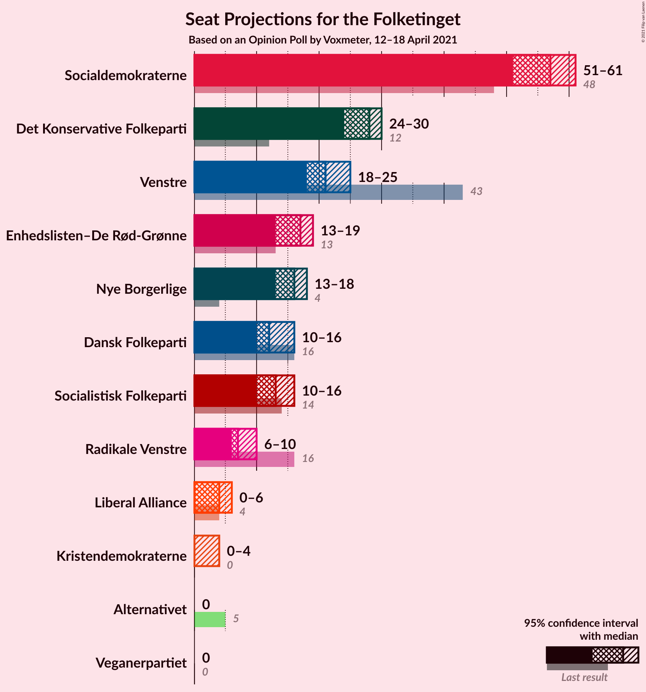
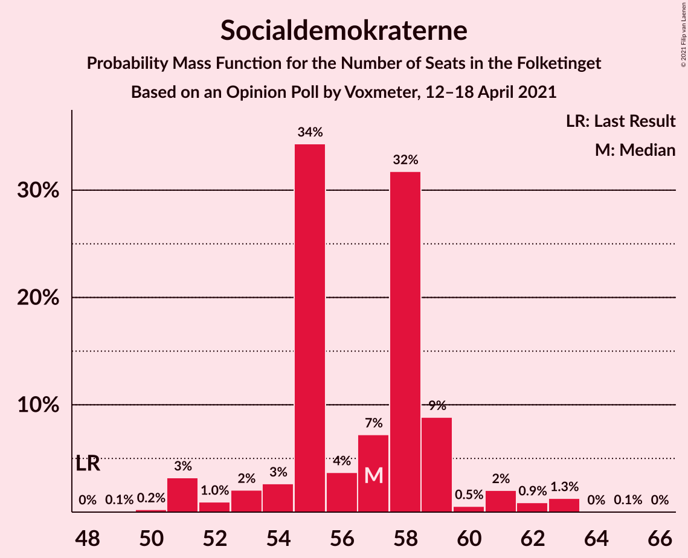
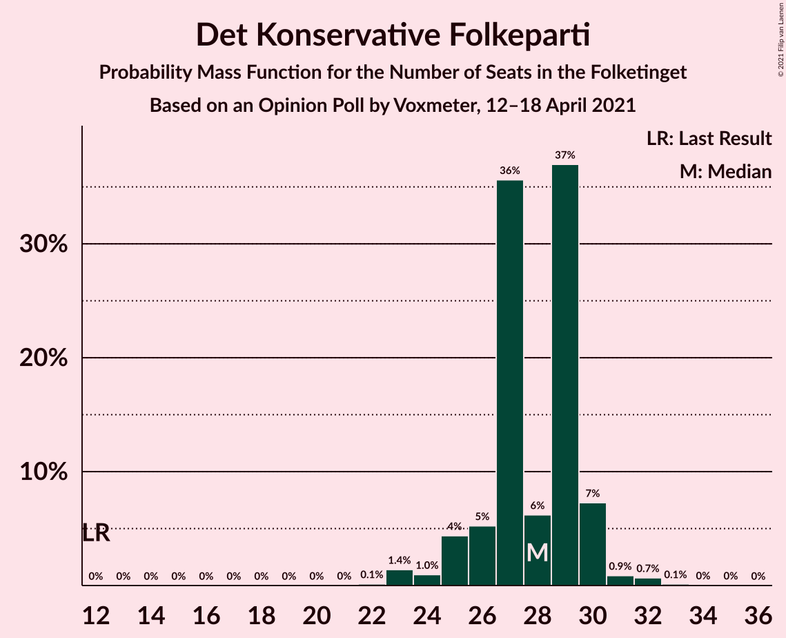
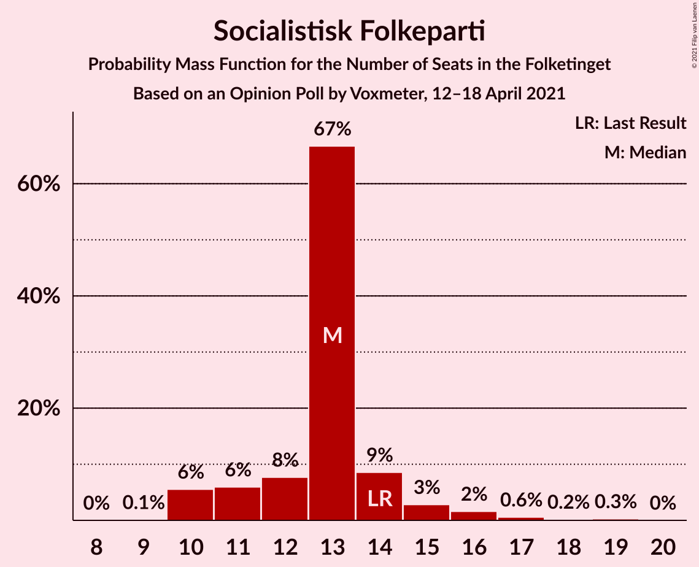
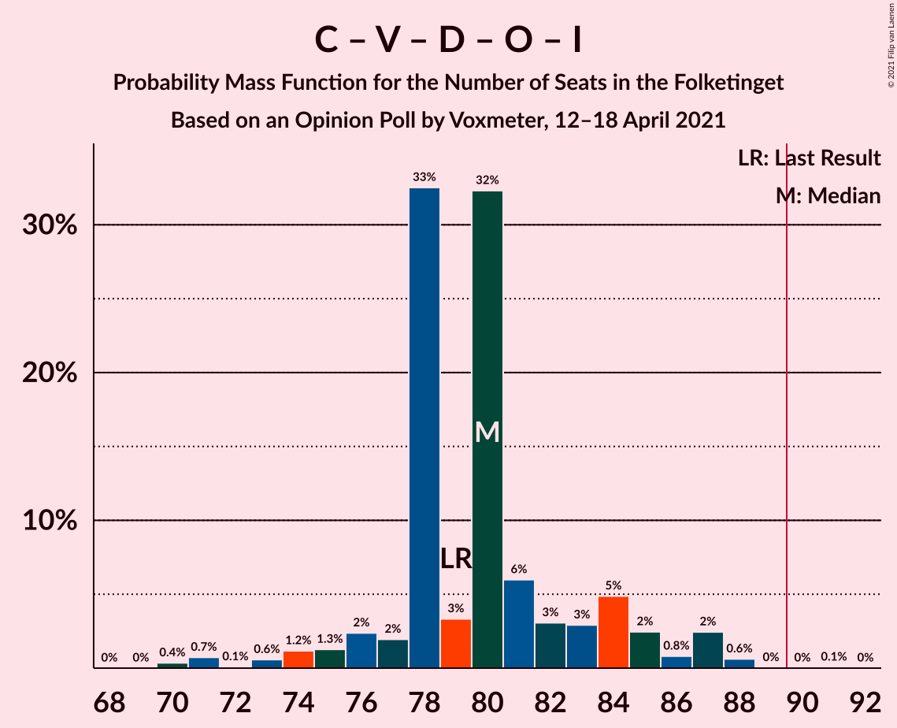
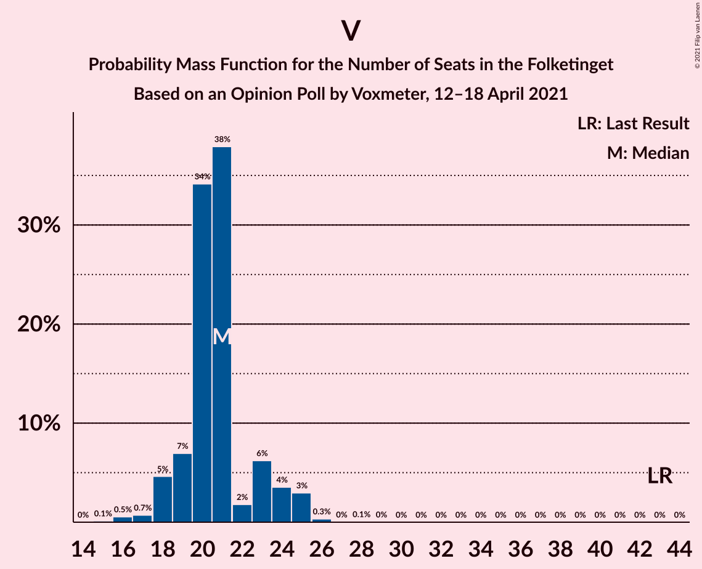

# Opinion Poll by Voxmeter, 12–18 April 2021

<a href="#voting-intentions">Voting Intentions</a> | <a href="#seats">Seats</a> | <a href="#coalitions">Coalitions</a> | <a href="#technical-information">Technical Information</a>

## Voting Intentions

### Confidence Intervals

| Party | Last Result | Poll Result | 80% Confidence Interval | 90% Confidence Interval | 95% Confidence Interval | 99% Confidence Interval |
|:-----:|:-----------:|:-----------:|:-----------------------:|:-----------------------:|:-----------------------:|:-----------------------:|
| Socialdemokraterne | 25.9% | 31.3% | 29.5–33.3% |29.0–33.8% |28.6–34.3% |27.7–35.2% |
| Det Konservative Folkeparti | 6.6% | 15.2% | 13.9–16.8% |13.5–17.2% |13.2–17.6% |12.5–18.3% |
| Venstre | 23.4% | 11.3% | 10.1–12.7% |9.8–13.1% |9.5–13.4% |9.0–14.1% |
| Enhedslisten–De Rød-Grønne | 6.9% | 9.2% | 8.1–10.4% |7.8–10.8% |7.6–11.1% |7.1–11.7% |
| Nye Borgerlige | 2.4% | 8.7% | 7.7–9.9% |7.4–10.3% |7.1–10.6% |6.6–11.2% |
| Socialistisk Folkeparti | 7.7% | 7.3% | 6.4–8.5% |6.1–8.8% |5.9–9.1% |5.5–9.7% |
| Dansk Folkeparti | 8.7% | 6.5% | 5.6–7.7% |5.4–8.0% |5.2–8.2% |4.8–8.8% |
| Radikale Venstre | 8.6% | 4.3% | 3.6–5.2% |3.4–5.5% |3.2–5.7% |2.9–6.2% |
| Liberal Alliance | 2.3% | 2.4% | 1.9–3.2% |1.8–3.4% |1.7–3.6% |1.4–4.0% |
| Kristendemokraterne | 1.7% | 1.4% | 1.0–2.0% |0.9–2.1% |0.8–2.3% |0.7–2.6% |
| Alternativet | 3.0% | 0.8% | 0.5–1.3% |0.5–1.4% |0.4–1.5% |0.3–1.8% |
| Veganerpartiet | 0.0% | 0.2% | 0.1–0.5% |0.1–0.6% |0.0–0.7% |0.0–0.9% |

*Note:* The poll result column reflects the actual value used in the calculations. Published results may vary slightly, and in addition be rounded to fewer digits.

## Seats

### Confidence Intervals

| Party | Last Result | Median | 80% Confidence Interval | 90% Confidence Interval | 95% Confidence Interval | 99% Confidence Interval |
|:-----:|:-----------:|:------:|:-----------------------:|:-----------------------:|:-----------------------:|:-----------------------:|
| <a href="#socialdemokraterne">Socialdemokraterne</a> | 48 | 58 | 55–58 |55–58 |55–58 |53–63 |
| <a href="#det-konservative-folkeparti">Det Konservative Folkeparti</a> | 12 | 27 | 27–29 |27–29 |27–29 |24–29 |
| <a href="#venstre">Venstre</a> | 43 | 20 | 20–21 |20–21 |20–21 |18–22 |
| <a href="#enhedslisten–de-rød-grønne">Enhedslisten–De Rød-Grønne</a> | 13 | 18 | 17–18 |17–18 |17–18 |14–18 |
| <a href="#nye-borgerlige">Nye Borgerlige</a> | 4 | 15 | 15–16 |15–16 |15–16 |14–17 |
| <a href="#socialistisk-folkeparti">Socialistisk Folkeparti</a> | 14 | 13 | 13 |13 |13 |12–16 |
| <a href="#dansk-folkeparti">Dansk Folkeparti</a> | 16 | 12 | 10–12 |10–12 |10–12 |9–12 |
| <a href="#radikale-venstre">Radikale Venstre</a> | 16 | 8 | 6–8 |6–8 |6–8 |6–9 |
| <a href="#liberal-alliance">Liberal Alliance</a> | 4 | 4 | 4 |4 |4 |4–6 |
| <a href="#kristendemokraterne">Kristendemokraterne</a> | 0 | 0 | 0 |0 |0 |0–4 |
| <a href="#alternativet">Alternativet</a> | 5 | 0 | 0 |0 |0 |0 |
| <a href="#veganerpartiet">Veganerpartiet</a> | 0 | 0 | 0 |0 |0 |0 |

### Socialdemokraterne

*For a full overview of the results for this party, see the [Socialdemokraterne](party-socialdemokraterne.html) page.*

| Number of Seats | Probability | Accumulated | Special Marks |
|:---------------:|:-----------:|:-----------:|:-------------:|
| 48 | 0% | 100% | Last Result |
| 49 | 0% | 100% |  |
| 50 | 0% | 100% |  |
| 51 | 0.4% | 100% |  |
| 52 | 0.1% | 99.6% |  |
| 53 | 0.2% | 99.5% |  |
| 54 | 0.1% | 99.4% |  |
| 55 | 48% | 99.3% |  |
| 56 | 0.3% | 51% |  |
| 57 | 0.2% | 51% |  |
| 58 | 50% | 51% | Median |
| 59 | 0% | 1.1% |  |
| 60 | 0.1% | 1.0% |  |
| 61 | 0.1% | 0.9% |  |
| 62 | 0% | 0.8% |  |
| 63 | 0.7% | 0.8% |  |
| 64 | 0% | 0.1% |  |
| 65 | 0.1% | 0.1% |  |
| 66 | 0.1% | 0.1% |  |
| 67 | 0% | 0% |  |

### Det Konservative Folkeparti

*For a full overview of the results for this party, see the [Det Konservative Folkeparti](party-detkonservativefolkeparti.html) page.*

| Number of Seats | Probability | Accumulated | Special Marks |
|:---------------:|:-----------:|:-----------:|:-------------:|
| 12 | 0% | 100% | Last Result |
| 13 | 0% | 100% |  |
| 14 | 0% | 100% |  |
| 15 | 0% | 100% |  |
| 16 | 0% | 100% |  |
| 17 | 0% | 100% |  |
| 18 | 0% | 100% |  |
| 19 | 0% | 100% |  |
| 20 | 0% | 100% |  |
| 21 | 0% | 100% |  |
| 22 | 0.1% | 100% |  |
| 23 | 0.3% | 99.9% |  |
| 24 | 0.2% | 99.7% |  |
| 25 | 0.6% | 99.5% |  |
| 26 | 0.6% | 98.9% |  |
| 27 | 50% | 98% | Median |
| 28 | 0.2% | 48% |  |
| 29 | 48% | 48% |  |
| 30 | 0.3% | 0.5% |  |
| 31 | 0% | 0.2% |  |
| 32 | 0% | 0.2% |  |
| 33 | 0.1% | 0.2% |  |
| 34 | 0% | 0% |  |

### Venstre

*For a full overview of the results for this party, see the [Venstre](party-venstre.html) page.*

| Number of Seats | Probability | Accumulated | Special Marks |
|:---------------:|:-----------:|:-----------:|:-------------:|
| 17 | 0.2% | 100% |  |
| 18 | 0.6% | 99.7% |  |
| 19 | 0.2% | 99.1% |  |
| 20 | 50% | 98.8% | Median |
| 21 | 49% | 49% |  |
| 22 | 0.4% | 0.6% |  |
| 23 | 0.1% | 0.2% |  |
| 24 | 0.1% | 0.1% |  |
| 25 | 0% | 0% |  |
| 26 | 0% | 0% |  |
| 27 | 0% | 0% |  |
| 28 | 0% | 0% |  |
| 29 | 0% | 0% |  |
| 30 | 0% | 0% |  |
| 31 | 0% | 0% |  |
| 32 | 0% | 0% |  |
| 33 | 0% | 0% |  |
| 34 | 0% | 0% |  |
| 35 | 0% | 0% |  |
| 36 | 0% | 0% |  |
| 37 | 0% | 0% |  |
| 38 | 0% | 0% |  |
| 39 | 0% | 0% |  |
| 40 | 0% | 0% |  |
| 41 | 0% | 0% |  |
| 42 | 0% | 0% |  |
| 43 | 0% | 0% | Last Result |

### Enhedslisten–De Rød-Grønne

*For a full overview of the results for this party, see the [Enhedslisten–De Rød-Grønne](party-enhedslisten–derød-grønne.html) page.*

| Number of Seats | Probability | Accumulated | Special Marks |
|:---------------:|:-----------:|:-----------:|:-------------:|
| 13 | 0% | 100% | Last Result |
| 14 | 0.6% | 99.9% |  |
| 15 | 0.6% | 99.4% |  |
| 16 | 0.7% | 98.7% |  |
| 17 | 48% | 98% |  |
| 18 | 50% | 50% | Median |
| 19 | 0.3% | 0.4% |  |
| 20 | 0.1% | 0.2% |  |
| 21 | 0% | 0.1% |  |
| 22 | 0% | 0% |  |

### Nye Borgerlige

*For a full overview of the results for this party, see the [Nye Borgerlige](party-nyeborgerlige.html) page.*

| Number of Seats | Probability | Accumulated | Special Marks |
|:---------------:|:-----------:|:-----------:|:-------------:|
| 4 | 0% | 100% | Last Result |
| 5 | 0% | 100% |  |
| 6 | 0% | 100% |  |
| 7 | 0% | 100% |  |
| 8 | 0% | 100% |  |
| 9 | 0% | 100% |  |
| 10 | 0% | 100% |  |
| 11 | 0% | 100% |  |
| 12 | 0.1% | 100% |  |
| 13 | 0% | 99.9% |  |
| 14 | 0.6% | 99.8% |  |
| 15 | 50% | 99.2% | Median |
| 16 | 48% | 49% |  |
| 17 | 0.7% | 1.2% |  |
| 18 | 0.3% | 0.4% |  |
| 19 | 0.1% | 0.2% |  |
| 20 | 0.1% | 0.1% |  |
| 21 | 0% | 0% |  |

### Socialistisk Folkeparti

*For a full overview of the results for this party, see the [Socialistisk Folkeparti](party-socialistiskfolkeparti.html) page.*

| Number of Seats | Probability | Accumulated | Special Marks |
|:---------------:|:-----------:|:-----------:|:-------------:|
| 10 | 0.1% | 100% |  |
| 11 | 0.3% | 99.9% |  |
| 12 | 0.7% | 99.6% |  |
| 13 | 97% | 98.9% | Median |
| 14 | 0.8% | 1.5% | Last Result |
| 15 | 0% | 0.7% |  |
| 16 | 0.6% | 0.6% |  |
| 17 | 0.1% | 0.1% |  |
| 18 | 0% | 0% |  |

### Dansk Folkeparti

*For a full overview of the results for this party, see the [Dansk Folkeparti](party-danskfolkeparti.html) page.*

| Number of Seats | Probability | Accumulated | Special Marks |
|:---------------:|:-----------:|:-----------:|:-------------:|
| 9 | 0.6% | 100% |  |
| 10 | 48% | 99.4% |  |
| 11 | 0.9% | 51% |  |
| 12 | 50% | 50% | Median |
| 13 | 0.2% | 0.2% |  |
| 14 | 0% | 0.1% |  |
| 15 | 0% | 0.1% |  |
| 16 | 0% | 0% | Last Result |

### Radikale Venstre

*For a full overview of the results for this party, see the [Radikale Venstre](party-radikalevenstre.html) page.*

| Number of Seats | Probability | Accumulated | Special Marks |
|:---------------:|:-----------:|:-----------:|:-------------:|
| 5 | 0.4% | 100% |  |
| 6 | 47% | 99.6% |  |
| 7 | 0.9% | 52% |  |
| 8 | 50% | 51% | Median |
| 9 | 0.8% | 1.0% |  |
| 10 | 0.2% | 0.3% |  |
| 11 | 0% | 0% |  |
| 12 | 0% | 0% |  |
| 13 | 0% | 0% |  |
| 14 | 0% | 0% |  |
| 15 | 0% | 0% |  |
| 16 | 0% | 0% | Last Result |

### Liberal Alliance

*For a full overview of the results for this party, see the [Liberal Alliance](party-liberalalliance.html) page.*

| Number of Seats | Probability | Accumulated | Special Marks |
|:---------------:|:-----------:|:-----------:|:-------------:|
| 0 | 0.3% | 100% |  |
| 1 | 0% | 99.7% |  |
| 2 | 0% | 99.7% |  |
| 3 | 0% | 99.7% |  |
| 4 | 98% | 99.7% | Last Result, Median |
| 5 | 0.8% | 2% |  |
| 6 | 1.2% | 1.2% |  |
| 7 | 0.1% | 0.1% |  |
| 8 | 0% | 0% |  |

### Kristendemokraterne

*For a full overview of the results for this party, see the [Kristendemokraterne](party-kristendemokraterne.html) page.*

| Number of Seats | Probability | Accumulated | Special Marks |
|:---------------:|:-----------:|:-----------:|:-------------:|
| 0 | 99.2% | 100% | Last Result, Median |
| 1 | 0% | 0.8% |  |
| 2 | 0% | 0.8% |  |
| 3 | 0% | 0.8% |  |
| 4 | 0.8% | 0.8% |  |
| 5 | 0% | 0% |  |

### Alternativet

*For a full overview of the results for this party, see the [Alternativet](party-alternativet.html) page.*

| Number of Seats | Probability | Accumulated | Special Marks |
|:---------------:|:-----------:|:-----------:|:-------------:|
| 0 | 100% | 100% | Median |
| 1 | 0% | 0% |  |
| 2 | 0% | 0% |  |
| 3 | 0% | 0% |  |
| 4 | 0% | 0% |  |
| 5 | 0% | 0% | Last Result |

### Veganerpartiet

*For a full overview of the results for this party, see the [Veganerpartiet](party-veganerpartiet.html) page.*

| Number of Seats | Probability | Accumulated | Special Marks |
|:---------------:|:-----------:|:-----------:|:-------------:|
| 0 | 100% | 100% | Last Result, Median |

## Coalitions

### Confidence Intervals

| Coalition | Last Result | Median | Majority? | 80% Confidence Interval | 90% Confidence Interval | 95% Confidence Interval | 99% Confidence Interval |
|:---------:|:-----------:|:------:|:---------:|:-----------------------:|:-----------------------:|:-----------------------:|:-----------------------:|
| Socialdemokraterne – Enhedslisten–De Rød-Grønne – Socialistisk Folkeparti – Radikale Venstre – Alternativet | 96 | 97 | 99.9% | 91–97 | 91–97 | 91–97 | 90–98 |
| Socialdemokraterne – Enhedslisten–De Rød-Grønne – Socialistisk Folkeparti – Radikale Venstre | 91 | 97 | 99.9% | 91–97 | 91–97 | 91–97 | 90–98 |
| Socialdemokraterne – Enhedslisten–De Rød-Grønne – Socialistisk Folkeparti – Alternativet | 80 | 89 | 1.1% | 85–89 | 85–89 | 85–89 | 82–91 |
| Socialdemokraterne – Enhedslisten–De Rød-Grønne – Socialistisk Folkeparti | 75 | 89 | 1.1% | 85–89 | 85–89 | 85–89 | 82–91 |
| Det Konservative Folkeparti – Venstre – Nye Borgerlige – Dansk Folkeparti – Liberal Alliance – Kristendemokraterne | 79 | 78 | 0% | 78–80 | 78–80 | 78–80 | 77–83 |
| Det Konservative Folkeparti – Venstre – Nye Borgerlige – Dansk Folkeparti – Liberal Alliance | 79 | 78 | 0% | 78–80 | 78–80 | 78–80 | 73–82 |
| Socialdemokraterne – Socialistisk Folkeparti – Radikale Venstre | 78 | 79 | 0% | 74–79 | 74–79 | 74–79 | 74–84 |
| Socialdemokraterne – Radikale Venstre | 64 | 66 | 0% | 61–66 | 61–66 | 61–66 | 61–70 |
| Det Konservative Folkeparti – Venstre – Dansk Folkeparti – Liberal Alliance – Kristendemokraterne | 75 | 63 | 0% | 63–64 | 63–64 | 63–64 | 60–67 |
| Det Konservative Folkeparti – Venstre – Dansk Folkeparti – Liberal Alliance | 75 | 63 | 0% | 63–64 | 63–64 | 63–64 | 58–67 |
| Det Konservative Folkeparti – Venstre – Liberal Alliance | 59 | 51 | 0% | 51–54 | 51–54 | 51–54 | 47–55 |
| Det Konservative Folkeparti – Venstre | 55 | 47 | 0% | 47–50 | 47–50 | 47–50 | 43–50 |
| Venstre | 43 | 20 | 0% | 20–21 | 20–21 | 20–21 | 18–22 |

### Socialdemokraterne – Enhedslisten–De Rød-Grønne – Socialistisk Folkeparti – Radikale Venstre – Alternativet

| Number of Seats | Probability | Accumulated | Special Marks |
|:---------------:|:-----------:|:-----------:|:-------------:|
| 88 | 0.1% | 100% |  |
| 89 | 0% | 99.9% |  |
| 90 | 0.4% | 99.9% | Majority |
| 91 | 47% | 99.5% |  |
| 92 | 0.5% | 52% |  |
| 93 | 0.8% | 52% |  |
| 94 | 0.1% | 51% |  |
| 95 | 0.2% | 51% |  |
| 96 | 0.1% | 51% | Last Result |
| 97 | 49% | 50% | Median |
| 98 | 0.8% | 1.0% |  |
| 99 | 0% | 0.2% |  |
| 100 | 0% | 0.2% |  |
| 101 | 0.1% | 0.2% |  |
| 102 | 0% | 0.1% |  |
| 103 | 0.1% | 0.1% |  |
| 104 | 0% | 0.1% |  |
| 105 | 0.1% | 0.1% |  |
| 106 | 0% | 0% |  |

### Socialdemokraterne – Enhedslisten–De Rød-Grønne – Socialistisk Folkeparti – Radikale Venstre

| Number of Seats | Probability | Accumulated | Special Marks |
|:---------------:|:-----------:|:-----------:|:-------------:|
| 88 | 0.1% | 100% |  |
| 89 | 0% | 99.9% |  |
| 90 | 0.4% | 99.9% | Majority |
| 91 | 47% | 99.5% | Last Result |
| 92 | 0.5% | 52% |  |
| 93 | 0.8% | 52% |  |
| 94 | 0.1% | 51% |  |
| 95 | 0.1% | 51% |  |
| 96 | 0.1% | 51% |  |
| 97 | 49% | 50% | Median |
| 98 | 0.8% | 1.0% |  |
| 99 | 0% | 0.2% |  |
| 100 | 0% | 0.2% |  |
| 101 | 0.1% | 0.2% |  |
| 102 | 0% | 0.1% |  |
| 103 | 0.1% | 0.1% |  |
| 104 | 0% | 0.1% |  |
| 105 | 0.1% | 0.1% |  |
| 106 | 0% | 0% |  |

### Socialdemokraterne – Enhedslisten–De Rød-Grønne – Socialistisk Folkeparti – Alternativet

| Number of Seats | Probability | Accumulated | Special Marks |
|:---------------:|:-----------:|:-----------:|:-------------:|
| 80 | 0.1% | 100% | Last Result |
| 81 | 0.1% | 99.9% |  |
| 82 | 0.4% | 99.9% |  |
| 83 | 0.2% | 99.4% |  |
| 84 | 0.8% | 99.2% |  |
| 85 | 47% | 98% |  |
| 86 | 0.1% | 51% |  |
| 87 | 0% | 51% |  |
| 88 | 0.4% | 51% |  |
| 89 | 49% | 51% | Median |
| 90 | 0.1% | 1.1% | Majority |
| 91 | 0.8% | 1.0% |  |
| 92 | 0% | 0.2% |  |
| 93 | 0% | 0.2% |  |
| 94 | 0.1% | 0.2% |  |
| 95 | 0% | 0.2% |  |
| 96 | 0.1% | 0.2% |  |
| 97 | 0.1% | 0.1% |  |
| 98 | 0% | 0% |  |

### Socialdemokraterne – Enhedslisten–De Rød-Grønne – Socialistisk Folkeparti

| Number of Seats | Probability | Accumulated | Special Marks |
|:---------------:|:-----------:|:-----------:|:-------------:|
| 75 | 0% | 100% | Last Result |
| 76 | 0% | 100% |  |
| 77 | 0% | 100% |  |
| 78 | 0% | 100% |  |
| 79 | 0% | 100% |  |
| 80 | 0.1% | 100% |  |
| 81 | 0.1% | 99.9% |  |
| 82 | 0.4% | 99.9% |  |
| 83 | 0.2% | 99.4% |  |
| 84 | 0.8% | 99.2% |  |
| 85 | 47% | 98% |  |
| 86 | 0.1% | 51% |  |
| 87 | 0% | 51% |  |
| 88 | 0.4% | 51% |  |
| 89 | 49% | 51% | Median |
| 90 | 0.1% | 1.1% | Majority |
| 91 | 0.8% | 1.0% |  |
| 92 | 0% | 0.2% |  |
| 93 | 0% | 0.2% |  |
| 94 | 0.1% | 0.2% |  |
| 95 | 0% | 0.2% |  |
| 96 | 0.1% | 0.2% |  |
| 97 | 0.1% | 0.1% |  |
| 98 | 0% | 0% |  |

### Det Konservative Folkeparti – Venstre – Nye Borgerlige – Dansk Folkeparti – Liberal Alliance – Kristendemokraterne

| Number of Seats | Probability | Accumulated | Special Marks |
|:---------------:|:-----------:|:-----------:|:-------------:|
| 70 | 0.1% | 100% |  |
| 71 | 0% | 99.9% |  |
| 72 | 0.1% | 99.9% |  |
| 73 | 0% | 99.9% |  |
| 74 | 0.1% | 99.9% |  |
| 75 | 0.1% | 99.8% |  |
| 76 | 0.1% | 99.6% |  |
| 77 | 0.8% | 99.6% |  |
| 78 | 50% | 98.8% | Median |
| 79 | 0.1% | 49% | Last Result |
| 80 | 47% | 49% |  |
| 81 | 0.5% | 1.4% |  |
| 82 | 0.4% | 0.9% |  |
| 83 | 0.4% | 0.5% |  |
| 84 | 0% | 0.2% |  |
| 85 | 0% | 0.1% |  |
| 86 | 0% | 0.1% |  |
| 87 | 0% | 0.1% |  |
| 88 | 0% | 0% |  |

### Det Konservative Folkeparti – Venstre – Nye Borgerlige – Dansk Folkeparti – Liberal Alliance

| Number of Seats | Probability | Accumulated | Special Marks |
|:---------------:|:-----------:|:-----------:|:-------------:|
| 70 | 0.1% | 100% |  |
| 71 | 0% | 99.9% |  |
| 72 | 0.1% | 99.9% |  |
| 73 | 0.5% | 99.9% |  |
| 74 | 0.1% | 99.3% |  |
| 75 | 0.1% | 99.2% |  |
| 76 | 0.1% | 99.1% |  |
| 77 | 0.4% | 99.0% |  |
| 78 | 50% | 98.6% | Median |
| 79 | 0.1% | 49% | Last Result |
| 80 | 47% | 49% |  |
| 81 | 0.4% | 1.2% |  |
| 82 | 0.3% | 0.8% |  |
| 83 | 0.4% | 0.5% |  |
| 84 | 0% | 0.1% |  |
| 85 | 0% | 0.1% |  |
| 86 | 0% | 0.1% |  |
| 87 | 0% | 0.1% |  |
| 88 | 0% | 0% |  |

### Socialdemokraterne – Socialistisk Folkeparti – Radikale Venstre

| Number of Seats | Probability | Accumulated | Special Marks |
|:---------------:|:-----------:|:-----------:|:-------------:|
| 72 | 0.1% | 100% |  |
| 73 | 0.1% | 99.9% |  |
| 74 | 47% | 99.8% |  |
| 75 | 0.8% | 52% |  |
| 76 | 0.1% | 52% |  |
| 77 | 0.7% | 51% |  |
| 78 | 0.1% | 51% | Last Result |
| 79 | 50% | 51% | Median |
| 80 | 0.2% | 1.1% |  |
| 81 | 0.1% | 0.9% |  |
| 82 | 0% | 0.8% |  |
| 83 | 0% | 0.8% |  |
| 84 | 0.6% | 0.8% |  |
| 85 | 0.1% | 0.2% |  |
| 86 | 0% | 0.1% |  |
| 87 | 0% | 0.1% |  |
| 88 | 0% | 0% |  |

### Socialdemokraterne – Radikale Venstre

| Number of Seats | Probability | Accumulated | Special Marks |
|:---------------:|:-----------:|:-----------:|:-------------:|
| 59 | 0.4% | 100% |  |
| 60 | 0.1% | 99.6% |  |
| 61 | 47% | 99.5% |  |
| 62 | 0.1% | 52% |  |
| 63 | 0.7% | 52% |  |
| 64 | 0.5% | 51% | Last Result |
| 65 | 0.2% | 51% |  |
| 66 | 50% | 51% | Median |
| 67 | 0% | 1.0% |  |
| 68 | 0.1% | 1.0% |  |
| 69 | 0% | 0.8% |  |
| 70 | 0.6% | 0.8% |  |
| 71 | 0.1% | 0.2% |  |
| 72 | 0% | 0.1% |  |
| 73 | 0% | 0.1% |  |
| 74 | 0% | 0.1% |  |
| 75 | 0% | 0.1% |  |
| 76 | 0% | 0% |  |

### Det Konservative Folkeparti – Venstre – Dansk Folkeparti – Liberal Alliance – Kristendemokraterne

| Number of Seats | Probability | Accumulated | Special Marks |
|:---------------:|:-----------:|:-----------:|:-------------:|
| 56 | 0.1% | 100% |  |
| 57 | 0% | 99.9% |  |
| 58 | 0.1% | 99.9% |  |
| 59 | 0.1% | 99.8% |  |
| 60 | 0.2% | 99.7% |  |
| 61 | 0.7% | 99.5% |  |
| 62 | 0.5% | 98.8% |  |
| 63 | 49% | 98% | Median |
| 64 | 47% | 49% |  |
| 65 | 0.3% | 1.4% |  |
| 66 | 0.4% | 1.1% |  |
| 67 | 0.6% | 0.7% |  |
| 68 | 0% | 0.1% |  |
| 69 | 0% | 0.1% |  |
| 70 | 0% | 0.1% |  |
| 71 | 0% | 0.1% |  |
| 72 | 0% | 0% |  |
| 73 | 0% | 0% |  |
| 74 | 0% | 0% |  |
| 75 | 0% | 0% | Last Result |

### Det Konservative Folkeparti – Venstre – Dansk Folkeparti – Liberal Alliance

| Number of Seats | Probability | Accumulated | Special Marks |
|:---------------:|:-----------:|:-----------:|:-------------:|
| 56 | 0.1% | 100% |  |
| 57 | 0% | 99.9% |  |
| 58 | 0.7% | 99.9% |  |
| 59 | 0.1% | 99.2% |  |
| 60 | 0.2% | 99.1% |  |
| 61 | 0.7% | 98.9% |  |
| 62 | 0% | 98% |  |
| 63 | 50% | 98% | Median |
| 64 | 47% | 49% |  |
| 65 | 0.3% | 1.3% |  |
| 66 | 0.4% | 1.0% |  |
| 67 | 0.5% | 0.6% |  |
| 68 | 0% | 0.1% |  |
| 69 | 0% | 0.1% |  |
| 70 | 0% | 0.1% |  |
| 71 | 0% | 0.1% |  |
| 72 | 0% | 0% |  |
| 73 | 0% | 0% |  |
| 74 | 0% | 0% |  |
| 75 | 0% | 0% | Last Result |

### Det Konservative Folkeparti – Venstre – Liberal Alliance

| Number of Seats | Probability | Accumulated | Special Marks |
|:---------------:|:-----------:|:-----------:|:-------------:|
| 46 | 0.2% | 100% |  |
| 47 | 0.5% | 99.8% |  |
| 48 | 0.1% | 99.2% |  |
| 49 | 0.1% | 99.1% |  |
| 50 | 0.3% | 99.0% |  |
| 51 | 49% | 98.7% | Median |
| 52 | 0.5% | 49% |  |
| 53 | 0% | 49% |  |
| 54 | 48% | 49% |  |
| 55 | 0.6% | 1.0% |  |
| 56 | 0.3% | 0.4% |  |
| 57 | 0% | 0.1% |  |
| 58 | 0% | 0.1% |  |
| 59 | 0% | 0.1% | Last Result |
| 60 | 0% | 0.1% |  |
| 61 | 0% | 0% |  |

### Det Konservative Folkeparti – Venstre

| Number of Seats | Probability | Accumulated | Special Marks |
|:---------------:|:-----------:|:-----------:|:-------------:|
| 41 | 0.1% | 100% |  |
| 42 | 0.1% | 99.9% |  |
| 43 | 0.6% | 99.8% |  |
| 44 | 0.4% | 99.2% |  |
| 45 | 0% | 98.8% |  |
| 46 | 0.1% | 98.8% |  |
| 47 | 50% | 98.8% | Median |
| 48 | 0.2% | 49% |  |
| 49 | 0.6% | 49% |  |
| 50 | 48% | 48% |  |
| 51 | 0.1% | 0.3% |  |
| 52 | 0% | 0.2% |  |
| 53 | 0% | 0.2% |  |
| 54 | 0.1% | 0.2% |  |
| 55 | 0% | 0% | Last Result |

### Venstre

| Number of Seats | Probability | Accumulated | Special Marks |
|:---------------:|:-----------:|:-----------:|:-------------:|
| 17 | 0.2% | 100% |  |
| 18 | 0.6% | 99.7% |  |
| 19 | 0.2% | 99.1% |  |
| 20 | 50% | 98.8% | Median |
| 21 | 49% | 49% |  |
| 22 | 0.4% | 0.6% |  |
| 23 | 0.1% | 0.2% |  |
| 24 | 0.1% | 0.1% |  |
| 25 | 0% | 0% |  |
| 26 | 0% | 0% |  |
| 27 | 0% | 0% |  |
| 28 | 0% | 0% |  |
| 29 | 0% | 0% |  |
| 30 | 0% | 0% |  |
| 31 | 0% | 0% |  |
| 32 | 0% | 0% |  |
| 33 | 0% | 0% |  |
| 34 | 0% | 0% |  |
| 35 | 0% | 0% |  |
| 36 | 0% | 0% |  |
| 37 | 0% | 0% |  |
| 38 | 0% | 0% |  |
| 39 | 0% | 0% |  |
| 40 | 0% | 0% |  |
| 41 | 0% | 0% |  |
| 42 | 0% | 0% |  |
| 43 | 0% | 0% | Last Result |

## Technical Information

### Opinion Poll

+ **Polling firm:** Voxmeter
+ **Commissioner(s):** —
+ **Fieldwork period:** 12–18 April 2021

### Calculations

+ **Sample size:** 1024
+ **Simulations done:** 131,072
+ **Error estimate:** 1.37%

