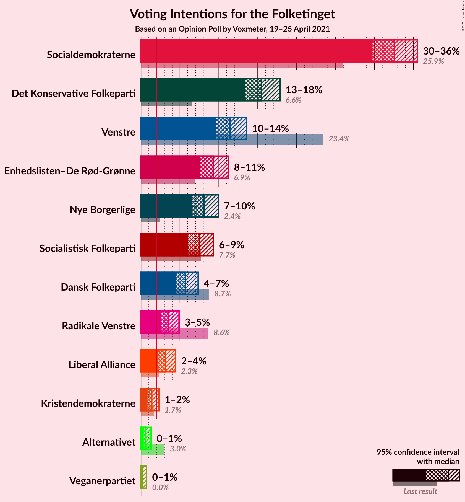
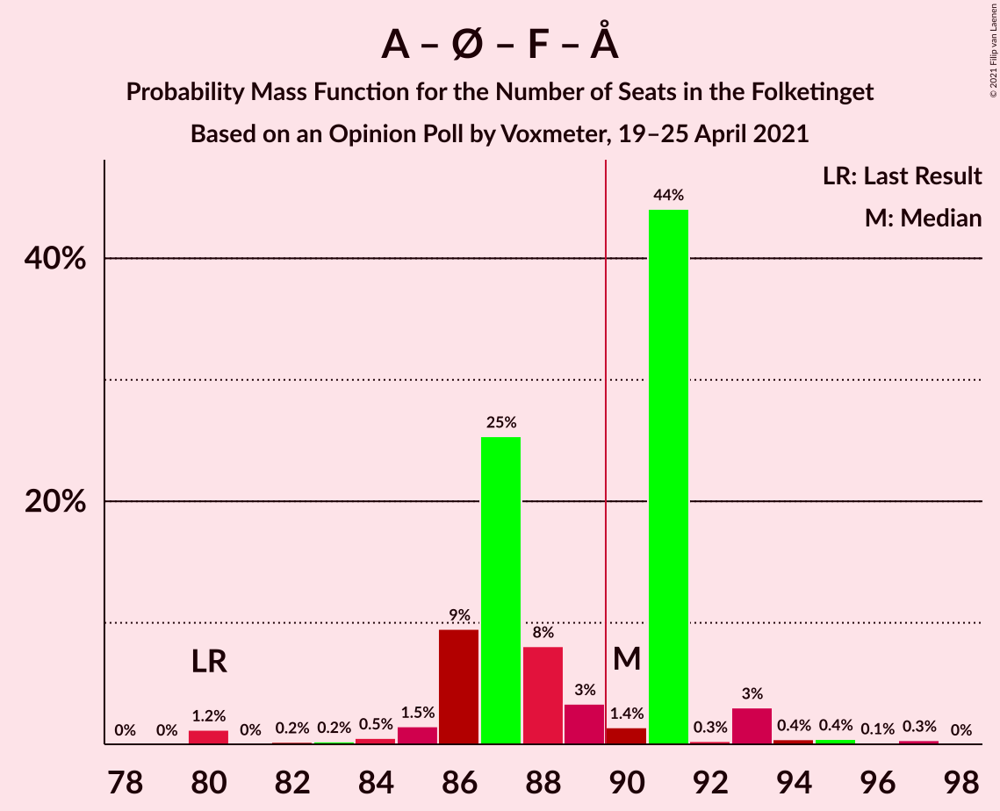

# Opinion Poll by Voxmeter, 19–25 April 2021

<a href="#voting-intentions">Voting Intentions</a> | <a href="#seats">Seats</a> | <a href="#coalitions">Coalitions</a> | <a href="#technical-information">Technical Information</a>

## Voting Intentions

### Confidence Intervals

| Party | Last Result | Poll Result | 80% Confidence Interval | 90% Confidence Interval | 95% Confidence Interval | 99% Confidence Interval |
|:-----:|:-----------:|:-----------:|:-----------------------:|:-----------------------:|:-----------------------:|:-----------------------:|
| Socialdemokraterne | 25.9% | 32.6% | 30.7–34.5% |30.2–35.1% |29.8–35.5% |28.9–36.5% |
| Det Konservative Folkeparti | 6.6% | 15.5% | 14.1–17.0% |13.7–17.5% |13.4–17.9% |12.8–18.6% |
| Venstre | 23.4% | 11.5% | 10.3–12.8% |9.9–13.2% |9.6–13.6% |9.1–14.3% |
| Enhedslisten–De Rød-Grønne | 6.9% | 9.3% | 8.2–10.5% |7.9–10.9% |7.6–11.2% |7.1–11.9% |
| Nye Borgerlige | 2.4% | 8.1% | 7.1–9.3% |6.8–9.6% |6.6–10.0% |6.1–10.5% |
| Socialistisk Folkeparti | 7.7% | 7.5% | 6.5–8.7% |6.3–9.0% |6.0–9.3% |5.6–9.9% |
| Dansk Folkeparti | 8.7% | 5.7% | 4.9–6.8% |4.6–7.1% |4.5–7.3% |4.1–7.9% |
| Radikale Venstre | 8.6% | 3.6% | 2.9–4.4% |2.7–4.7% |2.6–4.9% |2.3–5.3% |
| Liberal Alliance | 2.3% | 3.2% | 2.6–4.0% |2.4–4.2% |2.2–4.4% |2.0–4.9% |
| Kristendemokraterne | 1.7% | 1.4% | 1.0–2.0% |0.9–2.2% |0.8–2.3% |0.7–2.6% |
| Alternativet | 3.0% | 0.6% | 0.4–1.0% |0.3–1.2% |0.3–1.3% |0.2–1.5% |
| Veganerpartiet | 0.0% | 0.2% | 0.1–0.5% |0.1–0.6% |0.1–0.7% |0.0–0.9% |

*Note:* The poll result column reflects the actual value used in the calculations. Published results may vary slightly, and in addition be rounded to fewer digits.

## Seats

### Confidence Intervals

| Party | Last Result | Median | 80% Confidence Interval | 90% Confidence Interval | 95% Confidence Interval | 99% Confidence Interval |
|:-----:|:-----------:|:------:|:-----------------------:|:-----------------------:|:-----------------------:|:-----------------------:|
| <a href="#socialdemokraterne">Socialdemokraterne</a> | 48 | 59 | 55–60 |55–61 |54–61 |52–64 |
| <a href="#det-konservative-folkeparti">Det Konservative Folkeparti</a> | 12 | 27 | 27–31 |26–34 |24–34 |23–34 |
| <a href="#venstre">Venstre</a> | 43 | 21 | 20–22 |19–22 |18–23 |17–24 |
| <a href="#enhedslisten–de-rød-grønne">Enhedslisten–De Rød-Grønne</a> | 13 | 18 | 15–18 |15–19 |15–20 |13–21 |
| <a href="#nye-borgerlige">Nye Borgerlige</a> | 4 | 14 | 12–16 |12–17 |12–18 |12–18 |
| <a href="#socialistisk-folkeparti">Socialistisk Folkeparti</a> | 14 | 13 | 12–14 |11–16 |11–17 |11–17 |
| <a href="#dansk-folkeparti">Dansk Folkeparti</a> | 16 | 10 | 10–11 |9–13 |9–13 |8–13 |
| <a href="#radikale-venstre">Radikale Venstre</a> | 16 | 6 | 6–7 |6–8 |5–8 |4–9 |
| <a href="#liberal-alliance">Liberal Alliance</a> | 4 | 6 | 5–6 |5–7 |5–7 |4–8 |
| <a href="#kristendemokraterne">Kristendemokraterne</a> | 0 | 0 | 0 |0 |0–3 |0–4 |
| <a href="#alternativet">Alternativet</a> | 5 | 0 | 0 |0 |0 |0 |
| <a href="#veganerpartiet">Veganerpartiet</a> | 0 | 0 | 0 |0 |0 |0 |

### Socialdemokraterne

*For a full overview of the results for this party, see the [Socialdemokraterne](party-socialdemokraterne.html) page.*

| Number of Seats | Probability | Accumulated | Special Marks |
|:---------------:|:-----------:|:-----------:|:-------------:|
| 48 | 0% | 100% | Last Result |
| 49 | 0% | 100% |  |
| 50 | 0% | 100% |  |
| 51 | 0.1% | 100% |  |
| 52 | 1.3% | 99.8% |  |
| 53 | 0.4% | 98.5% |  |
| 54 | 3% | 98% |  |
| 55 | 6% | 95% |  |
| 56 | 1.1% | 90% |  |
| 57 | 2% | 88% |  |
| 58 | 32% | 86% |  |
| 59 | 5% | 55% | Median |
| 60 | 44% | 49% |  |
| 61 | 4% | 5% |  |
| 62 | 0.6% | 2% |  |
| 63 | 0.3% | 1.1% |  |
| 64 | 0.5% | 0.8% |  |
| 65 | 0.2% | 0.3% |  |
| 66 | 0.1% | 0.1% |  |
| 67 | 0% | 0% |  |

### Det Konservative Folkeparti

*For a full overview of the results for this party, see the [Det Konservative Folkeparti](party-detkonservativefolkeparti.html) page.*

| Number of Seats | Probability | Accumulated | Special Marks |
|:---------------:|:-----------:|:-----------:|:-------------:|
| 12 | 0% | 100% | Last Result |
| 13 | 0% | 100% |  |
| 14 | 0% | 100% |  |
| 15 | 0% | 100% |  |
| 16 | 0% | 100% |  |
| 17 | 0% | 100% |  |
| 18 | 0% | 100% |  |
| 19 | 0% | 100% |  |
| 20 | 0% | 100% |  |
| 21 | 0% | 100% |  |
| 22 | 0% | 100% |  |
| 23 | 0.5% | 99.9% |  |
| 24 | 2% | 99.5% |  |
| 25 | 1.3% | 97% |  |
| 26 | 4% | 96% |  |
| 27 | 50% | 92% | Median |
| 28 | 3% | 41% |  |
| 29 | 2% | 38% |  |
| 30 | 3% | 37% |  |
| 31 | 24% | 33% |  |
| 32 | 3% | 9% |  |
| 33 | 0% | 6% |  |
| 34 | 6% | 6% |  |
| 35 | 0% | 0.1% |  |
| 36 | 0% | 0% |  |

### Venstre

*For a full overview of the results for this party, see the [Venstre](party-venstre.html) page.*

| Number of Seats | Probability | Accumulated | Special Marks |
|:---------------:|:-----------:|:-----------:|:-------------:|
| 15 | 0.1% | 100% |  |
| 16 | 0.2% | 99.9% |  |
| 17 | 0.8% | 99.8% |  |
| 18 | 4% | 99.0% |  |
| 19 | 4% | 95% |  |
| 20 | 3% | 91% |  |
| 21 | 77% | 88% | Median |
| 22 | 7% | 11% |  |
| 23 | 2% | 5% |  |
| 24 | 2% | 2% |  |
| 25 | 0.2% | 0.2% |  |
| 26 | 0% | 0.1% |  |
| 27 | 0% | 0% |  |
| 28 | 0% | 0% |  |
| 29 | 0% | 0% |  |
| 30 | 0% | 0% |  |
| 31 | 0% | 0% |  |
| 32 | 0% | 0% |  |
| 33 | 0% | 0% |  |
| 34 | 0% | 0% |  |
| 35 | 0% | 0% |  |
| 36 | 0% | 0% |  |
| 37 | 0% | 0% |  |
| 38 | 0% | 0% |  |
| 39 | 0% | 0% |  |
| 40 | 0% | 0% |  |
| 41 | 0% | 0% |  |
| 42 | 0% | 0% |  |
| 43 | 0% | 0% | Last Result |

### Enhedslisten–De Rød-Grønne

*For a full overview of the results for this party, see the [Enhedslisten–De Rød-Grønne](party-enhedslisten–derød-grønne.html) page.*

| Number of Seats | Probability | Accumulated | Special Marks |
|:---------------:|:-----------:|:-----------:|:-------------:|
| 12 | 0.2% | 100% |  |
| 13 | 0.5% | 99.7% | Last Result |
| 14 | 1.2% | 99.3% |  |
| 15 | 29% | 98% |  |
| 16 | 3% | 69% |  |
| 17 | 13% | 66% |  |
| 18 | 44% | 53% | Median |
| 19 | 6% | 9% |  |
| 20 | 2% | 3% |  |
| 21 | 1.2% | 1.3% |  |
| 22 | 0.1% | 0.1% |  |
| 23 | 0% | 0% |  |

### Nye Borgerlige

*For a full overview of the results for this party, see the [Nye Borgerlige](party-nyeborgerlige.html) page.*

| Number of Seats | Probability | Accumulated | Special Marks |
|:---------------:|:-----------:|:-----------:|:-------------:|
| 4 | 0% | 100% | Last Result |
| 5 | 0% | 100% |  |
| 6 | 0% | 100% |  |
| 7 | 0% | 100% |  |
| 8 | 0% | 100% |  |
| 9 | 0% | 100% |  |
| 10 | 0% | 100% |  |
| 11 | 0.2% | 100% |  |
| 12 | 30% | 99.7% |  |
| 13 | 6% | 70% |  |
| 14 | 50% | 64% | Median |
| 15 | 3% | 14% |  |
| 16 | 2% | 11% |  |
| 17 | 6% | 9% |  |
| 18 | 2% | 3% |  |
| 19 | 0.3% | 0.3% |  |
| 20 | 0% | 0% |  |

### Socialistisk Folkeparti

*For a full overview of the results for this party, see the [Socialistisk Folkeparti](party-socialistiskfolkeparti.html) page.*

| Number of Seats | Probability | Accumulated | Special Marks |
|:---------------:|:-----------:|:-----------:|:-------------:|
| 9 | 0.1% | 100% |  |
| 10 | 0.3% | 99.9% |  |
| 11 | 6% | 99.6% |  |
| 12 | 7% | 94% |  |
| 13 | 52% | 86% | Median |
| 14 | 25% | 34% | Last Result |
| 15 | 4% | 10% |  |
| 16 | 2% | 6% |  |
| 17 | 3% | 4% |  |
| 18 | 0.4% | 0.5% |  |
| 19 | 0% | 0% |  |

### Dansk Folkeparti

*For a full overview of the results for this party, see the [Dansk Folkeparti](party-danskfolkeparti.html) page.*

| Number of Seats | Probability | Accumulated | Special Marks |
|:---------------:|:-----------:|:-----------:|:-------------:|
| 6 | 0.1% | 100% |  |
| 7 | 0.2% | 99.9% |  |
| 8 | 1.1% | 99.8% |  |
| 9 | 9% | 98.7% |  |
| 10 | 50% | 90% | Median |
| 11 | 33% | 40% |  |
| 12 | 1.2% | 7% |  |
| 13 | 5% | 5% |  |
| 14 | 0.3% | 0.4% |  |
| 15 | 0.1% | 0.1% |  |
| 16 | 0% | 0% | Last Result |

### Radikale Venstre

*For a full overview of the results for this party, see the [Radikale Venstre](party-radikalevenstre.html) page.*

| Number of Seats | Probability | Accumulated | Special Marks |
|:---------------:|:-----------:|:-----------:|:-------------:|
| 4 | 2% | 100% |  |
| 5 | 2% | 98% |  |
| 6 | 58% | 96% | Median |
| 7 | 31% | 38% |  |
| 8 | 6% | 7% |  |
| 9 | 0.8% | 1.0% |  |
| 10 | 0.1% | 0.1% |  |
| 11 | 0% | 0% |  |
| 12 | 0% | 0% |  |
| 13 | 0% | 0% |  |
| 14 | 0% | 0% |  |
| 15 | 0% | 0% |  |
| 16 | 0% | 0% | Last Result |

### Liberal Alliance

*For a full overview of the results for this party, see the [Liberal Alliance](party-liberalalliance.html) page.*

| Number of Seats | Probability | Accumulated | Special Marks |
|:---------------:|:-----------:|:-----------:|:-------------:|
| 0 | 0.4% | 100% |  |
| 1 | 0% | 99.6% |  |
| 2 | 0% | 99.6% |  |
| 3 | 0% | 99.6% |  |
| 4 | 1.4% | 99.6% | Last Result |
| 5 | 16% | 98% |  |
| 6 | 73% | 82% | Median |
| 7 | 8% | 9% |  |
| 8 | 0.6% | 0.8% |  |
| 9 | 0.2% | 0.3% |  |
| 10 | 0.1% | 0.1% |  |
| 11 | 0% | 0% |  |

### Kristendemokraterne

*For a full overview of the results for this party, see the [Kristendemokraterne](party-kristendemokraterne.html) page.*

| Number of Seats | Probability | Accumulated | Special Marks |
|:---------------:|:-----------:|:-----------:|:-------------:|
| 0 | 97% | 100% | Last Result, Median |
| 1 | 0% | 3% |  |
| 2 | 0% | 3% |  |
| 3 | 0.2% | 3% |  |
| 4 | 2% | 2% |  |
| 5 | 0.4% | 0.4% |  |
| 6 | 0.1% | 0.1% |  |
| 7 | 0% | 0% |  |

### Alternativet

*For a full overview of the results for this party, see the [Alternativet](party-alternativet.html) page.*

| Number of Seats | Probability | Accumulated | Special Marks |
|:---------------:|:-----------:|:-----------:|:-------------:|
| 0 | 100% | 100% | Median |
| 1 | 0% | 0% |  |
| 2 | 0% | 0% |  |
| 3 | 0% | 0% |  |
| 4 | 0% | 0% |  |
| 5 | 0% | 0% | Last Result |

### Veganerpartiet

*For a full overview of the results for this party, see the [Veganerpartiet](party-veganerpartiet.html) page.*

| Number of Seats | Probability | Accumulated | Special Marks |
|:---------------:|:-----------:|:-----------:|:-------------:|
| 0 | 100% | 100% | Last Result, Median |

## Coalitions

### Confidence Intervals

| Coalition | Last Result | Median | Majority? | 80% Confidence Interval | 90% Confidence Interval | 95% Confidence Interval | 99% Confidence Interval |
|:---------:|:-----------:|:------:|:---------:|:-----------------------:|:-----------------------:|:-----------------------:|:-----------------------:|
| Socialdemokraterne – Enhedslisten–De Rød-Grønne – Socialistisk Folkeparti – Radikale Venstre – Alternativet | 96 | 96 | 98% | 93–97 | 92–97 | 91–101 | 86–103 |
| Socialdemokraterne – Enhedslisten–De Rød-Grønne – Socialistisk Folkeparti – Radikale Venstre | 91 | 96 | 98% | 93–97 | 92–97 | 91–101 | 86–103 |
| Socialdemokraterne – Enhedslisten–De Rød-Grønne – Socialistisk Folkeparti – Alternativet | 80 | 90 | 50% | 86–91 | 86–91 | 85–93 | 80–95 |
| Socialdemokraterne – Enhedslisten–De Rød-Grønne – Socialistisk Folkeparti | 75 | 90 | 50% | 86–91 | 86–91 | 85–93 | 80–95 |
| Det Konservative Folkeparti – Venstre – Nye Borgerlige – Dansk Folkeparti – Liberal Alliance – Kristendemokraterne | 79 | 79 | 0% | 78–82 | 78–83 | 74–84 | 72–89 |
| Det Konservative Folkeparti – Venstre – Nye Borgerlige – Dansk Folkeparti – Liberal Alliance | 79 | 79 | 0% | 78–82 | 76–83 | 74–84 | 72–85 |
| Socialdemokraterne – Socialistisk Folkeparti – Radikale Venstre | 78 | 79 | 0% | 76–79 | 73–80 | 73–84 | 71–86 |
| Det Konservative Folkeparti – Venstre – Dansk Folkeparti – Liberal Alliance – Kristendemokraterne | 75 | 64 | 0% | 64–69 | 62–69 | 61–69 | 58–72 |
| Det Konservative Folkeparti – Venstre – Dansk Folkeparti – Liberal Alliance | 75 | 64 | 0% | 63–69 | 62–69 | 61–69 | 58–70 |
| Socialdemokraterne – Radikale Venstre | 64 | 66 | 0% | 62–66 | 61–67 | 59–68 | 58–71 |
| Det Konservative Folkeparti – Venstre – Liberal Alliance | 59 | 54 | 0% | 53–58 | 51–60 | 50–60 | 48–60 |
| Det Konservative Folkeparti – Venstre | 55 | 48 | 0% | 47–53 | 45–55 | 45–55 | 43–55 |
| Venstre | 43 | 21 | 0% | 20–22 | 19–22 | 18–23 | 17–24 |

### Socialdemokraterne – Enhedslisten–De Rød-Grønne – Socialistisk Folkeparti – Radikale Venstre – Alternativet

| Number of Seats | Probability | Accumulated | Special Marks |
|:---------------:|:-----------:|:-----------:|:-------------:|
| 86 | 1.2% | 100% |  |
| 87 | 0% | 98.8% |  |
| 88 | 0.1% | 98.8% |  |
| 89 | 0.2% | 98.7% |  |
| 90 | 0.5% | 98% | Majority |
| 91 | 1.0% | 98% |  |
| 92 | 6% | 97% |  |
| 93 | 3% | 91% |  |
| 94 | 35% | 88% |  |
| 95 | 1.1% | 54% |  |
| 96 | 4% | 53% | Last Result, Median |
| 97 | 44% | 49% |  |
| 98 | 0.2% | 5% |  |
| 99 | 0.3% | 4% |  |
| 100 | 0.7% | 4% |  |
| 101 | 3% | 3% |  |
| 102 | 0.1% | 0.6% |  |
| 103 | 0.2% | 0.6% |  |
| 104 | 0.3% | 0.4% |  |
| 105 | 0% | 0% |  |

### Socialdemokraterne – Enhedslisten–De Rød-Grønne – Socialistisk Folkeparti – Radikale Venstre

| Number of Seats | Probability | Accumulated | Special Marks |
|:---------------:|:-----------:|:-----------:|:-------------:|
| 86 | 1.2% | 100% |  |
| 87 | 0% | 98.8% |  |
| 88 | 0.1% | 98.8% |  |
| 89 | 0.2% | 98.7% |  |
| 90 | 0.5% | 98% | Majority |
| 91 | 1.0% | 98% | Last Result |
| 92 | 6% | 97% |  |
| 93 | 3% | 91% |  |
| 94 | 35% | 88% |  |
| 95 | 1.1% | 54% |  |
| 96 | 4% | 53% | Median |
| 97 | 44% | 48% |  |
| 98 | 0.2% | 5% |  |
| 99 | 0.3% | 4% |  |
| 100 | 0.7% | 4% |  |
| 101 | 3% | 3% |  |
| 102 | 0% | 0.6% |  |
| 103 | 0.2% | 0.6% |  |
| 104 | 0.3% | 0.4% |  |
| 105 | 0% | 0% |  |

### Socialdemokraterne – Enhedslisten–De Rød-Grønne – Socialistisk Folkeparti – Alternativet

| Number of Seats | Probability | Accumulated | Special Marks |
|:---------------:|:-----------:|:-----------:|:-------------:|
| 80 | 1.2% | 100% | Last Result |
| 81 | 0% | 98.8% |  |
| 82 | 0.2% | 98.7% |  |
| 83 | 0.2% | 98.6% |  |
| 84 | 0.5% | 98% |  |
| 85 | 1.5% | 98% |  |
| 86 | 9% | 96% |  |
| 87 | 25% | 87% |  |
| 88 | 8% | 61% |  |
| 89 | 3% | 53% |  |
| 90 | 1.4% | 50% | Median, Majority |
| 91 | 44% | 49% |  |
| 92 | 0.3% | 5% |  |
| 93 | 3% | 4% |  |
| 94 | 0.4% | 1.3% |  |
| 95 | 0.4% | 0.9% |  |
| 96 | 0.1% | 0.5% |  |
| 97 | 0.3% | 0.4% |  |
| 98 | 0% | 0% |  |

### Socialdemokraterne – Enhedslisten–De Rød-Grønne – Socialistisk Folkeparti

| Number of Seats | Probability | Accumulated | Special Marks |
|:---------------:|:-----------:|:-----------:|:-------------:|
| 75 | 0% | 100% | Last Result |
| 76 | 0% | 100% |  |
| 77 | 0% | 100% |  |
| 78 | 0% | 100% |  |
| 79 | 0% | 100% |  |
| 80 | 1.2% | 100% |  |
| 81 | 0% | 98.8% |  |
| 82 | 0.2% | 98.7% |  |
| 83 | 0.2% | 98.6% |  |
| 84 | 0.5% | 98% |  |
| 85 | 1.5% | 98% |  |
| 86 | 9% | 96% |  |
| 87 | 25% | 87% |  |
| 88 | 8% | 61% |  |
| 89 | 3% | 53% |  |
| 90 | 1.4% | 50% | Median, Majority |
| 91 | 44% | 49% |  |
| 92 | 0.3% | 5% |  |
| 93 | 3% | 4% |  |
| 94 | 0.4% | 1.3% |  |
| 95 | 0.4% | 0.9% |  |
| 96 | 0.1% | 0.5% |  |
| 97 | 0.3% | 0.4% |  |
| 98 | 0% | 0% |  |

### Det Konservative Folkeparti – Venstre – Nye Borgerlige – Dansk Folkeparti – Liberal Alliance – Kristendemokraterne

| Number of Seats | Probability | Accumulated | Special Marks |
|:---------------:|:-----------:|:-----------:|:-------------:|
| 71 | 0.3% | 100% |  |
| 72 | 0.2% | 99.6% |  |
| 73 | 0.1% | 99.4% |  |
| 74 | 3% | 99.3% |  |
| 75 | 0.7% | 97% |  |
| 76 | 0.4% | 96% |  |
| 77 | 0.2% | 96% |  |
| 78 | 44% | 95% | Median |
| 79 | 4% | 51% | Last Result |
| 80 | 1.0% | 47% |  |
| 81 | 35% | 46% |  |
| 82 | 3% | 12% |  |
| 83 | 5% | 9% |  |
| 84 | 1.0% | 3% |  |
| 85 | 0.5% | 2% |  |
| 86 | 0.2% | 1.5% |  |
| 87 | 0.1% | 1.3% |  |
| 88 | 0% | 1.2% |  |
| 89 | 1.2% | 1.2% |  |
| 90 | 0% | 0% | Majority |

### Det Konservative Folkeparti – Venstre – Nye Borgerlige – Dansk Folkeparti – Liberal Alliance

| Number of Seats | Probability | Accumulated | Special Marks |
|:---------------:|:-----------:|:-----------:|:-------------:|
| 71 | 0.3% | 100% |  |
| 72 | 0.2% | 99.6% |  |
| 73 | 0.2% | 99.4% |  |
| 74 | 3% | 99.2% |  |
| 75 | 0.7% | 96% |  |
| 76 | 0.5% | 95% |  |
| 77 | 0.3% | 95% |  |
| 78 | 44% | 95% | Median |
| 79 | 4% | 51% | Last Result |
| 80 | 0.8% | 47% |  |
| 81 | 35% | 46% |  |
| 82 | 3% | 11% |  |
| 83 | 5% | 8% |  |
| 84 | 0.9% | 3% |  |
| 85 | 2% | 2% |  |
| 86 | 0.1% | 0.2% |  |
| 87 | 0% | 0.1% |  |
| 88 | 0% | 0% |  |

### Socialdemokraterne – Socialistisk Folkeparti – Radikale Venstre

| Number of Seats | Probability | Accumulated | Special Marks |
|:---------------:|:-----------:|:-----------:|:-------------:|
| 70 | 0.3% | 100% |  |
| 71 | 1.3% | 99.7% |  |
| 72 | 0.2% | 98% |  |
| 73 | 5% | 98% |  |
| 74 | 0.4% | 93% |  |
| 75 | 1.4% | 93% |  |
| 76 | 2% | 92% |  |
| 77 | 9% | 89% |  |
| 78 | 4% | 80% | Last Result, Median |
| 79 | 70% | 76% |  |
| 80 | 1.2% | 6% |  |
| 81 | 0.5% | 5% |  |
| 82 | 0.5% | 4% |  |
| 83 | 0.2% | 4% |  |
| 84 | 3% | 3% |  |
| 85 | 0.1% | 0.9% |  |
| 86 | 0.6% | 0.8% |  |
| 87 | 0% | 0.2% |  |
| 88 | 0.2% | 0.2% |  |
| 89 | 0% | 0% |  |

### Det Konservative Folkeparti – Venstre – Dansk Folkeparti – Liberal Alliance – Kristendemokraterne

| Number of Seats | Probability | Accumulated | Special Marks |
|:---------------:|:-----------:|:-----------:|:-------------:|
| 57 | 0.1% | 100% |  |
| 58 | 0.4% | 99.9% |  |
| 59 | 0.2% | 99.5% |  |
| 60 | 0.3% | 99.3% |  |
| 61 | 3% | 99.1% |  |
| 62 | 4% | 96% |  |
| 63 | 2% | 92% |  |
| 64 | 45% | 90% | Median |
| 65 | 2% | 45% |  |
| 66 | 2% | 43% |  |
| 67 | 1.4% | 41% |  |
| 68 | 1.1% | 39% |  |
| 69 | 36% | 38% |  |
| 70 | 0.6% | 2% |  |
| 71 | 0.4% | 2% |  |
| 72 | 1.2% | 1.4% |  |
| 73 | 0.1% | 0.1% |  |
| 74 | 0% | 0% |  |
| 75 | 0% | 0% | Last Result |

### Det Konservative Folkeparti – Venstre – Dansk Folkeparti – Liberal Alliance

| Number of Seats | Probability | Accumulated | Special Marks |
|:---------------:|:-----------:|:-----------:|:-------------:|
| 57 | 0.1% | 100% |  |
| 58 | 0.4% | 99.9% |  |
| 59 | 0.2% | 99.4% |  |
| 60 | 0.6% | 99.2% |  |
| 61 | 3% | 98.6% |  |
| 62 | 4% | 95% |  |
| 63 | 3% | 92% |  |
| 64 | 45% | 89% | Median |
| 65 | 2% | 44% |  |
| 66 | 2% | 42% |  |
| 67 | 1.2% | 40% |  |
| 68 | 2% | 39% |  |
| 69 | 36% | 37% |  |
| 70 | 0.6% | 1.0% |  |
| 71 | 0.3% | 0.4% |  |
| 72 | 0% | 0.1% |  |
| 73 | 0% | 0% |  |
| 74 | 0% | 0% |  |
| 75 | 0% | 0% | Last Result |

### Socialdemokraterne – Radikale Venstre

| Number of Seats | Probability | Accumulated | Special Marks |
|:---------------:|:-----------:|:-----------:|:-------------:|
| 57 | 0% | 100% |  |
| 58 | 1.4% | 99.9% |  |
| 59 | 1.3% | 98.5% |  |
| 60 | 0.5% | 97% |  |
| 61 | 5% | 97% |  |
| 62 | 3% | 92% |  |
| 63 | 1.4% | 89% |  |
| 64 | 7% | 87% | Last Result |
| 65 | 26% | 80% | Median |
| 66 | 46% | 54% |  |
| 67 | 4% | 8% |  |
| 68 | 3% | 4% |  |
| 69 | 0.3% | 1.3% |  |
| 70 | 0.1% | 1.0% |  |
| 71 | 0.7% | 0.9% |  |
| 72 | 0.1% | 0.2% |  |
| 73 | 0.1% | 0.1% |  |
| 74 | 0% | 0% |  |

### Det Konservative Folkeparti – Venstre – Liberal Alliance

| Number of Seats | Probability | Accumulated | Special Marks |
|:---------------:|:-----------:|:-----------:|:-------------:|
| 46 | 0% | 100% |  |
| 47 | 0% | 99.9% |  |
| 48 | 0.7% | 99.9% |  |
| 49 | 0.2% | 99.3% |  |
| 50 | 3% | 99.0% |  |
| 51 | 2% | 96% |  |
| 52 | 3% | 94% |  |
| 53 | 2% | 91% |  |
| 54 | 45% | 89% | Median |
| 55 | 1.3% | 43% |  |
| 56 | 7% | 42% |  |
| 57 | 0.9% | 35% |  |
| 58 | 25% | 34% |  |
| 59 | 2% | 9% | Last Result |
| 60 | 6% | 6% |  |
| 61 | 0.1% | 0.1% |  |
| 62 | 0% | 0% |  |

### Det Konservative Folkeparti – Venstre

| Number of Seats | Probability | Accumulated | Special Marks |
|:---------------:|:-----------:|:-----------:|:-------------:|
| 41 | 0% | 100% |  |
| 42 | 0.2% | 99.9% |  |
| 43 | 0.3% | 99.8% |  |
| 44 | 0.4% | 99.5% |  |
| 45 | 5% | 99.0% |  |
| 46 | 2% | 94% |  |
| 47 | 3% | 92% |  |
| 48 | 44% | 89% | Median |
| 49 | 8% | 45% |  |
| 50 | 2% | 37% |  |
| 51 | 1.4% | 35% |  |
| 52 | 23% | 34% |  |
| 53 | 4% | 10% |  |
| 54 | 0.2% | 6% |  |
| 55 | 6% | 6% | Last Result |
| 56 | 0% | 0.1% |  |
| 57 | 0% | 0% |  |

### Venstre

| Number of Seats | Probability | Accumulated | Special Marks |
|:---------------:|:-----------:|:-----------:|:-------------:|
| 15 | 0.1% | 100% |  |
| 16 | 0.2% | 99.9% |  |
| 17 | 0.8% | 99.8% |  |
| 18 | 4% | 99.0% |  |
| 19 | 4% | 95% |  |
| 20 | 3% | 91% |  |
| 21 | 77% | 88% | Median |
| 22 | 7% | 11% |  |
| 23 | 2% | 5% |  |
| 24 | 2% | 2% |  |
| 25 | 0.2% | 0.2% |  |
| 26 | 0% | 0.1% |  |
| 27 | 0% | 0% |  |
| 28 | 0% | 0% |  |
| 29 | 0% | 0% |  |
| 30 | 0% | 0% |  |
| 31 | 0% | 0% |  |
| 32 | 0% | 0% |  |
| 33 | 0% | 0% |  |
| 34 | 0% | 0% |  |
| 35 | 0% | 0% |  |
| 36 | 0% | 0% |  |
| 37 | 0% | 0% |  |
| 38 | 0% | 0% |  |
| 39 | 0% | 0% |  |
| 40 | 0% | 0% |  |
| 41 | 0% | 0% |  |
| 42 | 0% | 0% |  |
| 43 | 0% | 0% | Last Result |

## Technical Information

### Opinion Poll

+ **Polling firm:** Voxmeter
+ **Commissioner(s):** —
+ **Fieldwork period:** 19–25 April 2021

### Calculations

+ **Sample size:** 1013
+ **Simulations done:** 1,048,576
+ **Error estimate:** 3.84%

