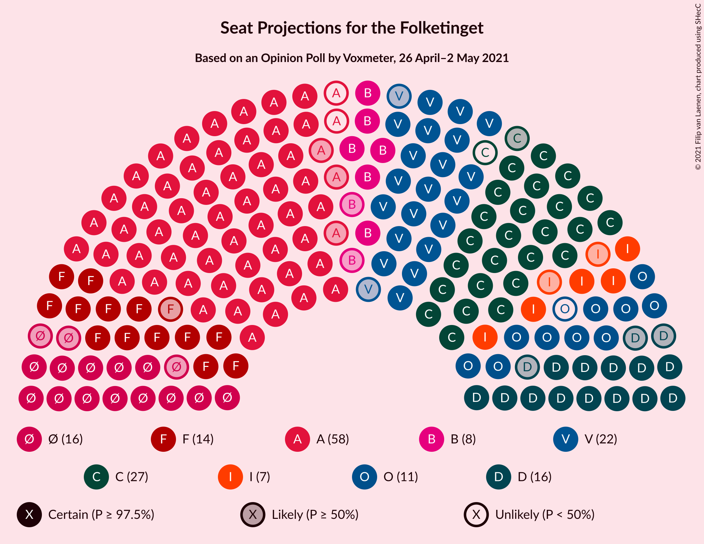
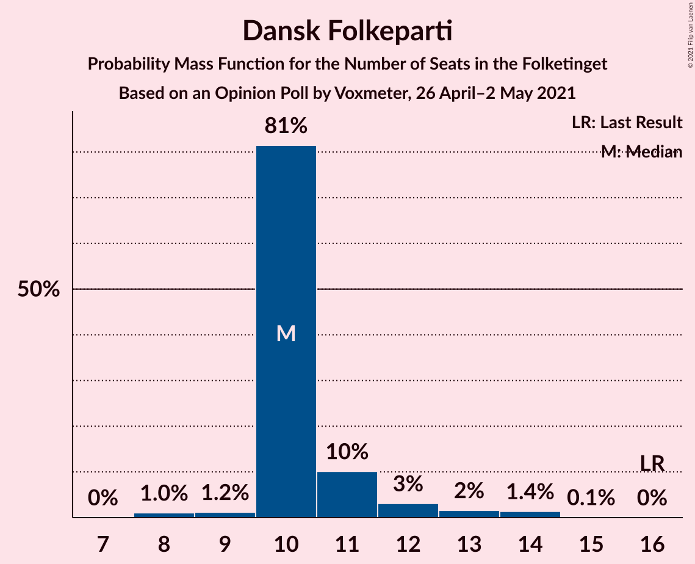
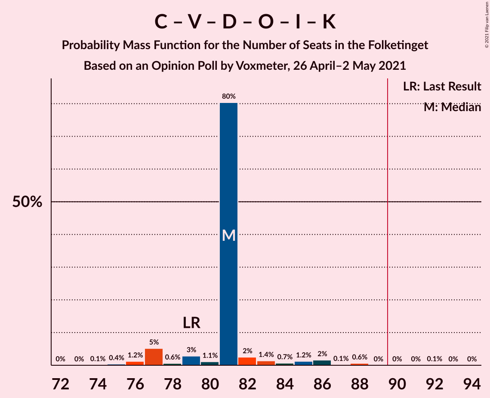

# Opinion Poll by Voxmeter, 26 April–2 May 2021

<a href="#voting-intentions">Voting Intentions</a> | <a href="#seats">Seats</a> | <a href="#coalitions">Coalitions</a> | <a href="#technical-information">Technical Information</a>

## Voting Intentions

### Confidence Intervals

| Party | Last Result | Poll Result | 80% Confidence Interval | 90% Confidence Interval | 95% Confidence Interval | 99% Confidence Interval |
|:-----:|:-----------:|:-----------:|:-----------------------:|:-----------------------:|:-----------------------:|:-----------------------:|
| Socialdemokraterne | 25.9% | 31.2% | 29.4–33.1% |28.9–33.7% |28.4–34.1% |27.6–35.1% |
| Det Konservative Folkeparti | 6.6% | 14.9% | 13.5–16.4% |13.1–16.8% |12.8–17.2% |12.2–17.9% |
| Venstre | 23.4% | 12.3% | 11.1–13.7% |10.7–14.1% |10.4–14.5% |9.9–15.2% |
| Enhedslisten–De Rød-Grønne | 6.9% | 8.6% | 7.6–9.8% |7.3–10.2% |7.0–10.5% |6.6–11.1% |
| Socialistisk Folkeparti | 7.7% | 8.0% | 7.0–9.2% |6.7–9.6% |6.5–9.9% |6.1–10.5% |
| Nye Borgerlige | 2.4% | 7.6% | 6.7–8.8% |6.4–9.1% |6.2–9.4% |5.7–10.0% |
| Dansk Folkeparti | 8.7% | 6.1% | 5.2–7.1% |5.0–7.4% |4.8–7.7% |4.4–8.2% |
| Radikale Venstre | 8.6% | 4.1% | 3.4–5.0% |3.2–5.3% |3.0–5.5% |2.7–6.0% |
| Liberal Alliance | 2.3% | 3.3% | 2.7–4.2% |2.5–4.4% |2.4–4.6% |2.1–5.1% |
| Kristendemokraterne | 1.7% | 1.7% | 1.2–2.3% |1.1–2.5% |1.0–2.7% |0.9–3.0% |
| Alternativet | 3.0% | 0.9% | 0.6–1.4% |0.5–1.5% |0.5–1.7% |0.4–2.0% |
| Veganerpartiet | 0.0% | 0.2% | 0.1–0.5% |0.1–0.6% |0.0–0.7% |0.0–0.9% |

*Note:* The poll result column reflects the actual value used in the calculations. Published results may vary slightly, and in addition be rounded to fewer digits.

## Seats

### Confidence Intervals

| Party | Last Result | Median | 80% Confidence Interval | 90% Confidence Interval | 95% Confidence Interval | 99% Confidence Interval |
|:-----:|:-----------:|:------:|:-----------------------:|:-----------------------:|:-----------------------:|:-----------------------:|
| <a href="#socialdemokraterne">Socialdemokraterne</a> | 48 | 54 | 52–60 |52–60 |52–60 |52–63 |
| <a href="#det-konservative-folkeparti">Det Konservative Folkeparti</a> | 12 | 27 | 26–29 |25–29 |25–30 |23–35 |
| <a href="#venstre">Venstre</a> | 43 | 22 | 20–27 |20–27 |20–27 |18–27 |
| <a href="#enhedslisten–de-rød-grønne">Enhedslisten–De Rød-Grønne</a> | 13 | 16 | 13–17 |13–17 |13–18 |11–19 |
| <a href="#socialistisk-folkeparti">Socialistisk Folkeparti</a> | 14 | 14 | 14–15 |14–15 |13–16 |12–18 |
| <a href="#nye-borgerlige">Nye Borgerlige</a> | 4 | 14 | 13–16 |13–16 |13–16 |12–17 |
| <a href="#dansk-folkeparti">Dansk Folkeparti</a> | 16 | 11 | 10–12 |10–12 |9–13 |8–14 |
| <a href="#radikale-venstre">Radikale Venstre</a> | 16 | 7 | 6–8 |6–8 |6–9 |5–12 |
| <a href="#liberal-alliance">Liberal Alliance</a> | 4 | 5 | 4–6 |4–6 |4–7 |4–8 |
| <a href="#kristendemokraterne">Kristendemokraterne</a> | 0 | 0 | 0–4 |0–4 |0–4 |0–5 |
| <a href="#alternativet">Alternativet</a> | 5 | 0 | 0 |0 |0 |0 |
| <a href="#veganerpartiet">Veganerpartiet</a> | 0 | 0 | 0 |0 |0 |0 |

### Socialdemokraterne

*For a full overview of the results for this party, see the [Socialdemokraterne](party-socialdemokraterne.html) page.*

| Number of Seats | Probability | Accumulated | Special Marks |
|:---------------:|:-----------:|:-----------:|:-------------:|
| 48 | 0% | 100% | Last Result |
| 49 | 0% | 100% |  |
| 50 | 0.1% | 100% |  |
| 51 | 0.2% | 99.9% |  |
| 52 | 15% | 99.6% |  |
| 53 | 3% | 85% |  |
| 54 | 38% | 82% | Median |
| 55 | 11% | 44% |  |
| 56 | 0.5% | 32% |  |
| 57 | 0.4% | 32% |  |
| 58 | 0.3% | 31% |  |
| 59 | 2% | 31% |  |
| 60 | 28% | 29% |  |
| 61 | 0.1% | 0.8% |  |
| 62 | 0% | 0.8% |  |
| 63 | 0.7% | 0.7% |  |
| 64 | 0% | 0% |  |

### Det Konservative Folkeparti

*For a full overview of the results for this party, see the [Det Konservative Folkeparti](party-detkonservativefolkeparti.html) page.*

| Number of Seats | Probability | Accumulated | Special Marks |
|:---------------:|:-----------:|:-----------:|:-------------:|
| 12 | 0% | 100% | Last Result |
| 13 | 0% | 100% |  |
| 14 | 0% | 100% |  |
| 15 | 0% | 100% |  |
| 16 | 0% | 100% |  |
| 17 | 0% | 100% |  |
| 18 | 0% | 100% |  |
| 19 | 0% | 100% |  |
| 20 | 0% | 100% |  |
| 21 | 0.1% | 100% |  |
| 22 | 0.1% | 99.9% |  |
| 23 | 2% | 99.9% |  |
| 24 | 0.2% | 98% |  |
| 25 | 4% | 98% |  |
| 26 | 11% | 94% |  |
| 27 | 66% | 83% | Median |
| 28 | 0.3% | 17% |  |
| 29 | 11% | 16% |  |
| 30 | 3% | 5% |  |
| 31 | 0.1% | 2% |  |
| 32 | 0% | 2% |  |
| 33 | 0% | 1.5% |  |
| 34 | 0% | 1.5% |  |
| 35 | 1.5% | 1.5% |  |
| 36 | 0% | 0% |  |

### Venstre

*For a full overview of the results for this party, see the [Venstre](party-venstre.html) page.*

| Number of Seats | Probability | Accumulated | Special Marks |
|:---------------:|:-----------:|:-----------:|:-------------:|
| 16 | 0.2% | 100% |  |
| 17 | 0% | 99.8% |  |
| 18 | 0.8% | 99.8% |  |
| 19 | 0.3% | 99.0% |  |
| 20 | 28% | 98.6% |  |
| 21 | 0.8% | 70% |  |
| 22 | 41% | 70% | Median |
| 23 | 13% | 29% |  |
| 24 | 2% | 16% |  |
| 25 | 0.1% | 14% |  |
| 26 | 2% | 14% |  |
| 27 | 11% | 11% |  |
| 28 | 0% | 0% |  |
| 29 | 0% | 0% |  |
| 30 | 0% | 0% |  |
| 31 | 0% | 0% |  |
| 32 | 0% | 0% |  |
| 33 | 0% | 0% |  |
| 34 | 0% | 0% |  |
| 35 | 0% | 0% |  |
| 36 | 0% | 0% |  |
| 37 | 0% | 0% |  |
| 38 | 0% | 0% |  |
| 39 | 0% | 0% |  |
| 40 | 0% | 0% |  |
| 41 | 0% | 0% |  |
| 42 | 0% | 0% |  |
| 43 | 0% | 0% | Last Result |

### Enhedslisten–De Rød-Grønne

*For a full overview of the results for this party, see the [Enhedslisten–De Rød-Grønne](party-enhedslisten–derød-grønne.html) page.*

| Number of Seats | Probability | Accumulated | Special Marks |
|:---------------:|:-----------:|:-----------:|:-------------:|
| 11 | 0.6% | 100% |  |
| 12 | 0.8% | 99.4% |  |
| 13 | 27% | 98.6% | Last Result |
| 14 | 15% | 71% |  |
| 15 | 3% | 57% |  |
| 16 | 39% | 54% | Median |
| 17 | 10% | 15% |  |
| 18 | 3% | 4% |  |
| 19 | 0.6% | 0.8% |  |
| 20 | 0.2% | 0.2% |  |
| 21 | 0% | 0% |  |

### Socialistisk Folkeparti

*For a full overview of the results for this party, see the [Socialistisk Folkeparti](party-socialistiskfolkeparti.html) page.*

| Number of Seats | Probability | Accumulated | Special Marks |
|:---------------:|:-----------:|:-----------:|:-------------:|
| 10 | 0% | 100% |  |
| 11 | 0.2% | 99.9% |  |
| 12 | 1.2% | 99.7% |  |
| 13 | 4% | 98.6% |  |
| 14 | 50% | 95% | Last Result, Median |
| 15 | 42% | 45% |  |
| 16 | 0.3% | 3% |  |
| 17 | 0.9% | 2% |  |
| 18 | 2% | 2% |  |
| 19 | 0% | 0.1% |  |
| 20 | 0% | 0% |  |

### Nye Borgerlige

*For a full overview of the results for this party, see the [Nye Borgerlige](party-nyeborgerlige.html) page.*

| Number of Seats | Probability | Accumulated | Special Marks |
|:---------------:|:-----------:|:-----------:|:-------------:|
| 4 | 0% | 100% | Last Result |
| 5 | 0% | 100% |  |
| 6 | 0% | 100% |  |
| 7 | 0% | 100% |  |
| 8 | 0% | 100% |  |
| 9 | 0% | 100% |  |
| 10 | 0.1% | 100% |  |
| 11 | 0.1% | 99.9% |  |
| 12 | 2% | 99.8% |  |
| 13 | 31% | 98% |  |
| 14 | 55% | 67% | Median |
| 15 | 0.9% | 12% |  |
| 16 | 10% | 11% |  |
| 17 | 1.2% | 2% |  |
| 18 | 0.2% | 0.4% |  |
| 19 | 0.1% | 0.1% |  |
| 20 | 0% | 0% |  |

### Dansk Folkeparti

*For a full overview of the results for this party, see the [Dansk Folkeparti](party-danskfolkeparti.html) page.*

| Number of Seats | Probability | Accumulated | Special Marks |
|:---------------:|:-----------:|:-----------:|:-------------:|
| 8 | 1.3% | 100% |  |
| 9 | 2% | 98.7% |  |
| 10 | 23% | 97% |  |
| 11 | 40% | 73% | Median |
| 12 | 30% | 34% |  |
| 13 | 2% | 3% |  |
| 14 | 0.9% | 1.2% |  |
| 15 | 0.2% | 0.3% |  |
| 16 | 0% | 0% | Last Result |

### Radikale Venstre

*For a full overview of the results for this party, see the [Radikale Venstre](party-radikalevenstre.html) page.*

| Number of Seats | Probability | Accumulated | Special Marks |
|:---------------:|:-----------:|:-----------:|:-------------:|
| 5 | 2% | 100% |  |
| 6 | 30% | 98% |  |
| 7 | 51% | 69% | Median |
| 8 | 13% | 17% |  |
| 9 | 3% | 4% |  |
| 10 | 0.3% | 2% |  |
| 11 | 0.1% | 1.4% |  |
| 12 | 1.3% | 1.3% |  |
| 13 | 0% | 0% |  |
| 14 | 0% | 0% |  |
| 15 | 0% | 0% |  |
| 16 | 0% | 0% | Last Result |

### Liberal Alliance

*For a full overview of the results for this party, see the [Liberal Alliance](party-liberalalliance.html) page.*

| Number of Seats | Probability | Accumulated | Special Marks |
|:---------------:|:-----------:|:-----------:|:-------------:|
| 4 | 13% | 100% | Last Result |
| 5 | 43% | 87% | Median |
| 6 | 40% | 44% |  |
| 7 | 3% | 5% |  |
| 8 | 1.1% | 1.5% |  |
| 9 | 0.3% | 0.4% |  |
| 10 | 0.1% | 0.1% |  |
| 11 | 0% | 0% |  |

### Kristendemokraterne

*For a full overview of the results for this party, see the [Kristendemokraterne](party-kristendemokraterne.html) page.*

| Number of Seats | Probability | Accumulated | Special Marks |
|:---------------:|:-----------:|:-----------:|:-------------:|
| 0 | 58% | 100% | Last Result, Median |
| 1 | 0% | 42% |  |
| 2 | 0% | 42% |  |
| 3 | 0% | 42% |  |
| 4 | 40% | 42% |  |
| 5 | 2% | 2% |  |
| 6 | 0.1% | 0.1% |  |
| 7 | 0% | 0% |  |

### Alternativet

*For a full overview of the results for this party, see the [Alternativet](party-alternativet.html) page.*

| Number of Seats | Probability | Accumulated | Special Marks |
|:---------------:|:-----------:|:-----------:|:-------------:|
| 0 | 99.7% | 100% | Median |
| 1 | 0% | 0.3% |  |
| 2 | 0% | 0.3% |  |
| 3 | 0% | 0.3% |  |
| 4 | 0.3% | 0.3% |  |
| 5 | 0% | 0% | Last Result |

### Veganerpartiet

*For a full overview of the results for this party, see the [Veganerpartiet](party-veganerpartiet.html) page.*

| Number of Seats | Probability | Accumulated | Special Marks |
|:---------------:|:-----------:|:-----------:|:-------------:|
| 0 | 100% | 100% | Last Result, Median |

## Coalitions

### Confidence Intervals

| Coalition | Last Result | Median | Majority? | 80% Confidence Interval | 90% Confidence Interval | 95% Confidence Interval | 99% Confidence Interval |
|:---------:|:-----------:|:------:|:---------:|:-----------------------:|:-----------------------:|:-----------------------:|:-----------------------:|
| Socialdemokraterne – Enhedslisten–De Rød-Grønne – Socialistisk Folkeparti – Radikale Venstre – Alternativet | 96 | 92 | 95% | 90–93 | 90–95 | 88–97 | 87–99 |
| Socialdemokraterne – Enhedslisten–De Rød-Grønne – Socialistisk Folkeparti – Radikale Venstre | 91 | 92 | 95% | 90–93 | 90–95 | 88–97 | 87–99 |
| Socialdemokraterne – Enhedslisten–De Rød-Grønne – Socialistisk Folkeparti – Alternativet | 80 | 85 | 3% | 83–87 | 82–87 | 81–91 | 79–92 |
| Socialdemokraterne – Enhedslisten–De Rød-Grønne – Socialistisk Folkeparti | 75 | 85 | 3% | 83–87 | 82–87 | 81–91 | 79–92 |
| Det Konservative Folkeparti – Venstre – Nye Borgerlige – Dansk Folkeparti – Liberal Alliance – Kristendemokraterne | 79 | 82 | 0.2% | 79–85 | 79–85 | 78–87 | 76–88 |
| Det Konservative Folkeparti – Venstre – Nye Borgerlige – Dansk Folkeparti – Liberal Alliance | 79 | 79 | 0% | 78–84 | 78–84 | 77–87 | 72–88 |
| Socialdemokraterne – Socialistisk Folkeparti – Radikale Venstre | 78 | 76 | 0% | 73–80 | 73–80 | 73–81 | 72–83 |
| Det Konservative Folkeparti – Venstre – Dansk Folkeparti – Liberal Alliance – Kristendemokraterne | 75 | 69 | 0% | 65–70 | 65–72 | 64–73 | 61–75 |
| Det Konservative Folkeparti – Venstre – Dansk Folkeparti – Liberal Alliance | 75 | 65 | 0% | 65–70 | 64–70 | 62–73 | 60–75 |
| Socialdemokraterne – Radikale Venstre | 64 | 61 | 0% | 59–66 | 59–66 | 59–66 | 58–70 |
| Det Konservative Folkeparti – Venstre – Liberal Alliance | 59 | 54 | 0% | 53–60 | 52–60 | 51–62 | 50–63 |
| Det Konservative Folkeparti – Venstre | 55 | 49 | 0% | 47–56 | 47–56 | 46–56 | 43–58 |
| Venstre | 43 | 22 | 0% | 20–27 | 20–27 | 20–27 | 18–27 |

### Socialdemokraterne – Enhedslisten–De Rød-Grønne – Socialistisk Folkeparti – Radikale Venstre – Alternativet

| Number of Seats | Probability | Accumulated | Special Marks |
|:---------------:|:-----------:|:-----------:|:-------------:|
| 85 | 0.2% | 100% |  |
| 86 | 0% | 99.8% |  |
| 87 | 1.5% | 99.8% |  |
| 88 | 2% | 98% |  |
| 89 | 2% | 97% |  |
| 90 | 10% | 95% | Majority |
| 91 | 12% | 85% | Median |
| 92 | 40% | 73% |  |
| 93 | 27% | 34% |  |
| 94 | 0.7% | 6% |  |
| 95 | 0.8% | 6% |  |
| 96 | 0.1% | 5% | Last Result |
| 97 | 2% | 5% |  |
| 98 | 0.8% | 2% |  |
| 99 | 1.2% | 1.4% |  |
| 100 | 0% | 0.2% |  |
| 101 | 0.2% | 0.2% |  |
| 102 | 0% | 0% |  |

### Socialdemokraterne – Enhedslisten–De Rød-Grønne – Socialistisk Folkeparti – Radikale Venstre

| Number of Seats | Probability | Accumulated | Special Marks |
|:---------------:|:-----------:|:-----------:|:-------------:|
| 85 | 0.2% | 100% |  |
| 86 | 0% | 99.8% |  |
| 87 | 2% | 99.8% |  |
| 88 | 2% | 98% |  |
| 89 | 2% | 97% |  |
| 90 | 10% | 95% | Majority |
| 91 | 12% | 85% | Last Result, Median |
| 92 | 40% | 73% |  |
| 93 | 27% | 34% |  |
| 94 | 0.7% | 6% |  |
| 95 | 0.8% | 6% |  |
| 96 | 0.1% | 5% |  |
| 97 | 3% | 5% |  |
| 98 | 0.8% | 2% |  |
| 99 | 1.2% | 1.2% |  |
| 100 | 0% | 0.1% |  |
| 101 | 0% | 0.1% |  |
| 102 | 0% | 0% |  |

### Socialdemokraterne – Enhedslisten–De Rød-Grønne – Socialistisk Folkeparti – Alternativet

| Number of Seats | Probability | Accumulated | Special Marks |
|:---------------:|:-----------:|:-----------:|:-------------:|
| 79 | 2% | 100% |  |
| 80 | 0.2% | 98% | Last Result |
| 81 | 3% | 98% |  |
| 82 | 0.3% | 95% |  |
| 83 | 21% | 95% |  |
| 84 | 0.7% | 74% | Median |
| 85 | 41% | 73% |  |
| 86 | 0.3% | 32% |  |
| 87 | 28% | 32% |  |
| 88 | 0.2% | 4% |  |
| 89 | 1.0% | 4% |  |
| 90 | 0.1% | 3% | Majority |
| 91 | 0.9% | 3% |  |
| 92 | 2% | 2% |  |
| 93 | 0% | 0% |  |

### Socialdemokraterne – Enhedslisten–De Rød-Grønne – Socialistisk Folkeparti

| Number of Seats | Probability | Accumulated | Special Marks |
|:---------------:|:-----------:|:-----------:|:-------------:|
| 75 | 0% | 100% | Last Result |
| 76 | 0% | 100% |  |
| 77 | 0% | 100% |  |
| 78 | 0% | 100% |  |
| 79 | 2% | 100% |  |
| 80 | 0.2% | 98% |  |
| 81 | 3% | 98% |  |
| 82 | 0.3% | 95% |  |
| 83 | 21% | 95% |  |
| 84 | 0.7% | 74% | Median |
| 85 | 41% | 73% |  |
| 86 | 0.2% | 32% |  |
| 87 | 28% | 32% |  |
| 88 | 0.3% | 4% |  |
| 89 | 1.0% | 4% |  |
| 90 | 0.1% | 3% | Majority |
| 91 | 0.7% | 3% |  |
| 92 | 2% | 2% |  |
| 93 | 0% | 0% |  |

### Det Konservative Folkeparti – Venstre – Nye Borgerlige – Dansk Folkeparti – Liberal Alliance – Kristendemokraterne

| Number of Seats | Probability | Accumulated | Special Marks |
|:---------------:|:-----------:|:-----------:|:-------------:|
| 74 | 0.2% | 100% |  |
| 75 | 0% | 99.8% |  |
| 76 | 1.2% | 99.7% |  |
| 77 | 0.8% | 98.6% |  |
| 78 | 2% | 98% |  |
| 79 | 38% | 95% | Last Result, Median |
| 80 | 0.8% | 57% |  |
| 81 | 0.8% | 56% |  |
| 82 | 27% | 56% |  |
| 83 | 2% | 28% |  |
| 84 | 12% | 27% |  |
| 85 | 10% | 15% |  |
| 86 | 2% | 5% |  |
| 87 | 2% | 3% |  |
| 88 | 1.5% | 2% |  |
| 89 | 0% | 0.2% |  |
| 90 | 0.2% | 0.2% | Majority |
| 91 | 0% | 0% |  |

### Det Konservative Folkeparti – Venstre – Nye Borgerlige – Dansk Folkeparti – Liberal Alliance

| Number of Seats | Probability | Accumulated | Special Marks |
|:---------------:|:-----------:|:-----------:|:-------------:|
| 72 | 1.1% | 100% |  |
| 73 | 0% | 98.8% |  |
| 74 | 0.4% | 98.8% |  |
| 75 | 0.1% | 98% |  |
| 76 | 0.1% | 98% |  |
| 77 | 1.0% | 98% |  |
| 78 | 31% | 97% |  |
| 79 | 38% | 67% | Last Result, Median |
| 80 | 0.9% | 28% |  |
| 81 | 10% | 27% |  |
| 82 | 1.4% | 17% |  |
| 83 | 0.4% | 16% |  |
| 84 | 11% | 15% |  |
| 85 | 0.5% | 4% |  |
| 86 | 0.3% | 3% |  |
| 87 | 2% | 3% |  |
| 88 | 1.5% | 1.5% |  |
| 89 | 0% | 0% |  |

### Socialdemokraterne – Socialistisk Folkeparti – Radikale Venstre

| Number of Seats | Probability | Accumulated | Special Marks |
|:---------------:|:-----------:|:-----------:|:-------------:|
| 70 | 0.2% | 100% |  |
| 71 | 0.2% | 99.8% |  |
| 72 | 1.5% | 99.5% |  |
| 73 | 11% | 98% |  |
| 74 | 2% | 88% |  |
| 75 | 1.3% | 86% | Median |
| 76 | 38% | 84% |  |
| 77 | 13% | 46% |  |
| 78 | 0.1% | 33% | Last Result |
| 79 | 2% | 33% |  |
| 80 | 27% | 31% |  |
| 81 | 1.4% | 4% |  |
| 82 | 0.8% | 2% |  |
| 83 | 1.4% | 1.4% |  |
| 84 | 0% | 0.1% |  |
| 85 | 0% | 0% |  |

### Det Konservative Folkeparti – Venstre – Dansk Folkeparti – Liberal Alliance – Kristendemokraterne

| Number of Seats | Probability | Accumulated | Special Marks |
|:---------------:|:-----------:|:-----------:|:-------------:|
| 59 | 0.2% | 100% |  |
| 60 | 0% | 99.8% |  |
| 61 | 0.8% | 99.8% |  |
| 62 | 0.1% | 98.9% |  |
| 63 | 0.1% | 98.9% |  |
| 64 | 3% | 98.7% |  |
| 65 | 38% | 95% | Median |
| 66 | 0.5% | 57% |  |
| 67 | 0.9% | 57% |  |
| 68 | 0.8% | 56% |  |
| 69 | 38% | 55% |  |
| 70 | 11% | 17% |  |
| 71 | 0.2% | 5% |  |
| 72 | 0.2% | 5% |  |
| 73 | 3% | 5% |  |
| 74 | 0% | 2% |  |
| 75 | 2% | 2% | Last Result |
| 76 | 0% | 0% |  |

### Det Konservative Folkeparti – Venstre – Dansk Folkeparti – Liberal Alliance

| Number of Seats | Probability | Accumulated | Special Marks |
|:---------------:|:-----------:|:-----------:|:-------------:|
| 58 | 0% | 100% |  |
| 59 | 0.2% | 99.9% |  |
| 60 | 1.2% | 99.7% |  |
| 61 | 1.0% | 98.6% |  |
| 62 | 0.1% | 98% |  |
| 63 | 0.3% | 97% |  |
| 64 | 4% | 97% |  |
| 65 | 75% | 93% | Median |
| 66 | 0.6% | 19% |  |
| 67 | 0.8% | 18% |  |
| 68 | 0.9% | 17% |  |
| 69 | 1.2% | 16% |  |
| 70 | 12% | 15% |  |
| 71 | 0.1% | 4% |  |
| 72 | 0.2% | 4% |  |
| 73 | 2% | 3% |  |
| 74 | 0% | 1.5% |  |
| 75 | 1.4% | 1.4% | Last Result |
| 76 | 0% | 0% |  |

### Socialdemokraterne – Radikale Venstre

| Number of Seats | Probability | Accumulated | Special Marks |
|:---------------:|:-----------:|:-----------:|:-------------:|
| 57 | 0.1% | 100% |  |
| 58 | 0.5% | 99.8% |  |
| 59 | 13% | 99.3% |  |
| 60 | 0.2% | 86% |  |
| 61 | 41% | 86% | Median |
| 62 | 0.4% | 45% |  |
| 63 | 11% | 45% |  |
| 64 | 2% | 33% | Last Result |
| 65 | 0.1% | 31% |  |
| 66 | 29% | 31% |  |
| 67 | 0.2% | 2% |  |
| 68 | 0.2% | 1.5% |  |
| 69 | 0.5% | 1.3% |  |
| 70 | 0.7% | 0.8% |  |
| 71 | 0% | 0% |  |

### Det Konservative Folkeparti – Venstre – Liberal Alliance

| Number of Seats | Probability | Accumulated | Special Marks |
|:---------------:|:-----------:|:-----------:|:-------------:|
| 47 | 0% | 100% |  |
| 48 | 0.1% | 99.9% |  |
| 49 | 0.4% | 99.9% |  |
| 50 | 0.8% | 99.5% |  |
| 51 | 3% | 98.8% |  |
| 52 | 1.3% | 96% |  |
| 53 | 27% | 95% |  |
| 54 | 40% | 67% | Median |
| 55 | 10% | 28% |  |
| 56 | 1.3% | 18% |  |
| 57 | 0.2% | 17% |  |
| 58 | 0.4% | 16% |  |
| 59 | 0.1% | 16% | Last Result |
| 60 | 11% | 16% |  |
| 61 | 1.2% | 4% |  |
| 62 | 2% | 3% |  |
| 63 | 1.5% | 1.5% |  |
| 64 | 0% | 0% |  |

### Det Konservative Folkeparti – Venstre

| Number of Seats | Probability | Accumulated | Special Marks |
|:---------------:|:-----------:|:-----------:|:-------------:|
| 41 | 0% | 100% |  |
| 42 | 0.3% | 99.9% |  |
| 43 | 0.8% | 99.6% |  |
| 44 | 0.1% | 98.8% |  |
| 45 | 0.5% | 98.7% |  |
| 46 | 2% | 98% |  |
| 47 | 29% | 96% |  |
| 48 | 0.9% | 67% |  |
| 49 | 49% | 66% | Median |
| 50 | 0.3% | 17% |  |
| 51 | 0.5% | 17% |  |
| 52 | 0.3% | 16% |  |
| 53 | 0.3% | 16% |  |
| 54 | 1.2% | 16% |  |
| 55 | 0% | 14% | Last Result |
| 56 | 13% | 14% |  |
| 57 | 0% | 1.5% |  |
| 58 | 1.4% | 1.4% |  |
| 59 | 0% | 0% |  |

### Venstre

| Number of Seats | Probability | Accumulated | Special Marks |
|:---------------:|:-----------:|:-----------:|:-------------:|
| 16 | 0.2% | 100% |  |
| 17 | 0% | 99.8% |  |
| 18 | 0.8% | 99.8% |  |
| 19 | 0.3% | 99.0% |  |
| 20 | 28% | 98.6% |  |
| 21 | 0.8% | 70% |  |
| 22 | 41% | 70% | Median |
| 23 | 13% | 29% |  |
| 24 | 2% | 16% |  |
| 25 | 0.1% | 14% |  |
| 26 | 2% | 14% |  |
| 27 | 11% | 11% |  |
| 28 | 0% | 0% |  |
| 29 | 0% | 0% |  |
| 30 | 0% | 0% |  |
| 31 | 0% | 0% |  |
| 32 | 0% | 0% |  |
| 33 | 0% | 0% |  |
| 34 | 0% | 0% |  |
| 35 | 0% | 0% |  |
| 36 | 0% | 0% |  |
| 37 | 0% | 0% |  |
| 38 | 0% | 0% |  |
| 39 | 0% | 0% |  |
| 40 | 0% | 0% |  |
| 41 | 0% | 0% |  |
| 42 | 0% | 0% |  |
| 43 | 0% | 0% | Last Result |

## Technical Information

### Opinion Poll

+ **Polling firm:** Voxmeter
+ **Commissioner(s):** —
+ **Fieldwork period:** 26 April–2 May 2021

### Calculations

+ **Sample size:** 1022
+ **Simulations done:** 131,072
+ **Error estimate:** 3.66%

