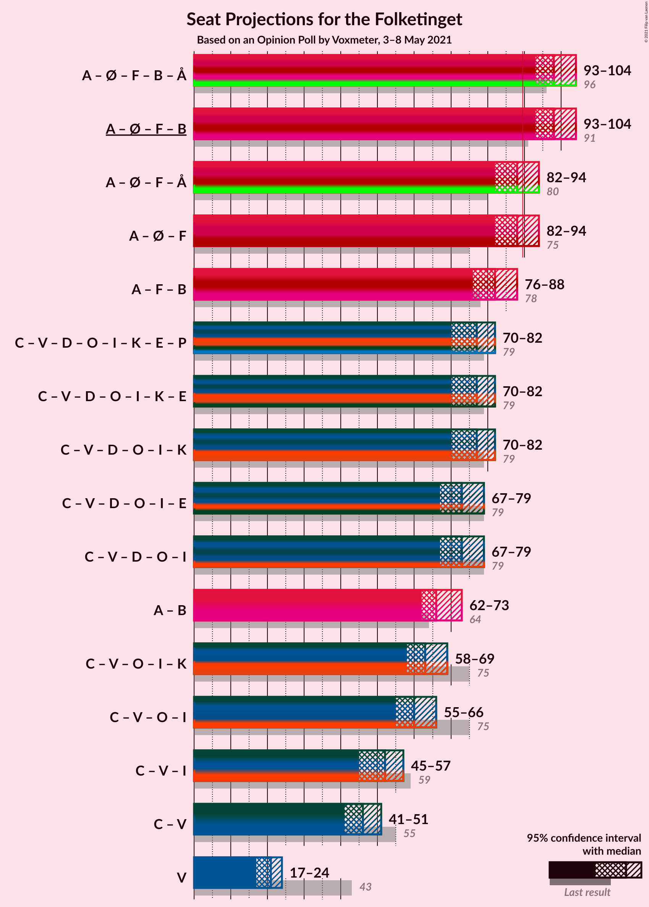
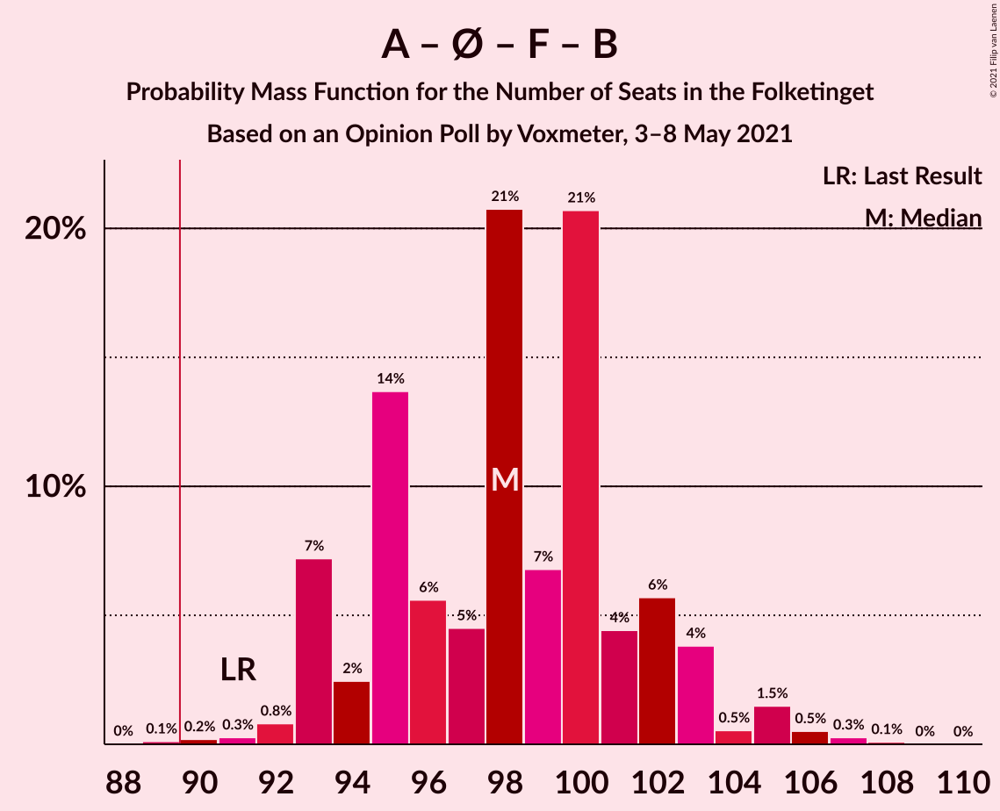
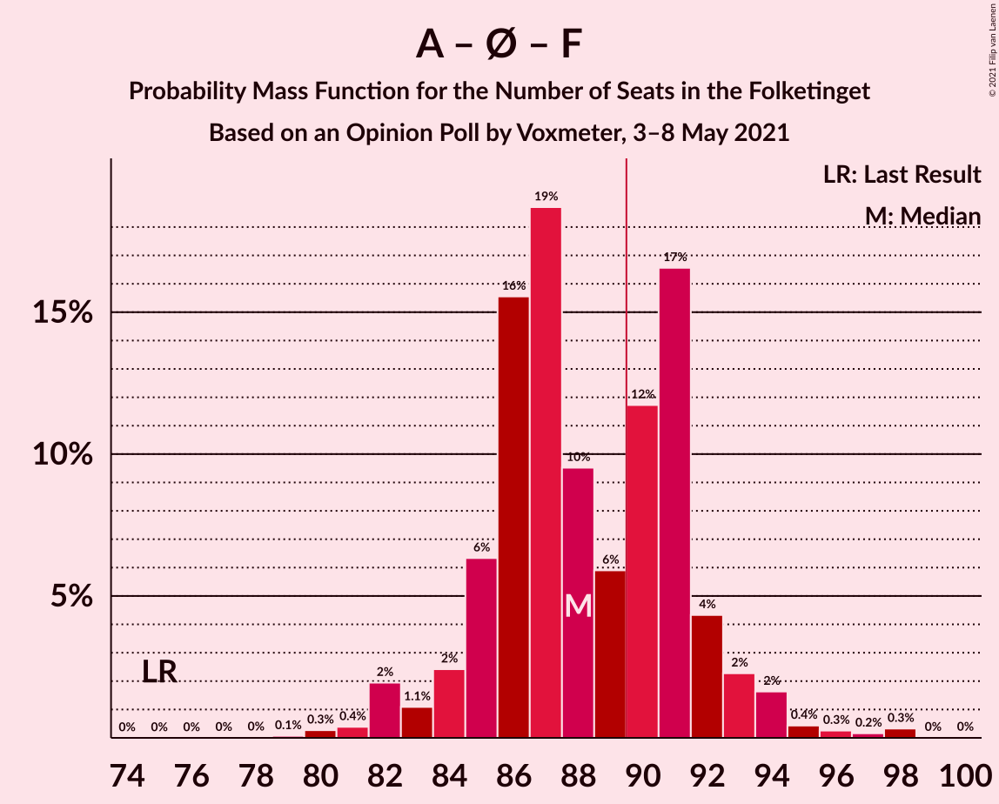
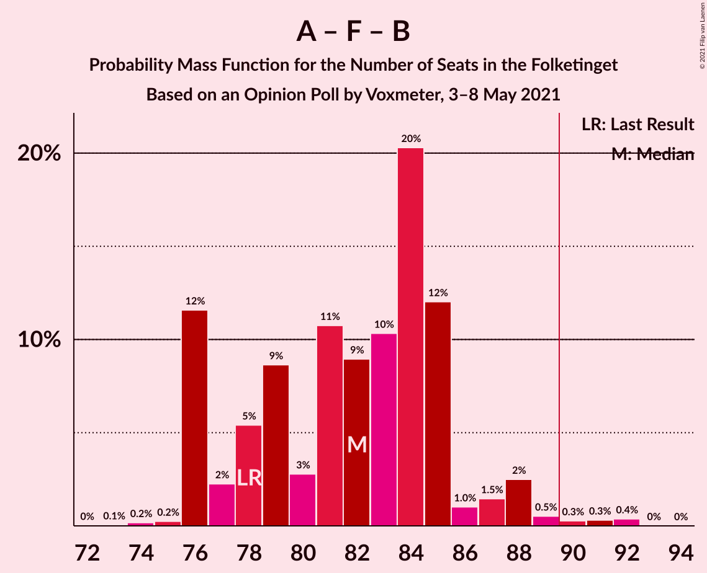

# Opinion Poll by Voxmeter, 3–8 May 2021

<a href="#voting-intentions">Voting Intentions</a> | <a href="#seats">Seats</a> | <a href="#coalitions">Coalitions</a> | <a href="#technical-information">Technical Information</a>

## Voting Intentions

### Confidence Intervals

| Party | Last Result | Poll Result | 80% Confidence Interval | 90% Confidence Interval | 95% Confidence Interval | 99% Confidence Interval |
|:-----:|:-----------:|:-----------:|:-----------------------:|:-----------------------:|:-----------------------:|:-----------------------:|
| Socialdemokraterne | 25.9% | 32.1% | 30.2–34.0% |29.7–34.5% |29.3–35.0% |28.4–35.9% |
| Det Konservative Folkeparti | 6.6% | 14.0% | 12.7–15.5% |12.3–15.9% |12.0–16.2% |11.4–17.0% |
| Venstre | 23.4% | 11.6% | 10.4–13.0% |10.1–13.4% |9.8–13.7% |9.3–14.4% |
| Enhedslisten–De Rød-Grønne | 6.9% | 8.9% | 7.8–10.1% |7.5–10.5% |7.3–10.8% |6.8–11.4% |
| Socialistisk Folkeparti | 7.7% | 8.6% | 7.6–9.8% |7.3–10.2% |7.0–10.5% |6.6–11.1% |
| Nye Borgerlige | 2.4% | 7.2% | 6.3–8.4% |6.0–8.7% |5.8–9.0% |5.4–9.6% |
| Dansk Folkeparti | 8.7% | 5.3% | 4.5–6.3% |4.3–6.6% |4.1–6.8% |3.7–7.3% |
| Radikale Venstre | 8.6% | 5.3% | 4.5–6.3% |4.3–6.6% |4.1–6.8% |3.7–7.3% |
| Liberal Alliance | 2.3% | 2.9% | 2.3–3.7% |2.2–4.0% |2.1–4.2% |1.8–4.6% |
| Kristendemokraterne | 1.7% | 2.1% | 1.6–2.7% |1.4–2.9% |1.3–3.1% |1.1–3.5% |
| Alternativet | 3.0% | 0.6% | 0.4–1.0% |0.3–1.2% |0.3–1.3% |0.2–1.5% |
| Veganerpartiet | 0.0% | 0.2% | 0.1–0.5% |0.1–0.6% |0.0–0.7% |0.0–0.9% |

*Note:* The poll result column reflects the actual value used in the calculations. Published results may vary slightly, and in addition be rounded to fewer digits.

## Seats

### Confidence Intervals

| Party | Last Result | Median | 80% Confidence Interval | 90% Confidence Interval | 95% Confidence Interval | 99% Confidence Interval |
|:-----:|:-----------:|:------:|:-----------------------:|:-----------------------:|:-----------------------:|:-----------------------:|
| <a href="#socialdemokraterne">Socialdemokraterne</a> | 48 | 56 | 53–60 |52–62 |52–62 |50–64 |
| <a href="#det-konservative-folkeparti">Det Konservative Folkeparti</a> | 12 | 25 | 22–28 |22–28 |21–28 |20–30 |
| <a href="#venstre">Venstre</a> | 43 | 21 | 19–23 |18–24 |17–24 |17–25 |
| <a href="#enhedslisten–de-rød-grønne">Enhedslisten–De Rød-Grønne</a> | 13 | 17 | 14–19 |14–19 |13–21 |12–21 |
| <a href="#socialistisk-folkeparti">Socialistisk Folkeparti</a> | 14 | 15 | 14–18 |12–19 |12–19 |11–21 |
| <a href="#nye-borgerlige">Nye Borgerlige</a> | 4 | 13 | 11–15 |10–16 |10–16 |9–17 |
| <a href="#dansk-folkeparti">Dansk Folkeparti</a> | 16 | 9 | 7–11 |7–12 |7–12 |7–13 |
| <a href="#radikale-venstre">Radikale Venstre</a> | 16 | 10 | 8–11 |8–12 |7–12 |7–14 |
| <a href="#liberal-alliance">Liberal Alliance</a> | 4 | 6 | 4–6 |0–7 |0–8 |0–8 |
| <a href="#kristendemokraterne">Kristendemokraterne</a> | 0 | 4 | 0–5 |0–5 |0–6 |0–7 |
| <a href="#alternativet">Alternativet</a> | 5 | 0 | 0 |0 |0 |0 |
| <a href="#veganerpartiet">Veganerpartiet</a> | 0 | 0 | 0 |0 |0 |0 |

### Socialdemokraterne

*For a full overview of the results for this party, see the [Socialdemokraterne](party-socialdemokraterne.html) page.*

| Number of Seats | Probability | Accumulated | Special Marks |
|:---------------:|:-----------:|:-----------:|:-------------:|
| 48 | 0% | 100% | Last Result |
| 49 | 0.3% | 100% |  |
| 50 | 0.6% | 99.6% |  |
| 51 | 0.6% | 99.0% |  |
| 52 | 3% | 98% |  |
| 53 | 13% | 95% |  |
| 54 | 7% | 82% |  |
| 55 | 14% | 76% |  |
| 56 | 13% | 62% | Median |
| 57 | 8% | 48% |  |
| 58 | 5% | 40% |  |
| 59 | 19% | 35% |  |
| 60 | 7% | 16% |  |
| 61 | 0.8% | 9% |  |
| 62 | 7% | 8% |  |
| 63 | 0.4% | 1.1% |  |
| 64 | 0.2% | 0.7% |  |
| 65 | 0% | 0.5% |  |
| 66 | 0.4% | 0.4% |  |
| 67 | 0% | 0.1% |  |
| 68 | 0% | 0% |  |

### Det Konservative Folkeparti

*For a full overview of the results for this party, see the [Det Konservative Folkeparti](party-detkonservativefolkeparti.html) page.*

| Number of Seats | Probability | Accumulated | Special Marks |
|:---------------:|:-----------:|:-----------:|:-------------:|
| 12 | 0% | 100% | Last Result |
| 13 | 0% | 100% |  |
| 14 | 0% | 100% |  |
| 15 | 0% | 100% |  |
| 16 | 0% | 100% |  |
| 17 | 0% | 100% |  |
| 18 | 0% | 100% |  |
| 19 | 0.1% | 100% |  |
| 20 | 1.0% | 99.8% |  |
| 21 | 3% | 98.9% |  |
| 22 | 7% | 96% |  |
| 23 | 6% | 89% |  |
| 24 | 11% | 84% |  |
| 25 | 34% | 73% | Median |
| 26 | 16% | 39% |  |
| 27 | 10% | 22% |  |
| 28 | 11% | 13% |  |
| 29 | 0.8% | 2% |  |
| 30 | 0.3% | 0.7% |  |
| 31 | 0.1% | 0.4% |  |
| 32 | 0.2% | 0.2% |  |
| 33 | 0% | 0% |  |

### Venstre

*For a full overview of the results for this party, see the [Venstre](party-venstre.html) page.*

| Number of Seats | Probability | Accumulated | Special Marks |
|:---------------:|:-----------:|:-----------:|:-------------:|
| 15 | 0.1% | 100% |  |
| 16 | 0.4% | 99.9% |  |
| 17 | 3% | 99.6% |  |
| 18 | 3% | 96% |  |
| 19 | 16% | 93% |  |
| 20 | 13% | 78% |  |
| 21 | 28% | 65% | Median |
| 22 | 8% | 37% |  |
| 23 | 24% | 29% |  |
| 24 | 3% | 5% |  |
| 25 | 1.3% | 2% |  |
| 26 | 0.4% | 0.5% |  |
| 27 | 0% | 0.1% |  |
| 28 | 0.1% | 0.1% |  |
| 29 | 0% | 0% |  |
| 30 | 0% | 0% |  |
| 31 | 0% | 0% |  |
| 32 | 0% | 0% |  |
| 33 | 0% | 0% |  |
| 34 | 0% | 0% |  |
| 35 | 0% | 0% |  |
| 36 | 0% | 0% |  |
| 37 | 0% | 0% |  |
| 38 | 0% | 0% |  |
| 39 | 0% | 0% |  |
| 40 | 0% | 0% |  |
| 41 | 0% | 0% |  |
| 42 | 0% | 0% |  |
| 43 | 0% | 0% | Last Result |

### Enhedslisten–De Rød-Grønne

*For a full overview of the results for this party, see the [Enhedslisten–De Rød-Grønne](party-enhedslisten–derød-grønne.html) page.*

| Number of Seats | Probability | Accumulated | Special Marks |
|:---------------:|:-----------:|:-----------:|:-------------:|
| 11 | 0.3% | 100% |  |
| 12 | 0.9% | 99.7% |  |
| 13 | 3% | 98.7% | Last Result |
| 14 | 31% | 96% |  |
| 15 | 7% | 65% |  |
| 16 | 8% | 59% |  |
| 17 | 14% | 51% | Median |
| 18 | 15% | 37% |  |
| 19 | 17% | 22% |  |
| 20 | 1.0% | 4% |  |
| 21 | 3% | 3% |  |
| 22 | 0% | 0.1% |  |
| 23 | 0% | 0% |  |

### Socialistisk Folkeparti

*For a full overview of the results for this party, see the [Socialistisk Folkeparti](party-socialistiskfolkeparti.html) page.*

| Number of Seats | Probability | Accumulated | Special Marks |
|:---------------:|:-----------:|:-----------:|:-------------:|
| 11 | 0.5% | 100% |  |
| 12 | 6% | 99.4% |  |
| 13 | 2% | 93% |  |
| 14 | 36% | 91% | Last Result |
| 15 | 15% | 55% | Median |
| 16 | 20% | 41% |  |
| 17 | 10% | 20% |  |
| 18 | 3% | 10% |  |
| 19 | 6% | 7% |  |
| 20 | 0.2% | 1.0% |  |
| 21 | 0.4% | 0.9% |  |
| 22 | 0.4% | 0.4% |  |
| 23 | 0% | 0% |  |

### Nye Borgerlige

*For a full overview of the results for this party, see the [Nye Borgerlige](party-nyeborgerlige.html) page.*

| Number of Seats | Probability | Accumulated | Special Marks |
|:---------------:|:-----------:|:-----------:|:-------------:|
| 4 | 0% | 100% | Last Result |
| 5 | 0% | 100% |  |
| 6 | 0% | 100% |  |
| 7 | 0% | 100% |  |
| 8 | 0.2% | 100% |  |
| 9 | 1.5% | 99.8% |  |
| 10 | 4% | 98% |  |
| 11 | 6% | 94% |  |
| 12 | 33% | 88% |  |
| 13 | 11% | 55% | Median |
| 14 | 31% | 43% |  |
| 15 | 7% | 12% |  |
| 16 | 4% | 6% |  |
| 17 | 1.3% | 2% |  |
| 18 | 0.2% | 0.3% |  |
| 19 | 0.1% | 0.1% |  |
| 20 | 0% | 0% |  |

### Dansk Folkeparti

*For a full overview of the results for this party, see the [Dansk Folkeparti](party-danskfolkeparti.html) page.*

| Number of Seats | Probability | Accumulated | Special Marks |
|:---------------:|:-----------:|:-----------:|:-------------:|
| 6 | 0.2% | 100% |  |
| 7 | 18% | 99.8% |  |
| 8 | 17% | 81% |  |
| 9 | 28% | 64% | Median |
| 10 | 24% | 37% |  |
| 11 | 7% | 13% |  |
| 12 | 4% | 5% |  |
| 13 | 1.1% | 1.4% |  |
| 14 | 0.4% | 0.4% |  |
| 15 | 0% | 0% |  |
| 16 | 0% | 0% | Last Result |

### Radikale Venstre

*For a full overview of the results for this party, see the [Radikale Venstre](party-radikalevenstre.html) page.*

| Number of Seats | Probability | Accumulated | Special Marks |
|:---------------:|:-----------:|:-----------:|:-------------:|
| 6 | 0.2% | 100% |  |
| 7 | 3% | 99.8% |  |
| 8 | 12% | 97% |  |
| 9 | 26% | 85% |  |
| 10 | 26% | 59% | Median |
| 11 | 24% | 33% |  |
| 12 | 7% | 9% |  |
| 13 | 1.0% | 2% |  |
| 14 | 0.7% | 0.8% |  |
| 15 | 0.1% | 0.1% |  |
| 16 | 0% | 0% | Last Result |

### Liberal Alliance

*For a full overview of the results for this party, see the [Liberal Alliance](party-liberalalliance.html) page.*

| Number of Seats | Probability | Accumulated | Special Marks |
|:---------------:|:-----------:|:-----------:|:-------------:|
| 0 | 7% | 100% |  |
| 1 | 0% | 93% |  |
| 2 | 0% | 93% |  |
| 3 | 0.1% | 93% |  |
| 4 | 13% | 93% | Last Result |
| 5 | 23% | 80% |  |
| 6 | 49% | 57% | Median |
| 7 | 5% | 8% |  |
| 8 | 3% | 3% |  |
| 9 | 0.1% | 0.1% |  |
| 10 | 0% | 0% |  |

### Kristendemokraterne

*For a full overview of the results for this party, see the [Kristendemokraterne](party-kristendemokraterne.html) page.*

| Number of Seats | Probability | Accumulated | Special Marks |
|:---------------:|:-----------:|:-----------:|:-------------:|
| 0 | 27% | 100% | Last Result |
| 1 | 0% | 73% |  |
| 2 | 0% | 73% |  |
| 3 | 0.1% | 73% |  |
| 4 | 46% | 73% | Median |
| 5 | 23% | 27% |  |
| 6 | 3% | 4% |  |
| 7 | 0.5% | 0.5% |  |
| 8 | 0% | 0% |  |

### Alternativet

*For a full overview of the results for this party, see the [Alternativet](party-alternativet.html) page.*

| Number of Seats | Probability | Accumulated | Special Marks |
|:---------------:|:-----------:|:-----------:|:-------------:|
| 0 | 100% | 100% | Median |
| 1 | 0% | 0% |  |
| 2 | 0% | 0% |  |
| 3 | 0% | 0% |  |
| 4 | 0% | 0% |  |
| 5 | 0% | 0% | Last Result |

### Veganerpartiet

*For a full overview of the results for this party, see the [Veganerpartiet](party-veganerpartiet.html) page.*

| Number of Seats | Probability | Accumulated | Special Marks |
|:---------------:|:-----------:|:-----------:|:-------------:|
| 0 | 100% | 100% | Last Result, Median |

## Coalitions

### Confidence Intervals

| Coalition | Last Result | Median | Majority? | 80% Confidence Interval | 90% Confidence Interval | 95% Confidence Interval | 99% Confidence Interval |
|:---------:|:-----------:|:------:|:---------:|:-----------------------:|:-----------------------:|:-----------------------:|:-----------------------:|
| Socialdemokraterne – Enhedslisten–De Rød-Grønne – Socialistisk Folkeparti – Radikale Venstre – Alternativet | 96 | 98 | 99.8% | 94–102 | 93–103 | 93–104 | 91–106 |
| Socialdemokraterne – Enhedslisten–De Rød-Grønne – Socialistisk Folkeparti – Radikale Venstre | 91 | 98 | 99.8% | 94–102 | 93–103 | 93–104 | 91–106 |
| Socialdemokraterne – Enhedslisten–De Rød-Grønne – Socialistisk Folkeparti – Alternativet | 80 | 88 | 38% | 85–91 | 84–93 | 82–94 | 81–97 |
| Socialdemokraterne – Enhedslisten–De Rød-Grønne – Socialistisk Folkeparti | 75 | 88 | 38% | 85–91 | 84–93 | 82–94 | 81–97 |
| Socialdemokraterne – Socialistisk Folkeparti – Radikale Venstre | 78 | 82 | 1.0% | 76–85 | 76–87 | 76–88 | 75–91 |
| Det Konservative Folkeparti – Venstre – Nye Borgerlige – Dansk Folkeparti – Liberal Alliance – Kristendemokraterne | 79 | 77 | 0% | 73–81 | 72–82 | 70–82 | 69–83 |
| Det Konservative Folkeparti – Venstre – Nye Borgerlige – Dansk Folkeparti – Liberal Alliance | 79 | 73 | 0% | 70–77 | 69–78 | 67–79 | 66–82 |
| Socialdemokraterne – Radikale Venstre | 64 | 66 | 0% | 62–71 | 62–71 | 62–73 | 60–74 |
| Det Konservative Folkeparti – Venstre – Dansk Folkeparti – Liberal Alliance – Kristendemokraterne | 75 | 63 | 0% | 60–68 | 59–68 | 58–69 | 56–71 |
| Det Konservative Folkeparti – Venstre – Dansk Folkeparti – Liberal Alliance | 75 | 60 | 0% | 57–64 | 56–65 | 55–66 | 54–68 |
| Det Konservative Folkeparti – Venstre – Liberal Alliance | 59 | 52 | 0% | 48–54 | 47–54 | 45–57 | 43–58 |
| Det Konservative Folkeparti – Venstre | 55 | 46 | 0% | 43–49 | 41–50 | 41–51 | 40–53 |
| Venstre | 43 | 21 | 0% | 19–23 | 18–24 | 17–24 | 17–25 |

### Socialdemokraterne – Enhedslisten–De Rød-Grønne – Socialistisk Folkeparti – Radikale Venstre – Alternativet

| Number of Seats | Probability | Accumulated | Special Marks |
|:---------------:|:-----------:|:-----------:|:-------------:|
| 89 | 0.1% | 100% |  |
| 90 | 0.2% | 99.8% | Majority |
| 91 | 0.3% | 99.6% |  |
| 92 | 0.8% | 99.4% |  |
| 93 | 7% | 98.6% |  |
| 94 | 2% | 91% |  |
| 95 | 14% | 89% |  |
| 96 | 6% | 75% | Last Result |
| 97 | 5% | 70% |  |
| 98 | 21% | 65% | Median |
| 99 | 7% | 44% |  |
| 100 | 21% | 38% |  |
| 101 | 4% | 17% |  |
| 102 | 6% | 12% |  |
| 103 | 4% | 7% |  |
| 104 | 0.5% | 3% |  |
| 105 | 1.5% | 2% |  |
| 106 | 0.5% | 0.9% |  |
| 107 | 0.3% | 0.4% |  |
| 108 | 0.1% | 0.1% |  |
| 109 | 0% | 0% |  |

### Socialdemokraterne – Enhedslisten–De Rød-Grønne – Socialistisk Folkeparti – Radikale Venstre

| Number of Seats | Probability | Accumulated | Special Marks |
|:---------------:|:-----------:|:-----------:|:-------------:|
| 89 | 0.1% | 100% |  |
| 90 | 0.2% | 99.8% | Majority |
| 91 | 0.3% | 99.6% | Last Result |
| 92 | 0.8% | 99.4% |  |
| 93 | 7% | 98.6% |  |
| 94 | 2% | 91% |  |
| 95 | 14% | 89% |  |
| 96 | 6% | 75% |  |
| 97 | 5% | 70% |  |
| 98 | 21% | 65% | Median |
| 99 | 7% | 44% |  |
| 100 | 21% | 38% |  |
| 101 | 4% | 17% |  |
| 102 | 6% | 12% |  |
| 103 | 4% | 7% |  |
| 104 | 0.5% | 3% |  |
| 105 | 1.5% | 2% |  |
| 106 | 0.5% | 0.9% |  |
| 107 | 0.3% | 0.4% |  |
| 108 | 0.1% | 0.1% |  |
| 109 | 0% | 0% |  |

### Socialdemokraterne – Enhedslisten–De Rød-Grønne – Socialistisk Folkeparti – Alternativet

| Number of Seats | Probability | Accumulated | Special Marks |
|:---------------:|:-----------:|:-----------:|:-------------:|
| 79 | 0.1% | 100% |  |
| 80 | 0.3% | 99.9% | Last Result |
| 81 | 0.4% | 99.6% |  |
| 82 | 2% | 99.2% |  |
| 83 | 1.1% | 97% |  |
| 84 | 2% | 96% |  |
| 85 | 6% | 94% |  |
| 86 | 16% | 87% |  |
| 87 | 19% | 72% |  |
| 88 | 10% | 53% | Median |
| 89 | 6% | 44% |  |
| 90 | 12% | 38% | Majority |
| 91 | 17% | 26% |  |
| 92 | 4% | 9% |  |
| 93 | 2% | 5% |  |
| 94 | 2% | 3% |  |
| 95 | 0.4% | 1.2% |  |
| 96 | 0.3% | 0.8% |  |
| 97 | 0.2% | 0.5% |  |
| 98 | 0.3% | 0.4% |  |
| 99 | 0% | 0% |  |

### Socialdemokraterne – Enhedslisten–De Rød-Grønne – Socialistisk Folkeparti

| Number of Seats | Probability | Accumulated | Special Marks |
|:---------------:|:-----------:|:-----------:|:-------------:|
| 75 | 0% | 100% | Last Result |
| 76 | 0% | 100% |  |
| 77 | 0% | 100% |  |
| 78 | 0% | 100% |  |
| 79 | 0.1% | 100% |  |
| 80 | 0.3% | 99.9% |  |
| 81 | 0.4% | 99.6% |  |
| 82 | 2% | 99.2% |  |
| 83 | 1.1% | 97% |  |
| 84 | 2% | 96% |  |
| 85 | 6% | 94% |  |
| 86 | 16% | 87% |  |
| 87 | 19% | 72% |  |
| 88 | 10% | 53% | Median |
| 89 | 6% | 44% |  |
| 90 | 12% | 38% | Majority |
| 91 | 17% | 26% |  |
| 92 | 4% | 9% |  |
| 93 | 2% | 5% |  |
| 94 | 2% | 3% |  |
| 95 | 0.4% | 1.2% |  |
| 96 | 0.3% | 0.8% |  |
| 97 | 0.2% | 0.5% |  |
| 98 | 0.3% | 0.4% |  |
| 99 | 0% | 0% |  |

### Socialdemokraterne – Socialistisk Folkeparti – Radikale Venstre

| Number of Seats | Probability | Accumulated | Special Marks |
|:---------------:|:-----------:|:-----------:|:-------------:|
| 73 | 0.1% | 100% |  |
| 74 | 0.2% | 99.9% |  |
| 75 | 0.2% | 99.7% |  |
| 76 | 12% | 99.5% |  |
| 77 | 2% | 88% |  |
| 78 | 5% | 86% | Last Result |
| 79 | 9% | 80% |  |
| 80 | 3% | 72% |  |
| 81 | 11% | 69% | Median |
| 82 | 9% | 58% |  |
| 83 | 10% | 49% |  |
| 84 | 20% | 39% |  |
| 85 | 12% | 18% |  |
| 86 | 1.0% | 6% |  |
| 87 | 1.5% | 5% |  |
| 88 | 2% | 4% |  |
| 89 | 0.5% | 1.5% |  |
| 90 | 0.3% | 1.0% | Majority |
| 91 | 0.3% | 0.7% |  |
| 92 | 0.4% | 0.4% |  |
| 93 | 0% | 0% |  |

### Det Konservative Folkeparti – Venstre – Nye Borgerlige – Dansk Folkeparti – Liberal Alliance – Kristendemokraterne

| Number of Seats | Probability | Accumulated | Special Marks |
|:---------------:|:-----------:|:-----------:|:-------------:|
| 67 | 0.1% | 100% |  |
| 68 | 0.3% | 99.9% |  |
| 69 | 0.6% | 99.6% |  |
| 70 | 3% | 99.0% |  |
| 71 | 0.6% | 96% |  |
| 72 | 4% | 96% |  |
| 73 | 6% | 92% |  |
| 74 | 4% | 86% |  |
| 75 | 21% | 82% |  |
| 76 | 8% | 61% |  |
| 77 | 21% | 53% |  |
| 78 | 4% | 32% | Median |
| 79 | 5% | 28% | Last Result |
| 80 | 12% | 23% |  |
| 81 | 2% | 10% |  |
| 82 | 7% | 8% |  |
| 83 | 0.7% | 1.1% |  |
| 84 | 0.2% | 0.5% |  |
| 85 | 0.1% | 0.2% |  |
| 86 | 0.1% | 0.1% |  |
| 87 | 0% | 0% |  |

### Det Konservative Folkeparti – Venstre – Nye Borgerlige – Dansk Folkeparti – Liberal Alliance

| Number of Seats | Probability | Accumulated | Special Marks |
|:---------------:|:-----------:|:-----------:|:-------------:|
| 64 | 0% | 100% |  |
| 65 | 0.1% | 99.9% |  |
| 66 | 1.5% | 99.8% |  |
| 67 | 2% | 98% |  |
| 68 | 1.1% | 97% |  |
| 69 | 4% | 96% |  |
| 70 | 9% | 91% |  |
| 71 | 2% | 82% |  |
| 72 | 11% | 80% |  |
| 73 | 22% | 69% |  |
| 74 | 3% | 46% | Median |
| 75 | 29% | 43% |  |
| 76 | 3% | 14% |  |
| 77 | 2% | 12% |  |
| 78 | 7% | 10% |  |
| 79 | 2% | 3% | Last Result |
| 80 | 0.7% | 2% |  |
| 81 | 0.5% | 1.1% |  |
| 82 | 0.4% | 0.6% |  |
| 83 | 0.1% | 0.1% |  |
| 84 | 0.1% | 0.1% |  |
| 85 | 0% | 0% |  |

### Socialdemokraterne – Radikale Venstre

| Number of Seats | Probability | Accumulated | Special Marks |
|:---------------:|:-----------:|:-----------:|:-------------:|
| 57 | 0.1% | 100% |  |
| 58 | 0.3% | 99.9% |  |
| 59 | 0.1% | 99.6% |  |
| 60 | 0.2% | 99.5% |  |
| 61 | 0.7% | 99.3% |  |
| 62 | 16% | 98.6% |  |
| 63 | 7% | 83% |  |
| 64 | 7% | 76% | Last Result |
| 65 | 10% | 69% |  |
| 66 | 15% | 59% | Median |
| 67 | 2% | 44% |  |
| 68 | 8% | 42% |  |
| 69 | 2% | 33% |  |
| 70 | 17% | 32% |  |
| 71 | 11% | 14% |  |
| 72 | 0.5% | 4% |  |
| 73 | 1.5% | 3% |  |
| 74 | 1.1% | 2% |  |
| 75 | 0.1% | 0.5% |  |
| 76 | 0.4% | 0.4% |  |
| 77 | 0% | 0% |  |

### Det Konservative Folkeparti – Venstre – Dansk Folkeparti – Liberal Alliance – Kristendemokraterne

| Number of Seats | Probability | Accumulated | Special Marks |
|:---------------:|:-----------:|:-----------:|:-------------:|
| 53 | 0% | 100% |  |
| 54 | 0.1% | 99.9% |  |
| 55 | 0.2% | 99.8% |  |
| 56 | 1.3% | 99.6% |  |
| 57 | 0.4% | 98% |  |
| 58 | 2% | 98% |  |
| 59 | 3% | 96% |  |
| 60 | 6% | 92% |  |
| 61 | 5% | 86% |  |
| 62 | 12% | 81% |  |
| 63 | 32% | 70% |  |
| 64 | 3% | 37% |  |
| 65 | 6% | 35% | Median |
| 66 | 6% | 29% |  |
| 67 | 3% | 22% |  |
| 68 | 16% | 19% |  |
| 69 | 2% | 3% |  |
| 70 | 1.1% | 2% |  |
| 71 | 0.5% | 0.7% |  |
| 72 | 0% | 0.1% |  |
| 73 | 0% | 0.1% |  |
| 74 | 0% | 0% |  |
| 75 | 0% | 0% | Last Result |

### Det Konservative Folkeparti – Venstre – Dansk Folkeparti – Liberal Alliance

| Number of Seats | Probability | Accumulated | Special Marks |
|:---------------:|:-----------:|:-----------:|:-------------:|
| 52 | 0% | 100% |  |
| 53 | 0.2% | 99.9% |  |
| 54 | 2% | 99.7% |  |
| 55 | 0.8% | 98% |  |
| 56 | 7% | 97% |  |
| 57 | 3% | 90% |  |
| 58 | 9% | 87% |  |
| 59 | 23% | 78% |  |
| 60 | 5% | 54% |  |
| 61 | 9% | 50% | Median |
| 62 | 11% | 41% |  |
| 63 | 19% | 30% |  |
| 64 | 6% | 12% |  |
| 65 | 2% | 5% |  |
| 66 | 2% | 3% |  |
| 67 | 0.5% | 1.3% |  |
| 68 | 0.3% | 0.8% |  |
| 69 | 0.4% | 0.5% |  |
| 70 | 0.1% | 0.1% |  |
| 71 | 0% | 0% |  |
| 72 | 0% | 0% |  |
| 73 | 0% | 0% |  |
| 74 | 0% | 0% |  |
| 75 | 0% | 0% | Last Result |

### Det Konservative Folkeparti – Venstre – Liberal Alliance

| Number of Seats | Probability | Accumulated | Special Marks |
|:---------------:|:-----------:|:-----------:|:-------------:|
| 42 | 0% | 100% |  |
| 43 | 0.6% | 99.9% |  |
| 44 | 0.4% | 99.3% |  |
| 45 | 2% | 98.9% |  |
| 46 | 2% | 97% |  |
| 47 | 5% | 95% |  |
| 48 | 4% | 91% |  |
| 49 | 8% | 87% |  |
| 50 | 13% | 79% |  |
| 51 | 7% | 65% |  |
| 52 | 23% | 59% | Median |
| 53 | 11% | 36% |  |
| 54 | 21% | 26% |  |
| 55 | 2% | 5% |  |
| 56 | 0.3% | 3% |  |
| 57 | 1.2% | 3% |  |
| 58 | 1.0% | 1.3% |  |
| 59 | 0.1% | 0.4% | Last Result |
| 60 | 0.2% | 0.2% |  |
| 61 | 0% | 0% |  |

### Det Konservative Folkeparti – Venstre

| Number of Seats | Probability | Accumulated | Special Marks |
|:---------------:|:-----------:|:-----------:|:-------------:|
| 38 | 0.2% | 100% |  |
| 39 | 0.2% | 99.8% |  |
| 40 | 2% | 99.6% |  |
| 41 | 5% | 98% |  |
| 42 | 2% | 93% |  |
| 43 | 4% | 90% |  |
| 44 | 11% | 86% |  |
| 45 | 8% | 75% |  |
| 46 | 24% | 66% | Median |
| 47 | 5% | 42% |  |
| 48 | 17% | 38% |  |
| 49 | 12% | 21% |  |
| 50 | 6% | 9% |  |
| 51 | 2% | 3% |  |
| 52 | 0.9% | 1.4% |  |
| 53 | 0.2% | 0.5% |  |
| 54 | 0% | 0.3% |  |
| 55 | 0.3% | 0.3% | Last Result |
| 56 | 0% | 0% |  |

### Venstre

| Number of Seats | Probability | Accumulated | Special Marks |
|:---------------:|:-----------:|:-----------:|:-------------:|
| 15 | 0.1% | 100% |  |
| 16 | 0.4% | 99.9% |  |
| 17 | 3% | 99.6% |  |
| 18 | 3% | 96% |  |
| 19 | 16% | 93% |  |
| 20 | 13% | 78% |  |
| 21 | 28% | 65% | Median |
| 22 | 8% | 37% |  |
| 23 | 24% | 29% |  |
| 24 | 3% | 5% |  |
| 25 | 1.3% | 2% |  |
| 26 | 0.4% | 0.5% |  |
| 27 | 0% | 0.1% |  |
| 28 | 0.1% | 0.1% |  |
| 29 | 0% | 0% |  |
| 30 | 0% | 0% |  |
| 31 | 0% | 0% |  |
| 32 | 0% | 0% |  |
| 33 | 0% | 0% |  |
| 34 | 0% | 0% |  |
| 35 | 0% | 0% |  |
| 36 | 0% | 0% |  |
| 37 | 0% | 0% |  |
| 38 | 0% | 0% |  |
| 39 | 0% | 0% |  |
| 40 | 0% | 0% |  |
| 41 | 0% | 0% |  |
| 42 | 0% | 0% |  |
| 43 | 0% | 0% | Last Result |

## Technical Information

### Opinion Poll

+ **Polling firm:** Voxmeter
+ **Commissioner(s):** —
+ **Fieldwork period:** 3–8 May 2021

### Calculations

+ **Sample size:** 1023
+ **Simulations done:** 1,048,576
+ **Error estimate:** 3.06%

