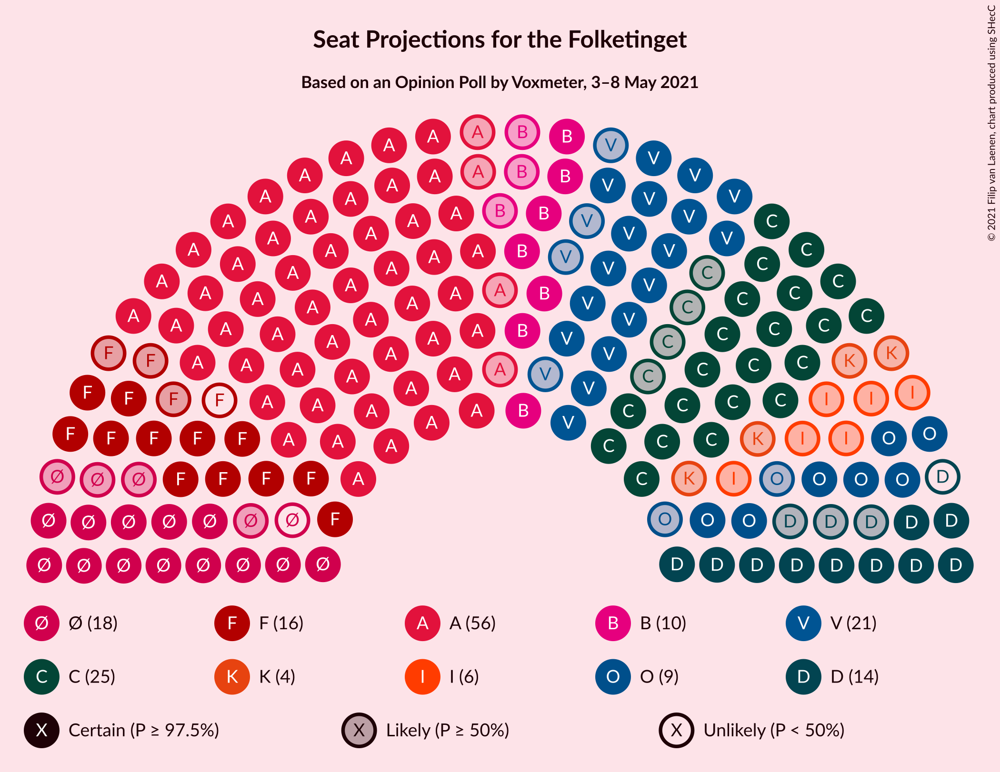
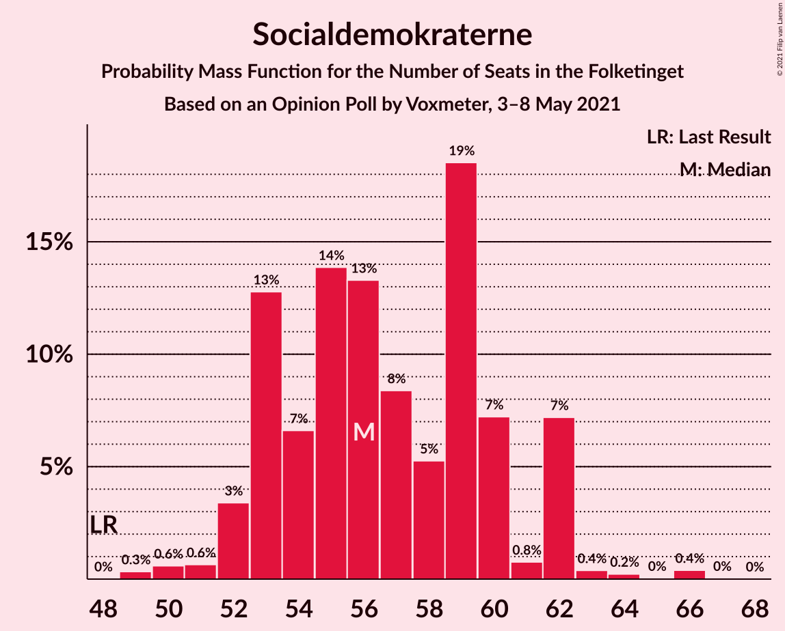
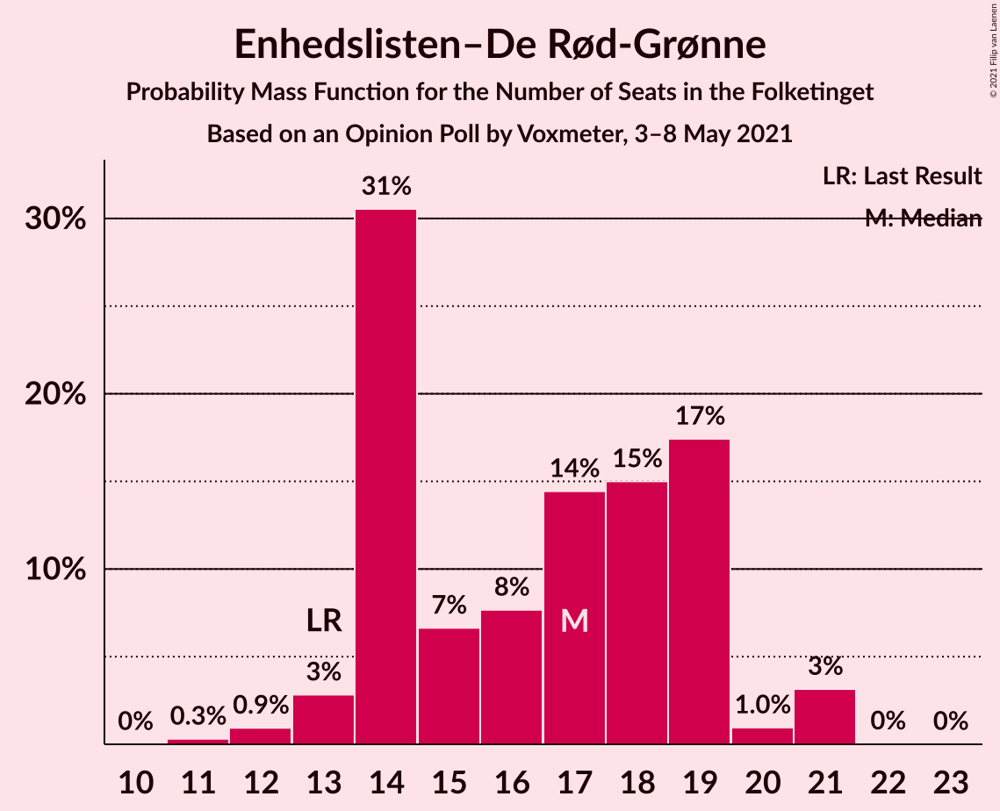
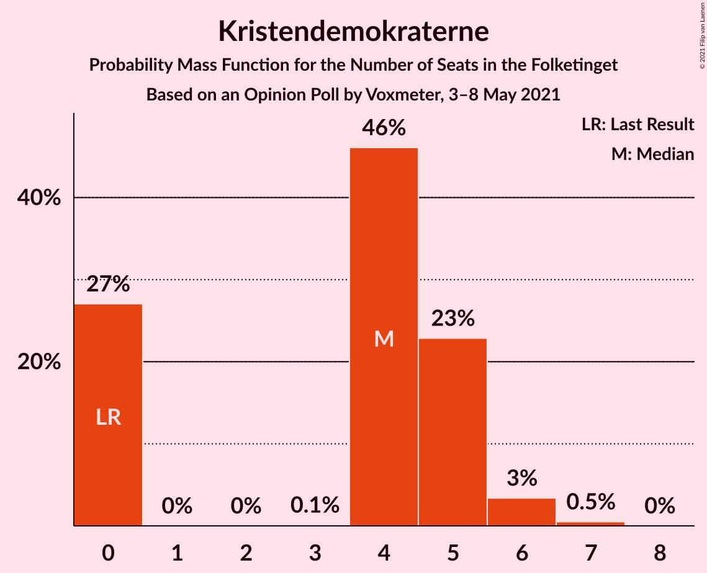
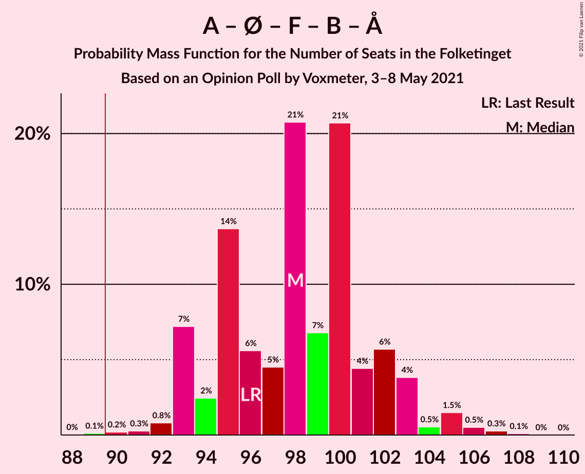
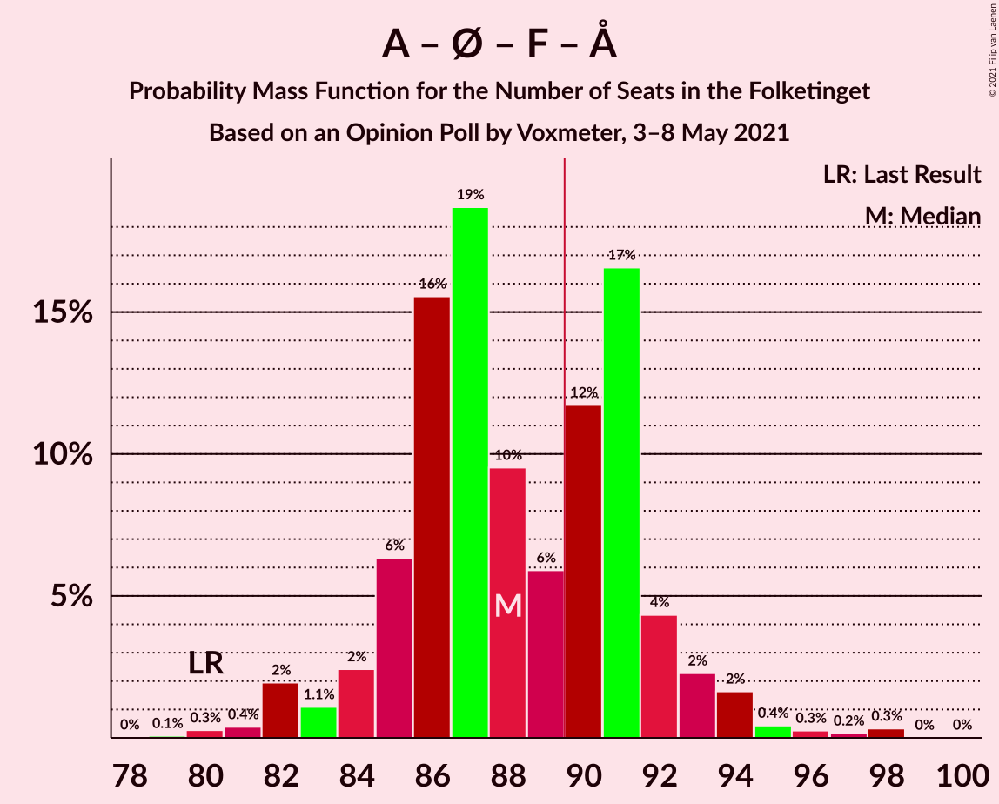
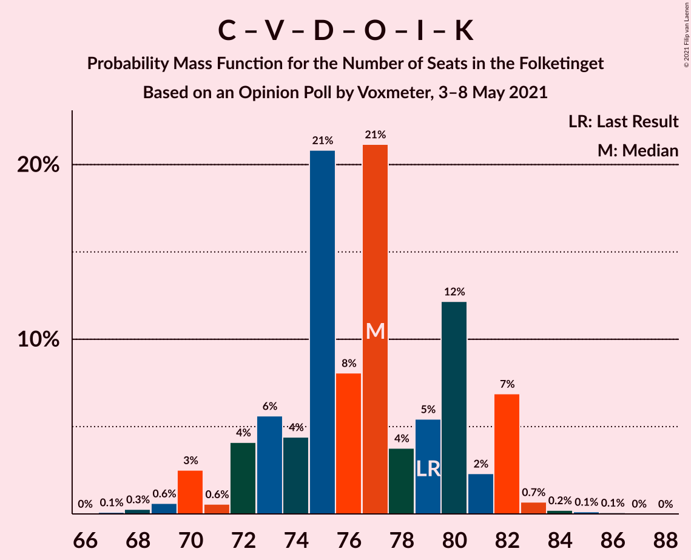
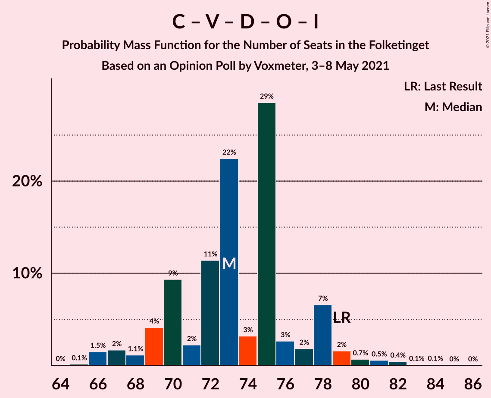
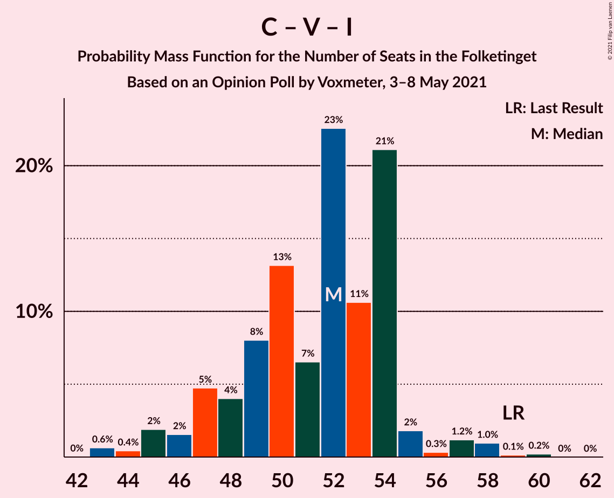

# Opinion Poll by Voxmeter, 3–8 May 2021

<a href="#voting-intentions">Voting Intentions</a> | <a href="#seats">Seats</a> | <a href="#coalitions">Coalitions</a> | <a href="#technical-information">Technical Information</a>

## Voting Intentions

### Confidence Intervals

| Party | Last Result | Poll Result | 80% Confidence Interval | 90% Confidence Interval | 95% Confidence Interval | 99% Confidence Interval |
|:-----:|:-----------:|:-----------:|:-----------------------:|:-----------------------:|:-----------------------:|:-----------------------:|
| Socialdemokraterne | 25.9% | 32.1% | 30.2–34.0% |29.7–34.5% |29.3–35.0% |28.4–35.9% |
| Det Konservative Folkeparti | 6.6% | 14.0% | 12.7–15.5% |12.3–15.9% |12.0–16.2% |11.4–17.0% |
| Venstre | 23.4% | 11.6% | 10.4–13.0% |10.1–13.4% |9.8–13.7% |9.3–14.4% |
| Enhedslisten–De Rød-Grønne | 6.9% | 8.9% | 7.8–10.1% |7.5–10.5% |7.3–10.8% |6.8–11.4% |
| Socialistisk Folkeparti | 7.7% | 8.6% | 7.6–9.8% |7.3–10.2% |7.0–10.5% |6.6–11.1% |
| Nye Borgerlige | 2.4% | 7.2% | 6.3–8.4% |6.0–8.7% |5.8–9.0% |5.4–9.6% |
| Dansk Folkeparti | 8.7% | 5.3% | 4.5–6.3% |4.3–6.6% |4.1–6.8% |3.7–7.3% |
| Radikale Venstre | 8.6% | 5.3% | 4.5–6.3% |4.3–6.6% |4.1–6.8% |3.7–7.3% |
| Liberal Alliance | 2.3% | 2.9% | 2.3–3.7% |2.2–4.0% |2.1–4.2% |1.8–4.6% |
| Kristendemokraterne | 1.7% | 2.1% | 1.6–2.7% |1.4–2.9% |1.3–3.1% |1.1–3.5% |
| Alternativet | 3.0% | 0.6% | 0.4–1.0% |0.3–1.2% |0.3–1.3% |0.2–1.5% |
| Veganerpartiet | 0.0% | 0.2% | 0.1–0.5% |0.1–0.6% |0.0–0.7% |0.0–0.9% |

*Note:* The poll result column reflects the actual value used in the calculations. Published results may vary slightly, and in addition be rounded to fewer digits.

## Seats

### Confidence Intervals

| Party | Last Result | Median | 80% Confidence Interval | 90% Confidence Interval | 95% Confidence Interval | 99% Confidence Interval |
|:-----:|:-----------:|:------:|:-----------------------:|:-----------------------:|:-----------------------:|:-----------------------:|
| <a href="#socialdemokraterne">Socialdemokraterne</a> | 48 | 57 | 54–59 |54–60 |53–62 |51–66 |
| <a href="#det-konservative-folkeparti">Det Konservative Folkeparti</a> | 12 | 23 | 22–28 |22–28 |21–28 |20–30 |
| <a href="#venstre">Venstre</a> | 43 | 21 | 19–22 |19–23 |18–23 |16–24 |
| <a href="#enhedslisten–de-rød-grønne">Enhedslisten–De Rød-Grønne</a> | 13 | 17 | 14–21 |13–21 |13–21 |13–21 |
| <a href="#socialistisk-folkeparti">Socialistisk Folkeparti</a> | 14 | 17 | 14–18 |14–18 |14–19 |12–19 |
| <a href="#nye-borgerlige">Nye Borgerlige</a> | 4 | 13 | 9–16 |9–16 |9–16 |9–16 |
| <a href="#dansk-folkeparti">Dansk Folkeparti</a> | 16 | 9 | 8–11 |7–12 |7–14 |7–14 |
| <a href="#radikale-venstre">Radikale Venstre</a> | 16 | 10 | 8–12 |8–12 |8–12 |7–15 |
| <a href="#liberal-alliance">Liberal Alliance</a> | 4 | 6 | 5–6 |4–7 |0–8 |0–8 |
| <a href="#kristendemokraterne">Kristendemokraterne</a> | 0 | 4 | 0–5 |0–5 |0–5 |0–6 |
| <a href="#alternativet">Alternativet</a> | 5 | 0 | 0 |0 |0 |0 |
| <a href="#veganerpartiet">Veganerpartiet</a> | 0 | 0 | 0 |0 |0 |0 |

### Socialdemokraterne

*For a full overview of the results for this party, see the [Socialdemokraterne](party-socialdemokraterne.html) page.*

| Number of Seats | Probability | Accumulated | Special Marks |
|:---------------:|:-----------:|:-----------:|:-------------:|
| 48 | 0% | 100% | Last Result |
| 49 | 0% | 100% |  |
| 50 | 0.2% | 100% |  |
| 51 | 0.4% | 99.8% |  |
| 52 | 1.2% | 99.4% |  |
| 53 | 2% | 98% |  |
| 54 | 32% | 96% |  |
| 55 | 2% | 64% |  |
| 56 | 3% | 62% |  |
| 57 | 14% | 59% | Median |
| 58 | 26% | 45% |  |
| 59 | 12% | 18% |  |
| 60 | 3% | 7% |  |
| 61 | 0.7% | 3% |  |
| 62 | 1.0% | 3% |  |
| 63 | 0.1% | 2% |  |
| 64 | 0.9% | 2% |  |
| 65 | 0.1% | 0.8% |  |
| 66 | 0.7% | 0.7% |  |
| 67 | 0% | 0% |  |

### Det Konservative Folkeparti

*For a full overview of the results for this party, see the [Det Konservative Folkeparti](party-detkonservativefolkeparti.html) page.*

| Number of Seats | Probability | Accumulated | Special Marks |
|:---------------:|:-----------:|:-----------:|:-------------:|
| 12 | 0% | 100% | Last Result |
| 13 | 0% | 100% |  |
| 14 | 0% | 100% |  |
| 15 | 0% | 100% |  |
| 16 | 0% | 100% |  |
| 17 | 0% | 100% |  |
| 18 | 0% | 100% |  |
| 19 | 0% | 100% |  |
| 20 | 0.7% | 100% |  |
| 21 | 3% | 99.3% |  |
| 22 | 33% | 96% |  |
| 23 | 29% | 63% | Median |
| 24 | 14% | 34% |  |
| 25 | 3% | 21% |  |
| 26 | 3% | 17% |  |
| 27 | 2% | 15% |  |
| 28 | 10% | 12% |  |
| 29 | 1.1% | 2% |  |
| 30 | 1.0% | 1.3% |  |
| 31 | 0.2% | 0.3% |  |
| 32 | 0.1% | 0.1% |  |
| 33 | 0% | 0% |  |

### Venstre

*For a full overview of the results for this party, see the [Venstre](party-venstre.html) page.*

| Number of Seats | Probability | Accumulated | Special Marks |
|:---------------:|:-----------:|:-----------:|:-------------:|
| 16 | 0.6% | 100% |  |
| 17 | 0.8% | 99.4% |  |
| 18 | 3% | 98.6% |  |
| 19 | 36% | 96% |  |
| 20 | 2% | 60% |  |
| 21 | 45% | 58% | Median |
| 22 | 6% | 13% |  |
| 23 | 6% | 7% |  |
| 24 | 0.3% | 0.6% |  |
| 25 | 0.1% | 0.3% |  |
| 26 | 0.1% | 0.2% |  |
| 27 | 0% | 0.1% |  |
| 28 | 0.1% | 0.1% |  |
| 29 | 0% | 0% |  |
| 30 | 0% | 0% |  |
| 31 | 0% | 0% |  |
| 32 | 0% | 0% |  |
| 33 | 0% | 0% |  |
| 34 | 0% | 0% |  |
| 35 | 0% | 0% |  |
| 36 | 0% | 0% |  |
| 37 | 0% | 0% |  |
| 38 | 0% | 0% |  |
| 39 | 0% | 0% |  |
| 40 | 0% | 0% |  |
| 41 | 0% | 0% |  |
| 42 | 0% | 0% |  |
| 43 | 0% | 0% | Last Result |

### Enhedslisten–De Rød-Grønne

*For a full overview of the results for this party, see the [Enhedslisten–De Rød-Grønne](party-enhedslisten–derød-grønne.html) page.*

| Number of Seats | Probability | Accumulated | Special Marks |
|:---------------:|:-----------:|:-----------:|:-------------:|
| 12 | 0.1% | 100% |  |
| 13 | 6% | 99.9% | Last Result |
| 14 | 13% | 94% |  |
| 15 | 7% | 81% |  |
| 16 | 13% | 75% |  |
| 17 | 27% | 62% | Median |
| 18 | 0.9% | 34% |  |
| 19 | 0.2% | 33% |  |
| 20 | 1.0% | 33% |  |
| 21 | 32% | 32% |  |
| 22 | 0% | 0% |  |

### Socialistisk Folkeparti

*For a full overview of the results for this party, see the [Socialistisk Folkeparti](party-socialistiskfolkeparti.html) page.*

| Number of Seats | Probability | Accumulated | Special Marks |
|:---------------:|:-----------:|:-----------:|:-------------:|
| 10 | 0.1% | 100% |  |
| 11 | 0.1% | 99.9% |  |
| 12 | 0.6% | 99.9% |  |
| 13 | 1.3% | 99.3% |  |
| 14 | 12% | 98% | Last Result |
| 15 | 31% | 86% |  |
| 16 | 4% | 55% |  |
| 17 | 34% | 51% | Median |
| 18 | 14% | 17% |  |
| 19 | 2% | 3% |  |
| 20 | 0.3% | 0.3% |  |
| 21 | 0% | 0.1% |  |
| 22 | 0% | 0% |  |

### Nye Borgerlige

*For a full overview of the results for this party, see the [Nye Borgerlige](party-nyeborgerlige.html) page.*

| Number of Seats | Probability | Accumulated | Special Marks |
|:---------------:|:-----------:|:-----------:|:-------------:|
| 4 | 0% | 100% | Last Result |
| 5 | 0% | 100% |  |
| 6 | 0% | 100% |  |
| 7 | 0% | 100% |  |
| 8 | 0% | 100% |  |
| 9 | 11% | 100% |  |
| 10 | 4% | 89% |  |
| 11 | 9% | 85% |  |
| 12 | 14% | 76% |  |
| 13 | 33% | 62% | Median |
| 14 | 2% | 29% |  |
| 15 | 0.4% | 27% |  |
| 16 | 26% | 27% |  |
| 17 | 0.1% | 0.2% |  |
| 18 | 0% | 0.1% |  |
| 19 | 0% | 0% |  |

### Dansk Folkeparti

*For a full overview of the results for this party, see the [Dansk Folkeparti](party-danskfolkeparti.html) page.*

| Number of Seats | Probability | Accumulated | Special Marks |
|:---------------:|:-----------:|:-----------:|:-------------:|
| 6 | 0.1% | 100% |  |
| 7 | 9% | 99.9% |  |
| 8 | 2% | 91% |  |
| 9 | 59% | 88% | Median |
| 10 | 7% | 29% |  |
| 11 | 14% | 22% |  |
| 12 | 6% | 9% |  |
| 13 | 0.1% | 3% |  |
| 14 | 3% | 3% |  |
| 15 | 0% | 0% |  |
| 16 | 0% | 0% | Last Result |

### Radikale Venstre

*For a full overview of the results for this party, see the [Radikale Venstre](party-radikalevenstre.html) page.*

| Number of Seats | Probability | Accumulated | Special Marks |
|:---------------:|:-----------:|:-----------:|:-------------:|
| 6 | 0.1% | 100% |  |
| 7 | 0.7% | 99.9% |  |
| 8 | 22% | 99.1% |  |
| 9 | 0.8% | 77% |  |
| 10 | 60% | 76% | Median |
| 11 | 2% | 16% |  |
| 12 | 12% | 14% |  |
| 13 | 0.2% | 2% |  |
| 14 | 0% | 1.4% |  |
| 15 | 1.4% | 1.4% |  |
| 16 | 0% | 0% | Last Result |

### Liberal Alliance

*For a full overview of the results for this party, see the [Liberal Alliance](party-liberalalliance.html) page.*

| Number of Seats | Probability | Accumulated | Special Marks |
|:---------------:|:-----------:|:-----------:|:-------------:|
| 0 | 3% | 100% |  |
| 1 | 0% | 97% |  |
| 2 | 0% | 97% |  |
| 3 | 0% | 97% |  |
| 4 | 3% | 97% | Last Result |
| 5 | 26% | 95% |  |
| 6 | 60% | 68% | Median |
| 7 | 5% | 9% |  |
| 8 | 4% | 4% |  |
| 9 | 0% | 0.1% |  |
| 10 | 0% | 0% |  |

### Kristendemokraterne

*For a full overview of the results for this party, see the [Kristendemokraterne](party-kristendemokraterne.html) page.*

| Number of Seats | Probability | Accumulated | Special Marks |
|:---------------:|:-----------:|:-----------:|:-------------:|
| 0 | 32% | 100% | Last Result |
| 1 | 0% | 68% |  |
| 2 | 0% | 68% |  |
| 3 | 0% | 68% |  |
| 4 | 49% | 68% | Median |
| 5 | 18% | 19% |  |
| 6 | 0.9% | 1.0% |  |
| 7 | 0.1% | 0.1% |  |
| 8 | 0% | 0% |  |

### Alternativet

*For a full overview of the results for this party, see the [Alternativet](party-alternativet.html) page.*

| Number of Seats | Probability | Accumulated | Special Marks |
|:---------------:|:-----------:|:-----------:|:-------------:|
| 0 | 100% | 100% | Median |
| 1 | 0% | 0% |  |
| 2 | 0% | 0% |  |
| 3 | 0% | 0% |  |
| 4 | 0% | 0% |  |
| 5 | 0% | 0% | Last Result |

### Veganerpartiet

*For a full overview of the results for this party, see the [Veganerpartiet](party-veganerpartiet.html) page.*

| Number of Seats | Probability | Accumulated | Special Marks |
|:---------------:|:-----------:|:-----------:|:-------------:|
| 0 | 100% | 100% | Last Result, Median |

## Coalitions

### Confidence Intervals

| Coalition | Last Result | Median | Majority? | 80% Confidence Interval | 90% Confidence Interval | 95% Confidence Interval | 99% Confidence Interval |
|:---------:|:-----------:|:------:|:---------:|:-----------------------:|:-----------------------:|:-----------------------:|:-----------------------:|
| Socialdemokraterne – Enhedslisten–De Rød-Grønne – Socialistisk Folkeparti – Radikale Venstre – Alternativet | 96 | 100 | 100% | 97–102 | 94–102 | 94–102 | 90–106 |
| Socialdemokraterne – Enhedslisten–De Rød-Grønne – Socialistisk Folkeparti – Radikale Venstre | 91 | 100 | 100% | 97–102 | 94–102 | 94–102 | 90–106 |
| Socialdemokraterne – Enhedslisten–De Rød-Grønne – Socialistisk Folkeparti – Alternativet | 80 | 90 | 66% | 88–92 | 86–92 | 86–93 | 80–96 |
| Socialdemokraterne – Enhedslisten–De Rød-Grønne – Socialistisk Folkeparti | 75 | 90 | 66% | 88–92 | 86–92 | 86–93 | 80–96 |
| Socialdemokraterne – Socialistisk Folkeparti – Radikale Venstre | 78 | 83 | 0.5% | 81–85 | 81–85 | 78–87 | 77–89 |
| Det Konservative Folkeparti – Venstre – Nye Borgerlige – Dansk Folkeparti – Liberal Alliance – Kristendemokraterne | 79 | 75 | 0% | 73–78 | 73–81 | 72–81 | 68–85 |
| Det Konservative Folkeparti – Venstre – Nye Borgerlige – Dansk Folkeparti – Liberal Alliance | 79 | 72 | 0% | 69–75 | 69–76 | 69–76 | 67–81 |
| Socialdemokraterne – Radikale Venstre | 64 | 65 | 0% | 64–71 | 64–71 | 63–72 | 61–74 |
| Det Konservative Folkeparti – Venstre – Dansk Folkeparti – Liberal Alliance – Kristendemokraterne | 75 | 60 | 0% | 59–66 | 59–69 | 59–70 | 55–70 |
| Det Konservative Folkeparti – Venstre – Dansk Folkeparti – Liberal Alliance | 75 | 59 | 0% | 56–62 | 56–65 | 56–65 | 53–66 |
| Det Konservative Folkeparti – Venstre – Liberal Alliance | 59 | 50 | 0% | 47–54 | 47–54 | 47–55 | 43–58 |
| Det Konservative Folkeparti – Venstre | 55 | 44 | 0% | 41–49 | 41–49 | 41–49 | 41–52 |
| Venstre | 43 | 21 | 0% | 19–22 | 19–23 | 18–23 | 16–24 |

### Socialdemokraterne – Enhedslisten–De Rød-Grønne – Socialistisk Folkeparti – Radikale Venstre – Alternativet

| Number of Seats | Probability | Accumulated | Special Marks |
|:---------------:|:-----------:|:-----------:|:-------------:|
| 90 | 0.9% | 100% | Majority |
| 91 | 0.2% | 99.1% |  |
| 92 | 0.1% | 98.9% |  |
| 93 | 0.1% | 98.7% |  |
| 94 | 4% | 98.6% |  |
| 95 | 0.6% | 95% |  |
| 96 | 0.4% | 94% | Last Result |
| 97 | 11% | 94% |  |
| 98 | 5% | 83% |  |
| 99 | 4% | 77% |  |
| 100 | 24% | 73% |  |
| 101 | 14% | 49% | Median |
| 102 | 33% | 35% |  |
| 103 | 1.2% | 2% |  |
| 104 | 0.7% | 1.2% |  |
| 105 | 0% | 0.5% |  |
| 106 | 0% | 0.5% |  |
| 107 | 0.4% | 0.5% |  |
| 108 | 0.1% | 0.1% |  |
| 109 | 0% | 0% |  |

### Socialdemokraterne – Enhedslisten–De Rød-Grønne – Socialistisk Folkeparti – Radikale Venstre

| Number of Seats | Probability | Accumulated | Special Marks |
|:---------------:|:-----------:|:-----------:|:-------------:|
| 90 | 0.9% | 100% | Majority |
| 91 | 0.2% | 99.1% | Last Result |
| 92 | 0.1% | 98.9% |  |
| 93 | 0.1% | 98.7% |  |
| 94 | 4% | 98.6% |  |
| 95 | 0.6% | 95% |  |
| 96 | 0.4% | 94% |  |
| 97 | 11% | 94% |  |
| 98 | 5% | 83% |  |
| 99 | 4% | 77% |  |
| 100 | 24% | 73% |  |
| 101 | 14% | 49% | Median |
| 102 | 33% | 35% |  |
| 103 | 1.2% | 2% |  |
| 104 | 0.7% | 1.2% |  |
| 105 | 0% | 0.5% |  |
| 106 | 0% | 0.5% |  |
| 107 | 0.4% | 0.5% |  |
| 108 | 0.1% | 0.1% |  |
| 109 | 0% | 0% |  |

### Socialdemokraterne – Enhedslisten–De Rød-Grønne – Socialistisk Folkeparti – Alternativet

| Number of Seats | Probability | Accumulated | Special Marks |
|:---------------:|:-----------:|:-----------:|:-------------:|
| 80 | 1.0% | 100% | Last Result |
| 81 | 0.2% | 99.0% |  |
| 82 | 0.1% | 98.8% |  |
| 83 | 0.2% | 98.7% |  |
| 84 | 0.3% | 98.5% |  |
| 85 | 0.2% | 98% |  |
| 86 | 5% | 98% |  |
| 87 | 0.9% | 93% |  |
| 88 | 2% | 92% |  |
| 89 | 24% | 90% |  |
| 90 | 27% | 66% | Majority |
| 91 | 2% | 39% | Median |
| 92 | 34% | 37% |  |
| 93 | 1.1% | 3% |  |
| 94 | 0.5% | 2% |  |
| 95 | 0.1% | 1.3% |  |
| 96 | 0.7% | 1.2% |  |
| 97 | 0% | 0.5% |  |
| 98 | 0.5% | 0.5% |  |
| 99 | 0% | 0% |  |

### Socialdemokraterne – Enhedslisten–De Rød-Grønne – Socialistisk Folkeparti

| Number of Seats | Probability | Accumulated | Special Marks |
|:---------------:|:-----------:|:-----------:|:-------------:|
| 75 | 0% | 100% | Last Result |
| 76 | 0% | 100% |  |
| 77 | 0% | 100% |  |
| 78 | 0% | 100% |  |
| 79 | 0% | 100% |  |
| 80 | 1.0% | 100% |  |
| 81 | 0.2% | 99.0% |  |
| 82 | 0.1% | 98.8% |  |
| 83 | 0.2% | 98.7% |  |
| 84 | 0.3% | 98.5% |  |
| 85 | 0.2% | 98% |  |
| 86 | 5% | 98% |  |
| 87 | 0.9% | 93% |  |
| 88 | 2% | 92% |  |
| 89 | 24% | 90% |  |
| 90 | 27% | 66% | Majority |
| 91 | 2% | 39% | Median |
| 92 | 34% | 37% |  |
| 93 | 1.1% | 3% |  |
| 94 | 0.5% | 2% |  |
| 95 | 0.1% | 1.3% |  |
| 96 | 0.7% | 1.2% |  |
| 97 | 0% | 0.5% |  |
| 98 | 0.5% | 0.5% |  |
| 99 | 0% | 0% |  |

### Socialdemokraterne – Socialistisk Folkeparti – Radikale Venstre

| Number of Seats | Probability | Accumulated | Special Marks |
|:---------------:|:-----------:|:-----------:|:-------------:|
| 74 | 0.1% | 100% |  |
| 75 | 0.1% | 99.8% |  |
| 76 | 0.2% | 99.7% |  |
| 77 | 2% | 99.5% |  |
| 78 | 0.3% | 98% | Last Result |
| 79 | 0.6% | 97% |  |
| 80 | 0.4% | 97% |  |
| 81 | 36% | 96% |  |
| 82 | 2% | 60% |  |
| 83 | 39% | 58% |  |
| 84 | 2% | 19% | Median |
| 85 | 13% | 18% |  |
| 86 | 0.1% | 4% |  |
| 87 | 2% | 4% |  |
| 88 | 0.1% | 2% |  |
| 89 | 1.3% | 2% |  |
| 90 | 0.1% | 0.5% | Majority |
| 91 | 0% | 0.4% |  |
| 92 | 0.4% | 0.4% |  |
| 93 | 0% | 0% |  |

### Det Konservative Folkeparti – Venstre – Nye Borgerlige – Dansk Folkeparti – Liberal Alliance – Kristendemokraterne

| Number of Seats | Probability | Accumulated | Special Marks |
|:---------------:|:-----------:|:-----------:|:-------------:|
| 67 | 0.1% | 100% |  |
| 68 | 0.4% | 99.9% |  |
| 69 | 0% | 99.5% |  |
| 70 | 0% | 99.5% |  |
| 71 | 0.8% | 99.4% |  |
| 72 | 1.2% | 98.7% |  |
| 73 | 33% | 97% |  |
| 74 | 14% | 65% |  |
| 75 | 24% | 51% |  |
| 76 | 4% | 26% | Median |
| 77 | 5% | 22% |  |
| 78 | 11% | 17% |  |
| 79 | 0.4% | 6% | Last Result |
| 80 | 0.6% | 6% |  |
| 81 | 4% | 5% |  |
| 82 | 0.1% | 1.3% |  |
| 83 | 0.1% | 1.1% |  |
| 84 | 0.1% | 1.0% |  |
| 85 | 0.9% | 0.9% |  |
| 86 | 0% | 0% |  |

### Det Konservative Folkeparti – Venstre – Nye Borgerlige – Dansk Folkeparti – Liberal Alliance

| Number of Seats | Probability | Accumulated | Special Marks |
|:---------------:|:-----------:|:-----------:|:-------------:|
| 66 | 0% | 100% |  |
| 67 | 0.8% | 99.9% |  |
| 68 | 0.5% | 99.2% |  |
| 69 | 33% | 98.7% |  |
| 70 | 11% | 66% |  |
| 71 | 1.0% | 55% |  |
| 72 | 7% | 54% | Median |
| 73 | 12% | 47% |  |
| 74 | 3% | 35% |  |
| 75 | 25% | 32% |  |
| 76 | 5% | 8% |  |
| 77 | 0.4% | 2% |  |
| 78 | 0.2% | 2% |  |
| 79 | 0.2% | 2% | Last Result |
| 80 | 0.3% | 1.4% |  |
| 81 | 0.9% | 1.1% |  |
| 82 | 0% | 0.2% |  |
| 83 | 0.1% | 0.1% |  |
| 84 | 0.1% | 0.1% |  |
| 85 | 0% | 0% |  |

### Socialdemokraterne – Radikale Venstre

| Number of Seats | Probability | Accumulated | Special Marks |
|:---------------:|:-----------:|:-----------:|:-------------:|
| 58 | 0.1% | 100% |  |
| 59 | 0.1% | 99.8% |  |
| 60 | 0.1% | 99.8% |  |
| 61 | 0.3% | 99.7% |  |
| 62 | 1.1% | 99.4% |  |
| 63 | 1.3% | 98% |  |
| 64 | 34% | 97% | Last Result |
| 65 | 13% | 63% |  |
| 66 | 4% | 50% |  |
| 67 | 3% | 46% | Median |
| 68 | 26% | 42% |  |
| 69 | 1.0% | 17% |  |
| 70 | 2% | 16% |  |
| 71 | 11% | 14% |  |
| 72 | 2% | 3% |  |
| 73 | 0.5% | 1.2% |  |
| 74 | 0.7% | 0.7% |  |
| 75 | 0% | 0.1% |  |
| 76 | 0% | 0% |  |

### Det Konservative Folkeparti – Venstre – Dansk Folkeparti – Liberal Alliance – Kristendemokraterne

| Number of Seats | Probability | Accumulated | Special Marks |
|:---------------:|:-----------:|:-----------:|:-------------:|
| 54 | 0.1% | 100% |  |
| 55 | 0.7% | 99.9% |  |
| 56 | 0% | 99.2% |  |
| 57 | 0.4% | 99.2% |  |
| 58 | 0.1% | 98.8% |  |
| 59 | 23% | 98.7% |  |
| 60 | 34% | 75% |  |
| 61 | 2% | 42% |  |
| 62 | 2% | 40% |  |
| 63 | 3% | 37% | Median |
| 64 | 2% | 35% |  |
| 65 | 11% | 33% |  |
| 66 | 15% | 22% |  |
| 67 | 0.3% | 6% |  |
| 68 | 0.8% | 6% |  |
| 69 | 1.2% | 5% |  |
| 70 | 4% | 4% |  |
| 71 | 0.2% | 0.2% |  |
| 72 | 0% | 0% |  |
| 73 | 0% | 0% |  |
| 74 | 0% | 0% |  |
| 75 | 0% | 0% | Last Result |

### Det Konservative Folkeparti – Venstre – Dansk Folkeparti – Liberal Alliance

| Number of Seats | Probability | Accumulated | Special Marks |
|:---------------:|:-----------:|:-----------:|:-------------:|
| 53 | 0.6% | 100% |  |
| 54 | 0.4% | 99.3% |  |
| 55 | 0.9% | 98.9% |  |
| 56 | 32% | 98% |  |
| 57 | 2% | 66% |  |
| 58 | 0.1% | 64% |  |
| 59 | 25% | 64% | Median |
| 60 | 2% | 39% |  |
| 61 | 23% | 38% |  |
| 62 | 5% | 15% |  |
| 63 | 3% | 10% |  |
| 64 | 0.8% | 7% |  |
| 65 | 5% | 6% |  |
| 66 | 1.0% | 1.4% |  |
| 67 | 0.1% | 0.4% |  |
| 68 | 0.2% | 0.3% |  |
| 69 | 0% | 0.1% |  |
| 70 | 0% | 0.1% |  |
| 71 | 0.1% | 0.1% |  |
| 72 | 0% | 0% |  |
| 73 | 0% | 0% |  |
| 74 | 0% | 0% |  |
| 75 | 0% | 0% | Last Result |

### Det Konservative Folkeparti – Venstre – Liberal Alliance

| Number of Seats | Probability | Accumulated | Special Marks |
|:---------------:|:-----------:|:-----------:|:-------------:|
| 43 | 0.6% | 100% |  |
| 44 | 0% | 99.3% |  |
| 45 | 0.1% | 99.3% |  |
| 46 | 0.4% | 99.2% |  |
| 47 | 36% | 98.8% |  |
| 48 | 2% | 63% |  |
| 49 | 1.0% | 60% |  |
| 50 | 35% | 59% | Median |
| 51 | 5% | 25% |  |
| 52 | 2% | 20% |  |
| 53 | 6% | 18% |  |
| 54 | 9% | 12% |  |
| 55 | 1.5% | 3% |  |
| 56 | 0.5% | 2% |  |
| 57 | 0.2% | 1.2% |  |
| 58 | 0.8% | 1.0% |  |
| 59 | 0% | 0.1% | Last Result |
| 60 | 0% | 0.1% |  |
| 61 | 0% | 0.1% |  |
| 62 | 0% | 0.1% |  |
| 63 | 0.1% | 0.1% |  |
| 64 | 0% | 0% |  |

### Det Konservative Folkeparti – Venstre

| Number of Seats | Probability | Accumulated | Special Marks |
|:---------------:|:-----------:|:-----------:|:-------------:|
| 38 | 0.1% | 100% |  |
| 39 | 0.2% | 99.9% |  |
| 40 | 0.1% | 99.7% |  |
| 41 | 33% | 99.6% |  |
| 42 | 4% | 67% |  |
| 43 | 2% | 63% |  |
| 44 | 26% | 61% | Median |
| 45 | 15% | 35% |  |
| 46 | 2% | 20% |  |
| 47 | 1.3% | 18% |  |
| 48 | 4% | 16% |  |
| 49 | 10% | 13% |  |
| 50 | 0.8% | 2% |  |
| 51 | 0.5% | 1.5% |  |
| 52 | 0.9% | 1.0% |  |
| 53 | 0.1% | 0.2% |  |
| 54 | 0% | 0.1% |  |
| 55 | 0% | 0.1% | Last Result |
| 56 | 0% | 0.1% |  |
| 57 | 0% | 0.1% |  |
| 58 | 0.1% | 0.1% |  |
| 59 | 0% | 0% |  |

### Venstre

| Number of Seats | Probability | Accumulated | Special Marks |
|:---------------:|:-----------:|:-----------:|:-------------:|
| 16 | 0.6% | 100% |  |
| 17 | 0.8% | 99.4% |  |
| 18 | 3% | 98.6% |  |
| 19 | 36% | 96% |  |
| 20 | 2% | 60% |  |
| 21 | 45% | 58% | Median |
| 22 | 6% | 13% |  |
| 23 | 6% | 7% |  |
| 24 | 0.3% | 0.6% |  |
| 25 | 0.1% | 0.3% |  |
| 26 | 0.1% | 0.2% |  |
| 27 | 0% | 0.1% |  |
| 28 | 0.1% | 0.1% |  |
| 29 | 0% | 0% |  |
| 30 | 0% | 0% |  |
| 31 | 0% | 0% |  |
| 32 | 0% | 0% |  |
| 33 | 0% | 0% |  |
| 34 | 0% | 0% |  |
| 35 | 0% | 0% |  |
| 36 | 0% | 0% |  |
| 37 | 0% | 0% |  |
| 38 | 0% | 0% |  |
| 39 | 0% | 0% |  |
| 40 | 0% | 0% |  |
| 41 | 0% | 0% |  |
| 42 | 0% | 0% |  |
| 43 | 0% | 0% | Last Result |

## Technical Information

### Opinion Poll

+ **Polling firm:** Voxmeter
+ **Commissioner(s):** —
+ **Fieldwork period:** 3–8 May 2021

### Calculations

+ **Sample size:** 1023
+ **Simulations done:** 131,072
+ **Error estimate:** 4.01%

